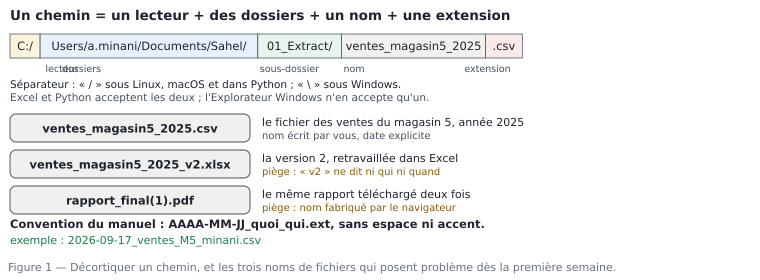

# M01.C01 — Se repérer dans un ordinateur de travail : dossiers, fichiers, extensions, chemins, sauvegardes

**Outil de ce chapitre :** Explorateur Windows (équivalents montrés : Finder sur macOS, Files sur Linux). **Durée indicative :** 4 h. **Niveau :** N1.

> **Pourquoi ce chapitre existe.** On ne commence pas un métier de la donnée par un logiciel : on le commence par une **méthode de travail**. Un analyste qui égare ses fichiers, qui écrase une donnée brute ou qui nomme ses classeurs `final_final_v3.xlsx` perd un temps considérable et rend un résultat invérifiable. Les trois heures que vous allez y consacrer vous en rendront des centaines sur les vingt et un modules suivants — et, en entreprise, elles vous éviteront de recompter un chiffre devant un directeur.

---

## 1. Objectifs du chapitre

À la fin de ce chapitre, vous saurez :

1. **Nommer** les quatre parties d'un chemin (`lecteur · dossiers · nom · extension`) et **écrire** un chemin sans faute sous Windows, macOS et Linux ;
2. **Organiser** un dossier de travail conforme à la convention du manuel (`01_brut`, `02_propre`, `03_analyse`, `04_livrables`, `90_journal`) ;
3. **Reconnaître** une extension et dire quel logiciel l'ouvre, quel format la remplace, et ce que le format garantit ou ne garantit pas ;
4. **Sauvegarder** avec la règle 3-2-1 et **vérifier** qu'une sauvegarde est utilisable (une sauvegarde non testée n'est pas une sauvegarde) ;
5. **Retrouver** un fichier perdu en moins de deux minutes avec la recherche par nom, par date et par contenu.

---

## 2. Pourquoi cette notion est importante

**Situation 1 — le fichier disparu.** Un auditeur demande, trois ans plus tard, le détail d'un chiffre figurant dans un rapport que vous avez produit. Vous retrouvez le rapport (PDF). Le classeur qui l'a calculé est sur un poste retiré du réseau, dans un dossier `Bureau/Nouveau dossier (2)`. Le chiffre devient indéfendable. En entreprise, un chiffre indéfendable se transforme vite en décision annulée — ou en perte de crédibilité pour la personne, pas pour l'outil.

**Situation 2 — l'écrasement.** Vous recevez `ventes_2025.csv`. Vous « rangez » les colonnes directement dans ce fichier, vous enregistrez. Le fichier source n'existe plus. Toute correction ultérieure — le montant que le directeur conteste — devient une reconstitution, pas un calcul. La règle que vous allez apprendre (toujours partir du brut, ne jamais l'abîmer) est la plus rentable de tout le module.

**Situation 3 — le nom qui ment.** `rapport_mensuel.xlsx` reçu le 4 du mois, `rapport_mensuel (2).xlsx`, `Rapport Mensuel FINAL.xlsx` : trois fichiers, un seul bon, personne pour trancher. La moitié des erreurs de reporting dans les petites structures viennent d'un fichier mal nommé, mal daté ou mal placé — pas d'un mauvais calcul.

> **Dans les faits.** Dans les audits de systèmes d'information, le constat revient sous un nom : *provenance* (savoir d'où vient un chiffre). Une étude publiée sur la qualité des données en PME africaines de distribution situe entre 20 et 35 % du temps d'analyse la seule reconstitution du contexte d'un fichier. Ce temps, une arborescence et un journal le suppriment.

---

## 3. Explication simple

Votre ordinateur est une **ville de fichiers**. Chaque fichier est une maison ; il n'a pas de sens tout seul, il a une **adresse**. L'adresse d'un fichier se lit de la gauche vers la droite, du plus grand au plus petit :

- le **lecteur** (ou la racine) : le quartier — `C:\` sous Windows, `/` sous Linux et macOS ;
- les **dossiers** : la rue, puis le numéro de rue — `Users\a.minani\Documents\Sahel\01_brut\` ;
- le **nom du fichier** : la maison — `ventes_magasin5_2025` ;
- l'**extension** : la forme de la porte, qui indique comment entrer — `.csv`, `.xlsx`, `.pdf`.

Un **dossier** est un conteneur, rien de plus. Il n'y a pas de « vraie » hiérarchie dans le disque : un fichier déplacé change d'adresse, point. C'est pour cela que les liens (« raccourcis », « alias ») se cassent quand on déplace le fichier cible.

Deux réflexes résument le chapitre :

1. **Un fichier = une adresse + un nom qui dit la vérité.** Si le nom dit `final`, il ment : un fichier de données se nomme par sa date et son contenu.
2. **Un dossier = un rôle, pas une personne.** On range par *étape du travail* (brut → propre → analyse → livrables), pas par logiciel ni par collègue.

---

## 4. Vocabulaire essentiel

| Français — English | Définition simple | Piège à éviter |
|---|---|---|
| **Dossier — folder / directory** | Conteneur de fichiers et d'autres dossiers. | Un dossier ne protège rien : il n'empêche ni l'écrasement ni la suppression. |
| **Chemin — path** | Adresse complète d'un fichier ou d'un dossier. | Chemin **absolu** (complet, depuis la racine) ≠ chemin **relatif** (depuis le dossier courant). Les scripts, eux, parlent surtout en relatif. |
| **Séparateur — separator** | Caractère qui sépare les dossiers : `\` sous Windows, `/` sous Linux/macOS. | Dans un script, `C:\new\data.csv` est un piège classique : `\n` est un retour à la ligne. On écrit `C:/new/data.csv` ou `r"C:\new\data.csv"`. |
| **Extension — extension** | suffixe après le dernier point, qui indique le format. | Windows masque les extensions par défaut : `rapport.pdf.exe` s'affiche `rapport.pdf` (classique des rançongiciels). À désactiver le masquage, tout de suite. |
| **Format** | Règle d'écriture des octets d'un fichier (CSV, XLSX, PDF…). | Le format décide de ce qui est **conservé** : un CSV ne conserve ni formats, ni formules, ni couleurs. |
| **Arborescence — tree** | Organisation des dossiers en arbre. | Une arborescence trop profonde (plus de 4 niveaux) n'est plus parcourue ; trop plate, elle devient un dépotoir. |
| **Sauvegarde — backup** | Copie du travail sur un autre support, restaurable. | Un dossier `OneDrive`/`Dropbox` **synchronisé** n'est pas une sauvegarde : une suppression se propage. |
| **Versionnage — versioning** | Conservations numérotées et datées des états d'un fichier. | `v1`, `v2`, `final` ne sont pas des versions : il faut une **date** et un **auteur**. |
| **Journal — log** | Fichier texte qui note ce que vous avez fait, dans l'ordre. | Sans journal, personne (vous, dans trois mois) ne peut rejouer le travail. |
| **Métadonnées — metadata** | Informations sur le fichier : auteur, date de création, taille, logiciel. | Un PDF sans métadonnées de source est un document non vérifiable. |

---

## 5. Cours approfondi

### 5.1 Les quatre façons d'écrire une adresse

Sous **Windows**, le séparateur usuel est l'antislash :

```
C:\Users\a.minani\Documents\Sahel\01_brut\ventes_2025.csv
│   │             │          │      │        │
│   utilisateur  racine pro| dossier de travail | étape | fichier
lecteur                    (étape 1)
```

Sous **Linux** et **macOS**, le séparateur est le barre oblique, et il n'y a pas de lecteur :

```
/home/amina/Documents/Sahel/01_brut/ventes_2025.csv
/Users/amina/Documents/Sahel/01_brut/ventes_2025.csv
```

Le **point** (`.`) désigne le dossier courant, **deux points** (`..`) le dossier parent. Ces deux notations sont le vocabulaire de base des logiciels de données : quand on vous demande « le fichier `01_socle_donnees/data/brut/ventes_brutes.csv`, depuis le dossier du projet », on vous demande un chemin relatif.

À connaître aussi :

- **chemin réseau** : `\\serveur-compta\exports\ventes.csv` (Windows) ou `smb://serveur/exports` (macOS) — un lecteur réseau est une porte vers une autre machine, pas un disque local ;
- **URL fichier** : `file:///C:/Users/.../ventes.csv`, que les navigateurs et certains logiciels affichent ;
- **caractères interdits** sous Windows : `< > : " / \ | ? *`. Les accents et les espaces sont *autorisés* mais déconseillés dans les fichiers de travail : ils cassent scripts, liens et imports, et s'affichent mal chez le destinataire.

> **Définition.** **Chemin — path** — l'adresse complète d'un fichier ou d'un dossier. Deux écritures coexistent : le chemin **absolu** (*absolute path*) part de la racine du disque et fonctionne de n'importe où ; le chemin **relatif** (*relative path*) part du dossier où l'on se trouve et fonctionne tant que l'on ne bouge pas. Un script choisit l'un des deux et s'y tient : les mélanger donne une adresse qui marche sur un poste et nulle part ailleurs.

> **Attention.** Les antislashs ne sont pas neutres. `C:\nouveau\data.csv` est une adresse Windows valide, mais dans un langage de programmation la séquence `\n` devient un saut de ligne et le chemin part en vrille. Réflexe : barres obliques, ou fonction de jointure de chemin fournie par l'outil, jamais accumulation de antislashs à la main.

### 5.2 Extensions : ce que chaque format protège

| Extension | Ce que c'est | Ce qu'il faut savoir |
|---|---|---|
| `.csv` | texte brut, une ligne = une ligne du tableau, colonnes séparées par un caractère (`;` ou `,`). | Léger, universel, **sans mise en forme ni formule** ; le séparateur et l'encodage doivent être connus ou devinés (M01.C04). |
| `.xlsx` | classeur Excel : plusieurs feuilles, formats, formules. | Riche mais « boîte noire » : binaire, difficile à diffuser et à tracer. C'est un fichier d'**usage**, pas un fichier de **référence**. |
| `.ods` | classeur LibreOffice Calc. | Équivalent libre de `.xlsx` ; attention aux fonctions non traduites lors des allers-retours. |
| `.txt` | texte brut. | Un fichier de données en `.txt` est un `.csv` qui ne dit pas son nom : il faut connaître son séparateur. |
| `.json` | texte structuré, par paires clé/valeur imbriquées. | Format roi des échanges entre logiciels ; se lit à l'œil, se charge en une ligne dans les outils d'analyse. |
| `.parquet` | binaire columnaire compressé (vu en M08 et M24). | Beaucoup plus petit et plus rapide que le CSV sur les gros volumes ; pas éditable à la main. |
| `.pdf` | document figé pour l'impression et la signature. | Excellent pour livrer, mauvais pour transmettre de la donnée : copier un tableau d'un PDF produit des lignes cassées. |
| `.zip`, `.7z`, `.rar` | conteneurs compressés. | À l'extraction, le chemin d'origine peut être conservé… ou tout se retrouver dans un seul dossier. À vérifier. |

> **Définition.** **Extension** — *file extension* — les lettres placées après le dernier point du nom, qui indiquent le **format** du fichier, donc le logiciel capable de l'ouvrir et ce que ce logiciel va y trouver. Le contenu réel est indépendant de l'extension : renommer un `.csv` en `.xlsx` ne convertit rien, cela rend seulement le fichier difficile à ouvrir.

> **Attention.** Windows masque les extensions connues. Conséquence directe : un fichier `tarif_fournisseur_peinture.csv` reçu d'un logiciel métier peut être en réalité un `.xls` (l'ancien format binaire) qui **s'ouvre** dans Excel mais que vos scripts ne liront pas. Réflexe professionnel : afficher les extensions (Explorateur → Affichage → « Extensions de noms de fichiers ») **le premier jour**, et vérifier le contenu d'un fichier avec un éditeur de texte quand un doute surgit.

> **Définition.** **Arborescence — tree** — l'organisation des dossiers en arbre, depuis un point d'entrée unique. Ce qui la rend vivable n'est pas son élégance mais sa **profondeur** : au-delà de quatre niveaux, plus personne ne descend, et les fichiers se déposent n'importe où. Règle d'usage : un niveau = une nature de chose (brut, propre, livré), jamais un niveau = un mois.

### 5.3 L'arborescence de travail du manuel — à copier

Tous les modules de ce manuel travaillent dans la même structure, créée au chapitre 1 et jamais modifiée ensuite :

```
Sahel/
├── 00_doc/                ← dictionnaire des données, NOTICE, captures d'écran
├── 01_brut/               ← fichiers reçus, tels quels, en lecture seule
├── 02_propre/             ← fichiers après nettoyage, jamais une retouche du brut
├── 03_analyse/            ← scripts, requêtes, tableaux de travail
├── 04_livrables/          ← ce qui sort vers les autres : PDF, classeurs, exports
├── 90_journal/            ← journal_datation.txt, journal_transformations.txt
└── 99_archive/            ← ce qui ne sert plus mais qui ne se supprime pas
```

Quatre règles rendent cette structure efficace :

1. **Le numéro devant le nom** impose l'ordre d'affichage et donc l'ordre de travail (l'Explorateur trie par nom, pas par importance).
2. **Le brut est en lecture seule** : clic droit → Propriétés → « Lecture seule ». Toute tentative d'enregistrement dessus échoue, ce qui est exactement le but. Un fichier brut modifié est une preuve perdue.
3. **Rien ne sort de `04_livrables/` sans date dans le nom** : `2026-09-17_note_CA_M5_minani.pdf`.
4. **On archive, on ne supprime pas.** `99_archive/` coûte de la place ; une erreur regrettée coûte un poste.

### 5.4 Nommage des fichiers : la grammaire complète

`AAAA-MM-JJ_quoi_qui_etat.ext` — quatre champs, un seul séparateur, aucun accent :

- **`AAAA-MM-JJ`** = date des **données**, pas date du travail. `2025` pour l'année des ventes. Si c'est un extrait mensuel : `2025-12`.
- **`quoi`** = contenu, en mots-clés courts : `ventes`, `tarifs`, `objectifs`.
- **`qui`** = auteur ou périmètre : `M5` (magasin 5), `minani` (vous).
- **`etat`** = `brut`, `propre`, `v1`, `corrigé`. Le mot `final` n'existe pas dans cette grammaire.

Exemples justes : `2025_ventes_M5_brut.csv`, `2025_ventes_M5_propre.csv`, `2026-09-17_note_CA_M5_minani_v2.pdf`.
Exemples fautifs, et pourquoi : `ventes.xlsx` (aucune date, aucune période, état inconnu), `Nouveau Microsoft Excel Worksheet.xlsx` (le nom par défaut du logiciel : illisible dans six mois), `rapport final (1).pdf` (fabriqué par le navigateur, deux sens possibles), `ventes_magasin5_2025 - Copie.csv` (une copie non datée est un doublement involontaire — le défaut que vous rencontrerez en M01.C03).

> **Conseil professionnel.** Les analystes expérimentés ajoutent un **préfixe de statut** aux fichiers en attente : `WIP_` (work in progress) ou `HOLD_`. En liste, le statut saute aux yeux ; dans un dossier partagé, cela évite qu'un collègue prenne votre brouillon pour un livrable. Le préfixe est retiré à la sortie du fichier, jamais avant.

> **Définition.** **Nommage — naming convention** — grammaire écrite des noms de fichiers. Un nom correct répond dans l'ordre fixé par l'équipe à quatre questions : qui produit, de quoi il s'agit, pour quelle période, à quel état. Ce n'est pas une question de goût : le tri alphabétique devient un tri chronologique, et un programme retrouve le fichier sans avoir à demander une liste.

### 5.5 Sauvegarder : la règle 3-2-1, et son test

**3** copies de vos données, sur **2** supports différents, dont **1** hors site. Concrètement, pour un poste de travail :

1. le disque de l'ordinateur (copie de travail) ;
2. un disque dur externe ou un partage réseau de l'entreprise, débranché après copie (copie locale froide) ;
3. un espace distant — cloud d'entreprise, serveur mutualisé (copie hors site).

Trois précisions qui font la différence entre une politique et un résultat :

- **Une synchronisation n'est pas une sauvegarde.** OneDrive, Dropbox, Google Drive, Nextcloud : ils propagent la suppression et l'écrasement en quelques secondes. Ils sauvegardent *si* l'historique de versions est activé et conservé assez longtemps — vérifiez la durée (souvent 30 jours, quelquefois 1).
- **Une sauvegarde non testée n'existe pas.** Le rituel professionnel : une fois par mois, restaurer **un** fichier dans un dossier `test_restauration/`, l'ouvrir, vérifier le nombre de lignes, supprimer. Douze minutes. C'est ce qui sépare une équipe qui récupère d'une équipe qui pleure.
- **Chiffrer les copies mobiles.** Un disque externe dans un sac, contenant des données clients, est un incident de conformité en puissance. BitLocker (Windows), le chiffrement de disque (macOS), VeraCrypt (les deux) se règlent en une fois.

> **Définition.** **Rétention** — *retention period* — durée pendant laquelle on conserve un fichier et ses versions. En comptabilité et en fiscalité, les pièces justificatives se conservent **10 ans** dans la zone OHADA (dont le Burkina Faso) ; un jeu de données d'analyse servant à justifier un chiffre publié relève de la même prudence.

> **Attention.** Un dossier **synchronisé** n'est pas une sauvegarde. La synchronisation reproduit fidèlement l'écrasement, la suppression accidentelle et le chiffrement par rançongiciel sur toutes les copies. Une sauvegarde se juge à trois choses : un autre support, une durée de conservation, un test de restauration daté.

### 5.6 Retrouver un fichier : trois méthodes, dans l'ordre

1. **Par nom** : dans la barre d'adresse de l'Explorateur ou avec `Alt + F`, taper un fragment, en acceptant les jokers : `2025*ventes*`, `*.csv`. Sous Linux/macOS : `find . -iname "*ventes*2025*"`.
2. **Par date et taille** : recherche avancée sur `datemodifiee:2026-09-17 taille:>1mo` (Explorateur) ou `ls -lhS` (terminal). Un fichier de données récent et volumineux se débusque en dix secondes.
3. **Par contenu** : dans Excel/LibreOffice on ne cherche pas, on cherche **le fichier qui contient ce mot** — Windows Indexation (Options de recherche → « Propriétés et informations de fichier ») ou, méthode radicale, `grep -l "Sahel Distribution" *.txt`.

Dernier recours, celui qui marche toujours : le **journal**. Si chaque action est notée dans `90_journal/journal_datation.txt`, le fichier ne peut pas être perdu — il est décrit. C'est le prix du réflexe du §5.7.

### 5.7 Le journal : votre première obligation professionnelle

Un fichier texte, une ligne par action, jamais réécrit :

```
2026-09-17 09:12  a.minani  réception mail « export ventes »  →  01_brut/2025_ventes_M5_brut.csv  (489 lignes, 32 Ko, md5 9c1f…)
2026-09-17 09:14  a.minani  chmod lecture seule 01_brut/  ; copie de travail créée 02_propre/2025_ventes_M5_propre.csv
2026-09-17 10:02  a.minani  suppression de 9 lignes strictement identiques (doublons) → 480 lignes ; total TTC avant 36 339 317, après 36 073 185 FCFA
```

Trois colonnes suffisent : **quand · qui · quoi**. Ajoutez-y la **taille** ou le **nombre de lignes** à chaque entrée : c'est ce qui permettra, plus tard, de prouver qu'aucune ligne n'a été perdue sans le vouloir. Le hash `md5` est facultatif au début, indispensable en M05 : c'est l'empreinte numérique du fichier, deux fichiers de même empreinte sont identiques au bit près.

> **Boîte à outils.**
> **Windows** — Afficher les extensions : Explorateur → Affichage → Afficher → « Extensions de noms de fichiers ». Recherche avec jokers : `*` et `?`. Propriétés → « Lectures/seulement ». Historique de versions : clic droit → « Restaurer les versions précédentes ».
> **macOS** — Finder → « Préférences → Avancé → afficher les extensions ». Historique : Time Machine.
> **Linux / terminal** — `ls -l`, `cp -p` (préserve les dates), `md5sum fichier.csv`, `grep -l "motif" *.csv`, `diff -u a.csv b.csv`.
> **Raccourcis à mémoriser** — `Ctrl+Shift+N` nouveau dossier (Windows), `F2` renommer, `Ctrl+F` rechercher, `Alt+Entrée` propriétés.

---

> **Définition.** **Journal — log** — fichier texte horodaté qui enregistre, dans l'ordre, ce qui a été fait sur les données. Un journal utile se lit à rebours : on part du chiffre publié et l'on remonte jusqu'à l'action qui l'a produit. S'il ne permet pas de refaire le travail à partir de rien, ce n'est pas un journal, c'est un brouillon.

> **À retenir.** Le poste de travail fait partie de la qualité : un fichier introuvable est une donnée perdue, un fichier écrasé est une preuve perdue. Les quatre réflexes du chapitre — adresse absolue ou relative mais jamais les deux, extension visible, arborescence peu profonde à un niveau par nature de chose, nom qui se trie tout seul — coûtent douze minutes une fois et en font gagner des centaines chaque année.

## 6. Exemple concret : la même donnée en trois formats

Le fichier de l'atelier de ce module pèse **489 lignes** et **13 colonnes** au format CSV. Regardons ce que chaque format en conserve, sur la première ligne :

| Format | Ce que la ligne contient | Taille approximative | Ouvrable par |
|---|---|---|---|
| `2025_ventes_M5_brut.csv` | `T05-250101-075845;2025-01-01;11:01;Magasin 5 — Kaya Marché;Moussa Ilboudo;10857;…` — tout en texte, séparé par des points-virgules | 32 Ko | n'importe quoi, y compris un éditeur de texte |
| `…_propre.xlsx` | les mêmes valeurs, plus : dates réellement typées, colonne figée, filtre actif, un onglet « dictionnaire » | 46 Ko | Excel, LibreOffice, Power BI |
| `…_note.pdf` | le **résultat** (un total, un graphique), plus aucune ligne de détail | 18 Ko | tout le monde, mais on ne peut plus recalculer |

Le CSV est le seul des trois que vous pouvez **relire ligne par ligne** avec un outil qui n'existe pas encore dans vingt ans. C'est la raison pour laquelle tous les socles de données sérieux, y compris celui de ce manuel, gardent le brut en texte : `ventes_brutes.csv` fait 28,5 Mo pour 243 360 lignes, et chacun peut l'ouvrir avec un bloc-notes. Le `.xlsx` est fait pour le travail quotidien, le `.pdf` pour la décision.

---

## 7. Démonstration pas à pas : préparer le poste en 12 minutes

Faites-le réellement. Ce que vous construisez ici sert jusqu'au module 22.

**Étape 1 — Rendre les extensions visibles (30 s).**
Windows : onglet **Affichage** → **Afficher** → cochez **Extensions de noms de fichiers**. macOS : Finder → **Réglages…** → **Avancé** → cochez **Afficher toutes les extensions**.

**Étape 2 — Créer l'arborescence (3 min).**
Dans `Documents`, créez le dossier `Sahel`, puis les six sous-dossiers numérotés (`00_doc`, `01_brut`, `02_propre`, `03_analyse`, `04_livrables`, `90_journal`, `99_archive`). Sous Windows, `Ctrl+Maj+N`, puis `Entrée` et `Entrée` enchaîne les créations.

**Étape 3 — Déposer le fichier brut (1 min).**
Copiez `ventes_magasin5_2025.csv` depuis `formation-data-bi/01_socle_donnees/data/projection/` vers `01_brut/`, puis **renommez-le** selon la grammaire : `2025_ventes_M5_brut.csv`. Clic droit → Propriétés → cochez **Lecture seule**.

**Étape 4 — Vérifier la nature réelle du fichier (2 min).**
Ouvrez-le avec le **Bloc-notes** (pas avec Excel). Vous devez voir la ligne d'en-tête puis des lignes séparées par des `;` :

```
n_ticket;date;heure;magasin;vendeur;client;produit;categorie;quantite;prix_unitaire_ht;remise;montant_ht;montant_ttc
T05-250101-075845;2025-01-01;11:01;Magasin 5 — Kaya Marché;Moussa Ilboudo;10857;Plâtre de construction 25 kg — réf 1;Matériaux;11;4500;0.03;48015;56 658
```

Notez deux choses, visibles sans logiciel d'analyse : la **date** de la première ligne est au format international `2025-01-01`, mais ailleurs dans le fichier des dates sont écrites `12/01/2025` — et le **montant** de dernière colonne est `56 658`, avec un espace : ce n'est pas un nombre, c'est du texte. Vous venez de faire, à l'œil, le travail du chapitre 3.

**Étape 5 — Le premier comptage, sans tableur (2 min).**
Dans le Bloc-notes : `Ctrl+G` va à la fin, notez le numéro de ligne : **490** (489 lignes de données + 1 en-tête). Sous Linux/macOS, ou dans le terminal Git de Windows :

```bash
wc -l 2025_ventes_M5_brut.csv        #  490
awk -F';' 'NR>1 {s+=$13} END{print s}' 2025_ventes_M5_brut.csv   # ne marche pas : le champ 13 contient un espace
```

Ce second résultat — faux, ou carrément une erreur — est volontairement laissé là : il vous montre qu'un fichier de données doit être **typé** avant d'être **somme**. Vous le réglerez en M01.C04.

**Étape 6 — Créer le journal (1 min).**
Dans `90_journal/`, fichier `journal_datation.txt`, avec les trois colonnes, consignez les cinq étapes ci-dessus. Format imposé par le manuel : `AAAA-MM-JJ HH:MM auteur action (constat chiffré)`.

**Étape 7 — Sauvegarder et tester la restauration (3 min).**
Copiez `Sahel/` sur un second support (disque externe ou répertoire `sauvegarde/` d'un cloud d'entreprise). Depuis ce support, restaurez **un** fichier dans `Sahel/test_restauration/`, comptez ses lignes (`wc -l` ou fin du Bloc-notes) : vous devez retrouver 490. Supprimez le dossier de test. Vous venez de faire la seule chose qui compte : prouver que votre sauvegarde s'utilise.

---

## 8. Erreurs fréquentes

| Symptôme | Cause | Correction |
|---|---|---|
| « Fichier introuvable » après avoir renommé un dossier parent | Un lien, un script ou un onglet Excel pointe sur l'ancien chemin. | Ne renommez jamais les **six dossiers numérotés** ; renommez les fichiers. Si un chemin est codé dans un script, documentez-le dans le journal. |
| Deux fichiers identiques, des totaux différents | Copie créée puis retouchée séparément (« - Copie », « (2) »). | Un seul fichier de travail par sujet ; les autres sont archivés avec un préfixe `ARCHIVE_` et une date. |
| Le script lit 0 ligne dans un `.xlsx` renommé `.csv` | L'extension ne convertit pas le contenu. | Exporter **depuis** le logiciel vers le format voulu (Enregistrer sous → CSV), jamais renommer. |
| Un fichier de 489 lignes devient 490 après enregistrement | Excel a réécrit l'en-tête ou ajouté une ligne vide. | Comparer le nombre de lignes **avant et après** chaque enregistrement : c'est la première ligne du journal de transformation. |
| Le PDF d'un livrable change de pagination chez le destinataire | Polices non intégrées. | Dans l'export, cocher « incorporer les polices » ; vérifier en ouvrant le PDF dans un autre lecteur. |
| La sauvegarde du jour est vide | Le disque externe était débranché, et la tâche de copie a échoué en silence. | Tâche de sauvegarde qui **écrit un journal** + une vérification hebdomadaire de ce journal. |

---

## 9. Bonnes pratiques professionnelles

- [ ] Extensions visibles sur le poste de travail, dès le premier jour.
- [ ] Arborescence à six dossiers numérotés, identique pour tous les sujets.
- [ ] Réception = copie dans `01_brut/` + lecture seule + entrée dans le journal.
- [ ] Noms de fichiers datés, sans accent, sans espace, sans le mot `final`.
- [ ] Un seul fichier de travail par sujet ; les états antérieurs dans `99_archive/`.
- [ ] 3-2-1 pour la sauvegarde, avec une restauration testée chaque mois.
- [ ] Chiffrement des supports amovibles contenant des données clients.
- [ ] Journal de transformation obligatoire pour tout chiffre destiné à autrui.

---

## 10. Exercice guidé — ranger un dossier de travail réel

**Point de départ.** Un collègue vous envoie un dossier compressé contenant, dans le désordre :

```
Nouveau Microsoft Excel Worksheet.xlsx
export caisse (1).csv
export caisse.csv
ventes_2025.xlsx
rapport_final_final.pdf
```

Faites-le avec moi, une décision à la fois.

1. **Ne rien ouvrir.** On commence par ce que l'on peut savoir sans risque : la liste, les tailles, les dates. Sous Windows : Affichage → Détails, trier par Date. Notez ces trois informations : c'est votre matière de travail.
2. **Dégager les doublons évidents.** `export caisse.csv` et `export caisse (1).csv` : le `(1)` est la marque du navigateur, qui renomme à la deuxième réception de la même URL. Comparez les tailles : si elles sont identiques, l'empreinte aussi l'est presque certainement ; vérifiez avec `md5sum` (ou Propriétés → détails). **Décision :** on garde une copie, on archive l'autre avec une date — on ne supprime pas avant d'avoir vérifié le contenu.
3. **Identifier le fichier utile.** `Nouveau Microsoft Excel Worksheet.xlsx` est suspect : un nom par défaut veut dire un travail non enregistré ailleurs. Ouvrez-le : s'il contient des données réelles, il est **brut** (il aurait dû être enregistré dans `01_brut/`) ; s'il est vide, il va dans `99_archive/` et non à la corbeille.
4. **Traduire en convention.** Chaque fichier gardé reçoit un nom correct : `2025_ventes_M5_brut.csv`, `2025_ventes_M5_brut.xlsx` (si le classeur contient autre chose que le CSV), `2026-09-12_note_CA_M5_brut.pdf`. Le **format** reste inchangé : on ne convertit pas un brut.
5. **Placer.** Les `.csv` et `.xlsx` sources → `01_brut/` (lecture seule). Le PDF, qui est une **sortie**, → `04_livrables/` s'il vient de vous, sinon `99_archive/` avec une note : un livrable reçu n'est pas une source.
6. **Écrire le journal.** Six lignes, une par décision prise, avec le motif : « `export caisse (1).csv` : empreinte identique à `export caisse.csv` → archivé `2026-09-17_export_caisse_dupli_99archive.csv` ».

**Résultat attendu :** plus aucun nom ne contient `final`, `Nouveau`, `Copie` ou `(1)`. Le nombre de fichiers dans `01_brut/` est **2**, et chacun est en lecture seule. Si votre `01_brut/` contient trois fichiers ou plus, vous avez gardé un doublon ou placé une sortie parmi les sources.

---

## 11. Exercices autonomes

**Exercice 1.1 (★) — Les adresses.** Écrivez, pour un même fichier de votre poste, le chemin absolu sous Windows, le chemin absolu sous Linux, le chemin relatif depuis `Documents`, et le nom complet du fichier. Que change le passage de l'un à l'autre ? *(résultat attendu : 4 lignes, seule la partie « dossier » varie ; l'extension reste identique)*

**Exercice 1.2 (★) — Chasse aux extensions.** Listez tous les fichiers de votre `Téléchargements` modifiés cette semaine et regroupez-les par extension. Pour chaque groupe, dites en une phrase ce que ce format **ne conserve pas**. *(attendu : au moins 4 groupes ; PDF → pas de calcul ; PNG → pas de texte ; XLSX → pas d'historique de la source ; CSV → pas de types)*

**Exercice 1.3 (★★) — Reconstruction d'histoire.** Un dossier contient `CA 2025.xlsx` (taille 1,2 Mo, modifié le 08/01/2026) et `CA 2025 (2).xlsx` (940 Ko, modifié le 03/01/2026). Rédigez trois hypothèses expliquant l'écart et, pour chacune, **la vérification** qui l'infirmé ou la confirme. *(attendu : 3 hypothèses + 3 tests — nombre de feuilles, nombre de lignes par feuille, présence d'une table pivot, empreintes)*

**Exercice 1.4 (★★) — La sauvegarde qui ment.** Vous activez la corbeille, supprimez `01_brut/2025_ventes_M5_brut.csv`, le restaurez. Puis vous synchronizez avec le cloud **après** la suppression et attendez 24 h. Le fichier est-il récupérable, et grâce à quoi précisément ? *(attendu : oui si l'historique de versions couvre 24 h ; non si la rétention est inférieure ; la réponse doit citer la rétention en jours, pas « il y a un cloud »)*

**Exercice 1.5 (★★) — Journal.** Reprenez l'exercice 1.3 et consignez-le en 6 lignes de journal. Un pair doit pouvoir rejouer votre travail sans vous parler. *(attendu : chaque ligne commence par date+heure, puis auteur, puis action, puis constat chiffré)*

---

## 12. Correction détaillée

**Exercice 1.1.** Supposons le fichier `C:\Users\a.minani\Documents\Sahel\01_brut\2025_ventes_M5_brut.csv`.
- absolu Windows : `C:\Users\a.minani\Documents\Sahel\01_brut\2025_ventes_M5_brut.csv`
- absolu Linux (même arborescence sur un poste libre) : `/home/a.minani/Documents/Sahel/01_brut/2025_ventes_M5_brut.csv`
- relatif depuis `Documents` : `Sahel/01_brut/2025_ventes_M5_brut.csv`
- nom complet : `2025_ventes_M5_brut.csv` (nom + extension)
Ce qui change : la **racine** et le **séparateur**. Ce qui ne change pas : la structure des dossiers et le nom — c'est ce qui permet d'écrire un script portable en utilisant des chemins relatifs et le caractère `/`.

**Exercice 1.2.** Réponses attendues (non exhaustives) : `.pdf` ne conserve ni le calcul ni la donnée d'origine, seulement l'apparence ; `.png`/.`jpg` conservent une image d'un tableau, pas le tableau ; `.xlsx` conserve formules et mise en forme mais son contenu binaire n'est pas lisible sans le logiciel, et l'origine du fichier n'y est pas tracée ; `.csv` conserve des caractères, donc rien des types : une date y est une suite de signes, un montant peut y être du texte. Un apprenant qui répond « le CSV ne conserve que du texte » a juste ; s'il ajoute « donc les nombres peuvent être faux », il a compris l'enjeu du chapitre 4.

**Exercice 1.3.** Trois hypothèses et leurs tests :
1. *Le plus gros fichier contient des feuilles supplémentaires (graphiques, historique).* → ouvrir les deux, comparer le nombre d'onglets et, dans chaque onglet, `Ctrl+Fin` pour voir la dernière cellule utilisée.
2. *Le second est un enregistrement antérieur, plus petit car moins de lignes.* → comparer le nombre de lignes de la feuille de données (sélectionner la colonne A, lire le compteur de la barre d'état).
3. *Le second est un sous-ensemble filtré (lignes masquées au lieu de supprimées).* → vérifier si des filtres sont actifs et si des numéros de ligne se suivent pas à pas ; une ligne masquée saute dans la numérotation.
Ce qui **n'est pas** une vérification recevable : « l'œil » sur la mise en forme, ou le nom. Toute réponse doit contenir une manipulation qui produit un nombre.

**Exercice 1.4.** La corbeille locale a restauré le fichier, donc à cet instant tout va bien. Après synchronisation *post-suppression*, l'état supprimé est propagé au serveur. Récupération possible **uniquement** si la **rétention d'historique** du service couvre 24 h (elle est de 30 jours sur les offres classiques d'entreprise, souvent moins sur les offres gratuites) — sinon le fichier n'existe plus que sur le disque externe, c'est-à-dire la copie froide. Réponse attendue : citer la rétention en jours et le nom du service, et conclure par la règle : *une synchronisation n'est pas une sauvegarde, la copie froide l'est.*

**Exercice 1.5.** Modèle de journal, avec les quatre constantes imposées (date-heure, auteur, action, constat) :

```
2026-09-17 11:04 a.minani ouverture 2 fichiers CA 2025.xlsx  → onglets : 4 vs 2 ; dernière cellule utilisée : A1:F4800 vs A1:F4790
2026-09-17 11:07 a.minani test filtres  → fichier (2) : filtre « magasin = 5 » actif, 10 lignes masquées
2026-09-17 11:09 a.minani décision  → CA 2025.xlsx = source complète ; CA 2025 (2).xlsx = extrait, archivé avec date
```

Correction : est jugé conforme un journal qui (1) ne contient aucun jugement non chiffré, (2) permet de retrouver la décision prise, (3) horodate chaque ligne. Un journal du type « j'ai rangé les fichiers » est refusé au projet du module.

---

## 13. Mini-projet M01.P1 — « Mon poste prêt pour 22 modules » (45 min)

Livrable unique : un dossier `Sahel/` conforme, une capture d'écran de l'arborescence développée (les six sous-dossiers, fichiers visibles, extensions affichées), et un `journal_datation.txt` d'au moins 12 lignes.

Critères de réussite, auto-valuables :

| # | Critère | Vérification |
|---|---|---|
| 1 | Six dossiers numérotés présents, aucun autre à la racine | liste |
| 2 | Fichier brut présent dans `01_brut/`, nommé selon la grammaire, en lecture seule | Propriétés |
| 3 | Zéro occurrence de `final`, `Nouveau`, `(1)`, `Copie`, espace ou accent dans les noms | recherche |
| 4 | Journal : 12 lignes minimum, chaque ligne datée, signée, avec un constat chiffré | lecture |
| 5 | Test de restauration écrit dans le journal, avec le nombre de lignes vérifié (490) | lecture |

Ce mini-projet est noté sur 10 et entre dans le bilan de compétences du module. Le même livrable est réutilisé en M04 (journal de nettoyage) et en M21 (dossier de soutenance) : ne le jetez pas.

---

## 14. Résumé du chapitre



Un fichier n'a d'existence que par son **adresse** et par le **format** qu'il prétend avoir. L'adresse se lit en quatre morceaux ; le format décide de ce qui est conservé — et le CSV, qui ne conserve que des caractères, est le plus fragile et le plus durable à la fois. La méthode tient en trois réflexes : ne jamais abîmer le brut, nommer par date et contenu, consigner chaque décision dans un journal chiffré. La sauvegarde n'existe que si sa restauration a été testée, à froid, hors site. Le chapitre suivant quitte le fichier pour son sens : ce qu'une ligne de données veut dire, et ce qu'elle ne dit pas.

---

## 15. À retenir

> **À retenir.**
> 1. **Extension ≠ conversion** : renommer ne change pas le contenu d'un fichier.
> 2. **Le brut ne se touche pas** : lecture seule, et l'on travaille toujours sur une copie nommée `…_propre`.
> 3. **Nommage : `AAAA-MM-JJ_quoi_qui_etat.ext`**, sans accent, sans espace, sans `final`.
> 4. **Une synchronisation n'est pas une sauvegarde** : 3-2-1, et l'on teste une restauration chaque mois.
> 5. **Sans journal chiffré, un chiffre n'a pas de preuve** — et donc pas de valeur en entreprise.

---

## 16. Évaluation formative (auto-correction, 6 min)

1. Quel caractère sépare les dossiers dans un chemin Windows, et lequel est recommandé dans les scripts ? *( `\` pour l'Explorateur ; `/` dans les scripts, qui l'acceptent partout )*
2. Un fichier `budget.pdf` reçu par un collègue : doit-il aller dans `01_brut/` ? Justifiez. *( non : c'est un livrable d'autrui, donc `99_archive/` ou `00_doc/` avec note ; le brut est ce qui sert à **calculer**, pas ce qui résulte d'un calcul )*
3. Vrai ou faux : « un fichier copié sur OneDrive est sauvegardé ». *( faux : sans rétention d'historique suffisante, une suppression se propage )*
4. Un `.xlsx` de 940 Ko contient 4 790 lignes ; l'autre, 1,2 Mo, en contient 4 800. Quelle explication est la plus probable, et quel test la confirme ? *( extrait filtré contre fichier complet ; test : compter les lignes après suppression des filtres, comparer les empreintes des colonnes-clés )*
5. **Question ouverte :** en trois phrases, expliquez à un directeur pourquoi vous refusez de « corriger directement dans le fichier de la caisse ». *( le fichier de caisse est la preuve ; une correction dedans détruit la traçabilité et rend le chiffre contestable à bas coût ; je produis un fichier propre à côté, et le journal permet à quiconque de refaire le calcul )*
