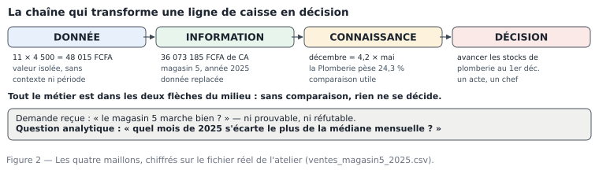

# M01.C02 — Donnée, information, connaissance, décision : ce que votre travail ajoute réellement

**Outil de ce chapitre :** papier, crayon, un tableau blanc. Aucun logiciel. **Durée indicative :** 3 h. **Niveau :** N1.

> **L'idée du chapitre.** Personne ne paie pour des données. On paie pour une **décision prise plus juste, plus tôt**. Entre la ligne sortie d'une caisse et la décision du directeur, il y a trois transformations, et chacune a un nom, un test de validité et des erreurs typiques. Les apprendre avant de toucher Excel change durablement la qualité de votre travail : vous ne chercherez plus « un chiffre », vous chercherez le maillon manquant.

---

## 1. Objectifs du chapitre

À la fin de ce chapitre, vous saurez :

1. **Distinguer** une donnée, une information, une connaissance et une décision, et classer 10 énoncés courants dans ces quatre cases ;
2. **Formuler** une **question analytique** correcte : unité, période, périmètre, comparaison, critère de réussite ;
3. **Traduire** une demande professionnelle floue (« est-ce que ça marche bien ? ») en deux ou trois questions traitables, et **expliciter** la décision attendue ;
4. **Dire** ce qu'un chiffre ne dit pas : ce qui manque, ce qui est supposé, ce qui est caché par le choix de la moyenne ;
5. **Écrire** une note d'une page qui remonte du chiffre à la décision, sans jargon.

---

## 2. Pourquoi cette notion est importante

**Situation 1 — le tableau de bord inutile.** Un analyste passe trois semaines sur un tableau de bord de 14 indicateurs. Le directeur l'ouvre deux fois, puis plus personne. Cause unique : aucun des 14 indicateurs ne répondait à une décision précise. On ne mesure pas ce qui est mesurable, on mesure ce qui **change quelque chose**.

**Situation 2 — le chiffre juste, la conclusion fausse.** « Le magasin 5 a réalisé 36 073 185 FCFA de chiffre d'affaires en 2025. » Exact. Et totalement inerte : est-ce bien ? Est-ce mieux que 2024 ? Ce total est-il dû à trois gros clients ? Un chiffre sans comparaison autorise toutes les lectures — y compris la mauvaise, faite par le plus fort en réunion.

**Situation 3 — la bonne réponse à une mauvaise question.** On demande : « pourquoi les ventes baissent ? » L'analyste démontre que les ventes **n'ont pas baissé** en volume mais que le prix moyen a baissé. Il avait raison, il a perdu du temps, et la direction a perdu confiance, parce que la demande portait en réalité sur la **marge**. Cadrer, c'est ouvrir le mot « pourquoi » pour voir la décision cachée dessous.

> **Dans les faits.** Dans une étude restée classique sur la culture « pilotée par la donnée » (McAfee & Brynjolfsson, *Harvard Business Review*, 2012), les entreprises qui décident sur mesurabilité plutôt que sur l'intuition enregistraient environ **5 à 6 % de productivité** et **6 % de profit** de plus que les autres pour la même année. Ce n'est pas un chiffre du cours : c'est l'argument de vente de votre futur métier, et il tient en une phrase — la donnée fait gagner de l'argent quand elle **déplace une décision**.

---

## 3. Explication simple

Prenons un fait tout bête : sur un ticket du 1ᵉʳ janvier 2025 au magasin 5, onze sacs de plâtre à 4 500 FCFA.

- C'est une **donnée** : une valeur brute, enregistrée, sans commentaire. Elle ne dit rien.
- Additionnez, filtrez, daté : « magasin 5, année 2025, total des lignes facturées : **36 073 185 FCFA** » devient une **information**. Elle dit quelque chose, elle est vérifiable, mais elle ne juge pas.
- Comparez : « **décembre 2025 = 5 292 517 FCFA, mai 2025 = 1 258 801 FCFA : le meilleur mois fait 4,2 fois le pire** ». Voilà une **connaissance** : elle explique un écart et peut être contestée par des faits.
- Décidez : « **dès le 20 novembre, on double le stock de plomberie et de sacs de plâtre au magasin 5, responsable M. Bationo, budget +1,4 M FCFA** ». C'est une **décision** : elle a un acteur, une date, un coût, et elle est réversible.

Retenez la phrase qui sert de boussole dans tous les modules :

> **Une donnée sans contexte est une information manquée ; une information sans comparaison n'est pas une connaissance ; une connaissance sans décision est du travail perdu.**



---

## 4. Vocabulaire essentiel

| Français — English | Définition simple | Piège à éviter |
|---|---|---|
| **Donnée — data** | Fait brut enregistré : une valeur, une case, une ligne. | Croire qu'elle est « la réalité » : elle est ce que le système a bien voulu noter. |
| **Information** | Donnée replacée : quoi, qui, quand, combien, dans quelle unité. | Confondre avec un résultat : sans unité ni période, ce n'est pas une information. |
| **Connaissance — insight** | Information comparée, qui explique ou surprend, et dont on peut discuter. | Publier une connaissance sans sa méthode : elle devient une opinion. |
| **Décision** | Engagement : une action, un responsable, une date, des conséquences. | « Il faut regarder de plus près » n'est pas une décision. |
| **Question analytique** | Question fermée, chiffrable, qui précède toute extraction. | Écrire une question dont la réponse est un adjectif (« bon », « mauvais »). |
| **Critère de réussite** | Ce qui prouvera, à la fin, que la question a été traitée (valeur attendue, tolérance, validateur). | Ne pas le fixer avant de calculer : on se justifie après coup. |
| **Périmètre — scope** | Parties retenues : magasins, clients, périodes, types d'opérations. | Le périmètre implicite est la première cause de deux totaux différents pour « la même » question. |
| **Métrique** | Définition de calcul d'un indicateur, écrite noir sur blanc. | Deux personnes qui calculent le CA TTC avec des règles différentes sans le savoir. |
| **Indicateur — KPI** | Chiffre suivi dans le temps, rattaché à un objectif. | Un KPI sans objectif ni seuil est un nombre que l'on regarde passer. |
| **Biais de cadrage** | La question initiale oriente déjà la réponse. | Accepter la formulation du demandeur sans chercher la décision sous-jacente. |

---

## 5. Cours approfondi

### 5.1 Les quatre maillons, avec leurs tests de validité

Chaque maillon a une question de contrôle. C'est ce qui rend le travail **vérifiable** au lieu de personnel.

| Maillon | Ce qu'on ajoute | Test de validité | Défaut typique |
|---|---|---|---|
| Donnée | rien — on la recueille | la ligne existe-t-elle dans la source ? sa date est-elle la date du fait ou de la saisie ? | date de saisie prise pour date de vente |
| Information | agrégation + contexte | le total est-il reproductible avec la même définition et le même périmètre ? | « total 2025 » sans dire si les retours sont inclus |
| Connaissance | comparaison + hypothèse | l'écart survit-il à un autre calcul raisonnable ? | conclusion tirée d'une moyenne, sans regarder la médiane |
| Décision | engagement + échéance | qui, quand, avec quoi, et à quel signe saura-t-on que ça a marché ? | recommandation sans acteur ni indicateur de suivi |

La règle métier qui découle du tableau : **on ne présente jamais un maillon tout seul**. Une information s'accompagne de sa définition de calcul et de son périmètre ; une connaissance, de son test de robustesse ; une décision, de son indicateur de suivi.

> **Définition.** **Donnée — data** — un fait enregistré à un instant précis par un système, avec une unité : une valeur de case. Elle n'est pas « la réalité », elle est ce que le logiciel a bien voulu noter, et rien de plus.

> **Définition.** **Information** — une donnée replacée dans son contexte : quoi, qui, quand, combien, dans quelle unité. La même valeur cesse d'être ambiguë dès qu'on la date et qu'on la rattache à une source.

> **Définition.** **Connaissance — insight** — deux informations comparées plus une explication que l'on peut discuter. Elle se reconnaît à ce qu'elle surprend quelqu'un de compétent et qu'elle appelle une réaction.

> **Définition.** **Décision** — un engagement : une action, un responsable, une date, des conséquences assumées. C'est le seul maillon qui change l'état de l'entreprise.

### 5.2 Les six phrases d'une demande professionnelle, et comment les ouvrir

Les demandes arrivent presque toujours sous six formes. À chaque forme correspond une ouverture, à faire **avant** de toucher un fichier.

| La demande | Ce qu'elle veut dire le plus souvent | Question analytique qui en sort |
|---|---|---|
| « Est-ce que ça marche bien ? » | juger une performance contre une attente | « le CA mensuel du magasin 5 en 2025 dépasse-t-il l'objectif mensuel, et de combien ? » |
| « Pourquoi ça baisse ? » | identifier un facteur de variation | « la baisse de marge vient-elle du prix moyen, du mélange de catégories ou des remises ? » |
| « Compare-nous les magasins » | classer et expliquer les écarts | « à superficie comparable, quel écart de CA par vendeur entre magasin 5 et magasin 2 ? » |
| « Fais un tableau de bord » | suivre dans le temps un petit nombre de décisions | « quels sont les trois indicateurs dont la direction décide quelque chose chaque lundi ? » |
| « Combien on a fait ? » | un chiffre officiel, avec définition | « CA TTC encaissé, retours déduits, magasin 5, du 01/01 au 31/12/2025 : … » |
| « Tu peux me sortir ça rapidement ? » | urgence = périmètre à réduire | « que doit contenir la réponse pour être utile lundi, et que peut-on laisser de côté sans mentir ? » |

**Comment ouvrir une demande : la méthode des trois « pourquoi » et du « et alors ».**

1. Pourquoi voulez-vous ce chiffre ? → pour arbitrer X.
2. Pourquoi maintenant ? → une décision a une échéance.
3. Et si la réponse est celle que vous n'attendez pas, que changez-vous ? → cette question, la plus utile, révèle la décision.
4. « Et alors ? » appliqué au résultat : si la réponse ne change rien, le chiffre ne sera jamais lu. Vous venez d'économiser une semaine de travail à tout le monde.

Ces quatre phrases se tiennent en une minute dans un couloir ; elles font gagner une semaine et évitent un conflit. Dans un cabinet ou une DSI, cette minute s'appelle le *brief* ou le *cadrage* ; le document qui en sort, le **cahier des questions**.

### 5.3 La question analytique : une grammaire, cinq composants

Une question analytique recevable contient **cinq** composants. Sans l'un d'eux, elle se transforme en débat d'opinion.

```
Quel [OBJET : mois de l'année 2025]
présente le CA TTC [UNITÉ + DÉFINITION : encaissements hors retours, TVA 18 % incluse]
le plus éloigné de la médiane [COMPARAISON + RÈGLE]
au magasin 5 [PÉRIMÈTRE] ?
```

- **Objet** — l'entité que l'on compte ou mesure : mois, produit, vendeur, client, ticket.
- **Unité et définition** — « FCFA TTC », « nombre de tickets », « quantité en kg ». Écrire la **formule** (« somme de `montant_ttc`, retours inclus avec leur signe ») interdit les deux réponses différentes.
- **Comparaison** — par rapport à quoi : un objectif, l'année précédente, la médiane, un autre magasin. « Grand » n'existe pas.
- **Périmètre** — magasins, période, catégories, clients exclus, mois partiels de 2026.
- **Critère de réussite** — ce qui prouvera la réponse : une valeur attendue avec tolérance (« mon calcul doit redonner 36 073 185 FCFA au fichier propre, à ±1 ligne près ») et un nom (qui valide).

Le test de qualité, à appliquer vous-même avant de travailler : *deux analystes indépendants, avec cette seule phrase, produiraient-ils le même chiffre ?* Si non, la question n'est pas prête.

> **Attention.** Le **périmètre implicite** est la première cause de désaccord en analyse : le demandeur pense « mes magasins », vous comprenez « les six magasins du fichier », la direction pense « hors dépôts et hors retours ». Écrivez le périmètre — lieux, période, nature des opérations, exclusions — et faites-le valider avant la première extraction.

### 5.4 Un chiffre n'est jamais seul : ce qu'il faut dire autour

Une information correcte peut mentir par omission. La checklist, à réutiliser telle quelle en M12 (communication) et à la soutenance M22 :

1. **Définition de calcul** — la formule, en français.
2. **Périmètre** — ce qui est dedans, ce qui est exclu, et les données manquantes (ici : 18 lignes sans client identifié, 486 lignes au montant stocké en texte dans le fichier brut de l'atelier).
3. **Période** — début, fin, et années partielles signalées.
4. **Incertitude** — ce qui dépend d'un choix (inclure ou non les retours ; nettoyer ou non les 9 lignes en double).
5. **Comparaison** — un chiffre brut ne dit rien sans repère.
6. **Limites** — ce que la donnée ne peut pas répondre (ici : aucune table de coûts de structure dans le jeu de l'atelier, donc la **marge nette** est hors de portée, seule la marge brute est calculable).
7. **Source et date** — quel fichier, quelle version, calculé quand.

Sept lignes écrites honnêtement. C'est ce qui sépare un chiffre « que personne ne conteste » d'un chiffre « qu'on ne regarde pas ».

> **Définition.** **Métrique — measure** — la définition de calcul d'un indicateur, écrite noir sur blanc : ce qui entre, ce qui sort, sur quelle période, comment on additionne. Une métrique non écrite est une métrique différente selon les gens.

> **Définition.** **Indicateur — KPI (key performance indicator)** — une métrique suivie dans le temps parce qu'elle est rattachée à un objectif et à un seuil qui déclenche quelque chose. Sans objectif ni seuil, ce n'est pas un indicateur : c'est un nombre que l'on regarde passer.

### 5.5 Le triangle de la décision : coût, délai, preuve

Toute demande se situe dans un triangle. Vous ne pouvez pas optimiser les trois à la fois :

- **Décision urgente, coût faible** (fermer le magasin un samedi) → une approximation solide suffit ; l'ordre de grandeur et le sens de l'écart.
- **Décision chère, délai court** (commander un camion de stock) → il faut une fourchette et une méthode explicite, pas un chiffre unique.
- **Décision publiée** (bilan, arbitrage entre magasins, note au conseil) → la preuve prime sur la vitesse : définition écrite, périmètre validé, journal, reproductibilité.

Un bon cadrage commence par demander **quelle décision** dépend du chiffre : c'est elle qui fixe le niveau d'exigence, pas l'outil, pas l'habitude de la direction. En entretien d'embauche, cette phrase fait plus d'effet que n'importe quelle liste de logiciels.

> **Conseil professionnel.** Notez, dans votre journal, la **décision attendue** de chaque analyse, et, six mois plus tard, si elle a été prise. Ce qui vous rend professionnel n'est pas la finesse du modèle : c'est le taux de décisions réellement déplacées par votre travail. Un analyste qui a ce taux à 30 % est précieux ; celui qui ne l'a jamais mesuré est remplaçable.

> **Attention.** Le piège du vocabulaire, le plus fréquent en début de parcours : **une donnée n'est pas une information**. La valeur `56 658` dans une cellule n'est pas le chiffre d'affaires ; elle devient information quand on sait qu'elle est TTC, en FCFA, pour la ligne 1 du ticket du 1ᵉʳ janvier au magasin 5. De la même façon, une information n'est pas une connaissance : « 36 073 185 FCFA » sans comparaison ne permet à personne de décider. Si vous retenez le vocabulaire mais pas les frontières entre les quatre mots, le chapitre n'a servi à rien.

---

> **Attention.** « Il faut regarder de plus près » n'est pas une décision, et « j'ai analysé les ventes » n'est pas un résultat. Une décision s'écrit avec un verbe d'action, un responsable, une date et ce que l'on accepte de perdre. Une note qui n'en contient aucune se range au lieu de se appliquer.

> **À retenir.** Un chiffre seul ne veut rien dire. Avant d'écrire quoi que ce soit, notez autour du nombre la période, le périmètre, l'unité, la source et le calcul : ces cinq éléments occupent trois lignes et suppriment la moitié des allers-retours. C'est la différence entre un fichier et une analyse.

## 6. Exemple concret : la même ligne, quatre niveaux

Le fichier de l'atelier, ligne 1 : `T05-250101-075845 ; 2025-01-01 ; 11:01 ; Magasin 5 — Kaya Marché ; Moussa Ilboudo ; client 10857 ; Plâtre de construction 25 kg — réf 1 ; 11 ; 4 500 ; 0,03 ; 48 015 ; 56 658`.

| Niveau | Énoncé | Ce qui a été ajouté | Ce qui reste à dire |
|---|---|---|---|
| Donnée | 11 sacs à 4 500 FCFA | rien | était-ce une commande ou un enlèvement ? |
| Information | magasin 5, 2025, 316 tickets, 489 lignes, CA TTC 36 339 317 FCFA **tel que reçu** | agrégation, filtre date + magasin | le total inclut 9 lignes en double |
| Information nettoyée | **36 073 185 FCFA** après retrait des doublons | décision de nettoyage (+ 0,74 % d'écart) | la définition : retours inclus ? |
| Connaissance | décembre 5 292 517 vs mai 1 258 801 → ratio **4,2** ; Plomberie = **24,3 %** du CA | comparaison + regroupement | l'écart est-il dû aux clients ou aux produits ? |
| Décision | réapprovisionnement anticipé au 20/11, responsable des achats, budget +1,4 M FCFA | acteur, échéance, coût, indicateur | comment saura-t-on que c'était juste ? |

Notez le chiffre-clé du passage de la ligne 2 à la ligne 3 : un total change de **266 132 FCFA** (36 339 317 − 36 073 185) à cause de 9 lignes dupliquées. Une décision prise sur le premier chiffre l'aurait été sur une surévaluation de **0,74 %**. Voilà, en miniature, pourquoi les modules 3 à 5 (nettoyage, contrôle, documentation) précèdent l'analyse : sans eux, la connaissance est fausse dès l'information.

---

## 7. Démonstration pas à pas : ouvrir une demande et la rendre traîtable

Exécutons, sur papier, le cadrage complet d'une demande réelle du fil rouge. **La demande** (mail du directeur général) : *« Les remises augmentent, on donne trop. Regarde ça et dis-moi ce qu'il en est. »*

**Étape 1 — Repérer les mots non mesurables.** « augmentent » (par rapport à quand ?), « trop » (par rapport à quoi ?), « ça » (quel objet ?). Trois mots, trois questions.

**Étape 2 — Ouvrir la décision cachée (les trois pourquoi).** Réponse du directeur, à imaginer et à demander : « le conseil d'administration veut réduire la charge de remise de 20 % l'an prochain, sans perdre les gros clients ». La décision est donc : *falloit-il resserrer la politique de remise, et sur qui ?*

**Étape 3 — Écrire la question analytique.**

> « En 2025, magasin 5 : la remise moyenne par ticket et la part de tickets à remise supérieure à 5 % varient-elles selon le type de client, et quel serait l'effet d'un plafond à 5 % sur le CA TTC des 20 clients les plus remisés ? »

Elle contient objet (ticket), unité (pourcentage de remise, FCFA de CA), comparaison (par type de client ; avant/après plafond), périmètre (2025, magasin 5), et une amorce de critère de réussite (l'effet chiffré sur 20 clients).

**Étape 4 — Écrire le critère de réussite et les limites, avant de calculer.**
*Critère* : le CA TTC du périmètre doit redonner **36 073 185 FCFA** sur le fichier propre, sinon mon filtre est faux. *Limites* : le fichier ne permet pas de savoir si un client a acheté **ailleurs** (autres magasins) ni s'il a négocié d'autres conditions ; et l'effet d'un plafond suppose un comportement client que la donnée ne contient pas. Cette limite doit figurer dans la réponse, sinon le chiffre est un mensonge poli.

**Étape 5 — Choisir le niveau de preuve.** Décision vue au conseil → colonne « preuve » du triangle : le chiffre sera contestable, donc périmètre + définition + journal, et non un simple pourcentage sorti d'un tableau croisé.

**Étape 6 — Rédiger la note d'une page (structure imposée par le manuel).**

```
1. Décision visée             2 lignes
2. Question traitée           2 lignes
3. Réponse, chiffre en gras   3 lignes + tableau
4. Méthode et périmètre       4 lignes
5. Ce que cela ne dit pas     3 lignes
6. Recommandation + échéance  2 lignes
```

Une note qui ne tient pas dans cette structure ne sera pas lue. Vous l'écrivez **avant** l'analyse, avec des trous ; remplir les trous est alors un travail, pas une improvisation.

---

## 8. Erreurs fréquentes

| Symptôme | Cause | Correction |
|---|---|---|
| Trois semaines de travail, réponse inutilisée | Question jamais écrite, demandeur jamais relancé | Cadrage de 10 min avec le demandeur, note d'intention d'une page, validation **avant** extraction |
| Deux totaux différents, chacun « juste » | Définitions implicites divergentes (retours inclus ou non, TTC ou HT, périmètre) | Écrire la formule, l'unité, la période, le périmètre dans un dictionnaire partagé |
| « Le CA baisse » dit avec assurance | Comparaison mal choisie (mois partiel contre mois plein, année partielle 2026 contre 2025 pleine) | Toujours préciser les bornes de période ; dans le jeu de l'atelier, 2026 couvre janvier à août seulement |
| Le chiffre exact est rejeté | Présenté sans méthode ni limites | Ajouter la note de périmètre et l'incertitude : cela rend le chiffre défendable |
| La demande est réalisée mais « trop lente » | Confusion urgence / exigence, tout produit au même niveau | Classer chaque demande dans le triangle (coût · délai · preuve) et négocier le niveau |
| Confusion donnée / information dans un mémoire ou un oral | Vocabulaire employé comme un ornement | Repère : une information se réfute par un fait ; une donnée, non. Si l'énoncé est réfutable, c'est de l'information |

---

## 9. Bonnes pratiques professionnelles

- [ ] Une question analytique écrite avant toute extraction, avec ses cinq composants.
- [ ] Un critère de réussite chiffré et une date de validation fixés **à l'avance**.
- [ ] La définition de calcul de chaque indicateur notée dans un dictionnaire commun (elle vivra plus longtemps que le fichier).
- [ ] Le périmètre rappelé dans chaque réponse, y compris à l'oral : « magasin 5, 2025, retours inclus ».
- [ ] La limite écrite même si elle dérange : une limite annoncée est un crédit, une limite découverte est un procès.
- [ ] Une note d'une page plutôt qu'un classeur de 30 onglets.
- [ ] « Et alors ? » appliqué à chaque indicateur avant de le construire.
- [ ] Les six mois de suivi : noter si la décision a été prise.

---

## 10. Exercice guidé — les cinq demandes du patron, faites ensemble

**Contexte.** Le directeur général de Sahel Distribution passe à votre bureau et lâche, en dix secondes :
*(a)* « Je veux savoir si le magasin 5 est meilleur que les autres. » *(b)* « Nos prix sont-ils trop bas ? » *(c)* « Combien on a vendu de plâtre ? » *(d)* « Le commercial Bationo mérite-t-il sa prime ? » *(e)* « On perd des clients ? »

On reprend une par une ; à chaque fois, remplissez les cinq composants. Voici la méthode appliquée à (a) et (b), puis vous ferez les trois autres.

**(a) « le magasin 5 est meilleur que les autres »**

- *Ce qui cloche :* « meilleur » n'est pas mesurable ; « les autres » n'est pas un périmètre (6 lignes dans `magasins.csv`, dont un dépôt qui ne vend pas au comptoir).
- *Décision probable :* arbitrer un budget d'agrandissement ou de transfert de personnel.
- *Question réécrite :* « Sur 2025, le CA TTC par m² de surface de vente et le CA TTC par vendeur du magasin 5 se situent-ils au-dessus de la médiane des cinq magasins, en excluant le dépôt ? »
- *Critère de réussite :* les deux ratios recalculés doivent apparaître dans le même tableau, avec le numérateur (période, retours inclus) et le dénominateur (surface en m² issue de `magasins.csv`, 6 lignes).
- *Limite :* le fichier ne contient pas de coût de structure, donc « meilleur » ici = plus rentable **en apparence**, pas plus rentable en marge nette. À écrire noir sur blanc.

**(b) « nos prix sont-ils trop bas ? »**

- *Ce qui cloche :* « trop bas » par rapport à la concurrence, au coût, ou à l'élasticité ? Trois questions différentes, trois jeux de données différents (le troisième n'existe pas ici).
- *Décision probable :* réviser la grille tarifaire avant la campagne de décembre.
- *Question réécrite :* « Entre 2023 et 2025, le prix moyen HT du mètre cube de gravier 15/25 a-t-il augmenté moins vite que son coût d'achat HT, et dans quelle proportion la remise accordée explique-t-elle l'écart de marge brute ? »
- *Ce que la donnée permet :* `couts_achat.csv` (1 694 lignes de prix d'achat par période) et les `prix_unitaire_ht` des ventes → l'écart prix/coût est calculable.
- *Ce qu'elle ne permet pas :* le prix des concurrents. Réponse honnête : « mesurable en interne, pas en externe, sauf relevé terrain ». Cette réponse est un résultat professionnel, pas un échec.

**Vos trois autres** (à faire maintenant, corrigés au §12) : réécrire (c), (d), (e) en questions analytiques complètes, en indiquant pour chacune **la table** où se trouve la réponse et **ce qui manque**.

---

## 11. Exercices autonomes

**Exercice 2.1 (★) — Classement.** Pour chacun des 10 énoncés suivants, indiquez D (donnée), I (information), C (connaissance) ou X (décision), et corrigez les énoncés mal placés pour les faire monter d'un niveau : `1) 4 500 FCFA ; 2) 1 406 sacs de plâtre vendus au magasin 5 en 2025 ; 3) le magasin 5 vend 22 % de plus que le magasin 2 ; 4) facturer la livraison 5 000 FCFA à partir du 1ᵉʳ novembre ; 5) le client 10857 ; 6) la remise moyenne des 20 premiers clients est de 6,4 %, soit 2 points de plus que les autres ; 7) décembre est le mois le plus rentable ; 8) il faudrait faire quelque chose sur les retours ; 9) le ticket moyen est de 114 156 FCFA ; 10) supprimer la gratuité de livraison pour les achats de moins de 50 000 FCFA.` *(attendu : 1-D, 2-I, 3-C, 4-X, 5-D, 6-C, 7-C, 8 — aucune des quatre : c'est une intention, pas une décision)*

**Exercice 2.2 (★) — Cinq composants.** Réécrivez en question analytique complète : « combien de clients nous avons perdus ? ». *(attendu : définition de « perdu » (nombre de mois sans achat ?), période, périmètre, unité (nombre de clients distincts, pas de lignes de vente), comparaison (N-1), critère de réussite)*

**Exercice 2.3 (★★) — Et alors ?** Vous calculez que le 13 septembre 2025, un seul jour, réalise 4 714 858 FCFA au magasin 5. Écrivez les deux phrases qui rendent ce chiffre utile, et la phrase qui montre qu'il peut être trompeur. *(attendu : comparaison à la médiane quotidienne, contexte (livraison de chantier), limite (un jour ≠ une tendance))*

**Exercice 2.4 (★★) — Le chiffre qui dérange.** Un total passe de 36 339 317 à 36 073 185 FCFA après suppression de 9 lignes en double. Rédigez les deux phrases à envoyer au directeur : une pour annoncer, une pour prévenir du risque si l'on garde l'ancien total. *(attendu : annonce = 0,74 % de surévaluation, motif = doublons ; risque = décision de stock sur un volume fictif)*

**Exercice 2.5 (★★) — Note d'une page.** À partir du §6 de ce chapitre, rédigez la note en six rubriques sur le sujet : « faut-il avancer les réapprovisionnements au 1ᵉʳ décembre ? », en utilisant uniquement les chiffres cités. *(attendu : 6 rubriques, ≤ 1 page, les 7 éléments de véracité du §5.4, aucune recommandation sans acteur ni échéance)*

---

## 12. Correction détaillée

**Exercice 2.1.** 1-D (valeur sans contexte) ; 2-I (agrégation + période + périmètre) ; 3-C (comparaison entre deux objets) ; 4-X (action, date, effet) ; 5-D (un identifiant n'est pas une information tant qu'on ne dit pas à quoi il sert) ; 6-C ; 7-C **seulement si** le critère « rentable » est défini — sinon 7 est une information mal typée, « rentable » exigeant une marge, et le jeu ne contient pas de coûts de structure ; 8 = aucune catégorie, c'est une intention : à transformer en décision (quoi, qui, quand) ; 9-I ; 10-X. Correction d'un énoncé : « 1) 4 500 FCFA » devient « 1) le prix unitaire HT du plâtre 25 kg au magasin 5, en 2025, est de 4 500 FCFA » → il passe en I.

**Exercice 2.2.** Modèle recevable : « Entre le 01/01/2024 et le 31/12/2025, combien de clients ayant acheté au moins 3 fois en 2024 n'ont effectué aucun achat entre le 01/07/2025 et le 31/12/2025, magasin 5 et dépôt exclus, et comment ce nombre se compare-t-il à la même définition un an plus tôt ? ». Composants vérifiés : objet = clients distincts ; unité = nombre de clients, pas de lignes ; comparaison = même définition à N-1 ; périmètre = deux magasins exclus ; critère = le calcul doit s'appuyer sur `id_client` et exclure `id_client = 0` (comptoir, 18 lignes manquantes dans l'échantillon de l'atelier + `id_client=0` pour le comptoir : deux cas distincts). Un candidat qui répond « le nombre de lignes de vente sans client » est hors sujet : on compte des clients, donc des identifiants distincts.

**Exercice 2.3.** Phrases utiles : « ce jour représente 2,3 % du CA de décembre et 2,7 fois le CA médian d'un jour de vente du magasin 5 » ; « il correspond à une livraison de chantier de plomberie, visible par 3 tickets supérieurs à 200 000 FCFA ». Phrase d'honnêteté : « un jour exceptionnel ne prouve rien sur la tendance ; l'argument saisonnier exige les 12 mois ».

**Exercice 2.4.** Annonce : « Le total de l'extrait 2025 du magasin 5 était surévalué de 266 132 FCFA (+0,74 %) : neuf lignes figuraient deux fois dans le fichier reçu. Après retrait, le CA TTC de l'année s'établit à 36 073 185 FCFA. » Prévention : « tant que les doublons restent, tout calcul de volume, de panier moyen et de besoin de stock est gonflé d'autant — soit environ 1,5 % de stock en trop sur un budget de 18 M FCFA. »

**Exercice 2.5.** Barème de la note (12 points) : 2 pour la décision visée formulée en une ligne ; 2 pour la question avec cinq composants ; 2 pour les chiffres exacts (décembre 5 292 517 FCFA, mai 1 258 801 FCFA, ratio 4,2) ; 2 pour la méthode et le périmètre (fichier propre, 480 lignes utiles sur 489, magasin 5) ; 2 pour les limites (aucun coût de structure, donc marge nette non mesurable ; extrait, donc pas de comparaison avec les autres magasins) ; 1 pour la recommandation avec acteur et échéance ; 1 pour la lisibilité (une page, six rubriques, pas de jargon). Un devoir qui ajoute un indicateur inventé (taux de service, rotation de stock) est pénalisé : ces données ne sont pas dans le périmètre.

---

## 13. Mini-projet M01.P2 — « Le cahier des questions du magasin » (40 min)

Objectif : produire le document qui, en entreprise, s'appelle un cahier des questions ou une note de cadrage.

**Livrable** : un fichier `03_analyse/2026-09-17_cahier_questions_M5_minani.txt` contenant :

1. **cinq demandes** recueillies (réelles auprès de commerçants, parents, patrons de stage, ou issues du fil rouge : on vous en fournit trois, vous en ajoutez deux) ;
2. pour chacune : la décision visée, la question analytique complète, les tables du socle nécessaires (`ventes`, `clients`, `produits`, `objectifs`, `stocks`…), ce qui manque, et le niveau du triangle coût·délai·preuve ;
3. une sixième ligne, la plus utile : *« questions que je ne peux pas traiter faute de donnée »* — trois minimum.

Critères : chaque question contient les cinq composants ; aucune ne contient un adjectif non chiffré ; la rubrique « ce qui manque » est renseignée pour les six ; le tout tient sur une page imprimée en A4 à 11 pt. C'est le document d'entrée du **projet M01.P** (§projet du module) : gardez-le, il y sera noté.

---

## 14. Résumé du chapitre

Quatre maillons, et chacun a son test : la donnée existe dans la source, l'information est reproductible avec la même définition et le même périmètre, la connaissance survit à un autre calcul raisonnable, la décision a un acteur et une échéance. Votre valeur ne se mesure pas au nombre de chiffres produits mais au nombre de décisions déplacées. Entre les deux, le métier tient dans une phrase correctement écrite : objet, unité, période, périmètre, comparaison, critère de réussite — plus les limites, dites avant que quiconque ne les découvre.

---

## 15. À retenir

> **À retenir.**
> 1. **Donnée ≠ information ≠ connaissance ≠ décision** : la frontière est le contexte, la comparaison, l'engagement.
> 2. Une **question analytique** a cinq composants (objet, unité+définition, comparaison, périmètre, critère) ; sans eux, deux analystes divergent.
> 3. **Toujours dire ce que le chiffre ne dit pas** : périmètre, incertitude, limites. Une limite annoncée protège ; une limite découverte détruit.
> 4. Le **triangle coût · délai · preuve** décide du niveau d'exigence — pas le logiciel.
> 5. **Un chiffre qui ne change aucune décision n'est pas un résultat**, c'est un passe-temps.

---

## 16. Évaluation formative (auto-correction, 8 min)

1. Un collègue écrit : « le CA du magasin 5 est bon ». Quelle catégorie (D/I/C/X) et pourquoi ? *( aucune des quatre : jugement sans comparaison ni définition ; à convertir en question analytique )*
2. Donnez la formule de calcul qui manque à « 36 073 185 FCFA » pour que ce soit une information défendable. *( somme de `montant_ttc`, magasin 5, du 01/01 au 31/12/2025, retours inclus avec leur signe, doublons retirés, TVA 18 % comprise )*
3. Pourquoi décembre = 4,2 × mai n'est-il **pas** encore une décision ? *( pas d'acteur, pas d'échéance, pas de coût ; c'est une connaissance, exploitable par quelqu'un d'autre )*
4. Citez une limite structurelle du jeu de données du fil rouge qui empêche de répondre à « sommes-nous rentables ? ». *( aucun coût de structure : loyers, salaires, transport absents → marge nette non calculable )*
5. **Question ouverte :** réécrivez en question analytique la demande « est-ce qu'on donne trop de remises ? » et indiquez, en une ligne, comment vous saurez que votre réponse est correcte. *( réponse libre, évaluée sur la présence des cinq composants + un critère chiffré )*
