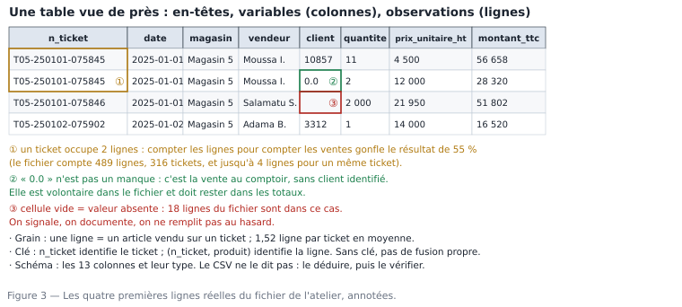

# M01.C03 — La table : lignes, colonnes, cellules, en-têtes, identifiants

**Outil de ce chapitre :** Excel et LibreOffice Calc (les deux sont montrés côte à côte), plus un éditeur de texte pour voir le fichier tel qu'il est. **Durée indicative :** 5 h. **Niveau :** N1.

> **L'idée du chapitre.** Quatre-vingt-dix pour cent du travail d'analyse se passe dans des tables. Savoir **lire** une table — c'est-à-dire expliquer ce que représente une ligne, ce que compte une colonne, ce qui identifie un objet — est une compétence plus rare et plus rentable que la connaissance d'une fonction. Tout ce qui suit, du SQL au DAX, repose sur le mot **grain** : si vous ne savez pas répondre à « une ligne, c'est quoi ? », chaque total que vous produirez sera contestable.

---

## 1. Objectifs du chapitre

À la fin de ce chapitre, vous saurez :

1. **Décrire** une table inconnue en six phrases (objet, grain, clés, mesures, attributs, période couverte) ;
2. **Distinguer** une ligne d'une observation, une colonne d'une variable, un en-tête d'une donnée, et repérer les trois mises en forme qui cassent une table ;
3. **Identifier** la clé d'une table et expliquer pourquoi `id_ticket` et `n_ticket` ne comptent pas la même chose : calculer `COUNT(*)` et le nombre de valeurs distinctes dans un tableur ;
4. **Lire** un fichier brut tel qu'il est : séparateur, encodage, lignes de chapeau, nombres décimaux à virgule ;
5. **Diagnostiquer** un tableau mal structuré (colonnes qui sont en réalité des valeurs) et le reconnaître sans le retravailler ;
6. **Écrire** une fiche d'identité de table, le livrable réutilisé de module en module.

---

## 2. Pourquoi cette notion est importante

**Situation 1 — le total double.** Un analyste relie le tableau des ventes au tableau des paiements **sans savoir que le second contient trois lignes par vente** (trois échéances de paiement). Le CA ressort multiplié par trois. Personne ne comprend pendant deux jours. La cause tient en un mot : *grain*. Celui qui a vérifié « une ligne = ? » dans chaque table avant de la relier n'a pas eu ce problème.

**Situation 2 — le client qui compte deux fois.** Le rapport annonce « 1 240 clients actifs ». Un contrôle rapide montre 1 240 **lignes** pour 1 105 **identifiants distincts** : des achats multiples. Compter des lignes quand on veut des clients est l'erreur de mesure numéro un des débutants, et elle survit aux tableurs les plus chers.

**Situation 3 — « le fichier ne s'ouvre pas correctement ».** Un fichier de 12 000 lignes livré par un fournisseur arrive : les colonnes se collent, les accents sont cassés, les dates sont devenues des nombres. Le collègue conclut que le fichier est corrompu. Il est parfaitement valide : il est en `;`, en encodage Windows-1252, avec des décimales à la virgule. Ce chapitre vous donne les quatre réflexes qui règlent 100 % de ces cas, sans logiciel spécialisé.

> **Dans les faits.** Le fichier de l'atelier de ce module contient **489 lignes** et **13 colonnes**. Le même, nettoyé, en contient **480**. Il compte **316 tickets**, donc **1,52 ligne par ticket en moyenne** et jusqu'à **4**. Retenez ces quatre nombres : vous allez les retrouver dans chaque exercice du module, et le jour où vous les écrirez de mémoire sans les vérifier, vous ferez une erreur de 55 % sur le nombre de ventes.

---

## 3. Explication simple

Une table, c'est un **registre** : un cahier où chaque page tient en une ligne. Deux questions suffisent pour la comprendre, et elles se posent dans cet ordre :

1. **Une ligne, c'est quoi ?** → c'est le **grain**. « Une ligne = un article vendu sur un ticket » n'est pas la même chose que « une ligne = une vente ». Dans le premier cas, 489 lignes = 489 articles ; dans le second, ce serait 489 ventes — et c'est faux, il y a 316 ventes.
2. **Qu'est-ce qui rend une ligne unique ?** → la **clé**. Ici, `n_ticket` identifie le ticket, mais il se répète sur les lignes du même ticket : il n'est donc **pas** la clé de la table. La clé est le couple (n_ticket, produit).

Les colonnes se répartissent alors en trois familles, et cette famille détermine ce que vous aurez le droit de faire plus tard :

- des **identifiants** (`n_ticket`, `client`) : ils relient à d'autres tables ;
- des **attributs** (`magasin`, `vendeur`, `categorie`, `date`) : ils décrivent, ils servent à filtrer et à regrouper ;
- des **mesures** (`quantite`, `prix_unitaire_ht`, `montant_ht`, `montant_ttc`) : elles s'additionnent ou se moyennent.

Une quatrième famille apparaît dans les fichiers réels : les **calculées** (`montant_ht` peut être reconstitué à partir de `quantite`, `prix_unitaire_ht` et `remise`). Elles sont pratiques mais dangereuses : si une colonne calculée est stockée dans le fichier et que le fichier a été édité à la main, elle peut contredire ses propres composants. C'est exactement le cas dans notre échantillon, et vous le verifyrez en exercice.



---

## 4. Vocabulaire essentiel

| Français — English | Définition simple | Piège à éviter |
|---|---|---|
| **Table — table** | Rectangle de données : des colonnes nommées, des lignes sans ordre significatif. | Un « tableau » Excel avec titres fusionnés n'est pas une table, même s'il y ressemble. |
| **Ligne — row / record** | Un enregistrement : un objet du monde réel, au grain défini. | Compter des lignes pour compter des objets différents des lignes. |
| **Colonne — column / field / variable** | Une caractéristique mesurée pour tous les enregistrements. | Une colonne qui mélange deux choses (quantité et unité : « 11 sacs »). |
| **Cellule — cell** | L'intersection ligne × colonne : une valeur, une seule. | Mettre deux informations dans une cellule (`25 kg / sac`). |
| **En-tête — header** | Première ligne, noms des colonnes. | En-tête sur plusieurs lignes, ou lignes de titre avant l'en-tête. |
| **Grain — granularity** | Ce que représente une ligne, formulé en une phrase. | Confondre grain et niveau d'agrégation (« c'est mensuel » ne dit pas ce qu'est une ligne). |
| **Clé primaire — primary key** | Colonne ou couple de colonnes qui rend chaque ligne unique. | Une clé qui admet des doublons n'est pas une clé ; `id_ticket` ici, ne l'est pas. |
| **Clé étrangère — foreign key** | Colonne qui pointe vers la clé d'une autre table. | Un identifiant présent dans les ventes mais absent des clients (ici 486 lignes dans le jeu complet). |
| **Valeur distincte — distinct value** | Une valeur, comptée une seule fois. | `COUNT` ≠ `COUNT DISTINCT` : l'un compte des lignes, l'autre des objets. |
| **Séparateur — delimiter** | Caractère qui sépare les colonnes dans un fichier texte (`;`, `,`, tabulation). | Le même caractère utilisé *dans* une valeur non protégée casse l'alignement. |
| **Encodage — character encoding** | Table de correspondance octets ↔ caractères (UTF-8, Windows-1252). | Ouvrir un fichier UTF-8 en Windows-1252 : les accents deviennent `é`. |
| **Chapeau / pied de page — preamble / footer** | Lignes de titre, de date, de signature avant ou après les données. | Les importer comme données : la ligne 1 de `tarif_fournisseur_peinture.csv` n'est pas une colonne. |

---

## 5. Cours approfondi

### 5.1 Les six phrases de la fiche d'identité d'une table

Face à une table inconnue, écrivez six lignes. Ce rituel de trois minutes remplace avantageusement une demi-journée d'erreurs, et c'est le livrable (1) du projet M01.P.

1. **Nom et source** — `ventes_magasin5_2025.csv`, reçu le 17/09/2026 de la caisse du magasin 5 (export nocturne).
2. **Objet** — la table parle d'articles vendus.
3. **Grain** — une ligne = un article d'un ticket de caisse.
4. **Clé** — (`n_ticket`, `produit`) ; aucune colonne unique à elle seule.
5. **Mesures et attributs** — mesures : `quantite`, `prix_unitaire_ht`, `remise`, `montant_ht`, `montant_ttc` ; attributs : `date`, `heure`, `magasin`, `vendeur`, `client`, `produit`, `categorie`.
6. **Étendue** — 489 lignes ; dates du 01/01/2025 au 31/12/2025 (31 jours comportent au moins une ligne) ; 316 tickets ; 145 produits différents ; 7 catégories ; 4 vendeurs.

La sixième phrase est un inventaire de **bornes** : c'est elle qui révèle la moitié des anomalies, parce qu'une borne qui n'a pas de sens signale un problème avant tout calcul (voir §5.5).

> **Définition.** **Table** — un rectangle de données où chaque colonne est une caractéristique mesurée pour tous les enregistrements et chaque ligne un objet du monde réel, au grain choisi. Entre deux lignes, il n'y a pas d'ordre significatif : l'ordre est une affaire d'affichage, jamais une information.

> **Définition.** **Enregistrement — row / record** — la ligne, c'est-à-dire un objet : une ligne de ticket, et non un ticket, non un client, non un mois.

### 5.2 Le grain, seul concept qui compte au début

Écrivez le grain comme une définition d'école : **« une ligne = un·e [objet] pour [combinaison de clés] »**. Exemples pris dans le socle de données du manuel :

| Table | Grain correct | Ce que l'on pourrait croire (et qui est faux) |
|---|---|---|
| `ventes` (243 360 lignes brutes) | une ligne = un article vendu sur un ticket | une ligne = une vente → 316 tickets deviennent 489 ventes |
| `clients` (23 912 lignes brutes, 23 500 propres) | une ligne = un client | une ligne = un achat → le même client apparaît plusieurs fois |
| `objectifs_de_ca` (218 lignes) | une ligne = un magasin pour un mois donné | une ligne = une année de magasin |
| `stocks_quotidiens` (60 000 lignes) | une ligne = un produit dans un dépôt à une date | une ligne = un produit |
| `dim_date` (1 339 lignes) | une ligne = un jour calendaire | une ligne = un jour ouvré |
| `remises_manuelles` (18 200 lignes) | une ligne = un client pour un mois | une ligne = une remise accordée |

Trois propriétés à vérifier systématiquement :

- **l'unicité** : une clé, ça se prouve. Comptez les lignes (`489`) et les valeurs distinctes de la combinaison de colonnes qui devrait être unique (`316` tickets, donc **non unique**) ;
- **la complétude** : le grain annonce-t-il des lignes qui n'existent pas ? Exemple réel du socle : le fichier de stocks contient des jours sans relevé — le magasinier n'a pas toujours noté. Une table « par jour » sans tous les jours fausse toute moyenne journalière ;
- **la périodicité** : les tables de type « mensuel » (`objectifs`, `remises_manuelles`) ont-elles **12 × 6 = 72 lignes attendues par an** ? Ici `objectifs` en compte 218 pour 5 magasins et 3 ans : il manque des mois — c'est voulu, et vous le traiterez en M12 (analyse d'écart) et M14 (objectifs non atteignables).

> **À retenir.** Le grain n'est pas une information technique : c'est la **seule** qui détermine si un total est une somme ou un double-comptage. Un tableur, un moteur SQL, un modèle sémantique : tous, sans exception, additionnent au grain de la table.

> **Définition.** **Grain — granularity** — la phrase qui dit ce que représente une ligne. Elle s'écrit avec un article et une période : « une ligne = un article d'un ticket », « une ligne = un client pour un mois ». Le grain décide de tout le reste : ce que l'on peut additionner sans double compte, ce que l'on peut joindre, ce qu'il faut agréger avant.

### 5.3 Compter comme un analyste : lignes, objets, valeurs distinctes

Dans un tableur, quatre comptages suffisent à décrire une colonne. Les deux outils, littéralement :

**Excel (ruban)** — sélectionnez la colonne, `Statut` (barre du bas) affiche *Nombre* (lignes non vides) et *Nombre de valeurs numériques* ; pour les distincts, données → **Supprimer les doublons** présente une boîte de dialogue qui indique combien de valeurs uniques ont été trouvées.

**LibreOffice Calc** — mêmes fonctions dans **Données → Standardfilter / Duplizierungen entfernen**, et le compteur de la barre d'état se règle par clic droit pour afficher *Nombre* au lieu de *Somme*.

En pratique, on écrit des formules, parce qu'elles restent et se recalculent :

```
=NBVALA(B2:B490)             → 489     lignes non vides (chaque type)
=NB(C2:C490)                 → 489     lignes numériques seulement
=Nb.SI.ENS(C2:C490;"<>0")    → bornes
=SOMMEPROD(1/FREQUENCE(SI(B2:B490<>"";EQUIV(B2:B490;B2:B490;0));EQUIV(B2:B490;B2:B490;0)))  → distincts (matricielle, à valider Ctrl+Maj+Entrée)
```

Ces formules sont désagréables à lire. C'est le signe exact qu'il faudra du SQL en M07 (`COUNT(DISTINCT n_ticket)`) ou Python en M08 — mais **savoir quoi compter** est la compétence, la syntaxe n'est que l'outil. Retenez le vocabulaire, commun à tous les logiciels :

- `COUNT(*)` = le nombre de **lignes** ;
- `COUNT(colonne)` = le nombre de lignes **non vides** pour cette colonne ;
- `COUNT(DISTINCT colonne)` = le nombre d'**objets** distincts.

Sur notre fichier : 489 lignes, 316 tickets distincts, 480 lignes après nettoyage, 372 identifiants clients distincts, 145 produits distincts. Le ratio lignes/objets (489 / 316 = 1,52) s'appelle le **nombre moyen de lignes par groupe** ; il dit à lui seul si la table est un détail (proche de 1) ou un agrégat (proche de 1, alors qu'on attend des lignes multiples).

> **Définition.** **Clé primaire — primary key** — une colonne, ou un couple de colonnes, qui rend chaque ligne unique. Elle ne se décrète pas, elle se vérifie : on compare le nombre de lignes au nombre de valeurs distinctes. Égalité, c'est une clé ; écart, la ligne n'est pas ce que l'on croyait.

> **Définition.** **Clé étrangère — foreign key** — une colonne qui renvoie à la clé d'une autre table. Elle ne vaut que si la valeur existe en face : un identifiant présent dans les ventes et absent des clients n'est pas une clé, c'est une perte de données.

> **Définition.** **Valeur distincte — distinct value** — une valeur comptée une seule fois. Compter des lignes et compter des objets sont deux opérations différentes, et les deux chiffres sont justes : c'est la question posée qui tranche.

### 5.4 Les trois mises en forme qui détruisent une table

Un tableur permet des choses qu'un fichier de données ne doit jamais contenir.

1. **Cellules fusionnées.** Visuellement pratique, fonctionnellement mortel : une fusion cache la valeur dans une seule cellule, donc le tri et les formules décalent tout. *Règle : aucune cellule fusionnée dans une zone de données ; si un export fournisseur en contient, on la casse avant de lire (M04).*
2. **Plusieurs informations dans une cellule.** `Plâtre de construction 25 kg — réf 1` : le poids et la référence sont collés au nom. Le jour où l'on veut agréger par poids, il faut redécouper. *Repère : si une valeur contient un séparateur (`-`, `/`, `(`), soupçonnez deux colonnes.*
3. **Sous-totaux et lignes de titre dans la zone de données.** Un fichier de caisse propre à imprimer contient souvent ses propres totaux : `Total général : 36 339 317` en ligne 490, et le total du mois toutes les 30 lignes. *Symptôme : le total calculé est exactement le double du vrai.* La ligne de contrôle : compter les lignes dont la colonne `n_ticket` est vide ou non numérique.

Notre fichier fournisseur `tarif_fournisseur_peinture.csv` cumule trois de ces défauts : **3 lignes de chapeau** avant l'en-tête, un **point-virgule** comme séparateur, et des **décimales à la virgule**. Les 42 lignes du fichier ne contiennent donc que **38 lignes utiles**. Un débutant qui ouvre le fichier et compte 42 références se trompe de 10 %.

> **Attention.** Trois mises en forme d'un tableur détruisent mécaniquement une table. Les **cellules fusionnées** créent des cases vides que tout outil d'import lit comme des lignes cassées. Les **lignes de titre ou de signature avant l'en-tête** font du jour d'impression un nom de colonne. Les **sous-totaux insérés dans une colonne de données** sont ré-additionnés au premier calcul. Un tableau de rapport est une impression, pas une table.

### 5.5 Les bornes, ou comment trouver une anomalie sans la chercher

Pour chaque mesure, notez min, max, et le nombre de valeurs aberrantes. Sur `ventes_magasin5_2025.csv` :

| Colonne | Valeur à retenir | Ce que cela signifie |
|---|---|---|
| `quantite` | minimum négatif (retours), maximum **14 000** | 7 lignes dépassent 500 unités : ce sont des erreurs d'unité de saisie, pas des ventes |
| `prix_unitaire_ht` | 323 valeurs distinctes | fourchette réaliste : pas de prix négatif, pas de zéro ici |
| `remise` | 6 valeurs distinctes | une grille simple, donc toute valeur hors de ces six est une anomalie (M01.C04) |
| `montant_ttc` | **486 des 489 lignes non numériques** | montant stocké en texte : le total d'un tableur serait faux |
| `client` | 372 identifiants distincts, 18 lignes vides | « vide » n'est pas la même chose que « 0 » : 0 = vente au comptoir |
| `date` | 55 écritures différentes pour 31 jours | 65 lignes en `JJ/MM/AAAA` : le tri alphabétique est déjà faux |

Le réflexe, une fois pour toutes : **avant de calculer un total, regardez les extrêmes**. Trois secondes par colonne sur un fichier de 489 lignes ; sur `ventes_brutes.csv` (243 360 lignes), ce sera un script, et vous l'écrirez en M08.

> **Attention.** Compter les lignes d'une table pour estimer le nombre d'objets est la plus ancienne source de surévaluation du métier. Si une ligne n'est pas l'objet que l'on compte, le total est gonflé d'un facteur qui dépend des données, et l'erreur grandit avec le volume : la bonne habitude est d'afficher les deux chiffres côte à côte.

### 5.6 Large, long, et le tableau « de rapport »

Deux organisations d'une même information, à savoir reconnaître (la transformation s'apprend en M04) :

```
format large (une colonne par mois)        format long (une ligne par mois)
magasin  janvier  février  mars            magasin  mois     CA
M5       2 051 424 4 289 885 3 673 454     M5       1   2 051 424
M2       1 200 000 1 800 000   900 000     M5       2   4 289 885
                                            M2       1   1 200 000
```

Le **large** se lit par un humain dans une réunion ; le **long** se charge par un logiciel et se filtre par mois. Le tableau de rapport, lui, est les deux à la fois avec des sous-totaux imbriqués : il est **destiné à être lu**, jamais à être la source d'un nouveau calcul. Un indicateur fiable de la maturité d'un service : ses données de travail sont en long, ses livrables sont en large.

> **Conseil professionnel.** Quand un fichier vous est livré, ne l'ouvrez **pas** en double-clic. Ouvrez-le d'abord dans un éditeur de texte (Bloc-notes, gedit, VS Code) ou par l'assistant d'import du tableur (Données → Importer depuis du texte/CSV). Vous verrez le séparateur, l'encodage, le chapeau, les guillemets, les lignes vides : tout ce qu'un double-clic décide pour vous, silencieusement, et parfois faussement.

---

## 6. Exemple concret : lire les deux premiers fichiers du socle

**Fichier 1 — `ventes_magasin5_2025.csv`** (489 lignes, 13 colonnes) :

```
n_ticket;date;heure;magasin;vendeur;client;produit;categorie;quantite;prix_unitaire_ht;remise;montant_ht;montant_ttc
T05-250101-075845;2025-01-01;11:01;Magasin 5 — Kaya Marché;Moussa Ilboudo;10857;Plâtre de construction 25 kg — réf 1;Matériaux;11;4500;0.03;48015;56 658
T05-250101-075845;2025-01-01;11:01;Magasin 5 — Kaya Marché;Moussa Ilboudo;10857;Gravier 15/25 (m3) — réf 2;Matériaux;2;12000;0.00;24000;28 320
```

Lecture professionnelle, en une phrase par ligne : deux lignes, **un seul ticket** (`075845`) → le grain est bien l'article. La troisième colonne de la deuxième ligne montre `28 320` : espace de milliers, donc du texte. Le ticket du haut contient un article à `12000` sans espace : incohérence de format **dans la même table**, donc dans le même export. Le champ `client` vaut `10857` : un identifiant numérique, pas un nom — il faudra le relier à la table clients pour savoir qui c'est. Le champ `remise` vaut `0.03` : une proportion, donc `3 %`, jamais `3` (et 3 apparaîtra ailleurs : c'est la faute d'unité du chapitre 4).

**Fichier 2 — `tarif_fournisseur_peinture.csv`** (42 lignes, dont 38 utiles) :

```
export genere depuis ELODIE v3
edition le 17/09/2026
peinture saaba sarl | tarif 2026
code_article;libelle;conditionnement;prix_unitaire;unite_mesure;tva
PEINT-014;Peinture acrylique blanc 10 L;pot;27500,00;pot;0.18
```

Quatre enseignements : les trois premières lignes sont du **bruit de document** (chapeau) ; la ligne 4 est l'**en-tête** ; le séparateur est le `;` ; la virgule est **décimale**, donc `27500,00` lu dans un contexte français devient `2750000` si l'on force le point, ou `27 500` si l'on respecte la convention — la bonne réponse n'est pas dans le fichier, elle est dans le **choix d'import** (M04). Notez aussi `tva = 0.18` : la TVA du pays, cohérente avec les règles du socle, à vérifier et non à supposer.

---

## 7. Démonstration pas à pas : la fiche d'identité complète, avec les deux tableurs

**Étape 1 — Import maîtrisé.** Excel : **Données → Obtenir des données → À partir de texte/CSV** ; LibreOffice : **Données → Importer une feuille de calcul**. Sélectionnez le fichier `ventes_magasin5_2025.csv`. L'aperçu s'affiche : séparateur `;`, encodage **UTF-8** (si les accents sont cassés, passez en Windows-1252, ou l'inverse). Validez **sans charger** la mise en forme. Résultat attendu : 489 lignes sous l'en-tête, 13 colonnes.

**Étape 2 — Les six phrases.** Remplissez la fiche (§5.1) avec les nombres réels ; ne recopiez aucun nombre sans le vérifier à l'étape 3.

**Étape 3 — Les bornes et les distincts.** Créez un onglet `controles`, avec une ligne par colonne et les formules :

| Colonne | Formule Excel | Formule LibreOffice | Attendu |
|---|---|---|---|
| `date` | `=MIN(--LEFT(A2:A490,10))` | `=MIN(VALUE(LEFT(A2:A490;10)))` | une date de janvier 2025… ou une erreur (c'est l'indice) |
| `quantite` | `=MAX(I2:I490)` | `=MAX(I2:I490)` | **14 000** |
| `quantite` > 500 | `=NB.SI(I2:I490;">500")` | `=COUNTIF(I2:I490;">500")` | **7** |
| `n_ticket` lignes | `=NBVAL(A2:A490)` | `=COUNTA(A2:A490)` | **489** |
| `n_ticket` distincts | `=SOMMEPROD(1/NB.SI(A2:A490;A2:A490))` | `=SUMPRODUCT(1/COUNTIF(A2:A490;A2:A490))` | **316** |
| `client` vides | `=NB.EUILL(E2:E490)` | `=COUNTBLANK(E2:E490)` | **18** |
| `montant_ttc` texte | `=NB(L2:L490)` | `=COUNT(L2:L490)` | **3** (les seuls numériques !) |

La dernière ligne est la plus instructive : `=NB` ne compte que les nombres ; il renvoie 3 alors qu'il y a 489 montants. **Donc 486 montants ne sont pas des nombres.** Vous venez de le prouver avec une formule de trois caractères, sans macro, sans SQL.

**Étape 4 — Le test du double-comptage.** Faites `=SOMME(M2:M490)` sur `montant_ht` : comparez à la somme de `montant_ttc` ÷ 1,18. Les deux doivent être proches (à l'arrondi près). Si l'un est deux fois l'autre, une ligne de sous-total est restée dans les données. Ici, les deux sont cohérents — preuve que le fichier ne contient pas de sous-total, mais bien 9 doublons.

**Étape 5 — Le comptage qui ment.** Calculez le « nombre de ventes » de deux façons : `=NBVAL(A2:A490)` → 489, et le nombre de tickets distincts → 316. Écrivez en une phrase laquelle des deux est « le nombre de ventes » (**316**) et ce que l'autre représente (**le nombre d'articles facturés**). Cette phrase est la réponse à la moitié des questions de vos futurs collègues.

**Étape 6 — Le même exercice sur le fichier fournisseur.** Importez avec chapeau ignoré (Excel : « Avancé » → lignes à sauter = 3 ; LibreOffice : cochez « Première ligne » et retirez les 3 lignes après import). Vérifiez : 38 lignes utiles, 6 colonnes, `tva` = 0,18 partout, `prix_unitaire` avec virgule. Notez dans le journal le nombre de lignes **avant/après** chaque manipulation — l'habitude se prend ici, pas en M18.

---

## 8. Erreurs fréquentes

| Symptôme | Cause | Correction |
|---|---|---|
| 1 240 « clients » pour 1 105 clients réels | Comptage de lignes au lieu de valeurs distinctes | Compter `DISTINCT` ; nommer la métrique (« clients actifs » ≠ « lignes de vente ») |
| Le CA est exactement le double | Ligne de sous-total importée comme donnée | Supprimer les lignes sans clé ou dont la clé est vide ; vérifier avec le ratio lignes/tickets |
| Les colonnes du CSV sont collées | Séparateur mal indiqué à l'import | Assistant d'import, séparateur `;` (ou tabulation), et vérifier l'aperçu **avant** de valider |
| Les accents écrits `é` ou `–` | Encodage UTF-8 lu en Windows-1252 (ou l'inverse) | Changer l'encodage à l'import, pas dans le fichier ; ne jamais réenregistrer un brut |
| Le tri par date mélange janvier et décembre | Tri alphabétique sur des dates stockées en texte | Convertir en véritables dates (M01.C04) ou trier par une colonne auxiliaire `AAAA-MM-JJ` |
| Une date devenue 45 658 | Import qui a converti une date en numéro de série | Annuler, réimporter en forçant le type de colonne en « texte », puis convertir explicitement |
| Total `montant_ttc` = 0 | Somme sur une colonne texte | Le défaut du chapitre 4 : forcer la conversion après avoir retiré les espaces de milliers |
| Le fichier « propre » ne ressemble plus au brut | Écrasement du brut par le tableur (formats, arrondis, dates) | Le brut est en lecture seule ; on travaille sur une copie nommée `_propre` |

---

## 9. Bonnes pratiques professionnelles

- [ ] Import par assistant, jamais par double-clic ; vérifier l'aperçu ligne 1 et la dernière ligne.
- [ ] Fiche d'identité en six phrases produite **avant** le premier graphique.
- [ ] Un onglet `controles` par table : lignes, clés distinctes, bornes, comptage des vides.
- [ ] Ratio lignes/objets écrit noir sur blanc (ici 1,52 ligne par ticket).
- [ ] Zéro cellule fusionnée, zéro sous-total dans une zone de données.
- [ ] Le nom des colonnes conservé tel que livré dans la copie propre, avec un dictionnaire qui traduit (M01.C06).
- [ ] Toute suppression de ligne documentée : nombre avant, nombre après, motif.
- [ ] Un fichier = une table = un grain. Pas deux niveaux d'agrégation dans le même rectangle.

---

## 10. Exercice guidé — décrire la table `clients` en 8 minutes

**Point de départ.** `01_socle_donnees/data/brut/clients.csv` : 11 colonnes, 23 912 lignes brutes.

1. **Combien de clients ?** Les lignes ne répondent pas. Comptez les valeurs distinctes de `id_client` : **23 500**. L'écart (412) est constitué de doublons quasi-exacts, volontairement injectés dans le jeu — vous les rencontrerez en M04. Conclusion à écrire : *412 lignes de trop, ou 412 clients en moins selon le point de vue ; le bon réflexe est de compter les identifiants, pas les lignes.*
2. **Quelles colonnes sont des mesures et lesquelles sont des attributs ?** Mesures : `plafond_credit`, éventuellement `date_creation` (une date n'est pas additionnable : c'est un attribut-ordonnée). Attributs : `nom`, `type_client`, `ville`, `region`, `telephone`, `email`, `segment`, `conditions_paiement`.
3. **Le grain est-il respecté ?** Non, à cause des doublons. Test : une table au grain « un client » doit avoir autant de lignes que de valeurs distinctes de sa clé. Ici 23 912 ≠ 23 500.
4. **Les bornes utiles.** `ville` : 1 880 lignes vides (8 % des clients) — ce n'est pas un problème pour compter des ventes, **c'en est un** pour classer par ville. `telephone` : trois formats (avec/sans indicatif, espaces variables) — donc `COUNT(DISTINCT telephone)` sur-counte, et toute recherche par téléphone est inutile tant que ce n'est pas normalisé.
5. **Ce que la table ne dit pas.** Aucun chiffre d'affaires : c'est une table de **dimension**, pas un fait. Écrivez la phrase : « `clients` répond à *qui*, `ventes` répond à *combien*, et l'on ne peut obtenir le second par le premier qu'en reliant les deux par `id_client`. »

**Contrôle de votre résultat.** Vous devez avoir : 23 912 lignes, 23 500 clients distincts, 412 doublons, 1 880 villes manquantes, 3 formats de téléphone, et aucune somme de `id_client` (elle n'a aucun sens). Si votre réponse contient une moyenne d'identifiants, relisez le §5.3 : un identifiant n'est pas une quantité.

---

## 11. Exercices autonomes

**Exercice 3.1 (★) — Le grain, en une phrase.** Donnez le grain des six tables du socle (`ventes`, `clients`, `produits`, `magasins`, `objectifs_de_ca`, `stocks_quotidiens`). *(attendu : une phrase « une ligne = … » par table, avec la combinaison de clés)*

**Exercice 3.2 (★) — Deux comptages.** Sans outil, déduisez du texte du fichier : combien de lignes a `ventes_magasin5_2025.csv` ? Combien de tickets ? Pourquoi ne sont-ce pas les mêmes nombres ? *(489 / 316 ; parce qu'un ticket contient 1 à 4 articles)*

**Exercice 3.3 (★★) — Le faux total.** Un collègue obtient 72 678 634 FCFA de CA TTC sur l'échantillon, au lieu de 36 339 317 FCFA. Proposez deux explications, et le test qui les distingue. *(doublons non retirés → le total est presque ×2 : on compare à 36 339 317 × 1,999 ; sous-totaux inclus → le fichier n'en contient pas, donc `NBVAL(n_ticket)` ne change pas. Le test : compter les lignes dont le ticket est vide)*

**Exercice 3.4 (★★) — Les colonnes qui sont des valeurs.** Voici un extrait large :

```
magasin;2025-01;2025-02;2025-03
M5;2051424;4289885;3673454
```

Écrivez la version longue, puis dites quelle opération devient possible en long et pas en large, et pourquoi la moyenne des trois colonnes n'est pas « le CA mensuel moyen du magasin 5 ». *(attendu : 3 lignes en long ; agréger par mois sur plusieurs magasins devient possible ; la moyenne est correcte ici mais aveugle au nombre de jours ouvrés de chaque mois)*

**Exercice 3.5 (★★) — Lecture d'un fichier hostile.** Le fichier fournisseur (42 lignes, chapeau de 3, séparateur `;`, décimale virgule, encodage Windows-1252) : importez-le proprement, et donnez le nombre de lignes utiles, le prix du `PEINT-014`, et le taux de TVA constaté. *(attendu : 38 lignes utiles ; 27 500 ; 0,18 — une réponse « 2750000 » trahit un mauvais choix de séparateur décimal)*

**Exercice 3.6 (★★★) — Contrôle de unicité en 5 formules.** Sur `montant_ht`, prouvez que la colonne est cohérente avec `quantite`, `prix_unitaire_ht` et `remise` : formule attendue, tolérance d'arrondi, nombre de lignes qui dévient. *(attendu : contrôle `quantite × prix × (1 − remise)` arrondi à l'entier ; les 7 lignes de quantité aberrante sortent nécessairement en écart → c'est l'indice qui les fait découvrir)*

---

## 12. Correction détaillée

**Exercice 3.1.** `ventes` : une ligne = un article d'un ticket (clé `id_vente`, ou (`n_ticket`,`produit`)) ; `clients` : une ligne = un client (clé `id_client`) ; `produits` : une ligne = une référence (clé `id_produit`, 154 lignes) ; `magasins` : une ligne = un point de vente ou dépôt (6 lignes) ; `objectifs_de_ca` : une ligne = un magasin pour un mois (218 lignes pour 5 magasins × 3 ans + 8 mois, donc mois manquants) ; `stocks_quotidiens` : une ligne = un produit dans un dépôt à une date (60 000 lignes).

**Exercice 3.2.** 489 lignes, 316 tickets distincts (moyenne 1,52 article par ticket, maximum 4). Les deux ne sont pas identiques parce que le grain est l'article, pas la vente. Un total d'articles est pertinent pour la logistique (kg manutentionnés, colis), un total de tickets pour la caisse (11 tickets/heure en pointe), et un total de lignes **n'est** la réponse à aucune question métier : c'est un artefact du fichier.

**Exercice 3.3.** Explication A : les 9 lignes en double n'ont pas été retirées **et** le collègue a sommé l'intégralité du jeu complet, pas l'échantillon. Test : son nombre de lignes est-il 243 360 ou 489 ? Explication B : il a ajouté le sous-total de chaque mois aux lignes. Test : `=NB.SI(A2:A490;"")` — s'il trouve 0, il n'y a pas de sous-total et l'explication B tombe. Le calcul 72 678 634 / 36 339 317 = 2,00 montre qu'il a bel et bien additionné deux fois le même contenu : une jointure ou une concaténation, pas un total de mois.

**Exercice 3.4.** Version longue :

```
magasin;mois;CA
M5;2025-01;2051424
M5;2025-02;4289885
M5;2025-03;3673454
```

En long, on peut agréger par mois **sur tous les magasins**, trier par mois, joindre à un calendrier (`dim_date`, 1 339 lignes) et détecter les mois absents (en large, un mois manquant est une colonne absente : personne ne la remarque). Sur la moyenne : (2 051 424 + 4 289 885 + 3 673 454)/3 = **3 338 254 FCFA** — ce nombre est correct **comme moyenne de ces trois mois**, mais il ne dit rien d'une « année » ; l'exprimer comme « le CA mensuel » sans préciser la période est l'erreur classique relevée en M02 (agrégats sans période = agrégats contestables).

**Exercice 3.5.** 38 lignes utiles (`42 − 3 de chapeau − 1 d'en-tête`), `PEINT-014` à **27 500 FCFA**, TVA **0,18**. Réponses fausses typiques : 42 lignes (le chapeau compté), 2 750 000 (virgule lue comme séparateur de milliers alors que le fichier est en français… ou l'inverse), 18 % lu comme 18 (oubli de la proportion). Le contrôle qui valide : `prix_ht × 1,18` doit redonner un prix TTC cohérent avec la grille interne du produit peinturé du socle.

**Exercice 3.6.** Contrôle : `montant_attendu = ARRONDI(quantite × prix_unitaire_ht × (1 − remise))`. Écart toléré : 1 FCFA (arrondi du fichier). Résultat réel sur l'échantillon : 7 lignes en écart, et ce sont exactement les 7 lignes à quantité aberrante (maximum 14 000 unités). La leçon à écrire : **une colonne calculée peut être juste alors que sa composante est fausse** — le fichier a été multiplié sur la quantité seulement, donc le montant reste correct. Un contrôle de cohérence entre colonnes trouve ce qu'un contrôle de total ne trouve pas.

---

## 13. Mini-projet M01.P3 — « Fiche d'identité de trois tables » (50 min)

Livrable : un onglet `identification` dans un classeur `2026-09-17_fiches_identite_M5_minani.xlsx`, avec **trois** blocs (ventes de l'atelier, clients, fichier fournisseur), chaque bloc contenant les six phrases du §5.1 et le tableau de contrôles du §7 (étape 3).

Contraintes : aucune formule ne doit être recopiée d'un autre bloc sans adaptation ; chaque nombre doit venir d'une formule du fichier importé (pas du texte du chapitre) ; le dernier bloc liste les **trois questions** que la table ne permet pas de traiter. Barème : 8 pts exactitude des six phrases · 6 pts justesse des comptages (489/316/18/3 vérifiés par vos formules) · 4 pts lisibilité (un bloc par table, aucun fusionnement) · 2 pts « questions non traitables ». Ce livrable entre dans le projet M01.P, critère (1).

---

## 14. Résumé du chapitre


Une table se lit en six phrases et se contrôle en cinq nombres : lignes, valeurs distinctes de la clé, bornes des mesures, valeurs manquantes, cohérence entre colonnes. Le grain décide si un total est une somme ou un double-comptage ; la clé décide si l'on peut relier sans multiplier. Un fichier brut n'est pas un tableau : il a un séparateur, un encodage, parfois un chapeau et presque toujours des colonnes qui ne sont pas du bon type. Tout ce que vous ferez ensuite — SQL, pandas, Power BI — partira de ces six phrases ; les écrire est le premier acte d'analyse, et le seul obligatoire.

---

## 15. À retenir

> **À retenir.**
> 1. **« Une ligne = quoi ? »** : la première question à poser à toute table, et à écrire.
> 2. **Lignes ≠ objets** : `COUNT(*)` = 489, tickets distincts = 316. Nommez toujours ce que vous comptez.
> 3. **Une clé est unique ou n'est pas une clé** ; une clé étrangère orpheline (486 lignes) est un défaut, pas un détail.
> 4. **Cellules fusionnées, sous-totaux, deux infos par cellule** : les trois poisons du fichier de données.
> 5. **Un contrôle de cohérence entre colonnes** trouve ce qu'un contrôle de total laisse passer.

---

## 16. Évaluation formative (auto-correction, 10 min)

1. Le fichier de l'atelier contient 489 lignes et 316 tickets. Combien de ventes ? *( 316 ; 489 = nombre d'articles facturés )*
2. Que vaut `COUNT(DISTINCT n_ticket)` sur les lignes en double non retirées, et sur le fichier nettoyé ? *( 316 dans les deux cas — les doublons ne créent pas de nouveaux tickets : c'est précisément ce qui rend le contrôle utile )*
3. Un champ `ville` vide sur 8 % des clients : pourquoi cela gêne-t-il une analyse géographique et pas un chiffre d'affaires total ? *( le total additionne une mesure indépendante de la ville ; le classement par ville perd 8 % de son contenu, donc les parts sont fausses )*
4. Donnez le grain de `remises_manuelles.xlsx` (18 200 lignes) et écrivez la phrase de contrôle d'unicité. *( une ligne = un client pour un mois ; contrôle : lignes = distincts de (id_client, annee, mois) )*
5. **Question ouverte :** vous devez fusionner les ventes avec les objectifs mensuels. Énoncez en trois phrases ce que vous vérifiez avant la fusion et ce que vous vérifiez après. *( attendu : les deux grains (article vs magasin-mois) ; les clés communes ; la période ; après : que le total des ventes n'a pas changé et que le nombre de lignes n'a pas été multiplié )*
