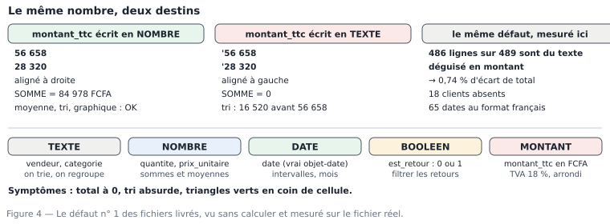

# M01.C04 — Types de données et ce qu'ils autorisent : texte, nombre, date, booléen, montant

**Outil de ce chapitre :** Excel et LibreOffice Calc (conversion, détection, contrôle), plus l'éditeur de texte pour voir la vérité du fichier. **Durée indicative :** 5 h. **Niveau :** N1.

> **L'idée du chapitre.** Un type n'est pas un détail technique : c'est la **liste des opérations permises** sur une colonne. Le même chiffre `56 658` écrit en texte refuse toute somme ; la même date écrite `12/01/2025` refuse tout calcul d'intervalle. La totalité des chiffres faux produits par des débutants, et une part surprenante de ceux produits par des seniors, vient d'un type mal déclaré ou mal deviné. Ce chapitre vous rend capable de **détecter** le problème en trente secondes, de le **corriger sans perdre de lignes**, et surtout de **prouver** que la correction n'a rien cassé.

---

## 1. Objectifs du chapitre

À la fin de ce chapitre, vous saurez :

1. **Nommer** les cinq types que rencontre un analyste (texte, nombre entier, nombre décimal, date/heure, booléen) et dire, pour chacun, ce qu'il autorise et ce qu'il interdit ;
2. **Détecter** une colonne « nombre stocké en texte » avec trois méthodes indépendantes dans un tableur ;
3. **Convertir** une colonne en gardant le contrôle du nombre de lignes et du total avant/après ;
4. **Traiter les dates** écrites en texte, y compris le piège `JJ/MM/AAAA` contre `MM/JJ/AAAA`, et expliquer pourquoi un formatage n'est pas une conversion ;
5. **Expliquer** les dégâts chiffrés d'un mauvais typage sur un résultat réel : ici 486 lignes sur 489 et un écart de total de 0,74 % après nettoyage ;
6. **Décider** du type d'une colonne ambiguë (identifiant numérique, montant, taux en proportion) et **documenter** la décision.

---

## 2. Pourquoi cette notion est importante

**Situation 1 — le total à zéro.** Un chef de secteur envoie son relevé mensuel en CSV. Vous faites `=SOMME()`. Résultat : 0. Colonne pleine de montants, somme nulle. Cause : chaque montant est écrit avec un espace de milliers (`56 658`), donc Excel a stocké du **texte**. Le chef de secteur, lui, voit ses totaux justes dans son fichier à lui, parce qu'il a laissé les formats de son logiciel. Deux personnes, deux chiffres, une seule cause : le type.

**Situation 2 — la date qui décale tout un trimestre.** Un export contient `12/01/2025` pour le 12 janvier et `01/12/2025` pour le 1ᵉ décembre. Un outil de conversion automatique, réglé sur le format américain, lit le premier comme le 1ᵉʳ décembre. Vous obtenez un hiver en plein été. Personne ne voit l'erreur dans le tableau de bord ; elle se voit dans la décision du directeur des achats, en janvier.

**Situation 3 — la TVA en points ou en proportion.** Dans notre fichier, `remise` contient `0.03`. Ailleurs, un autre export contient `3`. Appliquer un taux de 3 au lieu de 0,03 ne multiplie pas l'erreur par 100 : le montant de la ligne, qui est un taux, devient un facteur. Le type est « nombre » dans les deux cas ; c'est **l'unité** qui diffère. Leçon durable : un type juste avec une unité fausse produit un chiffre faux avec assurance.

> **Dans les faits.** Sur l'échantillon de l'atelier : **486 lignes sur 489** ont un `montant_ttc` non numérique, **65 dates** sont au format `JJ/MM/AAAA` dans une colonne où le reste est en `AAAA-MM-JJ`, **7 quantités** dépassent 500 (maximum **14 000**) et **18 clients** sont vides. Aucun de ces défauts n'empêche le fichier de s'ouvrir. Chacun d'eux rend un tableau de bord faux.

---

## 3. Explication simple

Chaque cellule contient une **valeur** et un **type**. Le type répond à une seule question : *qu'est-ce que je peux faire avec ?*

| Type | Ce qu'on peut faire | Ce qu'on ne peut pas faire | Exemple du fichier |
|---|---|---|---|
| **Texte** | chercher, trier (alphabétique), regrouper, compter | additionner, moyenner, calculer un écart | `Magasin 5 — Kaya Marché` |
| **Nombre entier** | les cinq opérations, compter des quantités | dire « le 5ᵉ tiers » (un entier est discret) | `quantite` = 11 |
| **Nombre décimal** | tout ce que fait l'entier, plus ratios et pourcentages | s'additionner sans unité (0,03 de quoi ?) | `remise` = 0,03 |
| **Date / heure** | intervalles, extraire mois/année, tri chronologique | additionner deux dates (ça n'a pas de sens) | `date` = 2025-01-01 |
| **Booléen** | filtrer, compter des drapeaux | moyenner sans convention (VRAI = 1 ?) | `est_retour` (dans le jeu complet) |

Une image qui tient : un type est un **verrouillage de porte**. Le texte est une porte coulissante, la date une porte à gâche électrique : le même geste ne s'y applique pas. « Convertir » n'est donc pas « embellir » : c'est changer de porte.

**La confusion la plus fréquente du débutant** est de croire que *formater* change le type. Dans un tableur, un format est une **apparence** : afficher `56 658` avec un séparateur de milliers ou en `# ###0,00 "FCFA"` ne change pas la nature de la valeur. Une cellule peut afficher une date `12/01/2025` alors qu'elle contient le nombre `45670` (le numéro de série interne de la date), et une autre afficher la même chose en contenant le texte `"12/01/2025"`. Le format ment, la valeur ne ment pas : c'est elle qu'on contrôle.

---

## 4. Vocabulaire essentiel

| Français — English | Définition simple | Piège à éviter |
|---|---|---|
| **Type de données — data type** | Nature d'une valeur, qui détermine les opérations possibles. | Croire qu'un CSV « contient » des types : il ne contient que du texte ; le type est une décision de l'outil qui le lit. |
| **Typage / inférence — type inference** | Déduction automatique du type par le logiciel qui importe. | Le logiciel déduit sur les 100 premières lignes : une colonne peut changer de type à la ligne 101. |
| **Chaîne de caractères — string** | Suite de caractères, avec des espaces, des accents, des signes. | Un identifiant numérique (`10857`) n'est pas une quantité : le sommer ne veut rien dire. |
| **Nombre à virgule / point — decimal separator** | Signe séparant partie entière et décimale : `,` en français, `.` en anglais. | `27500,00` lu en contexte anglais devient `2750000`. |
| **Format nombre — number format** | Masque d'affichage d'un nombre. | Confondre format et type : le format change l'œil, pas la valeur. |
| **Numéro de série — serial date** | Une date stockée comme un nombre de jours depuis une origine (1900 ou 1904). | Un import qui convertit tout en série : `2025-01-01` devient 45658, et vous sommez des dates. |
| **Valeur manquante — null / missing** | Absence de valeur, distincte de 0 et distinct de la chaîne vide. | `id_client = 0` (comptoir) est une valeur ; une cellule vide est une absence. |
| **Booléen — boolean** | Vrai ou faux (0/1, VRAI/FAUX, oui/non). | Trois représentations dans un même fichier : « V », « OUI », `1` → trois groupes au lieu d'un. |
| **Conversion / coulage — cast** | Changer le type d'une colonne en conservant la valeur. | Convertir en masse sans compter les pertes : `CBI("abc")` ne renvoie pas une erreur, il renvoie 0 ou une erreur selon le moteur. |
| **Arrondi — rounding** | Ajustement de la précision ; ici arrondi à l'entier en FCFA. | Arrondir avant de sommer, puis sommer : le total n'est pas le même que sommer puis arrondir. |
| **Encodage — encoding** | Correspondance octets ↔ caractères (UTF-8, Windows-1252). | Un fichier en Windows-1252 lu en UTF-8 casse les noms de produits, donc les regroupements. |

---

## 5. Cours approfondi

### 5.1 Ce que le CSV ne dit pas — et pourquoi c'est le cœur du métier

Un fichier CSV est une liste de lignes de texte. Aucun type n'y est écrit. Le type apparaît quand **un outil décide** : Excel devine, Power Query infère, pandas infère, PostgreSQL exige une déclaration. Quatre conséquences :

1. **Un identifiant à zéro non significatif devient un nombre** : `0075845` → `75845`, et la jointure future sur ce code échoue silencieusement. *Réflexe : toute colonne qui sert de code (client, article, téléphone, IBAN) se charge en texte.*
2. **Une colonne mixte est déclarée texte** : si une seule des 489 lignes contient `N/C`, la colonne entière de montants devient du texte pour beaucoup d'outils.
3. **Un nombre trop long perd sa précision** : les identifiants supérieurs à 15 chiffres (numéros de carte, codes-barres EAN-13 lus en nombre, identifiants techniques) sont arrondis par Excel. Non négociable : texte.
4. **Une date lue dans le mauvais ordre est convertie en une autre date valide** — c'est le seul cas où le résultat est **juste au regard de la syntaxe et faux au regard du monde**. Le point §5.3 lui est consacré.

> **Définition.** **Type de données — data type** — la nature d'une valeur, qui détermine ce que l'on a le droit d'en faire. Un texte se compare et se découpe, il ne se moyenne pas ; un nombre se somme ; une date se décale. Le type n'est pas une étiquette esthétique : il ouvre ou ferme des opérations, et le logiciel refuse poliment au lieu de signaler qu'il n'a rien calculé.

### 5.2 Les cinq signes visibles d'un nombre stocké en texte

Sans formule, dans Excel : un nombre aligné **à droite**, un texte aligné **à gauche** (tant que vous n'avez pas changé l'alignement). Ensuite : le **triangle vert** en coin de cellule avec l'avertissement « nombre stocké sous forme de texte » ; la **barre d'état** qui n'affiche que « Nombre » et jamais « Somme » quand vous sélectionnez la colonne ; `=NB(plage)` qui renvoie 0 alors que `=NBVAL(plage)` renvoie 489 ; enfin l'**erreur** `#VALUE!` dès qu'une formule arithmétique touche la cellule.

Les trois premières méthodes sont visuelles, donc fragiles (un collègue a pu aligner à droite pour faire joli). Les deux dernières sont mathématiques : `NB` compte les valeurs numériques, `NBVAL` compte les cellules non vides. La différence **est** le nombre de défauts. C'est la formule de contrôle que vous écrirez dans chaque projet :

```
lignes            =NBVAL(L2:L490)     → 489
valeurs nombre    =NB(L2:L490)        → 3
défauts de type   =NBVAL(...) − NB(...) → 486
```

Dans LibreOffice, mêmes idées avec `COUNT` (nombres), `COUNTA` (non vides) et `ISNUMBER`.

> **Définition.** **Typage automatique — type inference** — le mécanisme par lequel un logiciel devine le type de chaque colonne en lisant un échantillon de lignes. Il est rapide et il est faux dès qu'une colonne est irrégulière : quelques valeurs atypiques dans l'échantillon lu décident si la colonne deviendra nombre ou texte. Réflexe : lire l'écran de résultat de l'import, jamais cliquer sur « Charger » les yeux fermés.

### 5.3 Les dates : le format n'est pas le type, et l'ordre des morceaux n'est pas une convention

Trois écritures du même jour : `2025-01-12` (norme ISO 8601, année-mois-jour), `12/01/2025` (usage français, jour-mois-année), `01/12/2025` (usage américain, mois-jour-année). Un outil qui devine se trompe **uniquement sur les jours ≤ 12** — soit la moitié du mois, et, dans notre échantillon, **65 lignes sur 489**. Le pire : l'erreur est silencieuse, parce que la date obtenue est valide. Le total annuel reste juste (la somme ne dépend pas du jour) ; le CA mensuel, lui, est faux, et c'est précisément ce que le directeur regarde.

Règles de survie, dans l'ordre :

1. **Ne jamais laisser le logiciel deviner** : à l'import, déclarer explicitement le type de chaque colonne date (Excel : « Avancé » dans l'assistant texte ; Power Query : transformer la colonne puis *Utiliser les en-têtes*…).
2. **Ne jamais utiliser une conversion « automatique »** du type `format="mixed"` (le nom même dit « je devine ») sur un fichier de provenance humaine : sur notre échantillon, `12/01/2025` devient le 3 décembre et le mois change. Une conversion mixte n'est acceptable que sur des dates **déjà** ISO, pour gagner du temps.
3. **Forcer l'ordre** quand le fichier est hétérogène : séparer les lignes par motif (`AAAA-MM-JJ` d'un côté, `JJ/MM/AAAA` de l'autre), convertir chaque groupe avec son format, recoller. C'est long à écrire, c'est **juste**, et c'est l'exercice 4.2 de ce chapitre.
4. **Convertir une fois, en amont** : la correction de type appartient au nettoyage (M04), pas à chaque graphique.

Un test de robustesse à faire dans tous les cas : comparer, avant/après, le **nombre de lignes par mois**. Sur une conversion correcte, on retrouve les valeurs connues de l'atelier : janvier 2 051 424 · février 4 289 885 · mars 3 673 454 · avril 2 688 159 · mai 1 258 801 · juin 2 096 435 · juillet 2 623 127 · août 3 033 498 · septembre 3 476 773 · octobre 2 808 078 · novembre 2 781 034 · décembre 5 292 517 FCFA. Si vos mois ne correspondent pas, votre conversion a réarrangé le calendrier.

> **Définition.** **Séparateur décimal — decimal separator** — le signe qui sépare la partie entière de la partie décimale. `27 500,00` et `27500.00` sont le même nombre dans deux conventions ; `27.500` peut être vingt-sept mille cinq cents ou vingt-sept virgule cinq selon le logiciel qui lit. C'est la source d'erreur la plus silencieuse du travail sur fichiers, parce qu'elle produit un nombre — le mauvais, mais un nombre.

### 5.4 Taux, proportions, pourcentages : la colonne `remise`

Dans les fichiers du socle, `remise` / `taux_remise` est une **proportion** : `0,03` = 3 %. Un second mode de saisie existe dans la vraie vie : **les points de pourcentage** (`3` = 3 %). Les deux sont des nombres ; le résultat d'un calcul diffère d'un facteur 100. Conséquence dans le jeu complet : **973 lignes** de remise aberrante sont des points confondus avec des proportions, et ces lignes passent tous les contrôles de type — seul un **contrôle de plage** les attrape :

```
règle métier : 0 ≤ remise ≤ 0,40
=NB.SI(K2:K490;">0,4")      → lignes suspectes
```

Le même raisonnement s'applique à la TVA (`tva = 0,18`, jamais `18`) et à toute « marge en % » (0,22 ou 22 ?). Réflexe professionnel, à appliquer dès le premier jour d'un stage : **la première ligne du dictionnaire de données écrit l'unité de chaque colonne numérique**. Une proportion, un taux, un pourcentage, un montant, une quantité : quatre mots, quatre conventions, zéro discussion ensuite.

### 5.5 Booléens et drapeaux : un type tout simple, trois catastrophes classiques

Le jeu complet contient `est_retour` (0 ou 1). Trois manières de mal faire :

1. **Le transformer en texte** par un import trop prudent : les groupes deviennent `"0"` et `"1"`, qui se trient mais ne se somment plus — le total des retours tombe à 0.
2. **Le confondre avec une absence** : un fichier peut contenir `1`, `0` et *vide*. Le vide n'est ni vrai ni faux : c'est « on ne sait pas », et le ranger avec les 0 fait disparaître des retours du total.
3. **Changer de vocabulaire entre deux sources** : `VRAI/FAUX` dans un export, `OUI/NON` dans un autre, `T/F` dans un troisième. À la fusion, trois modalités au lieu de deux. La normalisation (« oui/o/OUI/1/VRAI → 1 ») est une tâche de nettoyage, pas une option.

### 5.6 Convertir sans casser : le protocole en six temps

Toute conversion de type, dans n'importe quel tableur, se fait avec ce protocole. Il est imposé dans tous les projets de ce manuel, parce qu'il rend l'opération **auditable** :

1. **Compter avant** : nombre de lignes, total de la colonne concernée (si elle est déjà numérique) ou sa borne max/min.
2. **Dupliquer la colonne** (`montant_ttc` → `montant_ttc_num`) : on ne remplace jamais sur place.
3. **Retirer les parasites** en texte : espaces de milliers, `FCFA`, points de regroupement → `=SUPPRESPACE(SUBSTITUE(L2;" ";""))` (Excel) / `=TRIM(SUBSTITUTE(L2;" ";""))` (LibreOffice).
4. **Convertir** avec une fonction qui **signale** les échecs plutôt que de les masquer : `=CBI()` / `=VALUE()`, ou, en Power Query, un « Modifier le type » qui génère des `error` visibles. Les erreurs deviennent des lignes à traiter, pas des zéros.
5. **Contrôler** : la nouvelle colonne doit avoir le même nombre de valeurs que l'ancienne (`=NB(nouvelle)` = `=NBVAL(ancienne)`) et un total égal à celui attendu.
6. **Écrire dans le journal** : date, colonne, méthode, lignes en échec, total avant/après.

Sur l'échantillon de l'atelier, la conversion de `montant_ttc` fait apparaître deux mondes : 3 lignes déjà numériques, 486 à nettoyer, 0 en échec après retrait des espaces (le fichier est propre de ce côté). Le total obtenu, **36 339 317 FCFA**, est celui **avec les 9 lignes en double** ; le total après suppression des doublons est **36 073 185 FCFA**, soit **0,74 %** de moins. Ces deux nombres sont vos points de contrôle pour tout le module.

> **Définition.** **Valeur manquante — null** — l'absence de valeur. Elle n'est ni zéro, ni chaîne vide, ni « non renseigné » : zéro est une information, une case vide est une donnée, une absence est une question. Confondre les trois change un total, une moyenne et un nombre de clients.

> **Attention.** Arrondir **avant** de sommer et sommer **puis** arrondir ne donnent pas le même total. Sur un extrait de quelques centaines de lignes, l'écart se compte en unités ; sur une facture payée à la ligne, il devient une réclamation. La convention s'écrit une fois dans le dictionnaire de données : on calcule en pleine précision, on arrondit à l'affichage.

### 5.7 Types, tailles de fichier et performance : ce que « bien typer » rapporte

Le type n'est pas qu'une question de justesse, c'est une question de coût, et cela devient critique dès le module 8 :

- un fichier CSV de 243 360 lignes × 20 colonnes occupe **28,5 Mo** ; la même table en `.parquet` avec des types justes tombe vers 4 à 6 Mo ;
- une date stockée en texte de 10 caractères coûte ~10 octets par ligne ; stockée en entier (nombre de jours), 4 octets ; en date binaire, 4 à 8 octets ;
- un booléen en texte (`"TRUE"/"FALSE"`) coûte 5 octets ; en binaire, 1 bit effectif dans la plupart des formats columnaires ;
- une colonne de type texte force, dans tous les moteurs, des comparaisons de chaînes au lieu d'entiers : sur un filtre ou une jointure, le facteur 2 à 5 est banal.

Ce n'est pas de l'optimisation pour ingénieurs : c'est la raison pour laquelle Power BI refuse parfois d'importer une colonne, et la raison pour laquelle un script Python « tourne » en 3 secondes ou en 4 minutes selon un détail invisible à l'œil.

> **Conseil professionnel.** Dans tout outil d'import, l'écran qui affiche « 28 colonnes, type : texte » pour une colonne qui devrait être une date est un **signal d'alarme** que les débutants valident sans lire. Prenez l'habitude de parcourir cette ligne de types, colonne par colonne, à chaque import, et de vous demander : *est-ce que cette colonne va être sommée, comparée, triée chronologiquement ?* La réponse décide du type à imposer.

> **Attention.** Convertir une colonne de **montants** en supprimant les espaces puis en forçant le nombre, **sans recalculer le total**, est la source numéro un des chiffres qui « collent » deux réunions de suite et s'effondrent à la troisième. Après toute conversion, un contrôle de total obligatoire — et l'écart doit être **expliqué**, pas arrondi à zéro. Ici, 266 132 FCFA d'écart s'expliquent par 9 lignes ; un écart inexpliqué de 12 FCFA est déjà une enquête.

---


> **À retenir.** Un type se **déclare**, il ne se devine pas : la ligne d'en-tête d'un CSV ne porte aucune
> information de type, et le premier logiciel qui ouvre le fichier en invente une. D'où les trois réflexes du
> chapitre — compter les valeurs non numériques, compter les valeurs distinctes, écrire les types attendus dans le
> dictionnaire de données — qui transforment un doute en contrôle.

## 6. Exemple concret : la colonne qui a l'air juste

Voici, telle quelle, la fin du fichier de l'atelier. Deux lignes consécutives :

```
T05-251201-081477;2025-12-01;08:34;Magasin 5 — Kaya Marché;Adama Bationo;214;Robinet mitigeur évier — réf 1;Plomberie;14000;140;0.00;1960000;2 312 800
T05-251201-081478;01/12/2025;09:02;Magasin 5 — Kaya Marché;Adama Bationo;;Ballon d'eau chaude 50 L — réf 1;Plomberie;3;165000;0.05;495000;584 100
```

Quatre défauts, tous de type ou d'unité, invisibles à l'œil non exercé :

1. `2 312 800` : montant **texte** (espace de milliers) → il ne se somme pas, mais surtout il ne se compare pas : un filtre `> 2 000 000` l'ignore.
2. `01/12/2025` : date **texte**, et dans l'autre ordre que la ligne précédente → tri et regroupement par mois faux.
3. `quantite = 14000` pour des robinets : 14 000 mitigeurs sur un ticket de magasin de quartier, c'est une erreur d'unité (lignes de quantité aberrante : 7 dans l'échantillon, maximum **14 000**).
4. `client` vide sur la seconde ligne : une **absence**, à distinguer du `0` des ventes au comptoir (18 lignes vides dans l'échantillon).

Traitez les trois premières et le total passe de **36 339 317** (fichier tel quel) à **36 073 185** FCFA (après nettoyage), soit **0,74 %**. La quatrième ne change aucun total, mais change une réponse : « combien de clients distincts ? » — 372 identifiants distincts, dont il faut décider si l'absence compte comme un client.

---

## 7. Démonstration pas à pas : le protocole complet sur `montant_ttc`

Faites-le dans un classeur neuf, onglet `exercice`, en important `ventes_magasin5_2025.csv` avec **toutes les colonnes déclarées en texte** (Power Query : colonne type « Touttext » / « Text »). Déclarer tout en texte à l'import est une pratique professionnelle courante : on empêche le logiciel de deviner, puis on typ **soi-même**.

**Étape 1 — État des lieux (3 formules).**

```
=NBVAL(M2:M490)                       → 489      (la colonne est pleine)
=NB(M2:M490)                          → 3        (seuls 3 montants sont numériques)
=NBVAL(M2:M490)-NB(M2:M490)           → 486      (le nombre de défauts de type)
```

**Étape 2 — Colonne de travail.** En N1, titre `montant_ttc_num`. En N2 :

```
Excel        : =SIERREUR(CBI(SUPPRESPACE(SUBSTITUE(M2;" ";"")));"ERREUR")
LibreOffice  : =IFERROR(VALUE(TRIM(SUBSTITUTE(M2;" ";"")));"ERREUR")
```

`CBI`/`VALUE` échoue proprement ; `SIERREUR`/`IFERROR` transforme l'échec en marqueur lisible. Recopiez jusqu'à la ligne 490.

**Étape 3 — Contrôle d'exhaustivité.** `=NB.NON.VIDE(SI(N2:N490="ERREUR";N2:N490))` attend **0**. Si vous trouvez 1, un montant contient autre chose qu'un espace (un `FCFA`, une virgule décimale, un caractère invisible) : affichez-le avec `=CAR(…)`, ou ouvrez la cellule dans la barre de formule.

**Étape 4 — Total et comparaison.** `=SOMME(N2:N490)` → **36 339 317**. Écrivez à côté : « total fichier tel quel (9 lignes en double comprises) ».

**Étape 5 — Retrait des doublons, puis nouveau total.** Copiez la plage dans un onglet `doublons_test`, Données → Supprimer les doublons (toutes colonnes) → **480 lignes**, total **36 073 185**. Notez : `36 339 317 − 36 073 185 = 266 132 FCFA`, soit `266 132 / 36 073 185 = 0,74 %`.

**Étape 6 — Contrôle croisé, la partie utile.** La colonne `montant_ht` est numérique, et `montant_ttc` doit valoir `ARRONDI(montant_ht × 1,18)`. Faites la colonne de contrôle :

```
=ARRONDI(P2*1,18)   puis   =SI(ARRONDI(P2*1,18)=N2;"ok","à voir")
```

Toutes les lignes doivent dire `ok` — sauf celles dont `quantite` est aberrante, car l'aberration a été injectée **sur la quantité seulement** : le montant, lui, reste cohérent. Vous touchez là une idée qui reviendra en M02 et en M04 : *la cohérence interne d'une ligne ne prouve pas la véracité de ses composants*. Un fichier peut être parfaitement cohérent et parfaitement faux.

**Étape 7 — Les dates.** Créez une colonne `date_iso` en traitant les deux écritures séparément, jamais en laissant l'outil deviner :

```
=SI(STXT(B2;5;1)="-"
    ; B2                                            /* déjà ISO : AAAA-MM-JJ, on garde */
    ; DROITE(B2;4)&"-"&STXT(B2;4;2)&"-"&GAUCHE(B2;2) /* JJ/MM/AAAA : on reconstruit en ISO */)
```

Puis contrôlez par compte, pas par impression : 65 lignes ont suivi la seconde branche, 424 la première (`=NB.SI()` sur le test du 5ᵉ caractère). Regroupez ensuite par mois (`=GAUCHE(date_iso;7)` dans un tableau croisé) et comparez au tableau du §5.3 : décembre doit valoir **5 292 517 FCFA** sur le fichier nettoyé. C'est ce comparatif qui prouve que jour et mois n'ont pas été permutés — le total annuel, lui, aurait été juste et aurait caché l'erreur.

> **Boîte à outils.**
> **Excel** — Détection : barre d'état (Nombre vs Somme), `=ESTNUM()`, `=NB()` vs `=NBVAL()`. Conversion : `CBI`, `CNUM`, `DATEVALEUR`, Power Query → « Transformer la colonne en nombre/date » ; à l'import, « Avancé » permet de forcer le type de chaque colonne. Erreurs de type visibles : Accueil → Mise en forme conditionnelle → « Règles de mise en surbrillance des cellules → Erreur ».
> **LibreOffice Calc** — `VALUE`, `TRIM`, `SUBSTITUTE`, `ISNUMBER` ; Données → « Importer une feuille de calcul » (choix explicite de l'encodage et des colonnes en texte) ; Format → Cellules → Date (ne **convertit** pas : n'utilisez jamais cette voie pour changer de type).
> **Les deux** — Après conversion, gardez une colonne `…_txt` à côté : le jour où l'on vous conteste un total, vous pouvez montrer le départ et l'arrivée, sans re-exécuter quoi que ce soit.

---

## 8. Erreurs fréquentes

| Symptôme | Cause | Correction |
|---|---|---|
| Total à 0 sur une colonne pleine de montants | Montants stockés en texte (espace de milliers, `FCFA`) | `SUPPRESPACE` + `SUBSTITUE` puis `CBI`, avec contrôle `NB` = `NBVAL` |
| `=SOMME()` juste, mais `=MOYENNE()` fausse | Une ligne de titre ou de total mélangée aux nombres | Filtrer sur une colonne-clé non vide ; vérifier le grain |
| Des dates en nombre (`45658`) | Import qui a converti en série, format « Standard » | Convertir **explicitement** en date, puis vérifier par contrôle de mois |
| Un mois complet qui saute du rapport | Tri alphabétique sur texte `01/12/2025` | Trier sur une colonne `AAAA-MM-JJ` (ou convertir, mieux) |
| Écart de 1 à 2 % sur des milliers de lignes | Point et virgule de milliers inversés selon la provenance | À l'import, renseigner **les deux** séparateurs dans l'ordre : le premier est le séparateur de milliers, le second la décimale |
| Un client sur deux disparaît du classement | `id_client` converti en nombre puis joint à un texte | Jointure sur même type ; recharger les identifiants en texte |
| Ventes au comptoir « supprimées par erreur » | `0` traité comme une valeur manquante | Distinguer absence (`NA`) et zéro métier ; le comptoir doit rester dans le CA |

---

## 9. Bonnes pratiques professionnelles

- [ ] À l'import : tout en texte, puis typage **décidé colonne par colonne**.
- [ ] Une colonne de contrôle `…_num` à côté de l'originale, jamais de remplacement à l'aveugle.
- [ ] Deux formules de contrôle à chaque conversion : `NB` vs `NBVAL` (exhaustivité) et total avant/après (fidélité).
- [ ] Unité de chaque colonne numérique écrite dans le dictionnaire (`remise` = proportion ; `montant_ttc` = FCFA TTC, TVA 18 % incluse).
- [ ] Les identifiants en texte, toujours ; un code n'est pas une quantité.
- [ ] Dates converties une fois, en amont, et vérifiées par **répartition mensuelle**, pas seulement par le total.
- [ ] Un écart de total, même de 12 FCFA, s'explique par une ligne du journal ou se corrige.
- [ ] Le dictionnaire note aussi **ce qui manque** : ici, cellule vide ≠ 0 (comptoir).

---

## 10. Exercice guidé — la grille de typage du fichier de l'atelier

On remplit ensemble, pour les 13 colonnes, la grille qui servira de base au dictionnaire de données (M01.C06 la mettra en forme). Colonnes : `n_ticket, date, heure, magasin, vendeur, client, produit, categorie, quantite, prix_unitaire_ht, remise, montant_ht, montant_ttc`.

| Colonne | Type actuel | Type voulu | Pourquoi | Risque si on ne corrige pas |
|---|---|---|---|---|
| `n_ticket` | texte | texte | identifiant | perdu s'il devient nombre (les `T05-…` ne le permettent même pas) |
| `date` | **mixte** (424 ISO, 65 FR) | date | tri, filtres, mois | mois faux, ratios mensuels faux |
| `heure` | texte `HH:MM` | heure (ou texte) | si l'on veut des tranches | tri alphabétique OK seulement si `HH:MM` à 2 chiffres partout |
| `magasin`, `vendeur`, `produit` | texte | texte | libellés | regroupements cassés par un accent mal encodé |
| `client` | nombre **ou** vide | texte | identifiant, avec 0 = comptoir | zéro confondu avec manque, jointure ratée |
| `categorie` | texte | texte | 7 modalités | deux groupes pour la même catégorie si un espace traîne |
| `quantite` | nombre entier | nombre entier | somme, contrôle de plage | 7 lignes aberrantes noyées dans la moyenne |
| `prix_unitaire_ht` | nombre entier | nombre | montant unitaire | — |
| `remise` | nombre décimal | proportion | × (1 − r) | un facteur 100 si points/proportions se mélangent |
| `montant_ht` | nombre entier | nombre | total | — |
| `montant_ttc` | **texte (486/489)** | nombre | total officiel | total à 0 ou faux, comparaisons impossibles |

Le constat à écrire en toutes lettres dans votre journal : **une seule colonne, `montant_ttc`, est catastrophiquement typée, et c'est celle sur laquelle le directeur regardera le résultat.** C'est presque toujours ainsi : le défaut n'est pas réparti uniformément, il est là où le calcul passe.

Ensuite, faites l'exercice inverse — celui qui forme vraiment : supposez que la ligne 490 (inexistante) contienne `montant_ttc = "N/C"`. Que deviennent `=SOMME`, le tri Power BI, une agrégation SQL `SUM()` ? Réponse : une erreur, un groupe à part, `NULL` propagé. Les trois moteurs réagissent différemment ; le remède est le même : **rendre lisible avant de convertir**, c'est-à-dire extraire les lignes en échec dans un onglet `rejets` (et non les supprimer).

---

## 11. Exercices autonomes

**Exercice 4.1 (★) — Les trois signes.** Sans formule, dites pour `montant_ttc` du fichier de l'atelier (a) le type réel, (b) la preuve en une formule, (c) l'effet sur `=SOMME()`. *( texte ; `=NB()` vs `=NBVAL()` = 3 vs 489 ; somme = 0 ou sous-estimée à 3 lignes seulement )*

**Exercice 4.2 (★★) — Le fichier hostile.** Convertissez les 65 dates `JJ/MM/AAAA` en ISO en deux branches, puis donnez le CA du mois de décembre obtenu. *( attendu : 5 292 517 FCFA sur l'échantillon nettoyé — toute autre valeur signale un jour/mois permuté )*

**Exercice 4.3 (★★) — L'unité tranchée.** Une colonne `remise` contient les six valeurs 0 ; 0,03 ; 0,05 ; 0,08 ; 3 ; 5. Que concluez-vous, comment le prouvez-vous avec une colonne auxiliaire, et combien de lignes sont concernées dans le fichier de l'atelier ? *( deux unités mélangées : le test `montant_ht × (1 − remise)` ne « tombe » juste que pour les proportions ; dans l'échantillon, 0 ligne en points — l'anomalie existe dans le jeu complet, 973 lignes )*

**Exercice 4.4 (★★) — Erreur volontaire — série E4 (diagnostic de défauts).** On vous remet un classeur dont le total de `montant_ttc` est **36 339 317** alors que le tableau croisé de la même donnée affiche **36 073 185**. Listez trois causes possibles de type ou de format, et la formule qui tranche pour chacune. *( causes : doublons conservés · colonne texte partiellement convertie · filtre oublié dans le TC ; tests : nombre de lignes `NBVAL` ; `NB` vs `NBVAL` ; `=SOMME.SI(n_ticket;"<>";...)` comparé à la valeur du TC )*

**Exercice 4.5 (★★★) — Le prix d'un mauvais typage.** Un magasin a 480 lignes de détail. On commande du stock proportionnellement au CA TTC calculé sur le fichier **non nettoyé** (36 339 317 FCFA), à raison de 1,5 % du CA en réappro d'urgence. Calculez le surcoût en FCFA et en pourcentage de la commande réelle. *( attendu : commande calculée 545 090 FCFA sur le fichier non nettoyé, 541 098 FCFA sur le fichier propre, soit **3 992 FCFA** de trop — 0,74 % de la commande. L'exercice note surtout la démarche : l'impact métier dépend de la politique d'achat, et l'ordre de grandeur doit être dit, pas caché : ce n'est pas une excuse pour négliger le nettoyage )*

---

## 12. Correction détaillée

**Exercice 4.1.** (a) texte ; (b) `=NB(M2:M490)` renvoie 3, `=NBVAL(M2:M490)` renvoie 489 : 486 cellules non numériques ; (c) `=SOMME(M2:M490)` ignore le texte et retournerait 3 valeurs, soit un total dérisoire et non 0 si les 3 valeurs numériques sont des cas propres — d'où l'intérêt du contrôle par les deux formules plutôt que du simple coup d'œil.

**Exercice 4.2.** Deux branches : `GAUCHE(B2;4)="2025"` → ISO conservée ; sinon reconstruire `DROITE(B2;4)&"-"&STXT(B2;4;2)&"-"&GAUCHE(B2;2)`. Contrôle : 65 lignes dans la seconde branche, 424 dans la première. Regroupement par mois → décembre 2025 = **5 292 517 FCFA**. Erreur type : obtenir 5 292 517 + quelques lignes de janvier mutées en décembre (si l'on a appliqué la branche « jour/mois » aux lignes déjà ISO). Le contrôle du nombre de lignes par branche évite précisément cela.

**Exercice 4.3.** Conclusion : deux unités mélangées, 3 et 5 étant des points de pourcentage (0,03 et 0,05 existent aussi). Preuve : colonne `vérif = SI(remise>0,4 ; montant_ht × (1 − remise/100) ; montant_ht × (1 − remise))`, puis comparer à `montant_ht` ; les lignes en points ne collent qu'après division par 100. Dans l'échantillon de 480 lignes utiles, aucune occurrence (le générateur du jeu complet en injecte 973) : c'est l'occasion d'écrire la phrase exacte — *le défaut est absent de ce fichier, et présent dans le jeu complet, donc la règle de contrôle doit exister malgré tout*. Un apprenant qui « invente » 973 lignes dans l'échantillon pour faire plaisir au sujet a échoué à l'exercice.

**Exercice 4.4.**
1. Doublons non retirés → test : `=NBVAL()` = 489 contre 480 après dédoublonnage ; l'écart 266 132 FCFA correspond exactement à la somme des 9 lignes.
2. Colonne texte convertie sur une partie du fichier → test : `=NB(colonne)` = 486 au lieu de 489, ou somme différente selon la plage ; dans ce cas le total affiché aurait été 36 073 185 sur une plage et 36 339 317 sur l'autre.
3. Filtre oublié dans le tableau croisé → test : re-jeter le champ `date` hors filtre et comparer ; un filtre « janvier-novembre » produit un total inférieur d'environ 5,3 M FCFA, pas de 266 132 FCFA — donc ce n'est **pas** cette cause. C'est la bonne manière de raisonner : on élimine par l'ordre de grandeur attendu.

**Exercice 4.5.** Démarche juste : écart = 266 132 FCFA ; proportion de réappro d'urgence = 1,5 % du CA ; surcoût = 266 132 × 1,5 % = **3 992 FCFA** ; la commande passe de 541 098 à 545 090 FCFA. Barème : 2 pts pour l'écart exact (266 132 FCFA), 3 pts pour le calcul, 5 pts pour le commentaire d'ordre de grandeur (3 992 FCFA sur un écart de 266 132 FCFA) qui conclut que **l'erreur de type est ici financièrement négligeable mais pédagogiquement et contractuellement grave** : un chiffre juste est une obligation, pas une question de montant. Un devoir qui écrit « surcoût de 545 090 FCFA » confond le montant de la commande et le surcoût : noté 2/10, le résultat est recopié, pas calculé.

---

## 13. Mini-projet M01.P4 — « Le dictionnaire de types » (45 min)

Livrable : un onglet `dictionnaire` de 13 lignes × 6 colonnes dans le classeur du module, une ligne par colonne du fichier de l'atelier. Colonnes imposées : `champ` · `type_livré` · `type_voulu` · `unité` · `règle_de_contrôle` · `défaut_constaté`.

Exemple de ligne recevable :

```
montant_ttc | texte (486/489) | nombre entier | FCFA TTC, TVA 18 % incluse | NB(nouvelle)=NBVAL(ancienne) et total ∈ {36 339 317 ; 36 073 185} | espace de milliers
```

Critères : toute colonne a une unité écrite (une proportion n'est pas un pourcentage) ; deux colonnes au minimum ont une règle de contrôle qui **s'exécute** (une formule du classeur, pas une phrase) ; les valeurs de défaut sont comptées, pas estimées (65, 486, 18, 7) ; le dernier onglet s'appelle `rejets` et contient les lignes qui n'ont pas pu être converties, même s'il est vide — le fait qu'il soit vide est une information.

---

## 14. Résumé du chapitre



Un type est la liste des opérations permises, pas une mise en forme. Un CSV n'a pas de types : c'est vous qui les décidez, et le logiciel qui les devine à votre place se trompe sur les bords — identifiants, dates ambiguës, colonnes mixtes. Les deux formules `NB` / `NBVAL` détectent tout ce qui est nombre déguisé ; le contrôle par mois détecte tout ce qui est date déguisée ; le contrôle `0 ≤ remise ≤ 0,40` détecte tout ce qui est unité déguisée. Convertir se fait en sept temps, dont deux obligatoires : compter avant, contrôler après. Un total qui change de 0,74 % après nettoyage n'est pas une approximation : c'est une preuve.

---

## 15. À retenir

> **À retenir.**
> 1. **Formater ≠ convertir** : l'apparence ne change pas le type, donc ne change pas ce qui est calculable.
> 2. **`NB` vs `NBVAL`** : deux formules, trois secondes, la mesure exacte des nombres stockés en texte (ici 486/489).
> 3. **Un identifiant est du texte** ; un montant est un nombre **avec unité** ; un taux est une **proportion**.
> 4. **Une date ambiguë se traite en deux branches** et se vérifie par répartition mensuelle, jamais par le seul total annuel.
> 5. **Toute conversion est encadrée par un contrôle** : lignes avant/après, total avant/après, et une ligne dans le journal.

---

## 16. Évaluation formative (auto-correction, 10 min)

1. Pourquoi un CSV « ne contient-il pas de types » et qu'est-ce qui en crée ? *( ce sont des caractères ; le type est créé par l'importateur, par inférence ou par déclaration )*
2. Une colonne `date` contient 424 valeurs `2025-01-01` et 65 valeurs `12/01/2025`. Quelle est la règle de conversion, et le contrôle ? *( deux branches, reconstruction en ISO ; contrôle : nb de lignes par branche = 424 et 65, puis CA par mois cohérent avec les valeurs attendues )*
3. `=SOMME()` sur `montant_ttc` renvoie une valeur minuscule. Expliquez en une phrase et donnez la formule de diagnostic. *( le texte est ignoré par SOMME ; diagnostic `=NB()` vs `=NBVAL()` )*
4. Un champ `tva` vaut 18 dans un fichier, 0,18 dans un autre. Que fait-on à l'étape de nettoyage ? *( normaliser en proportion, documenter l'unité, contrôler `montant_ttc = montant_ht × 1,18` )*
5. **Question ouverte :** votre direction affirme que le fichier « s'ouvre bien dans Excel, donc il est correct ». Répondez en trois phrases, avec un exemple chiffré du module. *( attendu : Excel affiche, il ne valide pas ; 486 montants sur 489 sont du texte et le total officiel change de 266 132 FCFA selon le nettoyage ; un fichier juste est un fichier contrôlé, pas un fichier affichable )*
