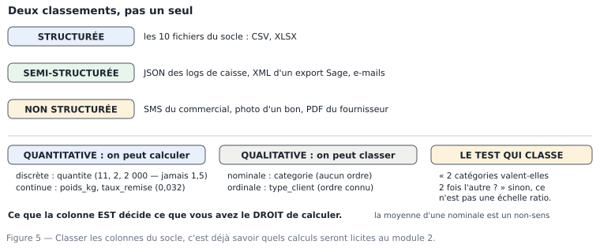

# M01.C05 — Structurées, semi-structurées, non structurées ; qualitatives et quantitatives

**Outil de ce chapitre :** un éditeur de texte, Excel/LibreOffice, l'invite de commandes pour compter. **Durée indicative :** 4 h. **Niveau :** N1.

> **L'idée du chapitre.** Deux classements traversent toute l'analyse, et ils sont indépendants. Le premier regarde **l'enveloppe** : la donnée est-elle en table, en arborescence, en prose ? Le second regarde la **nature** de la valeur : peut-on calculer avec, ou seulement classer ? Le premier décide de l'outil et du temps de préparation ; le second décide de la formule licite. Un analyste qui confond les deux choisit un outil inadapté et écrit un calcul interdit — deux erreurs que le module 2 vous fera payer cher, donc que l'on règle ici.

---

## 1. Objectifs du chapitre

À la fin de ce chapitre, vous saurez :

1. **Classer** un jeu de données en structuré / semi-structuré / non structuré, et dire pour chacun le coût réel de mise en forme ;
2. **Reconnaître** la nature d'une variable — quantitative (discrète, continue) ou qualitative (nominale, ordinale) — et **justifier** la frontière par le test des écarts ;
3. **Relier** la nature d'une variable aux statistiques autorisées (moyenne, médiane, mode, pourcentage, écart-type) ;
4. **Choisir** le bon outil pour la bonne enveloppe : tableur pour le structuré petit, requête pour le structuré gros, script pour le semi-structuré, humain (ou traitement du langage, en M20) pour le non structuré ;
5. **Décrire** les quatre propriétés d'un fichier plat (séparateur, encodage, décimale, chapeau) et les vérifier en ligne de commande ;
6. **Estimer** le volume et le temps de préparation d'un lot de fichiers hétérogènes, ce que demande tout client au premier rendez-vous.

---

## 2. Pourquoi cette notion est importante

**Situation 1 — les 200 Mo de logs.** Un client remet un dossier de 200 Mo de fichiers `.log` « pour voir les achats en ligne ». L'analyste commence par les ouvrir dans Excel : 5 minutes de chargement, un plantage, une demi-journée perdue. La bonne première question n'était pas « comment filtrer ? » mais « sous quelle forme cela existe-t-il, et quelle fraction est exploitable ? » — ici, 4 lignes sur 10 étaient du texte libre, et la réponse utile se trouvait dans 3 colonnes parsemées.

**Situation 2 — la moyenne des catégories.** Un mémoire professionnel affiche « catégorie moyenne : 4,3 ». Les catégories ont été codées 1 à 7 pour gagner de la place dans le fichier. Le code est un nombre, la catégorie ne l'est pas : la moyenne d'une variable nominale est un nombre **sans signification**, même si le logiciel la calcule. C'est l'exemple type du calcul licite en apparence, interdit en réalité.

**Situation 3 — le PDF qui « contient les données ».** Une mairie envoie 40 pages de délibérations au format PDF, « tout y est ». C'est exact, et inutilisable en l'état : le non structuré n'est pas une table, il le devient par un travail dont le coût (ici, plusieurs semaines de saisie ou un traitement de texte automatique) doit être **annoncé** avant d'être accepté.

> **Dans les faits.** Dans le socle de données de ce manuel, la répartition est celle d'une PME réelle : **10 fichiers structurés** (les tables, dont `ventes_brutes.csv` de 243 360 lignes), et du semi-structuré ou du non structuré partout ailleurs : un relevé de stock tenu « à la main » (le même tableur contient des commentaires libres en colonne de garde), les notes d'e-mails des commerciaux, les fichiers du fournisseur au format `;` encodé en **Windows-1252**. Le ratio « facile / difficile » est de 1 à 4 en volume de travail, pas en volume d'octets.

---

## 3. Explication simple

**L'enveloppe.** Imaginez trois façons de noter la même vente :

- **structurée** : une ligne dans un fichier, des colonnes partout — `T05-250101-075845;2025-01-01;11;4500;…`. Un ordinateur la lit sans réfléchir.
- **semi-structurée** : une fiche qui porte ses étiquettes avec elle — `{"ticket":"T05-250101-075845","date":"2025-01-01","lignes":[{"produit":"Plâtre 25 kg","qte":11,"pu":4500}]}`. La structure existe, mais elle est **dans** le contenu, parfois inégale (telle vente a un champ `remise`, telle autre non ; la caisse a été ajoutée en 2024).
- **non structurée** : un SMS — « le client veut 11 sacs pour samedi, il paiera au comptoir ». Riche, mais l'ordinateur n'y voit que des mots. Le transformer en table, c'est décider ce qu'est « 11 », « sacs », « samedi », et ce travail a un prix.

**La nature.** Pour une colonne, posez une seule question : **est-ce que calculer avec a un sens ?**

- Si oui → **quantitative** : `quantite` (11, 2, 2 000), `poids_kg`, `taux_remise`. Dedans, deux familles : *discrète* (on compte : 11 sacs, jamais 11,3) et *continue* (on mesure : 24,7 kg).
- Si non → **qualitative** : `categorie`, `mode_paiement`, `type_client`. Deux familles : *nominale* (aucun ordre : plomberie n'est pas « plus » que peinture) et *ordinale* (ordre connu, distance inconnue : `particulier < pro < revendeur`, mais de combien ?).

Le test de l'ordre et le test des écarts tranchent les cas limites :

| Question | Nominal | Ordinal | Intervalle | Ratio |
|---|---|---|---|---|
| Un ordre a-t-il un sens ? | non | oui | oui | oui |
| Un écart 10→11 vaut-il comme 40→41 ? | non | non | oui | oui |
| Le zéro veut-il dire « absence » ? | non | non | non | oui |

`poids_kg` : ratio (0 kg = rien). `température` en degrés : intervalle (0 °C ne dit pas « absence de chaleur »). `note sur 20` : intervalle en pratique, ordinales en théorie — d'où l'interdiction de dire « 16 est deux fois 8 ». Cette échelle (nominale / ordinale / intervalle / ratio) n'est pas un ornement académique : elle décide, en M02, quelles statistiques sont admissibles, et en M17, quels graphiques ont le droit d'exister.



---

## 4. Vocabulaire essentiel

| Français — English | Définition simple | Piège à éviter |
|---|---|---|
| **Donnée structurée — structured data** | Organisation régulière en lignes et colonnes, schéma connu. | Croire que « table » implique « propre » : le structuré peut être sale (c'est même le cas ici). |
| **Donnée semi-structurée — semi-structured** | Contient ses propres étiquettes, mais de façon irrégulière (JSON, XML, HTML, logs). | Trier ou sommer sans l'avoir aplati en colonnes. |
| **Donnée non structurée — unstructured** | Texte, image, son, vidéo : pas de colonnes. | Surestimer ce qu'un outil de traitement automatique peut en tirer au premier passage. |
| **Aplatir — flatten** | Passer d'une arborescence à des colonnes plates. | Perdre les niveaux intermédiaires sans les recopier dans une colonne. |
| **Schéma — schema** | Liste nommée des colonnes avec types et règles. | Le deviner au lieu de l'écrire : un schéma non écrit se démode dès la première livraison. |
| **Variable quantitative — quantitative variable** | Se mesure ou se compte ; les calculs ont un sens. | Confondre code numérique et quantité (les catégories codées 1 à 7). |
| **Variable qualitative / catégorielle — categorical** | Classe en familles ; on compte les effectifs, pas les valeurs. | Calculer une moyenne ou un écart-type. |
| **Discrète / continue — discrete / continuous** | On compte des entiers ; ou on mesure avec une précision finie. | Traiter une variable discrète à faible cardinalité (1, 2, 3) comme continue pour la moyener. |
| **Cardinalité — cardinality** | Nombre de valeurs distinctes d'une colonne. | Oublier que cardinalité élevée + texte = coût de jointure (revient en M06/M13). |
| **Échelle de mesure — measurement scale** | Nominale, ordinale, intervalle, ratio. | Choisir un graphique ou une statistique inadapté à l'échelle. |
| **Texte libre — free text** | Prose non contrainte : commentaires, motifs, SMS. | Faire des « mots les plus fréquents » un indicateur : la fréquence d'un mot n'est pas une mesure d'un fait. |
| **Séparateur / encodage / décimale** | Les trois propriétés d'un fichier plat, plus le chapeau. | Les supposer identiques entre deux fichiers du même expéditeur. |

---

## 5. Cours approfondi

### 5.1 Les trois enveloppes, et le vrai coût de chacune

| Enveloppe | Exemples | Ce qu'on peut faire directement | Coût de mise en forme | Outil adapté (module) |
|---|---|---|---|---|
| Structurée (table) | `ventes_brutes.csv`, `clients.csv` | filtrer, agréger, joindre | faible : types, doublons, bornes (M04) | tableur (M03-M06), SQL (M07), Power BI (M14) |
| Semi-structurée | logs de caisse en JSON, XML d'un export, HTML d'une page fournisseur | lire un enregistrement à la fois | moyen-élevé : aplatir, régulariser, accepter les champs absents (M08) | Python/pandas, DuckDB |
| Non structurée | SMS, e-mails, PDF de compte rendu, photos de bons | chercher un mot | très élevé : extraction, validation, échantillonnage (M20) | script + humain, ou modèles de langue (M20, avec ses limites) |

Trois remarques professionnelles :

1. **La difficulté n'est pas dans la taille, c'est dans l'irrégularité.** Cent mille lignes d'un CSV bien tenu demandent une journée ; trois mille e-mails « importants » en demandent trois.
2. **Le semi-structuré est le format par défaut du monde moderne** : les API, les journaux d'événements, les fichiers de configuration, les exports web. Le JSON est au XXIᵉ siècle ce que le CSV était au XXᵉ.
3. **Le non structuré est un choix, pas une fatalité.** On peut faire saisir un formulaire au lieu de lire des SMS. Une partie du travail d'un analyste est de proposer ce changement de format : c'est le livrable « recommandation d'usage » du module 21.

> **Définition.** **Donnée structurée — structured data** — des lignes et des colonnes, un schéma connu d'avance : le format où l'on peut compter, joindre et agréger sans rien interpréter.

> **Définition.** **Donnée semi-structurée — semi-structured data** — des étiquettes portées par le fichier lui-même (JSON, XML, journaux applicatifs), mais des enregistrements qui ne se ressemblent pas tous : une clé peut manquer d'un objet à l'autre, et c'est ce manque qui demande un traitement.

> **Définition.** **Donnée non structurée — unstructured data** — texte, image, son, vidéo : aucune colonne. On ne la compte pas ; on extrait d'abord une information, et cette extraction est elle-même une source d'erreur à documenter.

### 5.2 Le JSON en cinq minutes, parce que vous allez en rencontrer

Un objet JSON se lit comme un dictionnaire ; un tableau `[...]` comme une liste. Voici un ticket de caisse du commerce réel, en JSON :

```json
{
  "ticket": "T05-250101-075845",
  "date": "2025-01-01",
  "magasin": 5,
  "vendeur": "Moussa Ilboudo",
  "lignes": [
    { "produit": "Plâtre de construction 25 kg", "qte": 11, "pu": 4500, "remise": 0.03 },
    { "produit": "Gravier 15/25 (m3)", "qte": 2, "pu": 12000 }
  ],
  "reglement": { "mode": "especes", "montant": 56658 }
}
```

Quatre enseignements :

- la structure **se répète** (le mot `lignes` porte une liste d'objets de même forme) ;
- les **champs optionnels** existent : la deuxième ligne n'a pas de `remise` — dans une table plate, cela devient une colonne à vide, et la question « vide = 0 ? » resurgit (M01.C04) ;
- l'**imbrication** oblige à aplatir : une table de lignes suppose de recopier `ticket`, `date`, `magasin` sur chaque article, donc de **choisir le grain** (ici l'article, pas le ticket) ;
- les **nombres sont typés** par la syntaxe (`56658` sans guillemets = nombre, `"56658"` = texte) : c'est le seul format courant où le type est explicite dans le fichier. C'est pour cela qu'il est préféré au CSV pour les échanges entre logiciels.

Le mouvement à maîtriser, un jour ou l'autre : **JSON → table** (aplatir, M08) et **table → JSON** (exporter vers une application, M19). Les deux sont mécaniques ; ce qui ne l'est pas, c'est la décision du grain et du sort des champs absents.

### 5.3 Les quatre propriétés d'un fichier plat, et comment les vérifier sans outil

Un même fichier CSV peut être lu correctement par un logiciel et faux par un autre, à cause de quatre conventions non écrites. Voici comment les **vérifier**, pas les supposer, depuis un terminal (Git Bash sous Windows, Terminal sous macOS/Linux) :

```bash
head -3 2025_ventes_M5_brut.csv            # le chapeau : y a-t-il des lignes de titre avant l'en-tête ?
head -1 2025_ventes_M5_brut.csv | tr ';' '\n' | wc -l   # le séparateur : combien de champs ? (attendu : 13)
file -i 2025_ventes_M5_brut.csv            # l'encodage déclaré (charset=utf-8 ou iso-8859-1)
grep -c ',' 2025_ventes_M5_brut.csv        # des virgules dans un fichier « ; » = chiffres à virgule ou texte libre
```

Résultats réels du socle : `ventes_magasin5_2025.csv` = 13 champs, UTF-8, séparateur `;`, aucune virgule décimale. `tarif_fournisseur_peinture.csv` = 6 champs, **Windows-1252**, séparateur `;`, **virgule décimale**, **3 lignes de chapeau**, 38 lignes utiles. Le second fichier est celui qui casse les imports, et il est parfaitement normal : c'est un export d'un vieux logiciel de facturation dont la langue est le français.

Règle de propreté qui en découle, à appliquer à chaque réception, et notée dans le journal : **nom du fichier, taille, encodage, séparateur, nombre de champs, nombre de lignes, nombre de lignes utiles**. Sept nombres. Un client à qui l'on écrit cela au lieu de « j'ai bien reçu le fichier » gagne en confiance ce que l'analyste gagne en temps.

> **Définition.** **Encodage de caractères** — *character encoding* — la table qui associe des octets à des signes. **UTF-8** — *UTF-8* — la convention universelle actuelle : tout caractère du monde y tient, un accent occupe 2 octets. **Windows-1252** (ou latin-1) — *cp1252* — l'ancienne convention des logiciels francophones : les accents occupent 1 octet. Lire du Windows-1252 comme de l'UTF-8 produit `é` ; l'inverse produit `�` ou des points d'interrogation. Le fichier n'est pas cassé : la lecture l'est.

### 5.4 Qualitatif et quantitatif : les cas qui font discuter, tranchés

| Colonne du socle | Classification | Tranchage |
|---|---|---|
| `quantite` | quantitative discrète | on compte des articles ; 1,5 sac n'existe pas dans ce commerce |
| `poids_kg` | quantitative continue | mesure ; un écart de 0,4 kg vaut un écart de 0,4 kg ailleurs sur l'échelle |
| `prix_unitaire_ht` | quantitative, ratio | 0 FCFA = absence de prix (et non un prix « petit ») → 2 lignes à 0 dans `produits.csv`, donc un défaut, pas une valeur |
| `remise` | quantitative, ratio | 0 = aucune remise, ce qui a un sens |
| `categorie` | qualitative nominale | 7 familles, aucun ordre → moyenne interdite, effectifs et parts autorisés |
| `type_client` | **qualitative ordinale** | `particulier < pro < revendeur` : ordre connu, distance inconnue → médiane parfois admissible, moyenne non |
| `mode_paiement` | qualitative nominale | espèces / mobile money / chèque / virement / crédit : médian n'a aucun sens |
| `conditionnement` | qualitative nominale | pot, sac, m³, barre de 4 m → sert d'**unité**, donc à la conversion (M02) |
| `heure` | quantitative circulaire | 23 h 59 et 00 h 01 sont voisins mais la moyenne fait 12 h : à traiter par extraits (tranches) ou par fonction cosinus (M20, cas limite) |
| `ville` | qualitative nominale | géographie = ordinale si l'on hiérarchise par taille ; ici, nom de ville + région (référentiel INSD) = hiérarchie à 2 niveaux, donc **variable hiérarchique** (M11) |

Le test unique à retenir pour les cas limites : **« puis-je soustraire deux valeurs et obtenir un nombre qui veut dire quelque chose ? »** `13 h − 11 h = 2 h` ✔ (quantitative). `Plomberie − Peinture` ✘ (qualitative). `note 16 − note 8 = 8 points` : oui arithmétiquement, mais les points n'ont pas la même valeur partout → on reste prudent, on parle de médiane et de quartiles, jamais de « deux fois mieux ».

> **Définition.** **Variable quantitative — quantitative variable** — une valeur qui se mesure ou se compte, et pour laquelle les calculs ont un sens : quantité, prix, montant, durée.

> **Définition.** **Variable qualitative — categorical variable** — une appartenance : famille, catégorie, statut, marque. On la compte (des effectifs par modalité), on ne la calcule pas.

> **Attention.** Un **code** n'est pas une **quantité**. Code postal, numéro d'article, identifiant client, modalité codée 1/2/3 : autant de textes qui ont l'air de nombres. Leur moyenne ne veut rien dire, et la calculer est le premier réflexe de l'analyste pressé — le deuxième étant de la montrer en réunion.

### 5.5 Quelle statistique pour quelle nature : la table qu'il faut avoir en tête

| Nature | Mode | Médiane | Moyenne | Écart-type | % et effectifs | Remarques |
|---|---|---|---|---|---|---|
| Nominale | ✔ | ✘ | ✘ | ✘ | ✔ | le mode est la seule « tendance centrale » licite |
| Ordinale | ✔ | ✔ (avec prudence) | ✘ | ✘ | ✔ | médiane = catégorie du milieu, pas un nombre à commenter seul |
| Quantitative discrète | ✔ | ✔ | ✔ | ✔ | ✔ | attention aux cardinalités faibles (1, 2, 3) : la moyenne devient trompeuse |
| Quantitative continue | ✔ | ✔ | ✔ | ✔ | ✔ | moyenne + écart-type **ou** médiane + quartiles, selon l'asymétrie (M02) |

Cette table est celle du module 2, introduite ici parce qu'elle découle directement de la nature des colonnes. Elle vous évite le pire scénario d'un rapport : un chiffre exact, calculé comme il faut, sur une variable à laquelle il ne s'applique pas. Le jury d'une soutenance (M22) ne vérifie pas les logiciels : il vérifie cette table. **Version alternative pour un petit écran** — ce tableau de sept colonnes se réduit à deux phrases : sur une
variable nominale, seul le mode se calcule ; sur une quantitative, tout se calcule, et le choix entre moyenne +
écart-type ou médiane + quartiles se tranche à l'asymétrie (M02.C02 et M02.C05). Les cases du milieu ne font que
détailler ces deux phrases.

> **Définition.** **Cardinalité — cardinality** — le nombre de valeurs distinctes d'une colonne. Elle se mesure, elle ne se devine pas, et elle décide : une cardinalité faible se raconte en graphique, une cardinalité élevée sur du texte libre ne se raconte pas, elle se liste ou se classe.

> **Définition.** **Échelle de mesure — measurement scale** — le niveau d'information porté par une colonne : nominale (des noms, sans ordre), ordinale (un ordre, mais des distances qui n'ont pas de sens constant), à rapport (ordre, distances, et un zéro qui veut dire « rien »). L'échelle autorise ou interdit les statistiques — c'est le seul cours de statistiques que l'on applique chaque semaine sans y penser.

### 5.6 Choisir l'outil selon l'enveloppe et le volume : la première grille de décision

| Situation | Volume | Outil recommandé | Pourquoi, en une phrase |
|---|---|---|---|
| Un extrait, à montrer à une seule personne | < 50 000 lignes | **tableur** (Excel/LibreOffice) | tout le monde peut relire vos cellules ; zéro installation |
| Un tableau de bord à publier, à consulter souvent | < 10 M lignes | **Power BI** | le modèle et les actualisations sont faits pour ça ; le lecteur n'a rien à installer (service) |
| Une question ponctuelle sur la base de l'entreprise | n'importe lequel | **SQL** | la base fait le calcul, vous ne déplacez rien |
| Un fichier sale, irrégulier, semi-structuré | n'importe lequel | **Python** | seul outil où l'on écrit la règle de nettoyage une fois, et où elle se rejoue |
| Explorer un gros fichier sans serveur | jusqu'à la RAM | **DuckDB** | requêtes sur fichiers plats, sans installation lourde |
| Comprendre du texte libre | — | **script + lecture humaine**, puis validation sur échantillon | une extraction non validée n'est pas une mesure |
| Un résultat officiel à signer | — | **le plus lent des outils acceptables** | ce n'est pas une blague : la lenteur, ici, veut dire traçable et rejouable |

Le fil du raisonnement, dans tous les cas : *qui relit ?* Si c'est un collègue non technicien → tableur. Si c'est un outil de service → requête. Si c'est vous dans six mois → script. Nous reprendrons cette grille en M08.C01 et M13.C01, mais vous l'avez déjà : la bonne question n'est jamais « quel outil est puissant ? », c'est « quel outil laisse-t-il une preuve ? ».

> **Conseil professionnel.** Ne commencez jamais un projet en disant « je vais mettre ça dans Power BI ». Annoncez : « je prépare d'abord un fichier plat de N lignes, sur lequel on pourra vérifier les totaux, puis le rapport ». Vous gardez la main sur la qualité de la donnée, vous rassurez le commanditaire, et vous évitez de reconstruire trois fois le modèle parce que le format de départ changeait.

---

> **Attention.** Faire des « mots les plus fréquents » d'une colonne de texte libre un indicateur de pilotage est une fausse bonne idée classique : la fréquence mesure le vocabulaire d'un saisie, pas un phénomène. Le texte libre devient une information quand on y rattache une catégorie stable, définie et contrôlée par le métier.


> **À retenir.** La nature d'une variable se lit dans le **grain** et dans l'**usage**, jamais dans le nom de la
> colonne : `code_article` est qualitatif même s'il est numérique, `remise` est quantitative même si elle est
> stockée en texte. Une fois la nature écrite, la statistique autorisée se déduit — et l'inverse est faux :
> choisir d'abord le graphique, puis chercher quelle statistique le justifie.


> **Boîte à outils.** Vérifier l'enveloppe d'un fichier, trois commandes suffisent : `file -bi mon_fichier.csv`
> (type MIME et encodage déclarés) · `head -3 mon_fichier.csv | cat -A` (séparateurs, fins de ligne `^M$`, espaces
> insécables) · `awk -F';' '{print NF}' mon_fichier.csv | sort | uniq -c` (toutes les largeurs de lignes d'un CSV,
> pour repérer les lignes cassées). Sous Windows, PowerShell : `Get-Content mon_fichier.csv -TotalCount 3`.
> Pour un JSON : `python3 -m json.tool mon_fichier.json | head -20` affiche la structure réelle, pas celle du
> premier objet.

## 6. Exemple concret : vingt exemples réels, classés en six minutes

Liste typique que l'on trouve dans une quincaillerie-grossiste, et son classement complet. Faites-le à la main avant de lire la réponse : c'est le meilleur entraînement du chapitre.

| # | Exemple | Enveloppe | Nature (si tabulaire) | Usage analytique |
|---|---|---|---|---|
| 1 | `ventes_brutes.csv`, 243 360 lignes | structurée | mesures + identifiants | tout : CA, volumes, saisonnalité |
| 2 | `clients.csv`, 23 912 lignes | structurée | attributs qualitatifs + une mesure (plafond de crédit) | segmentation, géographie |
| 3 | `produits.csv`, 154 lignes | structurée | nominale (catégorie), quantitatives (prix, poids) | mix produit, marge brute |
| 4 | `magasins.csv`, 6 lignes | structurée | qualitatives nominales | comparaisons, hiérarchie |
| 5 | `objectifs_de_ca.csv`, 218 lignes | structurée | quantitatives (cibles) | écarts, taux d'atteinte |
| 6 | `stocks_quotidiens.csv`, 60 000 lignes | structurée | quantitatives discrètes + continues | ruptures, rotation |
| 7 | `couts_achat.csv`, 1 694 lignes | structurée | quantitatives, avec dates de validité | marge, SCD type 2 (M13) |
| 8 | `remises_manuelles.xlsx`, 18 200 lignes | structurée mais avec textes libres dans `motif` | quantitative + qualitative | contrôle, abus de remise |
| 9 | `dim_date.csv`, 1 339 lignes | structurée | dates + drapeaux booléens | toute agrégation temporelle |
| 10 | `tarif_fournisseur_peinture.csv`, 42 lignes | structurée, chapeau + encodage 1252 | quantitatives | contrôle des prix d'achat |
| 11 | Journal de caisse, JSON ligne par ligne | semi-structurée | — | audit de fin de journée |
| 12 | Logs de l'application de vente en ligne | semi-structurée | quantitatives après extraction | trafic, tunnel d'achat |
| 13 | Export XML du logiciel de compta | semi-structurée | quantitatives | rapprochement comptable |
| 14 | Feuille d'Excel du magasinier, avec notes en marge | structurée **polluée** | mélange | à re-mouler (M04) |
| 15 | SMS d'un client (« livrer samedi ») | non structurée | — | demande à saisir pour être comptée |
| 16 | E-mails de réclamation | non structurée | après extraction : ordinale (gravité) | typologie des litiges |
| 17 | Photos de bons de livraison | non structurée (image) | — | OCR, puis validation humaine |
| 18 | Compte rendu PDF du conseil d'administration | non structurée | — | citation, jamais mesure |
| 19 | Enregistrements d'appels au standard | non structurée (audio) | — | transcription, prudence (donnée personnelle) |
| 20 | Sondage client sur papier, notes de 1 à 5 | saisie → structurée | **ordinal** (souvent traité comme intervalle : à dire) | satisfaction : médiane et distribution, pas moyenne seule |

La colonne qui compte vraiment est la dernière. Elle dit ce que vous **avez le droit** d'affirmer : 1 480 clients, oui ; « satisfaction moyenne 3,9 », seulement si vous assumez l'hypothèse d'intervalles égaux — et vous l'écrivez.

---

## 7. Démonstration pas à pas : trier un lot de fichiers livré par un client

**Cadre.** Un client remet un dossier ZIP de 9 fichiers et dit : « tout est là, pour l'analyse des ventes 2025 ». Vous devez répondre en une heure : ce que vous pouvez faire tout de suite, ce qui demande un travail, ce qui est impossible faute de format.

**Étape 1 — Inventaire sans ouverture.** Liste : nom, taille, extension, date de modification. Douze secondes, dix-huit colonnes de décision prises. Notez dans le journal.

**Étape 2 — Détection de l'enveloppe, en une commande par fichier.**

```bash
for f in *.csv; do printf "%s : %s champs, %s lignes\n" "$f" \
  "$(head -1 "$f" | awk -F';' '{print NF}')" "$(wc -l < "$f")"; done
```

Un fichier à 1 champ sur la ligne 1 = ce n'est pas un CSV (ou le séparateur est une virgule/tabulation) ; un fichier à 300 000 lignes pour 4 Mo = un export de détails ; un fichier à 42 lignes = une grille. Vous savez déjà où sera le temps.

**Étape 3 — Encodage et chapeau, pour les trois suspects.**

```bash
file -i tarif_fournisseur_peinture.csv   # → charset=iso-8859-1 : encodage 1252
head -3 tarif_fournisseur_peinture.csv   # → 3 lignes de titre avant l'en-tête
iconv -f cp1252 -t utf-8 tarif_fournisseur_peinture.csv > /tmp/tarif_utf8.csv
```

Le fichier converti **dans un dossier de test** s'ouvre correctement : vous savez maintenant que le problème était la lecture, pas le fichier. Vous ne touchez pas l'original — règle du chapitre 1.

**Étape 4 — Typage à la volée, pour trois colonnes.** Comptez les valeurs non numériques d'une colonne de montant :

```bash
cut -d';' -f13 2025_ventes_M5_brut.csv | grep -cvE '^ *-?[0-9]+([.,][0-9]+)? *$'
```

Résultat attendu sur l'échantillon de l'atelier : **486** lignes non numériques sur 489 (hors en-tête, le calcul exclut la ligne d'en-tête), ce qui recoupe exactement ce qu'a mesuré le chapitre 4. Vous avez une double preuve, par deux voies indépendantes : le tableur et la ligne de commandes. C'est cela, la robustesse d'un chiffre.

**Étape 5 — Classer le contenu, pas les fichiers.** Ouvrez les trois colonnes suspectes : une colonne `motif` de 18 200 lignes de texte libre ? C'est du non structuré **dans** un fichier structuré. Traitez-le comme tel : comptez les 20 mots les plus fréquents, mais n'en faites **pas** un indicateur.

**Étape 6 — Réponse au client, en cinq lignes (modèle à copier).**

```
1. Exploitable immédiatement : 5 fichiers (ventes 2025 ×2, clients, produits, objectifs) = 246 090 lignes.
2. Demande un travail de préparation : 3 fichiers (tarifs fournisseurs : encodage + chapeau + virgule décimale).
3. Non exploitable en l'état : relevé de stock avec notes libres en marge → 2 heures de remoulage, ou saisie d'un vrai bordereau.
4. Manquant pour votre question « la marge baisse-t-elle ? » : les coûts de structure (loyer, salaires, transport).
5. Question à trancher avant calcul : les retours doivent-ils être inclus dans le CA ?
```

Ce message est un livrable professionnel : il annonce un délai, un coût, une impossibilité et une question. C'est exactement ce que l'on attend d'un analyste en première semaine de mission, et cela n'a nécessité aucun graphique.

---

## 8. Erreurs fréquentes

| Symptôme | Cause | Correction |
|---|---|---|
| « 4 catégories valent 2 fois l'autre » | Variable nominale traitée comme un ratio | Test du §5.4 : une soustraction a-t-elle un sens ? Sinon, parler d'effectifs et de parts |
| La moyenne des catégories codées 1..7 | Code numérique pris pour une mesure | Recharger le code comme texte, ou documenter explicitement qu'il ne sert qu'au tri |
| Le tableau de bord ne montre pas les commentaires clients | Non structuré ignoré parce qu'il ne rentre pas dans une table | Décider une extraction validée sur échantillon, ou assumer l'exclusion dans la note de périmètre |
| JSON importé en une colonne unique | Aplatissement non fait | Extraire les clés au lieu de stocker la chaîne (M08) |
| Un CSV « corrompu » dont les accents sont cassés | Encodage mal déclaré à l'import | `file -i` puis convertir dans un dossier de test ; ne jamais réenregistrer le brut |
| Deux fichiers du même client lus avec le même séparateur | Supposition d'homogénéité | Vérifier le nombre de champs ligne 1 de **chaque** fichier, pas du premier |
| Une moyenne de notes 1-5 présentée comme un score d'entreprise | Échelle ordinale traitée en intervalle | Donner distribution + médiane, et écrire l'hypothèse si l'on donne la moyenne |

---

## 9. Bonnes pratiques professionnelles

- [ ] À la réception d'un lot : inventaire (nom, taille, extension, date), puis détection d'enveloppe par ligne 1.
- [ ] Quatre propriétés vérifiées par fichier plat : séparateur, encodage, décimale, chapeau.
- [ ] Une conversion d'encodage se fait **copie vers un dossier de test**, jamais sur l'original.
- [ ] Toute variable codée en nombre est classée à la main avant tout calcul (le code n'est pas la mesure).
- [ ] Un champ texte libre dans un fichier structuré est un **avertissement**, pas un détail : il signale une décision de saisie à changer.
- [ ] L'outil se choisit selon *qui relit*, pas selon la mode.
- [ ] Le semi-structuré se transforme en table **datée** : la version du parseur fait partie du résultat.
- [ ] Un non structuré jamais quantifié sans échantillon validé à la main, avec taux de réussite écrit.

---

## 10. Exercice guidé — classer les 13 colonnes de l'atelier, avec justification

Prenons-en quatre, les plus discutables, et menons le raisonnement à voix haute.

1. **`client`** (identifiant, 372 valeurs distinctes, 18 vides). Enveloppe : colonne d'une table structurée. Nature : **qualitative nominale**, même si les valeurs sont numériques — c'est un identifiant, donc une étiquette. Conséquence licite : compter des clients distincts, regrouper ; interdiction : moyenne, médiane, écart-type. Le vide oblige à une décision (comptoir ou donnée manquante) : ce n'est pas un choix technique, c'est une règle métier, donc à écrire.
2. **`categorie`** (7 modalités). Qualitative nominale. Ce qui est permis : effectifs, parts, top catégories (ici Matériaux 146 lignes, Quincaillerie 115, Consommables 58, Plomberie 57, Electricité 54, Peinture 34, Bois & panneaux 25). Ce qui ne l'est pas : un « classement des catégories par valeur moyenne de catégorie ».
3. **`quantite`** (minimum négatif, maximum 14 000, 7 lignes > 500). Quantitative discrète. Moyenne et écart-type autorisés, **mais** l'écart-type explose à cause des aberrations : avant tout résumé statistique, on documente (M02.C01) et l'on décide (M04).
4. **`heure`** (`HH:MM`, 356 valeurs distinctes). Quantitative **circulaire** : 23 h 58 et 00 h 02 sont à 4 minutes, et à 23 h 56 « d'écart arithmétique ». Le bon usage n'est donc pas la moyenne des heures mais la répartition en tranches (matin/après-midi) ou la médiane circulaire. Une moyenne d'heures dans un rapport est une erreur de catégorie, pas une approximation.

**Le geste à retenir :** pour chaque colonne, écrivez une ligne — *enveloppe · nature · ce qui est permis · ce qui est interdit* — et placez-la dans le dictionnaire de données. En trois minutes, vous venez de prévenir trois erreurs de calcul et un débat de réunion.

---

## 11. Exercices autonomes

**Exercice 5.1 (★) — Vingt exemples.** Reclassez les 20 exemples du §6 sans regarder le tableau, en deux colonnes (enveloppe / nature). Contrôlez : vous devez trouver 10 structurés, 3 semi-structurés, 7 non structurés ou mixtes. *(attendu : les écarts se discutent pour n° 11-14 ; justifiez par la présence ou l'absence de schéma régulier)*

**Exercice 5.2 (★) — Le test des écarts.** Pour `type_client` (particulier / pro / revendeur), répondez aux trois questions de l'échelle (§3) et concluez sur la moyenne. *( ordre oui ; écart 10→11 comme 40→41 ? non ; zéro = absence ? non → ordinale, moyenne interdite, médiane et parts autorisées )*

**Exercice 5.3 (★★) — JSON à plat.** À partir du ticket de l'exemple §5.2, écrivez les deux lignes de la table « articles » (grain : l'article), en indiquant quelles colonnes du ticket sont recopiées et ce que devient l'absence de `remise`. *( 2 lignes × colonnes ticket + article ; `remise` vide → décision 0 ou NA, à écrire dans le dictionnaire )*

**Exercice 5.4 (★★) — Le lot de fichiers.** Un client remet 6 fichiers : `ventes2025.csv` (2 Mo, 1 champ sur ligne 1, tabulation), `clients.csv` (UTF-8, 11 champs), `tarif.xls` (binaire), `notes_livraison.txt` (40 000 lignes de prose), `stats.json` (120 Ko, 3 clés imbriquées), `README.docx`. Rédigez les cinq lignes de réponse du §7, étape 6. *( attendu : déduire de la ligne 1 que le séparateur du premier est une tabulation ; classer `notes_livraison` en non structuré → extraction validée ; refuser de chiffrer quoique ce soit depuis le `.docx` ; annoncer un délai pour `tarif.xls` ; demander la liste des champs de `stats.json` )*

**Exercice 5.5 (★★) — Choisir l'outil, le justifier.** Quatre demandes : (i) comparer 6 magasins sur 3 ans, une fois par mois ; (ii) retrouver les 20 tickets les plus gros d'un fichier de 240 000 lignes ; (iii) extraire une table de 30 000 lignes d'un JSON ; (iv) vérifier qu'un fichier mensuel ne contredit pas le précédent. Attribuez un outil à chaque demande et **une raison** qui ne soit pas le nom de l'outil. *( attendu : Power BI ou tableur pour (i) selon qui relit ; SQL ou DuckDB pour (ii) ; Python pour (iii) ; script ou DuckDB pour (iv), avec la raison « rejouable sans intervention humaine » )*

---

## 12. Correction détaillée

**Exercice 5.1.** Structurés : 1-10 (le 8 est structuré mais pollué par du texte libre : à signaler comme « mixte »). Semi-structurés : 11, 12, 13 (le 14 est structuré-pollué, pas semi-structuré — la différence est que son schéma existe, il est juste violé par des notes). Non structurés : 15-19, et le 20 est **à cheval** : papier = non structuré, une fois saisi = structuré, et la saisie introduit ses propres erreurs (à écrire).

**Exercice 5.2.** Ordre : oui, la hiérarchie de puissance d'achat est une convention métier. Écart : non, le passage particulier→pro n'a pas la même signification que pro→revendeur. Zéro : non, il n'y a pas de « zéro type de client ». Conclusion : ordinale → la moyenne de ces catégories (si codées 1-2-3) est un non-sens mesurable ; ce qui est admissible : parts, effectifs, médiane des codes si et seulement si l'on précise que les codes sont arbitraires.

**Exercice 5.3.** Table des articles :

```
ticket            date        magasin  vendeur        produit                        qte   pu     remise
T05-250101-075845 2025-01-01  5        M. Ilboudo     Plâtre de construction 25 kg   11   4500   0.03
T05-250101-075845 2025-01-01  5        M. Ilboudo     Gravier 15/25 (m3)              2  12000   NA
```

Quatre colonnes du ticket sont recopiées sur les deux lignes (redondance assumée : c'est le prix du format plat, et il devient un problème quand les tables grossissent — M13). `remise` : `NA`, pas `0`, tant que le dictionnaire n'a pas tranché ; et ce choix doit être écrit, car `NA` et `0` donnent deux totaux différents (le second est plus petit que le premier de 720 FCFA sur cette ligne : `24 000 × 0,03` n'existe pas dans le premier cas, dans le second il vaut exactement cela). Le bon critère de réussite : le total des `montant_ht` doit rester **inchangé** par l'opération d'aplatir.

**Exercice 5.4.** Réponse type : (1) `ventes2025.csv` exploitable, mais séparateur = tabulation, donc import à corriger ; (2) `clients.csv` exploitable directement, 11 colonnes ; (3) `tarif.xls` = ancien format binaire : conversion nécessaire, +1 h ; (4) `notes_livraison.txt` = prose : extraction non garantie, à chiffrer sur échantillon (proposition : 50 notes lues à la main, taux d'extraction valable annoncé) ; (5) `stats.json` : 120 Ko mais structure inconnue, merci de donner la liste des clés et un exemple complet. Le document est une réponse professionnelle complète : il dit ce qui est possible, ce qui coûte, ce qui manque.

**Exercice 5.5.** (i) un **tableau de bord** si la consultation est répétée et le public non technique, sinon un tableur : le critère est la fréquence et le nombre de relecteurs, pas la taille des données (6 magasins × 36 mois = 216 lignes !) ; (ii) une **requête** — 240 000 lignes, une seule question, tri + LIMIT : un tableur rame, une base répond en une seconde ; (iii) **Python** — aplatir du JSON est mécanique en quelques lignes et rejouable mensuellement ; (iv) **script** — une vérification périodique doit s'exécuter sans humain, avec un message clair en cas d'écart. Un devoir qui répond « Power BI parce que c'est le plus puissant » perd le point de justification : le motif n'est pas un jugement sur l'outil, c'est une contrainte du cas.

---

## 13. Mini-projet M01.P5 — « La carte d'identité du lot » (40 min)

À partir du socle fourni (10 fichiers structurés + le fichier du fournisseur + un échantillon de notes libres que vous rédigez vous-même, 10 lignes), produisez `00_doc/carte_lot_donnees.md` :

1. un tableau de 11 lignes × 7 colonnes (fichier, taille, lignes, lignes utiles, encodage, séparateur, chapeau) ;
2. un classement enveloppe/nature des **colonnes** de deux fichiers au choix ;
3. les trois questions métier rendues impossibles par l'état du lot, avec le motif exact (encodage ? grain ? prose ?) ;
4. une réponse de cinq lignes au client, sur le modèle du §7 étape 6, avec un délai annoncé en heures pour chaque tâche.

Barème : 6 pts exactitude des sept nombres (vérifiés par vos commandes ou votre tableur, pas recopiés) · 4 pts cohérence des classements nature ↔ statistiques autorisées · 5 pts clarté de la réponse au client · 5 pts faisabilité du délai annoncé. Le livrable est relu une deuxième fois par un pair : si son délai à lui diffère du vôtre de plus de 50 %, vous devez réécrire la justification — un chiffrage qui varie du simple au double n'est pas un chiffrage.

---

## 14. Résumé du chapitre

L'enveloppe (structurée, semi-structurée, non structurée) décide du **coût de préparation** et donc de l'outil. La nature (quantitative discrète/continue, qualitative nominale/ordinale) décide des **statistiques licites**. Les deux se testent mécaniquement : y a-t-il un schéma régulier ? une soustraction a-t-elle un sens ? Un fichier plat se juge sur quatre propriétés vérifiables en ligne de commande — séparateur, encodage, décimale, chapeau. Un lot de données se traite en trois mots : **inventorier, classer, annoncer** — ce qui est possible tout de suite, ce qui demande un travail, ce qui manque.

---

## 15. À retenir

> **À retenir.**
> 1. **Trois enveloppes, trois coûts** : table = prêt à calculer, JSON = à aplatir, prose = à extraire et valider.
> 2. **Un code numérique n'est pas une quantité** : le test décisif est « soustraire a-t-il un sens ? ».
> 3. **Nominal → mode et parts** ; **ordinal → + médiane** ; **quantitatif → moyenne et écart-type**, sous réserve d'asymétrie (M02).
> 4. **Vérifiez séparateur, encodage, décimale, chapeau** : quatre commandes, ou une ligne perdue dans un tableau croisé.
> 5. **L'outil se choisit selon qui relit et ce qui doit rester rejouable**, jamais selon la puissance supposée.

---

## 16. Évaluation formative (auto-correction, 12 min)

1. Un fichier de 5 lignes, une par client, chaque ligne contenant une liste d'achats entre crochets : enveloppe ? *( semi-structurée : le schéma existe mais est irrégulier et imbriqué ; la table en résultant est à grain « article », pas « client » )*
2. Une colonne `note_satisfaction` de 1 à 5 : quelles statistiques, et quelle phrase d'avertissement ? *( mode, médiane, distribution, parts ; si moyenne, écrire l'hypothèse d'intervalles égaux )*
3. Le test qui distingue une variable ordinale d'une variable à échelle de ratio ? *( un écart égal vaut-il la même chose partout, et le zéro signifie-t-il l'absence ? les deux « oui » → ratio )*
4. `file -i facture.csv` répond `charset=iso-8859-1` : qu'en concluez-vous pour l'import, et que ne faites-vous pas ? *( lire/importer en Windows-1252 (latin-1), convertir en copie de test si besoin ; ne pas réenregistrer le brut en UTF-8 à l'aveugle )*
5. **Question ouverte :** le client dit « on a tout en Excel, donc c'est structuré ». Répondez en quatre phrases en distinguant l'enveloppe, le schéma et la propreté. *( attendu : un classeur peut contenir un schéma violé (notes libres, sous-totaux, cellules fusionnées) → l'enveloppe est table, le schéma est déclaré mais non respecté, la propreté est à établir : trois questions distinctes, trois chantiers distincts )*
