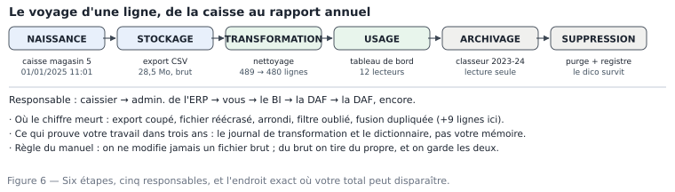

# M01.C06 — Le cycle de vie d'une donnée : naissance, stockage, transformation, usage, archivage, suppression

**Outil de ce chapitre :** schéma sur papier ou tableau blanc, un tableur pour la partie écriture. **Durée indicative :** 4 h. **Niveau :** N1.

> **L'idée du chapitre.** Une ligne de vente ne « vit » pas dans un fichier : elle traverse six états, change de mains quatre fois, et survit à trois logiciels. Celui qui ne connaît que l'état « tableau de bord » produit des chiffres sans mémoire ; celui qui connaît le cycle entier sait **où** son chiffre a pu mourir, **qui** peut le contester, et **combien de temps** il doit pouvoir le retrouver. Ce chapitre est le seul du module qui ne comporte aucun calcul — et c'est celui qui, en entreprise, vous évitera le plus de désagréments.

---

## 1. Objectifs du chapitre

À la fin de ce chapitre, vous saurez :

1. **Décrire** les six étapes du cycle d'une donnée et les responsabilités associées, sur un cas réel : la ligne d'un ticket du magasin 5 ;
2. **Situer** un incident dans le cycle : à quelle étape, chez qui, et avec quelle preuve retrouvable ;
3. **Rédiger** trois artefacts professionnels : le **dictionnaire de données**, le **journal de transformation**, la **politique de conservation** (une page chacun) ;
4. **Expliquer** le versionnage d'un jeu de données (pourquoi on garde l'historique des fichiers et pas seulement des rapports) ;
5. **Décider** de la suppression : ce qui doit disparaître, ce qui doit survivre, et dans quel ordre ;
6. **Nommer** les obligations qui pèsent sur une donnée client (protection, minimisation, durée) sans jargon juridique, avec les réflexes qui vont avec.

---

## 2. Pourquoi cette notion est importante

**Situation 1 — le chiffre disparu.** Trois mois après la clôture d'exercice, un contrôleur demande le détail d'un total. Le rapport PDF existe. Le fichier de travail a été écrasé par la version du mois suivant, parce que le nom du fichier ne portait pas de date. Le total devient « une affirmation de l'analyste ». La réponse professionnelle — reproductible en cinq minutes — aurait été : garder les entrées, les sorties, et le journal.

**Situation 2 — la suppression qui détruit la preuve.** Un poste est libéré, le service nettoie le dossier partagé, et fait disparaître les fichiers sources de 2023. En zone OHADA, les pièces comptables se conservent **10 ans** : un chiffre d'affaires publié sur une base détruite n'est plus défendable, ni devant l'administration, ni devant un associé sortant. La suppression est une étape du cycle comme les autres, et elle se planifie.

**Situation 3 — les données personnelles en trop.** Pour calculer un chiffre d'affaires par type de client, un analyste télécharge la table complète avec noms, téléphones et e-mails, la dépose sur un disque perso pour travailler le week-end. Aucun chiffre n'est faux, et pourtant il y a un problème : ce n'est pas la bonne **étape**, ni le bon **périmètre**, ni le bon **support**. La protection des données se règle dans le cycle, pas après le rapport.

> **Dans les faits.** Dans le socle du manuel, une ligne de vente naît à la caisse du magasin 5, est exportée chaque nuit dans `ventes_brutes.csv` (243 360 lignes, 28,5 Mo), nettoyée en `ventes_propres.csv` (240 000 lignes), agrégée dans des tableaux mensuels, publiée dans un rapport, archivée après clôture à 3 ans, et purgée à 10 ans — **sauf** le dictionnaire et le journal, qui survivent, parce qu'ils expliquent. Cette chaîne, vous allez la parcourir de bout en bout au fil des modules : M04-M05 (nettoyage), M07-M08 (transformation), M13-M18 (usage), M21-M22 (gouvernance et soutenance).

---

## 3. Explication simple

Prenez le ticket de caisse d'un client qui achète onze sacs de plâtre, le 1ᵉʳ janvier 2025 à 11 h 01. Suivez-le.

1. **Naissance.** La caissière scanne, le logiciel écrit une ligne. Ce qui naît, ce n'est pas « une vente » : c'est **une ligne d'article**, avec un numéro de ticket, une date de **saisie**, un identifiant client éventuellement vide. Ce que la caisse ne note pas — l'absence de client identifié, par exemple — n'existera jamais nulle part. *Une donnée est un traceur du processus qui l'a produite.*
2. **Stockage.** La nuit, le logiciel exporte un CSV. Le fichier atterrit sur un serveur. Deux choses peuvent mourir ici : l'export interrompu (il écrit 80 % des lignes) et la réécriture (le même nom, un fichier différent). *Une donnée sans date ni empreinte n'est pas une version, c'est un instantané.*
3. **Transformation.** Vous ouvrez le fichier, retirez les doublons, convertissez les montants, créez une colonne mois. Ici se joue l'honnêteté du résultat : tout choix non écrit est une modification invisible. *Une transformation sans journal est une opinion.*
4. **Usage.** Le chiffre d'affaires mensuel s'affiche dans un tableau de bord, le directeur l'évoque en réunion, un commercial ajuste sa relance. L'usage est l'unique étape où la donnée produit de la valeur, et le seul endroit où le public voit quelque chose. *Une donnée qui ne sert à aucune décision n'a que des coûts.*
5. **Archivage.** L'année est close. On fige les fichiers et les rapports en lecture seule, avec le dictionnaire et le journal à côté. *Archiver, c'est rendre rejouable, pas seulement garder.*
6. **Suppression.** Le délai légal passe. On purge les détails, on garde les agrégats et la documentation, on note ce qui a été supprimé et pourquoi. *Supprimer proprement est plus difficile que ne rien supprimer ; supprimer n'importe comment est une faute.*



---

## 4. Vocabulaire essentiel

| Français — English | Définition simple | Piège à éviter |
|---|---|---|
| **Cycle de vie — lifecycle** | Ensemble des états d'une donnée, de sa production à sa disparition. | Croire que le cycle finit au tableau de bord. |
| **Source de vérité — system of record** | Le système où l'information est officiellement détenue (ici : la caisse). | Exporter depuis un rapport au lieu d'exporter depuis la source. |
| **Donnée brute — raw data** | État au moment de la réception, non modifié. | Corriger le brut « pour aller vite » : la référence disparaît. |
| **Empreinte — checksum / hash** | Signature courte calculée sur le contenu du fichier (MD5, SHA-256). | Comparer deux fichiers par la taille seule : deux fichiers de même taille peuvent différer. |
| **Ligne d'eau — watermark** | Marqueur de ce qui a déjà été traité (date, n° d'enregistrement). | Ré-exécuter un import et doubler les lignes. |
| **Journal de transformation — transformation log** | Liste datée, ordonnée, des opérations appliquées. | Le rédiger après coup, de mémoire. |
| **Dictionnaire de données — data dictionary** | Document qui décrit colonnes, types, unités, règles, provenance. | Le garder dans la tête : il meurt avec la personne. |
| **Versionnage — versioning** | Conservation des états successifs, identifiables et comparables. | Remplacer la version précédente sans la nommer. |
| **Jeu figé — frozen dataset** | Copie verrouillée, référencée par un identifiant, servant de base officielle à une publication. | Publier un chiffre depuis un fichier qui continue d'évoluer. |
| **Rétention — retention** | Durée de conservation, et ce que l'on détruit à l'échéance. | Conserver tout (coût, risque juridique) ou ne rien conserver (perte de preuve). |
| **Anonymisation / pseudonymisation** | Retirer ou remplacer les identifiants directs avant usage. | Croire qu'enlever le nom suffit : un téléphone ou une ville suffisent à ré-identifier. |
| **Minimisation — data minimisation** | Ne traiter que les champs nécessaires à la question. | « Télécharger toute la table au cas où ». |

---

## 5. Cours approfondi

### 5.1 Les six étapes, avec leur preuve documentaire

Chaque étape produit un **artefact** — un document, un fichier, une trace — et c'est ce qui distingue une chaîne de traitement d'un bricolage.

| Étape | Ce qui se passe | Responsable principal | Artefact de preuve | Défaut typique de l'étape |
|---|---|---|---|---|
| Naissance | saisie, capteur, formulaire | opérationnel (caissier, magasinier) | le ticket, la ligne en base | oubli de saisie, double scan |
| Stockage | écriture, export, transfert | informatique / éditeur du logiciel | fichier daté + empreinte, journal d'export | export partiel, réécrasement |
| Transformation | nettoyage, recalcul, enrichissement | **vous** | script ou classeur de travail + journal | correction non écrite, arrondis en cascade |
| Usage | consultation, décision, publication | métier / direction | le rapport + la note de périmètre | chiffre cité hors période, filtre oublié |
| Archivage | figement, classement | vous + DSI | jeu figé + dictionnaire + manifeste | archivage sans le code qui a produit le chiffre |
| Suppression | purge, anonymisation | DSI + responsable légal | registre de suppression | suppression du dictionnaire, conservation de données personnelles inutiles |

Lisez le tableau de bas en haut une fois : un chiffre d'affaires de 2023, cité en réunion en 2026, ne peut être défendu que si les six artefacts existent. Un seul manque et l'argument devient « je crois me rappeler ».

> **Définition.** **Source de vérité — system of record** — le système où une information est officiellement détenue : ici, la caisse du magasin. Tout le reste en est une copie, plus ou moins fraîche. Travailler sur une copie est licite, pour la performance ou pour ne pas gêner l'exploitation, à une condition : le retard doit être écrit et connu.

> **Définition.** **Donnée brute — raw data** — l'état exact de ce qui a été reçu, octet pour octet, avant la moindre correction. Le brut n'est pas « le fichier moche » : c'est la seule preuve de ce que le système émetteur contenait ce jour-là. On le lit, on ne l'édite pas.

### 5.2 Le dictionnaire de données : votre premier document professionnel

Le dictionnaire décrit **les colonnes**, pas le logiciel. Une ligne par colonne, sept informations, et il est terminé. Modèle, appliqué à notre fichier d'atelier :

| champ | type | unité / domaine | règle de calcul | provenance | défauts connus | commentaire |
|---|---|---|---|---|---|---|
| `n_ticket` | texte | — | émis par la caisse, unique par vente | `caisse.log` | 9 lignes dupliquées dans l'extrait | sert de clé avec `produit` |
| `date` | date | jour | date de l'opération, pas de la saisie | caisse | 65 lignes en `JJ/MM/AAAA` | à normaliser en ISO avant tout regroupement |
| `magasin` | texte | 1 à 6 + dépôt | référentiel `magasins.csv` | caisse | — | le dépôt (id 6) ne vend pas au comptoir |
| `client` | texte | identifiant | `0` = vente au comptoir | caisse | 18 vides | vide ≠ 0 : le vide est une absence |
| `quantite` | nombre | unité du produit | signée (négatif = retour) | caisse | 7 lignes > 500 | à contrôler par plage métier |
| `prix_unitaire_ht` | nombre | FCFA HT | prix catalogue du jour | tarif | — | TVA 18 % appliquée au total, pas à l'unité |
| `remise` | nombre | **proportion** | 0 à 0,40 | saisie vendeur | — | les valeurs > 0,4 sont des points de % mal saisis |
| `montant_ht` | nombre | FCFA | `quantite × prix × (1 − remise)`, arrondi à l'entier | calcul caisse | — | contrôle de cohérence avec `quantite` |
| `montant_ttc` | nombre | FCFA | `montant_ht × 1,18`, arrondi | calcul caisse | 486 lignes en texte | total de référence du module : 36 073 185 FCFA (nettoyé) |

Une colonne **défauts connus** est ce qui fait la différence entre un dictionnaire d'intention et un dictionnaire utile : elle évite à celui qui reprend le travail de redécouvrir la même chose dans six mois. Ce dictionnaire est un livrable du projet M01.P ; il sera réutilisé et complété en M04 (nettoyage), M05 (qualité), M06 (modélisation), M21 (gouvernance). **Version alternative pour un petit écran** — ce dictionnaire de sept colonnes se lit par la seule colonne
« défauts connus », qui porte l'essentiel : 9 lignes dupliquées, 65 dates écrites en texte, 18 clients vides, 7
quantités au-dessus de 500, 486 montants en texte, TVA appliquée au total. Les six autres colonnes disent seulement
où poser la main.

> **Définition.** **Manifeste de jeu de données** — *dataset manifest* — fiche courte qui accompagne un jeu figé : ce qu'il contient, d'où il vient, quelle version du code l'a produit, quelles empreintes, quelles limites connues, qui a validé, à quelle date. Cinq minutes à écrire ; il rend un archivage compréhensible par un inconnu — donc par vous dans trois ans.

### 5.3 Versionner un jeu de données : trois mécaniques, par ordre de sérieux

1. **Le nommage daté** (acquis au chapitre 1) : `2025_ventes_M5_brut.csv` ne change jamais ; le nettoyage produit `2025_ventes_M5_propre_v1.csv`. Simple, mais rien n'empêche l'écrasement.
2. **Le dossier de version + le manifeste** : chaque livraison de travail a son répertoire `2026-09-17_v1/` contenant données, code, journal, manifeste. On ne modifie jamais une version publiée ; on ouvre la suivante.
3. **Le dépôt de versions** (Git) : suit les fichiers *texte* — scripts, requêtes, dictionnaire, journal — et pas les gros fichiers de données, qui y sont mal à l'aise. Un `README` daté et un commit par livrable. C'est l'objet du module M21 ; en attendant, la discipline 2 suffit et prépare la 3.

Ce qui compte, dans les trois cas, est le même : **à tout instant, on doit pouvoir répondre « de quel fichier vient ce chiffre ? » et le rouvrir.**

> **Définition.** **Empreinte — checksum / hash** — une signature courte calculée sur le contenu d'un fichier. Même empreinte, même contenu ; empreinte différente, contenu différent — sans avoir à ouvrir ni à comparer les lignes. L'empreinte remplace la confiance par un contrôle, et c'est ce qui manque dans la plupart des échanges de fichiers par courriel.

> **Définition.** **Jeu figé — frozen dataset** — copie verrouillée, nommée, référencée par un identifiant, sur laquelle un chiffre publié a été calculé. C'est ce qui permet, un an plus tard, de retrouver exactement le total annoncé. Sans jeu figé, le même rapport se recalcule différemment le lendemain, et les chiffres se contredisent en réunion.

### 5.4 Journal de transformation : le format, et cinq exemples

Format imposé par le manuel, une ligne par opération :

```
AAAA-MM-JJ HH:MM  auteur  [fichier source → fichier cible]  opération  entrée=n  sortie=n  écart  motif
```

Appliqué à l'échantillon de l'atelier, les cinq entrées qui comptent vraiment :

```
2026-09-17 09:12  a.minani  [brut/2025_ventes_M5_brut.csv → propre/2025_ventes_M5_propre_v1.csv]  import, 13 colonnes déclarées texte  entrée=489 sortie=489  écart=0  motif: éviter tout typage automatique
2026-09-17 09:26  a.minani  [brut/2025_ventes_M5_brut_recu2026-09-17.csv → propre/2025_ventes_M5_propre_v1.csv]  suppression 9 lignes strictement identiques  entrée=489 sortie=480  écart=-9  motif: doublons d'export, total TTC -266 132 FCFA (0,74 %)
2026-09-17 09:41  a.minani  [propre/2025_ventes_M5_propre_v1.csv]  normalisation date → ISO  entrée=480 sortie=480  écart=0  motif: 65 lignes en JJ/MM/AAAA ; contrôle par répartition mensuelle (décembre 5 292 517 FCFA)
2026-09-17 09:58  a.minani  [propre/2025_ventes_M5_propre_v1.csv]  montant_ttc texte → nombre  entrée=480 sortie=480  écart=0  motif: 486 lignes avec espace de milliers ; contrôle NB = NBVAL OK
2026-09-17 10:07  a.minani  [propre/2025_ventes_M5_propre_v1.csv]  7 lignes quantité > 500 marquées suspectes, **non supprimées**  entrée=480 sortie=480  écart=0  motif: montant cohérent avec le prix, doute sur l'unité de saisie ; décision reportée au module 4 avec le métier
```

Deux remarques. D'abord, dans un vrai journal, on répète le nom complet du fichier à chaque ligne : la concision n'est jamais un motif d'ambiguïté. Ensuite — et c'est le point capital de ce format — **on peut signaler sans supprimer** : la dernière entrée documente sept lignes douteuses qui restent dans le fichier. Cette distinction entre « défaut traité » et « défaut documenté » est la marque du professionnel : le premier se corrige, le second s'annonce, et les deux s'écrivent.

Règles du journal : on n'efface jamais une ligne ; on en ajoute une qui annule la précédente (« 10:15 correction : le point 4 s'appliquait aussi à… ») ; chaque suppression de ligne s'accompagne du **motif** et de l'**écart chiffré**. Un journal sans écart chiffré est un agenda.

### 5.5 Les points de rupture : où votre chiffre meurt réellement

Les six étapes ont chacune leur mode de mort statistiquement dominant dans les PME sans informatique structurée. Apprenez la liste : elle sert de grille de diagnostic.

1. **Naissance** : oubli de saisie, ou saisie en fin de journée « de mémoire ». Le chiffre est faux **avant** d'exister dans un fichier. Contre-mesure : contrôles à la saisie, et, côté analyse, jamais de conclusion de cause profonde sur un processus non instrumenté.
2. **Stockage** : export partiel, réécrasement, fichier envoyé par messagerie et modifié en pièce jointe. Contre-mesure : empreinte + nom daté + un seul dossier de référence.
3. **Transformation** : arrondis successifs, filtre oublié, jointure qui multiplie (M04, M07), suppression silencieuse de lignes « douteuses ». Contre-mesure : le journal, et un total de contrôle à chaque étape (ici, 36 073 185 FCFA).
4. **Usage** : le chiffre est cité hors de son périmètre (« décembre = 5,3 M » répété sans dire *magasin 5, 2025, extrait*), ou comparé à une autre source dont la définition diffère (HT vs TTC, retours inclus ou non). Contre-mesure : la note de périmètre à côté de tout chiffre publié, y compris dans l'e-mail.
5. **Archivage** : on archive le rapport sans le code, sans le journal, sans le dictionnaire. Contre-mesure : le manifeste ; cinq minutes.
6. **Suppression** : on supprime trop (preuve perdue) ou on conserve trop (données personnelles inutiles, coût, risque en cas d'intrusion). Contre-mesure : la politique de conservation.

> **Attention.** Ré-exécuter un import sans point d'arrêt **double les lignes** : le total est faux, et il est faux en beau — c'est le défaut que l'on découvre le plus tard. La parade tient en deux mots : marqueur de reprise (*watermark*, la dernière date ou le dernier identifiant déjà traité) et clé unique dans la table d'arrivée, qui refuse le deuxième envoi.

### 5.6 Conserver, purger, protéger : la politique en une page

Un modèle utilisable dès votre premier stage, et qui tient sur une page :

| Catégorie | Exemple | Durée | Support et protection | À l'échéance |
|---|---|---|---|---|
| Pièces comptables et justificatifs | exports de caisse, factures | 10 ans (zone OHADA) | serveur de l'entreprise, accès restreint, chiffré | purge avec registre |
| Données d'exploitation | stocks, objectifs | 3 ans | dossier de travail + sauvegarde froide | agrégats gardés, détail purgé |
| Données clients à caractère personnel | noms, téléphones, e-mails | le temps de la relation + durée légale de prospection | base métier, jamais copie personnelle | suppression ou anonymisation |
| Traces de travail | journal, scripts, dictionnaire | 10 ans (alignées sur la donnée qu'elles expliquent) | dépôt de versions ou archive lisible | conservées plus longtemps que la donnée |
| Rapports publiés | PDF signés, tableaux figés | 10 ans | archive officielle, lecture seule | jamais purgés sans validation de la direction |

La ligne la plus contre-intuitive est la quatrième : **la documentation survit à la donnée**. Si les détails sont purgés, le dictionnaire et le journal permettent encore de comprendre ce que signifiait le chiffre et comment il a été obtenu. C'est pourquoi on ne supprime jamais les deux en même temps que les sources.

Côté protection, trois réflexes qui ne se discutent pas, quel que soit le pays : (1) pas de copie personnelle de données clients sur un disque privé ou une messagerie privée ; (2) minimisation — si la question porte sur le chiffre d'affaires par catégorie, la table `clients` n'a pas besoin des téléphones ; (3) si un échantillon est nécessaire pour débugger, on le **pseudonymise** (remplacer les identifiants par des numéros séquentiels, en gardant la table de correspondance uniquement sur le poste métier).

> **Conseil professionnel.** Quand on vous demande « tu peux me renvoyer le fichier avec les données clients ? », demandez d'abord **quelle question** il doit servir. Dans la majorité des cas, une table agrégée par client (sans nom, sans téléphone) suffit — et vous venez d'éviter une fuite sans rien refuser. Cette esquive élégante est une compétence de métier, pas une prudence de juriste.

---

> **Attention.** Retirer la colonne « nom » ne rend pas un fichier anonyme. Un numéro de téléphone, une date de naissance et une ville suffisent souvent à retrouver une personne dans une population de quelques dizaines de milliers d'individus. La protection se juge sur le risque de ré-identification, pas sur la suppression d'un champ.

> **À retenir.** Le cycle de vie ne s'arrête pas au tableau de bord : il s'arrête quand la donnée est archivée ou détruite, avec une date et une décision écrites. Les trois preuves qui protègent un analyste sont le brut conservé, le journal de transformations et le jeu figé référencé — pas le logiciel utilisé.

## 6. Exemple concret : une ligne, trente-deux mois, six fichiers

Notre ligne du 1ᵉʳ janvier 2025, onze sacs de plâtre à 4 500 FCFA, `montant_ttc = 56 658 FCFA`, dans le cycle complet du socle du manuel :

| Date | État | Fichier ou système | Ce qui a changé pour elle |
|---|---|---|---|
| 2025-01-01 11:01 | née | caisse du magasin 5 | rien : 3 lignes dans le ticket (2 articles, 1 remise) |
| 2025-01-02 02:00 | stockée | `ventes_brutes.csv` (243 360 lignes, 28,5 Mo) | dates et montants devenus du texte |
| 2025-01-15 | extraite | `projection/ventes_magasin5_2025.csv` (489 lignes) | échantillon de 40 lignes par mois, donc 40 lignes par mois |
| 2026-09-17 | transformée | `reference/ventes_magasin5_2025_ATTENDU.csv` (480 lignes) | 9 doublons retirés, montant converti, date ISO |
| 2026-09-18 | agrégée | table mensuelle (12 lignes) | décembre 5 292 517 FCFA, janvier 2 051 424 FCFA |
| 2026-10 | usagée | rapport direction + note | le chiffre est cité **avec** périmètre, grâce au journal |
| 2028 | figée | archive `2025_close/` + manifeste | lecture seule, empreintes, dictionnaire à côté |
| 2036 | purgée | registre de suppression | détail effacé, dictionnaire et journal conservés |

Remarquez deux choses. D'abord le chemin de la ligne : du **ticket** au **total mensuel** en passant par **quatre fichiers**, dont un échantillon de 489 lignes qui n'est **pas** l'intégralité de l'année du magasin (40 lignes par mois, pas 480 réparties au hasard). C'est précisément ce qui rend le jeu pédagogique : un échantillon qui se prend pour une population est l'erreur la plus fréquente des débutants (M02, M11).

Ensuite, la ligne « 2025-01-15 » : **un extrait de travail**. Un extrait n'est jamais une source ; il doit être nommé comme tel, daté, et sa taille annoncée. Le fichier de l'atelier pèse 489 lignes : si vous l'appelez « les ventes 2025 » dans un mail, vous venez d'inventer un chiffre d'affaires de 36 073 185 FCFA comme étant celui de l'entreprise, alors que le total de l'extrait correspond à **0,23 %** du chiffre consolidé (15 419 985 157 FCFA sur 4 ans). L'ampleur de la confusion fait peur, et elle se prévient avec un mot dans le nom de fichier : `extrait`.

---

## 7. Démonstration pas à pas : reconstruire le cycle d'un fichier reçu

Exercice complet, à faire sur le poste, 25 minutes. Objectif : produire les trois artefacts (§5.2, §5.4, §5.6) à partir d'un fichier reçu, sans rien calculer d'analytique.

**Étape 1 — Recevoir (2 min).** Copiez le fichier dans `01_brut/`, nommez-le `2025_ventes_M5_brut_recu2026-09-17.csv`, passez-le en lecture seule. Première ligne du journal, avec la taille (32 Ko) et le nombre de lignes (489).

**Étape 2 — Empreinter (3 min).** Sous Windows (PowerShell) ou terminal :

```powershell
Get-FileHash .\01_brut\2025_ventes_M5_brut_recu2026-09-17.csv -Algorithm SHA256
```
```bash
sha256sum 01_brut/2025_ventes_M5_brut_recu2026-09-17.csv
```

Notez l'empreinte dans le journal **et** dans un fichier `00_doc/empreintes.txt`. Deux ans plus tard, cette ligne prouvera que le fichier que vous aviez est bien celui-là — utile quand un prestataire jure qu'il vous a envoyé autre chose.

**Étape 3 — Décrire la structure (5 min).** Ouvrez le fichier en texte brut, notez : 13 colonnes, séparateur `;`, encodage, ligne d'en-tête exacte, trois premières et trois dernières lignes. Résultat attendu : l'en-tête `n_ticket;date;heure;magasin;vendeur;client;produit;categorie;quantite;prix_unitaire_ht;remise;montant_ht;montant_ttc` et la dernière ligne du 31 décembre 2025.

**Étape 4 — Écrire le dictionnaire (6 min).** Reprenez le modèle du §5.2 : neuf lignes suffisent pour les colonnes qui servent au calcul ; les quatre autres reçoivent « attribut descriptif, non utilisé dans les totaux ». La colonne **défauts connus** se remplit avec les comptages réels : 9 doublons, 65 dates à deux formats, 486 montants en texte, 7 quantités suspectes, 18 clients vides.

**Étape 5 — Ouvrir le journal de transformation (2 min).** Les deux premières entrées (réception, empreinte), puis une ligne vide de contrôle : `prochain contrôle attendu : total TTC après nettoyage = 36 073 185 FCFA (±1 ligne)`. Vous venez d'écrire une obligation de résultat pour vous-même, vérifiable par n'importe qui.

**Étape 6 — Fixer la politique (4 min).** Une page, trois colonnes : ce que je garde (brut, propre, journal, dictionnaire), combien de temps (10 ans pour le brut, aligné sur la valeur comptable du chiffre ; 3 ans pour mes brouillons), où (dossier de travail + disque chiffré + sauvegarde froide, pas de copie personnelle). Signez-la et datez-la ; en stage, faites-la viser par le responsable. Ce document, anodin, est celui qui vous protégera — pas l'inverse.

**Contrôle final de la démonstration.** Un collègue, sans vous voir, doit pouvoir : (1) dire d'où vient le fichier ; (2) retrouver son empreinte ; (3) savoir quelles colonnes sont des montants et lesquelles sont des identifiants ; (4) expliquer les 9 lignes manquantes entre brut et propre ; (5) savoir quoi en faire dans dix ans. Si une des cinq échoue, le dossier n'est pas fini.

---

## 8. Erreurs fréquentes

| Symptôme | Cause | Correction |
|---|---|---|
| Le chiffre du mois change entre deux demandes | Le fichier source a continué d'évoluer | Figer un **jeu de travail** pour la période publiée, avec un identifiant de version |
| Deux fichiers « identiques » aux totaux différents | L'un a été enregistré depuis Excel (dates, arrondis, colonne de garde) | Un brut se lit, ne s'édite pas ; comparer les empreintes pour trancher |
| Impossible de retrouver le code d'un chiffre de 2023 | Le script vivait sur le bureau, le poste a changé | Le code vit avec la donnée (dépôt ou dossier `03_analyse`), jamais sur un support personnel |
| Suppression de « lignes bizarres » non tracée | Nettoyage sans journal | Marquer, ne pas supprimer : une colonne `statut_qualite` et une ligne de journal |
| Le dictionnaire ne correspond plus aux fichiers | Écrit une fois, jamais entretenu | Révision à chaque nouveau champ, et une ligne dans le manifeste |
| Copie de 3 Go de données clients sur une clé USB | Convenience | Question à trancher en amont : la table agrégée suffit presque toujours |
| Un « export du rapport » utilisé comme source | Confusion source de vérité / vue | Retomber sur la source (caisse, base), jamais sur un document de sortie |

---

## 9. Bonnes pratiques professionnelles

- [ ] Réception = copie + renommage daté + lecture seule + empreinte + entrée de journal.
- [ ] Un dictionnaire par jeu, tenu à jour à chaque champ ajouté ou retiré.
- [ ] Journal de transformation à chaque opération non triviale, avec `entrée=n sortie=n écart` chiffré.
- [ ] Signaler plutôt que supprimer, quand le doute est métier.
- [ ] Un jeu figé et un manifeste pour chaque publication.
- [ ] Le code vit à côté de la donnée qui l'a vu naître.
- [ ] Politique de conservation écrite, datée, visée ; documentation conservée plus longtemps que la donnée.
- [ ] Minimisation et pseudonymisation des échantillons de test ; jamais de copie personnelle de données clients.
- [ ] Un extrait est nommé `extrait_`, avec sa taille et sa période dans le nom.

---

## 10. Exercice guidé — reconstituer l'histoire d'un dossier à charge

**Contexte.** Vous reprenez le travail d'une personne partie. Dans `D:/Travail/`, un seul dossier, `rapports/`, contient :

```
CA 2023.xlsx                    1,1 Mo   12/09/2024
CA 2023_final.xlsx              1,2 Mo   03/10/2024
rapport_ca_2023.pdf             240 Ko   15/09/2024
notes.txt                       4 Ko     12/09/2024
base.mdb                        38 Mo    31/08/2024
```

Reconstruisons, en posant les questions dans l'ordre du cycle.

1. **Source de vérité ?** `base.mdb` (base Access, 38 Mo, dernière écriture fin août) ressemble à la source ; `CA 2023*.xlsx` sont des transformations ; le PDF est un usage publié. Vérification : la taille et la date — un fichier de 38 Mo non modifié depuis plus de deux semaines est une source, un fichier de 1 Mo touché plus tard est une sortie.
2. **Lequel des deux classeurs a produit le PDF ?** Le PDF est daté du 15/09, `CA 2023.xlsx` du 12/09, `CA 2023_final.xlsx` du 03/10. Conclusion probable : le PDF vient du **premier**, et le second est un retravail postérieur. Preuve à chercher : ouvrir les deux, comparer le total de contrôle ; ouvrir le PDF, lire le total cité.
3. **Que dit `notes.txt` ?** Un fichier de 4 Ko daté du 12/09, donc du jour du premier classeur : c'est probablement un journal informel. Lisez-le **avant** de toucher aux fichiers : il contient peut-être la règle de retrait des retours, et c'est le seul endroit où elle est écrite.
4. **Le cycle est-il rejouable ?** Non : rien ne dit comment `base.mdb` est devenu `CA 2023.xlsx`. C'est la trace manquante, celle qu'il faut reconstituer en priorité — une requête Access, un export manuel ?
5. **Décision de reprise.** Plutôt que « refaire pareil », reprenez le cycle en amont : extraire de la base (étape 2), produire un CSV daté, écrire le dictionnaire et le journal, recalculer, **puis** comparer au PDF du 15/09 pour valider la reprise. Si l'écart est non nul, vous avez trouvé soit une transformation cachée, soit un chiffre publié faux — dans les deux cas, vous gagnez quelque chose.

Ce type de reprise est une activité réelle et rémunérée : audit de données, passation de consignes, continuité de service. Elle se joue sur quatre dates et trois tailles de fichiers, pas sur une maîtrise logicielle.

---

## 11. Exercices autonomes

**Exercice 6.1 (★) — Les six artefacts.** Pour le fichier de l'atelier, citez les six artefacts qui doivent exister à la fin du projet M01, et indiquez pour chacun le document (ou le fichier) où il vit. *( brut daté + empreinte · dictionnaire · journal · classeur/table de travail · livrable avec note de périmètre · manifeste + politique de conservation )*

**Exercice 6.2 (★) — Qui répond ?** Quatre questions posées en réunion : « pourquoi 489 lignes et pas 480 ? », « le CA est-il TTC ? », « décembre est-il vraiment le meilleur mois ? », « que devient le comptoir dans le classement clients ? ». Attribuez chacune à une étape du cycle et à l'artefact qui y répond. *( stockage/transformation → journal · transformation → dictionnaire (unité) · usage → note de périmètre et tableau mensuel · naissance/dictionnaire (`0` = comptoir) )*

**Exercice 6.3 (★★) — Datation Forensique.** Reprenez le dossier de l'exercice guidé : le total de `CA 2023_final.xlsx` diffère de celui du PDF de 1,8 %. Listez trois explications compatibles avec les dates, et le test qui les sépare. *( le second classeur intègre des régularisations postérieures au PDF · il contient les retours, pas le premier · il a été enregistré après un changement de séparateur de dates ; test : compter les valeurs distinctes de `n_ticket` et nombre de lignes, vérifier si `notes.txt` mentionne une régularisation, recalculer depuis `base.mdb` )*

**Exercice 6.4 (★★) — L'extrait qui ment.** Vous citez « CA 2025 du magasin 5 : 36 073 185 FCFA » alors que le fichier est un extrait de 489 lignes (40 par mois). Rédigez la phrase exacte qui rend la citation honnête, et celle qui aurait dû figurer dans le nom du fichier. *( attendu : « CA de l'extrait de 480 lignes utiles (40 lignes par mois), magasin 5, 2025 » ; nom : `2025_ventes_M5_extrait40parmois_brut.csv` )*

**Exercice 6.5 (★★★) — Politique.** Rédigez la politique de conservation d'un service qui produit des rapports mensuels à partir de la caisse, en cinq lignes maximum, couvrant : ce qui est la source, ce qui est figé, ce qui est purgé à 3 ans, ce qui survit à 10 ans, et l'interdit sur les supports personnels. *( barème implicite : une ligne par obligation, aucune phrase générale )*

---

## 12. Correction détaillée

**Exercice 6.1.** Brut : `01_brut/…_recu2026-09-17.csv` + `00_doc/empreintes.txt` ; dictionnaire : `00_doc/dictionnaire.md` (neuf lignes utiles) ; journal : `90_journal/journal_transformation.txt` ; travail : `03_analyse/2026-09-17_nettoyage_M5_v1.xlsx` ; livrable : `04_livrables/2026-09-17_note_CA_M5_minani.pdf` avec sa note de périmètre en page 1 ; archive : `99_archive/2025_close/` avec manifeste, plus la politique de conservation en `00_doc/`.

**Exercice 6.2.** 489 vs 480 → transformation, réponse dans le journal (9 doublons d'export) ; unité TTC → dictionnaire, ligne `montant_ttc` (TVA 18 %, arrondi à l'entier) ; décembre → usage + transformation, réponse par le tableau mensuel et le test de robustesse (voir M02) ; comptoir → naissance, réponse dans le dictionnaire (`0` = comptoir, à ne pas effacer). Quatre questions, quatre artefacts : c'est le mécanisme à intégrer, pas les réponses.

**Exercice 6.3.** Test discriminant, dans l'ordre de coût : (a) comparer les **nombres de lignes** des deux classeurs → si 480 vs 489, c'est un dédoublonnage, pas une régularisation ; (b) filtrer les lignes à `quantite` négative dans chacun → les retours ; (c) lire `notes.txt` à la recherche d'une mention de régularisation et de sa date. Un écart de 1,8 % sur un total de plusieurs dizaines de millions de FCFA se compte en centaines de milliers : soit l'équivalent d'un mois de l'extrait, soit un ensemble de retours. La taille de l'écart **oriente** la recherche — c'est le réflexe à noter.

**Exercice 6.4.** Phrase honnête : « Le total de **36 073 185 FCFA** est celui de l'extrait de travail (480 lignes utiles, 40 lignes retenues par mois, magasin 5, année 2025), après retrait de 9 doublons d'export ; il ne représente pas le CA du magasin sur l'année, qui suppose le fichier complet. » Nom de fichier : `2025_ventes_M5_extrait40parmois_brut.csv`. Un devoir qui écrit « le CA du magasin 5 » sans qualifier l'extrait a échoué, quel que soit le reste.

**Exercice 6.5.** Modèle recevable : (1) source = export quotidien de la caisse, déposé en `01_brut/`, jamais modifié, empreint et daté ; (2) chaque publication fige un jeu (`2025_close/`) avec dictionnaire, journal et manifeste ; (3) à 3 ans, purge des fichiers de travail et des extraits, agrégats mensuels conservés ; (4) à 10 ans, purge du détail des lignes, conservation des agrégats, du dictionnaire et du registre de suppression ; (5) aucune copie de données clients hors du parc de l'entreprise, supports personnels interdits, échantillons de test pseudonymisés.

---

## 13. Mini-projet M01.P6 — « Dossier d'archivage d'une publication » (35 min)

Vous publiez le total nettoyé de l'atelier (36 073 185 FCFA, extrait 480 lignes, magasin 5, 2025). Constituez `99_archive/2025_close/` contenant :

1. les deux fichiers de données (brut daté, propre nommé `…_v1`) ;
2. le dictionnaire (9 lignes minimum, colonne « défauts connus » renseignée avec les comptages réels) ;
3. le journal de transformation, 5 entrées minimum, chaque entrée avec `entrée=n sortie=n écart` ;
4. un manifeste d'une demi-page : contenu, empreintes, limites (« extrait de 40 lignes par mois, pas un CA annuel »), auteur, date, validation ;
5. un PDF ou une note d'une page avec la note de périmètre en tête.

Critères de réussite : un pair, qui n'a pas fait l'exercice, doit pouvoir **retrouver l'origine de chaque nombre cité** dans la note en moins de cinq minutes, et dire ce qui est archivé pour dix ans. Il écrit ses deux réponses ; toute réponse erronée annule le point de clarté. Barème : 6 pts reproductibilité · 4 pts exactitude des comptages (489/480/9/65/486/18/7) · 4 pts manifeste · 3 pts note de périmètre · 3 pts lisibilité de l'arborescence.

---

## 14. Résumé du chapitre

Six étapes, six responsabilités, six artefacts. La donnée naît dans un processus (et porte ses angles morts), se stocke (et peut être perdue là), se transforme (et doit laisser une trace chiffrée de chaque choix), sert (et c'est le seul endroit où elle a de la valeur), s'archive (avec son mode d'emploi, sinon rien) et se supprime (selon une politique écrite, pas selon l'humeur). Un chiffre défendable dans trois ans est le produit d'un cycle documenté, pas d'un tableur bien maîtrisé. Le dictionnaire, le journal et le manifeste sont les trois documents qui vous rendent crédible ; les deux premiers tiennent sur une page, et se tiennent à jour en une ligne par opération.

---

## 15. À retenir

> **À retenir.**
> 1. **Six étapes** : naissance · stockage · transformation · usage · archivage · suppression — chacune a son responsable et sa preuve.
> 2. **Trois documents** suffisent à rendre un chiffre défendable : dictionnaire, journal de transformation, manifeste d'archivage.
> 3. **Un extrait n'est pas une population** : nommez-le, datez-le, annoncez sa taille.
> 4. **Le brut est intouchable** ; on le duplique, on ne le corrige pas. Empreinte + date = version.
> 5. **La documentation survit à la donnée** ; la minimisation et l'interdit de copie personnelle protègent davantage que n'importe quel logiciel de sécurité.

---

## 16. Évaluation formative (auto-correction, 10 min)

1. Un chiffre publié est contesté trois ans plus tard. Citez, dans l'ordre où vous les ouvrez, les trois documents à consulter. *( note de périmètre du livrable → journal de transformation → dictionnaire ; puis le brut si un recomptage est nécessaire )*
2. À quoi sert une empreinte (hash) de fichier, et que ne dit-elle pas ? *( prouve l'identité binaire du contenu, donc l'absence de modification · ne dit rien de la justesse métier des valeurs )*
3. Pourquoi archive-t-on le **code** et pas seulement le rapport ? *( sans le code, le rapport n'est pas rejouable ; l'archivage sans transformation documentée est un stockage, pas une preuve )*
4. Un fichier nommé `CA 2025_final_final(2).xlsx` : trois défauts de cycle, un par mot. *( « final » = absence de versionnage réel · « (2) » = écrasement implicite · pas de date = impossible de dater l'état ; le quatrième défaut, gratuit : on ne sait pas qui l'a produit ni à quelle source il correspond )*
5. **Question ouverte :** on vous demande d'envoyer par e-mail la table clients complète pour « vérifier les téléphones ». Répondez en quatre phrases, en distinguant l'objet, le risque et la solution de rechange. *( la question réelle est « les numéros sont-ils valides » → un échantillon pseudonymisé de 200 lignes ou un contrôle automatique (longueur, format, doublons) répond sans exposer 23 500 clients ; l'envoi d'une table nominative par messagerie est un incident potentiel ; je propose le contrôle chiffré, avec le nombre de numéros invalides, et je garde la preuve dans le journal )*
