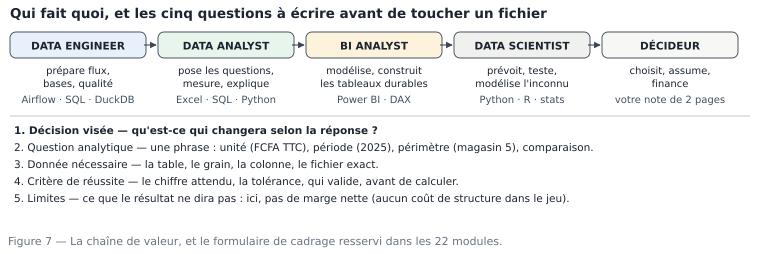

# M01.C07 — Les métiers de la donnée, la chaîne de valeur, et l'anatomie d'une analyse

**Outil de ce chapitre :** traitement de texte ou tableur pour la rédaction ; aucun logiciel de données. **Durée indicative :** 5 h. **Niveau :** N1.

> **L'idée du chapitre.** Vous allez apprendre quatre outils (tableur, SQL, Python, Power BI). Ce n'est pas le classement qui compte dans un emploi, ni dans une mission. Ce qui compte, c'est de savoir **à quel moment de la chaîne** vous intervenez, **quelle question** vous traitez, et **quelle preuve** vous laissez. Ce chapitre ferme le socle : il nomme les métiers, montre la chaîne de valeur, démonte une analyse en six temps, et répond à la question que tout débutant pose trop tard — *quel outil, pour quoi, et pourquoi celui-là*.

---

## 1. Objectifs du chapitre

À la fin de ce chapitre, vous saurez :

1. **Distinguer** les cinq métiers voisins (data engineer, data analyst, BI analyst, data scientist, responsable de la donnée) et décrire ce que chacun **livre**, pas ce qu'il « connaît » ;
2. **Situer** une mission dans la chaîne de valeur et identifier les deux maillons manquants quand un projet bloque ;
3. **Décomposer** une analyse en six temps (cadrage · données · préparation · mesure · interprétation · décision) et estimer le temps de chacun ;
4. **Écrire** une question analytique correcte à partir d'une demande floue, en respectant les cinq composants vus en M01.C02 ;
5. **Choisir** un outil pour une situation donnée et **justifier** le choix par trois critères : volume, relecteur, rejouabilité ;
6. **Rédiger** la note d'une page qui fait passer d'un chiffre à une décision — l'exercice le plus noté de tout le parcours.

---

## 2. Pourquoi cette notion est importante

**Situation 1 — le profil mal employé.** Une PME recrute un « data scientist », lui donne un fichier de caisse et demande un prévisionnel de ventes. Le recrutement était trop cher, la donnée trop sale, la demande trop vague. La bonne embauche, ou la bonne mission, était un analyste capable de préparer les données trois semaines et de produire un tableau mensuel lisible. Connaître les métiers évite les erreurs de dimension — chez le client comme chez vous.

**Situation 2 — l'analyse sans fin.** Un projet traîne six semaines : personne n'a écrit ce que « succès » voulait dire. Le cadrage absent se paie en réunions. Les six temps de l'analyse existent pour être **chronométrés** : un cadrage d'une heure en sauve dix.

**Situation 3 — l'outil mal choisi.** Un rapport mensuel de 216 lignes est construit dans un outil de BI avec un modèle sémantique, des actualisations planifiées et six pages de documentation. Coût : trois jours. Un tableau dans un classeur, validé et verrouillé : quarante minutes, même résultat, moins de maintenance. À l'inverse, un fichier de 243 360 lignes retapé à la main dans un tableur chaque semaine, c'est un accident programmé. Le bon outil est celui qui rend le service **au moindre coût de maintenance**, pas le plus impressionnant.

> **Dans les faits.** Les offres d'emploi francophones « data analyst » demandent en majorité SQL et un outil de visualisation, avec le tableur en compétence implicite et Python comme différenciant ; les offres « BI » ajoutent le modèle sémantique et la gouvernance. À l'inverse, dans les PME sans service informatique, c'est le tableur et la qualité des fichiers qui font la différence — et c'est précisément ce que les modules 3 à 6 vous font travailler. La chaîne de valeur, elle, est la même partout ; ce qui change, c'est le nombre de personnes par maillon.

---

## 3. Explication simple

Imaginez une chaîne de montage de la décision :

1. **le data engineer** construit le convoyeur : il fait arriver la donnée, propre au sens technique, à l'heure, à la bonne taille ;
2. **l'analyste** prend une pièce, la mesure, dit ce qu'il constate et ce que ça veut dire ;
3. **le BI analyst** installe les instruments de mesure au mur : les tableaux que tout le monde regarde, avec des règles communes ;
4. **le data scientist** fabrique un dispositif qui anticipe la pièce suivante, avec un risque chiffré ;
5. **le décideur** tranche, engage de l'argent ou des gens.

Votre parcours vous rend **analyste** en priorité, **BI** à partir du module 13, capable de parler **data engineering** au module 24, et instruit en science des données aux modules 19 à 21. Ce n'est pas un empilement de casquettes : c'est la capacité à comprendre le voisin, ce qui est, en entreprise, la première cause de promotion.



---

## 4. Vocabulaire essentiel

| Français — English | Définition simple | Piège à éviter |
|---|---|---|
| **Data engineer — ingénieur données** | Conçoit et exploite les flux, les bases, la qualité en amont. | Le confondre avec l'administrateur de base de données ; les deux se recouvrent parfois, les objectifs diffèrent. |
| **Data analyst** | Répond à des questions précises sur des données existantes, mesure, explique. | Se limiter à produire des visuels : sans interprétation ni décision, ce n'est pas de l'analyse. |
| **BI analyst — analyste décisionnel** | Construit le modèle de données et les rapports durables, définit les indicateurs communs. | Construire un joli tableau sans gouvernance (qui le valide ? à quelle fréquence ?). |
| **Data scientist — scientifique des données** | Modélise, prédit, expérimente sur ce qui n'est pas encore observé. | Prédire sur un historique non nettoyé : le modèle hérite des défauts. |
| **Responsable de la donnée — data steward** | Garantit le sens, la qualité, la conformité des données et du dictionnaire. | Le voir comme un poste technique : c'est d'abord un rôle métier. |
| **Chaîne de valeur — value chain** | Suite d'étapes qui ajoutent chacune quelque chose de vérifiable. | Croire que la valeur est à la fin : elle est à chaque maillon, et le premier fragile casse tout. |
| **Cadrage — scoping** | Accord écrit sur la question, le périmètre, le délai, le critère de réussite. | Le faire oralement : un accord oral n'existe pas à la deuxième contestation. |
| **Livrable — deliverable** | Objet remis, nommé, daté, avec un destinataire. | Confondre livrable et activité : « j'ai fait des analyses » n'est pas un livrable. |
| **Rejouabilité — reproducibility** | Capacité à refaire le même résultat plus tard, avec les mêmes entrées. | Un résultat obtenu par cinq clics non documentés n'est pas rejouable. |
| **Modèle sémantique — semantic model** | Couche qui définit une fois pour toutes les mesures et les relations (Power BI, M13). | Recalculer la même mesure dans chaque rapport : quatre définitions, quatre chiffres. |
| **Donnée de référence — master data** | Référentiels partagés : clients, produits, magasins, calendriers. | Laisser chaque service sa version du référentiel. |
| **Métier — business / functional owner** | La personne qui répond aux questions de sens (« un retour, ça compte dans le CA ? »). | Trancher seul ces questions : c'est précisément le rôle du métier. |

---

## 5. Cours approfondi

### 5.1 Les cinq métiers, vus par ce qu'ils livrent

| Métier | Question typique | Livrables | Outils usuels | Échec typique si mal fait |
|---|---|---|---|---|
| **Data engineer** | « comment la donnée arrive-t-elle à l'heure, complète, non dupliquée ? » | flux planifiés, tables, contrôles de qualité automatisés, documentation des schémas | SQL, Python, DuckDB, orchestrateurs, bases | des rapports justes… sur des données de la semaine dernière |
| **Data analyst** | « que disent les données sur cette question précise ? » | note d'une page, tableau de bord ponctuel, requêtes, fichiers propres, journal | tableur, SQL, Python | des chiffres vrais mais inutiles, ou des conclusions hors périmètre |
| **BI analyst** | « comment faire que tout le monde voie le même chiffre, tous les lundis ? » | modèle sémantique, mesures documentées, rapports publiés, gouvernance des accès | Power BI, DAX, SQL, sécurité par niveau de ligne | deux directions avec deux totaux du même indicateur |
| **Data scientist** | « que peut-on anticiper, et avec quel risque ? » | modèles, validations, bornes d'incertitude, note de limites | Python/R, statistiques, jeux d'entraînement | un modèle brillant, inexpliquable, non utilisé |
| **Responsable de la donnée** | « que veut dire ce champ, qui le déclare, combien de temps on le garde ? » | dictionnaire, règles de qualité, politique de conservation | tableur, MDM, gouvernance | référentiels divergents, chacun « sa » version du client |

Trois lectures utiles :

- les frontières sont **porositaires** : dans une PME, une seule personne occupe trois cases, ce qui est exactement pourquoi ce manuel enseigne la chaîne complète ;
- les **compétences transverses** qui augmentent un salaire ne sont pas des outils : écrire clairement, poser une question, documenter ;
- **le décideur n'est pas un métier de la donnée**, c'est votre client. Apprendre à lui parler est une compétence du module 12, pas un bonus.

> **Définition.** **Chaîne de valeur — value chain** — la suite d'étapes par lesquelles une donnée devient une décision qui rapporte ou qui épargne. Elle sert d'outil de diagnostic : quand un projet échoue, on situe l'étape cassée, et l'on constate que la casse est plus souvent en amont — collecte, sens, périmètre — qu'en aval, dans les calculs.

> **Attention.** Confondre les métiers produit deux échecs lents : demander à un analyste de réparer l'alimentation du fichier, ou à un ingénieur de trancher si un retour client compte dans le chiffre d'affaires. La bonne question n'est pas « qui est le plus compétent » mais « qui est responsable de ce maillon, et qui valide le sens ».

### 5.2 La chaîne de valeur, et où l'on gagne réellement de l'argent

La valeur ne croît pas linéairement le long de la chaîne : elle croît aux deux bouts.

```
qualité de la donnée  ────────►  effort   │  valeur ajoutée pour la décision
(brut propre, documenté)                  │  (question juste, note lisible, décision prise)
        ▲                                 ▲
   coût faible,                     coût variable,
   gain énorme                      gain énorme si bien fait
```

Le premier bout — rendre la donnée correcte — est le moins visible et le plus rentable : un fichier bien typé fait gagner trois semaines en aval (modules 3 à 8). Le second bout — rendre le résultat compréhensible — est le plus rentable en carrière : un décideur qui comprend en une minute décide, et revient vous demander une deuxième question. Le milieu (jolis graphiques, tableaux intermédiaires) est ce que l'on vous demandera de faire ; c'est ce que l'on oubliera le plus vite. Cette asymétrie explique le calibrage du parcours : huit modules sur neuf parlent de la préparation et de la mesure, un seul de la présentation pure (M18) — et il est décisif, parce qu'il transforme le travail en décision.

> **Définition.** **Cadrage — scoping** — l'accord écrit sur la question, le périmètre, le délai et le critère de réussite. Six lignes suffisent, et il n'est pas négociable : un cadrage oral se réécrit dans la tête de chaque participant, et l'écart réapparaît à la livraison, au pire moment, devant le commanditaire.

### 5.3 L'anatomie d'une analyse : six temps, avec leurs durées

| Temps | Ce qu'on produit | Durée raisonnable (petit sujet) | Signe que c'est fini |
|---|---|---|---|
| 1. Cadrage | la question analytique + critère de réussite + destinataire | 10 % du temps | le demandeur a validé par écrit la question et le délai |
| 2. Repérage des données | inventaire des fichiers, dictionnaire, accès | 10 % | vous savez ce qui manque et vous l'avez dit |
| 3. Préparation | fichier propre, types, clés, contrôles | 40 % | le total de contrôle tombe, le journal est écrit |
| 4. Mesure | agrégats, statistiques, comparaisons | 20 % | les chiffres sont stables sous un changement de méthode raisonnable |
| 5. Interprétation | ce que ça veut dire, ce que ça ne dit pas | 10 % | un non-spécialiste comprend la phrase sans voir le tableau |
| 6. Décision suivie | recommandation, acteur, échéance, indicateur | 10 % | une ligne dans l'agenda de quelqu'un d'autre que vous |

Répartissez mentalement vos travaux passés sur ces six lignes : si 90 % du temps est allé au temps 4 (produire des chiffres) et rien au temps 1, vous avez reproduit l'erreur du plus grand nombre, y compris parmi les titulaires d'un master. Le temps 3 à 40 % n'est pas un échec, c'est le signe que le travail est sérieux — à condition de l'**annoncer** au commanditaire (« la préparation prend la moitié du délai, parce que … »), sinon on vous croira lentement.

> **Définition.** **Livrable — deliverable** — un objet remis, nommé, daté, avec un destinataire identifié. Le mot contient le verbe « remettre » : une activité non livrée n'existe pas pour l'entreprise, même si elle a été difficile.

### 5.4 Passer d'une demande floue à une question correcte : l'algorithme complet

C'est la compétence évaluée de ce chapitre. Formalisons-la en six questions, dans cet ordre :

1. **Qui lit, et pour quoi faire ?** — destinataire + décision. Sans réponse : on ne commence pas.
2. **Quelle est la phrase du demandeur, mot à mot ?** — relever chaque mot non mesurable (« bien », « trop », « récemment », « la plupart »).
3. **Que veut-il vérifier ou arbitrer ?** — la décision réelle, souvent différente de la formulation.
4. **Quelle unité, quelle période, quel périmètre ?** — FCFA HT ou TTC, retours inclus ou non, magasins concernés, année pleine ou partielle, clients hors comptoir.
5. **Quelle comparaison, quelle règle ?** — objectif, N-1, médiane, classement. Sans comparaison, pas de connaissance (M01.C02).
6. **Qu'est-ce qui prouvera que j'ai réussi ?** — valeur attendue, tolérance, nom du valideur, date.

Un cas complet, avec le fil rouge. **Demande** : « on perd des clients, regarde ça ».

- *Qui lit ?* Le directeur commercial, pour arbitrer un budget de fidélisation avant le 15/11.
- *Mots non mesurables* : « perd », « ça ».
- *Décision réelle* : faut-il financer une relance, et sur qui ?
- *Unité / période / périmètre* : un client est « perdu » s'il n'a **aucun** achat entre deux dates ; on regardera 2025 et 2026 partiels, tous magasins sauf dépôt ; client identifié uniquement (le comptoir, `id_client = 0`, est hors jeu : on ne peut pas dire qu'un client non identifié est parti).
- *Comparaison* : taux de perte par type de client en 2025 vs la même règle en 2024.
- *Critère de réussite* : le nombre de clients « actifs en N, absents en N+1 » doit être recalculable par une requête de dix lignes, et le total de contrôle doit redonner le nombre de clients distincts connus (372 sur l'extrait de l'atelier).

**Question finale** : « Entre 2024 et 2025, combien de clients identifiés ayant acheté au moins une fois en 2024 n'ont rien acheté entre le 01/07/2025 et le 31/12/2025, tous magasins sauf le dépôt, et ce taux varie-t-il selon `type_client` ? »

Notez le gain : la question initiale était un motif d'alarme ; la question finale est un **chiffre**, avec ses limites écrites (exclusion du comptoir, 18 lignes sans identifiant dans l'extrait, 1 880 villes manquantes dans `clients`). Cinq minutes d'écriture, et le travail devient possible.

> **À retenir.** Une question analytique correcte est une question **réfutable** : deux analystes qui la traitent indépendamment doivent obtenir le même chiffre. Testez toujours par là.

### 5.5 Quel outil choisir, et pourquoi : la grille définitive du socle

Quatre questions dans l'ordre, puis l'outil en découle. Nous les reprendrons en M08.C01 et M13.C01, mais décidez-les maintenant, sinon vous choisirez par goût.

**Q1. Quelle taille, et où est la donnée ?**

| Situation | Outil par défaut | Motif |
|---|---|---|
| moins de 50 000 lignes, un fichier | tableur (Excel ou LibreOffice) | ce que tout le monde peut rouvrir ; zéro dépendance |
| 50 000 à 5 millions de lignes, un fichier | **DuckDB** ou Python/pandas | requêtes sur fichiers plats sans serveur ; le CSV devient interrogeable |
| la donnée est dans une base de l'entreprise | **SQL** | on calcule sur place, on ne déplace pas ; la requête est la preuve |
| plus de 10 millions, ou plusieurs sources à assembler | SQL + étape de préparation (Python ou M24) | le tableur sature, le modèle se construit ailleurs |
| JSON, logs, fichiers irréguliers | **Python** | seul endroit où l'on écrit la règle de parsing une fois pour toutes |

**Q2. Qui relit, et comment ?**

| Relecteur | Outil |
|---|---|
| une personne non technique, une fois | tableur + note, ou PDF |
| une direction, chaque lundi | **Power BI** (ou rapport paginé si l'impression est obligatoire — M19) |
| une équipe technique qui doit rejouer | script + requêtes versionnées |
| un auditeur, dans deux ans | tout ce qui laisse un journal : requête SQL ou script, jamais une session de clics |

**Q3. À quelle fréquence l'opération se répète-t-elle ?** Une fois → le plus rapide à écrire (tableur). Chaque mois → le plus rapide à **exécuter** (script ou requête). Chaque jour avec plusieurs utilisateurs → BI avec actualisation planifiée.

**Q4. Quel risque financier, et donc quel niveau de preuve ?** Un chiffre publié → définition écrite + contrôle de totaux + version figée. Un chiffre interne approximatif → le tableur suffit, en le disant.

**Tableau de synthèse des quatre outils du parcours**, tel qu'il doit être retenu à la fin du module :

| Outil | Force | Limite | Ne l'utilisez pas pour |
|---|---|---|---|
| **Tableur** (Excel, LibreOffice) | immédiat, vérifiable cellule par cellule, universel | le schéma se dégrade, l'auditabilité est faible, ça sature vite | un traitement répété sur de gros volumes |
| **SQL** | demande déclarative (« je veux quoi », pas « comment »), calcule sur place, réutilisable | ne nettoie pas bien les fichiers sales, ne fait pas de jolis rapports | un fichier de 400 lignes à trier une fois |
| **Python (pandas)** | maîtrise totale de la transformation, rejouable, bibliothèque statistique | il faut écrire et maintenir du code ; le relecteur doit savoir lire du code | un besoin de validation visuelle immédiate par un non-technicien |
| **Power BI** | modèle sémantique partagé, DAX, actualisation, distribution, sécurité par niveau de ligne | courbe d'apprentissage du modèle, licence payante pour le partage (Power BI Pro : 14 $/utilisateur/mois — lecture possible gratuitement sur capacité Fabric F64+) | un fichier à corriger : on ne nettoie pas dans le rapport, on nettoie en amont |

Deux alternatives à connaître, pour répondre honnêtement quand un client les mentionne : **Looker Studio** (gratuit, lié à l'écosystème Google, mais sans sécurité par niveau de ligne native ; l'offre payante ≈ 9 $/utilisateur/mois) et **Tableau** (redoutable en visualisation ; Tableau Public est gratuit mais **public**, et « Desktop » nécessite une licence — une version gratuite d'usage local a été annoncée en 2026, à vérifier au moment de la décision). En contexte libre et hébergé : **Metabase** et **Superset**. Le module 19 compare ces outils avec les critères de ce tableau ; ici, retenez une seule chose : **le choix d'outil ne précède jamais la question analytique**.

> **Conseil professionnel.** Quand on vous demande « tu fais ça sur quoi ? », répondez par la contrainte, pas par l'outil : « la donnée arrive en CSV irréguliers de 200 000 lignes, et la direction relit chaque lundi, donc préparation en Python et restitution dans Power BI ». En trois secondes, vous venez de justifier votre choix devant un non-technicien et devant un pair — et personne ne vous demandera plus jamais « pourquoi pas Excel ? ».

> **Définition.** **Modèle sémantique — semantic model** — la couche d'un outil de décision où les mesures et les relations sont définies une fois pour toutes. Sans lui, chaque utilisateur recalcule le chiffre à sa façon : l'outil censé unifier le vocabulaire devient une machine à produire des désaccords, proprement présentés.

> **Attention.** Vérifier « à la main » le chiffre d'un tableau de bord en le recalculant dans un tableur crée une deuxième vérité, et souvent un arbitrage impossible trois mois plus tard. On vérifie une fois, en écrivant le contrôle, la date et l'écart constaté dans le journal ; ensuite on corrige la source, pas la note.

### 5.6 Anatomie d'une note de résultat : le format qui fait décider

Six rubriques, une page. Vous l'avez découverte en M01.C02, la voici normative, parce qu'elle sert jusqu'à la soutenance (M22) :

```
1. DÉCISION VISÉE        2 lignes : qui décide quoi, avant quelle date.
2. QUESTION TRAITÉE      2 lignes : la phrase complète, avec unité, période, périmètre.
3. RÉPONSE               3 lignes + un tableau : le chiffre en gras, la comparaison, le sens.
4. MÉTHODE               4 lignes : source (fichier, version), règle de calcul, périmètre, exclusions.
5. CE QUE CELA NE DIT PAS 3 lignes : limites, incertitudes, ce qu'il manque.
6. RECOMMANDATION         2 lignes : acte, responsable, échéance, indicateur de suivi.
```

Règles d'écriture, non négociables dans ce manuel : chiffre **avec unité** à chaque fois ; pas d'acronyme non défini ; un seul adjectif par note maximum ; le tableau de la rubrique 3 doit tenir sur un tiers de page ; la rubrique 5 ne se saute jamais, même (surtout même) quand elle affaiblit le résultat. Une note sans rubrique 5 est, techniquement, un document invérifiable ; nous l'avons vu, c'est le seul défaut qui coûte un poste dans les grands scandales de chiffres.

---

> **Définition.** **Rejouabilité — reproducibility** — pouvoir refaire le même résultat plus tard, avec les mêmes entrées, sans avoir à s'en souvenir. Elle se mérite : entrées identifiées, transformations notées dans l'ordre, aucune retouche manuelle silencieuse. C'est ce qui distingue une chaîne de traitement d'un coup de main chanceux.


> **Boîte à outils.** Le minimum de la chaîne d'analyse, et à quoi chacun sert : l'**Explorateur de fichiers** pour
> retrouver et dater · un **éditeur de texte** pour lire un fichier sans laisser un tableur le re-taper · le
> **tableur** jusqu'à quelques dizaines de milliers de lignes, pour un chiffre à défendre · **DuckDB** (gratuit,
> un fichier, aucun serveur) pour compter et joindre sur des fichiers plus gros que la mémoire n'aime le faire ·
> **Power BI Desktop** (gratuit pour créer, payant pour partager) quand le même besoin revient chaque semaine et
> doit être consulté par d'autres. Un outil de plus = une raison de plus de le justifier dans la note.

## 6. Exemple concret : le cas complet, de la demande à la note

**Contexte.** 12 octobre 2026. Le DG de Sahel Distribution croise un commercial : « depuis la hausse des prix en février, les vendeurs ne vendent plus rien, ils tournent en rond ». Il vous écrit : *« regarde les ventes de Bationo »*.

**Temps 1 — Cadrage (25 min, dont 10 avec l'intéressé).** Trois questions au DG : sur quoi vous basez « ne vendent plus rien » (le ressenti d'un commercial, le classement, la comparaison à l'année dernière ?) ; quelle décision (accompagner, recadrer, sanctionner, réallouer le secteur) ; qui relit. Réponse obtenue : « je veux savoir si je dois le faire accompagner ou lui retirer le secteur BTP ». Cette phrase change tout : nous ne mesurons plus « les ventes », nous mesurons **une performance commerciale imputable à la personne**.

**Temps 2 — Repérage (30 min).** Sources : `ventes_propres.csv` (240 000 lignes), `vendeurs.csv` (22), `magasins.csv` (6), `objectifs_de_ca.csv` (218, avec deux mois manquants — annoncé). Limites trouvées : les objectifs ne sont pas mensuels pour tous les mois ; la table `clients` n'a pas de date de départ de relation ; aucune donnée sur les prix « avant/après février » hormis les montants de vente.

**Temps 3 — Préparation (2 h).** Filtre : `id_vendeur = 9` (Adama Bationo, magasin 5). Grain : article. Agrégation : par mois et par catégorie, CA TTC, nombre de tickets distincts, quantité. Contrôles : le total du périmètre doit redonner, sur l'extrait de l'atelier, **11 370 350 FCFA** ; le nombre de tickets distincts doit être cohérent avec le total des quatre vendeurs de l'extrait (11 370 350 + 9 423 281 + 8 483 019 + 6 796 535 = 36 073 185 FCFA ✔ égal au total de l'extrait). Écriture du journal.

**Temps 4 — Mesure (45 min).** Classement des quatre vendeurs de l'extrait 2025 : Bationo 11 370 350 · Sankara 9 423 281 · Ouédraogo 8 483 019 · Ilboudo 6 796 535 FCFA. Bationo est **premier**, et détient 31,5 % du CA de l'échantillon. Comparaison mois par mois impossible sur cet extrait sans le file d'attente d'un extrait comparable pour les autres vendeurs — noté comme limite (l'extrait est de 40 lignes par mois, pas une année complète).

**Temps 5 — Interprétation (20 min).** Ce que les données disent : dans l'extrait de 480 lignes, le vendeur mis en cause est le premier en CA. Ce qu'elles ne disent pas : l'évolution février-septembre, l'effet prix, la comparaison aux objectifs mensuels (2 mois manquants), ni la satisfaction client. L'hypothèse du DG (« il ne vend plus ») n'est pas compatible avec le seul chiffre disponible ; mais l'extrait ne prouve rien sur la période citée.

**Temps 6 — Décision (la note, dix lignes).** Recommandation : *ne pas statuer sur le secteur BTP avant d'avoir le fichier annuel complet du vendeur et les objectifs mensuels manquants ; prévoir un point de 30 min avec le directeur commercial le 26/10 sur la base du CA mensuel par vendeur 2025-2026, retours inclus, et décider ensuite d'un accompagnement.* Indicateur de suivi : CA mensuel par vendeur et nombre de tickets, écart à l'objectif.

**Leçons à écrire noir sur blanc dans votre cahier.** Un cadrage de 25 minutes a transformé « regarde les ventes de Bationo » en une décision conditionnée à deux données manquantes. La mauvaise exécution du même sujet (filtrer, faire un graphique, conclure « il vend très bien ») aurait produit une affirmation fausse fondée sur un échantillon, dans un dossier RH. La donnée n'a pas menti : c'est l'absence de cadrage qui aurait fait mentir l'analyste.

---

## 7. Démonstration pas à pas : le formulaire de cadrage, rempli en 18 minutes

Le formulaire ci-dessous est utilisé dans **tous** les projets du manuel, du module 1 au module 22. Apprenez-le par cœur : en stage comme en mission, c'est le document qui fait la différence entre « celui qui sait faire des tableaux » et « celui à qui on confie un sujet ».

**Formulaire de cadrage — projet M01.P**

```
0. Date · auteur · destinataire                  2026-09-17 · a.minani · direction commerciale
1. Demande reçue (verbatim)                      « on donne trop de remises, tu regardes ? »
2. Décision que la réponse doit éclairer          resserrer la grille de remise avant le 01/12/2026
3. Mots non mesurables relevés                    « trop », « regardes »
4. Question analytique (5 composants)            voir ci-dessous
5. Données nécessaires (tables, fichiers, accès)   ventes, clients, remises_manuelles, produits
6. Données manquantes (annoncées au cadrage)      motifs de remise non codés sur 2026, objectifs 2 mois manquants
7. Critère de réussite                             total TTC de l'extrait = 36 073 185 FCFA ; clients distincts = 372
8. Comparaison retenue                             remise moyenne par type de client, 2025 vs 2024
9. Périmètre                                       magasin 5 ; retours inclus ; id_client = 0 exclu de la partie « par client »
10. Limites et risques d'erreur                    18 lignes sans client ; extraits ≠ population ; pas de coût de structure
11. Outil choisi + motif                           tableur pour la préparation (480 lignes) ; note écrite en 1 page
12. Livrables et délai                             fichier propre + journal + note, rendu le 19/09 avant 17 h
13. Validation                                     nom du valideur, date
```

**La ligne 4, développée** : « En 2025, au magasin 5, la remise moyenne et la part de tickets à remise > 5 % varient-elles selon le type de client, et un plafond de remise à 5 % aurait-il réduit le CA TTC de plus de 1 % pour les vingt clients les plus remisés ? »

**Le remplissage, en méthode.** Les lignes 1 à 3 s'écrivent **avec** le demandeur (en face, ou par écrit, pas de mémoire). Les lignes 5 et 6 s'écrivent **après avoir ouvert le dossier de données** : ne jurez jamais qu'une donnée existe avant d'avoir vu ses colonnes. La ligne 7 est négociée : c'est votre bouée, elle prouve votre travail. Les lignes 10 à 13 s'écrivent seules, puis se relisent à voix haute : si une phrase ne se comprend pas sans le contexte de votre tête, elle est à réécrire.

**Auto-évaluation du formulaire, en six points** : toute ligne remplie (1) ; aucune ligne 3 non résolue sans trace (2) ; la ligne 4 est réfutable par deux personnes (3) ; la ligne 5 cite des fichiers existants (4) ; la ligne 7 contient un nombre attendu (5) ; la ligne 10 est lue par le demandeur (6). Cinq sur six est un bon cadrage ; trois ou moins, on recommence, car la suite est perdue.

---

## 8. Erreurs fréquentes

| Symptôme | Cause | Correction |
|---|---|---|
| Le livrable est livré, la décision ne vient pas | Le destinataire n'a pas été nommé au cadrage | Rubriques 0 et 2 obligatoires ; demander au demandeur de valider la question par écrit |
| Le rapport est bon, mais personne ne le comprend | La note commence par la méthode | Ordre imposé : décision, question, réponse — la méthode va en rubrique 4 |
| « 12 % de plus » sans comparaison | Chiffre non situé | Toujours préciser : par rapport à quoi, sur quelle période, dans quelle unité |
| Le résultat change quand on repose la question | Question ambiguë non négociée | Rejouer le contrôle du §5.4 : deux traitements indépendants doivent converger |
| L'analyse « n'en finit pas » | Critère de réussite absent | Rubrique 7 ; une date de rendu ; le surplus d'analyse se fait **après** la décision |
| Conclusions fortes sur échantillon | Extrait pris pour la population | Écrire la nature de l'extrait dans la note (nom + taille + période) |
| Le métier refuse le chiffre | Définition divergente (retours, HT/TTC) | Rubrique 9 négociée avec le responsable métier, pas supposée |

---

## 9. Bonnes pratiques professionnelles

- [ ] Le formulaire de cadrage est rempli **avant** d'ouvrir le fichier, et validé par écrit.
- [ ] Un livrable = un nom de fichier daté + une note d'une page.
- [ ] Les données manquantes sont annoncées au début, pas en fin de travail.
- [ ] Le choix d'outil se justifie par trois critères : volume, relecteur, rejouabilité.
- [ ] Une limite écrite affaiblit le chiffre et renforce l'analyste.
- [ ] On ne conclut pas sur un extrait sans le dire, jamais.
- [ ] Une recommandation sans responsable ni échéance n'est pas une recommandation.
- [ ] Le temps de préparation (40 %) est annoncé comme tel au commanditaire.
- [ ] Après chaque projet, une ligne : « la décision a-t-elle été prise ? »

---

## 10. Exercice guidé — trois demandes, trois cadrages

Nous en menons un, les deux autres vont avec vous.

**Demande A** : « fais-moi un tableau de bord — *dashboard*, dans le jargon : une page d'indicateurs que l'on consulte sans ouvrir les fichiers — des ventes ».


- Rubrique 2 (décision visée) : **inconnue**. On demande un objet, pas une décision. Question à poser : « quand vous le regardez, que savez-vous que vous ne saviez pas, et qu'est-ce que vous changez ? ».
- Réponse professionnelle type : « je peux le faire, mais un tableau de bord sans décision associée ne sera pas ouvert après deux semaines. Donnez-moi la décision, je vous dis quels indicateurs la servent — peut-être trois chiffres dans un e-mail. »
- Cadrage obtenu (exemple) : décision = arbitrer les réapprovisionnements hebdomadaires du magasin 5. Trois indicateurs suffisent : CA par catégorie sur 4 semaines glissantes, rupture estimée (stock théorique vs physique, `stocks_quotidiens`), taux de remise.

**Demande B (avec vous)** : « pourquoi la marge baisse ? ».

- Rubrique 3 (mots non mesurables) : « baisse » (depuis quand, de combien ?).
- Rubrique 4, question possible : « entre 2023 et 2025, la marge brute par catégorie a-t-elle baissé, et cet écart s'explique-t-il par le prix moyen HT, par le taux de remise moyen, ou par le mélange des catégories ? ».
- Rubrique 5 : `ventes` + `couts_achat` (1 694 lignes, prix d'achat par période — donc la marge est calculable). Rubrique 6 : aucun coût de structure dans le jeu → **la marge nette n'est pas calculable**, à écrire dans la note dès le début. Rubrique 8 : comparaison par catégorie, 2023 vs 2025 (2026 partiel : exclu de la comparaison annuelle, ou ramené à une base mensuelle, et on le dit).
- C'est le fil rouge du parcours : ce qui était posé comme « problème de prix » se révélera problème de **mélange** et de **ruptures**. Vous le démontrerez en M13-M16 ; ici, vous apprenez à écrire le cadrage qui le rend démontrable.

**Demande C (vous)** : « est-ce qu'on a une bonne saisonnalité ? ». Rubriques à remplir seules : 2, 3, 4, 6, 7, 10. Contrôles : votre question doit contenir une période et une unité ; « bonne » doit disparaître ; la rubrique 10 doit mentionner que 2026 est partiel (janvier à août) et que l'extrait de l'atelier contient 40 lignes par mois. Corrigé indicatif au §12.

---

## 11. Exercices autonomes

**Exercice 7.1 (★) — Métiers.** Quatre phrases d'annonces d'emploi, classer dans les cinq métiers : « construire les flux d'ingestion et la qualité en base » · « produire les analyses mensuelles et les recommandations commerciales » · « définir les mesures du modèle sémantique et publier les rapports » · « estimer la demande à 12 semaines avec un intervalle de confiance ». *( data engineer · data analyst · BI analyst · data scientist ; justifiez par le livrable, pas par l'outil )*

**Exercice 7.2 (★) — Six temps.** Un projet de 20 jours : répartissez les jours selon le tableau du §5.3 et justifiez deux écarts possibles. *( 2 · 2 · 8 · 4 · 2 · 2 ; écarts : préparation 10 si le brut est très sale, mesure 3 si la demande est une seule agrégation )*

**Exercice 7.3 (★★) — Cadrage complet.** Appliquez le formulaire du §7 à la demande « est-ce que le dépôt central sert à quelque chose ? » *( attendu : décision visée = maintenir ou non le dépôt ; mots non mesurables = « sert » ; périmètre = flux du dépôt, `id_magasin = 6`, sans ventes au comptoir ; limites = pas de coûts de structure, pas de date de création du dépôt avant 2023… ; un critère de réussite chiffré )*

**Exercice 7.4 (★★) — Choix d'outil.** Cinq situations, justifiez en une phrase par situation : (i) 6 magasins × 36 mois, note mensuelle au DG ; (ii) 243 360 lignes à nettoyer chaque nuit ; (iii) vérifier un total unique ce matin ; (iv) 30 000 lignes de logs JSON à transformer en table ; (v) partager 4 indicateurs à 12 commerciaux, sans qu'ils puissent voir les données des autres. *( i tableur ou Power BI selon la relecture ; ii Python ou SQL + tâche planifiée, le tableur est exclu ; iii tableur ; iv Python ; v Power BI avec sécurité par niveau de ligne — et une licence Pro par utilisateur qui publie, les lecteurs pouvant être gratuits selon la capacité, M13/M18 )*

**Exercice 7.5 (★★) — Piège d'échantillon.** Sur l'extrait de l'atelier, Bationo est premier avec 11 370 350 FCFA (31,5 % de l'extrait). Rédigez la phrase qui rend ce classement honnête, et la manipulations à faire sur le fichier complet pour conclure. *( attendu : préciser extrait de 480 lignes (40/mois), magasin 5, 2025 ; recalculer sur `ventes_propres.csv` avec le même filtre vendeur et la même période, puis comparer aux quatre vendeurs du magasin et à l'ensemble des 22 )*

**Exercice 7.6 (★★★) — La note.** À partir des chiffres du §6, rédigez la note de six rubriques (10 lignes maximum), et faites-la relire par quelqu'un qui ne connaît pas le dossier : s'il ne peut pas répéter la décision recommandée, réécrivez la rubrique 3. *( attendu : pas d'adjectif « bon/mauvais », unité FCFA partout, rubrique 5 obligatoire, recommandation avec date et responsable ; toute mention de « la marge nette » est une faute, elle n'est pas calculable )*

---

## 12. Correction détaillée

**Exercice 7.1.** « Flux d'ingestion et qualité en base » → **data engineer** (livrable : des flux, pas une analyse). « Analyses mensuelles et recommandations » → **data analyst** (livrable : note récurrente et conseil). « Mesures du modèle sémantique et publication » → **BI analyst** (livrable : un modèle partagé et des rapports). « Estimation à 12 semaines avec intervalle de confiance » → **data scientist** (livrable : un modèle avec son incertitude). Un cinquième métier est sous-représenté dans les annonces mais existe : le **data steward**, qui livre le dictionnaire et les règles de qualité — vous le rencontrerez au module 21.

**Exercice 7.2.** 2 jours de cadrage (dont la validation écrite), 2 de repérage, 8 de préparation, 4 de mesure, 2 d'interprétation, 2 de restitution et suivi. Écart n° 1 : si les fichiers livrés sont au format du chapitre 4 (encodage, colonnes texte, chapeaux), la préparation passe à 10 jours — et il faut le dire **au cadrage**, sinon on vous reproche un retard qui est une qualité. Écart n° 2 : si la demande est une seule agrégation stable, la mesure tombe à 2 jours, mais l'interprétation monte à 3, parce que « un chiffre sans repère » doit être construit (objectifs, N-1) et non simplement calculé.

**Exercice 7.3.** Exemple de réponse complète : décision visée = arbitrer le maintien du dépôt à K… ou son externalisation, avant le budget 2027 · mot non mesurable = « sert » · question analytique = « en 2025, le dépôt (id_magasin 6) a-t-il couvert les magasins en délai et en quantité, et son activité évite-t-elle des ruptures — mesurées par les jours où le stock physique du magasin est inférieur au seuil dans `stocks_quotidiens` ? » · tables = `stocks_quotidiens` (60 000 lignes), `ventes`, `magasins` · manquantes = coûts d'exploitation du dépôt (absents du jeu : pas de coûts de structure) · critère de réussite = le nombre de jours de rupture par magasin doit se recouper avec la table de stocks pour 2025 à ±1 jour · limites = la rupture est **observée** dans les écarts de stock, pas déclarée ; l'absence de coûts interdit de conclure sur la rentabilité, seulement sur le service · outil = tableur pour l'agrégation mensuelle, Power BI non justifié pour un usage unique. Le point de barème le plus souvent perdu : conclure sur la rentabilité avec un jeu qui ne contient pas de coûts.

**Exercice 7.4.** (i) **tableur** si la note est un document statique validé, **Power BI** si elle doit être consultée en libre-service ; le motif est le relecteur, pas le volume (216 lignes). (ii) **Python** (ou SQL si la base existe) : le traitement se rejoue chaque nuit, donc le code est le seul livrable soutenable. (iii) **tableur** : deux minutes, une vérification visuelle, une cellule de contrôle. (iv) **Python** : parsing de JSON, puis écriture d'une table plate documentée. (v) **Power BI**, à cause de la sécurité par niveau de ligne (RLS) : sans elle, il faudrait 12 fichiers ; le motif réel est la *gouvernance des accès*. Un devoir qui répond « Power BI, c'est plus moderne » n'a pas justifié, il a déclaré une préférence.

**Exercice 7.5.** Phrase honnête : « Sur l'extrait de 480 lignes utiles (magasin 5, 2025, 40 lignes retenues par mois), Adama Bationo arrive premier avec 11 370 350 FCFA, soit 31,5 % du total de l'extrait ; cet extrait ne couvre qu'une fraction des ventes réelles, donc ce classement est indicatif. » Manipulation : recalculer sur `ventes_propres.csv` (240 000 lignes) avec les mêmes filtres (année 2025, magasin 5, retours inclus), grouper par `id_vendeur`, compter aussi les tickets distincts et le CA par ticket, et **ne pas** comparer aux 22 vendeurs sans signaler qu'ils sont répartis sur 6 points de vente. Le test de robustesse : le classement change-t-il si l'on exclut les 7 lignes à quantité aberrante ? S'il change, ce n'est pas un classement, c'est un artefact de nettoyage.

**Exercice 7.6.** Modèle de note :

```
1. Décision visée    : maintenir ou non le secteur BTP chez A. Bationo, arbitrage du 26/10.
2. Question          : CA TTC et tickets, par vendeur, magasin 5, extrait 2025 de 480 lignes, retours inclus.
3. Réponse           : sur l'extrait, A. Bationo est 1er avec 11 370 350 FCFA (31,5 % du total), devant
                       S. Sankara 9 423 281 · B. Ouédraogo 8 483 019 · M. Ilboudo 6 796 535 FCFA.
4. Méthode           : 01_brut/…recu2026-09-17.csv → propre (480 lignes, 9 doublons retirés, montants
                       convertis) ; total de contrôle 36 073 185 FCFA.
5. Ce que cela ne dit pas : extrait ≠ année complète ; aucun objectif mensuel pour tous les mois (2
                       manquants dans objectifs_de_ca.csv) ; pas de marge nette (coûts de structure absents).
6. Recommandation    : ne pas statuer le 26/10 ; livrer le calcul 2025-2026 complet par vendeur avant,
                       responsable direction commerciale, indicateur = CA mensuel et tickets par vendeur.
```

Barème : 3 pts unité et période explicites partout · 3 pts exactitude des quatre chiffres et du total de contrôle · 3 pts rubrique 5 complète (extrait + objectifs manquants + marge nette impossible) · 2 pts recommandation datée avec responsable · 2 pts lisibilité (10 lignes). Un devoir qui écrit « Bationo est un bon vendeur » perd les 3 points de la rubrique 3 : ce n'est plus un résultat, c'est une opinion.

---

## 13. Mini-projet M01.P7 — « Trois cadrages pour un même sujet » (50 min)

**Sujet unique : « faut-il ouvrir un sixième magasin ? »** Vous produisez trois cadrages différents du même sujet, chacun sur le formulaire du §7 :

1. pour le **directeur général** (arbitrer un investissement) ;
2. pour le **responsable des achats** (anticiper le stock d'ouverture) ;
3. pour un **banque/bailleur** (dossier de financement).

Contraintes : les trois questions analytiques doivent être distinctes, mais reposer sur les mêmes données disponibles du socle ; chacune annonce explicitement ce que le jeu ne permet pas de calculer ; le choix d'outil diffère au moins sur deux des trois, avec justification. Livrables : trois formulaires d'une page + une synthèse de cinq lignes qui liste **les questions communes non résolues**.

Barème : 4 pts distinctivité des trois questions (un correcteur doit pouvoir les reconnaître sans lire les en-têtes) · 4 pts réalisme des données citées (les fichiers et colonnes existent) · 4 pts limites annoncées (marge nette, coûts, année 2026 partielle) · 4 pts justification des outils · 4 pts synthèse. Ce mini-projet prépare directement le **projet M01.P**, dont il constitue le livrable (2) : « trois questions que l'on peut lui poser ».

---

## 14. Résumé du chapitre

Cinq métiers, une chaîne : flux → mesure → modélisation → prédiction → décision. Vous êtes formé pour le deuxième maillon en priorité, et pour parler à tous les autres. Une analyse se décompose en six temps dont la préparation est le plus long (40 %) et le cadrage le plus rentable (10 % du temps, 90 % du risque évité). Une demande floue devient une question réfutable en six questions, dont la dernière — « qu'est-ce qui prouvera que j'ai réussi ? » — est la plus négligée. Le choix d'outil découle de trois critères : volume, relecteur, rejouabilité — et se justifie par la contrainte, jamais par la mode. Enfin, une note de six rubriques, où la ligne « ce que cela ne dit pas » est obligatoire : c'est elle qui vous rend crédible à long terme.

---

## 15. À retenir

> **À retenir.**
> 1. **On juge un travail de la donnée à ses livrables** (note, fichier propre, journal, modèle), pas à ses outils.
> 2. **Six temps, et le cadrage d'abord** : 10 % du temps, mais la décision de savoir si le travail était utile.
> 3. **Une question analytique est réfutable** : deux traitements indépendants, même chiffre.
> 4. **Outil = volume + relecteur + rejouabilité.** Tableur pour le ponctuel vérifiable, SQL pour le gros et le partagé, Python pour l'irrégulier, Power BI pour le publié et le gouverné.
> 5. **Écrivez les limites** : un chiffre sans rubrique « ce que cela ne dit pas » est une opinion chiffrée.

---

## 16. Évaluation formative (auto-correction, 12 min)

1. Un responsable dit « je veux un outil moderne ». Quelle est la question à poser en retour, et pourquoi ? *( « quelle décision ce nouvel outil doit-il rendre meilleure ou plus rapide ? » — sans décision identifiée, le projet n'a pas de critère de réussite et ne sera pas adopté )*
2. Citez les deux rubriques du formulaire qu'il est interdit de laisser vides, et la raison. *( 2 (décision visée) : sans elle, aucun livrable n'est utile · 7 (critère de réussite) : sans elle, aucun travail n'est vérifiable ni terminé )*
3. Sur l'extrait de l'atelier : 316 tickets pour 489 lignes. Quel outil pour recompter sur les 240 000 lignes du fichier complet, et pourquoi pas un tableur ? *( SQL ou Python/DuckDB : agrégation avec `COUNT(DISTINCT …)` sur 240 000 lignes est immédiate en base, pénible et fragile dans un tableur ; et l'opération sera rejouée, donc elle mérite une requête )*
4. Un rapport Power BI publié avec une mesure « CA » définie trois fois dans trois rapports : quel métier est concerné, et quel artefact manque ? *( BI analyst (ou vous, faute de mieux) ; le dictionnaire des mesures / modèle sémantique partagé, qui impose une définition unique )*
5. **Question ouverte :** rédigez, pour votre propre situation (emploi, recherche, reprise d'études), une question analytique correcte que vous seriez capable de traiter dans trois mois avec les données dont vous disposez. *( évalué sur les cinq composants, et sur la mention explicite d'une limite — pas sur l'ambition du sujet )*

**Transition vers le module 2.** Vous savez lire les données, les classer, les typer, dater leur provenance et cadrer une demande. Vous ne savez pas encore les **résumer honnêtement** : une moyenne sans médiane, un pourcentage sans dénominateur, une tendance sans dispersion suffisent à faire publier une erreur avec assurance. Le module 2 — Statistiques pour l'analyse, et les pièges du résumé — vous donne ces outils, avec les mêmes données : les 480 lignes propres de l'atelier, et leurs 30 tickets aberrants qui vont vous occuper utilement.
