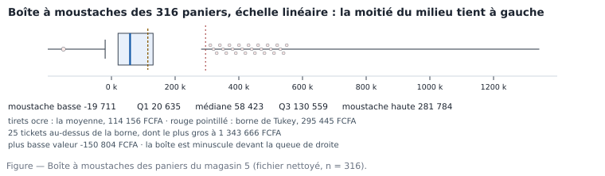

# M02.C04 — Se situer : quartiles, déciles, percentiles, lecture du boxplot

> **L'idée du chapitre.** Un percentile ne répond pas à « combien vaut le ticket ? » mais à « combien de tickets
> sont en dessous ? ». C'est la mesure qui transforme un montant isolé en position dans une distribution — et donc
> en seuil de politique commerciale, en alerte calibrée, en classement défendable.

> **Base de travail — obligatoire.** Deux fichiers du socle, dans votre dossier `02_exercices/M02/`, ouverts côte à
> côte : `donnees/projection/ventes_magasin5_2025.csv` (l'énoncé, 489 lignes × 13 variables) et
> `donnees/reference/ventes_magasin5_2025_ATTENDU.csv` (480 × 13). Séparateur point-virgule, encodage UTF-8, virgule
> décimale. Montants en franc CFA (FCFA). Effet de référence de ce chapitre : les **316 paniers** (ticket consolidé
> par `n_ticket`), construits au chapitre M02.C02. Chiffres mesurés, recopiés depuis
> `01_socle_donnees/data/reference/chiffres_cites.md`, section M02.

---

## 1. Objectifs du chapitre

À la fin de ce chapitre, vous êtes capable de :

1. calculer un quartile, un décile, un percentile quelconque sur une série triée — à la main d'abord, puis dans
   trois outils ;
2. expliquer pourquoi deux logiciels ne renvoient pas exactement le même 90e percentile, et dire quand l'écart
   compte ;
3. lire une boîte à moustaches sans légende : boîte, médiane décalée, moustaches, points isolés, échelle ;
4. retourner le calcul — passer d'un montant à son percentile, et d'un objectif de couverture au montant seuil ;
5. construire une argumentation de concentration sans jamais confondre part des tickets et part du chiffre
   d'affaires ;
6. décider quels percentiles publier dans un tableau de bord, et lesquels garder pour l'analyse interne.

## 2. Pourquoi cette notion est importante

Les positions répondent aux trois questions que votre direction posera réellement.

- **« À partir de combien un client est-il un gros client ? »** Ce n'est pas une question de montant, c'est une
  question de rang. Sur les 316 tickets de l'extrait, un ticket de 25 000 FCFA est au 30e percentile : ordinaire ;
  un ticket de 100 000 FCFA est au 70e : déjà rare ; un ticket de 200 000 FCFA est au 85e. Un seuil de politique
  commerciale se choisit donc en percentile, jamais en montant rond choisi pour sa beauté.
- **« Que couvre notre dispositif de faveur ? »** Les 10 % de tickets les plus élevés portent 47,5 % du chiffre
  d'affaires de l'extrait ; les 25 % les plus élevés en portent 71,2 %. Réserver un avantage au-dessus de Q3, c'est
  viser un quart des tickets et près des trois quarts des encaissements. Seule la table des positions rend cette
  phrase possible — pas la moyenne.
- **« Où se trouve le milieu de nos ventes ? »** La moitié des tickets tient entre 20 635 et 130 559 FCFA ; la
  moitié du chiffre d'affaires n'est atteinte qu'au 90e percentile. Sans les positions, ces deux faits sont
  invisibles, et l'entreprise décide avec un seul nombre.

> **Dans les faits.** Le vocabulaire des positions est celui que les directions générales emploient spontanément :
> « dans le top 10 % », « au 9e décile », « le produit qui fait 80/20 ». Un analyste qui ne sait pas convertir ce
> langage en calcul est dessaisi de la discussion en trente secondes. Tout ce chapitre sert à traduire dans les
> deux sens, vite et juste.

## 3. Explication simple

Rangez les 316 tickets du plus petit au plus grand, sans rien calculer. Vous avez une **série ordonnée**, et chaque
ticket occupe une **position** : le premier, le 158e, le 316e.

Les découpages usuels partagent cette file en parts égales : quatre parts (les **quartiles** Q1, Q2 — la médiane —
et Q3), dix parts (les **déciles** D1 à D9), cent parts (les **percentiles** P1 à P99). Dire « ce ticket est au
85e percentile » veut dire « 85 % des tickets sont plus petits que lui ».

Le mot « percentile » — parfois écrit « centile », ou « percentille » sous l'influence de l'anglais
*percentile* — porte deux sens selon l'usage : la **valeur à la frontière** (235 318 FCFA) et le **rang en
pourcentage** (85). Cette ambiguïté est la source de toutes les confusions du domaine. La question de contrôle qui
les règle : « est-ce que je cite un montant, ou un pourcentage de tickets ? ».

Une **boîte à moustaches** — *boxplot*, « diagramme en boîte » en français — est le dessin qui pose ces cinq
nombres sur une ligne : la boîte va de Q1 à Q3, un trait marque la médiane, deux moustaches s'étendent jusqu'aux
valeurs extrêmes tolérées, les points au-delà se dessinent à part. Un résumé complet de la distribution en trois
centimètres de large.

## 4. Vocabulaire essentiel

| # | Terme | Français — English — sens simple | À savoir |
|---|---|---|---|
| 1 | Quantile | quantile — *quantile* — valeur qui partage une série triée | terme générique ; quartile, décile, centile en sont des cas |
| 2 | Quartile | quartile — *quartile* — découpage en quatre | Q2 = médiane ; Q1 et Q3 encadrent la moitié du milieu |
| 3 | Décile | décile — *decile* — découpage en dix | D9 est le 90e percentile |
| 4 | Percentile | percentile — *percentile* — découpage en cent | ne pas écrire « percent » : le suffixe change le sens |
| 5 | Rang | rang — *rank* — position dans la série triée | sans tri préalable, il n'y a pas de percentile |
| 6 | Interpolation | interpolation — *interpolation* — valeur estimée entre deux observations | c'est elle qui fait diverger les logiciels |
| 7 | Boîte à moustaches | boîte à moustaches — *boxplot* — dessin des cinq nombres | « cinq nombres » : min, Q1, médiane, Q3, max |
| 8 | Moustache | moustache — *whisker* — plus grande observation dans la limite tolérée | ce n'est **pas** le maximum de la série |
| 9 | Point isolé | valeur aberrante au sens de Tukey — *outlier* | à expliquer, jamais à effacer sans le dire |
| 10 | Fréquence cumulée | fréquence cumulée — *cumulative frequency* | part des observations en dessous d'une valeur |
| 11 | Fonction de répartition | fonction de répartition — *CDF*, *ogive* — la courbe des fréquences cumulées | l'outil des seuils inversés |

## 5. Cours approfondi

### 5.1 Un percentile est un rang, pas une valeur

> **Définition.** Le **p-ième quantile** d'une série triée est la valeur en dessous de laquelle se trouve la part p
> de l'effectif. Le **quartile** correspond à p = 0,25 ; 0,5 ; 0,75, le **décile** à un dixième, le **percentile** à
> un centième. « Quantile » désigne la frontière ; « percentile » désigne tantôt cette valeur frontière, tantôt le
> pourcentage d'observations qui la précèdent.

Sur les 316 paniers de l'extrait, la table des positions mesure :

| Position | Valeur (FCFA) | Écart avec la position précédente (FCFA) |
|---|---|---|
| P10 | 7 390 | — |
| P20 | 16 107 | 8 717 |
| Q1 (P25) | 20 635 | 4 528 |
| P40 | 41 064 | 20 429 |
| Q2 (P50) | 58 423 | 17 359 |
| P60 | 74 427 | 16 004 |
| Q3 (P75) | 130 559 | 56 132 |
| P80 | 165 177 | 34 618 |
| P90 (D9) | 235 318 | 70 141 |
| P95 | 435 984 | 200 666 |
| P99 | 1 001 048 | 565 064 |

Lisez la deuxième colonne, pas la première. Monter de P10 à Q1 — cinq points de percentile — coûte 4 528 FCFA ;
monter de P90 à P95, autant de points, coûte plus de deux cent mille francs : la série **s'étale à droite et se resserre à gauche**.
C'est la traduction numérique exacte de l'asymétrie constatée au chapitre M02.C03, et la raison pour laquelle un
seuil de « client important » fixé en francs est si souvent mal calibré.

L'intervalle Q1–Q3 contient 158 tickets sur 316 : la moitié, au ticket près — c'est le contrôle de cohérence du §7.
Un effectif de 165 ou de 148 ne veut pas dire que le logiciel a tort : il veut dire que les bornes n'ont pas été
comptées de la même façon.

### 5.2 Le calcul, puis la divergence des logiciels

Le calcul à la main, sur *n* = 316 valeurs triées, pour trouver Q3 :

1. position théorique : 317 fois trois quarts, soit 237,75 ;
2. on prend la 237e valeur triée et on avance des trois quarts vers la 238e ;
3. résultat : 130 559 FCFA.

Le pas n° 2 s'appelle l'**interpolation linéaire** — *linear interpolation* — et c'est là que les outils se
séparent. Pour le 90e percentile de la même série, les conventions les plus courantes donnent :

| Convention | Où on la trouve | 90e percentile (FCFA) |
|---|---|---|
| Interpolation linéaire, bords inclus | `=QUARTILE.INC`, `=PERCENTILE.INC`, pandas `quantile()` par défaut, `percentile_cont` en SQL | 235 318 |
| Observation immédiatement en dessous | pandas `interpolation="lower"`, `percentile_disc` en SQL | 234 518 |
| Observation la plus proche | pandas `interpolation="nearest"` | 236 118 |
| Interpolation exclusive | `=QUARTILE.EXC`, `=PERCENTILE.EXC` | 243 010 |

Quatre réponses correctes, un écart maximal d'environ 8 500 FCFA sur 235 318 FCFA : 3,6 %. Sur 316 observations,
sans conséquence pour une décision ; il cesse d'être négligeable quand l'effectif tombe à quelques dizaines, et
devient décisif dès qu'un seuil devient contractuel. Deux règles en découlent : **nommer la méthode dans la note**,
et **ne pas débattre d'un seuil à moins de deux chiffres significatifs**.

**Faites-le dans un tableur.** `=QUARTILE.INC(plage;3)` pour Q3, `=PERCENTILE.INC(plage;0,8)` pour P80,
`=MEDIANE(plage)` pour P50. Les mêmes fonctions existent dans LibreOffice, où `=QUARTILE()` sans suffixe correspond
à la méthode inclusive. Vérifiez sur votre fichier que P20 (16 107 FCFA) et P40 (41 064 FCFA) encadrent bien la
médiane : sinon, votre plage de calcul ne couvre pas les 316 lignes — ou couvre les 480 lignes du fichier, ce qui
est une autre série.

> **Attention.** La fonction `=PERCENTILE()` sans suffixe, dans les versions anciennes d'Excel, est la méthode
> inclusive ; `=PERCENTILE.EXC` n'existe pas avant Excel 2010 et n'existe pas du tout dans certains tableurs en
> ligne. Si un classeur que vous recevez la contient, vérifiez le résultat sur une petite série avant de le
> recopier dans une note.

### 5.3 Retourner le calcul : du montant au percentile

Le besoin inverse est encore plus fréquent en réunion : « notre plus gros client du mois, il est où ? ». On compte
les observations strictement inférieures au montant, on divise par l'effectif, on lit le pourcentage. Sur l'extrait
: 25 000 FCFA → 30e percentile ; 100 000 FCFA → 70e ; 150 000 FCFA → 78e ; 200 000 FCFA → 85e.

**Faites-le dans les trois outils.** En SQL (*(les vues `lignes_ventes` et `paniers` ont été créées au C02, § « Pour la suite du module »)*) :

```sql
SELECT ROUND(100.0 * COUNT(*) FILTER (WHERE panier < 200000) / COUNT(*)) AS percentile
FROM paniers;
```

En pandas : `float((pan < 200000).mean() * 100)` → 85. En tableur : `=NB.SI(plage;"<200000")/NB(plage)`, formatée
en pourcentage — multipliez par 100 à l'affichage et non dans la formule, sinon la cellule devient fausse dès
qu'on la recopie ailleurs.

Deux précautions. D'abord, cette fréquence cumulée est **strictement inférieure** : « au 85e percentile » et « dans
les 15 % meilleurs » ne coïncident jamais exactement, surtout dans une série dense. Ensuite, un percentile n'est
pas un classement de valeur : il dit *combien sont en dessous*, pas *combien pèsent* — la part d'encaissements se
calcule à part, en sommant les montants.

> **Définition.** La **fréquence cumulée** (*cumulative frequency*) associe à une valeur la proportion
> d'observations inférieures ou égales ; sa courbe est la **fonction de répartition** (*CDF*, cumulative
> distribution function, *ogive* en français). Un seul objet mathématique derrière trois questions : quel
> percentile a ce montant ? quel montant correspond à ce percentile ? quelle part du chiffre d'affaires font les
> tickets plus petits que celui-ci ?

### 5.4 Lire une boîte à moustaches

> **Définition.** La **boîte à moustaches** (*boxplot*) représente cinq nombres : le premier quartile et le
> troisième, qui forment la boîte ; la médiane, qui la coupe ; la plus petite et la plus grande observation
> restant dans les bornes de Tukey, qui forment les moustaches. Les observations hors bornes sont dessinées en
> points. Le « résumé en cinq nombres » (*five-number summary*) est cette même information, sans le dessin.



**Les cinq choses à regarder, dans cet ordre.** (1) La **boîte**, de Q1 à Q3 : elle contient la moitié du milieu,
109 924 FCFA de large ici. (2) Le **trait médian** : au centre de la boîte, la moitié du milieu est symétrique ;
collé au bord gauche — notre cas —, il dit que la seconde moitié de la boîte est beaucoup plus étalée que la
première. (3) Les **moustaches** : la plus basse observation restant dans la borne de Tukey, −19 711 FCFA, et la
plus haute, 281 784 FCFA — ce ne sont **pas** le minimum et le maximum de la série. (4) Les **points isolés** : 25
tickets au-dessus de la borne, dont celui de 1 343 666 FCFA, et un seul en dessous, l'avoir de −150 804 FCFA.
(5) L'**échelle** : sans graduations, une boîte ne dit rien ; sur une échelle logarithmique, elle dit autre chose.

**Ce qu'une boîte ne dit pas.** Elle ne montre pas les bosses : deux distributions de formes très différentes
peuvent avoir la même boîte. Pour la forme, il faut l'histogramme — chapitre M02.C05, figure ci-dessous au
chapitre suivant. C'est pourquoi les deux figures se complètent, et pourquoi un tableau de bord qui n'affiche que
des boîtes aveugle son lecteur sur ce qu'il croit voir.

> **Conseil professionnel.** Quand vous tracez des boîtes par catégorie, alignez-les sur une échelle horizontale
> commune et ordonnez-les par médiane croissante. Sept boîtes sur une échelle disent plus que sept diagrammes
> individuels : la comparaison est le sujet, pas la catégorie.

### 5.5 Déciles et concentration : ce que porte la pyramide

> **Définition.** On appelle **concentration** le fait qu'une part donnée des observations porte une part
> différente — en général plus grande — du total. La représentation classique met en face les parts cumulées
> d'effectif et les parts cumulées de montant : c'est la **courbe de Lorenz** (*Lorenz curve*), outil de l'économie
> des inégalités, dont la table ci-dessous est la version discrète, en cinq coupes plutôt qu'en une courbe.

Les positions permettent de répartir le chiffre d'affaires entre les tranches de tickets. Sur l'extrait, les
cumuls mesurés :

| Tranche (du plus petit au plus grand) | Part des tickets | Part cumulée du CA |
|---|---|---|
| Sous Q1 (P25) | 25 % | 1,6 % |
| Sous la médiane (P50) | 50 % | 10,1 % |
| Sous Q3 (P75) | 75 % | 28,8 % |
| Sous P90 | 90 % | 52,5 % |
| Au-dessus de P80 | 20,3 % | 65,1 % |
| Au-dessus de P90 (le dernier décile, 32 tickets) | 10,1 % | 47,5 % |

La lecture, en une phrase : **la moitié des tickets ne fait que 10,1 % des encaissements, et un dixième en fait
presque la moitié.** C'est ce contraste, et lui seul, qui justifie de traiter le haut de pyramide à part.

Un détail de méthode, instructeur. Le « dernier décile », selon qu'on le définit comme les 10 % d'effectif les
plus élevés ou comme tout ce qui dépasse le 90e percentile, contient 31 ou 32 tickets : les deux décomptes sont
corrects et donnent 46,9 % et 47,5 % du chiffre d'affaires. Un découpage arrondi en effectif plutôt qu'en
pourcentage change la réponse de 0,6 point. Écrivez la définition, sinon le relecteur refait le calcul, trouve un
autre nombre, et doute de vous.

> **Attention.** « Les 25 % des tickets les plus élevés font 71,2 % du CA » est une phrase sur la concentration.
> Elle ne dit rien d'une performance, encore moins d'une faute : dans un commerce de matériaux, un chantier
> représente à lui seul une journée de comptoir. La conclusion possible est une *organisation* — suivi dédié,
> conditions particulières, stock réservé —, jamais un jugement sur les vendeurs.

### 5.6 Décider avec les percentiles : trois usages types

1. **Fixer un seuil de couverture.** On veut réserver la livraison gratuite aux 20 % de tickets les plus élevés :
   le seuil est P80, soit 165 177 FCFA, et 64 tickets sur 316 (20,3 %) le franchissent, portant 65,1 % du CA. À
   150 000 FCFA — montant rond, 78e percentile —, vous couvrez 22,5 % des tickets et 68,1 % du CA : la décision est
   la même, le cadrage est faux. On choisit le pourcentage, on en déduit le montant.
2. **Suivre le haut de pyramide.** Publier le 95e percentile (435 984 FCFA) plutôt que le maximum : le maximum est
   un ticket, le 95e est une statistique. Mais sur 316 tickets, P99 repose sur trois observations — à cet effectif,
   on publie P90 et on commente P95, on n'affiche pas P99.
3. **Découper une clientèle en strates.** Quatre groupes de 79 tickets environ (quartiles de dépenses) sont
   défendables : effectifs comparables, frontières explicites. Trois groupes « petits / moyens / gros » à seuils
   ronds ne le sont pas. Le jour où vous devrez justifier un échantillon d'audit — « on a pris les 15 % plus gros
   tickets » —, le percentile est votre seule ligne de défense : 48 tickets, 57,1 % du CA, frontière à
   200 000 FCFA, tout est écrit et rejouable.

### 5.7 Quels percentiles publier, lesquels garder

| Public | Ce qu'on publie | Ce qu'on garde pour l'analyse |
|---|---|---|
| Direction commerciale | médiane, Q3, P90, part du CA du dernier décile | P95, P99, le détail des points isolés |
| Contrôleur de gestion | Q1, médiane, Q3, IQR, effectif hors bornes | les commentaires ligne à ligne |
| Acheteur | médiane et IQR par catégorie, CV (M02.C03) | les percentiles par produit, trop instables |
| Audit, contentieux | tous les percentiles demandés, méthode nommée | rien : tout s'écrit |
| Lecture interne de formation | cinq nombres et boîte à moustaches | la querelle d'interpolation |

La règle d'écriture qui va avec : **un percentile publié s'accompagne de l'effectif et du mode de comptage des
bornes.** « P90 = 235 318 FCFA (n = 316 tickets, fichier nettoyé, interpolation linéaire, comparaison strictement
inférieure) » coûte une ligne de plus et ne se discute plus.

### 5.8 Calculer les positions dans les trois outils

| Opération | Tableur | SQL (DuckDB) | pandas |
|---|---|---|---|
| Quartiles | `=QUARTILE.INC(plage;1)` puis `(…,3)` | `percentile_cont(0.25) WITHIN GROUP (ORDER BY x)` | `s.quantile(.25)` |
| Percentile quelconque | `=PERCENTILE.INC(plage;0,8)` | `percentile_cont(0.8) WITHIN GROUP (…)` | `s.quantile(.8)` |
| Observation la plus proche | — | `percentile_disc(0.8) WITHIN GROUP (…)` | `s.quantile(.8, interpolation="nearest")` |
| Déciles par groupe | tri + `=RANG()` | `NTILE(10) OVER (PARTITION BY g ORDER BY x)` | `pd.qcut(g, 10)` |
| Percentile d'une valeur | `=NB.SI(plage;"<v")/NB(plage)` | `COUNT(*) FILTER (WHERE x < v) / COUNT(*)` | `(s < v).mean()` |
| Cinq nombres d'une boîte | formules ci-dessus | min, P25, P50, P75, max en une requête | `s.describe(percentiles=[.25,.5,.75])` |

**La requête de découpage qui sert ensuite dans tout le module** — les déciles de tickets par vendeur
(*(les vues `lignes_ventes` et `paniers` ont été créées au C02, § « Pour la suite du module »)*) :

```sql
WITH paniers AS (
  SELECT vendeur, n_ticket, SUM(montant_ttc) AS panier
  FROM lignes_ventes GROUP BY vendeur, n_ticket
),
decoupages AS (
  SELECT vendeur, panier,
         NTILE(10) OVER (PARTITION BY vendeur ORDER BY panier DESC) AS decile
  FROM paniers
)
SELECT vendeur, decile, COUNT(*) AS tickets, SUM(panier) AS ca_decile
FROM decoupages
GROUP BY vendeur, decile
ORDER BY vendeur, decile;
```

Le `NTILE` vit dans une requête à part : on ne peut pas découper et agréger dans le même `SELECT` (DuckDB répond
`Cannot group on a window clause`, et c'est très bien qu'il réponde ça — mélanger les deux étapes donnerait un chiffre
qui n'a pas de définition). `NTILE(10)` découpe en dix groupes d'effectifs égaux **à l'intérieur de chaque vendeur** : c'est le
`PARTITION BY` qui rend licite la comparaison entre vendeurs de tailles différentes. Sans lui, vous découpez la
planète en dix et vous appelez ça un classement.

> **Boîte à outils.** Contrôle minimal de toute publication de positions : (1) Q1 ≤ médiane ≤ Q3, sans exception —
> sinon le tri ou l'effet est faux ; (2) l'effectif entre Q1 et Q3 vaut la moitié de *n* au ticket près ; (3) les
> moustaches sont des observations réelles, jamais des bornes calculées — vérifiez que la valeur de la moustache
> existe dans la colonne ; (4) un percentile de rang inférieur à 5 ou supérieur à 95 sur quelques centaines
> d'observations ne se publie pas, il se commente ; (5) la méthode d'interpolation s'écrit une fois par document,
> pas par ligne.

## 6. Exemple concret : la livraison gratuite, décidée au percentile

**La demande.** « Relevons le seuil de livraison gratuite de 100 000 à 150 000 FCFA : nous voulons la réserver aux
gros tickets. » Trois questions, dans l'ordre.

| Question | Calcul | Réponse mesurée sur l'extrait |
|---|---|---|
| Combien de tickets perdent le bénéfice ? | nb de tickets ≥ seuil | 96 tickets à 100 000 FCFA (30,4 %), 71 à 150 000 FCFA (22,5 %) |
| Combien de chiffre d'affaires est en jeu ? | somme des tickets franchissant le seuil | 76,7 % du CA au-dessus de 100 000 FCFA, 68,1 % au-dessus de 150 000 FCFA |
| Qui est touché, côté clients ? | clients distincts, pas tickets | 372 clients distincts dans le fichier, dont 18 sans identifiant exploitable |

**Ce que la table des positions change à la discussion.** Le seuil actuel est au 70e percentile, le nouveau au 78e.
On n'écarte donc pas « un dixième des tickets » au sens large mais 25 tickets sur 316, et la tranche écartée — entre
74 427 et 165 177 FCFA, soit P60 à P80 — pèse 19,2 % du chiffre d'affaires : ce ne sont pas les tickets du
comptoir, ce sont les petits chantiers. C'est exactement ce que la moyenne cache et que les percentiles montrent.

**La conclusion professionnelle.** Un seuil ne se fixe pas en francs mais en couverture. Note attendue : *pour
couvrir 20 % des tickets, le seuil est P80 = 165 177 FCFA (64 tickets, 65,1 % du CA) ; le seuil proposé de
150 000 FCFA couvre 22,5 % des tickets et 68,1 % du CA ; le seuil actuel de 100 000 FCFA en couvre 30,4 %.* Trois
chiffres, une décision, aucune contestation possible de méthode.

## 7. Démonstration pas à pas : tracer la boîte vous-même

**Étape 1 — La série.** Colonne des paniers, 316 valeurs (construite aux étapes 1 à 3 de M02.C02). Triez-la :
dans le tableur, tri croissant sur la colonne ; en pandas, `pan.sort_values()`.

**Étape 2 — Les positions.** Calculez Q1, Q2, Q3 par la voie des positions, pas par la fonction : pour Q1, la
position est le quart de 317, soit 79 et un quart ; interpolatez entre la 79e et la 80e valeur. Vous devez retrouver 20 635 FCFA.

**Étape 3 — Le contrôle d'effectif.** `=NB.SI(plage;">=20635")-NB.SI(plage;">130559")` doit donner 158. À 157 ou
159 près, ce sont les bornes : la convention retenue ici est l'intervalle fermé, écrivez la vôtre.

**Étape 4 — Les moustaches.** Plus grande valeur ≤ 295 445 FCFA → 281 784 FCFA. Plus petite valeur ≥ la borne basse
→ −19 711 FCFA. Notez que la moustache basse est négative : la série contient des avoirs (M02.C02, §5.6), et une
boîte honnête les montre.

**Étape 5 — Les points isolés.** Vingt-cinq au-dessus de la borne haute, un en dessous de la basse. Comptez-les ;
ne les dessinez pas « au doigt » : un effectif figé est un contrôle rejouable, un amas de points non.

**Étape 6 — Le tracé.** Échelle horizontale commune, boîte de Q1 à Q3, trait à la médiane, moustaches, points en
petits cercles. Comparez à la figure du §5.4 : la ressemblance *est* le contrôle qualité.

**Contrôles qualité du chapitre.**

| # | Contrôle | Seuil | Résultat attendu | Si échec |
|---|---|---|---|---|
| 1 | Ordre Q1 ≤ médiane ≤ Q3 | sans exception | 20 635 · 58 423 · 130 559 | tri oublié |
| 2 | Effectif entre Q1 et Q3 | *n* / 2 au ticket près | 158 | bornes incluses ou non |
| 3 | Les moustaches sont des valeurs de la colonne | appartenance | −19 711 · 281 784 | borne confondue avec observation |
| 4 | Part cumulée du CA sous la médiane | recoupement avec §5.5 | 10,1 % | périmètre : tickets ou lignes |
| 5 | P20 et P40 encadrent la médiane | ordre | 16 107 · 41 064 | effet incomplet |

## 8. Erreurs fréquentes

1. **Confondre moustache et maximum.** La moustache s'arrête à la dernière observation dans la borne ; le maximum
   est un point isolé. Écrire « la moustache va jusqu'à 1 343 666 FCFA » est doublement faux : c'est le maximum, et
   la borne vaut 295 445 FCFA.
2. **Publier un P99 sur 316 observations.** Trois tickets le déterminent : l'indicateur suit la valeur d'un seul
   client. À cet effectif, P90 est le rang le plus haut défendable.
3. **Découper en déciles sans base de comparaison.** Un « 1er décile » chez un vendeur de 125 lignes et chez un
   vendeur de 12 lignes ne désigne pas le même monde : découpez par vendeur (`PARTITION BY`) ou comparez des
   percentiles bruts, mais ne mélangez pas les deux dans la même phrase.
4. **Oublier l'interpolation et comparer deux outils.** Quatre valeurs possibles pour le même 90e percentile ; sans
   la méthode écrite, un désaccord de quelques milliers de francs devient une querelle de compétence.
5. **Lire un percentile comme un pourcentage de valeur.** « Au 85e percentile » ne veut pas dire « 85 % du
   chiffre » : le premier est un rang, le second une part monétaire. Sur notre série, les 15 % de tickets au-dessus
   du 85e percentile pèsent 57,1 % du CA — le double de ce que la confusion ferait croire.
6. **Décrire la distribution par les seuls percentiles, sans figure.** Une boîte se lit en dix secondes par un
   non-statisticien ; trois lignes de chiffres ne se lisent pas. C'est pourquoi l'étape 6 se fait à la main au
   moins une fois : on ne dessine pas ce qu'on n'a pas compris.

## 9. Bonnes pratiques professionnelles

1. **Écrire l'effectif et la méthode** : « P90 = 235 318 FCFA (n = 316, interpolation linéaire, fichier nettoyé) ».
2. **Publier la médiane et l'IQR d'abord** sur une série asymétrique ; les percentiles hauts en commentaire, jamais
   en titre de graphique.
3. **Fixer les seuils en couverture, pas en montants ronds.** Un objectif de « 20 % des tickets » se contrôle six
   mois plus tard ; un objectif de « 150 000 FCFA » dérive silencieusement avec les prix.
4. **Tracer les boîtes à échelle commune**, ordonnées par médiane, avec le nombre de points isolés écrit sous
   chaque boîte.
5. **Ne jamais retirer un point isolé sans l'expliquer** : ici, le plus à droite est un chantier, le plus à gauche
   un avoir — deux réalités métier, pas deux fautes de saisie.
6. **Conserver la requête `NTILE` en annexe du livrable** : c'est elle qui rend le découpage reproductible par un
   tiers, donc défendable en audit.

## 10. Exercice guidé — les cinq nombres, puis le dessin

**Énoncé.** Sur les 316 paniers : retrouvez les cinq nombres de la boîte (moustaches comprises), dessinez la boîte à
l'échelle, et écrivez la phrase de lecture destinée à un directeur non statisticien.

**Vous faites** — barème 10 points, total 10.

| Étape | Ce que vous produisez | Points |
|---|---|---|
| A | Les trois quartiles, avec les positions utilisées | 3 |
| B | Les deux moustaches, identifiées comme observations réelles | 2 |
| C | Le décompte des points isolés, en haut et en bas | 2 |
| D | Le tracé à l'échelle commune | 1,5 |
| E | La phrase de lecture, sans jargon | 1,5 |

**Nous vérifions.** Q1 = 20 635, médiane = 58 423, Q3 = 130 559 FCFA ; moustaches à −19 711 et 281 784 FCFA ; 25
points isolés en haut, un en bas. Phrase attendue : « la moitié des tickets tient entre 20 635 et 130 559 FCFA, et
25 tickets dépassent 295 445 FCFA : ce sont les chantiers, pas des erreurs ». Si votre phrase contient le mot
« aberrant » sans le définir, elle est à réécrire — c'est le mot qui fâche en réunion.

**Nous corrigeons.** L'erreur la plus fréquente : tracer les moustaches jusqu'au minimum et au maximum de la série.
Le dessin reste joli, la lecture devient fausse, et le contrôle n° 3 du §7 vous l'aurait signalé.

## 11. Exercices autonomes

**Exercice 4.1 (★) — La table des positions.** Retrouvez P10, P20, P40, P60, P80 et P95 sur les paniers, puis
écrivez la phrase qui compare les écarts entre ces positions. *(attendu : 7 390 · 16 107 · 41 064 · 74 427 ·
165 177 · 435 984 FCFA)*

**Exercice 4.2 (★) — Le percentile d'un montant.** À quel percentile se situent un ticket de 100 000 FCFA et un
ticket de 25 000 FCFA ? Donnez la formule de tableur, pas seulement le résultat. *(attendu : 70e et 30e,
par fréquence cumulée strictement inférieure)*

**Exercice 4.3 (★★) — Le seuil de couverture.** Vous devez fixer le seuil de livraison gratuite pour que 15 % des
tickets y soient éligibles. Quel percentile utilisez-vous, quel montant, quelle part du CA ? *(attendu : P85,
200 000 FCFA, 48 tickets, 57,1 % du CA)*

**Exercice 4.4 (★★) — Déciles par vendeur.** Découpez les tickets de chaque vendeur en déciles avec
`NTILE(10) OVER (PARTITION BY vendeur …)`, puis comparez le premier décile de Bationo à celui d'Ilboudo. Que
devient la comparaison si vous découpez l'ensemble de la population au lieu de découper par vendeur ?

**Exercice 4.5 (★★★) — Note de concentration.** En six lignes, pour la direction : la part du CA des 25 % de
tickets les plus élevés, celle des 50 % les plus petits, le seuil de « gros ticket » que vous proposez avec sa
justification en percentile, et la réserve de méthode sur le découpage en déciles. *(attendu : 71,2 % · 10,1 % ·
P90 = 235 318 FCFA · 46,9 % ou 47,5 % selon l'effectif retenu)*

## 12. Correction détaillée

**Exercice 4.1.** Les six valeurs attendues sont celles du §5.1. La phrase de lecture porte sur les *écarts* : entre
P10 (7 390 FCFA) et P20 (16 107 FCFA) il y a moins de la moitié de ce qui sépare P20 de Q1 (20 635 FCFA), et les
derniers rangs s'étalent beaucoup plus loin. Un élève qui recopie la liste sans comparer les écarts est noté à la
moitié : la table ne vaut que par sa colonne de différences.

**Exercice 4.2.** `=NB.SI(plage;"<100000")/NB(plage)` pour 100 000 FCFA, la même formule avec 25 000 pour le
second : 70e et 30e percentiles. Le tableur peut donner 70 ou 71 selon que l'on compte strictement en dessous ou
en dessous ou égal — écrire le choix fait partie de la réponse, c'est même l'objet de la question.

**Exercice 4.3.** 15 % éligibles = couper au 85e percentile. Mesures de l'extrait : 200 000 FCFA correspond exactement
au 85e percentile, avec 48 tickets au-dessus (15,2 % de l'effectif) portant 57,1 % du CA. La vérification attendue
: la part de chiffre d'affaires se lit en sommant les montants des tickets retenus, pas en recopiant les 15 % de
couverture — les deux chiffres ne coïncident jamais, et c'est l'écart entre eux qui fait la valeur de la note.

**Exercice 4.4.** Par vendeur, chaque décile contient un dixième des tickets *de ce vendeur* : la comparaison porte
sur les positions relatives, donc sur la homogénéité interne. Sur l'ensemble de la population, chaque décile contient
un dixième des tickets *tous vendeurs confondus*, et les vendeurs se répartissent inégalement dans les déciles : la
comparaison devient une mesure de mix, pas de performance. Les deux questions sont légitimes ; ce ne sont pas les
mêmes, et un tableau de bord qui les mélange sans le dire induit la direction en erreur.

**Exercice 4.5.** Note attendue. Les 25 % des tickets les plus élevés portent 71,2 % du CA de l'extrait, les 50 %
les plus petits 10,1 %. Nous proposons de définir le « gros ticket » au 90e percentile, soit 235 318 FCFA
(n = 316, interpolation linéaire), parce que ce seuil ne dépend pas d'un seul client et qu'il couvre 10,1 % des
tickets pour 47,5 % du CA. Réserve à écrire : selon que le dernier décile compte 31 ou 32 tickets, la part retenue
vaut 46,9 % ou 47,5 % — 0,6 point d'écart, sans erreur de personne.

## 13. Mini-projet M02.P2 — suite : la page des positions (30 min)

Ajoutez au document du **M02.P2** (barème 20 points, seuil de validation 13) une page « positions » : la table des
percentiles publiables (P10 à P95), la boîte à moustaches des sept catégories à échelle commune, et le seuil de
politique commerciale choisi en percentile avec sa couverture en tickets et sa part de CA. Deux contraintes de
rédaction, non négociables au barème : **aucun montant de seuil n'apparaît sans le percentile correspondant**, et
**aucun percentile n'apparaît sans l'effectif ni la méthode**. Les deux points isolés extrêmes reçoivent chacun une
phrase d'interprétation métier — une phrase qui ne contient pas le mot « aberrant ».

## 14. Résumé du chapitre

1. Un percentile est un **rang** : 85 % des tickets sont sous 200 000 FCFA, la moitié est entre 20 635 et
   130 559 FCFA. Citer la valeur ou le pourcentage ne donne pas la même information.
2. Quatre **méthodes d'interpolation**, quatre réponses pour le même 90e percentile (234 518 à 243 010 FCFA) :
   nommez la vôtre et l'écart redevient un détail.
3. La **boîte à moustaches** se lit en cinq points — boîte, médiane décalée, moustaches qui sont des observations
   réelles, points isolés, échelle — et ne dit rien de la forme : l'histogramme vient après (M02.C05).
4. On décide en **couverture** : 158 tickets entre Q1 et Q3, 19,2 % du CA dans la bande P60–P80, 71,2 % au-dessus
   de Q3, 47,5 % dans le dernier décile.

## 15. À retenir

> **À retenir.**
>
> - Q1 : 20 635 · médiane : 58 423 · Q3 : 130 559 · IQR : 109 924 · bornes de Tukey : -144 251 et 295 445 ·
>   moustaches
>   −19 711 et 281 784 FCFA, sur 316 tickets.
> - Un seuil se choisit en pourcentage de couverture, puis on en déduit le montant.
> - Moustache ≠ maximum ; percentile ≠ pourcentage de valeur ; P99 sur 316 lignes ne se publie pas.
> - Écrire l'effectif, la méthode d'interpolation, et le caractère inclus ou non des bornes.

> **À retenir.** La formulation qui protège. « Le 90e percentile des tickets est de 235 318 FCFA (n = 316, fichier
> nettoyé, interpolation linéaire) ; 32 tickets le dépassent et portent 47,5 % du chiffre d'affaires de l'extrait. »

## 16. Évaluation formative (auto-correction, 10 min)

**1.** Quelle différence de sens entre « moustache haute » et « maximum de la série » ?
**2.** Vous devez publier le montant à partir duquel on est « gros client », en couvrant 10 % des tickets. Que
calculez-vous, et pourquoi pas le maximum divisé par dix ?
**3.** Deux collègues obtiennent 234 518 et 243 010 FCFA pour le même percentile. Que s'est-il passé, que fait-on ?
**4.** Que dit la table des positions du §5.1 sur la forme de la distribution, sans la voir ?
**5.** Vrai ou faux : « 25 % des tickets font 71,2 % du CA, donc les petits clients ne servent à rien ».

<details><summary><strong>Corrigé</strong></summary>

1. La moustache s'arrête à la dernière observation restant dans la borne de Tukey (281 784 FCFA) ; le maximum est
   hors moustache et se dessine comme point (1 343 666 FCFA). 2. Le 90e percentile, soit 235 318 FCFA : couvrir
   10 % des tickets, c'est couper à P90. Diviser le maximum par dix suppose une distribution régulière, ce que la
   série dément (asymétrie mesurée au chapitre M02.C03 : 3,84). 3. Deux méthodes d'interpolation, toutes deux
   justes : on écrit la méthode retenue dans la note, on cesse de discuter du chiffre. 4. Que la série est très
   asymétrique : les écarts entre positions croissent fortement vers la droite (4 528 FCFA entre P20 et Q1,
   contre plus de deux cent mille entre P90 et P95). 5. Faux : c'est une phrase sur la concentration des montants, pas sur
   l'utilité économique ; les petits tickets font le comptoir et la fréquence, et l'extrait ne permet pas de
   trancher la question de la marge — il permet de la poser correctement.

</details>

**Auto-validation.** Reprenez les cinq contrôles du §7 sur votre fichier : 20 635 · 58 423 · 130 559 · 158 ·
−19 711 et 281 784. Si vos quartiles diffèrent, recomptez vos positions avant de changer de logiciel : sur 316
valeurs, l'erreur est presque toujours dans le tri ou dans l'effet, rarement dans la formule.
