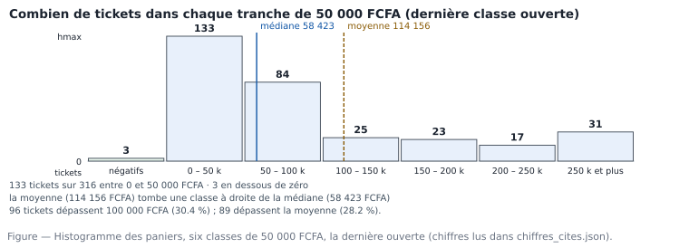

# M02.C05 — La forme d'une distribution : histogramme, asymétrie, valeurs extrêmes

> **L'idée du chapitre.** Moyenne, dispersion et positions sont des résumés. La **forme**, c'est ce qui reste quand
> on arrête de résumer : où les valeurs s'accumulent, où la série s'étire, combien de bosses on voit, et ce qu'on
> fait des trois tickets négatifs. Deux distributions peuvent avoir les mêmes indicateurs et des formes opposées —
> et appeler des décisions opposées.

> **Base de travail — obligatoire.** Deux fichiers du socle, dans votre dossier `02_exercices/M02/`, ouverts côte à
> côte : `donnees/projection/ventes_magasin5_2025.csv` (l'énoncé, 489 lignes × 13 variables) et
> `donnees/reference/ventes_magasin5_2025_ATTENDU.csv` (480 × 13). Séparateur point-virgule, encodage UTF-8, virgule
> décimale. Montants en franc CFA (FCFA). Effet de référence : les **316 paniers** construits au chapitre
> M02.C02. Chiffres mesurés, recopiés depuis `01_socle_donnees/data/reference/chiffres_cites.md`, section M02.

---

## 1. Objectifs du chapitre

À la fin de ce chapitre, vous êtes capable de :

1. construire un histogramme lisible — choisir l'amplitude et l'origine des classes, ouvrir la première et la
   dernière — et justifier ce choix par les règles du métier ;
2. lire une forme : asymétrie à droite ou à gauche, une ou plusieurs bosses, queue épaisse ou non ;
3. calculer et interpréter les deux coefficients de forme (asymétrie et kurtosis) sans leur faire dire plus qu'ils
   ne disent ;
4. distinguer trois sortes de valeurs extrêmes — erreur de saisie, exception réelle, cas limite — et appliquer à
   chacune un traitement nommé dans la note ;
5. décider si un indicateur usuel (moyenne, écart-type, corrélation, droite de régression) est licite sur cette
   forme, ou s'il faut le remplacer ;
6. expliquer à un non-statisticien, avec une figure de trois centimètres, pourquoi « la moyenne ne raconte pas
   notre magasin ».

## 2. Pourquoi cette notion est importante

Tout ce que le module a posé depuis quatre chapitres converge ici, et trois décisions de gestion ne se prennent pas
sans la forme.

- **Faut-il utiliser la moyenne ?** Sur nos 316 paniers, l'asymétrie mesure 3,84 : une série à 3,84 n'est pas « un
  peu penchée », elle est dominée par sa queue. C'est la mesure, et non une impression, qui autorise la réponse.
- **Faut-il alerter sur les extrêmes ?** L'histogramme montre 31 tickets au-dessus de 250 000 FCFA, soit 9,8 % de
  l'effectif, portant 46,9 % du chiffre d'affaires. Une alerte par ticket partirait onze fois par mois : personne
  ne lit onze alertes par mois. La forme règle le contrôle interne, pas seulement sa formule.
- **Peut-on modéliser ?** Les deux chapitres suivants estimeront une relation entre quantité et montant, puis la
  solidité d'un écart entre vendeurs. Ces calculs reposent sur des hypothèses de forme ; connaître la forme, c'est
  savoir si l'on a le droit d'utiliser l'outil — et avec quelles précautions le dire.

> **Dans les faits.** La forme est le seul endroit du manuel où une figure est plus lue que le texte. En entreprise,
> la courbe projetée en réunion décide souvent à elle seule : « en fait, c'est une minorité qui fait tout ». Ce
> chapitre vous apprend à la tracer correctement — un histogramme mal borné ment — et à ne pas la sur-interpréter.

## 3. Explication simple

Prenez les 316 paniers et rangez-les dans des cases de 50 000 FCFA : « moins de zéro », « de 0 à 50 000 », « de
50 000 à 100 000 », et ainsi de suite. Comptez ce que chaque case contient. Vous avez une **distribution de
fréquences** — *frequency distribution* — le tableau qui dit où va le monde.

Dessinez ces comptes en barres jointives : c'est l'**histogramme**. Sur le fichier réel :

| Case (FCFA) | Tickets | Part de l'effectif | Part du CA |
|---|---|---|---|
| moins de 0 | 3 | 0,9 % | -0,5 % (les avoirs retranchent) |
| de 0 à 50 000 | 133 | 42,1 % | 7,3 % |
| de 50 000 à 100 000 | 84 | 26,6 % | 16,5 % |
| de 100 000 à 150 000 | 25 | 7,9 % | 8,6 % |
| de 150 000 à 200 000 | 23 | 7,3 % | 11,0 % |
| de 200 000 à 250 000 | 17 | 5,4 % | 10,3 % |
| 250 000 et plus | 31 | 9,8 % | 46,9 % |

Quatre faits sautent aux yeux, et aucun ne se réduit à un nombre : la série a **une bosse** à gauche, une **queue**
qui ne s'arrête pas à droite, une **dernière classe ouverte** qui contient presque autant de tickets que les trois
classes du milieu réunies, et cette dernière classe porte **plus du tiers de la recette**. Un histogramme de
quarante-six classes aurait noyé le troisième point dans le bruit ; un histogramme de trois classes l'aurait masqué.
Le choix des classes n'est pas cosmétique : c'est une décision analytique, et elle s'écrit.

## 4. Vocabulaire essentiel

| # | Terme | Français — English — sens simple | À savoir |
|---|---|---|---|
| 1 | Distribution | distribution — *distribution* — répartition des valeurs d'une variable | se dit d'une variable, à un grain donné |
| 2 | Effectif de classe | effectif — *frequency* — nombre d'observations dans une case | toujours accompagner de la base (316) |
| 3 | Histogramme | histogramme — *histogram* — barres jointives par classes de valeurs continues | un diagramme en barres sépare des catégories, il ne compte pas des intervalles |
| 4 | Classe | classe — *bin*, *class interval* — intervalle de valeurs regroupées | « *bin* » en informatique, « classe » en statistique |
| 5 | Classe ouverte | classe ouverte — *open-ended bin* — sans borne haute (ou basse) | nécessaire quand la queue est longue ; à nommer |
| 6b | Densité | densité de fréquence — *density* — effectif divisé par l'amplitude de classe | seule grandeur comparable si les classes ne sont pas égales |
| 6 | Amplitude | amplitude de classe — *class width* — largeur de l'intervalle | ici 50 000 FCFA ; ce n'est pas le nombre de classes |
| 7 | Mode de la distribution | mode — *mode* — valeur ou classe la plus fréquente | classe 0 à 50 000 FCFA ici, 133 tickets |
| 8 | Asymétrie | asymétrie — *skewness* — déséquilibre gauche / droite | positive = queue à droite |
| 9 | Kurtosis | aplatissement — *kurtosis* — épaisseur des queues | dit peu de la bosse, beaucoup des extrêmes |
| 10 | Queue | queue — *tail* — extrémités de la distribution | « queue épaisse » = valeurs extrêmes structurelles |
| 11 | Valeur extrême | valeur extrême — *outlier* — observation très éloignée du reste | trois sorts : erreur, exception, cas limite |
| 12 | Troncation | troncage — *trimming* — retrait encadré des extrêmes | dire combien, selon quelle règle, et pourquoi |

## 5. Cours approfondi

### 5.1 Une distribution, trois miroirs

> **Définition.** La **distribution** d'une variable décrit comment ses valeurs se répartissent : quelles valeurs,
> avec quelles fréquences. Elle se donne de trois manières complémentaires — le tableau d'effectifs (exact,
> verbeux), l'histogramme (visuel, dépendant des classes) et la fonction de répartition (cumulée, robuste, vue au
> chapitre M02.C04). Un analyste sait produire les trois et en lire une seule devant un commanditaire.

| Regard | Ce qu'il répond | Ce qu'il cache |
|---|---|---|
| Tableau d'effectifs par classe | « combien dans chaque tranche », et quel CA | la continuité entre classes voisines |
| Histogramme | « où est la bosse, où est la queue » | les effectifs précis, si les classes sont larges |
| Fonction de répartition | « quel percentile à ce montant » | la forme locale, les bosses éventuelles |

Le premier réflexe est de vérifier l'effet total : les sept effectifs du §3 somment à 316, l'effectif de la série.
Ce contrôle, qui prend vingt secondes, attrape les classes mal bornées, les lignes perdues au tri et les doublons
non retirés — trois des défauts que le chapitre M01.C04 vous a fait corriger à la main.

### 5.2 Construire l'histogramme : les trois décisions

> **Définition.** Un **histogramme** (*histogram*) est la représentation en barres jointives des effectifs
> tombant dans des intervalles contigus de même amplitude — les **classes**. Sa parenté avec le diagramme en
> barres est trompeuse : ici la surface compte, pas la hauteur seule, ce qui impose des classes d'égale largeur
> pour que les barres soient comparables. Quand les largeurs diffèrent, on dessine des **densités**
> (*density histogram*, histogramme de densité) : l'effectif divisé par l'amplitude de la classe.

1. **Amplitude.** Deux règles s'offrent à vous, légitimes, aucune automatique. Celle de **Sturges**
   (*Sturges' rule*) : 1 plus le logarithme en base 2 de l'effectif, soit 9 classes ici. Celle de
   **Freedman–Diaconis**, robuste aux extrêmes : l'amplitude vaut deux fois l'IQR divisé par la racine cubique de
   l'effectif, soit 32 277 FCFA, ce qui conduirait à 46 classes sur la plage totale. Quarante-six classes pour 316
   observations : environ sept tickets par classe, aucune lecture possible. Retenir 7 classes de 50 000 FCFA est un
   compromis, et il s'écrit comme tel : « classes de 50 000 FCFA, première et dernière ouvertes ».
2. **Origine.** Des bornes rondes en francs (0 ; 50 000 ; 100 000) se lisent sans calcul mental ; des bornes issues
   d'une formule (32 277) se justifient mieux mais ne se lisent pas. En entreprise, la borne ronde gagne, à
   condition que le choix soit tracé.
3. **Extrémités.** La dernière classe est ouverte (« 250 000 et plus ») : bornée en haut, elle ferait disparaître
   une partie du chiffre d'affaires de la figure. La première l'est aussi, sinon les trois avoirs sont
   silencieusement exclus du graphique — et un graphique qui exclut des lignes ne somme plus à l'effectif.



**Faites-le dans un tableur.** Sélectionnez la colonne des paniers, Insertion → Graphique → Histogramme. Deux
réglages à corriger immédiatement : le *nombre de classes* — le réglage automatique produit sur cette plage des
intervalles d'amplitude non ronde, que personne ne lit — et le *nom des deux classes extrêmes*. Si votre tableur ne
sait pas ouvrir une classe, créez une colonne auxiliaire de regroupement par formules
(`=SI(v>=250000;"250 k et plus";SI(v<0;"négatifs";…))`) : c'est plus long, mais le graphique devient vérifiable
ligne à ligne, et il se trie.

**Faites-le dans le SQL.** *(les vues `lignes_ventes` et `paniers` ont été créées au C02, § « Pour la suite du module »)* :

```sql
SELECT CASE
         WHEN panier < 0       THEN '00. négatifs'
         WHEN panier < 50000   THEN '01. 0 – 50 k'
         WHEN panier < 100000  THEN '02. 50 – 100 k'
         WHEN panier < 150000  THEN '03. 100 – 150 k'
         WHEN panier < 200000  THEN '04. 150 – 200 k'
         WHEN panier < 250000  THEN '05. 200 – 250 k'
         ELSE                       '06. 250 k et plus'
       END AS classe,
       COUNT(*)         AS tickets,
       SUM(panier)      AS ca
FROM paniers
GROUP BY classe
ORDER BY classe;
```

Les préfixes numérotés ne sont pas décoratifs : sans eux, `ORDER BY classe` range « 100 – 150 k » avant
« 50 – 100 k » en ordre lexicographique, et votre figure raconte une bosse qui n'existe pas. C'est l'une des erreurs
de représentation les plus fréquentes en SQL, et la plus invisible.

### 5.3 L'asymétrie : combien de queue à droite

> **Définition.** L'**asymétrie** (*skewness*, notée γ₁ ou *skew*) mesure le déséquilibre de la distribution autour
> de son centre : en simplifiant, la moyenne des écarts au centre élevés au cube, normalisée par le cube de
> l'écart-type. Positive, la queue s'étire à droite ; négative, à gauche ; nulle, la distribution est symétrique. Le
> cube donne son poids à la *direction* : une valeur très à droite contribue positivement, une valeur très à gauche
> négativement.

Sur les 316 paniers, l'asymétrie vaut 3,84. La grille d'interprétation d'usage, en valeur absolue : moins de 0,5,
quasi symétrique ; de 0,5 à 1, asymétrie modérée ; au-delà de 1, asymétrie forte. À 3,84, la série est fortement
asymétrique à droite, et le contrôle croisé est immédiat : la moyenne (114 156 FCFA) vaut 1,95 fois la médiane
(58 423 FCFA), et 71,8 % des tickets sont sous la moyenne (mesures M02.C02).

Le lien entre ces trois nombres se comprend plutôt qu'il ne se retient : plus la queue de droite est lourde, plus la
moyenne est tirée vers le haut par rapport à la médiane, plus l'asymétrie est grande. Vous pouvez donc poser le
diagnostic avec deux nombres seulement, sans logiciel de statistique — et c'est ce que vous ferez en réunion, parce
que γ₁ ne se justifie pas devant un non-statisticien. Le coefficient, lui, sert à *documenter* : une ligne dans
l'annexe méthodologique.

> **Attention.** Un coefficient d'asymétrie ne se compare pas entre deux colonnes de grains différents.
> L'asymétrie des montants par ticket et celle des montants par ligne décrivent deux objets distincts : les
> comparer, c'est comparer la clientèle et les lignes de commande. Écrivez le grain à côté du chiffre.

### 5.4 Le kurtosis : ce que les queues racontent

> **Définition.** Le **kurtosis** (*kurtosis* ; « aplatissement » en français, bien qu'il ne mesure pas la hauteur
> du pic contrairement à une légende tenace) pénalise la présence de valeurs lointaines : moyenne des écarts au
> centre élevés à la quatrième puissance, normalisée. pandas, Excel (`=KURT`) et LibreOffice renvoient l'**excès de
> kurtosis** (convention de Fisher) : 0 pour une loi normale, positif quand les queues sont épaisses.

Notre série affiche un excès de kurtosis de 18,25, soit 21,25 dans la convention de Pearson, qui ajoute 3. Le
message : la distribution n'est pas seulement penchée, ses queues sont épaisses. Traduit en faits vérifiables sur
l'extrait : 25 tickets dépassent 300 000 FCFA, 12 dépassent 500 000 FCFA, et le rapport du plus gros ticket à la
médiane vaut 23,0.

Pourquoi ce chiffre intéresse le praticien : presque tous les outils des modules suivants — intervalles de
confiance (M02.C08), droite de régression (M02.C06), contrôle statistique en production — supposent implicitement
des queues modérées. Avec un excès de kurtosis de 18,25, un intervalle construit « à ± 1,96 écart-type » est faux :
la formule reste, mais il faut tronquer, ou passer par un calcul par ré-échantillonnage (M02.C07). Vous n'avez pas
besoin de faire ce calcul aujourd'hui ; vous avez besoin de savoir **lire l'avertissement quand un autre le fait**,
et le citer.

**Faites-le dans un tableur.** `=KURT(plage)` existe dans Excel et dans LibreOffice Calc et renvoie l'excès, comme
pandas ; les versions récentes d'Excel le nomment `=KURT()`, l'anglais *KURT* restant l'appellation d'origine.
Vérifiez toujours la convention de votre logiciel avant de citer le chiffre : un kurtosis de Pearson lu comme un
excès de Fisher décale de 3 — écart minuscule sur l'indicateur, décisif sur la conclusion qu'on en tire.

### 5.5 Trois sortes de valeurs extrêmes, trois traitements

Le mot « aberrant » est le plus dangereux du vocabulaire statistique en entreprise : il ferme la discussion au lieu
de l'ouvrir. Sur l'extrait, les points isolés relèvent de trois natures différentes, et c'est la nature qui décide
du traitement.

| Sorte | Exemple mesuré | Traitement | Phrase de note |
|---|---|---|---|
| Erreur de saisie | 7 lignes de `quantite` multipliées par 1 000 dans l'énoncé (maximum 14 000, ramené à 68 après correction) | corriger à la source, garder la trace | « valeur corrigée selon la règle X, N lignes concernées » |
| Exception réelle | le plus gros panier, 1 343 666 FCFA | conserver, isoler dans l'analyse, nommer | « un chantier porte près de la moitié du CA de l'extrait » |
| Cas limite légitime | 3 paniers négatifs, dont un à -150 804 FCFA (8 lignes d'avoirs, -283 933 FCFA au total) | conserver au total de caisse, exclure des indicateurs de vente | « les avoirs sont comptés à part ; le CA reste le CA » |

Un même indicateur change de valeur selon le traitement, et c'est précisément ce qui doit s'écrire : en retirant
les 25 tickets au-dessus de la borne haute de Tukey, la moyenne des paniers passe de 114 156 à 71 463 FCFA et le
coefficient de variation de 159,5 % à 96,6 % (M02.C03). La série devient descriptible — mais elle ne décrit plus la
même population.

> **Conseil professionnel.** N'écrivez jamais « nous avons supprimé les valeurs aberrantes ». Écrivez : « trois
> tickets sont des avoirs, exclus des indicateurs de vente et inclus au total de caisse ; vingt-cinq dépassent la
> borne haute, conservés et commentés à part ; sept lignes contenaient une erreur de saisie corrigée en amont ».
> Trois phrases, trois décisions, plus aucune ambiguïté sur ce que vous avez fait des données.

### 5.6 Commenter une forme en cinq phrases — grille de rédaction

La forme ne se commente pas en adjectifs. Appliquez cette grille à toute série ; elle tient en un paragraphe.

1. **Étalement** : « la série va de -150 804 à 1 343 666 FCFA » (min, max).
2. **Accumulation** : « 136 tickets sur 316, soit 43,0 % de l'effectif, sont sous 50 000 FCFA, pour 6,8 % du CA »
   (classe modale et sa part monétaire).
3. **Centre robuste** : « la médiane est à 58 423 FCFA, la moyenne à 114 156 FCFA, rapport de 1,95 ».
4. **Queue** : « 31 tickets dépassent 250 000 FCFA et portent 46,9 % du CA ; 12 dépassent 500 000 FCFA ».
5. **Décision** : « ces trente-et-un tickets sont traités sur une ligne séparée du rapport mensuel ».

Les quatre premières phrases viennent des mesures du socle ; la cinquième est une décision. C'est la structure à
réutiliser dans tous les modules : deux faits, un contraste, une extrémité, une décision.

### 5.7 Ce que cette forme interdit de faire

Trois interdictions tirées de cette série précise, pas d'un manuel :

- **la moyenne seule comme indicateur de politique commerciale.** 89 tickets dépassent la moyenne, soit 28,2 % de
  l'effectif : un dispositif calé sur « au-dessus de la moyenne » exclut sept clients sur dix, sans que personne ne
  l'ait décidé explicitement.
- **le raisonnement en « ± un écart-type ».** Cette lecture suppose une distribution à peu près symétrique ; avec
  une asymétrie de 3,84 et un excès de kurtosis de 18,25, l'intervalle autour de la moyenne ne couvre pas ce qu'on
  croit (M02.C03, §8.6).
- **le seuil « trois sigma » en contrôle interne.** Sur une série à queues épaisses, un tel seuil signale une fois
  sur deux la nature du métier, pas une anomalie. La borne de Tukey, assise sur l'IQR, reste la règle défendable à
  ce niveau de maturité de l'entreprise.

### 5.8 Représenter la forme : quelle figure pour quelle question

| Question posée | Figure à produire | Ce qu'il faut écrire sur la figure |
|---|---|---|
| Où est la bosse, combien de bosses ? | histogramme (ce chapitre) | amplitude des classes, unité, effectif total |
| Qui possède quoi ? | courbe des fréquences cumulées | percentile lu sur l'axe supérieur (M02.C04) |
| Comparer des catégories | boîtes à moustaches alignées | médiane et nombre de points isolés par catégorie |
| Deux varient-elles ensemble ? | nuage de points | les 316 points, pas une moyenne par catégorie (M02.C06) |
| La série est-elle stable dans le temps ? | courbe mensuelle | dénominateur commun, mois creux explicités (M01.C04) |

> **Boîte à outils.** Contrôle minimal de toute figure de forme : (1) la somme des effectifs de classes doit
> redonner l'effectif total — 316 ici ; sinon, des observations sont hors du graphique ; (2) les classes ouvertes
> s'affichent avec la mention « et plus » ou « moins de », jamais avec une valeur imaginaire ; (3) une figure sans
> graduations d'axe ne se publie pas ; (4) le choix d'amplitude tient en une phrase dans la légende ; (5) si la
> figure contredit le tableau de chiffres, la figure a tort en premier — un histogramme se rate plus facilement
> qu'une moyenne.

## 6. Exemple concret : « nos clients ne sont pas comme ça »

**La situation.** Vous présentez le premier tableau de bord mensuel : panier moyen 114 156 FCFA, écart-type
182 095 FCFA, sept catégories. Le responsable du magasin refuse le chiffre — et il n'a pas tort : sa journée
ressemble à 133 tickets sous 50 000 FCFA, pas à 114 156 FCFA.

**Ce qui se joue.** Il ne conteste pas le calcul, il conteste le *résumé*. Sa journée type correspond à la classe
modale (0 à 50 000 FCFA, 42,1 % des tickets pour 7,3 % du CA) ; votre moyenne correspond à la queue. Les deux sont
vrais ; un seul décrit le quotidien.

> **Attention.** Une part d'effectif n'est pas une part de chiffre d'affaires, et le tableur calcule les deux
> sans vous avertir du changement d'objet : la classe 0 à 50 000 FCFA réunit 42,1 % des tickets et 7,3 % des
> encaissements, la classe ouverte 31 tickets (9,8 %) et 46,9 % du CA. Écrivez dans la légende *ce qui est réparti*
> — le nombre d'achats ou les francs encaissés. En titre de graphique, « part des clients » et « part du chiffre
> d'affaires » s'inversent souvent, et c'est la source numéro un des contresens en réunion.

**La correction, en trois gestes.** (1) Publier la médiane en indicateur, la moyenne en note. (2) Mettre
l'histogramme du §5.2 en tête de page : le refus devient accord, parce que la figure montre ce que le nombre
cachait. (3) Séparer le rapport en deux lignes de pilotage : comptoir (sous 50 000 FCFA, 133 tickets, 7,3 % du CA)
et chantiers (au-dessus de 250 000 FCFA, 31 tickets, 46,9 % du CA), la classe du milieu (149 tickets, 46,4 %)
servant de témoin.

**Ce que le manager retiendra.** « On ne pilote pas le comptoir avec les chiffres des chantiers » — phrase sans
vocabulaire statistique, qui vient entièrement de la forme de la distribution. C'est le meilleur argument à
opposer à une direction générale qui préfère « un seul chiffre, c'est plus simple ».

## 7. Démonstration pas à pas : des comptes de classes à la bosse

**Étape 1 — La série.** Colonne des paniers, 316 valeurs (M02.C02). Conservez les valeurs négatives : c'est la
première classe qui les accueille.

**Étape 2 — Les bornes.** Écrivez les bornes basses en colonne : -1 ; 0 ; 50 000 ; 100 000 ; 150 000 ; 200 000 ;
250 000. Le -1 n'est pas une plaisanterie : il permet de compter les négatifs dans leur propre classe au lieu de
les perdre.

**Étape 3 — Les comptes.** `=NB.SI.ENS(panier;">="&$A2;panier;"<"&A3)` recopié vers le bas, soit 3 ; 133 ; 84 ;
25 ; 23 ; 17. La dernière classe se compte sans borne haute : `=NB.SI(panier;">=250000")` → 31.

**Étape 4 — Le contrôle d'additivité.** Somme des sept comptes : 316. À faire *avant* de dessiner quoi que ce
soit : cette unique addition détecte les bornes mal écrites, et elle constitue la moitié des erreurs
d'histogramme.

**Étape 5 — Les parts.** Divisez par 316 : 42,1 % pour la deuxième classe, 26,6 % pour la troisième. Écrivez la
phrase : « la classe modale est 0 à 50 000 FCFA, avec 133 tickets sur 316 ».

**Étape 6 — La moyenne et la médiane sur la figure.** Placez-les sur l'axe : la médiane (58 423 FCFA) tombe dans la
troisième classe, la moyenne (114 156 FCFA) une classe plus loin. Ce décalage visible fait comprendre l'asymétrie à
un lecteur non averti — mieux que le coefficient de 3,84.

**Contrôles qualité du chapitre.**

| # | Contrôle | Seuil | Résultat attendu | Si échec |
|---|---|---|---|---|
| 1 | Somme des effectifs de classes | = *n* | 316 | borne haute manquante |
| 2 | Classe ouverte recomptée au filtre | identité | 31 | tri ou comparateur |
| 3 | Part de la classe modale | ≈ 42 % | 42,1 % | amplitude modifiée sans le dire |
| 4 | Ordre des classes dans la figure | tri numérique, pas lexicographique | préfixes « 01. », « 02. » | `ORDER BY classe` sans préfixe |
| 5 | Position relative moyenne / médiane | moyenne à droite | cohérent avec §6 | série non triée |

## 8. Erreurs fréquentes

1. **Les classes automatiques du logiciel.** Une amplitude issue d'un réglage par défaut produit des bornes sans
   rapport avec les usages du métier : des tranches qui ne commencent sur aucun multiple rond, et que personne ne
   lit. Réglez l'amplitude vous-même, et écrivez le réglage.
2. **Borne supérieure fermée trop tôt.** Dans la première version de la figure de ce chapitre, les bornes
   s'arrêtaient trop bas : la dernière classe absorbait tout le reste en un tas informe, et la queue disparaissait.
   Corriger a consisté à ouvrir la dernière classe — et à rendre au graphique sa part de CA (46,9 %).
3. **Confondre diagramme en barres et histogramme.** Le premier sépare des modalités disjointes (des catégories) ;
   le second joint des intervalles contigus. Mettre des espaces entre les barres d'un histogramme suggère qu'il
   existe des montants « entre les cases » : ce n'est pas le cas.
4. **Lire le kurtosis comme une mesure de hauteur de pic.** Il parle des queues. La phrase correcte est « la série a
   des queues épaisses (excès de kurtosis 18,25) », pas « la série est pointue ».
5. **Supprimer les extrêmes pour « lisser ».** Après retrait des 25 tickets hors borne, le CV tombe à 96,6 % : le
   chiffre s'améliore, la population change. Dites-le, sinon vous présentez un magasin qui n'existe pas.
6. **Publier une forme sans effectif.** « Distribution asymétrique à droite » sur 316 tickets et sur 12 tickets ne
   veut rien dire de même : sur 12 valeurs, trois valeurs hautes suffisent à produire une forte asymétrie.
   L'effectif se cite avec la forme.

## 9. Bonnes pratiques professionnelles

1. **Écrire les trois décisions de construction** : amplitude, origine, ouverture des classes. Un histogramme
   reproductible est un histogramme dont on peut refaire les classes.
2. **Contrôler la somme des effectifs avant la figure** : vingt secondes, la moitié des erreurs évitées.
3. **Accompagner toute moyenne d'un diagnostic de forme** en une phrase : « asymétrie forte, médiane à retenir ».
4. **Séparer comptoir et chantiers dans les indicateurs**, pas seulement dans les discours : si la bosse et la
   queue appellent des décisions différentes, elles appellent deux lignes dans le rapport.
5. **Nommer le sort de chaque valeur extrême** (corrigée / conservée et commentée / exclue d'un périmètre) et son
   effectif, une fois pour toutes, dans l'annexe méthodologique.
6. **Conserver la table de comptes à côté de la figure propre** : c'est elle qui sert de preuve quand un chiffre est
   contesté six mois plus tard.

## 10. Exercice guidé — refaire les classes, et voir ce qui change

**Énoncé.** Sur les 316 paniers, construisez deux histogrammes : l'un en classes de 50 000 FCFA (votre référence),
l'autre en classes de 100 000 FCFA. Comparez les deux lectures et concluez en trois lignes sur ce que le second
masque.

**Vous faites** — barème 10 points, total 10.

| Étape | Ce que vous produisez | Points |
|---|---|---|
| A | Les comptes des deux découpages, somme contrôlée à 316 | 3 |
| B | Les deux figures, axes gradués, classes ouvertes mentionnées | 3 |
| C | La phrase sur ce que le grossissement masque | 2 |
| D | Le choix argumenté de l'un des deux pour le rapport mensuel | 2 |

**Nous vérifions.** Le découpage fin donne 3 ; 133 ; 84 ; 25 ; 23 ; 17 ; 31. Le découpage large rassemble presque
toute la masse dans les deux premières classes et ne montre plus qu'une traîne sans structure. Ce que le second
masque : la concentration dans la classe 0 à 50 000 FCFA (42,1 % des tickets pour 7,3 % du CA) devient
indiscernable d'une descente régulière, et les 31 tickets de la classe ouverte cessent d'exister en tant que tels.

**Nous corrigeons.** L'erreur classique est de conclure « le fin est meilleur ». Le critère n'est pas la finesse
mais la question posée : pour répartir une charge de travail au comptoir, 50 000 FCFA ; pour une étude par tranches
fiscales, 100 000 FCFA. La figure sert la décision, pas la statistique.

## 11. Exercices autonomes

**Exercice 5.1 (★) — Le contrôle d'additivité.** Refaites les comptes de classes de 50 000 FCFA sur les montants
**par ligne** (480 lignes) et vérifiez la somme. Que devient la classe modale par rapport à celle des paniers, et
pourquoi ? *(attendu : somme 480 ; la masse s'accumule encore plus à gauche, la médiane par ligne étant sous la
première borne)*

**Exercice 5.2 (★) — Les deux extrêmes.** Retrouvez les paniers négatifs et les paniers les plus élevés ; classez
chacun dans les trois sortes du §5.5 en une phrase de justification.

**Exercice 5.3 (★★) — Sturges contre Freedman–Diaconis.** Recomptez les deux règles sur la série (9 classes ;
amplitude de 32 277 FCFA, donc 46 classes) et dites laquelle vous appliquez à un rapport mensuel, en justifiant par
la lisibilité et non par l'élégance.

**Exercice 5.4 (★★) — La deuxième bosse.** Une stagiaire affirme : « il y a deux bosses, une vers 25 000 FCFA et
une vers 150 000 FCFA, donc nous avons deux clientèles ». Que vérifiez-vous avant de retenir ou de rejeter
l'affirmation, et que répond-on avec nos sept classes ?

**Exercice 5.5 (★★★) — Note de forme pour la direction.** Six lignes, selon la grille du §5.6 (étalement,
accumulation, centre robuste, queue, décision), sans citer un nombre absent des mesures du socle, et en proposant
un découpage du rapport mensuel en deux lignes de pilotage.

## 12. Correction détaillée

**Exercice 5.1.** Sur les lignes, la masse s'accumule davantage à gauche : la médiane par ligne vaut 37 966 FCFA,
déjà sous la première borne de 50 000 FCFA, et les extrêmes de la colonne sont -150 804 et 1 229 678 FCFA. La
somme des comptes doit donner 480. Explication attendue : 480 lignes pour 316 tickets, 1,52 ligne par ticket en
moyenne — découper les gros tickets en morceaux change l'objet observé, pas seulement son échelle.

**Exercice 5.2.** Trois paniers négatifs, dont un à -150 804 FCFA, issus de 8 lignes d'avoirs totalisant
-283 933 FCFA : correction légitime, conservée au total de caisse et exclue des indicateurs de vente. Au-dessus,
25 tickets dépassent 300 000 FCFA et 12 dépassent 500 000 FCFA, le plus gros à 1 343 666 FCFA : exceptions réelles,
conservées et commentées. Aucune de ces valeurs n'est « corrigée » : on ne corrige pas un chantier.

**Exercice 5.3.** Sturges donne 9 classes (1 plus le logarithme en base 2 de 316) ; Freedman–Diaconis une amplitude
de 32 277 FCFA, soit 46 classes sur la plage. Réponse attendue : aucune des deux mécaniquement — on retient 7
classes de 50 000 FCFA pour le rapport mensuel parce que la borne ronde se lit sans effort, en écrivant que la
règle robuste conduirait à un découpage infiniment plus fin et illisible avec 316 observations. Ce qui est noté,
c'est la trace du choix.

**Exercice 5.4.** On vérifie (a) que la bosse résiste au changement d'amplitude : une bosse réelle persiste quand on
double ou divise les classes, une bosse artifactuelle se déplace avec les bornes ; (b) que l'effectif le permet :
sur 316 observations, une épaule de quelques dizaines de tickets est à peine distinguable du bruit d'échantillonnage.
Avec nos classes : une bosse nette (0 à 50 000 FCFA, 133 tickets) et une queue épaisse (31 tickets au-dessus de
250 000 FCFA portant 46,9 % du CA), pas deux bosses comparables. Conclusion professionnelle : la stagiaire a vu
juste sur l'existence de deux clientèles, mais la frontière ne se lit pas dans une deuxième bosse — elle se lit dans
la queue, et c'est là qu'on la fixe.

**Exercice 5.5.** Note attendue. Étalement : de -150 804 à 1 343 666 FCFA. Accumulation : 136 tickets sous
50 000 FCFA (43,0 % de l'effectif) pour 6,8 % du CA. Centre : médiane 58 423 FCFA, moyenne 114 156 FCFA, rapport
1,95. Queue : 31 tickets au-dessus de 250 000 FCFA, 9,8 % de l'effectif, 46,9 % du CA ; 12 au-dessus de
500 000 FCFA. Décision : deux lignes de pilotage, comptoir et chantiers, la moyenne étant conservée comme total de
caisse rapporté à l'effectif. Est compté 0 tout nombre que le socle ne mesure pas — marge, rotation de stock, taux
de service : ce chapitre ne les connaît pas.

## 13. Mini-projet M02.P2 — suite : la page de forme (30 min)

Complétez le document du **M02.P2** (barème 20 points, seuil de validation 13) par la page « forme » : l'histogramme
des paniers en classes de 50 000 FCFA avec ses comptes de classes en annexe, les deux histogrammes comparés de
l'exercice 5.1, et le tableau des valeurs extrêmes en trois colonnes (nature, effectif, traitement). Deux contraintes
éliminatoires au barème : le mot « aberrant » n'apparaît pas — chaque valeur extrême est nommée par sa nature métier
et son sort — et le découpage en deux lignes de pilotage est justifié par une phrase chiffrée reprenant les parts
d'effectif et de CA.

## 14. Résumé du chapitre

1. Une distribution se regarde dans trois miroirs — effectifs, histogramme, fréquences cumulées — et aucun ne
   suffit ; la somme des effectifs de classes (316) est le contrôle qui valide les trois.
2. Les classes se **choisissent et s'écrivent** : 50 000 FCFA par lisibilité, première et dernière ouvertes ;
   Sturges (9 classes) et Freedman–Diaconis (amplitude de 32 277 FCFA, donc 46 classes) sont des points de départ,
   pas des verdicts.
3. La forme de nos paniers : bosse à gauche (133 tickets sous 50 000 FCFA, 7,3 % du CA), queue à droite (31 tickets
   au-dessus de 250 000 FCFA, 46,9 % du CA), asymétrie 3,84, excès de kurtosis 18,25 — quatre chiffres qui disent la
   même chose, et qui interdisent la moyenne seule, le « ± σ » et le seuil « trois sigma ».
4. Trois sorts des extrêmes : erreurs à corriger à la source, exceptions réelles à commenter, cas limites à sortir
   d'un périmètre d'indicateur. Le traitement s'écrit, il ne se devine pas.

## 15. À retenir

> **À retenir.**
>
> - Un histogramme se lit d'abord par sa somme d'effectifs (316) et par ses classes ouvertes, pas par sa bosse.
> - Asymétrie 3,84, excès de kurtosis 18,25 : la moyenne (114 156 FCFA) est tirée par la queue, la médiane
>   (58 423 FCFA) décrit le quotidien, le rapport des deux (1,95) est le chiffre à retenir dans la note.
> - « Anormal » n'est pas un statut de donnée : une valeur extrême est une erreur, une exception ou un cas limite,
>   chacune avec un traitement écrit.
> - La forme décide de la licéité des outils : sur cette série, moyenne et écart-type restent valables pour la
>   comptabilité ; pour la décision, on passe aux positions et au ré-échantillonnage.

> **À retenir.** La formulation qui protège. « Sur 316 tickets de l'extrait nettoyé, la distribution des paniers est
> fortement asymétrique à droite (asymétrie 3,84 ; 42,1 % des tickets sous 50 000 FCFA ; 9,8 % au-dessus de
> 250 000 FCFA, portant 46,9 % du CA). Nous publions la médiane comme indicateur de pilotage et la moyenne comme
> total de caisse rapporté à l'effectif. »

## 16. Évaluation formative (auto-correction, 12 min)

**1.** Pourquoi un histogramme à classes automatiques est-il un risque professionnel, et non une maladresse
esthétique ?
**2.** Que dit un excès de kurtosis de 18,25 que ne dit pas une asymétrie de 3,84 ?
**3.** Comment vérifier en dix secondes qu'un histogramme ne perd pas d'observations ?
**4.** Citez les trois sortes de valeurs extrêmes et leur traitement, avec un exemple chiffré du fichier.
**5.** Vrai ou faux : « puisque 42,1 % des tickets sont sous 50 000 FCFA, il faut supprimer la livraison gratuite ».
Qu'est-ce qui manque à cette phrase pour être une conclusion ?

<details><summary><strong>Corrigé</strong></summary>

1. Parce que l'amplitude change la forme visible, donc l'histoire racontée : nos 7 classes de 50 000 FCFA donnent
   une bosse et une queue, 46 classes de 32 277 FCFA donnent un bruit, 2 classes ne donnent rien de décisionnable.
2. L'asymétrie dit que la queue est à droite ; le kurtosis dit qu'elle est épaisse — que les valeurs très éloignées
   sont structurelles et non accidentelles, ce qui invalide les outils calés sur des queues légères. 3. En sommant
   les effectifs de classes et en comparant à l'effectif total : ici 316. 4. Erreur de saisie : les 7 lignes de
   quantités multipliées par mille, corrigées en amont ; exception réelle : le chantier à 1 343 666 FCFA, conservé
   et commenté ; cas limite : les 3 paniers négatifs (8 lignes d'avoirs pour -283 933 FCFA), exclus des indicateurs
   de vente et conservés au total de caisse. 5. Vrai sur le premier membre seulement ; la conclusion manque de
   l'effet chiffré — combien de tickets perdent le bénéfice et quel CA est en jeu (M02.C04, §6) — donc elle ne
   décide rien.

</details>

**Auto-validation.** Reprenez les cinq contrôles du §7 : somme des classes 316 · 31 tickets dans la classe ouverte ·
42,1 % dans la classe modale · classes numérotées · moyenne à droite de la médiane. Puis comparez vos cinq nombres
de la grille du §5.6 aux mesures : 1 343 666 · 133 · 58 423 · 31 · 46,9 %. En cas d'écart, reprenez les bornes de
classes avant les formules : c'est là que l'erreur se loge.
