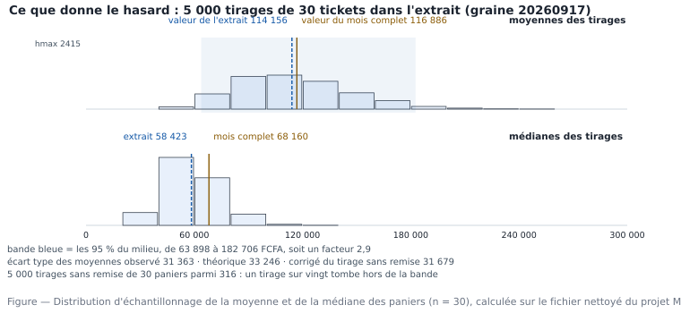

# M02.C07 — Hasard et incertitude : probabilités de base, échantillonnage, biais

> **L'idée du chapitre.** Vous n'avez jamais les données : vous en avez un extrait. Trois idées rendent cet extrait
> défendable — ce que le hasard ajoute (l'erreur d'échantillonnage), ce que le hasard ne corrige pas (le biais), et
> la façon de le dire (l'intervalle). Sans elles, un chiffre juste reste une opinion.

> **Base de travail — obligatoire.** Le fichier nettoyé du projet M01,
> `donnees/reference/ventes_magasin5_2025_ATTENDU.csv` (480 lignes × 13 variables, 316 tickets), et la population dont
> il est issu : le magasin 5 sur 2025, soit 7 676 lignes et 4 524 tickets, lus dans
> `01_socle_donnees/data/reference/ventes_propres.csv`. Séparateur point-virgule, UTF-8, virgule décimale, montants
> en franc CFA (FCFA). Valeurs mesurées dans `01_socle_donnees/data/reference/chiffres_cites.md`, section M02.

---

## 1. Objectifs du chapitre

À la fin de ce chapitre, vous êtes capable de :

1. distinguer population, échantillon, unité sondée et statistique, et nommer ces quatre objets dans un dossier réel ;
2. expliquer pourquoi deux tirages de même taille ne donnent pas le même chiffre, et chiffrer cet écart par
   l'erreur type ;
3. calculer une marge d'erreur et un intervalle de confiance à 95 % pour une moyenne et pour une proportion ;
4. séparer l'**erreur d'échantillonnage**, qui se travaille, du **biais**, qui se lit dans la règle d'extraction ;
5. diagnostiquer le biais de début de mois de notre extrait, le chiffrer, et dire quelle statistique il dégrade ;
6. fixer une taille d'échantillon à partir d'une précision visée, et expliquer pourquoi le premier doublement de
   précision coûte quatre fois plus cher.

## 2. Pourquoi cette notion est importante

Un analyste qui ne parle pas d'incertitude livre un nombre sans mode d'emploi, et le décideur en fait ce qu'il veut.
Trois accidents sortent de là :

- **La sur-interprétation.** « Le panier moyen est de 114 156 FCFA, nous perdons du terrain » : rien, dans ce
  chiffre, ne dit si l'écart avec 116 886 FCFA est une baisse ou le bruit normal d'un extrait de 316 tickets.
- **La généralisation abusive.** Un export tronqué, un `LIMIT`, un seul magasin, un seul mois : le rapport dit
  « l'année », l'auditoire comprend « tout le monde, tout le temps ».
- **Le faux sentiment de sécurité du volume.** 480 lignes suffisent pour une moyenne à ±20 078 FCFA près ; 240 000
  lignes ne suffisent pas si elles viennent d'un périmètre mal choisi. La taille ne rachète jamais la sélection.

> **Dans les faits.** Dans les services études, le nombre de lignes n'est presque jamais le vrai problème :
> l'extraction obéit à des contraintes techniques (la caisse n'exporte que les derniers jours, l'entrepôt ne garde
> que treize mois). Le travail de l'analyste est de **reconstituer la règle d'extraction** — qui a été exclu, et
> comment — avant toute statistique. Ce chapitre vous le fait faire sur votre propre fichier, parce qu'il est plus
> simple de commencer par un défaut que l'on peut compter.

## 3. Explication simple

Vous goûtez une marmite de sauce avec une cuillère. Trois choses se passent.

1. **La cuillère n'est pas la marmite** : ce que vous goûtez dépend de ce qu'elle a attrapé. C'est l'**erreur
   d'échantillonnage**, le hasard de la trempée. Elle baisse si la louche est plus grande.
2. **Si vous plongez toujours en surface, vous trouverez du gras** tous les jours, à toutes les heures, avec toutes
   les louches du monde. C'est le **biais** : la méthode de trempée, pas la chance.
3. **Ce que vous pouvez annoncer honnêtement** n'est pas « la sauce est salée » mais « salée, et si je regoûte dix
   fois je resterai dans ce goût-là ». Cela s'appelle un **intervalle de confiance**.

Notre extrait est une cuillère trempée en surface, et nous allons le prouver : il contient les 40 premières lignes de
chaque mois — donc seulement les jours 1, 2, 3 et 4 — et représente 6,3 % des lignes du magasin sur l'année. Sa
moyenne ne dérape que de 2,3 %, mais sa médiane de 14,3 %. Même cuillère, deux statistiques, deux dégradations :
c'est tout le chapitre.

## 4. Vocabulaire essentiel

| # | Terme | Français — English — sens simple | À savoir |
|---|---|---|---|
| 1 | Population | population — *population* — l'ensemble qu'on veut décrire | ici 4 524 tickets, magasin 5 en 2025 |
| 2 | Unité sondée | unité statistique — *sampling unit* — ce qu'on tire un par un | le ticket ou la ligne : le choix change tout |
| 3 | Échantillon | échantillon — *sample* — la partie réellement observée | 480 lignes, 316 tickets |
| 4 | Statistique | statistique — *statistic* — chiffre calculé sur l'échantillon | 114 156 FCFA est une statistique |
| 5 | Paramètre | paramètre — *parameter* — le même chiffre sur la population | 116 886 FCFA est le paramètre visé |
| 6 | Tirage aléatoire simple | tirage aléatoire simple — *simple random sampling* — toute combinaison équiprobable | notre extrait ne remplit pas cette condition |
| 7 | Erreur d'échantillonnage | erreur d'échantillonnage — *sampling error* — dispersion d'un tirage à l'autre | elle baisse en 1/√n |
| 8 | Biais | biais d'échantillonnage — *sampling bias* — décalage systématique | il ne baisse pas avec n |
| 9 | Erreur type | erreur type — *standard error* — écart type de la statistique | 10 244 FCFA pour notre moyenne |
| 10 | Marge d'erreur | marge d'erreur — *margin of error* — 1,96 fois l'erreur type | 20 078 FCFA ici |
| 11 | Intervalle de confiance | intervalle de confiance — *confidence interval* — plage compatible avec l'observation | [94 078 ; 134 234] FCFA |
| 12 | Niveau de confiance | niveau de confiance — *confidence level* — taux de réussite de la méthode | 95 % est l'usage, pas une probabilité sur votre cas |
| 13 | Bootstrap | amorçage bootstrap — *bootstrap* — remesurer la statistique sur des ré-échantillonnages du fichier | notre outil pour la médiane |
| 14 | Graine | graine aléatoire — *random seed* — numéro qui rend un tirage rejouable | 20260917 dans tous nos exemples |

## 5. Cours approfondi

### 5.1 Hasard, fréquence, probabilité : trois règles suffisent

> **Définition.** La **probabilité** d'un événement est la fréquence vers laquelle se stabilise cette fréquence quand
> on répète l'expérience beaucoup de fois. Elle ne décrit jamais un cas particulier, seulement une régularité
> d'ensemble.

Sur les 316 tickets de l'extrait, tirons au sort un ticket puis un second :

| Règle | Énoncé | Application mesurée |
|---|---|---|
| Complément | P(non A) = 1 - P(A) | 136 paniers sur 316 sont sous 50 000 FCFA, soit 43,0 % ; donc 57,0 % sont au-dessus |
| Indépendance | P(A et B) = P(A) × P(B) si un tirage ne change rien à l'autre | deux petits paniers d'affilée : 0,43 × 0,43 ≈ 18,5 % |
| Addition | P(A ou B) = P(A) + P(B) si les deux s'excluent | 31 paniers au-dessus de 250 000 FCFA et 3 négatifs : 9,8 % plus 0,9 % |

Une nuance, souvent sanctionnée : le second tirage **n'est pas indépendant** du premier si l'on tire sans remise dans
un petit ensemble. L'effet est négligeable ici (316 éléments), matériel quand on tire 30 valeurs sur 40 — et c'est
la raison exacte de la correction du §5.2.

### 5.2 Ce que le hasard ajoute : la distribution d'échantillonnage

> **Définition.** L'**erreur d'échantillonnage** (*sampling error*) est la dispersion d'une statistique si l'on
> refaisait le tirage. Ce n'est pas une faute, c'est le prix d'une lecture partielle ; elle se mesure par
> l'**erreur type**, écart type de la statistique d'un tirage à l'autre.

Mesurons-la au lieu de la postuler : dans les 316 paniers, 5 000 tirages de 30 tickets sans remise (graine 20260917,
donc rejouable), et la moyenne de chaque tirage.

```python
import numpy as np, pandas as pd
p = pd.read_csv("01_socle_donnees/data/reference/ventes_magasin5_2025_ATTENDU.csv", sep=";")
pan = p.groupby("n_ticket").montant_ttc.sum().to_numpy(dtype=float)      # 316 paniers
n = len(pan)
rng = np.random.default_rng(20260917)
tirages = np.argsort(rng.random((5000, n)), axis=1)[:, :30]              # 5000 tirages de 30, sans remise
moy = pan[tirages].mean(axis=1)
med = np.median(pan[tirages], axis=1)
print(round(moy.mean()), round(moy.std(ddof=1)), np.percentile(moy, [2.5, 97.5]))
```

Résultats mesurés : la moyenne des 5 000 moyennes vaut 114 889 FCFA, c'est-à-dire la moyenne de l'extrait
(114 156 FCFA) à la fluctuation près — **le tirage ne trompe pas en moyenne, il éparpille**. L'écart type de cette
distribution est de 31 363 FCFA, et 95 % des tirages tombent entre 63 898 et 182 706 FCFA : avec 30 tickets, votre
chiffre peut varier du simple au triple sans que personne ait failli.



La théorie dit la même chose sans simuler : l'écart type d'une moyenne est celui des valeurs divisé par la racine de
l'effectif. Nos 316 paniers ont un écart type de 182 095,1 FCFA, d'où une erreur type de 10 244 FCFA — 10 243 si l'on part de l'écart type arrondi à 182 095, différence sans effet sur la marge. Pour des tirages
de 30, la formule donne 33 246 FCFA quand la simulation trouve 31 363 FCFA : l'écart vient du tirage **sans remise**
dans une population finie, qui réduit la dispersion d'un facteur 0,953. La formule corrigée tombe à 31 679 FCFA — il
reste 1 %, et c'est le hasard des 5 000 tirages.

> **Attention.** Deux écarts types se ressemblent dans les notes et n'ont rien à voir : 182 095 FCFA décrit la
> dispersion **des clients entre eux**, 10 244 FCFA décrit la dispersion **de votre moyenne d'un tirage à l'autre**.
> Le second est dix-huit fois plus petit, et lui seul fixe la précision de ce que vous annoncez. Confondre les deux
> revient à écrire « nos clients sont très variés, donc votre moyenne est fausse ».

Même expérience avec la **médiane** : écart type de 14 387 FCFA pour une moyenne des tirages de 59 140 FCFA, soit
24,3 % de variation relative contre 27,3 % pour la moyenne. Contre une idée reçue, la médiane n'est donc pas plus
instable ici ; elle est simplement insensible au plus gros ticket (1 343 666 FCFA), ce que la moyenne ne peut pas
faire. En échange, sa distribution n'est pas lisse — une médiane de 30 valeurs est toujours l'une des valeurs
observées — et l'intervalle [32 006 ; 90 577] FCFA est plus irrégulier que celui des moyennes.

### 5.3 Ce que le hasard ne pardonne pas : le biais

> **Définition.** Un **biais d'échantillonnage** (*sampling bias*) est un écart systématique entre la statistique
> attendue et la valeur de population, produit par la **méthode de sélection**. Augmenter l'échantillon ne le fait
> pas disparaître : il le rend plus précis autour de la mauvaise valeur.

Ouvrons la fabrication du fichier. Dans le socle de la formation (`01_socle_donnees/scripts/generation_socle.py`), les
lignes du magasin 5 pour 2025 sont triées par date, puis on garde **les 40 premières lignes de chaque mois** — règle
choisie pour couvrir douze mois au lieu d'un. Raisonnable pour un cours, elle n'est pas aléatoire, et voici ce
qu'elle coûte.

| Ce que dit l'extrait | Extrait | Population magasin 5 / 2025 | Écart |
|---|---|---|---|
| Lignes | 480 | 7 676 | 6,3 % de la population |
| Tickets | 316 | 4 524 | 7,0 % de la population |
| Jours du mois observés | 1, 2, 3, 4 (31 dates, 2 à 4 par mois) | 1 à 31 | fin de mois jamais vue |
| Panier moyen | 114 156 FCFA | 116 886 FCFA | -2,3 % |
| Médiane des paniers | 58 423 FCFA | 68 160 FCFA | **-14,3 %** |

Le diagnostic est net parce que nous avons la population sous la main : dans le magasin sur l'année, les tickets des
quatre premiers jours du mois ont une médiane de 58 424 FCFA, les autres 70 267 FCFA, et ces jours-là ne pèsent que
14,9 % des tickets. Notre extrait est fait **uniquement** de ces jours : sa médiane tombe à 58 423 FCFA, soit à un
franc près la médiane du début de mois. Le biais n'a rien de mystérieux — il est entièrement attribué à la
composition en jours. La moyenne, elle, ne dérape que de 2,3 % parce que les gros tickets existent aussi les premiers
jours.

> **Définition.** Un **biais de couverture** (*coverage bias*) est le cas où la liste de départ ne contient pas toute
> la population. C'est notre cas : la liste était « les 40 premières lignes de chaque mois », ce qui exclut
> structurellement trois quarts du calendrier.

Deux réflexes, pour la vie : **demander la règle, pas le volume** (« selon quels critères ces lignes ont-elles été
retenues ? » — la réponse est dans le code d'extraction ou dans le `WHERE` de la vue) et **chercher la variable
cachée** (ici le jour du mois, absente des 13 colonnes du fichier : un biais se lit rarement dans les données, il se
lit dans le mode d'emploi des données). Notez aussi ce qui n'est **pas** biaisé : les heures couvrent toute la
journée, de 07:01 à 18:57, parce que le tri ne portait que sur la date. Un biais est toujours localisé sur un axe.

### 5.4 Cinq familles de biais, et leur trace dans notre fichier

| Famille | Mécanisme | Dans notre dossier | Ce qu'on peut chiffrer |
|---|---|---|---|
| Couverture | la liste de départ est incomplète | extrait réduit aux quatre premiers jours | médiane -14,3 % (§5.3) |
| Sélection | le tri favorise un profil | tri par date avant écrêtage à 40 | 2 à 4 dates retenues par mois, 29 lignes au plus sur une date, 13 en médiane |
| Non-réponse | des individus ne sont pas renseignés | 18 tickets sans identifiant client, 103 lignes sans client exploitable | 21,5 % des lignes |
| Survivance | on n'observe que ce qui a survécu | 489 lignes reçues pour 480 utiles : les doublons ne sont là que parce qu'ils ont été ré-émis | 9 lignes de doublon |
| Mesure | l'instrument déforme | 7 quantités à 14 000 unités, 65 dates écrites à la main en JJ/MM/AAAA | M01.C04 et M01.C06 |

Cinq mécanismes agissent sur 489 lignes, aucun ne provoque d'erreur logicielle — et tous sont comptables : on peut les
isoler et les annuler un par un, ce que vous avez fait au projet M01. Trois nuances à retenir. Le **biais du
survivant** : mesurer un assortiment sur les produits encore en rayon, ou la rentabilité sur les magasins encore
ouverts, conclut que « tout va bien ». Le **biais de Berkson** : une ligne n'existe que si elle a été encaissée —
chantier payé à trente jours, livraison sans bon saisi, avoir émis le mois suivant disparaissent avant le premier
calcul, sans qu'une valeur erronée soit présente. Le **biais d'accord** (réponse sociale) ne menace pas les données
d'encaissement mais les questionnaires : sur les premières on se bat contre la couverture, sur les seconds contre la
volonté.

> **Conseil professionnel.** Écrivez la liste des exclusions dans le rapport, pas dans votre tête : « magasin 5,
> année 2025, lignes des quatre premiers jours de chaque mois, retours inclus, avoirs de l'année précédente exclus ».
> Cette demi-page ne prouve pas que vous aviez raison ; elle prouve que vous saviez — et c'est exactement ce que vaut
> un analyste le jour où un chiffre est contesté.

### 5.5 L'intervalle de confiance : ce que « 95 % » veut dire

> **Définition.** Un **intervalle de confiance à 95 %** est fabriqué par une méthode qui, appliquée à une infinité de
> tirages, enfermerait la vraie valeur dans 95 % des cas. Le pourcentage qualifie la **méthode**, pas votre
> intervalle : une fois calculé, la valeur est dedans ou elle n'y est pas.

C'est la phrase la plus mal dite de la statistique d'entreprise. À ne pas écrire : « il y a 95 % de chances que le
vrai panier moyen soit dans notre intervalle ». À écrire : « notre méthode manque la cible une fois sur vingt ; sur
ce tirage elle donne 114 156 ± 20 078 FCFA ».

Pour une moyenne à grand effectif : estimation ± 1,96 fois l'erreur type. Estimation 114 156 FCFA, erreur type
10 244 FCFA, marge 20 078 FCFA, intervalle [94 078 ; 134 234] FCFA — 40 156 FCFA de largeur, soit environ un tiers
de la valeur annoncée. Voilà le mot juste que le décideur doit entendre : avec 316 tickets, on connaît le panier
moyen **à un tiers près**, pas au centime près.

Et le contrôle que presque personne ne fait, possible ici parce que la population est connue : le vrai panier annuel
vaut 116 886 FCFA, il est dans l'intervalle. On a vérifié la couverture de la méthode sur ce cas, ce qui change le
statut de la note : on peut écrire « notre intervalle contient la valeur mesurée sur 4 524 tickets ».

Pour une proportion, l'erreur type vaut √(p(1 - p) / n). La part de tickets contenant plus d'une ligne : 104 sur 316,
soit 32,9 %, erreur type 2,6 points, intervalle [27,7 ; 38,1] %. Cette écriture résiste en réunion : elle ne dit pas
« un tiers des tickets », elle dit « entre un quart et deux cinquièmes », et personne n'en déduit une politique
commerciale.

> **Attention.** Trois abus fréquents dans les tableaux de bord. (1) Appliquer l'intervalle à un extrait non
> aléatoire : la formule suppose un tirage au sort, et le nôtre n'en est pas un — son intervalle ne couvre que la
> variabilité, jamais le biais. (2) Conclure à l'équivalence parce que deux intervalles se chevauchent : c'est le
> test du chapitre M02.C08 qui tranche. (3) Faire varier le niveau de confiance après coup pour rendre un résultat
> intéressant : fixez 95 % dans la note de cadrage, avant d'ouvrir le fichier.

### 5.6 Le bootstrap : remesurer sans retourner sur le terrain

> **Définition.** Le **bootstrap** (*bootstrap*) traite l'échantillon comme une population : on tire 2 000 fois,
> **avec remise**, un échantillon de même taille, on recalcule la statistique, et les 2,5ᵉ et 97,5ᵉ percentiles de
> ces 2 000 résultats servent d'intervalle.

La formule du §5.5 n'existe que pour la moyenne ; le bootstrap s'applique à toute statistique que l'on sait
recalculer. Mesures prises sur nos 316 paniers, graine 20260917 :

| Statistique | Intervalle par formule | Intervalle par bootstrap | Lecture |
|---|---|---|---|
| Moyenne des paniers | [94 078 ; 134 234] | [95 397 ; 133 574] | les deux se recoupent : profil peu déformé |
| Médiane des paniers | inexistante | [52 318 ; 64 632] | largeur 12 314 FCFA : mieux connue que la moyenne |
| Minimum des paniers | inapplicable | [-150 804 ; 797] | artefact, ligne suivante |

Le plus petit panier vaut -150 804 FCFA : un ticket sur 316. Dans un ré-échantillonnage, sa probabilité d'être
absent est forte, et le minimum saute alors à la valeur suivante, 797 FCFA. Résultat : 64,3 % des 2 000 tirages reproduisent
le minimum exact, et l'intervalle obtenu ne mesure pas l'incertitude mais la discontinuité. Règle métier : **on ne
bootstrap pas les valeurs extrêmes**, ni rien qui tienne à quelques lignes — seuils de retours, plus gros clients,
aberrants de M02.C02-C03 ; ceux-là se comptent.

```python
rng = np.random.default_rng(20260917)
rejes = rng.choice(pan, size=(2000, n), replace=True)
print(np.percentile(np.median(rejes, axis=1), [2.5, 97.5]))   # [52318. 64632.] avec cette graine
```

> **Conseil professionnel.** Publiez un intervalle bootstrap avec trois précisions : nombre de tirages, graine,
> version de la bibliothèque. « [52 318 ; 64 632] FCFA, 2 000 tirages, graine 20260917 » se vérifie en trente
> secondes ; « environ ±6 000 FCFA » ne se vérifie pas du tout.

### 5.7 Combien de tickets faut-il mesurer ?

On retourne le problème : au lieu de subir la précision, on la commande.

| Objectif | Calcul | n nécessaire | Avec nos 316 tickets |
|---|---|---|---|
| Proportion à ±5 points, pire cas | (1,96 / 0,05)² × 0,25 | 385 | insuffisant |
| Proportion à ±5 points, p ≈ 33 % | (1,96 / 0,05)² × p(1 - p) | 340 | insuffisant |
| Proportion à ±3 points, pire cas | (1,96 / 0,03)² × 0,25 | 1 068 | loin du compte |
| Moyenne de panier à ±10 % relatif | (1,96 × σ / (0,1 × moyenne))² | 978 | insuffisant |

Trois enseignements de gestion, plus utiles que les chiffres :

1. **Rendements décroissants.** Diviser la marge par deux demande quatre fois plus de données, la diviser par dix en
   demande cent. Passer de ±20 078 à la moitié sur la moyenne équivaut à quadrupler l'effectif — mais un mois complet
   de magasin en contient 4 524 : on peut le payer sans changer d'outil. La question devient « vaut-il la peine de lire
   toute l'année pour un chiffre ? », jamais « faut-il un meilleur logiciel ? ».
2. **Le grain est un plan d'échantillonnage.** Tirer 480 lignes ne vaut pas tirer 480 tickets : à 1,52 ligne par
   ticket, un tirage de lignes sur-représente les paniers à plusieurs lignes, donc les gros. Objet client → tirez
   des tickets ; objet produit → tirez des lignes ; et écrivez lequel.
3. **Le volume ne dispense pas du plan.** 240 000 lignes reconduisent exactement le même biais de couverture si elles
   viennent des seuls jours 1 à 4. À l'inverse, un plan stratifié bien né — 30 tickets par trimestre et par vendeur —
   informe mieux qu'un million de lignes prises à la tête du client.

> **Définition.** L'**échantillonnage stratifié** (*stratified sampling*) découpe la population en cases (jour du
> mois, catégorie, vendeur, trimestre), tire au sort dans chaque case, puis combine les résultats pondérés par le
> poids réel des cases. C'est le remède direct au §5.3 : il garantit que début et fin de mois sont observés.

### 5.8 Corriger après coup, et choisir l'outil

Quand re-tyrager est impossible, la technique de secours est la **post-stratification** (pondération) : on garde
l'échantillon, mais on redonne à chaque strate son poids réel. Testons-le : sur le montant moyen par ligne, l'extrait
annonce 75 152 FCFA pour 68 889 FCFA en population, soit +9,1 % ; en repesant la structure par catégorie de produits
aux poids du mois complet, on tombe à 78 060 FCFA, soit +13,3 %. **La pondération a aggravé l'erreur** — non par
défaut de méthode, mais par sa limite structurale : on ne corrige que l'axe sur lequel on équilibre, et le défaut
d'ici vit dans le calendrier. À écrire noir sur blanc dans un rapport.

| Question | Tableur | SQL (DuckDB) | pandas / Python |
|---|---|---|---|
| Tirer k lignes au hasard | `=ALEA.ENTRE.BORNES(1;480)` + `=INDEX()` | `USING SAMPLE 30 ROWS` | `df.sample(30, random_state=20260917)` |
| Tirer par strate | filtre puis `=ARRALE()` sur la sous-plage | `ROW_NUMBER() OVER (PARTITION BY mois ORDER BY random())` | `g.sample(n=30, random_state=...)` |
| Erreur type d'une moyenne | `=ECARTYPE.STANDARD(plage)/RACINE(NB(plage))` | `STDDEV_SAMP(m)/SQRT(COUNT(*))` | `s.std(ddof=1) / len(s)**0.5` |
| Marge à 95 % | `=INTERVALLE.CONFIANCE.NORMAL(0,05;écart_type;effectif)` | multiplication par 1,96 (pas de fonction dédiée) | `scipy.stats.norm.ppf(0.975)` |
| Intervalle d'une proportion | `=1,96*RACINE(p*(1-p)/n)` | idem en SQL | `proportion_confint` (statsmodels) |
| Bootstrap | déconseillé : pas de boucle rejouable sans macro | export puis Python | `rng.choice(valeurs, size=(2000, n), replace=True)` |

Vigilance d'outillage, parce qu'elle casse les rapprochements entre collègues : les fonctions d'intervalle ne se
nomment pas pareil selon le logiciel, et ne rendent pas un intervalle. Dans Excel, `INTERVALLE.CONFIANCE.NORMAL` et
`INTERVALLE.CONFIANCE.STUDENT` rendent la **demi-largeur**, à ajouter et retrancher de la moyenne ; dans LibreOffice,
la famille s'appelle `INTERVALLE.CONFIANCE.NORMAL` et `INTERVALLE.CONFIANCE.T` (la version héritée
`INTERVALLE.CONFIANCE` reste acceptée pour compatibilité). Un facteur 2 d'écart entre deux notes vient plus
souvent de ce détail que des données.

> **Boîte à outils.** Le minimum à écrire sous tout chiffre issu d'un extrait : (1) la **population** visée et sa
> source (tickets du magasin 5, 2025, 4 524) ; (2) l'**unité sondée** (le ticket, pas la ligne) ; (3) l'**effectif**
> et le taux de représentation (316, soit 7,0 %) ; (4) la **règle d'extraction** reconstituée, avec son biais chiffré
> quand il est mesurable (jours 1 à 4 ; médiane -14,3 %) ; (5) l'**intervalle** avec sa méthode (formule ou bootstrap,
> nombre de tirages, graine). Cinq lignes de pied de page, et elles valent plus que le graphique.

## 6. Exemple concret : « le panier moyen du magasin 5, à quoi bon le discuter ? »

**La demande.** Le directeur régional prépare un arbitrage d'assortiment et veut un chiffre unique. Un collaborateur a
répondu 114 156 FCFA en ouvrant le fichier d'extraction, sans autre forme de procès.

**Ce que le dossier permet vraiment de dire.**

| On savait | On établit en lisant la règle d'extraction | On établit avec l'intervalle |
|---|---|---|
| 114 156 FCFA | l'extrait ne couvre que les jours 1 à 4 : 6,3 % des lignes du magasin sur l'année | le vrai panier annuel, sur 4 524 tickets, est 116 886 FCFA : -2,3 %, dans l'intervalle [94 078 ; 134 234] |
| 58 423 FCFA de médiane | la médiane du début de mois, dans la population, est 58 424 FCFA | la médiane annuelle est 68 160 FCFA : -14,3 %, et ce n'est pas du bruit |

**Ce que le chiffre change à la décision.** Sur la moyenne, personne n'aurait changé d'avis : 2,3 % dans un
intervalle large d'un tiers ne déplace aucune décision. Sur la médiane, si : conclure « la moitié de nos clients est
sous 58 000 FCFA » oriente vers un assortiment d'entrée de gamme, alors que la moitié réelle est sous 68 160 FCFA —
9 700 FCFA d'écart par ticket, multipliés par 4 524 tickets, cela devient une question d'assortiment et non
d'arrondi. Le travail n'a pas été de calculer plus finement, mais de replacer le chiffre dans le calendrier dont il
venait.

**La phrase à écrire.** « Panier moyen estimé sur l'extrait (316 tickets, jours 1 à 4 de chaque mois) :
114 156 FCFA, intervalle à 95 % [94 078 ; 134 234]. Valeur annuelle complète : 116 886 FCFA, soit un écart de 2,3 % —
l'extrait est usable pour la moyenne. La médiane reproduit celle du début de mois et sous-estime de 14,3 % la
médiane annuelle : à recalculer sur le mois complet. »

## 7. Démonstration pas à pas : de la règle d'extraction à l'intervalle

**Étape 1 — Reconstituer la règle.** Ouvrez le script d'extraction, ou faites-vous le donner. Ici : tri par date puis
40 premières lignes par mois. Recopiez la règle en une phrase dans le carnet de données, avec la date de la
vérification.

**Étape 2 — Aligner les périmètres.** Population au même grain : 7 676 lignes, 4 524 tickets. Extrait : 480 et 316.
Le taux de sondage (6,3 % en lignes, 7,0 % en tickets) n'est pas encore un jugement : il dit qu'une lecture exhaustive
est possible.

**Étape 3 — Mesurer l'écart, statistique par statistique.** Moyenne -2,3 %, médiane -14,3 %. On n'écrit pas
« l'extrait est biaisé » : on dit quelle statistique est touchée et de combien.

**Étape 4 — Attribuer le biais.** Médiane des jours 1 à 4 dans la population : 58 424 FCFA ; jours suivants :
70 267 FCFA. L'extrait, à un franc près, est le premier groupe. Le biais est attribué à un axe, pas à une ambiance.

**Étape 5 — Séparer le biais de la variabilité.** Simulation de 5 000 tirages de 30 : écart type 31 363 FCFA, bande
des 95 % du milieu de 63 898 à 182 706 FCFA. À 316, erreur type 10 244 FCFA et marge 20 078 FCFA. Ce que la taille
arrange, et ce qu'elle n'arrange pas, sont maintenant deux chiffres distincts.

**Étape 6 — Choisir le remède.** Élargir la lecture (mois complet, coût nul, 4 524 tickets) avant de bricoler des
poids : la pondération par catégorie, elle, remonte l'écart de +9,1 % à +13,3 %.

**Contrôles qualité du chapitre.**

| # | Contrôle | Seuil | Résultat attendu | Si échec |
|---|---|---|---|---|
| 1 | Effectif de l'extrait conforme à la règle annoncée | identité | 480 lignes pour 40 × 12 | règle devinée, pas lue |
| 2 | Population et échantillon au même grain | même unité | 316 tickets contre 4 524 | agrégation de lignes oubliée |
| 3 | Écart type simulé et formule | écart < 5 % | 31 363 contre 31 679 FCFA | tirage avec / sans remise confondu |
| 4 | L'intervalle contient la valeur de population | oui ou non écrit | contient 116 886 FCFA | formule appliquée hors conditions |
| 5 | Bootstrap employé hors valeurs extrêmes | interdit sur min et max | minimum exclu, médiane retenue | artefact pris pour incertitude |
| 6 | Chaque pourcentage rapporté à son effectif | systématique | 32,9 % (104 de 316) | proportion sans dénominateur |

## 8. Erreurs fréquentes

1. **Confondre imprécision et biais.** L'intervalle mesure la fluctuation du tirage ; il ne dit rien de la façon dont
   on a tiré. Notre extrait a une marge d'erreur honnête et un mauvais calendrier.
2. **Se rassurer avec le volume.** 480, 7 676 ou 240 000 lignes : si la règle de sélection est la même, l'écart
   systématique est le même. La précision augmente, la justesse non.
3. **Annoncer un pourcentage sans dénominateur.** « 21,5 % des lignes n'ont pas de client exploitable » se défend
   parce qu'on sait que c'est sur 480 ; sans le dénominateur, la phrase devient une rumeur.
4. **Appliquer les formules d'intervalle à un échantillon de convenance** sans le dire : on peut publier l'intervalle,
   à condition d'écrire qu'il ne couvre que la variabilité d'échantillonnage.
5. **Bootstraper un minimum, un maximum ou un seuil rare** : ces statistiques ne dépendent que de quelques lignes, et
   le ré-échantillonnage les fait sauter (64,3 % de tirages identiques sur notre minimum).
6. **Multiplier les sous-populations jusqu'à l'effectif ridicule.** Un intervalle sur 4 tickets d'une strate est un
   objet mathématique sans contenu : publiez l'effectif de la strate à côté de sa marge, et signalez toute strate de
   moins d'une dizaine d'observations comme non exploitable.

## 9. Bonnes pratiques professionnelles

1. **Une ligne de méthodologie par chiffre** : population, unité sondée, effectif, règle d'extraction, intervalle.
2. **La règle d'extraction vit dans le dépôt**, pas dans un e-mail : un en-tête de requête (`-- extrait : 40
   premières lignes par mois, 2025, magasin 5`) survit à son auteur.
3. **Toujours fixer la graine.** Un résultat non rejouable n'est pas un résultat, c'est une anecdote.
4. **Publier la marge avant la conclusion.** Le lecteur décide d'agir ou non ; c'est son rôle, et vous venez de lui
   donner de quoi.
5. **Fixer le seuil d'exploitation par strate avant de découper** (« toute strate sous 12 observations est agrégée ») :
   sinon le premier tableau de bord segmenté conclura sur deux tickets.
6. **Faire valider le taux de sondage par le métier.** 7,0 % des tickets du magasin sur l'année, est-ce assez pour un
   arbitrage d'assortiment ? Le responsable de rayon le sait mieux que vous : son critère n'est pas la précision
   statistique mais le coût d'une décision ratée.

## 10. Exercice guidé — mesurer l'incertitude d'un panier moyen

**Énoncé.** Sur le fichier attendu, estimez le panier moyen, son intervalle à 95 %, et l'écart entre cet intervalle
et la valeur annuelle réelle du magasin. Concluez en une phrase pour un directeur.

**Vous faites** — barème 10 points, total 10.

| Étape | Ce que vous produisez | Points |
|---|---|---|
| A | Population, unité sondée et effectifs écrits avant tout calcul | 2 |
| B | Erreur type et marge d'erreur, formule énoncée | 2,5 |
| C | Intervalle à 95 % comparé à la valeur annuelle | 2,5 |
| D | Contrôle par bootstrap, avec nombre de tirages et graine | 1,5 |
| E | Phrase de conclusion séparant variabilité et biais | 1,5 |

**Nous vérifions.** 316 tickets pour 4 524 (7,0 %) · erreur type 10 244 FCFA · marge 20 078 FCFA · intervalle
[94 078 ; 134 234] FCFA · valeur annuelle 116 886 FCFA, donc couverte · bootstrap 2 000 tirages, graine 20260917,
intervalle [95 397 ; 133 574] FCFA.

**Nous corrigeons.** Trois défauts reviennent : l'intervalle présenté comme « la fourchette des paniers » (il
s'agit de la fourchette de la **moyenne** ; celle des clients va de -150 804 à 1 343 666 FCFA) ; le contrôle de
couverture oublié ; et la conclusion « nos clients dépensent 114 156 FCFA », qui oublie que 71,8 % des tickets sont
sous cette moyenne (M02.C02). La phrase juste porte l'estimation, sa plage, et ce que la plage autorise.

## 11. Exercices autonomes

**Exercice 7.1 (★) — Les quatre objets.** Pour votre extrait, nommez la population visée, l'unité sondée,
l'échantillon et la statistique, en une ligne chacun avec les effectifs mesurés.

**Exercice 7.2 (★) — Deux tirages.** Une chance sur deux de tomber sur un panier sous 50 000 FCFA ? Calculez la
probabilité pour un puis deux tirages, et dites pourquoi le tirage sans remise rend le calcul légèrement faux.

**Exercice 7.3 (★★) — La marge en pratique.** Intervalle à 95 % de la part des lignes comportant une remise non
nulle (173 lignes sur 480), puis effectif nécessaire pour ramener la marge à ±3 points.

**Exercice 7.4 (★★) — Trancher un désaccord.** Un collègue annonce 68 000 FCFA de médiane sur le mois complet contre
vos 58 423 FCFA sur l'extrait. Produisez les trois nombres qui permettent de dire qui mesure quoi, et lequel est
utilisable pour décrire le magasin.

**Exercice 7.5 (★★★) — Le plan.** Vous devez livrer un chiffre sur les paniers du trimestre en cours, à ±10 % près,
et la base ne permet d'exporter que 1 200 lignes. Proposez le plan (unité sondée, strates, tirage, contrôles), et
dites le risque que le plan ne corrige pas. *(attendu : tirer des tickets, strates par mois et par vendeur, contrôle
de l'écart type simulé contre la formule, risque résiduel de couverture sur retours et avoirs)*

## 12. Correction détaillée

**Exercice 7.1.** Population : les 4 524 tickets du magasin 5 en 2025 (ou, à l'échelle du socle, les 240 000 lignes
propres des quatre années). Unité sondée : le ticket — 480 lignes pour 316 tickets, 1,52 ligne par ticket.
Échantillon : 6,3 % des lignes, 7,0 % des tickets. Statistique : 114 156 FCFA — et non un paramètre, dont la
correspondante est 116 886 FCFA. C'est cette distinction qui rend la suite lisible.

**Exercice 7.2.** 136 tickets sur 316 sous 50 000 FCFA : 43,0 %. Deux tirages supposés indépendants : environ
18,5 %. En tirant sans remise, le second tirage ne porte plus que 135 candidats favorables sur 315, soit un écart de
l'ordre de 0,1 point — négligeable ici, mais c'est exactement ce qui rend la dispersion simulée du §5.2 un peu plus
petite que la formule (facteur 0,953).

**Exercice 7.3.** 173 lignes sur 480 : 36,0 %. Erreur type 2,2 points, marge 4,3 points, intervalle
[31,7 ; 40,3] %. Pour une marge de ±3 points : 1 068 lignes au pire cas, 984 lignes à p ≈ 36 %, soit un peu plus du
double de l'effectif disponible pour gagner 1,3 point. C'est la loi du √n, et c'est l'objet de la négociation avec le
métier.

**Exercice 7.4.** Les trois nombres : médiane de l'extrait 58 423 FCFA ; médiane annuelle du magasin 68 160 FCFA ;
médiane des tickets annuels datés des jours 1 à 4, 58 424 FCFA. Le troisième tranche : l'extrait n'est pas faux, il
est partiel, et il mesure précisément le début de mois. Seul le deuxième chiffre décrit le magasin entier. On n'a
pas « raison » : on a mesuré deux objets différents.

**Exercice 7.5.** Unité sondée : le ticket — 1 200 lignes en représentent moins (environ 790 au rythme de 1,52 ligne
par ticket). Strates : trois mois × quatre vendeurs, soit 12 cases et environ 66 tickets chacune, effectif à signaler
car aucune strate ne descend alors très bas. Tirage : `ROW_NUMBER() OVER (PARTITION BY mois, vendeur ORDER BY
random())` avec graine, ou `df.groupby(["mois", "vendeur"]).sample(n=…, random_state=20260917)`. Contrôles :
écarts types simulé et théorique, présence de toutes les strates, marge publiée avec l'effectif. Risque résiduel : le
tirage n'opère que sur la **liste** produite par la caisse ; si les retours et avoirs en sont absents (8 lignes de
retour, -283 933 FCFA dans l'extrait, M02.C02), aucun plan d'échantillonnage ne les fera réapparaître — c'est encore
la couverture qu'il faut interroger.

## 13. Mini-projet M02.P4 — « La page d'incertitude » (45 min, premier volet ; M02.C08 enchaîne)

**Commande.** À partir du fichier attendu et de la population du magasin sur 2025, produisez une page qui répond à :
« que peut-on affirmer, et avec quelle marge, sur le panier moyen et sur la part des tickets avec remise ? ». Le
volet décision (comparaisons de vendeurs, tests) est ajouté au chapitre suivant : M02.P4 est rendu une seule fois,
pour les deux chapitres.

**Livrables numérotés.** (1) bloc méthodologie : population, unité sondée, effectifs, taux de sondage, règle
d'extraction ; (2) pour chacune des deux statistiques : estimation, erreur type, marge, intervalle, méthode ; (3) un
contrôle de couverture, la même statistique calculée sur le mois complet avec l'écart en pourcentage ; (4) dix lignes
qui disent ce que l'intervalle autorise, ce qu'il interdit, et ce qu'on irait chercher si on avait le droit de tout
lire ; (5) ligne de journal (fichiers, effectifs, nombre de tirages, graine, versions).

**Barème (20 points, seuil 13).** Méthodologie complète (4) · estimations justes et sourcées (4) · intervalles
corrects, méthode explicitée (4) · contrôle de couverture chiffré et commenté (3) · interprétation sans abus de
langage (3) · journal (2) — total 20. Le second volet, en M02.C08, apportera ses 20 points ; la note du projet est la
moyenne des deux volets.

## 14. Résumé du chapitre

1. Le hasard éparpille, la méthode décale : erreur type (10 244 FCFA sur notre moyenne) et biais (-14,3 % sur notre
   médiane) se mesurent séparément et ne se corrigent pas l'un par l'autre.
2. La précision obéit à √n : 978 tickets pour ±10 % relatifs, 1 068 lignes pour ±3 points, contre 316 disponibles.
3. Un intervalle qualifie une méthode, pas un cas : [94 078 ; 134 234] FCFA se rate une fois sur vingt, et nous avons
   vérifié qu'il contient la valeur annuelle de 116 886 FCFA.
4. Le bootstrap intervalle toute statistique recalculable — la médiane y gagne ([52 318 ; 64 632] FCFA), les valeurs
   extrêmes y perdent toute signification.
5. Une pondération ne corrige que l'axe qu'elle équilibre : repeser les catégories a monté l'écart de +9,1 % à
   +13,3 %, parce que le défaut était dans le calendrier.

## 15. À retenir

> **À retenir.**
>
> - Avant de calculer : population, unité sondée, effectif, règle d'extraction. Ces quatre lignes précèdent le
>   premier chiffre, dans une note comme dans une requête.
> - Erreur d'échantillonnage : 1,96 fois σ / √n. Biais : ce que cette formule ne voit pas. Les deux se publient,
>   séparément.
> - Un intervalle ne couvre jamais le biais ; un gros volume ne rachète jamais une mauvaise liste. 480 lignes bien
>   tirées battent 240 000 lignes mal choisies.
> - Toute simulation se déclare : 5 000 tirages, 2 000 tirages, graine 20260917. Sans graine, pas de résultat.

> **À retenir.** La formulation qui tient debout. « Sur 316 tickets extraits des quatre premiers jours de chaque mois
> (6,3 % des lignes du magasin en 2025), le panier moyen est de 114 156 FCFA, intervalle à 95 % [94 078 ; 134 234].
> La valeur annuelle complète est 116 886 FCFA : notre intervalle la contient. La médiane de l'extrait reproduit
> celle du début de mois (58 423 contre 58 424 FCFA) et sous-estime de 14,3 % la médiane annuelle : elle ne décrit
> pas le magasin. »

## 16. Évaluation formative (auto-correction, 12 min)

**1.** Quelle différence de nature entre erreur d'échantillonnage et biais, et pourquoi le second ne se réduit-il pas
en augmentant l'échantillon ?
**2.** Sur l'extrait, la moyenne est à 2,3 % de la valeur annuelle et la médiane à 14,3 %. Que dit cet écart de
comportement sur la fabrication du fichier ?
**3.** Un intervalle à 95 % calculé sur un échantillon de convenance : que couvre-t-il, que ne couvre-t-il pas ?
**4.** Pourquoi ne bootstrap-t-on pas un minimum, et que publie-t-on à la place ?
**5.** On veut diviser la marge par deux : de combien multiplie-t-on l'effectif, et que répondez-vous au directeur
qui propose « de prendre un mois de plus » ?

<details><summary><strong>Corrigé</strong></summary>

1. L'erreur d'échantillonnage est la fluctuation d'un tirage à l'autre autour de la cible, et elle décroît en 1/√n.
   Le biais déplace la moyenne des tirages : augmenter l'effectif resserre l'intervalle **autour de la valeur
   biaisée**, donc rend plus confiant et plus faux à la fois.
2. Que l'extrait surreprésente un profil de jours, et que les positions centrales y sont sensibles : le début de mois
   a de plus petits paniers (58 424 contre 70 267 FCFA de médiane), la moyenne l'est peu car elle est tirée vers le
   haut par les gros tickets, présents à toutes les dates. D'où la règle : tester chaque statistique, pas le fichier
   en bloc.
3. Il couvre la variabilité du tirage, en supposant un tirage aléatoire. Ni le biais de sélection, ni les erreurs de
   mesure, ni le fait que la population visée n'était pas la bonne.
4. Parce qu'un minimum ne dépend que d'une ou deux observations : 64,3 % de nos ré-échantillonnages reproduisent le
   même ticket extrême, les autres sautent à la valeur suivante (797 FCFA), et l'intervalle [-150 804 ; 797] FCFA
   n'a aucune lecture honnête. À la place, on compte des effectifs : 8 lignes de retour, 25 tickets au-dessus du
   seuil de Tukey, 3 paniers négatifs, chacun avec sa marge de proportion.
5. Par quatre : de 316 tickets il faudrait dépasser le millier et demi, quand 978 suffiraient pour ±10 % relatifs.
   « Prendre un mois de plus » ajoute de la précision mais reconduit le même biais si le mois suivant est lui aussi
   tronqué aux quatre premiers jours — la bonne demande est « le mois entier, ou un tirage au sort dans le mois ».

</details>
