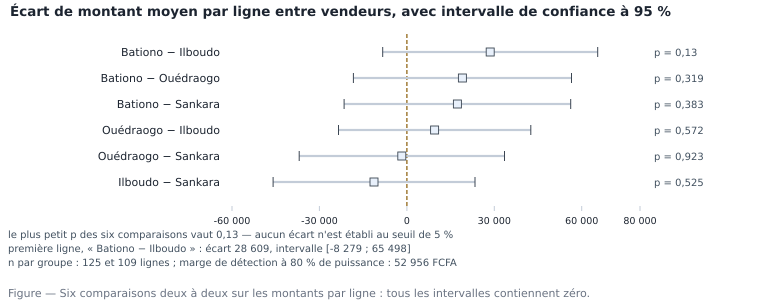

# M02.C08 — Décider avec incertitude : intervalle de confiance, tests, interprétation et limites

> **L'idée du chapitre.** Un écart observé est-il un écart réel ? Le test statistique répond à cette question
> précise — et à aucune autre. Ce chapitre donne la mécanique (hypothèses, statistique de test, valeur p, décision),
> les trois tests qui couvrent 90 % des demandes d'un service études, et surtout les quatre façons dont on les fait
> mentir.

> **Base de travail — obligatoire.** Le fichier nettoyé `donnees/reference/ventes_magasin5_2025_ATTENDU.csv`
> (480 lignes × 13 variables, 316 tickets, 4 vendeurs) et, pour les comparaisons, la population du même magasin sur
> 2025 (7 676 lignes, 4 524 tickets) dans `01_socle_donnees/data/reference/ventes_propres.csv`. Séparateur
> point-virgule, UTF-8, virgule décimale, montants en FCFA. Valeurs mesurées dans
> `01_socle_donnees/data/reference/chiffres_cites.md`, section M02.

---

## 1. Objectifs du chapitre

À la fin de ce chapitre, vous êtes capable de :

1. formuler une hypothèse nulle et une hypothèse alternative lisibles, et choisir le test d'après la nature de la
   variable et le grain de l'observation ;
2. conduire un test de comparaison de moyennes (t de Welch), un test de comparaison de rangs (Mann-Whitney) et un
   test d'indépendance sur tableau de fréquences (chi²), avec leurs conditions d'emploi ;
3. lire une valeur p sans lui faire dire « la probabilité que H0 soit vraie », et publier l'intervalle avec le test ;
4. distinguer « non significatif » de « égal », et chiffrer ce qu'une étude n'est **pas** en état de détecter ;
5. calculer la puissance d'un comparatif et l'effectif nécessaire, et déclarer à temps une étude sous-calibrée ;
6. repérer les quatre abus qui ruinent un travail sinon — comparaisons multiples, seuil de 5 % traité en loi,
   confusion entre significatif et important, test appliqué à un grain ou à un échantillon mal formé.

## 2. Pourquoi cette notion est importante

Un comparatif sans test est une loterie commentée. Trois dérives professionnelles, dans l'ordre de fréquence :

- **La prime au plus chanceux.** Quatre vendeurs, six comparaisons deux à deux : même si aucun ne se distingue, la
  probabilité qu'au moins un test dépasse le seuil de 5 % par pur hasard est d'environ 26,5 % (1 moins 0,95 élevé à
  la puissance six). Récompenser « le meilleur » sur cette base, c'est récompenser un tirage.
- **Le « ça n'a pas bougé ».** Sur 125 et 109 lignes, un écart réel de 20 000 FCFA par ligne ne serait vu que dans
  18,5 % des cas : conclure à l'absence de différence, c'est confondre « non mesuré » et « nul ».
- **Le rapport qui noie le décideur.** Vingt pourcentages sans intervalle ne permettent ni d'agir ni de contester.
  Le test trace la discussion : la question est écrite avant, la réponse est une plage après.

> **Dans les faits.** En entreprise, la quasi-totalité des demandes évaluables tient dans trois formats : comparer
> deux moyennes (ce vendeur, ce rayon, ce mois), comparer une part à une cible (21,5 % de lignes sans client, est-ce
> anormal ?), et tester une association (les remises dépendent-elles du vendeur ?). Les chapitres de référence
> enseignent souvent vingt tests ; ici on en conduit trois, à fond, sur des données que vous pouvez vérifier — c'est
> ce qui rend le jugement transférable.

## 3. Explication simple

Vous comparez deux balances de marché. Bationo affiche un panier plus élevé qu'Ilboudo. Avant de crier à la
performance, deux questions :

1. **La balance est-elle fidèle ?** Avec 125 et 109 lignes, l'écart entre deux moyennes peut légitimement varier de
   ±36 888 FCFA d'un extrait à l'autre (l'erreur type de la différence vaut 18 821 FCFA, et la marge à 95 % fait
   1,96 fois ce montant). L'écart observé est de 28 609 FCFA : il rentre dans le bruit.
2. **Quelle question pose-t-on ?** « L'écart est-il exactement zéro ? » est une question fausse — la réponse est
   toujours non, deux groupes ne sont jamais parfaitement égaux. La question juste est : « un écart de cette taille
   est-il compatible avec l'absence de différence ? ». Le test répond à celle-là.

Le **p** est donc un verdict de compatibilité, pas une probabilité de vérité : « si aucun vendeur ne se
ressemblait moins que par hasard, on verrait un écart au moins aussi grand dans 13 cas sur 100 ». À partir de là, on
décide — et on écrit la plage, pas seulement la décision.

## 4. Vocabulaire essentiel

| # | Terme | Français — English — sens simple | À savoir |
|---|---|---|---|
| 1 | Hypothèse nulle | hypothèse nulle — *null hypothesis*, H0 — l'écart s'explique par le seul hasard | c'est elle qu'on teste, jamais H1 |
| 2 | Hypothèse alternative | hypothèse alternative — *alternative hypothesis*, H1 — l'option concurrente | à deux côtés par défaut (un écart dans un sens ou l'autre) |
| 3 | Statistique de test | statistique de test — *test statistic* — l'écart mesuré, divisé par sa variabilité normale | t = 1,52 ici |
| 4 | Valeur p | valeur p — *p-value* — probabilité d'observer un écart au moins aussi grand si H0 était vraie | pas P(H0 vraie) |
| 5 | Seuil alpha | seuil de signification — *significance level*, α — le risque qu'on accepte de prendre à tort | 0,05 par usage, à fixer avant |
| 6 | Significatif | significatif — *statistically significant* — non compatible avec le seul hasard au seuil choisi | ne veut pas dire « important » |
| 7 | Erreur de premier type | erreur de premier type — *type I error* — conclure à une différence inexistante | risque α |
| 8 | Erreur de second type | erreur de second type — *type II error* — manquer une différence réelle | risque β ; la puissance vaut 1 - β |
| 9 | Puissance | puissance statistique — *statistical power* — probabilité de détecter un écart donné | 0,80 est la convention |
| 10 | Degrés de liberté | degrés de liberté — *degrees of freedom* — l'information restante après estimation | 226,1 en Welch sur nos deux groupes |
| 11 | Test de Welch | test t de Welch — *Welch's t-test* — comparaison de moyennes, variance libre | à préférer au t de Student classique |
| 12 | Test de Mann-Whitney | test de Mann-Whitney — *Mann-Whitney U test* — comparaison des rangs des deux groupes | robuste aux queues épaisses, n'éprouve pas la moyenne |
| 13 | Test du chi-deux | test du khi deux d'indépendance — *chi-squared test of independence* — fréquences observées contre attendues | exige des effectifs théoriques suffisants |
| 14 | Effectif théorique | effectif attendu — *expected count* — ce que donnerait l'indépendance parfaite | minimum 39,3 ici, franchement au-dessus de 5 |
| 15 | Correction de Bonferroni | correction de Bonferroni — *Bonferroni correction* — seuil divisé par le nombre de tests | 0,05 sur six tests devient 0,0083 |

## 5. Cours approfondi

### 5.1 La charpente d'un test, en cinq mouvements

> **Définition.** Un **test statistique** est une procédure qui compare l'écart observé à ce que le hasard produit
> habituellement. Il énonce H0 (« aucun vendeur ne diffère »), calcule une **statistique de test** (l'écart
> rapporté à sa variabilité normale), en déduit une **valeur p** (combien de fois le hasard fait au moins aussi bien),
> et conclut au seuil α fixé d'avance.

Sur notre couple vedette, les montants par ligne de Bationo et d'Ilboudo, les cinq mouvements donnent :

| Mouvement | Valeur sur le fichier |
|---|---|
| H0 : différence de moyennes nulle | écart à tester |
| Écart observé | 28 609 FCFA (moyennes 90 963 contre 62 354 FCFA) |
| Erreur type de la différence | 18 821 FCFA |
| Statistique t (Welch), ddl 226,1 | 1,52 — sous H0, la valeur seuil à 5 % est 1,97 |
| Valeur p | 0,13 : le hasard fait au moins aussi bien dans 13 % des cas |
| Décision au seuil de 5 % | on ne rejette pas H0 — et on publie l'intervalle [-8 279 ; 65 498] FCFA |

Quatre lectures exactes de la valeur p, et quatre fausses :

| Juste | Faux |
|---|---|
| P(observer un écart ≥ 28 609 FCFA **si** H0 est vraie) | P(H0 est vraie) |
| Une mesure de compatibilité avec « aucun écart » | Une mesure de la taille de l'écart |
| Dépend de l'effectif : à écart égal, plus n grossit, plus p baisse | Elle serait indépendante du plan de collecte |
| Elle dépend du plan de collecte, pas seulement des données | « p = 0,06 : donc pas de différence » |

### 5.2 Choisir le test d'après la question et le grain

| Question | Test | Ce qu'il éprouve | Conditions | Chez nous |
|---|---|---|---|---|
| Deux moyennes diffèrent-elles ? | t de Welch | égalité des moyennes | indépendance, effectifs suffisants (n > 30 par groupe : 125 et 109 ✔) | 1,52 ; p = 0,13 |
| Un profil entier est-il décalé ? | Mann-Whitney | égalité des distributions (via les rangs) | indépendance ; aucune hypothèse de normalité | p = 0,0161 |
| Deux parts diffèrent-elles ? | z sur deux proportions | égalité des proportions | au moins 5 succès et 5 échecs par groupe ✔ | z = 1,21 ; p = 0,225 |
| Une association existe-t-elle entre deux catégories ? | chi² d'indépendance | indépendance des deux variables | effectifs théoriques ≥ 5 pour la plupart des cases | 3,03 ; ddl 3 ; p = 0,388 |
| Une moyenne tient-elle une cible ? | t sur un échantillon | moyenne = valeur cible | idem t | t = 1,38 ; p = 0,168 contre 100 000 FCFA |
| Un écart est-il nul ? | test d'équivalence, pas un test de différence | écart borné | bornes écrites avant le test | à faire, voir §5.4 |

> **Conseil professionnel.** Écrivez la question, le test et le seuil **avant** d'ouvrir le fichier, dans le ticket
> de travail. Un test choisi après avoir vu les données n'est plus un test : c'est une justification. Cette règle
> unique élimine la moitié des abus du §5.7, et elle est gratuite.

### 5.3 Comparer deux moyennes : le t de Welch, et l'intervalle qui va avec

Le test de Welch compare l'écart observé à son erreur type, en laissant aux deux groupes leur propre dispersion —
c'est la version à utiliser par défaut, celle de Student supposant des variances égales n'ayant plus d'argument
pratique (ici les écarts types des deux groupes diffèrent du simple au double environ). Le résultat est dans le
tableau du §5.1 : t = 1,52, ddl = 226,1, p = 0,13.

Le réflexe professionnel n'est pas de s'arrêter au p : c'est de publier l'**intervalle de la différence**,
[-8 279 ; 65 498] FCFA. Les deux objets disent la même chose — un intervalle à 95 % exclut zéro si et seulement si
le test bilatéral rejette à 5 % — mais l'intervalle dit aussi **de combien** on pourrait se tromper. Une
différence de 65 498 FCFA par ligne comme une absence de différence sont toutes deux compatibles avec ce que nous
voyons : c'est cela, le résultat.



La figure est ce qu'on montre au comité : six paires de vendeurs, six intervalles, et **tous traversent zéro**. Le
plus petit p des six comparaisons est 0,13. Un diagramme en forêt — *forest plot* — règle la discussion plus vite
que vingt lignes de commentaires, parce que le décideur voit la largeur des barres.

> **Attention.** « Non significatif » ne veut pas dire « les vendeurs se ressemblent ». Cela veut dire : avec ces
> effectifs et cette variabilité, nous ne pouvons pas distinguer l'écart observé du bruit. La phrase correcte contient
> la plage : « écart non établi ; la différence, si elle existe, est comprise entre -8 279 et 65 498 FCFA par ligne,
> ce qui laisse ouverte l'hypothèse d'un avantage de Bationo comme celle de l'égalité ».

### 5.4 Ce que notre étude peut détecter : puissance et marge de détection

> **Définition.** La **puissance statistique** (*statistical power*) d'un test est la probabilité de rejeter H0
> quand l'écart réel vaut une taille donnée ; la **marge de détection** (en anglais *minimum detectable effect*) est
> l'écart que le test relève avec 80 % de puissance. Les deux se calculent avant la collecte, et se publient après.

Un test non concluant a une cause chiffrable : le manque de puissance.

| Objet | Valeur | Lecture |
|---|---|---|
| Erreur type de la différence | 18 821 FCFA | ce que le hasard autorise comme flou sur un écart |
| Puissance pour un écart réel de 20 000 FCFA | 18,5 % | une chance sur cinq de le voir |
| Puissance pour l'écart observé (28 609 FCFA) | 33,0 % | encore très insuffisant |
| Écart détectable avec 80 % de puissance | 52 956 FCFA | le seuil de visibilité de l'étude |
| n par groupe pour détecter 28 609 FCFA à 80 % | 412 lignes | contre 125 et 109 disponibles |

Trois usages de ce tableau, tous trois absents de la plupart des rapports :

1. **Avant** la collecte : « pour voir un écart de 20 000 FCFA, il me faut environ tant de lignes ; avec ce que vous
   pouvez me fournir en trois semaines, nous ne verrons rien ». Cette phrase évite un mois de travail pour un
   « non concluant ».
2. **Après** la collecte, quand le test ne rejette pas : « notre étude ne peut pas établir une différence
   inférieure à 52 956 FCFA par ligne » — c'est une information, pas une excuse.
3. **Pendant** la lecture d'un rapport qui n'est pas le vôtre : si l'auteur conclut à l'absence d'effet sans donner
   sa marge de détection, demandez-la.

Le calcul de la marge de détection tient en une ligne : écart seuil = (t critique + z de la puissance) × erreur
type, soit environ 2,8 fois l'erreur type quand on vise 80 % de puissance à un seuil de 5 %.

### 5.5 Deux tests, deux réponses : que faire quand ils divergent

> **Définition.** Le **test de Mann-Whitney** (*Mann-Whitney U test*, test de la somme des rangs) classe les
> observations des deux groupes de la plus petite à la plus grande et compare les rangs, non les montants : il
> éprouve l'égalité des deux distributions, et reste lisible quand la moyenne n'est qu'un point d'ancrage fragile.

Revenons sur le même couple, cette fois avec les **rangs** (Mann-Whitney) : p = 0,0161. Le test de différence de
moyennes disait 0,13, celui des distributions dit « décalage observable ». Les deux ont raison, parce qu'ils
n'éprouvent pas la même chose.

| Indicateur par ligne | Bationo (125 lignes) | Ilboudo (109 lignes) |
|---|---|---|
| Moyenne | 90 963 FCFA | 62 354 FCFA |
| Médiane | 47 849 FCFA | 32 426 FCFA |
| 90ᵉ percentile | 196 553 FCFA | 113 273 FCFA |
| Part des lignes au-dessus de 250 000 FCFA | 7,2 % | 3,7 % |

Le profil de Bationo est décalé vers le haut **partout à la fois** : +15 423 FCFA à la médiane, et le même
décalage au 90ᵉ percentile (196 553 contre 113 273 FCFA). Mais la moyenne de Bationo est portée par une queue épaisse, donc très variable
d'un tirage à l'autre — c'est exactement ce que M02.C05 montrait sur la forme de la distribution : quand la
dispersion des moyennes explose, un test sur la moyenne s'aveugle alors que le décalage d'ensemble est réel.

La décision professionnelle n'est pas « je garde le plus joli des deux p » mais : **quelle hypothèse porte la
décision ?** Si la prime se calcule sur le chiffre d'affaires, c'est la moyenne qui compte, et elle n'est pas
établie. Si l'on veut savoir si Bationo amène des clients qui achètent plus systématiquement, la comparaison des
distributions est plus proche de la question. Écrivez le lien entre l'objet de la décision et l'hypothèse du test,
et la divergence cesse d'être un embarras : elle devient l'information.

> **Attention.** Un intervalle de confiance porte sur une **grandeur estimée**, jamais sur un verdict. Publier
> « p = 0,13, donc pas de différence » puis, trois lignes plus loin, « le panier moyen de Bationo est supérieur de
> 28 609 FCFA » revient à vendre deux histoires incompatibles : la seconde phrase suppose que l'écart est réel, la
> première qu'il ne l'est pas. Gardez la plage et dites ce qu'elle autorise.

### 5.6 Fréquences et associations : le chi-deux

> **Définition.** Le **test du khi deux d'indépendance** (*chi-squared test of independence*) compare, case par
> case, les effectifs observés d'un tableau croisé aux effectifs **attendus** si les deux variables n'avaient aucun
> lien ; la statistique additionne les écarts relatifs, et se compare à la loi du khi deux dont les degrés de liberté
> valent (nombre de lignes - 1) × (nombre de colonnes - 1).

Le chi² ne compare pas des montants, il compare des **comptages** : les effectifs observés dans un tableau face aux
effectifs qu'aurait produits l'indépendance parfaite. « Le taux de remise dépend-il du vendeur ? » se traite ainsi :

| Vendeur | Avec remise | Sans remise | Total |
|---|---|---|---|
| Adama Bationo | 42 | 83 | 125 |
| Salamatu Sankara | 49 | 79 | 128 |
| Boureima Ouédraogo | 37 | 81 | 118 |
| Moussa Ilboudo | 45 | 64 | 109 |

Résultat mesuré : khi deux = 3,03 pour 3 degrés de liberté, p = 0,388 — aucun vendeur ne se distingue dans sa
façon d'accorder une remise. Le plus petit effectif théorique vaut 39,3, très au-dessus du seuil de 5 en dessous
duquel l'approximation devient hasardeuse ; sous ce seuil, on passe au test exact de Fisher, qui énumère les
tableaux possibles au lieu d'approcher leur distribution.

Sur une question plus ciblée — Ilboudo remet-il plus souvent que Bationo ? — le test des deux proportions est plus
puissant qu'un chi² global : 41,3 % contre 33,6 % de lignes avec remise, écart de 7,7 points, intervalle
[-4,7 ; 20,1] points, z = 1,21, p = 0,225. Les deux réponses vont dans le même sens, et c'est la seconde qui porte
l'information utile à la négociation commerciale : si différence il y a, elle peut aller jusqu'à 20 points en
faveur d'Ilboudo, ou être nulle.

### 5.7 Comparaisons multiples : le piège qui fausse tout le reste

Quatre vendeurs, c'est six comparaisons deux à deux. Six occasions de trouver un « résultat » là où il n'y a que du
hasard. Sous H0, chaque test a 5 % de chances de franchir le seuil, donc la probabilité d'au moins un franchissement
sur six monte à 26,5 % environ : avec six comparaisons, on fabrique une découverte statistique tous les quatre
dossiers.

Que faire, concrètement :

1. **Annoncer le nombre de tests.** « Six comparaisons ont été menées » est une phrase de la note, pas une
   confidence.
2. **Corriger le seuil.** Bonferroni divise α par le nombre de comparaisons : 0,05 sur six tests donne 0,0083. Sur
   notre fichier, le meilleur p en Welch est 0,13 : rien ne passe avant correction, encore moins après. Le test des
   rangs, lui, donne 0,0161 sur Bationo contre Ilboudo — significatif à 5 %, **non significatif** après Bonferroni.
   Cette ligne de conduite évite de choisir le test après coup.
3. **Hiérarchiser les questions.** Une question principale, testée au seuil de 5 %, et des questions secondaires
   affichées en exploratoire, sans étoile ni conclusion. Un tableau de bord qui met onze indicateurs en gras est un
   appel à la surprise.
4. **Répliquer plutôt que commenter.** Un résultat né d'une comparaison multiple devient intéressant à partir du
   moment où une seconde période, un second magasin ou une nouvelle extraction le reproduit.

### 5.8 Les limites du test, et les outils

Quatre limites à écrire dans la note, parce qu'elles conditionnent ce que la décision peut porter.

- **Le grain et l'indépendance.** Le test de Welch suppose des observations indépendantes. Or nos lignes ne le sont
  pas : elles sont regroupées en tickets (1,52 ligne par ticket), et 84 des 316 tickets portent **plusieurs
  vendeurs à la fois** — les deux groupes comparés se recouvrent partiellement, ce qui viole l'hypothèse même de
  l'indépendance entre échantillons. Deux conséquences chiffrables : au niveau de la ligne, l'erreur type est
  sous-estimée d'un facteur de l'ordre de la racine de 1,52 ; et si l'on reformule la question au grain du ticket,
  en affectant chaque ticket à un seul vendeur (règle : le premier cité), le même écart donne 131 597 contre
  114 934 FCFA, soit 16 663 FCFA, t = 0,49, p = 0,624, intervalle [-49 743 ; 83 069] FCFA sur 84 et 68 tickets.
  Le verdict change parce que la **question** a changé. Voilà pourquoi une comparaison sans grain explicite est une
  phrase sans sujet.
- **Le test hérite du biais.** M02.C07 a montré que notre extrait ne couvre que les jours 1 à 4 de chaque mois. Un
  intervalle et un p calculés dessus ne portent que sur ce périmètre-là : ils ne disent rien des fins de mois, et le
  test, lui, ne le signale pas. C'est à l'analyste de l'écrire.
- **Significatif n'est pas important.** Avec les 240 000 lignes du fichier complet, un écart de 500 FCFA serait
  « significatif » et ne changerait aucune décision. La grandeur qui décide est l'estimation elle-même et sa plage,
  jamais le p.
- **Un test ne choisit pas entre deux explications.** « Bationo vend plus gros » peut venir de son portefeuille
  clients, de sa catégorie de produits ou du calendrier (M02.C06) : le test constate un écart, il ne tranche pas
  entre cause et coïncidence de périmètre.

| Besoin | Tableur | SQL (DuckDB) | pandas / SciPy |
|---|---|---|---|
| t de Welch sur deux groupes | `=T.TEST(a;b;2;3)` (le type 3 est la variante à variances inégales) | agrégats `AVG` / `COUNT` / `STDDEV_SAMP` par groupe, puis calcul | `stats.ttest_ind(a, b, equal_var=False)` |
| Mann-Whitney | absent nativement (extension ou macro) | export, puis Python | `stats.mannwhitneyu(a, b)` |
| Chi² sur un tableau | `=CHISQ.TEST(observés;attendus)` (héritée : `=TEST.KHIDEUX`) | agrégation par `GROUP BY`, puis test en Python | `stats.chi2_contingency(pd.crosstab(x, y))` |
| Test d'une moyenne à une cible | `=(moyenne-cible)/(ECARTYPE.STANDARD(plage)/RACINE(NB(plage)))` puis seuil `=LOI.STUDENT.INVERSE(0,05;ddl)` | idem, puis comparaison à la loi de Student | `stats.ttest_1samp(pan, 100000)` |
| Deux proportions | formule en cinq cellules | `COUNT(*) FILTER` puis z à la main | `statsmodels proportions_ztest` |
| Puissance et effectif | table pré-calculée dans l'onglet hypothèses | — | `statsmodels power.TTestIndPower` |

> **Boîte à outils.** Le bloc de cinq lignes qui accompagne un test dans une note : (1) la question, avec son grain
> et son seuil, écrite avant ; (2) les effectifs par groupe (125 et 109 lignes, ou 84 et 68 tickets — et jamais les
> deux sans le dire) ; (3) l'estimation de l'écart avec son intervalle (28 609 FCFA, [-8 279 ; 65 498]) ; (4) le p
> avec le nom du test (0,13, t de Welch ; 0,0161, Mann-Whitney) ; (5) la marge de détection de l'étude (52 956 FCFA
> à 80 % de puissance). Ces cinq lignes rendent le résultat attaquable au bon endroit — sur les chiffres, pas sur
> l'interprétation.

## 6. Exemple concret : « qui met-on sur le tableau d'honneur ? »

**La demande.** La direction commerciale veut distinguer « le meilleur vendeur du magasin 5 » pour une prime, et
propose de trancher sur le CA : Bationo 11 370 350 FCFA contre Ilboudo 6 796 535 FCFA sur l'extrait.

**Ce que le dossier dit, test en main.**

| Question posée | Réponse mesurée | Ce que cela change à la décision |
|---|---|---|
| Le montant moyen par ligne diffère-t-il ? | 28 609 FCFA, t = 1,52, p = 0,13 | non établi |
| Et au grain du ticket ? | 16 663 FCFA, p = 0,624 | non établi, avec une plage énorme |
| Le profil complet est-il décalé ? | p = 0,0161 en Mann-Whitney, 0,0083 exigé après Bonferroni | décalage réel mais non confirmé au seuil corrigé |
| Le total est-il plus haut chez Bationo ? | oui — et 110 tickets contre 98, et une part de Bois & panneaux de 2,4 % contre 4,6 % (M02.C06) | le total reflète le portefeuille, pas la performance unitaire |

**La réponse écrite au comité.** « Sur l'extrait, aucun écart de montant moyen entre vendeurs n'est établi au seuil
de 5 %, sur aucun des six couples comparés, et les intervalles de confiance vont de -45 910 à +65 498 FCFA. Cette
 étude ne permet pas de classer les vendeurs : elle permet de dire qu'un écart inférieur à 52 956 FCFA par ligne
 passerait inaperçu. Pour une prime, nous recommandons un barème assis sur des critères que ces données établissent
 — tenue du fichier, respect des taux de remise, évolution du CA sur douze mois complets — et non sur une
 comparaison de moyenne non concluante. »

**Ce que le décideur retient.** Trois mots : *classement non établi*. Un rapport qui dit cela est plus
utile qu'un rapport qui distribue des médailles au hasard — et il protège celui qui l'a écrit.

## 7. Démonstration pas à pas : de la question au verdict

**Étape 1 — Écrire la question et le seuil.** « Le montant moyen par ligne d'Adama Bationo diffère-t-il de celui de
Moussa Ilboudo ? » Test bilatéral, α = 0,05, grain = la ligne (à justifier), deux groupes. Le ticket de la demande
porte cette phrase ; c'est elle qui rend le reste non négociable.

**Étape 2 — Vérifier que le test est licite.** Effectifs 125 et 109 lignes ✔ assez grands ; colonnes numériques
✔ ; indépendance : **non** — 84 tickets portent les deux vendeurs, à signaler explicitement. Un test licite n'est
pas un test exact ; la mention de la violation vaut mieux que son silence.

**Étape 3 — Calculer l'écart et son erreur type, à la main.**

```python
from scipy import stats
a = p.loc[p.vendeur == "Adama Bationo", "montant_ttc"].astype(float)
b = p.loc[p.vendeur == "Moussa Ilboudo", "montant_ttc"].astype(float)
d = a.mean() - b.mean()
se = ((a.var(ddof=1)/len(a)) + (b.var(ddof=1)/len(b)))**0.5
t = stats.ttest_ind(a, b, equal_var=False)
print(round(d), round(se), round(float(t.statistic), 2), round(float(t.pvalue), 3), round(float(t.df), 1))
```

Contrôle croisé : `d / se` doit redonner t (28 609 / 18 821 = 1,52 ✔). Ce réflexe attrape les erreurs de virgule,
de filtre et de colonne mieux que n'importe quel contrôle automatique.

**Étape 4 — Publier l'intervalle de la différence.** 28 609 ± 1,96 fois 18 821, soit [-8 279 ; 65 498] FCFA. Zéro
est dedans, donc p > 0,05 : les deux écritures sont cohérentes — et c'est une vérification en soi.

**Étape 5 — Confronter par une méthode sans hypothèse de loi.** Test par permutation : on mélange les 234 lignes
des deux groupes, on les redistribue en 125 et 109, et on recompte l'écart, 10 000 fois (graine 20260917). La
proportion de fois où le hasard dépasse 28 609 FCFA donne p = 0,1443, contre 0,13 annoncé par le t de Welch : même
verdict, à un cheveu près. Le test paramétrique est donc utilisable ici — sur d'autres données, cet écart-là serait
le signal d'alarme.

**Étape 6 — Traduire en décision, et en condition de reprise.** « Écart non établi. Pour trancher, il faudrait
environ 412 lignes par vendeur, soit une année complète de chacun des deux — ou un indicateur moins dispersé que le
montant par ligne. » Cette dernière phrase est celle qui relance le travail utile : changer d'indicateur coûte
moins cher que changer d'effectif.

**Contrôles qualité du chapitre.**

| # | Contrôle | Seuil | Résultat attendu | Si échec |
|---|---|---|---|---|
| 1 | t égal à écart / erreur type | identité | 28 609 / 18 821 = 1,52 | effectifs ou variances mal lus |
| 2 | Intervalle et p cohérents | zéro dans l'IC si p > α | IC contient 0, p = 0,13 | test unilatéral publié comme bilatéral |
| 3 | Permutation et t convergent | écart de p < 0,03 | 0,1443 contre 0,13 | queues trop lourdes pour le t |
| 4 | Effectifs théoriques du chi² | minimum ≥ 5 | 39,3 | passer au test exact de Fisher |
| 5 | Nombre de comparaisons déclaré | explicite | 6 comparaisons, seuil 0,0083 | sélectivité non signalée |
| 6 | Grain du test écrit | unité unique | la ligne (109-125), ou le ticket (84-68) | deux grains mélangés dans la même note |

## 8. Erreurs fréquentes

1. **Lire p comme « la probabilité que H0 soit vraie ».** p = 0,13 ne veut pas dire 13 % de chances que les vendeurs
   soient égaux ; cela veut dire que, s'ils ne différaient pas, un tel écart surgirait dans 13 cas sur 100.
2. **Conclure à l'égalité parce que p > 0,05.** Un test non concluant mesure une **impossibilité de conclure** ;
   notre intervalle court de -8 279 à +65 498 FCFA, ce qui n'a rien d'une égalité.
3. **Traiter 0,05 comme un juge.** Un p à 0,049 ne vaut pas mieux qu'un p à 0,051 ; la décision se prend sur la
   plage estimée, le coût de l'erreur et la solidité du dispositif, pas sur un cheveu.
4. **Choisir le test après avoir vu les résultats.** Welch donne 0,13, les rangs donnent 0,0161 : publier le second
   sans dire le premier est une faute professionnelle, pas une nuance technique.
5. **Multiplier les comparaisons sans le dire.** Six tests, 26,5 % de risque d'une fausse découverte : le seuil
   corrigé de Bonferroni (0,0083) n'est pas une coquetterie, c'est le prix de l'honnêteté sur six questions.
6. **Oublier les dépendances internes.** Comparer des lignes alors que 1,52 ligne forment un ticket et que 84
   tickets sont partagés entre vendeurs : l'effet est un excès de confiance, jamais un défaut de prudence.
7. **Tester sans avoir nettoyé le périmètre.** Un test sur un échantillon dont le taux de couverture est faux
   (jours 1 à 4, M02.C07) produit un p impeccable sur un objet qui n'existe pas.

## 9. Bonnes pratiques professionnelles

1. **Une question, un test, un seuil, écrits avant.** Dans le ticket, pas en annexe du rapport.
2. **Toujours l'intervalle avec le p.** Le p décide, l'intervalle informe. Un sans l'autre est incomplet ; les deux
   ensemble sont vérifiables par un tiers.
3. **Publier la marge de détection.** « Nous ne voyons rien de plus petit que 52 956 FCFA par ligne » : cette ligne
   désarme la moitié des demandes d'analyse prématurées et rend service au commanditaire.
4. **Un test sans hypothèse en contrôle, pas en principal.** La permutation à 10 000 tirages (graine annoncée)
   vérifie le Welch en trente secondes de calcul ; c'est un contrôle qualité, pas une seconde conclusion.
5. **Corriger pour les comparaisons multiples, ou les étiqueter exploratoires.** Les deux sont acceptables ; le
   silence ne l'est pas.
6. **Refuser la décision fondée sur un test non concluant**, et le dire une fois, par écrit. Ce n'est pas au
   statisticien de décider du risque que l'entreprise accepte ; c'est à lui de dire ce que les données ne
   permettent pas.
7. **Archiver le script du test, avec la graine.** Un verdict contesté six mois plus tard doit être rejouable ligne
   pour ligne ; sinon ce n'est pas un verdict, c'est une ambiance de réunion.

## 10. Exercice guidé — trancher une comparaison de vendeurs de bout en bout

**Énoncé.** Testez la différence de montant moyen par ligne entre Salamatu Sankara et Boureima Ouédraogo, publiez
l'intervalle, et rédigez la phrase de décision au seuil de 5 %.

**Vous faites** — barème 10 points, total 10.

| Étape | Ce que vous produisez | Points |
|---|---|---|
| A | Question, H0, H1, grain et seuil écrits avant calcul | 2 |
| B | Écart, erreur type, t, ddl, p — avec le contrôle écart / erreur type | 2,5 |
| C | Intervalle à 95 % de l'écart, et lecture de sa position par rapport à zéro | 2,5 |
| D | Vérification par permutation ou par test des rangs | 1,5 |
| E | Phrase de décision, incluant la marge de détection | 1,5 |

**Nous vérifions.** Écart -1 729 FCFA (moyennes 73 619 et 71 890 FCFA) · intervalle [-36 947 ; 33 488] FCFA ·
t = -0,10 · p = 0,923 · Mann-Whitney p = 0,9129 · les deux tests, les deux intervalles, la même conclusion : rien.

**Nous corrigeons.** Le piège de cet exercice est son apparente facilité : avec un écart quasi nul, on serait tenté
d'écrire « les deux vendeurs sont équivalents ». Non : « aucun écart n'est détecté, et l'étude ne verrait pas un
écart inférieur à la marge de détection ». Équivalence est un mot qui exige un test d'équivalence avec une borne
décidée avant la mesure — jamais un p élevé.

## 11. Exercices autonomes

**Exercice 8.1 (★) — Les quatre phrases.** Pour le test Bationo / Ilboudo au niveau ligne, rédigez H0, H1, le grain
et le seuil en une ligne chacun, puis dites laquelle des six comparaisons a le plus petit p et ce que ce chiffre
signifie (une phrase, pas de jargon).

**Exercice 8.2 (★) — Le contrôle de cohérence.** À partir de l'écart (28 609 FCFA) et de l'erreur type
(18 821 FCFA), retrouvez t, puis vérifiez que l'intervalle publié contient bien zéro. Que doit donner le p par
rapport à 0,05, et pourquoi cette vérification n'est pas un recyclage du même calcul ?

**Exercice 8.3 (★★) — Effet du grain.** Reprenez la comparaison au niveau des **tickets** en les affectant au
premier vendeur du ticket. Écrivez les deux effectifs, l'écart, le p, l'intervalle, et expliquez en trois lignes pourquoi le
p remonte alors même que l'écart estimé, lui, baisse.

**Exercice 8.4 (★★) — Chi-deux et petite case.** Testez l'association vendeur × catégorie de produits au lieu de
vendeur × remise. Donnez le khi deux, les degrés de liberté, le p et le plus petit effectif théorique ; dites si
l'approximation est licite et ce qu'on ferait sinon.

**Exercice 8.5 (★★★) — Dessiner une étude qui conclut.** La direction veut savoir si la remise accordée sur les
gros tickets a un effet sur le montant du ticket. Vous disposez des douze mois de 2025 du magasin 5 (4 524 tickets).
Rédigez le protocole : question, unité d'observation, variable d'intérêt, test, seuil, ce qui manque pour parler
d'effet causal, et la taille d'échantillon nécessaire pour détecter un écart de 10 000 FCFA avec 80 % de puissance.
*(attendu : un test sur moyennes au grain du ticket, α = 0,05, seuil de Bonferroni si plusieurs couples, l'absence
de variation expérimentale de la remise comme limite majeure — cf. M02.C06 — et un effectif de plusieurs centaines
de tickets par groupe)*

## 12. Correction détaillée

**Exercice 8.1.** H0 : les montants moyens par ligne des deux vendeurs sont égaux. H1 : ils diffèrent (bilatéral).
Grain : la ligne (125 lignes pour Bationo, 109 pour Ilboudo). Seuil : 5 %, fixé avant calcul. Le plus petit p des six
comparaisons vaut 0,13, sur ce couple : si les vendeurs ne différaient en rien, un écart d'au moins 28 609 FCFA
apparaîtrait dans environ 13 cas sur 100. Aucun classement n'est établi.

**Exercice 8.2.** 28 609 divisé par 18 821 redonne 1,52 ✔ ; l'intervalle [-8 279 ; 65 498] contient zéro ✔ ; le p
doit donc dépasser 0,05, et il vaut 0,13 ✔. Ce n'est pas un recyclage du même calcul : le premier contrôle vérifie
l'arithmétique, le second la cohérence entre deux sorties qui ont pu être produites par deux feuilles différentes —
et la plupart des erreurs de reporting statistique sont des erreurs de copie, pas de maths.

**Exercice 8.3.** Au grain du ticket avec affectation au premier vendeur : 84 et 68 tickets, moyennes 131 597 et
114 934 FCFA, écart 16 663 FCFA, t = 0,49, p = 0,624, intervalle [-49 743 ; 83 069] FCFA. Le verdict se détériore
parce que l'effectif fond (234 lignes deviennent 152 tickets) et que la variabilité par ticket est beaucoup plus
grande que par ligne — l'erreur type passe de 18 821 à 33 881 FCFA. L'écart absolu baisse, mais le flou augmente
plus vite : un test se lit sur le rapport des deux, jamais sur l'un des deux seuls.

**Exercice 8.4.** Khi deux = 27,72 sur (4 - 1) × (7 - 1) = 18 degrés de liberté, p = 0,066. Licéité : le plus petit
effectif théorique vaut 5,45 et aucune des 28 cases n'est sous 5 — l'approximation tient, mais de justesse, parce
que la catégorie Bois ne pèse que 24 lignes sur 480 (M02.C01) : au moindre découpage supplémentaire, il faudra
agréger les petites catégories ou recourir à un test exact par permutation. Verdict : p = 0,066, donc rien de
concluant à 5 % — et pourtant c'est le seul résultat du module à frôler le seuil, ce qui se note (« association
limite entre vendeur et portefeuille de produits, à confirmer sur douze mois complets »). Le réflexe à retenir : ce
n'est pas le p qui conditionne la validité du test, ce sont les effectifs théoriques.

**Exercice 8.5.** Protocole attendu. Question : le taux de remise fait-il varier le montant du ticket. Unité : le
ticket (pas la ligne : la remise s'apprécie au ticket). Variable d'intérêt : montant total TTC du ticket. Test :
comparaison de moyennes entre tickets avec remise et sans remise, t de Welch, bilatéral, α = 0,05. Taille : pour un
écart de 10 000 FCFA à 80 % de puissance avec une dispersion de l'ordre de celle des paniers (182 095 FCFA), il faut
nettement plus de plusieurs centaines de tickets par groupe — l'ordre de grandeur sort de la formule
n ≈ 2 × (1,96 + 0,84)² × σ² / écart². Limite majeure, à écrire dans le protocole : la remise n'a pas été attribuée
au hasard, 64,0 % des lignes n'en portent aucune et six taux seulement existent (M02.C06) — le meilleur résultat
possible est une **association**, jamais un effet ; une vraie réponse demanderait une période de test avec deux
groupes de clients tirés au sort. Le barème de qualité est ici de publier la plage de l'effet, pas l'étoile du p.

## 13. Mini-projet M02.P4 — « La page d'incertitude » (45 min, second volet)

**Commande.** Prolongez le volet ouvert en M02.C07 par le volet décision, sur la même page unique : vous devez rendre
un verdict argumenté sur la question « les vendeurs du magasin 5 se distinguent-ils mesurablement ? », en traitant au
moins deux comparaisons (une sur montants, une sur fréquences), avec leur intervalle, leur seuil corrigé si les
comparaisons sont multiples, et la marge de détection de l'étude.

**Livrables numérotés.** (1) la ou les questions, avec H0, le grain et le seuil, datés d'avant calcul ; (2) le
tableau des comparaisons : écart, intervalle, test employé, p ; (3) le test sans hypothèse de loi (permutation) sur
la comparaison que vous jugez la plus sensible, avec nombre de tirages et graine ; (4) le paragraphe de décision :
ce que la direction peut faire de ce verdict, et ce qu'elle ne peut pas en faire ; (5) la marge de détection, avec
l'effectif qu'il aurait fallu.

**Barème (20 points, seuil 13).** Questions et seuil écrits avant (3) · tests correctement choisis et exécutés (5) ·
intervalles publiés et cohérents avec les p (4) · comparaisons multiples traitées (3) · marge de détection chiffrée
(3) · décision rédigée sans abus de langage (2) — total 20. La note du projet M02.P4 est la moyenne de ce volet et
du volet ouvert en M02.C07 ; le document final reste la somme des pages P1 à P4, pas leur remplacement.

## 14. Résumé du chapitre

1. Un test éprouve H0 : écart observé contre ce que le hasard produit. Sur notre couple vedette, 28 609 FCFA
   d'écart pour une erreur type de 18 821 FCFA donne t = 1,52 et p = 0,13 : non concluant.
2. L'intervalle de la différence est le vrai résultat : [-8 279 ; 65 498] FCFA. Sur les six couples de vendeurs,
   aucun intervalle n'exclut zéro — le classement des vendeurs n'est pas établi par ce fichier.
3. Deux tests licites peuvent diverger parce qu'ils n'éprouvent pas la même hypothèse : rangs à 0,0161, moyennes à
   0,13 ; on choisit d'après la décision visée, et on publie les deux.
4. Un test non concluant se lit avec sa puissance : 18,5 % de chances de voir un écart réel de 20 000 FCFA, et une
   marge de détection de 52 956 FCFA par ligne — ou 412 lignes par groupe pour faire mieux.
5. Les six comparaisons obligent à un seuil corrigé (0,0083), et le grain du test (ligne ou ticket, 84 tickets
   partagés) peut changer le verdict : ces deux disciplines sont le contenu réel du métier.

## 15. À retenir

> **À retenir.**
>
> - Le p répond à « ce chiffre est-il compatible avec l'absence de différence ? », jamais à « la différence existe-
>   t-elle ? » ni « H0 est-elle vraie ? ».
> - Tout test se publie avec son intervalle, ses effectifs par groupe et son nom : 28 609 FCFA, [-8 279 ; 65 498],
>   125 et 109 lignes, t de Welch.
> - Non significatif ≠ nul. La force de l'étude se mesure à sa marge de détection (52 956 FCFA par ligne ici), pas à
>   ses étoiles.
> - Autant de comparaisons, autant de seuils corrigés : 0,05 sur six tests devient 0,0083.

> **À retenir.** La formulation qui protège. « Les montants moyens par ligne des six couples de vendeurs ont été
> comparés par test t de Welch au seuil de 5 %, fixé avant calcul. Aucun écart n'est significatif avant comme après
> correction de Bonferroni ; le plus petit p obtenu vaut 0,13. Notre étude ne détecterait pas un écart inférieur à
> 52 956 FCFA par ligne : en conséquence, nous ne proposons aucun classement de vendeurs fondé sur ces données, et
> recommandons de raisonner sur douze mois complets avec un indicateur moins dispersé. »

## 16. Évaluation formative (auto-correction, 12 min)

**1.** Un p de 0,13 sur un écart de 28 609 FCFA : que dit-il, que ne dit-il pas ?
**2.** Pourquoi publier l'intervalle de la différence en plus du p, alors que les deux portent la même information ?
**3.** Mann-Whitney donne 0,0161 et Welch 0,13 sur les mêmes données. Quelle règle de conduite, et quel lien avec la
   forme de la distribution (M02.C05) ?
**4.** Quelles deux violations des conditions d'emploi du test de Welch notre comparaison de lignes contient-elle ?
**5.** Un directeur demande : « alors ils sont équivalents ? ». Répondez en trois phrases, dont un chiffre.

<details><summary><strong>Corrigé</strong></summary>

1. Il dit que, si les deux moyennes étaient égales, un écart au moins aussi grand que celui observé apparaîtrait dans
   environ 13 cas sur 100. Il ne dit pas la probabilité que les vendeurs soient égaux, ni la taille de la
   différence, ni que l'étude est bien conduite : un p est muet sur le dispositif.
2. Parce que le p ne s'adresse qu'à la question « différent de zéro ? », alors que l'intervalle répond à la question
   de gestion « de combien, au pire ? ». [-8 279 ; 65 498] FCFA interdit toute décision de prime, ce que
   « p = 0,13 » ne dit pas explicitement.
3. Publier les deux, en expliquant lequel porte la décision : le test des rangs éprouve un décalage d'ensemble du
   profil (médiane 47 849 contre 32 426 FCFA), celui des moyennes éprouve l'écart de chiffres d'affaires — et la
   moyenne, sur une distribution à queue épaisse, a une erreur type énorme. C'est la leçon de M02.C05 appliquée à la
   décision : la forme de la distribution commande la stabilité de l'estimateur.
4. La non-indépendance des lignes au sein des tickets (1,52 ligne par ticket) et le recouvrement des deux groupes
   (84 tickets portant plusieurs vendeurs à la fois, donc comparés à eux-mêmes en partie).
5. « Non. Nous n'avons trouvé aucune différence mesurable, ce qui est autre chose. Notre étude ne verrait pas un
   écart inférieur à 52 956 FCFA par ligne, et l'intervalle obtenu laisse tout aller de -8 279 à +65 498 FCFA. Pour
   parler d'équivalence, il faudrait avoir écrit à l'avance une borne — par exemple “ équivalents si l'écart reste
   sous 10 000 FCFA ” — et la vérifier ; c'est un test d'équivalence, pas celui que nous avons conduit. »

</details>
