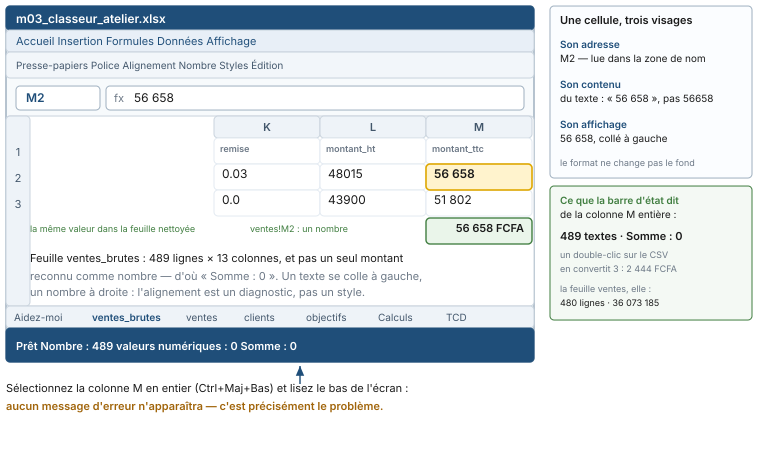

# Module M03.C01 — Interface, classeur, feuille, cellule : se déplacer sans se perdre

**Outil de ce chapitre : le tableur seul (Excel 365 / 2021 ou LibreOffice Calc), sur le classeur de l'atelier.** Durée indicative : 3 h. Niveau : N1.

> **L'idée du chapitre.** Un tableur n'est pas une calculatrice géante : c'est une **grille de cellules adressées**,
> où chaque nombre que vous lisez est le rendu d'un contenu, lui-même situé quelque part. Les trois quarts des
> accidents de l'analyse sur tableur ne viennent pas de formules fausses mais d'une méconnaissance de l'écran : on a
> sommé une colonne qui contenait du texte, trié une colonne seule, lu un total dans une fenêtre filtrée — et l'on a
> écrit le résultat dans un courriel. Ce chapitre installe les six réflexes qui rendent les sept suivants sûrs.

> **Base de travail — deux chemins pour une seule donnée.** Quatre fichiers, produits par le socle du manuel : le
> classeur d'atelier `01_socle_donnees/data/projection/m03_classeur_atelier.xlsx` ; les ventes **telles que reçues**,
> `01_socle_donnees/data/projection/ventes_magasin5_2025.csv` (489 lignes, défauts compris) ; la même donnée
> **nettoyée**, `01_socle_donnees/data/reference/ventes_magasin5_2025_ATTENDU.csv` (480 lignes) ; les objectifs
> mensuels, `01_socle_donnees/data/brut/objectifs_de_ca.csv` (218 lignes). La population entière
> (`01_socle_donnees/data/reference/ventes_propres.csv`, 240 000 lignes) s'ouvre en C08. Chez vous :
> `donnees/projection/` et `donnees/reference/`. **Les blocs des huit chapitres écrivent le chemin de l'atelier, parce
> qu'il s'exécute sans préparation** ; dans votre dossier, remplacez le préfixe `01_socle_donnees/data/` par
> `donnees/` et ne changez rien d'autre. Séparateur point-virgule, UTF-8, franc CFA (FCFA), virgule décimale au
> tableur. Les chiffres cités sont dans `01_socle_donnees/data/reference/chiffres_cites.md`, section M03. Le classeur
> est livré **sans protection** : il doit être ouvert, modifié, cassé et réparé.

---

## 1. Objectifs du chapitre

À la fin de ce chapitre, vous saurez :

1. **Nommer** les quatre niveaux d'un tableur — classeur, feuille, plage, cellule — et écrire l'adresse d'une cellule
   dans la forme que le logiciel comprend.
2. **Aller** n'importe où dans une feuille de 489 lignes en trois raccourcis, sans molette ni barre de défilement.
3. **Sélectionner** exactement la zone voulue et **lire dans la barre d'état** le compte, la moyenne et la somme, sans
   écrire une formule.
4. **Distinguer** les trois visages d'une cellule — adresse, contenu, affichage — et reconnaître, au compteur, un
   montant stocké en texte plutôt qu'en nombre.
5. **Déclarer** la santé d'un fichier avant de le travailler : dernière cellule, lignes vides, colonnes non
   reconnues — la fiche de prise en main qui ouvrira tous vos classeurs professionnels.

---

## 2. Pourquoi cette notion est importante

**Situation 1 — le total qui manque 36 millions.** Vous ouvrez la feuille `ventes_brutes` du classeur, vous cliquez
sur la lettre `M` de la colonne `montant_ttc`, vous lisez le bas de l'écran : *Nombre* 489, *Nombre de valeurs
numériques* 0, *Somme* 0. Un tableur qui compte 489 entrées sans savoir en additionner une seule n'est pas cassé :
il énonce que **la colonne est du texte**. Ouvrez maintenant le fichier reçu d'un double-clic : l'import automatique,
lui, convertit trois cellules, et la barre affiche « 3 » et « 2 444 ». **Deux chiffres pour un même fichier, aucun
message d'erreur.** La bonne somme, 36 073 185 FCFA, se lit sur la feuille nettoyée de 480 lignes.

**Situation 2 — le tri qui a découpé les lignes.** Un analyste veut « voir les plus gros montants ». Il sélectionne
la colonne des montants, trie, et clique « Trier la sélection » pour aller vite. Le total n'a pas bougé d'un
centime : 36 073 185 FCFA avant, 36 073 185 FCFA après. En revanche, la ligne qui affichait 1 229 678 FCFA — le
plus gros montant, en `M356` — ne raconte plus rien de vrai : sa date, son produit et son client sont ceux d'une
autre vente. **Le contrôle du total est aveugle à ce dégât** ; seul le contrôle à la ligne le voit.

**Situation 3 — la réunion où personne ne sait de quoi on parle.** « Regardez la dernière colonne, à droite, en bas.
» Pendant onze secondes, dix personnes cherchent. « Feuille `Calculs`, cellule `M490` » prend une seconde et ne se
prête à aucune interprétation. Un analyste qui sait adresser conduit la réunion ; celui qui dit « là, vers la droite
» la subit. Cette aisance n'a rien d'un don : un vocabulaire et quatre raccourcis.

> **Dans les faits.** Dans les audits de fichiers de gestion, la première faute trouvée n'est ni une formule fausse
> ni un modèle inadapté : c'est un classeur dont personne ne sait dire ce qu'il contient, où, et depuis quand il a
> été vérifié. Un onglet de prise en main, trois lignes datées, tue ces discussions — et il se rédige en cinq minutes.

---

## 3. Explication simple

Un tableur est une **armoire à cases**. Le **classeur** (*workbook*) est l'armoire : un fichier, un nom, une date. Une
**feuille** est un tiroir : la donnée ne vit jamais « dans le fichier », elle vit dans une feuille. Une **cellule**
est une case : elle a une **adresse** — colonne puis ligne, `M356` — un **contenu**, et un **format**. Une **plage**
est un rectangle de cases, noté `I2:M490`. Enfin, une **table** est une plage à qui l'on a donné un nom et une
structure : elle s'étend toute seule quand on ajoute des lignes (chapitre C03).

Autre image, celle qui fait comprendre l'adresse : une salle de cinéma. `M356`, c'est « rangée M, siège 356 ». Quand
vous recopiez une formule d'un siège à l'autre, le logiciel **translate** l'adresse ; si vous voulez que tout le
monde regarde le même écran, vous **figez** l'adresse avec `$`. Tout le chapitre C04 tient dans cette phrase.

Et trois visages pour une même case. Prenez `M2` de `ventes_brutes` : son adresse est `M2`, son contenu est le texte
`56 658` (onze caractères, dont une espace), son affichage est `56 658` avec une espace fine. Le nombre 56658, lui,
se colle à droite. **L'alignement est un diagnostic gratuit** : à gauche texte, à droite nombre.

---

## 4. Vocabulaire essentiel

| Français — English | Définition simple | Piège à éviter |
|---|---|---|
| **Classeur — workbook** | Le fichier. Il peut contenir vingt feuilles et trois tables. | Croire qu'un classeur égale une donnée : c'est une **feuille**, ou une **table**, qui la porte. |
| **Feuille — sheet** | Une grille de cases, nommée par son onglet. | Chercher une valeur « dans le fichier » au lieu de dire dans quelle feuille. |
| **Cellule — cell** | La plus petite unité adressable : une adresse, un contenu, un format. | Confondre le contenu et ce qui s'affiche. |
| **Plage — range** | Un rectangle de cellules, noté `I2:M490`. | Sélectionner au clic-glissé et s'arrêter trois lignes avant la fin. |
| **Adresse absolue / relative — absolute / relative reference** | `$M$2` ne bouge pas quand on recopie ; `M2` bouge. | Recopier une recherche sans figer la plage : le `RECHERCHEV` décroche ligne après ligne. |
| **Zone de nom — name box** | La case à gauche de la barre de formule : elle affiche l'adresse et **accepte une adresse en entrée**. | Ne jamais s'en servir pour naviguer, alors qu'elle va plus vite que trente clics. |
| **Barre de formule — formula bar** | Ce que la cellule contient, avant formatage. | Contrôler dans la grille : la grille ment par le format. |
| **Plage nommée — named range** | Une plage à qui l'on donne un nom, utilisable dans les formules. | Nommer `Données`, puis insérer des lignes hors de la plage : le nom ne suit pas. |
| **Volets figés — frozen panes** | Lignes ou colonnes qui restent visibles au défilement. | Figer sur la mauvaise cellule, et perdre l'en-tête quand même. |
| **Mise en forme — formatting** | Couleur, police, décimales, format monétaire. | Confondre « nettoyé » et « reformaté » : le format ne change jamais la valeur. |

> **Définition.** Une **cellule active** est la seule cellule où l'on tape : elle est encadrée d'un liseré épais et
> son adresse est écrite dans la zone de nom. Une **sélection** est un rectangle de cellules mises en évidence dont
> une seule est active. La distinction est technique : `Ctrl` + `C` copie la sélection, `Entrée` ne valide que dans
> l'active, et la barre d'état résume **toute** la sélection.

> **Définition.** On dit qu'une cellule est **reconnue comme nombre** quand le tableur y lit un contenu chiffré,
> manipulable par `SOMME()`, triable, moyennable. Un contenu **reconnu comme texte** — y compris `1 229 678` écrit
> avec des espaces — n'entre dans aucun calcul : `SOMME()` l'ignore, ce qui est la plus silencieuse des façons de se
> tromper.

---

## 5. Cours approfondi

### 5.1 L'écran, et à quoi sert chaque bande

En haut, la **barre de titre** porte le nom du fichier : c'est là que l'on vérifie, avant toute manipulation, que l'on
travaille dans la bonne version du bon classeur. Le **ruban** étale les onglets d'outils ; dans ce module, vous
vivrez dans quatre d'entre eux — *Accueil* (formats, tri, trouver), *Données* (tables, filtres, import, tableaux
croisés), *Formules* (audits, noms), *Affichage* (volets, grille). Un **ruban contextuel** n'apparaît que si un objet
précis est sélectionné : son absence est déjà une information.

Sous le ruban, deux cases commandent tout le reste. La **zone de nom** affiche l'adresse de la cellule active ou le
nom de la sélection, et c'est une **ligne de commande de navigation** : tapez `M356`, `Entrée`, vous y êtes. La
**barre de formule** affiche le contenu : c'est le seul endroit de l'écran où le formatage ne peut pas vous mentir.

En bas, la **barre d'état** est l'outil le plus sous-estimé du tableur. Clic droit dessus (Excel) ou *Affichage →
Barre d'état* (Calc) : on y allume *Moyenne*, *Somme*, *Min*, *Max*, **Nombre** (toutes les cellules non vides, comme
`NBVAL`) et **Nombre de valeurs numériques** (les seules calculables, comme `NB`) ; dans LibreOffice Calc, les deux
derniers s'appellent *Valeur* et *Valeur numérique*. C'est l'**écart** entre les deux compteurs qui parle. Sur
`montant_ttc` de la feuille `ventes`, la barre rend « Moyenne : 75 152 · Nombre : 480 · Somme : 36 073 185 » ; sur la
même colonne de `ventes_brutes`, « Nombre : 489 · valeurs numériques : 0 · Somme : 0 ». Quatorze mots, trois
secondes.

> **Conseil professionnel.** Trois zones de l'écran, trois usages : la **zone de nom** pour dire où l'on va, la
> **barre de formule** pour savoir ce que c'est, la **barre d'état** pour savoir combien il y en a. Tout le reste est
> optionnel, y compris la souris : un analyste qui cherche un bouton pour naviguer a perdu trois secondes.

### 5.2 Naviguer : quatre touches qui remplacent mille clics

Le principe est unique : **une flèche saute à la prochaine cellule non vide dans sa direction**. Donc `Ctrl` + `↓`
pour aller au bas d'une colonne pleine, `Ctrl` + `↑` pour en revenir, `Ctrl` + `Fin` pour le coin utilisé du fichier —
*utilisé*, pas *rempli* : c'est la nuance qui fait tout.

| Ce que je veux | Touches | Ce que j'obtiens, ici |
|---|---|---|
| La dernière cellule de `ventes_brutes` | `Ctrl` + `Fin` | `M490` — 489 lignes de données, 13 colonnes |
| La dernière cellule de la feuille de travail `ventes` | `Ctrl` + `Fin` | `N481` — 480 lignes, et 14 colonnes : la colonne utilitaire `N` s'ajoute |
| La ligne du plus gros montant | *Données → Trier*, puis lecture | 1 229 678 FCFA en `M356` sur `ventes` — le même montant, en texte, en `M363` sur la brute |

On navigue aussi par la zone de nom (une adresse, un nom de plage, et l'on y va) et par `F5` — *Atteindre* — qui liste
les destinations nommées : après deux semaines d'atelier, c'est votre plan de salle. La limite d'une feuille de
calcul du commerce est voisine d'un million de lignes ; une feuille qui dépasse s'ouvre amputée, parfois sans
message. **On compte les lignes avant de conclure**, jamais après.

> **Définition.** La **zone utilisée** (*used range*) est le plus petit rectangle contenant toutes les cellules ayant
> un contenu **ou** une mise en forme. C'est elle que `Ctrl` + `Fin` atteint, non la zone des données : un fond de
> couleur oublié en `T412` suffit à l'étendre de trois cents lignes, et le compte que vous annoncez devient faux sans
> qu'une valeur ait bougé.

> **Attention.** Le contrôle est simple : `Ctrl` + `↓` depuis une cellule peuplée, puis comparer le numéro de ligne à
> celui de `Ctrl` + `Fin`. Sur le classeur de l'atelier, les deux chemins concordent — la zone utilisée s'arrête où
> s'arrête la donnée. Sur vos fichiers, ils ne concorderont pas toujours.

### 5.3 Sélectionner : la différence entre « ma colonne » et « la colonne »

Trois gestes, trois résultats, et le troisième est celui qui compte.

1. **Clic sur la lettre `M`** : toute la colonne, un million de cases, vides compris. La barre d'état, elle, ne
   compte que le plein — mais un collage, lui, ira jusqu'en bas.
2. **`Ctrl` + `A` dans une plage de données** : le bloc contigu — ici `A1:N481` sur `ventes`. Rapide, mais *contigu* :
   une ligne vide à 128 et la sélection s'arrête en 127.
3. **`Ctrl` + `Maj` + `↓`, puis `Ctrl` + `Maj` + `→`** : la sélection **informée**, qui s'arrête aux vides que l'on
   voit. Quand elle cale, ce n'est pas la sélection qui est fausse, c'est le fichier qui a un trou.

Vérifier une sélection se lit à trois endroits : le compteur de la barre d'état, la zone de nom (dimensions de la
sélection), et la ligne courante indiquée par la barre de défilement. Sur `ventes`, la sélection de `montant_ttc`
doit annoncer 480 ; 478 veut dire deux lignes coupées.

### 5.4 Les trois visages d'une cellule : adresse, contenu, affichage

C'est le cœur conceptuel du module, et il tient en une manipulation. Ouvrez `ventes_brutes`, cliquez `M2` :

- **adresse** `M2`, lue dans la zone de nom ;
- **contenu** `56 658`, lu dans la barre de formule — onze caractères, dont une espace, sans signe égal : **du texte** ;
- **affichage** `56 658` collé à gauche (selon la version, un triangle vert en coin signale « nombre stocké comme du
  texte »).

Cliquez `M88` : le contenu est `797`, sans espace. Dans le classeur, cette cellule non plus n'est un nombre — mais
c'est l'une des trois que l'import automatique convertira, avec `M179` (821) et `M236` (826), soit 2 444 FCFA à elles
trois. La colonne voisine enseigne le contraire, et c'est utile : `montant_ht`, sur les mêmes 489 lignes, ne contient
aucun séparateur de milliers, et s'importe donc **en nombres** sans que personne n'ait rien décidé. Même feuille,
deux colonnes, deux sorts : la nature d'une donnée ne dépend pas de vous, elle dépend du fichier — d'où la règle de
l'import assisté.

> **Définition.** Une **conversion** de types change la nature d'un contenu ; une **mise en forme** change son
> rendu. Les deux mots sont séparés par tout ce que peut contenir une erreur d'analyse : `56 658` en texte sous un
> format monétaire reste du texte, et la somme reste à 0.

### 5.5 Ce que le tableur ne vous dira pas de lui-même

Le tableur affiche. Il n'avertit presque jamais. Cinq silences à connaître dès aujourd'hui.

1. **Un texte ignoré par une somme ne lève aucune erreur.** `SOMME()` fait son travail sur ce qu'elle peut.
2. **Un format monétaire ne convertit pas.** Appliquer le format FCFA à `montant_ttc` de `ventes_brutes` laisse les
   489 valeurs en texte : la colonne *s'embellit*, la somme reste à 0.
3. **Un format de date n'est pas une date.** La colonne `date` du fichier reçu mélange deux écritures : 424 lignes
   en ISO (`2025-01-01`) et 65 en notation française (`01/01/2025`). Un import à l'aveugle en convertit une partie et
   laisse l'autre en texte, qui se triera alphabétiquement — le 05 janvier avant le 1er décembre. La colonne
   `remise`, elle, est écrite avec un point décimal (`0.03`) : dans un tableur réglé sur le Burkina ou la France, ce
   n'est pas un nombre.
4. **Un filtre actif modifie le total que vous lisez à l'écran**, pas le résultat d'une formule bien écrite. Les deux
   nombres divergent, et c'est l'un des deux que l'on envoie au directeur.
5. **Une cellule vide n'est pas une cellule à zéro.** Dans la donnée nettoyée, 18 cellules sont vides — les 18 lignes
   où le champ `client` n'a pas été saisi — et elles se distinguent des 85 lignes où le client est le `0` du
   comptoir : le zéro est une information, le vide en est une autre. Sept des 13 colonnes restent du texte dans le
   fichier plat (identifiants et libellés) : le typage est un acte d'analyse, pas un réglage d'affichage.

> **Attention.** Le pire accident du chapitre n'est pas une erreur, c'est une erreur **invisible**. Trier une seule
> colonne casse l'alignement des lignes sans casser aucun total. Le contrôle qui le voit est à la ligne : après tout
> tri, `M356` doit encore valoir 1 229 678 FCFA **et** porter la même vente que sa formule de la colonne `N`. Vous
> rendrez ce contrôle automatique en C05.

### 5.6 Préparer la fenêtre de travail : les cinq réglages de l'atelier

Trois minutes, une fois par machine. Ils ne changent aucun résultat — ils empêchent d'en changer un par accident.

1. **Barre d'état** : allumer *Moyenne*, *Somme*, *Min*, *Max*, *Nombre*, *Nombre de valeurs numériques*. Sans eux,
   la navigation est aveugle.
2. **Affichage → Figer les volets → Figer la ligne supérieure**. Sur 489 lignes, un en-tête qui disparaît au
   défilement est une porte ouverte à la colonne mal lue.
3. **Quadrillage affiché, zoom à 100 %, colonnes ajustées** (*Accueil → Format → Ajuster la largeur*) : une date
   tronquée en `05/01` ressemble à une date et se croit lue.
4. **Barre d'accès rapide** : y faire monter `Atteindre une cellule…`, `Somme automatique`, `Figer les volets`,
   `Supprimer les doublons`. Quatre boutons, quarante navigations économisées par jour.
5. **Enregistrer sous, daté** : `m03_classeur_atelier_YYYY-MM-DD_a0.xlsx`, et l'on **n'écrase jamais** la version
   `a0`. Vingt modules plus tard, cette habitude vous aura sauvé plus de temps que n'importe quelle formule.

> **Dans les faits.** Ces réglages ne sont pas du confort : figer l'en-tête et allumer les deux compteurs sont les
> deux seules mesures qui rendent **visible** une ligne manquante ou une colonne texte. Dans un service où trois
> personnes reprennent le même classeur, c'est la différence entre un fichier qui se transmet et un fichier qui se
> rouvre.

### 5.7 Le classeur de l'atelier, et sa feuille « Aidez-moi »

Le classeur contient onze feuilles, dans cet ordre : `Aidez-moi`, `ventes_brutes`, `ventes`, `produits`, `clients`,
`magasins`, `vendeurs`, `objectifs`, `Calculs`, `TCD`, `Mensuel`. Trois choses à savoir dès aujourd'hui.

`ventes_brutes` est **le fichier tel qu'il est reçu** : 489 lignes, tout en texte, défauts compris. On ne la nettoie
jamais : on la garde comme preuve. `ventes` est la même donnée **nettoyée** : 480 lignes, types corrigés, table
structurée, et une colonne utilitaire `N` qui recalcule le montant de chaque ligne ; les 9 lignes d'écart sont
exactement les doublons du fichier brut (266 132 FCFA, soit 0,74 % du chiffre d'affaires de l'extrait). `Aidez-moi`
donne la fiche du classeur et vingt-huit fiches de formules.

Les 154 produits, les 372 clients rencontrés (371 au référentiel ; 103 lignes sans client trouvé : 85 comptoir codé
`0`, 18 champ vide) et les 218 lignes d'objectifs seront les objets de C03, C05, C06 et C07. En C01, une seule
question les concerne : **où sont-elles, et combien sont-elles ?**

> **Boîte à outils.** Ce que le chapitre laisse de permanent : `Ctrl` + `Fin` (zone utilisée), `Ctrl` + `↑`/`↓`
> (bords de bloc), `Ctrl` + `Maj` + `↓` (sélection informée), `F5` (atteindre une plage nommée), clic sur la lettre
> de colonne plus barre d'état (compte et somme sans formule), `Alt` puis une lettre (naviguer dans le ruban : `F`
> pour *Fichier*, `H` pour *Accueil*, `A` pour *Données*). Dans LibreOffice Calc, les trois premiers sont identiques,
> la barre d'état se règle par *Affichage → Barre d'état*.

---

## 6. Exemple concret : la prise en main d'un fichier reçu, en onze minutes

Vous recevez par courriel le fichier de ventes. Voici la séquence complète, celle que vous répéterez sur chaque
fichier du reste du parcours — onze minutes, six nombres notés.

| Étape | Geste | Ce que l'on note | Ce que l'on décide |
|---|---|---|---|
| 1 | Ouvrir **par** *Données → À partir de texte/CSV* (`;`, UTF-8, colonnes forcées en texte), puis rouvrir d'un double-clic pour comparer | 489 lignes, 13 colonnes dans les deux cas ; au second, 3 montants deviennent nombres | on ne juge pas un fichier sur un import automatique |
| 2 | `Ctrl` + `Fin` | dernière cellule `M490` | la zone utilisée s'arrête où s'arrête la donnée |
| 3 | Clic sur la lettre `M`, barre d'état | *Nombre* 489 · *valeurs numériques* 0 · Somme 0 | les montants ne sont **pas** des nombres : nettoyage obligatoire |
| 4 | Clic sur la lettre `L` (`montant_ht`) | 489 cellules, toutes additionnables | le défaut est une colonne, pas le fichier entier |
| 5 | Clic sur `M` de la feuille nettoyée `ventes` | Moyenne 75 152 · Nombre 480 · Somme 36 073 185 | c'est ce chiffre qui sera cité, et sa source : la feuille, pas le fichier reçu |
| 6 | Écrire les six lignes dans `Aidez-moi` | date, source, dimensions, bornes, contrôles | la prise en main est finie, le travail commence |

Le nombre de la ligne 5 est celui que tous les contrôles du module retrouveront : **36 073 185 FCFA**. Sur le fichier
reçu nettoyé à la main mais sans retirer les doublons, le même périmètre donne 36 339 317 FCFA ; les 266 132 FCFA
d'écart sont exactement les 9 doublons. Deux personnes qui lisent ce fichier à l'aveugle obtiennent donc **deux vrais
chiffres**, et le seul moyen de les mettre d'accord est la fiche de l'étape 6.

## 7. Démonstration pas à pas : produire la fiche de prise en main

Écrivez ces cinq rubriques dans la feuille `Aidez-moi`, zone « Prise en main du jour ». C'est le modèle que vous
appliquerez à chaque fichier de votre carrière.

**1. Le nom et la date.** Barre de titre : `m03_classeur_atelier.xlsx`, ouvert le 18/09/2026, aucune protection
d'onglet. Cette ligne, qui semble triviale, est celle qui manque dans les deux tiers des classeurs reçus en révision.

**2. Les dimensions.** `Ctrl` + `Fin` sur `ventes_brutes` → `M490`, soit 489 lignes de données sur 13 colonnes. Sur
`ventes` → `N481` : 480 lignes, et 14 colonnes parce que la colonne utilitaire s'ajoute ; le fichier plat nettoyé,
lui, s'arrête en `M481`. On écrit les trois, avec l'écart et sa cause : 9 lignes, les doublons, 266 132 FCFA.

**3. La nature des colonnes.** Colonne par colonne, clic sur la lettre, barre d'état. Sur `ventes` : les montants sont
des nombres (480 dénombrés, 36 073 185 FCFA), `date` est une date, `quantite` va de −13 à 68, `remise` s'affiche de
0 % à 11 %. Sur `ventes_brutes` : les 489 montants TTC sont du texte, la colonne `date` mélange deux écritures, une
quantité monte à 14 000, les remises portent un point décimal. On écrit la liste des colonnes qui **ne passent pas**,
et rien d'autre.

**4. Les bornes de la période.** Sélection de `date` sur la feuille nettoyée, tri **avec extension** : première ligne
01/01/2025, dernière 02/12/2025 — 335 jours d'amplitude, 31 jours distincts d'activité, 240 jours ouvrés sur
l'intervalle. On note les deux dates : ce sera la première question du commanditaire.

**5. Le contrôle à la ligne.** En `M356` de `ventes`, lisez 1 229 678 FCFA ; sur la même ligne, en `N356`, lisez le
montant recalculé par la colonne utilitaire, `=ARRONDI(I356*J356*(1-K356);0)`. Les deux doivent être égaux. Notez que
sur l'ensemble de la feuille, l'écart total entre montants enregistrés et recalculés est de 4 FCFA, né de six lignes
dont le produit tombe exactement à un demi-franc : c'est le bruit d'arrondi normal d'un fichier de caisse, pas une
faute.

**Contrôles qualité du chapitre.**

| # | Contrôle | Seuil | Résultat attendu | Si échec |
|---|---|---|---|---|
| 1 | `Ctrl` + `Fin` sur `ventes_brutes` | adresse exacte | `M490` | filtre resté actif, ou onglet mal ouvert |
| 2 | `Ctrl` + `Fin` sur `ventes` | adresse exacte | `N481` | vous êtes encore sur la feuille brute |
| 3 | Barre d'état sur `montant_ttc` de la brute | trois nombres | 489 · 0 · 0 (et 3 · 2 444 après double-clic) | compteur éteint, ou import automatique mal lu |
| 4 | Barre d'état sur `montant_ttc` de `ventes` | trois nombres | 480 · 36 073 185 · 75 152 | sélection arrêtée au premier vide |
| 5 | Plus gros montant lu **à la ligne** | identité `M356` / `N356` | 1 229 678 FCFA des deux côtés | tri sans extension : repartir de la copie |

## 8. Erreurs fréquentes

1. **Double-cliquer sur un `.csv` pour l'ouvrir.** Le tableur devine les types, se trompe sur les codes (un client
   `007` devient 7), et l'on découvre deux semaines plus tard que la fusion avec le référentiel n'a rien trouvé.
2. **Lire la grille au lieu de la barre de formule.** `56 658` dans la grille est une image ; le contenu est soit le
   nombre, soit le texte, et rien ne le dit sauf l'alignement et le compteur.
3. **Trier une colonne isolée.** Le tableur le permet, avec un avertissement que l'on clique sans lire. La
   conséquence n'est pas un mauvais total : c'est une **mauvaise ligne**, donc une mauvaise décision sur un bon
   chiffre.
4. **Compter les lignes du tableur comme celles de la donnée.** L'en-tête est une ligne : 489 lignes de données
   tiennent en `M490`. Écrivez « 489 lignes, 13 colonnes, plus l'en-tête », sinon le relecteur ne retrouve pas le
   compte.
5. **Confondre les deux compteurs de la barre d'état.** *Nombre* compte le non-vide (`NBVAL`), *Nombre de valeurs
   numériques* compte le calculable (`NB`). Sur la colonne `client` de la feuille nettoyée, les deux ne concordent
   pas : 462 et 480, parce que 18 lignes n'ont pas de client saisi et que le `0` du comptoir, lui, est une valeur.

> **Attention.** Le raccourci qui casse tout dans ce module n'existe pas : c'est **Entrée** dans la cellule juste au
> dessous d'une colonne de nombres, suivi de `Alt` + `=`. La *somme automatique* propose une plage, souvent « de la
> première ligne à **la ligne du dessus** » ; si vous avez inséré une ligne de totaux au milieu, vous sommez une
> partie du fichier, le total est faux de exactement ce que vous avez oublié, et rien ne clignote. Regardez la plage
> qui clignote avant de valider : c'est l'erreur numéro un des classeurs de gestion.

## 9. Bonnes pratiques professionnelles

1. **La fiche de prise en main d'abord, à chaque fichier.** Cinq rubriques, une page, rédigée pendant que le logiciel
   charge.
2. **Ne jamais nettoyer la preuve.** On duplique (`ventes_brutes` → `ventes`), on nettoie la copie, et l'on écrit
   dans la copie ce que l'on a retiré et pourquoi. Un classeur sans feuille brute est un classeur dont on ne peut
   défendre les chiffres.
3. **Nommer avant de calculer.** Une plage nommée rend les formules lisibles et survit mieux aux insertions qu'une
   adresse recopiée vingt fois : la nommature est le premier acte de gouvernance d'un classeur.
4. **Contrôler à deux niveaux : le total, et une ligne.** Total 36 073 185 FCFA ; ligne `M356` = 1 229 678 FCFA avec
   sa formule. Le premier voit les lignes perdues, le second voit les lignes mélangées.
5. **Un seul type par colonne, et c'est écrit.** Soit la colonne est numérique et les manquants sont vides, soit elle
   est texte et on ne la somme pas. Le tableur pardonne le mélange ; les chiffres jamais.

> **Conseil professionnel.** Faites lire votre fiche de prise en main par quelqu'un qui n'a pas ouvert le fichier.
> Si cette personne retrouve les cinq nombres sans vous interroger, votre classeur est documenté. Sinon, ce n'est
> pas un problème de lecture : c'est un problème de nommage, d'ordre ou de feuilles.

## 10. Exercice guidé — retrouver six nombres et leurs preuves (25 min, /10)

**Commande.** Dans le classeur de l'atelier, retrouvez les six nombres ci-dessous en n'utilisant **ni formule, ni
Python, ni SQL** : uniquement navigation, sélection, barre d'état, barre de formule. Pour chacun, écrivez la
feuille, la plage, et le geste.

| # | Ce qu'il faut obtenir | Feuille | Geste attendu |
|---|---|---|---|
| 1 | Nombre de lignes de données | `ventes_brutes` | `Ctrl` + `Fin`, lire le numéro de ligne, retirer l'en-tête |
| 2 | Somme de `montant_ttc`, puis compte des cellules calculables | `ventes_brutes` | clic sur `M`, barre d'état |
| 3 | Somme et moyenne de `montant_ttc` | `ventes` | clic sur `M`, barre d'état |
| 4 | Plus gros montant, **et son adresse** | `ventes` | *Données → Trier* avec extension, puis lecture de la zone de nom |
| 5 | Ce que contient vraiment `M2` | `ventes_brutes` | clic sur `M2`, barre de formule, alignement |
| 6 | Les deux écritures de la colonne `date` | `ventes_brutes` | filtre sur une valeur, ou tri, ou lecture de dix lignes |

**Démarrage, pas à pas.** Pour 1 : une cellule peuplée de `ventes_brutes`, `Ctrl` + `Fin`, la zone de nom affiche
`M490` ; vous lisez **ligne 490, donc 489 lignes de données**, et vous écrivez la phrase avec la soustraction
apparente. Pour 2 : clic sur `M`, et le bas de la fenêtre doit rendre **Somme : 0** avec **Nombre : 489** — 489
cellules pleines, aucune calculable ; rubriques absentes, clic droit sur la barre et cochez-les. Ouvrez le CSV reçu
d'un double-clic, refaites le geste : **3 et 2 444**. Écrivez la phrase du courriel : les montants sont du **texte**,
l'import en convertit trois, et aucun des deux chiffres n'est le chiffre d'affaires.

Pour 3 à 5 : allez sur `ventes`, relevez **480 lignes**, **36 073 185 FCFA**, **75 152 FCFA** de moyenne, un maximum
de **1 229 678 FCFA** en `M356` — que la feuille brute porte, elle, en `M363` et en texte, parce que sept des neuf
doublons le précèdent. Contrôlez que 489 − 480 = 9 est bien le compte des doublons et que 36 339 317 − 36 073 185 =
266 132 FCFA en est bien le montant. Pour 5, la phrase attendue : « la première valeur de la colonne est le texte
`56 658`, et non le nombre 56658 ; un texte ne se somme pas ».

**Barème (10 points).** Six lignes renseignées, feuille et geste notés (4) · les cinq nombres exacts (3) · les deux
phrases d'interprétation, texte contre nombre et 9 lignes de doublons (2) · noms de feuilles sans faute (1).

**Ce qu'il faut retenir de cet exercice :** il ne contient aucun calcul, et il produit le résultat le plus précieux du
module — un état des lieux chiffré du fichier, obtenu en trois minutes, défendable ligne par ligne.

## 11. Exercices autonomes

**Exercice 1.1 (★) — Les deux fins du fichier.** Notez la dernière cellule de `ventes_brutes` et celle de `ventes`,
puis le nombre de lignes de données de chacune. Combien de lignes et combien de cellules séparent les deux fichiers,
et pourquoi ? Écrivez la phrase qui explique l'écart, en citant le montant et le pourcentage qui vont avec.

**Exercice 1.2 (★) — Trois visages, quatre cellules.** Pour `M2`, `M88`, `M179` et `M236` de `ventes_brutes`,
remplissez un tableau à quatre colonnes : adresse, contenu lu dans la barre de formule, alignement, nature dans le
classeur. Ajoutez une cinquième colonne : « ce qu'en fait un double-clic sur le CSV ». Concluez en une phrase.

**Exercice 1.3 (★) — Le compte sans formule.** Sur `ventes`, notez pour `quantite`, `prix_unitaire_ht`, `remise`,
`montant_ht` et `montant_ttc` les rubriques que la barre d'état accepte d'afficher. Vous devez obtenir quatre nombres
sur `montant_ttc`. Contrôlez la moyenne par un calcul de tête, puis vérifiez par `=SOMME(M2:M481)`. Une colonne doit
se résumer par *Min* et *Max* mais refuser toute interprétation de sa somme : laquelle, et pourquoi ?

**Exercice 1.4 (★★) — Le tri qui ne se voit pas.** Sur une **copie** de la feuille `ventes` (clic droit sur l'onglet
→ Déplacer ou copier, cochez *Créer une copie*), sélectionnez `montant_ttc` seule et triez du plus grand au plus
petit en choisissant « Trier la sélection ». Répondez : (a) la somme de la colonne a-t-elle changé ? (b) `M356`
vaut-elle encore le plus gros montant ? (c) que reste-t-il de vrai dans la ligne 356 ? Annulez jusqu'à
retrouver 36 073 185 FCFA **et** 1 229 678 FCFA en `M356`.

**Exercice 1.5 (★★) — Importer sans se faire avoir.** Fermez le classeur. Réimportez
`01_socle_donnees/data/projection/ventes_magasin5_2025.csv` dans un classeur neuf par *Données → À partir de
texte/CSV* (`;`, UTF-8, colonnes forcées en texte). Notez : (a) lignes et colonnes chargées ; (b) ce que devient la
colonne `date` si l'on laisse l'import deviner, comparé au forçage en texte ; (c) combien de lignes dépassent 500 en
quantité dans le fichier reçu, et ce que vaut la borne maximale après nettoyage. Terminez par la fiche du §7, en
citant vos deux chemins d'import comme deux sources de chiffres différents.

## 12. Correction détaillée

**Exercice 1.1.** `ventes_brutes` : `M490`, soit 489 lignes de données et 13 colonnes. La feuille `ventes` : `N481`,
soit 480 lignes et 14 colonnes, la colonne utilitaire s'ajoutant aux 13 du fichier — le fichier plat nettoyé, lui,
s'arrête en `M481`. Écart : 9 lignes, soit 9 × 13 = 117 cellules, et 266 132 FCFA : ce sont les doublons exacts du
fichier reçu, 0,74 % du chiffre d'affaires de l'extrait. Trouver 480 lignes sur la feuille brute signifie un filtre
resté actif.

**Exercice 1.2.** Dans le classeur, les quatre cellules sont du texte : `M2` contient `56 658` (onze caractères, dont
une espace), `M88` contient `797`, `M179` contient `821`, `M236` contient `826` — les trois dernières sans séparateur
de milliers. Alignement : les quatre à gauche. Ce qu'en fait un double-clic : `M2` reste du texte, les trois autres
deviennent des nombres, et la somme de colonne passe de 0 à 2 444 FCFA. Conclusion attendue : « le compteur est à 0
parce que la feuille est intégralement en texte, et à 3 après import parce que trois cellules seulement s'écrivent
sans séparateur ; dans les deux cas `SOMME()` ignore le reste sans un mot ».

**Exercice 1.3.** Sur `montant_ttc` de `ventes` : 480 cellules, moyenne 75 152 FCFA, somme 36 073 185 FCFA, maximum
1 229 678 FCFA, minimum −150 804 FCFA (les retours). Le calcul de tête — 480 multipliés par la moyenne affichée —
rend 225 FCFA de moins que le total, parce que la moyenne est arrondie à l'unité : un arrondi, pas une faute.
`=SOMME(M2:M481)` doit rendre 36 073 185 FCFA exactement ; un franc d'écart en plus ou en moins signifie une plage
lue sur une autre feuille ou une ligne perdue. La colonne qui refuse toute interprétation de sa somme est
`quantite` : additionner 480 nombres d'unités hétérogènes, de −13 à 68, ne produit aucun indicateur lisible.

**Exercice 1.4.** (a) Non : la somme est restée 36 073 185 FCFA, le tri n'ayant fait que répartir les mêmes valeurs.
(b) Non : `M356` vaut désormais une valeur quelconque, le plus gros montant occupant `M2`. (c) Rien : date, produit,
client et quantité sont restés en place, donc la ligne est un empilement de deux ventes. Le contrôle du total ne voit
rien, puisque le total est gardé ; seul le contrôle à la ligne — `M356` lu **avec** `N356` — révèle le dégât. Si
`Ctrl` + `Z` ne suffit pas, on repart de la copie : c'est pourquoi on travaille sur une copie.

**Exercice 1.5.** (a) 489 lignes, 13 colonnes, soit 490 lignes en grille avec l'en-tête. (b) Forcée en texte, toute
la colonne `date` s'aligne à gauche et se trie alphabétiquement : le 05/01/2025 passe avant le 2025-01-01, et les
65 lignes écrites à la française se retrouvent mélangées aux 424 écrites en ISO. Laissée en « Général », l'import
convertit les unes et pas les autres : une colonne à moitié date, à moitié texte, soit le pire tri possible. (c) 7
lignes dépassent 500 dans le fichier reçu, dont la quantité maximale 14 000 ; dans la donnée nettoyée, la borne est
68. Les deux chemins donnent deux chiffres pour le même fichier : d'où la fiche, qui date et nomme le chemin suivi.

## 13. Mini-projet M03.P1 — « La fiche de prise en main du classeur de pilotage » (45 min)

**Commande.** Vous êtes recruté comme analyste chez Sahel Distribution. On vous remet le classeur de l'atelier et le
fichier reçu `01_socle_donnees/data/projection/ventes_magasin5_2025.csv`. Rédigez en **une page maximum** la fiche de
prise en main que vous enverrez au responsable du contrôle de gestion avant toute analyse : elle doit permettre à
quelqu'un qui n'a jamais ouvert le fichier de retrouver vos six nombres et de comprendre les deux anomalies qui
interdisent de calculer tout de suite.

**Livrables numérotés.** (1) la fiche, cinq rubriques du §7, une page ; (2) le tableau des trois visages de quatre
cellules, avec la nature de chacune ; (3) les deux chiffres de contrôle — total de colonne sur chaque feuille, plus
gros montant à la ligne — avec le geste qui les a produits ; (4) deux phrases : ce qu'obtient un utilisateur non
averti qui somme le fichier reçu, et pourquoi ce chiffre est faux sans erreur affichée ; (5) les cinq réglages de
fenêtre appliqués, et pour chacun la classe d'accident qu'il empêche.

**Barème (20 points, seuil 13).** Fiche complète, cinq rubriques, dimensions et bornes de période datées (5) ·
nombres de contrôle exacts et **geste** noté (4) · anomalies nommées : texte contre nombre, tri sans extension (4) ·
tableau des trois visages juste (3) · réglages justifiés (2) · style : une page, ton professionnel, aucune formule
citée en l'air (2). Quarante-cinq minutes chrono : en entreprise, la prise en main d'un fichier ne se facture pas
deux jours.

## 14. Résumé du chapitre

Le tableur est une armoire : classeur, feuilles, plages, cellules. Trois zones pour s'y repérer — la **zone de nom**
pour dire où l'on va, la **barre de formule** pour savoir ce que c'est, la **barre d'état** pour savoir combien il y
en a — et quatre touches pour s'y déplacer : `Ctrl` + `Fin` (zone utilisée), `Ctrl` + `↑`/`↓` (bords de bloc),
`Ctrl` + `Maj` + `↓` (sélection informée), `F5` (plages nommées).

Chaque cellule a trois visages : adresse, contenu, affichage. Les deux premiers se contrôlent, le troisième est ce
que voit votre direction, et la distance entre les trois est l'endroit exact où se logent les erreurs. Sur le fichier
reçu par l'atelier, cette distance tient en quatre nombres : 489 lignes écrites en texte, une somme de colonne à 0
dans le classeur, 2 444 FCFA après un double-clic qui n'a converti que trois cellules, et un vrai chiffre d'affaires
de 36 073 185 FCFA sur la feuille nettoyée de 480 lignes. Le contrôle d'un fichier avant tout travail se fait sans
formule : dimensions, nature des colonnes, bornes de la période, total, et **une ligne** vérifiée — parce que les
deux accidents qui comptent, le texte ignoré et le tri d'une colonne seule, sont silencieuses.

## 15. À retenir

> **À retenir.** Une **somme lue à l'écran n'est pas une somme calculée** : la barre d'état n'additionne que ce que le
> tableur sait additionner. Sur `montant_ttc` de `ventes_brutes`, elle annonce 0 FCFA pour 489 cellules ; après un
> double-clic sur le même fichier, 2 444 FCFA pour 3. Aucun des deux n'est une erreur : ce sont deux descriptions
> exactes d'un fichier de texte.

> **À retenir.** La dernière cellule se lit `M490` sur la feuille brute, `N481` sur la feuille de travail — le
> fichier plat nettoyé s'arrête en `M481` : 489 lignes reçues, 480 exploitées, 9 doublons retirés pour 266 132 FCFA.
> Un chiffre d'affaires se cite avec son décompte.

> **À retenir.** Le format ne change jamais le contenu : la preuve, ce n'est pas la colonne qui brille en FCFA, c'est
> le compteur qui passe de 0 à 480. Un nettoyage est une **conversion de nature**.

> **À retenir.** Après tout tri, on vérifie **une ligne**, pas seulement le total : `M356` doit encore valoir
> 1 229 678 FCFA et porter la même vente que sa formule `N356`.

1. Un classeur contient des feuilles, une feuille des plages, une plage des cellules adressées : on ne dit jamais
   « la donnée est dans le fichier », on dit où.
2. Cinq réglages de fenêtre — deux compteurs allumés, en-tête figé, grille et largeurs, accès rapide, sauvegarde
   datée — et l'interface cesse de mentir par omission.
3. Un `.csv` s'importe par l'assistant (séparateur `;`, UTF-8, types explicites) : le double-clic est un pari.
4. La fiche de prise en main — cinq rubriques, une page — est le premier livrable de toute analyse, avant le premier
   graphique.

## 16. Évaluation formative (auto-correction, 8 min)

1. Vous sélectionnez la colonne `M` de `ventes_brutes` d'un clic sur la lettre : « Nombre : 489 · valeurs numériques
   : 0 · Somme : 0 ». Un collègue, qui a ouvert le même fichier d'un double-clic, obtient « 3 » et « 2 444 ».
   Donnez à ces deux lectures leur interprétation correcte, et dites ce qu'aucune des deux n'autorise à conclure.
2. `Ctrl` + `Fin` mène à `M490` alors que le fichier ne contient que 489 lignes. Expliquez en une phrase ce que le
   raccourci a compté de plus que vous.
3. Un collègue affirme : « j'ai appliqué le format Nombre au franc CFA à la colonne des montants, le problème est
   réglé ». Répondez en distinguant format et contenu, et dites quels nombres auraient bougé — ou non.
4. Vous triez `montant_ttc` seule, sans étendre la sélection : donnez les deux choses qui restent justes, la chose
   qui devient fausse, et le contrôle de deux secondes qui la voit.
5. Citez les cinq rubriques de la fiche de prise en main, et pour chacune le nombre du classeur qui la remplit.

**Question ouverte.** Votre direction écrit : « 2 444 FCFA de ventes sur la période, c'est effondré ». Reprenez la
phrase en trois lignes, sans ironie : ce que le chiffre mesure réellement, ce qu'il faudrait lire à la place, et ce
que l'on a fait du fichier pour obtenir ce second nombre.

---

**Corrigé de l'évaluation formative.**

1. Dans le classeur : 489 = toutes les cellules non vides de la colonne ; 0 = aucune n'est un nombre ; somme 0 = le
   tableur n'a rien à additionner. Après double-clic : 3 = les trois cellules écrites sans séparateur de milliers
   (lignes 88, 179, 236) ; 2 444 = la somme de ces trois seules valeurs. Aucune des deux lectures ne dit le chiffre
   d'affaires de la période : le bon total, 36 073 185 FCFA, se lit sur la feuille nettoyée `ventes` (480 lignes).
2. Le raccourci atteint la **dernière cellule de la zone utilisée**, en-tête compris : 489 lignes de données plus une
   ligne d'en-tête donnent la ligne 490. On écrit donc « `M490` pour 489 lignes », sinon le relecteur ne retrouve
   pas le compte.
3. Rien ne bouge, sauf l'apparence : les 489 cellules restent du texte, le compteur de valeurs numériques reste à 0,
   la somme à 0. Ce qui change la nature d'un contenu, c'est une **conversion** — import typé, collage spécial avec
   opération, nettoyage en amont — et sa preuve est le compteur passant de 0 à 480.
4. Restent justes le **total** de la colonne, 36 073 185 FCFA, et chacune des **valeurs**. Devient faux :
   l'**appartenance** des valeurs aux lignes — chaque montant se retrouve accolé à une date, un produit, un client
   qui ne sont pas les siens. Le contrôle qui le voit : `M356` doit encore valoir 1 229 678 FCFA **avec** sa ligne
   d'origine, ce que `N356` confirme.
5. Nom et date du fichier (`m03_classeur_atelier.xlsx`, ouvert le 18/09/2026, sans protection) · dimensions
   (`M490` : 489 lignes × 13 colonnes ; `N481` : 480 lignes × 14 colonnes) · colonnes en défaut (489 montants TTC en
   texte, 65 dates dans l'autre format, quantité maximale 14 000, remises à point décimal) · bornes de période (du
   01/01/2025 au 02/12/2025, 335 jours d'amplitude, 31 jours distincts, 240 jours ouvrés) · contrôle à la ligne
   (`M356` = 1 229 678 FCFA, identique à `N356`). *Question ouverte* — Réponse attendue : « 2 444 FCFA est la somme
   des trois cellules qu'un import automatique a su convertir ; les 486 autres montants sont stockés en texte et
   n'entrent dans aucun calcul. Le chiffre d'affaires de la période est 36 073 185 FCFA, obtenu sur la feuille
   nettoyée `ventes` (480 lignes, après retrait de 9 doublons pour 266 132 FCFA). Une conversion de types est
   nécessaire avant tout tableau de bord. »

---

**Suite du module.** Le chapitre C02 prend ce que nous avons effleuré — le typage — et en fait un outil : formats
monétaires FCFA, dates, validation de données qui empêche une quantité de 14 000 d'entrer, mise en forme
conditionnelle qui fait voir les 486 textes d'un coup d'œil. Si vous ne deviez garder qu'un geste d'aujourd'hui,
gardez celui du §7 : ouvrir un fichier, lire le bas de l'écran, écrire cinq lignes.
