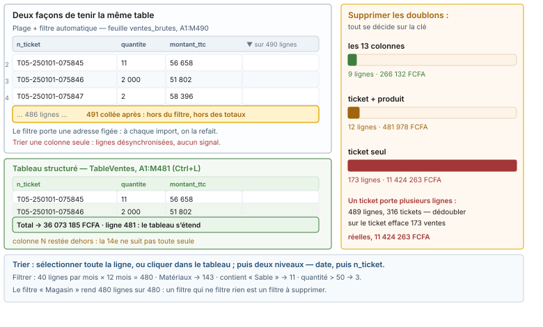

# Module M03.C03 — Le tableau structuré, le tri, les filtres, la recherche et les doublons

**Outil de ce chapitre : le tableur seul, sur le classeur de l'atelier.** Durée indicative : 4 h. Niveau : N2.

> **L'idée du chapitre.** Un classeur de gestion n'est pas une feuille : c'est une **table** posée sur une feuille.
> Cette table a un nom, une adresse qui s'étend, des colonnes que les formules désignent par leur titre, un tri qui
> n'abîme rien et des filtres qui se lisent à la barre d'état. Le chapitre se termine par le geste le plus
> catastrophique du métier — *Supprimer les doublons* — et par la seule chose qui le rend sûr : le choix de la clé.

> **Base de travail.** Le classeur `01_socle_donnees/data/projection/m03_classeur_atelier.xlsx`, le fichier reçu
> `01_socle_donnees/data/projection/ventes_magasin5_2025.csv`, la donnée nettoyée
> `01_socle_donnees/data/reference/ventes_magasin5_2025_ATTENDU.csv`, la table de rapprochement
> `01_socle_donnees/data/brut/objectifs_de_ca.csv`. Chez vous : `donnees/projection/` et `donnees/reference/`.
> Séparateur point-virgule, UTF-8, franc CFA (FCFA), virgule décimale. Chiffres cités :
> `01_socle_donnees/data/reference/chiffres_cites.md`, section M03. Deux feuilles de travail : `ventes` (la donnée
> propre, déjà en tableau) et une copie de `ventes_brutes` nommée `ventes_a_structurer`, que vous allez transformer.

---

## 1. Objectifs du chapitre

À la fin de ce chapitre, vous saurez :

1. **Passer une plage en tableau structuré**, lui donner un nom, et dire ce que ce nom change dans une formule.
2. **Écrire avec des références structurées** (`TableVentes[montant_ttc]`, `[@colonne]`) et les lire sans dictionnaire.
3. **Trier sans casser** : tri à plusieurs niveaux, tri dans un tableau, et le geste qui désynchronise une ligne.
4. **Filtrer, puis le vérifier** à la barre d'état — y compris repérer un filtre qui ne filtre rien.
5. **Chercher et remplacer** dans une colonne, avec les jokers, sans ravager les montants.
6. **Dédoublonner sur la bonne clé**, en chiffrant avant et après ce que la ligne retirée valait.

---

## 2. Pourquoi cette notion est importante

**Situation 1 — la plage qui ne grandit pas.** La feuille `ventes_brutes` est une plage filtrée : son filtre porte
l'adresse `A1:M490`. Le mois suivant, 40 lignes de plus entrent en 491 et suivantes. Rien ne le dit : le filtre ne
les voit pas, le total les ignore, et le tableau croisé du chapitre C08 rendra le mois précédent. Le tableau
structuré, lui, s'étend : sa donnée, c'est un nom, pas une adresse.

**Situation 2 — le tri qui a décousu la ligne.** Un stagiaire veut la plus grosse vente : il sélectionne la colonne
des montants, trie décroissant, et laisse le tableur « étendre la sélection » à une colonne… qui n'était pas la
sienne. Le fichier est maintenant cohérent ligne par ligne nulle part : le montant du 2 septembre est devenu celui
d'un ticket de janvier. Aucune erreur affichée, aucun message, aucun recours si la sauvegarde a écrasé l'original.

**Situation 3 — le doublon qui n'en était pas un.** Le fichier reçu contient 9 lignes strictement identiques à une
autre, pour 266 132 FCFA. Un collègue, voulant bien faire, coche *n_ticket* seul comme critère : 173 lignes
partent, 11 424 263 FCFA avec elles — et ce sont de vraies ventes, simplement portées par le même ticket. Un ticket
vaut plusieurs lignes : c'est même la règle, puisqu'il y a 489 lignes pour 316 tickets.

> **Dans les faits.** Le service de contrôle interne qui audite des classeurs de gestion demande trois choses sur ce
> chapitre : la donnée est-elle nommée, le tri est-il consigné, le dédoublonnage est-il justifié ligne par ligne. Ces
> trois traces se produisent en trois minutes ; leur absence se rachète en jours.

---

## 3. Explication simple

Une **plage**, c'est une adresse : `A1:M490`. Elle ne sait rien de son contenu. Un **tableau**, c'est un objet nommé
dans le classeur, qui sait où il commence, où il finit, comment s'appellent ses colonnes, et qu'il faut grandir
quand on ajoute une ligne au bord.

Le tableur s'en sert trois fois. Dans les **formules** : `=SOMME(TableVentes[montant_ttc])` dit ce qu'on somme, et
non où. Dans le **tri et les filtres** : cliquer dans un tableau bornera automatiquement l'action à ses lignes, alors
qu'une plage sélectionnée à moitié produit le désastre du §2. Dans les **objets d'aval** : un tableau croisé ou une
requête qui lit un tableau est sûr de lire les lignes 481 et 521 le mois prochain.

Le prix à payer : une table ne se coupe pas comme une plage, son en-tête est obligatoire, et elle refuse deux tables
qui se touchent. Ce sont des garde-fous, pas des défauts.

---

## 4. Vocabulaire essentiel

| Français — English | Définition simple | Piège à éviter |
|---|---|---|
| **Plage — range** | Zone désignée par une adresse, `A1:M490`. | Compter sur elle pour grandir seule. |
| **Nom de plage — named range** | Alias sur une adresse, `Ventes =Feuil1!$A$1:$M$490`. | L'adresse reste figée sous le nom. |
| **Tableau (structuré) — table** | Objet nommé, avec en-têtes, formats, filtres et portée qui suit la donnée. | Deux tableaux côte à côte : le second est refusé. |
| **Référence structurée — structured reference** | `TableVentes[montant_ttc]`, `[@quantite]`. | Écrire la formule hors du tableau, puis copier : les `[@…]` deviennent `#VALEUR!`. |
| **Ligne de total — totals row** | Ligne `Total` du tableau, calculant avec `SOUS.TOTAL()`. | Oublier qu'elle ne se somme pas elle-même dans un `SOMME()` naïf. |
| **Filtre automatique — AutoFilter** | Les boutons `▼` des en-têtes. | Croire qu'il porte sur toute la table quand la plage ne s'étend pas. |
| **Tri à plusieurs niveaux — multi-level sort** | Date, puis `n_ticket`, puis `heure`. | Trier « la colonne montant » au lieu de trier « les lignes ». |
| **Doublon — duplicate row** | Répétition *suivant la clé choisie*. | Choisir la clé après avoir vu le résultat. |

> **Définition.** Une **table** se nomme une fois, et ce nom devient une adresse vivante : `TableVentes` désigne
> `Feuille![A1:M481]` aujourd'hui, `A1:M521` dans un mois. Toute formule, tout tableau croisé, toute requête écrite
> sur le nom suivra le mouvement ; tous ceux écrits sur l'adresse resteront collés en 481.

---

## 5. Cours approfondi

Dans le classeur d'atelier, la feuille `ventes` contient **déjà** un tableau : `TableVentes`, sur `A1:M481`
(13 colonnes, 480 lignes de données). La feuille `ventes_brutes` n'en contient pas : elle porte un filtre automatique
sur `A1:M490`. Cette asymétrie est l'exemple lui-même.

### 5.1 Créer le tableau, et le nommer

*Accueil → Mettre sous forme de tableau*, ou *Insertion → Tableau*, ou `Ctrl` + `L` (`Ctrl` + `T` dans les versions
anglaises) : le tableur propose la zone contiguë, coche « ma plage contient des en-têtes ». Trois réglages
immédiats, dans l'ordre : **le nom** (*Création de tableau → Nom du tableau*) — `TableVentes`, jamais `Tableau1` ;
**la ligne de total**, à allumer tout de suite si le fichier doit être lu par un non-initié ; **le style**, avec
bandes et en-tête coloré, à choisir sobre parce qu'il se verra en impression noir et blanc.

Un tableau refuse d'empiéter : si une cellule est remplie en N1, la création s'arrêtera en M. Et une table ne peut
pas contenir de cellule fusionnée — le message est explicite, le réflexe aussi : *Annuler les fusions et centrer*,
jamais de fusion dans une donnée.

> **Définition.** La **portée** d'un tableau est l'intervalle qu'il occupe, étendue à chaque ligne ajoutée en
> contiguïté. Un collage fait à la ligne 481, collé contre la dernière ligne, est intégré ; le même collage avec une
> ligne vide entre les deux laisse la donnée **dehors** — hors du filtre, hors des totaux, hors du tableau croisé.

### 5.2 Ce que la référence structurée change aux formules

Dans le tableau, une formule écrite sur une colonne calculée s'écrit tout de suite en références structurées. Trois
écritures à connaître, dans l'ordre d'utilité :

- `=ARRONDI([@[quantite]]*[@[prix_unitaire_ht]]*(1-[@[remise]]);0)` — la ligne calcule sa propre ligne ; recopiée,
  elle le reste, sans un seul `$`.
- `=SOMME(TableVentes[montant_ttc])` — la colonne entière, d'où le nom **colonne** et non adresse.
- `=LIGNES(TableVentes[[#Données]])` et `=NBVAL(TableVentes[[#En-têtes]])` — les specs `[[#Données]]`,
  `[[#En-têtes]]`, `[[#Tout]]`, `[[#Lignes]]` désignent les parties du tableau : elles rendent 480 et 13, et elles
  ne comptent donc jamais la ligne de total avec les données.

Dans la feuille `ventes`, la colonne N — le *montant recalculé* de l'exercice C02 — est **restée hors du tableau** :
la 14ᵉ colonne n'a pas été intégrée à la création. Elle fonctionne, mais elle n'est ni filtrable avec le tableau, ni
comptée dans ses totaux, ni reprise par un tableau croisé fondé sur `TableVentes`. Réglez-le : clic dans N1, puis
*Création de tableau → Taille du tableau* portée à `A1:N481`.

> **À retenir.** Une formule en références structurées écrite **hors** du tableau tombe en `#VALEUR!`. Le `[@colonne]`
> n'a de sens qu'à l'intérieur des lignes de la table : pour une cellule de contrôle posée à côté, écrivez
> `TableVentes[montant_ttc]` sans `@`.

### 5.3 Trier : la ligne est l'unité, pas la colonne

Le tri honnête a trois règles.

1. **Cliquer dans le tableau**, puis *Données → Trier* : la portée est automatique, aucune boîte de dialogue
   d'avertissement. Sur une plage, le même geste affiche « Étendre la sélection » / « Continuer la sélection » :
   la seconde option est celle qui découd les lignes. Ne la prenez jamais pour gagner deux clics.
2. **Trier à plusieurs niveaux**, parce qu'un seul ne suffit jamais en gestion : date décroissante, puis `n_ticket`,
   puis `heure`. Sans le second niveau, les lignes d'un même ticket sont dans un ordre qui change à chaque tri, et
   deux impressions du même classeur ne se comparent pas.
3. **Consigner le tri** dans `Aidez-moi` (« ordre de présentation : date, ticket, heure »). Un fichier trié n'est pas
   un fichier modifié, mais il n'est plus le fichier reçu : le dire évite une après-midi de débat sur « qui a changé
   l'ordre des lignes ».

Deux conséquences mesurées. Un tri **décroissant sur le montant** amène en tête la ligne 1 229 678 FCFA du
2 septembre — la plus forte ligne de l'extrait, et la seule à six chiffres avec trois autres. Un tri **de la colonne
date telle qu'elle est reçue** (texte) ne rend pas un calendrier : il rend deux blocs, les écritures ISO et les
écritures à la française, rangées caractère par caractère — le contrôle est immédiat : découpez la date sur sept
caractères pour compter les mois, et vous obtenez 36 groupes là où il y a 12 mois.

### 5.4 Filtrer, et vérifier le filtre

Les boutons `▼` d'un tableau ouvrent trois familles de filtres : cases à cocher (texte), filtres de nombre
(égal, entre, supérieur à, 10 premiers), filtres de date (mois dernier, cette année, entre). Trois réflexes.

- **Vérifier à la barre d'état**, pas à l'œil : après un filtre, *Nombre de valeurs numériques* doit rendre le
  compte attendu. Sur `ventes`, filtrer la catégorie Matériaux laisse 143 lignes sur 480 — si vous lisez 480, le
  filtre n'est pas où vous croyez (souvent : il est sur la plage, pas sur le tableau).
- **Repérer le filtre qui ne filtre rien** : filtrer `magasin` sur « Magasin 5 — Kaya Marché » rend 480 lignes sur
  480. L'extrait ne contient qu'un magasin ; le filtre est une perte de temps, et pire, une fausse garantie.
- **Ne pas confondre masquer et effacer** : *Effacer les filtres* rend tout ; masquer des lignes à la main ne se
  documente pas et se propage aux impressions.

Un filtre change ce que voient les formules : `=SOUS.TOTAL(9;TableVentes[montant_ttc])` (ou la ligne de total du
tableau, qui l'utilise) ne somme que les lignes visibles, alors que `=SOMME(TableVentes[montant_ttc])` somme tout,
filtre actif ou non. C'est la différence entre « le chiffre à l\u2019écran » et « le chiffre du fichier » — les deux sont
justes, ils ne répondent pas à la même question, et une note de bas de page doit dire lequel est cité.

> **Attention.** Les filtres d'un tableau ne se partagent pas comme on l'espère : deux personnes ouvrant le même
> classeur filtrent l'une la feuille, l'autre le tableau croisé construit dessus, et les deux chiffres diffèrent à
> l'écran sans que rien ne le signale, sauf le petit entonnoir dans la barre d'onglet. Avant d'envoyer un classeur
> filtré, enregistrez une copie *filtres effacés*, et dites dans le courriel lequel des deux est la version de
> contrôle.

### 5.5 Rechercher et remplacer, avec ses jokers

`Ctrl` + `F` cherche, `Ctrl` + `U` remplace (dans les versions anglaises, `Ctrl` + `H`). Les trois options qui
changent tout : *Regarder dans* — **Formules** ou **Valeurs** (sur une colonne de montants texte, « Formules » trouve
le texte, « Valeurs » trouve le nombre) ; *Respecter la casse* (utile sur les codes ticket, qui sont sensibles aux
lettres) ; *Dans* — **Feuille** ou **Classeur** (une recherche sur le classeur traverse `Aidez-moi`, les 18 lignes
d'en-tête comprises, et y retrouve d'anciennes valeurs : le faux positif classique d'une relecture).

Les jokers `*` (n'importe quelle suite) et `?` (un caractère) font le travail d'un filtre : chercher `*réf 2` rend
tous les produits de référence 2. Pour chercher un astérisque lui-même, écrivez `~*`. Enfin, remplacer n'est **pas**
un nettoyage : « remplacer `.` par `,` » dans la colonne `remise` du fichier reçu corrige 489 écritures d'un coup,
mais le même `Ctrl` + `U` lancé sur la colonne `montant_ttc` écrase les séparateurs de milliers — 56 658 devient
alors une valeur impossible à relire. On restreint la recherche à une colonne (sélectionner l'en-tête de colonne dans
le tableau, ou `Ctrl` + barre d'espace sur la plage) avant de remplacer quoi que ce soit.

### 5.6 Supprimer les doublons : la clé décide de tout

*Données → Supprimer les doublons* demande d'abord **quelles colonnes définissent le doublon**. Le résultat, sur le
fichier reçu, tient en trois lignes, et c'est tout l'enjeu du geste :

| Colonnes cochées | Lignes retirées | CA retiré | Verdict |
|---|---|---|---|
| les 13 colonnes | 9 | 266 132 FCFA | le vrai doublon : la même ligne, deux fois |
| `n_ticket` + `produit` | 12 | 481 978 FCFA | trop large : 3 ventes distinctes sont sacrifiées |
| `n_ticket` seul | 173 | 11 424 263 FCFA | catastrophique : un ticket porte plusieurs lignes |

Pourquoi « trop large », ce coup-ci : dans la donnée propre, il reste 3 lignes où le même ticket vend le même produit
deux fois, à des heures différentes et sous deux vendeurs — un retour et un réassort dans la même journée, ou une
saisie tardive. Avec la clé *ticket + produit*, on les supprime ; avec la clé *les 13 colonnes*, on les garde, parce
que leur heure diffère.

Le protocole qui rend le geste défendable, dans l'ordre :

1. **Copier la table de travail** (ou travailler sur la copie de `ventes_brutes`) : la suppression est destructrice,
   sans bouton arrière une fois la sauvegarde close.
2. **Compter avant** : 489 lignes, 36 339 317 FCFA.
3. **Cocher la clé, et l'écrire** — « clé : les 13 colonnes » dans la fiche.
4. **Supprimer, compter après** : 480 lignes, 36 073 185 FCFA — 9 lignes et 266 132 FCFA d'écart, soit 0,74 % du
   total net, à rapporter dans la note.
5. **Contrôler ce qui a disparu** : les 9 lignes retirées valaient exactement le compte ; sur la donnée propre, le
   même contrôle rend 0.

> **Définition.** Un doublon n'existe pas dans les données, il existe **relativement à une clé**. La même ligne peut
> être un doublon (clé : ticket + produit), une seconde vente (clé : les 13 colonnes) ou un élément d'un ensemble
> normal (clé : ticket, 173 lignes « supprimables » qui sont toutes des ventes réelles).

> **Boîte à outils.** `Ctrl` + `L` créer un tableau · `Ctrl` + `Maj` + `L` basculer les boutons de filtre ·
> données. *Données → Trier* n'a pas de raccourci : passez par le ruban · `Alt` + `↓` ouvrir le menu filtre de la cellule active ·
> `Ctrl` + `F` / `Ctrl` + `U` chercher et remplacer · `Ctrl` + `Maj` + `=` insérer une ligne dans le tableau (la
> portée s'étend) · `Tab` depuis la dernière cellule du tableau crée la ligne suivante · clic droit dans un tableau
> → *Tableau → Taille du tableau* pour reprendre la 14ᵉ colonne oubliée. Dans LibreOffice Calc, la
> *base de données* joue le rôle du tableau (en-têtes + `Ctrl` + `Maj` + `*` pour définir la plage) ; le tri et les
> filtres automatiques sont identiques, la ligne de total avec `SOUS.TOTAL()` aussi.

### 5.7 Ce que le tableau ne protège pas

Le tableau est une structure, pas une vigie. Quatre choses lui échappent, et chacune a son garde-fou ailleurs dans le
module. Le **typage** : les montants texte (486 sur 489 dans le fichier reçu, les 489 dans la feuille telle qu'elle est
livrée) vivent très bien dans un tableau nommé, avec une ligne de total à 0 FCFA, ou à 2 444 FCFA selon le chemin
d'import — c'est le chapitre C02 qui règle ça. La **provenance** : une table copiée d'un autre classeur
garde son nom, ou le voit doublé en `TableVentes_1` à la collision, et rien ne signale que deux tables du même
classeur portent la même donnée. Le **tri externe** : si un collègue trie la plage dans un autre tableur, puis
recolle les lignes dans le tableau, la structure reste intacte et le contenu est décousu — le tableau ne sait pas
qu'une ligne a bougé. Enfin la **longueur de l'historique** : le tableau grandit vers le bas, jamais vers les colonnes
d'un mois à l'autre ; la grille mensuelle se construit en C07, pas ici.

> **Définition.** Une **colonne calculée** d'un tableau est une formule saisie une fois : le tableur la propage à
> toutes les lignes et la recompose à chaque ligne nouvelle. Écrire `=ARRONDI([@[quantite]]*[@[prix_unitaire_ht]];0)`
> en N2 remplit les 489 lignes ; l'oublier, c'est avoir 480 lignes justes et la 481ᵉ vide, sans message.

> **Attention.** La ligne de total n'est pas une ligne de données : `=SOMME(TableVentes[montant_ttc])` posée *dans*
> le tableau renvoie le total **deux fois** si la ligne de total est comprise dans la portée, et le contrôle
> interne ne voit alors qu'un chiffre plausible. Deux réflexes : calculez les totaux de contrôle **hors** du tableau,
> et comparez-les à la ligne de total — l'écart doit être nul, ou expliqué par un filtre actif.

---

## 6. Exemple concret : le même fichier, trois sorts

Sur la copie `ventes_a_structurer` (489 lignes, montants en texte, filtre automatique sur `A1:M490`) :

| Geste | Résultat à l'écran | Résultat au contrôle |
|---|---|---|
| Trier la colonne `montant_ttc` décroissant, « Continuer la sélection » | la plus grosse valeur en tête | lignes décousues : le CA est faux, aucune erreur affichée |
| Trier *dans* le tableau `TableVentes`, trois niveaux | la ligne 1 229 678 FCFA du 2 septembre en tête | 480 lignes, 36 073 185 FCFA : rien n'a bougé au total |
| *Supprimer les doublons*, clé `n_ticket` seul | 316 lignes affichées | 11 424 263 FCFA envolés — 173 vraies ventes |
| *Supprimer les doublons*, clé les 13 colonnes | 480 lignes | 266 132 FCFA retirés, et c'est le bon chiffre |

Le troisième geste est celui qu'on voit en entreprise, parce que « un ticket = une vente » est une hypothèse
naturelle et fausse : le fichier de caisse écrit une ligne par article.

## 7. Démonstration pas à pas : de la plage filtrée au tableau qui grandit

Sept étapes sur la copie `ventes_a_structurer`.

**1. Sonder.** Clic n'importe où dans la zone, `Ctrl` + `*` : la sélection s'arrête en M490 — le tableur connaît la
plage, pas une table. `Ctrl` + `Fin` mène à la même conclusion : dernière cellule `M490`.

**2. Créer.** `Ctrl` + `L`, « mes données contiennent des en-têtes » : le tableau naît sur `A1:M490`, nom
`TableVentes_brutes`. Dans *Création de tableau*, allumer **Ligne de total**, choix `Total` et `Aucun` colonne par
colonne, `Somme` sur `montant_ttc`.

**3. Vérifier la portée.** Saisissez une ligne en 491 (un ticket, une date, un montant) : elle entre dans le
tableau, la ligne de total passe à 490 lignes de données, et `A1:M491` s'affiche dans *Taille du tableau*. La même
ligne saisie **en laissant un rang vide** n'y entre pas : le contrôle est exactement celui-là.

**4. Convertir.** `CNUM(SUBSTITUE(…))` sur `montant_ttc`, collage en valeurs : 489 lignes, la ligne de total rend
36 339 317 FCFA (rappel du chapitre C02 — convertir et dédoublonner sont deux gestes, et ils se mesurent séparément).

**5. Retirer les doublons.** Clé : les 13 colonnes. Résultat attendu : 480 lignes et **36 073 185 FCFA**. Ces deux
nombres sont la preuve du §5.6 et l'objet du contrôle 2 ; l'écart, 266 132 FCFA, se reporte dans la note.

**6. Trier et filtrer.** *Données → Trier* : niveau 1 `date` décroissant, niveau 2 `n_ticket`, niveau 3 `heure`.
Puis filtre sur `categorie` = Matériaux : la barre d'état rend *Nombre 143* et la ligne de total, elle, rend le
chiffre **filtré** puisque `SOUS.TOTAL()` ne voit que le visible — notez les deux nombres, c'est la leçon du
chapitre en une paire.

**7. Consigner.** Dans `Aidez-moi`, une ligne par geste : tableau (nom, portée), ordre de tri, clé de
dédoublonnage et ce qu'elle a retiré, filtre actif à l'envoi.

**Contrôles qualité du chapitre.**

| # | Contrôle | Seuil | Résultat attendu | Si échec |
|---|---|---|---|---|
| 1 | Portée du tableau après une ligne collée en contiguïté | identité | `A1:M491` puis `A1:M490` après retrait | collage avec ligne vide, portée non vérifiée |
| 2 | Total de la ligne `Total`, après conversion et dédoublonnage | ±1 FCFA | 36 073 185 FCFA | un seul des deux gestes a été fait |
| 3 | Nombre de lignes retirées, clé 13 colonnes | identité | 9 | clé trop large (12) ou absurde (173) |
| 4 | Lignes visibles sous filtre Matériaux | identité | 143 | filtre posé sur la plage, pas sur le tableau |
| 5 | `SOUS.TOTAL` filtré contre `SOMME` total | deux nombres | les deux diffèrent, et le second est 36 073 185 | ligne de total écrasée par une formule manuelle |

## 8. Erreurs fréquentes

1. **Créer un tableau et garder le nom `Tableau1`.** Trois tableaux plus tard, `Tableau3` n'évoque rien ; les
   formules deviennent illisibles et le rapprochement avec une requête devient un jeu de devinettes.
2. **Trier une colonne au lieu de trier des lignes.** Le pire défaut de ce module, parce qu'il ne lève aucune
   alerte : seule une comparaison de totaux ligne à ligne le rattrape.
3. **Cocher `n_ticket` seul pour dédoublonner.** Le tableur ne juge pas la clé, il l'exécute. Écrivez-la avant de
   cliquer, dans la fiche, avec le compte attendu.
4. **Compter les lignes filtrées à l'œil.** L'œil ne voit que ce qui tient à l'écran : la barre d'état dit 143,
   l'œil disait 40.
5. **Remplacer sans restreindre la zone.** `.` → `,` sur le classeur entier a touché les montants, les tickets et
   une partie de `Aidez-moi`. Une colonne sélectionnée, pas un classeur.
6. **Croire le tableau immunisé contre les erreurs de typage.** Il structure, il ne convertit pas : les 486 textes
   du fichier reçu vivent très bien dans un tableau parfaitement nommé.

## 9. Bonnes pratiques professionnelles

1. **Un tableau, un nom qui dit la matière, une portée vérifiée à chaque import.** `TableVentes`, `TabClients`,
   `TabObjectifs` ; et la portée lue dans *Taille du tableau*, pas devinée.
2. **Toujours deux niveaux de tri minimum** (la période, puis la clé du document) : un fichier dont l'ordre est
   reproductible se relit, se compare et s'imprime deux fois à l'identique.
3. **Le dédoublonnage est un livrable.** Une ligne de fiche, une mesure avant/après, une raison. Sinon, ce n'est pas
   un nettoyage, c'est une soustraction non autorisée.
4. **Les contrôles en colonnes calculées du tableau**, pas en cellules collées à côté : elles héritent de l'extension
   automatique, là où la colonne N de `ventes` est restée à la traîne.
5. **Un onglet « filtres effacés » pour l'envoi, un onglet de contrôle pour l'archive.** Le destinataire doit voir le
   chiffre et pouvoir le défaire.

> **Conseil professionnel.** Le jour où l'on vous demandera « combien de lignes au juste ? », ne répondez jamais d'un
> nombre lu dans une cellule isolée. Répondez par la paire : *480 lignes, 36 073 185 FCFA* — la ligne de total est
> en bas du tableau, le nombre de lignes est dans la barre d'état, et un chiffre sans son compte de lignes ne vaut
> pas une réponse.

## 10. Exercice guidé — la table qui tient debout (35 min, /10)

**Commande.** Sur la copie `ventes_a_structurer`, menez les six étapes, et notez à chacune le nombre de lignes et la
somme affichés.

| Étape | Geste | Ce qui doit se lire |
|---|---|---|
| 1 | `Ctrl` + `L`, nom `TableVentes_brutes`, ligne de total sur `montant_ttc` | portée `A1:M490` |
| 2 | Coller une ligne en 491, juste sous la table | portée `A1:M491`, total inchangé (le texte ne se somme pas) |
| 3 | Supprimer la ligne 491 | retour à `A1:M490` |
| 4 | *Supprimer les doublons*, clé `n_ticket` seul, sur une **seconde copie** | 316 lignes, 24 915 054 FCFA — le chiffre du désastre |
| 5 | Sur la première copie, clé les 13 colonnes | 480 lignes |
| 6 | Filtre `categorie` = Matériaux, lire la ligne de total | 143 lignes visibles, total filtré 6 519 357 FCFA |

**Démarrage.** Les étapes 4 et 5 sont le cœur de l'exercice : même bouton, même fichier, deux clés, 173 lignes
d'écart. Notez les deux nombres avant de commenter ; l'explication viendra toute seule. Pour l'étape 6, le montant
attendu est celui de la catégorie Plomberie ou Matériaux selon le filtre choisi — vérifiez que la ligne de total suit
le filtre (`SOUS.TOTAL`) et que `=SOMME(TableVentes_brutes[montant_ttc])` reste, lui, au total général.

**Barème (10 points).** Tableau nommé et portée vérifiée (2) · extension démontrée à l'étape 2 puis annulée (2) ·
les deux dédoublonnages chiffrés côte à côte (3) · filtre contrôlé à la barre d'état et non à l'œil (1) · fiche
`Aidez-moi` complétée des trois lignes (tri, clé, filtre) (2).

## 11. Exercices autonomes

**Exercice 3.1 (★) — La portée, l'œil ouvert.** Sur `ventes`, créez une seconde vue : filtrez `categorie` sur les
sept catégories une à une, notez lignes et total filtré pour chacune, puis contrôlez la cohérence : les 7 compteurs
de lignes doivent restituer 480 et les 7 totaux restituent 36 073 185 FCFA.

**Exercice 3.2 (★) — Un tri qui se rejoue.** Tri triple (date décroissante, `n_ticket`, heure), puis renouvelez le
tri cinq fois de suite. Contrôlez : le fichier est-il identique à chaque fois ? Que se passe-t-il si vous retirez le
deuxième niveau ? Répondez en comparant deux lignes d'un même ticket.

**Exercice 3.3 (★★) — La colonne orpheline.** Reprenez la colonne N de `ventes` (le montant recalculé, restée hors
du tableau). Intégrez-la, puis démontrez trois choses : son en-tête dans le filtre, sa place dans la ligne de total,
et ce que rendait `=SOMME([montant recalculé (colonne utilitaire)])` **avant** l'intégration.

**Exercice 3.4 (★★) — Le faux doublon.** Les 3 lignes où le même ticket vend le même produit deux fois dans la
donnée propre : extrayez-les par un filtre sur `n_ticket` suivi d'un tri, dressez le tableau (heure, vendeur,
quantité, montant), et écrivez la phrase qui justifie de les conserver.

**Exercice 3.5 (★★) — Rechercher-remplacer sous contrôle.** Sur une copie, remplacez `.` par `,` dans la seule
colonne `remise`, puis convertissez la colonne en pourcentage ; contrôlez par un compteur (489 écritures, 173 lignes
non nulles) et par la borne (11 %). Écrivez ce qu'aurait produit le même geste lancé sur le classeur entier.

## 12. Correction détaillée

**Exercice 3.1.** Les sept compteurs rendent 143 (Matériaux), 112 (Quincaillerie), 57 (Plomberie), 57
(Consommables), 53 (Électricité), 34 (Peinture), 24 (Bois & panneaux) — total 480 ✔ ; les sept totaux, dont
8 754 982 FCFA pour la Plomberie et 6 519 357 FCFA pour les Matériaux, restituent exactement 36 073 185 FCFA.
Un seul filtre omis suffit à déséquilibrer la paire : c'est un contrôle de cohérence, pas un exercice de comptage.

**Exercice 3.2.** Le tri est idempotent à trois niveaux ; sans le niveau `n_ticket`, les lignes d'un même ticket
changent d'ordre d'un tri à l'autre (elles partagent la date), et deux impressions ne se comparent plus. Exemple
typique : le ticket le plus fourni de l'extrait, 4 lignes, se retrouve dans un ordre différent selon la version du
tableur.

**Exercice 3.3.** Avant intégration, la colonne N n'est ni filtrable avec le tableau, ni comprise dans ses totaux,
et `=SOMME(TableVentes[montant recalculé (colonne utilitaire)])` tombe en `#NOM?` — pour le tableau, cette colonne
n'existe pas. Après *Taille du tableau* portée à `A1:N481`, l'en-tête apparaît dans les
filtres et la ligne de total propose un calcul sur N.

**Exercice 3.4.** Trois paires, mêmes dates et mêmes produits, mais heures distinctes (09:58 contre 18:54 par
exemple), et deux vendeurs différents sur deux des trois cas. Conclusion attendue : « même ticket, même produit,
lignes distinctes — pas de doublon : la clé retenue est l'ensemble des colonnes, pas une paire partielle ».

**Exercice 3.5.** Sur la colonne seule : les 489 remises deviennent numériques, 173 non nulles, maximum 11,0 % ;
au format pourcentage, plus aucune ligne ne se lit en points. Sur le classeur entier, le même `Ctrl` + `U` casse les
montants (les espaces de milliers et les points se télescopent), les codes ticket, et la moitié de `Aidez-moi` : la
recherche-restreinte n'est pas un raffinement, c'est la condition du geste.

## 13. Mini-projet M03.P1 — suite : le volet structure (45 min)

**Commande.** Livrez le classeur `atelier_structure.xlsx` : une table structurée de la vente, un volet de contrôle,
une documentation des gestes, pour qu'un lecteur rouvre le fichier six mois plus tard sans appeler personne.

**Livrables numérotés.** (1) le tableau `TableVentes_brutes` nommé, borné, avec ligne de total, et sa portée écrite
dans `Aidez-moi` ; (2) le tableau des deux dédoublonnages (clé, lignes retirées, CA retiré) ; (3) l'ordre de tri
à trois niveaux, consigné, et la preuve qu'il est reproductible (deux listings datés) ; (4) le volet de contrôle :
une colonne calculée du tableau qui compte les lignes du ticket (`=NB.SI.ENS(TableVentes_brutes[n_ticket];[@[n_ticket]])`
au lieu d'un `NB.SI` sur adresse) et signale les tickets à lignes multiples ; (5) la note d'une page : ce qui a été
retiré, ce qui a été gardé et pourquoi, avec les deux chiffres d'avant/après.

**Barème (20 points, seuil 13).** Tableau nommé, porté, documenté (4) · dédoublonnage chiffré sur les deux clés (5) ·
tri consigné et reproductible (3) · colonne de contrôle en références structurées (4) · note : style, mesure,
justification de la clé (4).

## 14. Résumé du chapitre

Le passage de la plage au tableau est un changement de statut : la donnée devient un objet nommé, qui grandit, se
filtre, se trie et se totalise avec sa portée. Le nom fait la formule (`TableVentes[montant_ttc]` survivra à
l'import du mois prochain, `M2:M490` non), la ligne de total fait le chiffre visible (`SOUS.TOTAL()` suit le filtre,
`SOMME()` ignore), et la contiguïté fait l'extension — une ligne vide suffit à laisser 40 ventes dehors.

Le tri se fait sur des lignes, à deux ou trois niveaux, jamais sur une colonne : le seul défaut de ce chapitre qui ne
laisse aucune trace à l'écran. Les filtres se vérifient à la barre d'état (143 lignes, pas « à peu près 40 »), et un
filtre qui laisse passer 480 lignes sur 480 est un filtre inutile. La recherche se restreint avant de remplacer. Le
dédoublonnage enfin, ne contient aucune intelligence : il retire ce que la clé lui dit de retirer — 9 lignes pour
les 13 colonnes, 12 pour ticket + produit, 173 pour le ticket seul, 11 424 263 FCFA de ventes réelles dans le
dernier cas. Écrire la clé avant de cliquer, compter avant et après : voilà tout le métier de ce chapitre.

## 15. À retenir

> **À retenir.** Une adresse fige, un tableau nomme. Tout ce qui est écrit sur `TableVentes` suivra la donnée ; tout
> ce qui est écrit sur `A1:M481` restera en 481, en silence.

> **À retenir.** On trie des lignes, pas des colonnes. Le tableur avertit une fois et exécute toujours : « Continuer
> la sélection » est la case qui découd un fichier.

> **À retenir.** Un doublon se définit par une clé, jamais par une apparence : 9 lignes, 12 lignes ou 173 lignes, et
> 266 132 FCFA ou 11 424 263 FCFA selon la case cochée. La clé s'écrit avant le clic.

1. Le nom du tableau se choisit comme une table de base de données, pas comme un onglet.
2. Une colonne calculée appartient au tableau : sinon elle ne grandit pas avec lui.
3. Un filtre actif se déclare dans le courriel, ou se détruit avant l'envoi.
4. `SOUS.TOTAL()` et `SOMME()` donnent deux chiffres justes : précisez lequel est cité.
5. Le dédoublonnage est destructeur : il se fait sur copie, avec le compte d'avant noté.

## 16. Évaluation formative (auto-correction, 10 min)

1. Quelle est la différence, à l'import du mois suivant, entre un tableau croisé fondé sur `TableVentes` et un
   tableau croisé fondé sur `ventes!A1:M481` ?
2. Citez les deux lectures d'une même sélection filtrée (`SOUS.TOTAL(9;…)` et `SOMME(…)`) et dites laquelle on met
   dans une note de synthèse.
3. Vous triez une plage sélectionnée colonne par colonne : quelle boîte de dialogue apparaît, quelle option prenez-
   vous, et que se passe-t-il si vous prenez l'autre ?
4. Un collègue a dédoublonné sur `n_ticket`. Quels deux nombres regardez-vous en premier pour estimer les dégâts, et
   quelles valeurs attendez-vous ici ?
5. Pourquoi la colonne utilitaire de `ventes` est-elle un défaut, alors même que toutes ses formules sont justes ?

**Question ouverte.** Écrivez les trois lignes de fiche que doit contenir `Aidez-moi` après ce chapitre — pas de
conseils généraux, des faits sur ce classeur.

---

**Corrigé de l'évaluation formative.**

1. Le premier voit les 40 nouvelles lignes (la portée du tableau suit la donnée) ; le second s'arrête en 481 et
   rend le mois précédent sans prévenir. C'est la raison pour laquelle les requêtes et TCD du module se branchent sur
   des noms.
2. `SOUS.TOTAL(9;TableVentes[montant_ttc])` ne somme que les lignes visibles, donc le chiffre *de l'écran filtré* ;
   `SOMME(TableVentes[montant_ttc])` rend 36 073 185 FCFA, le chiffre *du fichier*. Dans une note, on cite le second
   et on mentionne le premier, avec le filtre qui le produit.
3. « Avertissement : le tri s'appliquera à la zone spécifiée » — on choisit *Étendre la sélection*. Avec *Continuer
   la sélection*, seule la colonne triée bouge : chaque montant se retrouve attaché à un autre ticket, le total
   général reste juste, et la table est fausse ligne par ligne.
4. Le nombre de lignes et le total. Ici : 489 lignes et 36 339 317 FCFA avant, 316 lignes et 24 915 054 FCFA après
   — 173 lignes et 11 424 263 FCFA de ventes réelles effacées. Le fichier est à reconstruire depuis la source, pas à
   corriger.
5. Parce qu'une colonne hors du tableau ne grandit pas avec lui, ne se filtre pas avec lui, ne se totalise pas avec
   lui : la formule est juste aujourd'hui, et fausse au premier import. La correction tient en un réglage de portée
   (*Taille du tableau*), pas en une réécriture.
   *Question ouverte* — Réponse attendue, trois faits datés : « `TableVentes`, portée `A1:N481`, style sans bandes » ;
   « ordre de présentation : date décroissante, `n_ticket`, heure » ; « dédoublonnage du … : clé = les 13 colonnes,
   9 lignes retirées, 266 132 FCFA, copie de travail `ventes_a_structurer` ».

---

**Suite du module.** Le chapitre C04 ouvre la fabrique des formules : références relatives, absolues et mixtes, ce
que `F4` fait vraiment, et les adresses d'erreur (`#N/A`, `#VALEUR!`, `#DIV/0!`, `#RÉF!`) — dont celle que produit
le `[@colonne]` écrit hors d'un tableau.
