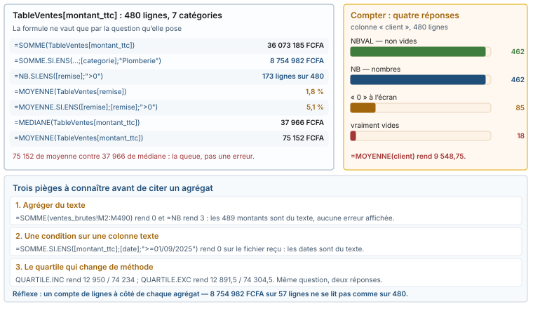

# Module M03.C05 — La boîte à fonctions d'agrégation et conditionnelle : SOMME, MOYENNE, NB, MEDIANE, SOMME.SI.ENS

**Outil de ce chapitre : le tableur seul, sur le classeur de l'atelier.** Durée indicative : 4 h. Niveau : N2.

> **L'idée du chapitre.** Un agrégat n'est pas un calcul, c'est une **question avec un dénominateur**. « Quelle est la
> remise moyenne ? » admet trois réponses justes sur la même colonne — 1,8 %, 5,1 %, 33,8 % — et la réunion du
> comité se perd en elles. Ce chapitre enseigne à écrire la question dans la formule : la plage, le critère, et ce
> que chaque fonction décide d'ignorer.

> **Base de travail.** Le classeur `01_socle_donnees/data/projection/m03_classeur_atelier.xlsx`, sur trois feuilles :
> `ventes` (le tableau `TableVentes`, 480 lignes, dates et montants en nombres), `ventes_brutes` (le fichier reçu,
> 489 lignes, montants en texte) et `Calculs` (les 28 fiches auto-contrôlées, dont les fiches 13 à 16 sont celles
> de ce chapitre). Le fichier de rapprochement `01_socle_donnees/data/brut/objectifs_de_ca.csv` sert à la dernière
> partie. Séparateur point-virgule, UTF-8, franc CFA (FCFA), virgule décimale, TVA 18 %. Chiffres cités :
> `01_socle_donnees/data/reference/chiffres_cites.md`, section M03. Copie de travail : `agregats_atelier`.

---

## 1. Objectifs du chapitre

À la fin de ce chapitre, vous saurez :

1. **Choisir** la bonne fonction de compte — `NB`, `NBVAL`, `NB.VIDE`, et le compteur de zéros
   `=NB.SI(plage;0)` — et dire ce que chacune ignore.
2. **Écrire** des critères : texte, comparaison, joker, date construite, et l'ordre des arguments de `SOMME.SI.ENS`.
3. **Nommer le dénominateur** de toute moyenne ou pourcentage cité, et savoir qu'une moyenne sur une colonne mixte
   est un nombre sans question.
4. **Vérifier un agrégat conditionnel** par la cohérence : les sept catégories rendent 480 lignes et 36 073 185 FCFA.
5. **Distinguer** `QUARTILE.INC` de `QUARTILE.EXC`, `SOMME` de `SOUS.TOTAL`, et ceux qui voient les lignes masquées.
6. **Anticiper** ce que le texte fait aux nombres : 0 FCFA sommé, 3 cellules comptées, une condition de date qui ne
   matche rien.

---

## 2. Pourquoi cette notion est importante

**Situation 1 — la réunion des trois pourcentages.** Le commercial annonce « 5,1 % de remise moyenne », la direction
relit le fichier et trouve 1,8 %. Aucun des deux n'a tort : le premier moyenne les 173 lignes qui portent une remise,
le seconde les 480. La troisième question, celle qui coûte de l'argent, est « quelle part du chiffre d'affaires est
remisée » — 12 198 008 FCFA sur 36 073 185 FCFA, soit 33,8 %. Trois formules, trois justes, une seule utile : celle
dont le dénominateur est écrit.

**Situation 2 — le 0 qui compte double.** La colonne `client` de l'extrait contient 85 « 0 » (ventes au comptoir) et
18 cellules vides. `NBVAL` compte 462 lignes renseignées, `NB` en compte 462 aussi parce que le zéro est un nombre —
et la moyenne de la colonne, 9 548,75, est un calcul parfait qui ne répond à rien : une moyenne d'identifiants n'est
pas une mesure.

**Situation 3 — la condition qui ne matche jamais.** `=SOMME.SI.ENS(TableVentes[montant_ttc];TableVentes[date];">=01/09/2025")`
rend 0 sur une colonne de dates stockées en texte, sans la moindre erreur. Sur `ventes`, où la conversion a été faite,
la même formule rend les 160 lignes de septembre à décembre. Le tableur n'a pas dit « ce n'est pas une date » : il a
dit « rien ne correspond ».

> **Dans les faits.** Les tableaux de bord d'entreprise échouent rarement sur la complexité d'une formule et
> fréquemment sur un critère mal typé ou un dénominateur tu. Un agrégat s'accompagne donc toujours de son compte de
> lignes : 8 754 982 FCFA « sur 57 lignes » se discute ; 8 754 982 FCFA seul se conteste.

---

## 3. Explication simple

Une fonction d'agrégat réduit une plage à un nombre. Elle diffère sur trois points seulement, et ces trois points
font toute la difficulté : **ce qu'elle regarde** (une colonne, ou une colonne plus des critères), **ce qu'elle
ignore** (les vides, le texte, les erreurs, les lignes masquées), et **ce qu'elle demande** (une condition écrite
comment).

Les `… .SI` posent une condition, les `… .SI.ENS` en posent plusieurs. Leur point commun : elles parcourent la
plage une fois, et comparent chaque cellule au critère. Comparer, c'est le verbe exact — d'où leurs deux faiblesses :
le critère doit être écrit avec le type que la cellule a (un nombre, pas du texte qui lui ressemble), et les plages
des critères et de la somme doivent avoir la même forme.

Enfin, une moyenne n'existe pas sans dénominateur. Écrire `MOYENNE` sans dire « sur combien de lignes », c'est
laisser le lecteur deviner — et il devinera autre chose que vous.

---

## 4. Vocabulaire essentiel

| Français — English | Définition simple | Piège à éviter |
|---|---|---|
| **Agrégat — aggregate** | Fonction qui réduit une plage à un nombre : `SOMME`, `MOYENNE`, `MAX`. | Oublier qu'elle ignore le texte et les vides. |
| **Critère — criteria** | La condition écrite en texte : `">500"`, `"Plomberie"`, `"<>0"`. | Écrire `>500` sans guillemets, ou 500 sans guillemets comme du texte. |
| **Plage de somme — sum range** | La colonne additionnée ; elle vient **en premier** dans `SOMME.SI.ENS`. | L'inverser avec la plage de critère : `#VALEUR!`, ou pire, un nombre plausible. |
| **Agrégat conditionnel — conditional aggregate** | `SOMME.SI.ENS`, `NB.SI.ENS`, `MOYENNE.SI.ENS`. | Compter les lignes avec `NB.SI` et le CA avec `SOMME.SI` sur des plages différentes. |
| **Sous-total visible — SUBTOTAL** | `SOUS.TOTAL(9;…)` ne somme que ce qui n'est pas masqué ou filtré. | Croire que `SOMME` suit le filtre : il ne le voit pas. |
| **Quartile inclusif / exclusif — QUARTILE.INC / .EXC** | Deux interpolations différentes sur les mêmes données. | Citer un quartile sans dire la méthode ni la version du tableur. |
| **Colonne mixte — mixed column** | Une colonne où se côtoient nombres, vides et zéros. | La moyenner : le résultat est juste et dépourvu de sens. |
| **ET logique entre conditions — implicit AND** | Toutes les conditions d'un `.SI.ENS` doivent être vraies. | Croire pouvoir mettre deux critères dans une seule cellule de condition. |

> **Définition.** Un **critère de comparaison** s'écrit entre guillemets, opérateur compris : `">=1000000"`,
> `"<>"` (non vide), `"=0"` (vide n'est pas zéro). Dès qu'il y a un opérateur, il y a des guillemets ; dès qu'il y a
> une date, il y a une concaténation : `">="&DATE(2025;9;1)`.

> **Définition.** Le **dénominateur** d'un agrégat est le nombre de lignes qu'il a réellement regardées. Deux
> agrégats de même forme sur la même colonne peuvent avoir des dénominateurs différents : `MOYENNE` ignore les vides,
> `MOYENNE.SI.ENS` ignore en plus les lignes hors critère — c'est exactement l'écart entre 1,8 % et 5,1 % de remise.

---

## 5. Cours approfondi



### 5.1 Compter : quatre fonctions, quatre réponses

Sur la colonne `client` de `ventes`, les quatre compteurs racontent quatre histoires :

| Formule | Rend | Ce qu'elle compte |
|---|---|---|
| `=NBVAL(TableVentes[client])` | 462 | tout ce qui n'est pas vide — zéros compris |
| `=NB(TableVentes[client])` | 462 | uniquement les nombres — les zéros sont des nombres |
| `=NB.VIDE(TableVentes[client])` | 18 | les trous |
| `=NB.SI(TableVentes[client];0)` | 85 | les comptoirs, identifiés par un zéro |

Retenez trois asymétries. `NB` et `NBVAL` ne diffèrent **que** sur le texte : sur une colonne de nombres, ils
s'accordent, et sur la colonne de montants du fichier reçu, `NB` rend 0 quand `NBVAL` rend 489 — c'est le diagnostic
du chapitre C02, devenu un outil de contrôle. Un **0 n'est pas un vide**, et un vide n'est pas un 0 : la différence
vaut 85 lignes ici. Enfin, les compteurs se recoupent : `NBVAL` plus `NB.VIDE` doit rendre le nombre de lignes du
tableau, 462 + 18 = 480 — si l'égalité ne tombe pas, la plage regardée n'est pas celle que vous croyez.

> **À retenir.** Un tableau de bord qui affiche un chiffre d'affaires sans son compte de lignes n'est pas vérifiable.
> Écrivez le couple : `=SOMME(TableVentes[montant_ttc])` et juste à côté
> `=NB(TableVentes[montant_ttc])` → 36 073 185 FCFA · 480.

### 5.2 Les critères, ce langage minuscule

Un critère est une **chaîne de caractères** que le tableur interprète. Sept écritures couvrent la gestion :

- `"Plomberie"` — égalité, non sensible à la casse, et qui compare du texte à du texte.
- `">=500"`, `"<>"` (non vide), `"=0"` (le zéro, pas le vide) — comparaisons sur nombres.
- `"réf 2*"` ? Non : le joker est `"*réf 2"` (préfixe) ou `"réf*2"` — l'astérisque remplace n'importe quelle suite,
  `?` un caractère, et `~` échappe le joker. Sur les produits de `ventes`, `"*réf 2*"` matche 223 lignes.
- `DATE(2025;9;1)` seul ne fait pas un critère : `">="&DATE(2025;9;1)` en fait un. Sans le `&`, le tableur compare
  une chaîne à une date et ne trouve rien.
- `"<>Plomberie"` — tous les autres ; utile, mais attention : une **cellule vide satisfait** `<>Plomberie`, donc les
  18 lignes sans client sont comptées comme « autres clients ».
- Une référence de cellule : `>K2` s'écrit `">"&K2`. C'est la seule manière de rendre une fiche paramétrable.
- Un texte qui ressemble à un nombre : ça dépend de qui regarde. La colonne `quantite` de la feuille de preuve est
  entièrement en texte, et `=NB.SI(ventes_brutes!I2:I490;">500")` y rend pourtant 7 — la famille `.SI` convertit ce
  qui se lit comme un nombre — alors que `=SOMME(ventes_brutes!I2:I490)` rend 0 sur ces mêmes cellules, parce que les
  agrégats arithmétiques ignorent le texte. Deux réponses sur le même contenu, aucune des deux n'est une erreur :
  c'est la dissymétrie à avoir en tête avant de déclarer une colonne « propre » parce qu'un `NB.SI` a répondu.

L'ordre des arguments de la famille `.SI.ENS` suit la logique de la question, pas celle de la phrase :
`=SOMME.SI.ENS(plage_à_sommer;plage_critère_1;critère_1;plage_critère_2;critère_2;…)`. **La somme d'abord.** Dans
`NB.SI.ENS` et `MOYENNE.SI.ENS`, il n'y a pas de plage de somme, donc le critère vient en premier — c'est
l'inversion la plus fréquente en correction de classeur, et quand les plages ont la même taille, elle produit
silencieusement un nombre faux.

> **Attention.** Les plages de critères et la plage de somme doivent avoir **la même dimension** :
> `=SOMME.SI.ENS(TableVentes[montant_ttc];ventes!H2:H481;"Plomberie")` rend `#VALEUR!` si l'une des deux s'arrête en
> 480 et l'autre en 481. Le réflexe : dans un tableau, écrivez les colonnes par leur nom
> (`TableVentes[categorie]`), elles sont toujours de la même longueur que le tableau.

> **Attention.** Quand aucune ligne ne satisfait le critère, les trois familles ne réagissent pas pareil :
> `=SOMME.SI.ENS(…)` et `=NB.SI.ENS(…)` rendent 0, `=MOYENNE.SI.ENS(…)` rend `#DIV/0!` faute de quoi diviser. Un 0
> est un résultat, `#DIV/0!` est un symptôme : sur une moyenne, ne le remplacez jamais par un 0 à coups de
> `SIERREUR` — signalez la ligne vide. Un tableau de bord qui affiche une moyenne de 0 FCFA là où il n'y a aucune
> ligne invente une donnée.

### 5.3 Le dénominateur est la notion

Même colonne `remise`, trois questions, trois écritures, trois résultats qu'il faut savoir énoncer :

| Question | Formule | Résultat |
|---|---|---|
| Remise moyenne sur toutes les lignes | `=MOYENNE(TableVentes[remise])` | 1,8 % |
| Remise moyenne **quand il y a remise** | `=MOYENNE.SI.ENS(TableVentes[remise];TableVentes[remise];">0")` | 5,1 % |
| Chiffre d'affaires touché par une remise | `=SOMME.SI.ENS(TableVentes[montant_ttc];TableVentes[remise];">0")` | 12 198 008 FCFA, soit 33,8 % du total |

Et une quatrième, la seule qui parle d'argent : combien la politique de remise a coûté.
Ni `SOMME` ni `SOMME.SI.ENS` ne savent sommer un produit de deux colonnes ; deux issues. La rapide :
`=SOMMEPROD(TableVentes[montant_ht];TableVentes[remise])` — `SOMMEPROD` multiplie ligne à ligne puis additionne, et
rend 514 969 FCFA. La lisible : une colonne calculée du tableau, `remise en francs` avec
`=[@[montant_ht]]*[@[remise]]`, qui rend la même valeur par un simple `=SOMME`, se filtre par catégorie et se
reconductit ligne par ligne. Sur un fichier appelé à être relu par d'autres, choisissez la seconde et gardez
`SOMMEPROD` pour vos contrôles rapides.

Le retournement de la moyenne avec les retours est la même leçon en négatif : la moyenne des 480 lignes est de
75 152 FCFA, celle des 472 lignes sans les 8 retours est de 77 028 FCFA — `1 876` FCFA d'écart par ligne, pour huit
lignes retirées sur 480. Voilà ce que « moyenne » veut dire sur une distribution asymétrique, et le module M02 avait
nommé cela l'effet de la queue.

### 5.4 Agréger par catégorie sans tableau croisé — et le vérifier

La question de gestion type : « par catégorie, combien de lignes, quel CA, quelle moyenne, quelle remise
consentie ? ». Quatre agrégats conditionnels par catégorie, soit une grille de 7 × 4 formules avec, en tête de
chaque ligne, la catégorie saisie **une seule fois** en `A2` et réutilisée par référence :

```
=NB.SI.ENS(TableVentes[categorie];$A2)
=SOMME.SI.ENS(TableVentes[montant_ttc];TableVentes[categorie];$A2)
=MOYENNE.SI.ENS(TableVentes[montant_ttc];TableVentes[categorie];$A2)
=MAX.SI.ENS(TableVentes[montant_ttc];TableVentes[categorie];$A2)
```

Le contrôle est la beauté du dispositif : les sept compteurs de lignes doivent restituer 480, les sept CA
36 073 185 FCFA. Ce n'est pas une coïncidence, c'est une **partition** — chaque ligne a une et une seule catégorie.
Dès qu'une ligne a une catégorie vide, ou un critère orthographié autrement que la donnée, la partition se ferme
mal — et le cas est ici, grandeur nature : le fichier stocke `Electricité`, sans accent sur la première lettre,
survivance d'un export qui a perdu les accents. Recopier le mot en `Électricité` dans un critère, c'est écrire une
formule qui rend 0 sur 53 lignes : les comparaisons du tableur sont insensibles à la casse et **sensibles aux
accents**. Un critère ne se tape donc jamais de mémoire, on le copie depuis une cellule du tableau.

> **Définition.** Une **partition fermée — closed partition** est un découpage dont les morceaux rendent le tout :
> les lignes s'additionnent (57 + 143 + 112 + 53 + 57 + 24 + 34 = 480) et les chiffres d'affaires aussi. Un
> regroupage qui ne ferme pas n'est pas un résultat approximatif : c'est qu'une ligne a échappé au critère, le plus
> souvent par l'orthographe, la casse ou un accent. La partition est le contrôle qualité des agrégats conditionnels,
> et elle ne coûte qu'une soustraction.

Les sept valeurs attendues, à recopier dans votre copie de contrôle : Plomberie 57 lignes · 8 754 982 FCFA ·
moyenne 153 596 ; Matériaux 143 · 6 519 357 · 45 590 ; `Electricité` 53 · 6 311 645 · 119 088 ; Quincaillerie 112 ·
4 203 121 · 37 528 ; Consommables 57 · 2 500 964 · 43 877 ; Bois & panneaux 24 · 4 844 758 · 201 865 ; Peinture
34 · 2 938 358 · 86 422.

### 5.5 La position et la dispersion : MEDIANE, QUARTILE.INC, et l'autre

`MEDIANE(TableVentes[montant_ttc])` rend 37 966 FCFA ; la moyenne, 75 152 FCFA ; la moyenne dépasse la médiane de
98 %. Ce n'est pas une anomalie du fichier, c'est sa forme — quatre lignes dépassent le million, et la plus forte,
1 229 678 FCFA, pèse à elle seule plus de 3 % du total. Un tableau de bord qui montre la moyenne sans la médiane
raconte l'histoire des gros tickets en croyant raconter le client moyen.

Les quartiles, eux, portent une embuscade de version. Le classeur d'atelier (fiches 11 et 12 de `Calculs`) calcule
`QUARTILE.INC` : 12 950 et 74 234 FCFA. `QUARTILE.EXC` rend 12 891,5 et 74 304,5. Quatre-vingt francs d'écart sur
des valeurs à treize et soixante-quatorze mille : négligeable sur un seuil d'alerte, rédhibitoire dans une note qui
compare deux fichiers produits avec deux méthodes. Retenez quatre choses : les deux méthodes existent, et les héritées `QUARTILE` / `PERCENTILE` **valent** la méthode
inclusive ; les variantes récentes exigent Excel 2010 ou plus ; en français, elles s'appellent `QUARTILE.INCLURE`,
`QUARTILE.EXCLURE` et `CENTILE.EXCLURE`, et c'est ce nom qu'on écrit dans une fiche de suivi — la feuille `Calculs`
du classeur affiche quant à elle la forme anglaise, parce que le format `.xlsx` stocke les noms anglais, comme vu au
§5.3 de C04 ; enfin LibreOffice Calc connaît les deux méthodes sous le nom anglais non traduit.

Deux agrégats de contexte complètent la boîte : `SOUS.TOTAL(9;TableVentes[montant_ttc])` ne somme que les lignes
visibles — la valeur du filtre à l'écran — alors que `SOMME` ignore le filtre ; et `AGREGAT` (anglais `AGGREGATE`)
additionne un choix de comportement : `=AGREGAT(9;6;TableVentes[montant_ttc])` somme les lignes visibles **en
ignorant les erreurs**, ce qui évite qu'une cellule en `#VALEUR!` contamine un total affiché (§5.6).

> **Définition.** Un agrégat **robuste** est un agrégat dont on connaît le périmètre exact : quelles lignes, quels
> vides, quelles erreurs, quel filtre. Les trois quatrièmes arguments de `SOMME.SI.ENS` ne disent que les
> conditions ; le reste est une convention que vous écrivez, ou une ambiguïté que d'autres résoudront à votre place.

### 5.6 Ce que le texte et les erreurs font aux nombres

Sur la feuille de preuve `ventes_brutes`, la colonne `montant_ttc` n'est que du texte, et les agrégats de base s'y
comportent en six manières de se taire : `SOMME` rend 0, `MOYENNE` rend `#DIV/0!` faute de valeur à diviser,
`MEDIANE` rend `#NUM!`, `MIN` et `MAX` rendent 0, `NB` rend 0 — pendant que `NBVAL` rend 489 et que
`=NB.SI(ventes_brutes!M2:M490;">1000000")` rend 4, parce que lui convertit. Quatre de ces six ignorent le texte
**sans le dire**. Le contrôle ne peut donc pas être un agrégat : c'est un compteur. La paire qui ferme le problème :
`=NB(TableVentes[montant_ttc])` et `=NBVAL(TableVentes[montant_ttc])` — quand les deux diffèrent, il y a du texte
dans la colonne, et il n'y a pas de total à citer.

Sur la colonne des quantités, la fiche 13 de `Calculs` compte 7 lignes au-dessus de 500 unités, dont une à `14 000`
: des erreurs d'import, pas des ventes en vrac. Le chiffre est exact parce que `NB.SI` convertit ; il deviendrait
faux dès que la comparaison porterait sur autre chose qu'un nombre, une date ou un code par exemple. Retenez la phrase
pour la fiche : « un agrégat sur une colonne non typée rend un nombre plausible, jamais une erreur ».

### 5.7 Et les objectifs, dans tout ça

Le rapprochement avec `objectifs` (218 lignes magasin × mois) est le vrai test des `.SI.ENS` à deux conditions :

```
=SOMME.SI.ENS(TableVentes[montant_ttc];TableVentes[magasin];"Magasin 5";TableVentes[date];">="&DATE(2025;1;1);TableVentes[date];"<="&DATE(2025;12;31))
=SUMIFS(...) vers la table d'objectifs, avec magasin ET mois comme clés
```

L'extrait de l'atelier représente 18,2 % de l'objectif annuel du magasin 5 (36 073 185 FCFA sur 198 030 000 FCFA).
Le piège est dans la jointure : les objectifs sont saisis **par mois**, les ventes **par jour**. Agréger sans aligner
la granularité produit un chiffre creux — d'où la colonne `mois` (le premier du mois, via la poignée de recopie vue
en C02 et `DATE(ANNEE(…);MOIS(…);1)`) qui aligne les deux tables, et le `NB.SI.ENS` à deux critères qui sert à la
fois d'agrégat et de **contrôle de clé** : si le compte d'objectifs trouvés descend au-dessous de 12, un mois est
absent de la table d'en face. Deux ventes de l'extrait n'ont d'ailleurs pas d'objectif correspondant — le mois de
mars du magasin 4 — et c'est exactement ce que ce compteur signale.

> **Conseil professionnel.** Dans toute note de synthèse, l'agrégat s'écrit avec sa parenthèse :
> « remise moyenne 5,1 % (sur les 173 lignes remisées) ». Douze mots de plus, et la question du dénominateur ne se
> pose plus en réunion. C'est aussi ce qui rend votre chiffre retrouvable par quelqu'un d'autre six mois plus tard.

> **Boîte à outils.** `=NB` · `=NBVAL` · `=NB.VIDE` · `=NB.SI(plage;0)` pour compter ; `=SOMME` · `=MOYENNE` ·
> `=MEDIANE` · `=MAX` · `=MIN` · `=ECARTYPE.STANDARD` · `=QUARTILE.INC(plage;1|3)` pour résumer ;
> `=SOMME.SI.ENS` · `=NB.SI.ENS` · `=MOYENNE.SI.ENS` · `=MAX.SI.ENS` · `=MIN.SI.ENS` pour conditionner (les deux
> derniers exigent Excel 2019 ou Microsoft 365 — variante 2021 : un tableau `MAX` sur une plage filtrée, ou
> `AGREGAT` en matriciel) ; `=SOUS.TOTAL(num;plage)` pour la vue à l'écran. Raccourcis : `Alt` + `=` (somme
> automatique, qui s'adapte à la colonne choisie), `F4` (passer une adresse en absolu) et `Ctrl` + `Entrée`
> (valider une formule matricielle ancienne). La barre d'état reste l'outil de contrôle par défaut : clic sur une
> colonne, lire *Somme*, *Nombre*, *Moyenne* en bas de fenêtre. Dans LibreOffice
> Calc, mêmes fonctions, et l'assistant de filtre rend les sous-totaux de groupe (données → sous-totaux),
> inexistant dans Excel sans TCD.

---

## 6. Exemple concret : la dispute des 3 pourcents

Une messagerie interne : « la direction dit 1,8 % de remise, le terrain dit 5 %. Qui a falsifié quoi ? ». Personne.
Sur `TableVentes[remise]` :

- `=MOYENNE(TableVentes[remise])` → 1,8 %, dénominateur 480 lignes, les non-remisées incluses ;
- `=MOYENNE.SI.ENS(TableVentes[remise];TableVentes[remise];">0")` → 5,1 %, dénominateur 173 lignes remisées ;
- `=SOMME.SI.ENS(TableVentes[montant_ttc];TableVentes[remise];">0")` / `=SOMME(TableVentes[montant_ttc])` → 33,8 %,
  dénominateur : le CA, pas les lignes — « un tiers du chiffre d'affaires part en remise ».

La réunion ne porte plus sur les nombres mais sur la question. C'est tout l'objet du chapitre : chaque agrégat du
classeur d'atelier est doublé d'un compte de lignes, et la fiche 16 de `Calculs` (`NB.SI.ENS` sur Peinture avec
remise) est exactement ce genre de cellule — 8 lignes, et le lecteur sait enfin sur quoi porte le pourcentage.

## 7. Démonstration pas à pas : la grille de contrôle par catégorie

Six étapes dans la copie `agregats_atelier`, feuille neuve `Contrôle catégories`.

**1. Poser les catégories.** En `A2:A8`, les sept libellés recopiés **depuis le tableau** (`=TableVentes[categorie]`
dans une cellule d'à côté puis `UNIQUE` si disponible, sinon copier-coller et supprimer les doublons à la main). Un
libellé recopié à la main est une faute en puissance : ici, `Electricité` sans accent dans le fichier, avec accent
dans votre saisie, et le critère ne matche rien.

**2. Les quatre agrégats.** En `B2:D2` et jusqu'en ligne 8 :
`=NB.SI.ENS(TableVentes[categorie];$A2)`, `=SOMME.SI.ENS(TableVentes[montant_ttc];TableVentes[categorie];$A2)`,
`=MOYENNE.SI.ENS(TableVentes[montant_ttc];TableVentes[categorie];$A2)`, et en `E2` la part du CA
`=D2/SOMME(TableVentes[montant_ttc])` au format `0,0 %`.

**3. Fermer la partition.** En `B9` : `=SOMME(B2:B8)` doit rendre 480. En `C9` : `=SOMME(C2:C8)` doit rendre
36 073 185. En `D9` : `=C9/B9` doit rendre 75 152 — la moyenne générale, retrouvée par les sous-ensembles. Si l'un
des trois cloche, la cause est une catégorie absente ou mal orthographiée, jamais une erreur de formule.

**4. Les bornes par catégorie.** En `F2:G8`, `=MIN.SI.ENS` et `=MAX.SI.ENS` ; sur Excel 2021, la variante est un
`MIN.SI` sur une colonne triée ou un tableau `=MIN(SI(…))` validé en matriciel. Notez que la Plomberie a une moyenne de
153 596 FCFA, plus du triple de celle des Matériaux (45 590 FCFA) : l'écart est dans la marchandise, pas dans la
formule.

**5. La condition de date.** En `I1` : `=SOMME.SI.ENS(TableVentes[montant_ttc];TableVentes[date];">="&DATE(2025;9;1))`
→ les lignes de septembre à décembre. Refaites-la sur la copie non convertie, avec le texte : 0 FCFA. Ce couple de
nombres est la démonstration que le typage est en amont de l'agrégat.

**6. Le test d'objection.** Ajoutez une ligne `=NB.SI(TableVentes[categorie];"Electricité")` puis corrigez
temporairement une catégorie en `électricité` : les compteurs de la grille ne bougent pas, et la partition se ferme
à 479 lignes au lieu de 480. Voilà ce que le contrôle de l'étape 3 attrape, et rien d'autre ne l'attrape.

**Contrôles qualité du chapitre.**

| # | Contrôle | Seuil | Résultat attendu | Si échec |
|---|---|---|---|---|
| 1 | Somme des 7 compteurs de lignes | identité | 480 | catégorie vide, doublon de libellé ou critère mal orthographié |
| 2 | Somme des 7 CA | ±1 FCFA | 36 073 185 FCFA | une ligne a deux catégories, ou la plage s'arrête en 479 |
| 3 | CA / lignes globaux | ±1 FCFA | 75 152 FCFA | moyenne calculée comme moyenne des moyennes (faux) |
| 4 | Condition de date, copie typée contre copie texte | deux nombres | les lignes d'automne contre 0 | dates restées du texte, critère sans `&` |
| 5 | `NB` contre `NBVAL` sur `montant_ttc` | identité | 480 · 480 (et 3 · 489 sur la brute) | agrégat posé sur une colonne non typée |

## 8. Erreurs fréquentes

1. **Inverser plage de somme et plage de critère.** Sur `SOMME.SI.ENS`, la somme est le premier argument ; inversé,
   le résultat est un nombre absurde ou `#VALEUR!` selon les tailles, mais presque jamais une erreur claire.
2. **Moyenne des moyennes.** Reprendre la colonne des sept moyennes de catégorie et en faire une `MOYENNE` :
   98 281 FCFA au lieu de 75 152 FCFA, soit 30,8 % de surévaluation. On re-somme les chiffres d'affaires et on
   divise par le total des lignes — jamais l'inverse.
3. **Confondre `NB` et `NBVAL` comme un contrôle de typage.** Les deux diffèrent sur le texte, pas sur le vide ; pour
   les vides, c'est `NB.VIDE`. Un tableau de bord qui les inverse affiche un problème là où il n'y en a pas.
4. **Comparer une date à une chaîne.** `">=01/09/2025"` sur une colonne de dates réelles fonctionne selon le
   réglage régional, et casse sur un autre poste : écrivez `">="&DATE(2025;9;1)`, ou référencez une cellule de borne.
5. **Chercher la performance dans `SOMME.SI` sur 480 lignes.** Sur cette taille, ce n'est pas un problème ; le
   problème est le `.SI.ENS` recalculé sur 200 000 lignes à chaque frappe — la réponse est le tableau croisé
   (chapitre C08), pas une formule plus astucieuse.
6. **Oublier qu'un critère texte est insensible à la casse mais sensible à l'espace.** `"Plomberie "` avec une espace
   finale ne matche pas `"PLOMBRIE"`, et les deux matchent `"plomberie"` : l'outil de nettoyage est
   `SUPPRESPACE`, pas la relecture à l'œil.

## 9. Bonnes pratiques professionnelles

1. **Tout agrégat est accompagné de son dénominateur** — une cellule de compte juste à côté, jamais dans un
   commentaire oral. La paire `SOMME` / `NB` est le minimum du livrable.
2. **Les critères viennent d'une cellule, pas de la formule.** Une liste de catégories en `A2:A8`, des bornes de
   période en `B1:B2` : la grille devient paramétrable, et le contrôle de cohérence se rejoue sur un autre périmètre.
3. **Fermer la partition.** Si vous agrégez par catégorie, par magasin ou par mois, la somme des parts doit rendre le
   total. C'est le seul test qui prouve à la fois la couverture et l'absence de doublons — et il coûte une formule.
4. **Une colonne calculée pour ce qui n'est pas linéaire.** La remise en francs, l'écart à l'objectif : le tableur
   sait sommer un produit, beaucoup moins bien le recompter ligne à ligne dans une formule de contrôle.
5. **Version écrite pour les fonctions récentes.** `MAX.SI.ENS`, `QUARTILE.EXC`, `AGREGAT` : la fiche double du
   chapitre C04 s'applique — nom français, variante 2021/Calc, et le nom tout court si le fichier doit voyager.

> **Conseil professionnel.** Quand un chiffre étonne, ne refaites pas la formule : **changez son périmètre**.
> `=SOMME.SI.ENS(TableVentes[montant_ttc];TableVentes[remise];">0")` rendu seul, puis avec une condition de date,
> puis avec une catégorie : trois nombres, et l'étonnement devient une explication. C'est en réduisant le périmètre
> qu'on trouve la ligne qui parle, jamais en relisant la syntaxe.

## 10. Exercice guidé — la grille qui se ferme (35 min, /10)

**Commande.** Construisez la grille de contrôle par vendeur (4 lignes au lieu de 7), et fermez-la.

| Étape | Geste | Ce qui doit se lire |
|---|---|---|
| 1 | Vendeurs en `A2:A5`, recopiés du tableau | 4 libellés exacts |
| 2 | `=NB.SI.ENS(TableVentes[vendeur];$A2)` | 128 · 125 · 118 · 109 lignes |
| 3 | `=SOMME.SI.ENS` du CA par vendeur, puis part en `%` | 4 parts, somme = 100,0 % |
| 4 | `=MOYENNE.SI.ENS` par vendeur | 4 nombres, et **pas** leur moyenne en total |
| 5 | Total : `=SOMME(lignes)` · `=SOMME(CA)` · `=CA/lignes` | 480 · 36 073 185 FCFA · 75 152 FCFA |
| 6 | Contrôle des erreurs : `=NB` contre `=NBVAL` sur chaque plage de critères | égalités partout |

**Démarrage.** L'étape 4 est le piège du chapitre : la moyenne générale n'est pas la moyenne des quatre moyennes,
parce que les dénominateurs diffèrent (128 lignes contre 109). Vérifiez-le en calculant les deux : l'écart se voit
en centaines de francs. À l'étape 5, si le total des lignes ne rend pas 480, ne corrigez pas la formule — cherchez la
ligne sans vendeur : `=NB.VIDE(TableVentes[vendeur])` répond en une seconde.

**Barème (10 points).** Grille complète avec critères par référence (3) · partition fermée aux trois totaux (3) ·
moyenne des moyennes démontrée fausse, chiffre à l'appui (2) · contrôle `NB`/`NBVAL` sur les trois colonnes lues (1) ·
note d'une ligne par agrégat indiquant le dénominateur (1).

## 11. Exercices autonomes

**Exercice 5.1 (★) — Les quatre compteurs.** Sur `ventes_brutes`, puis sur `ventes`, posez les quatre compteurs —
`NB`, `NBVAL`, `NB.VIDE` et `=NB.SI(plage;0)` — sur les colonnes `quantite`, `client` et `montant_ttc`. Dressez un
tableau à quatre colonnes (formule, valeur sur la brute, valeur sur la propre, ce que ça veut dire) et concluez par
la phrase que vous enverriez à la personne qui a saisi le fichier.

**Exercice 5.2 (★) — Les critères, un par un.** Sur la colonne `remise` de `ventes`, écrivez six formules :
`=NB.SI(…;">0")`, `=NB.SI(…;"=0")`, `=NB.SI(…;"<>0")`, `=NB.SI(…;"<=0,1")`, un `=NB.SI.ENS(…)` borné entre 0,05 et
0,11, et un `=NB.VIDE(…)`. Deux d'entre elles rendent le même nombre : dites lesquelles, et pourquoi la colonne s'y
prête mal. Recommencez sur `client` avec les trois conditions `>0`, `=0` et `NB.VIDE` : vérifiez qu'elles se
referment sur le nombre de lignes du tableau.

**Exercice 5.3 (★★) — Le seuil qui dépend de la méthode.** Calculez Q1 et Q3 de `montant_ttc` par les deux méthodes
(`QUARTILE.INC` puis `QUARTILE.EXC`), puis la moyenne des lignes comprises entre les deux bornes avec
`MOYENNE.SI.ENS` à deux conditions. Combien de lignes changent de côté sur cet extrait ? Que répondez-vous à un
lecteur qui cite un seuil de quartile sans dire la méthode ?

**Exercice 5.4 (★★) — La grille par mois.** Ajoutez au tableau une colonne `mois` calculée
(`=DATE(ANNEE([@date]);MOIS([@date]);1)`, format `mmm. aaaa`), puis la grille 12 × 3 (lignes, CA, moyenne). Contrôlez
par la partition, et comparez les CA mensuels aux 12 valeurs de la fiche `Calculs`. Concluez sur ce que la
granularité change à la lecture de la saisonnalité.

**Exercice 5.5 (★★) — Agréger contre le fichier d'objectifs.** Sans `RECHERCHEV` (c'est le chapitre suivant) :
comptez, avec `NB.SI.ENS` sur les deux critères magasin et mois, combien de lignes d'objectifs correspondent à des
ventes et inversement, à partir des 218 lignes et des 12 mois de l'extrait. Les deux comptes doivent être égaux pour
que la comparaison CA/objectif soit licite — ne le sont pas : nommez les lignes qui manquent.

## 12. Correction détaillée

**Exercice 5.1.** Sur `ventes_brutes`, tout est texte : les trois colonnes rendent `NB` 0, `NBVAL` 489, `NB.VIDE` 0.
Seul le critère numérique sort du silence — `=NB.SI(ventes_brutes!F2:F490;0)` rend 85 sur `client`, et 0 sur
`quantite` comme sur `montant_ttc`, parce que la famille `.SI` convertit ce que `NB` ignore. Sur `ventes`,
`montant_ttc` et `quantite` rendent 480 · 480 · 0 · 0, et `client` 462 · 462 · 18 · 85. Phrase attendue : « les
montants ne sont pas chiffrables en l'état et rien n'est signalé ; le seul témoin est l'écart entre `NB` et
`NBVAL` ».

**Exercice 5.2.** Sur `remise` : 173 lignes remisées, 307 à zéro, 173 encore en `<>0`, 476 au plus égales à 0,1 —
soit 4 lignes au-dessus de la grille, les quatre lignes à 11 % —, 50 entre 0,05 et 0,11, et 0 vide. Les deux formes
qui se ressemblent sont `>0` et `<>0` : elles rendent la même valeur ici pour la seule raison que la colonne ne
contient aucun vide. Sur `client`, la fermeture se vérifie : 377 identifiants positifs, 85 zéros, 18 cellules vides,
et 377 + 85 + 18 = 480, le nombre de lignes du tableau. C'est ce troisième nombre qui distingue une partition d'une
négation : `<>0` est une comparaison, pas un complément, et selon la version du tableur les vides y entrent ou non.
La règle du chapitre en découle — ne jamais compter par négation quand la colonne a des trous ; additionnez les
composantes, le contrôle tombe juste.

**Exercice 5.3.** `QUARTILE.INC` rend 12 950 et 74 234, `QUARTILE.EXC` rend 12 891,5 et 74 304,5. Entre les deux
paires de bornes, **aucune ligne** de l'extrait ne tombe : la moyenne tronquée est identique au franc, et l'illusion
est parfaite — deux méthodes, deux seuils écrits noir sur blanc, un seul résultat réel. Réponse attendue : « le
seuil n'a de sens que nommé avec sa méthode ; ici l'écart se joue à une soixantaine de francs sur les bornes et à
rien sur les effectifs, ce qui est la pire configuration, parce qu'elle ne punit pas l'oubli ».

**Exercice 5.4.** Douze lignes de 40 ventes chacune dans l'extrait ; les CA mensuels reproduisent la fiche
`Calculs` ; la moyenne annuelle des lignes (75 152 FCFA) se retrouve au centime près en sommant les CA puis en
divisant par 480, pas en moyennant les douze moyennes mensuelles. La granularité mensuelle fait apparaître décembre au
sommet (5 292 517 FCFA), février juste derrière (4 289 885 FCFA) et mai le plus bas (1 258 801 FCFA) : invisible au
niveau de la ligne, et écrasé par la moyenne annuelle.

**Exercice 5.5.** La table d'objectifs compte 218 lignes (magasin × mois) ; l'extrait ne porte que sur un magasin
pendant douze mois, donc 12 paires à retrouver, et les douze sont là. En sens inverse, à l'échelle de la population
des 240 000 ventes, deux groupes de ventes n'ont aucun objectif — le magasin 4 en février et en mars 2024 — et
aucune ligne d'objectif n'est orpheline de ventes. Ce que l'exercice démontre : rapprocher deux tables n'est pas un
agrégat, c'est un double comptage, dans les deux sens, et il se fait avant le premier ratio cité. Sans lui, le ratio
porte sur un périmètre qu'aucun des deux fichiers ne définit.

## 13. Mini-projet M03.P1 — suite : le volet agrégats (45 min)

**Commande.** Livrez dans `agregats_atelier` la feuille `Contrôle agrégats` qui permet à un lecteur de vérifier
n'importe quel chiffre du classeur sans ouvrir une seule formule.

**Livrables numérotés.** (1) la grille par catégorie (7 lignes × 5 colonnes : lignes, CA, moyenne, min, max) et sa
fermeture par la partition, avec les totaux en pied ; (2) la grille par vendeur et la grille par mois, avec en
dessous la démonstration chiffrée que la moyenne des moyennes est fausse ; (3) le tableau des quatre compteurs (`NB`,
`NBVAL`, `NB.VIDE` et le compteur de zéros) sur les colonnes numériques des deux feuilles, brute et propre, avec pour
chaque case ce qu'elle veut dire ; (4) un
encadré « questions à dénominateur » de cinq lignes, où chaque pourcentage cité du classeur est écrit avec sa plage
et son nombre de lignes ; (5) le rapprochement d'objectifs par `NB.SI.ENS` à deux critères, avec les mois manquants
nommés.

**Barème (20 points, seuil 13).** Grilles justes et partitions fermées (6) · démonstration moyenne des moyennes (3) ·
tableau des compteurs complet et commenté (4) · encadré à dénominateurs (4) · contrôle de clés sur les objectifs (3).

## 14. Résumé du chapitre

Les fonctions d'agrégat ne diffèrent que par ce qu'elles regardent et ce qu'elles ignorent. `NB` compte les nombres,
`NBVAL` tout ce qui est écrit, `NB.VIDE` les trous — et l'écart entre les trois est un diagnostic de typage, pas une
coquetterie : 0, 489 et 0 sur la colonne des montants du fichier reçu. La famille `.SI`, puis `.SI.ENS`, ajoute une
puis plusieurs conditions, avec un ordre d'arguments qui surprend (la plage de somme d'abord) et une exigence
silencieuse : des plages de même dimension et des critères du même type que les cellules — à cette nuance près que
`NB.SI` convertit les textes numériques que `SOMME` ignore.

Le vrai sujet est le dénominateur. Une même colonne de remises rend 1,8 %, 5,1 % et 33,8 % selon la question, et les
trois sont justes ; une moyenne amputée de huit lignes se déplace de `1 876` FCFA ; une moyenne des moyennes par catégorie
donne 98 281 FCFA au lieu de 75 152 FCFA, soit 30,8 %. D'où les trois réflexes du chapitre : écrire la question à
côté du nombre, fermer la partition (les sept catégories rendent 480 lignes et 36 073 185 FCFA au franc près), et citer la méthode
là où elle existe — `QUARTILE.INC` rend 12 950 et 74 234, `QUARTILE.EXC` 12 891,5 et 74 304,5.

Enfin, sur une colonne texte, un agrégat rend un nombre plausible et jamais une erreur : le contrôle n'est donc pas
un agrégat, c'est un compteur.

## 15. À retenir

> **À retenir.** Aucun agrégat sans son dénominateur : 5,1 % de remise moyenne ne veut rien dire sans
> « sur les 173 lignes remisées ». La parenthèse fait la rigueur, et elle coûte douze mots.

> **À retenir.** Sur une colonne non typée, `SOMME` rend 0 et `NB.SI` rend 0 sans un bruit. Le contrôle d'un agrégat
> est un compteur (`NB` contre `NBVAL`), pas une relecture de la formule.

> **À retenir.** Fermez la partition : la somme des sous-ensembles doit rendre le total. C'est le seul test qui
> prouve en même temps la couverture, l'absence de doublon et l'orthographe des critères.

1. Une moyenne n'est pas une moyenne des moyennes — on re-somme et on re-compte, toujours.
2. Un critère de date passe par `DATE()` et une concaténation, jamais par une date tapée en texte.
3. Un 0 n'est pas un vide, et `<>0` compte les vides : les trois écritures se distinguent à la lecture du résultat.
4. `SOUS.TOTAL` et `AGREGAT` voient le filtre, `SOMME` ne le voit pas : précisez lequel est à l'écran.

## 16. Évaluation formative (auto-correction, 10 min)

1. Une colonne contient 480 cellules : 400 nombres, 70 textes, 10 vides. Que rendent `NB`, `NBVAL`, `NB.VIDE` et
   `SOMME` ?
2. Écrivez, sans fichier sous les yeux, la formule du CA des lignes de la catégorie Matériaux dont la quantité
   dépasse 50 **et** la date est en septembre 2025 — avec les bons ordres d'arguments.
3. « La remise moyenne est de 1,8 % » : que doit-on ajouter à cette phrase pour qu'elle soit défendable, et quelle
   autre valeur légitime peut-on lui opposer ?
4. Pourquoi la moyenne des CA par catégorie n'est-elle pas la moyenne du CA de la période, et qu'est-ce que
   l'écart entre les deux dit de la structure des ventes ?
5. Un collègue obtient 0 avec une condition de date. Citez les deux causes les plus probables, dans l'ordre, et le
   contrôle qui les distingue en une formule.

**Question ouverte.** Vous devez livrer une grille par magasin (6 lignes) et par mois (12 colonnes) avec un seul
contrôle qui prouve qu'elle est complète. Écrivez ce contrôle, et dites ce qu'il ne vérifie pas.

---

**Corrigé de l'évaluation formative.**

1. `NB` = 400 (les nombres), `NBVAL` = 470 (tout ce qui est écrit, textes compris), `NB.VIDE` = 10, `SOMME` = la
   somme des seuls 400 nombres — un total amputé de 70 lignes, sans le moindre message.
2. `=SOMME.SI.ENS(TableVentes[montant_ttc];TableVentes[categorie];"Matériaux";TableVentes[quantite];">50";
   TableVentes[date];">="&DATE(2025;9;1);TableVentes[date];"<"&DATE(2025;10;1))` — somme en premier, puis des
   triplets plage/critère, et la borne haute **exclusive** pour ne pas double-compter le 1ᵉʳ octobre.
3. Le dénominateur et la plage : « 1,8 % sur les 480 lignes du tableau ». On lui oppose « 5,1 % sur les 173 lignes
   remisées » — et le troisième chiffre, 12 198 008 FCFA de CA remisé, soit 33,8 %, qui est celui qui parle d'argent.
4. Parce que les catégories n'ont pas le même nombre de lignes (24 pour Bois & panneaux, 143 pour Matériaux) : la
   moyenne des moyennes surpondère les petites catégories. L'écart — ici 98 281 contre 75 152 FCFA — dit que
   quelques catégories à gros tickets tirent l'ensemble ; c'est une information sur la structure, pas une erreur.
5. Une colonne de dates restées du texte (la conversion n'a pas été faite, ou la ligne est hors du tableau) ; ou le
   critère écrit en texte (`">=01/09/2025"`) au lieu de `">="&DATE(2025;9;1)`. Le contrôle qui les distingue :
   `=NB(TableVentes[date])` — 480 si la colonne est typée, 0 ou presque sinon.
   *Question ouverte* — Réponse attendue : le contrôle est `=SOMME(nb_par_magasin) = 480` répété sur chaque ligne de
   mois, soit une grille de totaux croisés dont la diagonale ferme ; ce qu'il ne vérifie pas, c'est la **qualité**
   des lignes comptées (un montant texte est compté comme une ligne valide), ni les lignes **sans** magasin ou sans
   date, qui n'entrent dans aucune case et ne cassent donc pas le total si le périmètre est pris large.

---

**Suite du module.** Le chapitre C06 assemble les tables : `RECHERCHEV` et ses quatre pièges, `RECHERCHEX`,
`INDEX`/`EQUIV`, et les fonctions de texte qui réparent une clé (`GAUCHE`, `STXT`, `SUBSTITUE`, `JOINDRE.TEXTE`) —
celles qui transforment les 103 lignes sans client identifiant en lignes qui en ont un.
