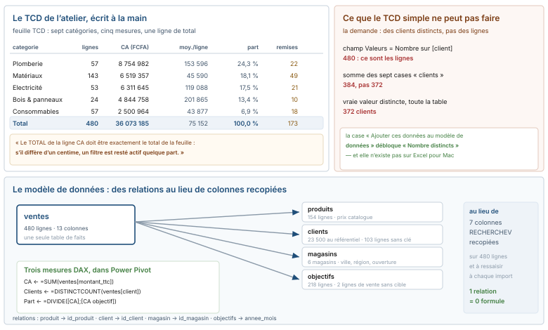
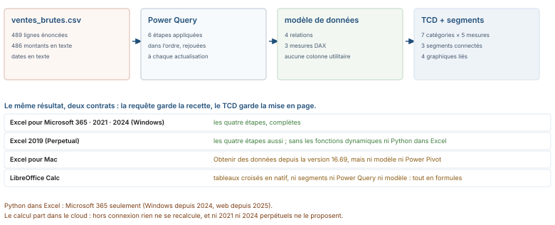

# Module M03.C08 — Croiser, charger, protéger : tableaux croisés dynamiques, segments, Power Query, modèle de données, DAX de survie

**Outil de ce chapitre : le tableur seul, sur le classeur de l'atelier.** Durée indicative : 3 h (hors exercices). Niveau : N2.

> **L'idée du chapitre.** Un TCD n'est pas un tour de magie : c'est une requête de regroupement sur une copie des
> données, figée jusqu'à l'actualisation. Le chapitre commence donc par **écrire ce TCD à la main** — le classeur en
> contient déjà un, en `SOMME.SI.ENS` et `NB.SI.ENS` — pour savoir ce que l'outil calcule, ce qu'il ne peut pas
> calculer, et ce que l'actualisation casse. Viennent ensuite les trois machines qui rendent le geste répétable :
> Power Query (la recette), le modèle de données (les relations), la protection (la survie du classeur).

> **Base de travail.** Le classeur `01_socle_donnees/data/projection/m03_classeur_atelier.xlsx` : `ventes`
> (tableau `TableVentes`, 480 lignes), `ventes_brutes` (le fichier reçu, 489 lignes énoncées), `produits`, `clients`,
> `magasins`, `objectifs`, et la feuille `TCD` dont ce chapitre démonte les sept lignes. Point-virgule, UTF-8,
> franc CFA (FCFA), virgule décimale, TVA 18 %. Chiffres : `chiffres_cites.md`, section M03. Copie de travail :
> `pilotage_atelier`.

---

## 1. Objectifs du chapitre

À la fin de ce chapitre, vous saurez :

1. **Construire et auditer** un tableau croisé dynamique : quatre zones, cinq agrégations, contrôle de total, tri
   par valeur, filtre « cinq premiers », regroupement par mois — et les 36 groupes qui apparaissent quand la colonne
   date est restée du texte.
2. **Reconnaître ce que le TCD seul ne sait pas faire** : un nombre distincts, une moyenne correcte d'une colonne de
   moyennes, un cumul qui respecte l'ordre du temps.
3. **Écrire une requête Power Query** de six étapes pour passer de `ventes_brutes` à une table propre, la rejouer,
   et comprendre pourquoi son chemin d'accès casse chez le voisin.
4. **Brancher quatre tables sur un modèle de données** et dire ce qu'une relation remplace, en colonnes et en
   erreurs.
5. **Écrire trois mesures DAX** (`SUM`, `DISTINCTCOUNT`, `DIVIDE` avec `CALCULATE`/`ALL`) et expliquer ce qu'un
   contexte de filtre change au résultat.
6. **Protéger un classeur sans le rendre muet**, et choisir en connaissance de cause entre requête rejouée, macro
   enregistrée et Python dans Excel.

## 2. Pourquoi cette notion est importante

Le fichier `TCD` du classeur d'atelier contient une phrase que je vous demande de garder en tête pour tout le reste
du module : « Le TOTAL de la ligne CA doit être exactement le total de la feuille : s'il diffère d'un centime, un
filtre est resté actif quelque part. » C'est la seule discipline qui distingue un tableau croisé d'un tableau joli.

**Le TCD ment par omission** : il agrège une copie prise à l'actualisation, une ligne ajoutée à la source n'existe
pas pour lui, une catégorie vide disparaît de la liste, et le lecteur voit le reste sans voir ce qui a disparu.
**La requête, elle, ne ment pas : elle rejoue** — les six étapes de nettoyage sont écrites, nommées, et exécutées à
l'identique le mois prochain. C'est la différence entre un résultat et une méthode : M04 la fait documenter, M05 la fait rejouer en
Power Query, SQL et pandas.

Le reste du chapitre en est la conséquence : dès qu'on refuse de recopier des colonnes `RECHERCHEV` dans la table de
faits, il faut décrire les liens quelque part — le tableur propose un endroit, un modèle, et un langage.

---

## 3. Explication simple

Un tableau croisé dynamique, c'est une question posée en quatre cases : **en lignes** ce par quoi on découpe (la
catégorie), **en colonnes** la deuxième découpe (le mois), **dans la zone Valeurs** le nombre qu'on additionne (le
montant), **au filtre** ce qu'on exclut (les retours). Excel écrit la boucle, stocke le résultat dans un cache, et
affiche une grille. Le cache explique tous les comportements surprenants : il faut **actualiser** pour relire la
source ; la mise en forme de la grille vous appartient, son contenu non plus ; un segment ne filtre que les objets
TCD qui y sont connectés.

Power Query est l'inverse d'un TCD : rien n'est stocké en dur, tout est écrit. Vous faites les manipulations une
fois, l'outil en garde la liste des étapes, et il la rejoue sur n'importe quel fichier de même forme. Le modèle de
données, enfin, est une petite base de données dans le classeur : chaque table garde ses lignes, on déclare que
`ventes[produit]` pointe sur `produits[id_produit]`, et les agrégats se calculent à travers ces liens. Une mesure
DAX est un calcul sans cellule : elle n'existe que là où un TCD l'affiche.

> **Dans les faits.** La demande type d'un comité : « un TCD par catégorie, avec le nombre de clients ». Le champ
> Valeurs propose « Nombre », qui compte des lignes : 480 ; les clients distincts sont 372, et l'obtenir exige le
> modèle. Les deux tiers des écarts signalés en revue sont cette confusion, ou son miroir : des distincts additionnés
> par catégorie, ce qui fait 384 parce que douze clients achètent dans deux catégories.

## 4. Vocabulaire essentiel

| Français — English | Définition simple | Piège à éviter |
|---|---|---|
| **Tableau croisé dynamique — PivotTable** | Grille de regroupement calculée sur un cache des données sources. | Croire qu'il suit les filtres posés sur la feuille source. |
| **Champ Valeurs — Values field** | La mesure agrégée : somme, nombre, moyenne, max, min, produit. | « Nombre » n'est jamais « nombre de choses distinctes ». |
| **Segment — Slicer** | Bouton de filtre visuel connecté à un ou plusieurs TCD. | Oublier « Connexions de rapports » : il n'agit que sur ce qu'on lui déclare. |
| **Chronologie — Timeline** | Segment spécialisé sur une plage de dates. | Elle ne peut pas s'appuyer sur une colonne de dates-texte. |
| **Éditeur Power Query** | Fenêtre où se lisent et se réordonnent les étapes de nettoyage. | Retirer une étape du milieu de la pile : les suivantes se recalculent ailleurs. |
| **Requête — Query** | La recette, pas le résultat. | Enregistrer le résultat et jeter la recette. |
| **Modèle de données — Data Model** | Tables et relations interrogées par le TCD et le DAX. | Ajouter une seule table au modèle : une relation a besoin de deux côtés. |
| **Relation — Relationship** | Lien many-to-one entre une clé et une colonne unique. | Deux tables sans clé commune : ici, 2 lignes de vente sans objectif. |
| **Mesure — Measure** | Calcul DAX évalué dans le contexte du TCD qui l'affiche. | La confondre avec une colonne calculée, stockée ligne à ligne. |
| **Contexte de filtre — Filter context** | Le jeu de lignes que le TCD laisse passer à la mesure, à cet instant. | Écrire `=DIVIDE([CA];[CA total])` et voir `[CA total]` valoir le mois, pas l'année. |
| **Actualiser tout — Refresh All** | Rejoue connexions, requêtes et caches (`Ctrl` + `Alt` + `F5`). | Lancer l'actualisation sur une feuille protégée sans autoriser les TCD. |

> **Définition.** Une **agrégation juste** est une agrégation dont on peut nommer les lignes consommées : la
> moyenne des 480 lignes (75 152 FCFA) répond à « par ligne », la moyenne des sept moyennes de catégorie (98 281)
> répond à une autre question.

> **Définition.** Dans le modèle, une **colonne calculée** ajoute une valeur par ligne, stockée dans la table et
> recalculée à l'actualisation — le même mot qu'en C03, où il désigne une formule propagée à la saisie dans le
> tableau ; la mécanique change, le mot reste. Une **mesure**, elle, ajoute un calcul évalué à la volée pour les
> cellules affichées. On met dans les colonnes ce qui sert à découper, dans les mesures ce qui s'additionne.

> **Définition.** **Protéger une feuille** interdit d'écrire dans les cellules verrouillées, sans rien chiffrer ni
> cacher ; **chiffrer le classeur** (*Fichier → Informations → Protéger le classeur*) est le seul geste qui empêche
> la lecture du fichier.

> **Définition.** Une **macro enregistrée** est une retranscription d'actions en VBA dans un classeur `.xlsm` :
> elle rejoue des clics à des adresses précises, sans connaître ni les erreurs ni les changements de forme.

---

## 5. Cours approfondi

### 5.1 Le TCD écrit à la main : ce qu'il calcule, ligne par ligne

La feuille `TCD` du classeur ne contient aucun TCD : sept lignes et cinq formules recopiées.

| Colonne | Formule de la feuille | Ce que le TCD appelle ça |
|---|---|---|
| lignes | `=NB.SI.ENS(TableVentes[categorie];$A2)` | Valeurs : **Nombre** de `n_ticket` |
| CA (FCFA) | `=SOMME.SI.ENS(TableVentes[montant_ttc];TableVentes[categorie];$A2)` | Valeurs : **Somme** de `montant_ttc` |
| moyenne par ligne | `=SIERREUR(C2/B2;"")` | Valeurs : **Moyenne** de `montant_ttc` |
| part du CA | `=SIERREUR(C2/$C$9;"")` | Afficher les valeurs → **Total général en %** |
| lignes remisées | `=NB.SI.ENS(…;TableVentes[remise];">0")` | un deuxième critère, pas une colonne |

*(la feuille porte les noms anglais, `=COUNTIFS(ventes!H2:H481;$A2)` : le classeur est écrit en anglais par son
générateur, le manuel cite le français — voir C02)*

Les sept lignes rendent : Plomberie 57 lignes pour 8 754 982 FCFA (24,3 % du CA, 153 596 en moyenne par ligne),
Matériaux 143 pour 6 519 357 (18,1 %, 45 590), Electricité 53 pour 6 311 645 (17,5 %, 119 088), Bois & panneaux 24
pour 4 844 758 (13,4 %, 201 865), Quincaillerie 112 pour 4 203 121 (11,7 %, 37 528), Peinture 34 pour 2 938 358
(8,1 %, 86 422), Consommables 57 pour 2 500 964 (6,9 %, 43 877) ; total 480 lignes, 36 073 185 FCFA, 100,0 % —
le contrôle de fermeture, celui de la cellule A11.

Trois leçons avant d'ouvrir le ruban. Un : **un TCD ne fait rien que ces formules ne fassent**, et c'est ce qui
permet de le vérifier — s'il affiche 98 281 FCFA de moyenne par ligne, il a moyenné sept moyennes au lieu des 480
lignes, où la valeur est 75 152. Deux : **la part du CA est un choix d'affichage**, pas une colonne de plus, et le
calcul dans le cache la garde juste quand un segment réduit la grille — à condition de vouloir un pourcentage *de ce
qui reste affiché*, discussion à trancher une fois par graphique. Trois : **les lignes remisées ne passent pas par
la zone Valeurs** mais par un critère, et la même question se pose ici par un champ en zone Filtres, par un
segment, ou par une mesure — trois objets, trois périmètres d'actualisation.

> **À retenir.** Le premier réflexe après une insertion de TCD n'est pas la mise en forme : c'est la somme du total
> général contre la somme de la colonne source. Sur l'atelier : 36 073 185 FCFA des deux côtés.

### 5.2 Les quatre zones, et ce que l'actualisation change



Insertion → *Tableau croisé dynamique*, source `TableVentes` : un tableau structuré est la seule source correcte,
une plage `A1:M481` fige le périmètre et la 481ᵉ ligne du mois prochain restera dehors sans un mot. Les zones :
**Lignes** et **Colonnes** pour les découpages, l'ordre des champs en Lignes définissant l'imbrication donc ce que
« premier » veut dire dans un tri ; **Valeurs** pour l'agrégation, réglée dans *Paramètres de champ de valeurs*
(Somme, Nombre, Moyenne, Max, Min, Produit, puis les modes « Total général en % », « Écart par rapport à »,
« Cumul ») — le nom affiché est libre, changez-le, il part dans le rapport ; **Filtres** pour le périmètre, là où le
TCD peut mentir sans bruit, un filtre oublié rendant un rapport partiel parfaitement cohérent avec lui-même. Le
regroupement temporel se règle en clic droit sur le champ de dates (*Grouper → Mois*, *Trimestre*, *Année*) et ne
marche que sur une colonne typée : sur le texte de `ventes_brutes`, le même clic produit 36 groupes triés
alphabétiquement.

Trois options à vérifier avant toute mise en forme, dans *Options du tableau croisé dynamique* : onglet Données,
« Actualiser les données à l'ouverture du fichier » — à cocher si la source bouge, et à écrire dans la feuille de
garde dans les deux cas ; onglet Disposition et format, « Conserver la mise en forme des colonnes lors de
l'actualisation », sans quoi les formats monétaires FCFA sautent à chaque `Ctrl` + `Alt` + `F5`, plainte n° 1 en
salle de formation ; onglet Affichage, format de rapport **tabulaire**, seule grille qui se copie sans cellules
fusionnées ni lignes de sous-total orphelines. Le top 5 se pose en filtre de champ (« Dix premiers », ramené à 5,
décroissant), jamais en tri manuel : le tri ne survit pas à l'actualisation.

### 5.3 Segments, chronologie, connexions : ce qui filtre quoi

Un segment (clic dans le TCD → onglet *Analyse du tableau croisé dynamique* → *Insérer un segment*) est un filtre
avec une interface, et trois propriétés comptent. **Connexions de rapports** : un segment n'agit que sur les objets
auquels on l'a connecté, case par case — c'est le menu où se règlent les tableaux de bord à plusieurs TCD qui ne
bougent pas ensemble. **Multi-sélection** : le bouton d'en haut à droite autorise `Ctrl` + clic, et « Plomberie et
Electricité » n'est pas la même demande que « Plomberie ». **Afficher les éléments sans données** : à laisser
décoché, sinon une catégorie sans vente du mois reste cliquable et le lecteur lit une ligne vide là où il y a une
absence.

Le point que tout le monde rate : **un segment ne filtre pas les formules de la feuille**. Si le titre du tableau de
bord contient `=SOMME(TableVentes[montant_ttc])`, il affichera 36 073 185 FCFA quel que soit le segment. Deux
écritures cohabitent mal sur une même feuille : soit tout passe par le TCD, soit le reste s'appuie sur une cellule
de période que l'utilisateur doit penser à modifier — et il ne le fera pas. La **chronologie** s'insère sur un
champ de dates typé et offre un curseur de plage ; posée sur la colonne texte de `ventes_brutes`, elle est refusée,
ce qui est une façon très bruyante de rappeler ce que C07 a établi.

### 5.4 Graphiques : le lié et le figé

Un graphique inséré depuis un TCD est un **graphique croisé dynamique** : il hérite du TCD, filtres compris. Deux
conséquences : si le TCD est filtré sur une catégorie au moment de la création, le graphique l'est aussi et le
lecteur ne voit rien ; copier ce graphique dans une diapositive le fige, ce qui est voulu à condition d'écrire la
date d'extraction dessous. Les boutons de filtre du graphique, je les masque (*Affichage des filtres → Masquer tous
les boutons de filtres*), pour que sa légende ne contredise pas celle du tableau de bord.

Sur les parts de l'atelier, le classement se lit en barres : 24,3 %, 18,1 %, 17,5 %, 13,4 %, 11,7 %, 8,1 %, 6,9 % —
un camembert de sept parts dont deux voisines diffèrent de 0,6 point n'est pas un problème de couleur, c'est un
problème d'angle. La série mensuelle (douze valeurs, de `1 258 801` à `5 292 517` FCFA) se lit en courbes, la
glissante à trois mois en deuxième série : le graphique n'a pas à expliquer ce que le tableau dit déjà. Le combiné
à axe secondaire (CA en colonnes, ratio en courbe) est légitime une fois sur deux — et ici son axe ne doit pas se
lire comme une performance, le ratio étant calculé sur quatre jours par mois.

> **Conseil professionnel.** Le titre d'un graphique croisé dynamique contient la granularité : « CA par
> catégorie, magasin 5, lignes de l'extrait 2025, jours 1 à 4 ». Un titre sans granularité est une demande de
> reprise, pas un défaut de goût.

### 5.5 Power Query : écrire la recette du nettoyage

`Données > Obtenir des données > À partir d'un fichier > À partir de texte/CSV`, sur `ventes_brutes`. L'éditeur
transforme chaque manipulation en une étape listée à droite, traduite en une ligne de code M lisible dans la barre de
formules. Les six étapes de l'atelier :

| # | Étape | Ce qu'elle règle |
|---|---|---|
| 1 | *Source* et détection des types | 486 des 489 montants arrivaient en texte ; le type est deviné sur la première ligne |
| 2 | *Remplacer la valeur* `.` par `,` sur `remise` | les 489 remises portaient un point décimal |
| 3 | *Diviser la colonne* puis extraire jour, mois, année de `date` | 424 dates en `AAAA-MM-JJ`, 65 en `JJ/MM/AAAA` |
| 4 | *Supprimer les doublons* sur `n_ticket` + `produit` | 12 lignes et 481 978 FCFA ; sur le ticket seul, 173 lignes et 11 424 263 FCFA |
| 5 | *Filtrer* `quantite` ≤ 500 | 7 lignes suspectes, dont un 14 000 |
| 6 | *Colonne personnalisée* `est_retour = [montant_ttc] < 0` | les 8 retours (−283 933 FCFA) restent, mais deviennent nommables |

Quatre réflexes d'usage. **L'ordre est un contrat** : retirer l'étape 2 fait échouer la 3, et tout ce qui suit se
recalcule ailleurs, sans message — nommez chaque étape pour ce qu'elle produit, c'est votre journal. **Le profilage
avant l'agrégation** : Affichage → Qualité de la colonne affiche les cases vides, distinctes et erronées par colonne,
et c'est là que les 103 lignes de client introuvable se voient sans formule. **Charger vers quoi** : la table dans une
feuille (pour l'œil), ou *Se connecter uniquement* + *Ajouter ces données au modèle de données* (pour le TCD) — la
seconde option évite de stocker 480 lignes deux fois. **Le chemin** : la requête mémorise un chemin absolu, d'où la
ligne de la feuille de garde ; la correction est un paramètre (*Sources de données → Modifier les sources*), pas une
réécriture des six étapes. Le piège que tout le monde rencontre une fois : une requête qui en lit une autre peut
être refusée avec `Formula.Firewall`, et « Ignorer les niveaux de confidentialité » ne règle le message que sur votre
poste — la correction propre fusionne les requêtes dépendantes dans la même chaîne.



### 5.6 Le modèle de données : quatre relations, zéro colonne recopiée

`Données > Relations`, ou la fenêtre Power Pivot (*Gérer le modèle de données*) et sa vue graphique. Une table de
faits, quatre dimensions :

| De | À | Ce que ça remplace |
|---|---|---|
| `ventes[produit]` → `produits[id_produit]` | many-to-one | la colonne de désignation et de catégorie (fiche 19) |
| `ventes[client]` → `clients[id_client]` | many-to-one | `RECHERCHEX` sur le segment client (fiche 18) |
| `ventes[magasin]` → `magasins[id_magasin]` | many-to-one | le nom, la ville, la région sans les recopier |
| `ventes[annee_mois]` → `objectifs[annee_mois]` | many-to-one | la jointure de la fiche 20, et ses 2 lignes orphelines |

Trois remarques de métier. **Une relation exige l'unicité du côté dimension** : le modèle signale ainsi un
`id_produit` en double dans `produits`, ce qui est une manière brutale mais honnête de dire qu'un référentiel est mal
nettoyé. **La clé composée n'existe pas** : d'où la colonne `annee_mois` fabriquée en C06 et rejouée dans la requête
— un modèle propre contient ce genre de colonne de jointure, jamais plus de deux. **Le TCD lit cinq tables comme
une seule** : plus de désignation de produit à maintenir en deux exemplaires — le point où le tableur ressemble à un
entrepôt. Une table chargée en *connexion uniquement* ne vit que dans le modèle : supprimer la requête emporte le
TCD qui la lit.

### 5.7 DAX de survie : trois mesures et deux contextes

Power Pivot → *Ajouter une mesure*, dans la grille de calcul de la table `ventes`. Les noms de fonctions DAX ne sont
pas traduits dans l'interface française, ce qui facilite la lecture des codes trouvés ailleurs. Trois mesures
couvrent le tableau de bord de l'atelier :

```dax
CA                := SUM ( ventes[montant_ttc] )
Clients distincts := DISTINCTCOUNT ( ventes[client] )
Part du CA        := DIVIDE ( [CA] , CALCULATE ( [CA] ; ALL ( ventes[categorie] ) ) )
```

`SUM`, `COUNTROWS`, `AVERAGEX`, `DISTINCTCOUNT` sont les agrégats de base, évalués **dans le contexte du TCD** : la
mesure `CA` vaut 8 754 982 sur la ligne Plomberie, 36 073 185 sur la ligne de total — *une mesure n'a pas de valeur,
elle a une valeur par cellule affichée*, la phrase la plus importante du chapitre. `CALCULATE` est la seule fonction
qui change ce contexte : `CALCULATE([CA];ALL(ventes[categorie]))` demande le CA en ignorant le découpage, et fabrique
un dénominateur qui ne rétrécit pas quand on clique un segment. `DIVIDE(a;b)` plutôt que `a/b` : sur une catégorie sans
vente, `/` produit une erreur (ou un infini, ou un `NaN`), `DIVIDE` rend un blanc — ou la valeur de son troisième
argument ; le blanc est un résultat, pas une excuse. Pour un cumul, marquez une table de dates
comme *table de dates* (clic droit dans Power Pivot), sinon les fonctions temporelles choisissent n'importe quelle
colonne de dates d'en face : le prix d'entrée du DAX utile, à payer une fois au §5.6.

> **Attention.** Une **colonne calculée** n'est pas une mesure. `Est gros ticket := ventes[montant_ttc] > 500000`
> s'évalue ligne à ligne à l'actualisation et occupe une place par ligne — c'est juste pour découper. La mesure
> `COUNTROWS(FILTER(ventes;ventes[montant_ttc]>500000))` répond à une autre question (combien, dans le contexte
> affiché) et diverge dès qu'un filtre partiel est actif. Colonne pour découper, mesure pour compter : le
> vocabulaire du modèle n'est pas un caprice.

### 5.8 Protéger, automatiser, et renoncer à la macro qui n'en est pas une

**Protection.** Format de cellule → Protection : toutes les cellules sont verrouillées par défaut, donc « Protéger la
feuille » sans rien déverrouiller protège aussi les zones de saisie. La séquence juste : sélectionner les trois ou
quatre plages d'entrée (période, magasin, hypothèses), les déverrouiller, puis *Réviser → Protéger la feuille*, et
dans la liste des autorisations cocher **« Utiliser des rapports de tableau croisé dynamique »** — sinon le
destinataire ne peut plus actualiser et vous appelle. Ajoutez *Protéger le classeur → Protéger la structure* contre
la suppression d'une feuille de calcul.

> **Attention.** Protéger n'est pas chiffrer : un `.xlsx` dont la feuille est verrouillée se relit très bien. Rendre
> le contenu illisible est un autre geste, *Fichier → Informations → Protéger le classeur → Chiffrer avec un mot de
> passe*. Les deux se font, et les deux s'écrivent dans la feuille de garde.

**Macros.** *Développeur → Enregistrer une macro* écrit du VBA, le classeur passe en `.xlsm`, et l'entreprise doit
accepter ce format : les macros des fichiers venus d'ailleurs sont désactivées par défaut, bandeau d'approbation à
l'appui. Trois limites ne se négocient pas : une macro enregistrée ne s'annule pas (`Ctrl` + `Z` ne revient pas sur
le nettoyage qu'elle vient de faire), elle rejoue des **adresses** (les références relatives sont un bouton du ruban,
pas un défaut), et elle ne sait rien faire d'un fichier dont la forme a changé — une colonne insérée et elle écrit à
côté. Bilan honnête : enregistrer sert à documenter une suite de gestes pour la convertir en procédure ou en
requête, pas à la livrer. Power Query rejoue le nettoyage sans code (`Ctrl` + `Alt` + `F5`) et survit au changement de
nom de fichier ; la macro ne garde un sens que pour ce que la requête ne sait pas faire — parler à une autre
application, écrire un fichier de sortie, cliquer dans un formulaire.

**Python dans Excel.** Le bouton *Insérer Python* (onglet Formules) place un bloc `=PY()` dans une cellule ; le code
tourne dans un conteneur Python du côté du cloud Microsoft, avec pandas et matplotlib, dans le cadre du calcul
standard inclus — un add-on débloque du calcul supérieur. Trois conséquences pour un manuel : hors connexion la
cellule affiche sa dernière valeur et ne recalcule pas ; ni le disque local ni Internet ne sont accessibles depuis
ce conteneur ; et les versions perpétuelles (2021, 2024) ne proposent pas la fonction. C'est un outil d'analyse dans
la feuille, pas un moteur d'automatisation. Côté LibreOffice : ni Power Query, ni modèle de données, ni DAX, ni ce
Python-là, et pas de segments du tout (le point d'appui `tdf#119807` est ouvert depuis 2018, et un classeur contenant
des segments ne s'y importe même pas) — ses tableaux croisés et ses macros Basic couvrent les §5.1, §5.2 et la
protection de §5.8, le reste s'écrit en formules ou se transporte ailleurs.

---

## 6. Exemple concret : « combien de clients par catégorie ? »

La demande du comité, lue telle quelle : un TCD avec les catégories en lignes et le nombre de clients. Trois écritures
possibles sur le fichier, une seule réponse juste.

| Écriture | Résultat | Ce qu'elle compte |
|---|---|---|
| TCD, `client` en Valeurs → **Nombre** | 480 au total | des lignes de vente |
| TCD, `client` en **Nombre distincts**, source hors modèle | impossible | l'option est grisée : elle exige le modèle |
| modèle + mesure `DISTINCTCOUNT(ventes[client])` | 372 au total | des clients, distincts |
| somme des sept cases « clients distincts » par catégorie | 384 | des clients, une fois par catégorie fréquentée |

Les 12 d'écart entre 384 et 372 ne sont pas une erreur : ce sont les clients qui achètent dans deux catégories. La
question que personne n'a posée est donc la bonne — *faut-il additionner les distincts ligne à ligne, ou afficher le
distinct global ?* — et la réponse s'écrit dans le commentaire du graphique, parce qu'un total de nombres distincts
ne se déduit pas des lignes. Deux détails du fichier ajoutent un étage : 103 lignes portent un client impossible à
relier au référentiel (85 avec le client comptoir `0`, 18 avec le champ vide), et un TCD sur `client` en fera trois
catégories d'inconnu si personne ne les nomme avant. Dans le même registre, la moyenne des moyennes de catégories
vaut 98 281 FCFA quand la moyenne réelle par ligne vaut 75 152 — le premier chiffre sort tout seul d'un TCD à qui on
donne une colonne de moyennes, et il est faux pour toute phrase contenant « en moyenne, une ligne fait ».

---

## 7. Démonstration pas à pas : de la brute au pilotage

**Objectif.** Un onglet `Pilotage` : une requête, un modèle à trois relations, un TCD à deux champs et deux mesures,
un segment, un graphique, la protection.

| Étape | Geste | Ce qui doit se lire |
|---|---|---|
| 1 | Requête Power Query sur `ventes_brutes` : types, point décimal, dates, doublons sur `n_ticket`+`produit`, filtre `quantite` ≤ 500, colonne `est_retour` | 480 lignes chargées ; la pile de six étapes est nommée |
| 2 | *Charger vers* → connexion uniquement + ajouter au modèle de données | aucune table dans la feuille ; `Données > Relations` en voit une |
| 3 | Relations : `ventes[produit]` → `produits`, `ventes[client]` → `clients`, `ventes[magasin]` → `magasins` | trois relations many-to-one créées sans message d'erreur |
| 4 | Mesures : `CA := SUM(ventes[montant_ttc])`, `Clients := DISTINCTCOUNT(ventes[client])` | insérables dans le TCD, alors que la colonne brute s'y insère en « Somme » |
| 5 | TCD (source : le modèle) : `categorie` en lignes, `CA` et `Clients` en valeurs, tri décroissant sur `CA` | Plomberie 8 754 982 en tête, total 36 073 185 FCFA, 372 clients au total de la colonne |
| 6 | Segment `magasins[ville]`, connecté au TCD ; graphique en barres lié ; protection de feuille avec TCD autorisés | le graphique bouge avec le segment, la cellule de titre ne bouge pas |

**Contrôles qualité du chapitre.** (1) Total du TCD = total de la feuille source : 36 073 185 FCFA. (2) Le compte
des lignes actualisé après l'étape 1 vaut 480, et l'extrait nettoyé de la requête rend le même `CA` que `ventes` :
sinon le doublon a été retiré deux fois ou pas du tout. (3) Somme de la colonne « part du CA » = 100,0 %, segments
non filtrés. (4) Après un changement de mois dans le segment, le total du TCD diminue mais la cellule de titre
`SOMME(TableVentes[montant_ttc])` n'a pas bougé — c'est la démonstration, à montrer une fois, de ce qu'un segment
ne fait pas.

**Barème (10 points).** Requête nommée et rejouable (3) · relations sans clonage de colonnes (2) · deux mesures
utilisées dans le TCD (2) · total contrôlé contre la source (1) · segment connecté aux deux objets (1) · protection
avec TCD autorisés et mention du chiffrement (1).

---

## 8. Erreurs fréquentes

1. **Sourcer le TCD sur une plage au lieu d'un tableau** : la 481ᵉ ligne n'entre jamais dans le cache, et le total
   reste plausible — juste faux depuis trois semaines.
2. **Confondre « Nombre » et « nombre distincts »** : 480 lignes pour 372 clients, et l'option distincte n'existe pas
   sans le modèle de données.
3. **Demander une moyenne à un TCD nourri de moyennes** : 98 281 au lieu de 75 152 — le piège est dans la colonne
   donnée, pas dans l'agrégateur.
4. **Ne pas vérifier le total général** après insertion, actualisation ou changement de filtre : la phrase de la
   feuille `TCD` est là pour ça.
5. **Croire qu'un segment filtre la feuille** : il filtre les objets connectés ; une formule à côté reste sur le
   périmètre complet, et le lecteur voit un titre contredire le graphique.
6. **Grouper par mois une colonne texte** : 36 groupes triés alphabétiquement au lieu de douze mois.
7. **Retirer une étape au milieu de la pile Power Query** sans relire les suivantes : le nettoyage se rejoue sur une
   autre base, silencieusement.
8. **Livrer une requête avec un chemin absolu** et changer de poste : l'actualisation tombe, et l'éditeur de requête
   n'est pas le premier endroit où l'on regarde.
9. **Protéger la feuille sans autoriser les TCD** : plus personne n'actualise. Et à l'inverse, confondre protection
   de feuille et chiffrement du fichier.
10. **Enregistrer une macro pour nettoyer un fichier reçu chaque lundi** : elle rejoue des adresses, ne s'annule pas,
    et saute une ligne dès qu'on insère une colonne.

---

## 9. Bonnes pratiques professionnelles

1. **Total d'abord, beauté ensuite** : le TCD inséré se contrôle contre sa source (`=C9-SOMME(TableVentes[montant_ttc])`,
   attendu 0), écrit dans la feuille, avant toute mise en forme.
2. **Une nomenclature.** `tcd_ca_categorie`, `req_ventes_nettoyees` : les connexions se gèrent par nom, et les
   collisions d'objets sont le seul plantage vraiment pénible.
3. **Les dimensions dans le modèle, les faits dans la requête.** La table de faits garde ses clés ; les libellés
   viennent des dimensions par relation.
4. **Une table de dates marquée comme telle**, dès qu'il y a un cumul ou une comparaison annuelle. C'est le seul
   investissement qui rende le DAX temporel fiable.
5. **La fiche de vie du classeur** : source, granularité, date d'extraction, chemin attendu, ce qui doit être
   actualisé à la main. Trois lignes, dans une feuille `Aidez-moi` — le classeur de l'atelier en a une, relisez-la.
6. **Format `.xlsx` sauf nécessité, `.xlsm` assumé, jamais de macro cachée dans un classeur « pour faire joli ».**
   La sécurité de l'entreprise est un sujet de livraison, pas un détail d'extension.
7. **Exporter le TCD en valeurs avant de le commenter** : coller les valeurs, noter la date, garder la source.

---

## 10. Exercice guidé — le tableau de bord à trois segments (45 min, /10)

**Commande.** Sur la copie `pilotage_atelier`, livrez un onglet `Pilotage` tenant sur un écran : un TCD par
catégorie, un graphique, trois segments (ville, catégorie, mois), et une protection qui laisse naviguer.

| Étape | Geste | Ce qui doit se lire |
|---|---|---|
| 1 | TCD depuis le modèle : `categorie` en lignes, `CA` et `Clients distincts` en valeurs, tri décroissant | Plomberie 8 754 982 ; total de colonne 372, total de lignes 480 |
| 2 | Deuxième TCD : `mois` en lignes, CA en valeurs, en % du total général | douze parts, 100,0 % en bas de colonne |
| 3 | Trois segments : `magasins[ville]`, `ventes[categorie]`, `Calendrier[mois]` | chaque segment connecté aux **deux** TCD via « Connexions de rapports » |
| 4 | Graphique croisé dynamique en barres, boutons de filtres masqués | le classement suit le segment catégorie |
| 5 | `CA / objectif` en colonne calculée du modèle ou en mesure | 18,2 % sur l'extrait, avec la mention d'échelle |
| 6 | Protection : déverrouiller les segments et les cellules de saisie, verrouiller le reste, autoriser les TCD | `Actualiser` fonctionne encore, `Supprimer la feuille` non |

**Démarrage.** Étape 3, le piège est dans « les deux » : un segment inséré depuis un TCD n'est connecté qu'à
celui-là par défaut — vous obtiendrez un graphique qui bouge pendant que le TCD voisin reste figé, aspect exact d'un
tableau de bord non reçu. Étape 5, ne fabriquez pas le ratio en important des colonnes d'`objectifs` dans `ventes` :
le total d'objectif serait additionné autant de fois qu'il y a de lignes de vente correspondantes — le défaut le plus
coûteux du tableur, que le modèle rend impossible. Étape 6, testez la protection avant de fermer : clic droit sur le
TCD → Actualiser doit rendre la même valeur.

**Barème (10 points).** TCD justes et total contrôlé (3) · segments connectés aux deux objets (2) · graphique
cohérent avec son TCD et titré avec la granularité (1) · ratio d'objectif au bon endroit (mesure, pas colonne) (2) ·
protection sans perte d'usage (1) · fiche de vie complétée avec le chemin de la requête (1).

---

## 11. Exercices autonomes

**Exercice 8.1 (★) — Le contrôle du total.** Reprenez le TCD de la §5.1 (catégories en lignes, CA en valeurs),
filtrez une valeur au hasard dans la zone Filtres, notez les deux totaux, expliquez la différence en une phrase et
écrivez la formule de la feuille qui aurait détecté le filtre.

**Exercice 8.2 (★) — Cinq agrégations sur la même colonne.** Sur `montant_ttc`, affichez Somme, Nombre, Moyenne,
Max et « Total général en % » ; contrôlez la Moyenne contre la moyenne des 480 lignes (75 152 FCFA), puis refaites
l'expérience avec une colonne de moyennes par catégorie : quel chiffre sort, et pourquoi il n'est pas faux mais
inutile.

**Exercice 8.3 (★★) — La requête rejouée.** Écrivez la requête de six étapes du §5.5, puis, sans la modifier,
renommez et déplacez le fichier source et actualisez : consignez le message exact, la correction par paramètre, le
temps perdu. Ajoutez une 7ᵉ étape qui renomme les colonnes en français et charge vers une table.

**Exercice 8.4 (★★) — Doublons, deux réponses.** Testez *Supprimer les doublons* sur `n_ticket` seul, puis sur
`n_ticket` + `produit` : donnez les deux comptes de lignes et les deux CA, dites lequel répond à « une ligne par
produit par ticket », vérifiez que le résultat dépend de l'ordre des lignes et corrigez par un tri explicite.

**Exercice 8.5 (★★★) — Mesures contre colonnes.** Créez la colonne calculée
`Ligne grosse := ventes[montant_ttc] > 500000` et la mesure `Gros tickets := COUNTROWS(FILTER(ventes;ventes[montant_ttc]>500000))`,
affichez les deux dans un TCD par catégorie puis sous un segment qui isole une catégorie : expliquez la divergence et
dites laquelle des deux écritures va dans le classeur livré.

**Exercice 8.6 (★★★) — La macro, puis son cercueil.** Enregistrez une macro appliquant les étapes 2 à 5 du §5.5 sur
`ventes_brutes`, lisez le VBA produit, insérez une colonne en C, rejouez, consignez. Concluez en une demi-page : pour
quoi la requête remplace la macro ici, et pour quoi elle ne remplace pas l'envoi d'un e-mail.

---

## 12. Correction détaillée

**Exercice 8.1.** Le filtre de zone Filtres réduit le cache lu : le total passe de 36 073 185 à la valeur de la catégorie
(2 500 964 pour Consommables), la grille gardant sa présentation — c'est ce qui rend l'erreur invisible. Contrôle :
`=C9-SOMME(TableVentes[montant_ttc])`, attendu 0, dans la feuille de garde, pas dans le coin du graphique.

**Exercice 8.2.** Somme 36 073 185, Nombre 480, Moyenne 75 152, Max 1 229 678, parts sommant à 100,0 %. La moyenne appliquée
à une colonne de moyennes par catégorie rend 98 281 : exacte en tant que moyenne des sept nombres reçus, muette sur
« par ligne ». Le piège est dans le choix de la colonne, jamais dans l'agrégateur.

**Exercice 8.3.** L'actualisation renvoie une erreur de source (« chemin introuvable », `DataSource.Error`). Correction :
*Requêtes et connexions → Propriétés*, ou *Sources de données → Modifier les sources* ; version propre, un paramètre
`Chemin_données` lu par l'étape *Source*, qui rend la requête mobile. Temps relevé : de une à dix minutes.

**Exercice 8.4.** Sur `n_ticket` seul : 173 lignes retirées, 11 424 263 FCFA disparus — tous les autres articles des tickets à
plusieurs lignes, un tiers du CA en moins, aucun sens. Sur `n_ticket` + `produit` : 12 lignes, 481 978 FCFA, la règle
métier. Le tri préalable (`n_ticket`, `produit`, puis l'ordre d'entrée) fixe *quelle* occurrence survit : sans lui, la
ligne conservée dépend du hasard de l'export.

**Exercice 8.5.** La colonne marque chaque ligne, le segment la laisse simplement moins souvent à VRAI. La mesure, évaluée
dans le contexte, ne compte que les gros tickets de la catégorie cliquée, et son total de colonne peut différer de la
somme des lignes si un filtre partiel est actif. Attendu : le classeur livré porte la mesure, recalculée ; la colonne
est une copie figée dont le destinataire ignore la date.

**Exercice 8.6.** Le code généré est une suite d'affectations et de `Selection.End(xlDown)` : il casse dès qu'une colonne est
insérée, et rejoué il écrit dans la voisine. Attendu : la requête couvre le nettoyage (six étapes, un clic) ; la
macro ne couvre que l'interface ou une autre application — écrite à la main et testée, pas enregistrée.

---

## 13. Mini-projet M03.P1 — suite : le volet pilotage (50 min)

**Commande.** Complétez `calendrier_atelier` par le volet de pilotage, livrable à une personne qui ne vous connaît
pas et qui devra l'actualiser.

**Livrables.** (1) `req_ventes_nettoyees`, six à sept étapes nommées, chargée en connexion + modèle, chemin piloté
par un paramètre documenté dans `Aidez-moi` ; (2) le modèle : trois relations plus celle des objectifs, aucune colonne
de libellé recopiée dans la table de faits ; (3) `Pilotage` : deux TCD (catégories, mois), trois segments connectés
aux deux, un graphique en barres titré avec sa granularité ; (4) au moins deux mesures (`CA`, `Clients distincts`) et
le ratio `CA / objectif` en mesure, avec la mention d'échelle ; (5) la protection : saisie dégagée, TCD autorisés,
structure verrouillée, et la ligne qui dit ce que la protection ne fait pas (elle ne chiffre pas) ; (6) le contrôle
de fermeture en une cellule visible : total du TCD contre total de la source, attendu 0.

**Barème (20 points, seuil 13).** Requête mobile et documentée (4) · modèle sans colonnes dupliquées (4) · TCD et
segments qui bougent ensemble (4) · mesures justes et ratio au bon endroit (4) · protection utile sans être muette
(2) · contrôle de fermeture visible (2).

---

## 14. Résumé du chapitre

Un tableau croisé dynamique est une boucle de regroupement sur un cache : quatre zones, cinq agrégations, un total à
vérifier contre la source avant tout le reste. Il fait en trois clics ce que la feuille `TCD` écrit en quarante
formules, et ne sait pas compter le distinct sans modèle, ni suivre un filtre posé sur la plage, ni filtrer les
formules d'à côté. Segments et chronologie ajoutent l'interface, le graphique croisé dynamique le lien — et les
filtres cachés.

Power Query déplace le travail du résultat vers la méthode : six étapes nommées, rejouées, portables si le chemin
devient un paramètre. Le modèle remplace les colonnes `RECHERCHEV` par quatre relations, et le DAX y ajoute des
mesures qui n'existent que dans le contexte du TCD — `CALCULATE` pour changer ce contexte, `DIVIDE` pour ne pas
mourir sur un dénominateur blanc, `DISTINCTCOUNT` pour la question qu'aucun bouton ne pose. Protection et
automatisation ferment la boucle : déverrouiller ce qui doit l'être, autoriser les TCD, chiffrer ce qui doit l'être,
et ne pas confondre une macro enregistrée avec une procédure.

> **À retenir.** 480 lignes, 372 clients, 384 si on somme les distincts par catégorie, 98 281 si on moyenne des
> moyennes : quatre nombres issus de gestes standard, un seul répond à la question.

> **À retenir.** Un TCD est une photographie qui sait se recharger ; une requête est une méthode qui sait se relire.
> Un classeur de pilotage sérieux a les deux, et une fiche qui dit lequel actualiser en premier.

## 15. À retenir

1. **Le total d'abord.** Aucun TCD ne part en réunion sans que sa ligne de total ait été comparée à la somme de la
   colonne source, format FCFA, écart attendu 0.
2. **Le cache décide, pas la feuille.** Un TCD suit son actualisation, un segment suit ses connexions, une requête
   suit sa pile d'étapes : trois rythmes différents, à écrire dans la fiche de vie du classeur.
3. **Modèle pour les relations, mesures pour les ratios, requête pour le nettoyage, macro pour l'interface seule** :
   ce n'est pas une hiérarchie de difficulté, c'est une répartition des risques.

---

## 16. Évaluation formative (auto-correction, 10 min)

1. Un TCD affiche `35 500 000` FCFA alors que `=SOMME(TableVentes[montant_ttc])` rend 36 073 185. Citez les trois
   causes possibles, dans l'ordre où vous les testez.
2. On demande « le nombre de clients par vendeur » dans un TCD simple. Que faites-vous, et pourquoi le menu contextuel
   ne suffit pas ?
3. Un collègue retire une étape au milieu de la pile Power Query et obtient un résultat plausible. Pourquoi est-ce
   plus grave qu'une erreur affichée, et quelle habitude l'empêche ?
4. Écrivez la mesure du CA d'un mois rapporté au CA de l'année, et dites ce que change `DIVIDE` contre `/` sur un
   mois sans vente.
5. Classeur livré protégé : le destinataire ne peut plus actualiser le TCD, et lit le fichier sans mot de passe. Quel
   geste a été fait, lequel a été confondu avec quoi, que corrigez-vous ?

**Question ouverte.** Votre direction veut un « tableau de bord Excel » mensuel, servi par trois personnes sur des
postes hétérogènes (Microsoft 365, Excel 2019, LibreOffice, deux Mac). Écrivez la répartition : ce qui vit dans une
requête, dans le modèle, en TCD, en formules ; ce que vous refusez de faire en macro ; et la politique de noms, de
protection et de dates d'extraction qui rend le tout rejouable par une personne qui ne vous connaît pas.

---

**Corrigé de l'évaluation formative.**

1. (a) un filtre oublié en zone Filtres ou sur un segment — le plus fréquent, visible en dix secondes ; (b) une
   source figée (`A1:M481`) qui n'a pas suivi l'ajout de lignes, ou un cache non actualisé ; (c) des montants restés
   texte, exclus de la Somme — le sort de 486 des 489 lignes du fichier reçu avant nettoyage.
2. `client` en Valeurs avec l'agrégat « Nombre » compte des lignes. Le menu contextuel ne propose « Nombre distincts »
   que si la source a été ajoutée au modèle de données à la création du TCD, ou via une mesure `DISTINCTCOUNT`. Sur un
   poste Mac, l'option n'existe pas : la voie accessible est une feuille `=SOMME(1/NB.SI.ENS(…))`, ou le même travail
   en SQL au module M05.
3. Les étapes se rejouent sur la sortie de la précédente : en retirer une ne casse rien de visible, cela décale la
   base de toutes les suivantes. L'habitude qui empêche ça : renommer chaque étape pour qu'elle dise ce qu'elle
   produit, et lire le compte de lignes de la prévisualisation (480 → 468 saute aux yeux).
4. `MoisPart := DIVIDE([CA];CALCULATE([CA];ALL(Calendrier[mois])))` — `ALLSELECTED` si le segment doit continuer
   d'agir sur l'année. Avec `/`, un dénominateur blanc produit une erreur (ou un infini) qui contamine mise en
   forme conditionnelle et graphiques ; `DIVIDE` rend un blanc, que la mise en forme lit comme une absence assumée.
5. Fait : *Réviser → Protéger la feuille* sans cocher « Utiliser des rapports de tableau croisé dynamique », donc
   actualisation interdite. Confondu : protection de feuille ≠ chiffrement — un fichier protégé se lit, il ne
   s'édite pas. Corrections : autoriser les TCD, et séparer les besoins dans la fiche de vie (chiffrer ce qui doit être
   illisible, verrouiller ce qui doit être intègre).

**Question ouverte — attendus.** Une requête (nettoyage, six étapes, chemin paramétré) ; un modèle (quatre
relations, une table de dates marquée, trois mesures) ; des TCD et un graphique croisé dynamique par axe de
décision ; des formules uniquement pour les contrôles de fermeture et la feuille de garde ; aucune macro pour le
traitement de données, au plus une macro documentée pour l'export ; la politique de noms et de dates écrite dans
`Aidez-moi`, avec la mention explicite des postes sans modèle de données (Mac) et sans segments (LibreOffice), et
de la voie alternative pour chacun d'eux.
