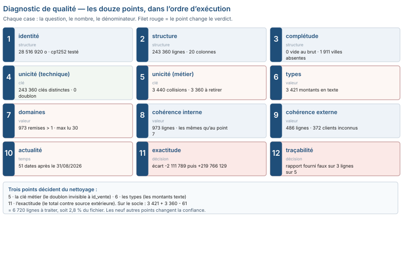

# Module M04.C01 — Le diagnostic en douze points : savoir ce qui ne va pas avant de toucher à quoi que ce soit

**Outil de ce chapitre : le tableur et un éditeur de texte, sur le socle entier (243 360 lignes). Durée indicative : 6 h. Niveau : N2.**

> **L'idée du chapitre.** Un fichier n'est pas « propre » ou « sale » : il est **connu** ou **inconnu**. Le diagnostic
> est l'heure que personne ne veut payer et que tout analyste fini paie deux fois — une fois pour établir l'état
> réel, une fois pour réparer un total qu'il croyait bon. Ce chapitre donne une grille de douze points, une durée
> (45 minutes sur un fichier jamais vu), et un livrable : la *fiche de diagnostic*. Il se termine sur une démonstration
> qui dérange : le rapport de défauts livré avec notre propre socle est faux sur quatre de ses huit lignes, parce
> qu'il a été écrit d'après l'intention et non d'après le fichier.

> **Base de travail — le socle entier, pas un extrait.** Quatre fichiers, tous lus sur disque :
> `01_socle_donnees/data/brut/ventes_brutes.csv` (28 516 920 octets, 243 360 lignes × 20 colonnes),
> `01_socle_donnees/data/brut/clients.csv` (23 912 lignes), `01_socle_donnees/data/brut/stocks_quotidiens.csv`
> (60 000 lignes), `01_socle_donnees/data/reference/verites_terrain.csv` (la cible : 240 000 lignes,
> 15 419 985 157 FCFA) — et, pour le point 12, `01_socle_donnees/data/reference/rapport_defauts.json`.
> Les chemins sont longs parce qu'ils sont réels : tout nombre de ce chapitre sort de ces fichiers, et le manuel
> les régénère à l'identique (graine `20260917`).

---

## 1. Objectifs du chapitre

À la fin de ce chapitre, vous saurez :

- **compter** avant de regarder : lignes, colonnes, clés distinctes, vides — et citer le dénominateur de chaque chiffre ;
- **classer** un défaut en six familles (complétude, unicité, validité, cohérence, exactitude, actualité) sans hésiter ;
- **exécuter** les douze points de la grille sur un fichier inconnu en moins de 45 minutes, au tableur seul ;
- **distinguer** un défaut qui dérange d'un défaut qui *change la décision* — en le chiffrant sur le total ;
- **rédiger** une fiche de diagnostic qu'un collègue peut rejouer sans vous demander aucune précision.

## 2. Pourquoi cette notion est importante

- Vous recevrez le fichier d'un autre. Pas le dictionnaire de données complet, pas la notice de fabrication, pas
  l'intention du collègue : un CSV, un export, un tableau collé dans un courriel. **Le premier acte utile est de
  le décrire, pas de le corriger.**
- Un nettoyage non diagnostiqué casse des totaux sans message. Sur notre socle, additionner la colonne des montants
  tels qu'ils arrivent rend `15 417 873 368` FCFA au lieu de `15 419 985 157` : **2 111 789 FCFA envolés, et aucune
  erreur affichée**. Le tableur a additionné ce qu'il savait additionner.
- L'inverse est vrai : « réparer » les montants texte sans traiter les lignes en trop rend `15 639 751 286` FCFA,
  soit **219 766 129 FCFA de trop**. Un défaut non vu dans le bon sens produit une erreur deux fois plus grosse que
  le défaut qu'on croyait corriger.
- Le métier appelle ça la *due diligence* sur la donnée : dans un audit, un appel d'offres, une reprise de dossier,
  c'est la pièce qui protège l'analyste. Un chiffre d'affaires contesté se défend avec une fiche de diagnostic, pas
  avec une capture d'écran.
- Enfin, le diagnostic est ce qui rend un travail **transmissible** : la fiche que vous laissez vaut plus que le
  fichier réparé que vous envoyez.

## 3. Explication simple

On ne répare pas une maison sans l'avoir inspectée, et l'inspection a un ordre : la charpente d'abord, la peinture
ensuite. Le diagnostic d'un fichier, c'est la même chose, avec une règle unique : **à chaque question, un nombre et
un dénominateur**.

Comparez deux façons de dire la même chose sur notre fichier de ventes :

| Façon de dire | Ce que le lecteur peut en faire |
|---|---|
| « la colonne des montants a des soucis de texte » | rien — il faut vous rappeler pour savoir combien |
| « 3 421 montants sur 243 360 ne sont pas des nombres (1,4 %), et ils valent 2 111 789 FCFA » | tout — il sait si c'est grave, et peut revérifier |

La première phrase est une *impression*. La seconde est une *mesure*. Douze points de mesure, exécutés dans l'ordre,
et vous savez en trois quarts d'heure ce que le fichier contient — pas ce qu'il devrait contenir.

Le dernier des douze points est le plus facile à sauter, et le plus coûteux : **le rapport de qualité que vous avez
reçu est-il mesuré, lui aussi ?** Si quelqu'un l'a écrit à la main depuis un tableau de spécifications, il décrit
une intention. Nous allons le vérifier sur notre propre socle — et il est faux sur quatre lignes.

## 4. Vocabulaire essentiel

| Français — English | Définition simple | Piège à éviter |
|---|---|---|
| **Diagnostic de qualité — Data profiling** | Décrire l'état réel d'un fichier par des compteurs, avant toute correction. | Confondre profiler et nettoyer : profiler ne change aucune cellule. |
| **Complétude — Completeness** | Une colonne est complète si chaque ligne concernée a une valeur. | Compter les vides sans dire quelles lignes sont *concernées* (une facture annulée n'a pas de date de paiement). |
| **Unicité — Uniqueness** | Une clé est unique si aucune valeur ne revient deux fois. | Croire que la clé primaire du fichier est la clé du réel : ici `id_vente` est impeccable et le doublon existe. |
| **Clé métier — Business key** | Combinaison de colonnes qui, dans le monde, identifie une ligne (ticket + produit + quantité). | L'oublier : 3 440 lignes passent entre les mailles de la clé technique. |
| **Validité — Validity** | Une valeur est valide si elle a le bon type et appartient au domaine attendu. | Valider le format et non le contenu : une date au bon format mais en 2026-12 alors que l'historique s'arrête en août. |
| **Cohérence — Consistency** | Deux expressions d'une même vérité ne se contredisent pas (`montant_ttc` = `montant_ht` + `montant_tva`). | Contrôler chaque colonne isolément et jamais les égalités entre elles. |
| **Exactitude — Accuracy** | La valeur correspond au fait réel — vérifié contre une source indépendante. | Prendre la somme du fichier pour sa propre exactitude : la vérité est dehors (ici, `verites_terrain.csv`). |
| **Actualité — Timeliness / Currency** | La donnée est à jour par rapport à la période qu'elle prétend couvrir. | Confondre « date présente » et « date plausible ». |
| **Conformité — Conformity** | La donnée respecte la règle de gestion écrite (remise en proportion, retour à montant négatif). | Ne pas avoir écrit la règle : sans texte, aucune violation n'est démontrable. |
| **Fiche de diagnostic — Data quality report** | Le document qui consigne les douze points, leurs nombres, et la décision prise pour chacun. | La rédiger après coup, de mémoire : elle ne rejoue plus. |

## 5. Cours approfondi : les douze points

Les points vont du plus structurel au plus sémantique. Pour chacun : **la question**, **la procédure**, et **la
réponse mesurée sur le socle** — parce qu'une grille sans exemple chiffré ne s'apprend pas.

### 5.1 Point 1 — L'identité du fichier : taille, horodatage, encodage

Avant d'ouvrir : combien d'octets, quelle date de modification, quel encodage. Un fichier de 28 516 920 octets ne se
diagnostique pas à l'œil ; un fichier dont l'horodatage est antérieur à la période annoncée est suspect avant même
la première ligne. L'encodage se teste, il ne se devine pas : notre fichier tarif fournisseur
(`01_socle_donnees/data/brut/tarif_fournisseur_peinture.csv`) **ne se décode pas** en UTF-8 — il échoue à l'octet 73
— et contient 95 octets hors ASCII : c'est un cp1252.

> **Définition.** Un **encodage** est la table qui associe un octet à un signe. `UTF-8` en utilise un à quatre par
> signe, `cp1252` exactement un. Lire un cp1252 comme de l'UTF-8 ne casse pas le fichier : ça remplace les accents
> par des caractères de substitution, et ça transforme « évacuation » en `évacuation` — un défaut *introduit par la
> lecture*, pas par le fichier.

### 5.2 Point 2 — La structure : lignes, colonnes, en-têtes

Le compte doit sortir du fichier, pas de son nom. Ici : **243 360 lignes de données, 20 colonnes**, dont les vingt
noms sont `id_vente, id_ticket, date_vente, heure, id_magasin, id_vendeur, id_client, id_produit, quantite,
prix_unitaire_ht, taux_remise, montant_ht, montant_tva, montant_ttc, mode_paiement, canal, est_retour, poids_kg,
mois, annee` — et trois colonnes (`mois`, `annee`, `heure`) qui ne sont que des dérivées : leur présence doit être
justifiée, sinon elles sont une source de divergence silencieuse entre l'original et le calcul.

### 5.3 Point 3 — La complétude : qui manque, sur quelles lignes

Un vide n'est un défaut que si la ligne est concernée. Sur le fichier de ventes, aucune colonne n'est vide au sens
strict. Sur le fichier clients, **1 911 lignes sur 23 912 n'ont pas de ville**. La phrase correcte n'est pas « il
manque la ville à 1 911 clients » mais « la ville est absente pour 1 911 clients sur 23 912, soit 8,0 % ; 0 ligne
de `clients.csv` n'a de téléphone absent ». Deux colonnes, deux verdicts : ici le téléphone est *systématiquement*
présent (23 912 lignes sur 23 912), l'e-mail presque jamais (absent sur 16 514 lignes).

> **Attention.** Compter les vides *après* l'import, c'est compter ce que l'outil a fabriqué. Un `0` recopié par une
> règle de remplissage automatique, une chaîne vide lue comme `NaN`, une cellule texte « N/A » : trois absences
> différentes, trois compteurs différents, un seul qui corresponde à la réalité du fichier.

### 5.4 Point 4 — L'unicité par la clé technique

`id_vente` compte 243 360 valeurs distinctes pour 243 360 lignes : **zéro doublon**. Cette ligne de la grille doit
être écrite *avec son résultat*, même quand il est bon — c'est elle qui innocente la clé, et sans elle le lecteur ne
sait pas si vous l'avez regardée.

### 5.5 Point 5 — L'unicité par la clé métier : là où le doublon se cache

Et pourtant, le fichier propre contient 240 000 lignes : **243 360 − 240 000 = 3 360 lignes** ont été retirées.
Aucune n'est un copié-collé intégral (0 ligne entièrement dupliquée), aucune ne porte un `id_vente` déjà vu. Elles se
voient seulement sur la clé du monde réel — *un même ticket, un même produit, une même quantité* : **3 440 lignes**
sont en collision sur ce triplet, et 8 453 lignes participent à une collision ticket + produit, dont 7 640 avec la
même quantité. C'est le point le plus instructif du diagnostic : **la clé primaire d'un fichier n'est pas la clé de
ce que le fichier décrit.**

| Ce qu'on a testé | Test | Résultat sur le socle |
|---|---|---|
| clé technique | `id_vente` distincts ÷ lignes | 243 360 ÷ 243 360 → 0 doublon |
| ligne intégralement identique | égalité colonne à colonne | 0 ligne |
| clé métier (ticket + produit + quantité) | collision sur le triplet | 3 440 lignes |
| écart à corriger | brut − propre | 3 360 lignes |

> **Définition.** Une **clé candidate** est un jeu de colonnes dont les valeurs identifient une ligne et une seule.
> `id_vente` en est une ; le triplet *ticket + produit + quantité* en est une autre, **incompatible** avec la
> première : quand deux clés candidates se contredisent, l'une des deux n'est pas une clé, et c'est presque toujours
> celle que le fichier fournit déjà.

> **Dans les faits.** Sur un poste de saisie, la même colonne a trois visages selon la machine : `56658` en nombre,
> `56 658` en texte à cause du séparateur de milliers, `56658 ` avec une espace venue d'un copier-coller. Le point 6
> les compte ensemble ; le C05 les traite séparément, parce qu'ils ne se réparent pas de la même main.

### 5.6 Point 6 — La validité des types, cellule par cellule

La question n'est pas « de quel type est la colonne » mais « combien de cellules tiennent leur type ». Réponse :
**3 421 montants `montant_ttc` sur 243 360 ne sont pas des nombres** ; `montant_ht`, `quantite`, `prix_unitaire_ht`
et `poids_kg` sont numériques sur 100 % des lignes. Un seul défaut de type, sur une seule colonne, sur 1,4 % des
lignes : c'est exactement le profil d'un *accident d'import*, pas d'une saisie désordonnée — et cela se traite donc
en amont (C05), pas ligne à ligne.

### 5.7 Point 7 — La validité des domaines : valeurs autorisées

Un domaine est une liste, et une liste se compare. `mode_paiement` a 5 modalités (Chèque, Créance 30 j, Espèces,
Mobile Money, Virement), `canal` en a 3 (Livraison, Magasin, Téléphone) : dans les deux cas, **aucune valeur hors
liste**. Le domaine est aussi numérique : `remise` est définie comme une *proportion* entre 0 et 1 ; or **973 lignes
portent une valeur supérieure à 1**, avec un maximum lu à 30 — ce sont des pourcentages saisis en points (30 = 30 %).
Mais attention à la conclusion hâtive : divisées par 100, ces valeurs ne réparent rien — **258 lignes**
sortiraient encore du domaine contractuel (remise maximale admise : 0,25), et les montants, eux, restent cohérents.
La colonne `taux_remise` n'est pas une proportion mal échelonnée : sur ces lignes, elle ne décrit plus le prix payé.

### 5.8 Point 8 — La cohérence interne : les égalités du fichier

Trois égalités découlent des règles de gestion publiées dans la notice du socle : `montant_ht = quantite × prix ×
(1 − remise)`, `montant_ttc = montant_ht + montant_tva`, et « une ligne marquée `est_retour = 1` a un montant
négatif ». Mesure : **973 lignes** violent la première — exactement les 973 lignes à remise aberrante —, **0** la deuxième
(la TVA rend 18 % du montant HT sur les 243 360 lignes, au franc près), et la troisième : sur 2 848 retours signalés,
2 801 ont un montant négatif et **47** n'ont pas de montant du tout (c'est le point 6 qui les a happés). Le détail
important est au § 5.7 : les 973 lignes incohérentes ont un `montant_ht` juste et une `taux_remise` faux — le défaut
ne casse donc **aucun** total, il casse uniquement les analyses de remise.

> **Définition.** Un **contrôle croisé** est une vérification qui porte sur deux colonnes au lieu d'une. Il attrape
> les défauts qu'aucun contrôle unitaire ne voit : une remise à 30 est « une valeur plausible » si on la regarde
> seule, et une impossibilité dès qu'on la multiplie par le prix.

### 5.9 Point 9 — La cohérence externe : les références qui cassent

Une clé étrangère doit pointer quelque part : **486 lignes de vente** portent un `id_client` absent du fichier
clients, sur **372 clients distincts** inconnus. C'est le point dont le coût est le plus mal estimé : 486 lignes ne
disparaissent pas, elles *disparaissent du rapprochement*. Toute jointure avec les clients perd ces lignes sans
message, et tout tableau croisé construit sur la jointure affiche un chiffre d'affaires minoré — sans que la
moitié des lignes concernées aient le moindre défaut apparent. (Le nombre de tickets distincts — 146 161 — sert ici
de contrôle d'ordre de grandeur, pas de verdict.)

> **Attention.** Un orphelin n'est pas une ligne à supprimer. Les 486 lignes concernées sont des ventes réelles ;
> ce qui manque, c'est la référence. Effacer la ligne pour réparer la jointure, c'est effacer un chiffre d'affaires.
> On crée un client « à créer », ou on rattache à un compte générique explicitement nommé — et on l'écrit dans le
> journal des transformations (C06).

### 5.10 Point 10 — L'actualité : la période annoncée contre la période trouvée

La règle du socle est écrite : l'historique court de 2023-01-01 à 2026-08-31, et l'année 2026 est *partielle*. Mesure :
la date maximale du fichier est **2026-12-06** et **51 lignes** dépassent le 31/08/2026. Cinquante lignes sur
243 360 sont invisibles à l'œil, mais suffisent à faire dire à une comparaison annuelle ce qu'elle ne doit pas dire :
« 2026 dépasse 2025 ». Le contrôle d'actualité n'est pas une question de propreté, c'est une question de **date de
coupure déclarée** — et cette date doit figurer sur la fiche.

### 5.11 Point 11 — L'exactitude : la vérité est dehors

Les dix premiers points interrogent le fichier sur lui-même. Le onzième le confronte à une source indépendante.
Ici, `verites_terrain.csv` affirme 240 000 lignes et 15 419 985 157 FCFA pour l'ensemble des ventes. Vérification,
dans l'ordre où le nettoyage la rend vraie :

| Contrôle | Valeur | Écart à la cible |
|---|---|---|
| somme naïve des `montant_ttc` du brut | 15 417 873 368 | − 2 111 789 |
| somme après réparation des textes, sans dédoublonner | 15 639 751 286 | + 219 766 129 |
| cible (`verites_terrain.csv`) | 15 419 985 157 | — |

Retenez la forme du résultat, pas les nombres : **le total n'est pas un indicateur de propreté, c'est un indicateur
d'écart**, et il ne se rétablit que si *les deux* défauts sont traités. Additionner sans réparer sous-évalue ;
réparer sans dédoublonner sur-évalue de cent fois plus. C'est la démonstration que « ça a l'air bon » ne suffit pas.

### 5.12 Point 12 — La traçabilité : et le rapport qu'on vous a donné, qui l'a mesuré ?

Le socle est livré avec un `rapport_defauts.json` — la fiche que l'équipe de production a écrite pour le
corrigé. Confrontons-la à la mesure :

| Défaut annoncé | Annoncé | Mesuré sur le fichier | Verdict |
|---|---|---|---|
| montants en texte | 3 360 | 3 421 | sous-estimé de 61 |
| dates au format mixte | 2 640 | 0 | inexistant dans ce fichier |
| lignes en double | 3 360 | 3 360 (clé métier) | juste de nombre, faux de mécanisme |
| ville manquante aux clients | 1 880 | 1 911 | sous-estimé de 31 |
| catégories de produits hétéroclites | 61 | 44 | sur-estimé de 17 |

Cinq lignes, trois erreurs, et un nombre qui tombe juste pour la mauvaise raison. La plus instructive est le 61 : il
ne compte pas des lignes à corriger, il compte le **recouvrement** de deux défauts — 61 lignes sur les 3 421 sont
aussi des lignes en trop. Un chiffre vrai, sorti d'un tableau de plan, rangé sous un mauvais libellé : exactement le
défaut qu'aucun contrôle automatique ne signale. Ce n'est pas de la négligence :
c'est ce qui arrive quand on recopie un **plan d'injection** au lieu de mesurer le fichier obtenu. Un défaut injecté
au générateur peut se trouver compensé, annulé ou étendu par le reste de la chaîne.

> **Définition.** On parle d'**intégrité référentielle** quand toute valeur d'une colonne de référence pointe une
> ligne existante de la table référencée. 486 lignes de notre fichier la violent ; comme une jointure perd
> silencieusement ce qu'elle ne retrouve pas, la violation ne se voit qu'au total, jamais à la cellule.

> **Conseil professionnel.** Notez sur la fiche de diagnostic *le nom du fichier, son empreinte de taille, la date de
> lecture, et la commande ou la formule qui a produit chaque nombre*. Un diagnostic sans mode d'emploi est une
> opinion datée ; avec, c'est une preuve rejouable — et la différence se voit le jour où l'on vous conteste un chiffre.

> **À retenir.** Les douze points ne se valent pas, et leur ordre non plus. Compter les lignes avant les vides évite
> de diviser par le mauvais dénominateur ; tester la clé technique avant la clé métier évite de conclure « propre »
> trop vite ; garder l'exactitude en avant-dernier évite de réparer dix défauts pour un total qui reste faux. Un
> ordre, c'est ce qui rend un diagnostic reproductible par quelqu'un d'autre — et rejouable six mois plus tard.

### 5.13 Les douze points, en une grille

| # | Question | Ce qu'on compte | Ici |
|---|---|---|---|
| 1 | Identité | octets, date, encodage | 28 516 920 o, cp1252 testé |
| 2 | Structure | lignes × colonnes | 243 360 × 20 |
| 3 | Complétude | vides par colonne | 0 ici ; 1 911 villes absentes (clients) |
| 4 | Unicité (technique) | distincts ÷ lignes | 243 360 ÷ 243 360 |
| 5 | Unicité (métier) | collisions sur la clé réelle | 3 440 lignes, 3 360 à retirer |
| 6 | Types | cellules hors type | 3 421 montants texte |
| 7 | Domaines | valeurs hors liste | 0 hors liste ; 973 remises > 1 |
| 8 | Cohérence interne | égalités entre colonnes | 973 violations |
| 9 | Cohérence externe | clés orphelines | 486 lignes, 372 clients |
| 10 | Actualité | bornes vs période annoncée | 51 dates hors période, max 2026-12-06 |
| 11 | Exactitude | total vs source indépendante | écart − 2 111 789 / + 219 766 129 |
| 12 | Traçabilité | le rapport reçu est-il mesuré ? | 3 lignes fausses sur 5 testées |



## 6. Exemple concret : quarante-cinq minutes sur un fichier qu'on ne connaît pas

Le contexte est celui d'un lundi matin : la direction commerciale envoie `ventes_brutes.csv`, trois ans d'historique,
sans autre commentaire que « tout est dedans ». Minutage réel d'un diagnostic complet, tableur ouvert :

| Minutes | Acte | Sortie |
|---|---|---|
| 0-3 | taille, horodatage, ouverture de la première ligne | cp1252, 28 516 920 octets, séparateur `;` ou `,` confirmé |
| 3-8 | import en forçant les types de chaque colonne | 243 360 lignes × 20 colonnes dans la feuille |
| 8-14 | comptes : lignes, clés distinctes, vides | points 2, 3, 4 |
| 14-22 | types et domaines (`NB` contre `NBVAL`, listes de valeurs) | points 6, 7 |
| 22-30 | collisions de clé métier (tableau croisé sur le triplet) | point 5 |
| 30-36 | égalités internes et jointures externes | points 8, 9 |
| 36-40 | bornes de dates, total contre source indépendante | points 10, 11 |
| 40-45 | fiche de diagnostic : douze lignes, un nombre et une décision par ligne | livrable |

Trente-six minutes dans M01-M03 s'appelaient « nettoyer ». Ici, quarante-cinq minutes ne changent **aucune cellule** :
à la fin, le fichier est identique et vous êtes capable de dire ce qui ne va pas, de combien, et ce que ça coûte sur
le total. C'est le renversement que ce module attend de vous.

## 7. Démonstration pas à pas : produire la fiche sur le fichier de ventes

On écrit les douze contrôles comme formules de tableur, sur la feuille `Ventes` (243 360 lignes, sous la limite de
`1 048 576` lignes d'une feuille — si votre fichier dépasse la limite, voir § 5.1 et le point 1 : c'est déjà une
information de diagnostic, et M05 est là pour ça).

1. **Feuille de contrôle.** Une feuille `DIAGNOSTIC`, trois colonnes : *point*, *nombre*, *décision*. Douze lignes.
2. **Structure.** `=NBVAL(Ventes!A:A)-1` → 243 360 lignes de données ; `=NBVAL(Ventes!$A$1:$T$1)` → 20 colonnes.
3. **Complétude, par colonne.** `=NBVAL(Ventes!N2:N243361)-NB(Ventes!N2:N243361)` : *cellules remplies* moins
   *cellules comptées comme nombres* ; sur `montant_ttc` (colonne N), la soustraction rend 3 421. Consignez le
   dénominateur à côté : sans lui, le nombre ne dit rien à un repreneur.
4. **Unicité technique.** `=SOMMEPROD(1/NB.SI(Ventes!A:A;Ventes!A2:A243361))` rend le nombre de valeurs distinctes
   d'`id_vente` : 243 360. Si `NBVAL` de la colonne égale ce nombre, la clé tient.
5. **Unicité métier.** Colonne utilitaire `=Ventes!B2&"|"&Ventes!H2&"|"&Ventes!I2` (ticket | produit | quantité),
   puis `=NB.SI(utilitaire;utilitaire)` compté en colonne 2 : les lignes où le compte dépasse 1 sont les 3 440
   collisions. Un tableau croisé sur cette colonne (valeur : *nombre d'articles*) donne la même réponse en dix
   secondes, et c'est la voie que je recommande — le `SOMMEPROD` est là pour qu'on ne dépende pas du croisé.
6. **Types.** `=NB(Ventes!N2:N243361)` contre `=NBVAL(…)` : `239 939` contre 243 360. L'écart est le nombre de textes.
7. **Domaines.** Sur `taux_remise` : `=NB.SI.ENS(Ventes!K2:K243361;">1")` → 973. Sur les colonnes déclaratives, un
   tri à valeurs uniques confronte la liste obtenue à la liste attendue (5, puis 3 modalités).
8. **Cohérence interne.** Colonne utilitaire `=ARRONDI(Ventes!I2*Ventes!J2*(1-Ventes!K2);0)` et `=SI(ABS(…-Ventes!L2)>1;1;0)`
   sommée → 973. La *même* population que le point 7 : c'est la preuve que les deux défauts n'en font qu'un.
9. **Cohérence externe.** `=ESTNUM(RECHERCHEX(Ventes!G2;clients!A:A;clients!A:A;"absent"))` recopiée, puis comptée :
   486 lignes, 372 `id_client` distincts en erreur.
10. **Actualité.** `=MAX(Ventes!C2:C243361)` et `=NB.SI(Ventes!C2:C243361;">"&DATE(2026;8;31))` → 2026-12-06, 51.
11. **Exactitude.** `=SOMME(Ventes!N2:N243361)` → 15 417 873 368, contre la cible 15 419 985 157 : l'écart se reporte
    en clair dans la colonne *décision*, avec le signe.
12. **Traçabilité.** Une cellule, une phrase : « valeurs mesurées le [date] sur [fichier], par les formules de cette
    feuille ; source de comparaison : [fichier ou personne] ».

> **Boîte à outils du chapitre.** Les douze points tiennent dans une feuille-modèle : *point*, *formule*, *nombre*,
> *dénominateur*, *décision*, *date de lecture*. Cette dernière colonne est celle qui fait la différence entre un
> document et une preuve : elle permet de dire, un mois plus tard, si la mesure a été faite avant ou après le
> fichier que vous avez reçu.

## 8. Erreurs fréquentes

| Symptôme visible | Cause réelle | Correction |
|---|---|---|
| « Le fichier est propre, `id_vente` n'a aucun doublon » | seule la clé technique a été testée | ajouter le point 5 : collisions sur la clé métier (3 440 lignes ici) |
| Le total obtenu après nettoyage dépasse la cible | un défaut traité en a révélé un autre (les textes réparés sans retirer les doublons) | ne jamais valider un nettoyage sur un seul écart : contrôler *les deux* signes, et la cible |
| Le rapport de défauts fourni ne correspond pas au fichier | il a été écrit depuis un plan, pas depuis une mesure | le traiter comme une hypothèse : le point 12 teste le rapport, pas seulement le fichier |
| Les pourcentages de vide varient d'une lecture à l'autre | les vides dépendent de l'import (0 remplacé, `NaN` fabriqué) | compter sur le fichier texte, avant import, puis comparer avec le compte après import |
| Un tri « à la main » sur la colonne des dates fait disparaître 51 lignes | elles étaient invalides pour l'outil mais lisibles | la date se contrôle par `NB` sur la colonne, pas par l'œil : point 6 |
| Le diagnostic est fini « en dix minutes » | six des douze points ont été faits d'intuition | la fiche impose une ligne par point, même vide : un point non mesuré se voit |

## 9. Bonnes pratiques professionnelles

- **Une ligne de fiche par point, sans exception.** Un point qui ne trouve rien s'écrit « 0 sur 243 360 » — c'est un
  résultat, et c'est le seul moyen de prouver que vous l'avez cherché.
- **Toujours le dénominateur.** « 973 » ne veut rien dire ; « 973 sur 243 360 » veut dire tout.
- **Compter avant d'importer, revérifier après.** Deux compteurs, une différence : c'est l'import qui a menti, pas vous.
- **Ne jamais réparer pendant le diagnostic.** La fiche est signée sur le fichier tel quel ; la réparation s'écrit
  dans un journal séparé (C06), avec l'avant et l'après.
- **Écrire la règle de gestion à côté du contrôle.** « remise ∈ [0 ; 1] » doit être une phrase d'un document, sinon
  personne ne peut vous reprocher d'avoir signalé 973 lignes — ni vous défendre de les avoir ignorées.

> **Attention.** Un contrôle croisé est la première victime d'un changement de règle de gestion : la TVA passe de
> 18 % à 20 %, l'égalité est restée écrite avec l'ancien taux quelque part, et le contrôle se met à hurler sur des
> lignes parfaitement saines. La règle vit dans le dictionnaire (C06), la formule l'applique — jamais l'inverse.
- **Conserver le fichier de départ, en lecture seule.** Un diagnostic rejouable suppose que la source n'a pas bougé.
- **Faire relire la fiche par quelqu'un qui n'a pas le fichier.** S'il ne peut pas retrouver ne serait-ce qu'un
  nombre, la fiche est mauvaise — c'est le seul test d'utilité qui compte.

## 10. Exercice guidé — le trio qui décide du verdict (30 min, /10)

On traite ensemble les trois points qui, sur ce fichier, changent la conclusion. Vous faites, je corrige au fil de
l'eau ; chaque étape finit par un nombre à reporter sur la fiche.

**Étape 1.** Combien de lignes de vente portent un montant texte ? `NBVAL(N2:N243361) − NB(N2:N243361)` →
**3 421**. *Si vous trouvez 3 360, vous avez lu le rapport fourni au lieu du fichier — retournez au § 5.12, c'est
exactement l'erreur visée.*

**Étape 2.** Combien de lignes doit-on retirer pour rejoindre le fichier propre ? 243 360 − 240 000 → **3 360**.
*Notez que ce n'est pas le même nombre, et qu'il n'y a aucun paradoxe : un défaut de type, un défaut de doublon.*

**Étape 3.** Les deux défauts se recouvrent-ils ? Comptez les lignes qui sont *à la fois* en texte sur le montant et
absentes du fichier propre → **61 lignes**. C'est peu, et c'est le chiffre qui décide de l'ordre des opérations : ces
61 lignes doivent passer par la réparation de type *avant* le dédoublonnage, sinon on retire l'une des deux et on
laisse l'autre avec un montant vide — le total ne se réconcilie plus, et plus rien ne se prouve ligne à ligne.

**Étape 4.** Vérifiez l'addition : 3 421 + 3 360 − 61 = **6 720** lignes concernées par au moins un des deux défauts,
soit 2,8 % du fichier. *Écrivez cette ligne dans la fiche : c'est le périmètre du nettoyage, et il vous évitera
d'annoncer « 3 421 lignes à corriger » à un lecteur qui en trouvera 6 720.*

**Étape 5.** Décision. Les 6 720 lignes valent 2 111 789 FCFA côté texte et 219 766 129 FCFA côté doublons.
Reportez la décision : *réparer les textes par `montant_ht + montant_tva`, puis dédoublonner sur la clé métier, puis
recontrôler contre `verites_terrain.csv`*. **Note /10** : 2 points par nombre juste et situé (point, formule,
dénominateur), 2 points pour le recouvrement des 61 lignes, 4 points pour la décision. Un nombre sans dénominateur
vaut zéro.

## 11. Exercices autonomes

**Exercice 1.1 (★) — Le trio structurel (8 min).** Refaites les points 2, 4 et 6 sur `clients.csv` (23 912 lignes) et écrivez les trois
lignes de fiche. Quel est le seul point de la grille qui, ici, n'a pas de réponse nulle ?

**Exercice 1.2 (★★) — La clé de dédoublonnage (12 min).** Le point 5, appliqué aux clients : comptez les lignes en trop si la clé candidate est
*le nom normalisé* (lettres minuscules, sans accent ni espace) ; comptez-les si elle est *nom normalisé + seuls
chiffres du téléphone*. Donnez les deux nombres et expliquez lequel est utilisable.

**Exercice 1.3 (★★) — Le seuil qui ne contrôle rien (15 min).** Les stocks : sur les 60 000 lignes de `stocks_quotidiens.csv`, comptez les quantités
physiques négatives, les lignes sous le seuil d'alerte, et l'écart théorique − physique maximal. Les deux premiers
nombres sont identiques — que faut-il en conclure sur la qualité de la colonne `seuil_alerte` ?

**Exercice 1.4 (★★) — Trois nombres pour un fichier (12 min).** Le tarif fournisseur : donnez les trois nombres qui, à eux seuls, décrivent ce fichier
en un paragraphe (lignes de bruit avant l'en-tête, lignes de données, prix dont le séparateur décimal n'est pas un
point) et indiquez lequel se corrige à la lecture, lequel à l'écriture.

**Exercice 1.5 (★★★) — Rendre un contrôle rejouable (20 min).** Le point 12, retourné : écrivez la ligne de fiche qui aurait attrapé l'erreur des
*dates au format mixte* (2 640 annoncées) sans ouvrir le fichier d'à côté — c'est-à-dire en rendant la formule
rejouable. Vous ajouterez aussi la ligne qui aurait évité l'erreur sur les catégories de produits (61 annoncées, 44
mesurées) : celle qui oblige à citer **la liste attendue** avec son nombre de modalités.

## 12. Correction détaillée

**Exercice 1.1.** Point 2 : 23 912 lignes × 12 colonnes. Point 4 : 23 912 `id_client` distincts → 0 doublon technique.
Point 6 : le téléphone est numérique-comme-texte partout, la ville absente sur **1 911** lignes, l'e-mail sur
**16 514**. Le seul point non nul est le point 3 (complétude) — et c'est aussi le seul qui ne concerne pas le
fichier de ventes. *Résultat intermédiaire à vérifier : 1 911 + 22 001 = 23 912.*

**Exercice 1.2.** Sur le nom normalisé seul, 23 912 − 12 342 = **11 570** lignes « en trop » : la règle est inutilisable,
elle fusionnerait des clients réellement distincts (le jeu contient des noms génériques comme `Menage 00002`). Sur
*nom normalisé + chiffres du téléphone*, l'excédent tombe à **412** — exactement le nombre de lignes retirées pour
passer de 23 912 à 23 500 dans le fichier propre. Conclusion à écrire : **une clé de dédoublonnage se valide contre
le résultat attendu, pas contre son élégance** ; et le téléphone est ce qui rend la clé utilisable, parce que son
*écriture* varie d'une ligne à l'autre (le jumeau a perdu ses espaces) alors que ses *chiffres* restent ceux du
client — le nom `SARL K`, lui, est porté par 75 lignes du fichier.

**Exercice 1.3.** 1 800 lignes à quantité physique négative, 1 800 lignes sous le seuil d'alerte, écart maximal 532 unités.
Les deux compteurs coïncident : la règle croisée est un identique — *toute* ligne négative est sous le seuil. On en
conclut que `seuil_alerte` ne discrimine pas (il ne peut pas, si le signe suffit à déclencher) : le contrôle utile
n'est donc pas « quantité < seuil » mais « quantité < 0 » d'une part, « écart |théorique − physique| > seuil »
d'autre part. C'est l'exemple type du point 8 : une formule juste sur une donnée fausse produit un alarme permanent,
et une alarme permanente ne contrôle rien.

**Exercice 1.4.** Trois nombres : **3** lignes de bruit avant l'en-tête (« export genere depuis… », la date d'édition, le nom
du fournisseur), **38** lignes de données, **38** prix sur 38 écrits avec une virgule décimale. Le bruit se corrige
à la lecture (forcer la ligne d'en-tête, ou supprimer les trois lignes dans le fichier d'origine — pas dans la
feuille de travail) ; la virgule se corrige à l'écriture, c'est-à-dire dans le paramètre régional de l'import, sinon
le nombre lu est 2 900 au lieu de 2 900,57 et la colonne entière devient du texte. Ajoutez le quatrième, qui n'était
pas demandé et qui gêne davantage : **1** seule valeur de `conditionnement` pour 38 lignes — une colonne déclarative
qui n'a qu'une modalité est une colonne qui ne dit rien.

**Exercice 1.5.** Pour les dates : la ligne de fiche doit contenir la *formule*, la *colonne* et le *fichier* — « `=NB.SI(date_vente;">"&DATE(2026;8;31))` = 51, mesuré le [date] sur `ventes_brutes.csv` » — de sorte que le relecteur qui refait le calcul trouve 51 et puisse écrire *0* s'il les trouve. Un contrôle non rejouable ne peut pas être contredit, donc ne prouve rien. Pour les catégories : la ligne attendue est « catégories hors des 7 de la liste de référence : 44 sur 154 références, liste attendue jointe en `DIAGNOSTIC!A20:A26` » — c'est-à-dire que **le domaine doit être dans la fiche**, sinon le chiffre de 61 (celui du plan) et celui de 44 (celui du fichier) se valent aux yeux du lecteur, et le seul qui compte disparaît.

## 13. Mini-projet M04.P1 — « La fiche de diagnostic du fichier reçu ce matin » (45 min)

Livrable unique : `diagnostic_ventes_brutes.md`, une fiche de douze lignes plus un entête. Contraintes, qui sont
celles du métier :

- la fiche tient sur **une page** et commence par l'identité du fichier (nom, octets, date de lecture) ;
- chaque ligne des douze points porte : le nombre, le dénominateur, la formule ou l'outil, et **une décision**
  (ignorer / surveiller / corriger avant tout calcul) ;
- deux lignes au moins doivent contredire le `rapport_defauts.json` fourni, avec la preuve par la mesure, et le
  périmètre du nettoyage est écrit en **union** (6 720 lignes), jamais en addition des deux défauts ;
- la dernière ligne est le verdict : *peut-on calculer un chiffre d'affaires sur ce fichier en l'état ?* — répondue
  par le nombre, pas par l'adjectif.

**Barème (10 points).** Douze lignes complètes et datées (3) · dénominateurs systématiques (2) · recouvrement
des 61 lignes chiffré et exploité (2) · deux contradictions du rapport fourni, preuves à l'appui (2) · verdict
exprimé en FCFA et non en adjectif (1). Seuil de validation : 7. Le corrigé type est la fiche que le § 7 a produite,
complétée des points 9 à 12 ; la mienne se rejoue en 45 minutes sur le fichier, et c'est le critère.

## 14. Résumé du chapitre

```
        IDENTITÉ          STRUCTURE         COMPLÉTUDE        UNICITÉ (2 tests)
     octets · encodage   lignes × colonnes  vides / colonne   clé technique, puis clé métier
            │                   │                  │                   │
            └───────────────────┴──────────────────┴───────────────────┘
                                    ↓
              VALIDITÉ (types, domaines) → COHÉRENCE (internes, externes)
                                    ↓
                       ACTUALITÉ (bornes annoncées vs trouvées)
                                    ↓
                  EXACTITUDE : le total contre une source extérieure
                                    ↓
                  TRAÇABILITÉ : le rapport qu'on vous a donné est-il mesuré ?
```

Douze questions, douze nombres, douze décisions. Trois d'entre elles décident du verdict sur le socle — les types
(3 421), la clé métier (3 440 collisions, 3 360 à retirer), l'exactitude (l'écart de 2 111 789 FCFA) — et leur
recoupement fait le périmètre réel du nettoyage : 6 720 lignes — et une
dernière vous protège : celle qui vous fait douter du document censé vous rassurer. Un diagnostic utile ne dit pas
que le fichier est sale ; il dit ce qui est cassé, de combien, et ce que ça coûte au chiffre que vous allez publier.

## 15. À retenir

> **À retenir.**
> ★ **La clé du fichier n'est pas la clé du réel.** 243 360 `id_vente` tous distincts, et 3 440 lignes en collision
> sur ticket + produit + quantité : le doublon ne se voit que si on le cherche sur la bonne clé.
> ★ **Un défaut non traité peut s'annuler avec un autre, un défaut mal traité s'aggrave.** Réparer les textes sans
> dédoublonner ajoute 219 766 129 FCFA ; ne rien faire en perd 2 111 789. Le total est un contrôle, pas un verdict.
> ★ **Tout nombre avec son dénominateur.** 973 ne veut rien dire ; 973 sur 243 360 veut dire : une ligne mille,
> sauf là où ça compte.
> ★ **Le diagnostic ne change aucune cellule.** Il se signe sur le fichier tel quel ; la réparation s'écrit ailleurs,
> avec l'avant et l'après (C06).
> ★ **Le document de qualité qu'on vous remet est une hypothèse.** Trois de ses cinq lignes testées ne collaient
> pas au fichier — et personne n'avait tort : personne n'avait mesuré.

## 16. Évaluation formative (auto-correction, 8 min)

**Q1.** Un fichier a 243 360 valeurs distinctes sur sa colonne d'identifiant. Peut-on écrire « aucune ligne en
trop » ? (a) oui ; (b) non, on ne le sait pas ; (c) oui si le total des montants est cohérent.
→ **(b).** L'unicité de la clé technique ne dit rien de la clé métier : c'est le § 5.5, 3 440 collisions avec une
clé impeccable sur 243 360 lignes.

**Q2.** Le total d'une colonne de montants rend moins que la source indépendante. Combien de causes au minimum ?
(a) 1 ; (b) 2 ; (c) autant qu'il y a de colonnes.
→ **(b) au minimum** — des valeurs que l'outil n'a pas su additionner, ou des lignes en trop ailleurs dans le
fichier. Les deux agissent en sens contraire, et c'est ce qui rend l'écart seul peu informatif.

**Q3.** Quelle formule distingue une colonne entièrement numérique d'une colonne contenant du texte ?
→ `NB(colonne)` contre `NBVAL(colonne)` : l'égalité dit « tout est nombre », la différence donne le nombre de
textes. Ici `239 939` contre 243 360.

**Q4.** Vrai ou faux : « un contrôle de date au format `AAAA-MM-JJ` suffit à valider l'actualité d'un fichier ».
→ **Faux.** 0 date mal formatée ici, et 51 lignes postérieures à la borne annoncée (max 2026-12-06). Le format est
un contrôle de validité (point 6), la borne est un contrôle d'actualité (point 10).

**Q5.** Vous devez prouver qu'un nettoyage n'a pas cassé le chiffre d'affaires. Quelle est la moindre des preuves ?
→ un **rapprochement de totaux** avec le détail des écarts : avant, après, cible, et le nom de la source de la
cible ; plus la liste des lignes retirées, comptée. Le § 5.11 montre pourquoi le « après » seul ne prouve rien.

**Question ouverte (la plus importante).** Reprenez les trois lignes du § 5.12 où l'annoncé et le mesuré diffèrent,
et écrivez, pour chacune, la phrase que vous auriez mise dans la fiche pour que l'écart soit *visible sans vous
relire*. C'est exactement le travail du chapitre : rendre l'écart lisible par quelqu'un d'autre. Corrigé attendu :
une phrase par défaut, avec le nombre des deux côtés, la source du nombre annoncé, et la formule qui a produit
celui du fichier — trois éléments, pas un adjectif.
