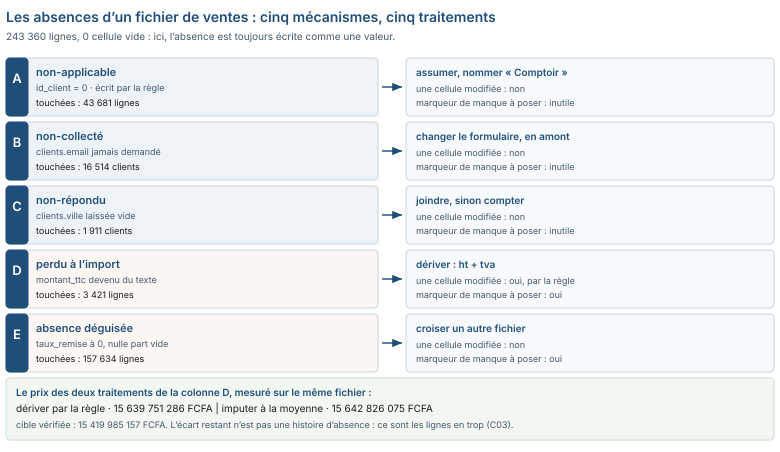

# Module M04.C02 — Les absences : cinq mécanismes, cinq traitements, et le coût de chaque choix

**Outil de ce chapitre : le tableur, sur `ventes_brutes.csv` et `clients.csv`. Durée indicative : 5 h. Niveau : N2.**

> **L'idée du chapitre.** Vous allez ouvrir un fichier de 243 360 lignes et 20 colonnes et y chercher des cellules
> vides. Vous n'en trouverez **aucune** : zéro, sur `4 867 200` cellules. Ce fichier est pourtant plein d'absences —
> 43 681 lignes sans client, 16 514 clients sans e-mail, 3 421 montants sans montant, 47 retours sans montant
> d'aucune sorte. L'absence n'est pas un état de la cellule : c'est une **décision d'écriture**, prise par quelqu'un,
> quelque part, avec une convention que vous devez retrouver avant de choisir un traitement. Cinq mécanismes
> produisent une absence ; cinq traitements existent ; et le chapitre se termine par le prix de chacun, en francs.

> **Base de travail.** `01_socle_donnees/data/brut/ventes_brutes.csv` (243 360 lignes × 20 colonnes),
> `01_socle_donnees/data/brut/clients.csv` (23 912 lignes × 11 colonnes),
> `01_socle_donnees/data/brut/stocks_quotidiens.csv` (60 000 lignes),
> `01_socle_donnees/data/reference/ventes_propres.csv` et sa cible `verites_terrain.csv` (15 419 985 157 FCFA).
> Les nombres du chapitre viennent de ces fichiers, relevés par `01_socle_donnees/scripts/chiffres_manuel.py`.

---

## 1. Objectifs du chapitre

À la fin de ce chapitre, vous saurez :

- **distinguer** les cinq mécanismes qui produisent une valeur absente, et dire lequel s'applique à une colonne donnée ;
- **reconnaître** les conventions qui *cachent* une absence (le `0`, le tiret, la chaîne vide, la ligne absente) ;
- **choisir** entre les cinq traitements — assumer, joindre, dériver, imputer, supprimer — et l'écrire en décision chiffrée ;
- **mesurer** le coût d'une politique d'absence sur le total, avant de l'appliquer ;
- **refuser** l'imputation automatique sur toute colonne qui porte une décision de gestion, et le justifier par un nombre.

## 2. Pourquoi cette notion est importante

- La colonne `id_client` vaut `0` sur **43 681 lignes** du fichier de ventes, soit **17,9 %**. Si vous traitez ce `0`
  comme une valeur, votre premier client est trois chiffres ; si vous le traitez comme un manque et que vous jetez la
  ligne, vous perdez **2 813 668 030 FCFA** de chiffre d'affaires pour une raison qui n'existe pas : c'est la vente
  au comptoir, et la règle de gestion du socle l'écrit noir sur blanc.
- Chez les clients, l'e-mail est renseigné pour **7 398 lignes sur 23 912**, soit **30,9 %**. Une campagne envoyée à
  « tous les clients » toucherait un client sur trois ; une campagne construite *après* avoir supprimé les lignes
  sans e-mail toucherait un client sur trois **en croyant viser toute la base**. C'est la même erreur, avec un
  dénominateur différent, et c'est la plus coûteuse à détecter après coup.
- Les montants : 3 421 lignes n'ont pas de nombre. Les combler à la moyenne donne un total de 15 642 826 075 FCFA,
  soit 222 840 918 FCFA de plus que la vérité. Les reconstituer par la règle de gestion (`montant_ht + montant_tva`)
  donne 15 639 751 286 FCFA, trop gros *pour une autre raison* que C01 avait déjà vue : les lignes en trop. Deux
  façons de « traiter les vides », trois ordres de grandeur d'erreur, et une seule qui se corrige en ajoutant un
  point de la grille.
- Enfin, une absence est parfois une **bonne nouvelle** : ces 16 514 e-mails absents sont exactement ce qu'il faut
  pour publier un fichier d'exercice sans exposer une personne. Le C06 y revient, et l'ordre des idées compte : on ne
  supprime pas une colonne par principe, on décide après avoir compté.

## 3. Explication simple

Un dossier médical ne dit pas « inconnu » de la même façon selon le cas. Le patient n'a pas de groupe sanguin
*parce qu'on ne l'a pas demandé* ; il n'a pas de traitement en cours *parce qu'il n'en prend pas* ; il n'a pas de
numéro de sécurité sociale *parce qu'il l'a oublié*. Les trois cases sont vides, et ne se traitent pas de la même main.

Une base de données, c'est la même chose, avec un danger de plus : **l'outil ne fait pas la différence**. Pour lui,
une case vide, un `0`, une case remplie de `N/A` et une ligne qui n'existe pas sont quatre états distincts, mais
aucun ne s'appelle « je ne sais pas ». Le tri par date, la moyenne, la jointure : tous traiteront ces quatre états
comme quatre présences.

Retenez une phrase, elle vous sauvera des semaines : **`0` n'est jamais « rien » ; `0` est une valeur que quelqu'un a
écrite.** Et « rien », dans un fichier, ça peut aussi être une ligne absente — la plus difficile des absences à
trouver, parce qu'elle ne se voit que par le décompte des attendus : les 486 lignes de vente sans client référencé
(point 9 de la grille) sont de celles-là.

## 4. Vocabulaire essentiel

| Français — English | Définition simple | Piège à éviter |
|---|---|---|
| **Valeur manquante — Missing value** | Ce qui, dans le monde, existe mais n'est pas dans le fichier. | Confondre l'absence de valeur et l'absence d'objet. |
| **Non applicable — Not applicable** | Le champ n'a pas de sens pour cette ligne (le comptoir n'a pas de client). | Le combler : on invente un client pour une vente qui n'en a pas. |
| **Valeur de sentiment — Sentinel value** | Un code écrit pour dire « pas de valeur » : `-1`, `9999`, `N/A`, `inconnu`. | L'oublier dans le paramétrage de l'import : `-1` entre dans la moyenne. |
| **Mécanisme d'absence — Missing mechanism** | La raison pour laquelle la valeur manque : non-collectée, non-répondue, perdue, non-applicable, déguisée. | Traiter sans savoir lequel : les cinq n'ont pas le même remède. |
| **Imputation — Imputation** | Remplacer une absence par une valeur estimée (constante, médiane par groupe, cas semblable, modèle). | L'appliquer à une colonne qui porte une décision, ou sans le dire. |
| **Perte par jointure — Join-induced loss** | Perte de lignes causée par une jointure intérieure sur une clé absente. | Compter les lignes *après* la jointure pour juger du nettoyage. |
| **Marqueur de manque — Missing indicator** | Colonne booléenne qui garde la trace : « cette valeur était absente ». | Oublier de le créer quand on impute : « on ne savait pas » est alors perdu. |
| **Politique de valeurs manquantes — Missing data policy** | Le texte qui dit, colonne par colonne, ce qu'une absence veut dire et comment on la traite. | Ne pas l'écrire : chaque repreneur décide pour soi, et les totaux divergent. |

## 5. Cours approfondi : les cinq mécanismes, les cinq traitements

### 5.1 Mécanisme A — Le non-applicable : la valeur n'existe pas à l'état civil

La vente au comptoir n'a pas de client. Ce n'est pas une donnée perdue, c'est une **absence de l'objet**. Le fichier
l'écrit `0` dans `id_client`, sur 43 681 lignes. Le traitement utile n'est ni de l'effacer ni de le combler : c'est
de **nommer** le compte. Dans un modèle, on crée une ligne « Comptoir » dans la table clients (le C06 montre
l'écriture de cette ligne de convention) ; dans un tableau croisé, on remplace l'affichage du `0` par un libellé.

> **Définition.** Une **convention de codage** est un choix d'écriture, arbitraire mais *écrit*, qui donne à une
> absence un signe visible : `0`, `-1`, la chaîne vide, un enregistrement dédié. Un `0` sans texte pour le décrire
> n'est pas une convention, c'est une coïncidence — et une coïncidence se dément à la première reprise de fichier.

### 5.2 Mécanisme B — Le non-collecté : on n'a jamais posé la question

L'e-mail des clients : renseigné pour 7 398 sur 23 912. Personne n'a perdu ces adresses, elles n'ont jamais été
demandées au guichet. C'est le seul des cinq mécanismes qui se corrige **en amont**, par un formulaire ou une habitude
de caisse, et jamais en aval par un calcul. Un analyste qui comble un non-collecté fabrique une liste de relance
adressée à des inconnus.

### 5.3 Mécanisme C — Le non-répondu : la question a été posée, la réponse non

La ville manque pour 1 911 clients sur 23 912 (8,0 %). Contrairement au cas précédent, le fait existe — le client est
quelque part — et il est parfois récupérable ailleurs : une ville dans un autre champ, une région renseignée, le
code postal d'une adresse de livraison. **Joindre**, voilà le traitement propre du non-répondu ; le remplissage par
la ville majoritaire en est le traitement sale, et il s'appelle une décision commerciale, pas une donnée.

### 5.4 Mécanisme D — La perte à l'import ou à la conversion

C'est le mécanisme que le fichier de ventes contient le plus : 3 421 lignes où `montant_ttc` n'est pas un nombre,
47 lignes de retour sans montant exploitable, et, dans le fichier reçu en M01, 13 colonnes là où le brut en a 20.
Rien n'a été décidé par un humain : la valeur a été **abîmée en route** — une virgule décimale, un séparateur de
milliers, un encodage, une colonne que l'export n'emporte pas. Le remède n'est pas un remplissage mais une
**reconstruction par la règle** : le socle écrit que `montant_ttc = montant_ht + montant_tva`, donc un montant perdu
se reconstitue ; il ne s'impute pas.

> **Dans les faits.** Les trois quarts des « données manquantes » d'un export ERP ne sont pas manquantes : elles sont
> *mal lues*. Le réflexe qui fait gagner des heures est de rouvrir le même fichier avec le séparateur et l'encodage
> corrigés, et de comparer les compteurs avant de parler de nettoyage. Le point 1 de la grille (identité du fichier)
> n'est pas une formalité : c'est lui qui évite de nettoyer un défaut de lecture.

### 5.5 Mécanisme E — L'absence déguisée en valeur tranquille

Le plus discret. `taux_remise` vaut 0 sur **157 634 lignes**, soit 64,8 % du fichier. Est-ce « pas de remise » ou
« on n'a pas saisi la remise » ? Le fichier seul ne répond pas. Répondre, c'est croiser : si la remise vaut 0 alors
que le client a une remise consentie consignée dans `remises_manuelles.xlsx` (18 200 lignes, 2 043 692 000 FCFA), le
0 est un mensonge de saisie sur *ces* lignes-là. C'est le seul mécanisme dont le diagnostic passe par un
**rapprochement entre deux fichiers**, et non par une formule dans une colonne.

> **Attention.** Toute valeur « tranquille » — le 0 de la remise, la date du 01/01/1900, le `-1` d'un code magasin,
> le texte `inconnu` — est candidate à l'absence déguisée. Le test est simple : demandez-vous ce que deviennent une
> moyenne, une somme et un tri si cette valeur est comprise comme ce qu'elle n'est pas. Si la réponse est « rien de
> grave », vous n'avez pas encore regardé la colonne des montants.

### 5.6 Traitements (1/2) : assumer, joindre

**Assumer** (le cas A, parfois B) : on garde la ligne, on renomme la valeur, on écrit la convention. Coût : zéro
cellule modifiée. Gain : le total reste le total. C'est le traitement à préférer chaque fois qu'il est vrai, et le
seul qui ne demande aucune autorisation.

**Joindre** (le cas C, parfois D) : aller chercher la valeur ailleurs dans le système, *sans jamais la recopier à la
main* — la ville depuis une adresse de livraison, la catégorie depuis `dictionnaire_produits.csv`, le taux de TVA
depuis la fiche produit. La jointure a un prix connu : elle perd les lignes sans correspondance, ici 486 lignes. On
compte donc **avant et après**, et l'écart s'écrit dans le journal (C06).

> **Définition.** Une **jointure externe** (à gauche, à droite, pleine) conserve les lignes sans correspondance en
> laissant le champ complémentaire vide ; une jointure **intérieure** les supprime. Sur ce fichier, la différence
> entre les deux s'appelle 486 lignes : la jointure intérieure est le trou de mémoire le plus courant du nettoyage,
> et le seul qui se masque derrière un total qui a simplement « un peu baissé ».

### 5.7 Traitements (2/2) : dériver, imputer, supprimer

**Dériver** (le cas D) : recalculer ce que la règle de gestion autorise à recalculer. `montant_ttc = montant_ht +
montant_tva` rend un nombre sur les 3 421 lignes. Vérification : sur le fichier réparé *sans* toucher aux doublons,
le total donne 15 639 751 286 FCFA contre 15 419 985 157 FCFA attendus. La dérivation est bonne, et le reliquat
d'écart est la preuve qu'il subsiste un défaut **d'une autre nature** — ce qui est un résultat, pas un échec.

> **Définition.** **Imputer par le cas le plus semblable** (*hot-deck*, ou *k plus proches voisins*) consiste à
> emprunter la valeur d'une ligne qui ressemble fort à celle qui manque : même produit, même magasin, même mois,
> même type de client. C'est la seule imputation qui se défende sur une colonne monétaire — et encore : elle se
> justifie par la ressemblance des lignes, jamais par la commodité de l'outil.

**Imputer** : remplacer par une valeur estimée. Quatre familles, du plus prudent au plus risqué : la constante
documentée, la médiane par groupe (le prix médian *du produit*, pas du fichier entier), la valeur du cas le plus
semblable (même client, même mois, même catégorie), le modèle (régression — M08). Règle absolue : **on n'impute pas
une colonne qui porte une décision de gestion**, et on crée le marqueur qui dit que la valeur est estimée. Le prix,
mesuré : 15 642 826 075 FCFA contre 15 639 751 286 FCFA, soit `3 074 789` FCFA de plus, pour 1,4 % des lignes.

**Supprimer** : retirer les lignes. Uniquement si la ligne est inutilisable pour l'analyse — ligne vide, test,
doublon confirmé (C03). La suppression se chiffre : « 6 720 lignes sur 243 360, soit 2,8 % du fichier,
2 111 789 FCFA d'un côté et 219 766 129 FCFA de l'autre » n'est pas une suppression, c'est un arbitrage.

> **Définition.** Un **marqueur de manque** est une colonne ajoutée, en général booléenne, qui surviv à la
> réparation : `ttc_reconstitue = VRAI` sur les 3 421 lignes. Elle coûte une formule et rend possible la seule
> question qui fâche six mois plus tard : « ce chiffre, il vient du magasin ou de mon calcul ? »

### 5.8 Les cinq mécanismes et leurs chiffres, en une grille

| Mécanisme | Marqueur dans le fichier | Colonne touchée ici | Nombre | Traitement qui convient |
|---|---|---|---|---|
| A · non-applicable | `id_client = 0`, écrit par la règle | `id_client` | 43 681 lignes | assumer : compte « Comptoir » |
| B · non-collecté | chaîne vide, jamais demandé | `clients.email` | 16 514 clients | assumer, et changer le formulaire |
| C · non-répondu | chaîne vide | `clients.ville` | 1 911 clients | joindre, sinon compter |
| D · perdu à l'import | texte au lieu d'un nombre | `montant_ttc` | 3 421 lignes | dériver par la règle |
| E · absence déguisée | une valeur tranquille | `taux_remise` | 157 634 lignes | croiser avec un autre fichier |

> **Attention.** Les compteurs de cette grille se lisent *avec* la colonne « traitement qui convient », jamais
> seuls. Le même nombre de lignes — 43 681 — appelle à supprimer si on lit « vides » et à assumer si on lit
> « convention écrite par la règle ». Un chiffre de qualité sans mécanisme est une invitation à la mauvaise
> opération, faite de bonne foi.

Une sixième ligne mériterait la grille : les lignes **qui devraient exister et n'existent pas**. Sur ce socle, le
compteur est à zéro — 0 période manquante et 0 période qui se recouvre dans `couts_achat.csv` (1 694 lignes de
périodes continues). Ce n'est pas un vide, c'est un **plein vérifié**, et le compter rend le reste crédible.



## 6. Exemple concret : la phrase qui fait basculer un tableau de bord

Lundi, 9 h 15. La direction commerciale veut « le chiffre d'affaires par client », pour récompenser les trois mieux
disposés. Vous joignez les ventes aux clients, vous triez, vous publiez. Trois versions du même tableau, et la
seule qui ne se discute pas est celle que personne n'obtient par défaut :

| Version | Ce qu'on a fait | Total | Ce qui se passe |
|---|---|---|---|
| jointure intérieure | on a gardé ce qui a un client | minoré | les 486 lignes sans correspondance disparaissent sans message |
| `0` laissé tel quel | le comptoir est resté dans le classement | juste de montant, faux de sens | le « premier client » du magasin est `0`, avec 2 813 668 030 FCFA |
| comptoir nommé | le `0` devient « Comptoir » | juste et lisible | le dirigeant voit un canal, pas un client, et peut redécider |

La leçon n'est pas « il faut supprimer les `0` ». Elle est que **la même absence produit un chiffre faux, un chiffre
vrai mais muet, ou un chiffre vrai et parlant, selon le nom que vous lui donnez**. Une large part des erreurs de
tableau de bord ne sont pas des erreurs de calcul : ce sont des absences auxquelles personne n'a donné de nom.

## 7. Démonstration pas à pas : de l'œil au compteur, puis à la décision

Sur la feuille `Ventes` (243 360 lignes × 20 colonnes, colonnes A à T), on écrit une feuille `MANQUES` : une ligne
par colonne du fichier, six colonnes de compte. Les mêmes compteurs se rejouent sur `clients.csv`.

1. **Les vraies vides.** `=NB.SI(Ventes!N2:N243361;"")` sur `montant_ttc` → 0. Faites-le sur les vingt colonnes :
   le total est de 0 cellule vide. **Le fichier ne contient pas d'absence écrite comme un vide** — conclusion à
   écrire telle quelle, elle change tout le reste de la méthode.
2. **Les zéros, par colonne.** `=NB.SI(Ventes!G2:G243361;0)` sur `id_client` → 43 681. Le même compteur sur
   `est_retour` (colonne Q) rend `240 512`. Deux zéros, deux natures : à gauche un objet absent, à droite un booléen
   à « non ». Le signe est identique, le mécanisme non.
3. **Les valeurs de sentiment.** `=NB.SI(Ventes!C2:C243361;"-")`, puis sur `"N/A"`, `"inconnu"`, `"0/00/0000"`,
   `"-"&""` : **0 partout**, sur les vingt colonnes. Cette ligne de fiche est un résultat : elle dit que le
   producteur n'a aucune convention textuelle du manque, donc que tout ce qui ressemble à un manque a été écrit
   comme une valeur.
4. **Ce que le `0` coûte.** Somme conditionnelle des montants numériques sur les lignes à `id_client = 0` →
   2 813 668 030 FCFA, à comparer à 15 419 985 157 FCFA : un septième du chiffre d'affaires dépend d'un caractère.
5. **La remise silencieuse.** `=NB.SI(Ventes!K2:K243361;0)` → 157 634 lignes. Croisez avec `remises_manuelles.xlsx`
   (18 200 lignes, 2 043 692 000 FCFA) : la question à poser au métier n'est pas « combien de zéros ? » mais « ces
   deux fichiers se contredisent-ils sur les mêmes clients, sur les mêmes mois ? ».
6. **L'absence de schéma.** Ouvrez le fichier reçu en M01, `ventes_magasin5_2025.csv` : 13 colonnes, 489 lignes,
   pas de `montant_tva`. Le brut en a 20. L'écart n'est pas un vide, c'est une **colonne qui n'existe pas** — la
   seule absence qui ne se voie pas dans une colonne, donc la dernière que l'on regarde.
7. **La décision, écrite.** Une ligne par colonne, un verbe parmi *assumer / joindre / dériver / imputer /
   supprimer*, le nombre, le coût, la date. C'est la colonne *décision* qui sépare un inventaire d'un travail : sans
   elle, votre fiche sera reprise par quelqu'un qui supprimera les 43 681 lignes.

> **Boîte à outils du chapitre.** Une grille à cinq colonnes — *colonne, compteur, mécanisme, traitement, coût* —
> et une case obligatoire « ce que je ne touche pas ». Cette dernière case est celle qui, en reprise, vous évite
> deux semaines d'explication sur pourquoi le total d'un fichier réparé ne ressemble plus à celui du fichier reçu.

> **À retenir.** Un traitement se juge à ce qu'il laisse intact. Assumer ne touche aucune cellule et garde le total
> ; joindre ne touche aucune cellule mais change le périmètre de la jointure ; dériver réécrit une colonne à partir
> d'une règle ; imputer invente une valeur ; supprimer détruit un fait. Du premier au dernier, l'initiative passe du
> fichier à vous — et c'est exactement dans ce sens qu'il faut choisir, jamais l'inverse.

## 8. Erreurs fréquentes

| Symptôme visible | Cause réelle | Correction |
|---|---|---|
| « Aucune donnée manquante, le fichier est plein » | le comptage s'est limité à la cellule vide | compter aussi les zéros, les valeurs de sentiment, les colonnes absentes : mécanismes A à E |
| Le total baisse d'un septième après nettoyage | le `0` de `id_client` a été pris pour un manque | assumer la convention et nommer le compte, au lieu de supprimer la ligne |
| Le tableau croisé a moins de lignes que le fichier | jointure intérieure sur une clé absente | joindre en externe et compter les perdantes : ici 486 lignes, 372 clients |
| La moyenne des montants a bougé après remplissage | imputation à la moyenne générale sur une colonne monétaire à forte variance | reconstituer par la règle, ou imputer par groupe, et poser le marqueur |
| Des dates d'e-mails sont devenues 1900 | la date vide est lue comme une date nulle par l'import | déclarer les valeurs de sentiment à l'import, et contrôler le `MIN` de la colonne de dates |
| « J'ai écrit Non renseigné, c'est propre » | une chaîne ajoutée pour dire « rien » crée une sixième modalité | ne pas introduire de modalité textuelle dans une colonne de clés : garder la ligne non jointe et la compter |

## 9. Bonnes pratiques professionnelles

- **Un dictionnaire de colonnes avec une ligne « ce que veut dire un vide ».** C'est la seule ligne que tout le monde
  saute à la lecture, et la première consultée le jour où ça casse.
- **Comptez les absences par ligne, pas seulement par colonne.** Un fichier peut avoir 0 % de vides par colonne et
  des lignes inexploitables : les absences se cumulent sur les mêmes lignes, et c'est le lecteur qui trinque.
- **Jamais d'imputation sans marqueur.** Sans la colonne « valeur estimée ici », personne — y compris vous dans six
  mois — ne distingue le mesuré de l'inventé.
- **Un imputé ne se mélange pas à un vrai dans un verdict.** S'il faut un chiffre unique pour la direction, donnez-le
  *et* donnez la fourchette : 15 639 751 286 FCFA par la règle, et non moins de 15 419 985 157 FCFA une fois les
  lignes en trop retirées.
- **Un compteur à zéro se consigne.** « 0 valeur de sentiment », « 0 date au format mixte », « 0 période trouée » :
  ces lignes sont ce qui permet à un repreneur de contredire un rapport de qualité mal mesuré — le vôtre compris.
- **Sur une colonne de décision, l'absence est une information.** Un client à 0 % de remise n'est pas un client
  raisonnable, c'est un client à qui personne n'a rien accordé. Même valeur, deux lectures, et une seule se pilote.
> **Conseil professionnel.** Écrivez votre politique d'absence **avant** le premier nettoyage, et datée. Dans le
> sens inverse, on nettoie d'abord ce qui gêne, puis on rédige une règle qui justifie ce qui a été fait : le
> document ressemble alors à un procès-verbal, et il ne protège personne. Le test est simple : si votre politique
> rédigée ne prédisait pas les décisions que vous avez prises, ce n'est pas une politique.

- **Faites relire la politique par le métier, pas par un collègue analyste.** Si le directeur de magasin ne
  reconnaît pas le comptoir dans votre ligne `id_client`, la politique est fausse, quel que soit le nombre.

## 10. Exercice guidé — trier quatre colonnes en quatre traitements (30 min, /10)

Quatre colonnes, relevées à l'instant : `id_client` (43 681 zéros), `montant_ttc` (3 421 textes), `clients.ville`
(1 911 vides), `taux_remise` (157 634 zéros). Vous décidez, je corrige à chaque étape.

**Étape 1.** Nommez le mécanisme de chacune. Attendu : A pour `id_client`, D pour `montant_ttc`, C pour la ville,
E pour la remise. *Si vous classez la ville en B (non-collecté), vérifiez : la colonne existe, donc la question a
été posée — c'est la réponse qui manque, pas la question. B et C ne se réparent pas au même endroit : l'un au
formulaire, l'autre à la jointure.*

**Étape 2.** Pour `montant_ttc`, écrivez la dérivation. `=SI(ESTNUM(N2);N2;L2+M2)` (N = `montant_ttc`, L =
`montant_ht`, M = `montant_tva`) rend un nombre sur les 3 421 lignes. Reportez le total ainsi obtenu, sans toucher
aux doublons : 15 639 751 286 FCFA. *Il reste un écart de +219 766 129 FCFA — ne le corrigez surtout pas ici : c'est
la signature des lignes en trop, et son tour vient en C03.*

**Étape 3.** Comparez avec l'imputation à la moyenne des montants positifs : 15 642 826 075 FCFA. Les deux méthodes
sont « correctes » au sens du tableur ; l'une dérive d'une règle écrite, l'autre d'une distribution. **Écrivez la
phrase de décision**, celle qui ira dans le journal. *Une décision qui ne dit pas pourquoi l'autre méthode a été
écartée n'est pas une décision, c'est une habitude.*

**Étape 4.** Pour la ville, combien de lignes récupérables par jointure ? Réponse mesurée : 0 — `clients.csv` ne
contient qu'une adresse, et le fichier de ventes ne contient pas de ville. Le traitement devient donc « assumer, et
compter ». *Un traitement qu'on ne peut pas appliquer n'est pas un choix, c'est un constat : écrivez-le comme tel,
sinon on vous reprochera de ne pas l'avoir tenté.*

**Étape 5.** Pour `taux_remise`, produisez le compteur de croisement : combien de clients ont une remise consignée
dans `remises_manuelles.xlsx` **et** une remise à 0 sur la même période. C'est le seul des quatre qui ne se résout
pas dans le fichier. Rendu attendu : « question ouverte au métier — 157 634 lignes portent un 0, 18 200 lignes du
fichier de saisies affirment le contraire sur les mêmes clients ; en l'absence de réponse, le 0 est conservé et la
moyenne des remises est retirée des indicateurs de pilotage ». **Note /10** : 3 points pour les quatre mécanismes
nommés et justifiés, 4 points pour les deux totaux et la phrase de décision, 3 points pour l'honnêteté des constats
non exécutables. Un nombre sans dénominateur, ici, vaut zéro.

## 11. Exercices autonomes

**Exercice 2.1 (★) — Les quatre compteurs (10 min).** Sur `clients.csv`, relevez les quatre compteurs d'absence
(ville, e-mail, téléphone, segment) avec leur dénominateur. Écrivez pour chacun la phrase de politique, en un verbe
parmi : assumer, joindre, dériver, imputer, supprimer.

**Exercice 2.2 (★★) — Le prix d'un `0` (15 min).** Calculez le total des montants numériques sur les lignes où
`id_client` vaut 0, puis ce que devient le total du fichier si vous supprimez ces lignes. Donnez les deux nombres,
leur part du total, et la phrase de deux lignes que vous enverriez au directeur financier pour refuser la suppression.

**Exercice 2.3 (★★) — La colonne qui n'existe pas (12 min).** Comparez l'en-tête du brut (20 colonnes) à celui du
fichier reçu `ventes_magasin5_2025.csv` (13 colonnes, 489 lignes). Citez les colonnes absentes, et dites pour
laquelle au moins l'absence *change un calcul* déjà fait en C01 ou en M03.

**Exercice 2.4 (★★) — Le faux négatif du compteur (15 min).** Vous cherchez les tirets `-` dans tout le fichier :
la recherche rend 0 sur les vingt colonnes. Un collègue affirme que son ERP écrit systématiquement `-` pour les
dates inconnues. Que vérifiez avant de le croire, et que mettez-vous dans la fiche ? Trois indices : la colonne
`date_vente`, le nombre de lignes, le nom du fichier.

**Exercice 2.5 (★★★) — Imputation contrôlée (25 min).** Sur une copie, traitez les 3 421 `montant_ttc` de deux
façons : (a) moyenne des montants positifs du fichier ; (b) reconstitution `montant_ht + montant_tva`. Pour chaque
méthode : le total, son écart à 15 419 985 157 FCFA, et le nombre de lignes dont le montant imputé s'écarte de plus
de `100 000` FCFA du montant reconstitué. Concluez en une phrase sur le sort d'une valeur monétaire absente dans un
fichier de ventes.

## 12. Correction détaillée

**Exercice 2.1.** Ville : 1 911 vides sur 23 912 (8,0 %) → *joindre*, mais la jointure est impossible (voir 2.3),
donc *assumer et compter*. E-mail : 16 514 sur 23 912 (69,1 %) → *assumer* ; non-collecté, et son absence est un
actif pour la publication (C06). Téléphone : 0 vide sur 23 912 → rien à traiter, **mais à écrire** : c'est ce
compteur à zéro qui autorisera l'appariement du C03. Segment : 0 vide → rien. Les deux compteurs nuls sont ceux
qu'on est tenté de passer sous silence, et ce sont eux qui rendent défendables les deux autres.

**Exercice 2.2.** Total des lignes comptoir : 2 813 668 030 FCFA sur 43 681 lignes, soit 17,9 % du fichier en
lignes et un peu plus de 18 % du total attendu. Phrase attendue : « supprimer les lignes sans `id_client` retire un
septième du chiffre d'affaires ; ce n'est pas un nettoyage, c'est un changement de périmètre — le comptoir est un
canal, pas un client manquant ». Notez le glissement probable : la part en lignes (17,9 %) et la part en montant ne
sont pas égales, et c'est la seconde qui décide.

**Exercice 2.3.** L'en-tête reçue est
`n_ticket;date;heure;magasin;vendeur;client;produit;categorie;quantite;prix_unitaire_ht;remise;montant_ht;montant_ttc`.
Manquent, entre autres, `montant_tva`, `mode_paiement`, `canal`, `est_retour`, `poids_kg`, `mois`, `annee`. La
colonne dont l'absence change un calcul déjà fait est **`montant_tva`** : sans elle, la dérivation du mécanisme D est
impossible et les 3 421 montants texte deviennent réellement irréparables — d'où l'intérêt de compter les colonnes
absentes du fichier *que l'on va réparer*, pas seulement de celui que l'on a sous les yeux. `est_retour` est la
seconde : sans elle, les 2 801 montants négatifs n'ont plus de signification.

**Exercice 2.4.** Trois vérifications, dans cet ordre : que la recherche porte sur le **fichier texte**, pas sur la
feuille importée (un `-` avalé par l'import devient un vide ou un nombre, et votre compteur ment poliment) ; que la
colonne testée est bien `date_vente` et couvre les 243 360 lignes ; que le fichier décrit par le collègue est bien
celui que vous avez (nom, taille : 28 516 920 octets). Ligne de fiche attendue : « 0 occurrence de `-` dans les 20
colonnes de `ventes_brutes.csv`, recherche sur le fichier texte, 243 360 lignes — la convention de l'ERP n'est donc
pas arrivée jusqu'ici, ou l'export l'a transformée : question ouverte à la source ». Un résultat négatif consigné
avec sa méthode n'est pas une absence de défaut, c'est une preuve.

**Exercice 2.5.** (a) moyenne : 15 642 826 075 FCFA, écart +222 840 918 FCFA ; (b) dérivation : 15 639 751 286
FCFA, écart +219 766 129 FCFA. Les deux restent gros parce qu'aucune des deux ne traite les lignes en trop, mais ils
ne se valent pas : `3 074 789` FCFA séparent les deux méthodes — le prix pur de l'imputation, sur 1,4 % des lignes.
Le nombre de lignes qui dévient de plus de `100 000` FCFA se lit par `=NB.SI.ENS(…)` sur une colonne utilitaire
`=ABS(imputé-reconstitué)` ; il se compte en centaines, pas en dizaines. Conclusion : *une valeur monétaire absente
ne s'impute pas, elle se reconstitue par la règle ; si la règle ne permet pas de la reconstituer, la ligne sort du
périmètre et la sortie s'affiche.* Mettre la moyenne du magasin dans une ligne de facture n'est pas une estimation
prudente, c'est une écriture de plus.

## 13. Mini-projet M04.P2 — « Politique de valeurs manquantes » (1 h)

Livrable : `politique_absences.md`, une page et demie, pour les vingt colonnes du fichier de ventes et les onze de
`clients.csv`. Contraintes :

- une ligne **par colonne**, jamais par fichier, avec les quatre compteurs (vides, zéros, valeurs de sentiment, hors
  domaine) et le dénominateur ;
- pour chaque compteur non nul : le mécanisme (A-E), le traitement, et le **coût chiffré** du traitement choisi *et*
  du principal traitement écarté ;
- deux colonnes au moins doivent finir en « question ouverte à la source », la question écrite noir sur blanc
  (c'est le cas de `taux_remise`) ;
- la dernière section est la politique de **non-réparation** : ce que vous refusez de toucher, et pourquoi.

**Barème (10 points).** Complétude de la grille (3) · justesse des compteurs, dénominateur inclus (2) · coûts
chiffrés des deux traitements pour au moins six colonnes (2) · questions à la source formulées et adressables (1) ·
section de non-réparation argumentée (2). Seuil de validation : 7. Rendu maximum 8 pour un projet sans section de
non-réparation : un nettoyage qui ne dit pas ce qu'il laisse en l'état n'est pas un nettoyage, c'est un tri.

## 14. Résumé du chapitre

```
   UNE CELLULE, QUATRE VISAGES          CINQ MÉCANISMES             CINQ TRAITEMENTS
     ┌───┐  ┌───┐  ┌───┐  ┌───┐        A non-applicable        ASSUMER (nommer)
     │   │  │ 0 │  │N/A│  │ - │        B non-collecté          (amont : le formulaire)
     └───┘  └───┘  └───┘  └───┘        C non-répondu           JOINDRE (autre source)
      vide   valeur sentiment  tiret    D perdu à l'import      DÉRIVER (la règle écrite)
                                       E absence déguisée      IMPUTER (+ marqueur)
                                                               SUPPRIMER (chiffré, en dernier)
```

Le fichier de ventes est le contre-exemple parfait de l'intuition : 0 cellule vide, et 43 681 lignes sans client,
3 421 lignes sans montant, 157 634 lignes dont on ignore si le 0 veut dire « rien » ou « personne n'a rien accordé ».
L'absence se mesure par quatre compteurs et se traite par une décision écrite. Le reste — le remplissage automatique,
la suppression de confort, le `0` compris comme un nombre — est exactement ce qui transforme un problème de
2 111 789 FCFA en un problème de 222 840 918.

## 15. À retenir

> **À retenir.**
> ★ **Quatre compteurs, pas un.** Vides, zéros, valeurs de sentiment, colonnes absentes. Ici : 0, 43 681, 0, 7.
> ★ **`0` n'est jamais « rien ».** Dans `id_client`, c'est le comptoir (17,9 % du fichier, 2 813 668 030 FCFA) ;
> dans `est_retour`, un booléen à « non » ; dans `taux_remise`, une question au métier. Même signe, trois sorts.
> ★ **Une valeur monétaire ne s'impute pas, elle se reconstitue.** La règle rend 15 639 751 286 FCFA ; la moyenne
> en ajoute `3 074 789`, et aucune des deux ne pardonne l'oubli des doublons.
> ★ **Toute imputation porte un marqueur.** Sinon l'information « on ne savait pas » est détruite, et le mesuré
> devient indistinguable de l'inventé.
> ★ **Un compteur à zéro se consigne.** « 0 date au format mixte », « 0 valeur de sentiment », « 0 période trouée » :
> ce sont ces lignes-là qui permettent de contredire un rapport de qualité écrit de mémoire.

## 16. Évaluation formative (auto-correction, 8 min)

**Q1.** Un fichier sans une seule cellule vide contient-il des absences ? (a) non ; (b) oui, si une valeur écrite
tient lieu d'absence ; (c) seulement si une colonne est vide en entier.
→ **(b)**, et ici les deux premières formes coexistent : 43 681 lignes où le client est `0`, 3 421 montants non
numériques. La cellule est remplie, le fait est absent.

**Q2.** Le `0` de `est_retour` est une absence. Vrai ou faux ? → **Faux** : c'est un booléen à « non ». Le piège n'est
pas la valeur, c'est la colonne — le même signe dans `id_client` est un objet absent.

**Q3.** Vous joignez ventes → clients en interne pour enrichir les 243 360 lignes. Combien de lignes risquent de
disparaître, et pourquoi ? → 486, dont 372 clients distincts inconnus. Une jointure intérieure ne prévient pas :
c'est le comptage avant/après qui la fait parler.

**Q4.** Quelle imputation est défendable pour un `montant_ttc` absent ? (a) moyenne ; (b) médiane par catégorie ;
(c) `montant_ht + montant_tva` ; (d) aucune, on exclut la ligne. → **(c)**, parce que c'est une règle écrite et
vérifiable ; à défaut **(d)**, et on l'affiche. (a) et (b) servent à *bornier*, jamais à publier.

**Q5.** Comment un repreneur retrouve-t-il, six mois plus tard, si un montant était présent ou reconstitué ? → par le
marqueur et par le journal (C06) : « 3 421 lignes, montant reconstitué par `ht+tva`, le [date] ; contrôle : total
15 639 751 286 contre cible 15 419 985 157 ».

**Question ouverte (la plus importante).** Reprenez `taux_remise` (157 634 zéros) et écrivez les deux phrases : celle
que vous enverriez au métier pour poser la question, et celle que vous inscririez dans la politique si le métier ne
répond jamais dans le délai. Corrigé attendu : la première nomme le croisement demandé (`remises_manuelles.xlsx`,
18 200 lignes, 2 043 692 000 FCFA) et le nombre de clients en contradiction ; la seconde fige le traitement — garder
le 0, ajouter `remise_non_verifiee`, et retirer la moyenne des remises des indicateurs de pilotage. Deux phrases,
deux responsabilités : demander, puis assumer l'absence de réponse.
