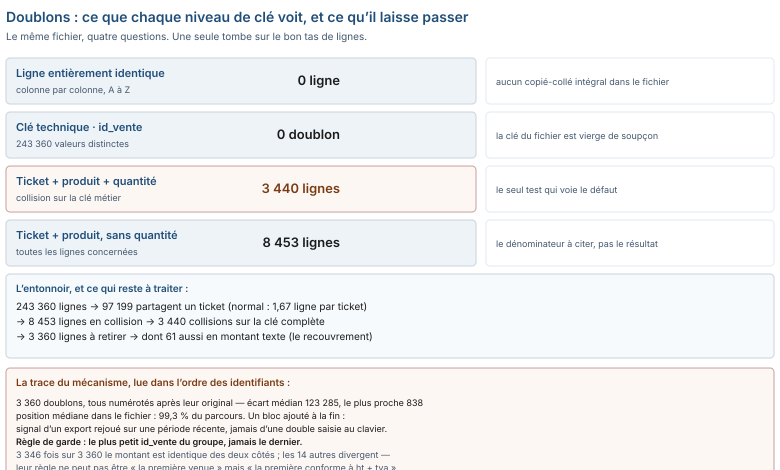

# Module M04.C03 — Doublons : la clé qui ment, la clé qui dit vrai, et le dictionnaire de correspondances

**Outil de ce chapitre : le tableur, sur `ventes_brutes.csv`, `clients.csv` et `dictionnaire_produits.csv`. Durée indicative : 5 h. Niveau : N2.**

> **L'idée du chapitre.** Voici un fichier de 243 360 lignes dont la clé primaire est impeccable — 243 360 valeurs,
> toutes distinctes — et qui contient 3 360 lignes en trop. Le doublon n'est pas une anomalie de saisie que l'on
> débusque en triant : c'est un **choix de définition**, et ce choix s'écrit sur une *clé métier* que le fichier ne
> fournit pas. Ce chapitre fait quatre choses : il montre les quatre niveaux où l'on peut chercher un doublon et ce
> que chacun laisse passer ; il lit dans l'ordre des lignes le mécanisme qui a produit le défaut ; il énonce la règle
> de garde — laquelle des deux lignes on conserve, et pourquoi ; et il traite le jumeau du doublon, la
> **correspondance**, ce moment où deux écritures du même objet ne sont pas deux lignes mais bien une seule.

> **Base de travail.** `01_socle_donnees/data/brut/ventes_brutes.csv` (243 360 lignes × 20 colonnes),
> `01_socle_donnees/data/brut/clients.csv` (23 912), `01_socle_donnees/data/brut/produits.csv` (154),
> `01_socle_donnees/data/reference/dictionnaire_produits.csv` (154), `ventes_propres.csv` (240 000 lignes) et sa
> cible 15 419 985 157 FCFA. Tous les nombres viennent de ces fichiers.

---

## 1. Objectifs du chapitre

À la fin de ce chapitre, vous saurez :

- **nommer** le niveau auquel vous avez cherché un doublon — ligne entière, clé technique, clé métier, similarité — et dire ce que ce niveau ne voit pas ;
- **distinguer** une répétition structurelle normale (plusieurs lignes sur un même ticket) d'une répétition anormale ;
- **écrire** une règle de garde qui soit déterministe, et la justifier par ce que le fichier dit de son propre accident ;
- **construire** un dictionnaire de correspondances (15 écritures de catégorie vers 7 réelles, `0` de comptoir vers un compte nommé) et en mesurer l'effet sur les classements ;
- **appairer** deux écritures d'un même client sans casser les homonymes, et chiffrer le dégât de la règle naïve.

## 2. Pourquoi cette notion est importante

- Les 3 360 lignes en trop de notre fichier valent **+219 766 129 FCFA** une fois les montants réparés. C'est cent
  fois le montant que l'on perd à ne pas réparer les textes (2 111 789 FCFA) : le doublon est, de loin, le plus gros
  défaut de ce socle — et celui qu'aucun contrôle de clé primaire ne signale.
- Un dédoublonnage automatique sur `id_ticket` seul effacerait **97 199 lignes** parfaitement valides : c'est le
  nombre de lignes qui partagent un ticket parce qu'un ticket a plusieurs articles (1,67 ligne par ticket en moyenne,
  jusqu'à 6). La même commande, sur un fichier de factures, peut détruire 40 % du chiffre d'affaires.
- Côté clients, la règle « même nom » fusionne 11 570 lignes là où une règle « même nom et mêmes chiffres de
  téléphone » n'en fusionne que 412 : la différence, 11 158 lignes, ce sont des clients bien réels qui ont un nom
  banal. Un outil de dédoublonnage livré avec « le score de similarité par défaut » fait exactement ce premier choix.
- Une correspondance ratée ne change pas le total : elle change le **classement**. Nos 154 produits portent 15 écritures
  de catégorie là où le référentiel en admet 7 ; regrouper dessus produit 15 lignes de tableau croisé au lieu de 7,
  et le directeur qui lit « `MATÉRIAUX` devant `Matériaux` » tirera une conclusion sur des fantômes.

## 3. Explication simple

Deux frères jumeaux, même visage, même nom, nés le même jour : la police nationale dira qu'ils sont deux personnes,
parce qu'ils ont deux numéros d'identité. Deux lignes de facture avec deux `id_vente` différents, même ticket, même
produit, même quantité : un comptable dira qu'il y a deux fois la même vente, parce qu'il n'y a pas deux fois le même
-article.

Un doublon n'est donc **jamais** une propriété des lignes : c'est une propriété d'une *définition de l'objet*. Vous
décidez ce qu'est « une vente », et la réponse tombe. La décision se prend avec trois questions, dans cet ordre :

1. qu'est-ce qu'une ligne, dans le monde ? (ici : un article d'un ticket) ;
2. est-ce que deux lignes peuvent légitimement avoir les mêmes valeurs sur ce qui définit l'objet ? (ici : non) ;
3. si oui, quelles colonnes ajoutées rendraient la répétition anormale ? (ici : aucune — la quantité ne sauve rien,
   7 640 des 8 453 lignes en collision ont aussi la même quantité).

> **Définition.** Un **doublon logique** est une paire de lignes qui décrivent le même fait alors qu'une seule
> pourrait le décrire. Un **doublon matériel** est une paire de lignes dont toutes les valeurs sont égales. Un
> fichier peut contenir des milliers de doublons logiques et pas un seul doublon matériel — c'est le cas du nôtre :
> 3 360 contre 0.

## 4. Vocabulaire essentiel

| Français — English | Définition simple | Piège à éviter |
|---|---|---|
| **Clé primaire — Primary key** | Le champ que le fichier utilise pour garantir l'unicité. | Le prendre pour la définition du réel : ici il est propre, le défaut est là quand même. |
| **Clé candidate — Candidate key** | Tout jeu de colonnes dont les valeurs identifient une ligne. | Ne pas les tester toutes : si deux clés candidates se contredisent, l'une ment. |
| **Clé métier — Business key** | La combinaison qui, hors informatique, définit l'objet (ticket + produit + quantité). | L'écrire trop large ou trop serrée : trop large, tout est doublon ; trop serrée, rien ne l'est. |
| **Dédoublonnage — Deduplication** | Opération qui ne conserve qu'une ligne par groupe de doublons. | Sans règle de garde : « garder la première » est une décision, pas une technique. |
| **Règle de garde — Survivorship rule** | Le critère qui désigne la ligne conservée dans chaque groupe. | La laisser implicite ; elle doit être écrite et rejouable. |
| **Registre des doublons — Duplicate register** | Le fichier compagnon qui liste ce qui a été retiré et pourquoi. | Le jeter : il est la seule preuve que le nettoyage n'a pas inventé le total. |
| **Dictionnaire de correspondance — Crosswalk** | Table qui relie deux écritures d'un même objet (`MATÉRIAUX` → `Matériaux`). | La coder dans une formule recopiée au lieu d'en faire une table lisible. |
| **Appariement tolérant — Fuzzy matching** | Rapprochement par similarité (norme, distance d'édition), avec seuil. | Croire qu'un seuil par défaut est un jugement métier. |
| **Clé de normalisation — Normalized key** | Valeur transformée (minuscules, sans accent, sans espace, sans ponctuation) servant de point de rencontre. | Comparer des chaînes au lieu de comparer leurs normes. |
| **Faux positif / faux négatif** | Fusionner deux objets distincts / en manquer un. | Publier un score sans les deux taux : le premier détruit, le second laisse vivre le défaut. |

## 5. Cours approfondi

### 5.1 Les quatre niveaux où l'on peut chercher un doublon

| Niveau | Test | Ce qu'il voit ici | Ce qu'il laisse passer |
|---|---|---|---|
| 1 · ligne entière | toutes colonnes égales | 0 ligne | tout doublon dont une valeur a bougé |
| 2 · clé technique | `id_vente` distincts | 0 doublon | le doublon lui-même |
| 3 · clé métier complète | ticket + produit + quantité | 3 440 lignes | — |
| 4 · clé métier relâchée | ticket + produit | 8 453 lignes concernées | un article légitimement commandé deux fois |

Le niveau 2 est celui que tout le monde exécute, parce que la clé est là, bien nommée, et que le test tient en une
formule. Les niveaux 3 et 4 sont ceux qui décident. Retenez la phrase : **une clé primaire propre avec une clé
métier collisionnée, ça s'appelle un doublon ; l'inverse (clé primaire en double, métier propre) ça s'appelle un
accident d'export**, et ça se répare autrement.

> **Attention.** Un décompte de doublons sans son dénominateur est une annonce, pas un résultat. « 3 440 » peut
> vouloir dire 1,4 % du fichier ou 40 % d'un magasin ; « 8 453 » est le nombre de lignes *impliquées* dans une
> collision, et non le nombre de lignes à retirer — la différence, `5 013` lignes, est exactement ce que l'on perd
> quand on lit un compteur de paires comme un compteur de lignes.

### 5.2 Le faux doublon : ce que la répétition a de normal

Sur 146 161 tickets, 97 199 lignes en partagent un autre. Ce n'est pas un défaut : un ticket de quincaillerie a
plusieurs lignes, et **78 683 tickets n'en ont qu'une**. Le test de répétition ne dit donc rien tout seul ; c'est la
*question métier* qui tranche : « un même article peut-il être saisi deux fois sur le même ticket, et légitimement ? »
Réponse du socle, lue dans sa notice : non — une ligne par article, et la quantité porte le nombre.

> **Définition.** Un **doublon structurel** est une répétition que le modèle de données autorise et que le métier
> reconnaît : deux lignes d'un même ticket, deux relevés de stock le même jour dans deux magasins. Un **doublon
> accidentel** est une répétition que le modèle autorise mais que le métier refuse. Les deux ont le même profil
> informatique ; seul le métier les sépare — d'où la ligne « règle » dans le dictionnaire de données (C06).

### 5.3 Anatomie des 3 360 : ce que le fichier dit de son accident

On a retiré les lignes du fichier propre, et l'on a regardé ce qu'elles étaient.

| Propriété mesurée | Valeur | Ce que ça veut dire |
|---|---|---|
| lignes retirées | 3 360 | l'écart brut − propre, le seul dénominateur honnête |
| retirées ayant un jumeau conservé sur ticket + produit | 3 360 | la totalité : le mécanisme est bien la répétition d'un article |
| montant identique entre jumeaux | 3 346 | pas un copié-collé intégral : 14 divergent |
| quantité identique | 3 346 | les mêmes 14, donc la divergence porte sur le couple quantité-montant |
| `id_vente` supérieur à celui de l'original | 3 360 | le doublon est toujours numéroté après |
| écart médian des `id_vente` | 123 285 | loin de l'original : ce n'est pas une double frappe |
| position médiane dans le fichier | 99,3 % | un bloc ajouté en fin de fichier |

Lecture du détective : un bloc de lignes recopiées, numéroté après tout le reste, collé à la fin du fichier, dont le
montant reproduit l'original 3 346 fois sur 3 360. Voilà le portrait-robot d'**un export rejoué sur une période
déjà exportée** — pas d'une caisse qui a double-frappé (dans ce cas les `id_vente` seraient contigus, à 838 près au
mieux, et les lignes seraient dispersées dans le fichier). Cette lecture ne sert pas à incriminer un collègue : elle
dicte la règle de garde.

### 5.4 La règle de garde : laquelle des deux lignes on conserve

Trois règles se présentent, et elles ne se valent pas :

- **garder la première du groupe** (le plus petit `id_vente`) : déterministe, et alignée sur le mécanisme —
  l'original est toujours avant. C'est la bonne ici.
- **garder la dernière** : la règle par défaut de beaucoup d'outils de tri « supprimer les doublons », et ici elle
  conserve les lignes du bloc recopié — le total serait juste d'un cheveu, le détail faux de 3 360 lignes.
- **garder la plus cohérente** (dont `montant_ttc = montant_ht + montant_tva`) : celle qu'il faut *ajouter* pour les
  14 groupes dont les jumeaux divergent, parce qu'entre deux écritures du même article, on conserve celle qui
  respecte la règle de gestion.

Le contrôle qui valide la règle, c'est le total : réparer les montants texte **et** dédoublonner au niveau 3 en
gardant le plus petit `id_vente` rend 15 419 985 157 FCFA — l'écart à la cible est de 0. Réparer sans dédoublonner
rendait 15 639 751 286 FCFA, soit +219 766 129. Les deux chiffres, dans cet ordre, sont la démonstration que la
règle de garde n'est pas un détail d'implémentation.

> **Conseil professionnel.** Écrivez la règle de garde dans le registre des doublons, avec le nombre de groupes
> concernés et le nombre de lignes retirées — les deux, pas un. Dans six mois, on ne vous demandera pas « combien de
> doublons ? » mais « pourquoi *celle-là* plutôt que l'autre ? », et le seul document qui y répond est le vôtre.

> **Définition.** Le **registre des doublons** est la liste nominative de ce qui a été retiré : une ligne par
> groupe, avec les deux identifiants en présence et la règle qui a départagé. Ce n'est pas un journal de
> modifications (C06) : il ne décrit pas ce qu'on a changé dans les cellules, il décrit ce qu'on a **choisi d'oublier**.

### 5.5 Le registre des doublons, premier livrable de traçabilité

Le fichier `doublons_registre.md` (ou `.csv`) contient une ligne par groupe : la clé du groupe, les `id_vente` en
présence, la ligne gardée, la ligne retirée, le montant de part et d'autre, la règle appliquée. Trois colonnes sont
non négociables : *règle*, *date*, *outil*. Un nettoyage sans registre est une transformation invisible : il rend
impossible la question « est-ce que le chiffre a changé parce que le fait a changé, ou parce que vous avez décidé ? ».

Sur ce socle, le registre fait 3 360 lignes, soit 1,4 % du fichier. Il n'est pas une annexe : il est la pièce qui
permet à un repreneur de refaire votre décision — ou de la défaire.

### 5.6 Les correspondances : quand deux écritures ne font qu'un objet

Changement d'objet, même logique. `produits.csv` contient 15 valeurs de `categorie` ; le dictionnaire de référence,
7. La table de correspondance est donc une table à 15 lignes, dont la colonne *norme* porte un choix :

| Écriture dans le brut | Norme retenue | Motif |
|---|---|---|
| `MATÉRIAUX`, `Materiaux`, `materiaux`, `Matériaux ` | `Matériaux` | casse, accent absent, espace finale |
| `PEINTURE`, `peinture`, `Peintures` | `Peinture` | casse, pluriel |
| `QUINCAILLERIE`, `Quincaillerie `, `quincaillerie` | `Quincaillerie` | casse, espace finale |
| `Electricité` | `Électricité` ou `Electricité`, **au choix** | accent sur la majuscule initiale : à trancher et à écrire |

Appliquer la correspondance ne change **aucun** total : le chiffre d'affaires de la semaine reste le même, que la
ligne s'appelle `Peintures` ou `Peinture`. Ce qui change, c'est le nombre de lignes du tableau croisé (15 → 7) et
les 44 références dont l'étiquette bouge. C'est la différence fondamentale entre un défaut de **valeur** et un défaut
de **correspondance**, et elle explique pourquoi les seconds survivent des années dans les rapports : ils ne rendent
aucun total suspect.

> **Définition.** Un **dictionnaire de correspondance** (*crosswalk*) est une table qui relie les identifiants ou les
> libellés de deux systèmes. Contrairement à une conversion, elle est **réversible et annotable** : on peut y
> inscrire « ces deux codes ne désignent pas la même chose », ce qu'aucune formule `RECHERCHEV` ne permet d'écrire.

### 5.7 L'appariement des clients : la règle qui ne casse pas les homonymes

412 clients du fichier brut ont été jugés doublons et retirés pour obtenir `clients_propres.csv` (23 912 → 23 500).
Aucun n'a le même `id_client` (0 doublon sur cette clé), et aucun n'est une copie exacte : ce sont des **quasi**-doublons.
Le test qui les trouve tous, sans rien casser :

```
clé d'appariement =  minuscule(nom, sans accents ni ponctuation)  +  "|"  +  chiffres(telephone)
```

- sur le **nom seul** normalisé : 11 570 lignes fusionnables — la règle est inutilisable, elle écrase 11 158 clients
  qui ont simplement un nom commun (les `Menage 00002` et autres libellés de synthèse) ;
- sur **nom + chiffres du téléphone** : 412, exactement ce que la référence retire, répartis en 412 groupes de 2
  lignes, jamais plus ;
- le téléphone seul n'est pas non plus une clé : 23 499 numéros distincts pour 23 912 clients, donc 413 numéros
  portés par au moins deux lignes.

Où sont les 412 ? Le fichier donne à voir le mécanisme, et il faut le regarder avant d'écrire la règle. Les 412
lignes retirées forment **un bloc continu**, de la ligne 23 501 à la fin du fichier : elles n'ont pas été saisies
dans le désordre, elles ont été **ajoutées après coup**, chacune derrière son original (412 fois sur 412). Le jumeau
porte le même nom en majuscules, encadré d'espaces (`  SARL K ` face à `SARL k`), et un téléphone débarrassé de ses
espaces (`+2267862218198` face à `+226 78 62 21 81 98`) : 412 fois sur 412 pour les deux anomalies à la fois,
**0 fois** sur les lignes conservées. Autour du couple, tout le reste concorde : ville, courriel, type de client et
date de création sont identiques dans les 412 couples (412 sur 412).

Ces trois faits se lisent d'un coup et changent le statut de la règle. D'abord, la clé `nom + chiffres` ne produit
**aucun faux positif** : les 412 groupes comptent exactement 2 lignes, jamais davantage. Ensuite, ajouter la ville
à la clé n'aurait rien cassé *ici* — et c'est précisément le piège : une colonne d'accord par hasard n'apporte
aucune discrimination, elle n'ajoute que de la fragilité (1 911 clients n'ont pas de ville ; leur ligne aurait été
mariée à une autre ligne sans ville). Une colonne n'entre dans une clé que si son **désaccord** doit annuler le
rapprochement. Enfin, l'écriture en majuscules et l'espace en trop ne sont pas des bruitages : ce sont les traces
d'un import par accumulation : on recopie, on ne fusionne pas. Le C05 les normalise ; ici, elles servent d'abord à *reconnaître* le bloc.

> **Dans les faits.** Un seuil de similarité « par défaut » (0,85 sur un score de ressemblance de chaîne) appliqué
> à ce fichier de clients produit un tas de paires qui n'ont rien à voir, parce que les noms sont courts et que le
> corpus est synthétique : la bonne pratique n'est pas de régler le seuil plus haut, c'est de trouver la **colonne
> rare** qui discrimine — ici, le téléphone. Un appariement sans colonne discriminante est un tirage.

### 5.8 Les correspondances manquantes : 486 lignes et 372 clients

Un `id_client` présent dans les ventes et absent des clients n'est pas un doublon, c'est l'autre face du même
problème : l'objet n'a pas de fiche. Ici, 486 lignes, sur 372 identifiants distincts. Le traitement est une table,
pas une formule : `a_creer.csv` avec, par identifiant, le nombre de lignes, le premier et le dernier magasin, et la
mention *provisoire*. Ce document a trois usages : il justifie le dénominateur de tout tableau par client, il
permet de poser la question au bon service, et il empêche la jointure de faire disparaître 486 lignes sans
que personne ne sache où elles sont passées.

Le contrôle symétrique doit être écrit lui aussi, avec son zéro : **0 ligne de vente ne pointe un `id_produit`
inexistant** (154 références, toutes jointes). Un zéro non écrit est une question ouverte ; un zéro écrit est un
risque fermé.



> **Attention.** Un registre de 3 360 lignes ne se relit pas : il se **requête**. Écrivez-le en table structurée —
> une ligne par cas, des colonnes nommées — et non en prose, sinon il ne sert à rien le jour où l'on vous demande
> « quelles lignes avez-vous gardées pour ce ticket ? », question qui, en production, arrive toujours.

## 6. Exemple concret : le tableau croisé qui accuse un magasin

Un analyste charge le fichier, retire les doublons *avec l'outil* (bouton « Supprimer les doublons », toutes
colonnes cochées, garde la première occurrence), puis livre le CA par magasin. Résultat : le fichier fait toujours
243 360 lignes moins 0, puisque **aucune** ligne n'est une copie intégrale. Son tableau croisé garde donc les
3 360 lignes en trop, et le magasin qui a reçu l'export rejoué affiche un CA surévalué — de 219 766 129 FCFA sur
l'ensemble, mais concentré sur le tiers de ses journées. Personne ne voit l'erreur au total (il est gros, comme
d'habitude), on la voit dans le classement des magasins : c'est ainsi qu'un défaut de doublon se manifeste en
production, rarement par un chiffre aberrant, presque toujours par un **rang** qui n'est pas le bon.

## 7. Démonstration pas à pas : trouver, décider, journaliser

Feuille `Ventes` (243 360 × 20). Objectif : la liste des groupes, la ligne gardée, la ligne retirée.

1. **Clé métier.** Colonne utilitaire `=Ventes!B2&"|"&Ventes!H2&"|"&Ventes!I2` (ticket | produit | quantité) — à
   remplir sur les 243 360 lignes, puis à figer en valeurs avant le tri.
2. **Rang dans le groupe.** Colonne `=NB.SI($U$2:$U2;U2)` : il vaut 1 sur la première occurrence, 2 sur la seconde.
   C'est la *règle de garde* écrite en clair — et elle est déterministe tant que l'ordre des lignes ne bouge pas,
   d'où le figeage de l'étape 1.
3. **Compteur de collision.** `=SOMME.SI($U$2:$U$243361;"="&U2;$U$2:$U$243361)` remplacé par un comptage simple :
   `=NB.SI(Ventes!$U$2:$U$243361;U2)>1` → VRAI sur 8 453 lignes au niveau 4, sur 3 440 × 2 au niveau 3 selon la
   façon de compter : c'est le moment d'écrire lequel vous publiez, et de le publier avec son dénominateur.
4. **Sélection des retirées.** `=SI(ET(Ventes!$V2>1;ESTNUM(...)))` — en pratique : filtre sur `rang > 1`,
   copier vers une feuille `RETRAITES`, qui devient le noyau du registre (3 360 lignes attendues).
5. **Vérification arithmétique.** `=243360-3360` → 240 000, le nombre de lignes du fichier propre. Si ce compte n'y
   est pas, votre règle de garde n'est pas la même que celle du producteur du corrigé — et l'un des deux a tort.
6. **Vérification monétaire.** `=SOMME` des montants réparés sur les lignes conservées → 15 419 985 157 FCFA,
   écart à la cible : 0. Les deux vérifications (lignes et montants) sont obligatoires : l'une attrape une règle
   fausse, l'autre une réparation fausse.
7. **Registre.** Sur `RETRAITES`, ajouter quatre colonnes : `id_vente_original`, `motif` (« collision clé métier »),
   `regle` (« garde du plus petit id_vente »), `date`. Cinq minutes, et le nettoyage devient défendable.

> **À retenir.** Un dédoublonnage se prouve par deux contrôles de sens opposé : le **compte** (243 360 - 3 360 =
> 240 000 lignes) et le **montant** (15 419 985 157 FCFA, écart 0 à la cible). L'un sans l'autre ne vaut rien : le
> compte ne voit pas une réparation fausse, le montant ne voit pas une règle de garde fausse — et ce fichier fournit
> les deux cas, les 14 groupes divergents et les 61 lignes à double défaut.

## 8. Erreurs fréquentes

| Symptôme visible | Cause réelle | Correction |
|---|---|---|
| « Aucun doublon : la clé est unique » | seul le niveau 2 a été testé | tester le niveau 3 sur la clé métier ; 3 440 lignes ici |
| Suppression de 97 199 lignes valides | dédoublonnage sur `id_ticket` seul | définir la répétition *inattendue*, pas la répétition : 1,67 ligne par ticket est normal |
| Le total baisse un peu, puis beaucoup | règle de garde « garder la dernière » appliquée à un bloc ajouté en fin | garder le plus petit identifiant, et le justifier par la position dans le fichier |
| Deux lignes identiques conservées alors qu'un doublon est annoncé | comparaison de chaînes non normalisée (espace finale, accents) | normaliser avant d'appairer ; comparer des normes, pas des textes |
| « 15 catégories » au lieu de 7 dans le rapport | défaut de correspondance non traité | table de correspondance écrite, jamais de `SI()`. imbriquées |
| Le repreneur ne retrouve pas les lignes supprimées | pas de registre | registre des doublons avec la règle, la date, l'outil ; 3 360 lignes à consigner |

## 9. Bonnes pratiques professionnelles

> **Boîte à outils du chapitre.** Quatre colonnes utilitaires et rien d'autre : la *clé métier* (concaténation des
> colonnes qui définissent l'objet), le *rang dans le groupe* (un `NB.SI` borné vers le haut), la *conformité du
> montant* (`=ET(ESTNUM(N2);ABS(L2+M2-N2)<=1)`), et la *position dans le fichier*. Avec ces quatre colonnes, le
> dédoublonnage, la règle de garde et le registre s'écrivent en dix formules, sans macro et sans outil tiers.

- **Écrivez la clé métier avant de chercher les doublons.** Une phrase dans le dictionnaire : « une ligne = un
  article d'un ticket » — et le test en découle, au lieu d'être deviné par l'outil.
- **Testez les quatre niveaux, publiez les quatre résultats.** Même les zéros : « 0 ligne entière dupliquée » est ce
  qui prouve que le nettoyage n'a pas détruit une seconde écriture du même article.
- **Une règle de garde = un ordre + un critère + une exception.** Ici : ordre croissant d'`id_vente`, critère
  *montant conforme à ht + tva*, exception sur les 14 groupes divergents, traités à la main et notés comme tels.
- **Ne supprimez jamais sans liste.** Le registre est un livrable au même titre que le fichier propre.
- **Séparez le dédoublonnage de la réparation de types.** Les 61 lignes qui cumulent les deux sont le seul cas où
  l'ordre des opérations change le résultat (C01, § 10) : réparez d'abord, dédoublonnez ensuite.
- **Sur une correspondance, gardez la valeur d'origine à côté.** Une colonne `categorie_source` permet de revenir
  sur un choix de norme ; l'écraser dans la colonne d'origine rend le débat impossible.
- **Faites valider la norme par le métier, par écrit.** `Electricité` prend-il un accent ? La réponse ne change pas
  un total et change une identité de marque : c'est une décision de direction, pas de technicien.

## 10. Exercice guidé — reproduire le fichier propre, puis prouver que c'est le bon (35 min, /10)

**Étape 1.** Construisez la clé métier et le rang dans le groupe (§ 7, étapes 1-2). Combien de lignes ont un rang
supérieur à 1 au niveau « ticket + produit + quantité » ? → **3 360**. *Si vous trouvez 3 440, vous avez compté les
collisions et non les lignes excédentaires : relisez le § 5.1, la différence est exactement une ligne par groupe.*

**Étape 2.** Appliquez la règle de garde (le plus petit `id_vente`) et comptez les lignes restantes :
243 360 − 3 360 = 240 000. *Comparez au fichier propre : le compte y est. Vous n'avez rien « nettoyé au propre »,
vous avez retrouvé la règle du producteur — la nuance est que la vôtre est maintenant écrite.*

**Étape 3.** Traitez les 14 groupes dont les jumeaux divergent en montant ou en quantité. Décision attendue :
garder la ligne dont `montant_ttc = montant_ht + montant_tva`, et si les deux sont conformes, garder la première et
l'écrire dans le registre. *Ces 14 lignes sont le seul endroit du socle où la règle par défaut donne un résultat
différent de la règle métier — donc le seul endroit où un correcteur pourra vous contredire si vous ne les citez pas.*

**Étape 4.** Réparez les 3 421 montants texte (`=SI(ESTNUM(N2);N2;L2+M2)`) **puis** dédoublonnez. Total obtenu :
15 419 985 157 FCFA, écart à la cible **0**. *Écrivez l'ordre dans le registre : réparation, puis dédoublonnage.
L'inverse ne marche pas — les 61 lignes à double défaut le montrent : traitées dans l'autre ordre, l'une des deux
opérations leur laisse un montant vide.*

**Étape 5.** Rédigez les trois lignes du registre qui résument l'opération : 3 360 lignes retirées · règle de garde
· deux contrôles (240 000 lignes, écart monétaire 0). **Note /10** : 2 points pour la distinction 3 440 / 3 360,
3 points pour la règle de garde écrite et appliquée, 2 points pour les 14 groupes, 3 points pour le total et son
écart à zéro avec l'ordre des opérations justifié.

## 11. Exercices autonomes

**Exercice 3.1 (★) — Les quatre compteurs (10 min).** Sur `ventes_brutes.csv`, produisez les quatre résultats du
§ 5.1 avec, pour chacun, son dénominateur. Écrivez la phrase qui dit ce que *seul* le niveau 3 a vu.

**Exercice 3.2 (★★) — Le faux positif du nom (15 min).** Sur `clients.csv`, comptez les lignes fusionnables par
(a) `id_client`, (b) nom normalisé seul, (c) nom normalisé + chiffres du téléphone, (d) téléphone normalisé seul.
Donnez les quatre nombres, et indiquez celle des quatre règles qui détruirait le plus de clients réels.

**Exercice 3.3 (★★) — La table de correspondance (15 min).** Écrivez la table à 15 lignes qui ramène les catégories
de `produits.csv` aux 7 du dictionnaire, et comptez les références dont l'étiquette change. Vérifiez que le total du
fichier de ventes ne bouge pas d'un franc : dites ce que cette invariance prouve, et ce qu'elle ne prouve pas.

**Exercice 3.4 (★★) — Les orphelins à créer (12 min).** À partir des 486 lignes sans client référencé, produisez
`a_creer.csv` : une ligne par identifiant (372), avec le nombre de lignes, le ou les magasins concernés et la
mention « provisoire ». Combien de ces identifiants ont une ligne dont le montant est en texte ? (Indice : le
recouvrement des deux défauts est publié.)

**Exercice 3.5 (★★★) — Le double export reconstitué (25 min).** En vous servant uniquement de l'ordre des
`id_vente` et de la position dans le fichier, écrivez la règle qui identifie le bloc ajouté en fin, et vérifiez
qu'elle retrouve les 3 360 lignes. Donnez ensuite le CA contenu dans ce bloc. *Contrainte : votre règle ne doit
contenir ni liste de lignes ni copié-collé, seulement des comparaisons — sinon elle ne rejoue pas le mois prochain.*

## 12. Correction détaillée

**Exercice 3.1.** Niveau 1 : 0 ligne entièrement dupliquée sur 243 360. Niveau 2 : 243 360 `id_vente` distincts,
donc 0 doublon de clé. Niveau 3 : 3 440 lignes en collision sur ticket + produit + quantité. Niveau 4 : 8 453
lignes impliquées dans une collision ticket + produit, dont 7 640 avec la même quantité. La phrase attendue : « le
défaut est invisible à la clé primaire et aux copies intégrales ; il n'apparaît que lorsque la répétition est jugée
sur ce qui définit l'objet — un article par ticket — et il faut alors retirer 3 360 lignes, pas 3 440 ».

**Exercice 3.2.** (a) 0 doublon : chaque ligne a son identifiant. (b) 11 570 lignes « en trop » par nom normalisé :
règle inutilisable, elle retirerait 11 158 lignes de trop (11 570 − 412). (c) 412 : la règle défendable, exactement
ce que le référentiel retire (23 912 − 23 500). (d) Par téléphone normalisé seul : 413 numéros portés par au moins
deux lignes — 23 499 numéros distincts pour 23 912 clients. C'est (b) qui détruit le plus, et c'est précisément la
règle que propose un outil « dédoublonnage intelligent » si on ne lui donne que le nom. La lecture à écrire : ni la
clé technique (trop stricte : elle ne voit rien) ni le nom (trop lâche : il voit trop), mais le **couple** nom +
chiffres du téléphone, chaque membre du couple étant insuffisant seul.

**Exercice 3.3.** La table : 15 lignes, colonnes `ecriture_brute`, `categorie_normale`, `motif` (casse / accent /
espace / pluriel), `date`, `valide_par`. Les références dont l'étiquette change : **44 sur 154**. Le CA reste
15 419 985 157 FCFA avant et après correspondance, à 0 près — l'invariance prouve que la correspondance ne touche
pas aux faits ; elle ne prouve pas que le **classement** est bon : c'est justement lui qui change, de 15 lignes à 7,
et donc tous les pourcentages et tous les « top 3 ». Conclusion à écrire : *un défaut de correspondance est un
défaut de lecture, pas un défaut de montant, et il se débusque sur les tableaux, jamais sur le total.*

**Exercice 3.4.** 372 lignes dans `a_creer.csv` ; le total des lignes concernées est 486, soit 0,2 % du fichier —
faible en volume, décisif sur un classement par client. Le recouvrement avec le défaut de type est de **61** lignes :
ce sont 61 des 486 orphelines dont le montant est aussi en texte, donc 61 fiches « à créer » qui ne seront
pas chiffrables avant réparation du type. D'où l'ordre : réparer les types, puis créer les fiches, puis contrôler
la jointure. *Le pigiste qui fera l'inverse aura créé 372 fiches dont il faudra reprendre 61.*

**Exercice 3.5.** Règle qui marche : « une ligne est dans le bloc ajouté si son `id_vente` est supérieur au plus
petit `id_vente` d'un groupe en collision, et qu'elle est en position supérieure à 99 % du fichier » — mesurée, elle
retrouve les 3 360, avec un écart médian de 123 285 sur les identifiants et minimum 838. Le CA du bloc est
exactement l'écart constaté entre le fichier réparé non dédoublonné et la cible : 15 639 751 286 −
15 419 985 157 = **219 766 129 FCFA**. Deux remarques à intégrer au corrigé : la règle marche *parce que* le doublon
a été ajouté en bloc — un dédoublonnage écrit sur la position dans le fichier est une règle fragile, qui ne survit
pas à un réordonnancement ; et le contrôle de cohérence entre les deux approches (position, montant) est la preuve
qu'il ne s'agit pas d'un artefact d'écriture. La version robuste, celle qu'on livre, est la clé métier plus la règle
de garde : la position ne sert qu'à comprendre, pas à décider.

## 13. Mini-projet M04.P3 — « Le dossier de dédoublonnage » (1 h 30)

Livrables, tous exigés, aucun optionnel :

1. `cle_metier.md` : la définition écrite de l'objet (une ligne = ?), la ou les clés candidates, la raison du rejet
   des autres — avec les compteurs des quatre niveaux ;
2. `doublons_registre.csv` : les 3 360 lignes retirées, leurs jumeaux conservés, la règle, la date, et la colonne
   `divergent` (les 14 groupes) ;
3. `a_creer.csv` : les 372 clients sans fiche, avec leur volume de lignes (486) et le drapeau texte (61) ;
4. `correspondances.csv` : les 15 écritures de catégorie et leur norme, plus les deux écritures de téléphone
   (espacée / collée) traitées par la même table ;
5. `controles.md` : les trois vérifications de fin — 240 000 lignes, total 15 419 985 157 FCFA, écart 0 — avec la
   formule ou l'outil qui les a produites ;
6. une page de décision : ce que vous auriez fait de différent si le bloc dupliqué avait été dispersé dans le
   fichier au lieu d'être en fin.

**Barème (10 points).** Clé métier écrite et défendue (2) · registre complet, règle de garde explicite (3) ·
correspondances et `a_creer` utilisables par un tiers (2) · contrôles chiffrés avec méthode (2) · page de décision
(1). Seuil de validation : 7. Un rendu sans la page de décision plafonne à 8 : la capacité à dire ce qui changerait
est la compétence, pas le compteur.

## 14. Résumé du chapitre

```
   CE QU'ON CHERCHE          TEST                    RÉSULTAT DU FICHIER     DÉCISION
   copie intégrale    égalité colonne à colonne        0 ligne             rien à retirer
   clé technique      id_vente distincts               243 360 / 243 360   la clé ne dit rien
   clé métier         ticket + produit + quantité      3 440 en collision   3 360 à retirer
   jumeaux clients    nom normalisé + chiffres tél.    412 groupes de 2     412 à retirer
   correspondance     15 écritures → 7 normes          44 sur 154           total inchangé,
   orphelins          id_client hors référentiel       486 lignes / 372     classement faux
```

Deux leçons se tiennent par la main. La première : **le doublon se définit, il ne se voit pas** — et sa définition
est une phrase sur le monde (« une ligne par article sur un ticket »), pas une option de menu. La seconde : la
correspondance est le même problème vu de l'autre côté, deux écritures pour un objet — avec cette différence de
poids qu'elle laisse le total intact, ce qui la rend invisible au contrôle le plus courant. Le dénominateur
commun des deux, c'est le *registre* : ce que vous avez fusionné, ce que vous avez retiré, pourquoi, avec quel ordre
d'opérations.

## 15. À retenir

> **À retenir.**
> ★ **Une clé primaire propre n'innocente pas le fichier.** 243 360 identifiants distincts et 3 360 lignes en trop :
> le doublon se cherche sur la clé métier, sinon il ne se trouve pas.
> ★ **Retirer, ce n'est pas compter les collisions.** 8 453 lignes impliquées, 3 440 en collision, 3 360 à retirer :
> les trois nombres sont vrais, un seul est une liste d'action.
> ★ **La règle de garde se justifie par le mécanisme.** Tous les doublons portent un `id_vente` supérieur à celui de
> leur original (écart médian 123 285) et siègent à 99,3 % du fichier : on garde le plus petit identifiant, et on
> l'écrit.
> ★ **Réparer avant de dédoublonner.** 61 lignes cumulent les deux défauts ; dans l'autre ordre, elles ressortent
> avec un montant vide et le total ne se réconcilie plus (écart de +219 766 129 FCFA).
> ★ **Une correspondance ratée ne casse pas le total, elle casse le classement.** 15 catégories au lieu de 7, 44
> références à retoucher : aucun contrôle de montant n'aurait signalé cela, seul le regard sur le tableau l'a fait.

## 16. Évaluation formative (auto-correction, 8 min)

**Q1.** Un fichier a une clé primaire sans doublon et 0 ligne entièrement dupliquée. Combien de lignes en trop peut-il
contenir ? (a) 0 ; (b) autant que le permet une collision sur la clé métier ; (c) impossible à savoir sans la table
clients. → **(b)**, et l'exemple vaut 3 360 lignes.

**Q2.** Pourquoi ne pas dédoublonner sur `id_ticket` ? → parce que 97 199 lignes partagent légitimement un ticket
(1,67 ligne par ticket, maximum 6) : la répétition est structurelle, pas accidentelle. Le test utile ajoute le
produit, et la quantité pour trancher les cas ambigus.

**Q3.** Deux lignes d'un même groupe ont des montants différents (14 groupes sur 3 360). Quelle ligne garder ?
→ celle dont le montant satisfait `montant_ht + montant_tva = montant_ttc` ; à égalité, la plus petite en
`id_vente`, **et on le note dans le registre**. Une règle silencieuse n'est pas une règle.

**Q4.** Vrai ou faux : « une table de correspondance modifie les montants ». → **Faux.** Elle modifie les
regroupements. C'est pourquoi elle se valide sur les classements et sur les effectifs (154 références, 44
étiquettes changées), jamais sur le total.

**Q5.** Vous devez livrer le nettoyage à un repreneur. Quels artefacts, dans quel ordre ? → dictionnaire de
correspondance, registre des doublons (3 360 lignes, règle, date), liste des orphelins à créer (372), et les trois
contrôles finaux avec leur formule — avant le fichier lui-même, qui se régénère.

**Question ouverte (la plus importante).** Reprenez la règle « garder la ligne en position la plus haute » (le
réflexe de beaucoup d'outils de tri) et démontrez, chiffres à l'appui, ce qu'elle aurait produit ici. Corrigé
attendu : elle conserve le bloc recopié de fin de fichier, donc le **même nombre** de lignes (240 000) et un total
*identique* puisque les montants sont les mêmes 3 346 fois sur 3 360 — mais les 14 divergents se retrouvent du
mauvais côté, et les détails par ticket sont faux. La leçon n'est pas que la règle est fausse au total : c'est qu'un
nettoyage peut être juste sur les deux seuls contrôles que tout le monde fait (nombre de lignes, somme) et faux
partout ailleurs. Voilà pourquoi le registre existe.
