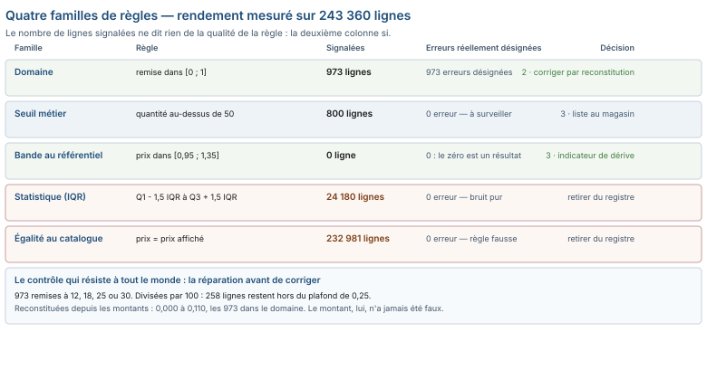

# Module M04.C04 — Valeurs aberrantes et règles de contrôle : une règle doit rendre une décision, pas un nombre

**Outil de ce chapitre : le tableur, sur `ventes_brutes.csv`, `produits.csv` et `stocks_quotidiens.csv`. Durée indicative : 5 h. Niveau : N2.**

> **L'idée du chapitre.** On vous demandera de « repérer les valeurs aberrantes », et l'outil répondra avec une
> formule toute faite : quartiles, écarts-types, seuils à trois sigmas. Appliquée à notre fichier de ventes, cette
> recette signale **24 180 lignes** de prix — 9,9 % du fichier — et ne désigne pas une seule erreur. La règle qui
> voit juste s'appuie sur le référentiel des produits, et elle signale **0** violation : ce zéro est une preuve, pas
> une paresse. Le chapitre garde un deuxième tour de vis, plus désagréable : sur les 973 lignes où la remise est
> aberrante, *la réparation évidente ne répare rien* — diviser par 100 laisse 258 lignes hors du domaine contractuel,
> parce que la valeur fausse n'a jamais été la valeur juste multipliée par cent. Une valeur aberrante n'est pas une
> valeur éloignée : c'est une valeur **incompatible avec un document**.

> **Base de travail.** `01_socle_donnees/data/brut/ventes_brutes.csv` (243 360 lignes × 20 colonnes),
> `01_socle_donnees/data/brut/produits.csv` (154 références),
> `01_socle_donnees/data/brut/stocks_quotidiens.csv` (60 000 lignes),
> `01_socle_donnees/data/reference/verites_terrain.csv` (15 419 985 157 FCFA).

---

## 1. Objectifs du chapitre

À la fin de ce chapitre, vous saurez :

- **classer** une anomalie en trois natures — impossible, invraisemblable, licite-surprenante — et traiter chacune autrement ;
- **écrire** une règle de contrôle qui renvoie une décision : bloquer, corriger, surveiller, ignorer tracé ;
- **calibrer** un seuil sur deux preuves — la distribution observée *et* le document métier — et dater cette calibration ;
- **préférer** le contrôle croisé (colonne contre référentiel) au contrôle univarié, en sachant ce qu'il ne dit pas ;
- **mettre à l'épreuve une réparation** : avant d'appliquer `÷100`, vérifier qu'elle ramène les valeurs dans le domaine.

## 2. Pourquoi cette notion est importante

- Les prix unitaires du fichier vont de 575 à 45 000 FCFA, médiane 6 400, quartiles 3 650 et 11 050, écart-type
  8 372. La règle « hors de [Q1 − 1,5 IQR ; Q3 + 1,5 IQR] » marque **24 180 lignes** ; « au-delà de 3 σ », **3 894** ;
  « 6 σ », **0**. Aucune de ces lignes n'est une erreur : le magasin vend du sac de ciment et de l'ossature, et la
  dispersion *est* le métier.
- La règle juste est relative, pas absolue : le prix d'une ligne doit rester dans la bande négociée autour du
  catalogue. Ratio observé : **0,958 à 1,306** ; violations d'une bande [0,95 ; 1,35] : **0**. En revanche, exiger
  l'égalité au franc avec le catalogue signaler **232 981 lignes** sur 152 produits des 154 — la règle est fausse,
  pas le commerce.
- Le défaut le plus instructif du socle ne casse **aucun** total : les 973 lignes à remise aberrante ont un
  `montant_ht` correct et une `taux_remise` fausse (la TVA, elle, rend 18 % du HT sur les 243 360 lignes, à
  l'unité près : 0 écart). Un contrôle de cohérence des montants ne verra jamais ce défaut ; seule la règle de
  domaine le voit — et il ne coûte que des analyses de remise fausses.
- Enfin, la règle d'alerte fournie avec les stocks est un cas d'école d'aberration *de contrôle* : `qte_physique <
  seuil_alerte` déclenche sur 1 800 lignes, exactement comme `qte_physique < 0`. Le seuil ne filtre rien.

## 3. Explication simple

Un médecin ne réagit pas de la même façon à une tension à 90, à 220 ou à zéro. Il distingue l'**impossible** (on
réanime, on ne débat pas), l'**invraisemblable** (on soupçonne le brassard avant de traiter) et le **licite
surprenant** (90 chez un coureur : on note). Les données ont la même échelle, et l'erreur du débutant est de tout
traiter au milieu — parce que c'est là que se trouvent les seuils par défaut des outils.

La seconde différence avec la médecine est dans la conclusion : un bilan rend une **conduite à tenir**, pas un
pourcentage de patients hors normes. Un contrôle de données doit rendre la même chose : *bloquer la ligne*,
*corriger par la règle*, *surveiller le lot*, *ignorer avec trace*. Si votre règle n'autorise aucune de ces quatre
phrases, ce n'est pas encore une règle : c'est un compteur, et un compteur ne protège personne.

> **Définition.** Une **règle de contrôle** est une affirmation vérifiable sur une donnée, assortie d'une décision et
> d'un destinataire : « le prix d'une ligne reste dans la bande négociée du catalogue, sinon la ligne est retournée
> au magasin pour validation ». Les trois membres — affirmation, décision, destinataire — sont obligatoires ; en
> production, deux sur trois ne suffisent jamais.

## 4. Vocabulaire essentiel

| Français — English | Définition simple | Piège à éviter |
|---|---|---|
| **Valeur aberrante — Outlier** | Valeur qui surprend au regard du contexte. | La confondre avec une erreur : une surprise peut être parfaitement vraie. |
| **Impossible — Invalid** | Contredit une loi du domaine (remise hors [0 ; 1], quantité négative hors retour). | La laisser passer : c'est la seule catégorie qu'on bloque à l'entrée. |
| **Invraisemblable — Implausible** | Compatible avec le domaine, mais contredit un document voisin. | La corriger sans preuve : on remplace un fait possible par une moyenne. |
| **Licite surprenante — Legitimate extreme** | Hors distribution, juste dans le métier. | La supprimer « parce qu'elle fausse la moyenne ». |
| **Règle univariée — Univariate rule** | Contrôle porté par une seule colonne (seuil, IQR, z-score). | Son incapacité à voir les défauts de relation entre colonnes. |
| **Contrôle croisé — Cross-field rule** | Confronte deux colonnes, ou une colonne et un référentiel. | L'écrire sur une jointure non validée : l'orphelin devient une anomalie fantôme. |
| **Test de réparation — Repair plausibility check** | Vérifier que la correction proposée ramène la valeur dans le domaine. | Appliquer `÷100` sans vérifier : ici, 258 lignes restent hors domaine après « réparation ». |
| **Échelle de gravité — Severity ladder** | Bloquant · corrigeable · surveillé · ignoré tracé. | Un seul niveau : tout devient urgent, donc plus rien ne l'est. |
| **Taux de déclenchement — Alert rate** | Part des lignes signalées par une règle. | Un taux de 9,9 % : c'est un descripteur de colonne, pas une alerte. |
| **Faux négatif silencieux — Silent false negative** | Le défaut que la règle ne pouvait pas voir. | Croire qu'aucune alerte prouve l'absence de défaut. |

## 5. Cours approfondi

### 5.1 Les trois natures, comptées sur le fichier

| Nature | Test sur le socle | Lignes | Lecture |
|---|---|---|---|
| Impossible | `quantite ≤ 0` hors retour | 0 | les 2 848 quantités négatives sont toutes des retours signalés |
| Impossible | `taux_remise < 0` | 0 | aucune remise négative |
| Impossible | `montant_tva ≠ 18 % du HT` | 0 | l'arithmétique fiscale tient sur les 243 360 lignes |
| Impossible | `id_produit` absent du catalogue | 0 | aucune ligne sans produit référencé |
| Invraisemblable | `montant_ht ≠ quantite × prix × (1 − remise)` | 973 | exactement le lot des remises > 1 |
| Licite surprenante | `quantite > 50` | 800 | commandes de chantier, plausibles en quincaillerie |
| Licite surprenante | `poids_kg > 5 000` | 7 674 | sacs palettisés et ossatures, médiane 9,5 kg par unité |

Quatre zéros d'abord, puis un nombre, puis deux. Cet ordre est le plus rentable qui soit : établir ce qui est
*impossible* et vérifier qu'on n'en trouve pas, puis chercher ce qui contredit un document, enfin qualifier ce qui
n'est qu'étonnant. Un diagnostic qui commence par le troisième étage produit des rapports de 24 180 lignes signalées
et 0 ligne corrigée — c'est-à-dire un rapport qui se jette.

> **Attention.** Le nombre de lignes signalées ne mesure pas la qualité d'une règle. « Prix différent du catalogue au
> franc près » signale 232 981 lignes et 152 des 154 produits : c'est la règle qui est fausse, pas la moitié du
> commerce. Une règle se juge à trois choses : ce qu'elle attrape, ce qu'elle laisse passer, et ce qu'elle oblige à
> faire.

### 5.2 Quatre familles de règles, et leur rendement mesuré

- **Le domaine** — `remise ∈ [0 ; 1]` : **973 lignes**, maximum lu 30. C'est la seule famille qui n'ait **aucun
  paramètre à justifier** : la borne vient de la définition de la variable. Premier contrôle à écrire, et le seul qui
  se défende tout seul.
- **Le seuil métier** — `quantite ≤ 50` : **800 lignes**. Il exige un document (politique d'achat, bon type). Sans
  document, c'est un IQR déguisé, avec un chiffre rond de plus.
- **La bande relative au référentiel** — prix de la ligne dans [0,95 ; 1,35] du catalogue : **0 violation**, ratio
  observé 0,958 à 1,306. Le zéro a une valeur *parce que* la bande est serrée et que les extrêmes sont cités.
- **La cohérence entre colonnes** — `poids_kg = quantite × poids_unite_kg` : **8 380 lignes**, à instruire. C'est le
  seul des quatre qui signale un doute sans désigner le coupable : la colonne poids, le poids unitaire du catalogue,
  ou la quantité.

> **Définition.** Un **test de réparation** consiste à appliquer la correction *en simulation* et à repasser la règle
> de domaine dessus. Les 973 remises à 30, 25, 18, 12 divisées par 100 donnent 0,30 ; 0,25 ; 0,18 ; 0,12 — et
> **258 lignes restent hors du domaine** (la remise maximale contractuelle est 0,25). Une réparation qui ne fait pas
> passer le test n'est pas une réparation, c'est un changement de conventions fait à l'aveugle.

### 5.3 Ce que le fichier dit vraiment des 973 lignes

Reconstituons la remise depuis les montants : `remise = 1 − montant_ht / (quantite × prix)`. Résultat sur les
973 lignes : étendue 0,000 à **0,110**, et **973 sur 973** dans le domaine [0 ; 0,25]. Autrement dit :

- le `montant_ht` est **juste** (il est cohérent avec la TVA, donc avec le total, donc avec le chiffre d'affaires) ;
- la colonne `taux_remise`, elle, ne décrit plus rien de mesurable : ni 30 %, ni 0,30, ni un montant de remise ;
- 630 de ces lignes ont même un `montant_ht` strictement égal au prix plein, ce qui aurait été impossible avec une
  remise de 12 à 30 % appliquée.

> **Attention.** « Le total est bon » n'est pas un contrôle, c'est une coïncidence tranquille. Les 973 lignes ont un
> `montant_ht`, une TVA et un total parfaitement cohérents : vos rapprochements de chiffres d'affaires les plus
> soignés ne peuvent rien voir. Un contrôle de total vérifie une **égalité entre colonnes**, pas la véracité d'une
> colonne de taux — et c'est pour cette raison que le registre doit couvrir les colonnes déclaratives, pas seulement
> les colonnes monétaires.

La leçon déborde largement cet exemple. **Le défaut le plus grave d'un fichier n'est pas forcément celui qui change
les totaux** : ceux-là ne changent aucun montant et rendent toutes les analyses de remise fausses — le genre de
défaut qui survit des années parce que le contrôle de cohérence des totaux est vert. D'où deux réflexes : (1) une
règle de domaine sur chaque colonne déclarative, pas seulement sur les montants ; (2) avant de « corriger » une
valeur, chercher si le fichier permet de la **reconstituer** — ici oui, et la reconstitution tient sur 973 lignes
sur 973, ce qui n'est pas le cas de la division par cent.

> **Conseil professionnel.** Ne dites jamais « j'ai corrigé les remises ». Dites : « j'ai recalculé la remise à partir
> des montants, la valeur saisie ne pouvant plus être reliée à rien ; 973 lignes concernées, toutes revenues sous le
> plafond de 0,25 ». La première phrase est une opération, la seconde est une décision — et une seule des deux se
> défend devant un auditeur.

### 5.4 L'échelle de gravité, appliquée au socle

| Niveau | Action | Défaut affecté ici | Ce que ça coûte |
|---|---|---|---|
| 1 · bloquant | la ligne n'entre pas dans la base | aucun (0 impossible) | — |
| 2 · corriger par la règle | recalcul documenté, puis recontrôle | 3 421 montants texte · 973 remises à reconstituer | 2 111 789 FCFA · toutes les analyses de remise |
| 3 · surveiller | on garde, on suit, on interroge | 8 380 poids incohérents · 800 quantités > 50 | un devis de transport faussé |
| 4 · ignorer, tracé | on écrit pourquoi on ne touche pas | 51 dates après le 31/08/2026, avant d'être datées | une comparaison annuelle faussée |

Le premier niveau est vide sur ce fichier : le producteur a validé les types à l'entrée, et l'écrire est utile — ça
disculpe le fichier et charge le contrôle. Le niveau 4 est celui qu'on saute, et c'est le plus coûteux : ignorer sans
tracer, c'est transformer une date de 2026-12 en une hausse artificielle lors de la comparaison annuelle.

> **Définition.** Un **registre de contrôles** est la table qui énonce, pour chaque colonne ou groupe de colonnes : la
> règle, son niveau, sa cadence, son destinataire, son taux de déclenchement attendu et sa mesure du jour. C'est
> l'objet que laisse un analyste qui part — la liste des règles, pas la liste des défauts.

### 5.5 Une règle rend une décision : la forme à écrire

```
règle       : le prix unitaire d'une ligne reste dans la bande [0,95 ; 1,35] du prix catalogue
destination : magasin émetteur, courriel hebdomadaire, liste nominative des lignes
niveau      : 3 · surveiller — le catalogue n'est pas la facture
exception   : remises contractuelles hors bande => liste de produits à joindre au contrôle
mesure      : 0 violation · ratio observé 0,958 à 1,306 · 243 360 lignes passées · calibré le [date]
```

Cinq lignes, et n'importe qui peut reprendre le contrôle six mois plus tard, savoir s'il a dérapé et à qui il
s'adresse. Comparez avec « j'ai appliqué le seuil IQR sur les prix, il y a 24 180 outliers » : même travail de
calcul, zéro exploitabilité — et, dans un an, quelqu'un remettra cette règle en production.

### 5.6 Calibrer un seuil : deux preuves, pas une habitude

Toujours le même mouvement. D'abord la **distribution** : 575 à 45 000 FCFA, médiane 6 400, quartile 3 à 11 050, écart-type
8 372 — elle dit où est le corps du fichier et où commencent les queues. Ensuite le **document** : politique
commerciale, contrat de marge, seuil de commande de gros. Calibré sur la seule distribution, un seuil est descriptif ;
calibré sur le seul document, il est inapplicable s'il contredit la pratique. Ici les deux se rejoignent sur la bande
de prix, et se contredisent sur le poids : 7 674 lignes dépassent `5 000` kg alors que la médiane de poids unitaire
est de 9,5 kg — le désaccord ne se tranche pas dans le fichier, il s'écrit au niveau 3 et se porte au magasin.

> **Dans les faits.** Un seuil se périme plus vite qu'une règle de domaine. La bande de prix survivra à l'année ;
> « quantité ≤ 50 » mourra à l'ouverture d'un dépôt ou d'un compte chantier. Écrivez la **date de calibration** à
> côté du seuil : c'est ce qui permet de dire, deux ans plus tard, que le bruit vient du seuil et non des saisies.

> **Définition.** Deux règles sont **redondantes** quand elles signalent exactement le même jeu de lignes. Le test
> coûte une formule — la somme du produit des deux drapeaux — et rapporte gros : une règle redondante est une règle
> à supprimer, parce qu'elle double le volume d'alertes sans jamais rien apprendre. C'est le cas, ici, de
> `qte_physique < seuil_alerte` et `qte_physique < 0` sur les stocks.

### 5.7 Retourner une règle qui hurle : le cas des stocks

`stocks_quotidiens.csv` fournit `qte_theorique`, `qte_physique`, `seuil_alerte` sur 60 000 lignes. La règle livrée,
`qte_physique < seuil_alerte`, déclenche sur 1 800 lignes ; `qte_physique < 0` déclenche sur 1 800 lignes aussi. La
coïncidence dit l'essentiel : le seuil n'ajuste rien, c'est le signe qui décide. Trois sorties, et il faut en choisir
une — le pire étant de laisser les deux règles en parallèle, ce qui double le bruit pour un seul message :

- **scinder** : intégrité (`qte_physique < 0`, 1 800 lignes, niveau 2, à instruire) et risque
  (`qte_theorique − qte_physique > k`, à calibrer sur l'écart observé : maximum 532, moyenne 2,77) ;
- **relever le seuil** pour ramener le taux d'alerte à ce que l'exploitation peut traiter par jour ;
- **assumer une alerte large mais hiérarchisée** : les plus gros écarts d'abord, le reste en liste.

Le point n'est pas la valeur de `k` : c'est qu'un contrôle se lit aussi à son **taux de déclenchement**. 3 % d'alerte
sur un stock quotidien, ça se traite. 9,9 % sur une colonne de prix, c'est une description du fichier, pas un contrôle.

### 5.8 Les règles statistiques, remises à leur place

| Règle | Paramètre | Sur `prix_unitaire_ht` | Lignes signalées | Erreurs désignées |
|---|---|---|---|---|
| Fourchette inter-quartiles | 1,5 × IQR | `Q1` 3 650 · `Q3` 11 050 | 24 180 | 0 |
| Écart-type | 3 σ | σ 8 372 | 3 894 | 0 |
| Écart-type | 6 σ | idem | 0 | 0 |
| Bande relative au catalogue | [0,95 ; 1,35] | ratio 0,958 → 1,306 | 0 | 0, et c'est un résultat |

Trois de ces quatre lignes disent la même chose : la distribution des prix est large et saine. Ce que les règles
statistiques font bien, ce n'est pas contrôler, c'est **surveiller un changement de nature** : le nombre de lignes
hors IQR, suivi hebdomadairement, devient un bon indicateur le jour où un produit change de gamme ou où une unité de
mesure dérape. Tant qu'il reste à 24 180, il ne signale rien ; s'il double, il signale que le fichier n'est plus le
même — pas qu'il est sale.



## 6. Exemple concret : la ligne à 75 662 kg

Une ligne pèse 75 662 kg quand la médiane du fichier est de 9,5 kg. Réflexe outillé : alerte, exclusion, « nettoyage ».
Regardons la ligne : sa quantité, le poids unitaire du produit au catalogue, et le calcul.

- Si `quantite × poids_unite` rend le même poids, la ligne est **juste** : une palette d'enduit ou un chargement de
  ciment pèse, et le magasin a saisi une quantité, pas une erreur. Rien à faire, sinon s'assurer que le destinataire
  du devis de transport lit bien des poids totaux.
- Si le calcul contredit, on a une ligne à instruire : quantité fausse, ou poids unitaire du catalogue faux. Et dans
  ce second cas, ce ne sont pas 8 380 lignes à reprendre mais **une colonne de référence** — la discussion change
  d'interlocuteur, et de service.

C'est toute la supériorité du contrôle croisé sur le contrôle univarié : le premier dit *quelle table est suspecte*,
le second dit seulement *quelle ligne est grosse*.

## 7. Démonstration pas à pas : la grille de contrôles en une heure

Feuille `Ventes` (243 360 × 20), feuille `Produits` (154 × 11), feuille `CONTROLES`.

1. **Joindre le référentiel.** Deux colonnes utilitaires par `RECHERCHEX` : `prix_ref` et `poids_ref` depuis
   `Produits`. Contrôler le joint d'abord : `=ESTNA(prix_ref)` sommée doit rendre 0 — et il rend 0 sur les
   243 360 lignes. Un contrôle croisé assis sur une jointure cassée produit un faux positif de masse.
2. **Ratio et bande.** `=J2/prix_ref2`, puis `=SI(OU(r<0,95;r>1,35);1;0)` sommée → 0. Écrivez à côté les deux
   extrêmes observés (0,958 et 1,306) : ce sont eux qui *justifient* la bande, et c'est ce que regardera le repreneur.
3. **Domaine.** `=NB.SI(K2:K243361;">1")` → 973. Puis, au lieu de corriger : `=1-(L2/(I2*J2))` recopée, et
   `=NB.SI(reconstituée;">0,25")` → **0**. La reconstitution tient ; `=NB.SI(K2:K243361/100;">0,25")` aurait rendu
   258. Gardez les deux lignes dans la fiche : c'est la démonstration, pas l'opération.
4. **Seuil de saisie.** `=NB.SI(I2:I243361;">50")` → 800. Niveau 3, liste au magasin.
5. **Cohérence physique.** `=SI(ABS(R2-(I2*poids_ref2))>1;1;0)` sommée → 8 380, avec une colonne de plus que
   d'habitude : « table suspecte ? » — le contrôle ne le dit pas, l'enquêteur si.
6. **Taux de déclenchement.** Une colonne par règle : alertes ÷ 243 360. 973 à 0,4 %, 8 380 à 3,4 %, 24 180 à 9,9 %.
   C'est *ce* tableau qui se montre en réunion, et la dernière ligne est une règle à retirer du registre.
7. **Fiche.** Une ligne par règle : *règle · niveau · destinataire · cadence · taux attendu · mesure · date*. Douze
   règles maximum : au-delà, la fiche n'est pas lue, et un contrôle non lu est un contrôle qui ne protège pas.

> **À retenir.** Une règle se juge d'abord à son taux de déclenchement et à la décision qu'elle attache à une alerte.
> 0 ligne signalée avec une bande justifiée vaut mieux que 24 180 avec un quartile ; et 1 800 alertes qui ne
> distinguent pas le négatif du risqué ne protègent personne.

> **Boîte à outils du chapitre.** Cinq colonnes utilitaires et rien d'autre : le *ratio au référentiel*, la
> *conformité arithmétique* (`=ET(ESTNUM(N2);ABS(L2+M2-N2)<=1)`), le *domaine* (un `ET()` borné), la
> *reconstitution* (la valeur recalculée depuis ce qui est sûr), et le *test de réparation* (la correction simulée
> repassée au domaine). Avec cela, les douze règles usuelles d'un fichier de ventes s'écrivent en une matinée, sans
> macro et sans outil tiers.

## 8. Erreurs fréquentes

| Symptôme visible | Cause réelle | Correction |
|---|---|---|
| « 24 180 valeurs aberrantes dans les prix » | seuil statistique sur une colonne à dispersion structurelle | bande relative au catalogue (0 violation) ; la règle statistique devient un indicateur de dérive |
| « 232 981 lignes ne respectent pas le catalogue » | le catalogue n'est pas le contrat | bande de ratio, jamais l'égalité au franc |
| « J'ai divisé les remises par 100, c'est corrigé » | la valeur fausse n'était pas la valeur juste × 100 | test de réparation : 258 lignes restent hors domaine ; reconstituer depuis les montants |
| Alerte quotidienne sur la même colonne, sans suite | seuil qui ne discrimine pas (`qte < seuil` ≡ `qte < 0`) | scinder intégrité et risque ; calibrer sur l'écart observé (max 532, moyen 2,77) |
| Le contrôle ne signale plus rien depuis des mois | jointure cassée : les lignes orphelines sortent du périmètre | contrôler le taux de jointure avant le taux d'alerte (486 lignes, 372 clients) |
| Les anomalies sont « lissées » pour faire taire l'alerte | une valeur licite écrasée par une moyenne | niveau 3 = instruire, jamais réécrire ; conserver la colonne `_source` |
| Un seul niveau de gravité dans toute la fiche | tout devient urgent, donc rien ne l'est | quatre niveaux, un destinataire par niveau, une cadence |

## 9. Bonnes pratiques professionnelles

- **Les règles de domaine d'abord, les seuils ensuite.** Elles ne demandent aucune justification statistique et ne
  bougent pas avec les saisons : remise en proportion, quantité entière, date renseignée, taux de TVA unique.
- **Une règle, un destinataire nommé.** « Magasin émetteur, chaque lundi » devient une habitude en un mois ; une
  alerte sans destinataire devient du bruit en trois semaines.
- **Écrivez le taux attendu avant la règle.** « Doit signaler entre 0,1 % et 0,5 % des lignes » : au-delà, c'est la
  règle qui a dérapé. La phrase est à écrire *avant*, sinon on la réécrit après coup pour coller au résultat.
- **Ne supprimez jamais une ligne pour faire taire une alerte.** Vous ignorez encore si l'erreur est dans la ligne ou
  dans la table de référence — c'est précisément ce que cherche l'étape 5 de la démonstration.
- **Testez toute réparation en simulation**, puis revalidez le domaine et la cohérence. Une correction qui fait
  passer un `> 1` en un `> 0,25` n'a rien réparé, elle a changé de convention sans autorisation.
- **Gardez la valeur d'origine dans une colonne `_source`** et la valeur retenue à côté : les deux sont des données ;
  la seconde sans la première est une réécriture de l'histoire.
- **Un contrôle croisé sans contrôle de jointure est un mensonge partiel.** Comptez les lignes qui n'ont pas trouvé
  leur référence (0 côté produits, 486 côté clients) avant de publier le résultat du contrôle.
- **Testez une règle en l'inversant.** Serrez la bande à ±0,1 % : 232 981 lignes. L'absurdité est plus parlante que
  n'importe quel discours de robustesse, et elle se démontre en une formule.

## 10. Exercice guidé — la règle de prix, de la distribution à la décision (35 min, /10)

**Étape 1.** Décrivez `prix_unitaire_ht` en cinq nombres : minimum, premier quartile, médiane, troisième quartile, maximum. Attendu : 575 ·
`3 650` · 6 400 · 11 050 · 45 000 (écart-type 8 372). *Cette étape ne juge rien, elle dimensionne — mais écrivez-la :
un seuil posé sans distribution sera relevé par quelqu'un d'autre, et vous ne pourrez pas expliquer le vôtre.*

**Étape 2.** Appliquez IQR à 1,5 ×, puis z-score à 3 σ et à 6 σ. Attendu : 24 180 · 3 894 · 0 lignes signalées.
*Le rapport est de six à un entre les deux premiers, et de l'infini à zéro entre le deuxième et le troisième. Une
règle dont le résultat varie de six fois selon son curseur n'est pas une règle : c'est un curseur. Notez aussi que la
borne basse de l'IQR tombe à `−7 450` : un contrôle dont une borne est inatteignable par construction ne mesure que
la moitié de ce qu'il prétend mesurer.*

**Étape 3.** Construisez le contrôle croisé : ratio au catalogue, violations de [0,95 ; 1,35]. Attendu : 0, pour un
ratio de 0,958 à 1,306. *Un 0 ne vaut que si la bande est serrée et que vous citez les extrêmes : avec une bande
[0,5 ; 5], le même 0 ne dirait rien du tout.*

**Étape 4.** Traitez les 973 remises. Deux voies : `÷100` (puis contrôle du domaine : 258 lignes hors [0 ; 0,25]) et
reconstitution depuis les montants (0,000 à 0,110, 973 sur 973 dans le domaine). Écrivez la décision au format du
§ 5.5, en nommant ce que la réparation choisie *ne restaure pas* : le `montant_ht` n'avait pas besoin de l'être.
*Si vous avez écrit « correction par ÷100 », l'étape 3 de la démonstration vous a échappé — retournez-y.*

**Étape 5.** Décidez de la sorts des règles : bande de prix → niveau 3 · domaine remise → niveau 2 avec
reconstitution · IQR → retiré, phrase de retrait écrite. **Note /10** : 3 points pour la distribution et les trois
compteurs, 2 points pour la bande justifiée par les extrêmes, 3 points pour le test de réparation des 973 lignes,
2 points pour l'affectation des niveaux et la phrase de retrait. Un exercice sans décision écrite plafonne à 5.

## 11. Exercices autonomes

**Exercice 4.1 (★) — Trois natures (10 min).** Classez en impossible / invraisemblable / licite-surprenant, en
citant le document qui permet de trancher : 2 848 quantités négatives · 800 quantités supérieures à 50 · 973 remises
supérieures à 1 · 7 674 poids supérieurs à `5 000` kg · 51 dates postérieures au 31/08/2026 · 3 421 montants non
numériques.

**Exercice 4.2 (★★) — IQR contre bande (15 min).** Sur `prix_unitaire_ht`, calculez les bornes IQR, le nombre de
lignes hors bornes, puis les violations de la bande [0,95 ; 1,35]. Laquelle des deux règles garde le registre, et
quelle phrase justifie le retrait de l'autre ?

**Exercice 4.3 (★★) — La règle qui hurle (15 min).** Stocks : 1 800 lignes sous le seuil d'alerte, 1 800 quantités
physiques négatives, écart théorique-physique maximal 532, moyen 2,77, sur 60 000 lignes. Proposez deux règles au
lieu d'une, avec pour chacune le taux de déclenchement estimé et le destinataire. Que devient le taux si vous bornez
l'écart à 100 unités, et pourquoi ce n'est pas la question centrale ?

**Exercice 4.4 (★★) — Le test de réparation (12 min).** Prenez la remise maximale lue (30) et passez-la au domaine
après division par 100. Combien de lignes restent hors du plafond de 0,25, et qu'est-ce que ça dit de l'hypothèse
« pourcentage saisi en points » ? Recalculez la remise depuis les montants : quelle étendue obtient-on ?

**Exercice 4.5 (★★★) — Le registre complet (25 min).** Rédigez le registre de contrôles du fichier de ventes :
douze règles maximum, avec règle, niveau, destinataire, cadence, taux attendu et mesure du jour. Vous devez y faire
figurer au moins un contrôle à 0, au moins un contrôle croisé sur le référentiel produits, au moins un **test de
réparation**, et une règle volontairement fausse documentée comme telle avec le nombre qu'elle produirait.

## 12. Correction détaillée

**Exercice 4.1.** Les 2 848 quantités négatives sont **licites** : la règle du socle veut qu'un retour ait quantités
et montants négatifs — le document qui tranche est la notice. Les 800 quantités > 50 sont **licites-surprenantes** :
seul un seuil d'achat dit si c'est anormal. Les 973 remises > 1 sont **impossibles**, par définition de la variable.
Les 7 674 poids > `5 000` kg sont **invraisemblables** : le doute porte sur la nature de la colonne (poids total ou
unitaire), pas sur la ligne. Les 51 dates après le 31/08/2026 sont impossibles *pour la période annoncée* et valides
en elles-mêmes : la borne est un document, pas une donnée. Les 3 421 montants non numériques ne sont pas une
aberration du tout : le défaut est dans l'écriture, pas dans la valeur — c'est le C05. Morale : quatre des six
décisions ne se prennent pas dans le fichier mais à côté de lui.

**Exercice 4.2.** IQR : `7 400` d'écart inter-quartiles, bornes `[-7 450 ; 22 150]`, **24 180 lignes** hors bornes,
**0 erreur**. Bande catalogue : **0 violation** pour un ratio de 0,958 à 1,306. On garde la bande et on écrit le
retrait : *« règle écartée le [date] : elle signale 9,9 % des lignes d'une colonne à dispersion structurelle et ne
désigne aucune erreur ; le contrôle équivalent est la bande relative au catalogue, à 0 violation sur une bande de
±3,5 % autour de la moyenne observée »*. Le piège de la borne basse mérite sa phrase à lui : `−7 450` est
inatteignable, donc la moitié de la règle ne peut rien dire — et une règle à moitié inactive donne un faux sentiment
de sévérité.

**Exercice 4.3.** Règle 1 · intégrité : `qte_physique < 0` → 1 800 lignes sur 60 000, soit 3,0 %, niveau 2,
responsable de dépôt, quotidienne. Règle 2 · risque : `qte_theorique − qte_physique > k` → 532 comme maximum
observé et 2,77 comme moyenne disent d'abord que la queue est courte ; avec `k = 100`, le taux tombe très en
dessous des 3 % et il faudra le mesurer, pas le promettre. Ce qui change vraiment : les deux signalements ne se
recouvrent plus, donc chaque alerte porte une action distincte. Et la question centrale n'est pas le taux mais
*l'action* : une alerte à 0,1 % que personne ne traite vaut moins qu'une alerte à 3 % qui déclenche un comptage.

**Exercice 4.4.** 30 ÷ 100 = 0,30 → **258 lignes** au-dessus du plafond de 0,25. L'hypothèse « pourcentage saisi en
points » est donc *insuffisante* : elle n'explique pas le lot. Recalcul depuis les montants : étendue 0,000 à 0,110,
les 973 dans le domaine. Et 630 de ces lignes ont un `montant_ht` égal au prix plein, ce qui serait impossible avec
une remise de 12 à 30 % appliquée. Conclusion à écrire : la colonne a été **remplacée** par une valeur qui ne la
décrit plus, elle n'a pas été échelonnée — d'où le choix de la reconstitution plutôt que de la conversion.

**Exercice 4.5.** Attendu en substance : douze lignes, dont (a) un contrôle à 0 daté — `id_produit` orphelin = 0 sur
243 360, `tva_non_conforme` = 0, `dates_non_ISO` = 0, avec la mention « le zéro est un résultat » ; (b) le croisé
poids (8 380, niveau 3, avec la colonne « table suspecte ») ; (c) un **test de réparation** écrit comme tel — le
÷100 des remises, 258 hors domaine, règle rejetée ; (d) la règle fausse nommée (IQR prix, 24 180 alertes, motif du
retrait). Barème du rendu : exhaustivité et non-duplication (4) · taux et dénominateurs (2) · décisions et
destinataires (2) · règle fausse documentée (2). Le dernier point est le plus rare en production, donc le plus noté.

## 13. Mini-projet M04.P4 — « Le registre de contrôles du fichier de ventes » (1 h 30)

Livrable : `controles_ventes.md`, précédé d'une page de garde (fichier, date, taille 28 516 920 octets,
243 360 lignes). Contenu imposé :

- douze règles maximum, dont au moins **trois contrôles croisés** avec un référentiel et au moins **deux** dont le
  résultat mesuré est 0 ;
- pour chaque règle : l'affirmation vérifiable, le niveau sur l'échelle, le destinataire nommé, la cadence, le taux
  attendu, la mesure du jour avec son dénominateur, et la date de calibration du seuil s'il y en a un ;
- une annexe **« réparations rejetées »** : pour chaque correction envisagée puis écartée (le `÷100` des remises est
  le cas fourni), le nombre qu'elle laisse subsister et la raison ;
- une annexe **« règles retirées »** avec le volume d'alertes de chacune ;
- une dernière section : *ce que ce registre ne couvre pas* — trois défauts du fichier que vos douze règles laissent
  passer, chiffrés (les 61 lignes à double défaut, par exemple).

**Barème (10 points).** Affirmations vérifiables et non dupliquées (2) · croisés et zéros explicites (2) · niveaux,
destinataires, cadences, dates de calibration (2) · annexes des réparations et retraits (2) · section de
non-couverture (2). Seuil de validation : 7. Un registre qui prétend tout couvrir sera cru, puis contredit : la
dernière section vaut autant que les quatre premières.

## 14. Résumé du chapitre

```
   NATURE DE L'ANOMALIE     OUTIL QUI LA VOIT          ICI               ACTION
   impossible          règle de domaine           0 · 0 · 0 · 0     bloquer à l'entrée
   contredit un doc    contrôle croisé            973 · 8 380       instruire, nommer la table
   seuil de pratique   seuil métier documenté     800               surveiller au destinataire
   dispersion réelle   IQR · z-score              24 180 · 3 894    RETIRER du registre
   écriture abîmée     type de cellule            3 421             normaliser (C05)
```

Le chapitre tient dans une asymétrie : les contrôles **sans paramètre** (domaine, égalité arithmétique, référentiel
joint) trouvent les vrais défauts ; les contrôles **à paramètre** (quartiles, sigmas, seuils d'alerte) trouvent le
profil du fichier. Ces derniers restent utiles — dimensionner, calibrer, surveiller une dérive — à condition de ne
jamais être la règle qui décide. Et gardez le cas des 973 remises en mémoire : un défaut qui ne change aucun total est
le seul à pouvoir survivre à tous vos contrôles de totaux.

## 15. À retenir

> **À retenir.**
> ★ **Aberrant ≠ erroné.** 24 180 lignes hors IQR, 3 894 au-delà de 3 σ, 0 à 6 σ — et pas une erreur : la dispersion
> est le métier (575 à 45 000 FCFA, du sac de ciment à la palette d'ossature).
> ★ **La règle qui voit juste croise deux sources.** Bande relative au catalogue : 0 violation, ratio 0,958 à 1,306.
> Égalité au catalogue : 232 981 « anomalies » — c'est la règle qui est fausse.
> ★ **Testez la réparation avant de l'appliquer.** `÷100` sur les remises laisse 258 lignes hors du domaine ; la
> reconstitution depuis les montants laisse 973 lignes dans le domaine, entre 0,000 et 0,110.
> ★ **Un défaut qui ne change aucun total est le plus dangereux.** Les 973 lignes laissent le chiffre d'affaires
> intact (TVA conforme sur 243 360 lignes) et rendent fausse toute analyse de remise.
> ★ **Une règle sans décision n'est pas un contrôle.** Bloquer · corriger · surveiller · ignorer tracé : quatre
> niveaux, un destinataire par niveau, une date de calibration par seuil, un taux attendu écrit à l'avance.

## 16. Évaluation formative (auto-correction, 8 min)

**Q1.** Une valeur à 6 écarts-types est : (a) une erreur ; (b) une valeur rare ; (c) une valeur à supprimer. →
**(b)**, et ici (a) ne s'applique à aucune des 243 360 lignes de prix : la borne à 6 σ ne mord sur rien, celle à
1,5 × IQR en signale 24 180.

**Q2.** Pourquoi la règle de domaine sur la remise l'emporte-t-elle sur le z-score ? → elle n'a aucun paramètre à
justifier, elle est reproductible d'un lot à l'autre, et elle ouvre une correction vérifiable. Le z-score trouve des
lignes, pas des erreurs, et son résultat dépend du reste du fichier.

**Q3.** Le contrôle croisé poids signale 8 380 lignes. Que ne sait-il pas dire ? → *quelle* table est suspecte :
`poids_kg` de la ligne, `poids_unite_kg` du catalogue, ou la quantité. C'est pourquoi il est de niveau 3, pas de
niveau 2.

**Q4.** La règle `qte_physique < seuil_alerte` déclenche sur les mêmes 1 800 lignes que `qte_physique < 0`.
Conclusion ? → le seuil ne discrimine pas, la condition réelle est le signe. Une règle qui reproduit le résultat
d'une règle plus simple doit être scindée ou retirée.

**Q5.** On vous propose « diviser les remises par 100 ». Quelle est la première question à poser ? → *qu'est-ce que
ça donne au contrôle de domaine ?* Ici : 258 lignes hors [0 ; 0,25], donc la réponse est « insuffisant » — et la
reconstitution depuis les montants est le seul remède qui passe le test.

**Question ouverte (la plus importante).** Reprenez une règle statistique du § 5.8 et rendez-la utile sans en faire
un contrôle : dites ce qu'elle surveille, à quelle cadence, avec quel taux attendu, et à qui l'alerte s'adresse.
Corrigé attendu : un **indicateur de dérive** — le nombre de lignes hors IQR, hebdomadaire, alerte si l'écart à la
référence dépasse 20 % (24 180 cette semaine ; le double, et quelque chose a changé dans la nature du fichier, pas
dans sa propreté). Une règle statistique bien employée ne dit pas quelles lignes sont fausses : elle dit quand le
fichier a changé.
