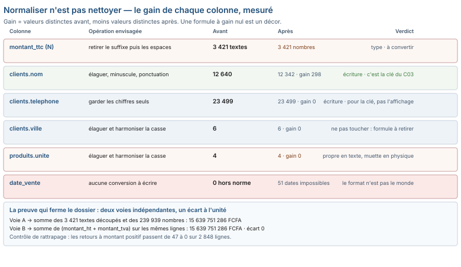

# Module M04.C05 — Normaliser et rendre comparable : changer l'écriture, jamais la valeur

**Outil de ce chapitre : le tableur (formules de texte et Power Query), sur `ventes_brutes.csv`, `clients.csv`, `produits.csv`, `objectifs_de_ca.csv`, `remises_manuelles.xlsx` et `tarif_fournisseur_peinture.csv`. Durée indicative : 5 h. Niveau : N2.**

> **L'idée du chapitre.** Nettoyer retire des lignes ; normaliser ne retire rien. Normaliser change **l'écriture**
> d'une valeur en gardant **la valeur**, pour que deux lignes qui parlent du même objet puissent se reconnaître, et
> pour qu'une colonne cesse d'être du texte quand elle devrait être un nombre. Le socle de données donne de cette
> opération quatre leçons mesurées, et chacune se vérifie en une ligne de contrôle. (1) Les 3 421 montants écrits en
> texte se reconvertissent par deux voies indépendantes — découper le texte, ou sommer `montant_ht + montant_tva` —
> et les deux rendent 15 639 751 286 FCFA, écart de 0 franc. (2) La mise en forme est une information : les 412
> lignes que la référence retire du fichier clients portent **toutes** deux anomalies d'écriture, et **aucune** des
> 23 500 autres ne les porte. (3) Normaliser ne rend pas juste : 0 date de vente sur 243 360 n'est hors norme, et
> pourtant 51 lignes portent une date postérieure à la date du relevé. (4) L'écriture fabrique les comparaisons :
> la table d'objectifs attend 220 cases, en contient 218, et ce n'est qu'après avoir typé la clé que l'on voit
> lesquelles manquent.

> **Base de travail.** `01_socle_donnees/data/brut/ventes_brutes.csv` (243 360 lignes × 20 colonnes),
> `01_socle_donnees/data/brut/clients.csv` (23 912), `01_socle_donnees/data/brut/produits.csv` (154),
> `01_socle_donnees/data/brut/objectifs_de_ca.csv` (218 lignes, séparateur `;`),
> `01_socle_donnees/data/brut/remises_manuelles.xlsx` (18 200),
> `01_socle_donnees/data/brut/tarif_fournisseur_peinture.csv` (38 lignes utiles, encodage Windows-1252),
> `01_socle_donnees/data/reference/ventes_propres.csv`, `clients_propres.csv` et `dictionnaire_produits.csv`.
> Tous les nombres de ce chapitre viennent de ces fichiers, relevés par `01_socle_donnees/scripts/chiffres_manuel.py`.

---

## 1. Objectifs du chapitre

À la fin de ce chapitre, vous saurez :

- **distinguer** trois gestes qu'on confond : normaliser (changer l'écriture), nettoyer (retirer des lignes), changer
  de convention (redéfinir ce que la colonne veut dire) — et nommer lequel vous êtes en train de faire ;
- **convertir** une colonne monétaire stockée en texte par un découpage dont on prouve qu'il ne perd rien, et écrire
  le contrôle de convergence qui ferme le dossier à 0 franc près ;
- **mesurer le gain** d'une normalisation avant de l'écrire (`12 640` noms distincts deviennent `12 342`, la ville
  ne gagne rien : 6 modalités avant, 6 après) et supprimer la formule qui n'apporte rien ;
- **importer sans perte** un fichier à séparateur `;`, à décimales par virgule, en Windows-1252 et à en-tête
  décalé, en chiffrant ce que le mauvais réglage coûte de caractères ;
- **ranger les opérations** dans l'ordre qui fait que chaque étape est vérifiable, et refuser les trois normales qui
  abîment : l'arrondi des montants, la casse sur un code, la réécriture sur place.

## 2. Pourquoi cette notion est importante

Un tableau croisé qui affiche douze lignes « par mois » au lieu de dix, une jointure qui rend 0 correspondance alors
que les deux fichiers parlent des mêmes clients, un total de chiffre d'affaires en texte que la fonction SOMME ignore
: tous ces accidents viennent du même endroit, et aucun n'est un problème de saisie. Voici ce que le socle montre
quand on pose la question « la valeur est-elle juste ? » séparément de « son écriture est-elle comparable ? ».

| Ce que vous croyez avoir | Ce que le fichier contient | Ce que ça coûte |
|---|---|---|
| Une colonne de montants numériques | 239 939 nombres et 3 421 textes dans la même colonne N | le SOMME est faux de 3 421 lignes, le filtre « plus grand que » les ignore |
| Un fichier clients sans doublon | 412 lignes au nom encadré d'espaces et au téléphone sans espaces | 412 clients comptés deux fois, 11 158 fusionnés à tort si l'on corrige à l'envers |
| Une table d'objectifs complète | 218 lignes là où la grille en prévoit 220 | un magasin sans objectif pendant deux mois, classé « sous performance » par un tool qui lit 0 |
| Une jointure entre deux fichiers | `id_client` nombre dans le classeur, texte dans le CSV | 0 ligne jointe, sans message d'erreur, dans Power Query |

Le point commun : **aucun de ces défauts ne produit d'erreur à l'écran**. Le tableur accepte le mélange de types,
la jointure ratée rend un tableau vide proprement, le texte non converti se somme à zéro silencieusement. C'est
pourquoi la normalisation est un métier et non un réglage : elle consiste à rendre visible, avant de rendre propre.

> **Définition.** On appelle **normalisation** toute transformation *bijective à l'identifiant près* appliquée à une
> valeur, qui change sa représentation et non sa signification : `+226 77 76 25 98 96` et `+2267776259896`
> désignent le même abonné ; `16 638 FCFA` et `16638` désignent la même somme. Le test de la normalisation est donc
> double : deux écritures qui désignent le même objet doivent devenir identiques (**rapprocher**), et deux écritures
> qui désignent des objets différents doivent rester distinctes (**ne pas confondre**). Une transformation qui ne
> fait que le premier est une perte d'information ; une transformation qui rate le second est une faute.

## 3. Explication simple

Regardez deux lignes du fichier clients, telles qu'elles sont écrites dans
`/home/user/formation-data-bi/01_socle_donnees/data/brut/clients.csv` (ligne 2 et ligne 23 502, à vérifier avec
`grep -n "SARL K" clients.csv`) :

```
2,     SARL k, Entreprise, Koudougou, ..., +226 78 62 21 81 98, , 2022-03-15, ...
23501,   SARL K , Entreprise, Koudougou, ..., +2267862218198,    , 2022-03-15, ...
```

Même ville, même date de création, mêmes conditions de paiement, même plafond, même courriel absent. Le nom change de
casse et gagne deux espaces ; le téléphone perd ses espaces et ne change pas de numéro. Un être humain lit un seul
client. Le tableur lit deux chaînes différentes, le tableau croisé affiche deux lignes, la jointure compte deux
clients. Ce n'est pas que le fichier soit sale : c'est que **deux écritures n'ont rien de comparable tant qu'elles
n'ont pas été ramenées à une norme d'écriture commune**.

Maintenant l'opération inverse, celle qui fait le plus de dégâts. On décide d'« harmoniser » : `SUPPRESPACE()` pour
rogner les espaces, `MINUSCULE()` pour unifier la casse. Regardons ce que ça donne sur la colonne qui compte vraiment,
le montant :

```
16 638 FCFA  →  SUPPRESPACE →  16 638 FCFA   (rien ne change : les espaces sont à l'intérieur, pas autour)
16 638 FCFA  →  CNUM(SUPPRESPACE(...)) →  #VALUE!   (le texte n'est pas un nombre)
16 638 FCFA  →  CNUM(SUBSTITUE(...;" FCFA";"")) →  #VALUE!   (l'espace de milliers reste collé)
16 638 FCFA  →  CNUM(SUBSTITUE(SUBSTITUE(...;" FCFA";"");" ";"")) →  16638   (enfin)
```

Quatre formules, une seule marche. Cette progression est tout le chapitre : la normalisation n'est pas un bouton,
c'est une suite de décisions sur **ce que signifie chaque caractère** de la cellule — ici, trois espaces dont deux
sont des séparateurs de milliers et un est un séparateur de devise.

## 4. Vocabulaire essentiel

| Terme | Ce que ça désigne, dans ce chapitre |
|---|---|
| Écriture (représentation) | La suite de caractères de la cellule : `16 638 FCFA` |
| Valeur | Ce que l'écriture décrit : seize mille six cent trente-huit francs |
| Typage | Attribuer à une colonne le bon type : nombre, date, texte, booléen |
| Élagage | Retirer ce qui entoure la valeur : `SUPPRESPACE()` pour les espaces, `CLEAN()` / `Text.Clean` pour les caractères de contrôle |
| Harmonisation de casse | Ramener majuscules et minuscules à une forme unique — utile sur un nom, interdite sur un code |
| Séparateur de milliers | L'espace (ou la virgule, ou le point) qui découpe les groupes de trois chiffres dans un nombre écrit en texte |
| Encodage | La table qui traduit des octets en caractères : UTF-8, Windows-1252, ISO-8859-1 |
| BOM | Bytes-mark : trois octets `EF BB BF` en tête d'un fichier UTF-8, qui deviennent `` si on se trompe de table |
| Conversion d'unité | Multiplier par un facteur défini par la physique : 1 m³ = 1 000 L — ce n'est **pas** une normalisation de texte |
| Table de correspondance | Un fichier qui traduit une écriture en une autre, avec une décision documentée derrière chaque ligne |
| Clé de jointure | La ou les colonnes sur lesquelles deux tables se reconnaissent ; elle doit être normalisée **avant** la jointure |
| Protocole de normalisation | La liste ordonnée des transformations appliquées, avec pour chacune l'effet mesuré sur le nombre de lignes et de valeurs distinctes |

## 5. Cours approfondi

### 5.1 Trois objets, trois traitements — et ne pas les mélanger

Une colonne peut être fautive à trois niveaux, qui ne se réparent pas du tout de la même façon.

| Niveau | Question à poser | Opération licite | Dans le socle | Ce qui serait une faute |
|---|---|---|---|---|
| Le type | La cellule est-elle du nombre ou du texte ? | Convertir, en gardant la valeur | 3 421 montants en texte | Imputer, arrondir, recalculer le montant |
| L'écriture | Deux formes décrivent-elles le même objet ? | Élaguer, unifier la casse, retirer les séparateurs | 412 noms surchargés d'espaces | Retirer une ligne, fusionner deux homonymes |
| Le sens | La valeur dit-elle ce qu'on croit ? | Reconstituer ou documenter, jamais « corriger » | 973 taux de remise à 12, 18, 25, 30 | Diviser par 100 sans test de réparation |

Le troisième niveau est celui du chapitre précédent (C04) et il mérite d'être rappelé ici, parce que la tentation est
grande de le traiter comme un problème de format. Diviser `taux_remise` par 100, c'est **changer la convention** de
la colonne : on décide que le nombre 30 signifiait 30 %. Si c'est vrai, ça se prouve (ça ne se vérifie pas : le test
de réparation du C04 montre que 258 lignes sortent alors du domaine contractuel). Une normalisation, elle, ne
prétend rien sur le sens. Elle ne fait que rendre lisible une valeur dont tout le monde est d'accord.

> **À retenir.** La question qui précède toute formule : *est-ce que je change l'écriture, la ligne, ou le sens ?*
> Écrire la réponse en tête de chaque colonne ajoutée (`_ecriture`, `_ligne`, `_sens`). Vous verrez alors
> immédiatement si une même colonne cumule deux natures d'opération — et il faudra la scinder.

### 5.2 Les montants texte : découper, puis prouver par une seconde voie

Colonne `montant_ttc` (colonne N de `ventes_brutes.csv`) : 239 939 cellules numériques, 3 421 non vides et non
numériques, 0 vide. Anatomie de ces 3 421, mesurée caractère par caractère :

| Ce qu'on cherche | Combien | Ce que ça impose |
|---|---|---|
| Suffixe « FCFA » détaché par une espace | 3 421 sur 3 421 | Un `SUBSTITUE` suffit, aucun `STXT` |
| Au moins deux espaces (séparateur de milliers) | 3 410 sur 3 421 | Les 11 autres sont des montants à trois chiffres : `680 FCFA` |
| Virgule décimale | 0 | Pas de problème de locale à régler ici |
| Espace insécable (U+00A0) | 0 | Le `SUBSTITUE(...;CAR(160);"")` de réflexe ne sert à rien — et le vérifier évite un après-midi de recherche |
| Formes distinctes après avoir masqué les chiffres | 8 | Le suffixe est toujours détaché par une espace, le signe moins précède le nombre, et le seul écart notable est le nombre de groupes de trois chiffres |
| Montants négatifs | 47 | Ce sont les 47 retours sans montant, pas des erreurs |
| Réparables par le découpage `FCFA` + espaces | 3 421 sur 3 421 | La formule tient, sans exception à traiter à la main |

La ligne à `3 782 047 FCFA` (le plus gros texte) et celle à `-193 284 FCFA` (le plus petit) passent toutes les deux.
Et surtout : **les 47 textes négatifs sont exactement les 47 lignes de retour dont le montant manquait**. Une fois
converties, le contrôle « toute ligne de retour porte un montant négatif » passe sur 2 848 lignes sur 2 848, alors
qu'il échouait sur 47 avant. La normalisation ne s'est pas contentée de changer un type : elle a fait passer un
deuxième contrôle de 47 lignes ratées à zéro.

Reste à prouver que le découpage n'a rien inventé. Deux voies indépendantes :

```
Voie A (découpage du texte) :  somme des 3 421 textes convertis + somme des 239 939 nombres = 15 639 751 286
Voie B (reconstitution)      :  somme de (montant_ht + montant_tva) sur les mêmes lignes        = 15 639 751 286
Contrôle                     :  écart = 0
```

Zéro franc d'écart, à l'unité près. C'est ce qui autorise à écrire dans le registre « colonne reconvertie, aucune
valeur perdue » — et non « colonne reconvertie, semble correcte ».

> **Définition.** Un **contrôle de convergence** fait arriver le même résultat par deux chemins qui n'ont aucune
> raison de se ressembler : l'un lit ce que l'opérateur a tapé, l'autre recalcule depuis d'autres colonnes.
> Convergence à 0 ⇒ la transformation est une écriture différente de la même information. Écart non nul ⇒ au moins
> un des deux chemins est faux, et il faut chercher lequel **avant** de décider lequel est juste.

> **Attention.** La convergence à 0 n'a été possible que parce qu'aucune autre colonne n'a été « réparée » au passage.
> Si vous aviez divisé `taux_remise` par 100 (voir C04 §5.3) avant de faire ce calcul, `montant_ht` ne serait plus
> indépendant du texte : les deux voies se ressembleraient par construction et le contrôle ne prouverait plus rien.
> Un contrôle croisé exige que les deux voies restent **indépendantes** — donc il se fait avant les corrections de
> sens, pas après.

### 5.3 Mesurer le gain avant d'écrire la formule

Le réflexe « appliquer `SUPPRESPACE` et `MINUSCULE` à toutes les colonnes de texte » coûte trois colonnes, ralentit
le fichier et ne répare souvent rien. Le gain se mesure, en une ligne, colonne par colonne : nombre de valeurs
distinctes avant, après ; nombre de lignes modifiées.

| Colonne | Modalités avant | Modalités après normalisation | Verdict |
|---|---|---|---|
| `clients.nom` (brut → normalisé) | 12 640 | 12 342 | 298 écritures différentes d'un même nom : à normaliser, et c'est ce qui rend la clé du C03 possible |
| `clients.telephone` | 23 499 textes distincts | 23 499 numéros après retrait des non-chiffres | un numéro porté par deux écritures : à normaliser pour la clé, pas pour l'affichage |
| `clients.ville` | 6 | 6 | aucun gain : `MAJUSCULE()` serait du décor |
| `produits.unite` | 4 | 4 | aucun gain textuel — mais 4 **unités physiques**, qui est un autre problème (voir 5.5) |
| `clients.email` | 7 398 remplis | 7 398 | rien à reformater ; les 16 514 cas sans `@` sont des champs vides, pas des adresses cassées |

Deux enseignements. D'abord, une anomalie d'écriture peut être un **indice** plus précieux qu'une saleté : les 412
lignes retirées de `clients.csv` portent toutes un nom encadré d'espaces (412 sur 412) et un téléphone sans espaces
(412 sur 412), alors que **0** des 23 500 lignes conservées porte la première anomalie. Autrement dit, la mise en
forme signale ici exactement le bloc à retirer. C'est le genre de coïncidence qu'on ne découvre qu'en comptant, et
qui change la nature d'un contrôle : on ne supprime plus « les doublons trouvés par une règle de similarité », on
supprime « les lignes marquées par une anomalie de format », ce qui est déterministe et rejouable.

> **Dans les faits.** Le lot des 412 doublons clients a été repéré à l'aveugle par une règle de
> similarité, puis reproduit par une règle de format (412 sur 412, et 0 faux positif sur les 23 500 lignes
> conservées). Les deux méthodes tombent d'accord une fois ; elles ne le seront plus la suivante, parce que la règle
> de format décrit un import passé et non une propriété durable du client. Un protocole de normalisation doit donc
> distinguer explicitement la **règle de décision** (le contenu de la clé) de l'**indice de rejeu** (la mise en
> forme du lot), et écrire à côté de l'indice qu'il ne vaut plus rien dès que la source change de poste de saisie.

Ensuite, un champ **vide** n'est pas un champ mal formaté. `m04_clients_email_sans_a_robase` vaut 16 514 : ce ne sont
pas 16 514 adresses illisibles, ce sont 16 514 absences (le C02 a nommé le mécanisme). Une normalisation appliquée à
une absence produit un objet faux : `NORMALISE("")` peut rendre `@`, `0`, une ligne blanche selon la formule — un
texte non vide là où il y avait une absence, donc une valeur comptable là où il n'y en avait pas. Le contrôle
d'après-normalisation est simple : le nombre de cellules vides ne doit pas bouger.

> **Conseil professionnel.** Écrivez la mesure de gain **avant** la formule, dans le même onglet : trois cellules,
> `=NBCAR.SI(...)` ou un compteur de modalités, avant, après, écart. Quand on vous demandera dans six mois pourquoi
> la colonne `nom_normalise` existe, vous répondrez avec un chiffre, pas avec une intention.

### 5.4 Les dates : la norme est respectée, la réalité non

Sur `date_vente` des 243 360 lignes : 0 valeur qui ne soit pas exactement `AAAA-MM-JJ`. Sur `date_creation` des
23 912 lignes de `clients.csv` : 0 hors norme. Il n'y a donc **aucune conversion de date à écrire** dans ce socle —
et c'est une information, pas un hasard : le format ISO est précisément conçu pour que l'ordre alphabétique soit
l'ordre chronologique, et pour que la locale du poste n'ait aucune prise sur lui.

Ce qui ne va pas, ce sont les valeurs : 51 lignes portent une date postérieure au 31 août 2026, la plus tardive
étant le 2026-12-06, alors que le relevé s'arrête fin août. Ces 51 dates sont **parfaitement normales** et
**physiquement impossibles** : elles passent tous les contrôles de format et aucun contrôle de domaine.

La conséquence pratique est la règle suivante : *jamais* de contrôle de validité sur une date réduit à « est-ce que
ça se lit comme une date ». Celui-là ne dit que ce que le tableur sait déjà. Trois contrôles, dans l'ordre, et le
premier n'est pas celui qu'on croit :

| Contrôle | Forme à écrire | Résultat sur le socle |
|---|---|---|
| Homogénéité de la norme | toutes les valeurs matchent `^[0-9]{4}-[0-9]{2}-[0-9]{2}$` | 0 exception |
| Domaine | `date` entre la première date d'exploitation et la date du relevé | 51 lignes hors domaine |
| Cohérence entre colonnes | `date_vente` de la ligne = date du ticket (toutes lignes d'un même `id_ticket`) | contrôle à écrire, c'est celui qui attrape les dates recopiées de travers |

> **À retenir.** Normaliser une date, c'est aligner son écriture. Valider une date, c'est la confronter au monde.
> Les 51 lignes futures ne se réparent pas par une formule : elles se décident (les exclure du périmètre d'analyse
> et le dire, ou les faire corriger par la source). Écrire « dates normalisées » pour ce lot serait un mensonge
> technique — l'écriture n'était pas le problème.

### 5.5 Unités et correspondances : ce qui demande un facteur, pas une formule

> **Définition.** Une **conversion d'unité** multiplie une valeur par un facteur fixé par une définition
> extérieure au fichier (1 m³ = 1 000 L), et change le nom de la colonne en conséquence : `quantite` devient
> `quantite_litres`. Une **harmonisation d'écriture** ne change ni le facteur ni le nom : `LITRE`, `litre ` et
> ` Litre` deviennent `litre`. Confondre les deux produit un nombre juste dans une colonne mal nommée, ce qui est le
> genre d'erreur qui se propage à tous les tableaux suivants sans jamais plus se signaler.

`produits.csv` porte une colonne `unite` avec 4 modalités : 122 produits en `unité`, 14 en `litre`, 12 en `sac`,
6 en `m3`. Aucune variante de casse, aucun espace parasite : en tant que texte, cette colonne est propre. En tant
que physique, elle est inerte — et c'est là que le piège se referme. Une somme de « volumes » sur ce champ additionne
des mètres cubes et des litres comme s'ils étaient la même chose. Le correctif n'est pas une fonction texte : c'est
un **facteur de conversion** porté par une table, 1 m³ = 1 000 L, et une colonne `quantite_en_litres` qui n'existe
que pour les lignes où la question a un sens.

Le fichier `tarif_fournisseur_peinture.csv` montre la même collision, aggravée. Ses 38 lignes utiles ont toutes
`conditionnement = 10 L` (1 modalité seulement) et `unite_mesure = litre`, alors que les libellés décrivent des tubes
en millimètres vendus au mètre linéaire (`Tube PVC évacuation 100 mm (ml)`). Trois colonnes, trois vocabulaires
d'unité, et aucune ne permet de raisonner sur le stock. Ce n'est pas une saleté à élaguer : c'est un **dictionnaire
à écrire avec le magasin**, et il se solde par une colonne de plus, pas par une formule de moins.

Côté catégories, la leçon est inverse : `produits.csv` en compte 15 modalités, le dictionnaire de référence 7, et
44 lignes portent un intitulé hétéroclite. Ici, la normalisation **par table de correspondance** est la bonne
opération, et le C03 a montré pourquoi : une correspondance est une décision documentable, une formule ne l'est pas.
La règle de tri est donc :

- si la transformation s'énonce sans dictionnaire (`SUPPRESPACE`, minuscule, retrait d'un suffixe), c'est de la
  normalisation : elle s'écrit en formule et elle est gratuite à rejouer ;
- si elle exige de dire « cette écriture-là veut dire cet objet-ci » (`enduits` + `peinture` → un seul poste,
  `m3` → des litres), c'est une correspondance ou une conversion : elle s'écrit dans une **table**, avec une source
  et une date, sinon vous n'aurez pas à montrer votre travail.

### 5.6 Importer sans rien casser : séparateur, décimales, encodage, en-tête

Un fichier est quatre décisions de lecture, et le socle en contient un exemplaire de chaque mauvaise :

1. **Le séparateur.** `ventes_brutes.csv` est à virgule ; `objectifs_de_ca.csv` et
   `tarif_fournisseur_peinture.csv` sont à point-virgule. Ouvrir le second avec le réglage du premier produit une
   seule colonne de texte, et le tableur ne dit rien : il affiche une très longue colonne A.
2. **La décimale.** `tarif_fournisseur_peinture.csv` écrit ses prix `2900,57` et sa TVA `0,18` ;
   `objectifs_de_ca.csv` écrit sa marge `0.195`. En français, l'un se lit correctement et l'autre devient du texte
   (ou l'inverse selon la version d'Excel). Le contrôle est immédiat : la colonne importée doit être **de type
   nombre** et son total doit égaler `SOMME` calculé sur le texte découpé.
3. **L'encodage.** `tarif_fournisseur_peinture.csv` pèse 2 482 octets dont 95 ne sont pas ASCII, et ne se décode pas
   en UTF-8 du tout : l'octet 73 est illégal. C'est du Windows-1252. La nuance qui fait mal : Windows-1252 et
   ISO-8859-1 (le « Latin 1 » du sélecteur Excel) sont identiques sur 223 des 256 octets, et **differents sur les 39
   octets** que ce fichier contient justement entre `0x80` et `0x9F` — les tirets demi-cadratin `—` qui séparent le
   libellé de la référence fournisseur. Choisir « ISO Latin 1 » n'affiche pas de caractère bizarre : ça insère des
   caractères de contrôle invisibles, que la recherche ne retrouve plus et que l'impression avale.
4. **L'en-tête décalé.** Les trois premières lignes du fichier de tarif sont du bruit d'export
   (`export genere depuis ELODIE v3`, `edition le 17/09/2026`, le nom du fournisseur). L'en-tête réelle est ligne 4.
   Un import aveugle nomme les colonnes d'après la ligne 1 et perd le vrai nommage.

Quant aux CSV proprement dits : 5 des 10 fichiers du dossier `data/brut/` portent un BOM (trois octets `EF BB BF`
avant le premier caractère). Lus en UTF-8 sans retirer le BOM, rien d'anormal ne se produit ; forcés en Windows-1252
— le réglage par défaut de l'assistant d'importation legacy — l'en-tête de `ventes_brutes.csv` ne s'appelle plus
`id_vente` (8 caractères mesurés dans le fichier) mais `id_vente` (11 caractères mesurés après décodage). Onzième
caractère invisible pour l'œil, premier caractère de tous vos noms de champs. Le contrôle coûte deux secondes :
regarder la longueur du premier en-tête importé.

> **Définition.** Un **encodage** est une table de correspondance octet → caractère. UTF-8 en est une où les
> caractères non ASCII occupent plusieurs octets ; Windows-1252 et ISO-8859-1 en sont où chaque octet vaut un
> caractère, avec 39 cas de divergence. Une erreur d'encodage est **réversible** tant que vous n'avez pas sauvegardé,
> irréversible après : les octets d'origine ont été remplacés. D'où la règle de non-réécriture : on ne sauvegarde
> jamais un import dans le fichier source, on écrit un fichier dérivé.

### 5.7 Les clés : normaliser pour que les jointures disent quelque chose

Trois accidents de ce socle, tous mesurés, viennent de ce qu'une clé n'a pas été typée avant usage.

- **Nombre contre texte.** `remises_manuelles.xlsx` porte `id_client` en entier ; `clients.csv` le porte en texte.
  Le contenu, lui, est bon : 1 400 clients distincts dans les remises, **0** absent de la fiche clients. Dans Power
  Query, une fusion sur ces deux colonnes ne lève aucune erreur et rend un tableau vide. La première étape de toute
  requête est donc un `Table.TransformColumnTypes` sur les colonnes de clé — pas une élégance, une nécessité.
- **La grille attendue n'est pas la grille reçue.** `objectifs_de_ca.csv` couvre 5 magasins et 44 mois : la grille
  complète aurait 220 lignes, elle en a 218. Les 2 manquantes sont consécutives (février et mars 2024) et
  n'affectent qu'un magasin, le n° 4 — signature d'un export interrompu ou d'un collé mal fini, pas d'un oubli de
  saisie. Et le magasin 6 n'apparaît nulle part dans ce fichier : 1 magasin sans objectif, trouvé en comparant deux
  jeux de clés et non en lisant le fichier.
- **L'absence, une fois encore, se déplace.** Tant que la clé n'est pas normalisée, un trou ne se voit pas : la
  jointure externe rend une ligne avec `0` ou `null` que le tableau croisé affiche comme une valeur. Après
  normalisation et jointure explicite, le trou devient une ligne nommable : « magasin 4, 2024-02, aucun objectif ».

C'est le moment de nommer l'ordre des opérations, qui est la colonne vertébrale du chapitre :

| Étape | Opération | Contrôle qui la ferme | Effet attendu |
|---|---|---|---|
| 1 | Typage des colonnes de clé et des montants | type de colonne + total de contrôle | 0 changement de valeur |
| 2 | Élagage et harmonisation des colonnes-clés et étiquettes | nb de lignes inchangé, nb de modalités réduit | ici : 298 noms fusionnés |
| 3 | Traduction par tables de correspondance | 0 clé inconnue après traduction | catégories 15 → 7 |
| 4 | Conversion d'unités (facteur) | ordre de grandeur du total | 1 000 × vérifié sur 6 lignes `m3` |
| 5 | Puis seulement : dédoublonnage (C03), règles de contrôle (C04), imputation (C02) | écart à la cible | ici : écart 0 |

### 5.8 Ce qu'une normalisation ne doit jamais faire

Quatre interdictions, chacune motivée par un chiffre de ce module.

- **Ne pas changer le nombre de lignes.** Le contrôle est brutal : 243 360 lignes avant, 243 360 après. Si le
  compte bouge, vous avez fait du nettoyage sous un nom poli — et vous ne l'avez pas dit.
- **Ne pas arrondir un montant.** Les 3 421 textes se convertissent à l'unité près ; l'écart de convergence est de 0
  *parce que* rien n'a été arrondi. Un `ARRONDI(...;-2)` sur une colonne monétaire de 243 360 lignes produit une
  erreur de plusieurs dizaines de millions de francs, et surtout la rend indétectable par un contrôle de total.
- **Ne pas toucher à la casse d'un code.** `id_ticket` a une structure porteuse (`T01-230101-000000`, où `T01` est
  le magasin) : `MAJUSCULE()` ne change rien ici, mais sur un code sensible à la casse, l'opération fusionne deux
  objets distincts. La casse s'harmonise sur les libellés destinés à l'humain, jamais sur les identifiants.
- **Ne pas écrire par-dessus.** La réversibilité est un livrable : on garde `montant_ttc_brut` et l'on ajoute
  `montant_ttc_num`. Un protocole qui détruit la source ne peut plus être audité, et ne peut plus être rejoué quand
  on découvre, deux semaines plus tard, que le suffixe était parfois `F CFA` avec une espace de trop.

> **Attention.** Le piège le plus coûteux de ce chapitre est la normalisation **par la jointure** : on rapproche
> deux colonnes de clés en faisant confiance à la table de correspondance, sans compter les clés inconnues. Ici, ce
> réflexe aurait fusionné 11 158 clients homonymes en plus des 412 doublons réels, parce que la clé « nom seul » est
> valide comme écriture et fausse comme identité. Toute jointure se ferme par deux compteurs : lignes non jointes à
> gauche, lignes non jointes à droite — et les deux ne doivent pas être zéro par omission, mais par mesure.

> **Boîte à outils du chapitre.** Cinq fonctions et deux réglages, pas davantage : `SUPPRESPACE` (élagage),
> `SUBSTITUE` (retrait d'un suffixe ou d'un séparateur), `CNUM` et son frère explicite `CNUMPARAGRAPHE` (conversion
> avec point ou virgule choisis, la seule qui ne dépende pas de votre clavier), `TEXTE(v;"00")` (remise à la même
> largeur d'une clé courte), `DATE` ou `DATEVAL` (reconstruction d'une date depuis trois colonnes). Côté Power
> Query, deux réglages : le type de colonne appliqué **en première étape**, et l'option `Encoding` / `Delimiter`
> écrite dans la requête plutôt que laissée à l'assistant.



## 6. Exemple concret : la cellule `16 638 FCFA`

Quatre formules sur la même cellule N, avec ce que chacune rend et ce qu'on en conclut.

| Formule écrite | Résultat | Diagnostic |
|---|---|---|
| `=CNUM(SUPPRESPACE(N2))` | erreur | l'espace est à l'intérieur, pas autour : l'élagage ne peut rien |
| `=CNUM(SUBSTITUE(N2;" FCFA";""))` | erreur | reste `16 638`, l'espace de milliers bloque la conversion |
| `=CNUM(SUBSTITUE(SUBSTITUE(N2;" FCFA";"");" ";""))` | 16638 | correct ; 3 421 lignes sur 3 421 passent |
| `=CNUMPARAGRAPHE(SUBSTITUE(SUBSTITUE(N2;" FCFA";"");" ";"");".";",")` | 16638 | correct et insensible à la locale du poste — à préférer dans un fichier qui circule |

Trois précisions qui évitent des heures de recherche :

- les 11 lignes sans séparateur de milliers (`680 FCFA`, `977 FCFA`) ne sont pas un cas à part pour la formule — le
  double `SUBSTITUE` les traite — mais elles **le deviennent** pour une formule qui découperait « les trois
  derniers chiffres » à la main ;
- `CAR(160)` (espace insécable) ne sert pas ici : mesuré 0 occurrence. Cette mesure est un gain de temps, pas une
  perte de temps ;
- le total de contrôle doit être écrit **avant** de recopier la formule vers le bas sur 243 360 lignes, sinon vous
  ne saurez plus contre quoi le comparer.

## 7. Démonstration pas à pas : le protocole de normalisation en dix étapes

L'exercice se fait sur une copie de `ventes_brutes.csv` importée par Power Query, et sur `clients.csv`. Notez que
chaque étape se termine par un chiffre écrit dans un onglet `CONTROLES`.

```
0. Import.  Données > À partir d'un fichier texte/CSV. ventes_brutes.csv : délimiteur "virgule",
            encodage "UTF-8 (avec BOM)", en-tête présent. objectifs_de_ca.csv : délimiteur "point-virgule".
            tarif_fournisseur_peinture.csv : encodage "1252 : Europe occidentale (Windows)", 3 lignes à sauter.
1. Compter avant.  Lignes = 243 360 ; clients = 23 912 ; objectifs = 218. Écrire ces trois nombres.
2. Typer les clés.  Table.TransformColumnTypes sur id_vente, id_ticket, id_client, id_produit, date_vente,
                    montant_ht, montant_tva, montant_ttc : la conversion échoue sur 3 421 lignes -> elles
                    deviennent null, et c'est exactement ce qu'on cherchait : le compteur de null signale le lot.
3. Réparer les null de montant_ttc par découpage.  En requête :
                    Text.Select([montant_ttc]; {"0".."9"; "-"})  puis  Number.FromText
                    (retient les chiffres et le signe, laisse "FCFA" derrière ; 3 421 valeurs, 0 échec).
4. Contrôler la convergence.  Somme colonne N après réparation = 15 639 751 286 ; somme de (montant_ht + montant_tva)
                    sur les mêmes lignes = 15 639 751 286 ; écart = 0. Écrire l'écart, pas seulement les deux totaux.
5. Normaliser les colonnes d'étiquette, et mesurer le gain.  clients.nom : SUPPRESPACE + MINUSCULE + ponctuation
                    retirée -> 12 640 modalités deviennent 12 342. clients.ville : 6 -> 6. Conclusion : on garde la
                    colonne nom_normalise, on ne crée pas ville_normalise.
6. Écrire la clé, pas la valeur, quand la jointure l'exige.  cle_client = nom_normalise "|" + Text.Select(telephone;
                    {"0".."9"}) -> 412 groupes de deux lignes, 0 groupe de trois (le C03 en a besoin, pas la ville).
7. Remettre à la même largeur les clés courtes.  ici, rien à faire : le test (12 modalités de mois avant, 12 après)
                    montre que la padding n'est pas le problème de ce fichier. Écrire "0 transformations nécessaires".
8. Traduire par table.  catégories : jointure à dictionnaire_produits.csv (15 -> 7) ; 0 code produit inconnu après
                    traduction, sinon on s'arrête et on complète la table.
9. Convertir les unités avec facteur, pas avec formule.  produits.unite : table de conversion (m3 -> 1 000 L) ;
                    ne pas additionner `m3` et `litre` dans un même total de volume.
10. Compter après.  Lignes = 243 360 (inchangé), clients = 23 912 (inchangé). Écarts = 0. Le protocole est clos,
                   et il ne contient aucune suppression : le dédoublonnage viendra après, au C03, avec son propre compteur.
```

## 8. Erreurs fréquentes

- **Confondre absence et format.** Appliquer une normalisation aux 16 514 courriels vides crée des chaînes non vides
  là où il n'y avait rien ; le compte de valeurs « renseignées » augmente, ce qui a l'air d'une amélioration.
- **N'utiliser que `SUPPRESPACE`** sur `16 638 FCFA` : les espaces intérieures survivent, la conversion échoue, et
  l'opérateur conclut que le fichier est irrécupérable.
- **Supposer l'espace insécable** sans le compter, puis chercher trois heures un caractère qui n'existe pas.
- **Normaliser en écrasant la colonne source** : après sauvegarde, plus aucun contrôle croisé n'est possible, et le
  BOM mal décodé est devenu le nom définitif de vos champs.
- **Choisir ISO-8859-1 plutôt que Windows-1252** sur le fichier de tarif : 39 caractères deviennent invisibles, et la
  recherche sur un libellé ne retrouve plus la ligne.
- **Faire la jointure avant le typage** : 0 ligne rapprochée entre le classeur de remises (clés numériques) et le
  CSV clients (clés texte), alors que 0 client n'existe pas dans la fiche.
- **Arrondir « pour que ça tienne »** : 3 421 conversions à l'unité près valent un écart de 0 ; un arrondi à la
  centaine fait disparaître le seul contrôle qui prouvait la justesse du découpage.

## 9. Bonnes pratiques professionnelles

| Pratique | Mise en œuvre au tableur | Ce qu'elle garantit |
|---|---|---|
| Types fixés en première étape | `Table.TransformColumnTypes` sur toutes les colonnes de clé et monétaires | aucune jointure silencieusement vide |
| Une colonne ajoutée, jamais écrasée | `x_brut` reste, `x_normalise` s'ajoute | réversibilité et audit |
| Gain mesuré avant écriture | nb de modalités avant / après, nb de lignes modifiées | pas de formule décorative dans le fichier |
| Contrôle de convergence à l'unité | deux chemins, un écart, une case | la réparation ne invente rien |
| Compteurs de non-jointure aux deux bouts | lignes sans correspondance gauche, puis droite | les trous deviennent nommables |
| Encodage et séparateur écrits dans la requête | options explicites, jamais l'assistant par défaut | le rejou est identique sur un autre poste |
| Protocole daté dans le classeur | onglet `PROTOCOLE` : ordre, auteur, date, effet mesuré | on répond à une question dans six mois sans rouvrir le code |

## 10. Exercice guidé — reconvertir une colonne monétaire et le prouver (35 min, /10)

Contexte : on vous demande de livrer un chiffre d'affaires mensuel. La colonne `montant_ttc` refuse de se sommer
entièrement. Vous devez produire une colonne exploitable et la preuve qu'elle ne déforme rien.

1. **1 pt** — Importer `ventes_brutes.csv` en gardant toutes les colonnes en texte (réglage explicite du
   séparateur et de l'encodage). Combien de lignes ?
2. **1 pt** — Taper `montant_ttc` en nombre. Combien de `null` apparaît ? Que faut-il en conclure sur la nature du
   défaut : absence, ou écriture ?
3. **1 pt** — Compter, sur ces lignes seulement, les trois traits suivants : présence de « FCFA », au moins deux
   espaces, présence d'une virgule. Quel réglage de conversion cela impose-t-il ?
4. **1 pt** — Écrire la formule de conversion qui passe sur les 3 421 lignes. En déduire ce que deviennent les 11
   lignes à trois chiffres.
5. **1,5 pt** — Calculer le total de la colonne réparée, puis celui de `montant_ht + montant_tva` sur les mêmes
   lignes, et écrire l'écart.
6. **1 pt** — Compter les lignes de retour au montant positif avant et après votre conversion. Quel second contrôle
   vient de passer ?
7. **1,5 pt** — Écrire dans l'onglet `CONTROLES` la fiche de l'opération : source, transformations dans l'ordre,
   nombre de lignes avant/après, les deux totaux, l'écart, le nom des deux colonnes ajoutées, la date.
8. **2 pt** — Un collègue propose d'ajouter `ARRONDI(...; -2)` pour « lisibilité des tableaux de bord ». Chiffrez ce
   que ça change au total annuel et concluez. (Indice : vous avez 240 000 lignes propres à comparer, et l'écart
   accepté sur le chiffre d'affaires était de 2 111 789 FCFA avant réparation.)

## 11. Exercices autonomes

**Exercice 1 — Le gain, avant la formule (20 min).** Sur `clients.csv`, écrivez pour `nom`, `ville`, `telephone`,
`email`, `conditions_paiement` une ligne de mesure : modalités avant, modalités après normalisation (élagage +
casse + ponctuation retirée), lignes modifiées. Classez les colonnes en trois colonnes : à normaliser pour une clé /
à normaliser pour un affichage / à ne pas toucher. Justifiez chaque « à ne pas toucher » par un chiffre.

**Exercice 2 — L'import hostile (25 min).** Importez `tarif_fournisseur_peinture.csv` deux fois : une fois en
Windows-1252 avec 3 lignes sautées, une fois en ISO-8859-1 sans rien sauter. (a) Combien de colonnes dans chaque
cas, et pourquoi ? (b) Comptez les caractères dont les deux imports divergent ; vérifiez que ce nombre correspond
à une fenêtre précise d'octets, en comparant les deux tables. (c) Le prix `2900,57` : combien de lignes se lisent en
nombre, combien en texte, selon la locale choisie ? Écrivez la formule qui rend le résultat indépendant de la locale.

**Exercice 3 — Les clés qui manquent (30 min).** Construisez la grille complète `magasin × mois` à partir de
`objectifs_de_ca.csv` (5 magasins, 44 mois) et joignez-y la table reçue. (a) Combien de cases attendez-vous, combien
en trouvez-vous, lesquelles manquent ? (b) Ajoutez `magasins.csv` à la comparaison : que découvre-t-on de plus ?
(c) Votre tableau croisé affichera-t-il les trous comme des zéros ? Écrivez la mesure à ajouter pour que la
différence soit explicite.

**Exercice 4 — Le format comme preuve (20 min).** Sur les 412 lignes que `clients_propres.csv` a retirées, testez la
règle « le nom porte un espace en surplus » et la règle « le téléphone n'a pas d'espace après le préfixe ». Combien
de lignes conservées portent chacune de ces anomalies ? Écrivez la règle de dédoublonnage alternative qui découle de
ces deux compteurs, et dites ce qu'elle a de plus fragile qu'une règle sur le contenu.

## 12. Correction détaillée

**Exercice 1.** Réponses mesurées : `nom` 12 640 → 12 342 modalités, à normaliser (c'est la clé du C03) ;
`ville` 6 → 6, à ne pas toucher ; `telephone` 23 499 valeurs distinctes pour 23 912 lignes, à normaliser en chiffres
seulement (413 numéros portés par au moins deux lignes : la normalisation doit réduire l'écriture, pas l'identité) ;
`email` rien à reformater, les 16 514 sans `@` sont vides ; `conditions_paiement` à conserver en l'état pour
l'affichage, la valeur contractuelle n'est pas une écriture. Le barème est atteint dès qu'une case « à ne pas
toucher » porte un chiffre au lieu d'une intention.

**Exercice 2.** (a) En ISO-8859-1 sans saut de lignes : une seule colonne, nommée d'après la ligne 1, et 42 lignes
dont 3 de bruit ; en Windows-1252 avec 3 lignes sautées : 6 colonnes nommées correctement, 38 lignes. Le séparateur
est le `;` — la différence de nombre de colonnes vient du séparateur, pas de l'encodage. (b) 95 octets non ASCII,
dont 39 dans la fenêtre `0x80`-`0x9F` : c'est exactement le nombre de caractères qui diffère entre les deux tables,
et ce sont les tirets demi-cadratin des libellés ; en Latin-1 ils deviennent des caractères de contrôle non
recherchables. (c) Sous une locale à virgule, les 38 prix se lisent en nombres et les marges à point des objectifs
deviennent du texte ; l'inverse sous locale à point. La formule insensible est
`=CNUMPARAGRAPHE(SUBSTITUE(D2;" ";"");".";",")`, où l'on énonce explicitement le séparateur décimal et le
séparateur de milliers au lieu de les hériter du poste.

**Exercice 3.** (a) 5 × 44 = 220 cases attendues, 218 reçues, 2 manquantes : février et mars 2024 au magasin 4 —
consécutives, donc import ou collé interrompu plutôt qu'oubli de saisie. (b) En confrontant à `magasins.csv` (6
lignes), on découvre le magasin 6 : 0 case d'objectif, ce que l'exercice (a) ne pouvait pas voir, faute de référentiel.
(c) Non : un tableau croisé affichera une absence si la ligne n'existe pas dans la source, un zéro si elle existe
avec 0 — et rien ne distingue les deux à l'écran. La mesure à écrire est un compteur de lignes jointes par
`magasin × mois`, comparé au nombre de cellules du croisé ; les deux doivent être égaux, sinon le croisé ment.

**Exercice 4.** Les deux anomalies sont portées par 412 lignes sur 412, et par **0** ligne conservée. La règle
alternative est donc : retirer toute ligne dont le nom contient un espace en surplus *et* le téléphone n'est pas
formaté, ce qui rend exactement les 412 lignes de la référence. Ce qu'elle a de plus fragile : elle décrit un lot
d'import passé, pas une propriété du client. Le jour où un poste de saisie soigné produira des doublons bien formatés,
la règle ne verra plus rien — alors qu'elle aura l'air de fonctionner, parce qu'elle rendra 0 ligne à retirer. D'où
la conclusion à écrire : on documente la règle de format comme **indice de rejeu**, et la règle métier
(nom normalisé + chiffres du téléphone) comme **règle de décision**.

## 13. Mini-projet M04.P5 — « Le protocole de normalisation » (1 h 30)

Livrable unique : l'onglet `PROTOCOLE` d'un classeur, plus le fichier `ventes_normalisees.csv` qu'il décrit. Le
protocole se présente sous la forme d'une table de cinq colonnes, une ligne par transformation :

| colonne à produire | contenu attendu |
|---|---|
| `ordre` | 1 à 8, l'ordre d'application, sans trou |
| `operation` | au tableur : nom de la formule ou de l'étape Power Query |
| `objet` | la colonne visée, et sa nature (type / écriture / correspondance / unité) |
| `effet` | deux nombres : lignes modifiées, valeurs distinctes avant → après |
| `controle` | la case qui prouve que rien n'a été perdu, avec sa valeur mesurée |

Quatre exigences de forme, qui seront notées :

- aucune ligne du protocole ne retire de ligne au fichier (le compteur de lignes est identique en tête et en queue
  du protocole) ;
- le total de la colonne monétaire réparée apparaît avec son écart à la voie de reconstitution, écart écrit à 0 ;
- la normalisation des clés apparaît **avant** la ligne qui décrit la jointure aux objectifs ;
- une ligne du protocole dit explicitement « aucune transformation nécessaire » là où la mesure a montré un gain nul
  (ville, unité en tant que texte).

Barème (/10) : protocole complet et rejouable, 3 ; contrôles chiffrés et écart de convergence, 3 ; distinction des
niveaux type / écriture / correspondance / unité respectée, 2 ; absence de destruction de la source, 1 ; lisibilité
de la table (une ligne, une opération, un effet), 1.

## 14. Résumé du chapitre

Normaliser change l'écriture sans changer la valeur, et se reconnaît à ce qu'il ne retire aucune ligne : les trois
niveaux d'anomalie — type, écriture, sens — se traitent séparément, le troisième étant l'affaire des règles de
contrôle et non des formules. Sur ce socle, la conversion des 3 421 textes monétaires se fait par un double
`SUBSTITUE` qui passe sans exception, et sa justesse se prouve par convergence : 15 639 751 286 FCFA par le
découpage, le même nombre par la reconstitution `montant_ht + montant_tva`, écart de 0 franc ; le même geste fait
passer le contrôle des retours de 47 lignes ratées à 0. La mise en forme n'est pas un détail : l'espace en trop et le
téléphone sans espaces désignent les 412 lignes à retirer avec une exactitude que la ressemblance des noms n'a pas.
Le gain d'une normalisation se mesure avant de s'écrire — 298 noms gagnés, 0 sur la ville — et le zéro est une
conclusion qui s'écrit. Enfin, la norme ne dit rien du monde : 0 date mal formatée, 51 dates impossibles, et 4 unités
physiques que seule une table de conversion rend comparables.

## 15. À retenir

- **Normaliser n'est pas nettoyer** : le premier garde les lignes, le second les compte et les retire. Écrivez
  « lignes avant = après » à la fin de toute normalisation.
- **Deux voies indépendantes, un écart à l'unité** : c'est la seule preuve qu'une conversion de type n'a rien
  inventé. Le contrôle se fait **avant** toute correction de sens, pour que les voies restent indépendantes.
- **Mesurez le gain avant d'écrire la formule** : modalités distinctes avant / après, lignes modifiées. Une formule
  à gain nul est du décor qui vieillit mal.
- **Un format peut être une preuve** : 412 lignes sur 412 portent deux anomalies d'écriture, 0 ligne conservée.
  Consignez-le comme indice de rejeu, pas comme règle de décision.
- **La norme n'est pas la justesse** : 0 date hors norme ISO, 51 dates impossibles. Un contrôle de format tout seul
  ne contrôle rien.
- **Les unités ne se normalisent pas au texte** : `m3` et `litre` demandent un facteur et une table, pas une fonction.

## 16. Évaluation formative (auto-correction, 8 min)

1. Citez les trois niveaux d'anomalie d'une colonne et l'opération licite à chacun.
2. Pourquoi le contrôle de convergence sur le total doit-il précéder la correction de `taux_remise` ?
3. Combien de lignes des 3 421 textes monétaires ne comportent qu'une seule espace, et qu'est-ce que ça change à la
   formule ?
4. Une normalisation fait chuter le compteur de lignes de huit unités. Que s'est-il passé, et quelle case du
   protocole le voyait avant de livrer ?
5. `ville` a 6 modalités avant, 6 après normalisation. Que fait-on de la colonne `ville_normalisee` ?
6. Quels deux réglages d'importation suffisent à rendre le fichier de tarif lisible, et combien de caractères
   coûtent le mauvais choix d'encodage ?

*Corrigé :* (1) type → convertir ; écriture → élaguer, harmoniser la casse, retirer les séparateurs ; sens →
reconstituer ou documenter, jamais forcer. (2) Parce que la correction de sens rendrait `montant_ht` fonction de la
convention choisie : les deux voies ne seraient plus indépendantes et leur accord ne prouverait plus rien. (3) 11 —
les montants à trois chiffres (`680 FCFA`) ; rien pour le double `SUBSTITUE`, tout pour une découpe par positions.
(4) On a supprimé 8 lignes sous prétexte de format ; le compteur avant/après, écrit avant de commencer, l'aurait
signalé. (5) On ne la crée pas : un gain nul s'écrit comme une décision. (6) Séparateur `;` et encodage
Windows-1252 (plus 3 lignes sautées) ; 39 caractères, ceux de la fenêtre `0x80`-`0x9F`.
