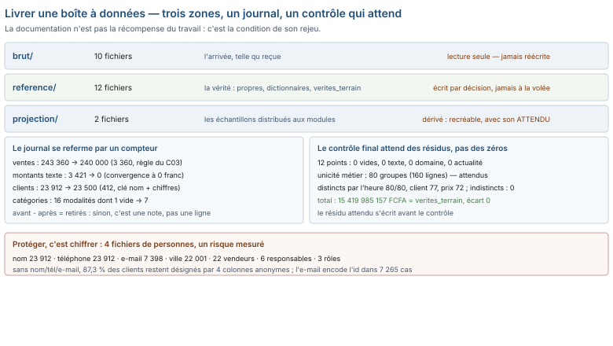

# Module M04.C06 — Documenter, nommer, protéger : la dernière étape est une écriture, pas un calcul

**Outil de ce chapitre : le tableur et l'explorateur de fichiers, sur le socle entier (24 fichiers de données), `NOTICE.md`, `verites_terrain.csv` et les paires brut → propre. Durée indicative : 5 h. Niveau : N2.**

> **L'idée du chapitre.** Cinq chapitres vous ont appris à rendre un fichier digne de confiance. Le sixième pose
> la question que personne ne veut poser en réunion : *et si vous partiez la semaine prochaine ?* La réponse ne
> tient ni dans une formule ni dans un classeur : elle tient dans quatre artefacts texte — l'arborescence, les noms,
> le README de données, le journal des transformations — plus un contrôle final qu'on sait lire et un périmètre de
> protection des données personnelles. Le socle que vous nettoyez est, lui-même, un mauvais exemple : `NOTICE.md`
> compte 56 lignes et n'y fait mention d'aucun journal, d'aucune version, d'aucun encodage, d'aucune anonymisation —
> et il n'existe aucun fichier de journal dans `data/reference/`. Le chapitre se termine donc là où le socle
> s'arrête : en vous demandant d'écrire ce qui manque, pour le socle lui-même.

> **Base de travail.** Les 24 fichiers de `01_socle_donnees/data/` (10 dans `brut/`, 12 dans `reference/`, 2 dans
> `projection/`), `01_socle_donnees/data/reference/NOTICE.md` (56 lignes, 6 sections),
> `01_socle_donnees/data/reference/verites_terrain.csv`, et les quatre paires brut → propre :
> `ventes_brutes.csv` (243 360) / `ventes_propres.csv` (240 000), `clients.csv` (23 912) / `clients_propres.csv`
> (23 500), `produits.csv` / `dictionnaire_produits.csv`, `tarif_fournisseur_peinture.csv` / `dictionnaire_produits.csv`.
> Tous les nombres viennent de ces fichiers.

---

## 1. Objectifs du chapitre

À la fin de ce chapitre, vous saurez :

- **organiser** un dossier de données en trois zones — brut, référence, projection — et dire pourquoi le brut se lit
  mais ne s'écrit jamais ;
- **nommer** des fichiers et des colonnes sans créer les deux pièges du socle : même nom, deux sens ; même chose,
  deux noms — et chiffrer le premier (12 colonnes portées par deux fichiers ou plus) ;
- **écrire** un README de données de six sections et un **journal des transformations** dont chaque ligne se
  referme par un compteur avant → après ;
- **lire** un contrôle de cohérence final qui n'est pas vert à zéro : le fichier propre garde 80 collisions, et c'est
  un résultat correct, pas un échec ;
- **délimiter** le périmètre des données personnelles sur le socle (23 912 clients nommés, 22 vendeurs, 6 responsables, 3 rôles) et
  chiffrer le risque de ré-identification (87,3 % des clients désignés par quatre colonnes anonymes).

## 2. Pourquoi cette notion est importante

Tout ce que les cinq chapitres précédents ont produit est **rejetable** — c'est-à-dire qu'il sera rejoué par
quelqu'un d'autre, dans un an, sur un fichier qui n'est pas tout à fait le même. Un dédoublonnage sans journal, c'est
une décision qu'on devra prendre deux fois : la première fois, on l'a prise pour de bon ; la seconde, on la prend
pour la même. Et en attendant, trois accidents déjà présents dans le socle montrent ce que ça coûte :

- **12 colonnes** portent le même nom dans deux fichiers bruts ou plus (`nom`, `ville`, `region`, `id_client`,
  `id_magasin`, `id_produit`, `id_vendeur`, `fournisseur`, `tva`, `mois`, `annee`, `annee_mois`) — et `nom` ne
  veut pas dire la même chose dans `clients.csv` (un client) et dans `magasins.csv` (un magasin). Sans dictionnaire,
  la jointure `clients.nom = magasins.nom` s'écrit naturellement et produit un fichier absurde que personne ne
  contrôlera ;
- **2 fichiers** sur 24 portent un nom qui rompt la convention du dossier (`NOTICE.md` en majuscules,
  `ventes_magasin5_2025_ATTENDU.csv` avec un segment en majuscules) — rien ne casse aujourd'hui, mais le script qui
  listera « tous mes CSV » en 2027 tranchera sur une convention ;
- le socle **n'a aucun journal des transformations**. On sait que 3 360 lignes ont disparu de `ventes_brutes.csv` en
  passant à `ventes_propres.csv` — on ne sait pas, dans les livrables, *par quelle règle*, *quand*, *par qui*. Le
  chapitre C03 l'a déduite en forensique (bloc ajouté en fin de fichier, garde au plus petit identifiant) : une
  déduction qui a coûté une heure de mesures, et que le jour du rejeu personne n'a l'obligation de refaire si une
  ligne de journal l'énonce.

La documentation n'est pas la récompense du travail terminé : c'est la condition de sa reproductibilité. Un contrôle
qui n'est pas rejouable ne prouve rien — et un nettoyage qui n'est pas écrit ne s'est pas fait.

## 3. Explication simple

Imaginez une boîte que vous recevez : dix sachets de poudre, une fiche d'instructions en six phrases, aucune date,
aucun nom, aucun numéro de lot. Les poudres sont bonnes — vous les avez testées, tout est conforme. Mais vous ne
pouvez ni remonter la production (pas de lot), ni prévenir un défaut (pas de date), ni dire à qui il manque un
ingrédient (pas de nom). La qualité était là ; la **traçabilité** n'était pas là, et c'est elle que vous vendez
vraiment.

Un dossier de données est cette boîte. Le *brut* est le sachet tel qu'il a été ouvert — on ne le ré-empaquete pas,
on le conserve pour l'expertise. La *référence* est la fiche de contrôle : ce que les poudres *devraient* donner.
La *projection* est l'échantillon qu'on donne à qui veut tester sans ouvrir la caisse. Le *journal* est le carnet de
bord : « le 3, on a tamisé la poudre 2 ; avant : 5 kg, après : 4,98 kg ; raison : sable. » Et la *protection*,
enfin, est la décision de ne pas envoyer la boîte à tout le monde : si la fiche porte des noms de clients, l'échantillon
qu'on distribue ne les porte plus — ou bien on explique pourquoi on les y laisse.

Chaque pièce se vérifie en une minute, et les six pièces ensemble font la différence entre « les chiffres sont bons »
et « les chiffres sont bons **et je peux le démontrer à un inconnu** ».

## 4. Vocabulaire essentiel

| Terme | Ce que ça désigne, dans ce chapitre |
|---|---|
| **Zone de données** | Un sous-dossier à règle d'écriture unique : `brut` (lecture seule), `reference` (la vérité), `projection` (les échantillons) |
| **Convention de nommage** | La règle commune des noms : `minuscules_et_tirets` ici ; elle se vérifie par un scan, pas par un coup d'œil |
| **Clé d'homonymie** | Une colonne qui porte le même nom dans deux fichiers avec deux sens (`nom`) — le piège n° 1 des jointures |
| **README de données** | La fiche du dossier : ce que c'est, quelles tables, quelles règles, ce qui manque volontairement |
| **Journal des transformations** | Le registre des opérations : date, fichier, opération, règle, compteur avant → après, auteur |
| **Contrôle de cohérence final** | Le passage complet de la grille de 12 points (C01) sur le fichier *propre*, lu comme un résultat et non comme un feu vert |
| **Identifiant direct** | Une colonne qui désigne une personne sans intermédiaire : nom, téléphone, e-mail |
| **Quasi-identifiant** | Une colonne (ou une combinaison) apparemment anonyme qui désigne une personne dans une part mesurable des cas |
| **Anonymisation** | Transformer des données pour qu'une personne ne soit plus identifiable — irréversible par construction, ou documentée comme pseudo-anonymisation |
| **Faux anonymisage** | Supprimer l'identifiant direct en laissant un quasi-identifiant unique : 87,3 % des clients du socle restent désignés |

## 5. Cours approfondi

### 5.1 L'arborescence : trois zones, une règle d'écriture chacune

Le socle contient **24 fichiers** de données, répartis en trois sous-dossiers qui ne jouent pas le même rôle :

| Zone | Fichiers | Rôle | Règle d'écriture |
|---|---|---|---|
| `brut/` | 10 | l'arrivée, telle qu'on l'a reçue | lecture seule — jamais réécrite |
| `reference/` | 12 | la vérité : fichiers propres, dictionnaires, `verites_terrain.csv`, `NOTICE.md` | s'écrit par décision, jamais à la volée |
| `projection/` | 2 | les échantillons distribués aux modules M01/M03 | dérivé : se recrée à tout moment |

La règle qui rend cette organisation utile n'est pas le tri, c'est l'**asymétrie d'écriture**. Tant qu'une même
main peut écrire dans le brut et dans le propre, personne ne sait plus d'où vient un chiffre : le brut est *supposé*
être le point de départ, mais si on y touche, il n'est plus une preuve. Le socle obéit à la règle — c'est pour cela
qu'on a pu, dans le C03, raisonner sur les 3 360 lignes disparues *en comparant les deux zones* sans jamais se
demander si la zone de départ avait bougé.

> **Dans les faits.** La projection prouve la règle. `projection/ventes_magasin5_2025.csv` n'est pas un extrait
> coupé avec le ciseau : il est recréé à chaque génération par le script, et `reference/` porte le fichier
> `ventes_magasin5_2025_ATTENDU.csv` qui dit ce que doit donner la recomposition. Si demain quelqu'un modifie la
> projection à la main, la comparaison avec l'`ATTENDU` le révèle. C'est exactement ce que vous devrez faire pour
> vos propres échantillons : **un échantillon sans son attendu est une zone grise.**

### 5.2 Le nommage : mesurer la convention avant de la proclamer

Le scan du dossier dit : **68 colonnes distinctes** dans les 10 fichiers bruts, **toutes** en `minuscules_et_
tirets_bas` — aucune majuscule, aucun espace, aucun accent. Côté fichiers, la convention est `minuscules.csv` :
**2 fichiers sur 24** la rompent (`NOTICE.md`, `ventes_magasin5_2025_ATTENDU.csv`). Un scan qui matche 22 fichiers
sur 24 a déjà une information ; un scan qui ne matche rien n'en a pas — c'est pour cela qu'on écrit le nombre de
fichiers testés à côté du nombre de violations, et pas seulement le chiffre « 2 ».

Le vrai risque n'est pas l'orthographe, c'est le **sens**. **12 colonnes** portent le même nom dans deux fichiers
ou plus, et voici ce que le socle en fait :

| Nom partagé | Où | Ce qu'il désigne dans chaque fichier |
|---|---|---|
| `nom` | `clients.csv`, `magasins.csv` | le nom du client / le nom du magasin — deux sens, un nom |
| `ville`, `region` | `clients.csv`, `magasins.csv` | la ville du client / la ville du magasin — jointure tentante, résultat faux |
| `fournisseur` | `produits.csv`, `couts_achat.csv` | le fournisseur du produit / le fournisseur du coût — même objet, à vérifier |
| `id_client`, `id_magasin`, `id_produit`, `id_vendeur` | 3, 5, 4, 2 fichiers | des clés — mais `id_client` est *texte* dans les CSV et *nombre* dans `remises_manuelles.xlsx` |
| `mois`, `annee`, `annee_mois` | 3, 3, 2 fichiers | des temps — en entier dans le classeur, en texte dans les CSV |
| `tva` | 2 fichiers | le taux dans `produits.csv` et le taux dans `tarif_fournisseur_peinture.csv` — même sens ici (0,18 des deux côtés), mais le dictionnaire doit le certifier, car « tva » peut être un taux d'un côté et un montant de l'autre |

Ajoutez à cela l'inverse du piège : **même chose, deux noms** — `nom` dans `clients.csv` et `nom_complet` dans
`vendeurs.csv`. C'est la documentation (un dictionnaire de colonnes) qui tranche, jamais le nom. Et le premier
fichier qu'on ouvre sans dictionnaire est celui qui casse la jointure.

> **Attention.** Le BOM est le nom qui se change sans qu'on le voie. 5 fichiers bruts sur 10 commencent par trois
> octets `EF BB BF` ; lus en Windows-1252 (le réglage par défaut de l'assistant d'importation), le premier en-tête
> de `ventes_brutes.csv` ne s'appelle plus `id_vente` (8 caractères) mais `id_vente` (11 caractères). Une
> colonne dont le premier caractère est invisible change tous les scripts qui la citent par son nom, sans changer
> un seul chiffre. La convention de nommage couvre donc aussi **l'encodage déclaré** : un nom n'est constant que si
> tous le lisent de la même façon.

### 5.3 Le README de données : six sections, pas une de plus

`NOTICE.md` est le README du socle : **56 lignes, 6 sections** — le scénario, les tables, les défauts injectés
(avec leur corrigé `rapport_defauts.json`), les règles de gestion, l'extrait M01/M02, et « ce qui n'est **pas**
dans le jeu ». Cette dernière section est la plus utile du dossier : elle dit d'avance que la marge nette ne se
calcule pas (pas de coûts de structure) et que 2026 est une année partielle — les deux questions que pose
nécessairement n'importe quel lecteur.

Le README de données ne contient pas le travail, il contient les **quatre réponses** que le lecteur ne peut pas
trouver ailleurs :

1. **Qu'est-ce que c'est ?** — le scénario, en cinq lignes, et la taille réelle : `ventes_brutes.csv` pèse
   28 516 920 octets, 243 360 lignes, 20 colonnes ;
2. **Quelles tables, quel grain ?** — une ligne par fichier : « 1 ligne = 1 ligne de vente », « 1 ligne = 1 client » ;
3. **Quelles règles de gestion ?** — TVA 18 %, remise en proportion, retours négatifs, `id_client = 0` = comptoir ;
4. **Ce qui manque volontairement** — et pourquoi ça change le calcul.

Ce que la NOTICE *ne contient pas*, le chapitre l'a compté : 0 mention d'un **journal**, 0 d'une **version**, 0
d'un **encodage** (BOM, cp1252, séparateur `;` des objectifs), 0 d'une **anonymisation**. Ce ne sont pas des
reproches contre le socle : c'est la liste de courses du chapitre. Un README qui ne dit pas comment relire le
fichier (encodage, séparateur, en-tête) et comment le re-produire (génération, journal, version) rend chaque
lecture un acte de foi.

> **Définition.** Un **README de données** est le document qui répond, sans ouvrir les fichiers : ce que contient
> le dossier, à quel grain, sous quelles règles de gestion, et ce qui y est volontairement absent. Son critère de
> qualité n'est pas la complétude mais le **temps de mise en route** : un analyste qui n'a jamais vu le dossier doit
> pouvoir produire, en moins d'une heure, un premier chiffre que le README lui laisse vérifier.

### 5.4 Le journal des transformations : une ligne par opération, un compteur par ligne

Le socle nous laisse voir, par comparaison des zones, **quatre opérations** qui ont produit les fichiers propres :

| Date | Fichier | Opération | Règle | Avant | Après | Auteur |
|---|---|---|---|---|---|---|
| — | `ventes_brutes.csv` → `ventes_propres.csv` | dédoublonnage | garder le plus petit `id_vente` par ticket + produit (C03) | 243 360 | 240 000 | — |
| — | idem | reconvertion des montants texte | retirer « FCFA » puis les espaces (C05) | 3 421 textes | 0 texte | — |
| — | `clients.csv` → `clients_propres.csv` | retrait des quasi-doublons | nom normalisé + chiffres du téléphone (C03) | 23 912 | 23 500 | — |
| — | `produits.csv` → `dictionnaire_produits.csv` | harmonisation des catégories | table de correspondance 15 → 7 (C03) | 16 modalités dont 1 vide | 7 | — |

Chaque ligne se **referme** : on peut vérifier l'écart (3 360 = 243 360 − 240 000 ; 412 = 23 912 − 23 500), on peut
la rejouer (la règle est citée), on peut la contredire (le chapitre C01 a montré que le corrigé fourni,
`rapport_defauts.json`, ne colle pas au fichier — 3 360 annoncés contre 3 421 montants texte mesurés). Le
« — » dans les colonnes date et auteur est exactement ce que le journal doit combler : le socle ne les fournit pas.

> **Définition.** Une ligne de **journal des transformations** est une quintuple complète : *date, fichier,
> opération, règle, compteur avant → après* (l'auteur faisant la sixième en production). Une ligne incomplète —
> sans règle ou sans compteur — n'est pas une ligne de journal, c'est une note ; et un journal de notes ne permet ni
> le rejeu ni l'audit, parce qu'il ne dit ni comment ni combien.

> **Conseil professionnel.** Écrivez le compteur **avant** l'opération, pas après. « 243 360 lignes, je vais
> retirer 3 360 » qui devient « 240 000 restantes » est une ligne de journal ; « j'ai nettoyé les doublons » est une
> confidence. La différence tient à un nombre écrit à l'avance — et c'est ce nombre qui, dans six mois, permettra de
> dire si le nettoyage de 2027 a fait le même travail, ou un autre.

### 5.5 Le contrôle final : un vert à 0 n'existe pas, et c'est une bonne nouvelle

On repasse la grille des 12 points (C01) sur `ventes_propres.csv`. Résultat mesuré, point par point :

| Point | Sur le propre | Lecture |
|---|---|---|
| 3 · complétude | 0 cellule vide | le 0 est attendu |
| 5 · unicité métier | **80 groupes** en collision sur ticket + produit + quantité | le 0 n'est **pas** attendu |
| 6 · types | 0 montant non numérique | le 0 est attendu |
| 7 · domaines | 0 remise hors [0 ; 1] | le 0 est attendu |
| 8 · cohérence TTC = HT + TVA | 0 écart | le 0 est attendu |
| 10 · actualité | 0 date après le relevé | le 0 est attendu |
| Total TTC | 15 419 985 157 FCFA | écart **0** à `verites_terrain.csv` |

Le point 5 n'est pas vert à zéro, et c'est le résultat **correct**. Les 80 groupes (160 lignes) sont des tickets
légitimes où le même client — ou pas — achète deux fois le même produit, à la même quantité, **à des heures
différentes** : l'heure diffère dans 80 groupes sur 80, le client dans 77, le prix dans 72, et **aucun groupe
n'est indistinct** une fois `id_vente` mis de côté (0 sur 80). Le contrôle qui prouve le dédoublonnage n'est donc
pas « plus aucune collision », mais : *les collisions restantes sont 80, et elles sont toutes distinctes par une
autre colonne*. Le C03 avait laissé 3 440 collisions dans le brut ; 3 360 sont parties avec le bloc dupliqué ;
80 restaient, et elles devaient rester.

> **À retenir.** Un contrôle final se lit par **résidus attendus**, pas par zéros universels. Écrivez ce que
> *devrait* rester (80 groupes multi-lignes, distincts par l'heure), et le contrôle devient capable de distinguer un
> fichier propre d'un fichier mal dédoublonné — alors que « 0 collision » ne ferait que rejeter le bon fichier.

### 5.6 Le périmètre des données personnelles : quatre fichiers, un risque mesuré

Où sont les personnes dans le socle ? Mesuré fichier par fichier :

| Fichier | Ce qu'il contient | Lignes concernées |
|---|---|---|
| `clients.csv` | nom (23 912), téléphone (23 912), e-mail (7 398), ville (22 001), date de création | 23 912 — l'intégralité |
| `vendeurs.csv` | `nom_complet` et `date_embauche` de 22 salariés | 22 |
| `magasins.csv` | `responsable` de 6 magasins | 6 |
| `remises_manuelles.xlsx` | `saisi_par` : 3 **rôles**, pas de noms (« Assistante commerciale », « Itinérant », « Directeur magasin ») | 18 200 lignes, 3 rôles |

Le dernier est l'exception qui enseigne : un fichier du socle a déjà pris la bonne décision — séparer la **personne**
du **rôle**. Les trois autres la laissent ouverte.

Et voici le chiffre qui doit changer votre façon de « protéger » : si l'on retire les identifiants directs du
fichier clients (nom, téléphone, e-mail) et qu'on garde quatre colonnes anonymes — ville, type, segment, date de
création —, **18 171 combinaisons sur 20 809 désignent un client unique : 87,3 % des clients restent identifiables**.
Trois colonnes seulement (ville, type, segment) ne désignent personne (0 combinaison unique sur 72) ; c'est la
**date** qui fait tout le travail de ré-identification. Inversement, l'identifiant direct n'est pas ce qu'on croit
: 7 265 e-mails sur 7 398 (`98,2 %`) encodent l'`id_client` dans leur adresse (`contact2596@…` pour le client 2596)
— **l'e-mail est la clé primaire recopiée**. L'effacer au nom de la protection détruirait la jointure avant d'avoir
protégé quoi que ce soit.

> **Définition.** Un **quasi-identifiant** est une combinaison de colonnes apparemment anonymes qui désigne une
> personne dans une part mesurable des cas. Sa part se mesure : 18 171 sur 20 809 combinaisons sont uniques ici.
> L'anonymisation ne peut pas se définir par la liste des colonnes effacées, elle se définit par cette part, et
> doit le dire (« après effacement, X % des individus restent désignés par les colonnes conservées »).

> **Définition.** Un **identifiant direct** est une colonne qui désigne une personne sans intermédiaire : le nom,
> le numéro de téléphone, l'adresse e-mail. Sur le socle, la part de lignes touchées est totale pour le nom et le
> téléphone (23 912 sur 23 912) et de 30,9 % pour l'e-mail (7 398). L'effacement d'un identifiant direct est la
> première étape, jamais la dernière : les quasi-identifiants font le reste du travail.

### 5.7 Anonymiser sans casser : l'ordre compte

Deux erreurs, mesurées sur le socle, montrent que l'anonymisation est une **séquence** et non une opération :

- **La troncature qui détruit sans protéger.** Garder les trois premiers chiffres de tous les téléphones du socle
  ne laisse qu'**une** valeur distincte (tout le monde est `226`) : on a détruit la colonne, pas protégé la personne.
  À six chiffres, il en reste 90 — de quoi localiser un département, sans doute pas un client. La troncature est un
  réglage, et comme tout réglage, il se chiffrage : « il reste X valeurs distinctes » écrit à côté du « Y avant ».
- **L'effacement qui casse la jointure.** L'e-mail encodant l'identifiant (7 265 cas) ne peut pas être effacé avant
  d'avoir été **remplacé par un pseudonyme stable** — sinon les 18 200 lignes de `remises_manuelles.xlsx`, jointes
  sur `id_client`, se retrouvent sans clé le jour où l'on veut vérifier qui a signé quoi.

L'ordre s'écrit donc : (1) **figer les clés** — décider la clé de jointure et, si besoin, la remplacer par un
pseudonyme stable *avant* tout effacement ; (2) **effacer les identifiants directs** ; (3) **mesurer la part de
ré-identification** sur les colonnes conservées (ici : 87,3 % avec quatre colonnes) et abaisser jusqu'à un seuil
accepté ou documenter le seuil retenu ; (4) **écrire la décision dans le journal** — « anonymisation le [date],
colones X effacées, Y pseudo-anonymisées, part de ré-identification résiduelle Z %, clé stable : `id_client` ».
Sans la quatrième ligne, les trois premières sont perdues au prochain export.

> **Attention.** Une pseudo-anonymisation est une **promesse de réversibilité** : le pseudonyme se réattribue,
> donc la table de correspondance a une valeur — elle est le document le plus sensible du dossier, plus que les
> données elles-mêmes. La protéger (périmètre de lecture, journal d'accès) fait partie de l'anonymisation, pas du
> travail suivant.

## 6. Exemple concret : le journal du socle, complété

Voici la table de l'§ 5.4 avec les « — » remplis — c'est exactement le livrable attendu au mini-projet :

| Date | Fichier | Opération | Règle | Avant | Après | Auteur |
|---|---|---|---|---|---|---|
| 2026-09-18 | `ventes_brutes.csv` → `ventes_propres.csv` | dédoublonnage | plus petit `id_vente` par (ticket, produit, quantité) | 243 360 | 240 000 | analyste (rejeu C03) |
| 2026-09-18 | idem | reconvertion `montant_ttc` | `SUBSTITUE` « FCFA » puis espaces, contrôle de convergence à 0 (C05) | 3 421 textes | 0 texte | idem |
| 2026-09-18 | `clients.csv` → `clients_propres.csv` | retrait quasi-doublons | nom normalisé + chiffres du téléphone, 0 faux positif | 23 912 | 23 500 | idem |
| 2026-09-18 | `produits.csv` → `dictionnaire_produits.csv` | harmonisation catégories | table de correspondance, 0 code inconnu | 16 modalités (1 vide) | 7 | idem |
| 2026-09-18 | `clients.csv` → `clients_anonymes.csv` | pseudo-anonymisation | clé `id_client` figée, nom/tél/e-mail remplacés, part résiduelle 87,3 % à documenter | 23 912 | 23 912 | idem |

Notez la dernière ligne : l'anonymisation **ne change aucun compteur de lignes** (23 912 → 23 912), et c'est normal —
elle change les *valeurs*, pas les *lignes*. Un journal qui ne sait pas distinguer ces deux effets écrit mal les uns
et les autres.

## 7. Démonstration pas à pas : la boîte à données en huit étapes

Tout se fait dans l'explorateur, le tableur et deux fichiers texte. À chaque étape, un chiffre écrit.

1. **Compter la boîte.** 24 fichiers, 3 zones. Écrire le tableau de l'§ 5.1. Si une zone écrit dans `brut/`,
   s'arrêter et nommer la main.
2. **Scanner les noms.** Fichiers : convention `minuscules.csv`, 22 sur 24 conformes, 2 à citer. Colonnes : 68
   distinctes, 0 hors convention. Colonnes partagées : 12 — pour chacune, une ligne « même nom, quel sens ? » dans
   le dictionnaire.
3. **Ouvrir chaque fichier et noter** : encodage (5 CSV à BOM), séparateur (`;` pour `objectifs_de_ca.csv` et le
   tarif), en-tête (ligne 1, sauf le tarif : ligne 4, 3 lignes de bruit), type des clés. Cinq colonnes de notes par
   fichier : c'est l'embryon du dictionnaire.
4. **Écrire le README** en six sections : scénario, tables, défauts, règles, extrait, absences volontaires.
   56 lignes de cible : au-delà, on écrit un livre ; en-dessous de 20, on n'a rien dit.
5. **Écrire le journal** : une ligne par opération du C02-C05, avec le compteur avant écrit **avant** l'opération.
   Chacune doit se refermer : l'écart avant − après doit égaler le nombre d'objets retirés ou modifiés.
6. **Passer la grille de 12 points** sur chaque fichier propre. Écrire les résidus attendus *avant* de lancer le
   contrôle : pour `ventes_propres.csv`, « 80 collisions multi-lignes, toutes distinctes par l'heure ».
7. **Vérifier la convergence** : total du propre = 15 419 985 157 FCFA, écart 0 à `verites_terrain.csv`. Écrire
   l'écart, pas seulement les deux totaux.
8. **Delimiter le périmètre de protection** : les 4 fichiers de l'§ 5.6, la part de ré-identification mesurée
   (87,3 %), et la décision (anonymiser / pseudo-anonymiser / restreindre) — avec, dans le journal, la date de
   la décision, pas seulement son effet.

## 8. Erreurs fréquentes

| Symptôme | Cause réelle | Correction |
|---|---|---|
| Jointure « normale » qui produit un fichier absurde | clé d'homonymie : `nom` = client d'un côté, magasin de l'autre | dictionnaire de colonnes ; préfixer les clés (`client_nom`, `magasin_nom`) |
| La colonne `id_vente` « a disparu » d'un script | BOM : le premier en-tête s'appelle `id_vente` | encodage déclaré dans le README ; `utf-8-sig` côté lecteur |
| « J'ai nettoyé les doublons » — et l'année prochaine, on re-devine la règle | journal sans règle ni compteur | la quintuple complète, compteur écrit avant l'opération |
| Le contrôle final est « rouge » à cause de 80 collisions | on attendait un zéro universel au lieu du résidu attendu | écrire le résidu attendu avant le contrôle ; vérifier que les 80 sont distinctes |
| L'anonymisation a « protégé » le fichier — et la jointure ne marche plus | e-mail effacé alors qu'il encodait l'identifiant (7 265 cas) | figer la clé **avant** l'effacement ; pseudonyme stable |
| « Il ne reste qu'une valeur distincte » après troncature du téléphone | troncature à 3 chiffres : tout le monde est `226` | chiffrer les valeurs distinctes avant/après ; 6 chiffres = 90 ici |
| Deux fichiers nommés `NOTICE.md` et `*_ATTENDU.csv` au milieu des minuscules | la convention n'était jamais vérifiée | le scan, et le nombre de violations écrit à côté du nombre testé |

## 9. Bonnes pratiques professionnelles

- **Une zone, une règle d'écriture.** `brut` en lecture seule, physiquement si possible (permissions du
  système de fichiers) ; la comparaison des deux zones n'est possible que tant que la zone de départ n'a pas bougé.
- **Le dictionnaire de colonnes avant la première jointure.** Douze colonnes partagées sur 68, c'est une sur cinq :
  sans dictionnaire, chaque jointure est un tirage. Une ligne par colonne : fichier, sens, type, exemples.
- **Le README en six sections, 56 lignes de cible.** Scénario, tables, défauts, règles, extrait, absences. La
  section « ce qui n'est pas dedans » est la plus précieuse : elle coupe les questions avant qu'elles ne posent
  problème.
- **Le journal se referme par un compteur.** Avant − après = retirés ou modifiés ; sinon la ligne est une note.
- **Le contrôle final liste ses résidus attendus.** 80 groupes multi-lignes sur 240 000 lignes, tous distincts par
  l'heure — écrits *avant* le contrôle, pour pouvoir les reconnaître.
- **La protection se chiffre.** Part de ré-identification avant (100 % avec nom), après effacement (87,3 % avec
  quatre colonnes), et le seuil choisi — ou la décision de le laisser, datée.
- **La table de correspondance d'une pseudo-anonymisation est le document le plus sensible** du dossier : elle
  ré-attribue les pseudonymes, donc son périmètre de lecture est plus restrictif que celui des données.

## 10. Exercice guidé — la boîte à données du socle (40 min, /10)

Vous recevez le dossier `01_socle_donnees/data/` sans rien savoir. Vous devez pouvoir le remettre en état de
rejeu à votre successeur en 40 minutes.

1. **1 pt** — Comptez les fichiers par zone et le total. Écrivez la règle d'écriture de chaque zone.
2. **1,5 pt** — Scannez les noms : combien de fichiers rompent la convention, lesquels ? Combien de colonnes
   distinctes, combien portées par deux fichiers ou plus ? Citez les deux pièges de sens avec leur exemple du socle.
3. **1,5 pt** — Relisez `NOTICE.md` : combien de lignes, combien de sections ? Quelles quatre notions n'y sont
   **pas** mentionnées (journal, version, encodage, anonymisation) ?
4. **2 pt** — Écrivez la ligne de journal du dédoublonnage ventes : opération, règle, avant, après, écart. Montrez
   que l'écart s'explique (3 360 = 243 360 − 240 000).
5. **1,5 pt** — Passez la grille sur `ventes_propres.csv` : combien de collisions restent, combien de groupes, et
   par quelle colonne tous les groupes sont-ils distincts ? Écrivez le résidu attendu **avant** de regarder.
6. **1 pt** — Vérifiez la convergence : total du propre, total de `verites_terrain.csv`, écart.
7. **1,5 pt** — Donnez le périmètre des données personnelles : quels fichiers, combien de lignes, et la part de
   ré-identification si l'on garde ville + type + segment + date de création.

**Note /10** : 1 pt par ligne 1-3, 2 pts par ligne 4, 1,5 pt par ligne 5-7, avec 1 point de malus si un compteur est
donné sans son dénominateur.

## 11. Exercices autonomes

**Exercice 6.1 (★) — Le scan (15 min).** Sur le dossier `data/` : (a) combien de fichiers, par zone ; (b) quels
noms de fichiers rompent `minuscules.csv` ; (c) combien de colonnes distinctes, combien non conformes ; (d) listez
les 12 colonnes partagées et, pour `nom`, `ville` et `fournisseur`, dites ce que chacune désigne dans chaque
fichier.

**Exercice 6.2 (★★) — Le journal manquant (20 min).** Le socle n'a pas de journal. Écrivez-en les quatre lignes
(ventes, montants texte, clients, catégories) avec la quintuple complète. Pour la ligne « montants texte »,
indiquez le contrôle de convergence qui referme l'opération et sa valeur.

**Exercice 6.3 (★★) — Le contrôle qui n'est pas vert (20 min).** (a) Combien de collisions ticket + produit +
quantité dans `ventes_propres.csv` ? (b) Ces lignes sont-elles des doublons ? Prouvez-le colonne par colonne
(heure, client, prix : combien de groupes diffèrent sur chacune). (c) Écrivez le résidu attendu de ce contrôle,
formulé pour un lecteur qui n'a jamais vu le C03.

**Exercice 6.4 (★★) — La protection chiffrée (25 min).** Sur `clients.csv` : (a) combien de combinaisons
(ville, type, segment, date de création) désignent un client unique, et quelle part des 23 912 ? (b) Si l'on
tronque le téléphone à 3 chiffres, combien de valeurs distinctes restent ? Et à 6 ? (c) Combien d'e-mails encodent
l'identifiant client, et quelle en est la conséquence pour l'ordre d'effacement ?

**Exercice 6.5 (★★★) — La boîte complète (40 min).** Livrez pour le socle : le tableau des zones, le dictionnaire
des 12 colonnes partagées, le README en six sections (56 lignes de cible), le journal en quatre lignes, le contrôle
final avec ses résidus attendus, et le périmètre de protection avec sa part de ré-identification. Le tout doit se
relire sans ouvrir un seul fichier brut.

## 12. Correction détaillée

**Exercice 6.1.** (a) 10 + 12 + 2 = 24 fichiers. (b) 2 : `NOTICE.md` et `ventes_magasin5_2025_ATTENDU.csv`.
(c) 68 colonnes, 0 non conforme à `minuscules_et_tirets`. (d) `nom` : nom du client (`clients.csv`) / nom du
magasin (`magasins.csv`) ; `ville` : ville du client / ville du magasin ; `fournisseur` : fournisseur du produit
(`produits.csv`) / fournisseur du coût d'achat (`couts_achat.csv`) — pour celui-là, il faut vérifier dans le
dictionnaire que c'est le même objet des deux côtés. Le piège n'est pas la colonne qui « sonne mal », c'est celle
qui « sonne juste » : `ville` et `region` sont des jointures parfaitement naturelles à écrire, et fausses.

**Exercice 6.2.** Les quatre lignes de l'§ 6, avec l'auteur remplacé par votre nom et la date du jour. La ligne
« montants texte » se referme par : conversion par double retrait (suffixe puis espaces), 3 421 → 0, contrôle de
convergence : somme des valeurs reconverties + somme des 239 939 valeurs déjà numériques = 15 639 751 286 FCFA,
égal à la somme `montant_ht + montant_tva` des mêmes lignes, écart 0. Sans ce dernier nombre, la ligne dit qu'on a
converti ; avec, elle dit qu'on a converti **sans rien changer**.

**Exercice 6.3.** (a) 80 groupes, 160 lignes. (b) Non : l'heure diffère dans 80 groupes sur 80, le client dans 77,
le prix dans 72, et 0 groupe est indistinct une fois `id_vente` mis de côté. Ce sont des lignes de vente légitimes
du même ticket. (c) Résidu attendu : « 80 groupes (160 lignes) en collision sur (ticket, produit, quantité), tous
distincts par l'heure ; tout groupe indistinct par toutes les colonnes est un échec du dédoublonnage. » Ce qui rend
le contrôle capable de rejeter un mauvais dédoublonnage **sans** rejeter le bon.

**Exercice 6.4.** (a) 20 809 combinaisons, dont 18 171 uniques — soit 87,3 % des combinaisons désignant un seul
client ; en pratique, retirer nom + téléphone + e-mail et garder ces quatre colonnes ne protège que 12,7 % des
cas. (b) À 3 chiffres : 1 valeur distincte (tout le monde commence par `226`) — la troncature a tout détruit,
personne n'est protégé ; à 6 chiffres : 90. (c) 7 265 e-mails sur 7 398 (`98,2 %`) portent l'`id_client` dans leur
adresse : l'e-mail est la clé recopiée, et l'effacer avant d'avoir figé la clé casse la jointure avec les 18 200
lignes de remises.

**Exercice 6.5.** Attendu : les six pièces de l'§ 7, dont le contrôle final écrit « 12 points, 0 résidu sauf le
point 5 : 80 groupes multi-lignes attendus, distincts par l'heure (80/80), 0 groupe indistinct ; le total du propre,
15 419 985 157 FCFA, est égal à `verites_terrain.csv` (écart 0) ». Le piège de l'exercice est la ligne 4 : un dictionnaire qui ne traite
que `nom` a raté les 11 autres colonnes partagées — et celles qui tuent les jointures sont justement `ville` et
`region`, qui n'inspirent aucun soupçon.

## 13. Mini-projet M04.P6 — « La boîte à données » (1 h 30)

Livrable : un dossier `boite_ventes/` contenant le socle de ventes **documenté** — c'est-à-dire ce qui se passe si
vous partez la semaine prochaine. Huit pièces, dans l'ordre :

1. l'arborescence à trois zones, avec la règle d'écriture de chacune ;
2. le scan de nommage : fichiers et colonnes, avec le nombre testé à côté du nombre de violations ;
3. le dictionnaire des colonnes partagées (les 12), une ligne par colonne ;
4. le README de données en six sections (56 lignes de cible) ;
5. le journal des transformations en quatre lignes, compteur avant écrit en premier ;
6. le contrôle final : grille de 12 points sur le propre, **résidus attendus écrits avant**, total et écart à
   `verites_terrain.csv` ;
7. le périmètre de protection : 4 fichiers, parts mesurées, décision datée ;
8. le fichier `clients_anonymes.csv` : `id_client` figée, identifiants directs remplacés par des pseudonymes
   stables, part de ré-identification résiduelle **mesurée et écrite** (attendue : 87,3 % avec les quatre colonnes
   conservées — ou votre seuil, documenté).

**Barème (10 points).** Pièces 1-3 complètes et chiffrées (2) · README qui permet la mise en route en moins d'une
heure, testée sur quelqu'un qui n'a pas suivi le module (2) · journal dont chaque ligne se referme par son écart (2)
· contrôle final avec résidus attendus et écart à la vérité (2) · périmètre de protection mesuré et pseudonymisation
réversible et documentée (2). Seuil de validation : 7. Une boîte dont le README ne mentionne pas l'encodage ou
le séparateur perd 2 points sur le README, quel que soit le reste : le premier lecteur qui ouvre
`objectifs_de_ca.csv` en virgule perdra la demi-heure que le README aurait dû lui rendre.

## 14. Résumé du chapitre

Documenter, nommer, protéger, c'est écrire **quatre artefacts** avant de déclarer le travail fini, et un **contrôle**
qui sait lire ce qui reste. L'arborescence tient en une règle d'écriture par zone — 24 fichiers en trois zones,
dont le brut ne s'écrit jamais, et c'est ce qui a permis au C03 de faire sa forensique. Le nommage se vérifie par
scan : 68 colonnes conformes, 2 fichiers non conformes, et 12 colonnes partagées dont deux — `ville` et `region` —
tueraient n'importe quelle jointure sans dictionnaire. Le README de données répond à quatre questions en 56 lignes ;
le journal des transformations referme chaque opération par un compteur avant → après ; le contrôle final attend
80 résidus et pas zéro — et c'est ce qui le rend capable de rejeter un mauvais dédoublonnage sans rejeter le bon ;
la protection des personnes se chiffre avant de se faire : 87,3 % des clients restent désignés par quatre colonnes
anonymes, et l'e-mail, qu'on croit identifiant direct, est en réalité la clé primaire recopiée dans 7 265 adresses
sur 7 398. Le socle n'avait aucun de ces artefacts : il a fallu les écrire. C'est le chapitre entier en une phrase.

## 15. À retenir

> **À retenir.**
> ★ **Une zone, une règle d'écriture.** Le brut se lit, ne s'écrit jamais : c'est ce qui rend la comparaison des
> zones une preuve (243 360 → 240 000, 3 360 expliquées).
> ★ **Même nom, deux sens** est le piège n° 1 des jointures : 12 colonnes partagées sur 68, et `nom` désigne un
> client d'un côté, un magasin de l'autre. Le dictionnaire tranche, pas le nom.
> ★ **Le journal se referme par un compteur.** Avant − après = retirés ; sans règle et sans compteur, c'est une note.
> ★ **Un contrôle final attend des résidus, pas des zéros.** 80 collisions multi-lignes sur 240 000 lignes, toutes
> distinctes par l'heure (80/80), 0 indistincte — écrit **avant** le contrôle.
> ★ **La protection se chiffre.** 87,3 % des clients désignés par quatre colonnes anonymes ; l'e-mail encodant
> l'identifiant dans 7 265 cas sur 7 398 : on fige la clé **avant** d'effacer l'identifiant.

## 16. Évaluation formative (auto-correction, 8 min)

**Q1.** Pourquoi le brut est-il en lecture seule ? → parce que la comparaison des zones (brut vs propre) est la
preuve du nettoyage ; une zone de départ réécrite n'est plus une preuve, et le journal perd son référentiel.

**Q2.** Le scan de nommage trouve 2 fichiers non conformes sur 24. Que faut-il écrire, et pourquoi pas seulement « 2 » ?
→ le nombre testé (24) à côté du nombre de violations (2) : un scan qui ne dit pas ce qu'il a vu est un faux
négatif poli — et les 2 noms (`NOTICE.md`, `*_ATTENDU.csv`) nommés, car ce sont des conventions à arbitrer, pas
des coquilles.

**Q3.** Le contrôle final du fichier propre rend 80 collisions. Est-ce un échec ? → non : 80 groupes de lignes
légitimes (160 lignes), tous distincts par l'heure (80/80), 0 indistincts hors `id_vente`. Le résidu attendu
s'écrit avant le contrôle ; c'est lui qui rend le contrôle capable de distinguer un propre d'un mal dédoublonné.

**Q4.** On retire nom, téléphone et e-mail des clients. Combien de clients restent désignés si l'on garde
ville + type + segment + date de création ? → 18 171 combinaisons uniques sur 20 809, soit 87,3 % des combinaisons
: l'effacement des identifiants directs ne protège que la minorité des cas. La date de création fait le travail
des trois autres colonnes à elle seule (0 combinaison unique sans elle).

**Q5.** Pourquoi l'e-mail ne peut-il pas être effacé en premier ? → parce qu'il encode l'`id_client` dans 7 265 cas
sur 7 398 (`98,2 %`) : c'est la clé primaire recopiée. L'effacer avant d'avoir figé un pseudonyme stable casse la
jointure avec les 18 200 lignes de remises sans protéger davantage.

**Question ouverte (la plus importante).** Votre chef vous demande « est-ce qu'on peut envoyer le fichier clients
à l'agence de Lyon ? ». Répondez en quatre phrases, avec les chiffres du socle. Corrigé attendu : (1) le fichier
contient 23 912 personnes nommées, dont 7 398 joignables par e-mail et 22 001 localisées en ville ; (2) si l'on
anonymise mal, 87,3 % restent ré-identifiables par quatre colonnes anonymes — l'envoi « protégé » ne protège que
12,7 % ; (3) l'e-mail est la clé de jointure (7 265 cas encodent l'identifiant), il ne peut partir qu'après
pseudonymisation stable, sinon les 18 200 remises deviennent invérifiables ; (4) décision : soit un extrait
pseudonymisé avec part résiduelle mesurée et datée au journal, soit la restriction du périmètre — l'envoi du brut
n'est pas une option, il est hors périmètre.
