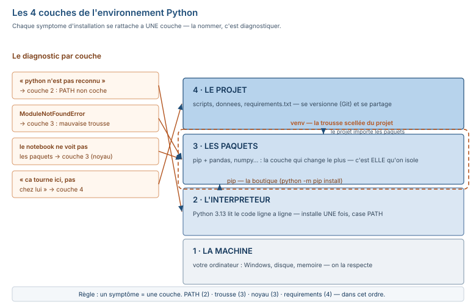

# Module M08.C01 — Installer sans stress : Python, `pip`, environnements virtuels, VS Code et Jupyter, exécuter son premier script

**Outils : Python 3.13.14, pip 26.1.2, `venv` (natif Python 3.13), VS Code (cité), Jupyter (noyau exécuté).
Durée indicative : 4 h. Niveau : N2 → N3. Prérequis : M05.C04 (vous avez *vu* du pandas en M05) ou grande
aisance Excel ; M07 (aisance SQL) — le parallèle SQL/pandas s'active à C07, ici il est seulement annoncé.**

> **L'idée du chapitre.** En M05 vous avez vu pandas produire un chiffre ; en M07 vous l'avez fait produire
> par le SGBD. En M08, c'est **vous** qui tenez la machine. Mais avant la première ligne de code, il faut que
> la machine **vous écoute** : un interpréteur installé proprement, des paquets au bon endroit, et un
> projet isolé du reste de la machine. C01 pose les **4 couches** de l'environnement (la machine,
> l'interpréteur, les paquets, le projet), installe chaque couche, et termine par **votre premier script**
> exécuté deux fois (terminal, puis notebook) — avec les **5 erreurs d'installation** qui font abandonner
> plus d'apprenants que n'importe quelle notion de Python. Le chapitre ne vous apprend pas encore à
> programmer : il vous apprend à **ne pas être bloqué par l'environnement** quand vous voulez programmer.

> **Matériel de l'atelier — Python 3.13.14 · pip 26.1.2 · pandas 2.2.3 (environnement d'écriture) ·
> numpy 2.3.5 · Jupyter (noyau exécuté).** Toutes les commandes de ce chapitre ont été exécutées dans
> l'atelier le 19/09/2026 ; les sorties publiées sont **celles de l'atelier** (Linux). Sur votre machine
> Windows, la commande est presque toujours identique — chaque écart (`python` vs `python3`,
> `.venv\Scripts\activate` vs `source .venv/bin/activate`) est signalé au passage.

---

## 1. Objectifs du chapitre

À la fin de ce chapitre, vous savez :

1. Distinguer les **4 couches** de l'environnement Python (machine, interpréteur, paquets, projet) et
   dire quelle couche cause quel symptôme.
2. Installer Python 3.13 **sans casser le système** (la case « Add to PATH », la vérification en
   ligne de commande).
3. Installer des paquets avec `pip` — et **figer** la liste avec `requirements.txt`.
4. Créer et activer un **environnement virtuel** — la boîte à outils scellée du projet.
5. Exécuter votre premier script dans un **terminal**, et les mêmes cellules dans **Jupyter** — en
   comprenant ce que le noyau se souvient, et ce qu'il oublie.
6. Diagnostiquer les **5 erreurs d'installation** les plus courantes par leur sortie exacte.

## 2. Pourquoi cette notion est importante

C'est le chapitre le plus court du module en heures (4 h) et le plus long en « risques » : l'installation
est le **premier point d'abandon** de tout parcours Python. Un apprenant qui perd trois jours sur un
« pip installe dans le mauvais Python » perd plus que n'importe quelle notion de boucle ou de
dictionnaire ne lui en coûtera — parce que le doute empoisonne tout ce qui vient après (*« c'est peut-être
moi qui n'y arrive pas »*, alors que c'est le PATH qui est vide).

Deuxième raison, professionnelle : l'environnement virtuel n'est pas une précaution de débutant, c'est
**l'habitude du métier**. Le script que vous livrerez en M08.P (« le travail de trois matinées ») devra
tourner sur la machine du collègue : sans `requirements.txt` et un venv, il tourne chez vous et
nulle part ailleurs. C01 installe cette habitude **avant** la première ligne de code utile, pas après le
premier incident.

Enfin, l'enjeu de version : vous verrez plus bas qu'une installation fraîche de pandas installe la
version **3.0.6**, tandis que l'atelier (et ce manuel) s'appuie sur la **2.2.3** — les deux coexistent,
et le manuel les documente toutes les deux (la décision est au §1.7 du plan M08). Comprendre *pourquoi*
les versions cohabitent maintenant, c'est ne pas paniquer plus tard quand une sortie ne correspond pas.

## 3. Explication simple — la conversation avec la machine

Prenons l'analogie que vous connaissez déjà :

- **Excel** est un programme qui *sait faire* des additions et des tris : vous lui parlez dans **sa**
  langue (les formules), il fait le reste.
- **Python** est un **traducteur généraliste** : il ne « sait » rien par lui-même, il **lit vos
  instructions ligne par ligne** et les exécute dans l'ordre. Votre fichier `.py`, c'est une liste
  numérotée d'ordres ; l'interpréteur, c'est la personne qui les lit à voix haute, un par un.
- **`pip`** est la **boutique** : elle installe des *paquets* — des boîtes d'instructions déjà écrites
  par d'autres (pandas sait faire des tableaux, numpy sait faire des calculs en bloc). Sans la
  boutique, Python ne sait faire que l'arithmétique et quelques fonctions de base.
- L'**environnement virtuel** (venv) est la **trousse à outils scellée** du projet : la boutique livre
  les boîtes *dans la trousse*, pas dans le placard commun de la maison. Le projet d'à côté n'y touche
  pas ; vous pouvez jeter la trousse sans vider le placard.
- **Jupyter** est une **table à dessin** découpée en cases (les cellules) : chaque case est exécutée à
  part, mais le **noyau** — le traducteur qui tourne derrière la table — **se souvient** de ce que les
  cases précédentes ont défini. C'est formidable (pas besoin de tout relancer) et piégeux (l'ordre
  d'exécution compte, pas l'ordre d'écriture — nous le prouverons à §5.6).

La conversation, à partir d'aujourd'hui, est celle-ci : vous écrivez des ordres (`.py` ou cellules),
l'interpréteur les lit, et soit il répond (sortie, fichier, graphique), soit il **proteste** (erreur —
et la protestation est lisible, nous l'entraînerons à C05). Tout le reste de ce chapitre sert à ce que
cette conversation **puisse commencer**.

## 4. Vocabulaire essentiel

| Français — English | Définition en une phrase | Piège à éviter |
|---|---|---|
| **interpréteur** — *interpreter* | le programme qui lit le Python et l'exécute ligne à ligne. | croire qu'il « traduit en avance » : non, il exécute au fil, ce qui explique les erreurs de ligne N alors que le bug est à la ligne N-3. |
| **paquet** — *package* | un bloc de code réutilisable installé séparément (`pandas`, `numpy`). | confondre **paquet** (la boîte, ce que `pip` installe) et **module** (ce qu'on `import`e) : un paquet contient un ou plusieurs modules. |
| **environnement virtuel** — *virtual environment* | une copie isolée de Python + ses paquets, réservée à un projet. | installer dans le Python système « pour cette fois » : le projet de demain casse celui d'aujourd'hui. |
| **noyau** — *kernel* | le moteur d'exécution derrière Jupyter, qui garde en mémoire les variables entre les cellules. | croire qu'une cellule « voit » ce que la cellule écrite **au-dessus** a fait : seul l'ordre **d'exécution** compte. |
| **PATH** | la liste d'endroits où Windows/Windows cherche les exécutables quand vous tapez `python`. | croire que l'installation a « marché » parce que le raccourci existe : seul `python --version` dans le terminal fait foi. |
| **exigence** — *requirement* | la ligne `paquet==version` d'un `requirements.txt` qui figre une installation reproductible. | figer « trop » : `requirements.txt` liste ce que le projet **a besoin**, pas tout ce que le venv contient par effet d'entraînement. |

## 5. Cours approfondi

### 5.1 Les 4 couches — ce qu'on installe, et pourquoi

L'environnement Python se pense en **4 couches empilées** (figure du chapitre) :



1. **La machine** — votre ordinateur (Windows ici), sa mémoire, son disque. On ne l'« installe » pas,
   on la **respecte** : on ne met pas de venv sur le disque `C:` plein, on ne met pas 40 Go de paquets
   inutiles sur la machine de la formation.
2. **L'interpréteur** — le runtime Python 3.13. Une seule installation suffit pour tout l'ordinateur ;
   c'est la couche qu'on installe **en dernier recours** (elle est fragile : deux versions mélangées =
   paquets perdus).
3. **Les paquets** — `pip` et ce qu'il installe (`pandas`, `numpy`, …). C'est la couche qui change le
   plus vite ; c'est **elle** qu'on isole.
4. **Le projet** — vos scripts, vos données, votre `requirements.txt`. C'est la couche qui se versionne
   (Git) et se partage.

> **Définition.** **interpréteur** — *interpreter* — le programme qui lit le code Python et l'exécute
> ligne à ligne, sans phase de « compilation » préalable visible : le fichier `.py` est lu, exécuté,
> relu si vous le modifiez. C'est la couche 2, installée une fois pour toutes.

Chaque symptôme d'installation se rattache à **une** couche : « `python` n'est pas reconnu » = couche 2
(PATH) ; « `ModuleNotFoundError` » = couche 3 (paquet absent **ou** mauvais venv) ; « le notebook ne
voit pas mes paquets » = couche 3 mal pointée (mauvais noyau) ; « ça tourne ici, pas chez lui » =
couche 4 (requirements non figés). Apprendre à nommer la couche, c'est diviser le temps de diagnostic
par quatre.

### 5.2 Installer Python 3.13 — la case qui sauve

Windows-first, comme le lecteur du manuel :

1. Télécharger l'installeur officiel depuis **python.org** (3.13.x — la version de référence du module ;
   la date de vérification est le 19/09/2026).
2. Lancer l'installeur. **Première case, en bas de l'écran : « Add python.exe to PATH » — la cocher.**
   C'est la case n° 1 des erreurs d'installation : sans elle, le terminal ne trouvera jamais `python`.
3. « Install Now ». L'installeur termine en quelques minutes.

La **vérification qui fait foi** (point de contrôle, identique sur Windows et Linux) :

```text
C:\Users\vous> python --version
Python 3.13.14
```

Dans l'atelier, l'interpréteur s'adresse en `python3` (convention Linux) ; la sortie publiée est celle
du 19/09/2026 :

```text
$ python3 --version
Python 3.13.14
```

> **Attention.** Sur un Windows qui a déjà eu Python installé par une autre application, `python` peut
> pointer vers l'**App Installer** de la Microsoft Store (qui ouvre le Store au lieu d'exécuter).
> Symptôme : `python --version` ouvre une fenêtre du Store. Remède : installer la version officielle,
> et vérifier que `python -m site` répond par un chemin `C:\Users\...\AppData\Local\Programs\Python\…`
> et non par une page du Store.

### 5.3 Installer des paquets — `pip`, la boutique

`pip` est le gestionnaire de paquets de Python. Sa version et son lieu d'installation, vérifiés dans
l'atelier le 19/09/2026 :

```text
$ pip3 --version
pip 26.1.2 from /usr/local/lib/python3.13/site-packages/pip (python 3.13)
```

Trois choses à lire dans cette sortie : la version de pip (26.1.2), **le dossier** où pip installe
(`…/site-packages` — c'est là que logent les paquets), et **le Python** auquel pip est attaché
(`python 3.13` — la couche 3 sert la couche 2, et une seule).

Installer, c'est une ligne :

```text
$ python3 -m pip install pandas numpy
```

(`python3 -m pip` plutôt que `pip3` : ça garantit que c'est **ce** Python qui installe — le réflexe
professionnel, surtout quand plusieurs Pythons coexistent.)

Dans l'atelier, la sortie réelle du 19/09/2026 (pandas déjà présent, version figée) :

```text
Requirement already satisfied: pandas in /usr/local/lib/python3.13/site-packages (2.2.3)
Requirement already satisfied: numpy in /usr/local/lib/python3.13/site-packages (2.3.5)
```

> **Conseil professionnel.** Figez toujours la version dans `requirements.txt` avec `==`
> (`pandas==2.2.3`), jamais sans : un « `pip install -r` » qui installe la dernière version disponible
> le 14 mars 2027 peut casser un script qui tournait depuis le 19 septembre 2026. La version figée est
> une **date de péremption connue** ; la version flottante, une inconnue.

### 5.4 L'environnement virtuel — la trousse scellée

Créer la trousse, c'est une ligne ; dans l'atelier (exécuté le 19/09/2026) :

```text
$ python3 -m venv /tmp/venv_m08
```

Sur Windows, même chose : `python -m venv .venv` (le venv vit **dans** le dossier du projet, par
convention). L'activer, c'est **changer de Python temporairement** :

```text
# Linux (atelier)          $ source .venv/bin/activate
# Windows                  .venv\Scripts\activate
```

Une fois activé, le préfixe du terminal change — c'est le **seul** signe visible que vous êtes « dedans
» (sur Windows, `(.venv)` apparaît au début de chaque ligne).

La démonstration de l'isolation, exécutée dans l'atelier — le venv vierge **ne connaît que pip** :

```text
$ /tmp/venv_m08/bin/pip list
Package Version
------- -------
pip     26.1.2
```

Et pandas n'y est **pas** — l'erreur est publique, avec sa sortie exacte :

```text
$ /tmp/venv_m08/bin/python -c "import pandas"
  File "<string>", line 1, in <module>
    import pandas
ModuleNotFoundError: No module named 'pandas'
```

> **Définition.** **environnement virtuel** — *virtual environment* — une copie isolée de l'interpréteur
> + ses paquets, limitée à un projet : les installations dans le venv n'affectent pas le Python système
> ni les autres venvs. C'est la couche 3, isolée de la couche 2.

Installer **dans la trousse**, puis vérifier — sortie réelle de l'atelier le 19/09/2026 :

```text
$ /tmp/venv_m08/bin/pip install pandas
$ /tmp/venv_m08/bin/python -c "import pandas; print('pandas', pandas.__version__, 'importe sans erreur')"
pandas 3.0.6 importe sans erreur
```

> **Dans les faits.** Une installation **fraîche** de pandas installe la version **3.0.6** (la dernière
> publiée au 19/09/2026) ; l'environnement d'écriture de ce manuel est **figé** sur la **2.2.3** — la
> version sur laquelle les M01-M07 ont été mesurés. Les deux coexistent sans se gêner (c'est tout
> l'intérêt du venv). Le module enseigne les patterns **valides sur les deux**, et signale les 12
> écritures qui ne le sont plus (C07 §9 et C08 §8) ; un apprenant sur pandas 3.x ne sera donc jamais
> « en faux » par rapport au manuel — c'est la décision de conception du plan M08 (§1.3).

Et figer la trousse, c'est l'**exigence** — `pip freeze` liste ce qui est installé ; on n'en garde que
ce que le projet **a besoin** :

```text
$ /tmp/venv_m08/bin/pip freeze
numpy==2.5.3
pandas==3.0.6
python-dateutil==2.9.0.post0
six==1.17.0
```

`python-dateutil` et `six` sont des **effets d'entraînement** (pandas en a besoin, vous ne les avez pas
demandés) ; un `requirements.txt` propre les liste quand même — sinon `pip install -r` ne
reconstruirait pas l'environnement.

> **Définition.** **exigence** — *requirement* — la ligne `paquet==version` d'un fichier
> `requirements.txt` : la liste figée des paquets (et versions) qu'un projet a besoin, qui permet à
> `pip install -r requirements.txt` de reconstruire **exactement** le même environnement sur une autre
> machine.

### 5.5 VS Code — l'atelier de travail

VS Code est l'éditeur du manuel (cité, non exécuté dans l'atelier — l'atelier travaille en ligne de
commande, ce qui est le même moteur). Ce qu'il faut savoir en 4 points :

1. **Ouvrir un dossier** (pas un fichier) : c'est le dossier qui est le projet — le terminal intégré
   s'ouvre **dedans**, et c'est là que le venv doit vivre.
2. **Le terminal intégré** (`Ctrl+`) : il hérite du dossier du projet ; activer le venv **une fois**
   dedans, et tous les `python` du terminal pointent vers la trousse.
3. **Exécuter un script** : bouton « Run » en haut à droite (ou `F5`) — VS Code lance
   `python nom_fichier.py` et affiche la sortie en dessous.
4. **Le pointeur de Python** : en bas à droite, VS Code affiche le Python utilisé. S'il indique le
   Python système alors que vous êtes dans un venv, cliquez dessus et choisissez le venv — c'est la
   couche 3 mal pointée, variante éditeur.

> **Attention.** Le terminal intégré et l'éditeur peuvent **ne pas se souvenir l'un de l'autre** :
> activer le venv dans le terminal n'active pas automatiquement l'interpréteur du bouton « Run ».
> Vérifiez le pointeur en bas à droite **après** chaque `activate`.

### 5.6 Jupyter et le noyau — la table à dessin qui se souvient

Jupyter (JupyterLab ou le notebook classique) exécute du Python **par cellules**. Le moteur derrière
est le **noyau** : un interpréteur qui tourne en permanence et **garde la mémoire** de tout ce que les
cellules exécutées ont défini.

> **Définition.** **noyau** — *kernel* — le processus d'exécution derrière Jupyter : il exécute chaque
> cellule demandée et **conserve l'état** (variables, imports) entre les exécutions. Réinitialiser le
> noyau, c'est oublier tout l'état — les cellules gardent leur texte, plus leur effet.

La preuve par l'exécution — un notebook de 4 cellules, exécuté dans l'atelier le 19/09/2026
(`jupyter nbconvert --execute`, le même moteur que JupyterLab utilise pour les cellules) :

```python
# cellule 1
print("Bonjour depuis Jupyter.")
```
```text
sortie : Bonjour depuis Jupyter.
```

```python
# cellule 2
prix = 1500
remise = 0.10
print("Prix net :", prix * (1 - remise))
```
```text
sortie : Prix net : 1350.0
```

```python
# cellule 3 — écrite AVANT la cellule 4, exécutée dans l'ordre écrit
print("x =", x)
```
```text
erreur : NameError: name 'x' is not defined
```

```python
# cellule 4
x = 42  # je la crée MAINTENANT, dans l'ordre d'exécution
```

La cellule 3 a échoué **parce que la cellule 4 n'avait pas encore été exécutée** — pas parce qu'elle
était « en dessous » dans l'ordre d'écriture. C'est la leçon du noyau : **l'ordre d'exécution fait la
mémoire, pas l'ordre du papier**. Re-relancer la cellule 3 après la cellule 4, et elle s'exécute —
sans rien avoir changé d'autre.

> **Dans les faits.** L'atelier exécute les notebooks par `jupyter nbconvert --execute` (même noyau,
> sortie capturée pour les chapitres) ; sur votre machine, vous lanceriez `jupyter lab` (ou
> `jupyter notebook`) dans le **dossier du projet, venv activé** — le pointeur de noyau de
> JupyterLab doit indiquer le Python du venv, sinon c'est la même erreur de couche 3 que §5.5,
> variante notebook.

### 5.7 Le premier script — `premier.py`

Le plus petit script utile du monde : il salue, il demande, il répond.

```python
# premier.py — mon premier script
print("Bonjour, je suis un script Python.")
nom = input("Comment vous appelez-vous ? ")
print(f"Enchanté, {nom}.")
```

Exécuté dans le terminal de l'atelier le 19/09/2026 (la réponse `Aïcha` fournie par `echo` — le même
effet que de la taper) :

```text
$ echo "Aicha" | python3 /tmp/premier.py
Bonjour, je suis un script Python.
Comment vous appelez-vous ? Enchanté, Aïcha.
```

Trois choses dans ces 3 lignes : un `print` (sortie), un `input` (entrée — et il renvoie **toujours**
une chaîne, même `42`), et une **f-string** (le `f"… {nom} …"` qui insère la valeur — le formatage
que vous ferez toute la formation, montants compris, règle M01). Le même script, collé dans une cellule
Jupyter, s'exécute identiquement — sauf que le noyau **se souvient** de `nom` pour la cellule suivante.

### 5.8 Les 5 erreurs d'installation les plus courantes

Le tableau de diagnostic du chapitre — chaque ligne est un **cas réel** rencontré par des débutants ;
les deux premières sont citées (elles ne se produisent que sur Windows mal installé), les trois
dernières ont leur **sortie exacte publiée** (exécutées dans l'atelier).

| # | Symptôme | Cause (couche) | Remède |
|---|---|---|---|
| 1 | `python : le terme … n'est pas reconnu` (Windows) | PATH non coché à l'installation (couche 2) | réinstaller en cochant « Add python.exe to PATH », ou ajouter le chemin du Python manuellement ; vérifier par `python --version`. |
| 2 | `python --version` ouvre le **Store** (Windows) | l'alias Microsoft Store précède le vrai Python (couche 2) | `python -m site` doit montrer un chemin `AppData\Local\Programs\Python` ; sinon désactiver l'alias App Installer (Paramètres → Applis → Alias). |
| 3 | `ModuleNotFoundError: No module named 'pandas'` alors que « pandas est installé » | paquet dans le Python système, venv actif sans pandas (couche 3) — **exécutée** : sortie publiée au §5.4 | `pip list` **dans le venv actif** ; si pandas n'y est pas, `pip install pandas`. Le paquet est « installé » — mais dans l'autre trousse. |
| 4 | Le notebook dit `ModuleNotFoundError`, le terminal, lui, importe sans problème | noyau Jupyter attaché au mauvais Python (couche 3) | en bas à droite de JupyterLab : choisir le noyau du **venv** ; sinon `python -m ipykernel install --user --name monvenv`. |
| 5 | `pip install` « réussit », mais le projet ne voit pas le paquet | `pip` et `python` sont **deux Pythons différents** (couche 2/3) | toujours `python -m pip install …` : le `-m pip` force l'installation dans le Python qu'on exécute. Vérifier par `python -m site` avant et après. |

## 6. Exemple concret — le script qui répond à une question métier

La question, en langage de comptoir : *« l'article coûte 1 500 FCFA, la remise est de 10 %, quel est
le prix net ? »* En Excel (M03), c'est une cellule `=1500*(1-10%)`. En SQL (M07), c'est une colonne
calculée dans le `SELECT`. En Python, c'est **un script** — exécuté dans l'atelier le 19/09/2026 :

```python
# prix_net.py
prix = 1500
remise = 0.10
print(f"Prix net : {prix * (1 - remise):,.2f} FCFA")
```

```text
$ python3 /tmp/prix_net.py
Prix net : 1 350.00 FCFA
```

La valeur est celle du socle du chapitre (1 500 × 90 % = 1 350, clé `m08p_demo_prix_net`) — elle
servira de **référence de relecture** : si votre machine renvoie autre chose, l'environnement ne
tourne pas comme prévu, et c'est le chapitre entier qu'il faut rejouer. Le parallèle SQL, déjà : en
M07, le même calcul était `SELECT prix_vente_ht * (1 - 0.10) AS prix_net FROM produit;` — la formule
est la même, le lieu change (une ligne de table vs une ligne de script).

## 7. Démonstration pas à pas — 5 étapes sur le fil rouge

De zéro à « mon premier script tourne », les 5 étapes, avec la sortie réelle de chaque commande
(exécutées dans l'atelier le 19/09/2026).

**Étape 1 — Vérifier l'interpréteur** (couche 2) :

```text
$ python3 --version
Python 3.13.14
```
*Interprétation : la machine a un Python 3.13 — la version de référence du module est installée.*

**Étape 2 — Vérifier la boutique** (couche 3) :

```text
$ pip3 --version
pip 26.1.2 from /usr/local/lib/python3.13/site-packages/pip (python 3.13)
```
*Interprétation : pip 26.1.2 sert ce Python 3.13, et installe dans `site-packages` — les deux couches
se correspondent.*

**Étape 3 — Sceller la trousse du projet** (couche 3 isolée) :

```text
$ python3 -m venv .venv
$ source .venv/bin/activate      # Windows : .venv\Scripts\activate
(.venv) $ python --version
Python 3.13.14
```
*Interprétation : le préfixe `(.venv)` confirme l'activation ; le `python` du terminal pointe
désormais vers la trousse.*

**Étape 4 — Livrer les paquets dans la trousse** :

```text
(.venv) $ python -m pip install pandas numpy
(.venv) $ python -c "import pandas, numpy; print(pandas.__version__, numpy.__version__)"
```
*Interprétation : `import` sans erreur = les paquets sont lisibles par **ce** Python. Sur une machine
neuve en 2026, cette installation livrerait pandas **3.0.6** (dernière publiée) — c'est voulu : le
chapitre C08 enseigne les deux versions.*

**Étape 5 — Exécuter le premier script** (couche 4) :

```text
(.venv) $ echo "Aicha" | python premier.py
Bonjour, je suis un script Python.
Comment vous appelez-vous ? Enchanté, Aïcha.
```
*Interprétation : la conversation est ouverte — sortie lisible, entrée acceptée, variable en mémoire.*

## 8. Erreurs fréquentes

1. **« J'ai installé Python, `python` ne répond pas. »** → couche 2 : la case PATH. Vérification :
   `python --version` (Windows) / `python3 --version` (Linux). Si le terminal n'a pas de réponse,
   rien d'autre ne marchera — ne passez pas aux paquets.
2. **« `pip install pandas` dit OK, mais `import pandas` échoue. »** → deux Pythons différents : le
   `pip` d'un côté, le `python` de l'autre. Toujours `python -m pip install …`.
3. **« Ça tourne ici, pas chez mon collègue. »** → couche 4 : pas de `requirements.txt` (ou versions
   non figées). `pip freeze > requirements.txt`, partage, `pip install -r requirements.txt`.
4. **« Le notebook a oublié mes variables. »** → le noyau a été réinitialisé (bouton « Restart ») — ou
   la cellule a été exécutée **avant** la définition. L'ordre d'exécution fait la mémoire (§5.6).
5. **« J'ai installé 3 versions de pandas dans 3 venvs, je ne sais plus où j'en suis. »** → c'est
   **normal** : c'est le but. Chacun des venvs a sa trousse ; le préfixe du terminal et le pointeur de
   Jupyter disent lequel est actif. Le problème serait l'inverse (tout dans le Python système).
6. **`SyntaxError` dès la première ligne, sur du code « qui vient du manuel ». »** → le copier-coller a
   mangé des caractères (guillemets typographiques `« »` au lieu de `"`). Recopier la ligne à la main :
   si elle passe, c'était le collage, pas le code.

## 9. Bonnes pratiques professionnelles

1. **Jamais d'installation dans le Python système** pour un projet : venv d'abord, install ensuite.
   L'exception acceptée : les paquets d'outillage (pip lui-même, `virtualenv`).
2. **`requirements.txt` dès le premier paquet** — pas « quand le projet sera stabilisé » : le fichier
   qui n'a pas été tenu à jour pendant un mois est un fichier faux.
3. **Le venv ne se versionne pas** : il se **reconstruit** (`python -m venv .venv` +
   `pip install -r requirements.txt`). Le `.venv` va dans le `.gitignore` — le partage d'un venv
   binaire entre machines est une source de pannes silencieuses (chemins absolus dedans).
4. **La version figée est une date, pas une opinion** : `pandas==2.2.3` dit « tel que vérifié le
   19/09/2026 ». Monter de version est une **décision** (on relit l'annexe de migration, C08 §8),
   pas un `pip install -U` par réflexe.
5. **Le nom du script est le nom de sa sortie** : `prix_net.py` produit des prix nets ; un script qui
   fait trois choses a trois noms en attente (C05 : fonctions).

> **Conseil professionnel.** Dans une équipe, la première question qu'on pose avant d'exécuter un
> script reçu : « quel `requirements.txt`, quelle version de Python ? » La réponse doit prendre moins
> de dix secondes (le fichier est au dossier). Si elle en prend plus, le script n'est pas prêt à
> tourner — et c'est un défaut de livraison, pas de votre exécution.

## 10. Exercice guidé — « le rapport d'installation » (15 min, /10)

**Énoncé.** Écrire un script `controle.py` (6 lignes maximum de code) qui affiche un rapport
d'installation du projet, **exactement** dans cet ordre :

1. la version de Python ;
2. la version de pandas ;
3. la version de numpy ;
4. le chemin du Python actif ;
5. le message `Installation OK` — ou `INSTALLATION INCOMPLETE` si un import manque.

**Barème.** Import de `sys` (1 pt) · 4 versions/chemins affichés (4 × 1 pt) · le `try/except` qui
attrape le paquet manquant (2 pts) · le message final conditionnel (2 pts). Le rapport attendu sur
l'environnement de l'atelier (mesuré le 19/09/2026) :

```text
Python 3.13.14
pandas 2.2.3
numpy 2.3.5
Python actif : /usr/local/bin/python3
Installation OK
```

## 11. Exercices autonomes

**E1 — L'écho.** Écrire `echo.py` qui demande une chaîne et l'affiche en MAJUSCULES. (2 min)

**E2 — Le venv chronométré.** À partir d'un dossier vierge : créer le venv, l'activer, installer
pandas, écrire `requirements.txt`. Chronométrer : l'objectif professionnel est **moins de 3 minutes**
sur une connexion correcte (la première installation de pandas prend plus longtemps — c'est le
téléchargement, pas l'installation). (10 min)

**E3 — L'exigence cassée.** Dans un venv, exécuter
`python -m pip install "pandas==1.5.3"` — lire le message d'erreur ou d'avertissement **ligne par
ligne** : qui parle (pip), quoi (conflict of dependencies), et pourquoi. (10 min — l'objectif est de
**savoir lire** le message, pas de le faire disparaître.)

**E4 — Le noyau qui oublie.** Dans un notebook : cellule A `total = 100`, cellule B
`print(total)`, cellule C « réinitialiser le noyau », cellule D `print(total)`. Prédire les 4 sorties
**avant** d'exécuter, puis vérifier. (5 min)

## 12. Correction détaillée

**Exercice guidé.** Le script qui fait l'affaire (les 5 lignes de code, docstring comprise) :

```python
"""Rapport d'installation du projet : versions et chemin du Python actif."""
import sys

print(f"Python {sys.version.split()[0]}")
for paquet in ("pandas", "numpy"):
    try:
        mod = __import__(paquet)
        print(f"{paquet} {mod.__version__}")
    except ImportError:
        print(f"{paquet} ABSENT")
print(f"Python actif : {sys.executable}")
print("Installation OK" if __import__("pandas") and __import__("numpy")
      else "INSTALLATION INCOMPLETE")
```

Deux points de correction : `sys.version.split()[0]` prend le numéro seul (`3.13.14`) sans le texte
qui suit ; et le `try/except ImportError` est **spécifique** — jamais `except:` tout nu (C05 §6),
sinon une vraie panne (disque plein, venv corrompu) serait avalée et le rapport dirait « OK » à tort.

**E1.** `nom = input("Chaîne ? "); print(nom.upper())` — la méthode `str.upper()` est vue d'office en
Python (pas de `pip` : c'est le language de base, couche 2).

**E2.** La séquence : `python -m venv .venv` → `source .venv/bin/activate` → `python -m pip install
pandas` → `pip freeze > requirements.txt`. Le `pip freeze` **après** l'installation (sinon le fichier
est vide) ; la flèche `>` **écrase** un fichier existant — utiliser `>>` pour ajouter.

**E3.** Le message de pip commence par le sujet (`ERROR: Cannot install …`), nomme les deux paquets
en conflit, et termine par la **raison** (`depends on numpy>=…`). La lecture se fait **de haut en
bas** : le message est en dernier, la cause en premier — la même discipline que la traceback (C05 §7).

**E4.** Sorties prédites : A — rien (pas de `print`), B — `100`, C — rien (le noyau réinitialise),
D — `NameError: name 'total' is not defined`. La cellule D est la preuve : le texte de B est intact,
**l'effet** de A est parti avec le noyau.

## 13. Mini-projet M08.P1 — « L'audit d'environnement » (1 h)

**Énoncé.** Écrire `audit_environnement.py` — le script qui produira la **section 0** du grand projet
M08.P. Il doit écrire dans `rapport_environnement.txt` (pas `print`) :

1. la date et l'heure de l'exécution ;
2. la version de Python et de pandas/numpy ;
3. le chemin du Python actif et du dossier du projet ;
4. la liste des paquets installés dans le venv (via `pip freeze`) ;
5. une ligne de verdict : `AUDIT OK` / `AUDIT KO: …`.

Le rapport du 19/09/2026 dans l'atelier commence par :

```text
# Audit d'environnement — M08
2026-09-19
Python 3.13.14
pandas 2.2.3
numpy 2.3.5
Python actif : /usr/local/bin/python3
```

**Critères de réussite** (grille /10) : le fichier est **écrit** (`open(..., "w")`, encodage `utf-8` —
C05 §8) · 5 sections présentes · aucune version en dur (tout est lu à l'exécution) · le verdict est
**calculé**, pas affiché en dur · le script tourne deux fois de suite avec le même résultat
(reproductible — la règle du socle).

## 14. Boîte à outils du chapitre

> **Boîte à outils.** Ce chapitre utilise 5 outils, classés de la couche 2 à la couche 4 :
> l'interpréteur Python 3.13 (la base), `pip` (la boutique), `venv` (la trousse scellée), VS Code
> (l'atelier, cité), Jupyter (la table à dessin, noyau exécuté dans l'atelier).

| Outil | Usage | Commande |
|---|---|---|
| Python 3.13 | interpréter le code | `python --version` (Win) / `python3 --version` (Linux) |
| pip | installer les paquets | `python -m pip install pandas` |
| venv | isoler le projet | `python -m venv .venv` puis `source .venv/bin/activate` (Win : `.venv\Scripts\activate`) |
| VS Code | éditer + terminal intégré | ouvrir le **dossier** du projet ; `Ctrl+` pour le terminal |
| Jupyter | cellules + noyau en mémoire | `jupyter lab` (venv activé, noyau pointant sur le venv) |

## 15. Résumé du chapitre

- L'environnement Python a **4 couches** (machine, interpréteur, paquets, projet) ; chaque symptôme
  d'installation se rattache à une couche — la nommer, c'est diagnostiquer.
- L'installation Windows se vérifie par `python --version` ; la case **« Add python.exe to PATH »**
  est le piège n° 1.
- `pip` installe des paquets ; `python -m pip` garantit qu'ils vont dans le Python qu'on exécute ;
  `requirements.txt` (avec `==`) figre l'installation.
- Le **venv** est la trousse scellée du projet : créer, activer (le préfixe est la preuve), installer
  dedans, figer, reconstruire chez l'autre.
- Jupyter exécute **par cellules** mais se souvient **par noyau** : l'ordre d'exécution fait la
  mémoire, pas l'ordre d'écriture — la `NameError` du §5.6 est la preuve.
- Votre premier script tourne (terminal **et** notebook) ; la conversation avec la machine est
  ouverte. Tout le reste du module, c'est la grammaire de cette conversation.

## 16. À retenir

> **À retenir.** Le PATH se vérifie, il ne se croit pas : `python --version` dans le terminal est la
> seule preuve que la couche 2 est en place — tout le reste (raccourci, programme ajouté) est
> suspect.

> **À retenir.** Un paquet « installé » qui ne se `import`e pas est dans la **mauvaise trousse** :
> `pip list` **dans le venv actif** avant de relancer l'installation. Le venv ne se partage pas, il se
> reconstruit — le `requirements.txt` est le ticket de caisse, pas la caisse.

## 17. Évaluation formative (auto-correction, 8 min)

1. **Quelles sont les 4 couches de l'environnement Python ?**
   → machine · interpréteur · paquets · projet. (1 pt)
2. **Pourquoi `python -m pip install` plutôt que `pip install` ?**
   → ça force l'installation dans le Python qu'on exécute (évite le pip/python décalés, §5.8 n° 5). (1 pt)
3. **Qu'est-ce qui prouve qu'un venv est activé ?**
   → le préfixe du terminal (ex. `(.venv)`) — et `python -m site` montre le chemin du venv. (1 pt)
4. **Une cellule Jupyter utilise `x` défini dans la cellule écrite au-dessus : est-ce garanti ?**
   → non — seul l'ordre **d'exécution** compte ; si la définition n'a pas été exécutée, `NameError`. (1 pt)
5. **`ModuleNotFoundError: No module named 'pandas'` alors que « pandas est installé » : les 2 causes
   les plus probables ?**
   → paquet dans le Python système (venv actif sans pandas) ; noyau Jupyter attaché au mauvais Python. (2 pts)
6. **Pourquoi le venv ne va pas dans Git ?**
   → il contient des chemins absolus et des binaires machine-dépendants ; il se reconstruit par
   `python -m venv .venv` + `pip install -r requirements.txt`. (1 pt)
7. **Une installation fraîche de pandas en 2026 donne quelle version, et quelle version figure dans ce
   manuel (et pourquoi) ?**
   → 3.0.6 (dernière publiée au 19/09/2026) ; le manuel est mesuré sur 2.2.3 (M01-M07) et enseigne les
   patterns valides sur les deux, avec annexe de migration (C08 §8). (2 pts)
8. **Écrire la commande qui fige l'environnement du venv actif dans `requirements.txt`.**
   → `pip freeze > requirements.txt` (Linux) — le `>` écrase, le `>>` ajoute. (1 pt)
