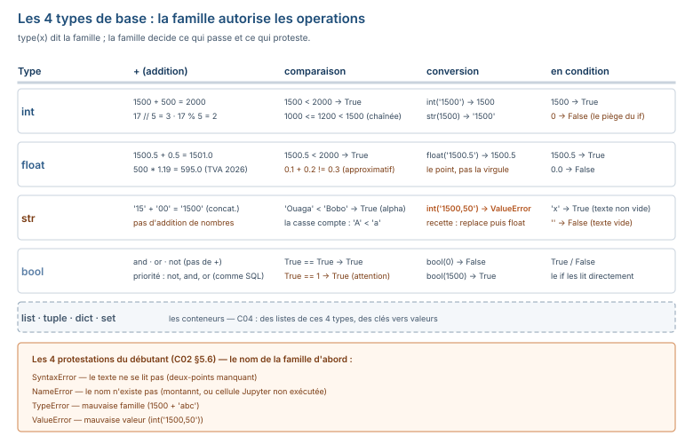

# Module M08.C02 — Les fondations sans données : variables, types, opérateurs, entrées/sorties, commentaires, erreurs

**Outils : Python 3.13.14 seul (l'interpréteur, la couche 2 de C01), le terminal. Aucun paquet n'est
requis — ce chapitre tourne sur le Python nu.
Durée indicative : 4 h. Niveau : N2 → N3. Prérequis : C01 (un environnement qui marche).**

> **L'idée du chapitre.** C01 a ouvert la conversation avec la machine ; C02 installe la **grammaire**
> de cette conversation : les **variables** (les noms qu'on donne aux valeurs), les **types** (les
> familles de valeurs et les opérations qu'elles autorisent), les **opérateurs** (les `+`, `and` et
> `not` du métier), les **entrées/sorties** (`input`/`print`), les **commentaires** (ce qu'on dit au
> lecteur humain) — et la compétence qui en vaut dix : **lire une erreur** sans paniquer. Rien ne
> dépend encore des données : les CSV de `dossier_M08/` attendent C07 ; ici, tout est mesuré sur des
> montants de comptoir (1 500 FCFA, une remise de 10 %, un net de 1 350 FCFA) que vous retrouverez à
> chaque chapitre. Le fil rouge est le **calculateur de remise** : il naît ici en 4 lignes, deviendra
> une fonction en C05, un calcul sur table en C07, et un calcul sur 50 008 lignes en C08.

> **Matériel de l'atelier — Python 3.13.14, terminal, zéro paquet.** Tout le code de ce chapitre a été
> exécuté dans l'atelier le 19/09/2026 ; les sorties publiées sont **celles de l'atelier**. Les montants
> du chapitre sont sourcés (`m08p_demo_*`) : prix 1 500, remise 10, net 1 350, seuil comptoir 1 000 —
> les mêmes valeurs que §6 de C01, votre référence de relecture : si votre machine renvoie autre chose,
> l'environnement ne tourne pas comme prévu.

---

## 1. Objectifs du chapitre

À la fin de ce chapitre, vous savez :

1. Écrire, **renommer** et réaffecter une variable — et expliquer pourquoi rebaptiser ne duplique pas.
2. Dire le **type** d'une valeur (`int`, `float`, `str`, `bool`) et **convertir** un texte en nombre
   (la recette du format français inclus).
3. Utiliser les opérateurs arithmétiques (`+ - * / // % **`), les comparaisons chaînées, et les
   opérateurs booléens `and`/`or`/`not` — avec le parallèle `AND`/`OR`/`NOT` de M07.
4. Lire une entrée avec `input()` **en sachant qu'elle arrive toujours en texte**, et afficher avec
   `print()` (f-strings incluses).
5. **Lire une traceback** ligne par ligne : le fichier, la ligne, la flèche, le message — et dire
   laquelle des quatre familles d'erreurs vous a (`SyntaxError`, `NameError`, `ValueError`, `TypeError`).
6. Écrire un calculateur de remise en 4 lignes qui tourne dans le terminal.

## 2. Pourquoi cette notion est importante

Parce que 90 % des erreurs de débutant ne sont pas des erreurs de logique, ce sont des erreurs de
**grammaire** : un `int` additionné à un `str`, une virgule dans un nombre, un nom mal recopié. Chacune
a un **nom** (`TypeError`, `ValueError`, `NameError`) et un **remède systématique** — ce chapitre
donne les trois noms et les trois remèdes. Un apprenant qui reconnaît l'erreur par son nom divise son
temps de dépannage par quatre ; un apprenant qui la lit ligne par ligne finit par dépanner **lui-même**.

Deuxième raison : les types, vous les connaissez déjà — M06 a installé la notion sur les colonnes
(`INTEGER`, `DECIMAL`, `VARCHAR`). En Python, c'est la **même idée** sur les valeurs individuelles :
chaque valeur a une famille, et la famille autorise (ou interdit) les opérations. Le parallèle
rapporte : vous ne pouvez pas additionner une colonne texte et une colonne nombre en SQL ; vous ne
pouvez pas additionner un `str` et un `int` en Python. Une seule notion, deux langages.

Troisième raison, professionnelle : `input()` arrive **toujours en texte**. C'est la porte par
laquelle le monde réel entre dans votre script — et le monde réel écrit ses montants `15 000,50`, pas
`15000.50`. La **conversion à la porte** (dès la réception, pas au milieu du calcul) est l'habitude
qui fera la différence entre un script qui tourne et un script qui s'effondre à la première saisie.

## 3. Explication simple — l'étiquette, la famille, la porte

- La **variable** est une **étiquette** collée sur une valeur. Écrire `prix = 1500`, c'est coller
  l'étiquette « prix » sur le nombre 1 500. Re-coller l'étiquette ailleurs (`prix = 2000`) ne **copie**
  rien : l'ancienne étiquette est simplement re-collée, et si personne n'en porte d'autre, l'ancien
  nombre est jeté.
- Le **type** est la **famille** de la valeur. La famille décide ce qu'on peut faire : on peut
  additionner deux nombres, on ne peut pas additionner un nombre et un mot. En M06, la famille était
  déclarée **sur la colonne** (`DECIMAL` ici, `VARCHAR` là) ; en Python, elle est portée par **chaque
  valeur** et se voit avec `type(x)`.
- `input()` est une **porte** : ce qui entre, entre **en texte**, toujours — même si le visiteur a
  dit « 1500 ». C'est à vous de le **convertir** à la porte, sinon il traînera sa voix de texte dans
  tout le script.
- Une **erreur** est une **protestation lisible** : la machine dit *où* (fichier, ligne), *quoi*
  (le message, en bas), et souvent *pourquoi* (la flèche qui souligne le coupable). La protester, ce
  n'est pas échouer ; c'est le travail. La paniquer, c'est perdre.

## 4. Vocabulaire essentiel

| Français — English | Définition en une phrase | Piège à éviter |
|---|---|---|
| **variable** | un nom qui pointe vers une valeur (pas une boîte qui la contient). | dire « la variable contient le nombre » : rebaptiser la variable ne duplique pas la valeur. |
| **type** — *type* | la famille d'une valeur, qui autorise des opérations (`int`, `float`, `str`, `bool`). | croire que `1`, `1.0` et `"1"` sont équivalents : trois objets, trois familles, trois comportements. |
| **conversion** — *cast* | transformer une valeur d'une famille à une autre (`int("1500")`, `float("1500.5")`). | convertir **au milieu** du calcul au lieu de **la porte** : le texte traîne, l'erreur arrive plus tard, plus loin, plus mystérieuse. |
| **opérateur booléen** — *boolean operator* | `and`, `or`, `not` : les connecteurs qui combinent des conditions. | oublier la priorité `not` > `and` > `or` — la même que `NOT` > `AND` > `OR` en SQL (M07 C02). |
| **traceback** — *traceback* | le rapport d'erreur : pile d'appels, ligne fautive, flèche, message. | le lire de bas en haut : la dernière ligne dit **quoi**, les lignes du haut disent **pourquoi**. |
| **faux en condition** — *falsy* | une valeur que Python traite comme `False` dans une condition : `0`, `""`, `[]`, `None`. | écrire `if montant:` et ne pas comprendre pourquoi un montant de `0` passe pour « absent ». |

## 5. Cours approfondi

### 5.1 La variable — l'étiquette qui se re-colle

```python
prix = 1500
print(prix)
prix = 2000
print(prix)
```
Sortie réelle de l'atelier (19/09/2026) :
```text
1500
2000
```

> **Définition.** **variable** — *variable* — un nom qui pointe vers une valeur : `prix = 1500`
> colle l'étiquette « prix » sur le nombre 1 500 ; réaffecter (`prix = 2000`) re-colle l'étiquette,
> sans copier quoi que ce soit. C'est la brique de base de tout script.

Deux remarques qui préviennent des malentendus qui durent :

1. **Aucune « boîte » n'existe.** `prix` n'est pas un contenant dans lequel on met 1 500 puis 2 000 :
   c'est un nom. Quand vous écrivez `autre = prix`, les **deux** noms pointent vers le **même**
   objet (pour les nombres, qui ne changent pas, l'effet est invisible — pour les listes de C04,
   il ne l'est pas du tout).
2. **Le nom est un contrat, pas un décor.** `prix` dit au lecteur ce que la valeur est ;
   `p2` ne dit rien. La règle M04 (conventions de nommage) s'applique telle quelle en Python : des
   noms qui racontent, en français ou en anglais, pas les deux mélangés.

### 5.2 Les 4 types de base — et la conversion à la porte

Les quatre familles du chapitre (les conteneurs — listes, dictionnaires — arrivent en C04) :

```python
type(1500)      # un entier
type(1500.5)    # un nombre à virgule
type("1500")    # un texte
type(True)      # un booléen
```
Sortie réelle :
```text
<class 'int'> <class 'float'> <class 'str'> <class 'bool'>
```

> **Définition.** **type** — *type* — la famille d'une valeur, qui autorise (ou interdit) les
> opérations : `int` (entier), `float` (nombre à virgule), `str` (texte), `bool` (vrai/faux).
> `type(x)` la dit. En M06, la famille était déclarée sur la colonne ; en Python, elle est portée
> par chaque valeur — une seule notion, deux langages.

La conversion, c'est changer de famille — et c'est là que le **format français** entre en jeu.
`int("1500")` passe ; `int("1500,50")` se proteste, avec sa sortie exacte :

```text
ValueError: invalid literal for int() with base 10: '1500,50'
```

La **recette du format français** (l'outil que vous utiliserez toute la formation sur les montants) :
supprimer les espaces, remplacer la virgule par le point, puis convertir :

```python
valeur = float("15 000,50".replace(" ", "").replace(",", "."))
print(valeur)
```
```text
15000.5
```

> **Conseil professionnel.** Convertissez **à la porte** : dès que la valeur arrive
> (`input()`, lecture de fichier en C07), faites-en un nombre — et nommez la variable d'après sa
> **valeur**, pas d'après sa forme (`montant`, pas `montant_texte` une fois converti). Un texte qui
> traîne dans le calcul ne fait pas d'erreur tout de suite : il en fait une plus tard, plus loin, sur
> une ligne qui n'a rien à voir — c'est l'erreur la plus coûteuse à chercher.

### 5.3 Les opérateurs — l'arithmétique du comptoir

L'arithmétique, exécutée dans l'atelier :

```python
print(17 // 5, 17 % 5, 2 ** 8)
```
```text
3 2 256
```

Trois opérateurs que le clavier ne vous a pas appris : `//` la **division entière** (17 // 5 = 3 —
l'entier du quotient, ce qu'une caisse garde), `%` le **reste** (17 % 5 = 2 — ce qui dépasse),
`**` la puissance (2 ** 8 = 256). Le `/` classique renvoie un `float` (17 / 5 = 3.4).

Les comparaisons se **chaînent** comme en mathématiques — l'équivalent SQL serait deux conditions
`AND`-ées :

```python
print(1000 <= 1200 < 1500)
```
```text
True
```

Et les trois opérateurs booléens, **le parallèle SQL exact** (M07 C02 : `AND` se lie avant `OR`) :

```python
print("and :", True and False)
print("or  :", True or False)
print("not :", not False)
```
```text
and : False
or  : True
not : True
```

| Python | SQL | Sens |
|---|---|---|
| `and` | `AND` | les **deux** conditions vraies |
| `or` | `OR` | l'**une** des deux vraie |
| `not` | `NOT` | l'inverse |

La priorité est la même des deux côtés : `not` d'abord, puis `and`, puis `or`. Et la même règle de
style que M07 : **parenthéser pour clarifier** — une condition lue par un collègue doit ne pouvoir
se lire qu'une façon.

### 5.4 `input()` et `print()` — la porte et la vitrine

`input()` demande, et **renvoie toujours un `str`** — la sortie de l'atelier le prouve (l'entrée
`15 000,50` fournie par `echo`, le même effet que de la taper) :

```python
montant = input("Montant (FCFA) ? ")
print(type(montant))
valeur = float(montant.replace(" ", "").replace(",", "."))
print(f"montant lisible : {valeur:,.2f}")
```
```text
Montant (FCFA) ? <class 'str'>
montant lisible : 15,000.50
```

> **Attention.** `input()` renvoie **toujours** un texte, même quand le visiteur dit « 1500 ».
> `int(input("…"))` sans la conversion du format français s'effondre sur la **première** saisie
> `15 000,50` — et c'est la porte, pas le calcul, qui doit faire la conversion.

`print()` affiche ; la **f-string** (le `f"… {valeur} …"`) insère les valeurs dans le texte — le
formatage de montants que vous ferez toute la formation.

> **Définition.** **f-string** — *f-string* — une chaîne précédée de `f` où chaque `{…}` est
> remplacé par la valeur : `f"Total : {total:,.2f}"` affiche le total avec 2 décimales. C'est la
> forme de sortie de tout le module ; le `:,.2f` est la **specification de format** (virgule
> milliers, 2 décimales — la convention américaine par défaut, voir l'encadré ci-dessous).

> **Dans les faits.** Le formatage par défaut de Python est **américain** : `{valeur:,.2f}` écrit
> `15,000.50` (virgule = milliers, point = décimales). La convention française de la formation
> (espace = milliers, virgule = décimales — règle M01) s'écrit à la main :
> `f"{valeur:,.2f}".replace(",", " ").replace(".", ",")` → `15 000,50`. Le chapitre publie la sortie
> telle qu'elle s'affiche (américaine) et dit quel est le format de la maison.

### 5.5 Les commentaires — le « pourquoi », pas le « quoi »

Le commentaire (`#`) est un mot dit **au lecteur humain** ; la machine le saute. La règle M04,
reprise telle quelle : **commenter le pourquoi, pas le quoi**.

```python
# quoi (inutile : le code le dit)
remise = 0.10

# pourquoi (utile : le code ne le dit pas)
remise = 0.10  # remise commerciale de septembre — voir le mémo du 05/09
```

Le premier commentaire répète le code (il mentra dès qu'on changera la valeur) ; le second
conserve une **décision** (d'où vient le 10 %). La **docstring** — le commentaire en tête de
fonction, entre triples guillemets — arrive en C05 ; elle est la version structurée de la même
règle.

### 5.6 Lire une erreur — l'anatomie, en 3 protestations réelles

Les quatre familles d'erreurs du débutant, et les trois que l'atelier a exécutées le 19/09/2026.

**`NameError`** — le nom n'existe pas (orthographe, ou variable d'une autre cellule en Jupyter) :

```text
    print(montannt)
          ^^^^^^^^
NameError: name 'montannt' is not defined
```

**`ValueError`** — le nom existe, la **valeur** est la mauvaise (le texte n'est pas un nombre
lisible par `int()`) :

```text
    int('1500,50')
    ~~~^^^^^^^^^^^
ValueError: invalid literal for int() with base 10: '1500,50'
```

**`SyntaxError`** — le **texte** du script ne se lit pas (ici : le deux-points qui manque après `if`) :

```text
  File "<string>", line 1
    if 3 > 2
            ^
SyntaxError: expected ':'
```

> **Définition.** **traceback** — *traceback* — le rapport d'erreur de Python : il donne le chemin
> parcouru (la pile d'appels, du haut vers le bas), la **ligne fautive** (le numéro et le texte),
> la **flèche** qui souligne le coupable, et le **message** (le type d'erreur + une phrase). C'est
> le document à savoir lire avant d'écrire du code avancé.

L'anatomie, sur l'exemple `ValueError` — **quatre choses à relever**, toujours dans cet ordre :

1. **Le message, en bas** : `ValueError` + la phrase. Le **type** (`ValueError`) est le nom de la
   famille — c'est lui qu'on retient, pas la phrase.
2. **La ligne fautive** : le numéro de ligne (ou le `File "…"`) — c'est *où*.
3. **La flèche** : elle souligne l'endroit exact dans la ligne — le coupable, pas le voisin.
4. **La pile, au-dessus** (lorsque le script a des fonctions, C05) : les lignes au-dessus racontent
   **par quel chemin** on est arrivé là — on les lit de haut en bas.

La discipline : **lire de haut en bas pour le pourquoi, arrêter à la dernière ligne pour le quoi**.
La dernière ligne dit toujours *quel type d'erreur* ; les lignes du haut disent *d'où elle vient*.
En Jupyter, la ligne fautive est dans la **cellule exécutée** — pas celle qui est écrite au-dessus
(C01 §5.6).

### 5.7 `None` et les valeurs « fausses » en condition

Quatre valeurs que Python traite comme `False` dans une `if` — exécuté dans l'atelier :

```python
print("0    :", bool(0))
print('""   :', bool(""))
print("[]   :", bool([]))
print("1500 :", bool(1500))
```
```text
0    : False
""   : False
[]   : False
1500 : True
```

> **Attention.** `0`, `""` (le texte vide), `[]` (la liste vide) — et `None`, l'absence totale —
> sont **faux en condition**. `if montant:` passe pour tout montant **sauf** 0 : un montant de
> 0 FCFA est une valeur **présente** (une vente à zéro, une remise à 100 %), pas une absence.
> Pour tester « est-ce que la valeur existe », tester `est None` ; pour tester « est-ce que la
> valeur est nulle », tester `== 0`. Deux questions différentes, deux tests différents.

Le tableau complet du chapitre — les 4 familles, les opérations qu'elles autorisent, les 4
protestations qui les suivent :



## 6. Exemple concret — le calculateur de remise

La question du comptoir, en langage de comptoir : *« l'article coûte 1 500 FCFA, la remise est de
10 %, quel est le prix net ? »* Le script le plus court qui y répond — exécuté dans l'atelier le
19/09/2026 (les deux réponses, `1500` puis `10`, fournies par `printf`) :

```python
prix = float(input("Prix (FCFA) ? "))
remise_pct = float(input("Remise (pct) ? "))
net = prix * (1 - remise_pct / 100)
print(f"Prix net : {net:,.2f} FCFA")
```
```text
Prix (FCFA) ? Remise (pct) ? Prix net : 1,350.00 FCFA
```

Le net est **1 350 FCFA** (clé `m08p_demo_prix_net`) — la valeur de référence du chapitre. Le
parallèle SQL, déjà actif : en M07, le même calcul était une colonne calculée dans le `SELECT`
(`SELECT prix_vente_ht * (1 - 0.10) AS prix_net FROM produit;`). La **formule** est identique ;
le **lieu** change : une ligne de table (SQL) vs une ligne de script (Python). En C07, la même
ligne s'appliquera à 50 008 lignes d'un coup — c'est toute la promesse du module.

## 7. Démonstration pas à pas — 5 étapes sur le fil rouge

Du zéro au calculateur, les 5 étapes, sortie réelle de chaque commande (exécutées le 19/09/2026).

**Étape 1 — L'arithmétique d'abord** (le calcul nu, sans variable) :

```text
$ python3 -c "print(500 * 1.19)"
595.0
```
*Interprétation : 500 + 19 % de TVA (2026, la règle du socle) = 595 — la machine calcule, on n'a
pas encore de nom.*

**Étape 2 — Donner un nom** (la variable) :

```text
$ python3 -c "x = 10; x = x + 5; print(x)"
15
```
*Interprétation : `x = x + 5` se lit « pointe x vers la valeur de x plus 5 » — l'étiquette se
re-colle, rien n'est dupliqué.*

**Étape 3 — La conversion à la porte** (le format français) :

```text
$ python3 -c "print(float('15 000,50'.replace(' ', '').replace(',', '.')))"
15000.5
```
*Interprétation : le texte `15 000,50` est devenu le nombre 15 000,50 **avant** tout calcul —
la porte a fait son travail.*

**Étape 4 — Décider** (la condition, le parallèle `WHERE`) :

```text
$ python3 -c "prix = 1200; print('dossier' if prix > 1000 else 'comptant')"
dossier
```
*Interprétation : le seuil comptoir est 1 000 FCFA (`m08p_demo_seuil`) ; 1 200 passe au-dessus —
en SQL, c'était un `CASE WHEN prix > 1000 THEN 'dossier' …` (M07 C06).*

**Étape 5 — Le calculateur complet** (les 4 lignes de §6) :

```text
$ printf "1500\n10\n" | python3 calculateur.py
Prix (FCFA) ? Remise (pct) ? Prix net : 1,350.00 FCFA
```
*Interprétation : entrées lues, conversion faite, calcul fait, sortie lisible — la conversation
de C01 est devenue un travail.*

## 8. Erreurs fréquentes

1. **`TypeError: unsupported operand type(s) for +: 'int' and 'str'`** — l'erreur n° 1 du débutant :
   un texte additionné à un nombre. Le texte est presque toujours le fruit d'un `input()` non
   converti (ou d'un `str` collé dans un calcul). Remède : convertir **à la porte** (§5.2).
2. **Le `1500,50` qui devient un couple.** Écrire `x = 1500,50` dans le code crée un **tuple**
   (une paire), pas un nombre à virgule — exécuté dans l'atelier :
   ```text
   $ python3 -c "x = 1500,50; print(type(x), x)"
   <class 'tuple'> (1500, 50)
   ```
   La virgule de Python est le **séparateur d'arguments**, pas la virgule décimale. Le nombre à
   virgule s'écrit `1500.5` (point) — le format français est affaire de **texte**, pas de nombre.
3. **`=` dans une condition.** `if x = 5:` est une **affectation** déguisée en comparaison →
   `SyntaxError`. La comparaison est `==` (deux signes) ; l'affectation, un.
4. **`int("1500,50")` → `ValueError`.** La famille `int` ne lit que les entiers en base 10 —
   le point décimal **et** la virgule lui sont illisibles. Recette du format français (§5.2).
5. **L'indentation qui change le sens.** En Python, l'indentation **est** la syntaxe : une ligne
   dedans de 4 espaces est « dans le bloc », en dehors, elle s'exécute quoi qu'il arrive. Un `print`
   qu'on attendait « seulement si » et qui s'exécute toujours est une histoire d'indentation.
6. **`0.1 + 0.2 != 0.3`.** Exécuté dans l'atelier :
   ```text
   $ python3 -c "print(0.1 + 0.2)"
   0.30000000000000004
   ```
   Les nombres à virgule sont stockés **approximativement** (le binaire ne sait pas dire `0,1`).
   Pour l'égalité de deux `float`, comparer avec une tolérance — et pour l'argent, on verra en C08
   la solution de fond : compter en **centimes entiers**.

## 9. Bonnes pratiques professionnelles

1. **Le nom dit la valeur, pas la forme** : `montant` une fois converti, jamais `montant_texte` ;
   `remise_pct` (en pourcent) vs `remise` (en fraction) — le suffixe évite le bug du facteur 100.
2. **Un calcul par variable intermédiaire** : `net = prix * (1 - remise_pct / 100)` se lit d'un
   coup d'œil ; `prix * 0.9` force le lecteur à recalculer le 0.9. Les variables intermédiaires
   sont la documentation vivante du calcul.
3. **Convertir à la porte, tester à la porte** : dès la réception, `float(…)` — et si la valeur
   arrive de nulle part (fichier, API en C07), une valeur illisible doit **se voir** tout de suite,
   pas trois calculs plus tard.
4. **Compter l'argent en centimes** dès qu'un total s'annonce (C08) : les `float` se trompent d'un
   centime sur 50 000 lignes ; les entiers, jamais.
5. **Laisser une erreur s'afficher** plutôt que de l'avaler : un `try/except` qui « répare »
   silencieusement masque la porte qui fuit (C05 §6) — l'erreur vue est l'erreur payée une fois.

## 10. Exercice guidé — « le ticket de caisse » (15 min, /10)

**Énoncé.** Écrire `ticket.py` qui, dans l'ordre :

1. lit un **prix** (au format français, ex. `15 000,50`) et une **quantité** (entier) ;
2. calcule le total (`prix × quantité`) ;
3. affiche le total avec 2 décimales ;
4. affiche la mention `Seuil dépassé : dossier requis` **si** le total dépasse le seuil comptoir
   de 1 000 FCFA, et rien sinon.

**Barème.** Les deux lectures avec conversion à la porte (4 pts) · le total en une variable nommée
(2 pts) · l'affichage 2 décimales (2 pts) · la condition avec le seuil **en variable nommée**
(2 pts). Sortie attendue pour l'entrée `15 000,50` / `3` (vérifiée par exécution le 19/09/2026) :

```text
Total : 45,001.50
Seuil dépassé : dossier requis
```

(le 45 001,50 vient de 15 000,50 × 3 — l'apprenant qui annonce « 45 000 » est tombé dans l'arrondi
mentel ; c'est le point de l'exercice, pas un piège.)

## 11. Exercices autonomes

**Exercice 2.1 — L'échange.** Sans variable temporaire, échanger les valeurs de `a` et `b`
(`a = 5`, `b = 8`). Indice : Python autorise `a, b = b, a`. (3 min)

**Exercice 2.2 — La chaîne.** Écrire **une** expression (pas deux conditions `and`-ées) qui vaut
`True` si un prix est compris entre 100 et 1 000 FCFA **bornes comprises**. (5 min)

**Exercice 2.3 — La prédiction.** Prédire **sur papier** la sortie de `print(0.1 + 0.2)` et de
`print(0.1 + 0.2 == 0.3)`, puis exécuter et comparer. Si la prédiction a raté, écrire en une phrase
pourquoi (indice : §8, erreur n° 6). (5 min)

**Exercice 2.4 — Le plus cher.** Lire deux prix et afficher le plus cher — avec `max()`, puis
**sans** `max()` (avec une `if`). Les deux sorties doivent être identiques. (10 min)

**Exercice 2.5 — Le couple piégé.** Un collègue a écrit `x = 1500,50` et s'étonne que
`x * 2` ne donne pas 3 001. Expliquer en 3 lignes ce que `x` est vraiment, et écrire la ligne
corrigée. (5 min)

## 12. Correction détaillée

**Exercice guidé.** Le script qui fait l'affaire :

```python
"""Ticket de caisse : total, seuil comptoir, mention dossier."""
prix = float(input("Prix (FCFA, ex. 15 000,50) ? ").replace(" ", "").replace(",", "."))
quantite = int(input("Quantité ? "))
total = prix * quantite
print(f"Total : {total:,.2f}")
seuil = 1000  # seuil comptoir — au-delà, dossier requis
if total > seuil:
    print("Seuil dépassé : dossier requis")
```

Deux points de correction : la conversion est **à la porte** (les deux `input` convertis sur place)
; le seuil est une **variable nommée** (`seuil`), pas un 1 000 en dur dans la condition — si le
seuil change, une ligne change, pas deux.

**Exercice 2.1.** `a, b = b, a` — Python évalue d'abord le membre de droite (la paire `b, a`),
puis distribue : c'est l'échange en une ligne, sans variable temporaire. (Le tuple, C04.)

**Exercice 2.2.** `100 <= prix <= 1000` — la comparaison chaînée (§5.3), bornes comprises par les
`<=`. L'écriture `and`-ée (`prix >= 100 and prix <= 1000`) est correcte mais plus longue ; la
chaîne est la forme lue en mathématiques.

**Exercice 2.3.** Prédictions : `0.30000000000000004` et `False`. Explication en une phrase : les
nombres à virgule sont stockés approximativement en binaire, donc `0.1 + 0.2` n'est pas
**exactement** `0.3` — l'égalité stricte échoue (clé `m08p_demo_float_add`).

**Exercice 2.4.** Avec : `print(max(p1, p2))`. Sans : `print(p1 if p1 >= p2 else p2)` — l'expression
conditionnelle (la forme `A if condition else B` d'Étape 4), la `CASE WHEN` de M07 C06 en une ligne.

**Exercice 2.5.** `x` est un **tuple** de deux entiers, `(1500, 50)` — la virgule est le séparateur
d'arguments de Python, pas une virgule décimale (§8, erreur n° 2). La ligne corrigée :
`x = 1500.5` (point, un seul nombre).

## 13. Mini-projet M08.P2 — « La caisse » (1 h)

**Énoncé.** Écrire `caisse.py` — le calculateur de remise de §6, durci pour le comptoir :

1. lire le **prix** au format français (avec ou sans espaces, virgule ou point) ;
2. lire la **quantité** (entier ≥ 1) ;
3. calculer le total, puis appliquer une **remise de 5 % si la quantité est de 10 ou plus** ;
4. afficher : le total brut, la remise appliquée (0 si inapplicable), le net — 3 lignes, 2
   décimales chacune ;
5. refuser poliment (sans s'effondrer) la quantité « 0 » ou négative.

**Critères de réussite** (grille /10) : les 5 exigences (5 × 1 pt) · le seuil de remise et le
pourcentage sont des **variables nommées** en tête (1 pt) · la sortie de l'entrée `1500` / `12`
donne total brut 18 000,00 · remise 900,00 · net 17 100,00 (1 pt) · aucune erreur sur les saisies
pièges : `abc`, `15,0`, `0`, `-3` (1 pt) · docstring en tête, commentaires « pourquoi » (1 pt).

> **Note de correction.** Les sorties du critère sont mesurées : 1 500 × 12 = 18 000 ; 5 % de
> 18 000 = 900 ; net 17 100 — l'apprenant doit les **retrouver en exécutant**, pas en les lisant
> ici : c'est le principe de l'évaluation du module (prédire, exécuter, comparer).

## 14. Boîte à outils du chapitre

> **Boîte à outils.** Ce chapitre n'utilise que l'interpréteur et le terminal (couche 2 de C01) —
> la boîte à outils se remplit au fur et à mesure : `type()`, les conversions, les f-strings, et la
> discipline de lecture des tracebacks.

| Outil | Usage | Syntaxe |
|---|---|---|
| `python3 -c` | exécuter une ligne sans fichier | `python3 -c "print(17 // 5)"` |
| `type()` | dire la famille d'une valeur | `type(1500.5)` → `<class 'float'>` |
| `int()` / `float()` | convertir texte → nombre | `float("1500.5")` |
| `input()` / `print()` | la porte et la vitrine | `x = input("…")` · `print(f"… {x} …")` |
| `and` / `or` / `not` | combiner des conditions | `if a > 0 and b > 0:` |
| `//` · `%` · `**` | division entière · reste · puissance | `17 // 5` · `17 % 5` · `2 ** 8` |

## 15. Résumé du chapitre

- La variable est une **étiquette** qui se re-colle : réaffecter ne duplique rien.
- Les 4 types de base (`int`, `float`, `str`, `bool`) portent les opérations ; la **conversion à la
  porte** (`replace(" ", "").replace(",", ".")` puis `float()`) est l'habitude du format français.
- Les opérateurs booléens sont **les mêmes** qu'en SQL (`and`/`or`/`not` = `AND`/`OR`/`NOT`, même
  priorité) — le parallèle est l'accélérateur du module.
- `input()` arrive **toujours en texte** ; la porte convertit, le calcul ne s'en préoccupe plus.
- Une traceback se lit **de haut en bas pour le pourquoi**, s'arrête **en bas pour le quoi** ; les
  4 familles du débutant (`SyntaxError`, `NameError`, `ValueError`, `TypeError`) ont chacune un
  remède systématique.
- Le calculateur de remise tourne (1 500 − 10 % = 1 350) — il attend C05 (deviendra fonction),
  C07 (deviendra calcul sur table) et C08 (deviendra calcul sur 50 008 lignes).

## 16. À retenir

> **À retenir.** Une erreur a un **nom** avant d'avoir un sens : `TypeError` (mauvaise famille),
> `ValueError` (mauvaise valeur), `NameError` (mauvais nom), `SyntaxError` (mauvais texte). Nommer
> l'erreur, c'est déjà avoir le quart du remède.

> **À retenir.** Le texte se convertit **à la porte** : `input()` et fichiers en C07 compris, une
> valeur illisible doit se voir **dès sa réception** — un texte qui traîne dans le calcul ne fait
> pas d'erreur tout de suite, il en fait une plus tard, plus loin, sur une ligne qui n'a rien à voir.

## 17. Évaluation formative (auto-correction, 8 min)

1. **Que fait `prix = 1500` exactement, et que fait `prix = 2000` ensuite ?**
   → colle l'étiquette « prix » sur 1 500 ; re-colle l'étiquette sur 2 000 (rien n'est dupliqué). (1 pt)
2. **`type(1500)`, `type("1500")`, `type(True)` ?**
   → `<class 'int'>`, `<class 'str'>`, `<class 'bool'>`. (1 pt)
3. **Pourquoi `int("1500,50")` échoue-t-il, et quelle est la recette du format français ?**
   → `int` ne lit que les entiers base 10 (la virgule est illisible) ; recette :
   `float(s.replace(" ", "").replace(",", "."))`. (2 pts)
4. **La priorité des opérateurs booléens, et son équivalent SQL ?**
   → `not` > `and` > `or` — la même que `NOT` > `AND` > `OR` en SQL (M07 C02). (1 pt)
5. **`input("…")` renvoie toujours quoi, et quelle en est la conséquence ?**
   → toujours un `str` ; la conversion doit se faire à la porte, sinon le texte traîne dans le calcul. (2 pts)
6. **Sur une traceback, où est le « quoi » et où est le « pourquoi » ?**
   → le message (type + phrase) est en bas ; la pile d'appels (lignes du haut) raconte d'où
   l'erreur vient. (1 pt)
7. **Pourquoi `x = 1500,50` ne crée pas un nombre à virgule ?**
   → la virgule est le séparateur d'arguments de Python : `x` est un tuple `(1500, 50)` ; le nombre
   s'écrit `1500.5` (point). (1 pt)
8. **`0.1 + 0.2` vaut quoi, et que faire pour de l'argent ?**
   → `0.30000000000000004` (stockage approximatif en binaire) ; comparer avec tolérance, et compter
   en centimes entiers pour les totaux (C08). (1 pt)
