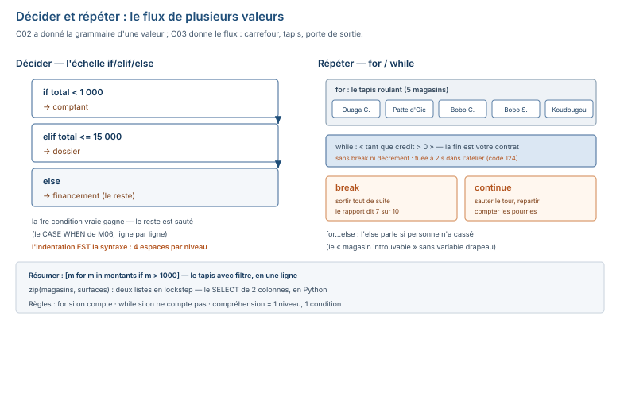

# Module M08.C03 — Décider et répéter : `if/elif/else`, boucles `for`/`while`, `break`/`continue`, compréhensions

**Outils : Python 3.13.14 seul (l'interpréteur), le terminal. Aucun paquet.
Durée indicative : 4 h. Niveau : N3 → N4. Prérequis : C02 (variables, types, erreurs).**

> **L'idée du chapitre.** C02 a donné la grammaire d'une **valeur** ; C03 donne le **flux** de
> plusieurs valeurs : **décider** (`if/elif/else` — l'échelle de décision, le `CASE WHEN` de M06
> en Python), **répéter** (`for` le tapis roulant, `while` le « tant que »), **en sortir**
> (`break` la porte de sortie, `continue` le « passe, la suite »), et **résumer** en une ligne
> (les compréhensions). Le fil rouge : le calculateur de remise de C02 devient le **contrôle
> qualité express** — 10 montants, compter les anomalies, s'arrêter au 3ᵉ dépassement, imprimer
> le rapport. C05 en fera une fonction ; C07, un calcul sur 50 008 lignes de table.

> **Matériel de l'atelier — Python 3.13.14, terminal, zéro paquet.** Tout le code de ce chapitre a
> été exécuté dans l'atelier le 19/09/2026 ; les sorties publiées sont **celles de l'atelier**. Les
> montants et magasins cités sont ceux du socle M08 (clés `m08p_*`) : les 5 magasins réels
> (`magasin.csv`), le seuil comptoir 1 000, les montants 500, 1 200, 1 500, 15 000,50.

---

## 1. Objectifs du chapitre

À la fin de ce chapitre, vous savez :

1. Écrire une **échelle de décision** `if/elif/else` avec des conditions nommées — l'équivalent
   Python du `CASE WHEN` de M06.
2. Parcourir une liste avec `for` (les 5 magasins), compter avec `range(n)`, et porter l'index **et**
   la valeur avec `enumerate`.
3. Écrire une boucle `while` « tant que » (le solde d'un crédit), reconnaître une **boucle infinie**,
   et savoir ce que `break` change.
4. Utiliser `break` (s'arrêter au premier dépassement) et `continue` (ignorer les lignes pourries) —
   les deux usages métier, plus le `for...else` « non trouvé ».
5. Écrire une **compréhension** `[expr for x in it if cond]` — et appliquer la **règle des 2
   niveaux** : au-delà, on revient à une boucle.
6. Parcourir deux listes en parallèle avec `zip` (magasins + surfaces).

## 2. Pourquoi cette notion est importante

Le flux de contrôle, c'est le métier. Un script qui ne sait ni décider ni répéter ne fait qu'un
calcul ; un script qui sait faire les deux fait un **travail** : trier, compter, arrêter, filtrer,
résumer. C'est 80 % du code qu'on écrit au quotidien — et c'est là que vivent les deux pires
familles d'erreurs du débutant : la **boucle qui ne s'arrête pas** (la machine tourne, tourne,
tourne — ce chapitre la mesure en secondes réelles) et l'**indentation** (en Python, l'alignement
**est** la syntaxe : une ligne mal alignée, c'est un `IndentationError`, pas un avertissement).

Le parallèle SQL rapporte, comme dans tout le module. Le `if/elif/else`, vous l'avez écrit en M06 :
c'est le `CASE WHEN`, ligne par ligne au lieu de colonne par colonne. Et la boucle `for`, vous
avez juste **délegué** ce travail au SGBD en SQL : quand vous écrivez `SELECT * FROM vente`, le
moteur parcourt les 50 008 lignes **pour vous**, sans que vous écriviez de boucle. En Python,
le même parcours est **à vous d'écrire** — et c'est ce qui donne sa force : en SQL, on ne peut
répéter que sur des **lignes de table** ; en Python, on répète sur **n'importe quoi** (des saisies,
des fichiers, des résultats d'API — tout ce qui n'est pas encore en table).

## 3. Explication simple — le carrefour, le tapis, le « tant que »

- Le **`if/elif/else`** est une **échelle de carrefour** : chaque échelon pose une question, la
  première vraie prend la valeur, et si personne ne dit rien, le dernier échelon (`else`) attrape
  le reste. Comme le `CASE WHEN` de M06 : une condition par ligne, un `ELSE` au fond.
- La **boucle `for`** est un **tapis roulant** : on pose les éléments (les 5 magasins) dans
  l'ordre, et on traite chacun en passant — un par un, sans sauter, sans revenir.
- La **boucle `while`** est le **« tant que »** : on ne compte pas les tours, on donne une
  condition (« tant que le crédit dépasse 0 ») et on se répète jusqu'à ce qu'elle devienne fausse.
- **`break`** est la **porte de sortie** : on sort de la boucle immédiatement, au milieu.
- **`continue`** est le **« passe » **: on saute le reste du tour **et on revient au début** —
  l'élément pourri est ignoré, le tapis continue.
- La **compréhension** est le tapis roulant **avec filtre, en une ligne** : on nomme ce qui sort
  du tapis au lieu de le traiter un par un.

## 4. Vocabulaire essentiel

| Français — English | Définition en une phrase | Piège à éviter |
|---|---|---|
| **échelle de décision** | une suite `if / elif / else` où la première condition vraie gagne, sinon `else`. | croire que les échelons se testent **tous** : la première vraie court-circuite le reste. |
| **itération** — *iteration* | un tour de boucle : le corps s'exécute une fois sur un élément. | confondre « la boucle a tourné » (le tour) et « la liste est finie » (la fin du parcours). |
| **boucle infinie** — *infinite loop* | une boucle dont la condition ne devient jamais fausse (ou dont on ne coupe jamais). | la détester : mesurée en secondes, elle est la preuve que le `break` manquait. |
| **sortie / contournement** — *break* / *continue* | `break` : sortir de la boucle tout de suite ; `continue` : sauter le reste du tour, reprendre au début. | mélanger les deux : `break` **termine** le parcours, `continue` **réduit** un tour. |
| **compréhension** — *comprehension* | `[expression for x in iterable if condition]` : une liste construite en une ligne lisible. | empiler 2 niveaux de `for` : au-delà, c'est plus une formule qu'une phrase — on repasse à une boucle. |
| **boucle avec `else`** — *for...else* | le `else` d'une boucle s'exécute **si la boucle se termine sans `break`**. | croire que le `else` fait « le contraire » : il fait « le cas où on n'a pas cassé ». |

## 5. Cours approfondi

### 5.1 `if/elif/else` — l'échelle du comptoir

L'échelle à trois modes de paiement du socle (le seuil comptoir est 1 000 FCFA, `m08p_demo_seuil` ;
au-delà de 15 000 FCFA, le client part en financement — les trois montants de test sont ceux de
C02), exécutée dans l'atelier :

```python
totaux = (500, 1200, 15000.5)
for total in totaux:
    if total < 1000:
        mode = "comptant"
    elif total <= 15000:
        mode = "dossier"
    else:
        mode = "financement"
    print(total, "->", mode)
```
```text
500 -> comptant
1200 -> dossier
15000.5 -> financement
```

> **Définition.** **échelle de décision** — *if/elif/else* — une suite d'échelons testés **dans
> l'ordre** : la première condition vraie exécutera son bloc, et le reste est sauté ; `else`
> attrape ce que personne n'a pris. C'est le `CASE WHEN … THEN … ELSE … END` de M06, écrit en
> Python.

Deux choses que cette exécution montre :

1. **L'ordre des échelons est une décision métier, pas un détail.** `< 1 000` avant
   `<= 15 000` : si on avait inversé, tout le monde serait en « dossier ». Le `CASE WHEN` de M06
   obéissait à la même règle — c'est la **même** échelle, deux langages.
2. **L'indentation EST la syntaxe.** Le bloc du `if` est ce qui est enfoncé de 4 espaces : pas de
   accolades, pas de `then` — **l'alignement dit ce qui est « dans » la condition**. Une ligne
   mal alignée, Python s'effondre (le §8 a les deux messages réels).

> **Conseil professionnel.** Écrivez la condition **en noms**, pas en chiffres :
> `if total < seuil_comptant:` (le seuil défini une fois, en haut : `seuil_comptant = 1000`) —
> si le seuil change, une ligne change. Et quand un `break` sort d'un parcours, donnez-lui une
> **raison lisible** dans l'affichage (« arrêt : 3ᵉ dépassement »), pas un `break` tout nu :
> le rapport doit pouvoir se **relire** sans le code.

### 5.2 La boucle `for` — le tapis roulant des 5 magasins

Les 5 magasins du socle (`magasin.csv`), parcourus avec leur numéro — `enumerate` donne l'index
**et** la valeur :

```python
magasins = ["Ouaga Centre", "Ouaga Patte d'Oie", "Bobo Centre", "Bobo Sarfalao", "Koudougou"]
for i, nom in enumerate(magasins):
    print(i + 1, nom)
```
```text
1 Ouaga Centre
2 Ouaga Patte d'Oie
3 Bobo Centre
4 Bobo Sarfalao
5 Koudougou
```

> **Définition.** **itération** — *iteration* — un tour de boucle : le corps de la `for`
> s'exécute une fois par élément, dans l'ordre, sans sauter ni revenir. Après le dernier
> élément, la boucle est finie — c'est tout, pas d'arrêt à écrire.

`range(n)` est le tapis des nombres : `range(10)` déroule **0 à 9** — la sortie de l'atelier le
prouve :

```text
[0, 1, 2, 3, 4, 5, 6, 7, 8, 9]
```

> **Attention.** `range(10)` donne **0 à 9**, pas 1 à 10. La liste a 10 éléments, mais le dernier
> a l'index 9 — c'est le décalage qui fabrique la moitié des bugs de comptage (et l'`IndexError`
> de C04). Pour « 1 à 10 », écrire `range(1, 11)`.

### 5.3 La boucle `while` — le « tant que » du crédit

Un crédit de 2 500 FCFA, remboursé à raison de 500 par mois — on ne compte pas les tours, on
donne la condition :

```python
credit = 2500
mensualite = 500
mois = 0
while credit > 0:
    mois = mois + 1
    credit = credit - mensualite
    print(f"mois {mois} : reste {credit}")
print("solde en", mois, "mois")
```
```text
mois 1 : reste 2000
mois 2 : reste 1500
mois 3 : reste 1000
mois 4 : reste 500
mois 5 : reste 0
solde en 5 mois
```

> **Définition.** **boucle infinie** — *infinite loop* — une boucle dont la condition ne devient
> jamais fausse (ou qu'aucun `break` ne coupe) : la machine se répète sans fin. Ce n'est pas une
> fatalité, c'est un **diagnostic** : la condition ou le `break` manque — le §5.3 et le §8
> la mesurent en secondes réelles.

La boucle infinie, **exécutée** dans l'atelier (lancée sous `timeout 2` : tuée après 2 secondes) :

```text
$ timeout 2 python3 boucle_infinie.py
code de sortie : 124
```

Aucune sortie, rien n'a été affiché, le code 124 est celui du processus **tué** : la machine
comptait encore. Et le même corps de boucle, avec le `break` qui sauve :

```python
i = 0
while True:
    i = i + 1
    if i == 5:
        break
print(i)
```
```text
5
```

La leçon tient en une phrase : `while True` n'est pas interdit — il oblige simplement à porter la
responsabilité de la sortie **dans le corps** (`break`). En SQL, le SGBD a la garantie de fin
(les lignes finissent) ; en Python, la fin est **votre** contrat.

### 5.4 `break` et `continue` — la porte de sortie et le « passe »

**Usage métier n° 1 — `break` : s'arrêter au premier dépassement.** Le contrôle ne va pas au bout
s'il trouve ce qu'il cherche : le premier montant au-dessus du seuil suffit.

```python
montants = [120, 800, 2000, 15000.5, 500]
seuil = 15000
for m in montants:
    if m > seuil:
        print("depassement :", m)
        break
print("fin du parcours")
```
```text
depassement : 15000.5
fin du parcours
```

Le `break` a coupé le parcours : `500` n'a jamais été vu. Le `print` après la boucle s'exécute
**toujours** — il est **hors** du bloc.

**Usage métier n° 2 — `continue` : ignorer les lignes pourries.** Une saisie « N/C » (non
communicable) ne bloque pas le total : on passe, on revient au début, on continue.

```python
saisies = [500, "N/C", 1500, "N/C", 1350]
total = 0
pourries = 0
for s in saisies:
    if s == "N/C":
        pourries = pourries + 1
        continue
    total = total + s
print("total :", total, "| pourries :", pourries)
```
```text
total : 3350 | pourries : 2
```

Les deux montants « N/C » sont **comptés** (pourries : 2) mais pas additionnés — c'est exactement
le `WHERE montant IS NOT NULL` de M06, écrit en Python.

**Le `for...else` — le « non trouvé » sans drapeau.** Le `else` attaché à une boucle s'exécute
**si la boucle se termine sans `break`** :

```python
magasins = ["Ouaga Centre", "Ouaga Patte d'Oie", "Bobo Centre", "Bobo Sarfalao", "Koudougou"]
for nom in magasins:
    if nom == "Sintani":
        print("trouve :", nom)
        break
else:
    print("magasin introuvable")
```
```text
magasin introuvable
```

Sintani n'étant pas dans les 5 magasins du socle, aucun `break` — le `else` a parlé. La recherche
de « Koudougou » aurait, elle, cassé la boucle et tué le `else`. C'est le rapport « client non
trouvé » sans variable drapeau en mémoire.

### 5.5 Les compréhensions — le tapis avec filtre, en une ligne

La forme : `[expression for x in iterable if condition]` — on lit la phrase de gauche à droite :
« pour chaque montant, **si** il dépasse 1 000, le garder » :

```python
montants = [500, 1500, 8000, -50, 1350, 200, 4500, 90]
gros = [m for m in montants if m > 1000]
print(gros)
print(len(gros))
```
```text
[1500, 8000, 1350, 4500]
4
```

> **Définition.** **compréhension** — *list comprehension* — `[expr for x in it if cond]` : une
> liste construite en **une** ligne, lisible de gauche à droite comme une phrase. C'est le
> raccourci du « `for` + filtre + `append` » — même résultat, moins de lignes, et l'intention
> lisible d'un coup d'œil.

> **Attention.** La **règle des 2 niveaux** : une compréhension avec **un** `for` et **une**
> `if`, c'est une phrase. Deux `for` imbriqués (`[ (m, t) for m in magasins for t in trimestres ]`),
> ce n'est plus une phrase, c'est un tableau croisé déguisé — on revient à une boucle classique,
> c'est **plus lisible** et **plus facile** à déboguer. Le croisé magasins × trimestres (l'exemple d'atelier :
> 3 magasins × 4 trimestres = 12 paires) est l'endroit où la règle se voit.

### 5.6 `zip` — deux listes, un seul parcours

Deux colonnes du même tableau, lues **en lockstep** — les 5 magasins et leurs surfaces réelles
(`magasin.csv`) :

```python
magasins = ["Ouaga Centre", "Ouaga Patte d'Oie", "Bobo Centre", "Bobo Sarfalao", "Koudougou"]
surfaces = [450, 380, 520, 290, 210]
for nom, s in zip(magasins, surfaces):
    print(nom, "-", s)
```
```text
Ouaga Centre - 450
Ouaga Patte d'Oie - 380
Bobo Centre - 520
Bobo Sarfalao - 290
Koudougou - 210
```

En SQL, c'est juste `SELECT nom, surface_m2 FROM magasin` — les deux colonnes arrivent déjà
appariées dans la ligne. En Python, `zip` fait le même appariement sur deux listes distinctes.
(`zip` s'arrête à la **plus courte** des deux : si les listes ne sont pas de même longueur,
l'écart est **silencieux** — le §9 en fait une règle de vérification.)

> **Dans les faits.** Le socle M08 contient bien une table `objectif_magasin` — **vide** (0
> ligne, clé `m08p_objectif_lignes`). Le parcours « magasins + objectifs » que ce chapitre
> illustre tourne donc sur des surfaces (données réelles) ; l'import de la table vide et la
> question « que fait un `for` sur 0 ligne ? » attendent C07 — réponse : rien, et c'est normal.

Le flux complet du chapitre — l'échelle à gauche, la boucle et ses issues à droite :



## 6. Exemple concret — le contrôle qualité express

La question du chapitre, en langage de comptoir : *« 10 montants viennent de la caisse : lesquels
sont en ordre, lesquels sont à revoir, et s'arrêter si les anomalies dérapent. »* Le script —
exécuté dans l'atelier le 19/09/2026 (le seuil de revue est 15 000 FCFA) :

```python
montants = [500, 1500, 8000, "N/C", -50, 1350, 15000.5, 200, 4500, 90]
seuil = 15000
anomalies = 0
traites = 0
for m in montants:
    traites = traites + 1
    if isinstance(m, str) or m < 0 or m > seuil:
        anomalies = anomalies + 1
        print(anomalies, "anomalie :", m)
        if anomalies == 3:
            break
print("traites :", traites, "sur", len(montants))
print("anomalies :", anomalies)
```
```text
1 anomalie : N/C
2 anomalie : -50
3 anomalie : 15000.5
traites : 7 sur 10
anomalies : 3
```

Lecture du rapport : le 4ᵉ montant (`"N/C"`, du texte dans une liste de nombres — le piège de
C02 qui redevient utile) est l'anomalie 1 ; le négatif, l'anomalie 2 ; le montant de 15 000,50
FCFA (clé `m08p_demo_montant_fcfa`) dépasse le seuil de 15 000 → anomalie 3, **le `break` coupe** :
7 montants traités sur 10, les 3 derniers (`200, 4500, 90`) n'ont pas été vus — c'est **l'effet
cherché** (le contrôle ne traîne pas) et **la limite** (le rapport doit le dire, et il le dit :
« 7 sur 10 »).

Le parallèle SQL : le même contrôle sur une table serait
`SELECT COUNT(*) FROM vente WHERE montant < 0 OR montant > 15000` — une **agrégation sur tout**
(la table ne « s'arrête pas ») ; en Python, on peut **choisir** de s'arrêter au milieu, ce que
SQL ne fait pas. C'est toute la différence de posture : le SGBD traite le **lot**, Python traite
le **flux**.

## 7. Démonstration pas à pas — 6 étapes sur le fil rouge

Du zéro au contrôle qualité, sortie réelle de chaque commande (exécutées le 19/09/2026).

**Étape 1 — Décider seul** (l'échelle sur un total nu) :

```text
$ python3 -c "total = 8000; print('comptant' if total < 1000 else 'dossier' if total <= 15000 else 'financement')"
dossier
```
*Interprétation : 8 000 passe entre 1 000 et 15 000 — dossier. L'expression conditionnelle de
C02 (la `CASE WHEN` en une ligne) est l'échelle repliée ; le bloc `if/elif/else` est la même
échelle dépliée.*

**Étape 2 — Parcourir les 5 magasins** (le `for` + `enumerate`) :

```text
$ python3 -c "
magasins = ['Ouaga Centre', \"Ouaga Patte d'Oie\", 'Bobo Centre', 'Bobo Sarfalao', 'Koudougou']
for i, nom in enumerate(magasins):
    print(i + 1, nom)"
1 Ouaga Centre
2 Ouaga Patte d'Oie
3 Bobo Centre
4 Bobo Sarfalao
5 Koudougou
```
*Interprétation : 5 tours de tapis, un par magasin — le `for` compte tout seul, pas de compteur
à maintenir.*

**Étape 3 — Le « tant que » du crédit** (le `while` de §5.3) :

```text
$ python3 credit.py
mois 1 : reste 2000
mois 2 : reste 1500
mois 3 : reste 1000
mois 4 : reste 500
mois 5 : reste 0
solde en 5 mois
```
*Interprétation : la condition (`credit > 0`) décide de la fin — 5 tours, pas un de plus ; le
dernier affichage montre **la condition qui devient fausse** (reste 0).*

**Étape 4 — S'arrêter au premier dépassement** (le `break`) :

```text
$ python3 -c "
montants = [120, 800, 2000, 15000.5, 500]
for m in montants:
    if m > 15000:
        print('depassement :', m)
        break"
depassement : 15000.5
```
*Interprétation : le parcours s'est arrêté **au milieu** — le 500 n'a pas été vu ; c'est le
contrôle qui décide de la fin, pas la fin de la liste.*

**Étape 5 — Résumer en une ligne** (la compréhension avec `isinstance`) :

```text
$ python3 -c "
montants = [500, 1500, 8000, 'N/C', -50, 1350, 200, 4500, 90]
gros = [m for m in montants if isinstance(m, (int, float)) and m > 1000]
print(gros)"
[1500, 8000, 1350, 4500]
```
*Interprétation : le `isinstance` **garde** les nombres et **écarte** les textes — le « N/C »
n'arrive jamais au comparateur, donc pas de `TypeError` (l'erreur de C02) : le filtre de la
compréhension est la porte de C02, déplacée dans une ligne.*

**Étape 6 — Deux listes en parallèle** (le `zip`) :

```text
$ python3 -c "
magasins = ['Ouaga Centre', \"Ouaga Patte d'Oie\", 'Bobo Centre', 'Bobo Sarfalao', 'Koudougou']
surfaces = [450, 380, 520, 290, 210]
for nom, s in zip(magasins, surfaces):
    print(nom, '-', s)"
Ouaga Centre - 450
Ouaga Patte d'Oie - 380
Bobo Centre - 520
Bobo Sarfalao - 290
Koudougou - 210
```
*Interprétation : 5 paires, lues en lockstep — le `SELECT nom, surface_m2` de M06, écrit en
Python.*

## 8. Erreurs fréquentes

1. **`IndentationError` — l'alignement qui casse le script.** Deux formes exécutées dans
   l'atelier. Le bloc **manquant** après un `if` :
   ```text
     File "<string>", line 7
       print('comptant')
       ^^^^^
   IndentationError: expected an indented block after 'if' statement on line 6
   ```
   Et la ligne **mal alignée** (4 espaces, puis 2) :
   ```text
     File "<string>", line 4
       print('mal aligne')
                          ^
   IndentationError: unindent does not match any outer indentation level
   ```
   Remède : **4 espaces par niveau**, jamais de mélange espaces/tabulations ; l'indentation est
   la syntaxe, pas le décor.
2. **`range(10)` = 0 à 9.** La somme « de 1 à 10 » écrite `for n in range(10)` donne **45**,
   pas 55 — exécuté dans les deux sens dans l'atelier :
   ```text
   $ python3 -c "total = 0
   for n in range(10): total = total + n
   print(total)"
   45
   $ python3 -c "total = 0
   for n in range(1, 11): total = total + n
   print(total)"
   55
   ```
   Remède : « de a à b **compris** » = `range(a, b + 1)` ; le dernier index est `n - 1`.
3. **La boucle infinie — mesurée, pas subie.** `while True` sans `break` : l'atelier la tue à
   2 secondes (code de sortie **124**), aucune sortie ; `while credit > 0` avec un oubli de
   décrément (`credit = credit + mensualite` au lieu de `-`) : pareil, **124**. Remède : avant
   chaque `while`, répondre à voix haute « **qu'est-ce qui rend la condition fausse ?** » — si la
   réponse n'est pas dans le corps, il manque un `break` ou un décrément.
4. **Remplir la liste qu'on parcourt — la boucle qui s'alimente elle-même.**
   ```text
   $ timeout 2 python3 -c "
   l = [1]
   for x in l:
       l.append(x * 2)
   print(len(l))"
   code de sortie : 137 (processus tué après 2 s)
   ```
   Chaque tour **ajoute** un élément, le tapis n'en finit pas — le code 137 (tué) est la même
   leçon que le 124. Remède : on construit **une autre** liste pendant qu'on parcourt la
   première — et c'est exactement ce que fait la compréhension du §5.5.
5. **Le `deux-points` manquant — le bloc qui n'existe pas.** `if total < 1000` sans `:` :
   `SyntaxError: expected ':'` (C02 §5.6) — en C03, c'est l'erreur **au bord** d'un bloc entier :
   tout ce qui était « dedans » n'existe plus. Remède : taper le `:` **immédiatement** après la
   condition, avant la ligne d'en dessous.
6. **La compréhension qui s'imbrique.** `[x for m in magasins for t in trimestres …]` : au
   deuxième `for`, la ligne n'est plus lisible d'un coup d'œil — ce n'est pas une erreur
   d'exécution, c'est une **erreur de lecture** qui se paiera au premier débogage. Remède : la
   règle des 2 niveaux (§5.5) — une boucle, un commentaire.

## 9. Bonnes pratiques professionnelles

1. **Un test par échelon, une échelle par décision** : si le `if` porte deux questions
   différentes (« est-ce un nombre ? » puis « est-ce en dessous du seuil ? »), ce sont deux `if`
   imbriqués ou deux variables de statut — pas un `or` monstre dans la condition.
2. **`for` quand on peut compter, `while` quand on ne peut pas** : 5 magasins → `for` ;
   « tant que le crédit dépasse 0 » → `while`. Un `while` qui compte en parallèle est un `for`
   déguisé (et plus fragile).
3. **Compréhension : un niveau, une condition, pas trop longue** — au-delà, boucle. Et quand
   la compréhension **filtre**, nommer ce qu'on garde (`gros_montants`, pas `liste2`).
4. **Vérifier la longueur avant le `zip`** : `assert len(magasins) == len(surfaces)` en tête —
   le `zip` qui s'arrête à la plus courte est **silencieux** (aucune erreur, des paires
   manquantes : le pire des défauts).
5. **Le `break` porte une raison, le `continue` porte un compte** : tout `continue` sur ligne
   pourrie incrémente un compteur (`pourries`) — le rapport final doit pouvoir dire « 2 lignes
   ignorées », sinon l'ignorance est invisible.

## 10. Exercice guidé — « le registre à trois modes » (15 min, /10)

**Énoncé.** Écrire `registre.py` qui :

1. parcourt les 3 ventes `[500, 1200, 15000.5]` avec leur numéro (`enumerate`) ;
2. classe chaque total sur l'échelle de §5.1 (comptant / dossier / financement) ;
3. compte les ventes par mode ;
4. affiche chaque vente (`vente n : total -> mode`), puis une ligne de récapitulatif.

**Barème.** L'échelle avec seuils **en variables nommées** (4 pts) · le parcours avec
`enumerate` (2 pts) · les 3 compteurs mis à jour **dans** la bonne branche (2 pts) · la sortie
propre, alignée avec le modèle ci-dessous (2 pts). Sortie attendue (vérifiée par exécution le
19/09/2026) :

```text
vente 1 : 500 -> comptant
vente 2 : 1200 -> dossier
vente 3 : 15000.5 -> financement
recap : comptant 1 | dossier 1 | financement 1
```

## 11. Exercices autonomes

**Exercice 3.1 — La somme.** Sans `sum()`, calculer la somme des nombres de 1 à 10 avec une
`for` + `range`. (5 min)

**Exercice 3.2 — Le crédit.** Un crédit de 3 500 FCFA, remboursé à 500 par mois : combien de
mois pour solde ? (`while` + compteur.) (5 min)

**Exercice 3.3 — Le premier.** Dans `[120, 800, 2000, 5200, 900]`, afficher l'**index** et la
valeur du **premier** montant au-dessus de 5 000 FCFA, puis s'arrêter. (`for` + `enumerate` +
`break`.) (5 min)

**Exercice 3.4 — Les pourries.** Dans `[500, "N/C", 1500, "N/C", 1350, "N/C"]`, additionner les
nombres seulement (`continue`), et afficher le total **et** le nombre de nombres valides. (5 min)

**Exercice 3.5 — Le `for...else`.** Pour les requêtes « Koudougou » et « Sintani », afficher
« trouve, position n » ou « introuvable » — avec un seul `for...else`, pas de variable
drapeau. (10 min)

## 12. Correction détaillée

**Exercice guidé.** Le script qui fait l'affaire :

```python
ventes = [500, 1200, 15000.5]
seuil_comptant = 1000
seuil_financement = 15000
comptant = dossier = financement = 0
for i, total in enumerate(ventes):
    if total < seuil_comptant:
        mode = "comptant"
        comptant = comptant + 1
    elif total <= seuil_financement:
        mode = "dossier"
        dossier = dossier + 1
    else:
        mode = "financement"
        financement = financement + 1
    print(f"vente {i + 1} : {total} -> {mode}")
print("recap : comptant", comptant, "| dossier", dossier, "| financement", financement)
```

Deux points de correction : les seuils sont **nommés** en tête (une ligne change si un seuil
change) ; les compteurs sont mis à jour **dans la même branche** qui pose le mode — si le
comptage était fait après l'échelle (avec un second `if` sur `mode`), deux échelles
racontent la même histoire : l'une ment à la seconde.

**Exercice 3.1.** `for n in range(1, 11): s = s + n` → **55**. Le piège est le `range(10)`
(§8, erreur n° 2) : il donne 45, et c'est exactement l'écart du 10 manquant.

**Exercice 3.2.** `while credit > 0` avec `credit = credit - 500` → **7** mois (3 500 ÷ 500 = 7
pile — le dernier tour met le solde à 0, la condition devient fausse, la boucle s'arrête
seule).

**Exercice 3.3.** `for i, m in enumerate(montants): if m > 5000: print(i, m); break` →
`3 5200` : l'index de 5 200 est **3** (zéro-indexé, §5.2) — afficher `i + 1` donnerait la
« position 4 » : les deux sont justes, il faut **choisir** et le dire.

**Exercice 3.4.** `continue` sur `"N/C"`, sinon `total = total + s` et compteur — →
`3350 3` : le total des 3 nombres (500 + 1 500 + 1 350), les 3 « N/C » ignorés.

**Exercice 3.5.** Le `for...else` imbriqué dans la boucle des requêtes :

```python
magasins = ["Ouaga Centre", "Ouaga Patte d'Oie", "Bobo Centre", "Bobo Sarfalao", "Koudougou"]
for requete in ("Koudougou", "Sintani"):
    for nom in magasins:
        if nom == requete:
            print(requete, "-> trouve, position", magasins.index(nom) + 1)
            break
    else:
        print(requete, "-> introuvable")
```
```text
Koudougou -> trouve, position 5
Sintani -> introuvable
```
L'`else` est attaché au `for` **intérieur** (même indentation que le `for`, pas au `if`) —
le `break` de l'intérieur le tue, l'absence de `break` le libère.

## 13. Mini-projet M08.P3 — « Le rapport de qualité complet » (1 h)

**Énoncé.** Écrire `qualite.py` — le contrôle qualité de §6, durci :

1. la liste des 10 montants (celle de §6) est en tête, le seuil de revue (15 000 FCFA) est une
   **variable nommée** ;
2. quatre compteurs : `illisible` (du texte), `negatif`, `a_revoir` (au-dessus du seuil),
   `conforme` — et un compteur `traites` ;
3. le parcours affiche chaque anomalie numérotée, et **s'arrête au 3ᵉ dépassement** (`break`) ;
4. le rapport final : « montants traités : n / 10 », puis les 4 compteurs — alignés, lisibles ;
5. si **aucune** anomalie n'est trouvée, le rapport dit « contrôle terminé sans dépassement »
   (indice : `for...else`).

**Critères de réussite** (grille /10) : les 5 exigences (5 × 1 pt) · la sortie de l'atelier
donne « arret au 3e depassement : 15000.5 », « montants traites : 7 / 10 », illisible 1 ·
negatif 1 · a revoir 1 · conforme 4 (1 pt) · aucun `or` monstre : un test par échelon
(1 pt) · le compteur `pourries`/`traites` est mis à jour **avant** le test (1 pt) · docstring
en tête, seuil nommé (1 pt).

> **Note de correction.** La sortie attendue est celle de l'atelier (D9 du 19/09/2026) :
> 7 montants traités sur 10 (le `break` coupe à la 3ᵉ anomalie), 4 conformes **parmis les
> traités** — les 3 montants non vus (`200, 4500, 90`) n'apparaissent dans **aucun** compteur :
> c'est l'effet du `break`, et le rapport est honnête parce qu'il dit « 7 / 10 ».

## 14. Boîte à outils du chapitre

> **Boîte à outils.** Toujours Python nu + terminal (couche 2 de C01) ; la boîte du chapitre
> s'ajoute aux encadrés de C02 : l'échelle, le tapis, la porte de sortie, la phrase-liste.

| Outil | Usage | Syntaxe |
|---|---|---|
| `if / elif / else` | l'échelle de décision | `if a < b: … elif a < c: … else: …` |
| `for` + `range` | le tapis des nombres | `for n in range(1, 11):` |
| `enumerate` | index **et** valeur | `for i, nom in enumerate(magasins):` |
| `while` | le « tant que » | `while credit > 0:` |
| `break` / `continue` | la sortie / le « passe » | `break` · `continue` |
| `for...else` | le « non trouvé » | `for … : … else: …` |
| compréhension | la liste en une ligne | `[m for m in montants if m > 1000]` |
| `zip` | deux listes en parallèle | `for nom, s in zip(magasins, surfaces):` |

## 15. Résumé du chapitre

- L'échelle `if/elif/else` est le `CASE WHEN` de M06 en Python : **la première vraie gagne**,
  l'indentation **est** la syntaxe.
- Le `for` est le tapis roulant (il compte tout seul) ; `range(10)` donne **0 à 9** ;
  `enumerate` porte l'index et la valeur.
- Le `while` est le « tant que » — la fin est **votre** contrat : la boucle infinie mesurée
  (tuée à 2 s, code 124) est la preuve qu'un `break` ou un décrément manquait.
- `break` **termine** le parcours (le rapport dit « 7 sur 10 ») ; `continue` **réduit** un tour
  (le compteur de pourries dit « 2 ignorées ») ; le `for...else` parle quand **personne** n'a
  cassé.
- La compréhension est le tapis avec filtre **en une ligne** — un niveau, une condition ; au-delà, une boucle.
- `zip` lit deux colonnes en lockstep — le `SELECT nom, surface` de M06, en Python ; il s'arrête
  à la plus courte **en silence** : vérifier la longueur.

## 16. À retenir

> **À retenir.** Avant chaque `while`, la question à voix haute : **« qu'est-ce qui rend la
> condition fausse ? »** — si la réponse n'est pas dans le corps de la boucle, la boucle est
> infinie. C'est la seule inspection qui empêche la machine de tourner toute la nuit.

> **À retenir.** `break` **termine**, `continue` **passe** — et les deux laissent des **traces** :
> le compteur `traites` après un `break`, le compteur `pourries` après un `continue`. Un rapport
> qui ne dit pas ce qu'il a vu et ce qu'il a ignoré n'est pas un rapport.

## 17. Évaluation formative (auto-correction, 8 min)

1. **Sur l'échelle « comptant < 1 000 ≤ dossier ≤ 15 000 < financement », quel mode pour
   15 000,50 — et pourquoi `elif` et pas deux `if` ?**
   → financement (15 000,50 > 15 000) ; deux `if` séparés **testeraient les deux échelons**
   (le total pourrait recevoir deux modes) — `elif` garantit une seule branche. (1 pt)
2. **`range(10)` donne quoi, et comment écrire « 1 à 10 compris » ?**
   → 0 à 9 ; `range(1, 11)`. (1 pt)
3. **`while credit > 0` avec `credit = credit - 500` mais `credit = 2500` : combien de tours,
   et qu'est-ce qui rend la condition fausse ?**
   → 5 tours ; le décrément du corps — la dernière itération met `credit` à 0. (1 pt)
4. **`break` et `continue` — la différence en une phrase, et le métier de chacun ?**
   → `break` **sort** de la boucle (arrêt au premier dépassement) ; `continue` **saute le reste
   du tour** et reprend au début (ignorer les lignes « N/C »). (2 pts)
5. **Quand le `else` d'un `for...else` s'exécute-t-il ?**
   → quand la boucle se termine **sans `break`** — le cas « non trouvé ». (1 pt)
6. **La compréhension `[m for m in montants if m > 1000]` fait quoi, et quelle est la règle
   des 2 niveaux ?**
   → une liste des montants > 1 000, en une ligne ; au-delà de **un** `for` + **une** `if`,
   on repasse à une boucle classique. (2 pts)
7. **`zip(magasins, surfaces)` s'arrête où si les listes ne font pas la même longueur ?**
   → à la **plus courte**, **en silence** (aucune erreur) — d'où la vérification de longueur. (1 pt)
8. **Le contrôle de §6 affiche « traites : 7 sur 10 » : pourquoi 7, et que font les 3
   montants non vus ?**
   → le `break` a coupé à la 3ᵉ anomalie (le 7ᵉ montant) ; les 3 suivants n'ont été traités
   nulle part — d'où le « / 10 » qui rend le rapport honnête. (1 pt)
