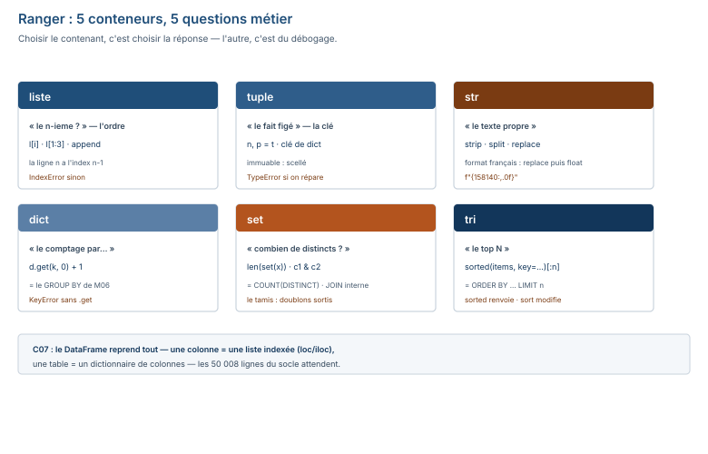

# Module M08.C04 — Ranger : listes, tuples, chaînes, dictionnaires, ensembles, index, tris

**Outils : Python 3.13.14 seul (l'interpréteur), le terminal. Aucun paquet.
Durée indicative : 4 h. Niveau : N4 → N5. Prérequis : C03 (le flux : décider, répéter).**

> **L'idée du chapitre.** C03 a donné le **flux** (décider, répéter, s'arrêter) ; C04 donne
> le **rangement** : les 5 conteneurs de Python et la question métier que chacun répond.
> La **liste** (une case numérotée, changeable, doublons admis), le **tuple** (l'enveloppe
> scellée, immuable), la **chaîne** (la séquence de caractères, et les méthodes du format
> français), le **dictionnaire** (l'étagère étiquetée — le `GROUP BY` avant pandas),
> l'**ensemble** (le tamis — le `COUNT(DISTINCT)` avant pandas). Le fil rouge : les 5 magasins
> du socle entrent dans 4 contenants, et 5 questions métier trouvent chacune leur contenant.
> En C07, le `DataFrame` prend le relais : une colonne est une liste indexée, une table est
> un dictionnaire de colonnes — tout ce chapitre est le préambule de C07.

> **Matériel de l'atelier — Python 3.13.14, terminal, zéro paquet.** Tout le code de ce
> chapitre a été exécuté dans l'atelier le 19/09/2026 ; les sorties publiées sont **celles de
> l'atelier**. Les données citées sont celles du socle M08 : les 5 magasins (`magasin.csv`,
> avec leurs villes et surfaces), 3 des libellés de paiement de `mode_paiement.csv`, le panier
> moyen 158 140 FCFA (clé `m08p_panier_moyen`).

---

## 1. Objectifs du chapitre

À la fin de ce chapitre, vous savez :

1. Construire une **liste** (`append`, `extend`), la lire à l'index (positif et négatif), la
   trancher (`[1:3]`, `[::2]`, `[::-1]`) — et lire un `IndexError` sans surprise.
2. Dire quand choisir un **tuple** plutôt qu'une liste (l'immuable : clé de dictionnaire,
   résultat figé), et faire l'**unpacking** (`n, p = …`).
3. Nettoyer et formater des **chaînes** avec `strip`, `split`, `replace`, `startswith` — la
   recette du format français en méthode.
4. Utiliser un **dictionnaire** : `d[clé]`, `d.get(clé, défaut)`, `clé in d` — et écrire le
   **compteur** (le `GROUP BY` avant pandas).
5. Compter les **valeurs uniques** avec `len(set(…))` (le `COUNT(DISTINCT)` avant pandas) et
   croiser deux ensembles (l'intersection).
6. Trier : `sorted(…)` (ne modifie pas), `.sort(reverse=True)` (modifie), et le **top N**
   d'un dictionnaire en une ligne.

## 2. Pourquoi cette notion est importante

Parce qu'en Python, **choisir le contenant, c'est choisir la réponse**. Une même donnée posée
dans le mauvais contenant rend la bonne question difficile et la mauvaise facile : les villes
dans une **liste** et « combien de villes distinctes ? » demande un `len(set(…))` ; les villes
dans un **ensemble**, la réponse est immédiate. Les 5 contenants ne sont pas 5 boîtes
interchangeables, ce sont 5 **postures** : l'ordre (liste), le figé (tuple), le texte (chaîne),
l'étiquette (dictionnaire), l'unicité (ensemble).

Et parce que le parallèle SQL est déjà **enfermé** dans ces 5 contenants : le compteur de
dictionnaire de §5.4 **est** le `SELECT id_magasin, COUNT(*) FROM vente GROUP BY id_magasin`
de M06/M07, écrit en Python ; `len(set(villes))` **est** le `COUNT(DISTINCT ville)` ; le
`sorted(d.items(), key=…)` de §5.6 **est** le `ORDER BY … LIMIT n`. C07 ne surprendra pas :
pandas est le même rangement, à l'échelle de la table.

Enfin, les index sont la base de C07 : `l[0]`, `l[-1]`, `l[1:3]` sont les frères aînés de
`df.loc[3]` et `df.iloc[1:4]` — la même idée (la ligne **n** porte l'index **n − 1**), la même
famille d'erreurs (`IndexError` aujourd'hui, `KeyError`/`IndexError` en C07).

## 3. Explication simple — la case, l'enveloppe, l'étagère, le tamis

- La **liste** est une **case numérotée** : les éléments ont un ordre et un numéro, on en
  ajoute, on en change, on en duplique — comme une file d'attente.
- Le **tuple** est l'**enveloppe scellée** : une fois fermé, on ne change plus rien dedans —
  c'est ce qui le rend **fiable** (il peut servir de clé, la clé ne doit pas changer sous le
  nez du placard).
- La **chaîne** est une **ligne de caractères** : elle aussi a des index (chaque lettre a son
  numéro) et des méthodes (`strip`, `split`, `replace`) — c'est là que vit le format français.
- Le **dictionnaire** est l'**étagère étiquetée** : chaque étiquette (clé) porte un objet
  (valeur) ; on cherche par étiquette, pas par numéro — comme un annuaire.
- L'**ensemble** est le **tamis** : les doublons tombent, il ne reste que les uniques —
  « combien de villes distinctes ? » ne se pose même plus.

## 4. Vocabulaire essentiel

| Français — English | Définition en une phrase | Piège à éviter |
|---|---|---|
| **séquence** — *sequence* | un contenant ordonné, lisible par index (liste, tuple, chaîne). | indexer par **étiquette** une séquence : l'étiquette, c'est le dictionnaire. |
| **index** — *index* | le numéro d'une position dans une séquence — la ligne **n** porte l'index **n − 1**. | écrire `l[n]` pour la ligne n : c'est `l[n − 1]` — le décalage qui fabrique l'`IndexError`. |
| **tranche** — *slice* | `l[a:b]` : les éléments de l'index a à l'index **b − 1** (la fin est exclue). | croire que `l[1:3]` contient 3 éléments : elle en contient 2. |
| **clé** — *key* | l'étiquette d'une case de dictionnaire ; `clé in d` teste les clés, pas les valeurs. | chercher une **valeur** avec `in d` : `in` regarde les étiquettes, jamais les objets. |
| **valeur unique** — *unique value* | une valeur qui ne compte qu'une fois : le rôle de l'ensemble (`set`). | compter les uniques dans une liste (avec des doublons) : le `len` de la liste ment. |
| **immuable** — *immutable* | un objet qu'on ne peut pas modifier en place (tuple, chaîne, nombre). | vouloir `t[0] = …` sur un tuple : `TypeError` — on refait un tuple, on ne répare pas. |
| **table de données** — *dataframe* | une table à colonnes, chaque colonne indexée : l'objet central de C07, annoncé ici. | la confondre avec une liste : une table a des **colonnes nommées**, une liste des index. |

## 5. Cours approfondi

### 5.1 La liste — la case numérotée

```python
magasins = ["Ouaga Centre", "Ouaga Patte d'Oie", "Bobo Centre"]
magasins.append("Bobo Sarfalao")
magasins.extend(["Koudougou"])
print(len(magasins))
print(magasins[-1])
print(magasins[1:3])
print(magasins[::2])
print(magasins[::-1][:2])
```
```text
5
Koudougou
["Ouaga Patte d'Oie", 'Bobo Centre']
['Ouaga Centre', 'Bobo Centre', 'Koudougou']
['Koudougou', 'Bobo Sarfalao']
```

> **Définition.** **séquence** — *sequence* — un contenant ordonné, lisible par index :
> liste, tuple, chaîne. La liste est la séquence **mutable** (on ajoute avec `append`,
> on étend avec `extend`, on change la case en place) — le conteneur par défaut.

Deux remarques sur la sortie : `magasins[-1]` est **Koudougou** (l'index négatif compte à
rebours : `-1` = le dernier), et la tranche `magasins[1:3]` contient **2** éléments
(`"Ouaga Patte d'Oie"` et `"Bobo Centre"`) — la borne de **fin** est
exclue (en SQL, `BETWEEN`, lui, **inclut** ses bornes : deux conventions opposées,
à retenir), et le §8 en fait une erreur.

### 5.2 Le tuple — l'enveloppe scellée

Le tuple est la liste **qu'on ne rouvre plus**. Essayez de modifier une case — la sortie
réelle de l'atelier :

```python
surface = (450, 380, 520, 290, 210)
surface[0] = 999
```
```text
TypeError: 'tuple' object does not support item assignment
```

Le tuple **se lit** comme une liste, **ne s'écrit** pas. Deux usages métier en découlent :

1. **L'unpacking** — ouvrir l'enveloppe d'un coup, en donnant un nom à chaque contenu :

```python
surface = (450, 380, 520, 290, 210)
n, p = len(surface), surface[0]
print(n, p)
```
```text
5 450
```

2. **La clé de dictionnaire** — une clé ne doit pas changer sous le placard ; le tuple,
   scellé, a le droit d'y entrer (la liste, mutable, n'y a pas droit) :

```python
cle = ("Ouaga Centre", "Ouagadougou")
d = {cle: 450}
print(d[cle])
```
```text
450
```

> **Définition.** **immuable** — *immutable* — un objet qu'on ne peut pas modifier en place
> (tuple, chaîne, nombre) : pour « changer » une valeur, on **construit** un nouvel objet
> (`surface + (210,)`, pas `surface[5] = 210`). C'est la garantie du tuple en clé de
> dictionnaire.

**Quand tuple, quand liste ?** Si les éléments sont un **fait** (les surfaces des 5
magasins — ça ne bouge pas) : tuple. S'ils vont **grandir ou changer** (les ventes du
jour) : liste. Le choix est une promesse au lecteur, pas une préférence.

### 5.3 La chaîne — le format français en méthodes

La recette du format français de C02, écrite en **méthodes de chaîne** — exécutée dans
l'atelier sur un montant encadré d'espaces (le cas réel des imports) :

```python
s = "  15 000,50  "
print(s.strip())
print(s.strip().split(" "))
print(s.strip().replace(" ", "").replace(",", "."))
print(s.startswith(" "))
```
```text
15 000,50
['15', '000,50']
15000.50
True
```

- `strip()` : arrache les espaces **aux deux bouts** (le montant tel qu'il sort d'un
  fichier mal aligné) ;
- `split(" ")` : découpe en morceaux — ici `['15', '000,50']` : les **espaces du nombre**
  sont des séparateurs pour Python, d'où la `replace` d'après ;
- `replace(" ", "").replace(",", ".")` : la conversion de C02, en chaîne — `float()` de
  l'autre côté ;
- `startswith(" ")` : la **vérification** (le montant est-il encadré ?) avant le nettoyage.

Et le formatage **dans** le sens inverse — afficher un nombre au format lisible (la valeur
est le panier moyen réel du socle, clé `m08p_panier_moyen`) :

```text
$ python3 -c "print(f\"panier moyen : {158140:,.0f} FCFA\")"
panier moyen : 158,140 FCFA
```

> **Définition.** **méthode de chaîne** — *string method* — un verbe attaché à une chaîne
> (`s.strip()`, `s.split(" ")`) : elle **renvoie une nouvelle** chaîne sans toucher à
> l'originale (la chaîne est **immutable**, §5.2) — d'où l'enchaînement `s.strip().replace(…)`.

### 5.4 Le dictionnaire — l'étagère étiquetée

```python
vente_par_magasin = [1, 2, 1, 3, 1, 4, 2, 1]
compteur = {}
for idm in vente_par_magasin:
    compteur[idm] = compteur.get(idm, 0) + 1
print(compteur)
print(compteur.get(5, 0))
print(1 in compteur, 5 in compteur)
```
```text
{1: 4, 2: 2, 3: 1, 4: 1}
0
True False
```

Le **compteur** est la construction du chapitre — lisez-la lentement, elle revient dans
tous les modules : pour chaque id, `compteur.get(idm, 0)` prend le comptage **ou 0 si la
clé est absente**, on ajoute 1, on repose. La sortie **est** le `GROUP BY` :

| Python (§5.4) | SQL (M06/M07) | Résultat |
|---|---|---|
| `compteur[idm] = compteur.get(idm, 0) + 1` | `COUNT(*) … GROUP BY id_magasin` | magasin 1 : 4 ventes |
| `compteur.get(5, 0)` | `… WHERE id_magasin = 5` (rien) | 0 — pas d'erreur |
| `1 in compteur` | `SELECT 1 FROM vente WHERE id_magasin = 1` (test d'existence) | True |

Trois détails qui portent tout :

1. `d[clé]` **lève** si la clé est absente (le `KeyError` du §8) ; `d.get(clé, défaut)`
   **renvoie** le défaut — c'est la différence entre un script qui s'effondre et un script
   qui compte.
2. `clé in d` teste les **clés** — jamais les valeurs (chercher « 4 » dans les valeurs
   demande un parcours, §8 erreur n° 3).

> **Attention.** `clé in d` teste les **clés**, jamais les valeurs : `4 in compteur`
> demande « la clé 4 existe-t-elle ? », pas « la valeur 4 existe-t-elle ? » — la
> recherche dans les valeurs est un parcours, pas une étiquette (§8, erreur n° 4).
3. Un dictionnaire **n'a pas d'ordre métier** : `{1: 4, 2: 2, 3: 1, 4: 1}` se lit par
   clé, pas par place — c'est exactement ce qu'on veut d'un `GROUP BY`.

> **Conseil professionnel.** Sur les données qu'on ne **possède** pas (fichier,
> saisie, API), la lecture est `d.get(clé, défaut)`, jamais `d[clé]` : la clé absente
> est un **cas prévu** du métier, pas une exception — un `KeyError` levé sur un cas
> prévu est le script qui s'effondre de politesse.

> **Définition.** **clé** — *key* — l'étiquette d'une case de dictionnaire : `d[clé]`
> lit, `d[clé] = valeur` écrit, `clé in d` teste. Une clé est **unique** dans son
> dictionnaire (reposer une clé **écrase** la valeur) — c'est l'unicité qui fait la
> recherche instantanée.

### 5.5 L'ensemble — le tamis

Les 5 magasins du socle se répartissent sur 3 villes (`magasin.csv`) :

```python
villes = ["Ouagadougou", "Ouagadougou", "Bobo-Dioulasso", "Bobo-Dioulasso", "Koudougou"]
print(len(set(villes)))
```
```text
3
```

> **Définition.** **valeur unique** — *unique value* — une valeur qui ne compte qu'une
> fois : `set(villes)` passe la liste au tamis (5 éléments → 3), `len(set(…))` compte les
> uniques. C'est le `COUNT(DISTINCT ville)` de M06, écrit en Python.

Et l'**intersection** — les clients qui sont dans les **deux** magasins (les codes de
démo, le principe) :

```python
c1 = {101, 102, 103, 108}
c2 = {102, 104, 105}
print(c1 & c2)
```
```text
{102}
```

`c1 & c2` est le `JOIN` **interne** des deux ensembles : un seul code commun (102) passe le
tamis. La union (`c1 | c2`), la différence (`c1 - c2`) : les trois opérateurs d'ensemble,
les trois équivalents SQL.

> **Dans les faits.** Le socle M08 porte 1 200 clients réels (`m08p_clients_lignes`).
> En C07, la question « combien de clients distincts ont acheté ? » sera
> `len(set(colonne_client))` sur la table entière — le même tamis que celui de ce
> paragraphe, passé de 9 codes de démo à 1 200 lignes.

### 5.6 Index, tranches, tris

Le tableau d'index complet, sur les 5 magasins (exécuté) :

```python
magasins = ["Ouaga Centre", "Ouaga Patte d'Oie", "Bobo Centre", "Bobo Sarfalao", "Koudougou"]
print(magasins[0])
print(magasins[-1])
print(magasins[2:4])
print(magasins[::2])
print(magasins[::-1])
print(magasins[5])
```
```text
Ouaga Centre
Koudougou
['Bobo Centre', 'Bobo Sarfalao']
['Ouaga Centre', 'Bobo Centre', 'Koudougou']
['Koudougou', 'Bobo Sarfalao', 'Bobo Centre', "Ouaga Patte d'Oie", 'Ouaga Centre']
Traceback (most recent call last):
  File "<string>", line 7, in <module>
    print(magasins[5])
          ~~~~~~~~^^^
IndexError: list index out of range
```

> **Définition.** **tranche** — *slice* — `l[a:b]` : les éléments de l'index **a** à
> l'index **b − 1** (la fin **est exclue**) ; `l[::2]` tous les deux ; `l[::-1]` l'inverse.
> La tranche **ne lève jamais** hors plage : `magasins[3:9]` renvoie simplement jusqu'à
> la fin — c'est l'`IndexError` de l'index **simple** qui protège, pas la tranche.

> **Attention.** La fin de tranche est **exclue** : `magasins[1:3]` contient les indexes
> 1 et 2 — pas 1, 2, 3. « de la ligne a à la ligne b **comprises** » s'écrit
> `l[a − 1 : b]` : penser en indexes, pas en lignes (§8, erreur n° 6).

| Expression | Résultat | Lecture |
|---|---|---|
| `l[0]` / `l[-1]` | premier / dernier | la ligne 1 / la ligne dernière |
| `l[2:4]` | les indexes 2 et 3 | **2** éléments (fin exclue) |
| `l[::2]` | un élément sur deux | pas de 2 |
| `l[::-1]` | l'inverse | pas −1 |
| `l[5]` (5 éléments) | `IndexError` | la ligne 5 a l'index 4 |

Les **tris** — les deux frères, et le top N (exécutés) :

```python
montants = [3500, 2500, 4500, 1500, 2000]
print(sorted(montants, reverse=True))
print(montants)
montants.sort(reverse=True)
print(montants)
```
```text
[4500, 3500, 2500, 2000, 1500]
[3500, 2500, 4500, 1500, 2000]
[4500, 3500, 2500, 2000, 1500]
```

`sorted(…)` **renvoie** une nouvelle liste (l'originale est intacte — regardez la 2ᵉ
sortie) ; `.sort(…)` **tri en place** (renvoie `None`). Et le **top N d'un
dictionnaire** — le `ORDER BY … LIMIT n` de M06, en une ligne (valeurs de démo) :

```python
ca = {1: 25000, 2: 150000, 3: 45000, 4: 120000, 5: 21000}
top2 = sorted(ca.items(), key=lambda p: p[1], reverse=True)[:2]
print(top2)
```
```text
[(2, 150000), (4, 120000)]
```

`ca.items()` donne les paires `(clé, valeur)` ; `key=lambda p: p[1]` dit « trie sur la
**valeur** » (le `p[1]` — la 2ᵉ composante de la paire) ; `[:2]` prend le top. La
`lambda` — la fonction sans nom — arrive en C05 ; ici, lisez-la comme « la règle de tri,
en une ligne ».

Les 5 conteneurs et leurs équivalents SQL, en une planche :



## 6. Exemple concret — les 5 magasins dans 4 contenants

La question du chapitre, en langage de comptoir : *« j'ai la liste brute des 5 magasins
(nom, ville, surface) — donnez-moi 4 points de vue dessus. »* Le script — exécuté dans
l'atelier le 19/09/2026 :

```python
brut = [("Ouaga Centre", "Ouagadougou", 450),
        ("Ouaga Patte d'Oie", "Ouagadougou", 380),
        ("Bobo Centre", "Bobo-Dioulasso", 520),
        ("Bobo Sarfalao", "Bobo-Dioulasso", 290),
        ("Koudougou", "Koudougou", 210)]
noms = [ligne[0] for ligne in brut]
coordonnees = tuple((ligne[1], ligne[2]) for ligne in brut)
par_ville = {}
for ligne in brut:
    par_ville.setdefault(ligne[1], []).append(ligne[0])
villes = {ligne[1] for ligne in brut}
print("1. le 3e magasin :", noms[2])
print("2. nombre de villes distinctes :", len(villes))
print("3. magasins de Bobo-Dioulasso :", par_ville.get("Bobo-Dioulasso", []))
print("4. surface de Ouaga Centre :", dict((l[0], l[2]) for l in brut)["Ouaga Centre"])
print("5. le plus grand magasin :", max(brut, key=lambda l: l[2])[0])
```
```text
1. le 3e magasin : Bobo Centre
2. nombre de villes distinctes : 3
3. magasins de Bobo-Dioulasso : ['Bobo Centre', 'Bobo Sarfalao']
4. surface de Ouaga Centre : 450
5. le plus grand magasin : Bobo Centre
```

Cinq questions, cinq postures : **index** (le 3ᵉ), **tamis** (les villes distinctes),
**étiquette avec défaut** (les magasins d'une ville, `get` — pas de `KeyError` si la
ville n'y est pas), **étiquette** (la surface d'un nom), **règle de tri** (le plus grand,
`max` avec `key`). Les 4 contenants (liste de noms, tuple de coordonnées, dictionnaire
ville → magasins, ensemble de villes) sont construits **une fois** et servent les 5
questions — c'est l'architecture que C07 reprend à l'échelle du `DataFrame`.

## 7. Démonstration pas à pas — 6 étapes sur le fil rouge

Sortie réelle de chaque commande (exécutées le 19/09/2026).

**Étape 1 — Le `COUNT(DISTINCT)` en une ligne** (l'ensemble) :

```text
$ python3 -c "
villes = ['Ouagadougou', 'Ouagadougou', 'Bobo-Dioulasso', 'Bobo-Dioulasso', 'Koudougou']
print(len(set(villes)))"
3
```
*Interprétation : 5 occurrences, 3 villes — le tamis a fait le `DISTINCT` ; en C07, la
même ligne passera sur la colonne `ville` de 50 008 lignes.*

**Étape 2 — Le `GROUP BY` en 3 lignes** (le compteur) :

```text
$ python3 -c "
vente_par_magasin = [1, 2, 1, 3, 1, 4, 2, 1]
compteur = {}
for idm in vente_par_magasin:
    compteur[idm] = compteur.get(idm, 0) + 1
print(compteur)"
{1: 4, 2: 2, 3: 1, 4: 1}
```
*Interprétation : 8 ventes, 4 magasins — la 5ᵉ n'a pas vendu (et `compteur.get(5, 0)`
répondrait 0 sans s'effondrer) : c'est le `GROUP BY`, pas le `JOIN`.*

**Étape 3 — La tranche des magasins de Bobo** (l'index) :

```text
$ python3 -c "
magasins = ['Ouaga Centre', \"Ouaga Patte d'Oie\", 'Bobo Centre', 'Bobo Sarfalao', 'Koudougou']
print(magasins[2:4])"
['Bobo Centre', 'Bobo Sarfalao']
```
*Interprétation : les indexes 2 et 3, donc les **3ᵉ et 4ᵉ** lignes — pas les 2ᵉ
et 3ᵉ : la ligne n a l'index n − 1.*

**Étape 4 — Le top 2** (le tri par valeur) :

```text
$ python3 -c "
ca = {1: 25000, 2: 150000, 3: 45000, 4: 120000, 5: 21000}
top2 = sorted(ca.items(), key=lambda p: p[1], reverse=True)[:2]
print(top2)"
[(2, 150000), (4, 120000)]
```
*Interprétation : tri sur la valeur (le `p[1]`), décroissant, tranche `[:2]` — le
`ORDER BY ca DESC LIMIT 2`.*

**Étape 5 — L'intersection des clients** (l'ensemble) :

```text
$ python3 -c "
c1 = {101, 102, 103, 108}
c2 = {102, 104, 105}
print(c1 & c2)"
{102}
```
*Interprétation : un seul client commun — le `JOIN` interne en un symbole.*

**Étape 6 — Le montant lisible** (la chaîne) :

```text
$ python3 -c "print(f\"panier moyen : {158140:,.0f} FCFA\")"
panier moyen : 158,140 FCFA
```
*Interprétation : le panier moyen réel du socle (clé `m08p_panier_moyen`), formaté en
une f-string — le formatage des rapports de tout le module.*

## 8. Erreurs fréquentes

1. **`IndexError: list index out of range` — la ligne n a l'index n − 1.** Exécuté dans
   l'atelier (5 éléments, demande de l'index 5) :
   ```text
     File "<string>", line 7, in <module>
       print(magasins[5])
             ~~~~~~~~^^^
   IndexError: list index out of range
   ```
   Remède : la 5ᵉ ligne est `magasins[4]` ; pour « la dernière », `magasins[-1]` —
   jamais d'index calculé en tête sans le `- 1`.
2. **Modifier un tuple — `TypeError`.** `surface[0] = 999` sur un tuple :
   `TypeError: 'tuple' object does not support item assignment` (sortie réelle, §5.2).
   Remède : le tuple **se refait**, ne se répare pas (`surface + (210,)`) — et si c'est
   censé changer, c'était une **liste**.
3. **`d[clé]` sur une clé absente — `KeyError`.** Exécuté dans l'atelier :
   ```text
     File "<string>", line 2, in <module>
       print(par_ville["Sintani"])
             ~~~~~~~~~^^^^^^^^^^
   KeyError: 'Sintani'
   ```
   Remède : `d.get(clé, défaut)` sur toute donnée qu'on ne **possède** pas (fichier,
   saisie) — le défaut est la politesse du script (§5.4).
4. **`clé in d` cherche les clés, pas les valeurs.** `4 in compteur` répond « la clé 4
   existe-t-elle ? » — pas « la valeur 4 existe-t-elle ? ». Remède : pour chercher dans
   les **valeurs**, un petit `for` : `any(v == 4 for v in compteur.values())` — la
   recherche par valeur est un parcours, pas une étiquette.
5. **`sorted` vs `sort` — le tri qui « ne s'est pas fait ».** `tri = montants.sort()`
   donne `tri = None` : le tri s'est bien fait **dans** `montants`, mais ce qu'on a
   re-affecté est `None` ; et `sorted(…)` **ne touche pas** l'originale — la sortie
   réelle le montre (`[3500, 2500, …]` intacte après le `sorted`, §5.6). Remède :
   `tri = sorted(montants)` pour garder l'originale, `montants.sort()` (et ne pas
   re-affecter) pour trier **sur place** — vérifier laquelle on veut **avant** de taper.
6. **La tranche qui « manque » un élément.** `magasins[1:3]` donne 2 éléments, pas 3 —
   la fin est **exclue**. Remède : « de la ligne a à la ligne b **comprises** » =
   `l[a − 1 : b]` — ou, plus simple : penser en indexes, pas en lignes.

## 9. Bonnes pratiques professionnelles

1. **Un contenant par question** : les villes distinctes → ensemble ; le comptage par
   magasin → dictionnaire ; l'ordre des magasins → liste. Tout mettre dans une liste
   unique, c'est répondre à toutes les questions avec le même marteau.
2. **`d.get(clé, défaut)` sur ce qu'on ne possède pas** : fichier, saisie, API — la clé
   absente est un **cas prévu**, pas une exception (le `KeyError` du §8 est le script qui
   s'effondre sur un cas prévu).
3. **`len(set(…))` dès que « distinct » apparaît** : ne jamais compter les uniques dans
   une liste en la parcourant à la main — le tamis fait le travail et dit la vérité.
4. **Le top N est toujours `sorted(…, key=…)[:n]`** — pas de tri manuel, pas de `for` qui
   cherche le max n fois : une ligne, lisible, testable.
5. **Nommer le contenant par son contenu** : `villes`, `par_ville`, `compteur` — pas
   `data1`, `liste2` : le nom dit la **question** que le contenant répond.

## 10. Exercice guidé — « les 5 questions des magasins » (15 min, /10)

**Énoncé.** Écrire `magasins.py` qui, à partir de la liste brute `brut` (les 5 tuples
`(nom, ville, surface)` de §6) :

1. construit **4 contenants** : `noms` (liste), `coordonnees` (tuple de paires
   ville/surface), `par_ville` (dictionnaire ville → liste de noms), `villes`
   (ensemble) ;
2. répond aux 5 questions de §6 — avec le **bon contenant** pour chacune.

**Barème.** Les 4 contenants construits (4 pts) · les 5 questions posées avec le contenant
qui les répond — index / `len(set(…))` / `get` / dictionnaire / `max` (2,5 pts,
−0,5 par question posée au mauvais contenant) · la sortie alignée sur le modèle
ci-dessous (2 pts) · aucun `d[clé]` nu sur `par_ville` (1 pt). Sortie attendue
(vérifiée par exécution le 19/09/2026) :

```text
1. le 3e magasin : Bobo Centre
2. nombre de villes distinctes : 3
3. magasins de Bobo-Dioulasso : ['Bobo Centre', 'Bobo Sarfalao']
4. surface de Ouaga Centre : 450
5. le plus grand magasin : Bobo Centre
```

## 11. Exercices autonomes

**Exercice 4.1 — La tranche des Bobo.** Sur la liste des 5 magasins (ordre du socle),
extraire **par tranche** les 2 magasins de Bobo-Dioulasso. (3 min)

**Exercice 4.2 — Le compteur des paiements.** Sur la liste
`["Especes", "Mobile Money", "Especes", "Carte Bancaire", "Mobile Money", "Especes"]`
(les 3 libellés réels de `mode_paiement.csv`), construire le compteur dictionnaire
et l'afficher. (5 min)

**Exercice 4.3 — Le tamis.** Sur la liste
`["Ouagadougou", "Bobo-Dioulasso", "Ouagadougou", "Koudougou", "Bobo-Dioulasso", "Ouagadougou"]`,
donner le nombre de villes **distinctes** — avec `set`, sans parcours manuel. (3 min)

**Exercice 4.4 — Le top 2.** Sur le dictionnaire
`ca = {1: 25000, 2: 150000, 3: 45000, 4: 120000, 5: 21000}`, afficher le top 2
par valeur, en paires. (5 min)

**Exercice 4.5 — Le nettoyage.** Transformer la chaîne `"  15 000,50  "` en `float`,
puis l'afficher avec 2 décimales en f-string. (5 min)

## 12. Correction détaillée

**Exercice guidé.** Le script de §6 **est** la correction (exécuté dans l'atelier) —
les 5 points de vigilance : `noms` par index (`noms[2]`, pas de recherche), `villes` en
`set` (le `len` direct), `par_ville.get(…, [])` (**pas** `par_ville[ville]` — le
`KeyError` du §8 si la ville est absente), la surface par un dictionnaire nom → surface
(`dict((l[0], l[2]) for l in brut)`), le plus grand par `max(brut, key=lambda l: l[2])`.

**Exercice 4.1.** `magasins[2:4]` → `['Bobo Centre', 'Bobo Sarfalao']` : les indexes 2
et 3 (fin exclue, §8 erreur n° 6).

**Exercice 4.2.** Le compteur de §5.4 sur les libellés :
```text
{'Especes': 3, 'Mobile Money': 2, 'Carte Bancaire': 1}
```
(six paiements, 3 libellés — le `GROUP BY mode_paiement` de M07, sur 6 lignes au lieu de
50 008.)

**Exercice 4.3.** `len(set(villes))` → **3** : 6 occurrences, 3 villes distinctes — le
`COUNT(DISTINCT ville)` en une ligne.

**Exercice 4.4.** `sorted(ca.items(), key=lambda p: p[1], reverse=True)[:2]` →
`[(2, 150000), (4, 120000)]` : le tri porte sur `p[1]` (la valeur), `[:2]` coupe — le
`ORDER BY … LIMIT 2`.

**Exercice 4.5.** `float(s.strip().replace(" ", "").replace(",", "."))` → 15 000,50
converti ; affiché : `15,000.50` (la convention par défaut de Python, §5.4 de C02 —
le format français s'écrit à la main si le rapport l'exige).

## 13. Mini-projet M08.P4 — « L'annuaire des magasins » (1 h)

**Énoncé.** Écrire `annuaire.py` — le §6, durci en **rapport** :

1. la liste brute `brut` (5 tuples) est en tête, et les contenants sont construits
   **une fois** (liste de noms, tuple de surfaces, dictionnaire `par_ville`, ensemble
   de villes, **et** un dictionnaire nom → surface — 5 au total, le dernier servant
   la recherche inverse) ;
2. le rapport **par ville triée** : pour chaque ville, la liste de ses magasins et la
   **somme de leurs surfaces** ;
3. la ligne « villes distinctes : n » ;
4. la ligne « plus grand magasin : nom (surface m2) » ;
5. la recherche **inverse** : « magasin de 450 m2 : nom » (du chiffre au nom — le
   dictionnaire qui sert dans les deux sens).

**Critères de réussite** (grille /10) : les 5 exigences (5 × 1 pt) · la sortie de
l'atelier : `Bobo-Dioulasso : Bobo Centre, Bobo Sarfalao — 810 m2`,
`Koudougou : Koudougou — 210 m2`, `Ouagadougou : Ouaga Centre, Ouaga Patte d'Oie — 830 m2`,
villes distinctes 3, plus grand magasin Bobo Centre (520 m2), magasin de 450 m2
Ouaga Centre (1 pt) · aucun `d[clé]` nu sur `par_ville` (1 pt) · la somme de surfaces
par ville **calculée**, pas resaisie (1 pt) · docstring en tête (1 pt).

> **Note de correction.** Les sommes (810 = 520 + 290 ; 830 = 450 + 380) sont **mesurées**
> dans l'atelier — l'apprenant qui les annonce sans exécuter trahit le principe du module
> (prédire, exécuter, comparer). La ville s'affiche **triée alphabétiquement**
> (`sorted(par_ville)`) : Bobo-Dioulasso, Koudougou, Ouagadougou — le tri des clés est
> le `ORDER BY ville` du rapport.

## 14. Boîte à outils du chapitre

> **Boîte à outils.** Python nu + terminal toujours ; la boîte du chapitre s'ajoute à
> celles de C02-C03 : les 5 contenants et leurs opérateurs signature.

| Contenant | Question métier | Opérateur signature |
|---|---|---|
| `liste` | « le nᵉ ? » — l'ordre | `l[i]`, `l[1:3]`, `append` |
| `tuple` | « le fait figé » — la clé | `n, p = t`, `t` en clé de `dict` |
| `str` | « le texte propre » | `strip`, `split`, `replace` |
| `dict` | « le comptage par… » | `d.get(k, 0)`, `k in d` |
| `set` | « combien de distincts ? » | `len(set(x))`, `c1 & c2` |
| tri | « le top N » | `sorted(d.items(), key=…)[:n]` |

## 15. Résumé du chapitre

- La **liste** est la case numérotée (mutable, doublons) ; `l[-1]` est le dernier,
  `l[1:3]` contient **2** éléments (fin exclue), `l[5]` sur 5 éléments lève
  `IndexError` — la ligne n a l'index n − 1.
- Le **tuple** est l'enveloppe scellée : `TypeError` si on la répare, `n, p = t` pour
  l'ouvrir, et seule l'immuable a le droit d'être **clé** de dictionnaire.
- La **chaîne** est la séquence de caractères : `strip`/`split`/`replace` nettoient le
  format français, la f-string l'affiche (`158,140 FCFA`).
- Le **dictionnaire** est l'étagère étiquetée : `d.get(clé, défaut)` ne s'effondre
  jamais, `clé in d` teste les **clés**, et le compteur `d.get(k, 0) + 1` **est** le
  `GROUP BY`.
- L'**ensemble** est le tamis : `len(set(villes))` = `COUNT(DISTINCT ville)`,
  `c1 & c2` = le `JOIN` interne.
- `sorted(…)` renvoie, `.sort(…)` modifie ; le top N est
  `sorted(d.items(), key=lambda p: p[1], reverse=True)[:n]` — le `ORDER BY … LIMIT n`.

## 16. À retenir

> **À retenir.** Avant de taper un contenant, la question : **« quelle est la question
> métier ? »** — l'ordre (liste), le fait figé (tuple), l'étiquette (dictionnaire),
> l'unicité (ensemble). Le bon contenant rend la bonne question **immédiate** et la
> mauvaise difficile ; l'inverse, c'est du débogage.

> **À retenir.** `d[clé]` **lève**, `d.get(clé, défaut)` **renvoie** : sur les données
> qu'on ne possède pas (fichiers, saisies), seul le second a le droit d'exister — le
> `KeyError` d'un cas prévu est le script qui s'effondre de politesse.

## 17. Évaluation formative (auto-correction, 8 min)

1. **`magasins[2:4]` contient combien d'éléments, et pourquoi ?**
   → 2 (les indexes 2 et 3) : la borne de fin est **exclue** — la convention des
   tranches Python. (1 pt)
2. **`magasins[5]` sur une liste de 5 éléments fait quoi, et quelle est la bonne
   demande ?**
   → `IndexError: list index out of range` ; la 5ᵉ ligne est `magasins[4]` (ou
   `magasins[-1]`). (1 pt)
3. **Pourquoi le tuple est-il bon pour clé de dictionnaire et pas la liste ?**
   → le tuple est **immuable**, donc hachable : `dict` accepte une clé tuple ;
   la liste est mutable — `dict` la refuse (`TypeError: unhashable type: 'list'`).
   (2 pts)
4. **`compteur[idm] = compteur.get(idm, 0) + 1` — que fait la `.get(…, 0)` exactement ?**
   → prend le comptage de la clé **ou 0 si la clé est absente** : pas de `KeyError` au
   premier passage — c'est ce qui fait le `GROUP BY`. (2 pts)
5. **`clé in d` teste quoi — les clés ou les valeurs ?**
   → les **clés** ; chercher dans les valeurs demande un parcours
   (`any(v == x for v in d.values())`). (1 pt)
6. **`len(set(villes))` est l'équivalent SQL de quoi ?**
   → `COUNT(DISTINCT ville)` — le tamis compte les uniques. (1 pt)
7. **`sorted(montants)` et `montants.sort()` — la différence en une phrase ?**
   → `sorted` **renvoie** une nouvelle liste (l'originale intacte) ; `.sort` trie
   **en place** (renvoie `None`). (1 pt)
8. **Le top 2 d'un dictionnaire `ca` par valeur, en une ligne ?**
   → `sorted(ca.items(), key=lambda p: p[1], reverse=True)[:2]` — le `ORDER BY …
   LIMIT 2`. (1 pt)
