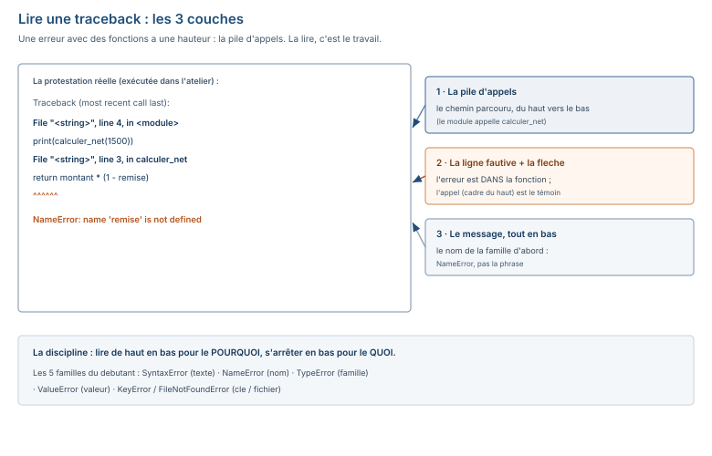

# Module M08.C05 — Organiser : fonctions, arguments, portée, docstring, modules, `try/except`, fichiers

**Outils : Python 3.13.14 seul + la bibliothèque standard (`csv`, `json`), le système de
fichiers. Aucun paquet tiers.
Durée indicative : 4 h. Niveau : N5 → N6. Prérequis : C04 (les conteneurs).**

> **L'idée du chapitre.** C04 a donné le **rangement** ; C05 donne l'**organisation** :
> découper le script en **fonctions** testables (le calculateur de remise de C02 devient
> enfin une fonction), savoir ce qui **entre** (arguments) et ce qui **sort**
> (`return` — pas `print`), ce qui est **visible** (la portée), ce qu'on **documente**
> (la docstring), ce qu'on **protège** (`try/except` — jamais d'`except` nu), et comment
> le travail **sort de l'écran** (les fichiers : CSV, JSON, l'encodage `utf-8-sig` et le
> BOM). Le fil rouge : le **nettoyeur de montants** — une fonction qui reçoit
> `"15 000,50"`, `"15000.50"` ou `"N/C"` et renvoie un `float` ou `None`, 6 cas de test
> exécutés. C07 le retrouvera devant 50 008 lignes.

> **Matériel de l'atelier — Python 3.13.14, bibliothèque standard, dossier du socle.**
> Tout le code de ce chapitre a été exécuté dans l'atelier le 19/09/2026 ; les sorties
> publiées sont **celles de l'atelier**. Les fichiers cités sont réels :
> `03_exercices/dossier_M08/vente.csv` (13 colonnes, 50 008 lignes — clé
> `m08p_ventes_lignes`) et `03_exercices/dossier_M08/ATTENDU.json` (30 clés, la fiche de
> contrôle du socle). Les montants : 1 500, 1 200, 15 000,50, 158 140 (clés du socle).

---

## 1. Objectifs du chapitre

À la fin de ce chapitre, vous savez :

1. Écrire une **fonction** avec `def` et `return` — et expliquer pourquoi `print` n'est
   pas une sortie (le piège `None`, exécuté).
2. Passer des **arguments** : positionnels, nommés (`calculer_remise(montant=1500,
   taux=0.05)`), avec **valeurs par défaut** — et éviter le piège de la valeur par défaut
   **mutable** (exécuté : `2 2` au lieu de `1 1`).
3. Dire ce qui est **visible** : portée locale vs globale, la variable de boucle qui
   « fuite » (elle existe après la boucle), `global` (à éviter).
4. Écrire une **docstring** à la convention (`Quoi / Entrées / Sortie / Exemple`) et la
   vérifier avec `help(f)`.
5. Placer les **imports** en tête de fichier, et distinguer `import`, `from … import`.
6. Intercepter **l'erreur attendue** avec `try/except` **spécifié** (jamais d'`except:`
   nu — le bug silencieux, exécuté) — et lire une **traceback en 3 couches**.
7. Lire et écrire des **fichiers** : `open` avec `with`, l'encodage `utf-8-sig` (le BOM),
   le module `csv` sur le vrai `vente.csv` du socle, `json.load`/`json.dump` sur le vrai
   `ATTENDU.json`.

## 2. Pourquoi cette notion est importante

Parce que le passage de C04 à C05 est le passage du **brouillon** au **livrable**. Un
script de 40 lignes dans le même fichier est un brouillon ; un script découpé en
fonctions nommées, documentées, testées — c'est un livrable qu'un collègue peut **lire**
et **reprendre**. La fonction est la brique de cette transition : elle a un nom (donc une
raison d'exister), des entrées (donc un contrat), une sortie (donc un résultat
**vérifiable** sans affichage).

Et parce que la machine commence à **travailler sur du réel** : les fichiers du dossier
M08 (8 CSV + `ATTENDU.json`) attendent C07, mais leurs **questions** arrivent ici : que
faut-il faire pour qu'un CSV Excel lisible (BOM, format français) devienne des nombres ?
Pourquoi `open("vente.csv")` échoue « alors que le fichier existe » (le chemin relatif,
§8) ? Que vaut `json.load` sur la fiche du socle ? C05 installe les **habitudes** ; C07
les passera à l'échelle.

Enfin, `try/except` est la différence entre un script qui **gère** le cas prévu (le
montant « N/C » est un **fait de métier**, pas un accident) et un script qui **s'effondre**
sur lui — et l'`except` nu est le piège qui transforme ce dernier en **mensonge** : il
« marche » et renvoie des résultats faux sans un mot (le §8 l'exécute).

## 3. Explication simple — la machine à café

- La **fonction** est une **machine à café** : on met ce qu'elle attend (argent, choix),
  on appuie, elle donne **une chose** (le café) — et rien d'autre. `return` est la chose
  qu'elle donne ; `print` est le bruit qu'elle fait **en plus** (bruyant, et ce n'est pas
  le café).
- L'**argument par défaut** est le **choix préimprimé** sur la machine : si on ne précise
  rien, la machine prend le choix d'usine (`taux=0.10` — la remise de septembre, C03).
- La **portée** est la **cuisine** : ce qui est préparé dedans (les variables locales) ne
  sort pas — sauf si on l'a mis sur le comptoir (`return`).
- La **docstring** est la **notice** collée sur la machine : quoi, entrées, sortie,
  exemple — `help(f)` la lit à voix haute.
- Le **`try/except`** est le **filet sous le gobelet qui fuit** : on l'a mis **là où** la
  fuite est attendue (le montant illisible), pas sur toute la cuisine (l'`except` nu).
- Le **fichier** est le **tiroir** : le travail y entre (`read`), y sort (`write`) — et
  l'encodage, c'est l'**étiquette de langue** du tiroir (`utf-8-sig`, le BOM).

## 4. Vocabulaire essentiel

| Français — English | Définition en une phrase | Piège à éviter |
|---|---|---|
| **fonction** — *function* | un bloc nommé, réutilisable, qui renvoie **une** valeur avec `return`. | faire `print` et croire que c'est la sortie : la sortie est le `return`, le `print` est un bruit. |
| **argument par défaut** — *default argument* | la valeur prise quand l'appel ne précise rien (`taux=0.10`). | la faire **mutable** (`panier=[]`) : elle est **partagée** entre tous les appels qui ne la précisent pas. |
| **portée** — *scope* | la zone de visibilité d'une variable : locale (dans la fonction) ou globale (partout). | croire qu'une variable locale existe dehors : elle meurt avec la fonction (le `NameError` du §8). |
| **docstring** — *docstring* | le commentaire en tête de fonction, entre triples guillemets, lu par `help(f)`. | la faire **répéter** le code : elle doit dire le **contrat** (entrées, sortie, exemple), pas le listing. |
| **exception** — *exception* | une erreur **levée** à un endroit, qui peut être **interceptée** plus haut (`except`). | l'intercepter **sans la nommer** (`except:`) : on avale aussi le bug qu'on cherchait. |
| **BOM** — *byte order mark* | les 3 octets invisibles en tête d'un fichier `utf-8-sig`, qui corrompent la 1ʳ colonne si on lit en `utf-8` pur. | lire un fichier Excel en `utf-8` : la première clé devient `'\ufeffid_…'` — une clé qui n'existe pas. |

## 5. Cours approfondi

### 5.1 La fonction — le `return` est la sortie, pas le `print`

Le calculateur de remise de C02/C03 devient enfin une fonction — le fil rouge du module :

```python
def calculer_remise(montant, taux=0.10):
    return montant * (1 - taux)

print(calculer_remise(1500))
```
```text
1350.0
```

> **Définition.** **fonction** — *function* — un bloc nommé de code, appelé par son nom
> avec des arguments, qui **renvoie une valeur** avec `return`. Sans `return`, une
> fonction renvoie `None` — même si elle a **affiché** quelque chose : le `print` est un
> bruit, pas une sortie.

Le piège, exécuté dans l'atelier (la fonction affiche le bon nombre… et renvoie `None`) :

```python
def affiche_remise(montant):
    print(montant * 0.9)

r = affiche_remise(1500)
print(r)
```
```text
1350.0
None
```

La 2ᵉ ligne est la leçon : `r` a reçu `None`, pas 1350.0. La fonction a **affiché** la
valeur au lieu de la **rendre** — le test (et le collègue) n'a plus qu'un `None` en main.

> **Conseil professionnel.** Une fonction fait **une chose** et son nom dit quoi, au
> **verbe** : `calculer_remise`, `nettoyer_montant`, `charger_fichier` — pas
> `fonction1`, pas `trucs`. Et la sortie est **toujours** un `return` : le `print` reste
> pour l'humain qui regarde, le `return` est pour la machine qui enchaîne.

### 5.2 Les arguments — positionnels, nommés, par défaut

Trois façons d'appeler, exécutées (la remise passe de 10 % à 5 %) :

```python
def calculer_remise(montant, taux=0.10):
    return montant * (1 - taux)

print(calculer_remise(1500))
print(calculer_remise(1500, 0.05))
print(calculer_remise(montant=1500, taux=0.05))
```
```text
1350.0
1425.0
1425.0
```

- **positionnel** : `calculer_remise(1500, 0.05)` — l'ordre de la signature ;
- **nommé** : `calculer_remise(montant=1500, taux=0.05)` — l'ordre est libéré, la
  lecture est gagnée (c'est l'`AS` du `SELECT` de M06, appliqué à l'appel) ;
- **par défaut** : `taux=0.10` — le taux non précisé prend la valeur d'usine.

Et le piège du **par défaut mutable**, exécuté dans les deux sens (le bug, puis la
correction) :

```python
def ajouter(vente, panier=[]):
    panier.append(vente)
    return panier

a = ajouter(1500)
b = ajouter(2000)
print(len(a), len(b))
```
```text
2 2
```

> **Attention.** La valeur par défaut **mutable** est construite **une fois**, au
> moment de la `def` — et **partagée** entre tous les appels qui ne la précisent pas :
> le 2ᵉ appel a vu le 1ᵉ (le panier a 2 éléments, pas 1). C'est le bug silencieux le
> plus célèbre de Python : il ne lève rien, il **souille**.

La correction — `None` comme défaut, la liste construite **à chaque appel** :

```python
def ajouter(vente, panier=None):
    if panier is None:
        panier = []
    panier.append(vente)
    return panier

a = ajouter(1500)
b = ajouter(2000)
print(len(a), len(b))
```
```text
1 1
```

> **Définition.** **argument par défaut** — *default argument* — la valeur prise quand
> l'appel ne précise pas l'argument : `calculer_remise(1500)` prend `taux=0.10`. Règle
> du chapitre : **jamais** de mutable en défaut (`[]`, `{}`) — `None`, puis
> reconstruction à l'intérieur.

### 5.3 La portée — la cuisine et le comptoir

Deux phénomènes exécutés dans l'atelier. D'abord, la **fuite** : la variable de boucle
**survit** à la boucle (elle est créée dans la portée du script, pas dans une fonction) :

```python
for m in [1500, 2000]:
    pass
print(m)
```
```text
2000
```

Ensuite, l'invisible : une variable **locale** (définie dans une fonction) meurt avec
elle — demandez-la dehors, la machine se proteste :

```text
    print(x)
          ^
NameError: name 'x' is not defined
```

> **Définition.** **portée** — *scope* — la zone de visibilité d'une variable : **locale**
> (née et morte dans la fonction), **globale** (le fichier tout entier). Une fonction
> **lit** les globales, ne les **modifie** que par `global` — et `global` est à éviter :
> la fonction qui écrit une variable globale est une fonction qui ne se teste pas seule
> (elle dépend de ce qu'il y a **dehors**).

Le compteur global, exécuté (pour savoir à quoi ressemble la tentation) :

```python
compteur = 0

def vendre():
    global compteur  # l'ecriture dans le fichier
    compteur = compteur + 1

vendre()
vendre()
print(compteur)
```
```text
2
```

Ça marche — et ça **couple** : `vendre()` ne se teste pas sans réinitialiser
`compteur`. La version saine rend le compteur : `def vendre(compteur): return
compteur + 1` — l'entrée et la sortie, rien de caché.

### 5.4 La docstring — la notice sur la machine

La convention du module (la règle M04, reprise en Python) : **Quoi / Entrées / Sortie /
Exemple** — et `help(f)` la lit :

```python
def calculer_remise(montant, taux=0.10):
    """Prix net apres remise.

    Entrees : montant (float), taux (float, par defaut 0.10).
    Sortie : montant * (1 - taux).
    Exemple : calculer_remise(1500) -> 1350.0
    """
    return montant * (1 - taux)

help(calculer_remise)
```
```text
Help on function calculer_remise in module __main__:

calculer_remise(montant, taux=0.1)
    Prix net apres remise.

    Entrees : montant (float), taux (float, par defaut 0.10).
    Sortie : montant * (1 - taux).
    Exemple : calculer_remise(1500) -> 1350.0
```

> **Définition.** **docstring** — *docstring* — la chaîne en **tête** de fonction, entre
> triples guillemets, lue par `help(f)` et récupérable par `f.__doc__`. Elle écrit le
> **contrat** (entrées, sortie, exemple) — pas le listing : le code dit déjà **comment**,
> la docstring dit **quoi** on a le droit d'en attendre.

Deux remarques sur la sortie : `help` a rendu **`taux=0.1`** (le défaut, affiché en
nombre, plus `0.10`) — la docstring reste la source du **sens** ; et la docstring est
la **première ligne de code** de la fonction : tout ce qui est avant elle ne compte pas.

### 5.5 Modules et paquets — l'import en tête

La règle M04, reprise : **les imports vivent en tête de fichier**, avant tout le reste.
Le script du §13 (et tous les scripts de C05) commence par :

```python
import csv
import json
```

- `import csv` : on appelle ensuite `csv.reader`, `csv.writer` — le **point** fait la
  distinction (c'est le `.` du `module.fonction`) ;
- `from numpy import where` (C06) : on importe **une pièce** nommément, sans le point ;
- un **paquet tiers** (pandas en C07, `pip install` en C01) suit la même règle :
  `import pandas as pd` en tête, **une seule fois**, et le reste du fichier n'écrit
  plus que du travail.

Ce qu'on met dans **son propre module** (la question de la fin du chapitre) : les
fonctions qui se **réutilisent** (`calculer_remise`, `nettoyer_montant`, `fmt`), pas les
brouillons d'exécution. Un module se reconnaît à sa docstring de tête et à ses imports
en haut — c'est un **fichier qui est une bibliothèque**.

> **Dans les faits.** Le dossier M08 du socle (8 CSV + `ATTENDU.json`, dont 50 008
> lignes de ventes) s'ouvre ici tout en `utf-8-sig` : le vrai `vente.csv` n'a **pas**
> de BOM (sa 1ʳᵉ colonne est lue propre, `id_vente`), mais la règle est la même pour un
> fichier venu d'Excel — `utf-8-sig` passe dans les deux cas, `utf-8` pur ment dans un.
> En C07, `pandas.read_csv` reprendra exactement ce paramètre.

### 5.6 Le `try/except` — le filet sous la fuite prévue

Le cas prévu, ici, est un **fait de métier** : la caisse envoie « N/C ». On intercepte
**l'erreur nommée**, au **endroit** où elle est attendue :

```python
def nettoyer_montant(s):
    """Convertir un montant saisi en float, ou renvoyer None s'il est illisible."""
    try:
        return float(str(s).strip().replace(" ", "").replace(",", "."))
    except ValueError:
        return None

print(nettoyer_montant("15 000,50"))
print(nettoyer_montant("N/C"))
```
```text
15000.5
None
```

> **Définition.** **exception** — *exception* — une erreur **levée** à l'endroit où le
> problème arrive, qui remonte la pile jusqu'au premier `except` qui la **nomme**.
> `except ValueError` intercepte **ce type-là** (et ce type-là seul) ; le `try` marque
> la zone où l'erreur est **prévue**, pas tolérée partout.

> **Attention.** **Jamais d'`except:` nu** — c'est le filet sur **toute** la cuisine :
> il avale le bug qu'on cherchait **et** le cas prévu, et le script « marche » en
> renvoyant des résultats faux. Le §8 l'exécute : le `except` nu transforme le format
> français en `None` **sans un mot**.

`else` et `finally`, en un paragraphe pour la suite : `else` s'exécute **si rien n'a
été levé** dans le `try` (le « succès »), `finally` s'exécute **toujours** (fermer une
connexion, nettoyer) — les deux arrivent en C07 avec les connexions de bases de données.

### 5.7 Lire une traceback — les 3 couches

La traceback de C02 était **plate** (un seul cadre). Avec les fonctions, elle a une
**hauteur** — la **pile d'appels** : chaque `File "…" , line n, in nom` est un **cadre**
(un étage du chemin parcouru), du haut (le point d'entrée) vers le bas (l'endroit exact).
Trois tracebacks réelles, exécutées dans l'atelier le 19/09/2026 :

**1. `NameError` — la variable qui n'existe pas, vue de la pile :**

```text
Traceback (most recent call last):
  File "<string>", line 4, in <module>
    print(calculer_net(1500))
          ~~~~~~~~~~~~^^^^^^
  File "<string>", line 3, in calculer_net
    return montant * (1 - remise)
                          ^^^^^^
NameError: name 'remise' is not defined
```

**2. `KeyError` — la clé absente (C04), vue de la pile :**

```text
Traceback (most recent call last):
  File "<string>", line 5, in <module>
    print(surface("Sintani"))
          ~~~~~~~^^^^^^^^^^^
  File "<string>", line 4, in surface
    return surfaces[magasin]
           ~~~~~~~~^^^^^^^^^
KeyError: 'Sintani'
```

**3. `FileNotFoundError` — le fichier n'est pas **ici** (le chemin relatif) :**

```text
  File "<string>", line 1, in <module>
    f = open('introuvable.csv')
FileNotFoundError: [Errno 2] No such file or directory: 'introuvable.csv'
```

La discipline, en trois temps :

1. **En bas, le message** : le **type** d'erreur d'abord (`NameError`, `KeyError`,
   `FileNotFoundError`) — c'est la famille, on la nomme avant de chercher ;
2. **Le cadre du bas** : la **ligne fautive** — ici, `remise` dans `calculer_net`
   (cadre 2), pas l'appel (cadre 1) : **l'erreur vit dans la fonction, l'appel est
   juste le témoin** ;
3. **La pile, en remontant** : le chemin parcouru (`<module>` → `calculer_net`) — utile
   quand l'erreur vient d'une fonction **appelée par une fonction** (C07 :
   `main` → `charger` → `nettoyer`).

Les 3 couches, sur la protestation réelle du §5.7 :



## 6. Exemple concret — le nettoyeur de montants

Le fil rouge du chapitre, version complète, exécutée dans l'atelier le 19/09/2026 — la
fonction et les **6 cas de test** (chaque ligne est une prédiction vérifiée) :

```python
def nettoyer_montant(s):
    """Convertir un montant saisi en float, ou renvoyer None s'il est illisible.

    Entree : s (str, ou numero deja converti).
    Sortie : float (ex. 15000.5) ou None (texte, vide).
    Exemple : nettoyer_montant("15 000,50") -> 15000.5
    """
    try:
        return float(str(s).strip().replace(" ", "").replace(",", "."))
    except ValueError:
        return None

tests = [
    ("15 000,50", 15000.5),
    ("15000.50", 15000.5),
    ("N/C", None),
    ("  1 200  ", 1200.0),
    ("", None),
    (1500, 1500.0),
]
for saisie, attendu in tests:
    resultat = nettoyer_montant(saisie)
    ok = "OK " if resultat == attendu else "ECART"
    print(f"{ok} {saisie!r:16} -> {resultat}")
```
```text
OK  '15 000,50'      -> 15000.5
OK  '15000.50'       -> 15000.5
OK  'N/C'            -> None
OK  '  1 200  '      -> 1200.0
OK  ''               -> None
OK  1500             -> 1500.0
```

Les 6 cas couvrent tout ce que la caisse envoie : le **format français** (1 500… 15 000,50
— la clé `m08p_demo_montant_fcfa` du socle), le **format américain** (15000.50 — les
exports Excel), le **refus** (« N/C », un **fait de métier** intercepté par
`except ValueError`), les **espaces parasites** (`strip`), le **vide** (le `float("")`
lève aussi `ValueError` — le même filet), et le **nombre déjà converti** (`str(1500)`
passe par la même porte). Zéro `ECART` : la fonction est **testée**, pas supposée — c'est
le principe d'évaluation du module (prédire, exécuter, comparer) appliqué au code.

## 7. Démonstration pas à pas — 6 étapes sur le fil rouge

Sortie réelle de chaque commande (exécutées le 19/09/2026).

**Étape 1 — La fonction fait son travail** (le fil rouge de C02, enfin fonction) :

```text
$ python3 -c "
def calculer_remise(montant, taux=0.10):
    return montant * (1 - taux)
print(calculer_remise(1500))"
1350.0
```
*Interprétation : 1 500 − 10 % = 1 350 — la valeur de référence du module, rendue par
`return`, pas affichée par accident.*

**Étape 2 — L'argument nommé libère la lecture** (le taux précisés sans mémoriser
l'ordre) :

```text
$ python3 -c "
def calculer_remise(montant, taux=0.10):
    return montant * (1 - taux)
print(calculer_remise(montant=1500, taux=0.05))"
1425.0
```
*Interprétation : 5 % au lieu de 10 — l'argument nommé `taux=0.05` dit **ce** qu'il
modifie, l'appel se lit comme une phrase.*

**Étape 3 — La notice parle** (`help` lit la docstring) :

```text
$ python3 -c "
def calculer_remise(montant, taux=0.10):
    '''Prix net apres remise.
    Entrees : montant (float), taux (float, par defaut 0.10).
    Sortie : montant * (1 - taux).
    Exemple : calculer_remise(1500) -> 1350.0
    '''
    return montant * (1 - taux)
help(calculer_remise)"
Help on function calculer_remise in module __main__:

calculer_remise(montant, taux=0.1)
    Prix net apres remise.
    Entrees : montant (float), taux (float, par defaut 0.10).
    Sortie : montant * (1 - taux).
    Exemple : calculer_remise(1500) -> 1350.0
```
*Interprétation : le contrat, lisible sans le code — `taux=0.1` est le défaut tel que
Python l'affiche (0.10 en nombre) ; le **sens** reste dans la docstring.*

**Étape 4 — Le nettoyeur ouvre la porte** (le format français en nombre) :

```text
$ python3 -c "
def nettoyer_montant(s):
    try:
        return float(str(s).strip().replace(' ', '').replace(',', '.'))
    except ValueError:
        return None
print(nettoyer_montant('15 000,50'))"
15000.5
```
*Interprétation : la recette de C02 (`strip`, `replace`) dans une fonction, le filet
`except ValueError` sous le cas prévu — 15 000,50 est devenu 15 000,50 **en nombre**.*

**Étape 5 — Le BOM, la 1ʳᵉ colonne qui ment** (l'encodage) :

```text
$ python3 -c "
open('/tmp/avec_bom.csv', 'w', encoding='utf-8-sig').write('nom;valeur\nx;1\n')
print(repr(open('/tmp/avec_bom.csv', encoding='utf-8').readline().strip()))
print(repr(open('/tmp/avec_bom.csv', encoding='utf-8-sig').readline().strip()))"
'\ufeffnom;valeur'
'nom;valeur'
```
*Interprétation : le même fichier lu deux fois — en `utf-8`, la première clé est
`'\ufeffnom'` (le BOM **invisible** collé devant), en `utf-8-sig` elle est propre :
c'est pourquoi le module ouvre **toujours** en `utf-8-sig` (la règle M01).*

**Étape 6 — Le vrai CSV du socle** (le `csv` standard, 13 colonnes) :

```text
$ python3 -c "
import csv
with open('03_exercices/dossier_M08/vente.csv', encoding='utf-8-sig') as f:
    lecteur = csv.reader(f)
    en_tete = next(lecteur)
    print(len(en_tete), 'colonnes')
    for i, ligne in enumerate(lecteur):
        if i >= 2:
            break
        print(ligne[:4])"
13 colonnes
['1', '192', '380', '2']
['2', '318', '311', '1']
```
*Interprétation : le vrai `vente.csv` du socle (clé `m08p_ventes_colonnes` = 13) lu par
la bibliothèque standard — C07 fera la même lecture avec `pandas.read_csv`, et la
première ligne lue est la ligne de **tête**, pas une vente.*

## 8. Erreurs fréquentes

1. **`print` au lieu de `return` — la fonction qui « travaille » et renvoie `None`.**
   Exécuté dans l'atelier :
   ```text
   1350.0
   None
   ```
   La fonction a affiché le bon nombre et rendu `None` — l'appelant n'a plus rien.
   Remède : la sortie est **toujours** un `return` ; le `print` est un bruit de
   chantier, on le retire avant la livraison.
2. **L'argument par défaut mutable — le panier qui grandit tout seul.** Exécuté :
   `def ajouter(vente, panier=[])` donne `2 2` après deux appels au lieu de `1 1`
   (§5.2). Remède : `panier=None`, puis `if panier is None: panier = []` — la mutable
   se **construit** à chaque appel, elle ne se **partage** pas.
3. **Le `return` oublié dans une branche — la fonction qui rend `None` « seulement »
   parfois.** Exécuté :
   ```text
   2
   None
   ```
   (`f(1)` rend 2, `f(-1)` rend `None` — même fonction, deux sorties.) Remède : **chaque
   branche** se termine par un `return` (ou une `return None` explicite qui dit le
   silence) — une fonction qui a une sortie « possible » doit la dire.
4. **La variable locale demandée dehors — `NameError` de portée.** Exécuté :
   `def f(): x = 5` puis `f()` puis `print(x)` → `NameError: name 'x' is not defined`
   (§5.3). Remède : la valeur doit **passer par le comptoir** — `x = f()` (le `return`),
   pas `print(x)` de l'autre côté du mur.
5. **`FileNotFoundError` — « le fichier existe, mais pas **ici** ».** Exécuté :
   `open('introuvable.csv')` → `FileNotFoundError: [Errno 2] No such file or
   directory: 'introuvable.csv'` (§5.7). Le piège est le **chemin relatif** : il se
   résout depuis le **dossier courant** du terminal, pas depuis le dossier du script —
   le fichier existe, il est **ailleurs**. Remède : chemin absolu dans les scripts de
   livraison, ou chemin relatif **documenté** (« lancer depuis la racine du dossier »).
6. **L'`except:` nu — le bug qui se tait.** Exécuté dans l'atelier :
   ```python
   def nettoyer_tout(s):
       try:
           return float(s)
       except:
           return None
   print(nettoyer_tout('15 000,50'))
   print(nettoyer_tout('1500.50'))
   print(nettoyer_tout('N/C'))
   ```
   ```text
   None
   1500.5
   None
   ```
   Lisez la sortie en trois temps : le **format français** (1ʳᵉ ligne) est avalé par le
   filet universel et renvoyé `None` **sans un mot** ; le **format correct** (2ᵉ ligne)
   passe — la fonction n'est pas morte, elle est **aveugle au cas qu'elle ne connaît
   pas** ; le **refus** « N/C » (3ᵉ ligne) est le seul cas prévu. Le script « marche »,
   les résultats sont faux, personne n'est prévenu. Remède : `except ValueError`
   **nommé** (§5.6) — et la recette avant le `float`, pas le filet pour rattraper la
   recette oubliée.

## 9. Bonnes pratiques professionnelles

1. **Le nom de fonction est un verbe** (`calculer_remise`, `nettoyer_montant`,
   `charger_fichier`) — et fait **une** chose : si le nom a un « et », c'est deux
   fonctions.
2. **Le `return` est unique par intention** : chaque branche se termine par une sortie
   ; une fonction qui « peut » ne pas rendre de valeur doit le dire dans la docstring.
3. **`None` en défaut, pas `[]`** : la mutable se construit à l'intérieur (§5.2) — la
   règle est mécanique, elle ne se négocie pas.
4. **L'exception est **nommée** et **proche** : `except ValueError` au niveau de la
   ligne qui peut lever, pas au niveau du `main` — le filet est sous la gouttière, pas
   sous le toit.
5. **Les imports en tête, le travail en bas** : le fichier se lit comme un contrat
   (imports → constantes → fonctions → exécution) ; un `import` au milieu du script est
   un signal d'alerte (code re-collé, pas écrit).
6. **`open` n'existe que sous `with`** : le fichier se **ferme** de lui-même à la fin du
   bloc — pas de `f = open(…)` nu, pas de `f.close()` à mémoriser.

## 10. Exercice guidé — « le nettoyeur de montants » (15 min, /10)

**Énoncé.** Écrire `nettoyeur.py` :

1. la fonction `nettoyer_montant(s)` avec **docstring** à la convention (Quoi / Entrée /
   Sortie / Exemple) ;
2. la recette du format français (`strip`, `replace` × 2) **avant** le `float` ;
3. le filet `try/except ValueError` qui renvoie `None` — et **un seul** type intercepté ;
4. les 6 cas de test de §6, affichés chacun avec `OK`/`ECART`.

**Barème.** La docstring à la convention (2 pts) · la recette complète avant le `float`
(2 pts) · le `try/except ValueError` **spécifié** (2 pts) · les 6 cas couverts dont
« N/C », le vide et un nombre déjà converti (2 pts) · la sortie alignée sur le modèle
ci-dessous (2 pts). Sortie attendue (vérifiée par exécution le 19/09/2026) :

```text
OK  '15 000,50'      -> 15000.5
OK  '15000.50'       -> 15000.5
OK  'N/C'            -> None
OK  '  1 200  '      -> 1200.0
OK  ''               -> None
OK  1500             -> 1500.0
```

## 11. Exercices autonomes

**Exercice 5.1 — Le double.** Écrire `doubler(v)` avec `return` (pas `print`), tester
sur `500` et `1500.5` : afficher les deux sorties. (5 min)

**Exercice 5.2 — La facture.** Écrire
`facture(montant, tva=0.19, escompte=0.0)` qui rend
`montant × (1 + tva) × (1 − escompte)` — et l'appeler **3 fois** : sans option, avec la
tva en position, avec l'escompte **nommé** (montant 1 000). (10 min)

**Exercice 5.3 — Les deux paniers.** Reproduire le bug du §5.2 (deux appels, le
deuxième voit le premier) et le corriger avec `panier=None` : afficher les deux
sorties (bug, correction). (10 min)

**Exercice 5.4 — Le garde.** Écrire `est_lisible(s)` qui renvoie `True`/`False` (pas
d'exception qui s'échappe) en réutilisant la recette du nettoyeur. (10 min)

**Exercice 5.5 — Le tiroir.** Écrire un fichier `trois.csv` (3 lignes de données) avec
`open` sous `with`, le relire, afficher le nombre de **lignes de données** (pas la
tête). (10 min)

## 12. Correction détaillée

**Exercice guidé.** Le script de §6 **est** la correction (exécuté dans l'atelier) —
les 5 points de vigilance : la docstring **avant** tout le code de la fonction (la
première ligne), la recette **avant** le `float` (pas le filet pour rattraper la
recette oubliée, §8 erreur n° 6), le `try` autour de la **ligne** qui peut lever, le
`except ValueError` **nommé**, et le test qui affiche `OK`/`ECART` (la prédiction
vérifiée, pas l'affichage passif).

**Exercice 5.1.** `def doubler(v): return v * 2` → `1000 3001.0`. Le `print` serait un
bruit : la sortie est dans le `return`.

**Exercice 5.2.** Les 3 appels (19 % de TVA — la règle du socle 2026) :
```text
1190.0
1100.0
1130.5
```
→ `facture(1000)` (le défaut), `facture(1000, 0.10)` (la tva en position),
`facture(1000, escompte=0.05)` (l'escompte nommé) : l'argument nommé dit **ce** qu'il
modifie.

**Exercice 5.3.** Le bug : `def ajouter(vente, panier=[])` → `2 2` (la liste est
construite une fois, au `def`). La correction : `panier=None` puis reconstruction →
`1 1`. Les deux sorties sont publiées telles qu'exécutées.

**Exercice 5.4.** `est_lisible` renvoie `True`/`False` — exécuté :
```text
15 000,50 -> True
N/C -> False
(vide) -> False
```
Le filet est **dans** la fonction (aucune exception ne s'échappe) ; le `return` est
dans les **deux** branches (§8, erreur n° 3).

**Exercice 5.5.** Écrire puis relire :
```python
with open("trois.csv", "w", encoding="utf-8") as f:
    f.write("a,b\n1,2\n3,4\n5,6\n")
lignes = open("trois.csv", encoding="utf-8").readlines()
print(len(lignes) - 1)
```
```text
3
```
Le `− 1` retire la **tête** — la ligne de colonnes n'est pas une ligne de données
(la même question que l'Étape 6 de §7 : la 1ʳᵉ ligne lue est la tête, pas une vente).

## 13. Mini-projet M08.P5 — « Le registre de caisse » (1 h)

**Énoncé.** Écrire `registre.py` — le fil rouge complet, du nombre au fichier :

1. la fonction `nettoyer_montant` (celle de §6, docstring comprise) **et** la
   fonction `fmt(v)` qui formate un float au **format français**
   (`500 → « 500,00 »`, `15000.5 → « 15 000,50 »`) ;
2. écrire `registre.csv` avec `csv.writer` (sous `with`, encoding `utf-8`) : la tête
   `n,total`, puis les 3 ventes du C03 (`500`, `1200`, `15000.5`) formatées en
   français ;
3. relire `registre.csv` avec `csv.reader` (sous `with`, encoding **`utf-8-sig`** —
   la règle du chapitre, même pour un fichier qu'on vient d'écrire) ;
4. pour chaque ligne : `nettoyer_montant` sur la saisie, affichage
   `vente n : saisie -> montant` ;
5. le **total général** affiché en dernière ligne.

**Critères de réussite** (grille /10) : les 5 exigences (5 × 1 pt) · la sortie de
l'atelier : `vente 1 : 500,00 -> 500.0`, `vente 2 : 1 200,00 -> 1200.0`,
`vente 3 : 15 000,50 -> 15000.5`, `total : 16700.5` (1 pt) · deux fonctions
nommées + docstring sur `nettoyer_montant` (1 pt) · le `csv` de la bibliothèque
standard (pas de recopie manuelle du texte) (1 pt) · la lecture en `utf-8-sig` (1 pt).

> **Note de correction.** Le total 16 700,50 (500 + 1 200 + 15 000,50) est **mesuré**
> dans l'atelier — et c'est le point du projet : le fichier contient du **texte** au
> format français, le script le convertit **à la porte** (C02), et le total s'additionne
> en **nombres**. La boucle est bouclée : C02 (la conversion), C03 (le flux), C05
> (l'organisation) — le même 15 000,50 a fait trois voyages.

## 14. Boîte à outils du chapitre

> **Boîte à outils.** Python nu + bibliothèque standard (`csv`, `json`) ; la boîte du
> chapitre s'ajoute à celles de C02-C04 : la fonction, le filet, le tiroir.

| Outil | Usage | Syntaxe |
|---|---|---|
| `def` / `return` | la fonction et sa sortie | `def f(x): return x * 2` |
| argument nommé / défaut | la lecture et le contrat | `f(montant=1500, taux=0.05)` |
| `None` en défaut | le piège mutable évité | `def f(x, acc=None):` |
| docstring / `help` | la notice | `"""Quoi. Entrées. Sortie. Exemple."""` |
| `try/except` | le filet nommé | `try: … except ValueError: …` |
| `with open` | le tiroir qui se referme | `with open(f, encoding="utf-8-sig") as fh:` |
| `csv.reader/writer` | le CSV | `next(lecteur)` (la tête) |
| `json.load/dump` | le JSON | `json.load(fh)` / `json.dump(d, fh)` |

## 15. Résumé du chapitre

- La **fonction** rend avec `return` — le `print` est un bruit, et la fonction sans
  `return` rend `None` (le piège exécuté : 1350.0 affiché, `None` rendu).
- Les arguments : positionnels, **nommés** (la lecture), **par défaut** — et jamais de
  mutable en défaut (`panier=None`, reconstruction ; le bug `2 2` exécuté).
- La **portée** : locale (meurt avec la fonction) vs globale (`global` à éviter) ; la
  variable de boucle **fuit** hors de la boucle (2000 exécuté).
- La **docstring** (Quoi / Entrées / Sortie / Exemple) est le **contrat** ; `help(f)`
  la lit — `taux=0.1` est le défaut affiché, le sens reste dans la docstring.
- Les **imports** en tête ; le `try/except` **nommé** et proche ; l'`except` nu est le
  bug qui se tait (`15 000,50 → None` sans un mot, exécuté).
- Les **fichiers** : `with open(…, encoding="utf-8-sig")` (le BOM corrompt la 1ʳᵉ
  colonne en `utf-8` pur — exécuté), `csv` sur le vrai `vente.csv` (13 colonnes),
  `json.load` sur le vrai `ATTENDU.json` (30 clés).

## 16. À retenir

> **À retenir.** La fonction a un **contrat** : le nom (quoi), la docstring
> (entrées/sortie/exemple), le `return` (la promesse tenue). Tout le reste — le
> `print` de chantier, le `global` caché, la mutable en défaut — est une brèche dans le
> contrat.

> **À retenir.** L'exception est **nommée** (`except ValueError`), **proche** (sous la
> ligne qui lève) et **prévue** (un fait de métier, pas un accident) — l'`except` nu ne
> « gère » rien, il **met au silence** : le script marche, les résultats mentent,
> personne n'est prévenu.

## 17. Évaluation formative (auto-correction, 8 min)

1. **`r = affiche_remise(1500)` où la fonction fait `print(montant * 0.9)` : que vaut
   `r`, et pourquoi ?**
   → `None` : la fonction n'a pas de `return` — le `print` est un bruit, pas une
   sortie. (1 pt)
2. **`calculer_remise(montant=1500, taux=0.05)` — que fait l'argument nommé que ne
   fait pas l'argument positionnel ?**
   → il **nomme** l'argument : l'ordre est libéré, la lecture est gagnée (on voit
   **ce** qu'on modifie). (1 pt)
3. **Pourquoi `def f(x, acc=[])` est-il un piège, et quelle est la correction
   mécanique ?**
   → la mutable est construite **une fois** (au `def`) et **partagée** entre les
   appels (le bug `2 2`) ; correction : `acc=None`, puis reconstruction à
   l'intérieur (`1 1`). (2 pts)
4. **`global` fait quoi, et pourquoi est-il à éviter ?**
   → il autorise la fonction à **écrire** une variable globale : ça marche, mais la
   fonction ne se teste plus seule (elle dépend de l'extérieur) — la version saine
   rend le compteur par `return`. (1 pt)
5. **À quoi sert la docstring, et qui la lit ?**
   → elle écrit le **contrat** (Quoi / Entrées / Sortie / Exemple) ; `help(f)` la lit,
   et elle est la première ligne de la fonction. (1 pt)
6. **`try/except ValueError` et `try/except:` — la différence, avec l'exemple du
   chapitre ?**
   → le premier intercepte **le type nommé** (le montant illisible) ; le second avale
   **tout**, y compris le bug du format français non géré — `15 000,50 → None` sans un
   mot. (2 pts)
7. **Sur une traceback à 2 cadres, où est l'erreur et où est le témoin ?**
   → l'erreur vit dans le **cadre du bas** (la fonction, ici `calculer_net`) ; le
   cadre du haut est l'**appel** (le témoin) ; le message, tout en bas, donne la
   famille (`NameError`). (1 pt)
8. **Pourquoi `open(…, encoding="utf-8-sig")` et jamais `utf-8` pur ?**
   → le BOM (3 octets invisibles, fichiers Excel) est **avalé** par `utf-8-sig` mais
   **collé** devant la 1ʳᵉ clé en `utf-8` (`'\ufeffnom'`) : une clé qui n'existe pas.
   (1 pt)
