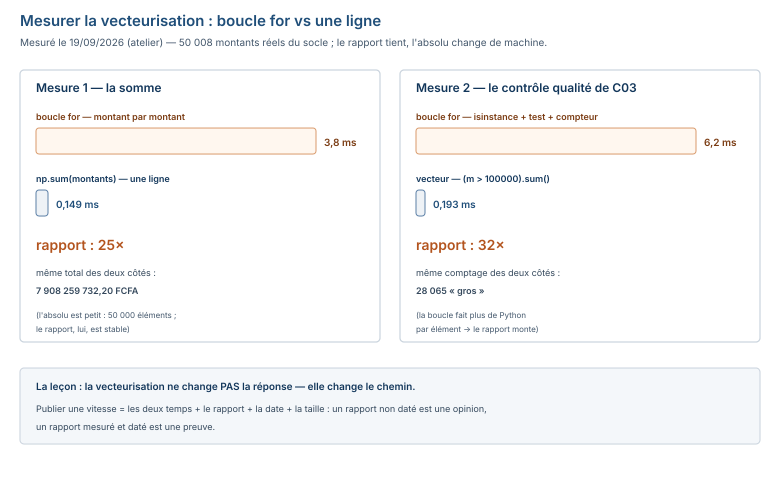

# Module M08.C06 — NumPy utile et suffisant : tableaux, vecteurisation, statistiques, `nan`, `where`, broadcasting

**Outils : le venv de C01 (`/tmp/venv_m08`) avec **numpy 2.5.3** (pandas 3.0.6 est
installé, il jouera en C07). Le terminal.
Durée indicative : 4 h. Niveau : N6 → N7. Prérequis : C05 (les fonctions, les fichiers).**

> **L'idée du chapitre.** C05 a organisé le code ; C06 accélère le calcul. La boucle de
> C03 (le contrôle qualité montant par montant) devient **une ligne** quand les montants
> vivent dans un **tableau NumPy** : homogène, contigu, traité **en bloc** (la
> vecteurisation). Le fil rouge : les **50 008 montants réels** du socle (`vente.csv`,
> colonne `montant_ttc`) — CA total, panier moyen, 95ᵉ percentile, montants « gros » :
> **4 calculs, 0 boucle** — et la mesure honnête : la boucle de C03 face à la ligne
> vectorisée, **les temps publiés** (mesurés dans l'atelier, pas annoncés). C07 passera
> le relais au `DataFrame` : une colonne pandas est une colonne, pas un tableau nu.

> **Matériel de l'atelier — venv C01, numpy 2.5.3.** Tout le code de ce chapitre a été
> exécuté le 19/09/2026 dans `/tmp/venv_m08` ; les sorties publiées sont **celles de
> l'atelier**. La colonne mesurée est **réelle** : `montant_ttc` des 50 008 lignes de
> `03_exercices/dossier_M08/vente.csv` (clé `m08p_ventes_lignes`), extraite en une
> commande `cut` avant le `np.loadtxt`. Les repères canoniques : CA brut
> 7 908 259 732 (clé `m08p_ca_brut`), panier moyen 158 140 (clé `m08p_panier_moyen`).

---

## 1. Objectifs du chapitre

À la fin de ce chapitre, vous savez :

1. Construire un **tableau** NumPy (`np.array`), lire son `dtype` et son `shape` — et
   comprendre l'homogénéité **forcée** (le tableau qui convertit sans prévenir).
2. **Vecteuriser** : `montants * 1.19` multiplie **tout le tableau** ; `np.sum`,
   `np.mean` sur les 50 008 montants réels — le parallèle `SUM`/`AVG` de M06.
3. Extraire les **statistiques** : `np.min`/`np.max`, les **percentiles** (le quartile de
   M02 en NumPy), la médiane, l'écart-type.
4. Gérer **`np.nan`** : le nombre qui « n'a pas de valeur » — `nan + 1 = nan`
   (l'absence se propage), `np.nansum`/`np.nanmean` — le pont vers les `NULL` de M06.
5. Étiqueter un tableau avec **`np.where`** (le `CASE WHEN` de M06 en tableau) et
   compter avec `(condition).sum()`.
6. Comprendre le **broadcasting** : la règle de forme — et lire le `ValueError` de
   forme qui dit laquelle des deux tables ne s'aligne pas.
7. **Mesurer** : boucle `for` vs ligne vectorisée — les deux temps, le rapport, publiés.

## 2. Pourquoi cette notion est importante

Parce que la vecteurisation, c'est **le SGBD pour vos tableaux**. En M06/M07, le moteur
SQL faisait l'agrégation sur le lot (`SUM`, `AVG`, `GROUP BY`) sans que vous écriviez de
boucle ; NumPy fait **exactement le même geste** sur une colonne en mémoire : une
opération, tout le tableau. Le chapitre ne vous apprend pas un outil en plus, il vous
rend le réflexe SQL dans la main Python : le total d'une colonne est **une ligne**,
point.

Parce que **`nan` est le `NULL` de M06, habillé en nombre**. Vous savez déjà ce qu'est
une valeur manquante (M06 : elle se propage dans les calculs, elle ne compte pas dans
les `COUNT`). NumPy réinstalle la **même** sémantique : `nan + 1 = nan`, un tableau qui
contient un `nan` donne un `nan` à `np.sum` — et `np.nansum` est le `COUNT`/`SUM` qui
sait regarder autour du trou. Le pont est direct : ce que vous avez appris sur les
`NULL` en SQL, c'est déjà 80 % de `nan`.

Parce que la **mesure** fait partie du métier : « la boucle est lente » est une
affirmation ; « la boucle prend 6,2 ms, la ligne vectorisée 0,193 ms, rapport 32× —
mesuré le 19/09/2026 sur cette machine » est une **preuve** (et un résultat qui dépend
de la machine, qu'on publie comme tel).

## 3. Explication simple — le convoi, la barrière, le camion vide

- Le **tableau NumPy** est un **convoi** : des camions **identiques** (un seul `dtype`)
  qui avancent **côte à côte**, sans espace entre eux (contigu). La liste de Python,
  elle, est un parking : des cases qui pointent vers des objets de tailles et de types
  différents.
- La **vecteurisation** est la **barrière de péage ouverte** : au lieu de faire passer
  le convoi camion par camion (la boucle de C03), la barrière est levée et **tout le
  convoi passe d'un coup** (`montants * 1.19`).
- **`nan`** est le **camion sans marchandise** : il passe la barrière, mais sa
  « valeur » est une absence — et l'absence **contagieuse** : une addition qui le
  touche devient une absence.
- **`np.where`** est le **contrôle qui étiquette** le convoi : chaque camion reçoit un
  autocollant (« gros » / « normal ») selon une règle — le `CASE WHEN` de M06.
- Le **broadcasting** est la **règle d'alignement** : on ne peut soustraire qu'un
  convoi d'un autre convoi **de même forme** — sinon la machine s'arrête et dit les
  deux formes qui ne vont pas ensemble.

## 4. Vocabulaire essentiel

| Français — English | Définition en une phrase | Piège à éviter |
|---|---|---|
| **tableau** — *array* | un bloc contigu de valeurs **toutes du même type** (`dtype`), opéré en bloc. | croire qu'on peut mélanger `int` et `str` : le tableau **convertit** sans prévenir (§5.1). |
| **dtype** — *data type* | le type **unique** du tableau : `float64`, `int64`, `<U21` (texte). | lire un tableau sans demander `dtype` : c'est là que se cache la conversion forcée. |
| **vecteurisation** — *vectorization* | appliquer une opération à **tout le tableau d'un coup**, sans boucle Python. | réécrire en `for` ce que `np.sum` fait en une ligne (le §5.7 mesure l'écart). |
| **nan** — *nan* | le nombre « non numérique » : l'absence qui **se propage** (`nan + 1 = nan`). | laisser un `nan` dans `np.sum` : le total devient `nan` — `np.nansum` regarde autour. |
| **diffusion** — *broadcasting* | la règle de forme qui autorise les opérations entre tableaux de formes différentes **compatibles**. | aligner `(50008,)` sur `(5,)` : les formes ne se compatibilisent pas — le `ValueError` dit lesquelles. |

## 5. Cours approfondi

### 5.1 Le tableau — le convoi homogène

```python
import numpy as np

m = np.array([1500, 2000, 1350])
print(m.dtype, m.shape)
melange = np.array([1, "a"])
print(melange, melange.dtype)
```
```text
int64 (3,)
['1' 'a'] <U21
```

> **Définition.** **tableau** — *ndarray* — un bloc de mémoire **contigu** de valeurs
> **homogènes** : un seul `dtype` pour tout le tableau, une forme (`shape`) qui dit
> combien de valeurs. L'homogénéité est ce qui permet l'opération en bloc — le
> parking de la liste n'a pas ce droit.

La 2ᵉ sortie est le piège du chapitre : `np.array([1, "a"])` **ne proteste pas** — le
tableau a **converti** le `1` en texte `'1'` (le `dtype` `<U21` = texte de 21
caractères max). Pas d'erreur, une **décision silencieuse** : quand un tableau mélange
des familles, NumPy choisit — et son choix est le plus **large** (le texte englobe),
pas le plus juste.

> **Attention.** Le tableau **force** l'homogénéité sans prévenir : `np.array([1,
> "a"])` donne `['1' 'a']`, pas une erreur. Demandez **toujours** le `dtype` avant de
> calculer — c'est la première ligne de lecture d'un tableau, comme le `SELECT *`
> limit est la première ligne de lecture d'une table.

### 5.2 La vecteurisation — la barrière levée

La colonne réelle du socle (extraite par `cut`, chargée par `np.loadtxt` — la
commande complète est l'Étape 1 de §7) : 50 008 montants, `float64`.

```python
np.sum(montants)     # le CA total
np.mean(montants)    # le panier moyen
```
```text
7908259732.2
158139.8922612382
```

> **Définition.** **vecteurisation** — *vectorization* — l'application d'une opération
> à **tout** un tableau d'un seul geste, sans boucle Python : `montants * 1.19`
> multiplie les 50 008 valeurs, `np.sum(montants)` les additionne. C'est le
> `SUM(colonne)` de M06, écrit en NumPy.

> **Dans les faits.** Ces deux sorties sont **les valeurs canoniques du socle**,
> retrouvées par une autre porte : `np.sum` renvoie 7 908 259 732,20 (le CA brut
> `m08p_ca_brut` = 7 908 259 732, à 0,20 FCFA près — la dérive `float` que C08
> documente en centimes) et `np.mean` renvoie 158 139,89 ≈ **158 140**, le panier
> moyen canonique (`m08p_panier_moyen`). Deux moteurs (DuckDB en M07, NumPy ici), le
> même nombre — c'est le parallèle qui tient.

Le parallèle SQL, complet :

| NumPy (§5.2) | SQL (M06) | Ici |
|---|---|---|
| `np.sum(montants)` | `SUM(montant_ttc)` | 7 908 259 732,20 |
| `np.mean(montants)` | `AVG(montant_ttc)` | 158 139,89 |
| `np.max(montants)` | `MAX(montant_ttc)` | 594 363 (max canonique du socle) |
| `len(montants)` | `COUNT(*)` | 50 008 (`m08p_ventes_lignes`) |

### 5.3 Les statistiques — min, max, percentiles, médiane

```python
np.min(montants)
np.max(montants)
np.percentile(montants, [25, 50, 75])
np.median(montants)
np.std(montants)
```
```text
762.63
594363.0
[ 49134.2  119481.89 235875.33]
119481.89
133552.3926959041
```

- `np.min`/`np.max` : la 1ʳᵉ et la dernière ligne du tri — 762,63 FCFA (la vente la
  plus petite du socle) et 594 363 FCFA (la plus grosse) ;
- `np.percentile(m, [25, 50, 75])` : les **quartiles** — le Q1 de M02 en NumPy :
  25 % des ventes sont sous 49 134,20 FCFA, la moitié sous 119 481,89 ;
- `np.median(m)` **est** le percentile 50 : 119 481,89 (regardez — les deux
  fonctions redonnent le même nombre, c'est un contrôle) ;
- `np.std` : l'écart-type — 133 552,39 : les ventes sont **très** dispersées
  (l'écart-type dépasse la moyenne : il y a de très petites et de très grosses
  ventes dans le socle).

Le percentile est l'outil de la **question métier de queue** : « le 95ᵉ
percentile des montants, c'est combien ? » → 431 647,88 FCFA (mesuré, §7 Étape 3) —
95 % des ventes sont en dessous, les 5 % du haut au-dessus. C'est la version
« position dans la file » du `MAX`.

### 5.4 `nan` — le camion sans marchandise

```python
x = np.array([1500.0, np.nan, 2000.0])
print(x + 1)
print(np.sum(x))
print(np.nansum(x))
print(np.isnan(x))
```
```text
[1501.   nan 2001.]
nan
3500.0
[False  True False]
```

> **Définition.** **nan** — *nan* (« not a number ») — la valeur **absente** du
> monde des nombres : elle **se propage** (`nan + 1 = nan` — l'absence contagieuse),
> elle **contamine** les agrégats (`np.sum` renvoie `nan`), et elle se **détecte**
> (`np.isnan`) ou se **contourne** (`np.nansum` = 3500,0 : la somme regarde autour
> du trou).

C'est **exactement** la sémantique `NULL` de M06 : une addition qui touche un `NULL`
donne `NULL` (pas 0, pas l'autre opérand) ; `COUNT(colonne)` ne compte pas les
`NULL` (mais `COUNT(*)` les compte) ; `SUM` les ignore. `nan`/`nansum`/`isnan` sont
les mêmes trois gestes, habillés en nombres — le pont M06 → NumPy tient sur trois
lignes.

> **Attention.** Un `nan` dans le tableau **contamine** `np.sum` — le total devient
> `nan`, sans erreur. Sur une colonne qui **peut** être vide (les montants du socle
> peuvent l'être — `est_retour`, les champs vides de M03), l'agrégat robuste est
> `np.nansum`/`np.nanmean`, pas `np.sum`/`np.mean`.

### 5.5 `np.where` — le contrôle qui étiquette

Le `CASE WHEN` de M06, en tableau — chaque montant reçoit son étiquette, d'un coup :

```python
gros = np.where(montants > 100000, "gros", "normal")
print((gros == "gros").sum())
print((montants > 100000).sum())
```
```text
28065
28065
```

```sql
SELECT CASE WHEN montant_ttc > 100000 THEN 'gros' ELSE 'normal' END
FROM vente;
```

Les deux lignes Python redonnent le même comptage (28 065 ventes « gros » — la
majorité des 50 008 : dans ce socle, la grosse vente est la **norme**, pas
l'exception). La 2ᵉ ligne est l'idiome du chapitre : `montants > 100000` est un
**tableau de `True`/`False`** (un `bool` par montant), et **`bool` a une
`sum`** — elle compte les `True`. Pas besoin de `where` pour compter : la condition
seule, suivie de `.sum()`.

### 5.6 Le broadcasting — la règle d'alignement

La question métier : l'**écart de chaque vente à la moyenne de son magasin**. Les
moyennes par magasin (5 valeurs, mesurées) :

```python
moyennes = np.array([157958.55, 157379.42, 158506.83, 158713.18, 158147.00])
montants - moyennes
```
```text
ValueError : operands could not be broadcast together with shapes (50008,) (5,)
```

> **Définition.** **diffusion** — *broadcasting* — la règle de forme de NumPy : deux
> tableaux peuvent s'opérer s'ils sont **de même forme**, ou si l'un est un
> **scalaire**, ou si leurs formes sont **compatibles** (du plus court au plus
> long, dimensions égales ou 1). `(50008,)` et `(5,)` ne sont compatibles ni dans
> un sens ni dans l'autre — d'où le `ValueError`, qui **cite les deux formes** (la
> lecture du message est déjà le diagnostic).

Le `ValueError` est la **règle qui parle** : 50 008 montants ne se soustraient pas à
5 moyennes — une moyenne ne se soustrait qu'à **son** magasin. L'alignement se fait
**d'abord** (chaque montant connaît son magasin : `ids - 1` donne l'index de la
moyenne à prendre), **ensuite** l'opération passe :

```python
ecarts = montants - moyennes[ids - 1]
print(ecarts[:3])
print(np.mean(montants[ids == 1] - moyennes[0]))
```
```text
[ 56186.78118011 201151.24731657 -71440.36881989]
-8.299735787245575e-12
```

La dernière sortie est le **contrôle** : l'écart moyen des ventes du magasin 1 à la
moyenne du magasin 1 est ≈ 0 (−8×10⁻¹² — le bruit `float`, pas un écart réel).
Quand le contrôle redonne zéro, l'alignement est bon.

### 5.7 La mesure — la boucle de C03 face à la ligne



Deux mesures, exécutées dans l'atelier le 19/09/2026 (cette machine, ces 50 008
montants — les rapports varient d'une machine à l'autre, c'est **pourquoi** on
publie la date et les deux temps) :

**Mesure 1 — la somme** (la boucle de C03, `for` + accumulation, vs `np.sum`) :

```text
boucle for : 3.8 ms
np.sum     : 0.149 ms
rapport    : 25x
```

**Mesure 2 — le contrôle qualité de C03** (`for` + `isinstance` + test + compteur,
vs `(m > 100000).sum()`) :

```python
def controle_boucle(valeurs, seuil=100000):
    gros = 0
    for v in valeurs:
        if isinstance(v, (int, float)) and v > seuil:
            gros = gros + 1
    return gros

# boucle : controle_boucle(m.tolist())          # 6.2 ms
# vecteur : (m > 100000).sum()                   # 0.193 ms
```
```text
boucle : 28065 | 6.2 ms
vecteur: 28065 | 0.193 ms
rapport: 32x
```

Deux leçons : les **mêmes** résultats (28065 des deux côtés — la vecteurisation ne
change pas la réponse, elle change le chemin), et un écart de **25 à 32×** sur
50 000 valeurs — un écart qui **croît** quand la boucle fait plus de Python par
élément (l'`isinstance` de la mesure 2 coûte plus cher qu'une addition), et qui
serait encore plus grand sur 50 000 **lignes de table** avec des branchements
métier. Sur une machine d'atelier, 6,2 ms ne se voit pas — mais le **rapport** est
la leçon, pas l'absolu : ce qui est 32× plus lent sur 50 000 éléments est 32× plus
lent sur 5 millions.

> **Conseil professionnel.** Ne dites jamais « la boucle est lente » sans la
> **mesure** : publiez les deux temps, le rapport, la date, la taille — et
> souvenez-vous que le rapport, lui, est stable ; l'absolu, jamais. Un rapport de
> vitesse non mesuré est une opinion ; un rapport mesuré et daté est une preuve.

## 6. Exemple concret — les 4 calculs du fil rouge

La question du chapitre, en langage de comptoir : *« sur la colonne `montant_ttc`
réelle du socle — CA total, panier moyen, le 95ᵉ percentile, et combien de ventes
« grosses » ? »* Le script — exécuté dans l'atelier le 19/09/2026 :

```python
import numpy as np

m = np.loadtxt("colonne.csv", delimiter=",", skiprows=1)[:, 1]
print("CA total       :", np.sum(m))
print("Panier moyen   :", np.mean(m))
print("95e percentile :", np.percentile(m, 95))
print("Gros > 100 000 :", (m > 100000).sum())
```
```text
CA total       : 7908259732.2
Panier moyen   : 158139.8922612382
95e percentile : 431647.88
Gros > 100 000 : 28065
```

Quatre calculs, **zéro boucle** : le CA total redonne le canonique du socle
(7 908 259 732 à 0,20 près — `float`), le panier moyen redonne 158 140
(`m08p_panier_moyen`), le 95ᵉ percentile (431 647,88 FCFA) est une **information
nouvelle** — 95 % des ventes sont en dessous — et le comptage « gros » redonne
28 065 (la majorité : dans ce socle, la grosse vente est la norme). Le `np.loadtxt`
avec `skiprows=1` saute la ligne de tête, et `[:, 1]` prend la **2ᵉ colonne**
(`montant_ttc`) — la 1ʳᵉ (`id_magasin`) est chargée aussi, on en a besoin en §5.6.

## 7. Démonstration pas à pas — 6 étapes sur le fil rouge

Sortie réelle de chaque commande (exécutées le 19/09/2026, `/tmp/venv_m08`).

**Étape 0 — Extraire la colonne** (la `cut` du socle, avant le `loadtxt`) :

```text
$ { echo "id_magasin,montant_ttc"; cut -d',' -f4,11 03_exercices/dossier_M08/vente.csv | tail -n +2; } > colonne.csv
```
*Interprétation : 1 ligne de tête + les 50 008 montants (`m08p_ventes_lignes`) —
la colonne `montant_ttc` est la 11ᵉ du CSV (`-f11`), `id_magasin` la 4ᵉ (`-f4`) ;
le `tail -n +2` jette la tête d'origine, l'`echo` remet la sienne. Le contrôle
effectif du comptage arrive à l'Étape 1, où le `shape` (50008,) le prouve.*

**Étape 1 — Charger en une ligne** (`np.loadtxt`) :

```text
$ python3 -c "
import numpy as np
d = np.loadtxt('colonne.csv', delimiter=',', skiprows=1)
m = d[:, 1]
print(m.shape, m.dtype)"
(50008,) float64
```
*Interprétation : 50 008 valeurs, toutes `float64` — le tableau s'est chargé
**en bloc** (c'est le `SELECT montant_ttc` de M06, en une commande).*

**Étape 2 — Le CA et le panier** (les deux agrégats canoniques) :

```text
$ python3 -c "
import numpy as np
m = np.loadtxt('colonne.csv', delimiter=',', skiprows=1)[:, 1]
print(np.sum(m))
print(np.mean(m))"
7908259732.2
158139.8922612382
```
*Interprétation : 7 908 259 732,20 et 158 139,89 — les valeurs canoniques du socle
retrouvées par NumPy (le `± 0,20` est la dérive `float` de C08).*

**Étape 3 — Le 95ᵉ percentile** (la position dans la file) :

```text
$ python3 -c "
import numpy as np
m = np.loadtxt('colonne.csv', delimiter=',', skiprows=1)[:, 1]
print(np.percentile(m, 95))"
431647.88
```
*Interprétation : 95 % des ventes sont sous 431 647,88 FCFA — les 5 % du haut
au-dessus : c'est la « queue » de la distribution, en un nombre.*

**Étape 4 — Le comptage « gros »** (la condition qui compte) :

```text
$ python3 -c "
import numpy as np
m = np.loadtxt('colonne.csv', delimiter=',', skiprows=1)[:, 1]
print((m > 100000).sum())"
28065
```
*Interprétation : `m > 100000` est un tableau de `True`/`False` ; `.sum()` compte
les `True` — la moitié et plus du socle est « grosse » (le seuil 100 000 FCFA est
une valeur du socle).*

**Étape 5 — Le `nan` qui contourne** (l'absence qui ne contamine pas) :

```text
$ python3 -c "
import numpy as np
x = np.array([1500.0, np.nan, 2000.0])
print(np.sum(x), np.nansum(x))"
nan 3500.0
```
*Interprétation : le même tableau, deux sommes — `np.sum` est contaminé (`nan`),
`np.nansum` regarde autour du trou (3 500) : c'est le `SUM` qui ignore les `NULL`
de M06.*

**Étape 6 — Le temps mesuré** (la boucle face à la ligne) :

```text
$ python3 -c "
import time
import numpy as np
m = np.loadtxt('colonne.csv', delimiter=',', skiprows=1)[:, 1]
l = m.tolist()
t0 = time.perf_counter()
s = 0.0
for v in l:
    s = s + v
t1 = time.perf_counter()
t2 = time.perf_counter()
s2 = np.sum(m)
t3 = time.perf_counter()
print(f'boucle for : {(t1 - t0) * 1000:.1f} ms')
print(f'np.sum     : {(t3 - t2) * 1000:.3f} ms')
print(f'rapport    : {(t1 - t0) / (t3 - t2):.0f}x')"
boucle for : 3.8 ms
np.sum     : 0.149 ms
rapport    : 25x
```
*Interprétation : 3,8 ms contre 0,149 ms — **25×**, mesuré sur cette machine, ces
50 008 montants, le 19/09/2026 : le rapport est la leçon (il tient), l'absolu est
l'atelier (il change).*

## 8. Erreurs fréquentes

1. **Le tableau qui convertit sans prévenir.** `np.array([1, "a"])` →
   `['1' 'a'] <U21` (sortie réelle, §5.1) : le nombre est devenu du **texte**, sans
   erreur. Remède : demander `dtype` **avant** de calculer — si le `dtype` est du
   texte (`<U…`) et que vous vouliez des nombres, la conversion s'est faite au
   mauvais moment (et au mauvais sens).
2. **Le `nan` qui contamine le total.** `np.sum` sur un tableau contenant `np.nan`
   renvoie `nan` (sortie réelle, §5.4) — pas d'erreur, un total **inutilisable**.
   Remède : `np.nansum`/`np.nanmean` dès que la colonne **peut** être vide ; et
   `np.isnan` pour **détecter** avant de calculer.
3. **Les formes qui ne s'alignent pas.** `montants - moyennes` →
   `ValueError : operands could not be broadcast together with shapes (50008,)
   (5,)` (sortie réelle, §5.6). Remède : le message **cite les deux formes** —
   lisez-les ; l'alignement se fait **avant** l'opération (`moyennes[ids - 1]`),
   pas en espérant que NumPy devine.
4. **La condition sans le compteur.** `m > 100000` **seul** affiche un tableau de
   `True`/`False` (50 008 lignes) — il ne **compte** rien. Remède : `(m > 100000).sum()`
   — un tableau `bool` **a** une `sum` (elle compte les `True`) ; c'est l'idiome du
   chapitre (§5.5).
5. **`np.loadtxt` sur un CSV qui a des mots.** Charger `vente.csv` **en entier**
   (13 colonnes, dont `date_vente` en texte) par `np.loadtxt` lève
   `ValueError: could not convert string 'id_vente' to float64 at row 0,
   column 1.` (sortie réelle) : le tableau est **numérique**, et la première
   ligne n'en est pas une — c'est la **tête** (`id_vente` n'est pas un nombre) ;
   passé `skiprows=1`, ce seraient les dates qui poseraient le même problème.
   Remède : extraire les colonnes **numériques** d'abord (`cut`, §7 Étape 0) — ou
   attendre C07, où `pandas.read_csv` lit le mélange (c'est son métier).
6. **Le panier moyen « sans poser la question ».** `np.mean(montants)` sur les
   50 008 lignes renvoie 158 139,89 — **mais** « quelles 50 008 lignes ? » (les
   doublons du socle ? les retours ?) est une **question de données**, pas de
   calcul : changer le jeu de lignes change le nombre (les paniers 158 140 /
   158 159 du socle sont des **définitions différentes**, pas des arrondis).
   Remède : avant d'agréger, dire **quelles lignes** on additionne — la question
   est un cinquième du travail, avant les quatre calculs.

## 9. Bonnes pratiques professionnelles

1. **Un `dtype` par tableau, vérifié en premier** : la lecture d'un tableau
   commence par `print(m.dtype, m.shape)` — comme le `head` + `dtypes` de C07.
2. **Compter avec `(condition).sum()`** : pas de boucle pour compter, pas de
   `where` pour compter — la condition booléenne **est** le compteur.
3. **`nansum`/`nanmean` par défaut** sur toute colonne qui **peut** être vide :
   le coût est zéro, le `nan` contaminant coûte un rapport à refaire.
4. **Vecteuriser le calcul, garder la boucle pour l'exception** : le calcul en
   bloc, la logique métier qui **branche** (`isinstance`, les cas « N/C ») reste
   une boucle — mais sur **peu** de lignes (les exceptions), pas sur toutes.
5. **Mesurer avant d'affirmer** : les deux temps, le rapport, la date, la taille —
   publiés ensemble (§5.7) ; un rapport de vitesse non daté est une opinion.

## 10. Exercice guidé — « les 4 statistiques du comptoir » (15 min, /10)

**Énoncé.** Écrire `statistiques.py` qui, sur la colonne réelle (`colonne.csv`,
`np.loadtxt` avec `skiprows=1`) :

1. charge les montants (la 2ᵉ colonne) ;
2. affiche le **minimum** et le **maximum** (2 décimales) ;
3. affiche la **médiane** et le **90ᵉ percentile** (2 décimales) ;
4. affiche le **nombre de ventes** (la longueur du tableau).

**Barème.** Le chargement correct (2 pts) · les 4 statistiques avec les fonctions
du chapitre (`min`/`max`/`median`/`percentile` — pas de tri manuel) (4 pts) ·
l'affichage 2 décimales en f-string (2 pts) · la sortie alignée sur le modèle
ci-dessous (2 pts). Sortie attendue (vérifiée par exécution le 19/09/2026) :

```text
Minimum : 762.63
Maximum : 594363.00
Mediane : 119481.89
90e percentile : 357969.75
Ventes : 50008
```

## 11. Exercices autonomes

**Exercice 6.1 — Le convoi.** Construire le tableau
`np.array([500, 1500, 8000, 1350, 4500])`, l'afficher, afficher son `dtype` — puis
le tableau multiplié par 1.19 (TVA) et sa somme. (5 min)

**Exercice 6.2 — Le camion vide.** Construire
`np.array([1500.0, np.nan, 2000.0, np.nan])` : afficher `np.sum`, `np.nansum`,
`np.isnan` — et dire en une phrase pourquoi les deux sommes diffèrent. (5 min)

**Exercice 6.3 — Le contrôle.** Sur la colonne réelle, étiqueter
`gros`/`normal` avec `np.where` (seuil 100 000), et compter les `gros` **deux
façons** (`(gros == "gros").sum()` et `(m > 100000).sum()`) : les deux doivent
redonner le même nombre. (10 min)

**Exercice 6.4 — Les quartiles.** Sur
`np.array([3500, 2500, 4500, 1500, 2000])` : la médiane, les quartiles
(`percentile(…, [25, 75])`), et vérifier que la médiane est bien le percentile 50.
(10 min)

**Exercice 6.5 — La mesure.** Sur une liste de 10 000 nombres (par exemple
`list(range(10000))` convertie en tableau) : mesurer la somme en **boucle**
(`for`) et avec `np.sum` — afficher les deux temps **et** le rapport. (10 min)

## 12. Correction détaillée

**Exercice guidé.** Le script :

```python
import numpy as np

m = np.loadtxt("colonne.csv", delimiter=",", skiprows=1)[:, 1]
print(f"Minimum : {np.min(m):,.2f}")
print(f"Maximum : {np.max(m):,.2f}")
print(f"Mediane : {np.median(m):,.2f}")
print(f"90e percentile : {np.percentile(m, 90):,.2f}")
print(f"Ventes : {len(m)}")
```
Les 5 lignes publiées **sont** la sortie de l'atelier (762.63 / 594363.00 /
119481.89 / 357969.75 / 50008) — le contrôle à faire en tête : `np.median`
doit redonner `np.percentile(m, 50)` (les deux sont le 50ᵉ).

**Exercice 6.1.** `int64` (des entiers → le `dtype` entier, pas `float`) ; le
tableau × 1.19 passe en `float64` (l'opération élargit — 500 × 1.19 = 595,0) ;
la somme : 15 850 × 1.19 = 18 861,50 — exécuter pour vérifier (`[595. 1785.
9520. 1606.5 5355.]`, sortie réelle ; le calcul mental est le piège du
chapitre : la machine calcule, on ne devine pas).

**Exercice 6.2.** `np.sum` → `nan` (contaminé), `np.nansum` → 3500,0 (regarde
autour), `np.isnan` → `[False  True False  True]` (deux trous). La phrase :
« `np.sum` **propage** l'absence, `np.nansum` **l'ignore** — c'est le `SUM` de
M06 qui ignore les `NULL` ».

**Exercice 6.3.** Les deux comptages redonnent **28065** — la `where` étiquette
(une colonne de texte), la condition compte directement (un tableau `bool`) :
même réponse, deux chemins (§5.5).

**Exercice 6.4.** Trié : [1500, 2000, 2500, 3500, 4500] — médiane 2500,
`percentile([25, 75])` → 2000,0 / 3500,0 (sortie réelle : pour n = 5, les
quartiles tombent **juste** sur des valeurs du tableau — l'interpolation se voit
avec d'autres tailles, la question reste « entre quelle valeur et quelle
valeur ? ») ; `percentile(…, 50)` redonne 2500,0 : le contrôle passe.

**Exercice 6.5.** Les deux temps dépendent de **votre** machine — c'est pour ça
qu'on publie les deux **et** le rapport : la boucle est typiquement 10 à 50× plus
lente que `np.sum` sur 10 000 éléments ; le rapport, lui, est la leçon stable.

## 13. Mini-projet M08.P6 — « Le rapport de colonne » (1 h)

**Énoncé.** Écrire `rapport.py` — le fil rouge, durci en **rapport** :

1. charger la colonne réelle (`colonne.csv`, `np.loadtxt`, `skiprows=1`, 2ᵉ
   colonne) ;
2. afficher (2 décimales, f-string) : CA total, panier moyen, minimum, maximum ;
3. afficher les **quartiles** Q1 / médiane / Q3 sur une ligne ;
4. afficher le 95ᵉ percentile ;
5. afficher le comptage « gros » (seuil 100 000) **sur le total** (« X ventes sur
   Y ») ;
6. la **robustesse** : ajouter un `nan` en fin de tableau (`np.append`), afficher
   `np.sum` (contaminé) **et** `np.nansum` (intact) sur la même ligne.

**Critères de réussite** (grille /10) : les 6 exigences (6 × 1 pt) · la sortie de
l'atelier : CA total 7,908,259,732.20 · panier moyen 158,139.89 · minimum 762.63 ·
maximum 594,363.00 · quartiles 49,134.20 / 119,481.89 / 235,875.33 · 95ᵉ
431,647.88 · 28065 ventes sur 50008 · `nan` / 7,908,259,732.20 (1 pt) · aucun
`for` dans le calcul (1 pt) · le `dtype` vérifié en tête (1 pt).

> **Note de correction.** Le `np.nansum` de la ligne 6 redonne **le même** CA que
> la ligne 2 (7,908,259,732.20) : le `nan` ajouté ne pèse rien — c'est la
> **preuve** que `nansum` « regarde autour » (pas `0 + nan`, pas un total
> différent). Si votre `nansum` diffère de votre `sum`, le `nan` n'est pas là où
> vous croyez.

## 14. Boîte à outils du chapitre

> **Boîte à outils.** Le venv de C01 (`/tmp/venv_m08`) + numpy 2.5.3 ; la boîte
> du chapitre s'ajoute à celles de C02-C05 : le convoi et ses barrières.

| Outil | Usage | Syntaxe |
|---|---|---|
| `np.array` / `dtype` / `shape` | le convoi et son type | `np.array([1, 2]).dtype` |
| `np.loadtxt` | charger une colonne numérique | `np.loadtxt(f, delimiter=",", skiprows=1)` |
| `np.sum` / `np.mean` | l'agrégat en bloc | `np.sum(m)` |
| `np.min` / `np.max` / `np.percentile` | les bornes et les positions | `np.percentile(m, [25, 50, 75])` |
| `np.nan` / `np.isnan` / `np.nansum` | l'absence qui se gère | `np.nansum(m)` |
| `np.where` | l'étiquette en bloc | `np.where(m > s, "gros", "normal")` |
| `(cond).sum()` | le compteur booléen | `(m > 100000).sum()` |
| broadcasting | la règle d'alignement | `m - moyennes[ids - 1]` |

## 15. Résumé du chapitre

- Le **tableau** NumPy est homogène (`dtype` unique) et contigu ; il **convertit
  sans prévenir** (`[1, "a"]` → `['1' 'a'] <U21`) — demander le `dtype` en
  premier.
- La **vecteurisation** est le `SUM`/`AVG` de M06 en mémoire : `np.sum` sur les
  50 008 montants réels renvoie 7 908 259 732,20 (le canonique, à la dérive
  `float` près), `np.mean` redonne le panier moyen 158 140.
- Les **statistiques** : `min`/`max` (762,63 / 594 363), les quartiles
  (`percentile(…, [25, 50, 75])`), la médiane (le 50ᵉ), le 95ᵉ percentile
  (431 647,88) — la « position dans la file » en un nombre.
- **`nan`** est le `NULL` de M06 : `nan + 1 = nan`, `np.sum` contaminé,
  `np.nansum` regarde autour (3500,0), `np.isnan` détecte.
- **`np.where`** étiquette en bloc (le `CASE WHEN`), et `(m > s).sum()` **compte**
  (le tableau `bool` a une `sum`) — 28 065 ventes « gros ».
- Le **broadcasting** : `(50008,) − (5,)` lève `ValueError` (les formes citées) ;
  l'alignement **d'abord** (`moyennes[ids - 1]`), l'opération **ensuite** — le
  contrôle (écart moyen ≈ 0) valide l'alignement.
- La **mesure** : boucle 3,8 ms vs `np.sum` 0,149 ms (**25×**) ; boucle métier
  6,2 ms vs vecteur 0,193 ms (**32×**) — mêmes résultats, daté, sur cette
  machine.

## 16. À retenir

> **À retenir.** Le calcul en bloc est **une ligne** : `np.sum`, `np.mean`,
> `(m > s).sum()` — la boucle de C03 est un souvenir, pas un réflexe. Et quand un
> résultat « ne colle pas », la première question n'est pas « quel calcul ? » mais
> **« quelles lignes ? »** (§8, erreur n° 6) : le nombre est la définition, pas
> l'inverse.

> **À retenir.** `nan` est le `NULL` habillé en nombre : il **propage** (`nan + 1
> = nan`), il **contamine** (`np.sum` → `nan`), il se **contourne**
> (`np.nansum`) et se **détecte** (`np.isnan`) — les quatre gestes du `NULL` de
> M06, sans rien réapprendre.

## 17. Évaluation formative (auto-correction, 8 min)

1. **`np.array([1, "a"])` renvoie quoi, et quel est le danger ?**
   → `['1' 'a']` en `dtype <U21` : le nombre a été **converti en texte sans
   erreur** — le tableau force l'homogénéité silencieusement ; d'où le `dtype`
   vérifié en premier. (1 pt)
2. **`np.sum(montants)` sur les 50 008 montants du socle renvoie quoi, et qu'est-ce
   que ça redonne ?**
   → 7 908 259 732,20 — le CA brut canonique (`m08p_ca_brut` = 7 908 259 732), à
   0,20 près (la dérive `float` documentée en C08). (1 pt)
3. **Pourquoi `np.sum` renvoie `nan` sur un tableau contenant `np.nan`, et quelle
   est la version robuste ?**
   → `nan` **propage** (l'absence contagieuse) ; la version robuste est
   `np.nansum` (regarde autour du trou — le `SUM` qui ignore les `NULL` de M06).
   (2 pts)
4. **`np.where(m > 100000, "gros", "normal")` fait quoi, et comment **compter**
   les « gros » sans `where` ?**
   → il **étiquette** le tableau (une colonne de texte) ; pour compter :
   `(m > 100000).sum()` — le tableau `bool` a une `sum` (elle compte les `True`).
   (2 pts)
5. **`montants - moyennes` (50008, et 5) lève quoi, et d'où vient le message ?**
   → `ValueError : operands could not be broadcast together with shapes (50008,)
   (5,)` : les formes ne sont pas compatibles — le message **cite les deux
   formes** ; l'alignement se fait d'abord (`moyennes[ids - 1]`). (1 pt)
6. **Le contrôle d'alignement de §5.6 redonne quoi, et pourquoi est-ce le
   contrôle ?**
   → l'écart moyen des ventes du magasin 1 à sa moyenne ≈ 0 (−8×10⁻¹², le bruit
   `float`) : si le contrôle ne redonne pas zéro, l'alignement est mauvais. (1 pt)
7. **`np.percentile(m, 50)` et `np.median(m)` — quelle relation, et pourquoi est-
   ce un contrôle ?**
   → ce sont **le même nombre** (le 50ᵉ percentile est la médiane) : les deux
   fonctions doivent redonner le même résultat, sinon le chargement a trahi. (1 pt)
8. **Pourquoi le rapport « boucle vs vecteur » est-il la leçon, et pas les temps
   absolus ?**
   → l'absolu dépend de la machine (il change) ; le **rapport** est stable — et il
   croît quand la boucle fait plus de Python par élément ; d'où publier les deux
   temps + la date + la taille. (1 pt)
