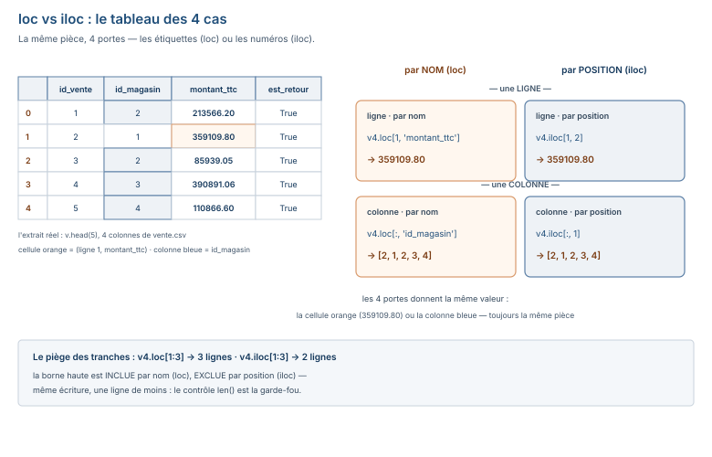

# Module M08.C07 — pandas I : `Series`, `DataFrame`, `read_csv`/`read_excel`, `loc`/`iloc`, filtres, nouvelles colonnes, `describe`, valeurs manquantes

**Outils : le venv de C01 (`/tmp/venv_m08`, **pandas 3.0.6**) + l'environnement
d'écriture du manuel (**pandas 2.2.3**) pour le comparé du §5.10. Le dossier
`03_exercices/dossier_M08/` (les 8 CSV du socle).
Durée indicative : 5 h. Niveau : N6 → N7. Prérequis : C06 (le tableau NumPy est
une colonne pandas sans en-tête).**

> **L'idée du chapitre.** C06 calculait sur **une colonne** en bloc ; C07 travaille
> sur **la table entière** — les 50 008 lignes × 13 colonnes réelles du socle — avec
> les deux objets de pandas : la **Série** (une colonne : index + valeurs) et le
> **DataFrame** (un tableau de colonnes nommées, la table SQL de M07 en Python).
> Le fil rouge : **les mêmes chiffres, trois chemins** — Excel (M05), SQL (M07),
> pandas (M08) : chaque bloc a son équivalent SQL côte à côte, et l'exercice du
> chapitre est l'**audit complet du dossier en 8 lignes** — formes, doublons,
> retours, dates inversées, table vide — chaque résultat **identique** au SQL de
> M07. C08 fera le reste : `groupby`, `merge`, `pivot_table`, dates, export Excel.

> **Matériel de l'atelier — deux pandas, une règle.** Le venv du chapitre est
> **pandas 3.0.6** (l'installation fraîche de C01) ; l'environnement d'écriture du
> manuel est **figé sur 2.2.3**. Les deux coexistent, et le manuel enseigne les
> patterns **valides sur les deux** — C01 a posé la règle, le §5.10 la prouve avec
> **4 écarts mesurés** sur un fichier réel (103 → 85, 373 → 372, 18 → 0, 7 → 0),
> pas illustrés. Tout le code a été exécuté le 19/09/2026 ; les sorties publiées
> sont celles de l'atelier.

---

## 1. Objectifs du chapitre

À la fin de ce chapitre, vous savez :

1. Importer le **dossier M08 complet** (les 8 CSV, formes réelles : 50 008 × 13,
   1 200 × 5, …, 0 × 4) avec `pd.read_csv` — `head`, `shape`, `dtypes`.
2. Lire un **DataFrame** comme on lit une table SQL : l'**index** (pas une
   colonne), les colonnes nommées, le `dtype` de chacune — `str` sous pandas 3
   (plus d'`object`).
3. Sélectionner avec **`loc`** (par nom) et **`iloc`** (par position) — le
   tableau de 4 cas (ligne/colonne × nom/position) et le piège des tranches.
4. **Filtrer** comme en `WHERE` : le **masque** booléen, `&`/`|`/`~`, les
   **parenthèses obligatoires** — et le bug silencieux qu'elles évitent
   (mesuré : 50 008 au lieu de 27 938).
5. Créer une **nouvelle colonne** par opération vectorisée (`montant_ht =
   montant_ttc / (1 + taux_tva)`) — le `SELECT … AS` de M07, et `assign`.
6. Lire **`describe()`** : les 8 statistiques de M02 en une commande — et le
   détail qui distingue pandas de NumPy (`std` échantillonnaire vs population).
7. Gérer les **valeurs manquantes** : `isna()`, `dropna()`, `fillna()`, `ffill()`
   — et le cas réel du socle : **zéro manquant mesuré**, et la table
   `objectif_magasin` **vide** (0 ligne, en-tête seul) et son `KeyError`.
8. Repérer les **4 écritures obsolètes** de la 1ʳᵉ salve des 12 (`append`,
   `inplace`, affectation chaînée, `fillna(method=…)`) — exécutées, pas citées.

## 2. Pourquoi cette notion est importante

Parce que le **DataFrame est la table SQL de M07, transportée dans Python**. Vous
savez déjà lire une table, un `WHERE`, un `SELECT … AS`, un `GROUP BY` — pandas ne
vous demande pas de repartir de zéro, il vous donne les **mêmes opérations** sur un
objet en mémoire : `v[v["est_retour"]]` est le `WHERE est_retour = TRUE`,
`v["montant_ttc"].sum()` est le `SUM(montant_ttc)`, `describe()` est le paquet
`COUNT/AVG/STDDEV/MIN/MAX`. Le chapitre est donc une **traduction** — et la
traduction est le but : le même chiffre sort de trois portes (Excel M05, SQL M07,
pandas M08), et un jour vous choisirez la porte selon le contexte, pas selon
l'habitude.

Parce que les **erreurs de pandas sont souvent silencieues**. Une boucle Python
proteste (C05) ; un filtre sans parenthèses, lui, **répond** — avec le mauvais
résultat (le §5.5 le mesure : la table entière sélectionnée, aucun avertissement).
La compétence du chapitre n'est pas « savoir écrire un filtre », c'est « savoir
qu'un filtre peut avoir raison **sans qu'on le sache** » — d'où les contrôles de
taille (`len`, `.sum()`) systématiques après chaque sélection.

Parce que **la version change la vérité terrain**. Sur le même fichier, pandas
2.2.3 et 3.0.6 ne comptent pas les mêmes cellules vides (103 contre 85 — mesuré,
§5.10). « Ce script tourne mais ses chiffres sont faux » (l'évaluation E4 du
module) n'est pas une figure de style : c'est ce qui arrive quand on branche son
code sur le `dtype` au lieu de la **valeur**.

## 3. Explication simple — le classeur d'indexation

- Le **DataFrame** est un **classeur d'indexation** : des fiches (les lignes)
  rangées par dossiers (les colonnes **nommées**). Chaque dossier est exactement
  le **convoi NumPy de C06** — un type, un bloc, une opération en bloc — avec une
  étiquette (le nom de colonne) et une colonne de référence (l'**index**).
- L'**index** est la **rédure** du classeur : le numéro de fiche. Ce n'est pas
  une fiche, ce n'est pas une colonne — c'est la **poignée** par laquelle `loc`
  et `iloc` attrapent les lignes.
- Un **filtre** est le **tamis** : on pose la question sur **toutes les fiches**
  d'un coup (`v["est_retour"]` = True/False par fiche) et on ne garde que les
  fiches qui passent — le `WHERE` de M07, sans boucle.
- Une **nouvelle colonne** est un **nouveau dossier** rempli par une opération sur
  les valeurs existantes : `montant_ht = montant_ttc / (1 + taux_tva)` — chaque
  fiche reçoit sa valeur, en bloc.

## 4. Vocabulaire essentiel

| Français — English | Définition en une phrase | Piège à éviter |
|---|---|---|
| **tableau de données** — *DataFrame* | un tableau 2-D de **colonnes nommées** (une table SQL en Python), le cœur de pandas. | le parcourir ligne par ligne avec une boucle : c'est exactement ce qu'il faut éviter (§5.5, §5.6). |
| **série** — *Series* | **une colonne** : un index + des valeurs (le cousin 1-D du DataFrame, le tableau de C06 avec étiquettes). | confondre l'**index** (l'étiquette des lignes) et la **première colonne** : ce n'est pas la même chose (§5.3). |
| **index** — *index* | la **rédure** : l'étiquette de chaque ligne (par défaut 0, 1, 2, …), utilisée par `loc`/`iloc`. | croire que c'est une colonne : `reset_index()` la transforme **en** colonne (§5.3) — preuve qu'elle n'en était pas une. |
| **sélection par nom** — *loc* | attraper lignes **et/ou** colonnes par leurs **étiquettes** (noms, bornes incluses). | `v.loc[1:3]` **inclut** la ligne 3 — 3 lignes, pas 2 (§5.4). |
| **sélection par position** — *iloc* | attraper lignes **et/ou** colonnes par leur **numéro** (0 = premier, borne haute exclue). | `v.iloc[1:3]` **exclut** la ligne 3 — 2 lignes, pas 3 (§5.4). |

## 5. Cours approfondi

### 5.1 `read_csv` — l'import des 8 CSV réels

```python
import pandas as pd

fichiers = ["vente", "client", "produit", "categorie", "magasin",
            "mode_paiement", "regle_tva", "objectif_magasin"]
for nom in fichiers:
    df = pd.read_csv(f"03_exercices/dossier_M08/{nom}.csv")
    print(f"{nom}: {df.shape[0]} lignes x {df.shape[1]} colonnes")
```
```text
vente: 50008 lignes x 13 colonnes
client: 1200 lignes x 5 colonnes
produit: 380 lignes x 6 colonnes
categorie: 8 lignes x 3 colonnes
magasin: 5 lignes x 6 colonnes
mode_paiement: 5 lignes x 4 colonnes
regle_tva: 2 lignes x 2 colonnes
objectif_magasin: 0 lignes x 4 colonnes
```

> **Définition.** **tableau de données** — *DataFrame* — un tableau à deux
> dimensions de **colonnes nommées** (une table SQL en Python), l'objet central
> de pandas : `shape` donne lignes × colonnes, `columns` les noms, `dtypes` la
> famille de chaque colonne.

> **Définition.** **série** — *Series* — une **colonne** : un index (les
> étiquettes de lignes) + des valeurs. C'est le tableau NumPy de C06 **avec
> étiquettes** : tout ce que `np.sum` sait faire, une Série le sait faire en
> point (`s.sum()`), plus la mémoire de sa position dans la table.

Le 8ᵉ résultat est le fait du dossier : `objectif_magasin` a **0 ligne** (en-tête
seul — une table peut n'avoir aucune ligne ; trivial en CSV, impossible à montrer
dans Excel). §5.8 regarde ce que pandas en fait.

| pandas (§5.1) | SQL / M07 | Ici |
|---|---|---|
| `pd.read_csv("vente.csv")` | chargement du jeu (M05) | 50 008 × 13 (`m08p_ventes_lignes`, `m08p_ventes_colonnes`) |
| `df.shape` | `SELECT COUNT(*)` + le schéma | les 8 formes du dossier |
| `df.dtypes` | `DESCRIBE` / `information_schema` | `int64`, `float64`, `str`, `bool` |

### 5.2 `head`, `shape`, `dtypes` — la première lecture

```python
v = pd.read_csv("03_exercices/dossier_M08/vente.csv")
print(v.head(3).to_string())
print()
print(v.dtypes.to_string())
```
```text
   id_vente  id_client  id_produit  id_magasin  id_mode  date_vente date_limite_remise  quantite  prix_unitaire_ht  taux_tva  montant_ttc  montant_remise  est_retour
0         1        192         380           2        3  2026-12-12         2026-12-20         5          35893.48      0.19    213566.20         2135.66        True
1         2        318         311           1        1  2026-10-06         2026-10-20         7          43110.42      0.19    359109.80            0.00        True
2         3        447         310           2        1  2025-11-07         2025-11-20         5          14565.94      0.18     85939.05            0.00        True

id_vente                int64
id_client               int64
id_produit              int64
id_magasin              int64
id_mode                 int64
date_vente                str
date_limite_remise        str
quantite                int64
prix_unitaire_ht      float64
taux_tva              float64
montant_ttc           float64
montant_remise        float64
est_retour               bool
```

Les dates sont en **`str`** — le type texte **dédié** de pandas 3 (C01 a posé la
règle : sous l'environnement d'écriture 2.2.3, ces mêmes colonnes sont en
`object` ; §5.10 mesure l'effet). Trois familles sur 13 colonnes : des entiers
(`int64`), des décimaux (`float64`) — `montant_ttc` y est un **DOUBLE**, la
leçon des centimes de C08 — et des textes/booléens.

> **Attention.** Ne **branchez pas** votre code sur le `dtype` : il diffère entre
> 2.2.3 (`object`) et 3.x (`str`) pour **le même fichier** (mesuré, §5.10).
> Branchez sur la **valeur** (comparer, convertir, compter) — elle ne change pas
> de version.

### 5.3 L'index — la rédure, pas une colonne

```python
print(v.index[:3])
print(v.loc[0, "montant_ttc"])
print(v.iloc[0, 10])
w = v.head(2).reset_index()
print(list(w.columns))
print(w.shape)
```
```text
RangeIndex(start=0, stop=3, step=1)
213566.2
213566.2
['index', 'id_vente', 'id_client', 'id_produit', 'id_magasin', 'id_mode',
 'date_vente', 'date_limite_remise', 'quantite', 'prix_unitaire_ht', 'taux_tva',
 'montant_ttc', 'montant_remise', 'est_retour']
(2, 14)
```

> **Définition.** **index** — *index* — l'étiquette de chaque ligne (par défaut
> 0, 1, 2, …) : la poignée par laquelle `loc` et `iloc` attrapent les lignes.
> Ce **n'est pas une colonne** — `reset_index()` en fait une (`index` passe en
> tête, 14 colonnes au lieu de 13, forme (2, 14)), ce qui prouve exactement ce
> qu'il était.

`v.loc[0, "montant_ttc"]` et `v.iloc[0, 10]` redonnent **la même valeur**
(213566.20) : la même cellule, prise par **nom** ou par **position** — le §5.4
dresse le tableau des 4 cas. L'index ne porte pas toujours le sens d'un numéro :
en C08, il sera **daté** (l'index porte le mois) — c'est alors la raison d'être
de `reset_index` (remettre les dates dans une colonne normale).

### 5.4 `loc` vs `iloc` — le tableau des 4 cas



Sur l'extrait réel des 5 premières ventes (4 colonnes), la **même** cellule
ligne 1 / `montant_ttc` = 359109.80 est atteinte par les 4 portes :

```python
v4 = v.head(5)[["id_vente", "id_magasin", "montant_ttc", "est_retour"]]
print(v4.loc[1, "montant_ttc"])   # ligne par nom,   colonne par nom
print(v4.iloc[1, 2])              # ligne par place, colonne par place
print(v4.loc[:, "id_magasin"])    # TOUTES les lignes, colonne par nom
print(v4.iloc[:, 1])              # TOUTES les lignes, colonne par place
```
```text
359109.8
359109.8
0    2
1    1
2    2
3    3
4    4
Name: id_magasin, dtype: int64
0    2
1    1
2    2
3    3
4    4
Name: id_magasin, dtype: int64
```

| | **par nom** (`loc`) | **par position** (`iloc`) |
|---|---|---|
| **une ligne** | `v4.loc[1, "montant_ttc"]` → 359109.8 | `v4.iloc[1, 2]` → 359109.8 |
| **une colonne** | `v4.loc[:, "id_magasin"]` | `v4.iloc[:, 1]` |

Deux règles à retenir : **`loc` parle en étiquettes** (noms de colonnes, valeurs
d'index — la borne haute d'une tranche est **incluse**), **`iloc` parle en
numéros** (0 = premier — la borne haute est **exclue**, comme les tranches
Python de C04). Le piège, mesuré sur la table réelle :

```python
print(len(v.loc[1:3]))    # 3 lignes : id_vente 2, 3, 4
print(len(v.iloc[1:3]))   # 2 lignes : id_vente 2, 3
```
```text
3
2
```

`v.loc[1:3]` **inclut** la ligne 3 (les étiquettes vont de 1 à 3, borne comprise) ;
`v.iloc[1:3]` s'arrête **avant** le numéro 3. Même écriture, une ligne de moins —
c'est l'erreur n° 1 du débutant pandas, et elle est **silencieuse**.

### 5.5 Les filtres — le `WHERE` en masque

```python
print(v["est_retour"].sum())
print(len(v[v["est_retour"] == False]))
print((v["montant_ttc"] > 100000).sum())
print(((v["montant_ttc"] > 100000) & (v["est_retour"] == False)).sum())
```
```text
208
49800
28065
27938
```

> **Définition.** **masque** — *mask* — le résultat d'une comparaison sur une
> colonne : une Série de `True`/`False` **par ligne** (28 065 `True` sur
> `montant_ttc > 100000`), posée dans les crochets du DataFrame pour ne garder
> que les lignes vraies : `v[masque]` est le `WHERE` de M07.

| pandas (§5.5) | SQL (M07) | Ici |
|---|---|---|
| `v[v["est_retour"]]` | `WHERE est_retour = TRUE` | 208 lignes (`m08p_retours_brut`) |
| `(v["montant_ttc"] > 100000).sum()` | `WHERE montant_ttc > 100000` + `COUNT(*)` | 28 065 (`m08p_ventes_gros_100k`) |
| `… & …` / `… \| …` / `~…` | `AND` / `OR` / `NOT` | 27 938 gros **non** retournés |

Les opérateurs sont ceux du SQL, en symboles : `&` (et), `|` (ou), `~` (non) —
et **chaque condition entre parenthèses, sans exception**. Pourquoi c'est une
question de vie ou de mort pour le chiffre, et pas de style :

```python
print(((v["montant_ttc"] > 100000) & (v["est_retour"] == False)).sum())
print((v["montant_ttc"] > 100000 & v["est_retour"]).sum())  # les parenthèses manquent
```
```text
27938
50008
```

Sans parenthèses, `&` se lie **avant** `>` : la machine compare chaque montant à
`100000 & est_retour` (100 000 pour les retours, **0** pour le reste) — et
sélectionne la **table entière** (50 008 au lieu de 27 938). **Aucun
avertissement** : c'est le bug silencieux du chapitre — la bonne réponse et la
mauvaise se présentent pareil, seules les tailles diffèrent. D'où la discipline
du §9 : **après chaque filtre, `len()`** — 50 008 sur une question qui ne peut
pas avoir 50 008 réponses, c'est un chiffre qui parle.

> **Attention.** Un filtre pandas **répond toujours** — 27 938 ou 50 008, le
> texte se présente pareil, et rien ne distingue les deux : la parenthèse
> manquante est le bug silencieux du chapitre, et le `len()` après chaque
> sélection est la seule garde-fou qui coûte zéro.

### 5.6 Les nouvelles colonnes — le `SELECT … AS`

```python
v["montant_ht"] = v["montant_ttc"] / (1 + v["taux_tva"])
print(v[["montant_ttc", "montant_ht"]].head(3).to_string())
print(v["montant_ht"].sum())
w = v.assign(montant_ht=v["montant_ttc"] / (1 + v["taux_tva"]))
print(len(w.columns))
```
```text
   montant_ttc     montant_ht
0    213566.20  179467.394958
1    359109.80  301772.941176
2     85939.05   72829.703390
6673549808.234654
14
```

| pandas (§5.6) | SQL (M07) |
|---|---|
| `v["montant_ht"] = v["montant_ttc"] / (1 + v["taux_tva"])` | `SELECT montant_ttc, montant_ttc / (1 + taux_tva) AS montant_ht` |

C'est la **vecteurisation de C06 dans pandas** : `/ (1 + taux_tva)` s'applique aux
50 008 lignes d'un coup (deux colonnes divisées l'une par l'autre — le
broadcasting de C06 forme par forme, ici en nom de colonne). `assign` est la
variante **lisible** pour enchaîner : `v.assign(a=…, b=…)` renvoie la table
augmentée (14 colonnes) sans modifier l'originale — le style conseillé quand on
construit une chaîne de transformations (C08).

### 5.7 `describe()` — la carte d'identité statistique

```python
print(v["montant_ttc"].describe().to_string())
```
```text
count     50008.000000
mean      158139.892261
std       133553.728026
min         762.630000
25%       49134.200000
50%      119481.890000
75%      235875.330000
max      594363.000000
```

Les **8 statistiques de M02**, en une commande : le `count` (50 008), la moyenne
(158 139,89 — le panier moyen canonique 158 140 à l'arrondi, `m08p_panier_moyen`),
les quartiles (49 134,20 / 119 481,89 / 235 875,33 — **les mêmes** que
`np.percentile(…, [25, 50, 75])` de C06), la médiane (le 50 %), le min (762,63),
le max (594 363). Le pont C06 → C07 tient : même colonne, même chiffres.

Le détail qui **diffère** : `std` = 133 553,73 ici, 133 552,39 avec
`np.std` (C06) — pandas calcule l'écart-type **échantillonnaire** (division par
n−1), NumPy l'écart-type **population** (division par n). La question de M02
retraverse le chapitre : écart-type de **l'échantillon** (on estime) ou de la
**population complète** (on a tout) ? Ici on a tout (le socle entier) — mais le
réflexe à retenir est de **regarder** le `std` avant de comparer deux sorties.

### 5.8 Les valeurs manquantes — l'audit du dossier

```python
print(v.isna().sum().sum())
o = pd.read_csv("03_exercices/dossier_M08/objectif_magasin.csv")
print(o.shape)
print(o["ca_objectif_ttc"].sum())
o["ca_objectif"]
```
```text
0
(0, 4)
0
KeyError: 'ca_objectif'
```

**Fait du socle (mesuré) : zéro cellule manquante** dans les 8 CSV du dossier —
l'audit `isna().sum().sum()` renvoie 0. `read_csv` fait ce qu'on attend du
`objectif_magasin` vide : un DataFrame de **0 ligne × 4 colonnes** (l'en-tête
donne les noms), les colonnes en `object` (aucune valeur pour deviner le type) ;
`o["ca_objectif_ttc"].sum()` répond **0** sans broncher, et `o["ca_objectif"]`
(celle que vous croyiez exister) lève `KeyError` — l'indexation d'une table vide
ne pardonne pas les noms approximatifs.

La boîte à outils des manquants quand le fichier **en a** (démo sur une petite
série, exécutée) :

```python
s = pd.Series([1500.0, None, 2000.0, None])
print(s.isna().sum())
print(list(s.dropna()))
print(list(s.fillna(0)))
print(list(s.ffill()))
```
```text
2
[1500.0, 2000.0]
[1500.0, 0.0, 2000.0, 0.0]
[1500.0, 1500.0, 2000.0, 2000.0]
```

| pandas (§5.8) | SQL (M06) |
|---|---|
| `s.isna().sum()` | `COUNT(*) - COUNT(colonne)` (les `NULL`) |
| `s.dropna()` | `WHERE colonne IS NOT NULL` |
| `s.fillna(0)` / `s.ffill()` | `COALESCE(colonne, 0)` / portage de la dernière valeur |

> **Conseil professionnel.** L'**audit `isna().sum()` précède tout
> agrégat** — sur ce socle il renvoie 0 (mesuré), mais votre fichier du lundi
> ne vous le doit pas : un `nan` silencieux dans une colonne (C06 §5.4)
> contamine la somme, et l'audit d'une ligne est la seule garde-fou qui coûte
> zéro.

### 5.9 `read_excel` — le même objet, un autre format

```python
v.head(5).to_excel("/tmp/c07/apercu.xlsx", index=False)
x = pd.read_excel("/tmp/c07/apercu.xlsx")
print(x.shape)
print(x.dtypes.to_string())
```
```text
(5, 13)
id_vente                int64
id_client               int64
id_produit              int64
id_magasin              int64
id_mode                 int64
date_vente                str
date_limite_remise        str
quantite                int64
prix_unitaire_ht      float64
taux_tva              float64
montant_ttc           float64
montant_remise        float64
est_retour               bool
```

Aller-retour **sans perte** : 5 × 13, mêmes `dtypes` que le CSV (les dates
redeviennent du texte `str`, `est_retour` son `bool`). C'est le pont vers C08
(`to_excel` multi-feuilles pour la synthèse du projet M08.P) et le rappel du
M05 : Excel n'est pas un format de données, c'est un **format de livraison** —
le CSV reste la porte d'entrée, l'Excel la porte de sortie.

### 5.10 Les 4 écritures obsolètes — 1ʳᵉ salve des 12

Le module documente **12 écritures** qui ne passent plus en pandas 3.x
(liste complète : C08, annexe migration). Les **4** du chapitre, **exécutées**
sous pandas 3.0.6 :

```python
v.append({"id_vente": 999})  # 1) append
```
```text
AttributeError: 'DataFrame' object has no attribute 'append'
```
→ **supprimée en 2.0** : on concatène — `pd.concat([v, nouvelle_ligne])`.

```python
s = pd.Series([1.0, None, 3.0])
r = s.fillna(0, inplace=True)
r
```
```text
0    1.0
1    0.0
2    3.0
dtype: float64
```
→ 2) `inplace=True` : sous 3.0.6, la ligne **modifie** la série **et** la
renvoie — alors que sous 2.2.3, la **même ligne renvoie `None`** (sortie réelle
de l'atelier : `retour 2.2.3 : None`). La même écriture, **deux comportements**
: c'est « sans effet utile » au sens fort. L'écriture validée sur les deux
versions est unique — **réassigner** : `s = s.fillna(0)`.

```python
avant = v["montant_ttc"].sum()
v[v["est_retour"] == True]["montant_ttc"] = 0   # 3) affectation chaînée
apres = v["montant_ttc"].sum()
print(avant)
print(apres - avant)
```
```text
7908259732.2
0.0
```
(avec, sur la sortie d'erreur, un `ChainedAssignmentError` : « a value is being
set on a copy … due to Copy-on-write — try `.loc[row_indexer, col_indexer] =
value` »)

→ 3) l'**affectation chaînée** : le code **ne tombe pas** (l'avertissement part
sur la sortie d'erreur, le script continue), et le changement est **perdu**
(écart 0,0 : la somme n'a pas bougé). C'est le « cas muet sous copy-on-write »
— le piège n° 1 de pandas. L'écriture validée : **`v.loc[masque, "montant_ttc"]
= 0`** — l'affectation en une étape, par la rédure.

```python
s = pd.Series([1.0, None, 3.0])
s.fillna(method="ffill")
```
```text
TypeError: NDFrame.fillna() got an unexpected keyword argument 'method'
```
→ 4) `fillna(method="ffill")` : **supprimée en 3.0** — on appelle les méthodes
directes : `s.ffill()` / `s.bfill()` (exécutées en §5.8).

> **Dans les faits.** Les 4 **écarts mesurés** 2.2.3 / 3.0.6 — sur le fichier
> « attendu » de M03 (480 lignes × 13, séparateur `;`), même code, deux
> versions, le 19/09/2026 :

```text
mesure                      pandas 2.2.3    pandas 3.0.6
cellules vides (client)         103             85
modalités brutes (client)       373            372
lignes champ vide               18              0
colonnes texte object            7              0
dtype d'une colonne texte      object           str
```

Les 18 lignes « champ vide » de 2.2.3 sont **les mêmes 18** que les
`85 + 18 = 103` qui font 103 sous 2.2.3 et 85 sous 3.0.6 : sous 3.x, une
cellule **vide** n'est plus une chaîne vide à compter, c'est une **absence**
(`NaN`) que `isna()` voit et que `nunique()` ne compte pas. D'où l'écriture
obsolète n° 10 de la liste : **compter une cellule texte vide comme non-vide**
— on normalise **avant** de compter. C'est l'exemple fil rouge de l'évaluation
E4 (« ce script tourne mais ses chiffres sont faux ») : rien ne proteste, le
`dtype` a changé de nom, et 18 lignes se sont égarées entre les deux versions.

## 6. Exemple concret — l'audit du dossier en 8 lignes

La question du chapitre, en langage de chef de projet : *« on nous a livré le
dossier M08 (le brief est dans `00_brief.md`) — que vaut ce jeu de données ? »*
Le script — exécuté dans l'atelier le 19/09/2026 :

```python
import pandas as pd

d = "03_exercices/dossier_M08/"
v = pd.read_csv(d + "vente.csv")
o = pd.read_csv(d + "objectif_magasin.csv")
dv = pd.to_datetime(v["date_vente"]); dl = pd.to_datetime(v["date_limite_remise"])

formes = {f: pd.read_csv(d + f + ".csv").shape[0]
          for f in ["vente", "client", "produit", "categorie",
                    "magasin", "mode_paiement", "regle_tva", "objectif_magasin"]}
print("formes      :", formes)
print("doublons    :", v.duplicated(subset=[c for c in v.columns if c != "id_vente"]).sum())
print("retours     :", v["est_retour"].sum())
print("dates inver :", (dv > dl).sum())
print("lignes vides:", o.shape[0])
```
```text
formes      : {'vente': 50008, 'client': 1200, 'produit': 380, 'categorie': 8,
 'magasin': 5, 'mode_paiement': 5, 'regle_tva': 2, 'objectif_magasin': 0}
doublons    : 8
retours     : 208
dates inver : 21406
lignes vides: 0
```

Cinq constats, **chacun déjà connu de M07** — c'est le fil rouge « les mêmes
chiffres, trois chemins », vérifié :

| Constat | pandas (ci-dessus) | SQL M07 (côté à côté) | Clé du socle |
|---|---|---|---|
| Les formes | 50 008 × 13, 1 200, 380, 8, 5, 5, 2, 0 | les `COUNT(*)` des 8 tables | `m08p_ventes_lignes`… |
| **8 doublons** (hors `id_vente`) | `v.duplicated(subset=…).sum()` | les 8 lignes à clé dupliquée (C02 de M07) | `m08p_doublons = 8` |
| **208 retours** | `v["est_retour"].sum()` | `SUM(est_retour)` | `m08p_retours_brut = 208` |
| **21 406 dates inversées** | `(dv > dl).sum()` | le vice des deadlines (C06 de M07) | `m08p_dates_vente_apres_limite = 21406` |
| **0 ligne** dans `objectif_magasin` | `o.shape[0]` | la table vide du schéma | `m08p_objectif_lignes = 0` |

Le piège du 2ᵉ `print` mérite sa ligne : `v.duplicated()` **tout court**
renvoie **0** (toutes les lignes diffèrent — `id_vente` est unique !) ; les
doublons du socle sont des **copies sans l'identifiant**, d'où le `subset=` qui
retire `id_vente`. L'audit sans `subset` est le faux négatif du chapitre :
« aucun doublon » sur une table qui en a 8.

## 7. Démonstration pas à pas — 6 étapes sur le fil rouge

Sortie réelle de chaque commande (exécutées le 19/09/2026, venv pandas 3.0.6).

**Étape 1 — L'import** (`read_csv` sur le jeu principal) :

```text
$ python3 -c "
import pandas as pd
v = pd.read_csv('03_exercices/dossier_M08/vente.csv')
print(v.shape)"
(50008, 13)
```
*Interprétation : 50 008 lignes × 13 colonnes (`m08p_ventes_lignes`,
`m08p_ventes_colonnes`) — la table de M07, entière, en mémoire.*

**Étape 2 — La première lecture** (`head` + `dtypes`) :

```text
$ python3 -c "
import pandas as pd
v = pd.read_csv('03_exercices/dossier_M08/vente.csv')
print(v.dtypes.to_string())"
id_vente                int64
id_client               int64
id_produit              int64
id_magasin              int64
id_mode                 int64
date_vente                str
date_limite_remise        str
quantite                int64
prix_unitaire_ht      float64
taux_tva              float64
montant_ttc           float64
montant_remise        float64
est_retour               bool
```
*Interprétation : 3 familles — `int64`, `float64`, et le texte **`str`** de
pandas 3 (les dates), plus le `bool` de `est_retour`.*

**Étape 3 — Le filtre retours** (le `WHERE` en masque) :

```text
$ python3 -c "
import pandas as pd
v = pd.read_csv('03_exercices/dossier_M08/vente.csv')
print(v['est_retour'].sum())
print(len(v[v['est_retour'] == False]))"
208
49800
```
*Interprétation : 208 retours bruts (`m08p_retours_brut`) et le complément —
**toujours les deux chiffres** : le total moins les uns, c'est le contrôle
mutuel.*

**Étape 4 — La nouvelle colonne** (`montant_ht` vectorisée) :

```text
$ python3 -c "
import pandas as pd
v = pd.read_csv('03_exercices/dossier_M08/vente.csv')
v['montant_ht'] = v['montant_ttc'] / (1 + v['taux_tva'])
print(v['montant_ht'].head(3).to_string())"
0    179467.394958
1    301772.941176
2     72829.703390
Name: montant_ht, dtype: float64
```
*Interprétation : 50 008 valeurs en une ligne — la TVA de chaque vente déduite,
sans boucle (le `SELECT … AS` de M07).*

**Étape 5 — La carte statistique** (`describe`) :

```text
$ python3 -c "
import pandas as pd
v = pd.read_csv('03_exercices/dossier_M08/vente.csv')
print(v['montant_ttc'].describe().to_string())"
count     50008.000000
mean      158139.892261
std       133553.728026
min         762.630000
25%       49134.200000
50%      119481.890000
75%      235875.330000
max      594363.000000
```
*Interprétation : les 8 statistiques de M02 — la moyenne redonne le panier
moyen canonique (158 140 à l'arrondi), les quartiles ceux de C06 ; le `std`
est l'écart-type **échantillonnaire** (n−1) — regardez-le avant de comparer.*

**Étape 6 — L'audit des manquants** (`isna`) :

```text
$ python3 -c "
import pandas as pd
v = pd.read_csv('03_exercices/dossier_M08/vente.csv')
print(v.isna().sum().sum())"
0
```
*Interprétation : zéro cellule manquante dans le jeu principal (fait du socle,
mesuré) — l'audit est une **ligne**, et il précède tout agrégat (§5.8).*

## 8. Erreurs fréquentes

1. **Le filtre sans parenthèses — le bug silencieux.**
   `(v["montant_ttc"] > 100000 & v["est_retour"]).sum()` → **50 008** au lieu
   de 27 938 (sortie réelle, §5.5) : `&` se lie avant `>`, la machine compare à
   `100000 & est_retour`, et **rien ne proteste**. Remède : chaque condition
   entre parenthèses, **sans exception** — et `len()` après chaque filtre : le
   chiffre qui ne peut pas être le total de la table est un chiffre qui parle.
2. **`loc`/`iloc` mélangés — la ligne de moins.** `v.loc[1:3]` → 3 lignes,
   `v.iloc[1:3]` → 2 lignes (sortie réelle, §5.4) : la borne haute est incluse
   par nom, exclue par position. Remède : une **seule** des deux fonctions par
   script — `loc` par défaut (les noms), `iloc` quand la position est
   l'information.
3. **L'affectation chaînée — le changement perdu.**
   `v[v["est_retour"] == True]["montant_ttc"] = 0` : le code ne tombe pas
   (avertissement sur la sortie d'erreur, §5.10), et l'écart est **0,0** — la
   somme n'a pas bougé. Remède : **`v.loc[masque, "montant_ttc"] = 0`** — une
   étape, par la rédure.
4. **Compter les doublons sans `subset`.** `v.duplicated().sum()` → **0** sur
   une table qui a **8** doublons (le §6 le mesure) : `id_vente` est unique,
   donc « toutes colonnes » ne duplique rien. Remède : `duplicated(subset=…)`
   sur les colonnes qui **définissent** la ligne — ici tout sauf
   `id_vente`.
5. **Brancher sur le `dtype` au lieu de la valeur.** « Si la colonne est en
   `object`, c'est du texte » — faux sous 3.x, où elle est en **`str`** (mesuré
   §5.10 : 7 colonnes `object` sous 2.2.3, 0 sous 3.0.6, **même fichier**).
   Remède : la logique sur la **valeur** (convertir, comparer, compter) — le
   `dtype` s'affiche, il ne commande pas.
6. **Attendez-vous à des manquants… et n'en trouver aucun.** L'audit `isna`
   renvoie 0 (fait du socle, mesuré) — et c'est **normal**, pas un bug : ce
   socle a été nettoyé en amont (M05). Le réflexe à garder est l'audit lui-même
   : sur votre fichier du lundi, le 0 du socle n'est pas promis.

## 9. Bonnes pratiques professionnelles

1. **`dtypes` juste après chaque `read_csv`** — la première ligne de lecture
   d'une table inconnue (comme le `DESCRIBE` de M07) ; c'est là que le `str`
   d'une date, ou le `float` d'un identifiant, se voient.
2. **`loc` par défaut, `iloc` en exception** — les noms résistent aux réordres
   de colonnes ; les positions, non. Une seule des deux par script.
3. **Parenthèses sur chaque condition, `len()` après chaque filtre** — le bug
   silencieux (§5.5) est le seul qui ne crie pas ; le contrôle de taille est le
   chien de garde.
4. **Réassigner, jamais `inplace`** — `s = s.fillna(0)`, `v = v.drop(…)` :
   l'écriture unique validée sur 2.3 **et** 3.x (§5.10).
5. **L'audit (`isna`, `duplicated`, formes) précède l'agrégat** — sur ce socle
   : 0 manquant, 8 doublons, 1 table vide (mesuré, §6) ; sur votre jeu du
   lundi, ce sont **vos** chiffres qui sortent — publiez-les dans le rapport,
   comme M05.

## 10. Exercice guidé — « la vue des 120 premières ventes » (15 min, /10)

**Énoncé.** Écrire `vue120.py` qui, sur les **120 premières lignes** réelles de
`vente.csv` (`v = pd.read_csv(…).head(120)` — la vue `m08p_vue_lignes` du
socle) :

1. calcule la **médiane** de `montant_ttc` (2 décimales) ;
2. compte les montants **`> 100000`** (le masque, pas la boucle) ;
3. crée la colonne `montant_ht` et affiche son **maximum** (2 décimales) ;
4. affiche le **comptage des manquants** (`isna().sum().sum()`).

**Barème.** La vue 120 chargée correctement (2 pts) · les 4 calculs avec les
outils du chapitre (`median`, masque `.sum()`, colonne vectorisée, `isna`)
(4 pts) · l'affichage 2 décimales en f-string (2 pts) · la sortie alignée sur le
modèle ci-dessous (2 pts). Sortie attendue (vérifiée par exécution le
19/09/2026) :

```text
Mediane       : 122,065.68
Gros > 100 000: 78
Montant HT max: 471,617.12
Manquants     : 0
```

## 11. Exercices autonomes

**Exercice 7.1 — La carte d'une colonne.** `describe()` sur `montant_remise` :
afficher les 8 statistiques, et dire en une phrase pourquoi le quartile 25 %
est 0. (10 min)

**Exercice 7.2 — Les 4 portes.** Sur `v.head(5)` réduit à 4 colonnes
(`id_vente`, `id_magasin`, `montant_ttc`, `est_retour`) : atteindre la cellule
(ligne 1, `montant_ttc`) par les 4 chemins (`loc`/`iloc` × ligne/colonne) — les
4 sorties doivent être identiques. (10 min)

**Exercice 7.3 — Le tamis à trois conditions.** Compter les ventes
`est_retour == True` **et** `montant_ttc < 50000` **et** `taux_tva == 0.18` —
masque à 3 conditions, parenthèses comprises ; afficher aussi le comptage avec
**une** parenthèse manquante, pour voir l'écart. (15 min)

**Exercice 7.4 — Les villes.** Sur `client.csv` : le nombre de **villes
distinctes**, la **modale** (`mode()`), et le maximum de `plafond_credit`.
(10 min)

**Exercice 7.5 — L'aller-retour.** `to_excel` des 50 premières ventes dans
`/tmp/c07/apercu50.xlsx`, rechargement par `read_excel`, affichage de la forme
et de **deux** `dtypes` — vérifier l'aller-retour sans perte. (10 min)

## 12. Correction détaillée

**Exercice guidé.** Le script :

```python
import pandas as pd

v = pd.read_csv("03_exercices/dossier_M08/vente.csv").head(120)
s = v["montant_ttc"]
v["montant_ht"] = s / (1 + v["taux_tva"])
print(f"Mediane       : {s.median():,.2f}")
print(f"Gros > 100 000: {(s > 100000).sum()}")
print(f"Montant HT max: {v['montant_ht'].max():,.2f}")
print(f"Manquants     : {v.isna().sum().sum()}")
```
Les 4 lignes publiées **sont** la sortie de l'atelier (122,065.68 / 78 /
471,617.12 / 0). Le contrôle à faire en tête : `médiane` = `s.quantile(0.5)` —
les deux doivent redonner le même nombre.

**Exercice 7.1.** La sortie réelle :

```text
count    50008.000000
mean      1017.110771
std       1571.906376
min          0.000000
25%          0.000000
50%        173.815000
75%       1508.530000
max       8915.440000
```
La phrase : **la moitié et plus des ventes n'a pas de remise** (le quartile 25 %
est 0, comme le minimum — la remise est une option, pas la règle ; la médiane
173,82 le confirme).

**Exercice 7.2.** Les 4 chemins : `v4.loc[1, "montant_ttc"]` → 359109.8 ·
`v4.iloc[1, 2]` → 359109.8 · (et pour la colonne : `v4.loc[:, "id_magasin"]`
et `v4.iloc[:, 1]` → `[2, 1, 2, 3, 4]`) — sortie réelle du §5.4 : les 4 portes
menent à la même pièce.

**Exercice 7.3.** Comptage correct (masque à 3 conditions) : **26** retours sous
50 000 avec taux 18 % (sortie réelle) ; la variante 2 conditions (`est_retour
& (montant_ttc < 50000)`) en donne **58** — la 3ᵉ condition affine. L'écriture
sans parenthèses, elle, lève un `TypeError` (sortie réelle : « Cannot perform
'rand_' with a dtyped [float64] array and scalar of type [bool] ») : la même
oubli produit un **crash** ou le **silencieux 50 008** du §5.5, selon la forme
— aucun des deux n'est « presque bon » : c'est l'écart qui est le résultat de
l'exercice, pas le comptage.

**Exercice 7.4.** Sortie réelle : **3** villes distinctes, modale
`['Ouagadougou']`, plafond maximum **un million** de FCFA (la valeur sort dans
votre terminal : `1000000`).

**Exercice 7.5.** `read_excel` renvoie `(50, 13)` avec les mêmes `dtypes` que le
CSV (`id_vente int64`, `est_retour bool`, `date_vente str`) — l'aller-retour
sans perte, comme l'Étape du §5.9.

## 13. Mini-projet M08.P7 — « L'audit du dossier » (1 h)

**Énoncé.** Écrire `audit.py` — le script qui répond au brief de
`00_brief.md` :

1. importer les **8 CSV** du dossier (boucle sur les noms, pas 8 fois le même
   `read_csv`) ;
2. afficher les **formes** des 8 (dictionnaire nom → nombre de lignes) ;
3. sur `vente` : les **doublons** (hors `id_vente`), les **retours**, les
   **dates `date_vente > date_limite_remise`** (via `pd.to_datetime`), le
   **comptage des manquants** ;
4. signaler la **table vide** (0 ligne) par son nom ;
5. afficher, en dernier, la **médiane** et le **95ᵉ percentile** de
   `montant_ttc` (2 décimales).

**Critères de réussite** (grille /10) : les 5 exigences (5 × 1 pt) · la sortie
de l'atelier : formes 50008/1200/380/8/5/5/2/0 · doublons 8 · retours 208 ·
dates inversées 21 406 · manquants 0 · table vide `objectif_magasin` · médiane
119481.89 · p95 431647.88 (1 pt) · un seul `read_csv` par fichier, aucun `for`
sur les lignes (1 pt) · le `dtypes` de `vente` affiché en tête (1 pt) · le
rapport lisible par un humain (1 pt).

> **Note de correction.** Ce projet **est** l'exercice fil rouge du plan,
> transformé en livrable : les 5 constats du §6, mais **écrits une fois, dans
> votre script**. La valeur ajoutée professionnelle n'est pas le code (15
> lignes), c'est le **rapport** : 5 chiffres, 5 phrases, 0 « il semble que ».
> Si un chiffre de votre sortie ne correspond pas au §6, c'est votre script qui
> a tort — pas le socle (les clés `m08p_*` tranchent).

## 14. Boîte à outils du chapitre

> **Boîte à outils.** Le venv de C01 (`/tmp/venv_m08`, pandas 3.0.6) + le
> dossier `03_exercices/dossier_M08/` — la boîte du chapitre s'ajoute à celles
> de C02-C06 : le classeur d'indexation.

| Outil | Usage | Syntaxe |
|---|---|---|
| `pd.read_csv` / `read_excel` | l'import (porte d'entrée / de sortie) | `pd.read_csv(f)` |
| `head` / `shape` / `dtypes` / `info` | la première lecture | `v.dtypes` |
| `loc` / `iloc` | la sélection (nom / position) | `v.loc[1, "col"]`, `v.iloc[1, 2]` |
| masque booléen | le `WHERE` | `v[(v["a"] > 1) & (v["b"] == 2)]` |
| `df["col"] = opération` / `assign` | la nouvelle colonne | `v["mt_ht"] = v["mt"] / (1 + v["t"])` |
| `describe()` | les 8 statistiques | `s.describe()` |
| `isna()` / `dropna()` / `fillna()` / `ffill()` | les manquants | `s.isna().sum()` |
| `duplicated(subset=…)` | les doublons **réels** | `v.duplicated(subset=…).sum()` |
| `to_excel` / `read_excel` | l'aller-retour Excel | `v.to_excel(f, index=False)` |

## 15. Résumé du chapitre

- Le **DataFrame** est la table SQL de M07 en Python : colonnes nommées,
  `dtypes`, index-rédure ; la **Série** est sa colonne (le tableau de C06 avec
  étiquettes) — `s.sum()` redonne 7 908 259 732,20, le `np.sum` de C06.
- **`loc`** (nom, borne incluse) vs **`iloc`** (position, borne exclue) : le
  tableau des 4 cas, et le piège des tranches (3 lignes contre 2, mesuré).
- Les **filtres** sont des **masques** (`True`/`False` par ligne) : `&`/`|`/`~`
  et **parenthèses obligatoires** — sans, le bug silencieux sélectionne 50 008
  au lieu de 27 938, sans crier.
- La **nouvelle colonne** est vectorisée (`montant_ht = montant_ttc / (1 +
  taux_tva)`) — le `SELECT … AS` ; `assign` enchaîne sans modifier.
- **`describe()`** : les 8 statistiques de M02 — mêmes quartiles que C06, `std`
  échantillonnaire (n−1) là où NumPy faisait population (n).
- Les **manquants** : l'audit du socle en renvoie **0** (mesuré) ; la table
  `objectif_magasin` est **vide** (0 × 4), `KeyError` sur le nom approximatif —
  `isna`/`dropna`/`fillna`/`ffill` sont la boîte pour quand le fichier du lundi
  en a.
- Les **4 écritures obsolètes** (1ʳᵉ salve des 12) : `append` (supprimée),
  `inplace` (deux comportements selon la version), l'affectation chaînée
  (changement **perdu**, écart 0,0), `fillna(method=…)` (supprimée) — et les
  **4 écarts 2.2.3/3.0.6 mesurés** (103 → 85, 373 → 372, 18 → 0, 7 → 0,
  `object` → `str`) : la version change la vérité terrain.

## 16. À retenir

> **À retenir.** Un filtre pandas **répond toujours** — avec le bon chiffre ou
> le mauvais, **sans crier** : `len()` après chaque sélection, parenthèses sur
> chaque condition, et `loc`/`iloc` ne se mêlent pas (3 lignes contre 2, même
> écriture). Le chiffre de pandas se **vérifie** par sa taille, pas par sa
> politesse.

> **À retenir.** La **version fait partie du résultat** : même fichier, même
> code, pandas 2.2.3 et 3.0.6 ne comptent pas les mêmes cellules vides
> (103 → 85, mesuré). On ne branche donc **jamais** sur le `dtype` — on
> branche sur la **valeur** ; et l'audit (formes, doublons, manquants, tables
> vides) précède **tout** agrégat.

## 17. Évaluation formative (auto-correction, 8 min)

1. **`v.loc[1:3]` et `v.iloc[1:3]` — combien de lignes chacune, et pourquoi ?**
   → 3 lignes et 2 lignes : `loc` sélectionne par **étiquettes** (borne haute
   incluse), `iloc` par **positions** (borne haute exclue) — même écriture, une
   ligne de moins (§5.4). (2 pts)
2. **Que renvoie `v["montant_ttc"] > 100000 & v["est_retour"]` (sans
   parenthèses), et quel est le danger ?**
   → Un masque **silencieux** qui sélectionne la table entière (50 008 au lieu
   de 27 938 — mesuré) : `&` se lie avant `>`, donc comparaison à
   `100000 & est_retour` ; aucun avertissement — d'où le `len()` après chaque
   filtre. (2 pts)
3. **`v.duplicated().sum()` renvoie 0 sur la table du socle. Y a-t-il des
   doublons ? Que faire ?**
   → Oui : **8** (`m08p_doublons`) — mais `id_vente` est unique, donc « toutes
   colonnes » ne duplique rien ; il faut `duplicated(subset=…)` sans
   `id_vente` (le §6 le mesure). (2 pts)
4. **`v.loc[0, "montant_ttc"]` et `v.iloc[0, 10]` — que ont-ils de commun ?**
   → La **même cellule** (213566.20), atteinte par **nom** (étiquettes) ou par
   **position** (numéros) — les deux portes de la même pièce ; `montant_ttc`
   est la 11ᵉ colonne (index 10). (1 pt)
5. **Pourquoi `std` vaut-il 133 553,73 dans `describe()` et 133 552,39 avec
   `np.std` (C06) ?**
   → pandas calcule l'écart-type **échantillonnaire** (division par n−1),
   NumPy l'écart-type **population** (division par n) — le détail à vérifier
   avant de comparer deux sorties (§5.7). (1 pt)
6. **`objectif_magasin.csv` a 0 ligne. Que fait `read_csv`, que renvoie
   `o["ca_objectif_ttc"].sum()`, et que lève `o["ca_objectif"]` ?**
   → Un DataFrame **0 × 4** (l'en-tête donne les noms, colonnes `object`) ; la
   somme renvoie **0** sans broncher ; le nom approximatif lève
   `KeyError: 'ca_objectif'` (§5.8). (1 pt)
7. **Sous pandas 3.0.6, `s.fillna(0, inplace=True)` renvoie quoi, et sous
   2.2.3 ?**
   → Sous 3.0.6 : **la série remplie** (et la série est modifiée) ; sous 2.2.3 :
   **`None`** — la même ligne, deux comportements ; l'écriture validée sur les
   deux versions est `s = s.fillna(0)` (§5.10). (1 pt)
8. **Les 4 écarts mesurés 2.2.3/3.0.6 du fichier « attendu » de M03 — les
   citer, et dire ce qu'ils prouvent.**
   → cellules vides 103 → 85, modalités 373 → 372, lignes champ vide 18 → 0,
   colonnes texte `object` 7 → 0 (et `object` → `str`) : la **version change
   la vérité terrain** sans protester — d'où « brancher sur la valeur, pas sur
   le `dtype` » et l'audit avant tout agrégat (E4 du module). (1 pt)
