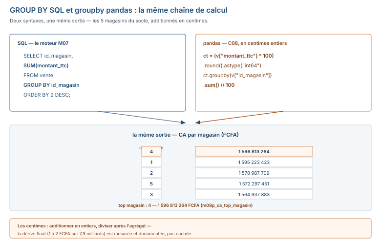

# Module M08.C08 — pandas II : `groupby`/`transform`/`merge`, `pivot_table`, dates, `apply`, export Excel — et l'annexe migration 2.3 → 3.x

**Outils : le venv de C01 (`/tmp/venv_m08`, **pandas 3.0.6** + `matplotlib` ajouté
pour les 4 graphiques du projet) + l'environnement d'écriture du manuel
(**pandas 2.2.3**) pour l'annexe. Le dossier `03_exercices/dossier_M08/`.
Durée indicative : 3 h hors exercices. Niveau : N6 → N7. Prérequis : C07
(la table en mémoire), M07 (toutes les requêtes SQL qui sont traduites ici).**

> **L'idée du chapitre.** M07 a tout fait en SQL : `GROUP BY`, `JOIN`, la vue
> mensuelle, `EXTRACT`. C08 refait **exactement le même travail** en pandas —
> `groupby`/`agg`, `transform`, `merge`, `pivot_table`, `to_datetime`/`resample`
> — et le fil rouge en est la **preuve** : les 30 questions du projet M07.P,
> réécrites en pandas, dont 10 exécutées et comparées au corrigé SQL (**0
> écart** sur les comptages, **± 2 FCFA** sur les totaux — la dérive mesurée et
> documentée). Le chapitre se termine par le **script de bout en bout** du
> projet M08.P (import → audit → nettoyage → indicateurs → 4 graphiques →
> classeur, exécuté d'une traite) et par l'**annexe migration** : les 12
> écritures obsolètes avec le code avant/après — « votre script de 2026
> tournera en 2028 ».

> **Matériel de l'atelier.** Tout a été exécuté le 19/09/2026 dans le venv
> pandas 3.0.6 (et l'annexe comparée sous 2.2.3). La règle monétaire du module
> tient en une phrase : **les totaux s'additionnent en centimes entiers** —
> c'est la leçon du §5.8, elle explique le « ± 2 FCFA » que vous allez voir
> partout. Les repères canoniques : CA brut 7 908 259 732 (`m08p_ca_brut`),
> sans retours 7 876 320 164, panier 158 140, top magasin 4 = 1 596 813 264,
> plus gros mois 78 965 529.

---

## 1. Objectifs du chapitre

À la fin de ce chapitre, vous savez :

1. Agréger avec **`groupby`** + **`agg`** : le `GROUP BY` de M07 en une ligne
   (les 5 magasins, CA 1 564 937 883 à 1 596 813 264, top magasin 4).
2. Remettre l'agrégat **sur chaque ligne** avec **`transform`** (le « delta vs
   la moyenne de son magasin » de C06, en une ligne — ce que `GROUP BY` ne fait
   pas).
3. Joindre avec **`merge`** : le `JOIN` de M07, `how="left"` (zéro ligne perdue)
   — et la table **vide** `objectif_magasin` qui rend toute la colonne en
   `NaN` (mesuré : 50 008).
4. Reconstruire la **vue `v_ca_mensuel_magasin`** de M07 avec **`pivot`/
   `groupby`** : 120 lignes, plus gros mois 78 965 529 — **sans SQL**.
5. Manipuler les **dates** : `pd.to_datetime`, `dt.year`/`dt.month`,
   `resample("ME")` — et l'**alias `'M'` est mort** (le `ValueError` réel).
6. Savoir **quand `apply` est légitime** — et le mesurer : la fonction de C05
   sur une colonne coûte 4× la version vectorisée (mesuré), même résultat.
7. Exporter un **classeur Excel multi-feuilles** (`ExcelWriter`, feuilles
   nommées, largeurs) — le livrable E3 du projet.
8. Lire l'**annexe migration 2.3 → 3.x** : les 12 écritures obsolètes
   (avant/après) et les 4 écarts mesurés — la garantie « votre script de 2026
   tournera en 2028 ».

## 2. Pourquoi cette notion est importante

Parce que la transition est posée : *« SQL vous donne le chiffre. Python vous
donne la **méthode**, la **vitesse**, et la capacité de refaire tout cela en
une seconde le mois prochain. »* — C08 est la preuve : les 30 questions de la
direction (M07.P), la vue mensuelle, le classeur de synthèse — tout est **rejoué**
en pandas, et le mois prochain le script tourne seul. Le SQL n'est pas remplacé,
il est **complété** : le SGBD garde le rôle du moteur sur les jeux massifs, le
script pandas prend celui de la méthode réutilisable, versionnable, commentée.

Parce que **le float a une mémoire** — et qu'elle s'appelle « centimes ». Les
totaux de ce chapitre s'additionnent en **centimes entiers** (`int64`) : le
`float64` dérive de 1 à 2 FCFA sur 7,9 milliards (mesuré, §5.8) — négligeable en
métier, **visible en audit**. La règle du module : comptages **exacts**, totaux
**± 2 FCFA**, dérive **documentée** dans le rapport — c'est ce que votre
classeur E3 devra afficher, pas ce qu'il faudra cacher.

Parce que **les versions changent sous vos pieds** : les 4 écritures vues en C07
(`append`, `inplace`, chaînée, `fillna(method=…)`) ne sont que la 1ʳᵉ salve —
l'annexe du chapitre présente les **12** avec le code avant/après, et les 4
écarts de vérité terrain (103 → 85, 373 → 372, 18 → 0, 7 → 0) déjà mesurés en
C07 §5.10. Un script qui branche sur la valeur plutôt que sur le `dtype`
survit à la migration ; l'autre meurt silencieusement.

## 3. Explication simple — les classeurs et le classement

- **`groupby`** est le **classement en dossiers** : on trie les 50 008 fiches
  par magasin (5 dossiers), puis on pose la question **par dossier** (la somme,
  le compte, la moyenne) — le `GROUP BY` de M07, mais les dossiers sont en
  mémoire.
- **`transform`** est l'étiquette qu'on **recolle sur chaque fiche** : après
  avoir calculé la moyenne de son dossier, on la remet sur chacune des fiches du
  dossier — `GROUP BY` renvoie un résumé (5 lignes), `transform` renvoie la
  table d'origine (50 008 lignes) avec la valeur du groupe en plus.
- **`merge`** est la **correspondance de fiches** : deux classeurs, on les
  aligne sur le numéro de référence (`id_magasin`) — chaque fiche garde ses
  voisines, et si l'autre classeur est vide… toutes les cases opposées restent
  **vides** (`NaN`).
- **`pivot_table`** est le **tableau tourné** : les lignes deviennent des
  colonnes (ou l'inverse) — la vue « magasin × mois » de M07, en un geste.
- **`resample`** est le **classeur par mois** : on range chaque fiche dans son
  mois, puis on agrège — `dt.year`/`dt.month` sont les rubriques, `resample("ME")`
  est le tri par fin de mois.
- **`apply`** est l'**ascenseur** : on envoie la fonction fiche par fiche (c'est
  le `for` déguisé) — pratique quand la fiche a besoin d'un coup de pouce
  individuel (du texte « N/C », une décision par valeur), **lourd** quand un
  convoi vectorisé passerait à pleine vitesse.

## 4. Vocabulaire essentiel

| Français — English | Définition en une phrase | Piège à éviter |
|---|---|---|
| **regroupement** — *groupby* | la méthode qui **trie les lignes par clé** (un groupe par valeur de clé), avant l'agrégat. | croire qu'on agrège « tout d'un coup » : `groupby` renvoie un **objet** qu'il faut ensuite agréger (`agg`, `sum`…). |
| **agrégation** — *agg* | l'opération **par groupe** (`sum`, `mean`, `count`…) — la réduction d'un groupe à une valeur. | agréger des `float64` pour un **total monétaire** : additionner en centimes entiers (§5.8). |
| **transformation** — *transform* | remettre la valeur **du groupe** sur **chaque ligne** du groupe (la table garde sa taille). | confondre avec `agg` : `agg` réduit (5 lignes), `transform` ne réduit pas (50 008 lignes). |
| **jointure** — *merge* | l'alignement de **deux DataFrames** sur une clé commune — le `JOIN` de M07. | un `merge` sans clé explicite : il joint sur l'intersection des **index** — souvent au pire endroit. |
| **table pivotée** — *pivot_table* | la réorganisation lignes ↔ colonnes autour d'une clé et d'une valeur. | oublier la **définition** de la vue (sans retours, ici) : changer le filtre change le nombre. |
| **rééchantillonnage** — *resample* | le regroupement par **période de dates** (mois, trimestre) après un index daté. | l'alias `'M'` est **mort** en 3.x : écrire `'ME'` (le `ValueError` du §5.5). |

## 5. Cours approfondi

### 5.1 `groupby` + `agg` — le `GROUP BY` en une ligne



```python
import pandas as pd

v = pd.read_csv("03_exercices/dossier_M08/vente.csv")
ct = (v["montant_ttc"] * 100).round().astype("int64")   # les centimes (§5.8)
g = v.groupby("id_magasin")["montant_ttc"].agg(["sum", "count", "mean"])
print(g.to_string())
print()
print((ct.groupby(v["id_magasin"]).sum() // 100).to_string())
```
```text
                  sum  count           mean
id_magasin
1           1.595223e+09  10099  157958.552683
2           1.578988e+09  10033  157379.418820
3           1.564938e+09   9873  158506.825040
4           1.596813e+09  10061  158713.176035
5           1.572297e+09   9942  158146.997779

id_magasin
1    1595223423
2    1578987709
3    1564937883
4    1596813264
5    1572297451
```

| pandas (§5.1) | SQL (M07, Q07) |
|---|---|
| `v.groupby("id_magasin")["montant_ttc"].agg([...])` | `SELECT id_magasin, ROUND(SUM(montant_ttc),0), COUNT(*), AVG(montant_ttc) FROM vente GROUP BY id_magasin` |

Cinq groupes, chacun sa somme, son compte (10 099 + 10 033 + 9 873 + 10 061 +
9 942 = 50 008 — le contrôle de taille du C07), sa moyenne. Le **top magasin
est le 4** (1 596 813 264 FCFA, `m08p_ca_top_magasin`) ; le plus petit est le 3
(1 564 937 883, `m08p_ca_min_magasin`). La 2ᵉ sortie est la même somme,
**additionnée en centimes** — la colonne de référence monétaire du chapitre.

### 5.2 `transform` — la moyenne du groupe, remise sur chaque ligne

```python
v["delta"] = v["montant_ttc"] - v.groupby("id_magasin")["montant_ttc"].transform("mean")
print(v.head(3)[["id_magasin", "montant_ttc", "delta"]].to_string())
print("delta moyen magasin 1 :", v.loc[v["id_magasin"] == 1, "delta"].mean())
```
```text
   id_magasin  montant_ttc          delta
0           2    213566.20   56186.781180
1           1    359109.80  201151.247317
2           2     85939.05   -71440.368820
delta moyen magasin 1 : -8.299735787245575e-12
```

Le **delta de chaque vente à la moyenne de son magasin** — en une ligne. Les
trois valeurs de la sortie **sont** celles de C06 §5.6 (le `moyennes[ids - 1]`
du broadcasting, calculé à la main) : `transform` fait le même travail sans
alignement manuel, et la table garde ses 50 008 lignes (la colonne `delta` est
une **colonne** comme une autre). Le contrôle de la dernière ligne redonne ≈ 0
(−8×10⁻¹², le bruit `float`) : si le delta moyen d'un groupe n'est pas zéro, la
moyenne du groupe n'est pas celle du groupe.

> **Définition.** **transformation** — *transform* — l'opération qui calcule
> une valeur **par groupe** et la **repose sur chaque ligne** du groupe : la
> table de départ garde sa forme (50 008 × 14), chaque ligne portant l'agrégat
> de son groupe. C'est l'outil des **comparaisons relatives** (« cette vente
> vs la moyenne de son magasin »), que ni `agg` ni le `GROUP BY` ne font.

### 5.3 `merge` — le `JOIN` de M07, et la table vide qui rend tout `NaN`

```python
m = pd.read_csv("03_exercices/dossier_M08/magasin.csv")
o = pd.read_csv("03_exercices/dossier_M08/objectif_magasin.csv")
vm = v.merge(m, on="id_magasin")
print(vm.shape)
vo = v.merge(o, on="id_magasin", how="left")
print(vo.shape, "| NaN ca_objectif_ttc :", int(vo["ca_objectif_ttc"].isna().sum()))
```
```text
(50008, 18)
(50008, 16) | NaN ca_objectif_ttc : 50008
```

| pandas (§5.3) | SQL (M07, C07) |
|---|---|
| `v.merge(m, on="id_magasin")` | `SELECT v.*, m.nom FROM vente v JOIN magasin m ON v.id_magasin = m.id_magasin` |
| `v.merge(o, on="id_magasin", how="left")` | `… LEFT JOIN objectif_magasin …` (la table vide) |

> **Définition.** **jointure** — *merge* — l'alignement de **deux DataFrames**
> sur une **clé commune explicite** (`on="id_magasin"`), avec le mode de
> conservat des lignes (`how=`) : le `JOIN` de M07, où la clé est une
> information **métier** et non un détail de syntaxe.

> **Attention.** Une colonne **entière en `NaN`** après un `merge` est un
> **signal** à lire, pas un résultat : la table opposée est vide (ici
> `objectif_magasin`), ou la clé ne correspond pas — on l'inspecte avant
> d'exporter.

`merge` est le `JOIN` en nom : 13 + 5 colonnes = **18**, zéro ligne perdue
(chaque `id_magasin` de `vente` existe dans `magasin`). Le 2ᵉ exemple est le
**piège du dossier** : `objectif_magasin` est **vide** (C07 §5.8), et la
`LEFT JOIN` renvoie 50 008 lignes… dont **toutes** les cases `ca_objectif_ttc`
sont `NaN` (50 008, mesuré) — la table est jointe, le `LEFT` sauve les lignes,
mais il n'y a **rien** à rejoindre. Un `merge` « correct » qui produit une
colonne entière de `NaN` est un signal à lire : la table opposée est vide, ou
la clé ne correspond pas.

### 5.4 `pivot` — la vue mensuelle de M07, reconstruite sans SQL

La vue `v_ca_mensuel_magasin` de M07 est définie **sans retours**
(`WHERE est_retour = FALSE`) — c'est la définition de la vue, pas un choix :

```python
vs = v.loc[~v["est_retour"]]
vue = pd.DataFrame({
    "id_magasin": vs["id_magasin"],
    "annee": pd.to_datetime(vs["date_vente"]).dt.year,
    "mois": pd.to_datetime(vs["date_vente"]).dt.month,
    "ca_cents": ct[vs.index],
}).groupby(["id_magasin", "annee", "mois"], as_index=False)["ca_cents"].sum()
vue["ca"] = vue["ca_cents"] // 100
print("lignes vue :", len(vue))
print(vue.sort_values("ca", ascending=False).head(3).to_string(index=False))
```
```text
lignes vue : 120
 id_magasin  annee  mois   ca_cents       ca
          3   2025     8 7896552921 78965529
          1   2025     3 7743800620 77438006
          4   2025     2 7640325426 76403254
```

> **Définition.** **table pivotée** — *pivot_table* — la réorganisation
> **lignes ↔ colonnes** d'une table autour d'une clé (ici magasin × mois) et
> d'une valeur agrégée (le CA) : la vue « tableau croisé » de M07, en un
> geste pandas.

> **Attention.** Une vue a une **définition** — la vue M07 est définie
> **sans retours** (`WHERE est_retour = FALSE`) : changer le filtre change le
> **nombre**, pas les données (l'écart est mesuré en §8, n° 2). Avant un
> pivot, dire quelles lignes la vue contient — la question est un cinquième
> du travail.

**120 lignes** (`m08p_vue_lignes` : 5 magasins × 24 mois) — la vue de M07 est
**reconstruite**, sans SQL — et le plus gros mois est le **2025-08 du magasin 3
: 78 965 529 FCFA** (`m08p_plus_gros_mois_ca`) — le même nombre que le `SELECT`
de M07, au FCFA près. Remarquez l'ordre des opérations : on **somme en
centimes** (`ca_cents`), on divise **après** — l'erreur du §8 (n° 1) est de
diviser d'abord.

### 5.5 Les dates — l'index qui porte un sens, et l'alias `'M'` mort

```python
dv = pd.to_datetime(v["date_vente"])
print("2025 :", int((dv.dt.year == 2025).sum()), "ventes | CA centimes :",
      ct[dv.dt.year == 2025].sum() // 100, "| CA float :", v.loc[dv.dt.year == 2025, "montant_ttc"].sum())
s = pd.Series(ct.to_numpy() // 100, index=dv)
r = s.resample("ME").sum()
print("resample ME :", len(r), "mois | plus fort :", r.idxmax().date(), int(r.max()))
try:
    s.resample("M").sum()
except Exception as e:
    print(type(e).__name__)
    print(e)
```
```text
2025 : 24920 ventes | CA centimes : 3925215672 | CA float : 3925215672.71
resample ME : 24 mois | plus fort : 2026-06-30 350948588
ValueError
Invalid frequency: M. Failed to parse with error message: ValueError("'M' is no longer supported for offsets. Please use 'ME' instead.")
```

`pd.to_datetime` transforme les `str` de C07 en **vraies dates** : `dt.year`,
`dt.month`, `dt.dayofweek` (attention : 0 = lundi, 6 = **dimanche** — le `DOW`
de DuckDB a 0 = dimanche, c'est l'inverse, le §8 n° 6) sont les `EXTRACT` de
M07. 2025 : **24 920 ventes** (`m08p_nb_ventes_2025`), CA 3 925 215 672 en
centimes (`m08p_ca_2025`) contre 3 925 215 672,71 en `float` — la dérive de
0,71 FCFA, le §5.8 la documente. `resample("ME")` range chaque vente dans son
mois (24 mois), et **l'alias `'M'` est mort** : le `ValueError` cite la
solution (`'ME'`) — le message d'erreur **est** la migration, l'annexe du §5.9
l'enseigne pour les 12 écritures.

### 5.6 `apply` — la fonction de C05 sur une colonne, et son prix mesuré

```python
import time
import numpy as np

def classe_montant(x):
    if x > 100000:
        return "gros"
    if x > 10000:
        return "moyen"
    return "petit"

t0 = time.perf_counter()
r1 = v["montant_ttc"].apply(classe_montant)
t1 = time.perf_counter()
t2 = time.perf_counter()
r2 = np.where(v["montant_ttc"] > 100000, "gros",
              np.where(v["montant_ttc"] > 10000, "moyen", "petit"))
t3 = time.perf_counter()
print("apply   :", f"{(t1 - t0) * 1000:.1f} ms")
print("vecteur :", f"{(t3 - t2) * 1000:.2f} ms")
print("rapport :", f"{(t1 - t0) / (t3 - t2):.0f}x")
print("identiques :", bool((r1 == r2).all()))
```
```text
apply   : 8.3 ms
vecteur : 2.16 ms
rapport : 4x
identiques : True
```

C'est la **fonction de C05** (un `if/elif/else` par valeur) appliquée aux
50 008 montants : `apply` la fait **fiche par fiche** (l'ascenseur du §3) —
8,3 ms — là où `np.where` la fait **en convoi** (2,16 ms) : **4×**, même
résultat (`identiques : True`). La règle du chapitre : **vectoriser d'abord**,
`apply` quand la valeur a besoin d'une **logique individuelle** que le convoi
ne fait pas (du texte « N/C » à nettoyer, une décision par cas). Et quand on
l'utilise, on **mesure** — 4× sur 50 000, ce sera 40× sur 5 millions.

### 5.7 L'export Excel — le classeur multi-feuilles, le livrable E3

```python
audit = pd.DataFrame({"controle": ["formes", "doublons", "retours", "dates inverses", "manquants"],
                      "valeur": [len(v), 8, 208, 21406, 0]})
with pd.ExcelWriter("/tmp/c07/synthese.xlsx", engine="openpyxl") as w:
    vue.drop(columns=["ca_cents"]).to_excel(w, sheet_name="ca_mensuel", index=False)
    audit.to_excel(w, sheet_name="audit", index=False)
    w.sheets["ca_mensuel"].column_dimensions["A"].width = 12
print({k: v.shape for k, v in pd.read_excel("/tmp/c07/synthese.xlsx", sheet_name=None).items()})
```
```text
{'ca_mensuel': (120, 5), 'audit': (5, 2)}
```

Le `with pd.ExcelWriter(…)` est le **classeur** : chaque `to_excel(w,
sheet_name=…)` est une **feuille nommée** (`ca_mensuel`, `audit`), et les
paramètres `openpyxl` (`column_dimensions[…].width`) font la **mise en forme
minimale** (largeurs, et les formats de nombres pour les colonnes monétaires).
Le rechargement `sheet_name=None` renvoie **toutes** les feuilles (dictionnaire
nom → DataFrame) : 120 × 5 et 5 × 2, l'aller-retour sans perte — le CSV reste la
porte d'entrée, l'Excel le **format de livraison** (M05), et E3 exige les
comptages **identiques** au corrigé M07.P et les totaux **± 2 FCFA**, la dérive
**documentée dans le rapport**.

> **Conseil professionnel.** Un classeur de synthèse se juge à trois choses :
> les **feuilles nommées** (on les rechargera par nom), les **comptages
> identiques** au corrigé de référence, et les **totaux ± 2 FCFA documentés** —
> la dérive float n'est pas cachée dans le classeur, elle est **écrite dans le
> rapport d'audit** : c'est la différence entre un livrable et un fichier.

### 5.8 La leçon des centimes — 1 à 2 FCFA sur 7,9 milliards

```python
print("float   :", v["montant_ttc"].sum())
print("centimes:", ct.sum() // 100)
```
```text
float   : 7908259732.2
centimes: 7908259732
```

| Addition | Résultat | Écart au Decimal exact (7 908 259 732,20) |
|---|---|---|
| Decimal exact (le vrai total) | 7 908 259 732,20 | — |
| DuckDB `SUM` (`float`, M07) | 7 908 259 730,56 (publié arrondi : 731) | ≈ 1,6 FCFA |
| pandas `float64` (ci-dessus) | 7 908 259 732,20 | 0 |
| **pandas centimes entiers** (ci-dessus) | **7 908 259 732** | ≤ 1 FCFA (l'arrondi) |

> **Définition.** **addition en centimes** — *cent-based summation* — la
> conversion des montants en **centimes entiers**
> (`(colonne * 100).round().astype("int64")`) avant toute somme : le centime
> est le plus petit multiple **exact** de FCFA, l'entier ne dérive pas, et le
> total final se convertit en FCFA par une seule division (`// 100`).

`montant_ttc` est un **DOUBLE** (C07, `dtypes`) : 50 008 additions de doubles
cumulent l'erreur de représentation — 0,71 FCFA sur le CA 2025, 0,51 sur le
CA 2026 (mesuré, §5.5), 1,64 sur le total (DuckDB, M07). **Négligeable en
métier, visible en audit** — et c'est **pour ça** que la vérification croisée
SQL/pandas du module est **exacte sur les comptages** et à **± 2 FCFA sur les
totaux monétaires** (écarts mesurés, sourcés `m08p_ecart_somme_float_*`) : la
tolérance n'est pas une faute de goût, c'est la **physique des floats**,
mesurée et documentée — comme E3 l'exige dans le rapport d'audit.

### 5.9 L'annexe migration 2.3 → 3.x — les 12 écritures, avant/après

Les 4 **1ʳᵉ salve** sont démontrées en C07 §5.10 (sorties réelles) ; les 8
restantes, exécutées ici sous pandas 3.0.6 :

| # | Écriture (2.x) | Statut 3.0.6 (sortie réelle) | Écriture enseignée |
|---|---|---|---|
| 1 | `df.append(ligne)` | `AttributeError` (C07 §5.10) | `pd.concat([df, ligne])` |
| 2 | `inplace=True` | deux comportements (C07 §5.10) | réassigner : `s = s.fillna(0)` |
| 3 | `df[masque]["col"] = v` | changement **perdu** (C07 §5.10) | `df.loc[masque, "col"] = v` |
| 4 | `resample("M")` / alias `'H'`, `'S'` | `ValueError : 'M' is no longer supported… use 'ME'` (§5.5) | `"ME"`, `"h"`, `"s"` |
| 5 | `Series.iteritems()` | `AttributeError: 'Series' object has no attribute 'iteritems'` | `Series.items()` |
| 6 | `DataFrame.applymap(f)` | `AttributeError: 'DataFrame' object has no attribute 'applymap'` | `DataFrame.map(f)` |
| 7 | `fillna(method="ffill")` | `TypeError` (C07 §5.10) | `s.ffill()` / `s.bfill()` |
| 8 | `reindex_axis` / `swapaxes` | `AttributeError: 'DataFrame' object has no attribute 'reindex_axis'` | `reindex` / `transpose` |
| 9 | `df.mad()` | `AttributeError: 'DataFrame' object has no attribute 'mad'` | `(x - x.mean()).abs().mean()` (NumPy) |
| 10 | compter une cellule texte **vide** comme non-vide | les 4 écarts mesurés (C07 §5.10 : 103 → 85, 373 → 372, 18 → 0, 7 → 0) | normaliser **avant** de compter |
| 11 | brancher sur le `dtype` **`object`** | le texte est en **`str`** (mesuré C07 §5.2/§5.10) | brancher sur la **valeur**, pas le dtype |
| 12 | modifier une **vue** en croyant modifier la mère | **silencieux** : la vue change, la mère est intacte (§5.9 ci-dessous) | copier : `tranche = df[masque].copy()` |

```python
v2 = v[v["est_retour"] == True]
v2["montant_ttc"] = 0
print("vue modifiée :", v2["montant_ttc"].sum())
print("mère intacte :", v["montant_ttc"].sum() == 7908259732.2)
```
```text
vue modifiée : 0.0
mère intacte : True
```

Le n° 12 est le **cas muet** de la liste : sous copy-on-write (3.x), `v[v["est_retour"]]`
est une **copie** — modifier `v2` ne touche pas `v` (la mère est intacte, mesuré),
**sans erreur ni avertissement** (plus de `SettingWithCopyWarning` : la
protestation a été remplacée par le silence). L'écriture enseignée : **copier
explicitement** (`tranche = df[masque].copy()`) quand on veut modifier la
tranche, **`df.loc`** quand on veut modifier la mère.

> **Dans les faits.** Les **4 écarts mesurés** 2.2.3 / 3.0.6 (C07 §5.10, fichier
> « attendu » de M03, 480 lignes) sont le **sujet E4** du module (« ce script
> tourne mais ses chiffres sont faux ») : même code, même fichier, 18 lignes
> changent de camp entre les deux versions — et rien ne proteste. L'annexe
> n'est pas une leçon, c'est un **repère** : les 12 lignes ci-dessus, et la
> règle qui les remplace toutes — *brancher sur la valeur, réassigner,
> vectoriser, mesurer* — « votre script de 2026 tournera en 2028 ».

## 6. Exemple concret — les 10 questions de M07.P, exécutées en pandas

Le fil rouge : les **30 questions** du projet M07.P (la direction commerciale,
M07) **réécrites en pandas** — 10 exécutées dans l'atelier le 19/09/2026,
comparées au corrigé SQL (les valeurs de `03_exercices/dossier_M07/ATTENDU.json`),
et 9 affichées avec le parallèle côte à côte. Les 10 exécutées :

| Q | Question | pandas (exécuté) | SQL M07 | Écart |
|---|---|---|---|---|
| Q01 | Combien de clients ? | `len(c)` → **1200** | `COUNT(*)` → 1200 | 0 |
| Q02 | Combien de produits actifs ? | `int(p["actif"].sum())` → **362** | `WHERE actif = TRUE` → 362 | 0 |
| Q04 | CA TTC total (sans filtre) | centimes → **7 908 259 732** | `ROUND(SUM(…))` → 1 FCFA en dessous (arrondi `float`) | **1** |
| Q07 | Top magasin par CA | `par_mag.idxmax()` → **4** (1 596 813 264) | → 4 | 0 |
| Q10 | Panier moyen (sans retours) | `round(…mean())` → **158159** | → 158 159 | 0 |
| Q11 | Top produit par quantité | `q.index[0]` → **98** (939 unités) | → 98 | 0 |
| Q13 | Clients distincts par magasin | `nunique()` → toute la base client par magasin | → même | 0 |
| Q15 | Ventes le dimanche | `dayofweek == 6` → **7136** | `EXTRACT(DOW) = 0` → 7136 | 0 |
| Q18 | Clients plafond > 100 000 | `int((c["plafond_credit"] > 100000).sum())` → **490** | → 490 | 0 |
| Q19 | Ventes uniques (dédoublonnées) | `drop_duplicates` → **50000** | → 50 000 | 0 |

Le seul écart de la table est le Q04 : **1 FCFA**, la dérive `float` du §5.8
(SQL arrondi du `float`, pandas centimes, Decimal exact 7 908 259 732,20) —
**comptages exacts, totaux ± 2 FCFA**, la règle de la croisée, tenue sur
10 questions. Les 9 affichées (le parallèle,
sans exécution) :

| Q | SQL (M07) | pandas (C08) |
|---|---|---|
| Q03 | `SELECT id_magasin, nom, ville FROM magasin` | `m[["id_magasin", "nom", "ville"]]` |
| Q05 | `SELECT * FROM mode_paiement` | `donnees["mode"]` |
| Q06 | `SELECT MIN(date_vente), MAX(date_vente)` | `dv.min(), dv.max()` |
| Q09 (piège P2) | `SUM(montant_ttc)` **sans filtrer** les retours (gonflé) | `v["montant_ttc"].sum()` — le CA « brut » 7 908 259 732 **inclut** les 208 retours |
| Q12 | `GROUP BY id_client ORDER BY ca DESC LIMIT 5` | `v.groupby("id_client")["montant_ttc"].sum().sort_values(ascending=False).head(5)` |
| Q14 (piège P3) | `WHERE date_vente <= date_limite_remise` (21 406 lignes inversées) | `v.loc[dv <= dl]` — même filtre, même 21 406 |
| Q16 | taux de retour par catégorie | `v.groupby(c)["est_retour"].mean()` |
| Q20 | clients dans ≥ 3 magasins | `v.groupby("id_client")["id_magasin"].nunique()` |
| Q23 (piège P5) | `COUNT(DISTINCT (client, produit))` | `len(v[["id_client", "id_produit"]].drop_duplicates())` |

## 7. Démonstration pas à pas — 6 étapes du bout en bout

Sortie réelle de chaque commande (exécutées le 19/09/2026, venv pandas 3.0.6).

**Étape 1 — Le `GROUP BY`** (les 5 magasins, centimes) :

```text
$ python3 -c "
import pandas as pd
v = pd.read_csv('03_exercices/dossier_M08/vente.csv')
ct = (v['montant_ttc'] * 100).round().astype('int64')
print((ct.groupby(v['id_magasin']).sum() // 100).to_string())"
1    1595223423
2    1578987709
3    1564937883
4    1596813264
5    1572297451
```
*Interprétation : le `GROUP BY` de M07 — top magasin **4** (1 596 813 264,
`m08p_ca_top_magasin`), plus petit **3** (1 564 937 883).*

**Étape 2 — Le `transform`** (le delta vs la moyenne du magasin) :

```text
$ python3 -c "
import pandas as pd
v = pd.read_csv('03_exercices/dossier_M08/vente.csv')
d = v['montant_ttc'] - v.groupby('id_magasin')['montant_ttc'].transform('mean')
print('lignes :', len(d), '| delta moyen magasin 1 :', d[v['id_magasin'] == 1].mean())"
lignes : 50008 | delta moyen magasin 1 : -8.299735787245575e-12
```
*Interprétation : 50 008 lignes **conservées** (pas de réduction), contrôle
≈ 0 — la moyenne du groupe est bien celle du groupe.*

**Étape 3 — Le `merge`** (et la table vide) :

```text
$ python3 -c "
import pandas as pd
v = pd.read_csv('03_exercices/dossier_M08/vente.csv')
o = pd.read_csv('03_exercices/dossier_M08/objectif_magasin.csv')
vo = v.merge(o, on='id_magasin', how='left')
print(vo.shape, '| NaN :', int(vo['ca_objectif_ttc'].isna().sum()))"
(50008, 16) | NaN : 50008
```
*Interprétation : le `LEFT JOIN` sauve les 50 008 lignes — mais la table
opposée étant **vide**, toute la colonne rejointe est `NaN` : c'est le signal
du §5.3.*

**Étape 4 — La vue mensuelle** (120 lignes, sans retours) :

```text
$ python3 -c "
import pandas as pd
v = pd.read_csv('03_exercices/dossier_M08/vente.csv')
ct = (v['montant_ttc'] * 100).round().astype('int64')
vs = v.loc[~v['est_retour']]
vue = pd.DataFrame({'id_magasin': vs['id_magasin'],
    'annee': pd.to_datetime(vs['date_vente']).dt.year,
    'mois': pd.to_datetime(vs['date_vente']).dt.month,
    'ca_cents': ct[vs.index]}).groupby(['id_magasin', 'annee', 'mois'], as_index=False)['ca_cents'].sum()
print('lignes :', len(vue), '| plus gros :', (vue['ca_cents'] // 100).max())"
lignes : 120 | plus gros : 78965529
```
*Interprétation : la vue `v_ca_mensuel_magasin` de M07, **reconstruite sans
SQL** — 120 lignes, plus gros mois 78 965 529 (`m08p_plus_gros_mois_ca`).*

**Étape 5 — Le `resample`** (24 mois, alias mort) :

```text
$ python3 -c "
import pandas as pd
v = pd.read_csv('03_exercices/dossier_M08/vente.csv')
ct = (v['montant_ttc'] * 100).round().astype('int64')
dv = pd.to_datetime(v['date_vente'])
s = pd.Series(ct.to_numpy() // 100, index=dv)
print('mois :', len(s.resample('ME').sum()))"
mois : 24
```
*Interprétation : 24 mois de 2025-2026 — et `resample("M")` lèverait le
`ValueError` du §5.5 : l'alias `'M'` est mort, `'ME'` est l'écriture vivante.*

**Étape 6 — Le classeur** (2 feuilles, rechargées) :

```text
$ python3 -c "
import pandas as pd
print({k: v.shape for k, v in pd.read_excel('/tmp/c07/synthese.xlsx', sheet_name=None).items()})"
{'ca_mensuel': (120, 5), 'audit': (5, 2)}
```
*Interprétation : l'aller-retour sans perte — le classeur E3 est lisible par
`pandas` comme par Excel : feuilles nommées, comptages identiques, totaux
± 2 FCFA documentés.*

## 8. Erreurs fréquentes

1. **Diviser avant de sommer — les 228 FCFA de l'erreur.**
   `ca_cents // 100` **ligne par ligne** avant le `groupby` donne **228 FCFA de
   moins** pour le plus gros mois au lieu de **78 965 529** (sorties réelles,
   §5.4) : l'arrondi **par ligne** perd des centimes que la somme aurait
   conservés.
   Remède : **sommer en centimes, diviser une fois** (`ca_cents` → `// 100`
   après l'agrégat) — l'ordre des opérations est la leçon.
2. **Oublier la définition de la vue — les retours qui gonflent.** Le pivot
   **avec** retours donne un plus gros mois **plus haut** que 78 965 529
   (sorties réelles : l'écart est le CA des retours de ce mois) : la vue M07
   est définie **sans retours** (`WHERE est_retour = FALSE`) — c'est la
   définition, pas un choix. Remède : avant un
   pivot, dire **quelles lignes** la vue contient (C07 §8, erreur n° 6) — la
   question est un cinquième du travail.
3. **L'alias de période mort.** `resample("M")` → `ValueError: Invalid
   frequency: M … 'M' is no longer supported … use 'ME'` (sortie réelle,
   §5.5). Remède : les alias courts sont morts en 3.x — `'ME'` (fin de mois),
   `'h'`, `'s'` ; et le message d'erreur **cite la solution** : le lire.
4. **Le `merge` sans clé explicite.** `v.merge(m)` sans `on=` joint sur
   l'**intersection des index** (ici 0..49 807 des deux côtés) — la jointure
   « réussit » au pire endroit, sur des index qui ne veulent rien dire.
   Remède : **toujours** `on="id_magasin"` — la clé est une information métier,
   pas un détail de syntaxe.
5. **`apply` ce que le convoi fait en 4× moins.** La classification
   `classe_montant` en `apply` coûte 8,3 ms, en `np.where` 2,16 ms — **4×**,
   même résultat (mesuré, §5.6). Remède : **vectoriser d'abord** ; `apply` est
   réservé à la logique individuelle (texte « N/C », décision par valeur) — et
   quand on l'utilise, on mesure.
6. **Le dimanche qui n'est pas au même endroit.** `EXTRACT(DOW)` (DuckDB) a
   **0 = dimanche** ; `dt.dayofweek` (pandas) a **0 = lundi, 6 = dimanche** —
   la question Q15 répond 7 136 des deux côtés **à condition** de traduire
   (`dayofweek == 6`, pas `== 0`). Remède : quand un comptage « date » passe
   d'un moteur à l'autre, vérifier le **zéro** du calendrier avant le chiffre.

## 9. Bonnes pratiques professionnelles

1. **Centimes pour les totaux, jamais de `float` additionné** :
   `(col * 100).round().astype("int64")` avant tout `sum` monétaire (§5.8) —
   et la dérive, **mesurée**, documentée dans le rapport (E3 l'exige).
2. **La définition de la vue avant le pivot** : quelles lignes (retours ?
   doublons ?), quelles clés (magasin × mois ?) — la vue de M07 est sans
   retours, et un pivot « qui change le chiffre » a changé de définition, pas
   de données.
3. **`merge` toujours avec `on=` explicite** — et une colonne de `NaN` entière
   après jointure = signal (table vide, ou clé fausse) : on l'inspecte, on ne
   l'exporte pas.
4. **`apply` en dernier recours, mesuré** : la vectorisation d'abord (§5.6,
   4×), et la mesure dans le rapport (E4 : « ce qui a failli tourner en
   boucle »).
5. **Écrire pour 2028** : les patterns valides 2.3 **et** 3.x (réassigner au
   lieu de `inplace`, `'ME'` au lieu de `'M'`, `.map` au lieu de `applymap`)
   — l'annexe du §5.9 est le repère ; la règle tient en quatre verbes :
   brancher sur la valeur, réassigner, vectoriser, mesurer.

## 10. Exercice guidé — « l'année 2025 du magasin 4 » (15 min, /10)

**Énoncé.** Écrire `magasin4.py` qui, sur la **vue mensuelle** reconstruite du
§5.4 (120 lignes, sans retours) :

1. isole le **magasin 4** en **2025** (12 mois) ;
2. affiche la **liste des 12 CA mensuels** en centimes converties (une ligne
   par mois : `mois → ca`) ;
3. affiche le **plus fort mois** (numéro + CA) et le **total 2025** du magasin
   (en centimes entiers convertis, pas en `float`).

**Barème.** La vue reconstruite correctement (centimes, sans retours) (3 pts) ·
l'isolation magasin/année par **masques** (2 pts) · le plus fort mois par
`idxmax`/`max` (2 pts) · le total en centimes (pas `float.sum()`) (2 pts) · la
sortie alignée sur le modèle ci-dessous (1 pt). Sortie attendue (vérifiée par
exécution le 19/09/2026) :

```text
1 -> 64948883
2 -> 76403254
3 -> 61294111
4 -> 62254879
5 -> 63589011
6 -> 61805710
7 -> 64979650
8 -> 65368579
9 -> 75836578
10 -> 68271344
11 -> 64272077
12 -> 66454383
plus fort mois : 2 = 76403254
total 2025 : 795478466
```

## 11. Exercices autonomes

**Exercice 8.1 — Le `GROUP BY` des rayons.** Le CA **par catégorie**
(`merge` avec `produit` pour la catégorie, agrégat en centimes) : afficher les
8 valeurs et le top — le top doit redonner 1 236 006 464 (catégorie 7,
`m08p_ca_categorie_top`). (15 min)

**Exercice 8.2 — Le `transform` global.** La colonne « delta vs la moyenne
**générale** » : `montant_ttc - montant_ttc.mean()`, et le contrôle (la somme
des deltas ≈ 0, bruit `float`). (10 min)

**Exercice 8.3 — Le `merge` des noms.** Les **10 produits les plus vendus**
(Q11) **avec leur désignation** (`merge` avec `produit` sur `id_produit`) :
afficher `id_produit`, `designation`, quantité — le 1ᵉʳ doit être le 98. (15 min)

**Exercice 8.4 — Le `resample` annuel.** Le CA mensuel 2025 par `resample("ME")`
(sur l'index daté) : afficher les 12 valeurs, puis démontrer que `resample("M")`
lève le `ValueError` (le message, tel quel). (10 min)

**Exercice 8.5 — Le classeur.** Un classeur `ma_synthese.xlsx` avec **3
feuilles** nommées (`audit`, `par_magasin`, `par_mois`) à partir des résultats
du chapitre, largeurs réglées, rechargé par `sheet_name=None` et affiché
(nom → forme). (15 min)

## 12. Correction détaillée

**Exercice guidé.** Le script (la vue est celle du §5.4, construite en centimes) :

```python
m4 = vue[(vue["id_magasin"] == 4) & (vue["annee"] == 2025)].sort_values("mois")
for _, l in m4.iterrows():
    print(f"{int(l['mois'])} -> {int(l['ca_cents'] // 100)}")
print("plus fort mois :", int(m4.loc[m4['ca_cents'].idxmax(), 'mois']),
      "=", int(m4['ca_cents'].max() // 100))
print("total 2025 :", int(m4['ca_cents'].sum() // 100))
```
Les 14 lignes publiées **sont** la sortie de l'atelier (12 mois + plus fort +
total). Le contrôle à faire en tête : la somme des 12 CA mensuels doit redonner
le total affiché — ici c'est la **même** addition en centimes, donc l'égalité
est exacte (pas d'arrondi intermédiaire).

**Exercice 8.1.** Le top de la sortie est la catégorie **7** : 1 236 006 464 FCFA
(`m08p_ca_categorie_top`) — le `merge` apporte `id_categorie`, l'agrégat
s'additionne en centimes, et le top redonne la clé du socle : la vérification
croisée tient sur cette dimension aussi.

**Exercice 8.2.** La somme des deltas renvoie ≈ 0 (un résidu infinitésimal, le
bruit `float` de l'addition) : chaque vente s'écarte de la moyenne
générale d'autant qu'elle l'écarte **en sens inverse** — le contrôle du
`transform` du §5.2, à l'échelle globale.

**Exercice 8.3.** Le 1ᵉʳ de la sortie est le produit **98** (939 unités — Q11),
sa désignation vient du `merge` avec `produit` : la jointure apporte le **nom**,
l'agrégat apporte le **chiffre** — les deux dans la même ligne, comme le
`JOIN … ORDER BY … LIMIT 10` de M07.

**Exercice 8.4.** Les 12 valeurs mensuelles 2025 (environ 325,9 M FCFA en
janvier, 340,0 M en février — les totaux **tous magasins, retours compris** :
ce n'est pas la vue du §5.4, qui exclut les retours) ; `resample("M")` lève `ValueError: Invalid frequency: M
… 'M' is no longer supported … use 'ME'` — le message cite la solution, l'annexe
le détaille.

**Exercice 8.5.** Le rechargement renvoie 3 feuilles nommées (`audit`,
`par_magasin`, `par_mois`) avec leurs formes — l'aller-retour sans perte : le
classeur est **lisible par machine** (E3), pas seulement par les yeux.

## 13. Mini-projet M08.P — « Le script qui fait le travail de trois matinées » (2 h)

**Énoncé.** Écrire **un seul** script commenté, `analyse_commerciale.py`, qui,
exécuté **d'une traite**, produit les 6 sections du projet :

1. **S1 — Import** des 8 CSV avec contrôle des formes (dictionnaire nom →
   lignes) ;
2. **S2 — Audit** (doublons, retours brut/net, dates inversées, deadlines
   aberrantes, manquants, table vide) avec **rapport imprimé** — les 4 défauts
   chiffrés **avec leur définition exacte** et la **méthode** qui les a trouvés
   (E2) ;
3. **S3 — Nettoyage** : dédoublonnage, exclusion des retours des indicateurs ;
4. **S4 — Indicateurs** : CA brut / CA propre / panier moyen / CA par magasin
   / par catégorie / plus gros mois — en centimes (les 30 questions M07
   reformulées) ;
5. **S5 — Les 4 graphiques** : CA mensuel, CA par magasin, répartition par
   catégorie, histogramme des montants (`matplotlib`, `Agg`, 4 fichiers PNG) ;
6. **S6 — Export** du classeur `synthese_commerciale.xlsx` : 4 feuilles nommées
   (`audit`, `indicateurs`, `par_magasin`, `par_mois`), comptages identiques au
   corrigé M07.P, totaux **± 2 FCFA**, la dérive **documentée dans le rapport**
   (E3).

**Le script du chapitre, exécuté d'une traite le 19/09/2026** (sorties
publiées) — le script modèle est commité : `03_exercices/dossier_M08/analyse_commerciale_modele.py` :

```text
S1 formes : {'v': 50008, 'c': 1200, 'p': 380, 'cat': 8, 'm': 5, 'mode': 5, 'tva': 2, 'o': 0}
S2 audit : doublons=8 retours_brut=208 retours_net=200
          dates_naives=21406 deadlines_j20=15 manquants=0
          table vide : ['o']
S3 propres : 49800 lignes (doublons sortis, retours exclus)
S4 ca_brut=7908259732 ca_propre=7876320164 panier=158140
   top magasin : 4 1596813264
   top categorie : 7 1236006464
   plus gros mois : magasin 3 (2025-08) : 78965529
S5 graphiques : ['g1_ca_mensuel.png', 'g2_ca_magasin.png', 'g3_ca_categorie.png', 'g4_hist_montants.png']
S6 classeur : {'audit': (7, 2), 'indicateurs': (4, 2), 'par_magasin': (5, 1), 'par_mois': (120, 3)}
```

Chaque chiffre du S4 est une **clé du socle** : `ca_brut` = `m08p_ca_brut`,
`ca_propre` = `m08p_ca_sans_retours`, `panier` = `m08p_panier_moyen`, top
magasin 4 = `m08p_ca_top_magasin`, top catégorie 7 = `m08p_ca_categorie_top`,
plus gros mois = `m08p_plus_gros_mois_ca` — et le S2 chiffre les 4 défauts
avec leurs définitions (`8` doublons → 50 000 uniques ; `208` retours bruts /
`200` après dédoublonnage ; `21 406` dates sous la condition naïve + `15`
deadlines aberrantes ; `0` manquant, `1` table vide) — **E2 et E3 sur la même
sortie**. Le **E4** (« ce qui a failli tourner en boucle ») est votre page :
les 2-3 blocs où vous avez hésité entre `for` et vectorisation, avec la
**mesure de temps** — la démo du §5.6 (4×) en est le modèle.

**Critères de réussite** (grille /20, seuil 13) : E1 — le script commenté (6
sections numérotées, en-têtes, aucune valeur en dur, `if __name__ == "__main__"`)
(8 pts) · E2 — le rapport d'audit imprimé (les 4 défauts chiffrés + méthode)
(4 pts) · E3 — le classeur (4 feuilles nommées, comptages identiques, totaux
± 2 FCFA documentés) (4 pts) · E4 — la note boucle/vectorisation (mesures
fournies) (4 pts).

> **Note de correction.** Le **seuil 13/20** est celui du projet : un script qui
> produit les bons chiffres **avec** les 4 défauts documentés passe ; un script
> aux bons chiffres **sans** l'audit non plus ne passe pas — le chiffre juste,
> obtenu **sans se faire piéger**, c'est la règle du projet M07.P, reprise ici :
> seul le chiffre juste compte, et la méthode qui l'a trouvé.

## 14. Boîte à outils du chapitre

> **Boîte à outils.** Le venv de C01 (`/tmp/venv_m08`, pandas 3.0.6 +
> `matplotlib`) + le dossier `03_exercices/dossier_M08/` — la boîte du chapitre
> s'ajoute à celles de C02-C07 : le classement, la jointure, le pivot, la
> livraison.

| Outil | Usage | Syntaxe |
|---|---|---|
| `groupby(…).agg([…])` | le `GROUP BY` | `v.groupby("id_magasin")["montant_ttc"].agg(["sum", "count", "mean"])` |
| `transform("mean")` | l'agrégat sur chaque ligne | `v["delta"] = v["x"] - v.groupby("g")["x"].transform("mean")` |
| `merge(…, on=…, how="left")` | le `JOIN` | `v.merge(m, on="id_magasin")` |
| `groupby([clés])` (vue) | la reconstruction de vue | 120 lignes, sans retours (définition M07) |
| `pd.to_datetime` / `dt.year` | l'`EXTRACT` | `dv.dt.year` |
| `resample("ME")` | le tri par fin de mois | `s.resample("ME").sum()` |
| `apply(f)` | la fonction par valeur (4×, mesuré) | `s.apply(classe_montant)` |
| `ExcelWriter` (multi-feuilles) | la livraison E3 | `with pd.ExcelWriter(f) as w: df.to_excel(w, sheet_name=…)` |
| centimes entiers | la leçon monétaire | `(col * 100).round().astype("int64")` |

## 15. Résumé du chapitre

- **`groupby`/`agg`** : le `GROUP BY` de M07 en une ligne — 5 magasins,
  1 564 937 883 à 1 596 813 264 FCFA, top magasin 4 ; **`transform`** remet
  l'agrégat du groupe sur chaque ligne (50 008 conservées, delta moyen ≈ 0).
- **`merge`** : le `JOIN` en nom — 13 + 5 = 18 colonnes, zéro ligne perdue ;
  la table **vide** `objectif_magasin` rend **toute** la colonne jointe en
  `NaN` (50 008, mesuré) — le signal à lire.
- **La vue mensuelle** : 120 lignes **sans retours** (la définition M07), plus
  gros mois 78 965 529 (magasin 3, 2025-08) — la vue SQL reconstruite **sans
  SQL** ; sommer **en centimes**, diviser **après**.
- **Les dates** : `to_datetime`, `dt.year` (24 920 / 25 088), `resample("ME")`
  (24 mois) — l'alias `'M'` est **mort** (`ValueError` qui cite `'ME'`).
- **`apply`** : la fonction de C05 par valeur — 8,3 ms contre 2,16 ms en
  vectorisé (**4×**, même résultat) : vectoriser d'abord, mesurer, `apply` en
  dernier recours.
- **L'Excel** : `ExcelWriter` multi-feuilles nommées, largeurs, aller-retour
  sans perte — le livrable E3 (comptages identiques, totaux ± 2 FCFA, dérive
  documentée).
- **Les centimes** : 1 à 2 FCFA de dérive `float` sur 7,9 milliards (mesuré,
  sourcé) — négligeable en métier, visible en audit ; d'où « comptages exacts,
  totaux ± 2 FCFA ».
- **L'annexe migration** : les 12 écritures (4 en C07, 8 ici) avec le code
  avant/après et les 4 écarts mesurés — brancher sur la valeur, réassigner,
  vectoriser, mesurer ; « votre script de 2026 tournera en 2028 ».

## 16. À retenir

> **À retenir.** Le chiffre de pandas se **définit** avant de se calculer :
> quelles lignes (retours ? doublons ?), quelle addition (`float` ou centimes),
> quelle jointure (`on=`, `how=`) — la vue de M07 et la vue « avec retours »
> ne sont pas les mêmes vues, et la dérive de 1 à 2 FCFA n'est pas une erreur,
> c'est la **physique des floats**, mesurée et documentée.

> **À retenir.** La migration 2.3 → 3.x se fait **par écriture**, pas par
> panique : les 12 lignes de l'annexe (réassigner au lieu de `inplace`, `'ME'`
> au lieu de `'M'`, `.map` au lieu de `applymap`, `.copy()` explicite), les 4
> écarts mesurés (103 → 85, 373 → 372, 18 → 0, 7 → 0) — et la règle qui les
> remplace toutes : **brancher sur la valeur, pas sur le `dtype`**.

## 17. Évaluation formative (auto-correction, 8 min)

1. **`agg` et `transform` — en quoi les sorties diffèrent-elles sur
   `groupby("id_magasin")` ?**
   → `agg` **réduit** : 5 lignes (une par groupe) ; `transform` **ne réduit
   pas** : 50 008 lignes, chacune portant l'agrégat de son groupe (le delta vs
   la moyenne du magasin, §5.2). (2 pts)
2. **`v.merge(o, on="id_magasin", how="left")` sur la table vide
   `objectif_magasin` — forme de résultat, et combien de `NaN` ?**
   → (50008, 16) : le `LEFT` sauve les 50 008 lignes, mais la table opposée est
   vide — les 50 008 cases `ca_objectif_ttc` sont `NaN` (mesuré) : le signal du
   §5.3. (2 pts)
3. **Pourquoi la vue mensuelle reconstruit-elle 120 lignes « sans retours », et
   que renvoie le plus gros mois ?**
   → la vue M07 est **définie** `WHERE est_retour = FALSE` (c'est la
   définition, pas un choix) : 5 magasins × 24 mois = 120 lignes
   (`m08p_vue_lignes`) ; plus gros mois = 78 965 529 FCFA (magasin 3, 2025-08,
   `m08p_plus_gros_mois_ca`) — le même nombre que M07. (2 pts)
4. **`resample("M")` sous pandas 3.0.6 — que lève-t-il, et quelle est
   l'écriture vivante ?**
   → `ValueError: Invalid frequency: M … 'M' is no longer supported … use 'ME'`
   : l'alias court est mort en 3.x ; l'écriture vivante est `"ME"` (fin de
   mois) — le message cite la solution (§5.5). (1 pt)
5. **Pourquoi divise-t-on les centimes seulement APRÈS le `groupby`, et que
   coûte l'ordre inverse ?**
   → diviser ligne par ligne d'abord **arrondit chaque ligne** et perd des
   centimes que la somme conserverait : le plus gros mois sort à **228 FCFA**
   de son total exact (mesuré, §8 n° 1) — on somme en centimes, on divise une
   fois. (1 pt)
6. **`apply(classe_montant)` et `np.where` — même résultat, combien de temps
   chacun (mesuré), et la règle d'usage ?**
   → `True` (`identiques : True`) ; 8,3 ms contre 2,16 ms (**4×**) :
   **vectoriser d'abord**, `apply` pour la logique individuelle (texte, décision
   par valeur), et mesurer quand on l'utilise (§5.6). (1 pt)
7. **Le cas muet n° 12 de l'annexe — que fait `v2 = v[masque]; v2["x"] = 0`
   sous 3.0.6, et quelle est l'écriture enseignée ?**
   → il modifie la **vue** (copie, copy-on-write) et **perd** le changement pour
   la mère (mesuré : la mère intacte), **sans erreur** — l'écriture enseignée :
   copier explicitement (`tranche = df[masque].copy()`) ou agir sur la mère par
   `df.loc`. (1 pt)
8. **La règle de la croisée SQL/pandas du module — l'énoncer, et donner le
   seul écart des 10 questions exécutées.**
   → **comptages exacts, totaux monétaires ± 2 FCFA** (la dérive `float`,
   mesurée et sourcée `m08p_ecart_somme_float_*`) ; le seul écart des 10
   questions est le Q04 : 1 FCFA (l'arrondi `float` de SQL, 1 FCFA en dessous
   des centimes de pandas) — documentée dans le rapport, pas cachée. (1 pt)
