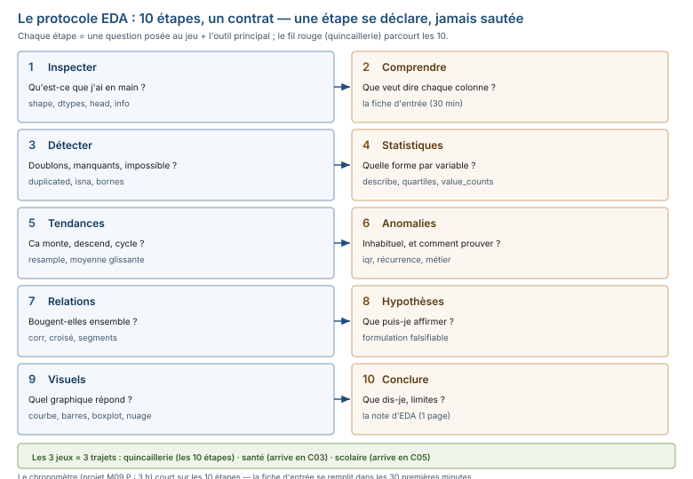

# Module M09.C01 — Le protocole en 10 étapes : inspecter sans se fier, la « fiche d'entrée » et le temps à y consacrer

**Outils : pandas 2.2.3, numpy 2.3.5 (exécutés), `matplotlib` 3.10.9 / `seaborn` 0.13.2 (annoncés, C06), DuckDB (annoncé, le parallèle s'active à C02).
Durée indicative : 5 h. Niveau : N3. Prérequis : M02 (les statistiques descriptives) et M08 (pandas) ; M05/M07 utiles
(le parallèle SQL et la base de la quincaillerie).**

> **L'idée du chapitre.** M08 a appris à **produire** des chiffres ; M09 apprend à **poser les bonnes questions**
> à un jeu de données qu'on ne connaît pas, et à n'affirmer que des conclusions **provisoires, correctement
> exprimées**. Ce chapitre pose le **protocole en 10 étapes** — le contrat du module — et ses deux outils
> d'entrée : l'inspection sans confiance (`shape`, `dtypes`, `head`, `info` — et pourquoi `head(5)` peut
> mentir) et la **fiche d'entrée** (variables, unités, sources, questions autorisées), complétée **en 30
> minutes maximum** : c'est la contrainte du projet M09.P, « 3 heures avec un fichier que personne n'a
> regardé », et la compétence du module — **s'arrêter** avec un cadrage honnête, pas explorer jusqu'à
> n'avoir plus rien à rendre.

> **Matériel de l'atelier — Python 3.13 · pandas 2.2.3 (environnement d'écriture) · numpy 2.3.5.** Toutes
> les commandes de ce chapitre ont été exécutées dans l'atelier le 20/09/2026 sur le dossier
> `03_exercices/dossier_M09/` (graine 45, déterministe, empreinte figée en `ATTENDU.json`) ; les sorties
> publiées sont **celles de l'atelier**.

---

## 1. Objectifs du chapitre

À la fin de ce chapitre, vous savez :

1. **Définir une analyse exploratoire de données (EDA)** et situer son livrable : une **note
   provisoire**, pas un verdict.
2. **Dérouler les 10 étapes du protocole** — inspecter, comprendre les variables, détecter les
   problèmes, premières statistiques, tendances, anomalies, relations, hypothèses, visualisations,
   conclusions provisoires — et dire pourquoi le protocole est un **contrat** et non une check-list.
3. **Inspecter sans se fier** : `shape`, `dtypes`, `head()`, `info()` — et expliquer sur un exemple
   exécuté **pourquoi `head(5)` peut mentir**.
4. **Compléter une fiche d'entrée** (variable → sens / unité / source / question autorisée) en
   **30 minutes**, en **vérifiant les unités sur les données** et non dans la doc.
5. **Dire ce qu'un fichier peut et ne peut pas répondre** — les limites d'un fichier sont une
   information, pas un aveu de faiblesse.

## 2. Pourquoi cette notion est importante

Un analyste n'est jamais payé pour explorer : il est payé pour **répondre à une question métier**
(« quand le centre de santé est-il saturé ? », « quels médicaments manquent ? », « l'absentéisme
pèse-t-il sur les résultats ? ») avec un jeu de données qu'il ne connaît pas, dans un temps limité.
Entre la question et la réponse, il y a toujours la même distance : **comprendre ce qu'on a entre
les mains avant de mesurer quoi que ce soit**.

Trois jeux fixent l'enjeu : le **fil rouge** (la quincaillerie M07/M08 — 50 008 ventes, 8 doublons,
208 retours, CA propre 7 876 320 164 FCFA), que M09 rejoue **en EDA pur** — sans savoir ce qu'on y
cherche — pour voir si le protocole redonne l'audit de M07/M08 ; le **centre de santé**
(18 818 consultations sur 2025-2026) et l'**établissement scolaire** (402 élèves déclarés,
6 000 notes), que vous ne connaissez pas et qui portent des défauts plantés et comptables dans
`ATTENDU.json` ; le **projet M09.P**, 3 heures sur un export brut de 10 014 lignes « que personne
n'a regardé ».

La faute que le projet punit n'est pas l'erreur de calcul : c'est **l'exploration sans méthode** —
explorer « pour voir » pendant 2 h 30, puis découvrir qu'on n'a ni question ni limite à présenter.
Le protocole, la fiche d'entrée et le chronomètre sont les trois parades ; ce chapitre couvre les
deux premières.

## 3. Explication simple — la conversation avec la machine

Vous recevez une boîte : « les ventes de la quincaillerie ». Quatre réflexes d'entrée, dans
l'ordre :

1. **Ouvrir la boîte sans rien croire.** Combien de lignes ? (`shape`) Quelles natures de
   colonnes ? (`dtypes`) Que disent les 5 premières lignes ? (`head`) — **5 lignes, c'est une
   publicité, pas un échantillon**.
2. **Lire l'étiquette de chaque contenant.** Pour chaque colonne : que veut-elle dire, en quelle
   unité, d'où vient-elle ? C'est la **fiche d'entrée**, remplie **en 30 minutes**, chrono en
   marche.
3. **Écrire les questions autorisées.** Trois questions que le fichier **peut** répondre, deux
   qu'il **ne peut pas**. Une analyse sans questions est une promenade.
4. **Partir.** À 30 minutes, on passe au protocole, pas à une « petite vérification de plus » :
   l'analyste s'arrête avec un cadrage, le chercheur de pépites s'arrête quand il n'a plus de
   batterie.

La conversation avec la machine tient en une règle : **on ne demande à la machine que des faits
(`shape`, `dtypes`, `head`, `info`) ; les interprétations (« c'est un montant en FCFA »,
« ces 8 lignes sont des doublons »), on les écrit soi-même, avec leur preuve.**

## 4. Vocabulaire essentiel

| Terme | Définition |
|---|---|
| **analyse exploratoire de données** — *exploratory data analysis (EDA)* | l'examen systématique d'un jeu de données inconnu pour en dégager des structures, des problèmes et des pistes, **avant** de modéliser. |
| **fiche d'entrée** | le document de cadrage d'une analyse : variables (sens, unité, source), questions autorisées, durée prévue. Remplie **en 30 minutes maximum**. |
| **audit** | le passage qui cherche les défauts du jeu (doublons, manquants, valeurs impossibles) ; un audit qui ne trouve **rien** est suspect, pas réconfortant (C02). |
| **conclusion provisoire** | une affirmation posée **avec** ses limites (période, échantillon, variables absentes), révisable aux données suivantes. Le livrable de M09 est une note de conclusions provisoires. |

## 5. Cours approfondi

### 5.1 Pourquoi on explore : le jeu inconnu, la question métier, le livrable provisoire

> **Définition.** **analyse exploratoire de données** — *exploratory data analysis (EDA)* — l'examen
> systématique d'un jeu de données inconnu pour en dégager des structures, des problèmes et des
> pistes, **avant** de modéliser. En M09, le livrable de l'EDA est une **note de conclusions
> provisoires**, jamais un modèle : modéliser sans protocole, c'est deviner avec des chiffres.

M07/M08 partaient d'une base **connue** (l'audit était fait, les totaux étaient publiés). M09
invertit la situation : vous tenez un fichier **sans** audit, **sans** dictionnaire, et la question
métier est vague (« la direction veut savoir quand le centre est saturé »). Trois conséquences :

- **On ne peut pas tout savoir d'avance** : la fiche d'entrée admet l'incertitude (« `statut` :
  6 graphies observées — sens supposé : succès/échec d'une opération ; **à confirmer** »).
- **Le livrable n'est pas un tableau de bord** (interdit : le mot même) mais une **note d'EDA** :
  une page par jeu, chaque affirmation porte sa **source** (la sortie qui la prouve) et sa
  **limite** (ce qu'elle ne couvre pas). C'est le chapitre C06 qui la rédige ; ce chapitre pose
  la discipline d'écriture — chaque chiffre publié doit pouvoir dire **d'où il sort**.
- **Le temps est une variable d'analyse** : 3 heures au projet, 30 minutes à l'entrée. Une
  analyse qui ne peut pas dire « j'arrête ici, voici ce que je sais et ce que je ne sais pas »
  n'est pas une analyse, c'est une dérive.

### 5.2 Les 10 étapes comme contrat

La liste de référence du module (récapitulée à la fin du chapitre, figure 1) :

| # | Étape | Question posée | Outil principal |
|---|---|---|---|
| 1 | **Inspecter** | « Qu'est-ce que j'ai entre les mains ? » | `shape`, `dtypes`, `head()`, `info()` |
| 2 | **Comprendre les variables** | « Que veut dire chaque colonne, en quelle unité, d'où vient-elle ? » | la **fiche d'entrée** |
| 3 | **Détecter les problèmes** | « Y a-t-il des doublons, des manquants, des valeurs impossibles ? » | `duplicated()`, `isna()`, bornes métier (C02) |
| 4 | **Premières statistiques** | « Quelle est la forme de chaque variable clé ? » | `describe()`, quartiles, `value_counts()` (C02) |
| 5 | **Tendances** | « Ça monte, ça descend, ça cycle ? » | séries temporelles simples, `resample` (C03) |
| 6 | **Anomalies** | « Qu'est-ce qui est inhabituel, et comment le **prouver** ? » | iqr, bornes métier, récurrence (C04) |
| 7 | **Relations** | « Les variables bougent-elles ensemble ? » | corrélation, tableaux croisés, segments (C05) |
| 8 | **Hypothèses** | « Que puis-je affirmer, et sous quelle condition ? » | formulation falsifiable (C05) |
| 9 | **Visualisations** | « Quel graphique répond à la question ? » | `matplotlib`/`seaborn` (C06) |
| 10 | **Conclusions provisoires** | « Que dis-je, et quelles sont mes limites ? » | la **note d'EDA** (C06) |

**Le protocole est un contrat, pas une check-list.** Une étape peut être **vide** — « aucune
anomalie détectée, et voici les 3 contrôles que j'ai faits pour l'affirmer » — mais elle est
**jamais passée** : une étape sautée sans explication est un **défaut du rapport**, exactement
comme une requête SQL non exécutée l'est en M07. Le rapport du projet (livrable P2) est noté sur
les 10 étapes **présentes**, pas sur les 10 étapes bien faites.

> **À retenir.** Une étape du protocole se déclare vide — « aucun doublon, et voici les 3
> contrôles » — ou se remplit ; elle ne se **saute** jamais : le silence est le seul défaut du
> rapport EDA, et c'est celui que le correcteur cherche en premier.




### 5.3 Étape 1 — Inspecter sans se fier

Les quatre commandes d'inspection, dans l'ordre, sur `vente.csv` (le fil rouge) :

```python
import pandas as pd

v = pd.read_csv("03_exercices/dossier_M09/quincaillerie/vente.csv")
print(v.shape)        # (50008, 13)
print(v.dtypes)
print(v.head())
v.info()
```

Sortie de l'atelier (les abréviations `…` sont de l'atelier, pas de la machine) :

```text
shape : (50008, 13)

id_vente                int64
id_client               int64
id_produit              int64
id_magasin              int64
id_mode                 int64
date_vente             object
date_limite_remise     object
quantite                int64
prix_unitaire_ht      float64
taux_tva              float64
montant_ttc           float64
montant_remise        float64
est_retour               bool
```

**Ce que chaque commande dit — et ce qu'elle ne dit pas :**

- **`shape`** : 50 008 lignes, 13 colonnes — la seule information **certaine** du bloc (elle
  peut être trompée **sur la qualité** : 8 lignes sur 50 008 sont des doublons — l'étape 3 le
  dira, l'étape 1 ne le voit pas).
- **`dtypes`** : les dates arrivent en `object` — des **chaînes** `2026-12-12`, pas des dates :
  on ne peut **ni trier ni comparer ni agréger** par date (`v.nsmallest(3, "date_vente")` lève
  une erreur, vérifiée à l'atelier) ; `pd.to_datetime` (M08 C08) est l'étape suivante, pas une
  option.
- **`head()`** : les 5 **premières** lignes, pas 5 lignes **au hasard** — la différence entre
  une vitrine et un échantillon.
- **`info()`** : présence (`Non-Null Count`), natures, mémoire (`4.6+ MB`). Ici **0 manquant**
  — déjà le premier piège : un zéro général est **une information à contrôler**, pas un feu
  vert (C02 §5.2).

**Pourquoi `head(5)` peut mentir — sur le socle, exécuté :**

```python
print(v.head()["est_retour"].tolist())   # [True, True, True, True, True]
print(v["est_retour"].value_counts().to_dict())
```

```text
[True, True, True, True, True]
{False: 49800, True: 208}
```

> **Attention.** Cinq `True` d'affilée dans `head(5)` n'est **pas** un taux de 100 % : c'est
> la vitrine. Le taux réel est 208 sur 50 008, soit 0,4 %. Une conclusion tirée des 5
> premières lignes d'un fichier non trié est une conclusion tirée d'un **échantillon de
> convenance** — le pire que la machine puisse vous servir.

Les **5 premières lignes sont des retours**. Un fichier « lu » uniquement par `head(5)` donne
l'impression d'une base de retours — la réalité est 208 retours sur 50 008 ventes, soit 0,4 %.
Deuxième leçon, sur les dates : `head(5)` affiche `2026-12-12`, `2026-10-06`, `2025-11-07`,
`2025-01-10`, `2025-06-12` — **non triées**. Le fichier n'est pas ordonné ; rien n'interdit de
supposer le contraire sans le vérifier (les plus anciennes ventes sont du 2025-01-01, les plus
récentes du 2026-12-28 — exécuté après `pd.to_datetime`).

Troisième leçon, la plus sournoise : `v.duplicated().sum()` renvoie **0** sur `vente.csv` —
alors que le fil rouge porte **8 doublons** (audit M07). Pourquoi ? Parce que les 8 lignes
doublonnées sont identiques **sur les 12 colonnes métier**, mais portent des `id_vente`
différents : le doublon complet (13 colonnes) n'existe pas. L'inspection naïve dit « propre »,
l'inspection métier (`duplicated(subset=<les 12 colonnes métier>)`) dit 8. **C'est l'objet de
l'étape 3** ; l'étape 1 se contente de noter : « il y a une colonne d'identifiant — les
doublons se chercheront **hors** identifiant ».

> **Définition.** **audit** — le passage du protocole qui cherche les défauts du jeu (doublons,
> manquants, valeurs impossibles) *avant* de mesurer quoi que ce soit. Un audit qui ne trouve
> **rien** est **suspect, pas réconfortant** : le contrôle du contrôle (qu'a-t-on réellement
> contrôlé ?) est fait à C02 §5.2.

> **Attention.** `v.duplicated().sum()` renvoie **0** ici — et ce zéro est **faux en
> apparence** : le socle porte bien 8 doublons, mais ils sont détectables seulement hors
> `id_vente`. Un zéro d'audit est une **hypothèse à invalider**, jamais une certification.

### 5.4 Étape 2 — Comprendre les variables : la fiche d'entrée

> **Définition.** **fiche d'entrée** — le document de cadrage d'une analyse : variables (sens,
> unité, source), questions autorisées, durée prévue. Remplie **en 30 minutes maximum** — c'est
> la limite du livrable P1 du projet, et le signe qu'on *cadre* plutôt qu'on *explore*.

La fiche d'entrée est un tableau, une ligne par variable, quatre colonnes :

| Variable | Sens | Unité | Source / question autorisée |
|---|---|---|---|
| `montant_ttc` | montant de la vente, toutes taxes comprises | **FCFA** (vérifié §5.4) | CA par période, par magasin |

Elle se remplit **en 30 minutes maximum**, chrono en marche. Pourquoi 30 minutes ? Parce que le
projet M09.P le décide : la fiche doit être **finie** quand le chronomètre du livrable P1
s'arrête — « la fiche d'entrée dans les 30 premières minutes ». Et parce qu'une fiche à 45
minutes n'est plus un cadrage, c'est une exploration déguisée : à 45 minutes, on a déjà
commencé à **répondre** des questions qu'on n'a pas encore posées.

**Les unités se vérifient sur les données, pas dans la doc.** Sur `vente.csv`, deux contrôles
exécutés à l'atelier fixent les unités :

```python
reco = v["quantite"] * v["prix_unitaire_ht"] * (1 + v["taux_tva"])
print((v["montant_ttc"] - reco).abs().max())
print(v["taux_tva"].unique())
```

```text
0.05
[0.19 0.18]
```

- `montant_ttc ≈ quantite × prix_unitaire_ht × (1 + taux_tva)` au **centime près** (écart max
  0.05 FCFA sur 50 008 lignes) : les montants sont **en FCFA**, pas en centimes — si c'était en
  centimes, l'équation serait fausse de 100 fois.
- `taux_tva` ne vaut que **0.18 et 0.19** : ce ne sont pas des pourcentages (`18`, `19`) mais
  des **fractions** — et la table `regle_tva.csv` (2025 → 0.18, 2026 → 0.19) explique le
  passage de l'un à l'autre : la fiche d'entrée note « fraction, 0.18 en 2025, 0.19 en 2026
  (changement de taux fiscal) ». **C'est une information métier découverte par la fiche**, pas
  par l'exploration.

> **Dans les faits.** Sur le socle, ce contrôle prend **deux lignes** et 88 ms au total :
> l'écart max de 0.05 FCFA et les deux valeurs de `taux_tva` suffisent à refuser la
> convention « centimes » du courriel d'accompagnement. C'est l'exact opposé de ce qu'on
> ferait « à l'œil » : regarder trois montants et se rassurer.

La fiche d'une analyse EDA admet **l'incertain** : une case se remplit « à confirmer » plutôt
que devinée. La fiche d'entrée du projet P1 (C01 §13) en montre 4 ou 5 cases « à confirmer » —
c'est **normal**, c'est même le signe qu'elle est honnête.

### 5.5 Les limites d'un fichier : ce qu'il peut et ne peut pas répondre

La fiche d'entrée se termine par **5 questions** : 3 que le fichier **peut** répondre, 2 qu'il
**ne peut pas**. Sur `vente.csv` (le fil rouge, déjà audité en M07/M08) :

**Le fichier peut répondre :**

1. « Quel est le CA par magasin et par mois, avec et sans retours ? » — les 120 lignes de la
   vue mensuelle de M07, le plus gros mois mesuré à 78 965 529 FCFA (magasin 3, août 2025,
   vue sans retours).
2. « Combien de ventes ont eu lieu un dimanche, et que valent-elles ? » — 7 136 ventes
   dominicales sur 50 008.
3. « Quelle part du CA part en retours ? » — 208 retours, écart de CA 31 939 568 FCFA
   (CA brut 7 908 259 732 FCFA, CA propre 7 876 320 164 FCFA).

**Le fichier ne peut pas répondre :**

1. « **Pourquoi** un client a-t-il retourné ? » — la colonne `est_retour` est un booléen, il
   n'y a pas de motif ; la cause est **hors fichier**.
2. « **Quel client est le plus rentable**, au sens coût/bénéfice ? » — il y a des CA par
   client, mais pas de **coûts** (achat, logistique) ; la rentabilité est **hors fichier**.

Ces deux « ne peut pas » sont **aussi précieux que les trois « peut »** : ils empêchent
l'analyse de glisser vers des conclusions que les données ne portent pas. C'est la première
forme de la **limite** que chaque conclusion provisoire du module devra porter (C05, C06).

> **Définition.** **conclusion provisoire** — une affirmation posée **avec** ses limites
> (période, échantillon, variables absentes), révisable aux données suivantes. En M09, c'est
> la forme de **toute** conclusion : « les dimanches pèsent 7 136 ventes sur 50 008, sur la
> seule période de l'export (2025-01-01 → 2026-12-28), sans comparaison avec d'autres
> années » — jamais « le dimanche fait le CA ».

## 6. Exemple concret — la fiche d'entrée des 13 colonnes de `vente.csv`

La fiche complète du fil rouge (exécutée sur le réexport de la base M07 figée, empreinte
`b9a8d973119342ec…`, byte-identique au dossier M08 — c'est la « constance du socle », le
premier contrôle du protocole) :

| Variable | Sens | Unité | Source / question autorisée |
|---|---|---|---|
| `id_vente` | identifiant de la ligne de vente | entier | jointures ; **pas** de doublons complets (vérifié : les 8 doublons du socle sont hors `id_vente`) |
| `id_client` | client de la vente | entier (1 à 1200) | `client.csv` : nom, ville, type, plafond de crédit — CA par client |
| `id_produit` | produit vendu | entier (1 à 380) | `produit.csv` : catégorie, prix de vente HT, année de référence |
| `id_magasin` | magasin vendeur | entier (1 à 5) | `magasin.csv` : nom, ville, région, surface — CA par magasin |
| `id_mode` | mode de paiement | entier (1 à 5) | `mode_paiement.csv` : libellé, frais en fraction, délai d'encaissement |
| `date_vente` | date de la vente | chaîne ISO `AAAA-MM-JJ` (2025-01-01 → 2026-12-28) | **à parser** (`pd.to_datetime`) ; séries temporelles (C03) |
| `date_limite_remise` | date limite de la remise | chaîne ISO | condition de remise ; les 21 406 dates « sous condition naïve » de l'audit M07 (C02) |
| `quantite` | quantité vendue | entier (pièces) | panier moyen : 158 140 FCFA par vente (M08) |
| `prix_unitaire_ht` | prix unitaire hors taxes | **FCFA** | référence de prix du produit (C04 : les rares qui ne sont pas des anomalies) |
| `taux_tva` | taux de TVA appliqué | **fraction** (0.18 en 2025, 0.19 en 2026) | `regle_tva.csv` — le passage 0.18 → 0.19 est le changement de taux fiscal |
| `montant_ttc` | montant de la vente TTC | **FCFA** (vérifié §5.4) | CA : 7 908 259 732 FCFA brut, 7 876 320 164 FCFA propre |
| `montant_remise` | remise accordée | **FCFA** (0 si aucune) | part remise par mode de paiement (C05 : corrélation CA × remises) |
| `est_retour` | la vente est-elle retournée ? | booléen (208 `True`) | taux de retour : 208 sur 50 008 |

Deux conventions **à connaître avant de mesurer** (héritées de M07/M08, reprises ici car la
fiche d'entrée les **redécouvre** au lieu de les supposer) : les montants sont **en FCFA**
(pas en centimes), et les retours sont **dans la même table** (une vente retournée = une ligne
`est_retour = True` à **déduire** du CA propre, pas à supprimer).

## 7. Démonstration pas à pas — 5 étapes sur le fil rouge

Le bloc complet, tel qu'exécuté dans l'atelier (chronomètre réel : 54 ms pour la lecture,
88 ms pour le bloc d'inspection complet — **le temps de la machine est négligeable ; le temps
de l'analyse, c'est le temps des jugements** de la fiche, et celui-là est limité à 30 minutes) :

```python
import pandas as pd

# 1 — lire et compter
v = pd.read_csv("03_exercices/dossier_M09/quincaillerie/vente.csv")
print(v.shape)

# 2 — natures de colonnes
print(v.dtypes)

# 3 — vitrine (et ce qu'elle ment)
print(v.head())
print(v.head()["est_retour"].tolist())          # 5 retours d'affilée
print(v["est_retour"].value_counts().to_dict()) # {False: 49800, True: 208}

# 4 — présence et mémoire
v.info()

# 5 — bornes des dates (après le parse appris en M08)
dv = pd.to_datetime(v["date_vente"])
print(v["date_vente"].min(), v["date_vente"].max())
```

Sortie de l'atelier (abrégée — `info()` publiée en entier au §5.3) :

```text
(50008, 13)
[True, True, True, True, True]
{False: 49800, True: 208}
2025-01-01 2026-12-28
```

Ce que la fiche d'entrée en retire, **ligne à ligne** :

1. `(50008, 13)` → « 50 008 lignes, 13 colonnes ; à vérifier : des doublons ? » (étape 3).
2. `object` sur les 2 dates + 5 retours d'affilée dans `head(5)` → « dates à parser avant
   tout ; `head` est une vitrine (208 retours sur 50 008, pas 100 %) ».
3. `info()` : 0 manquant partout → « **à contrôler**, pas à féliciter (C02 §5.2) » ; bornes
   2025-01-01 → 2026-12-28 → « 24 mois, mais le 2026 s'arrête au 28/12 — la nuance est
   chiffrée à C03 ».

## 8. Erreurs fréquentes

1. **Croire `head(5)`** — « les 5 premières lignes sont des retours, donc c'est une base de
   retours » (208 sur 50 008, exécuté plus haut). `head` est une vitrine : on la regarde,
   on ne la **conclut** pas.
2. **L'audit vide comme feu vert** — `isna().sum() == 0` sur toutes les colonnes est une
   information **à contrôler** (les bonnes colonnes ont-elles été chargées ? les dates en
   `object` cachent-elles des chaînes vides ? les identifiants se referment-ils ?). C02 §5.2
   fait de ce contrôle une section : **l'audit vide est suspect**.
3. **Prendre les unités sur le mot du fournisseur** — « `montant_ttc` est en centimes » dit
   le courriel d'accompagnement ; l'équation `quantite × prix_ht × (1 + tva)` dit **FCFA**
   (écart max 0.05, exécuté). Sur les données, toujours — la doc ment plus souvent qu'elle
   ne l'avoue.
4. **Commencer à nettoyer avant la fiche finie** — supprimer les doublons « au passage »
   pendant l'inspection, c'est détruire la preuve avant le rapport. L'ordre du protocole est
   le contrat : inspecter (1), comprendre (2), **ensuite** détecter (3).
5. **Poser une question que le fichier ne peut pas répondre** — « pourquoi ce client a-t-il
   retourné ? » n'a pas de réponse dans `vente.csv` (pas de motif) ; une analyse qui y
   répond « avec les données » a déjà inventé. Les 2 questions « interdites » de la fiche
   existent pour cela.

## 9. Bonnes pratiques professionnelles

1. **Toujours `shape` avant tout le reste** — c'est la seule information certaine du bloc ;
   une ligne qui ne correspond pas au `shape` attendu est un signal de chargement, pas de
   données.
2. **`dtypes` en 2 e, pas en 5 e** — une date en `object`, un montant en `int64` là où
   l'unité a des décimales : chaque écart est noté **dans la fiche**, pas corrigé
   silencieusement (corriger sans noter, c'est l'erreur de C04 avant la lettre).
3. **`head` **et** `tail` **ensemble** — la tête ment (les 5 retours), la queue aussi peut
   mentir ; les 5 premières **par date** (après parse) disent autre chose que les 5
   premières **du fichier**.
4. **La fiche s'écrit pendant l'inspection, pas après** — à 30 minutes, on n'a plus le
   temps de se souvenir ; chaque jugement d'inspection (« c'est une fraction, pas un
   pourcentage ») est écrit **dans la case** de la fiche, avec sa preuve (la sortie).
5. **Les cases « à confirmer » sont des cases** — une fiche d'entrée du projet P1 porte
   normalement 4 à 5 cases « à confirmer » : c'est le signe d'une analyse honnête, pas
   d'une paresse. L'étape 3 les résout (ou les laisse, **en le disant**).
6. **Le chronomètre est un outil d'analyse** — il ne punit pas la lenteur, il **force la
   hiérarchie** : à 30 minutes, on rend la fiche avec ses cases ouvertes, pas une fiche
   parfaite à 45. La compétence du module est de **s'arrêter**.

> **Conseil professionnel.** En équipe, la fiche d'entrée se **diffuse avant** l'analyse, pas
> après : 30 minutes de lecture par vos collègues valent plus cher qu'une journée d'analyse
> sur une bonne idée fausse. Le jour où un collègue vous dit « attendez, `statut` a 6
> graphies », c'est la fiche qui a payé — pas vous.

## 10. Exercice guidé — « l'affaire des centimes » (15 min, /10)

**Contexte.** Vous venez de recevoir le réexport de la quincaillerie. Votre collègue, qui
l'a reçu avant vous, vous prévient : « Attention, dans ce export `montant_ttc` est **en
centimes** — le fournisseur a changé de convention. » La direction attend le CA de la
période **cette semaine**.

**Consigne.** Dans les 15 minutes (chrono), sans ouvrir `ATTENDU.json` :

1. Formulez **une seule question de contrôle** qui départage « FCFA » et « centimes » en une
   requête, en utilisant **les colonnes du fichier** (pas les clés du socle). (2 pts)
2. Exécutez-la ; publiez la sortie. (2 pts)
3. Donnez la conclusion **avec sa limite** (conclusion provisoire). (2 pts)
4. Votre collègue rétorque : « mais si c'était en centimes **et** que `prix_unitaire_ht`
   serait aussi en centimes, l'équation marcherait pareil ! » Montrez en **une ligne**
   comment refuter ce contre-argument en utilisant `regle_tva.csv`. (2 pts)
5. Écrivez la **case unité** de la fiche d'entrée de `montant_ttc`, telle qu'elle doit
   figurer dans P1. (2 pts)

## 11. Exercices autonomes

**E1 — La fiche d'entrée du fichier inconnu (30 min, chrono).** Complétez la fiche d'entrée
de `03_exercices/dossier_M09/projet/fichier_inconnu.csv` : forme, 10 variables (sens
supposé, unité, source), **3 questions que le fichier peut répondre** et **2 qu'il ne peut
pas**. Les sens « supposés » sont autorisés — c'est l'objet d'une fiche **à confirmer** ;
mais chaque case doit dire **d'où vient le supposé** (le nom, la valeur observée, le
contexte). À 30 minutes, la fiche est rendue **avec** ses cases ouvertes.

**E2 — Le zéro qui ment (20 min).** Sur `vente.csv`, l'audit naïve renvoie :
`v.isna().sum().sum()` = **0**. En 20 minutes, produisez **3 contrôles** qui valident ou
invalident « le fichier est réellement sans manquant » — au moins **un** de vos contrôles
ne doit pas utiliser `isna`. Indice : « absent » peut signifier « manquant », mais aussi
« jamais rempli », « codé autrement », ou « dans une autre table ».

## 12. Correction détaillée

**Exercice guidé.**

1. **Question de contrôle** : « `montant_ttc` est-il égal, au centime près, à
   `quantite × prix_unitaire_ht × (1 + taux_tva)` ? » — si l'équation tient, toutes les
   unités sont **cohérentes entre elles** (FCFA partout ou centimes partout) ; il faut
   alors une **ancre** : `taux_tva` vaut 0.18 ou 0.19, **en fraction** — en centimes de
   fraction il serait 1800/1900, en pourcentage 18/19.
   La seule lecture possible est « fractions », donc les montants qu'elles multiplient sont
   **en FCFA**.
2. **Sortie exécutée** (celle de l'atelier) :

   ```python
   reco = v["quantite"] * v["prix_unitaire_ht"] * (1 + v["taux_tva"])
   print((v["montant_ttc"] - reco).abs().max())   # 0.05
   ```

   ```text
   0.05
   ```

3. **Conclusion provisoire** : « Sur 50 008 lignes, `montant_ttc` reproduit
   `quantite × prix_ht × (1 + tva)` avec un écart maximal de 0.05 FCFA : les montants sont
   **en FCFA**, la convention du fournisseur n'a pas changé. **Limite** : le contrôle
   prouve la cohérence des unités **entre elles**, pas leur étalon — il repose sur
   `taux_tva` (0.18/0.19), lu dans les données (et confirmé par `regle_tva.csv`). »
4. **Le contre-argument** : si tout était en centimes, `taux_tva` resterait **0.18/0.19**
   (le taux ne dépend pas de l'unité) — mais alors `prix_unitaire_ht` × 100 devrait
   correspondre à un prix de vente **cohérent avec `produit.csv`**. Une ligne suffit :

   ```python
   p = pd.read_csv("03_exercices/dossier_M09/quincaillerie/produit.csv")
   print(v["prix_unitaire_ht"].describe()[["min", "max"]].to_dict(),
         "| prix_vente_ht de produit.csv : min =", p["prix_vente_ht"].min(),
         "max =", p["prix_vente_ht"].max())
   ```

   Les prix des deux tables se répondent **au même ordre de grandeur** (des milliers de
   FCFA) : s'ils étaient en centimes, l'un des deux fichiers serait 100 fois plus cher
   que l'autre. La convention est **FCFA des deux côtés**.
5. **Case de la fiche** : « `montant_ttc` — montant de la vente TTC — **FCFA** (vérifié :
   `montant_ttc ≈ quantite × prix_ht × (1+tva)`, écart max 0.05 sur 50 008 lignes ; `taux_tva`
   en fractions 0.18/0.19) — CA brut 7 908 259 732 FCFA (M08) ».

**E1 (fiche du fichier inconnu).** Forme exécutée : 10 014 lignes, 10 colonnes. Une fiche
attendue (les sens sont **supposés** — c'est l'objet ; chaque case dit d'où vient le
supposé). Les 5 cases les plus diagnostiques :

- `statut` — succès/échec de l'opération — **6 graphies observées**
  (`OK`/`ok`/`Reussie`/`REUSSI` d'un côté, `Echouee`/`echec` de l'autre) — **à
  normaliser avant tout taux de succès** ;
- `client_phone` — numéro du client — 3 graphies observées (`+226 …`, sans indicatif,
  compact) — **à normaliser** ;
- `montant_xof` — montant de l'opération — **FCFA** (l'extension `_xof` le dit) —
  **à confirmer** : des valeurs négatives ou impossibles ?
- `type_op` — sens de l'opération (`in`/`out`, 2 valeurs) — `in` = dépôt ? retrait ?
  **à confirmer** (le sens change le sens du CA) ;
- `id_export` — compteur séquentiel — **inutile pour l'analyse** ; suspect : pourquoi un
  export compte-t-il ses lignes ?

**3 questions autorisées** (exemples attendus) : « Quel est le taux de succès, après
normalisation des 6 statuts ? » — « Quelle est la part des 3 canaux, et que vaut le montant
moyen par canal ? » — « Le volume d'opérations suit-il un cycle de jour de semaine ? »
**2 questions interdites** (exemples attendus) : « Quel est le **bénéfice** de l'opérateur ? »
(pas de coûts dans le fichier) ; « Ce client a-t-il **vraiment** reçu l'argent ? » (le
fichier dit l'opération, pas le virement — la confirmation est hors fichier).

**E2 (le zéro qui ment).** Trois contrôles attendus, dont un non-`isna` :

1. **`isna` colonne par colonne, pas en somme** : `v.isna().sum()` — la somme peut cacher
   une colonne entière à zéro et une autre à 3 : ici, 0 sur **chaque** des 13 colonnes.
2. **Le contrôle non-`isna`** : les chaînes vides ne sont pas des `NaN`.
   `v["date_vente"].str.strip().eq("").sum()` → **0** : pas de date codée comme chaîne
   vide. (C'est le piège : un export qui code « absent » par `""` passe **sourdement**
   `isna` sur une colonne `object`.)
3. **Les identifiants se referment-ils sur `client.csv` ?**
   `v["id_client"].nunique()` = 1200 = le nombre de lignes de `client.csv` — pas de clé
   orpheline. Un « manquant » peut aussi être une **clé qui ne pointe nulle part** :
   `v.merge(client, on="id_client", how="left")` ne perd **aucune** ligne.

## 13. Mini-projet M09.P1 — « La fiche d'entrée en 30 minutes » (1 h)

**Énoncé.** Le chronomètre démarre quand vous ouvrez
`03_exercices/dossier_M09/projet/fichier_inconnu.csv`. À 30 minutes, il s'arrête, et la
**fiche d'entrée** est rendue :

- la **forme** (lignes, colonnes) ;
- les **10 variables** (sens supposé, unité, source — chaque case dit d'où vient le
  supposé, « à confirmer » accepté) ;
- **3 questions** que le fichier peut répondre ;
- **2 questions** qu'il ne peut pas ;
- les **2 pièges d'inspection** que `head(5)` / `dtypes` vous ont montrés (et leur preuve,
  en une sortie chacun).

Les 30 minutes restantes (l'heure totale) sont de **l'auto-évaluation** contre la grille
P1 du projet M09.P : forme (1 pt), variables (1 pt), questions autorisées (1 pt),
questions interdites (1 pt). Un rapport de fiche **à 80 % avec ses cases honnêtes** passe ;
une fiche « parfaite » à 45 minutes ne correspond plus au contrat.

> **Pourquoi ce mini-projet.** C'est le **réglage du chronomètre** du projet M09.P : le
> jour J, vous ne serez pas face à un fichier inconnu **et** à un chronomètre inconnu —
> vous aurez déjà les deux, ensemble, une fois.

## 14. Boîte à outils du chapitre

> **Boîte à outils.** Ce chapitre enchaîne **7 commandes** d'inspection, dans l'ordre du
> bloc §7 : `read_csv` (lire), `shape` (compter), `dtypes` (natures), `head`/`tail`
> (vitrine), `info` (présence et mémoire), `value_counts` (répartition d'une colonne),
> `nunique` (combien de valeurs différentes) — et `pd.to_datetime` dès qu'une date doit
> être triée, comparée ou agrégée.

| Besoin | Commande | Ce qu'elle dit | Ce qu'elle ne dit pas |
|---|---|---|---|
| compter | `v.shape` | lignes × colonnes, certain | la qualité des lignes |
| natures | `v.dtypes` | types par colonne | les **valeurs** (une date en `object` peut être parfaite ou vide) |
| vitrine | `v.head()` / `v.tail()` | les n premières / dernières lignes | l'ensemble (les 5 retours d'affilée) |
| présence | `v.info()` | `Non-Null Count` par colonne, mémoire | les **chaînes vides** (colonne `object`) |
| répartition | `v[col].value_counts()` | les modalités fréquentes | les modalités **absentes** (le zéro, C02) |
| bornes | `pd.to_datetime(v[col]).min()/max()` | l'étendue réelle | l'ordre du fichier (non trié) |
| distincts | `v[col].nunique()` | combien de valeurs différentes | si elles sont **correctes** (clé orpheline) |

## 15. Résumé du chapitre

M09 part d'un postulat : **le livrable d'une analyse exploratoire est une note provisoire,
pas un verdict** — chaque affirmation y porte sa source et sa limite. Le module fournit les
trois outils qui font la différence entre une analyse et une dérive : le **protocole en
10 étapes** (un contrat — une étape vide se déclare, une étape passée est un défaut du
rapport), la **fiche d'entrée** (variables → sens / unité / source / question autorisée,
en **30 minutes maximum**, unités **vérifiées sur les données** — l'affaire des centimes
le prouve : 0.05 FCFA d'écart max départagent FCFA et centimes) et le **chronomètre**
(3 heures au projet ; la compétence est de **s'arrêter**). L'inspection sans confiance
(`shape`, `dtypes`, `head`, `info`) a livré trois leçons exécutées sur le fil rouge :
`head(5)` montre 5 retours d'affilée alors que le taux est de 0,4 % (208 sur 50 008) ; les
dates arrivent en `object` (ni triées ni comparables avant `pd.to_datetime`) ; et
`duplicated().sum()` renvoie 0 alors que le socle porte 8 doublons — parce que le doublon
métier est **hors** `id_vente`. Le chapitre se termine sur la fiche d'entrée complète des
13 colonnes de `vente.csv` (montants en FCFA, `taux_tva` en fractions 0.18 → 0.19) et sur
les 3 questions autorisées / 2 questions interdites qui cadreront tout le reste du module.

## 16. À retenir

> **À retenir.** Trois verbes résument le chapitre : **inspecter** sans se fier (la machine
> dit des faits, on écrit les jugements), **cadrer** en 30 minutes (la fiche avec ses cases
> ouvertes), et **s'arrêter** (le chronomètre force la hiérarchie). Le reste du module
> n'est que de l'exécution de ces trois verbes sur trois jeux.

1. **Le protocole est un contrat** : 10 étapes, une étape vide se **déclare**, une étape
   passée est un **défaut du rapport**.
2. **`head(5)` est une vitrine** : 5 retours d'affilée sur un taux de 0,4 % (208 sur
   50 008) — on regarde, on ne conclut pas.
3. **`shape` est la seule information certaine** du bloc d'inspection.
4. **Les dates en `object` ne sont pas des dates** : pas de tri, pas de comparaison, pas
   d'agrégat avant `pd.to_datetime`.
5. **Les unités se vérifient sur les données** : `montant_ttc ≈ quantite × prix_ht ×
   (1 + taux_tva)` (écart max 0.05 FCFA) + `taux_tva` (0.18/0.19) → **FCFA**, pas
   centimes.
6. **La fiche d'entrée : 30 minutes maximum**, cases « à confirmer » acceptées — 4 à 5
   cases ouvertes sur un fichier inconnu, c'est honnête, pas paresseux.
7. **5 questions par fiche** : 3 que le fichier **peut** répondre, 2 qu'il **ne peut
   pas** — les « ne peut pas » valent les « peut ».
8. **Le chronomètre est un outil d'analyse** : il force la hiérarchie ; la compétence du
   module est de **s'arrêter** avec des conclusions provisoires.

## 17. Évaluation formative (auto-correction, 8 min)

1. **Pourquoi une étape du protocole peut-elle être « vide » mais jamais « passée » ?**
   → vide : « aucune anomalie détectée, voici les 3 contrôles » ; passée : un silence qui
   est un défaut du rapport, comme une requête non exécutée en M07. (2 pts)
2. **Les 5 premières lignes de `vente.csv` sont des retours. Que concluez-vous ? Et
   pourquoi cette conclusion serait-elle une erreur ?**
   → Rien, sinon « le fichier commence par 5 retours » ; conclure « base de retours »
   confond vitrine et ensemble : 208 retours sur 50 008 (0,4 %). (2 pts)
3. **`v.duplicated().sum()` renvoie 0 sur `vente.csv`. Le fichier est-il sans doublons ?
   Un contrôle de quoi ?**
   → Non : les 8 doublons du socle sont identiques sur les 12 colonnes métier, mais
   portent des `id_vente` différents ; le contrôle doit être
   `duplicated(subset=<12 colonnes métier>)`. (2 pts)
4. **Votre collègue affirme que `montant_ttc` est en centimes. Écrivez la requête qui
   départage, et sa sortie attendue.**
   → `(v["montant_ttc"] - v["quantite"]*v["prix_unitaire_ht"]*(1+v["taux_tva"])).abs().max()`
   → 0.05 (FCFA cohérents) ; en centimes l'écart serait de l'ordre de 100 fois le montant. (2 pts)
5. **`taux_tva` ne vaut que 0.18 et 0.19. Que dit la fiche d'entrée, et pourquoi ce
   détail est-il une information métier ?**
   → « fraction, 0.18 en 2025, 0.19 en 2026 » — le passage de l'un à l'autre est un
   **changement de taux fiscal** (confirmé par `regle_tva.csv`), pas un défaut. (2 pts)
6. **La fiche d'entrée est à 28 minutes avec 5 cases « à confirmer ». Que faites-vous, et
   pourquoi ?**
   → Je la rends telle quelle : le contrat est 30 minutes ; les cases se résolvent à
   l'étape 3 (ou restent, **en le disant**) — 2 minutes de plus, c'est de l'exploration
   déguisée. (2 pts)
7. **Citez 2 questions que `vente.csv` ne peut pas répondre, et ce qui manque pour y
   répondre.**
   → « Pourquoi un retour ? » (pas de motif de retour) ; « Quel client est rentable ? »
   (pas de coûts) — les causes et les coûts sont **hors fichier**. (2 pts)
8. **Pourquoi le livrable de M09 est-il une « note de conclusions provisoires » et non un
   tableau de bord ?**
   → Parce que l'EDA ne prouve pas, elle **dégère des pistes** : chaque affirmation porte
   sa source (sortie) et sa limite (période, échantillon, variables absentes), révisable
   aux données suivantes — un tableau de bord affirme, une note provisoire encadre. (2 pts)
