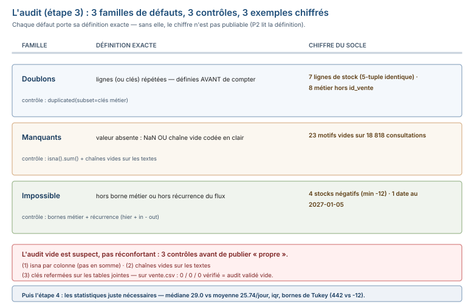

# Module M09.C02 — Audit et premières statistiques : les 3 familles de défauts, l'audit vide est suspect, cadrer l'hypothèse

**Outils : pandas 2.2.3, numpy 2.3.5 (exécutés), DuckDB 1.5.5 (exécuté — le parallèle SQL du
dédoublonnage). Durée indicative : 5 h. Niveau : N3. Prérequis : M09.C01 (le protocole),
M02 (les statistiques descriptives), M07 (le parallèle SQL) utile.**

> **L'idée du chapitre.** C01 a cadré l'analyse (le protocole, la fiche d'entrée). C02 fait
> deux choses, dans l'ordre : **trouver les défauts avant qu'ils ne faussent un chiffre**
> (l'étape 3) et **résumer ce qui reste, juste ce qu'il faut** (l'étape 4) — en **cadrant
> une hypothèse falsifiable** avant de la tester. Le **centre de santé** y fait son entrée
> (18 818 consultations, 12 médicaments, 8 767 lignes de stock quotidien) avec **4 défauts
> plantés et comptables** : 23 motifs manquants, 7 doublons de stock, 1 date dans le futur,
> 4 stocks négatifs. Et la règle du module y est posée : **l'audit qui ne trouve rien est
> suspect, pas réconfortant** — le contrôle du contrôle est une section à part entière.

> **Matériel de l'atelier — Python 3.13 · pandas 2.2.3 · numpy 2.3.5 · DuckDB 1.5.5.** Toutes
> les commandes ont été exécutées dans l'atelier le 20/09/2026 sur
> `03_exercices/dossier_M09/sante/` (graine 45, déterministe, `ATTENDU.json` figé) et sur le
> fil rouge `quincaillerie/` ; les sorties publiées sont **celles de l'atelier**.

---

## 1. Objectifs du chapitre

À la fin de ce chapitre, vous savez :

1. **Classer un défaut dans les 3 familles** (doublons, manquants, valeurs impossibles) et
   nommer le **contrôle** qui le trouve — la matrice du chapitre.
2. **Conduire le contrôle du contrôle** quand l'audit renvoie zéro partout : 3 contrôles
   exécutés, et pourquoi un zéro non contrôlé n'est pas un feu vert.
3. **Chiffrer un défaut avec sa définition exacte** : « 7 doublons » n'est pas une
   définition ; « 7 lignes de `stock_medicament.csv` dont le 5-tuple complet est identique »
   en est une.
4. **Lire `describe()` colonne par colonne** : médiane vs moyenne sur une distribution
   asymétrique, quartiles, **iqr**, bornes de Tukey — et ce qu'un `min` hors du réel dit de
   plus que l'audit.
5. **Cadrer une hypothèse falsifiable** (« si c'est une saisonnalité, les étés doivent
   ressembler plus entre eux qu'à leurs hivers ») **avant** de la tester.

## 2. Pourquoi cette notion est importante

Un défaut non trouvé ne fausse pas « un peu » un chiffre : il fausse **tous** les chiffres
qui passent sur la colonne. Un motif manquant fausse le taux par motif ; un doublon de stock
fausse le taux de rupture ; une date dans le futur fausse la période de la série ; un stock
négatif fausse la médiane. Le protocole le sait : l'étape 3 existe **avant** l'étape 4, et
l'étape 4 existe **avant** les étapes 5 à 10.

Trois faits mesurés sur le socle fixent l'enjeu :

- l'audit du **centre de santé** (le jeu 2, qui arrive ici) trouve **4 familles de défauts
  comptables** : 23 motifs manquants, 7 doublons de stock, 1 consultation datée au
  2027-01-05 (après la fin de la période 2025-01-01 → 2026-12-31), 4 stocks négatifs ;
- le **fil rouge** (la quincaillerie) passe **l'audit vide** : 0 manquant sur 50 008 lignes
  et 13 colonnes — et c'est justement sur lui que le chapitre montre les **3 contrôles** qui
  transforment un zéro en résultat ;
- la statistique n'est pas un verdict : sur les consultations/jour, la **moyenne est 25.74**
  et la **médiane 29.0** — un écart de 3.26 consultations que seule la question métier
  départage (C02 §5.4).

## 3. Explication simple — la conversation avec la machine

Le contrôleur qualité qui reçoit une palette de médicaments fait trois passages, **dans
l'ordre** :

1. **Compter les paquets en trop.** Un même carton deux fois = un doublon ; on le compte,
   on l'étiquette, on ne le jette pas sans écriture. (`duplicated()`)
2. **Chercher les étiquettes qui manquent.** Une case vide sur 18 818 paquets n'est pas un
   détail : c'est une information manquante qu'on comptera et qu'on traitera **après**
   l'audit, pas pendant. (`isna()` — et les chaînes vides que `isna` laisse passer)
3. **Vérifier le possible.** Un stock de −12 boîtes de cotrimoxazole, entre 548 et 541 ?
   Impossible : c'est un défaut **de saisie**, pas un fait de stock. Les bornes métier
   (un stock ne peut pas être négatif) et la **récurrence** (hier + entrées − sorties)
   le prouvent.

Puis, **un seul passage de résumé** : pas 40 statistiques, les 5 qui répondent à la question
métier (« quand le centre est-il saturé ? ») — moyenne, médiane, quartiles, extrêmes, et la
répartition par motif.

Et la leçon du chapitre tient en une phrase : **une boîte vide qu'on n'a pas ouverte n'est
pas une preuve de propreté** — l'audit qui renvoie zéro doit être **re-vérifié** (les bonnes
colonnes ? les bonnes définitions ?), sinon on n'a pas audité.

## 4. Vocabulaire essentiel

| Terme | Définition |
|---|---|
| **iqr** — *interquartile range* | Q3 − Q1 : la largeur du « cœur » de la distribution (les 50 % du milieu), **indépendante des extrêmes** — c'est elle qui cale les bornes de Tukey. |
| **point aberrant** — *outlier* | une observation au-delà d'une borne définie **avant** de chercher (Q3 + 1,5 × iqr, borne métier, comparaison à la période) ; « aberrant » est un statut mesuré, pas une impression. |
| **manquant** | une valeur absente : `NaN` **ou** chaîne vide codée en clair — les deux formes doivent être comptées (C02 §5.1). |
| **borne métier** | une limite dictée par le métier, pas par la statistique : un stock ≥ 0, une note entre 0 et 20, une date dans la période de l'export. |

## 5. Cours approfondi

### 5.1 Les 3 familles de défauts — et le contrôle qui trouve chacune

| Famille | Définition exacte | Contrôle pandas | Exemple chiffré du socle |
|---|---|---|---|
| **doublons** | lignes (ou clés) répétées | `duplicated(subset=…)` | 7 doublons de stock sur 8 767 lignes |
| **manquants** | valeur absente (`NaN` **ou** `""`) | `isna().sum()` + `str.strip().eq("")` | 23 motifs vides sur 18 818 consultations |
| **valeurs impossibles** | hors borne métier ou hors récurrence | bornes métier, `min`/`max`, récurrence | 4 stocks négatifs (min −12) |

Trois précisions qui font la différence entre un audit et une check-list :

- **Les doublons se définissent avant de compter.** `stk.duplicated()` (les 5 colonnes)
  compte 7 sur `stock_medicament.csv` ; mais sur `vente.csv` (fil rouge), le contrôle naïf
  comptait **0** alors que 8 doublons métier existent (C01 §5.3) : le doublon s'y définit
  **hors `id_vente`**, sur les 12 colonnes métier. La définition fait le chiffre.
- **Les manquants ont deux visages.** `isna()` trouve les `NaN` — pas les chaînes vides
  codées en clair. Sur les colonnes texte, le contrôle complet est
  `isna().sum() + str.strip().eq("").sum()`. (Sur `vente.csv`, les deux visages sont vides
  — exécuté au §5.2.)
- **Les valeurs impossibles se prouvent deux fois.** Une fois par la **borne métier**
  (un stock ne peut pas être −12), une fois par la **récurrence** du flux (hier + entrées −
  sorties doit égaler aujourd'hui) — le §6 montre la preuve complète sur M12.

> **Définition.** **borne métier** — une limite dictée par le métier, pas par la
> statistique : un stock ≥ 0, une note entre 0 et 20, une date dans la période de
> l'export. Une valeur hors borne n'est pas « aberrante » au sens statistique : elle est
> **impossible**, et c'est ce statut qui donne droit à la correction (C04), pas à la
> simple suppression.

> **Définition.** **iqr** — *interquartile range* — Q3 − Q1 : la largeur du « cœur » de la
> distribution (le milieu des 50 %), indépendante des extrêmes. C'est elle, pas l'écart-type,
> qui cale les bornes de Tukey [Q1 − 1,5 × iqr ; Q3 + 1,5 × iqr] — sur une distribution
> asymétrique ou bornée, l'écart-type s'emballe, l'iqr non.




### 5.2 L'audit vide est suspect — le contrôle du contrôle

Sur le fil rouge, l'audit « standard » renvoie zéro partout :

```python
v = pd.read_csv("03_exercices/dossier_M09/quincaillerie/vente.csv")
c = pd.read_csv("03_exercices/dossier_M09/quincaillerie/client.csv")
print(int(v.isna().sum().sum()))                        # 0
print(int(v["date_vente"].str.strip().eq("").sum())
      + int(v["date_limite_remise"].str.strip().eq("").sum()))  # 0
print(int(v["id_client"].nunique()), len(c))            # 1200 1200
print(int(len(v.merge(c, on="id_client", how="left")) - len(v)))  # 0
```

```text
0
0
1200 1200
0
```

Le zéro est **vérifié**, pas supposé :

1. **`isna` par colonne, pas en somme** — la somme peut additionner un zéro d'une colonne
   et un manquant d'une autre ; ici, 0 sur **chaque** des 13 colonnes.
2. **Les chaînes vides** — un export qui code « absent » par `""` passe **sourdement**
   `isna` sur une colonne `object` : 0 chaîne vide sur les 2 dates.
3. **Les clés se referment-elles ?** — 1 200 clients distincts = 1 200 lignes de
   `client.csv`, 0 ligne orpheline après le `merge`.

**La règle du chapitre** : un audit qui ne trouve rien est **suspect** tant que ces 3
contrôles n'ont pas passé — parce qu'un zéro peut venir d'un **mauvais contrôle** (mauvaise
colonne, mauvaise définition de doublon, chaîne vide non comptée) autant que d'un fichier
propre. L'audit du fil rouge est **validé vide** : 0 manquant **vérifié**, 8 doublons
métier (hors `id_vente`, C01), et c'est tout.

> **Attention.** Un zéro d'audit n'est pas un résultat, c'est une **hypothèse** :
> « ce fichier n'a pas de manquant » — et une hypothèse non contrôlée (mauvaise colonne,
> chaîne vide non comptée, clé non refermée) est l'erreur la plus chère du chapitre,
> parce que toutes les statistiques d'après partent dessus.

> **Définition.** **manquant** — une valeur absente, sous deux formes : le `NaN` que
> `isna()` compte, et la **chaîne vide** codée en clair que `isna()` laisse passer. Un audit
> complet compte **les deux** — c'est la distinction qui a fait l'erreur « 0 manquant » de
> plus d'un stagiaire sur un export `object`.

### 5.3 Le centre de santé arrive — les 4 défauts, exécutés

Le jeu 2 s'ouvre : `consultation.csv` (18 818 lignes × 7 colonnes), `stock_medicament.csv`
(8 767 lignes × 5 colonnes), `medicament.csv` (12 médicaments × 4 colonnes, dont le seuil
d'alerte). La fiche d'entrée (C01) est faite ; l'audit (étape 3) tourne :

```python
import pandas as pd
s = "03_exercices/dossier_M09/sante"
cons = pd.read_csv(s + "/consultation.csv")
stk = pd.read_csv(s + "/stock_medicament.csv")
print(int(cons["motif"].isna().sum()))                       # manquants
print(int((cons["date_consultation"] > "2026-12-31").sum())) # dates futures
print(int(stk.duplicated().sum()))                           # doublons
print(int((stk["stock_fin"] < 0).sum()))                     # stocks négatifs
```

```text
23
1
7
4
```

Les 4 défauts, **chiffrés avec leur définition exacte** (le format du rapport P2) :

| # | Défaut | Définition exacte | Chiffre |
|---|---|---|---|
| D1 | motifs manquants | `consultation.csv`, colonne `motif`, champ vide | **23** sur 18 818 |
| D2 | doublons de stock | `stock_medicament.csv`, 5-tuple complet identique (date, médicament, entrées, sorties, stock) | **7** sur 8 767 |
| D3 | date dans le futur | consultation hors période de l'export (2025-01-01 → 2026-12-31) | **1** — `C000001`, datée au 2027-01-05 |
| D4 | stock négatif | `stock_fin < 0`, impossible par borne métier | **4** — M05 (−1), M07 (−3), M10 (−2), M12 (−12) |

Deux lectures qui feront la différence au rapport :

- **D3 n'est pas « une anomalie de date »**, c'est une **hypothèse de saisie** : la
  consultation `C000001` porte la première référence du fichier et une date au 2027-01-05 —
  soit une coquille pour 2025-01-05 (la période commence ce jour-là), soit une erreur de
  transcription. L'audit **compte** le défaut ; la correction se décidera **après** (C04),
  avec la preuve.
- **D4 est un défaut de saisie, pas un fait de stock** — le §6 prouve le cas M12 par la
  récurrence. Un stock « négatif » n'existe pas en pharmacie : la valeur est fausse, le
  médicament n'était pas « en dette ».

> **Dans les faits.** L'audit complet du centre de santé (formes + 4 familles + clés :
> 1 500 patients distincts, 6 agents, 12 médicaments tous refermés sur `medicament.csv`)
> prend **une vingtaine de lignes** pandas. Ce qui prend du temps, ce n'est pas le code :
> c'est **écrire chaque définition exacte** — c'est elle qui sera notée au rapport P2.

### 5.4 Premières statistiques — juste ce qu'il faut

L'étape 4 ne résume **pas tout** : elle résume ce que la question métier (« quand le centre
est-il saturé ? ») nécessite. Sur la fréquentation, la distribution des consultations par
jour (exécuté) :

```text
moyenne 25.74 | médiane 29.0 | Q1 19.0 | Q3 33.0 | min 1 | max 44
iqr = 14.0    | bornes de Tukey [−2.0 ; 54.0] | jours hors bornes : 0
```

**Moyenne 25.74, médiane 29.0 — l'écart de 3.26 se lit** : la moyenne est **tirée vers le
bas** par une queue de jours peu consultés (les dimanches du calendrier du centre, min 1).
« Le centre fait 26 consultations par jour » (moyenne) et « la moitié des jours font 29 ou
plus » (médiane) sont **deux phrases vraies et différentes** ; c'est la question métier qui
choisit — pour la saturation, c'est la médiane (le jour typique), pour la capacité
d'achat de médicaments, c'est la moyenne (le total).

`describe()` lu **colonne par colonne**, sur `stock_fin` :

```text
count    8767.00
mean      663.76
std       557.45
min       -12.00
25%       319.00
50%       463.00
75%       607.00
max     2910.00
```

Trois choses à en retenir :

1. **Le `min −12` est un audit, pas une statistique** : `describe()` vient de redécouvrir
   le défaut D4 **sans qu'on lui demande** — c'est le réflexe du chapitre : le `min` et le
   `max` d'un `describe()` se lisent toujours **en premier**.
2. **L'écart-type (557.45) est sans sens ici** : les stocks de 12 médicaments de régimes
   très différents (insuline ~150, paracétamol ~800) sont mélangés dans la même colonne —
   un écart-type sur un mélange de populations ne mesure rien. La statistique « juste
   nécessaire » serait **par médicament** (C04 le fera pour les ruptures).
3. **Les bornes de Tukey se calculent, ne se choisissent pas** : sur M12 seul
   (Q1 518, Q3 566, iqr 48), la borne basse est **446** — c'est-à-dire 518 moins 72, où
   72 est 1,5 fois l'iqr 48 — et **deux** valeurs y tombent dessous : **442** et **−12**.
   La borne ne fait que **signaler** : 442 est un stock bas mais plausible, −12 est
   impossible — la décision (C04) les départage.

> **Attention.** Une borne de Tukey qui **signale** n'est pas une borne qui **décide** :
> 442 et −12 tombent du même côté de 446 et reçoivent deux décisions opposées — la borne
> ouvre l'enquête (C04), elle ne la conclut pas. Supprimer « ce qui dépasse la borne »
> sans preuve métier, c'est transformer un signal en délit.

> **Définition.** **point aberrant** — *outlier* — une observation au-delà d'une borne
> définie **avant** de chercher : Q3 + 1,5 × iqr (Tukey), une borne métier (stock ≥ 0, note
> ≤ 20), ou la comparaison à la période. « Aberrant » est un **statut mesuré** (ici : « 2
> valeurs sous 446 pour M12 »), jamais une impression (« ça fait bizarre »).

La dernière statistique de l'étape 4 est la **répartition** : `value_counts()` sur le motif
(non vide) : paludisme en tête avec 2 417 consultations, et les 7 autres motifs suivent à
quelques dizaines de lignes près — une distribution **plate**, elle-même une information
(centre polyvalent, pas de motif dominant). Le creux du midi (927 consultations à 12:00,
soit 4,9 % des heures alors que 10 tranches horaires donneraient 10 %) est noté, pas
expliqué : c'est du C03.

### 5.5 Cadrer l'hypothèse — la formuler falsifiable avant de la tester

L'étape 8 du protocole est une **discipline d'écriture**, pas de calcul : avant de tester
quoi que ce soit, l'hypothèse se formule de façon à pouvoir **se tromper**. Le gabarit du
module :

> **« Si [mécanisme métier], alors [signature chiffrée dans les données], et [contre-
> exemple qui tuerait l'hypothèse]. »**

Exemple du socle (cadre posé ici, test chiffré au C03) :

> **« Si la fréquentation du centre est saisonnière (saison des pluies), alors les 8 mois
> d'été (juin-sept, 2025 et 2026) doivent ressembler plus entre eux qu'à leurs hivers
> (déc-jan), et un été atypique — disons 20 % sous la moyenne des étés — tuerait
> l'hypothèse. »**

Le test (exécuté, en une ligne, à titre d'annonce — la méthode est au C03) :

```text
moyenne des 8 étés  : 853 consultations/mois
moyenne des hivers  : 655 consultations/mois
autres mois         : 727 consultations/mois
été le plus bas     : 834   | mois max : 2025-07 (882)
```

L'hypothèse est **portée** (853 vs 655, et les 8 étés serrés entre 834 et 882) — mais la
conclusion n'est **pas** « c'est la saison des pluies » : c'est « **les données sont
compatibles avec** une saisonnalité, testée aux étés 2025-2026 » — la conclusion
**provisoire** (C01 §5.5), avec ses limites (2 étés seulement, cause hors fichier).

> **À retenir.** Une hypothèse se **cadre** (une phrase falsifiable, une signature
> chiffrée, un contre-exemple nommé) **avant** de se tester. Tester d'abord, formuler
> après, c'est choisir l'hypothèse qui colle aux chiffres — c'est du C05 §5.2 qu'on
> appelle un **piège d'inférence**.

## 6. Exemple concret — le défaut M12 prouvé par la récurrence

Le stock négatif le plus fort (−12, médicament M12, 2026-11-03) est prouvé défaut de
saisie par **deux preuves indépendantes** (exécuté) :

**Preuve 1 — la borne métier.** Un stock ne peut pas être négatif : la pharmacie n'a pas
« moins de 12 boîtes », elle a **zéro boîte** et une erreur de saisie.

**Preuve 2 — la récurrence du flux.** Le stock suit `hier + entrées − sorties = aujourd'hui`.
Sur les 3 jours autour du défaut :

```text
date        id_medicament  entree  sortie  stock_fin
2026-11-02  M12            0       3       548
2026-11-03  M12            0       3      -12   <-- défaut
2026-11-04  M12            0       4       541
```

548 + 0 − 3 = **545**, pas −12 : la valeur « naturelle » du 2026-11-03 est **545**. Et le
lendemain confirme : 545 − 4 = **541** — la série **continue comme si le défaut n'avait
jamais existé**. Un stock réellement à −12 ne pourrait pas « ressusciter » à 541 le jour
suivant **sans 553 entrées** ; il n'y en a pas. La valeur −12 est un défaut de saisie, et
sa valeur correcte est **déductible** (545) — la correction se décide au C04.

## 7. Démonstration pas à pas — 5 étapes sur le centre de santé

```python
import pandas as pd
s = "03_exercices/dossier_M09/sante"
cons = pd.read_csv(s + "/consultation.csv")
stk  = pd.read_csv(s + "/stock_medicament.csv")
med  = pd.read_csv(s + "/medicament.csv")

# 1 — formes (contrôle de chargement)
print(cons.shape, stk.shape, med.shape)

# 2 — audit consultation : 3 familles + clés
print(int(cons["motif"].isna().sum()),
      int((cons["date_consultation"] > "2026-12-31").sum()),
      int(cons["id_patient"].nunique()))

# 3 — audit stock : 3 familles + récurrence du défaut le plus fort
print(int(stk.duplicated().sum()), int((stk["stock_fin"] < 0).sum()))
m12 = stk[stk["id_medicament"] == "M12"].sort_values("date")
print(m12[m12["date"].between("2026-11-02", "2026-11-04")].to_string(index=False))

# 4 — statistiques : fréquentation + describe du stock
pj = cons.groupby("date_consultation").size()
print(round(pj.mean(), 2), pj.median())
print(stk["stock_fin"].describe().min())

# 5 — cadrage : moyennes par saison (le test est au C03)
cj = pd.to_datetime(cons["date_consultation"])
mj = cons.assign(m=cj.dt.to_period("M")).groupby("m").size()
print(round(mj[mj.index.month.isin([6, 7, 8, 9])].mean()),
      round(mj[mj.index.month.isin([12, 1])].mean()))
```

```text
(18818, 7) (8767, 5) (12, 4)
23 1 1500
7 4
     date id_medicament  entree  sortie  stock_fin
2026-11-02           M12       0       3        548
2026-11-03           M12       0       3        -12
2026-11-04           M12       0       4        541
25.74 29.0
-12.0
853 655
```

## 8. Erreurs fréquentes

1. **Compter les doublons sans les définir** — `duplicated()` (toutes colonnes) vs
   `duplicated(subset=clés métier)` : 0 vs 8 sur `vente.csv` (C01), 7 vs 7 sur le stock.
   La définition précède le chiffre, toujours.
2. **Prendre l'audit vide comme feu vert** — 0 manquant sans les 3 contrôles du §5.2
   (colonnes, chaînes vides, clés) n'est pas un résultat, c'est une **hypothèse** — et
   l'hypothèse la plus chère qu'on puisse laisser courir.
3. **Publier la moyenne seule** — 25.74 de moyenne, 29.0 de médiane : publier l'une sans
   l'autre, c'est choisir **pour** le lecteur. Sur une distribution asymétrique, les deux
   vont, ou aucune ne va seule.
4. **Formuler l'hypothèse après le test** — « les étés font 853, les hivers 655, donc c'est
   saisonnier » : c'est l'hypothèse **choisie pour coller** aux chiffres. Le cadre
   falsifiable (§5.5) est écrit **avant**, et il nommait son contre-exemple.
5. **Traiter l'anomalie à la borne** — « −12 est sous la borne de Tukey, on supprime » :
   la borne **signale**, elle ne **décide** pas. 442 (M12) est aussi sous la borne et est
   un stock plausible — le traitement sans preuve métier, c'est le C04 en avance, fait
   mal.

## 9. Bonnes pratiques professionnelles

1. **L'audit se publie avant la statistique** — le rapport P2 présente d'abord les
   défauts chiffrés (définition exacte + chiffre), ensuite les statistiques : un chiffre
   calculé **avec** des doublons n'a pas besoin d'être présenté, il a besoin d'être
   recalculé.
2. **Chaque défaut porte une définition exacte** — « 7 doublons » n'est pas publiable ;
   « 7 lignes de `stock_medicament.csv` dont le 5-tuple (date, médicament, entrées,
   sorties, stock) est identique » l'est. Le correcteur relit la définition, pas le
   chiffre.
3. **`min` et `max` d'un `describe()` se lisent en premier** — c'est là que les bornes
   métier se trompent (−12) et que les valeurs impossibles se trahissent (22.5 sur 20 au
   C05).
4. **Une statistique, une question** — la médiane pour « le jour typique », la moyenne
   pour « la capacité d'achat », l'iqr pour « la variabilité du cœur » : publier 40
   statistiques sans questions, c'est de l'exploration déguisée en rapport.
5. **L'hypothèse s'écrit, ne se pense pas** — une phrase falsifiable, une signature
   chiffrée, un contre-exemple nommé : ce qui n'est pas écrit n'est pas testable, et ce
   qui n'est pas testable n'entre pas dans la note.

> **Conseil professionnel.** Dans un rapport d'audit, la ligne la plus précieuse n'est pas
> « 7 doublons trouvés », c'est « **7 doublons, donc 8 760 lignes propres après
> dédoublonnage, et voici la ligne qui justifie le `keep`** ». Le chiffre brut est pour
> vous ; le chiffre **traité et justifié** est pour le lecteur.

## 10. Exercice guidé — « les 4 défauts du centre de santé » (25 min, /10)

**Consigne.** Sans ouvrir `ATTENDU.json`, sur `sante/consultation.csv` et
`sante/stock_medicament.csv` :

1. Trouvez et **chiffrez** les 4 familles de défauts (1 pt chacune, 4 pts).
2. Écrivez la **définition exacte** de chacun (1 pt — la définition sans le chiffre ne
   compte pas, le chiffre sans la définition non plus). (3 pts)
3. Pour **D4 (stock négatif)** : donnez la preuve par récurrence du cas le plus fort,
   avec les 3 lignes exécutées. (2 pts)
4. Donnez pour chaque défaut la **décision** du rapport : corriger / exclure en
   documentant / garder en signalant — et en une phrase pourquoi. (1 pt)

## 11. Exercices autonomes

**E1 — Le parallèle SQL du dédoublonnage (20 min).** En DuckDB sur
`stock_medicament.csv` : (1) `COUNT(*)` vs le nombre de 5-tuples distincts (l'écart doit
donner le nombre de doublons) ; (2) une requête unique qui liste les 4 stocks négatifs
(médicament, date, valeur), triée par gravité. Les deux sorties sont publiées telles que
renvoyées par DuckDB.

**E2 — Le faux positif de Tukey (20 min).** Sur M12 : deux valeurs sous la borne basse
(446) — 442 et −12. Pour chacune : statut (point aberrant **confirmé** / simple valeur
basse), la preuve (récurrence ou borne métier), et la décision (corriger / exclure /
garder en signalant). Indice : 442 est **plausible** — trouvez la phrase qui le prouve
sans le chiffre 545.

## 12. Correction détaillée

**Exercice guidé.**

1. **Les 4 familles, exécutées** : 23 motifs vides ; 7 doublons de stock ; 1 date future
   (2027-01-05) ; 4 stocks négatifs (−1, −3, −2, −12).
2. **Les définitions exactes** : celles du tableau §5.3 — le point de vigilance est D2
   (« 5-tuple complet identique », pas « même médicament en double ») et D3 (« hors
   période de l'export », pas « date anormalement tardive »).
3. **La preuve M12** : 548 + 0 − 3 = 545 (la valeur naturelle), pas −12 ; et 545 − 4 =
   541 le lendemain — la série continue **comme si** le défaut n'existait pas. (Les 3
   lignes sont celles du §6.)
4. **Les décisions** : D1 — **garder en signalant** (l'information est perdue, on ne
   l'invente pas : 23 consultations hors des taux par motif) ; D2 — **exclure en
   documentant** (7 lignes supprimées, `keep="first"`, la justification est dans le
   rapport) ; D3 — **exclure de la série temporelle en documentant**, coquille probable
   pour 2025-01-05 (à confirmer avec la source, C04) ; D4 — **garder en signalant** pour
   l'instant, correction **déductible** (545 pour M12) décidée au C04 après la preuve.

**E1.** DuckDB, exécuté :

```text
SELECT COUNT(*), COUNT(DISTINCT (date, id_medicament, entree, sortie, stock_fin))
FROM stock;
     lignes  lignes_distinctes
        8767               8760

SELECT id_medicament, date, stock_fin
FROM stock WHERE stock_fin < 0 ORDER BY stock_fin;
id_medicament    date  stock_fin
           M12 2026-11-03        -12
            M07 2025-10-09         -3
           M10 2026-05-21         -2
           M05 2025-04-18         -1
```

8 767 − 8 760 = **7 doublons** : le parallèle SQL redonne le chiffre pandas (la colonne
vertébrale du module, comme la croisée de M08).

**E2.** **442** — simple valeur basse, **pas** un point aberrant confirmé : c'est un stock
de M12 qui se situe juste sous la borne calculée, mais il est **cohérent avec sa
récurrence** (le jour et le lendemain se referment sur lui) et **plausible en métier**
(M12 tourne autour de 500-560 ; 442 est un jour bas, pas une impossibilité) — décision :
**garder**, rien à signaler au rapport (la borne de Tukey n'est qu'un signal, le métier a
départagé). **−12** — point aberrant **confirmé** par double preuve (borne métier : un
stock négatif n'existe pas ; récurrence : 548 − 3 = 545 ≠ −12 et 545 − 4 = 541) —
décision : **corriger en 545**, la correction étant **déductible** de la récurrence, et le
tout documenté au rapport (C04 formalisera la règle).

## 13. Mini-projet M09.P2 — « Le rapport d'audit en 1 page » (1 h)

**Énoncé.** Le rapport P2 du projet M09.P commence par les étapes 1 à 4 **sur le centre
de santé**, en **une page** :

- les **formes** des 3 tables (1 ligne) ;
- les **4 défauts** : définition exacte + chiffre + décision (corriger / exclure en
  documentant / garder en signalant) (4 lignes) ;
- les **3 statistiques** de fréquentation qui répondent à « quand le centre est-il
  saturé ? » (moyenne, médiane, mois max) (1 ligne) ;
- **1 hypothèse cadrée** (mécanisme, signature chiffrée, contre-exemple) — à tester au
  C03.

Les 30 minutes restantes : auto-évaluation — chaque défaut a-t-il sa **définition** ?
chaque statistique a-t-elle sa **question** ? l'hypothèse est-elle **falsifiable** (son
contre-exemple est-il nommé) ? Un rapport à 80 % dont chaque ligne est justifiée passe ;
une page « complète » dont une définition manque n'est pas un rapport d'audit.

## 14. Boîte à outils du chapitre

> **Boîte à outils.** L'audit : `isna().sum()` (+ `str.strip().eq("")` sur les textes),
> `duplicated(subset=…)` avec sa **définition**, bornes métier et `min`/`max` de
> `describe()`, récurrence du flux. La statistique : `describe()`, `quantile(.25/.75)`,
> `value_counts()`, moyenne **et** médiane ensemble. Le parallèle : `COUNT(*)` vs
> `COUNT(DISTINCT …)` en DuckDB — même nombre, deux écritures.

| Besoin | Commande | Chiffre du socle |
|---|---|---|
| manquants | `col.isna().sum()` | 23 motifs |
| doublons | `df.duplicated(subset=clés).sum()` | 7 lignes de stock |
| hors période | `(col_date > fin_période).sum()` | 1 consultation |
| hors borne | `(col < 0).sum()` | 4 stocks |
| récurrence | `hier + entree − sortie == aujourd'hui ?` | 545 ≠ −12 (M12) |
| forme du cœur | `quantile(.75) − quantile(.25)` | iqr 14 (consultations/jour) |

## 15. Résumé du chapitre

L'étape 3 du protocole (détecter les problèmes) et l'étape 4 (premières statistiques)
sont exécutées sur le centre de santé, qui fait son entrée dans le module : **4 familles
de défauts comptables** (23 motifs manquants, 7 doublons de stock sur 8 767 lignes, 1
consultation datée au 2027-01-05, 4 stocks négatifs dont −12) — chacune avec sa
**définition exacte**, son chiffre, et sa décision (garder en signalant, exclure en
documentant). Le défaut M12 est prouvé **défaut de saisie** par deux preuves
indépendantes : la borne métier (un stock négatif n'existe pas) et la récurrence
(548 − 3 = 545, pas −12 ; le lendemain, 545 − 4 = 541 — la série continue comme si le
défaut n'existait pas). Sur le fil rouge, l'**audit vide** est validé par les 3 contrôles
du chapitre (colonnes, chaînes vides, clés refermées) : un zéro non contrôlé n'est pas un
feu vert, c'est une hypothèse. La statistique n'est pas un verdict : moyenne 25.74 et
médiane 29.0 consultations/jour coexistent (distribution à queue basse), le `min −12`
d'un `describe()` redécouvre l'audit, et l'iqr cale des bornes qui **signalent** (442 et
−12 sous 446 pour M12) sans **décider**. Le chapitre se termine sur la discipline
d'écriture : une hypothèse se **cadre falsifiable avant de se tester** — la saisonnalité
du centre (étés 853 vs hivers 655 consultations/mois) est posée ainsi, test chiffré au
C03.

## 16. À retenir

> **À retenir.** L'audit **avant** la statistique, la statistique **avant** l'hypothèse
> testée, et l'hypothèse cadrée **avant** d'être testée : c'est l'ordre des étapes 3, 4 et
> 8, et c'est tout le chapitre. Chaque défaut porte sa définition exacte, chaque zéro ses
> 3 contrôles, chaque statistique sa question métier.

1. **3 familles de défauts, 3 contrôles** : doublons (`duplicated(subset=…)` **défini**
   avant), manquants (`isna` **+ chaînes vides**), valeurs impossibles (borne métier +
   récurrence).
2. **L'audit vide est suspect** tant que les 3 contrôles du contrôle n'ont pas passé :
   colonnes, chaînes vides, clés refermées.
3. **Chaque défaut porte une définition exacte** — « 7 doublons » n'est pas publiable,
   « 7 lignes dont le 5-tuple est identique » l'est.
4. **`min`/`max` d'un `describe()` se lisent en premier** — c'est là que le métier se
   trompe dans la saisie (−12).
5. **Moyenne et médiane vont ensemble** — 25.74 vs 29.0 : l'écart est une information
   (queue de jours bas), pas un bug.
6. **La borne signale, le métier décide** — 442 est sous la borne et plausible ; −12 est
   sous la borne et impossible : même test, deux décisions.
7. **Une hypothèse se cadre avant de se tester** — mécanisme, signature chiffrée,
   contre-exemple nommé ; l'été 20 % sous la moyenne tuerait la saisonnalité.
8. **Le parallèle SQL redonne le chiffre** — `COUNT(*)` 8 767 vs `COUNT(DISTINCT)`
   8 760 : 7 doublons, comme en pandas.

## 17. Évaluation formative (auto-correction, 8 min)

1. **Pourquoi `duplicated()` sans argument a-t-il compté 0 sur `vente.csv` alors que le
   socle porte 8 doublons ?**
   → les 8 doublons sont identiques sur les 12 colonnes métier mais portent des
   `id_vente` différents : le contrôle doit être
   `duplicated(subset=<12 colonnes métier>)`. (2 pts)
2. **Un audit renvoie 0 manquant sur toutes les colonnes. Que faites-vous avant de
   publier « fichier propre » ?**
   → les 3 contrôles du contrôle : `isna` par colonne (pas en somme), chaînes vides sur
   les colonnes texte, clés refermées sur les tables jointes. (2 pts)
3. **Pourquoi la consultation `C000001` datée au 2027-01-05 est-elle une « hypothèse de
   saisie » et non une « anomalie de date » ?**
   → c'est la première référence du fichier et la période commence au 2025-01-05 : la
   coquille 2025-01-05 est la lecture la plus probable — l'audit compte, la correction
   se décide après preuve (C04). (2 pts)
4. **Le stock M12 vaut −12 le 2026-11-03, entre 548 et 541. Donnez la preuve par
   récurrence.**
   → 548 + 0 − 3 = 545 (valeur naturelle), pas −12 ; et 545 − 4 = 541 le lendemain : la
   série continue comme si le défaut n'existait pas — un stock à −12 ne « ressuscite »
   pas sans 553 entrées. (2 pts)
5. **Moyenne 25.74, médiane 29.0 consultations/jour. Que dit l'écart, et quelle
   statistique pour « le jour typique » ?**
   → une queue de jours peu consultés tire la moyenne vers le bas (les dimanches, min 1) ;
   « le jour typique » se lit à la **médiane** (29 ou plus le moitié des jours). (2 pts)
6. **Pourquoi l'écart-type de `stock_fin` (557.45) est-il « sans sens » ?**
   → la colonne mélange 12 médicaments de régimes très différents (insuline ~150,
   paracétamol ~800) : un écart-type sur un mélange de populations ne mesure rien — la
   statistique juste est **par médicament**. (2 pts)
7. **M12 a deux valeurs sous la borne basse de Tukey (446) : 442 et −12. Quelle décision
   pour chacune, et pourquoi la borne n'a pas départagé ?**
   → 442 : garder (cohérent avec sa récurrence, plausible en métier) ; −12 : corriger en
   545 (preuve double). La borne **signale**, le métier **décide** — c'est la récurrence
   et la borne métier qui départagent. (2 pts)
8. **Écrivez le cadre falsifiable de l'hypothèse « la fréquentation est saisonnière »,
   avec son contre-exemple.**
   → « Si saison des pluies, les 8 étés ressemblent plus entre eux qu'aux hivers (déc-jan) ;
   un été 20 % sous la moyenne des étés tue l'hypothèse » — signé, chiffré, testable. (2 pts)
