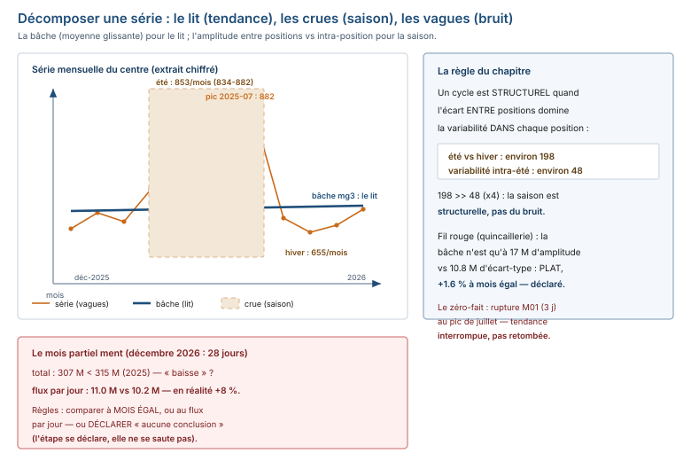

# Module M09.C03 — Tendances : la série, la saison, le bruit — et les périodes qu'on a le droit de comparer

**Outils : pandas 2.2.3, numpy 2.3.5 (exécutés), DuckDB 1.5.5 (exécuté — le parallèle SQL des
tendances). Durée indicative : 5 h. Niveau : N3. Prérequis : M09.C01-C02 (protocole, audit),
M02 (statistiques), M08 C08 (`resample`, `set_index`), M07 (le `GROUP BY mois` SQL) utile.**

> **L'idée du chapitre.** L'étape 5 du protocole pose la question : **« ça monte, ça descend,
> ça cycle ? »** C03 y répond avec une discipline : décomposer une série en **tendance /
> saisonnalité / bruit** (à l'œil **et** au chiffre), ne comparer que des périodes **à
> taille égale** (le 28 décembre du socle est le contre-exemple chiffré), et savoir
> déclarer une tendance **absente** — la quincaillerie du fil rouge est quasi plate, et
> c'est exactement ce que le chapitre doit apprendre à dire. Le centre de santé, lui,
> porte la vraie saisonnalité : le pic de juillet (882 consultations), le creux du dimanche
> (405) et du midi (927), et la rupture de stock qui **coupe** une tendance sans la
> **retomber**.

> **Matériel de l'atelier — Python 3.13 · pandas 2.2.3 · numpy 2.3.5 · DuckDB 1.5.5.** Toutes
> les commandes ont été exécutées dans l'atelier le 20/09/2026 sur
> `03_exercices/dossier_M09/` (graine 45, déterministe, `ATTENDU.json` figé) ; les sorties
> publiées sont **celles de l'atelier**.

---

## 1. Objectifs du chapitre

À la fin de ce chapitre, vous savez :

1. **Construire la série simple** en pandas : `set_index` + `resample` (le `'ME'` de M08) —
   et reconstruire la vue mensuelle de M07/M08 (120 lignes : 5 magasins × 24 mois) sans SQL.
2. **Décomposer une série** en tendance, saisonnalité et bruit — à l'œil (moyenne
   glissante) **et** au chiffre (amplitude de la saison vs variabilité résiduelle).
3. **Comparer des périodes à taille égale** : à mois égal, au flux par jour — et identifier
   la **période partielle** qui ment (le décembre 2026 du socle, arrêté au 28).
4. **Lire la saisonnalité du jour de semaine et de l'heure** (`dayofweek == 6`, rappel
   M08) : le dimanche du centre (405 consultations), la journée type, le creux du midi.
5. **Distinguer structurel et bruit** — et **déclarer l'absence** de tendance (une étape
   vide se déclare, C01) : la quincaillerie n'a pas de saison des fêtes, et ça se dit.
6. **Reconnaître la tendance interrompue** : la rupture de stock qui coupe la courbe sans
   la retomber (M02, 5 jours à zéro — la demande revient au même niveau au restock).

## 2. Pourquoi cette notion est importante

Toutes les décisions de prévision de capacité partent de la lecture d'une courbe :
commander des médicaments pour l'été, prévoir du personnel pour le pic du matin, arbitrer
un budget magasin par magasin. Une lecture fausse de la tendance — prendre le bruit pour
une saison, la saison pour une dérive, une période partielle pour une année — transforme
une exploration en **erreur de prévision** : le centre de santé qui achète à l'aveugle
sur juillet 2025 fera le stock de toute la saison des pluies sur un seul mois.

Trois faits mesurés sur le socle fixent l'enjeu :

- la **quincaillerie** (fil rouge) est **quasi plate** : 24 mois entre 313 M et 348 M de
  FCFA (écart-type 10.8 M), **pas de pic de fin d'année** (décembre 2025 : 315 M,
  janvier 2026 : 330 M), et une dérive de **+1.6 % à mois égal** (2026/2025) — ce
  chapitre doit apprendre à **dire** « plat », pas à inventer une saison ;
- le **centre de santé** (jeu 2, arrivé en C02) porte la saisonnalité **structurelle** :
  les 8 mois d'été (juin-sept) font en moyenne **853** consultations par mois contre
  **655** pour les hivers — un écart d'environ 198, **quatre fois** la variabilité
  intra-été (834 à 882) ;
- le **28 décembre 2026** : la base s'arrête là — décembre 2026 fait 307 M « au total »
  (donc « en baisse » vs 315 M en 2025), mais par **jour** il fait 11.0 M contre
  10.2 M : **+8 %**, pas une baisse. La période partielle est le mensonge du chapitre.

## 3. Explication simple — la conversation avec la machine

La machine est un **fleuve** vu du pont, et la question « ça monte, ça descend, ça cycle ? »
s'en répond en séparant **trois choses** :

1. **Le lit du fleuve** (la tendance) : le niveau moyen sur la durée. Ici : le CA de la
   quincaillerie monte d'environ 1.6 % en un an, à mois égal — un lit qui s'élève à peine.
2. **Les crues saisonnières** (la saisonnalité) : le niveau qui revient **chaque cycle**,
   au même endroit. Ici : le centre de santé crue chaque été (paludisme, fièvre, diarrhées
   de la saison des pluies) — juillet 2025 : 882 consultations, le pic de la série.
3. **Les vagues** (le bruit) : le tremblement du niveau **sans cycle**. Ici : les mois qui
   s'égarent de ±10 M FCFA autour de la moyenne 328 M — du vent, pas une saison.

La moyenne glissante est la **bâche à vagues** : on l'étale sur 3 mois, les vagues
s'effacent, le lit et les crues restent. Et la règle d'or du chapitre : **on ne compare
jamais deux portions de fleuve de longueurs différentes** — décembre 2026 compte 28 jours,
décembre 2025 en compte 31 : « 307 M < 315 M » n'est pas une baisse, c'est une mesure
inégale.

## 4. Vocabulaire essentiel

| Terme | Définition |
|---|---|
| **tendance** | la pente de fond de la série (ce qui reste quand on a retiré les cycles) : lecture par la moyenne glissante et la comparaison à période égale. |
| **saisonnalité** | *saisonnalité* — la variation **régulière et prévisible** liée au cycle (saison, mois, jour de semaine, heure) : elle revient au même endroit du cycle, c'est ce qui la rend exploitable. |
| **bruit** | la variabilité **sans cycle** : ce que la moyenne glissante lisse — on ne le « prédit » pas, on le borne (amplitude, écart-type). |
| **moyenne glissante** — *moving average* — la moyenne calculée sur une **fenêtre** glissante (ici 3 mois) : chaque point résume la fenêtre, les vagues s'effacent, le lit reste. | |

## 5. Cours approfondi

### 5.1 La série simple — `set_index` + `resample` (le `'ME'` de M08)

La vue mensuelle de M07/M08 se reconstruit en pandas **sans SQL** (exécuté, fil rouge) :

```python
import pandas as pd
v = pd.read_csv("03_exercices/dossier_M09/quincaillerie/vente.csv",
                parse_dates=["date_vente"])
v["ct"] = (v["montant_ttc"] * 100).round().astype("int64")   # centimes : exact
sans = v[~v["est_retour"]]                                   # définition M07 : sans retours
vue = sans.groupby([sans["date_vente"].dt.to_period("M"), "id_magasin"])["ct"].sum() // 100
print(len(vue.reset_index()), "lignes")
print(vue.nlargest(1).to_string())
```

```text
120 lignes
montant_ttc
2025-08    3    78965529
```

**120 lignes : 5 magasins × 24 mois** — la vue M07 est une vue **par magasin**, et la plus
grosse cellule est **2025-08 × magasin 3 = 78 965 529 FCFA** (le `S2` de M07 C08), sans
retours. Le parallèle SQL redonne le même nombre, exécuté en DuckDB :

```sql
SELECT strftime(date_vente, '%Y-%m') AS mois, id_magasin,
       CAST(SUM(CASE WHEN NOT est_retour THEN ct ELSE 0 END)/100 AS BIGINT) AS ca
FROM vente GROUP BY 1, 2 ORDER BY ca DESC LIMIT 1;
-- 2025-08 | 3 | 78965529
```

Même nombre, deux écritures — la colonne vertébrale du module, comme le dédoublonnage en
C02 : `GROUP BY mois` (M07) et `resample`/`groupby` (pandas) produisent la même série.

> **Définition.** **tendance** — la pente de fond de la série : ce qui reste quand on a
> retiré les cycles. Elle se lit à la **moyenne glissante** (qui lisse les vagues) et à la
> **comparaison à période égale** (à mois égal, au flux par jour) — jamais sur des totaux
> de périodes inégales.

### 5.2 Décomposer tendance / saisonnalité / bruit — à l'œil et au chiffre

La moyenne glissante 3 mois sur la vue mensuelle (exécuté, extraits) :

```text
2025-03  328 M | mg3 330 M      2026-04  335 M | mg3 336 M
2025-08  346 M | mg3 326 M      2026-06  348 M | mg3 337 M
2025-12  315 M | mg3 322 M      2026-12  307 M | mg3 324 M
```

**Lecture à l'œil** : les vagues (312–348 M) s'effacent sous la bâche (320–337 M) — et la
bâche **ne cycle pas** : pas de creux de décembre, pas de crête d'été. La série est plate
avec une très légère dérive.

**Lecture au chiffre** — c'est elle qui départage structurel et bruit :

- l'**amplitude brute** (min-max) de la série est de 41 M FCFA autour d'une moyenne de
  328 M ;
- l'**amplitude de la bâche** n'est que de 17 M : les 2/3 de l'amplitude sont du **vent**
  (bruit), pas du cycle ;
- l'**écart-type** des 24 mois est de 10.8 M, et la **comparaison à mois égal** 2026/2025
  tourne autour de **1.0** (de 0.963 à 1.120, moyenne 1.016) : une dérive de +1.6 % en un
  an, pas une pente.

**La règle du chapitre** : un cycle est **structurel** quand l'écart **entre** ses
positions (été vs hiver) est **grand** comparé à la variabilité **dans** chaque position.
Sur le centre de santé (exécuté) : les 8 étés sont serrés entre 834 et 882 (variabilité
d'environ 48), et les hivers tournent autour de 655 — l'écart entre positions (≈ 198)
**domine** la variabilité intra-position : la saisonnalité est **structurelle**, pas du
bruit qui ressemble à une saison.

> **Définition.** **moyenne glissante** — *moving average* — la moyenne calculée sur une
> **fenêtre glissante** (ici 3 mois) : chaque point résume sa fenêtre, les vagues
> s'effacent, le lit et les crues restent. Sa fenêtre se **déclare** dans la légende
> (3 mois, pas 6) : une bâche sans fenêtre est une moyenne sans définition.
>
> **Définition.** **bruit** — la variabilité **sans cycle** : ce que la moyenne glissante
> lisse. On ne le « prédit » pas, on le **borne** (amplitude brute, écart-type) — et on
> vérifie qu'il est **petit** devant l'écart entre positions avant de parler de cycle.

> **Attention.** Ne pas forcer une saison sur une série plate : la quincaillerie n'a pas
> de pic décembre/janvier (315 M / 330 M, sous la moyenne 328 M) — dire « c'est la
> saison des fêtes » parce que « normalement il y en a une », c'est importer la saison
> d'un autre jeu dans les données. Le cycle se **mesure** (amplitude entre positions vs
> variabilité intra-position), il ne se présuppose pas.

> **Définition.** **saisonnalité** — *saisonnalité* — la variation **régulière et
> prévisible** liée au cycle (saison, mois, jour de semaine, heure) : elle revient **au
> même endroit du cycle**, c'est ce qui la rend exploitable pour la prévision. Un pic
> qui revient chaque juillet est de la saison ; un pic qui revient « de temps en temps »
> est un événement (C04), pas une saison.




### 5.3 Comparer des périodes à taille égale — le 28 décembre qui ment

Le socle s'arrête au **2026-12-28** : décembre 2026 compte **28 jours**, décembre 2025 en
compte 31. La comparaison « naïve » des totaux (exécuté) :

```text
décembre 2025 : 315 M FCFA sur 31 jours
décembre 2026 : 307 M FCFA sur 28 jours     <-- « en baisse » ?
CA par jour 2025 : 10.2 M FCFA
CA par jour 2026 : 11.0 M FCFA              --> en réalité : +8 %
```

Le total dit « baisse », le **flux par jour** dit « hausse de 8 % » : c'est la **période
partielle** qui ment, pas les données. Les deux règles du chapitre :

1. **À mois égal** pour comparer deux années : 2026/2025 mois par mois, les ratios vont
   de 0.963 à 1.120 (moyenne 1.016) — on compare janvier à janvier, pas « l'année 2026 »
   à « l'année 2025 » quand l'une des deux n'est pas finie.
2. **Au flux par jour** pour comparer des mois inégaux (28 vs 31 jours) — ou, mieux, on
   **ne compare pas du tout** et on le dit : « décembre 2026 est partiel, aucune
   conclusion de tendance » — l'étape se déclare, elle ne se saute pas (C01).

> **À retenir.** Avant de comparer deux périodes, on les **pèse** : combien de jours
> chacune contient-elle ? 31 vs 28, 365 vs 362 — si elles ne pèsent pas le même, on
> compare **à mois égal**, **au flux par jour**, ou on **déclare** la comparaison
> impossible. Pesez avant de peser.

> **Attention.** Un total de période partielle est une **mesure inégale** : 307 M sur 28
> jours n'est pas « un décembre de 307 M ». Comparer 2025 (365 jours) et 2026 (362 jours
> dans le socle) « en tout », c'est comparer deux portions de fleuve de longueurs
> différentes — et conclure sur la différence.

### 5.4 La saisonnalité du jour de semaine et de l'heure — le centre de santé

Le rappel `dayofweek == 6` de M08 trouve ici sa vraie utilisation : les 18 818
consultations réparties par jour de semaine (exécuté) :

```text
lundi    3710    jeudi   3100    dimanche    405
mardi    3290    vendredi 1872   (uniforme : 2688/jour)
mercredi 3249    samedi   3192
```

**Le dimanche du centre fait 405 consultations contre 3 710 le lundi** — environ 1/9 du
lundi, et 15 % de ce que donnerait une répartition uniforme (2 688) : le centre est
**presque fermé le dimanche**, mais pas tout à fait (405, pas 0) — c'est la saisonnalité
du jour, structurelle comme la saison (elle revient chaque semaine).

La **journée type** (10 heures de 08:00 à 17:00, exécuté) :

```text
08:00  1673   10:00  2203   12:00   927   14:00  2126
09:00  2319   11:00  2044   13:00  1085   15:00  2119
16:00  2030   17:00  2292
```

Le pic est le **matin** (09:00 : 2 319), le creux est le **midi** (12:00 : **927** —
4.9 % des consultations contre 10 % attendus en répartition uniforme), et l'après-midi est
**stable** (2 030 à 2 292). Une journée type, c'est une saisonnalité **d'heure** : elle
réorganise les gardes, pas les stocks.

### 5.5 La tendance interrompue — la rupture qui coupe sans retombée

Le stock M02 (paracétamol) autour du 2026-03-02 (exécuté) :

```text
date        id_medicament  entree  sortie  stock_fin
2026-02-28  M02              0      7     1288
2026-03-01  M02              0     11     1277
2026-03-02  M02            100    1377        0   <-- tout le stock sort
2026-03-03  M02              0      0        0   <-- 5 jours à zéro
2026-03-04  M02              0      0        0
2026-03-05  M02              0      0        0
2026-03-06  M02              0      0        0
2026-03-07  M02             68      7       61   <-- le restock, la demande revient
2026-03-08  M02              0      4     1344
2026-03-09  M02              0     11     1333
```

La lecture **tendancielle** : les sorties (la demande) faisaient environ 7/jour en
février (moyenne 6.7) — pendant les 5 jours de rupture, elles sont **nulles** (on ne
distribue pas ce qu'on n'a pas) — et elles **reviennent** au même niveau au restock
(7, 4, 11 les trois jours suivant ; moyenne de mars hors rupture : 5.6/jour). La courbe
des sorties plonge à zéro **non pas parce que la demande est retombée, mais parce que
l'offre est coupée** : c'est une **tendance interrompue, pas une tendance retombée** —
confondre les deux, c'est prévoir une baisse de fréquentation qui n'existe pas.

La rupture M01 (3 jours, 2025-07-14 → 2025-07-16) est le même mécanisme **au pire
moment** : pendant le **pic de juillet** (882 consultations, le mois max de la série) —
la lecture tendancielle est identique (la demande revient au restock), la **décision
métier** est au C04 : une rupture de paracétamol en saison des pluies est un signal à
traiter, pas un chiffre à corriger.

> **Dans les faits.** Sur le fil rouge, l'étape « tendances » se termine par une
> **déclaration vide** : « aucune saisonnalité détectée — contrôle : amplitude de la
> bâche 17 M vs écart-type 10.8 M, ratios à mois égal 0.963–1.120, pas de pic
> décembre/janvier (315 M / 330 M) ». C'est une étape **vide, déclarée** — pas une étape
> passée : le protocole (C01) le distinguait, le rapport le prouve.

## 6. Exemple concret — la quincaillerie : dire « plat », et le prouver

Le fil rouge traverse l'étape 5 en entier (exécuté, sans retours, définition M07) :

1. **La série** : 24 mois, 307 à 348 M FCFA, moyenne 328 M, écart-type 10.8 M ; la vue
   par magasin fait **120 lignes**, plus grosse cellule **78 965 529 FCFA** (2025-08,
   magasin 3) — le même nombre que le `GROUP BY` de M07.
2. **Le lit** : la moyenne glissante 3 mois tourne entre 320 et 337 M — **pas de cycle**
   sous la bâche ; la comparaison à mois égal 2026/2025 (moyenne 1.016, de 0.963 à
   1.120) donne la seule tendance **mesurable** : **+1.6 % en un an**.
3. **La saison déclarée absente** : décembre 2025 (315 M) et janvier 2026 (330 M) ne
   montent **pas** au-dessus de la moyenne — **pas de saison des fêtes dans ces
   données** ; l'hypothèse « fin d'année » est testée et **rejetée sur la période**,
   avec le chiffre qui la rejette (315 < 328, la moyenne).
4. **Le mois partiel** : décembre 2026 (307 M sur 28 jours) ne se compare **pas** à
   décembre 2025 « au total » ; au flux par jour, c'est +8 % — et la conclusion honnête
   est « décembre 2026 partiel : aucune conclusion de tendance ».

## 7. Démonstration pas à pas — 5 étapes sur les deux jeux

```python
import pandas as pd
s = "03_exercices/dossier_M09"
v = pd.read_csv(s + "/quincaillerie/vente.csv", parse_dates=["date_vente"])
c = pd.read_csv(s + "/sante/consultation.csv", parse_dates=["date_consultation"])

# 1 — la série mensuelle (fil rouge, sans retours)
v["ct"] = (v["montant_ttc"] * 100).round().astype("int64")
vt = v[~v["est_retour"]].groupby(
    v["date_vente"].dt.to_period("M"))["ct"].sum() // 100
print(len(vt), "mois | moyenne M:", round(vt.mean() / 1e6))

# 2 — la bâche : moyenne glissante 3 mois
mg3 = vt.rolling(3).mean()
print("amplitude brute M:", round((vt.max() - vt.min()) / 1e6),
      "| amplitude mg3 M:", round((mg3.max() - mg3.min()) / 1e6))

# 3 — à mois égal 2026/2025
r = vt[vt.index.year == 2026].values / vt[vt.index.year == 2025].values
print("ratios 2026/2025 : min", round(r.min(), 3), "| max", round(r.max(), 3),
      "| moyenne", round(r.mean(), 3))

# 4 — le mois partiel : flux par jour
d26 = v[(v["date_vente"] >= "2026-12-01")]["ct"].sum() / 100 / 28
d25 = v[(v["date_vente"] >= "2025-12-01") & (v["date_vente"] < "2026-01-01")]["ct"].sum() / 100 / 31
print("CA/jour déc26 M:", round(d26 / 1e6, 1), "| déc25 M:", round(d25 / 1e6, 1))

# 5 — la saison du centre : jour de semaine + heure
c["dw"] = c["date_consultation"].dt.dayofweek
print(c.groupby("dw").size().to_dict())
print(c.groupby("heure").size().loc["12:00"])
```

```text
24 mois | moyenne M: 328
amplitude brute M: 41 | amplitude mg3 M: 17
ratios 2026/2025 : min 0.963 | max 1.12 | moyenne 1.016
CA/jour déc26 M: 11.0 | déc25 M: 10.2
{0: 3710, 1: 3290, 2: 3249, 3: 3100, 4: 3192, 5: 1872, 6: 405}
927
```

## 8. Erreurs fréquentes

1. **Forcer une saison sur une série plate** — la quincaillerie n'a pas de pic de
   décembre (315 M) : dire « c'est de la saisonnalité des fêtes » parce que « normalement
   il y en a », c'est importer une saison **d'un autre jeu** dans les données. Le cycle se
   **mesure** (amplitude entre positions vs variabilité intra-position), il ne se
   **présuppose** pas.
2. **Comparer des périodes inégales** — 307 M (28 jours) vs 315 M (31 jours) « en
   baisse » ; l'année 2026 (362 jours dans le socle) vs 2025 « en tout » : chaque total
   de période partielle est une mesure inégale, et chaque comparaison d'inégaux est une
   **conclusion fausse avec de vrais chiffres**.
3. **Lire la tendance sur le bruit** — un mois à 348 M (juin 2026) suivi d'un mois à 327 M
   n'est pas « ça descend » : c'est de l'amplitude (±10 M autour de 328) — la bâche (17 M
   d'amplitude sur la moyenne glissante) est là pour le dire avant l'œil.
4. **Confondre tendance interrompue et tendance retombée** — les sorties de M02 tombent à
   0 pendant 5 jours : ce n'est pas une chute de la demande, c'est une offre coupée (la
   demande revient à 7/jour au restock) — la prévision qui en déduirait une baisse de
   fréquentation commanderait trop pour mars.
5. **Oublier le jour de semaine** — une moyenne « par jour » qui mélange dimanches (405)
   et lundis (3 710) dilue la saisonnalité la plus forte du jeu santé : la série **par
   jour de semaine** précède la série par date, ou elle la trahit.

## 9. Bonnes pratiques professionnelles

1. **La série se construit avant d'être lue** : définition de l'agrégat (sans retours ?),
   de la granularité (mois), du périmètre (magasins) — la vue mensuelle de M07 se
   reconstruit en 3 lignes **si la définition est la même** ; sinon le nombre ne retombe
   pas (78 965 529 exige « sans retours »).
2. **Tendance = bâche + comparaison à période égale** — les deux lectures, ensemble : la
   moyenne glissante pour le lit, le ratio à mois égal pour la pente ; l'une sans l'autre
   est une impression.
3. **Un cycle se prouve par l'amplitude** — écart entre positions (été vs hiver : 198)
   vs variabilité intra-position (été : 48) : le premier doit **dominer** le second,
   sinon c'est du bruit qui ressemble à une saison.
4. **Le mois partiel se déclare, ne se compare pas** — « décembre 2026 : 28 jours,
   aucune conclusion de tendance ; au flux par jour, +8 % » — les deux phrases, c'est la
   pratique complète.
5. **L'étape vide se déclare avec ses contrôles** — « aucune saisonnalité détectée :
   amplitude de la bâche 17 M vs 10.8 M d'écart-type, ratios 0.963–1.120 » : la négation
   prouvée vaut plus qu'une courbe vague.

> **Conseil professionnel.** Le graphique de tendance d'un rapport P3 porte **trois
> lignes**, pas une : la série brute (les vagues), la moyenne glissante (le lit), et la
> saison attendue (les crues) — quand la troisième n'existe pas, on le **dit** sur le
> graphique, et on ne la dessine pas. Un graphique à une ligne invite le lecteur à inventer
> ce que vous n'avez pas prouvé.

## 10. Exercice guidé — « lire la saison du centre de santé » (25 min, /10)

**Consigne.** Sur `sante/consultation.csv` (18 818 lignes, défauts C02 déjà audités) :

1. Construisez la série **par mois** de consultations (1 pt).
2. Donnez les **8 étés** (juin-sept, 2025 et 2026) et les **hivers** (déc-jan) : leur
   moyenne, leur amplitude — et concluez si la saisonnalité est **structurelle** ou du
   bruit, avec les deux chiffres qui le départagent (3 pts).
3. Montrez la saisonnalité **du jour de semaine** : la valeur du dimanche, celle du lundi,
   et ce que donnerait une répartition uniforme (2 pts).
4. Donnez la **journée type** : l'heure de pic, l'heure de creux, la valeur du creux, et
   l'attendu uniforme (2 pts).
5. En une phrase : qu'est-ce que cette saisonnalité change **concrètement** au centre
   (1 pt) ?

## 11. Exercices autonomes

**E1 — Le parallèle SQL des tendances (20 min).** En DuckDB sur `quincaillerie/vente.csv` :
(1) la série mensuelle du CA **sans retours** (24 lignes) ; (2) la plus grosse cellule
(mois, magasin) — elle doit retomber sur 78 965 529 ; (3) les ratios 2026/2025 à mois
égal (min, max, moyenne). Les trois sorties sont publiées telles que renvoyées.

**E2 — La rupture qui coupe (20 min).** Sur `sante/stock_medicament.csv`, médicament M02 :
(1) listez les jours de rupture (stock à zéro) et leurs dates ; (2) comparez le niveau des
sorties **avant** (février 2026) et **après** (mars 2026, hors rupture) la rupture ;
(3) concluez : tendance retombée ou tendance interrompue, avec les deux chiffres qui le
prouvent ; (4) en une phrase, ce que la prévision de mars 2027 **ne doit pas** en
déduire.

## 12. Correction détaillée

**Exercice guidé.**

1. **La série par mois** : `groupby(to_period("M")).size()` — 24 mois, de 2025-01 à
   2026-12, **décembre 2026 partiel** (28 jours) : on le garde dans la série et on le
   **déclare** partiel (§5.3), on ne le compare pas « au total ».
2. **Étés vs hivers** : moyenne des 8 étés **853** consultations/mois, amplitude
   834–882 (≈ 48) ; hivers (déc-jan) **655** ; l'écart entre positions (≈ 198) domine la
   variabilité intra-été (48) d'un facteur ~4 → **structurelle**.
3. **Jour de semaine** : dimanche **405**, lundi **3 710**, uniforme **2 688** (18 818 / 7)
   — le dimanche est à 15 % de l'uniforme : le centre est presque fermé, pas fermé.
4. **Journée type** : pic **09:00** (2 319), creux **12:00** (**927** = 4.9 % contre
   10 % attendu uniformément sur les 10 heures) — le creux est le double de l'écart
   attendu : c'est un creux réel, pas du bruit.
5. **Le concret** : les gardes et la distribution des médicaments se calent sur le pic du
   matin et l'été (paludisme/fièvre) — pas sur « la moyenne du jour », qui dilue tout.

**E1.** DuckDB, exécuté :

```text
-- (1) série mensuelle sans retours : 24 lignes, 2025-01 → 2026-12
-- (2) plus grosse cellule :
2025-08 | 3 | 78965529
-- (3) ratios 2026/2025 à mois égal (self-join sur mois) :
min 0.963 | max 1.12 | moyenne 1.016
```

Le `GROUP BY mois` de M07 et le `groupby(to_period("M"))` pandas redonnent **la même
série** : même nombre, deux écritures — la constance du socle (empreinte
`b9a8d973119342ec…`, 19 totaux = M07/M08) passe encore une fois par la porte des
tendances.

**E2.** (1) Rupture M02 : **5 jours**, du **2026-03-02 au 2026-03-06** (stock à zéro ;
le 2026-03-02, tout le stock sort en une sortie unique, ce que le C04 qualifiera).
(2) Sorties/jour : **6.7** en février 2026, **5.6** en mars 2026 hors rupture — même
niveau (l'écart de 1.1/jour est de l'ordre du bruit quotidien). (3) **Tendance
interrompue, pas retombée** : pendant la rupture, les sorties sont **nulles par
contrainte d'offre** (on ne distribue pas ce qu'on n'a pas) ; au restock (2026-03-07),
elles reviennent à 7, 4, 11 — le niveau de février. (4) La prévision de mars 2027 **ne
doit pas** déduire une baisse de demande : elle doit prévoir **le niveau de sortie
habituel** (≈ 6-7/jour) **plus** le restock — et signaler le risque de rupture, pas une
chute de fréquentation.

## 13. Mini-projet M09.P3 — « Le graphique de tendance avec sa question » (1 h)

> *Ancrage P3 : les 4 graphiques du projet M09.P doivent **répondre** à une question —
> celui-ci est le premier d'entre eux : « ça monte, ça descend, ça cycle ? »*

**Énoncé.** Sur le centre de santé, produire **un** graphique de tendance (courbe) qui
répond à « ça monte, ça descend, ça cycle ? », **légendé** : question posée + source
(sortie exécutée) + ce qu'on doit retenir. Le graphique porte les **trois lignes** du
conseil §9 (série mensuelle, moyenne glissante, et — ici — la saison lisible) et sa
légende **déclare** : la saisonnalité structurelle (étés 853 vs hivers 655), le pic
2025-07 (882), le mois partiel de 2026-12 (aucune conclusion). Auto-évaluation : chaque
légende est-elle **vérifiable** sur le socle ? Le mois partiel est-il **déclaré** plutôt
que comparé ?

## 14. Boîte à outils du chapitre

> **Boîte à outils.** La série : `to_period("M")` + `groupby` (ou `set_index` +
> `resample("ME")`), centimes pour l'exactitude (`(montant*100).round() // 100`). La
> bâche : `rolling(3).mean()`. La comparaison : ratios à mois égal
> (`série_2026.values / série_2025.values`), flux par jour pour les mois inégaux. La
> saison : `dayofweek`, `groupby("heure")`. Le parallèle : `GROUP BY strftime(date,
> '%Y-%m')` en DuckDB — même série, deux écritures.

| Besoin | Commande | Chiffre du socle |
|---|---|---|
| série mensuelle | `groupby(to_period("M")).sum()` | 24 mois, moyenne 328 M |
| vue par magasin | + `"id_magasin"` dans le `groupby` | 120 lignes, max 78 965 529 |
| bâche | `vt.rolling(3).mean()` | amplitude 17 M (vs 41 M brute) |
| pente | ratios à mois égal | 0.963–1.120, moy 1.016 |
| mois partiel | `sum() / nb_jours` | 11.0 vs 10.2 M/jour (déc 2026/2025) |
| saison hebdo | `groupby(dayofweek).size()` | dim 405 / lun 3710 |
| journée type | `groupby("heure").size()` | creux 12:00 = 927 |

## 15. Résumé du chapitre

L'étape 5 du protocole (« ça monte, ça descend, ça cycle ? ») est exécutée sur les deux
jeux arrivés jusque-là, avec la discipline du chapitre : **décomposer en tendance /
saisonnalité / bruit**, à l'œil (moyenne glissante) et au chiffre (amplitude entre
positions vs variabilité intra-position), et **ne comparer que des périodes à taille
égale**. Sur le fil rouge (quincaillerie, sans retours, définition M07) : 24 mois entre
307 et 348 M FCFA, moyenne 328 M, écart-type 10.8 M ; la vue par magasin redonne les
**120 lignes** de M07 (plus grosse cellule **78 965 529 FCFA**, 2025-08 × magasin 3 —
même nombre en `GROUP BY` DuckDB) ; la moyenne glissante 3 mois (amplitude 17 M) et la
comparaison à mois égal 2026/2025 (0.963 à 1.120, +1.6 %) disent **plat avec une très
légère dérive** ; il **n'y a pas** de saison des fêtes dans ces données (décembre 2025 :
315 M, janvier 2026 : 330 M, sous la moyenne) — et l'étape le **déclare** avec ses
contrôles ; décembre 2026 (28 jours) ne se compare pas « au total » à 2025 — au flux par
jour, c'est +8 %, et la conclusion est « mois partiel, aucune conclusion de tendance ».
Sur le centre de santé : la saisonnalité est **structurelle** (étés 853 vs hivers 655
consultations/mois, pic **2025-07** (882 consultations), variabilité intra-été d'environ
48, l'écart
≈ 198 qui la domine), la saison est aussi **hebdomadaire** (dimanche 405 vs lundi 3 710)
et **horaire** (pic 09:00, creux **927** à 12:00) ; et la rupture M02 (5 jours à zéro,
2026-03-02 → 2026-03-06) est une **tendance interrompue, pas une tendance retombée** —
la demande revient au même niveau au restock, et c'est la lecture qui sauve la prévision.

## 16. À retenir

> **À retenir.** Trois lectures avant toute affirmation : la **bâche** (le lit), la
> **comparaison à période égale** (la pente), l'**amplitude** (la saison) — et une
> négation prouvée vaut plus qu'une courbe vague : « aucune saisonnalité détectée, et
> voici les contrôles » est une étape faite, pas une étape passée.

1. **La série se construit avant d'être lue** : agrégat, granularité, périmètre — la
   vue M07 retombe en 120 lignes (5 × 24) **si la définition est la même**.
2. **Tendance = bâche + ratio à mois égal** — 17 M d'amplitude sous la bâche, +1.6 % à
   mois égal : c'est la seule tendance mesurable du fil rouge.
3. **Un cycle se prouve par l'amplitude** : écart entre positions (198) qui domine la
   variabilité intra-position (48) → structurel ; sinon, c'est du bruit.
4. **Période partielle = mensonge** : 307 M sur 28 jours n'est pas un décembre ; on
   compare à mois égal ou au flux par jour, ou on déclare « aucune conclusion ».
5. **La saison a trois horloges** : saison (été 853 / hiver 655), semaine (dimanche 405),
   heure (creux 927 à midi) — les trois se mesurent, les trois se déclarent.
6. **Interrompue ≠ retombée** : 5 jours de zéro (rupture) puis retour au niveau — la
   demande n'est pas tombée, l'offre est coupée.
7. **Le parallèle SQL redonne la série** : `GROUP BY strftime(date, '%Y-%m')` et
   `groupby(to_period("M"))` — 24 lignes, même 78 965 529.

## 17. Évaluation formative (auto-correction, 8 min)

1. **Pourquoi la vue mensuelle retombe-t-elle à 120 lignes, et quelle est sa plus grosse
   cellule ?**
   → 5 magasins × 24 mois, **sans retours** (définition M07) ; plus grosse cellule
   78 965 529 FCFA (2025-08, magasin 3) — le `GROUP BY` de M07 la redonne. (2 pts)
2. **Que disent la moyenne glissante 3 mois (amplitude 17 M) et l'écart-type (10.8 M) de
   la quincaillerie ?**
   → que les 2/3 de l'amplitude brute (41 M) sont du **bruit** sans cycle : la série est
   plate avec une légère dérive — pas de saison à déclarer, et c'est **ça** qu'on
   déclare. (2 pts)
3. **Pourquoi « décembre 2026 en baisse vs décembre 2025 (307 M < 315 M) » est-il un
   mensonge, et que dit le flux par jour ?**
   → période partielle : 28 jours vs 31 ; au flux par jour, 11.0 M/jour vs 10.2 M →
   **+8 %**, pas une baisse ; la conclusion honnête : « mois partiel, aucune conclusion de
   tendance ». (2 pts)
4. **Les ratios 2026/2025 à mois égal vont de 0.963 à 1.120 (moyenne 1.016). Quelle
   tendance mesurable, et pourquoi pas plus ?**
   → une dérive de **+1.6 % en un an** ; pas plus, car chaque ratio individuel est de
   l'ordre du bruit mensuel (±3-7 %) — la tendance est la **moyenne** des 12 ratios, pas
   un ratio. (2 pts)
5. **Étés 853 (834–882) vs hivers 655 consultations/mois : pourquoi la saisonnalité du
   centre est-elle « structurelle » ?**
   → l'écart **entre** positions (≈ 198) **domine** la variabilité **dans** les positions
   (≈ 48 en été) d'un facteur ~4 : le cycle revient au même endroit du cycle, c'est
   exploitable. (2 pts)
6. **Dimanche : 405 consultations ; uniforme : 2 688. Que dit ce chiffre, et que ne dit-il
   pas ?**
   → que le centre est presque fermé le dimanche (15 % de l'uniforme) — saisonnalité
   hebdomadaire réelle ; mais il ne dit **pas pourquoi** (organisation, pas de
   variable « gardien » dans le fichier) — c'est du C05. (2 pts)
7. **M02 : 5 jours à zéro, sorties nulles pendant la rupture, retour à 7/jour au restock.
   Tendance retombée ou interrompue ?**
   → **interrompue** : les sorties sont nulles **par contrainte d'offre** ; la demande
   revient au niveau de février (6.7/jour) au restock — la prévision de mars 2027 prévoit
   le niveau habituel + le restock, pas une baisse. (2 pts)
8. **Écrivez la déclaration d'étape vide du fil rouge, avec ses contrôles.**
   → « Aucune saisonnalité détectée sur le CA mensuel : amplitude de la moyenne glissante
   3 mois 17 M vs écart-type 10.8 M, ratios à mois égal 0.963–1.120 (moyenne 1.016), pas
   de pic décembre/janvier (315 M / 330 M sous la moyenne 328 M) » — négation prouvée,
   étape déclarée, pas sautée. (2 pts)
