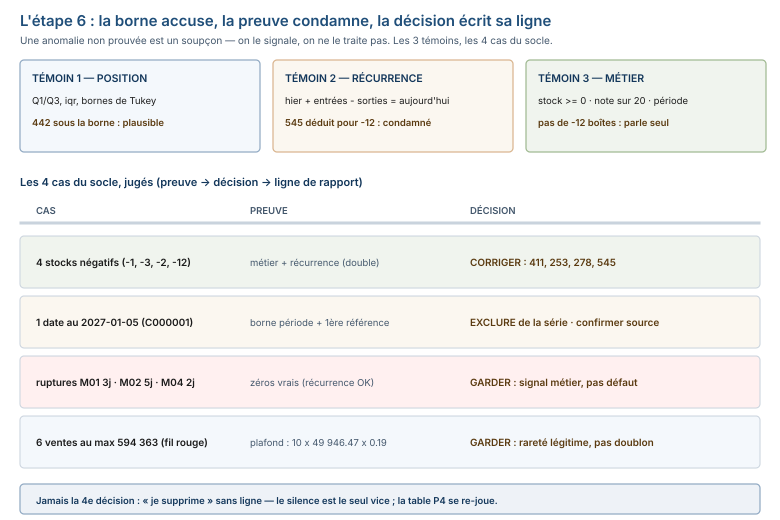

# Module M09.C04 — Anomalies et raretés : ce qui est inhabituel, comment le prouver, quoi en conclure

**Outils : pandas 2.2.3, numpy 2.3.5 (exécutés), DuckDB 1.5.5 (exécuté — la preuve par
récurrence en une requête). Durée indicative : 5 h. Niveau : N3. Prérequis : M09.C02
(l'audit), M09.C03 (les bornes et la période), M02 (quartiles, iqr).**

> **L'idée du chapitre.** L'étape 6 du protocole pose la question : **« qu'est-ce qui est
> inhabituel, et comment le *prouver* ? »** C04 répond avec une règle d'or : **une
> anomalie non prouvée est un soupçon, pas un constat** — et trois preuves sont
> disponibles (position dans la distribution, récurrence, cohérence métier). Ensuite,
> **trois décisions** et une seule : corriger, exclure **en documentant**, garder **en
> signalant** — jamais supprimer en silence. Le chapitre porte deux contre-exemples qui
> changent tout : les **ruptures** du centre de santé (l'anomalie qui **compte** : la
> corriger serait une erreur métier) et les **6 ventes à 594 363 FCFA** du fil rouge
> (une rareté **legitime**, prouvée telle par le produit, la quantité et le taux — le
> plateau le plus suspect de la base est le moins fautif).

> **Matériel de l'atelier — Python 3.13 · pandas 2.2.3 · numpy 2.3.5 · DuckDB 1.5.5.** Toutes
> les commandes ont été exécutées dans l'atelier le 20/09/2026 sur
> `03_exercices/dossier_M09/` (graine 45, déterministe, `ATTENDU.json` figé) ; les sorties
> publiées sont **celles de l'atelier**.

---

## 1. Objectifs du chapitre

À la fin de ce chapitre, vous savez :

1. **Définir l'anomalie avant de la chercher** — trois seuils disponibles : par iqr
   (position dans la distribution), par borne métier (limite du domaine), par comparaison
   à la période (l'écart à la saison, C03).
2. **Prouver une anomalie** avec au moins une des 3 preuves : position, **récurrence**
   (hier + entrées − sorties), cohérence métier — et savoir qu'à défaut, c'est un
   **soupçon** qu'on signale, pas un fait qu'on traite.
3. **Trancher parmi les 3 décisions** — corriger / exclure en documentant / garder en
   signalant — et écrire la ligne de rapport qui les justifie (P2).
4. **Reconnaître l'anomalie qui compte** : une rupture de médicament essentiel est un
   **signal métier**, pas un chiffre à corriger — la corriger serait une erreur.
5. **Distinguer le rare du fautif** : 6 ventes à 594 363 FCFA, le plus gros mois
   78 965 529, le top client de M07 — des raretés **légitimes**, prouvées telles avant
   d'être effacées.

## 2. Pourquoi cette notion est importante

L'anomalie est le point où l'analyse devient **responsable** : on ne décrit plus, on
**décide** — corriger une valeur fausse, exclure une ligne, ou garder une vérité
inhabituelle. Trois faits mesurés sur le socle fixent l'enjeu :

- les **4 stocks négatifs** du centre de santé (−1, −3, −2, −12) sont prouvés **défauts
  de saisie** par double preuve (borne métier + récurrence) — et leur valeur correcte
  est **déductible** (411, 253, 278, 545) : la correction n'est pas une invention,
  c'est un calcul ;
- les **ruptures** (M01 : 3 jours en juillet 2025, M02 : 5 jours en mars 2026, M04 :
  2 jours en août 2026) sont des **zéros qui ne doivent pas être corrigés** : c'est la
  réalité de l'offre, avec sa conséquence (des patients non servis) — les « réparer »,
  c'est effacer le problème le plus grave du jeu de données ;
- les **6 ventes à 594 363 FCFA** (le maximum de la base, 50 008 lignes) sont le cas
  d'école de la **rareté légitime** : identiques entre elles, 6 magasins... non, 2
  magasins, 6 clients, 6 dates — et pourtant aucune n'est fausse : 10 unités (le max de
  la base) du produit 18 (le plus cher : 49 946.47 FCFA) à la TVA 0.19.

## 3. Explication simple — la conversation avec la machine

La machine vient vous dire : « ça, c'est bizarre. » Le chapitre est le **tribunal** :

1. **L'accusation** (le signal) : une valeur au-delà d'une **borne définie avant** —
   un stock à −12, une consultation en 2027, un montant six fois répété. Une borne
   sans date d'adoption n'accuse personne : elle se choisit **avant** de regarder.
2. **La preuve** (le chapitre entier) : trois témoins possibles — la **position**
   (« il est à 3 iqr du cœur »), la **récurrence** (« le jour d'avant et d'après
   s'expliquent, lui non »), le **métier** (« une pharmacie n'a pas −12 boîtes »).
   Un témoin suffit si c'est le métier ; pour les chiffres, on en veut deux.
3. **Le verdict** (une des trois phrases, et seulement celle-là) : **corriger** (avec
   la valeur déductible et sa source), **exclure en documentant** (la ligne, la
   définition, le nombre de lignes retirées), **garder en signalant** (l'information
   est vraie ou inconnue, on la laisse et on la nomme). **Jamais** « je supprime »
   sans phrase : le silence est le seul vice de procédure du rapport.

Et le rappel du chapitre : **tout ce qui est rare n'est pas fautif** — le gros client
de M07 est un client, pas un bug ; la rupture est une vérité douloureuse, pas une
erreur ; et le plateau de 594 363 est une limite **structurelle** du métier, pas un
copié-collé.

## 4. Vocabulaire essentiel

| Terme | Définition |
|---|---|
| **anomalie** | *anomalie* — une observation qui s'écarte d'une borne **définie avant** de chercher (iqr, borne métier, période) ; le statut n'est acquis qu'**après preuve**. |
| **soupçon** | le stade précédent : un signal non prouvé. On le **signale** (il entre au rapport, étiqueté « soupçon »), on ne le **traite** pas. |
| **anomalie structurelle** | un défaut qui révèle un **mécanisme** (saisie, export, génération) plutôt qu'une erreur ponctuelle : les 8 doublons du fil rouge, les 4 stocks négatifs déductibles. |
| **rareté légitime** | une valeur extrême **fausse par aucune preuve** : le top client, le plateau de montant max — on la garde, on l'explique. |

## 5. Cours approfondi

### 5.1 Définir l'anomalie avant de la chercher

Les trois **seuils** disponibles, chacun avec son domaine :

| Seuil | Définition | Bon pour | Mauvais pour |
|---|---|---|---|
| **iqr** (C02) | au-delà de Q1 − 1,5 × iqr ou Q3 + 1,5 × iqr | valeurs continues de régime stable | mélanges de populations (C02 §5.4) |
| **borne métier** | limite du domaine : stock ≥ 0, note entre 0 et 20, date dans la période | tout domaine borné | tout ce que le métier n' borne pas |
| **période** (C03) | écart à la saison/jour de semaine attendu | séries avec cycle | séries plates (pas de saison à comparer) |

L'ordre compte : la **borne métier** accuse **sans appel** (un stock à −12 n'a pas de
discussion), l'**iqr** accuse **en signalant** (442 sous la borne M12 était plausible,
C02 §5.4), la **période** accuse **en comparant** (juillet 2025 à 882, c'est la saison —
ce n'est pas une anomalie, c'est le cycle). Sur le socle, les 4 familles de C02 se
retrouvent chacune sous le seuil qui les trouvait : les doublons (définition métier,
C01/C02), les 23 motifs vides (manquant = valeur absente, définition C02), la date 2027
(borne métier : la période s'arrête au 2026-12-31) et les 4 stocks négatifs (borne
métier + récurrence).

> **Définition.** **anomalie** — *anomalie* — une observation qui s'écarte d'une borne
> **définie avant** de chercher : iqr (position dans la distribution), borne métier
> (limite du domaine) ou période (écart au cycle attendu). Le statut « anomalie »
> n'est acquis qu'**après preuve** ; avant, c'est un **soupçon** — et la différence
> décide du traitement.

### 5.2 Prouver — les trois témoins

**Témoin 1 — la position dans la distribution.** M12 en 2026-11-03 : −12, là où le
cœur du stock tourne entre 518 et 566 (Q1, Q3, iqr 48, borne basse 446 — C02 §5.4) :
l'écart au cœur est de 500+ boîtes, **pas** d'une vingtaine comme pour 442. La position
accuse, mais à elle seule elle n'est pas suffisante (442 était aussi « au-delà »).

**Témoin 2 — la récurrence.** Le stock suit `hier + entrées − sorties`. Sur les 4
défauts, exécuté en DuckDB (une requête, `LAG`) :

```text
id_medicament  date        reel  attendu_récurrence
           M12 2026-11-03   -12                 545
            M07 2025-10-09    -3                 253
           M10 2026-05-21    -2                 278
            M05 2025-04-18    -1                 411
```

Chaque valeur négative a un **jumeau naturel** déductible : 545, 253, 278, 411 — la
série s'explique d'avant en après **sans** la valeur enregistrée. C'est la preuve la
plus forte du module : elle ne dit pas seulement « c'est faux », elle dit **ce que la
valeur était censée être**.

> **Définition.** **récurrence** (du flux) — la règle de continuité d'une série de
> stock : `hier + entrées − sorties = aujourd'hui`. Elle se teste en une ligne
> (`shift(1)` en pandas, `LAG() OVER (PARTITION BY … ORDER BY date)` en DuckDB) et
> c'est elle qui **dédoubble** l'accusation : une valeur qui casse la récurrence est
> suspectée, une valeur que la récurrence **remplace** (545 pour −12) est condamnée.

**Témoin 3 — la cohérence métier.** Un stock négatif n'existe pas en pharmacie ; une
consultation datée au 2027-01-05 n'existe pas dans un export arrêté au 2026-12-31 ;
une note de 25 n'existe pas sur 20. Le métier accuse **sans appel** — et c'est le
seul témoin qui puisse parler **seul** (les 4 stocks négatifs, la date future).

> **Définition.** **soupçon** — le stade d'une anomalie **non prouvée** : un signal
> (position, borne, période) sans aucun des 3 témoins. Le rapport le **signale**
> (« valeur au-delà de la borne, non explorée : la période ne suffit pas »), il ne
> l'exclut pas — traiter un soupçon, c'est confondre l'accusation et le verdict.




### 5.3 Les trois décisions — les 4 défauts de C02 jugés

| Défaut (C02) | Preuve | **Décision** | Ligne de rapport |
|---|---|---|---|
| D1 — 23 motifs vides | information perdue, non reconstituable | **garder en signalant** | « 23 consultations hors des taux par motif, motif inconnu » |
| D2 — 7 doublons de stock | 5-tuple complet identique, `keep="first"` | **exclure en documentant** | « 7 lignes retirées : doublons exacts (date, médicament, entrées, sorties, stock) » |
| D3 — date 2027-01-05 | borne métier (période) + `C000001` (1ʳᵉ référence) | **exclure de la série en documentant** ; coquille probable 2025-01-05, **à confirmer** avec la source | « 1 consultation hors période, exclue des séries ; correction soumise à la source » |
| D4 — 4 stocks négatifs | borne métier **+** récurrence (double) | **corriger** en 411 / 253 / 278 / 545 | « 4 valeurs de saisie remplacées par la valeur déductible de la récurrence (tableau des 4) » |

La discipline qui fait la différence : **chaque décision porte sa preuve et sa ligne** —
pas « on a nettoyé », mais « 7 lignes retirées, voici la définition, voici le nombre ».
Sur D3, notez la nuance : la preuve (borne métier) **exclut** de la série, mais ne
**corrige** pas — la correction (2025-01-05) reste **à confirmer** : c'est le métier
qui confirme, pas la statistique.

> **À retenir.** Trois décisions, et **jamais la quatrième** (« je supprime ») :
> **corriger** exige une valeur **déductible** et sa source ; **exclure** exige une
> définition et un nombre ; **garder** exige une phrase. Le rapport P2 lit la ligne,
> pas le résultat.

> **Attention.** « Corriger » n'existe que pour une valeur **déductible** : 545 pour
> M12, parce que 548 − 3 = 545 se **calcule**. Une valeur non déductible (le motif
> perdu, la date coquille sans témoin) ne se corrige **jamais** par invention — elle
> s'exclut en documentant ou se garde en signalant. Inventer une correction, c'est
> fabriquer une donnée.

### 5.4 L'anomalie qui compte — la rupture n'est pas un chiffre

Les **ruptures** de médicaments essentiels (stock à zéro) du socle : M01 — **3 jours**,
2025-07-14 → 2025-07-16 ; M02 — **5 jours**, 2026-03-02 → 2026-03-06 ; M04 — **2
jours**, 2026-08-10 → 2026-08-11. Ce qu'elles ont de particulier au regard de l'étape
6 : **elles sont vraies**.

- La borne « stock ≥ 0 » ne les accuse **pas** : 0 est dans le domaine (zéro boîte, ce
  n'est pas une dette) ;
- la récurrence les **explique** (le stock s'épuise : sorties supérieures aux entrées
  sur plusieurs jours) ;
- le métier les **confirme** : une rupture, c'est un fait de gestion, avec une date de
  début, une durée, une date de restock.

La décision est donc la quatrième, que le chapitre nomme : **garder, et traiter comme
un signal métier** — pas comme un défaut. M01 est le cas le plus grave, parce que sa
rupture de **3 jours tombe pendant le pic de juillet** (882 consultations, le mois max
de la série, C03) : 3 jours de rupture de médicament essentiel **en saison des pluies**
est l'information la plus chère de la table `stock_medicament.csv` — l'effacer
(« corriger les zéros »), c'est effacer le problème.

> **Attention.** Corriger un **zéro-fait** est l'erreur la plus chère du chapitre —
> plus chère que laisser un défaut : un stock négatif non corrigé biaise une médiane,
> une rupture « corrigée » efface une information **d'exploitation** (patients non
> servis, date de restock) que le métier attendait du rapport. La frontière est la
> récurrence : un zéro qui s'explique par épuisement est un fait, un zéro qui casse la
> récurrence (entre 548 et 541) est un défaut.

> **Dans les faits.** L'exercice d'évaluation E4 du module est fait pour ça : «
> l'anomalie qu'il ne fallait pas corriger ». Le piège est symétrique des chapitres
> précédents : C02/C04 apprennent à corriger les défauts de saisie (−12 → 545) ;
> E4 apprend à **ne pas** corriger les zéros qui sont des faits (ruptures) — la
> frontière est la **récurrence** : un zéro qui s'explique par épuisement est un fait,
> un zéro qui ne s'explique pas (entre 548 et 541) est un défaut.

### 5.5 Les raretés qui ne sont pas des anomalies — le plateau 594 363

Sur le fil rouge, le tri par montant fait apparaître **6 ventes au maximum absolu :
594 363 FCFA** — identiques, et pour cause. Exécuté :

```text
id_vente  date_vente  id_magasin  id_client  id_produit  quantite  prix_unitaire_ht
    3847  2026-10-13           1        390          18        10          49946.47
    6880  2026-06-01           2        511          18        10          49946.47
   15533  2026-06-15           1        282          18        10          49946.47
   42671  2026-04-04           1        858          18        10          49946.47
   44168  2026-01-08           1        583          18        10          49946.47
   47199  2026-10-11           2        231          18        10          49946.47
```

L'accusation était évidente (6 fois le même montant au maximum, c'est **du copié-
collé**, non ?). Les témoins, exécutés :

1. **Position** : 594 363 est le maximum **possible** de la base : 10 unités (le
   maximum de `quantite`, qui plafonne à 10) × 49 946.47 (le prix le plus élevé du
   catalogue : produit 18) × 1.19 (la TVA la plus haute, 0.19) ≈ 594 363. Le plateau
   n'est pas une répétition, c'est un **plafond structurel** : deux ventes qui
   tombent toutes deux sur la limite se valent.
2. **Récurrence** : les 6 ventes ont des `id_vente` distincts, des clients distincts
   (390, 511, 282, 858, 583, 231), des magasins (1, 2) et des dates distinctes
   (6 mois d'2026) — aucune paire ne se ressemble **hors** du montant.
3. **Métier** : un professionnel qui achète 10 unités du produit le plus cher, c'est
   une vente **tout à fait possible** (et elle représente 56 % des montants au-dessus
   de cent mille FCFA — la rareté n'est pas si rare).

**Verdict : garder, aucune correction** — et écrire la phrase qui sauve le rapport :
« 6 ventes au montant max (594 363 FCFA) : plafond structurel (10 × produit 18 ×
TVA 0.19), clients et dates distincts, aucune anomalie » . Le même raisonnement couvre
le **plus gros mois** 78 965 529 FCFA (2025-08 × magasin 3, C03 : un pic **expliqué**
par la vue par magasin, pas écarté) et le **top client** de M07 (un client, pas un
bug — le rappel du module).

> **Définition.** **anomalie structurelle** — un défaut qui révèle un **mécanisme**
> (export, saisie, génération) plutôt qu'une erreur ponctuelle : les 8 doublons du
> fil rouge (clé métier redite, `id_vente` distinct), les 4 stocks négatifs déductibles.
> Le traitement d'une anomalie structurelle se fait **en amont** (la source, le
> processus) : dans le rapport, on la **documente** avec le mécanisme, pas seulement
> la valeur.

## 6. Exemple concret — les 594 363, jugés en entier (fil rouge)

Le parcours complet d'une rareté suspecte, du signal au verdict (exécuté) :

1. **Signal** : `montant_ttc.nlargest(6)` → 6 fois 594 363, le maximum de 50 008
   lignes ; le tri par montant distincts montre que le reste est **dense** (les 10
   montants les plus fréquents comptent 16 à 17 occurrences chacun — pas de pic isolé).
2. **Hypothèse d'accusation** : copié-collé (6 valeurs identiques au max).
3. **Preuves** : plafond structurel (10 × 49 946.47 × 1.19 ≈ 594 363, produit 18 =
   prix max du catalogue de 380 produits), `id_vente` / clients / magasins / dates
   tous distincts, aucune paire jumelle hors montant.
4. **Verdict** : **garder, aucune correction** — rareté légitime, phrase de rapport
   écrite (§5.5).
5. **Leçon** : le tri par valeur est un **générateur de signaux**, pas un juge — sans
   les 3 témoins, le « 6 fois identique » aurait été traité en doublons, et le rapport
   aurait enlevé 5 ventes réelles de 594 363 au CA.

## 7. Démonstration pas à pas — 5 étapes sur les deux jeux

```python
import pandas as pd
s = "03_exercices/dossier_M09"
cons = pd.read_csv(s + "/sante/consultation.csv")
stk = pd.read_csv(s + "/sante/stock_medicament.csv")
v = pd.read_csv(s + "/quincaillerie/vente.csv")
pr = pd.read_csv(s + "/quincaillerie/produit.csv")

# 1 — les 4 stocks négatifs, prouvés par récurrence (pandas)
stk["date"] = pd.to_datetime(stk["date"])
for mid in ("M05", "M07", "M10", "M12"):
    m = stk[stk["id_medicament"] == mid].sort_values("date").reset_index(drop=True)
    neg = m[m["stock_fin"] < 0]
    for i in neg.index:
        nat = int(m.loc[i - 1, "stock_fin"] + neg.loc[i, "entree"] - neg.loc[i, "sortie"])
        print(mid, neg.loc[i, "date"].date(), "réel", int(neg.loc[i, "stock_fin"]),
              "| naturelle", nat)

# 2 — les ruptures : les zéros qui sont des faits (M02)
m02 = stk[stk["id_medicament"] == "M02"].sort_values("date")
print(m02[m02["stock_fin"] == 0]["date"].dt.date.tolist())

# 3 — la date future : borne métier
print(int((cons["date_consultation"] > "2026-12-31").sum()),
      cons.loc[cons["date_consultation"] > "2026-12-31", "date_consultation"].tolist())

# 4 — le plateau du max : plafond structurel ?
mx = int(v["montant_ttc"].max())
top6 = v[v["montant_ttc"] == mx]
print(int(top6.shape[0]), "ventes au max", mx)
print(top6[["id_vente", "id_client", "id_magasin", "date_vente"]].to_string(index=False))
print("max quantite:", int(v["quantite"].max()),
      "| prix max:", pr["prix_vente_ht"].max(), "produit", int(pr.loc[pr["prix_vente_ht"].idxmax(), "id_produit"]))

# 5 — le verdict, en mots :
# 4 stocks : CORRIGER (valeurs déductibles) ; date future : EXCLURE (à confirmer) ;
# ruptures : GARDER (signal métier) ; plateau 594363 : GARDER (plafond structurel).
```

```text
M05 2025-04-18 réel -1 | naturelle 411
M07 2025-10-09 réel -3 | naturelle 253
M10 2026-05-21 réel -2 | naturelle 278
M12 2026-11-03 réel -12 | naturelle 545
[datetime.date(2026, 3, 2), datetime.date(2026, 3, 3), datetime.date(2026, 3, 4),
 datetime.date(2026, 3, 5), datetime.date(2026, 3, 6)]
1 ['2027-01-05']
6 ventes au max 594363
 id_vente  id_client  id_magasin date_vente
     3847        390           1 2026-10-13
     6880        511           2 2026-06-01
    15533        282           1 2026-06-15
    42671        858           1 2026-04-04
    44168        583           1 2026-01-08
    47199        231           2 2026-10-11
max quantite: 10 | prix max: 49946.47 produit 18
```

## 8. Erreurs fréquentes

1. **Traiter le soupçon comme l'anomalie** — « c'est au-delà de la borne, on supprime » :
   la borne **accuse**, la preuve **condamne** ; sans preuve, la valeur sort du rapport
   avec son étiquette de soupçon, pas du fichier.
2. **Corriger une valeur non déductible** — inventer le motif perdu, deviner la date
   coquille : une correction sans source (récurrence, référentiel, source métier) est
   une **fabrication de donnée**, pas un nettoyage.
3. **Effacer les zéros qui sont des faits** — les ruptures (0 stock) corrigées « parce
   que c'est bizarre » : on efface le signal métier le plus grave du jeu (M01 : 3 jours
   en juillet, pendant le pic de 882 consultations).
4. **Punir le rare comme fautif** — les 6 ventes à 594 363 traitées en doublons, le top
   client de M07 exclu « parce qu'il tire le total » : la rareté légitime s'**explique**
   (plafond structurel, comportement client), elle ne s'élimine pas.
5. **Décider sans ligne de rapport** — « on a nettoyé » sans définition, sans nombre,
   sans preuve : le rapport P2 lit la **ligne**, pas le résultat — « 7 lignes retirées
   (doublons 5-tuples) » passe, « nettoyage effectué » non.

## 9. Bonnes pratiques professionnelles

1. **La borne d'abord, la valeur ensuite** — « au-delà de 446 (Q1 M12 − 1,5 × iqr) »
   est défini **avant** le tri ; « ça fait bizarre » ne l'est pas : un seuil sans
   date d'adoption n'accuse personne.
2. **Deux témoins pour les chiffres, un seul suffit pour le métier** — la borne métier
   parle seule (−12, 2027) ; pour les valeurs du domaine (442 ? 545 ?), position +
   récurrence ensemble.
3. **Chaque décision écrit sa ligne** — corriger : valeur + source ; exclure : définition
   + nombre ; garder : le pourquoi. Trois phrases, trois formats, pas de quatrième.
4. **L'anomalie qui compte est la plus chère du rapport** — la rupture M01 (3 jours au
   pic de juillet) vaut plus que les 4 corrections de stocks : le rapport la met en
   avant, chiffrée, datée, avec sa conséquence (patients non servis).
5. **Le tri par valeur est un générateur de signaux** — pas un juge : chaque pic de
   `nlargest` passe par les 3 témoins avant de devenir un fait ; le plateau 594 363 en
   est la démonstration (signal le plus suspect, verdict le plus légitime).

> **Conseil professionnel.** Dans un rapport P2, la section anomalies tient en **une
> table** : signal / preuve(s) / décision / ligne de rapport. Pas de narrative
> interminable : le lecteur doit pouvoir **contrôler** chaque ligne (re-jouer la
> preuve), et une table se contrôle, un récit non. Cinq lignes sur le socle (23, 7, 1,
> 4, plateau) couvrent tout le chapitre.

## 10. Exercice guidé — « les 4 défauts du centre de santé, jugés » (25 min, /10)

**Consigne.** Les 4 défauts de C02 sont connus (23 motifs vides, 7 doublons de stock,
1 date au 2027-01-05, 4 stocks négatifs). Pour chacun, sans rouvrir `ATTENDU.json` :

1. Nommez la **borne** (métier, iqr, période) qui l'accuse (4 × 0,5 pt).
2. Donnez la **preuve** retenue (1 pt) et, pour les 4 stocks, la **valeur déductible**
   de chacun (4 × 1 pt). (5 pts au total)
3. Écrivez la **décision** (corriger / exclure en documentant / garder en signalant) et
   la **ligne de rapport** qui va avec (4 × 0,5 pt). (2 pts)

## 11. Exercices autonomes

**E1 — La preuve par récurrence en SQL (20 min).** En DuckDB sur
`stock_medicament.csv`, avec `LAG(stock_fin) OVER (PARTITION BY id_medicament
ORDER BY date)` : listez les 4 stocks négatifs avec leur **valeur attendue par
récurrence** (hier + entrées − sorties). La sortie doit donner −12 → 545, −3 → 253,
−2 → 278, −1 → 411.

**E2 — Le plateau qui n'est pas un doublon (20 min).** Sur `vente.csv` : (1) comptez les
ventes au montant max (594 363) et listez leurs `id_vente`, `id_client`, `id_magasin`,
`date_vente` ; (2) montrez que le plateau est un **plafond structurel** (quantité max,
prix max du catalogue, TVA 0.19) ; (3) concluez : doublon ou rareté légitime, et
**pourquoi** une paire parmi les 6 n'est **pas** un doublon métier (rappel C01 : la
définition du doublon sur les 12 colonnes hors `id_vente`).

## 12. Correction détaillée

**Exercice guidé.**

1. **Les bornes** : D1 — aucune borne (un motif vide n'est hors domaine, c'est une
   information **absente** : la « borne » est la complétude attendue) ; D2 — définition
   métier du doublon (5-tuple) ; D3 — **période** (l'export s'arrête au 2026-12-31) ;
   D4 — **borne métier** (stock ≥ 0).
2. **Les preuves** : D1 — aucune (l'information est perdue : c'est précisément pour ça
   qu'on ne la corrige pas) ; D2 — l'identité du 5-tuple (définition exécutée) ;
   D3 — borne métier **+** la position de `C000001` (1ʳᵉ référence du fichier) ; D4 —
   **double** : borne métier + récurrence, valeurs déductibles **411 (M05), 253 (M07),
   278 (M10), 545 (M12)**.
3. **Les décisions** : D1 — **garder en signalant** (« 23 consultations hors des taux
   par motif ») ; D2 — **exclure en documentant** (« 7 lignes retirées : doublons
   exacts du 5-tuple, `keep="first"` ») ; D3 — **exclure de la série en documentant**
   (« 1 consultation hors période exclue ; coquille probable 2025-01-05, à confirmer
   avec la source ») ; D4 — **corriger** (« 4 valeurs de saisie remplacées par la
   valeur déductible de la récurrence : 411, 253, 278, 545 »).

**E1.** DuckDB, exécuté — la requête du §5.2 redonne exactement :

```text
id_medicament  date        reel  attendu_récurrence
           M12 2026-11-03   -12                 545
            M07 2025-10-09    -3                 253
           M10 2026-05-21    -2                 278
            M05 2025-04-18    -1                 411
```

**E2.** (1) **6** ventes au max 594 363 : 6 `id_vente` distincts (la liste est publiée
aux §5.5 et §7), clients 390, 511, 282, 858, 583, 231 ; magasins 1 (×4) et 2 (×2) ;
dates du 2026-01-08 au 2026-10-13. (2) **Plafond structurel** : `quantite` plafonne à **10**,
le produit **18** est le plus cher du catalogue (**49 946.47**), la TVA la plus haute
est **0.19** : 10 × 49 946.47 × 1.19 ≈ **594 363** — deux ventes qui touchent toutes
les limites se valent, c'est la définition du plafond. (3) **Rareté légitime, pas un
doublon** : la définition du doublon métier (C01) porte sur les 12 colonnes **hors**
`id_vente` — et ici, les 6 ventes diffèrent sur `date_vente`, `id_client`,
`id_magasin` (et `id_vente`) : aucune paire n'est identique **sur la définition**,
donc aucune n'est un doublon ; l'identité du montant est l'**effet** du plafond, pas
sa **cause**.

## 13. Mini-projet M09.P4 — « L'anomalie avec sa preuve » (1 h)

**Énoncé.** La section anomalies du rapport P2 (projet M09.P) doit porter **la table
du conseil §9** sur un jeu au choix (quincaillerie ou santé) : 4 à 6 lignes, chacune
avec signal / preuve(s) / décision / ligne de rapport. Contrainte d'évaluation :
**chaque preuve doit être re-jouable** — le correcteur relance la commande citée et
doit retomber sur le chiffre. Auto-évaluation : une ligne sans commande citée = une
ligne qui ne compte pas ; une décision « corriger » sans valeur déductible et sa source
= une ligne fausse.

## 14. Boîte à outils du chapitre

> **Boîte à outils.** Les seuils : `quantile(.25/.75)` + iqr (C02), bornes métier
> (`col < 0`, `col > 20`, date hors période), période (C03 : écart au cycle). Les
> preuves : position (`nlargest`, distance à la borne), **récurrence**
> (`shift(1)` en pandas, `LAG() OVER (PARTITION BY … ORDER BY date)` en DuckDB), métier
> (le référentiel, la source). Les décisions : corriger (valeur + source), exclure
> (définition + nombre), garder (signal + phrase). Le rare : `nlargest` + les 3 témoins
> avant tout traitement.

| Besoin | Commande | Chiffre du socle |
|---|---|---|
| position | `col.nlargest(n)`, distance à Q3 + 1,5 × iqr | 6 ventes au max 594 363 |
| récurrence | `shift(1)` / `LAG() OVER` | 545, 253, 278, 411 |
| borne métier | `(col < 0).sum()`, date hors période | 4 stocks, 1 date (2027-01-05) |
| zéros-faits | `col == 0` groupés par période | M01 3 j · M02 5 j · M04 2 j |
| plafond | prix max catalogue × quantité max × TVA max | 10 × 49 946.47 × 1.19 |

## 15. Résumé du chapitre

L'étape 6 du protocole (« qu'est-ce qui est inhabituel, et comment le **prouver** ? »)
est exécutée avec la règle du chapitre : **une anomalie non prouvée est un soupçon**,
et trois témoins sont disponibles — la **position** dans la distribution (iqr, C02),
la **récurrence** (hier + entrées − sorties : `shift(1)` en pandas, `LAG` en DuckDB)
et la **cohérence métier** (stock ≥ 0, période de l'export, note sur 20). Sur le
centre de santé, les 4 défauts de C02 sont jugés : les 23 motifs vides se **gardent en
signalant** (information perdue, non reconstituable), les 7 doublons de stock
s'**excluent en documentant** (5-tuple identique, 7 lignes), la consultation du
2027-01-05 s'**exclut de la série** (borne période, `C000001`, coquille probable
2025-01-05 à confirmer avec la source) et les 4 stocks négatifs se **corrige**nt —
en 411, 253, 278 et 545, valeurs **déductibles** par la récurrence (preuve double :
métier + flux). Les **ruptures** (M01 : 3 jours, 2025-07-14 → 16 ; M02 : 5 jours,
2026-03-02 → 06 ; M04 : 2 jours, 2026-08-10 → 11) sont l'inverse exact d'un défaut :
des **zéros qui sont des faits**, à garder et à traiter comme **signal métier** —
M01 pendant le pic de juillet (882 consultations) est l'anomalie qui **compte**. Sur
le fil rouge, les **6 ventes à 594 363 FCFA** (le maximum de 50 008 lignes)
démonurent le rare légitime : plafond structurel (10 × produit 18 à 49 946.47 ×
TVA 0.19), clients, magasins et dates distincts — **garder, aucune correction**, et la
même leçon couvre le plus gros mois (78 965 529, expliqué) et le top client de M07.

## 16. À retenir

> **À retenir.** La borne **accuse**, la preuve **condamne**, la décision **écrit sa
> ligne** — et les deux contre-exemples du socle gardent le chapitre honnête : la
> rupture qui ne se corrige pas (0 = un fait, pas un défaut) et le plateau 594 363 qui
> ne s'élimine pas (rare ≠ fautif).

1. **Définir avant de chercher** : iqr / borne métier / période — un seuil sans date
   d'adoption n'accuse personne.
2. **Trois témoins** : position (500+ boîtes du cœur pour M12), récurrence (545 ≠ −12,
   et 545 − 4 = 541), métier (pas de −12 boîtes en pharmacie).
3. **Trois décisions, jamais la quatrième** : corriger (valeur déductible + source),
   exclure en documentant (définition + nombre), garder en signalant — pas « supprimer ».
4. **Corriger = déduire** : 411, 253, 278, 545 se **calculent** ; une valeur non
   déductible ne se corrige jamais par invention.
5. **L'anomalie qui compte est un fait** : ruptures M01 3 j (pic de juillet, 882),
   M02 5 j, M04 2 j — les corriger, c'est effacer le problème.
6. **Rare ≠ fautif** : 6 × 594 363 = plafond structurel (10 × 49 946.47 × 1.19) ;
   le tri par valeur génère des signaux, il ne juge pas.
7. **Chaque décision écrit sa ligne** : signal / preuve / décision / ligne de rapport —
   la table P4 se **re-joue**, le récit non.

## 17. Évaluation formative (auto-correction, 8 min)

1. **Pourquoi 442 (M12, sous la borne 446) n'est-il pas corrigé alors que −12 l'est ?**
   → 442 est un soupçon **débattu** : cohérent avec sa récurrence, plausible en métier
   (jour bas, pas impossible) — il se **garde** ; −12 a la **double** preuve (métier :
   pas de stock négatif ; récurrence : 548 − 3 = 545, et 545 − 4 = 541) — il se
   **corrige** en 545, valeur déductible. (2 pts)
2. **Les 4 stocks négatifs valent −1, −3, −2, −12. Donnez leurs valeurs déductibles et
   la commande qui les déduit.**
   → 411 (M05), 253 (M07), 278 (M10), 545 (M12) ; `shift(1)` en pandas ou
   `LAG(stock_fin) OVER (PARTITION BY id_medicament ORDER BY date)` en DuckDB :
   hier + entrées − sorties. (2 pts)
3. **Pourquoi la rupture M02 (5 jours à zéro, 2026-03-02 → 06) ne se corrige-t-elle
   pas ?**
   → parce que les zéros sont **vrais** : la borne stock ≥ 0 ne les accuse pas (0 est
   dans le domaine), la récurrence les explique (épuisement : sorties > entrées), et le
   métier les confirme (rupture = fait de gestion) — c'est un **signal** (patients non
   servis), pas un défaut. (2 pts)
4. **M01 est rompu 3 jours en 2025-07-14 → 16. Pourquoi cette rupture « compte-t-elle »
   plus que les autres ?**
   → parce qu'elle tombe **pendant le pic de saison** (juillet 2025 : 882
   consultations, le mois max de la série) : 3 jours de médicament essentiel manquant
   **en saison des pluies** — l'information la plus chère de la table de stock. (2 pts)
5. **6 ventes à 594 363 FCFA, le maximum de la base. Pourquoi ne sont-ce pas des
   doublons ?**
   → le doublon métier se définit sur les 12 colonnes **hors** `id_vente` (C01) : les 6
   ventes diffèrent sur date, client, magasin — l'identité du montant est l'**effet**
   du plafond structurel (10 × produit 18 × TVA 0.19), pas sa cause. (2 pts)
6. **Quelle est la valeur exacte du plafond, et pourquoi « ≈ » ?**
   → 10 × 49 946.47 × 1.19 = 594 362.99 ≈ **594 363** : le montant est arrondi au FCFA
   (centimes entiers, M08 C08) — l'approximation est l'arrondi, pas l'hypothèse. (2 pts)
7. **Écrivez la ligne de rapport de D3 (la date 2027-01-05), avec sa nuance.**
   → « 1 consultation hors période (2027-01-05, `C000001`), **exclue des séries** ;
   coquille probable pour 2025-01-05 — correction **soumise à la source** » : la preuve
   (borne période) exclut, elle ne **corrige** pas. (2 pts)
8. **Une valeur au-delà de la borne, non explorée faute de temps. Que fait-on ?**
   → on la **signale** en soupçon (« au-delà de la borne, non explorée ») : elle entre
   au rapport **étiquetée**, elle ne sort pas du fichier — traiter un soupçon, c'est
   confondre accusation et verdict. (2 pts)
