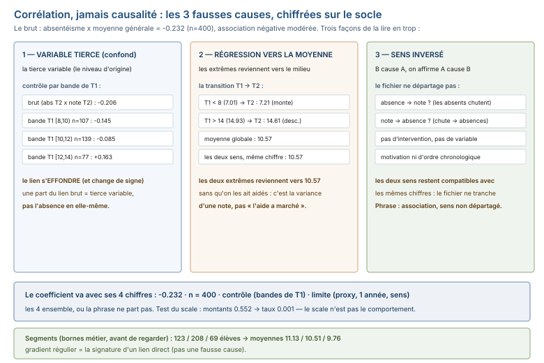

# Module M09.C05 — Relations et hypothèses : ce qui bouge ensemble, ce qui ne bouge pas, et les 3 fausses causes

**Outils : pandas 2.2.3, numpy 2.3.5 (exécutés). Durée indicative : 5 h. Niveau : N3.
Prérequis : M09.C01-C04 (protocole, audit, tendances, anomalies), M02 (corrélation vue
en M02.C06).**

> **L'idée du chapitre.** L'étape 7 du protocole pose la question : **« les variables
> bougent-elles ensemble ? »** et l'étape 8 : **« que puis-je affirmer, et sous quelle
> condition ? »** C05 y répond avec un coefficient en une ligne (`corr()`), ses **3
> limites** (linéarité, scale, valeurs extrêmes), le **corollaire du module** —
> corrélation ≠ causalité, avec les **3 fausses causes** chiffrées sur le socle
> (variable tierce, régression vers la moyenne, sens inversé) — et deux disciplines :
> **segmenter** avant de comparer, et **comparer des groupes à taille égale ou en le
> disant**. L'**établissement scolaire** fait son entrée ici (402 élèves déclarés,
> 6 000 notes, 1 687 absences/retards, 4 défauts) : la corrélation absentéisme ×
> résultats est **−0.232** — négative, modérée, et **partiellement expliquée par une
> tierce variable** quand on contrôle le niveau du T1. Le fil rouge porte l'autre
> leçon : remises × montants à 0.552, taux × montants à **0.001** — le scale n'est pas
> le comportement.

> **Matériel de l'atelier — Python 3.13 · pandas 2.2.3 · numpy 2.3.5.** Toutes les commandes
> ont été exécutées dans l'atelier le 20/09/2026 sur `03_exercices/dossier_M09/` (graine
> 45, déterministe, `ATTENDU.json` figé) ; les sorties publiées sont **celles de
> l'atelier**.

---

## 1. Objectifs du chapitre

À la fin de ce chapitre, vous savez :

1. **Calculer la corrélation de Pearson** en une ligne (`corr()`) et dire ses **3
   limites** : elle ne mesure que le lien **linéaire**, elle dépend du **scale** des
   variables (0.552 vs 0.001 sur le fil rouge), et une **valeur extrême** peut la tirer.
2. **Reconnaître les 3 fausses causes** d'une corrélation : variable **tierce**
   (confond — mesurée sur le socle : la corrélation s'effondre quand on contrôle le
   T1), **régression vers la moyenne** (les extrêmes retournent vers le milieu sans
   cause) et **sens inversé** (l'effet va de B à A, pas de A à B).
3. **Segmenter** une variable continue en groupes métier (`np.where`) et lire le
   **gradient** : 3 segments d'absentéisme [123, 208, 69] élèves → moyennes
   11.13 → 10.51 → 9.76.
4. **Comparer des groupes à taille inégale** : le panier par mode de paiement (5
   groupes, le plus gros **8 fois** plus grand que le plus petit, écart de moyennes
   de 2 % : du bruit) et le taux par classe (4e : 4.26 j, 2nde : 2.35 j — un écart
   **réel** à n égales).
5. **Cadrer et tester l'hypothèse** (l'étape 8) : formulation falsifiable, test sur les
   données, **conclusion provisoire** avec ses limites — le pont vers la note d'EDA (C06).

## 2. Pourquoi cette notion est importante

L'EDA se termine là où commence la **responsabilité** : l'étape 7 produit des
associations, l'étape 8 décide ce qu'on en **dit**. Et c'est précisément là que le
rapport EDA se trompe le plus souvent : une corrélation publiée comme une cause, un
groupe petit comparé à un groupe grand, un segment défini après avoir vu les résultats.
Trois faits mesurés sur le socle fixent l'enjeu :

- la corrélation **absentéisme × résultats** du jeu scolaire est **−0.232** — et quand
  on **contrôle le niveau du T1** (la tierce variable : le niveau d'origine), elle
  s'effondre par bandes (−0.145, −0.085, **+0.163**) : une partie du lien brut est la
  variable tierce, pas l'absence ;
- sur le fil rouge, **remises (en FCFA) × montants** donne 0.552, mais **taux de remise
  × montants** donne **0.001** : même fichier, deux variables, deux mondes — le scale
  a imité un comportement ;
- les **5 modes de paiement** font des paniers moyens à **2 % près** les uns des autres,
  pour des groupes de 20 175 ventes et de 2 552 : comparer ces groupes « au total »
  sans dire leurs tailles, c'est faire passer le bruit pour une différence.

## 3. Explication simple — la conversation avec la machine

La corrélation est une **corde** qui relie deux variables : si l'une tire, l'autre
suit, la corde est tendue (+) ou opposée (−), et `corr()` mesure la tension **de
−1 à +1**. Mais la corde joue **trois tours** au lecteur pressé :

1. **Le tour de la tierce variable** : deux variables bougent ensemble **parce qu'une
   troisième les pousse toutes les deux** — les élèves absents et les élèves qui
   décrochent sont **poussés par le même facteur** (le niveau d'origine) ; la corde
   entre absence et note est un fil de la variable tierce, pas un lien direct.
2. **Le tour du scale** : deux grandeurs qui grandissent **ensemble** (une remise en
   FCFA grandit avec le montant de la facture) se corrélaient **même sans lien** —
   0.552 ; divisez par le montant (le **taux**) et la corde retombe : **0.001**.
3. **Le tour des extrêmes** : un groupe qui part très bas (7.01 au T1) remonte vers le
   milieu (7.21 au T2) **sans que rien ne l'ait aidé** — la régression vers la moyenne
   imite une cause qui n'existe pas.

La discipline du chapitre : **tendre la corde** (`corr()`), **vérifier le tour** (les
3 pièges), et **dire la tension en un chiffre** avec ses limites — jamais « ça cause
ça ».

## 4. Vocabulaire essentiel

| Terme | Définition |
|---|---|
| **corrélation** | *corrélation* — la mesure d'association entre deux variables (Pearson : de −1 à +1, lien **linéaire**) ; **n'est jamais une causalité** (le piège du module). |
| **piège d'inférence** | le saut interdit de l'association à la cause : 3 formes mesurées — variable tierce, régression vers la moyenne, sens inversé. |
| **variable tierce** — *confond* — la troisième variable qui **cause les deux** : si on la contrôle (on compare à elle égale), la corrélation résiduelle est le lien direct. |
| **segment** | un groupe **défini avant** de regarder les résultats (bornes métier sur la variable) : ici, les 3 tranches d'absentéisme (< 2, 2-5, ≥ 6 jours). |

## 5. Cours approfondi

### 5.1 `corr()` en une ligne — et ses 3 limites

```python
import pandas as pd
s = "03_exercices/dossier_M09/scolaire"
no = pd.read_csv(s + "/note.csv")
ab = pd.read_csv(s + "/absence.csv")
no = no[(no["note"] >= 0) & (no["note"] <= 20)]
abs_par = ab.groupby("id_eleve")["duree_jours"].sum()
taux = abs_par.reindex(sorted(no["id_eleve"].unique()), fill_value=0)
moy = no.groupby("id_eleve")["note"].mean()
print(round(float(moy.corr(taux.reindex(moy.index))), 3), len(moy))
```

```text
-0.232 400
```

**−0.232 sur 400 élèves** : une association **négative, modérée** — les élèves plus
absents ont des moyennes plus basses, mais « modérée » est le mot qui compte : une
grande partie de la variance de la moyenne n'est **pas** dans l'absentéisme. Les 3
limites, chacune exécutée sur le socle :

1. **Linéarité** — `corr()` mesure le lien **linéaire** ; une relation en U (les
   absents très peu **et** très beaucoup font mal, les moyens vont bien) donne une
   corrélation **nulle** tout en ayant un lien fort. Le nuage (C06) est le contrôle.
2. **Scale** — sur le fil rouge (exécuté) : `montant_remise × montant_ttc` →
   **0.552**, mais `montant_remise / montant_ttc × montant_ttc` → **0.001** : la
   remise en FCFA grandit **avec** le montant (une facture de 500 000 FCFA a une
   remise plus grosse en FCFA qu'une facture de 5 000, même à taux nul) — le scale a
   imité un comportement. Le **taux** (max 0.015 sur la base) est la variable qui
   mesure le comportement, et elle ne bouge **pas** avec le montant.
3. **Valeurs extrêmes** — une poignée de valeurs à l'extrême peut **tirer** le
   coefficient (le cas de M02 : une ligne aberrante qui fait une corrélation) ;
   `corr()` a des variantes robustes (rangs), mais le réflexe du chapitre est plus
   simple : **recalculer sans les 5 % extrêmes** et voir si le signe tient.

> **Attention.** Un coefficient dont le **signe change** quand on retire les valeurs
> extrêmes n'est pas une mesure : c'est un fil tendu par quelques observations. Le
> réflexe d'office avant publication est de le recalculer **sans** les extrêmes — si
> le signe tient, la corrélation est robuste ; s'il s'effondre, c'est la queue qui
> parlait, pas la distribution.

> **Définition.** **corrélation** — *corrélation* — la mesure d'association entre deux
> variables ; Pearson mesure le lien **linéaire**, de −1 (opposé) à +1 (proportionnel),
> 0 = pas de lien linéaire. Trois avertissements d'office : elle ne mesure **pas** la
> causalité, pas le lien non linéaire, et pas le comportement si l'une des variables
> est un **scale** (montant en FCFA) et non un **taux**.

### 5.2 Corrélation ≠ causalité — les 3 fausses causes, chiffrées

**Fausse cause 1 — la variable tierce (confond).** L'histoire la plus plausible :
« les absences **font** baisser les notes ». Le test (exécuté) : contrôler le **niveau
du T1** (proxy du niveau d'origine) et recalculer, **par bande de niveau** :

```text
corr globale abs_T2 × note_T2              : -0.206
bande T1 [8,10)  (n=107)  : -0.145
bande T1 [10,12) (n=139)  : -0.085
bande T1 [12,14) (n=77)   : +0.163
```

En contrôlant le niveau, la corrélation **s'effondre** (−0.206 → −0.145 / −0.085 /
+0.163, du signe inversé dans la bande haute) : une part importante du lien brut
était **le niveau d'origine** qui pousse l'absence **et** la note — la corde entre
absentéisme et résultats est en grande partie un fil de la tierce variable. Ce que
les données **autorisent** : « les élèves plus absents ont en moyenne des notes plus
basses, **et** le niveau d'origine explique une part de ce lien » — pas « les
absences font baisser les notes ».

**Fausse cause 2 — la régression vers la moyenne.** Les élèves très en bas au T1
(moyenne 7.01) font **7.21** au T2 — ils **montent** sans cause identifiée ; les
très hauts (14.93) font **14.61** — ils **descendent**. Les extrêmes retournent vers
le milieu **par hasard d'échantillonnage** (une note anormalement basse a
statistiquement de chances d'être moins basse au trimestre suivant), et on lit
« l'aide a marché » (7.01 → 7.21) là où il n'y a qu'une **retombée vers la moyenne**.
Le contrôle : comparer à la **moyenne de tous** les élèves sur la même transition,
pas à soi-même.

**Fausse cause 3 — le sens inversé.** « Les absents ont de mauvaises notes » peut
aller **dans l'autre sens** : ce ne sont pas les absences qui font la moyenne, c'est
la **moyenne qui fait l'absence** (l'élève qui décroche arrête d'aller en cours).
Les données du fichier **ne départagent pas** les deux sens (pas de variable «
motivation », pas d'intervention) — et c'est précisément **ce qu'on écrit** :
« association bidirectionnellement compatible ; le fichier ne départage pas les sens ».

> **Définition.** **piège d'inférence** — le saut interdit de l'**association** à la
> **cause**, sous ses 3 formes mesurées : variable **tierce** (la troisième variable
> qui cause les deux — contrôlée, la corrélation résiduelle est le lien direct),
> **régression vers la moyenne** (les extrêmes retournent vers le milieu sans cause),
> **sens inversé** (B cause A, on affirme A cause B). Un coefficient sans ces 3
> contrôles est une **association**, pas une **cause**.




### 5.3 L'établissement scolaire arrive — le jeu 3, ses 4 défauts

Le jeu 3 s'ouvre (entré avec son audit C02 déjà fait ici) : `eleve.csv` (**402**
lignes × 3 colonnes, **400** élèves distincts), `note.csv` (**6 000** lignes × 5
colonnes : 5 matières × 400 élèves × 3 trimestres), `absence.csv` (**1 687** lignes ×
5 colonnes : **1 278** absences et **409** retards). Les 4 défauts plantés, exécutés :

| # | Défaut | Définition exacte | Chiffre |
|---|---|---|---|
| S1 | notes hors bornes | `note` < 0 ou > 20 (sur 20, domaine métier) | **6** (22.5, 22.5, 25.0, −1.5, −0.5, −3.0) |
| S2 | doublons d'élèves | `id_eleve` répété dans `eleve.csv` | **2** (E0107, E0233) |
| S3 | absence un jour férié | absence datée un jour où l'établissement est fermé | **4** (2025-11-01, 2025-12-25, 2025-12-26, 2026-01-01) |
| S4 | absent mais noté | élève avec ≥ 10 absences au T2 **et** des notes au T2 | **3** (E0004 : 13, E0006 : 15, E0007 : 15) |

Deux lectures qui feront la différence :

- **S2 cache une contradiction** : l'un des deux IDs doublons est déclaré **F** sur
  une ligne et **M** sur l'autre (même `classe`) — c'est un doublon **avec
  contradiction**, pas un simple doublon exact (l'autre est identique sur ses 3
  colonnes) : le premier se règle **avec la source**, le second se dédoublonne.
- **S4 est le défaut qui fausse la corrélation** : 3 élèves comptent **13, 15, 15
  absences au T2** et ont **5 notes au T2** chacun — des absents notés tirent la
  corrélation vers le bas **par construction** (max des absences, notes quand même
  présentes) : la corrélation −0.232 se **recalcule** hors ces 3 élèves au C06, et
  l'écart est publié (les deux chiffres vont dans la note d'EDA).

> **Dans les faits.** L'audit du jeu scolaire (formes + 4 défauts + types d'absence +
> clés refermées) passe par les mêmes commandes que le jeu 2 — le protocole (C01) est
> le même sur les 3 jeux ; ce qui change, c'est le **métier** des bornes : une note
> sur 20, un jour férié, un élève noté en étant absent. Les bornes métier suivent le
> métier, pas l'inverse.

### 5.4 Segmenter — les 3 tranches d'absentéisme et leur gradient

**Ségmenter, c'est trancher avant de regarder** : les bornes (< 2, 2 à 5, ≥ 6 jours
d'absence sur la période) sont fixées **métier** (« absent occasionnel / absent
régulier / absent structurel »), **pas** après avoir vu les moyennes (exécuté,
`np.where`) :

```text
segment  <2 jours :  n=123 | moyenne 11.13 | médiane 11.21
segment  2-5 jours:  n=208 | moyenne 10.51 | médiane 10.40
segment  >=6 jours:  n=69  | moyenne  9.76 | médiane  9.51
```

Le **gradient** est la lecture du chapitre : 11.13 → 10.51 → 9.76, un demi-point par
tranche, **regulier** — c'est la signature d'un **lien direct** (pas d'un accident de
groupe) ; la médiane suit la moyenne (pas de queue qui tire). Et la nuance du
chapitre : le segment « ≥ 6 jours » n'est pas un groupe d'**exclus** — ce sont 69
élèves réels, et la phrase du rapport est « les 69 élèves les plus absents font en
moyenne 9.76/20, soit 1.37 point sous les 123 les moins absents » — **des élèves, pas
des valeurs**.

> **Définition.** **segment** — un groupe défini **avant** de regarder les résultats :
> les bornes sont **métier** (< 2, 2 à 5, ≥ 6 jours d'absence), pas statistiques, et
> s'écrivent dans le rapport **avant** les chiffres. Définir le segment après avoir vu
> les moyennes (« les 3 tranches qui maximisent l'écart »), c'est **choisir** la
> conclusion — le segment n'est plus une découpe, c'est un argument.

> **Définition.** **variable tierce** — *confond* — la troisième variable qui **cause
> les deux** variables observées : ici, le niveau d'origine (proxy : la note du T1)
> pousse l'absence **et** la note du T2. La tester, c'est **contrôler** : comparer à
> elle égale (par bande) — la corrélation résiduelle est le lien **direct**, le reste
> est le fil de la tierce variable.

### 5.5 Comparer des groupes — à taille égale, ou en le disant

Le fil rouge fournit le contre-exemple (exécuté) : le panier moyen par **mode de
paiement** (5 groupes) :

```text
id_mode   n ventes   panier moyen   médiane
    1     20175      157863        120134
    2     12366      157205        116052
    3     12322      159573        121794
    4      2593      156150        120315
    5      2552      159959        120545
```

**Deux leçons** :

1. **Les tailles inégales mentent** : le groupe 1 compte **8 fois** plus de ventes que
   le groupe 5 (20 175 vs 2 552) — une différence de panier de 2 % entre des groupes
   de cette taille est **du bruit** (la variance d'un groupe de 2 552 est bien plus
   grande que celle d'un groupe de 20 175). La phrase du rapport : « les 5 modes de
   paiement ne différencient **pas** le panier moyen (écart max 2 %, groupes de
   20 175 à 2 552 ventes) » — l'écart **et** les tailles, les deux chiffres.
2. **Les moyennes suivent, les médianes disent** : les moyennes vont de 156 150 à
   159 959 (2 %), les médianes de 116 052 à 121 794 (5 %) — la **médiane** est plus
   lisible ici (distribution à queue haute, C02), et les deux vont **ensemble** dans
   la phrase.

Le **bon** comparé de groupes sur le socle : le **taux d'absence par classe** (exécuté) —
5e : 3.35 j (n=110), 4e : **4.26 j** (n=105), 3e : 2.63 j (n=100), 2nde : 2.35 j
(n=85) : les groupes sont **à taille proche** (85 à 110, rapport de 1.3), et l'écart
4e vs 2nde est de **1.91 jour** d'absence — un écart **réel**, pas du bruit de
taille : « la 4e est la classe la plus absente (4.26 jours), à effectif proche des
autres classes ».

Le **tableau croisé** (fréquence d'un couple de modalités) est le troisième regard,
ici sur matière × trimestre (moyennes exécutées) :

```text
matiere              T1     T2     T3
anglais             10.16  10.28  10.19
francais            10.76  10.89  10.75
histoire_geographie 11.40  11.36  11.45
maths                9.83   9.91   9.85
sciences            10.62  10.52  10.59
```

**Deux lectures** : (1) **rien ne bouge entre trimestres** (chaque matière varie
d'environ 0.1 point) — le tableau croisé **vide** est une information : pas d'effet
de trimestre, l'étape se **déclare** (C01) ; (2) le **classement des matières est
stable** : histoire_geographie (11.4) devant français (10.8), sciences (10.6),
anglais (10.2) et maths (9.9) — la matière la plus « facile » n'est pas celle qui a
la meilleure moyenne au T3, c'est celle qui en a eu **la meilleure en continu** :
le classement se lit sur les 3 trimestres, pas sur un.

> **Définition.** **tableau croisé** — *tableau de contingence* — la fréquence (ou la
> moyenne) d'un **couple de modalités** : matière × trimestre ici, 5 × 3 cases. Sa
> force est la **comparaison en cases** : « rien ne bouge entre trimestres » se voit
> sur les 3 colonnes d'une ligne, « le classement est stable » sur les 5 lignes d'une
> colonne — deux lectures que la moyenne globale (10.57) ne donne pas.

> **Attention.** Comparer des groupes **sans dire leurs tailles**, c'est faire passer
> le bruit pour une différence : 2 % d'écart de panier sur 2 552 ventes n'est pas une
> « préférence de paiement », c'est de la variance. La phrase complète est toujours
> **écart + tailles** — sans les deux chiffres, la comparaison ne sort pas du brouillon.

### 5.6 Formuler l'hypothèse et la tester — l'étape 8

Le gabarit (C02 §5.5) s'applique à la relation (exécuté sur le socle) :

> **« Si l'absence fait baisser la note (effet direct), alors, à niveau T1 égal, plus
> d'absences au T2 doivent donner une note T2 plus basse — et si ce n'est pas le cas
> (ou si l'écart est nul), l'association vient de la tierce variable. »**

Le test est le tableau du §5.2 : à niveau T1 contrôlé, la corrélation résiduelle est
**faible et instable** (−0.145 / −0.085 / +0.163) — l'hypothèse « effet direct fort »
est **rejetée sur la période** ; l'association brute (−0.232) **persiste** (les
bandes restent globalement négatives) : la conclusion provisoire honnête est
« association négative modérée, **partiellement** expliquée par le niveau d'origine ;
le fichier ne permet pas de chiffrer la part exacte » — avec les limites (proxy T1,
1 année scolaire, 3 élèves absents-notés non exclus du brut).

> **À retenir.** Une corrélation se **publie** avec ses 4 chiffres : la valeur (−0.232),
> la taille (n=400), le **contrôle** (bandes de T1), et la **limite** (proxy,
> période) — les 4 ensemble, ou la phrase ne part pas.

## 6. Exemple concret — le fil rouge : 0.552, 0.001, et la clientèle plate

Le parcours complet de la leçon scale → comportement (exécuté) :

1. **Le signal** : `corr(montant_remise, montant_ttc)` = **0.552** — « les remises
   vont avec les gros montants » ?
2. **Le test de scale** : le **taux** de remise (`montant_remise / montant_ttc`, max
   **0.015** sur la base) corrélé au montant = **0.001** — la corde retombe : c'était
   le scale, pas un comportement. (45.5 % des ventes n'ont **aucune** remise : le
   taux est 0 pour elles, le montant non.)
3. **La clientèle, segmentée** : 1 200 clients, le **top 10 %** (120 clients) pèse
   **13.8 %** du CA — une clientèle **plate** (un top 10 % qui pèse 40 % serait
   concentré, 13.8 % ne l'est pas) ; le top 1 (client 73, 11 561 025 FCFA) pèse à lui
   seul **0.15 %** — le « gros client » de M07 reste **un client, pas un bug** (C04).
4. **La leçon** : chaque association du fil rouge a passé son test de scale (taux,
   pas montants) avant de devenir une phrase — et la phrase est « pas de lien entre le
   taux de remise et le montant », pas « remises et montants vont ensemble ».

## 7. Démonstration pas à pas — 5 étapes sur les deux jeux

```python
import pandas as pd
s = "03_exercices/dossier_M09"
no = pd.read_csv(s + "/scolaire/note.csv")
ab = pd.read_csv(s + "/scolaire/absence.csv")
v = pd.read_csv(s + "/quincaillerie/vente.csv")

# 1 — la corrélation brute (scolaire)
no = no[(no["note"] >= 0) & (no["note"] <= 20)]
abs_par = ab.groupby("id_eleve")["duree_jours"].sum()
taux = abs_par.reindex(sorted(no["id_eleve"].unique()), fill_value=0)
moy = no.groupby("id_eleve")["note"].mean()
print(round(float(moy.corr(taux.reindex(moy.index))), 3))

# 2 — le contrôle de la tierce variable (bandes de T1)
t1 = no[no["trimestre"] == 1].groupby("id_eleve")["note"].mean()
t2 = no[no["trimestre"] == 2].groupby("id_eleve")["note"].mean()
abs_t2 = ab[(ab["date"] >= "2025-12-01") & (ab["date"] <= "2026-02-28")
            & (ab["type"] == "absence")].groupby("id_eleve").size()
d = pd.DataFrame({"t1": t1, "t2": t2, "abs": abs_t2.reindex(t1.index, fill_value=0)}).dropna()
print(round(float(d["abs"].corr(d["t2"])), 3))
print([round(float(d[(d.t1 >= lo) & (d.t1 < hi)]["abs"].corr(d[(d.t1 >= lo) & (d.t1 < hi)]["t2"])), 3)
       for lo, hi in [(8, 10), (10, 12), (12, 14)]])

# 3 — les segments (np.where) et leur gradient
seg = pd.cut(taux, [-0.1, 1.9, 5.9, 99], labels=["<2", "2-5", ">=6"])
print(pd.DataFrame({"seg": seg, "moy": moy}).groupby("seg", observed=True)["moy"]
      .agg(["count", "mean"]).round(2).to_string())

# 4 — le test de scale (fil rouge)
print(round(float(v["montant_remise"].corr(v["montant_ttc"])), 3),
      round(float((v["montant_remise"] / v["montant_ttc"]).corr(v["montant_ttc"])), 3))

# 5 — groupes à taille inégale : panier par mode (n + moyenne + médiane)
print(v.groupby("id_mode")["montant_ttc"].agg(["count", "mean", "median"]).round(0).to_string())
```

```text
-0.232
-0.206
[-0.145, -0.085, 0.163]
         count   mean
seg
<2         123  11.13
2-5        208  10.51
>=6         69   9.76
0.552 0.001
         count       mean     median
id_mode
1         20175  157863.0   120134.0
2         12366  157205.0   116052.0
3         12322  159573.0   121794.0
4          2593  156150.0   120315.0
5          2552  159959.0   120545.0
```

## 8. Erreurs fréquentes

1. **Publier la corrélation comme cause** — « les absences font baisser les notes »
   avec −0.232 en note de bas de page : le chiffre prouve une **association**, les 3
   fausses causes (§5.2) partagent l'hypothèse de cause — la phrase est « associés »,
   jamais « causent ».
2. **Corréler un scale avec un montant** — 0.552 sur les remises en FCFA, **0.001**
   sur le taux : toujours s'assurer que la variable mesure le **comportement** (taux,
   part, fréquence), pas la **grandeur** (FCFA, unités).
3. **Comparer des groupes à taille inégale sans dire les tailles** — 2 % d'écart de
   panier sur 2 552 ventes : le bruit de taille fait l'écart — la phrase sans les n
   n'est pas une comparaison, c'est un accident.
4. **Définir le segment après avoir vu les moyennes** — « les 3 tranches qui
   maximisent l'écart de moyenne » : le segment **choisit** la conclusion ; les bornes
   (< 2, 2-5, ≥ 6 jours) sont **métier** et précèdent le calcul.
5. **Oublier les absents-notés dans le calcul** — les 3 élèves du défaut S4 (13, 15,
   15 absences au T2, 5 notes au T2 chacun) tirent la corrélation par construction :
   le chiffre brut (−0.232) et le chiffre **corrigé** vont **tous deux** dans la
   note (C06), avec l'écart publié.

## 9. Bonnes pratiques professionnelles

1. **Le coefficient va avec ses 4 chiffres** — valeur (−0.232), taille (n=400),
   contrôle (bandes de T1), limite (proxy, période) : les 4 ensemble, ou la phrase ne
   part pas.
2. **Le scale se teste avant d'être cité** — recalculer en **taux** (montant ÷ base) :
   si le coefficient retombe (0.552 → 0.001), c'était la grandeur, pas le
   comportement — et on publie le taux, pas le montant.
3. **Le confond se contrôle, pas se suppose** — identifier la tierce variable
   plausible (le niveau d'origine), la **mesurer** (proxy T1), contrôler **par
   bande** : c'est l'écart entre le brut et le contrôlé qui est l'information.
4. **Le groupe va avec son n** — écart **+** tailles dans la même phrase (panier par
   mode : 2 % sur 20 175 → 2 552) ; un groupe de moins de 100 observations se
   compare **en le disant** (« n=77 dans la bande haute »).
5. **La conclusion provisoire nomme ce qu'elle ne sait pas** — « le fichier ne
   départage pas les sens », « la part exacte de la tierce variable n'est pas
   chiffrable ici » : ce qui est **non mesuré** se dit, il ne se tait pas.

> **Conseil professionnel.** Dans la note d'EDA (C06), chaque corrélation publiée
> porte son **encadré limite** : « association, pas causalité — contrôlé sur [X],
> non contrôlé sur [Y] ». Le lecteur professionnel **reconnaît** le rapport à cet
> encadré : c'est la différence entre un stagiaire qui calcule et un analyste qui
> **garantit**.

## 10. Exercice guidé — « les 3 chiffres du jeu scolaire » (25 min, /10)

**Consigne.** Sur `scolaire/` (audit C02 déjà fait) :

1. Recalculez la corrélation absentéisme × moyenne générale (formule du §5.1) et
   donnez son **ordre de grandeur** (faible / modérée / forte) et son **sens** (2 pts).
2. Contrôlez la tierce variable : les corrélations résiduelles **par bande de T1**
   (3 bandes) — et en une phrase, ce que le contrôle **révèle** (3 pts).
3. Segmentez l'absentéisme (< 2, 2-5, ≥ 6 jours) : les 3 tailles, les 3 moyennes, et
   la **lecture** du gradient (3 pts).
4. Donnez le taux d'absence par classe et la classe la plus absente — avec les n des
   4 classes (2 pts).

## 11. Exercices autonomes

**E1 — Les 3 fausses causes, chacune identifiée (25 min).** Sur le socle : (1)
**variable tierce** — écrivez le test de contrôle (bandes de T1) et sa lecture
(−0.206 → les 3 bandes) ; (2) **régression vers la moyenne** — les 2 groupes d'extrêmes
du T1 (moyennes 7.01 et 14.93) et ce qu'ils font au T2 (7.21 et 14.61) : pourquoi ce
mouvement **n'est pas** une cause ; (3) **sens inversé** — pourquoi le fichier ne
départage **pas** « absence → note » de « note → absence », et la phrase honnête qui
va dans le rapport.

**E2 — Le petit groupe qui ment (20 min).** Sur `vente.csv` : (1) le panier moyen par
mode de paiement avec les **n** — l'écart max en % ; (2) montrez que l'écart est **du
bruit de taille** (le rapport de n entre le plus grand et le plus petit groupe) ;
(3) écrivez la phrase du rapport **complète** (écart + tailles + conclusion).

## 12. Correction détaillée

**Exercice guidé.**

1. **−0.232**, n=400 : association **négative, modérée** (|0.2| « modérée faible » à
   « modérée ») — les élèves plus absents ont des moyennes plus basses, mais une
   grande part de la variance reste hors absentéisme.
2. **Le contrôle** : brut abs_T2 × note_T2 = **−0.206** ; bandes de T1 : [8,10)
   **−0.145** (n=107), [10,12) **−0.085** (n=139), [12,14) **+0.163** (n=77) — le
   contrôle **révèle** que le lien brut est **partiellement** le niveau d'origine
   (la tierce variable pousse l'absence et la note) : à niveau égal, le lien direct
   est faible et instable (même du signe inversé en haut de gamme).
3. **Les segments** : n = **123 / 208 / 69**, moyennes **11.13 / 10.51 / 9.76**
   (médianes 11.21 / 10.40 / 9.51) — **gradient régulier** (−0.62 puis −0.75) : la
   signature d'un lien direct, pas d'un accident ; les 69 élèves du segment haut font
   1.37 point de moins que les 123 du segment bas.
4. **Par classe** : 5e 3.35 j (n=110), 4e **4.26 j** (n=105), 3e 2.63 j (n=100),
   2nde 2.35 j (n=85) — la **4e** est la plus absente, à effectif proche des autres
   (rapport 105/85 : des groupes comparables).

**E1.** (1) **Tierce variable** : le test est le contrôle par bande de T1 (§5.2) :
−0.206 au brut, −0.145 / −0.085 / +0.163 contrôlé — l'écart est la part du **niveau
d'origine** ; (2) **Régression vers la moyenne** : T1 < 8 (7.01) → T2 7.21 (+0.20) et
T1 > 14 (14.93) → T2 14.61 (−0.32) : les deux extrêmes **reviennent vers le milieu**
(10.57, la moyenne globale) **sans cause identifiée** — c'est la variance d'une note
(anormalement basse a des chances d'être moins basse au trimestre suivant), pas
« l'aide a marché » ; (3) **Sens inversé** : le fichier contient les deux variables
**simultanément**, pas l'une avant l'autre (pas d'intervention, pas de variable
« motivation ») — il ne peut **pas** départager « absence → note » de « note →
absence » ; la phrase honnête : « association bidirectionnellement compatible ; le
fichier ne départage pas les sens, une étude longitudinale (ou une intervention) le
pourrait ».

**E2.** (1) Paniers moyens : 156 150 (mode 4, n=2 593) à 159 959 (mode 5, n=2 552) :
l'écart max est de **2.4 %** entre les 5 modes (médianes : 116 052 à 121 794, soit
5 %) ; (2) **Bruit de taille** : le rapport de n est de **8** entre le plus grand
groupe (20 175, mode 1) et le plus petit (2 552, mode 5) — la variance d'une moyenne
est proportionnelle à 1/n : la moyenne du groupe 2 552 est environ la **racine
carrée de 8** (≈ 2.8) fois plus bruyante que celle du groupe 20 175 : 2.4 % est
**dans** le bruit de ce rapport de tailles ; (3) **La phrase** : « Les 5 modes de
paiement ne différencient pas le panier moyen : écart max 2.4 % (156 150 à 159 959
FCFA) pour des groupes de 2 552 à 20 175 ventes (rapport 8) — l'écart est du bruit
de taille, pas une préférence de paiement » (les moyennes et médianes vont ensemble
dans la phrase).

## 13. Mini-projet M09.P5 — « L'hypothèse testée, sa limite nommée » (1 h)

**Énoncé.** La section relations du rapport P2 (projet M09.P) doit contenir **une**
hypothèse du gabarit C02 §5.5, **testée** sur le socle, avec : le cadre falsifiable
(mécanisme, signature chiffrée, contre-exemple), la sortie du test (exécutée), et la
**conclusion provisoire** avec ses limites nommées (proxy, période, variables
absentes, sens non départagés). Auto-évaluation : la conclusion dit-elle ce qu'elle
**ne sait pas** ? L'encadré « corrélation, pas causalité » est-il présent ? (Le
projet M09.P et l'évaluation rejouent l'exercice sur le fichier inconnu — c'est le
même gabarit.)

## 14. Boîte à outils du chapitre

> **Boîte à outils.** La corrélation : `s1.corr(s2)` (Pearson) + ses 4 chiffres
> (valeur, n, contrôle, limite). Le scale : recalculer en **taux** (`montant / base`).
> Le confond : `pivot_table` / bandes (`np.where`, `cut`) + corrélation **par bande**.
> Le segment : `pd.cut` / `np.where` avec des bornes **métier**. Le groupe :
> `groupby.agg(["count", "mean", "median"])` — le n **toujours** avec l'écart. Le
> conteneur : le `DataFrame` — tableau de données — dataframe de pandas, qui porte
> toutes ces commandes.

| Besoin | Commande | Chiffre du socle |
|---|---|---|
| corrélation | `s1.corr(s2)` | −0.232 (n=400) |
| contrôle confond | corr **par bande** de T1 | −0.145 / −0.085 / +0.163 |
| test de scale | `corr((a/b), c)` | 0.552 → 0.001 |
| segments | `pd.cut(taux, [-0.1, 1.9, 5.9, 99])` | 123 / 208 / 69 → 11.13 / 10.51 / 9.76 |
| groupes | `groupby.agg(["count","mean","median"])` | 5 modes, 20 175 → 2 552, 2.4 % |

## 15. Résumé du chapitre

Les étapes 7-8 du protocole (« les variables bougent-elles ensemble ? » / « que
puis-je affirmer ? ») sont exécutées avec le **jeu scolaire qui fait son entrée**
(402 élèves déclarés, 400 distincts, 6 000 notes, 1 687 absences/retards — 1 278
absences, 409 retards — et 4 défauts : 6 notes hors bornes, 2 doublons d'élèves dont
un **avec contradiction** F/M, 4 absences un jour férié, 3 élèves **absents-notés** au
T2 (13, 15, 15 absences, 5 notes chacun)) et avec le fil rouge. La corrélation
absentéisme × résultats est **−0.232** (n=400) : association **négative, modérée** —
et le contrôle de la **tierce variable** (le niveau d'origine, proxy T1) la
**décompose** : −0.206 au brut, −0.145 / −0.085 / +0.163 par bande de T1 — une part
du lien brut est la variable tierce, pas l'absence ; la **régression vers la
moyenne** est mesurée (T1 < 8 : 7.01 → 7.21 ; T1 > 14 : 14.93 → 14.61, les extrêmes
reviennent vers le milieu sans cause) ; le **sens** n'est pas départagé par le
fichier (pas d'intervention, pas de variable motivation) — la phrase honnête le dit.
Les **segments** d'absentéisme (bornes métier < 2, 2-5, ≥ 6 jours) font un
**gradient régulier** : 123 / 208 / 69 élèves, moyennes 11.13 → 10.51 → 9.76 — des
élèves, pas des valeurs. La **comparaison de groupes** passe par les tailles :
les 5 modes de paiement ne différencient **pas** le panier (2.4 % d'écart, groupes de
2 552 à 20 175, rapport 8 : du bruit), alors que la 4e est la classe la plus absente
(4.26 j vs 2.35 en 2nde, n=105/85 : un écart réel) ; et sur le fil rouge, le
**scale** a imité un comportement (remises × montants 0.552, taux × montants
**0.001**) — chaque association a passé son test de scale avant de devenir une
phrase.

## 16. À retenir

> **À retenir.** La corde se **tend** (`corr()`), le tour se **vérifie** (tierce
> variable, régression, sens), et la phrase part avec **ses 4 chiffres** (valeur, n,
> contrôle, limite) — « associés, jamais causent » est la règle d'or, et le scale est
> le tour le plus discret : 0.552 → 0.001 en changeant de variable.

1. **`corr()` mesure le lien linéaire** — pas la causalité, pas le lien en U, pas le
   comportement si l'une des variables est un scale.
2. **Les 3 fausses causes se mesurent** : tierce variable (contrôle par bande :
   −0.206 → −0.145 / −0.085 / +0.163), régression (7.01 → 7.21, 14.93 → 14.61),
   sens (le fichier ne départage pas).
3. **Le coefficient va avec ses 4 chiffres** : valeur, n, contrôle, limite — les 4
   ensemble, ou la phrase ne part pas.
4. **Segmenter = trancher avant de regarder** : les bornes sont métier (< 2, 2-5,
   ≥ 6 j), le gradient (11.13 → 10.51 → 9.76) est la lecture, les 69 élèves du haut
   sont des **élèves**.
5. **Le groupe va avec son n** : 2.4 % d'écart sur 2 552 ventes est du bruit ; la 4e
   (4.26 j, n=105) est un écart réel à n proches.
6. **Le test de scale est obligatoire** : recalculer en taux — 0.552 → 0.001 sur les
   remises du fil rouge ; 0.015 de taux max, 45.5 % de ventes sans remise.
7. **La conclusion provisoire nomme ce qu'elle ne sait pas** : proxy, période, sens
   non départagés, absents-notés non exclus — l'encadré limite est la signature du
   rapport.

## 17. Évaluation formative (auto-correction, 8 min)

1. **La corrélation absentéisme × moyenne est −0.232 (n=400). Que dit ce chiffre, et
   que ne dit-il pas ?**
   → une association **négative, modérée** (les plus absents ont en moyenne des notes
   plus basses) ; il ne dit **pas** que l'absence **cause** la baisse (les 3 fausses
   causes partagent l'hypothèse de cause), pas la part exacte de la tierce variable,
   pas le sens. (2 pts)
2. **Pourquoi le contrôle par bande de T1 (−0.145 / −0.085 / +0.163) change-t-il la
   conclusion ?**
   → le contrôle **isole** la tierce variable (le niveau d'origine pousse l'absence et
   la note) : à niveau égal, le lien direct est **faible et instable** (même du signe
   inversé en bande haute) — l'association brute est **partiellement** la tierce
   variable, pas l'absence. (2 pts)
3. **Les élèves T1 < 8 (7.01) font 7.21 au T2. Pourquoi « l'aide a marché » est une
   lecture en trop ?**
   → c'est la **régression vers la moyenne** : les extrêmes retournent vers le milieu
   (10.57) **sans cause** — une note anormalement basse a des chances d'être moins
   basse au trimestre suivant ; le contrôle est la **moyenne de tous** les élèves sur
   la même transition, pas soi-même. (2 pts)
4. **Pourquoi le fichier ne départage pas « absence → note » de « note → absence » ?**
   → les deux variables sont **simultanées** (pas d'intervention, pas de variable
   motivation, pas d'ordre causal mesurable) ; la phrase honnête : « association
   bidirectionnellement compatible, le fichier ne départage pas les sens ». (2 pts)
5. **Les 5 modes de paiement font 2.4 % d'écart de panier (156 150 à 159 959). Est-ce
   une préférence de paiement ?**
   → non : groupes de **2 552 à 20 175** ventes (rapport **8**) — l'écart est **dans**
   le bruit de taille (variance de la moyenne ∝ 1/√n) ; la phrase complète : écart +
   tailles + « pas de différenciation ». (2 pts)
6. **Les segments d'absentéisme (< 2, 2-5, ≥ 6 j) donnent 11.13 / 10.51 / 9.76.
   Pourquoi ce gradient est-il « la signature d'un lien direct » ?**
   → il est **régulier** (−0.62 puis −0.75, pas de saut accidentel) et la **médiane
   suit la moyenne** (pas de queue qui tire) : un lien direct se lit en gradient
   monotone ; un accident de groupe ferait sauter une tranche sans l'autre. (2 pts)
7. **Remises × montants : 0.552. Taux × montants : 0.001. Quelle est la leçon, et
   quelle variable publie-t-on ?**
   → le **scale** (la remise en FCFA) grandit avec le montant **sans comportement** :
   c'est la grandeur, pas le choix ; on publie le **taux** (max 0.015, 45.5 % des
   ventes à taux nul) — et la conclusion « pas de lien entre taux de remise et
   montant ». (2 pts)
8. **Les 3 élèves du défaut S4 (13, 15, 15 absences au T2, 5 notes chacun).
   Pourquoi sont-ils un problème pour la corrélation ?**
   → ce sont des **absents-notés** : maximum d'absences **et** notes présentes — ils
   tirent la corrélation **par construction** (le défaut S4) ; le chiffre brut
   (−0.232) et le chiffre **hors les 3** vont tous deux dans la note (C06), avec
   l'écart publié. (2 pts)
