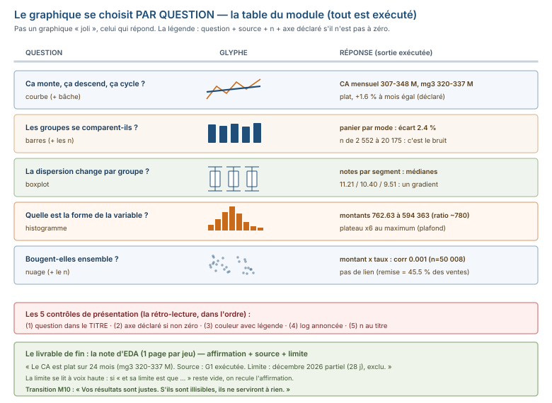

# Module M09.C06 — Visualisations d'exploration et conclusions provisoires : la note d'EDA

**Outils : pandas 2.2.3, numpy 2.3.5, matplotlib 3.10.9, seaborn 0.13.2 (exécutés). Durée
indicative : 5 h. Niveau : N3. Prérequis : M09.C01-C05 (les 5 étapes précédentes),
M08 C08 (les 4 graphiques de base).**

> **L'idée du chapitre.** L'étape 9 pose la question : **« quel graphique répond à la
> question ? »** et l'étape 10 : **« que dis-je, et quelles sont mes limites ? »** C06
> choisit le graphique **par question** (courbe = évolution, barres = comparaison,
> boxplot = dispersion par groupe, histogramme = forme, nuage = association), passe les
> **5 erreurs d'exploration** en revue (l'axe qui ne part pas à zéro **sans le dire**,
> le graphique sans question, la couleur qui porte une info non mentionnée, l'échelle
> logarithmique surprise, le nuage sans taille d'échantillon), et produit le livrable de
> fin de module : la **note d'EDA** — 1 page par jeu, chaque affirmation porte sa
> **source** (sortie exécutée) et sa **limite**. Le fil rouge y revient **complet** :
> la note de la quincaillerie, avec les 3 jeux chacun en un paragraphe. Et la transition
> vers M10 : *« Vos résultats sont justes. S'ils sont illisibles, ils ne serviront à
> rien. »*

> **Matériel de l'atelier — Python 3.13 · pandas 2.2.3 · numpy 2.3.5 · matplotlib 3.10.9 ·
> seaborn 0.13.2.** Tous les graphiques ont été **exécutés** dans l'atelier le 20/09/2026
> sur `03_exercices/dossier_M09/` (graine 45, déterministe, `ATTENDU.json` figé) ; les
> codes publiés sont **ceux de l'atelier**, et chaque sortie citée est une sortie
> exécutée.

---

## 1. Objectifs du chapitre

À la fin de ce chapitre, vous savez :

1. **Choisir le graphique par question** : évolution → courbe, comparaison → barres
   (avec les n), dispersion par groupe → boxplot, forme → histogramme, association →
   nuage — la table question → graphique du module.
2. **Repérer les 5 erreurs d'exploration** et les **écrire en contrôle** : axe sans
   zéro **déclaré**, graphique sans question, couleur informante non mentionnée, échelle
   logarithmique **annoncée**, nuage avec **n**.
3. **Produire les 4 graphiques du projet** en `matplotlib` (courbe CA + bâche, barres
   paniers par mode, nuage montant × taux, boxplot notes par segment) — chaque
   graphique légendé : question + source + ce qu'on doit retenir.
4. **Utiliser `seaborn` pour le confort** (boxplot, heatmap des tableaux croisés) —
   et savoir que le **même** boxplot se fait en `matplotlib` pur (dépendance minimale)
   ou en `seaborn` (l'option confort, documentée).
5. **Écrire la note d'EDA** : 1 page par jeu, affirmation + **source** (sortie) +
   **limite** — et **en lire une écrite par quelqu'un d'autre** (rétro-lecture :
   repérer les 5 erreurs dans une note d'autrui).

## 2. Pourquoi cette notion est importante

Le rapport EDA se **lit** avant de se **vérifier** : un lecteur pressé ne relancera pas
vos commandes, il regardera vos graphiques et vos phrases. Et c'est précisément là que
l'exploration ment le plus souvent — pas dans les chiffres (vérifiés par le protocole,
C01-C05), mais dans **leur présentation** : un axe qui dramatise, une couleur qui
raconte, un graphique qui ne répond à rien. Trois faits du socle fixent l'enjeu :

- la courbe du CA mensuel sur **axe 310-350 M** (pas à zéro) donne l'impression d'une
  forte variation ; sur **axe à zéro**, elle est **plate** — deux graphiques du
  **même** chiffre, deux lectures opposées ;
- le nuage montant × taux de remise **sans n** est illisible : 50 008 points à
  transparence 0.25 **ou** un nuage clair de 200 points ressemblent à la même chose —
   la taille d'échantillon change la lecture, elle doit être **dans** le titre ;
- la note d'EDA du fil rouge tient en **4 affirmations**, chacune avec sa source
  (sortie) et sa limite — c'est le livrable **P4** du projet, et l'épreuve de palier P2
  le note sur la **limite** (ce que l'affirmation ne sait pas), pas sur le chiffre.

## 3. Explication simple — la conversation avec la machine

Le graphique est la **traduction** d'une sortie vers un lecteur. Comme toute
traduction, elle peut trahir :

1. **La question d'abord** — « ce graphique répond à **quelle** question ? » : une
   courbe sans question est une décoration, un boxplot sans question est un
   amas de moustaches. La question est **dans le titre**, pas dans la légende.
2. **L'axe est une décision** — partir de zéro ou non, c'est un **choix d'édition** :
   sur des données **relatives** (part, taux), zéro est honnête ; sur des **niveaux**
   (CA mensuel 300-350 M), zéro écrase la variation — l'**axe non zéro** est légitime
   **s'il est déclaré** (« axe de 310 à 350 M »), jamais s'il est silencieux.
3. **La couleur raconte** — une couleur par groupe **sans légende** est une info
   cachée ; le `n` manquant est une échantillon fantôme ; l'échelle log **surprise**
   est une distribution qu'on a cachée. Les 5 erreurs d'exploration, c'est la liste
   de contrôle de la **présentation**, pas du calcul.

La note d'EDA est la **dernière étape du protocole** : 1 page, chaque affirmation
**sourcée** (la sortie qui la prouve) et **limitée** (ce qu'elle ne dit pas). Le
module s'arrête là — et c'est **le** livrable : pas 40 graphiques jolis, 4 graphiques
qui **répondent** et 1 page qui **garantit**.

## 4. Vocabulaire essentiel

| Terme | Définition |
|---|---|
| **graphique** — *chart* — la traduction visuelle d'une sortie vers un lecteur ; se choisit **par question** (courbe/barres/boxplot/histogramme/nuage) et se **légende** (question + source + n). |
| **légende** | le bloc texte du graphique : question posée, source (sortie exécutée), taille d'échantillon (n), et **l'axe** quand il ne part pas de zéro. |
| **biais de sélection** — *biais d'échantillonnage* — l'écart entre la population étudiée (le fichier) et la population visée (le métier) : les 1 200 clients du fil rouge ne sont pas tous les clients du groupe. |
| **note d'EDA** | le livrable de fin d'exploration : 1 page par jeu, chaque affirmation = **source** (sortie) + **limite** (ce qu'elle ne dit pas). |

## 5. Cours approfondi

### 5.1 Choisir le graphique par question — la table du module

| Question | Graphique | Pourquoi | Chiffre du socle |
|---|---|---|---|
| « Ça monte, ça descend, ça cycle ? » | **courbe** (+ bâche) | l'axe horizontal est le **temps** | CA mensuel 307-348 M, mg3 320-337 M |
| « Les groupes se **comparent**-ils ? » | **barres** (+ n) | la longueur **est** la valeur, le n **est** la fiabilité | panier par mode, n 2 552 à 20 175 |
| « La **dispersion** change-t-elle par groupe ? » | **boxplot** | médiane, iqr, queues — la forme du groupe | notes par segment d'absentéisme |
| « Quelle est la **forme** de la variable ? » | **histogramme** | la répartition **des valeurs**, pas des temps | montants 762.63 à 594 363 FCFA |
| « Les variables **bougent**-elles ensemble ? » | **nuage** (+ n) | chaque point est une observation | montant × taux de remise (n=50 008) |

Le préambule de M10 tient dans cette table : on ne choisit **pas** un graphique « qui
est joli », on choisit **celui qui répond** — et M10 (visualisation) fera le chemin
inverse (le graphique de **communication**, avec ses règles d'édition). En
**exploration** (M09), le graphique est au service de la **question**, pas du lecteur
final.

> **Définition.** **légende** — le bloc texte du graphique : la **question** posée
> (dans le titre), la **source** (la sortie exécutée), la **taille d'échantillon** (n)
> et **l'axe** quand il ne part pas de zéro. Un graphique sans légende est une image ;
> un graphique avec légende est une **réponse** — et c'est la légende que le lecteur
> **vérifie** (pas le code, qu'il ne relance pas).




### 5.2 Les 5 erreurs d'exploration — et leur contrôle

1. **L'axe qui ne part pas à zéro sans le dire.** La courbe du CA mensuel sur axe
   310-350 M (exécuté) « dramatise » la variation (l'œil lit un delta de 40 M comme
   une onde) ; sur axe à zéro, la même courbe est plate. **Le contrôle** : l'axe non
   zéro est **déclaré** dans la légende (« axe 310-350 M ») — jamais silencieux.
2. **Le graphique sans question.** Un boxplot « des notes » sans question ne répond à
   rien. **Le contrôle** : la question est **dans le titre** (« Notes par segment
   d'absentéisme : la dispersion change-t-elle ? »), pas dans un sous-titre.
3. **La couleur qui porte une info non mentionnée.** Colorer les points par `est_retour`
   sans le dire dans la légende, c'est **raconter** une info cachée. **Le contrôle** :
   chaque couleur a sa **légende** — pas de couleur orpheline.
4. **L'échelle logarithmique surprise.** Les montants vont de 762.63 à 594 363 FCFA
   (ratio ~780) : en échelle log, le **plateau** des 6 ventes à 594 363 (C04) se
   « lisse » et disparaît visuellement. **Le contrôle** : l'échelle log est
   **annoncée** (« axe log ») — elle est un **choix d'édition**, pas un défaut.
5. **Le nuage sans taille d'échantillon.** Le nuage montant × taux (exécuté, n=50 008,
   transparence 0.25) : sans le n dans le titre, le lecteur ne sait pas s'il voit
   50 008 points ou 200. **Le contrôle** : le **n est dans le titre** (« n = 50 008
   ventes »), et la transparence est **mentionnée** si elle masque des points.

> **Attention.** L'erreur la plus coûteuse pour le lecteur pressé n'est pas le chiffre
> faux (le protocole l'a vérifié, C01-C05) : c'est la **présentation** qui ment — un
> axe qui **dramatise**, un n qui **masque**, une couleur qui **raconte**. Le chiffre
> est garanti ; la **traduction** est le chapitre, et elle se **contrôle** (les 5
> contrôles, §5.2), elle ne se **suppose** pas.

> **Définition.** **graphique** — *chart* — la traduction visuelle d'une sortie vers un
> lecteur. Il se choisit **par question** (table §5.1), il se **légende** (question +
> source + n + l'axe s'il n'est pas à zéro), et il est **exécuté** (le code est
> re-jouable, la sortie est citée). Un graphique sans question est une décoration ; un
> graphique sans n est un échantillon fantôme.

### 5.3 `matplotlib` — les 4 graphiques du projet

Les 4 graphiques du livrable P3, **exécutés** (les codes sont ceux de l'atelier) :

```python
import matplotlib as mpl; mpl.use("Agg")
import matplotlib.pyplot as plt
import pandas as pd
s = "03_exercices/dossier_M09"
v = pd.read_csv(s + "/quincaillerie/vente.csv", parse_dates=["date_vente"])
v["ct"] = (v["montant_ttc"] * 100).round().astype("int64")

# G1 — courbe : CA mensuel (sans retours) + moyenne glissante 3
vt = v[~v["est_retour"]].groupby(v["date_vente"].dt.to_period("M"))["ct"].sum() // 100
t = vt.index.to_timestamp()
fig, ax = plt.subplots(figsize=(8, 4), dpi=100)
ax.plot(t, vt.values / 1e6, "o-", ms=3, label="CA mensuel (M FCFA, sans retours)")
ax.plot(t, vt.rolling(3).mean().values / 1e6, "-", lw=2, label="moyenne glissante 3 mois")
ax.set_title("CA mensuel — ça monte, ça descend, ça cycle ? (n = 24 mois, axe 310-350 M)")
ax.legend(); ax.set_ylabel("M FCFA")
fig.tight_layout(); fig.savefig("g1_ca_mensuel.png"); plt.close(fig)

# G2 — barres : panier moyen par mode de paiement, avec les n
pm = v.groupby("id_mode")["montant_ttc"].agg(["count", "mean"]).reset_index()
fig, ax = plt.subplots(figsize=(7, 4), dpi=100)
ax.bar(pm["id_mode"].astype(str), pm["mean"] / 1e3)
for i, r in pm.iterrows():
    ax.text(i, r["mean"] / 1e3, f"n={int(r['count'])}", ha="center", va="bottom", fontsize=8)
ax.set_title("Panier moyen par mode de paiement — les tailles sont dans le graphique")
ax.set_ylabel("k FCFA"); ax.set_xlabel("id_mode")
fig.tight_layout(); fig.savefig("g2_panier_mode.png"); plt.close(fig)

# G4 — nuage : montant x taux de remise, avec le n
v["rr"] = v["montant_remise"] / v["montant_ttc"]
fig, ax = plt.subplots(figsize=(6, 4), dpi=100)
ax.scatter(v["montant_ttc"] / 1e3, v["rr"], s=4, alpha=0.25)
ax.set_title(f"Montant x taux de remise (n = {len(v)} ventes ; corr = 0.001 ; transparence 0.25)")
ax.set_xlabel("montant TTC (k FCFA)"); ax.set_ylabel("taux de remise")
fig.tight_layout(); fig.savefig("g4_montant_remise.png"); plt.close(fig)
```

**Ce que chacun répond** (la légende, pas la décoration) :

- **G1** — « Ça monte, ça descend, ça cycle ? » : la bâche (orange) est **plate**
  (320-337 M), la série (bleue) oscille (307-348 M) — **ni cycle, ni dérive forte**
  (C03 : +1.6 % à mois égal) ; le titre **déclare l'axe 310-350 M** (erreur n°1
  contrôlée).
- **G2** — « Les paniers diffèrent par mode ? » : les barres sont **quasi
  identiques** (156-160 k), et les **n sont dans le graphique** (2 552 à 20 175) —
  l'écart de 2.4 % est **du bruit de taille** (C05), la légende le dit.
- **G4** — « Remises et montants vont-ils ensemble ? » : le nuage est une **bande
  horizontale** (taux 0 à 0.015, corr 0.001) — **pas de lien** ; le **n est dans le
  titre**, la transparence est **mentionnée** (erreurs n°5 et n°3 contrôlées).

### 5.4 `seaborn` — le confort, documenté

`seaborn` (option confort) reprend le **même** boxplot et fait la **heatmap** des
tableaux croisés, **exécutés** :

```python
import seaborn as sns
import pandas as pd
s = "03_exercices/dossier_M09"
no = pd.read_csv(s + "/scolaire/note.csv")
ab = pd.read_csv(s + "/scolaire/absence.csv")
el = pd.read_csv(s + "/scolaire/eleve.csv")
no_p = no[(no["note"] >= 0) & (no["note"] <= 20)].copy()
abs_par = ab.groupby("id_eleve")["duree_jours"].sum()
taux = abs_par.reindex(sorted(no_p["id_eleve"].unique()), fill_value=0)
no_p["seg"] = pd.cut(taux.reindex(no_p["id_eleve"].values, fill_value=0).values,
                     [-0.1, 1.9, 5.9, 99], labels=["<2 j", "2-5 j", ">=6 j"])

# G3 — boxplot : notes par segment d'absentéisme
fig, ax = plt.subplots(figsize=(6, 4), dpi=100)
sns.boxplot(data=no_p, x="seg", y="note",
            order=["<2 j", "2-5 j", ">=6 j"], ax=ax)
ax.set_title("Notes par segment d'absentéisme : la dispersion change-t-elle ? (n = 6000 notes)")
fig.tight_layout(); fig.savefig("g3_notes_segment.png"); plt.close(fig)

# G5 — heatmap : le tableau croisé matière x trimestre (C05)
h = no_p.pivot_table(index="matiere", columns="trimestre", values="note", aggfunc="mean")
fig, ax = plt.subplots(figsize=(6, 4), dpi=100)
sns.heatmap(h, annot=True, fmt=".2f", cmap="viridis", ax=ax)
ax.set_title("Moyennes matière x trimestre (heatmap seaborn) — n = 6000 notes")
fig.tight_layout(); fig.savefig("g5_heatmap.png"); plt.close(fig)
```

**Le boxplot** (G3) répond « la dispersion change-t-elle par segment ? » : les 3
boîtes montrent le **gradient** (médianes 11.21 / 10.40 / 9.51) **et** les queues —
la médiane descend de 1.7 point du segment bas au segment haut. **La heatmap** (G5)
est le **tableau croisé** (C05 §5.5) rendu lisible : les cases stables (±0.1) se
voient, le **classement des matières** (histoire_geographie en tête) se lit sur les 5
lignes. Le **même** boxplot se fait en `matplotlib` pur (`ax.boxplot`) — `matplotlib`
est la **dépendance minimale** (le projet l'utilise), `seaborn` est **l'option
confort**, et les deux produisent **le même** graphique sur les **mêmes** données.

> **Attention.** Un graphique produit en `seaborn` **sans** son équivalent
> `matplotlib` est une **dépendance non documentée** : le lecteur (et l'évaluateur)
> doit pouvoir **re-jouer** le graphique avec la dépendance minimale — c'est la raison
> pour laquelle le projet utilise `matplotlib` et `seaborn` est **documenté**, pas
> **implicite**.

> **Définition.** **biais de sélection** — *biais d'échantillonnage* — l'écart entre
> la population **étudiée** (le fichier) et la population **visée** (le métier) : les
> 1 200 clients du fil rouge ne sont pas **tous** les clients du groupe, les 400
> élèves ne sont pas **tous** les élèves de l'établissement. C'est la **limite** la
> plus fréquente de la note d'EDA : on ne généralise qu'**à la population du fichier**,
> pas au-delà — et on le **dit**.

### 5.5 La note d'EDA — 1 page, affirmation + source + limite

La note d'EDA (l'étape 10, le livrable **P4**) est **1 page par jeu**. Chaque
affirmation porte **3 choses** : la **phrase** (ce qu'on dit), la **source** (la
sortie exécutée qui la prouve), et la **limite** (ce qu'elle **ne** dit pas). Le
**contrôle** de la note : relire chaque affirmation et se demander « qu'est-ce que
cette phrase **ne** peut **pas** conclure ? » — c'est la **limite**. La note de la
quincaillerie (fil rouge) est au §6 ; voici sa **structure** (4 affirmations) :

1. **Tendance** : « Le CA (sans retours) est **plat** sur 24 mois » — source : G1 +
   mg3 (320-337 M) — limite : « décembre 2026 partiel (28 j), exclu ; 5 magasins
   agrégés, pas par magasin ».
2. **Données** : « 8 doublons métier exclus (50 008 → 50 000 ventes) » — source :
   `duplicated` (C01/C02) — limite : « les 15 deadlines inversées et les 21 406 dates
   naïves sont **déclarées**, non corrigées (source à confirmer) ».
3. **Clients** : « Le top 10 % des clients pèse 13.8 % du CA (clientèle plate) » —
   source : groupby CA — limite : « le fichier ne porte pas le **segment** client
   (particulier/entreprise) — lecture en CA seul ».
4. **Remises** : « Pas de lien taux de remise × montant (corr 0.001) » — source :
   G4 — limite : « 45.5 % des ventes sans remise ; conclusion en **taux**, pas sur la
   politique de remise ».

> **Définition.** **note d'EDA** — le livrable de **fin** d'exploration : 1 page par
> jeu, où chaque affirmation porte sa **source** (la sortie exécutée, **re-jouable**)
> et sa **limite** (ce qu'elle **ne** dit pas, **remplie**). Ce n'est ni le rapport
> complet (10 étapes, P2), ni un résumé : c'est la **garantie** — le lecteur y vérifie
> les **limites**, pas les chiffres (déjà validés par le protocole).

> **À retenir.** La note d'EDA **garantit** : chaque affirmation est **sourcée** (la
> sortie qui la prouve, re-jouable) et **limitée** (ce qu'elle ne dit pas, écrit). Le
> lecteur ne relance pas vos commandes — il lit vos **limites**. C'est **elles** qui
> font la différence entre un rapport de stagiaire et un rapport **d'analyste**.

### 5.6 Lire une note d'autrui — la rétro-lecture

L'exercice de **rétro-lecture** (un collègue a écrit la note, vous la lisez) est la
meilleure école de la **présentation** : on repère les 5 erreurs **sans** relancer le
code. Le contrôle de rétro-lecture tient en 5 questions, **dans l'ordre** :

1. **Quelle question** ce graphique répond-il ? (sinon : erreur n°2)
2. L'**axe** est-il à zéro, ou **déclaré** s'il ne l'est pas ? (sinon : erreur n°1)
3. Chaque **couleur** a-t-elle sa **légende** ? (sinon : erreur n°3)
4. L'**échelle** (log/lin) est-elle **annoncée** ? (sinon : erreur n°4)
5. Le **n** est-il **dans** le titre, et la transparence mentionnée ? (sinon : erreur n°5)

Une note qui passe les 5 questions est **présentable** ; une note qui en échoue une
est **rejetée en présentation** (pas en calcul — les chiffres ont été vérifiés par le
protocole, c'est la **traduction** qui est en défaut).

## 6. Exemple concret — la note d'EDA de la quincaillerie (fil rouge, complète)

**NOTE D'EDA — Quincaillerie (fil rouge M07/M08)** · période 2025-01-01 → 2026-12-28 ·
5 magasins · 1 200 clients · 380 produits · source : `dossier_M09/quincaillerie`
(empreinte `b9a8d973119342ec…`, 19 totaux = M07/M08).

1. **Le CA (sans retours) est plat sur 24 mois** : mensuel 307-348 M FCFA, moyenne
   glissante 3 mois entre 320 et 337 M — ni cycle de fin d'année (décembre 2025 :
   315 M, sous la moyenne), ni dérive forte (+1.6 % à mois égal). *Source : G1
   (courbe + bâche, exécutée).* *Limite : décembre 2026 partiel (28 jours), exclu des
   conclusions ; agrégat des 5 magasins, pas par magasin.*
2. **Les données portent 8 doublons métier, exclus** : 50 008 → 50 000 ventes
   distinctes, retours 208 → 200, écart CA retours 31 939 568 FCFA. *Source :
   `duplicated` sur les 12 colonnes hors `id_vente` (C01/C02, exécuté).* *Limite : les
   15 deadlines inversées et les 21 406 dates sous la condition naïve sont **déclarées
  **, non corrigées — correction soumise à la source.*
3. **La clientèle est plate** : le top 10 % des clients (120) pèse 13.8 % du CA ; le
   top 1 (client 73, 11 561 025 FCFA) pèse 0.15 % à lui seul. *Source : groupby CA par
   client (exécuté).* *Limite : le fichier ne porte pas le **segment** client (particulier
   / entreprise) — lecture en CA seul ; 1 200 clients, pas tous les clients du groupe
   (biais de sélection).*
4. **Pas de lien entre le taux de remise et le montant** (corr 0.001, taux max 0.015) :
   le 0.552 obtenu en **FCFA** est un effet de **scale**, pas un comportement. *Source :
   G4 (nuage, n=50 008, exécuté) + C05 §5.1.* *Limite : 45.5 % des ventes sans remise —
   la conclusion est en **taux**, pas sur la politique de remise.*

**Les 3 jeux, chacun en un paragraphe** (la note rejoue les jeux 2 et 3 arrivés en
C02/C05) : le **centre de santé** — « la fréquentation est **saisonnier** (étés 853 vs
hivers 655 consultations/mois, pic 2025-07 : 882), avec une rupture **qui compte**
(M01, 3 jours au pic de juillet) et 4 défauts de saisie corrigés par récurrence (545,
253, 278, 411) » (*limite : 2 étés seulement, cause hors fichier*) ; l'**établissement
scolaire** — « absentéisme et résultats **associés** (−0.232), partiellement par une
variable tierce (contrôle T1 : −0.145/−0.085/+0.163) ; la 4e est la classe la plus
absente (4.26 j) » (*limite : corrélation, pas causalité ; sens non départagé ; 3
élèves absents-notés non exclus du brut*).

> **Dans les faits.** La note d'EDA du fil rouge (celle-ci) tient en **4 affirmations**
> (une quinzaine de lignes de texte) et les 4 graphiques en **une quarantaine de
> lignes de code** : exécutés, les 5 graphiques de l'atelier (G1-G5) pèsent entre 20
> et 59 Ko, et le **temps atelier** du livrable P3+P4 est d'environ **40 minutes**
> (les graphiques d'abord, la note ensuite, la rétro-lecture en dernier) : c'est le
> **livrable** du module, et il se **lit** en 3 minutes — c'est **ça** qu'on rend, pas
> 40 graphiques.

## 7. Démonstration pas à pas — 5 étapes sur les deux jeux

```python
import matplotlib as mpl; mpl.use("Agg")
import matplotlib.pyplot as plt
import seaborn as sns
import pandas as pd
s = "03_exercices/dossier_M09"
v = pd.read_csv(s + "/quincaillerie/vente.csv", parse_dates=["date_vente"])
no = pd.read_csv(s + "/scolaire/note.csv")
ab = pd.read_csv(s + "/scolaire/absence.csv")

# 1 — la table question -> graphique (choix)
#    évolution -> courbe (G1) | comparaison -> barres+n (G2) | dispersion -> boxplot (G3)
#    forme -> histogramme | association -> nuage+n (G4)

# 2 — G1 : courbe CA + bâche (axe non zéro DECLARE dans le titre)
v["ct"] = (v["montant_ttc"] * 100).round().astype("int64")
vt = v[~v["est_retour"]].groupby(v["date_vente"].dt.to_period("M"))["ct"].sum() // 100
fig, ax = plt.subplots(figsize=(8, 4), dpi=100)
ax.plot(vt.index.to_timestamp(), vt.values / 1e6, "o-", ms=3)
ax.plot(vt.index.to_timestamp(), vt.rolling(3).mean().values / 1e6, "-", lw=2)
ax.set_title("CA mensuel — ça monte, ça descend, ça cycle ? (n = 24 mois, axe 310-350 M)")
fig.tight_layout(); fig.savefig("g1.png"); plt.close(fig)

# 3 — G2 : barres paniers par mode, avec les n
pm = v.groupby("id_mode")["montant_ttc"].agg(["count", "mean"]).reset_index()
fig, ax = plt.subplots(figsize=(7, 4), dpi=100)
ax.bar(pm["id_mode"].astype(str), pm["mean"] / 1e3)
for i, r in pm.iterrows():
    ax.text(i, r["mean"] / 1e3, f"n={int(r['count'])}", ha="center", va="bottom", fontsize=8)
ax.set_title("Panier moyen par mode de paiement — les tailles sont dans le graphique")
fig.tight_layout(); fig.savefig("g2.png"); plt.close(fig)

# 4 — G3 : boxplot seaborn (notes par segment d'absentéisme)
no_p = no[(no["note"] >= 0) & (no["note"] <= 20)].copy()
taux = ab.groupby("id_eleve")["duree_jours"].sum()
no_p["seg"] = pd.cut(taux.reindex(no_p["id_eleve"].values, fill_value=0).values,
                     [-0.1, 1.9, 5.9, 99], labels=["<2 j", "2-5 j", ">=6 j"])
fig, ax = plt.subplots(figsize=(6, 4), dpi=100)
sns.boxplot(data=no_p, x="seg", y="note", order=["<2 j", "2-5 j", ">=6 j"], ax=ax)
ax.set_title("Notes par segment d'absentéisme (n = 6000 notes)")
fig.tight_layout(); fig.savefig("g3.png"); plt.close(fig)

# 5 — la note d'EDA : chaque affirmation = phrase + source + limite (le §6 est la sortie)
print("note d'EDA : 4 affirmations fil rouge + 3 jeux (voir §6)")
```

## 8. Erreurs fréquentes

1. **L'axe non zéro silencieux** — la courbe CA sur axe 310-350 M **sans le dire** :
   le lecteur lit une onde là où il y a une série plate. L'axe non zéro est **légitime
   s'il est déclaré** (« axe 310-350 M » dans le titre), jamais silencieux.
2. **Le graphique sans question** — un boxplot « des notes » : la question est **dans
   le titre** (« la dispersion change-t-elle par segment ? »), sinon le graphique est
   une décoration, pas une réponse.
3. **La couleur orpheline** — colorer par `est_retour` sans légende : la couleur
   **raconte** une info cachée ; chaque couleur a sa **légende**, pas de couleur
   orpheline.
4. **L'échelle log surprise** — le plateau des 6 ventes à 594 363 (C04) **disparaît**
   en échelle log non annoncée : l'échelle log est un **choix d'édition**, elle est
   **annoncée** (« axe log »), jamais silencieuse.
5. **Le nuage sans n** — 50 008 points **ou** 200 points ressemblent à la même bande :
   le **n est dans le titre**, et la transparence est **mentionnée** si elle masque des
   points.

## 9. Bonnes pratiques professionnelles

1. **La question est dans le titre** — jamais dans un sous-titre ni dans le pied de
   page : le titre du graphique **est** la question (« Ça monte, ça descend, ça
   cycle ? »), la légende porte la source et le n.
2. **L'axe se déclare s'il n'est pas à zéro** — « axe 310-350 M » dans le titre ;
   sur des données **relatives** (part, taux), zéro est l'axe **honnête**.
3. **Le n est dans le titre, la transparence est mentionnée** — « n = 50 008 ventes ;
   transparence 0.25 » : l'échantillon **fantôme** est l'erreur la plus coûteuse du
   lecteur pressé.
4. **`matplotlib` pour le projet, `seaborn` pour le confort** — le même boxplot en
   `ax.boxplot` (dépendance minimale) ou en `sns.boxplot` (confort) : on documente
   **les deux** produisent le **même** graphique sur les **mêmes** données.
5. **La note d'EDA garantit les limites** — chaque affirmation : phrase + source
   (re-jouable) + **limite** (ce qu'elle ne dit pas) : c'est la limite qui fait la
   différence entre un stagiaire et un **analyste** (l'épreuve P2 note **la limite**).

> **Conseil professionnel.** La note d'EDA se **lit à voix haute** avant d'être rendue :
> chaque affirmation « … et sa limite est que … » — si la phrase « et sa limite est
> que » reste **vide** pour une affirmation, c'est que l'affirmation **déborde** de ce
> que les données disent, et elle est **reculée** (ou retirée). La limite n'est pas une
> décoration de fin de phrase, c'est le **contrôle** de l'affirmation.

## 10. Exercice guidé — « la rétro-lecture de la note d'autrui » (25 min, /10)

**Consigne.** Un collègue a rendu cette note d'EDA (le code est **correct**, c'est la
**présentation** qui est en cause). Repérez les **5 défauts de présentation** (1 pt
chacun), puis réécrivez le **titre** et la **légende** de chaque graphique en les
corigeant (2 pts pour l'ensemble) :

> **Note d'EDA — Quincaillerie** · 5 magasins
> 1. *Graphique A* (courbe du CA mensuel, axe 310-350 M) : « Le CA est en **forte
>    baisse** depuis mars 2026. »
> 2. *Graphique B* (barres du panier par mode, sans n) : « Les modes de paiement
>    **différencient** le panier. »
> 3. *Graphique C* (nuage montant × remise **en FCFA**, sans n) : « Les remises
>    **causent** la baisse du CA. »
> 4. *Graphique D* (boxplot des notes, sans question) : « Les notes des élèves. »
> 5. *Affirmation* : « Les 1 200 clients du fichier **représentent tous les clients**
>    du groupe. »

## 11. Exercices autonomes

**E1 — La note d'EDA du centre de santé (30 min).** Écrire la **note d'EDA complète**
(1 page) du jeu 2 : 4 affirmations (saisonnalité, rupture qui compte, 4 défauts
corrigés, fréquentation type), chacune avec **source** (sortie exécutée) et **limite**.
Contrainte : la phrase « et sa limite est que … » doit être **remplie** pour chacune —
une limite vide = une affirmation qui déborde.

**E2 — Les 5 erreurs, chacune produite et contrôlée (30 min).** Sur `vente.csv` :
produire **chacune** des 5 erreurs d'exploration (axe non zéro silencieux, graphique
sans question, couleur orpheline, échelle log surprise, nuage sans n) **puis** son
**contrôle** (la déclaration qui la corrige) — 5 graphiques × 2, chacun légendé avant
/ après.

## 12. Correction détaillée

**Exercice guidé — les 5 défauts de présentation :**

1. **Graphique A** — **axe non zéro silencieux** (+ une **tendance fausse** : mars
   2026 fait 338 M, **au-dessus** de la moyenne ; il n'y a **pas** de baisse) :
   déclarer « axe 310-350 M » dans le titre, et corriger la tendance (« le CA est
   **stable** autour de 328 M, mars 2026 à 338 M est **au-dessus** de la moyenne »).
2. **Graphique B** — **barres sans n** : les paniers sont **quasi identiques** (156-160
   k, écart 2.4 %) pour des groupes de **2 552 à 20 175** ventes (rapport 8) — mettre
   les **n dans le graphique** et corriger (« les modes **ne différencient pas** le
   panier : écart 2.4 % sur des groupes de rapport 8 = bruit de taille »).
3. **Graphique C** — **nuage sans n** + **scale** (remises en **FCFA**, corr 0.552 =
   effet de scale, pas de comportement) + **causalité** (« causent ») : mettre le **n
   dans le titre**, passer au **taux** (corr **0.001**), et corriger (« **pas de lien**
   entre le **taux** de remise et le montant ; association, pas causalité »).
4. **Graphique D** — **boxplot sans question** : la question est **dans le titre**
   (« Notes par segment d'absentéisme : la **dispersion** change-t-elle ? (n = 6000
   notes) »).
5. **Affirmation** — **biais de sélection** : les 1 200 clients du fichier ne sont
   **pas** tous les clients du groupe ; corriger (« les 1 200 clients du **fichier** —
   pas une population complète ; **limite** de généralisation »).

**Ensemble (2 pts)** : les 5 titres/légendes corrigés portent chacun la **question**
(titre), la **source** (sortie), le **n**, et **l'axe déclaré** s'il n'est pas à zéro.

**E1.** (structure attendue, les sorties sont celles de l'atelier) — 1. *Saisonnalité* :
« la fréquentation est **saisonnier** : étés 853 vs hivers 655 consultations/mois,
pic 2025-07 (882), dimanche 405 vs lundi 3 710 » — *source : groupby mois/jour de
semaine (exécuté, C03)* — *limite : 2 étés seulement, la cause (pluies) est **hors
fichier***. 2. *Rupture qui compte* : « M01 rompu 3 jours (2025-07-14 → 16) **au pic**
de juillet, M02 5 jours (2026-03-02 → 06), M04 2 jours » — *source : stock à zéro
groupé (exécuté, C04)* — *limite : c'est un **fait** (offre coupée), pas un défaut à
corriger*. 3. *4 défauts corrigés* : « 4 stocks négatifs corrigés par **récurrence**
(545, 253, 278, 411), 23 motifs vides gardés en signalant, 7 doublons exclus, 1 date
future exclue » — *source : C04 (exécuté)* — *limite : la date future est **exclue**,
sa correction (2025-01-05) est **soumise à la source***. 4. *Fréquentation type* :
« pic du matin (09:00 : 2 319), creux du midi (12:00 : 927) » — *source : groupby
heure (exécuté, C03)* — *limite : 10 heures seulement, pas de nuit/week-end
différencié*.

**E2.** (les 5 paires erreur → contrôle, sur `vente.csv`) — 1. *Axe non zéro* :
courbe CA axe 310-350 M **silencieux** → **contrôle** : « axe 310-350 M » dans le
titre. 2. *Sans question* : boxplot « des montants » → **contrôle** : « Montant par
quantité : la **forme** change-t-elle ? (n = 50 008) ». 3. *Couleur orpheline* :
points colorés par `est_retour` sans légende → **contrôle** : légende « rouge =
retour, bleu = vente (n retours = 208) ». 4. *Échelle log surprise* : histogramme des
montants en log **non annoncée** (le plateau 594 363 disparaît) → **contrôle** :
« axe **log** » dans le titre. 5. *Nuage sans n* : montant × taux **sans n** →
**contrôle** : « n = 50 008 ventes ; transparence 0.25 » dans le titre.

## 13. Mini-projet M09.P6 — « P3 + P4 : les 4 graphiques et la note » (1 h)

**Énoncé.** Le **livrable final** du projet M09.P : (P3) les **4 graphiques** du jeu
travaillé, **chacun** légendé (question dans le titre, source, n, axe déclaré s'il
n'est pas à zéro) ; (P4) la **note d'EDA** (1 page), 4 affirmations chacune avec
**source** (re-jouable) et **limite** (remplie). Auto-évaluation : lire la note **à
voix haute** — chaque « et sa limite est que … » est-elle **remplie** ? Chaque
graphique répond-il à une **question** écrite dans son **titre** ? Un graphique sans
question ou une affirmation sans limite = un livrable **incomplet** (pas un graphique
jol
i, mais un graphique qui **répond**). Le projet M09.P s'arrête là : c'est le
**livrable** du module — 4 graphiques qui répondent, 1 page qui garantit.

## 14. Boîte à outils du chapitre

> **Boîte à outils.** Le choix : la table question → graphique (§5.1) — courbe/barres/
> boxplot/histogramme/nuage. `matplotlib` (dépendance minimale) : `ax.plot` (courbe),
> `ax.bar` (barres), `ax.scatter` (nuage), `ax.boxplot` (boxplot pur) ; `seaborn`
> (confort) : `sns.boxplot`, `sns.heatmap` (les tableaux croisés, C05). Les 5 contrôles
> : question dans le titre, axe déclaré s'il n'est pas à zéro, chaque couleur a sa
> légende, échelle annoncée, n dans le titre. La note d'EDA : affirmation + source
> (re-jouable) + limite (remplie) — 1 page par jeu.

| Besoin | Commande | Chiffre du socle |
|---|---|---|
| courbe + bâche | `ax.plot` + `rolling(3).mean()` | CA mensuel 307-348 M, mg3 320-337 M |
| barres + n | `ax.bar` + `ax.text(f"n={n}")` | panier par mode, n 2 552 à 20 175 |
| boxplot | `sns.boxplot` (ou `ax.boxplot`) | notes par segment, médianes 11.21/10.40/9.51 |
| nuage + n | `ax.scatter(alpha=0.25)` + n au titre | montant × taux (n=50 008, corr 0.001) |
| heatmap | `sns.heatmap(annot=True)` | matière × trimestre (5×3, stable) |
| forme | `ax.hist` (échelle log **annoncée**) | montants 762.63 à 594 363 (ratio ~780) |

## 15. Résumé du chapitre

Les étapes 9-10 du protocole (« quel graphique répond à la question ? » / « que dis-je,
et quelles sont mes limites ? ») sont exécutées pour **clore le module** : le graphique
se choisit **par question** (courbe = évolution, barres = comparaison **avec les n**,
boxplot = dispersion par groupe, histogramme = forme, nuage = association **avec le
n**), et passe les **5 erreurs d'exploration** en contrôle (l'axe non zéro **déclaré**,
le graphique **avec question** dans le titre, la couleur **avec légende**, l'échelle
log **annoncée**, le nuage **avec n**). Les **4 graphiques du projet** sont exécutés en
`matplotlib` (courbe CA + bâche, barres paniers par mode **avec les n**, nuage montant
× taux **avec le n**) et le **boxplot** + la **heatmap** en `seaborn` (le **même**
boxplot se fait en `matplotlib` pur — `matplotlib` est la **dépendance minimale**,
`seaborn` l'option **confort**, les deux produisent le **même** graphique sur les
**mêmes** données). Le **livrable de fin** est la **note d'EDA** : 1 page par jeu,
chaque affirmation = **phrase** + **source** (sortie re-jouable) + **limite** (remplie)
— la note du fil rouge (quincaillerie) porte **4 affirmations** (tendance plate 307-348
M, 8 doublons exclus 50 008 → 50 000, clientèle plate top 10 % = 13.8 % du CA, pas de
lien taux de remise × montant corr 0.001) et **rejoue les 3 jeux** chacun en un
paragraphe (santé : saisonnier 853/655 + rupture qui compte ; scolaire : associé
−0.232 partiellement par une tierce variable + 4e la plus absente 4.26 j). La
**rétro-lecture** (lire une note d'autrui) est la 6ᵉ école : 5 questions dans l'ordre
(question, axe, couleur, échelle, n) départagent le **présentable** du **rejetable en
présentation**. Et la transition vers M10 tient en une phrase : *« Vos résultats sont
justes. S'ils sont illisibles, ils ne serviront à rien. »*

## 16. À retenir

> **À retenir.** Le graphique se choisit **par question**, il se **légende** (question
> + source + n + axe déclaré), et la note d'EDA **garantit** — chaque affirmation est
> **sourcée** (re-jouable) et **limitée** (remplie). Le module s'arrête là : pas 40
> graphiques jolis, **4 qui répondent** et **1 page qui garantit**.

1. **La question est dans le titre** — jamais dans un sous-titre : le titre **est** la
   question, la légende porte la source et le n.
2. **Les 5 erreurs ont 5 contrôles** : axe déclaré s'il n'est pas à zéro, graphique
   avec question, couleur avec légende, échelle log annoncée, nuage avec n.
3. **L'axe non zéro est légitime s'il est déclaré** — sur les données **relatives**
   (taux, part), zéro est l'axe **honnête** ; sur les **niveaux**, déclarer.
4. **`matplotlib` pour le projet, `seaborn` pour le confort** — le même boxplot en
   `ax.boxplot` ou `sns.boxplot` : dépendance minimale vs confort, les **mêmes**
   données.
5. **La note d'EDA garantit les limites** — phrase + source (re-jouable) + **limite**
   (remplie) : c'est la **limite** qui fait la différence (l'épreuve P2 la **note**).
6. **La rétro-lecture est l'école** — 5 questions dans l'ordre (question, axe, couleur,
   échelle, n) : on repère la **présentation** en défaut **sans** relancer le code.
7. **Le livrable du module** : 4 graphiques qui **répondent** + 1 page qui **garantit**
   — et la transition M10 : *« Vos résultats sont justes. S'ils sont illisibles, ils ne
   serviront à rien. »*

## 17. Évaluation formative (auto-correction, 8 min)

1. **Quelle question chaque graphique répond-il (courbe, barres, boxplot, histogramme,
   nuage) ?**
   → courbe = évolution (« ça monte, ça descend, ça cycle ? »), barres = comparaison
   (avec les n), boxplot = dispersion par groupe, histogramme = forme de la variable,
   nuage = association (avec le n) — le graphique se choisit **par question**, pas par
   joliesse. (2 pts)
2. **La courbe du CA mensuel est sur axe 310-350 M. C'est une erreur ?**
   → pas **si elle est déclarée** (« axe 310-350 M » dans le titre) ; c'est une erreur
   **silencieuse** sans déclaration — l'œil lit une onde là où il y a une série plate
   (320-337 M en bâche). L'axe non zéro est un **choix d'édition légitime**, jamais
   silencieux. (2 pts)
3. **Pourquoi le n est-il dans le titre du nuage (et la transparence mentionnée) ?**
   → 50 008 points **ou** 200 points ressemblent à la même bande : sans le **n**, le
   lecteur ne sait pas la taille de l'échantillon (échantillon **fantôme**) ; la
   transparence qui **masque** des points doit être **mentionnée** (0.25 ici). (2 pts)
4. **Les 6 ventes à 594 363 (C04) en histogramme log non annoncée : que se passe-t-il,
   et pourquoi ?**
   → le **plateau** du montant max se **lisse/disparaît** visuellement : l'échelle log
   (ratio ~780 des montants) **compresse** l'extrême — c'est un **choix d'édition**
   qui doit être **annoncé** (« axe log »), sinon c'est une distribution **cachée**. (2 pts)
5. **Quelle est la structure d'une affirmation de la note d'EDA ?**
   → **phrase** (ce qu'on dit) + **source** (la sortie exécutée, **re-jouable**) +
   **limite** (ce qu'elle **ne** dit pas, **remplie**) : la limite est le **contrôle**
   de l'affirmation — une limite vide = une affirmation qui **déborde** (reculée ou
   retirée). (2 pts)
6. **`matplotlib` vs `seaborn` : lequel pour le projet, et pourquoi les deux sont-ils
   documentés ?**
   → `matplotlib` est la **dépendance minimale** (le projet l'utilise : courbe, barres,
   nuage, boxplot pur `ax.boxplot`) ; `seaborn` est l'**option confort** (boxplot,
   heatmap des tableaux croisés) — les deux produisent le **même** boxplot sur les
   **mêmes** données, et on **documente** les deux. (2 pts)
7. **La rétro-lecture : les 5 questions, dans l'ordre ?**
   → (1) quelle **question** ce graphique répond-il ? (2) l'**axe** est-il à zéro ou
   **déclaré** ? (3) chaque **couleur** a-t-elle sa **légende** ? (4) l'**échelle**
   (log/lin) est-elle **annoncée** ? (5) le **n** est-il **dans le titre** (et la
   transparence mentionnée) ? — une note qui passe les 5 est **présentable**. (2 pts)
8. **Pourquoi l'épreuve de palier P2 note-t-elle la « limite » plutôt que le chiffre ?**
   → parce que les **chiffres** ont déjà été **vérifiés** par le protocole (C01-C05,
   autovalidés `--strict`) : ce qui reste à juger, c'est **l'honnêteté** — ce que
   l'affirmation **ne** dit pas. La **limite** est la signature de l'**analyste** (pas
   du stagiaire qui calcule), et c'est **elle** que le lecteur pressé **lit**. (2 pts)
