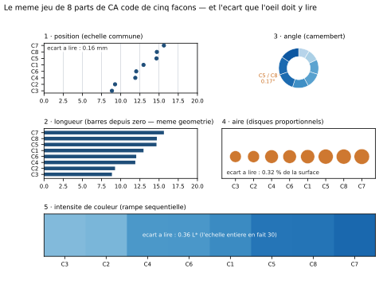

# Module M10.C01 — Comment l'œil lit un graphique : l'ordre perceptuel et ce qu'il prescrit

**Outils : matplotlib 3.10.9, pandas 2.2.3, numpy 2.3.5 (exécutés dans ce chapitre) ; seaborn 0.13.2
(annoncé, C03 et C07) ; Excel (exécuté, C07) ; Power BI (cité, non exécuté, C07).
Durée indicative : 4 h. Niveau : N3. Prérequis : M09 (la question avant le chiffre, et les quatre
graphiques de la note d'exploration en C06) et M02 (les statistiques descriptives).**

> **L'idée du chapitre.** Un graphique n'est pas une décoration : c'est un **codage**. Une question
> métier se traduit en une **tâche de lecture** — comparer deux barres, suivre une courbe, repérer un
> écart à une moyenne — et l'œil ne réussit pas toutes ces tâches avec la même précision. Ce chapitre
> donne la hiérarchie des cinq familles de codage (position, longueur, angle, aire, intensité de
> couleur), la **mesure** sur un même jeu de 8 parts, et la règle qui en découle : **l'encodage se
> choisit après la question et avant le logiciel**. Sorties du chapitre : un graphique exécuté, une
> lecture comparée chiffrée (les mêmes 8 valeurs codées de cinq façons) et la **première version de la
> grille de conception en 18 points**.

> **Matériel de l'atelier — Python 3.13 · matplotlib 3.10.9 · pandas 2.2.3 · numpy 2.3.5.** Toutes les
> commandes de ce chapitre ont été exécutées dans l'atelier le 20/09/2026. La planche du chapitre,
> `figures/M10_C01_cinq_encodages.svg`, est produite par `tools/perception_M10.py` : deux exécutions
> donnent le **même fichier** (aucun horodatage, identifiants figés). Les mesures sont celles du socle
> M09 — les **50 008 ventes** de la quincaillerie — déjà utilisées par le dossier de refonte du module.

---

## 1. Objectifs du chapitre

À la fin de ce chapitre, vous savez :

1. **Nommer les cinq familles de codage** d'un graphique (position, longueur, angle, aire, intensité de
   couleur) et dire quelle **tâche de lecture** chacune sert.
2. **Dérouler la hiérarchie perceptuelle** établie par les expériences de perception graphique et la
   citer **avec ses chiffres** : l'erreur moyenne des jugements de longueur dépasse celle des jugements
   de position de 40 % à 250 %, celle des jugements d'angle la double à peu près.
3. **Mesurer** ce qu'un écart de données devient dans chaque famille : sur les 8 parts du fil rouge,
   l'écart le plus petit (0,05 point) vaut **0,4 mm** sur un axe large comme la page, **0,17°** sur un
   camembert, **0,32 %** de surface sur des disques, **0,36 L\*** sur une rampe de couleur.
4. **Choisir un encodage dans le bon ordre** : la question d'abord, la tâche ensuite, l'encodage, et
   le logiciel en dernier — et dire pourquoi l'ordre inverse produit des graphiques irréprochables
   qui ne répondent à rien.
5. **Remplir la première version de la grille de conception en 18 points** (4 familles : décision
   servie, justesse, lisibilité, utilisation) sur un graphique fourni.

## 2. Pourquoi cette notion est importante

Un décideur ne lit pas un graphique : il le **regarde cinq secondes**, puis décide. Ces cinq secondes
ne sont pas du temps perdu, c'est le budget de lecture — et tout graphique mal encodé le dépense à
faire deviner au lecteur ce que les données disent déjà.

L'enjeu du module tient dans une phrase : **un graphique faux se repère, un graphique trompeur non**.
Le rapport commercial fourni avec ce module (dossier M10) ne contient pas un seul chiffre faux ; ses
totaux sont exacts. Ce sont ses graphiques qui font lire autre chose : un axe qui commence à 300 M
transforme une variation de 5,4 % en falaise, deux échelles superposées fabriquent une corrélation de
0,35, un camembert à huit parts invite à classer des parts séparées de 0,05 point. Personne ne peut
accuser le rapport de mensonge : il n'y a rien à réfuter, seulement des **décisions de codage** —
prises, le plus souvent, sans savoir qu'on les prenait.

Ce chapitre est le premier des sept du module parce qu'il donne **la contrainte qui commande les six
autres** : ce que l'œil peut lire, et à quel prix. Il prolonge directement M09 : vous y avez appris à
poser la question avant le chiffre ; vous apprenez ici à poser la question avant **la forme**.

> **Définition.** Le **budget de lecture** est le temps qu'un lecteur accorde réellement à un
> graphique dans un dossier ou une réunion : de l'ordre de quelques secondes. Tout ce chapitre se
> juge à l'aune de ce budget — un codage se choisit pour ce que le lecteur peut faire **dans ce
> temps-là**, pas pour ce qu'un analyste peut faire en cinq minutes devant le même dessin.

> **Dans les faits.** Sur le fil rouge, la plus petite part de chiffre d'affaires par catégorie vaut
> 8,85 % et la plus grande 15,63 % : un rapport de **1,77 pour 1**. Un graphique qui sert cette
> question — « quelle est l'amplitude entre les catégories ? » — se lit d'un coup d'œil et se vérifie
> en une seconde. Le même jeu de valeurs, publié en camembert à huit parts, sert une autre question
> (« classez-moi les huit catégories ») que **personne** ne peut lire : deux parts voisines y sont
> séparées de 0,17°. Le même chiffre, deux questions, deux verdicts.

## 3. Explication simple — la file d'attente de l'œil

Imaginez un guichet avec cinq employés. On leur présente la même pile de dossiers, et on chronomètre.
Le premier lit une **position** sur une règle : « celle-ci est à 14,7, celle-là à 15,6 ». Le
deuxième mesure une **longueur** : « cette barre fait 14,7, celle-là 15,6 ». Le troisième n'a qu'un
**rapporteur** : il mesure des angles sur un camembert. Le quatrième doit estimer des **surfaces** —
des disques dont le diamètre change. Le cinquième ne lit que des **nuances** de couleur.

Quatre réflexes pour se souvenir de la file :

1. **La règle bat le rapporteur.** Comparer deux positions sur un même axe est la tâche la plus
   précise que l'œil sache faire ; mesurer un angle est nettement moins précis ; estimer une surface
   l'est moins encore. Ce n'est pas une opinion de graphiste, c'est un résultat expérimental
   (voir §5.2).
2. **L'écart se paie dans la famille du codage.** Un écart de 0,05 point de pourcentage est invisible
   en degrés et en surface, à peine perceptible en position. **Changer de graphique ne change pas le
   chiffre ; cela change la taille de l'écart à lire.**
3. **La question décide, pas le goût.** « Comparer huit parts » demande un classement ; « montrer une
   répartition » demande un tout ; « suivre une évolution » demande une ligne. Ces trois questions
   n'ont pas le même graphique naturel.
4. **Le logiciel vient en dernier.** Excel, matplotlib et Power BI savent produire à peu près
   n'importe quoi : c'est bien pourquoi le choix doit être fait **avant** d'ouvrir l'outil. Un
   graphique écrit par le logiciel par défaut est une décision de codage prise par défaut.

La file d'attente de l'œil tient en une règle : **on ne demande pas à l'œil une tâche qu'il ne sait
pas faire ; on reformule la question jusqu'à ce qu'elle devienne lisible.**

## 4. Vocabulaire essentiel

| Terme | Définition |
|---|---|
| **encodage** | la manière dont une valeur est traduite en signe visuel : hauteur, longueur, angle, surface, nuance, position, forme. |
| **canal perceptuel** | le signe utilisé pour porter la valeur (par exemple la longueur d'une barre). Un graphique combine 2 ou 3 canaux : position sur l'axe, longueur, couleur. |
| **tâche perceptuelle élémentaire** — *elementary perceptual task* | le jugement exact demandé à l'œil : comparer deux positions, comparer deux longueurs, juger un angle, une surface, une nuance. C'est l'unité de mesure de la difficulté d'un graphique. |
| **ordre perceptuel** | le classement de ces tâches par précision, établi expérimentalement, du plus précis au moins précis : position, longueur, angle et pente, aire, puis intensité de couleur. |
| **graphique trompeur** | un graphique aux chiffres exacts qui fait néanmoins lire autre chose, à cause de son codage (axe tronqué, double axe, aire disproportionnée, ordre arbitraire). Ce n'est pas un mensonge : c'est un défaut de conception. |
| **question servie** | la question à laquelle le graphique répond **seul**, telle qu'un lecteur la formule en le regardant. Un graphique a une question servie, pas cinq. |
| **grille de conception** — *design checklist* | la liste de contrôle du module (18 points, 4 familles) qui sert à relire un graphique avant publication : décision servie, justesse, lisibilité, utilisation. |

## 5. Cours approfondi

### 5.1 Pourquoi un graphique n'est pas un tableau

Un tableau donne **la valeur exacte** ; un graphique donne **la forme**. Ce n'est pas une hiérarchie,
c'est un partage des tâches, et les deux erreurs symétriques coûtent cher.

Première erreur : vouloir faire dire une **forme** à un tableau. « Le chiffre d'affaires est-il plat
depuis deux ans ? » : balayez une colonne de 24 valeurs et vous ne verrez rien ; tracez une ligne et la
réponse saute aux yeux. Le cerveau ne compare pas des nombres, il compare des **positions**.

Deuxième erreur : demander à un graphique une **valeur exacte**. Personne ne lit 119 482 FCFA sur un
axe : on lit « un peu moins de 120 000 ». Si le lecteur a besoin du chiffre exact, il le faut écrire
dans le graphique (une annotation) **et** le donner dans le tableau qui l'accompagne. C'est la règle
de l'annotation, développée en C04.

> **Définition.** Un graphique est un **argument visuel** : il affirme une chose (« ces huit parts se
> ressemblent », « cette courbe se retourne ») et son lecteur la croit sans calculer. D'où la
> conséquence du module : celui qui publie un graphique est responsable de ce que son lecteur croira,
> pas seulement de ce que ses chiffres disent.

Le budget de lecture explique le reste. Un lecteur de dossier accorde **cinq secondes** à un
graphique : le temps de comprendre le titre, de balayer les axes et de repartir avec une idée. Ces
cinq secondes ne se négocient pas ; elles se **préparent**. Trois préparations rendent les cinq
secondes rentables : la question est identifiable (le titre l'affirme), la marque à comparer est
trouvable (axes et unités présents, ordre trié) et la conclusion est atteignable sans calcul mental
(annotation du chiffre clé, échelle honnête).

### 5.2 La hiérarchie des cinq familles, mesurée

L'ordre perceptuel n'est pas une doctrine, c'est un **résultat**. Les expériences fondatrices de
Cleveland et McGill (1984) ont fait juger à des participants des proportions codées de différentes
façons, puis comparé leurs erreurs. Le classement obtenu va du plus précis au moins précis :

1. **position sur une échelle commune** (deux points sur le même axe) ;
2. **position sur des échelles non alignées** (deux graphiques côte à côte) ;
3. **longueur, direction, angle** (barres, pentes, parts de camembert) ;
4. **aire** (disques, bulles, rectangles proportionnels) ;
5. **volume, courbure** ;
6. **intensité de couleur** (nuances, saturations).

Trois chiffres de ces expériences méritent d'être retenus, car ils sont **utilisables dans une
conversation professionnelle** :

- l'erreur moyenne des jugements de **longueur** dépasse celle des jugements de **position** de
  **40 % à 250 %** selon la configuration ;
- l'erreur moyenne des jugements d'**angle** (le camembert) est à peu près **deux fois** celle des
  jugements de position — l'écart vaut 0,97 sur l'échelle logarithmique utilisée par les auteurs ;
- dans cette expérience, le camembert n'a été **plus précis que le diagramme en barres que dans 3 cas
  sur 40** — et jamais dans la plage de valeurs intermédiaires, qui est justement celle des parts de
  la quincaillerie (8,85 % à 15,63 %).

> **Dans les faits.** La hiérarchie a été **répliquée** en 2010 sur des milliers de participants
> recrutés en ligne (Heer et Bostock) : même classement. Autrement dit, elle ne dépend ni du
> laboratoire, ni du papier, ni de l'écran : elle décrit une contrainte du système visuel, pas une
> habitude culturelle.

La hiérarchie se lit comme un **prix**. Un graphique coûte d'autant plus cher à lire qu'il descend dans
la liste. Et le prix ne se paie pas en « beauté » ou en « modernité » : il se paie en **erreur de
lecture** — c'est-à-dire, en bout de chaîne, en décisions légèrement fausses. Un dirigeant qui classe
huit catégories d'après un camembert les classe **au hasard** dans la zone 8-16 % ; le même dirigeant,
devant des barres triées, classe juste et vite.

> **Définition.** L'**ordre perceptuel** est le classement des tâches de lecture par précision
> moyenne. Il ne dit pas « ce graphique est laid » : il dit « cette comparaison coûtera tant d'erreur
> au lecteur ». La bonne question de conception devient donc : *quelle précision ma décision exige-t-elle ?*

### 5.3 Les trois questions de la perception

Derrière la hiérarchie, il n'y a que trois tâches, et tout graphique en sert une :

| La question du lecteur | La tâche de lecture | Les codages naturels |
|---|---|---|
| « **Lequel est le plus grand ?** » (comparer) | comparer deux positions sur un même axe | barres, points alignés, boîtes à moustaches, carte de chaleur par ligne |
| « **Est-ce que ça monte ?** » (évoluer) | suivre une position au fil du temps | courbes, aires empilées, barres par période, petits multiples |
| « **Comment est-ce réparti ?** » (distribuer) | estimer une part d'un tout, une dispersion | barres empilées à 100 %, camembert (2 à 3 parts), histogramme, boîte à moustaches |

Deux conséquences pratiques. D'abord, **la même donnée change de graphique quand la question change** :
la répartition du chiffre d'affaires par catégorie se montre en barres triées si l'on veut comparer, en
camembert à trois parts si l'on veut montrer « ces trois familles font tout », en courbes si l'on veut
suivre chaque catégorie dans le temps. Ensuite, **un graphique qui sert deux questions n'en sert
aucune** : dès qu'un titre contient « et », il faut vérifier qu'on n'a pas collé deux tâches dans un
seul cadre.

> **Attention.** L'intensité de couleur est le canal le **moins** précis de la liste, et c'est celui
> que les logiciels proposent le plus volontiers (couleur par catégorie, par valeur, par série). Un
> graphique dont l'information principale est portée par la nuance — et non par une position — demande
> au lecteur la tâche la plus coûteuse. La couleur reste un excellent **appui** (repérer une série,
> souligner un point) ; elle est un mauvais **support unique** d'une comparaison chiffrée.

### 5.4 Le même chiffre, cinq encodages : ce que devient l'écart

Voici l'expérience du chapitre, entièrement exécutée à l'atelier (§6 montre la planche, §7 donne le
code). On prend les **8 parts** du fil rouge — le chiffre d'affaires de la quincaillerie par catégorie
— et on les code de **cinq façons** : position de points sur un axe, longueur de barres depuis zéro,
angle d'un camembert, aire de disques proportionnels, intensité d'une rampe de couleur séquentielle.

Le résultat n'est pas « un graphique est plus joli » : c'est un **tableau de conversion**. Le même
écart de données, lu dans chaque famille :

| Encodage | L'écart le plus petit entre deux parts | L'écart le plus grand | Ce que la famille peut encore dire |
|---|---|---|---|
| position (axe de 170 mm) | **0,4 mm** | 22,5 mm | toute comparaison au-delà du demi-millimètre |
| longueur (barres depuis zéro) | **0,4 mm** | 22,5 mm | idem, avec un repère de zéro plus franc |
| angle (camembert) | **0,17°** | 9,51° | les parts franchement différentes (au-delà de quelques degrés) |
| aire (disques ∝ valeur) | **0,32 %** de surface | 28,5 % de surface | les rapports de 1 à 2 et plus, jamais les écarts fins |
| couleur (rampe de 30 L\*) | **0,36 L\*** | 11,17 L\* | les grands contrastes, pas les nuances voisines |

> **Définition.** On appelle **facteur de conversion** d'un canal la quantité de ce canal qui
> correspond à un point de pourcentage de données : 8,5 mm sur un axe large comme la page, 3,6° sur
> un camembert, une variation relative pour une aire, une différence de clarté L\* pour une couleur.
> Connaître ces facteurs, c'est pouvoir dire « ce classement ne se lira pas » **avant** de dessiner.

Trois lectures de ce tableau.

**Première lecture : l'écart le plus petit est hors de portée.** L'écart minimal de nos données vaut
0,05 point de pourcentage — entre la catégorie 5 (14,66 %) et la catégorie 8 (14,71 %). Sur un axe
large comme la page, cela fait **0,4 mm** : moins que l'épaisseur d'un trait de crayon. Aucune des cinq
familles ne rend ce classement lisible ; la meilleure d'entre elles (la position) est justement celle
dont les erreurs de jugement se mesurent en dizaines de pour cent, pas en dixièmes de millimètre.

**Deuxième lecture : ce n'est pas une raison de renoncer.** Le même jeu de données contient une
information parfaitement lisible : la plus petite part (8,85 %) vaut **1,77 fois** la plus grande
(15,63 %) moins elle-même, et l'étendue des huit parts fait **6,78 points**, soit **57,6 mm** sur un
axe large comme la page — cent quarante fois l'écart minimal. Le problème n'est donc pas le jeu de
données : c'est la **question** qu'on lui pose. « Classez ces huit parts » est une question interdite.
« Ces huit catégories pèsent-elles pareil ? » a une réponse nette, et un seul graphique la donne.

**Troisième lecture : changer de famille ne change jamais le chiffre.** Les cinq encodages portent
exactement les mêmes valeurs ; les totaux sont identiques au centime. Ce que le codage change, c'est
**la taille apparente de l'écart** — donc la décision qu'on en tire. C'est toute la matière du
chapitre C05, où les cinq défauts du rapport fourni seront mesurés un par un.

> **Attention.** Une aire ne se lit pas comme un diamètre : si vous codez une valeur par un rayon, la
> surface varie comme le **carré** de la valeur, et vous rendez l'écart deux fois plus grand qu'il
> n'est. Dans la planche du chapitre, les disques sont dimensionnés par la **surface**
> (`s = (√(valeur / valeur maximale) × k)²`), seule façon honnête de coder un rapport par une aire.
> Le défaut est planté dans deux graphiques du dossier de refonte : il vous attend en C05.

### 5.5 Ce que la hiérarchie ne dit pas

Une hiérarchie mal comprise devient un dogme — et un dogme produit des graphiques pauvres. Quatre
précisions, à connaître avant d'en faire une règle de service :

1. **La hiérarchie parle de précision, pas de légitimité.** Un camembert à deux parts est parfaitement
   lisible : l'angle y fait 216° contre 144°, l'écart est énorme. Le problème du camembert n'est pas
   sa famille, c'est **le nombre de parts** : au-delà de trois ou quatre, deux voisines deviennent
   indiscernables (0,17° chez nous).
2. **Elle se mesure sur des jugements isolés.** Un graphique publié vit dans un contexte : une
   annotation, un tableau à côté, un commentaire oral pendant la présentation. Ces appuis réduisent le
   coût du codage — à condition que l'information principale **ne soit pas** dans le canal faible.
3. **Elle ne hiérarchise pas le temps.** Pour une **évolution**, une courbe (position) bat tout ;
   pour une **répartition d'un tout**, une barre empilée unique peut battre un camembert ; pour une
   **hiérarchie**, c'est la longueur **triée** qui gagne. Les trois tâches de §5.3 se répondent avec
   trois familles différentes : il n'y a pas un « meilleur graphique », il y a un meilleur appariement.
4. **Elle ignore les contraintes du support.** Un graphique lu à trois mètres sur un vidéoprojecteur,
   imprimé en noir et blanc ou consulté sur un téléphone perd de la précision dans un ordre qui n'est
   pas celui de la liste : la couleur et les petits multiples souffrent d'abord. C'est l'objet de C07.

> **Conseil professionnel.** Quand un collègue vous dit « on ne peut pas faire un camembert, c'est
> interdit », la bonne réponse n'est ni « si » ni « non » : demandez **combien de parts** et **quelle
> question**. Trois parts et un tout : parfait. Huit parts et un classement : refusez, mais refusez la
> **question**, pas le graphique — et proposez la même donnée en barres triées, avec le commentaire
> « ces huit catégories pèsent de 8,85 % à 15,63 % ».

### 5.6 Ce que ça prescrit : question, tâche, encodage, outil

Le chapitre se termine par la chaîne de décision que le module utilisera partout, dans cet ordre
strict :

1. **La question**, écrite en une phrase, avec son destinataire : « le comité veut savoir si les
   catégories sont déséquilibrées ».
2. **La tâche de lecture** qu'elle implique : comparer huit positions, ou montrer une étendue, ou
   suivre une évolution.
3. **L'encodage** qui rend cette tâche la moins coûteuse : barres triées, axe de zéro, 8 libellés, une
   annotation pour l'étendue.
4. **L'outil**, en dernier : ici `matplotlib` (atelier), ailleurs Excel ou Power BI selon le support
   de destination. L'outil ne choisit rien : il exécute le choix des étapes 2 et 3.

Cette chaîne a une propriété précieuse : elle est **vérifiable**. Une fois posée, n'importe qui peut
relire le graphique produit en posant quatre questions, qui sont la première version de notre grille
de conception. La voici, en **18 points répartis en 4 familles** :

| Famille | Ce qu'elle vérifie | Barème |
|---|---|---|
| **1. La décision servie** | la question est écrite en une phrase et le graphique y répond seul ; le titre affirme le constat ; une décision est possible | 4 |
| **2. La justesse** | axe à zéro ou troncature déclarée ; une seule échelle ; aire proportionnelle à la valeur ; ordre des catégories porteur de sens ; unités et périmètre cohérents | 5 |
| **3. La lisibilité** | un message par cadre ; le chiffre clé annoté ; source, date et unité présents ; contraste et couleur accessibles ; libellés compréhensibles sans le dossier | 5 |
| **4. L'utilisation** | une version « direction » sur un écran ; une version « équipe » avec le détail ; le support respecté ; le fichier réutilisable (export, nom, date) | 4 |
| **Total** | | **18** |

Les 18 critères, un point chacun, sont détaillés en §13 (mini-projet). Deux points de méthode :

> **Définition.** La **grille de conception** n'est pas une grille d'esthétique : chaque point est une
> **question fermée** à laquelle on répond par oui ou non, en montrant la preuve (« axe : zéro, oui »,
> « ordre : trié par chiffre d'affaires décroissant, oui »). Elle sera remplie par l'auteur, puis par
> un pair, avant toute publication — c'est l'usage prévu au projet du module.

> **À retenir.** Les familles 1 et 2 se corrigent **avant** de dessiner (elles sont des décisions) ;
> les familles 3 et 4 se corrigent **après** (elles sont des vérifications). Un graphique qui échoue
> en famille 1 ne se répare pas en famille 3 : aucune couleur ne sauve une question absente.

## 6. Exemple concret — les 8 parts de la quincaillerie, codées de cinq façons

Voici la planche produite à l'atelier : **les mêmes 8 valeurs**, cinq encodages, chacun annoté de
l'écart que l'œil doit y détecter pour départager les deux catégories les plus proches.



Les données, triées (chiffre d'affaires TTC par catégorie, en % du total des ventes hors retours) :

| Catégorie | C3 | C2 | C4 | C6 | C1 | C5 | C8 | C7 |
|---|---|---|---|---|---|---|---|---|
| Part du CA | 8,85 % | 9,26 % | 11,90 % | 12,02 % | 12,97 % | 14,66 % | 14,71 % | 15,63 % |

Ce que la planche raconte, panneau par panneau :

- **Panneau 1 — position.** Huit points sur un axe unique de 0 à 20 %. L'écart entre C5 et C8 vaut
  0,05 point, soit **0,4 mm** sur un axe large comme la page : les deux points sont confondus.
  L'étendue totale, elle, est parfaitement lisible : les extrêmes occupent 57,6 mm.
- **Panneau 2 — longueur.** Géométriquement identique, avec le repère du zéro plus franc. C'est le
  graphique du module pour comparer : c'est aussi celui que le rapport fourni n'utilise pas.
- **Panneau 3 — angle.** Le camembert à huit parts. Le même écart C5/C8 y vaut **0,17°** : cinq fois
  moins que la précision d'un lecteur humain, même entraîné. Une seule annotation sauve le panneau :
  celle qui **désigne** la paire indiscernable.
- **Panneau 4 — aire.** Huit disques dont les **surfaces** sont proportionnelles aux parts. L'écart
  C5/C8 devient une variation de surface de **0,32 %** : invisible. L'écart le plus grand, lui, vaut
  28,5 % — les disques ne savent lire que les grands rapports.
- **Panneau 5 — intensité.** Une rampe séquentielle unique, de 30 L\* d'amplitude totale. L'écart
  C5/C8 vaut **0,36 L\*** quand la rampe entière en fait 30 : le lecteur voit deux teintes identiques.
  Les grandes catégories (C7, C8) se distinguent en revanche très bien.

Le verdict, en une phrase, est celui du chapitre : **le jeu de données ne contient pas de classement
fin à montrer ; il contient une étendue**. La planche le prouve chiffre par chiffre, et c'est cette
démonstration — mesurée, pas sentencieuse — qu'il faut savoir refaire devant un commanditaire qui
demande « un camembert, comme la dernière fois ».

> **Attention.** Ne confondez pas « indiscernable » et « négligeable ». La différence C5/C8 existe
> (0,05 point, soit 0,32 % du total) ; elle est simplement **hors de portée d'un graphique**. Si cette
> différence compte pour la décision, elle s'écrit en toutes lettres dans le commentaire — elle ne se
> fait pas porter par un dessin.

## 7. Démonstration pas à pas — reproduire la mesure en 6 étapes

Tout ce qui précède est reproductible. Les six étapes ci-dessous ont été exécutées à l'atelier, dans
cet ordre ; les sorties affichées sont celles de l'atelier.

**Étape 1 — les 8 parts.** On reprend le socle M09 (les ventes hors retours) et on rapporte le chiffre
d'affaires de chaque catégorie au total.

```python
import pandas as pd, numpy as np
import matplotlib as mpl; mpl.use("Agg")
import matplotlib.pyplot as plt

v = pd.read_csv("03_exercices/dossier_M09/quincaillerie/vente.csv", parse_dates=["date_vente"])
prod = pd.read_csv("03_exercices/dossier_M09/quincaillerie/produit.csv")
vp = v[~v["est_retour"]].merge(prod[["id_produit", "id_categorie"]], on="id_produit", how="left")
part = (vp.groupby("id_categorie")["montant_ttc"].sum() / vp["montant_ttc"].sum() * 100).sort_values()
print(" | ".join(f"C{i} {x:.2f}" for i, x in part.items()))
```

```text
C3 8.85 | C2 9.26 | C4 11.90 | C6 12.02 | C1 12.97 | C5 14.66 | C8 14.71 | C7 15.63
```

**Étape 2 — les écarts entre voisines.** L'écart qui compte n'est pas l'étendue totale mais l'écart
**minimal**, celui que la question « classez-les » demande de lire.

```python
e = np.diff(part.to_numpy())
print("min", round(e.min(), 2), "| median", round(float(np.median(e)), 2),
      "| max", round(e.max(), 2), "| etendue", round(float(part.max() - part.min()), 2))
```

```text
min 0.05 | median 0.92 | max 2.64 | etendue 6.78
```

**Étape 3 — la conversion en millimètres.** On fixe l'axe de référence : 0 à 20 %, sur une largeur de
170 mm — la largeur utile d'une page du manuel. Un point de pourcentage y fait 8,5 mm.

```python
axe, largeur_mm = 20.0, 170.0
print("mm par point :", largeur_mm / axe,
      "| ecart min :", round(e.min() * largeur_mm / axe, 2), "mm",
      "|", round(e.min() / axe * 100, 2), "% de l'axe")
print("plus grand ecart voisin :", round(e.max() * largeur_mm / axe, 1), "mm",
      "| extremes :", round((part.max() - part.min()) * largeur_mm / axe, 1), "mm")
```

```text
mm par point : 8.5 | ecart min : 0.4 mm | 0.24 % de l'axe
plus grand ecart voisin : 22.5 mm | extremes : 57.6 mm
```

**Étape 4 — les mêmes écarts en degrés.** Le camembert convertit 100 % en 360°, donc un point de
pourcentage en 3,6 degrés. La conversion la plus brutale du chapitre : le même écart qui faisait 0,4 mm
fait ici 0,17°.

```python
print("min", round(e.min() * 3.6, 2), "deg | max", round(e.max() * 3.6, 2), "deg",
      "| plus petite part", round(part.min() * 3.6, 1), "deg")
```

```text
min 0.17 deg | max 9.51 deg | plus petite part 31.9 deg
```

**Étape 5 — l'aire.** Pour des disques dont la **surface** est proportionnelle à la valeur, ce qui
compte est la variation relative de surface entre deux disques voisins.

```python
i = int(np.argmin(e))
val = part.to_numpy()
print("min", round(e[i] / val[i] * 100, 2), "% | max", round(e.max() / val[int(np.argmax(e))] * 100, 1), "%")
```

```text
min 0.32 % | max 28.5 %
```

**Étape 6 — la couleur.** On échantillonne la rampe séquentielle `Blues` et on mesure l'écart de
clarté CIE L\* entre les deux teintes voisines — la clarté étant le canal de couleur le plus lisible.

```python
def lab(rgb):                                  # sRGB -> CIE L*a*b*, sans dependance externe
    f = lambda t: t / 12.92 if t <= 0.04045 else ((t + 0.055) / 1.055) ** 2.4
    r, g, b = [f(c) for c in rgb[:3]]
    x = r * 0.4124 + g * 0.3576 + b * 0.1805
    y = r * 0.2126 + g * 0.7152 + b * 0.0722
    z = r * 0.0193 + g * 0.1192 + b * 0.9505
    g_ = lambda t: t ** (1 / 3) if t > 0.008856 else 7.787 * t + 16 / 116
    fx, fy, fz = g_(x / 0.95047), g_(y), g_(z / 1.08883)
    return np.array([116 * fy - 16, 500 * (fx - fy), 200 * (fy - fz)])

norme = plt.Normalize(0, axe)
labo = [lab(plt.get_cmap("Blues")(norme(x))) for x in val]
dl = np.abs(np.diff([c[0] for c in labo]))
print("delta L* min", round(float(dl[i]), 2), "| max", round(float(dl.max()), 2),
      "| etendue", round(float(abs(labo[-1][0] - labo[0][0])), 1), "L*")
```

```text
delta L* min 0.36 | max 11.17 | etendue 30.0 L*
```

**Ce que la démonstration établit.** Le même écart de 0,05 point de pourcentage vaut 0,4 mm, 0,17°,
0,32 % de surface et 0,36 L\* : quatre unités, quatre impossibilités pratiques. En revanche, l'étendue
des parts (6,78 points) reste lisible dans **toutes** les familles, parce qu'elle occupe 57,6 mm sur
l'axe, 24,4° sur le camembert et 28,5 % de surface sur les disques. **La question décide de ce qui est
lisible ; le graphique ne fait que l'encaisser.**

## 8. Erreurs fréquentes

1. **Choisir le graphique avant la question.** « Fais-moi un camembert » est un ordre d'outil, pas une
   question ; le camembert arrive alors avec huit parts et personne ne peut dire ce qu'il montre.
2. **Confondre aire et diamètre.** Coder une valeur par le rayon d'un disque double l'écart apparent
   (la surface varie comme le carré). Le réflexe : toujours passer par la **surface**.
3. **Croire que la couleur « ajoute de l'information ».** Une couleur par catégorie sur un graphique
   dont la longueur porte déjà l'information n'ajoute rien : elle double le message et charge le
   cadre. La couleur sert à **désigner**, pas à **quantifier** (sauf carte de chaleur, dont la lecture
   se fait par ligne, cf. C02).
4. **Prendre la hiérarchie pour un interdit.** « Pas de camembert, pas de bulles » : faux. Deux parts
   en camembert, cinq bulles pour montrer des ordres de grandeur — très bien. Huit parts et un
   classement fin — non.
5. **Régler le graphique avant de le valider.** Passer une heure sur les couleurs d'un graphique qui
   ne répond pas à sa question : c'est la famille 1 avant la famille 3, dans le mauvais ordre.
6. **Laisser le logiciel décider.** Un camembert à 8 parts, un ordre alphabétique, des milliers de
   séparateurs : ce sont les valeurs par défaut de la plupart des outils. Une valeur par défaut est une
   décision que quelqu'un d'autre a prise pour vous.

## 9. Bonnes pratiques professionnelles

1. **Écrire la question avant d'ouvrir l'outil**, en une phrase avec son destinataire, et la garder
   sous les yeux jusqu'à la publication.
2. **Choisir la famille de codage d'après la tâche** (§5.3), puis l'encodage précis, puis l'outil.
3. **Mesurer avant d'affirmer** : convertir l'écart qui compte dans l'unité du canal (mm, degrés, %,
   L\*) avant de dire « on ne verra rien ». La mesure prend deux minutes et évite un débat.
4. **Annoter le chiffre clé** directement sur le graphique : c'est ce qui rend le codage le plus faible
   acceptable et le codage le plus fort lisible en cinq secondes.
5. **Trier les catégories** par la valeur ou par l'ordre métier, jamais par ordre alphabétique (sauf
   lorsque l'ordre alphabétique est l'information — c'est rare).
6. **Prévoir la relecture par un pair** avec la grille en 18 points, avant publication, et accepter les
   points 1 et 2 comme éliminatoires.
7. **Déclarer les accrocs** : si un axe n'est pas à zéro, si l'échelle est logarithmique, si une série
   est incomplète, cela s'écrit **dans** le graphique. Une convention déclarée est une décision ;
   une convention cachée est un piège.

## 10. Exercice guidé — « les deux parts collées » (15 min, /10)

**Contexte.** Le rapport de la quincaillerie publie la répartition du chiffre d'affaires par catégorie
en camembert à huit parts. La direction demande : « quelles catégories sont les plus faibles ? ».

**Consigne.** Sans rouvrir le chapitre, dans les 15 minutes :

1. Écrivez la question de la direction sous forme de **tâche de lecture** (comparer, évoluer, ou
   distribuer). (2 pts)
2. Calculez l'écart entre les **deux parts les plus proches** et convertissez-le en **degrés** et en
   **millimètres** (axe de 0 à 20 % sur 170 mm). (2 pts)
3. Rédigez la phrase qui répond à la direction, **sans** citer de classement fin, en utilisant
   l'étendue des parts. (2 pts)
4. Proposez le graphique qui sert cette phrase : famille de codage, orientation, ordre des catégories,
   et l'annotation à porter. (2 pts)
5. Nommez **deux** points de la grille en 18 points que votre proposition satisfait, et **un** que le
   camembert publié ne satisfaisait pas. (2 pts)

## 11. Exercices autonomes

**E1 — la même question, cinq encodages (25 min).** Reprenez la mesure du §7 sur **votre** jeu de
travail (le fichier de projet M09 ou l'une des tables du centre de santé). Choisissez **cinq valeurs**
dont une paire voisine très proche, codez-les de cinq façons et remplissez un tableau à cinq lignes :
encodage, écart minimal dans l'unité du canal, écart maximal, choix (lisible / illisible). Concluez en
une phrase : quelle question ce jeu de valeurs **peut** servir, et laquelle il ne peut pas.

**E2 — la hiérarchie à l'épreuve de votre propre graphique (20 min).** Prenez un graphique que vous
avez publié (ou un graphique d'un rapport reçu). Écrivez sa **question servie** en une phrase ; nommez
la tâche de lecture demandée et la famille de codage utilisée ; mesurez l'écart que le lecteur doit
lire s'il veut départager les deux catégories les plus proches. Puis répondez à une seule question :
**le codage choisi servait-il cette question, ou servait-il le logiciel ?** Votre réponse doit tenir en
cinq lignes et citer au moins une mesure.

## 12. Correction détaillée

**Exercice guidé.**

1. **Tâche de lecture** : comparer des positions — la question porte sur un classement (« les plus
   faibles »), donc sur une comparaison de huit valeurs, pas sur un tout à découper.
2. **Écart minimal** : 0,05 point (C5 à 14,66 %, C8 à 14,71 %). En degrés : `0,05 × 3,6 = 0,17°`. En
   millimètres : `0,05 × 8,5 = 0,4 mm` sur un axe de 170 mm. Les deux conversions se font de tête une
   fois les facteurs connus (3,6°/point, 8,5 mm/point).
3. **Phrase attendue** : « Les huit catégories pèsent de 8,85 % à 15,63 % du chiffre d'affaires, soit
   un rapport de 1,77 pour 1 : aucune n'est négligeable, et les quatre dernières ne se départagent pas
   graphiquement (0,05 point les séparent, soit 0,17°). » — la phrase **ne classe pas** ce qui n'est
   pas classable ; elle donne l'étendue et déclare la limite.
4. **Graphique attendu** : barres **horizontales**, triées par chiffre d'affaires décroissant (les
   libellés des catégories se lisent sans rotation), axe de zéro à 20 % avec le zéro visible ; une
   annotation sur la plus grande barre (« 15,63 % ») et une sur la plus petite (« 8,85 % »), plus un
   trait ou une accolade qui matérialise l'étendue (6,78 points, 57,6 mm). Famille : position /
   longueur. Aucun dégradé de couleur.
5. **Points satisfaits (au choix)** : famille 1 (« la question est écrite et le graphique y répond
   seul »), famille 2 (« axe à zéro », « ordre trié porteur de sens »), famille 3 (« le chiffre clé est
   annoté », « source, date et unité présents »). **Point manqué par le camembert** : le classement
   demandé, c'est-à-dire la famille 1 — le graphique publié ne répond pas à la question posée — et,
   dans la famille 3, l'absence d'annotation du chiffre clé (aucune valeur absolue sur la figure).

**E1 (la même question, cinq encodages).** Une grille de correction, plutôt qu'un corrigé unique :

- l'écart minimal est bien calculé **en points de pourcentage**, puis converti par les bons facteurs
  (3,6°/point pour l'angle ; mm par point = largeur de l'axe ÷ étendue de l'axe ; variation relative
  pour l'aire ; ΔL\* pour la couleur — la clarté, pas la teinte) ;
- la conclusion sépare **ce que le jeu peut dire** (l'étendue, les ordres de grandeur) de ce qu'il ne
  peut pas (le classement fin) : c'est le seul point vraiment discriminant ;
- le tableau comporte un **choix** par ligne (« lisible / illisible »), pas seulement des nombres :
  une mesure sans décision n'est pas une analyse. Ordre de grandeur attendu : au-delà d'un écart
  d'environ 1 point de pourcentage entre voisines, la plupart des encodages restent lisibles ; sous
  0,2 point, aucun ne l'est sans annotation.

**E2 (la hiérarchie à l'épreuve de votre graphique).** Trois réponses types, toutes acceptables si
elles sont mesurées :

- *Une courbe d'évolution avec deux séries et un double axe* : la question servie est « comment
  évoluent-elles ? », la tâche est de suivre des positions, mais les deux échelles rendent toute
  comparaison de niveaux impossible — la corrélation **fabriquée** du dossier de refonte (0,35) est
  exactement ce cas ;
- *Un camembert à huit parts* : la question servie devrait être un classement ; la mesure de l'écart
  minimal la déclare illisible ; la correction est un changement de **question** (montrer l'étendue)
  ou de **graphique** (barres triées) ;
- *Un histogramme de montants en échelle logarithmique* : la tâche est de comparer des positions, et
  les positions sont conservées — mais les écarts **relatifs** seuls restent lisibles : la longueur des
  barres ne représente plus une quantité. À déclarer dans le graphique, sinon le lecteur additionne
  des hauteurs qui ne s'additionnent pas.

## 13. Mini-projet M10.P1 — « la grille en 18 points, version 1 » (1 h)

**Énoncé.** La grille du §5.6 est votre outil de relecture pour tout le module. Première version, à
produire maintenant, en trois temps :

1. **Écrivez les 18 critères** sous forme de questions fermées, un point chacun, rangés dans les
   quatre familles (4 + 5 + 5 + 4 points). Chaque critère doit être vérifiable **par une preuve** :
   « axe : part-il de zéro, ou la troncature est-elle déclarée ? » et non « l'axe est-il bien ? ».
2. **Appliquez-la au panneau 1 de la planche du chapitre** (les huit points sur un axe) : 18 réponses,
   chaque réponse accompagnée de sa preuve (« source : absente du panneau », « ordre : trié par
   valeur croissante, oui »). Comptez le total.
3. **Appliquez-la au graphique que vous avez analysé en E2** et comparez les deux totaux. L'écart entre
   les deux totaux est votre **premier indicateur de qualité** : il mesure votre propre exigence.

**Barème indicatif** : grille écrite et cohérente (6 points), application complète au panneau 1 avec
preuves (6 points), application à E2 et comparaison argumentée des totaux (6 points), sur 18.

> **Pourquoi ce mini-projet.** La grille sera réutilisée trois fois dans le manuel : au projet M10
> (« La refonte »), en M14 (Power BI), en M17 (automatisation) et dans la mission finale M21. La
> première version n'est pas la bonne : elle est la **vôtre**, écrite avant que le module ne vous donne
> ses exemples. Vous la réviserez en C04 (titres et axes), en C05 (les 10 erreurs) et en C07 (support
> et export) — c'est exactement ce que fait une équipe : une grille de relecture vit avec ses erreurs.

## 14. Boîte à outils du chapitre

> **Boîte à outils.** Ce chapitre utilise **6 gestes** : tracer un nuage (`scatter`), tracer des
> barres horizontales (`barh`), tracer un camembert (`pie`), convertir une donnée en coordonnées de
> figure (`ax.transData.transform`), échantillonner une rampe de couleur (`plt.get_cmap`, `Normalize`)
> et mesurer une différence de clarté en CIE L\* (`sRGB -> Lab`). Les trois premiers dessinent, les
> trois derniers **mesurent** : c'est la nouveauté du module.

| Besoin | Commande | Ce qu'elle donne | Ce qu'elle ne donne pas |
|---|---|---|---|
| position exacte d'un point | `ax.transData.transform((x, y))` | la position en pixels de figure | une mesure en millimètres : il reste à convertir par le dpi |
| longueur d'un écart | différence de deux positions transformées | l'écart en millimètres, mesuré | l'erreur de lecture du lecteur (à prendre dans les expériences de perception) |
| couleur d'une valeur | `plt.get_cmap("Blues")(plt.Normalize(0, max)(v))` | une teinte, donc un triplet sRGB | la **clarté** : il faut convertir en Lab |
| clarté d'une teinte | conversion sRGB -> CIE L\* | l'écart ΔL\* entre deux teintes | la lisibilité pour un daltonien (c'est C03) |
| aire honnête | `s = (sqrt(v / vmax) * k) ** 2` | des surfaces proportionnelles | rien : sans cette formule, l'aire ment |
| ordre des catégories | `part.sort_values()` | un axe trié | le bon ordre métier (parfois l'ordre des classes) |

## 15. Résumé du chapitre

M10 part d'une contrainte mesurable : **l'œil ne lit pas toutes les comparaisons avec la même
précision**. Ce chapitre a établi cette contrainte de trois façons. Par la **littérature** : la
hiérarchie des tâches de perception graphique classe la position avant la longueur, la longueur avant
l'angle et la pente, ceux-ci avant l'aire, l'intensité de couleur fermant la marche ; l'erreur des
jugements de longueur dépasse celle des jugements de position de 40 % à 250 %, l'angle la double à peu
près, et le camembert n'a battu les barres que dans 3 cas sur 40. Par la **mesure**, sur les 8 parts du
fil rouge : l'écart minimal entre deux catégories vaut 0,05 point, soit **0,4 mm** sur un axe large
comme la page, **0,17°** en angle, **0,32 %** de surface en aire et **0,36 L\*** en couleur — quatre
impossibilités ; alors que l'étendue des parts (6,78 points, un rapport de 1,77 pour 1, 57,6 mm sur
l'axe) reste lisible dans toutes les familles. Par la **prescription** : la chaîne question, tâche,
encodage, outil — dans cet ordre — et sa première formalisation, la **grille de conception en
18 points** (4 + 5 + 5 + 4) qui servira de fil de relecture à tout le module.

## 16. À retenir

> **À retenir.** Trois phrases résument le chapitre : l'œil est une machine précise en **position** et
> approximative en **angle, aire et couleur** ; un même écart de données change de taille apparente
> quand on change de famille de codage ; la question se pose donc **avant** l'encodage, et l'encodage
> avant l'outil. Le reste du module n'est que l'application de ces trois phrases.

1. **La hiérarchie est un résultat, pas une opinion** : position, longueur, angle et pente, aire, puis
   intensité de couleur ; longueur = 40 % à 250 % d'erreur en plus que position ; angle ≈ 2 fois.
2. **Un écart se mesure dans son canal** : 0,05 point = 0,4 mm = 0,17° = 0,32 % de surface =
   0,36 L\* — quatre façons de dire « illisible ».
3. **La couleur est un appui, pas un support** : elle désigne, elle ne quantifie pas.
4. **L'aire se code par la surface**, jamais par le rayon (`s = (√(v / vmax) × k)²`).
5. **Chaque graphique a une question servie, et une seule** ; un titre qui contient « et » cache
   souvent deux questions dans un cadre.
6. **La hiérarchie ne bannit rien** : trois parts en camembert sont parfaites, huit parts en camembert
   pour un classement ne le sont pas — c'est la **question**, pas la famille, qui est fautive.
7. **La chaîne de décision est ordonnée** : question, tâche, encodage, outil. Un outil ouvert avant la
   question produit une valeur par défaut, c'est-à-dire la décision d'un autre.
8. **La grille en 18 points** (décision servie 4, justesse 5, lisibilité 5, utilisation 4) est la
   première version d'un outil qui vivra jusqu'à M21.

## 17. Évaluation formative (auto-correction, 8 min)

1. **Pourquoi les jugements de position sont-ils les plus précis, et qu'en fait-on ?**
   → Parce que comparer deux points sur un même axe est la tâche la moins coûteuse du système visuel
   (hiérarchie établie expérimentalement, répliquée en 2010) ; on l'utilise pour toutes les questions
   de **comparaison** : barres triées, points alignés, boîtes à moustaches. (2 pts)
2. **Un camembert à deux parts est-il une faute ? Et à huit parts ?**
   → Non pour deux parts : l'écart angulaire est énorme et le tout se lit bien. À huit parts, oui, si
   la question est un classement : 0,17° séparent les deux parts voisines, l'œil ne classe pas.
   (2 pts)
3. **Un graphique en bulles code une valeur par le rayon du disque. Quelle est la conséquence
   chiffrée ?**
   → La surface varie comme le carré : un rapport de 1,5 entre deux valeurs paraît 2,25 en surface,
   soit une amplification de 50 % de l'écart apparent. Il faut coder par la **surface** :
   `s = (√(v / vmax) × k)²`. (2 pts)
4. **Votre direction demande « un graphique qui montre que les catégories sont déséquilibrées ».
   Quelle question écrivez-vous, et que publiez-vous ?**
   → « Quelle est l'amplitude entre les catégories ? » ; un graphique de comparaison (barres triées),
   avec l'étendue annotée (8,85 % à 15,63 %, rapport 1,77 pour 1) — et **jamais** un classement fin
   que les données ne portent pas. (2 pts)
5. **Pourquoi la chaîne question, tâche, encodage, outil doit-elle être parcourue dans cet ordre ?**
   → Parce que l'outil ne connaît pas la question : interrogé en premier, il répond par une valeur par
   défaut (camembert, ordre alphabétique, échelle automatique), c'est-à-dire par le choix d'un autre.
   (2 pts)
6. **Citez deux points de la grille en 18 points qui se corrigent avant de dessiner, et deux qui se
   corrigent après.**
   → Avant : la question écrite et le titre qui affirme (famille 1) ; l'axe à zéro et l'aire
   proportionnelle (famille 2). Après : l'annotation du chiffre clé et la présence de la source
   (famille 3) ; la version « direction » et l'export réutilisable (famille 4). (2 pts)
