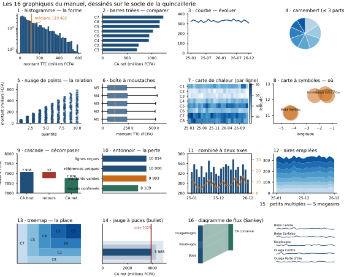

# Module M10.C02 — Le tableau question → graphique : les 16 graphiques du manuel et la carte de définition des métriques

**Outils : matplotlib 3.10.9, pandas 2.2.3, numpy 2.3.5 (exécutés dans ce chapitre) ; seaborn 0.13.2
(annoncé, C03 et C07) ; Excel (exécuté, C07) ; Power BI (cité, non exécuté, C07).
Durée indicative : 6 h. Niveau : N3. Prérequis : M09 (la question avant le chiffre) et M10.C01
(l'ordre perceptuel : position, longueur, angle, aire, intensité).**

> **L'idée du chapitre.** C01 a donné la contrainte — l'œil lit mieux une position qu'une surface.
> C02 donne le **catalogue** : seize graphiques, chacun rattaché à **une** question qu'il sert seul,
> avec son encodage, son piège et un repère chiffré du fil rouge. Le catalogue n'est pas une liste de
> dessins à connaître : c'est un **arbre de décision** — trois questions (comparer, évoluer,
> distribuer), quatre familles de réponses, seize outils — et une règle d'entrée : un graphique qui
> n'est pas choisi par sa question est un graphique choisi par défaut. Le chapitre se termine par
> l'artefact signature du module, la **carte de définition des métriques** : huit indicateurs du
> fil rouge, écrits avec leur formule, leur unité, leur source, leur propriétaire et leur piège de
> lecture — parce qu'un indicateur sans définition est un chiffre qui circulera faux.

> **Matériel de l'atelier — Python 3.13 · matplotlib 3.10.9 · pandas 2.2.3 · numpy 2.3.5.** Les
> seize graphiques du chapitre ont été **dessinés et exécutés** à l'atelier le 20/09/2026 sur le
> socle M07/M08/M09 (les **50 008** ventes de la quincaillerie, les 5 magasins, les 3 villes, le
> fichier de projet M09.P pour l'entonnoir). La planche `figures/M10_C02_seize_graphiques.svg` est
> produite par `tools/seize_graphiques_M10.py` : deux exécutions donnent le **même fichier**.

---

## 1. Objectifs du chapitre

À la fin de ce chapitre, vous savez :

1. **Parcourir l'arbre de choix** : formuler la question (comparer / évoluer / distribuer /
   relier / localiser), en déduire la tâche de lecture, puis choisir le graphique — et dire pourquoi
   l'ordre inverse donne un graphique par défaut.
2. **Citer les 16 graphiques du manuel** avec, pour chacun, sa question servie, son encodage
   dominant, son piège et **un chiffre du socle** qui l'illustre.
3. **Reconnaître les cinq graphiques « utiles »** que la liste fondatrice n'avait pas (aires
   empilées, treemap, jauge à puces, petits multiples, diagramme de flux) et dire ce qu'ils
   apportent et ce qu'ils coûtent.
4. **Repérer les cas où le graphique ment sans être faux** : camembert surchargé, cascade sur des
   flux qui ne s'additionnent pas, graphique combiné à deux axes — trois configurations où les
   chiffres restent exacts et la lecture devient fausse.
5. **Trancher entre un tableau et un graphique** : dire dans quel cas le tableau **gagne** (valeurs
   exactes, peu de lignes, plusieurs unités) et dans quel cas il perd.
6. **Remplir une carte de définition des métriques** sur le fil rouge : nom, formule, unité,
   source, fréquence, propriétaire, piège de lecture — le document qui empêche deux services de
   calculer deux fois le même indicateur.

## 2. Pourquoi cette notion est importante

Tout le monde sait faire un graphique ; presque personne ne sait **lequel**. C'est le constat qui
ouvre le module : les outils proposent une vingtaine de types de graphiques dans une liste
déroulante, sans dire lequel répond à quoi. Résultat : les rapports sont pleins de graphiques
techniquement corrects et de questions restées sans réponse.

L'enjeu de ce chapitre est donc un **vocabulaire partagé**. Quand un collègue dit « on met un
camembert », la réponse du module n'est pas « non » : c'est « quelle question ? combien de parts ? ».
Quand un autre propose « une cascade pour montrer l'écart de chiffre d'affaires », il faut pouvoir
répondre que la cascade exige des flux qui **s'additionnent** : ici les retours s'ajoutent
(31 939 568 FCFA de retours expliquent l'écart entre le CA brut et le CA net), mais un taux de
croissance ne s'additionne pas. Le catalogue transforme un débat de goût en vérification.

Deuxième enjeu, plus insidieux : le **graphique qui ment sans être faux**. Aucun chiffre n'y est
erroné, aucune règle du module n'est violée, et pourtant le lecteur repart avec une conclusion que
les données ne portent pas. Ces cas ne se corrigent pas en changeant les couleurs : ils se
corrigent en reconnaissant le motif — et c'est pourquoi ils ont leur propre section (§5.4).

Troisième enjeu : le **temps**. Chaque graphique coûte à produire (dix minutes) et coûte à lire
(cinq secondes). Un rapport de douze graphiques demande deux heures de production et une minute de
lecture ; si trois d'entre eux seulement portent une décision, les neuf autres sont un impôt. La
carte de définition des métriques (§5.6) joue le même rôle sur les indicateurs : elle rend visible
ce qui est mesuré, par qui, avec quelle formule — et donc ce qui ne l'est pas.

> **Dans les faits.** Le rapport de la quincaillerie fourni avec le module contient **cinq**
> graphiques, dont **deux** seulement répondent à une question identifiable. Les trois autres
> (camembert à huit parts, cumul de pourcentages à 100 %, échelle logarithmique non déclarée) ne
> laissent aucune conclusion vérifiable au lecteur — c'est précisément l'objet du projet
> « La refonte » et des défauts mesurés en C05.

## 3. Explication simple — la pharmacie des seize tiroirs

Imaginez une pharmacie bien tenue. Seize tiroirs, une étiquette par tiroir, et sur chaque étiquette
non pas le nom du produit mais **le symptôme qu'il soigne**. On n'y entre pas par curiosité : on y
entre avec une question.

1. **Le patient arrive avec sa phrase.** « Comment se comparent mes cinq magasins ? » — pas « je
   veux un graphique en barres ».
2. **Le pharmacien traduit en symptôme.** Comparer des grandeurs, suivre une évolution, montrer une
   composition, relier deux mesures, situer géographiquement : cinq symptômes, et à chacun son
   tiroir.
3. **Il ouvre un seul tiroir.** Comparer cinq magasins : le tiroir « barres triées ». Suivre
   l'évolution du chiffre d'affaires : le tiroir « courbe ». Montrer que trois villes portent le
   chiffre d'affaires : le tiroir « composition » — et là, attention au nombre de parts, donc au
   choix entre barres empilées et camembert.
4. **Il referme les autres.** Un rapport qui ouvre cinq tiroirs pour la même question n'en soigne
   aucune : il décore.

La règle de la pharmacie tient en une phrase : **le tiroir suit le symptôme, jamais le symptôme le
tiroir.** Le symptôme de la quincaillerie est simple : trois villes à 40,2 %, 40,0 % et 19,8 % du
chiffre d'affaires, huit catégories entre 697,2 M et 1 231,0 M FCFA, un chiffre d'affaires mensuel
entre 307,6 M et 348,8 M. Trois symptômes, trois tiroirs, et aucun autre.

## 4. Vocabulaire essentiel

| Terme | Définition |
|---|---|
| **question servie** | la question à laquelle un graphique répond **seul**, telle qu'un lecteur la formule en le regardant. Un graphique a une question servie, pas cinq. |
| **arbre de choix** | la démarche du chapitre : question → tâche de lecture → famille de graphiques → graphique précis → outil. |
| **graphique combiné** — *combo chart* | deux graphiques superposés sur un même cadre (des barres et une courbe, par exemple), souvent accompagnés de **deux axes**. |
| **double axe** | deux échelles verticales différentes sur un même cadre, à gauche et à droite. Les écarts entre les deux séries deviennent alors une **illusion** : c'est le fabricant de corrélation du module (condamné en C05, mesuré sur le fil rouge à +0,35). |
| **cascade** — *waterfall* | graphique qui décompose un total par ajouts et retraits successifs (CA brut → retours → CA net). N'a de sens que sur des flux **additifs**. |
| **entonnoir** — *funnel* | graphique de perte par étapes (lignes reçues → références uniques → montants valides → succès confirmés). Chaque étage montre ce qui survit au précédent. |
| **treemap** | partition rectangulaire : la **surface** de chaque rectangle est proportionnelle à sa valeur. Excellent pour « où est la masse ? », mauvais pour comparer deux rectangles proches. |
| **jauge à puces** — *bullet chart* | une mesure, une cible et des seuils sur la même ligne horizontale. Le remplaçant sobre de la jauge circulaire. |
| **petits multiples** — *small multiples* | la même figure répétée sur plusieurs facettes (un magasin par facette) avec une échelle commune : la forme se compare, la lecture reste locale. |
| **diagramme de flux** — *Sankey* | bandes dont la largeur est proportionnelle à un flux, du départ à l'arrivée (les trois villes → ce qui est conservé, ce qui est retourné). |
| **carte de définition des métriques** — *metrics definition sheet* | le document qui définit chaque indicateur du tableau de bord : nom, formule, unité, source, fréquence, propriétaire, piège de lecture. Artefact signature du module. |
| **tableau de bord** | un ensemble de graphiques organisés pour **piloter** (suivre un petit nombre d'indicateurs dans le temps), par opposition à une **planche d'analyse** qui sert à comprendre une question. |

## 5. Cours approfondi

### 5.1 L'arbre de choix : cinq symptômes, quatre familles

Toute question métier se range dans **cinq symptômes**, et l'ordre compte : c'est lui qui décide du
graphique.

| Symptôme (la question posée) | Tâche de lecture | Familles de graphiques | Ce qu'il faut éviter |
|---|---|---|---|
| **Comparer** — « lequel est le plus grand ? » | comparer des positions ou des longueurs | barres, barres groupées, boîtes à moustaches, carte de chaleur, tableau | le camembert (angle) au-delà de 3 parts ; l'ordre alphabétique |
| **Évoluer** — « est-ce que ça monte ? » | suivre une position dans le temps | courbe, aires empilées, barres par période, petits multiples | le double axe qui fait coïncider deux séries sans rapport |
| **Distribuer** — « comment est-ce réparti ? » | estimer une part d'un tout | barres empilées à 100 %, camembert (≤ 3 parts), treemap, entonnoir | la part de parts inférieure à 5 % (illisible) |
| **Relier** — « ces deux mesures vont-elles ensemble ? » | estimer une relation | nuage de points, ligne de tendance | confondre corrélation et causalité ; un nuage sur 50 008 points non échantillonné |
| **Localiser** — « où ? » | situer et comparer | carte à symboles, carte de chaleur géographique | la bulle dont le **rayon** code la valeur (l'aire ment) |

Deux remarques de méthode. D'abord, **les cinq symptômes ne sont pas exclusifs mais hiérarchisés** :
un graphique peut comparer **et** localiser (les barres par ville), mais un seul symptôme doit
commander — celui qui est écrit dans le titre. Ensuite, **la famille ne décide pas tout** : dans la
famille « distribuer », le choix entre camembert et barres empilées se fait sur le **nombre de
parts** (jusqu'à trois, un camembert est parfaitement lisible ; au-delà, non — C01 l'a mesuré à
0,17°).

> **Définition.** L'**arbre de choix** est une procédure en cinq étapes, parcourue **avant**
> d'ouvrir l'outil : (1) écrire la question, (2) nommer le symptôme, (3) choisir la famille,
> (4) choisir le graphique précis, (5) choisir l'outil et le support. Les étapes 1 et 2 se font sur
> papier ; les étapes 3 à 5 au clavier. Un graphique dont les étapes 1 et 2 ne sont pas écrites est
> un graphique par défaut, même s'il est joli.

### 5.2 Le catalogue : les 16 graphiques, ligne à ligne

Voici le tableau de référence du manuel. La dernière colonne donne **le chiffre du socle** que le
graphique affiche dans la planche du chapitre : chaque ligne a donc été **dessinée**, pas seulement
décrite.

| Graphique | Question servie | Encodage dominant | Piège principal | Repère sur le socle (exécuté) |
|---|---|---|---|---|
| **1. Histogramme** | « comment se distribuent les montants ? » | position (abscisses) + fréquence | des classes trop fines ou trop larges ; un axe vertical logarithmique non déclaré | médiane **119 482** FCFA, queue jusqu'à **594 363** ; 77,0 % des ventes sous 250 000 |
| **2. Barres** (horizontales, triées) | « lequel est le plus grand ? » | longueur depuis zéro | l'ordre alphabétique ; un axe qui ne part pas de zéro | 8 catégories de **697,2** M à **1 231,0** M FCFA |
| **3. Courbe** | « est-ce que ça monte ? » | position dans le temps | l'axe tronqué (C01) ; trop de séries | CA net mensuel de **307,6** M (2026-12) à **348,8** M (2026-06) |
| **4. Camembert** | « quelle part du tout ? » | angle | au-delà de 3 parts : illisible (écart minimal 0,05 pt → 0,17°) | 8 parts de 8,85 % à 15,63 % — **contre-exemple pédagogique** |
| **5. Nuage de points** | « ces deux mesures vont-elles ensemble ? » | position sur deux axes | 50 008 points superposés ; lire une corrélation sur un nuage convexe | échantillon de **2 000** ventes (graine 7) : quantité × montant |
| **6. Boîte à moustaches** | « où est le cœur, où sont les extrêmes ? » | position + longueur des moustaches | des boîtes sur des populations non comparables | 5 magasins : M5 (210 m²) contre M3 (520 m²) |
| **7. Carte de chaleur** | « où se concentre l'activité ? » | intensité (se lit **par ligne**) | comparer deux cases non voisines ; pas de valeur absolue | 8 catégories × 24 mois de CA net |
| **8. Carte à symboles** | « où, et combien ? » | position géographique + surface | le rayon qui code la valeur (amplifie l'écart) ; pas d'échelle | 3 villes, 5 magasins : 40,2 % / 40,0 % / 19,8 % du CA |
| **9. Cascade** | « qu'est-ce qui explique l'écart ? » | longueur + cumul | l'appliquer à des flux **non additifs** (un taux, une part) | CA brut **7 908 259 732** → retours **31 939 568** → CA net **7 876 320 164** |
| **10. Entonnoir** | « où perd-on ? » | longueur + effet d'escalier | des étapes qui ne se suivent pas dans le temps | **10 014** lignes → 8 109 succès confirmés (81,0 %) |
| **11. Combiné à deux axes** | « deux séries bougent-elles ensemble ? » | position, deux échelles | **fabrique** la coïncidence : corrélation du fil rouge +0,35 alors que les séries n'ont pas de lien | CA net (barres) × retours (courbe) |
| **12. Aires empilées** | « la composition évolue-t-elle ? » | position + surface cumulée | ne se lit que la série du bas ; étiquettes impossibles | 8 catégories cumulées, 24 mois ; 2025 : **3 910,9** M, 2026 : **3 965,4** M |
| **13. Treemap** | « où est la masse ? » | surface | comparer deux rectangles voisins ; surfaces trompeuses au 2e niveau | 8 catégories, de 8,85 % à 15,63 % |
| **14. Jauge à puces** | « sommes-nous dans la cible ? » | longueur + repère de cible | la jauge circulaire (angle) ; cibles non datées | CA net 2026 contre la cible 2025 (**3 910,9** M) |
| **15. Petits multiples** | « la même forme vaut-elle pour tous ? » | position, échelles **communes** | des échelles différentes par facette (on ne compare plus rien) | 5 magasins, 24 mois, échelle identique |
| **16. Diagramme de flux** — *Sankey* | « d'où vient quoi ? » | largeur de bande | plus de 5-6 flux : illisible ; des bandes qui se croisent | 3 villes → CA conservé / retours |

Trois lectures de ce tableau, avant d'aller plus loin.

**Première lecture : chaque piège est un problème de question, pas de dessin.** L'axe tronqué (ligne 3)
n'est pas une faute de logiciel : c'est l'absence de la phrase « l'axe ne part pas de zéro ». Le
camembert à huit parts (ligne 4) n'est pas laid : il répond à une question que personne n'a posée
(« classez huit parts »). Le double axe (ligne 11) n'est pas illégal : il répond à deux questions
à la fois, donc à aucune.

**Deuxième lecture : les graphiques « de composition » sont les plus dangereux** (lignes 4, 12, 13,
16). Ils séduisent parce qu'ils montrent « tout d'un coup » — et c'est là qu'ils trompent : le
camembert et le treemap codent par angle et surface (les canaux les moins précis, C01), les aires
empilées ne laissent lire proprement que la série du bas, le diagramme de flux devient un
labyrinthe au-delà de quelques bandes. La barre empilée à 100 % — à trois ou quatre parts — reste
la valeur sûre de cette famille.

**Troisième lecture : les cinq derniers outils servent à répondre vite à une question étroite.**
Treemap, jauge à puces, petits multiples, aires empilées et diagramme de flux ne remplacent jamais
un graphique de comparaison : ils répondent à « où est la masse ? », « sommes-nous dans la cible ? »,
« la forme est-elle la même partout ? », « la composition bouge-t-elle ? » et « d'où vient quoi ? ».
Employés pour ces questions-là, ils sont excellents ; employés ailleurs, ils décorent.

> **Conseil professionnel.** Quand une demande arrive sous la forme « fais-moi un *treemap* », le
> réflexe professionnel est de répondre par une **question** : « qu'est-ce qui doit ressortir —
> quelle catégorie pèse le plus, ou comment la composition évolue-t-elle ? ». La première réponse
> appelle une treemap (ou des barres triées, souvent plus lisibles), la seconde des aires empilées ou
> des petits multiples. Le demandeur n'a pas tort : il a simplement parlé outil.

### 5.3 Les cinq graphiques que la liste fondatrice n'avait pas

Les onze premiers graphiques du catalogue sont ceux que tout le monde connaît. Les cinq suivants
méritent une justification, parce qu'ils ne sont pas des variantes décoratives :

1. **Aires empilées (12)** — la seule famille qui montre **à la fois** une composition et son
   évolution. Coût : seule la série du bas est lisible avec précision ; les autres ne se comparent
   qu'entre elles, et de près. À réserver à 3 ou 4 séries, ou à accompagner de petits multiples.
2. **Treemap (13)** — une réponse directe à « où est la masse ? ». Sa force est la **partition**
   (la somme des rectangles vaut le tout, sans reste), sa faiblesse est la comparaison fine : deux
   rectangles de même hauteur se comparent bien, deux rectangles de formes différentes mal. Utile
   pour un portefeuille de 30 produits, inutile pour 8 catégories que des barres triées départagent
   mieux.
3. **Jauge à puces (14)** — l'outil du **pilotage** : une mesure, une cible, des seuils, sur une
   ligne. C'est le graphique à employer dans un tableau de bord pour la question « sommes-nous dans
   la cible ? », là où la jauge circulaire classique (un angle sur 180°) sacrifie la précision
   inutilement.
4. **Petits multiples (15)** — la réponse à « la même forme vaut-elle pour tous ? ». Leur règle est
   absolue : **échelles identiques** sur toutes les facettes, sinon la comparaison disparaît. C'est
   le meilleur outil pour détecter le magasin qui décroche.
5. **Diagramme de flux (16)** — le seul graphique qui montre un **passage** (d'où vient quoi, où va
   quoi) : villes → chiffre d'affaires conservé / retours. Au-delà de cinq ou six flux, il faut le
   remplacer par deux graphiques de comparaison.

> **Attention.** Ces cinq outils sont souvent adoptés pour leur **nouveauté** — un rapport avec une
> treemap et un diagramme de flux « fait moderne ». C'est exactement le travers que le module
> combat : un treemap qui remplace des barres triées fait perdre de la précision (surface contre
> longueur) sans rien apporter. La règle : ces graphiques **entrent par la question**, jamais par
> l'envie de varier.

### 5.4 Le graphique qui ment sans être faux

Trois configurations produisent une lecture fausse avec des chiffres exacts. Elles sont au
programme du projet, parce qu'elles ne se détectent pas en vérifiant les totaux : elles se
détectent en relisant le **codage**.

**A. Le camembert surchargé.** Huit parts, et l'écart minimal entre deux voisines vaut 0,05 point de
pourcentage, soit 0,17° (C01). Le graphique n'affirme rien de faux ; il laisse simplement croire
qu'un classement est possible. La correction ne se joue pas sur la palette : elle change de
graphique (barres triées) ou de question (montrer l'étendue : 8,85 % à 15,63 %).

**B. La cascade sur des flux non additifs.** Une cascade raconte « ceci plus cela donne cela ». Elle
est légitime sur les retours (31 939 568 FCFA de retours expliquent l'écart entre 7 908 259 732 et
7 876 320 164 FCFA de CA) et absurde sur des taux ou des parts : on n'additionne pas des
pourcentages qui portent sur des bases différentes. Le test est simple : **est-ce que les valeurs
s'additionnent ?** Si la réponse est non, la cascade est une décoration qui invite à un calcul faux.

> **Définition.** On appelle **corrélation affichée** la valeur du coefficient de corrélation entre
> deux séries **telles que le graphique les présente** — c'est-à-dire après le choix des deux
> échelles. Elle peut être très différente de la corrélation réelle des données, parce que le double
> axe laisse choisir les bornes de la seconde échelle. Règle du module : dès qu'un graphique à deux
> axes est publié, la corrélation affichée s'écrit dans le graphique, avec la mention « sans lien
> métier établi » si c'est le cas.

**C. Le combiné à deux axes.** Deux séries, deux échelles : le graphique peut faire coïncider
n'importe quoi. Sur le fil rouge, le chiffre d'affaires et le nombre de retours affichent une
corrélation de +0,35 — un lien faible — mais surtout **sans intérêt métier** : les deux séries n'ont
aucune raison de varier ensemble. Le double axe rend cette coïncidence spectaculaire en choisissant
les bornes de la seconde échelle. C'est le défaut que C05 mesurera : le titre du rapport (« les
retours suivent le chiffre d'affaires ») est une conclusion **fabriquée par le graphique**.

> **Attention.** Ces trois cas partagent une propriété : ils sont **invisibles à l'audit des
> données**. Les totaux sont justes, les périmètres sont respectés, aucune valeur n'est manquante.
> Une revue de qualité qui ne regarde que les chiffres laisse passer les trois. D'où la grille de
> conception de C01 : les familles 1 et 2 ne se vérifient pas sur les données, mais sur le
> **graphique lui-même**.

### 5.5 Quand un tableau bat un graphique

Le module défend les graphiques ; il serait malhonnête de ne pas dire où ils perdent. Un tableau
gagne dans **quatre** situations :

1. **La valeur exacte est le message.** Un budget à respecter, un seuil réglementaire, un prix :
   « 119 482 FCFA » s'écrit, il ne se lit pas sur un axe.
2. **Peu de lignes et plusieurs unités.** Cinq magasins avec surface, effectif, chiffre d'affaires et
   marge : quatre unités différentes (m², personnes, FCFA, %) ne partagent aucune échelle — un
   graphique devrait les normaliser, donc perdre l'unité.
3. **Le lecteur va recalculer.** Un tableau de bord budgétaire se recompose (colonnes, sous-totaux) :
   le tableau est un **outil** pour le lecteur, le graphique une conclusion.
4. **L'exhaustivité est requise.** Un inventaire, un journal d'anomalies, une liste de contrôles :
   ici, une ligne manquante serait une faute ; un graphique ne peut pas être exhaustif.

Inversement, le tableau perd dès que la question porte sur une **forme** : une tendance sur 24 mois,
une distribution, une concentration. Personne ne voit une courbe dans une colonne de 24 nombres. La
règle pratique du chapitre : **le graphique pour comprendre, le tableau pour agir** — et, dans un
bon livrable, les deux : la figure porte le constat, le tableau annexé porte les valeurs.

> **Définition.** On appelle **graphique-tableau** (ou tableau enrichi) un tableau dont les cellules
> portent un codage visuel : barres intégrées, échelle de couleurs, flèches de variation. Il
> combine les deux forces — la valeur exacte et la forme — et c'est l'outil à privilégier quand le
> lecteur a besoin des deux à la fois (un tableau de bord de suivi, par exemple).

### 5.6 La carte de définition des métriques : l'artefact signature

Voici le document qui manque dans presque toutes les organisations, et qui explique la plupart des
désaccords en réunion : **la définition écrite des indicateurs**. Le principe est simple : chaque
indicateur publié a une ligne, et cette ligne répond à sept questions. Le tableau ci-dessous montre
les six premières colonnes (la fréquence est portée avec la source pour rester lisible sur une page)
sur les **8 indicateurs** du fil rouge :

| Indicateur | Formule | Unité | Source (fréquence) | Propriétaire | Piège de lecture |
|---|---|---|---|---|---|
| **CA net** | somme des montants TTC **hors retours** | FCFA | `vente.csv` (mensuel) | direction commerciale | le comparer au CA brut : l'écart vaut 31 939 568 FCFA |
| **Panier moyen** | CA net ÷ nombre de ventes | FCFA | `vente.csv` (mensuel) | direction commerciale | moyenne 158 140 contre médiane 119 482 : la queue tire la moyenne |
| **Médiane des montants** | médiane des montants TTC | FCFA | `vente.csv` (mensuel) | analyse | l'annoncer sans l'effectif : 1 044 ventes dépassent 500 000 |
| **Taux de retour** | retours ÷ ventes | % | `vente.csv` (mensuel) | service qualité | un mois à 4 retours et un mois à 16 ne disent pas la même chose |
| **Part de catégorie** | CA de la catégorie ÷ CA net | % | `vente.csv` + `produit.csv` (mensuel) | direction commerciale | l'écart minimal entre deux catégories vaut 0,05 point : aucun classement fin |
| **CA par m²** | CA net ÷ surface du magasin | FCFA/m² | `vente.csv` + `magasin.csv` (trimestriel) | direction réseau | des surfaces inégales (210 à 520 m²) rendent la comparaison brute trompeuse |
| **Part du top 10 clients** | CA des 10 premiers clients ÷ CA net | % | `vente.csv` (trimestriel) | direction commerciale | le décompte des clients change le résultat ; le préciser |
| **Taux de succès (projet)** | statuts de succès normalisés ÷ lignes valides | % | `fichier_inconnu.csv` (ponctuel) | analyse | six graphies de statut avant normalisation : 81,0 % **après** nettoyage |

> **Définition.** Une **mesure** est un nombre calculé sur des données (« 7 876 320 164 FCFA de
> CA net en 24 mois »). Un **indicateur** est une mesure **reliée à un objectif**, à une fréquence et
> à un propriétaire (« le CA net mensuel, cible de croissance, propriétaire : direction
> commerciale »). La carte de définition ne sert pas à calculer : elle sert à **s'accorder** — c'est
> pourquoi elle porte une colonne source, une colonne fréquence et une colonne propriétaire.

Trois règles de rédaction, apprises des désaccords les plus fréquents :

1. **Une formule, pas un mot.** « Chiffre d'affaires » ne définit rien : « somme des montants TTC
   hors retours » se vérifie. La formule doit tenir en une ligne et se transcrire en une requête.
2. **Un piège par ligne, obligatoire.** La colonne la plus utile est la dernière : elle dit ce que
   l'indicateur **ne** dit pas. C'est l'héritage direct de M09 (la limite se déclare).
3. **Un propriétaire par ligne.** Sans propriétaire, personne ne corrige la définition quand le
   métier change — et deux services finissent par publier deux chiffres différents du même nom.

> **Dans les faits.** Les huit indicateurs ci-dessus sont tous calculés sur le **même** jeu de
> données, par le même analyste, dans la même journée — et ils ne concordent pas naturellement :
> le CA net (7 876 320 164 FCFA) et le CA brut (7 908 259 732 FCFA) diffèrent de 0,4 %, le panier
> moyen (158 140 FCFA) dépasse la médiane (119 482 FCFA) de près d'un tiers. Deux services qui
> publieraient « le chiffre d'affaires » et « le panier moyen » sans ces précisions publieraient
> deux chiffres différents — et l'un des deux serait accusé d'erreur à tort.

### 5.7 Ce que le catalogue ne dit pas

Trois limites, à garder en tête pour ne pas transformer le tableau du §5.2 en dogme :

1. **Le catalogue est culturel et évolutif.** Les seize types retenus sont ceux que les lecteurs de
   ce manuel rencontreront en entreprise ; d'autres familles existent (graphiques en chandeliers,
   courbes de durée, diagrammes de cordes) et de nouveaux apparaissent. Ce qui ne change pas, c'est
   l'arbre de choix et la hiérarchie de précision : eux servent à évaluer n'importe quel graphique
   nouveau.
2. **Le catalogue ne remplace pas la connaissance du métier.** Deux questions identiques en
   apparence peuvent appeler deux graphiques : « comparer les magasins » ne se fait pas de la même
   façon selon qu'on compare des surfaces de vente comparables ou des zones de chalandise
   différentes.
3. **Le catalogue ne dit rien du support.** Une carte de chaleur lisible sur un écran peut être
   illisible projetée ; des petits multiples tiennent sur une page mais pas sur un écran de
   téléphone. C'est l'objet de C07 (support, résolution, export).

## 6. Exemple concret — la planche des seize, dessinée sur le fil rouge

Voici la planche produite à l'atelier : les seize graphiques du catalogue, **tous** dessinés à
partir du même socle — les ventes de la quincaillerie — et portant le chiffre que le tableau §5.2
leur associe.



Ce que la planche démontre, et pourquoi elle a été dessinée plutôt que décrite :

- **Le même jeu de données donne seize lectures différentes.** Le chiffre d'affaires de la
  quincaillerie est une donnée unique ; selon le graphique, on y lit une distribution (1),
  un classement de catégories (2), une évolution plate (3), une répartition en huit parts (4), une
  relation quantité-montant (5), des dispersions par magasin (6), une concentration
  mois × catégorie (7), une géographie (8), une décomposition (9), un entonnoir de qualité (10),
  une coïncidence fabriquée (11), une composition (12), une masse (13), un écart à la cible (14),
  cinq trajectoires comparables (15) et un passage (16). Ce n'est pas la donnée qui change : c'est
  la question.
- **Chaque graphique a un coût de lecture visible.** Le panneau 4 (camembert à huit parts) est
  immédiatement moins informatif que le panneau 2 (barres triées) qui porte la même donnée ; le
  panneau 11 (combiné à deux axes) suggère une relation que le panneau 5 (nuage) invite à vérifier.
- **Le socle suffit à tout illustrer.** Aucun des seize panneaux n'a nécessité de donnée nouvelle :
  les 50 008 ventes, les 5 magasins, les 3 villes, les 8 catégories et le fichier de projet M09.P
  couvrent le catalogue entier. C'est aussi la leçon du chapitre : le choix du graphique ne se paie
  pas en données supplémentaires, il se paie en réflexion.

Trois chiffres pour fixer les idées, tous mesurés sur la planche :

| Ce que montre la planche | Le chiffre | Où le lire |
|---|---|---|
| Un classement de catégories utilisable | de **697,2** M à **1 231,0** M FCFA, soit un rapport de 1,77 | panneau 2 (barres) contre panneau 4 (camembert) |
| Une évolution remarquablement plate | de **307,6** M à **348,8** M FCFA sur 24 mois (± 6,3 % autour de 328,2 M) | panneaux 3 et 15 (courbe, petits multiples) |
| Une géographie concentrée | 40,2 % / 40,0 % / 19,8 % du CA net entre trois villes | panneaux 8 et 16 (carte, diagramme de flux) |

## 7. Démonstration pas à pas — trois questions, trois graphiques

La démonstration rejoue l'arbre de choix sur trois questions réelles du fil rouge, dans l'ordre :
**écrire la question, nommer le symptôme, choisir le graphique, produire le chiffre qui décide**.
Les sorties sont celles de l'atelier.

**Question A — « Comment se comparent les huit catégories ? »** Symptôme : comparer. Le chiffre qui
décide n'est pas la moyenne mais l'étendue et la part du haut de tableau.

```python
import pandas as pd
v = pd.read_csv("03_exercices/dossier_M09/quincaillerie/vente.csv", parse_dates=["date_vente"])
p = pd.read_csv("03_exercices/dossier_M09/quincaillerie/produit.csv")
net = v[~v["est_retour"]].merge(p[["id_produit", "id_categorie"]], on="id_produit", how="left")
cat = net.groupby("id_categorie")["montant_ttc"].sum().sort_values(ascending=False)
print([f"C{i} {x/1e6:.1f} M" for i, x in cat.head(3).items()])
print([f"C{i} {x/1e6:.1f} M" for i, x in cat.tail(3).items()])
print("part du top 3 :", round(cat.head(3).sum() / cat.sum() * 100, 1), "%")
```

```text
['C7 1231.0 M', 'C8 1158.5 M', 'C5 1154.8 M']
['C4 937.3 M', 'C2 729.2 M', 'C3 697.2 M']
part du top 3 : 45.0 %
```

**Choix** : barres horizontales triées (panneau 2). **Pourquoi pas** un camembert : huit parts, écart
minimal de 0,05 point. **Pourquoi pas** une treemap : elle montrerait la même masse, en surface, sans
permettre de lire les trois dernières catégories. **Phrase du livrable** : « Trois catégories portent
45,0 % du chiffre d'affaires ; la plus forte (1 231,0 M FCFA) dépasse la plus faible (697,2 M FCFA)
de 77 %. »

**Question B — « Le chiffre d'affaires progresse-t-il ? »** Symptôme : évoluer. Le chiffre qui
décide est la dispersion autour de la tendance, pas le total.

```python
ca = net.groupby(net["date_vente"].dt.to_period("M"))["montant_ttc"].sum()
print(len(ca), "mois |", ca.idxmin(), round(ca.min()/1e6, 1), "M |",
      ca.idxmax(), round(ca.max()/1e6, 1), "M | moyenne", round(ca.mean()/1e6, 1), "M")
print("ecart du pic a la moyenne :", round(ca.max()/ca.mean()*100 - 100, 1), "%")
tri = net.groupby(net["date_vente"].dt.to_period("Q"))["montant_ttc"].sum()
print("trimestres :", len(tri), "| premier", round(tri.iloc[0]/1e6, 1), "M | dernier", round(tri.iloc[-1]/1e6, 1), "M")
```

```text
24 mois | 2026-12 307.6 M | 2026-06 348.8 M | moyenne 328.2 M
ecart du pic a la moyenne : 6.3 %
trimestres : 8 | premier 990.7 M | dernier 974.2 M
```

**Choix** : une courbe (panneau 3), complétée par des petits multiples par magasin (panneau 15) si
la question devient « cette platitude vaut-elle pour tous ? ». **Pourquoi la moyenne glissante** :
elle sépare le bruit mensuel (l'écart-type du socle est de 10,8 M) de la tendance. **Phrase du
livrable** : « Sur 24 mois, le chiffre d'affaires net oscille entre 307,6 et 348,8 M FCFA, avec un
pic à +6,3 % au-dessus de la moyenne et un premier trimestre (990,7 M) supérieur au dernier
(974,2 M) : la période se lit comme **plate**, pas comme croissante. »

**Question C — « D'où vient le chiffre d'affaires ? »** Symptôme : localiser + distribuer. Attention
au choix du graphique : trois villes, donc un camembert serait **légitime** ; mais la question
suivante (« et les retours, d'où viennent-ils ? ») demande un passage, donc un diagramme de flux.

```python
m = pd.read_csv("03_exercices/dossier_M09/quincaillerie/magasin.csv")
vil = net.merge(m[["id_magasin", "ville"]], on="id_magasin", how="left").groupby("ville")["montant_ttc"].sum()
print({k: f"{x/1e6:.1f} M ({x/vil.sum()*100:.1f} %)" for k, x in vil.items()})
```

```text
{'Bobo-Dioulasso': '3150.8 M (40.0 %)', 'Koudougou': '1562.6 M (19.8 %)', 'Ouagadougou': '3162.9 M (40.2 %)'}
```

**Choix** : deux barres horizontales triées (ou un camembert à trois parts, l'un et l'autre se
défendent) **plus** un diagramme de flux si l'on ajoute les retours (panneau 16). **Phrase du
livrable** : « Le chiffre d'affaires net se partage en deux pôles quasi égaux (Ouagadougou 40,2 %,
Bobo-Dioulasso 40,0 %) et un pôle secondaire (Koudougou 19,8 %) : la lecture utile n'est pas le
classement des deux premiers — ils sont à égalité — mais l'écart au troisième. »

> **À retenir.** Les trois démonstrations suivent la même chaîne : une phrase de question, un
> symptôme nommé, un graphique choisi, **un chiffre qui décide** extrait du socle. C'est cette
> dernière étape qui distingue un graphique professionnel d'une illustration : il porte le chiffre
> sur lequel la décision va se prendre.

## 8. Erreurs fréquentes

1. **Commencer par le type de graphique.** « Je vais faire un combiné » est une phrase d'outil ; la
   seule phrase d'entrée valable est une question. Le symptôme et la famille viennent ensuite.
2. **Multiplier les graphiques pour la même question.** Deux graphiques qui répondent à la même
   question ne se renforcent pas : ils se contredisent dès que les périmètres diffèrent. Un rapport
   de douze graphiques doit porter douze questions (ou moins).
3. **Oublier la dernière colonne du catalogue.** Le piège est écrit sur chaque ligne du tableau
   §5.2 : c'est la colonne qui a le plus de valeur professionnelle, parce qu'elle se révèle dans la
   réunion, quand quelqu'un tire une conclusion trop forte.
4. **Prendre un tableau pour un pis-aller.** Le tableau gagne quatre fois (§5.5) : valeurs exactes,
   unités multiples, recalcul par le lecteur, exhaustivité. Le remplacer par un graphique dans ces
   quatre cas dégrade l'information.
5. **Publier un indicateur sans définition.** « Le panier moyen » de deux services peut désigner
   deux indicateurs différents (avec ou sans retours, avec ou sans remises). Sans carte des
   métriques, le désaccord est garanti — et il n'est pas mesurable.
6. **Croire que le catalogue règle tout.** Un graphique bien choisi sur une donnée mal comprise reste
   faux : l'arbre de choix suppose la fiche d'entrée de M09 faite, les unités vérifiées et les
   défauts du jeu identifiés.
7. **Employer les cinq outils « modernes » pour varier.** Treemap, diagramme de flux et jauge à puces
   sont excellents pour leurs questions et coûteux ailleurs : ils font perdre la comparaison fine que
   des barres donnaient gratuitement.

## 9. Bonnes pratiques professionnelles

1. **Écrire la question sur le brouillon** avant de choisir le graphique, et la garder pour rédiger
   le titre (qui doit l'affirmer, cf. C04).
2. **Nommer le symptôme à voix haute** (« c'est une comparaison ») : si vous hésitez entre deux
   symptômes, c'est que le graphique doit être scindé en deux.
3. **Vérifier l'additivité avant toute cascade** ; vérifier le nombre de parts avant tout camembert
   (≤ 3) ; vérifier la raison métier avant tout double axe (le plus souvent, il n'y en a pas).
4. **Annoter le chiffre qui décide** : l'étendue, la part du haut de tableau, l'écart à la cible.
   Un graphique dont on ne sait pas dire le chiffre clé n'est pas fini.
5. **Tenir la carte des métriques à jour**, avec un propriétaire par indicateur et un piège par
   ligne ; la diffuser avec les graphiques qu'elle définit.
6. **Limiter le nombre de séries** : au-delà de cinq, passer aux petits multiples. C'est la même
   contrainte que la surcharge du dossier de refonte.
7. **Relire avec la grille en 18 points** (C01) avant publication : la famille 1 vérifie la question
   servie, la famille 3 l'annotation et la source — les deux points qui manquent le plus souvent
   dans les rapports réels.

## 10. Exercice guidé — « la demande de la direction » (15 min, /10)

**Contexte.** La direction écrit : « Préparer un graphique sur les catégories et un autre sur
l'évolution, pour le comité de vendredi ». Vous disposez du socle de la quincaillerie (8 catégories,
24 mois, 5 magasins, 3 villes).

**Consigne.** Dans les 15 minutes :

1. Écrivez les **deux questions** que recouvrent les deux demandes, en une phrase chacune, avec leur
   destinataire. (2 pts)
2. Nommez le **symptôme** de chacune et la **famille** de graphiques correspondante. (2 pts)
3. Choisissez le graphique précis pour chacune, en justifiant par la question — et dites **ce que
   vous écarteriez** et pourquoi. (2 pts)
4. Donnez pour chaque graphique **le chiffre qui décide**, calculé sur le socle. (2 pts)
5. Rédigez le **titre** de chaque graphique (titre qui affirme, cf. C04) et la **phrase de
   conclusion** du comité. (2 pts)

## 11. Exercices autonomes

**E1 — le catalogue contre votre propre rapport (30 min).** Prenez un rapport que vous avez produit
ou reçu (au moins cinq graphiques). Pour chacun : écrivez la question servie, nommez le symptôme,
identifiez la ligne du tableau §5.2 dont il se rapproche, et **mesurez le piège** s'il tombe dans l'un
des trois cas de §5.4 (écart minimal illisible, flux non additif, double axe). Rendez un tableau à
cinq colonnes et une conclusion : combien de graphiques sur cinq répondaient à une question
identifiable ? La réponse est l'indicateur de qualité de votre rapport, pas le nombre de graphiques.

**E2 — la carte des métriques de votre activité (30 min).** Choisissez **cinq** indicateurs que vous
suivez ou publiez. Remplissez la carte de définition (nom, formule, unité, source, fréquence,
propriétaire, piège de lecture) sans regarder le §5.6. Puis comparez votre carte à celle du
fil rouge et notez trois différences : ce que vous avez oublié (souvent le piège ou la fréquence),
ce que vous avez précisé mieux, et l'indicateur dont la formule vous a demandé un arbitrage.

## 12. Correction détaillée

**Exercice guidé.**

1. **Les deux questions** : « Quelles catégories portent le chiffre d'affaires, et de combien la
   première dépasse-t-elle la dernière ? » (destinataire : le comité, décision de réassort) ;
   « Le chiffre d'affaires progresse-t-il, ou la période est-elle plate ? » (destinataire : le
   comité, décision d'objectif annuel).
2. **Symptômes** : comparer (catégories) et évoluer (24 mois). Familles : barres triées pour la
   première ; courbe (et petits multiples si l'on veut vérifier la platitude magasin par magasin)
   pour la seconde.
3. **Choix et rejets** : barres horizontales triées — on écarte le camembert (8 parts, écart minimal
   de 0,05 point) et la treemap (comparaison de surfaces) ; courbe mensuelle — on écarte le
   combiné à deux axes (les retours ne sont pas la question, et l'axe double fabrique une
   corrélation de +0,35) et les barres par mois (24 barres = 24 comparaisons inutiles là où la
   forme suffit).
4. **Chiffres qui décident** : catégories — de 697,2 M à 1 231,0 M FCFA, top 3 = 45,0 %, rapport
   1,77 entre extrêmes ; évolution — de 307,6 M à 348,8 M, moyenne 328,2 M, pic à +6,3 %,
   premier trimestre 990,7 M contre 974,2 M pour le dernier.
5. **Titres attendus** (qui affirment) : « Trois catégories sur huit portent 45 % du chiffre
   d'affaires » et « Le chiffre d'affaires est plat depuis 24 mois : 6 % d'amplitude autour de
   328 M FCFA ». **Phrase de conclusion** : « La structure de l'offre explique l'essentiel du
   niveau ; la période n'apporte aucune tendance — l'objectif annuel se fixe sur la structure, pas
   sur la croissance passée. »

**E1 (le catalogue contre un rapport réel).** Grille de correction :

- la **question servie** est écrite au présent et peut se vérifier (elle nomme une comparaison, une
  évolution ou une composition) — une réponse du type « montrer le chiffre d'affaires » est refusée ;
- le **piège** est mesuré, pas nommé : pour un camembert, l'écart minimal en points et sa conversion
  en degrés ou en millimètres ; pour un double axe, la corrélation affichée ; pour une cascade, le
  test d'additivité (les valeurs s'additionnent-elles ?) ;
- la **conclusion** est un compte : sur cinq graphiques, combien répondaient à une question
  identifiable. À titre de repère, le rapport de la quincaillerie qui sert de dossier est à 2 sur 5.

**E2 (la carte des métriques).** Trois attendus :

- **les sept colonnes remplies** pour les cinq indicateurs, la colonne « piège de lecture » étant
  éliminatoire : une carte sans piège n'est pas une carte, c'est un dictionnaire ;
- **la formule transcrite en opération** (« CA net ÷ nombre de ventes », et non « panier ») ;
- **l'arbitrage identifié** : l'indicateur dont la définition hésite (avec ou sans retours, avec ou
  sans remises) est celui à faire valider par le métier — c'est précisément le rôle du propriétaire.

## 13. Mini-projet M10.P2 — « la carte des métriques du fil rouge » (1 h)

**Énoncé.** Vous êtes l'analyste de la quincaillerie. Le comité de direction a demandé un tableau de
bord mensuel — et le directeur commercial a prévenu : « la dernière fois, deux services ont annoncé
deux chiffres d'affaires différents ». Vous produisez donc le document qui **précède** les
graphiques : la carte de définition des métriques.

1. **Écrivez les 8 indicateurs** du §5.6 avec leurs sept colonnes (nom, formule, unité, source,
   fréquence, propriétaire, piège de lecture). Les formules doivent être transcrites en opérations
   sur les colonnes du socle (le fichier `vente.csv` et ses tables jointes).
2. **Ajoutez trois indicateurs de votre choix** (par exemple : taux de rupture par produit, part des
   ventes du lundi, nombre de jours sous le seuil de stock) — avec leur piège, en citant le chiffre
   du socle qui les rend vérifiables.
3. **Produisez pour chaque indicateur une phrase de définition** utilisable en réunion : une phrase
   qu'un non-analyste peut répéter sans se tromper.
4. **Concluez** : parmi vos 11 indicateurs, lesquels sont **comparables** entre magasins ou entre
   périodes, et lesquels ne le sont pas ? Cette conclusion décide quels graphiques du catalogue
   pourront être publiés, et lesquels seraient trompeurs.

**Barème indicatif** : 8 indicateurs complets (7 points), 3 indicateurs supplémentaires avec piège
mesuré (5 points), 11 phrases de définition utilisables (3 points), conclusion sur la comparabilité
(3 points), sur 18.

> **Pourquoi ce mini-projet.** La carte des métriques est l'artefact que le module réutilise en M14
> (tableau de bord Power BI), en M17 (automatisation du rafraîchissement) et dans la mission finale
> M21. C'est aussi la meilleure préparation au projet « La refonte » : on ne refond pas un graphique
> dont on ne sait pas définir l'indicateur.

## 14. Boîte à outils du chapitre

> **Boîte à outils.** Ce chapitre utilise **5 gestes** de `matplotlib`, tous exécutés dans la planche
> du §6 : `imshow` (carte de chaleur), `stackplot` (aires empilées), `boxplot` (boîtes à moustaches),
> `twinx` (second axe du graphique combiné) et la construction de polygones (`Polygon`) pour les
> bandes du diagramme de flux. Les autres panneaux réutilisent trois gestes de C01 : `barh`,
> `scatter`, `plot`.

| Besoin | Commande | Ce qu'elle donne | Ce qu'elle ne donne pas |
|---|---|---|---|
| carte de chaleur | `ax.imshow(matrice, cmap="Blues", aspect="auto")` | une intensité par case | la valeur exacte : elle se lit par ligne, ou en annexe |
| aires empilées | `ax.stackplot(x, series)` | une composition cumulée | la lecture des séries du milieu |
| boîtes | `ax.boxplot(liste, vert=False, showfliers=False)` | médiane, quartiles, moustaches | la forme de la distribution (un histogramme la donne) |
| deux axes | `ax2 = ax.twinx()` | une seconde échelle | une comparaison honnête : c'est un piège, pas un outil |
| flux | `Polygon([...])` avec largeurs proportionnelles | un passage d'un point à un autre | une lecture chiffrée : les bandes se comparent mal |

## 15. Résumé du chapitre

C02 a donné au module son **vocabulaire de travail** : un arbre de choix en cinq symptômes
(comparer, évoluer, distribuer, relier, localiser), un catalogue de **16 graphiques** — les onze de
la liste fondatrice et les cinq outils utiles (aires empilées, treemap, jauge à puces, petits
multiples, diagramme de flux) — et, pour chaque ligne du catalogue, une question servie, un encodage
dominant, un piège et un chiffre du socle : 8 catégories de 697,2 M à 1 231,0 M FCFA, un chiffre
d'affaires mensuel de 307,6 M à 348,8 M, 45,0 % du chiffre d'affaires sur les trois premières
catégories, une géographie à 40,2 % / 40,0 % / 19,8 %, une cascade de 7 908 259 732 à 7 876 320 164
FCFA, un entonnoir de 10 014 lignes à 81,0 % de succès. Le chapitre a isolé les **trois mensonges
sans chiffre faux** (camembert surchargé, cascade sur flux non additifs, double axe fabricant de
corrélation), rappelé les quatre cas où **le tableau gagne**, et livré l'artefact signature du
module : la **carte de définition des métriques**, huit indicateurs du fil rouge avec formule,
unité, source, fréquence, propriétaire et piège de lecture.

## 16. À retenir

> **À retenir.** Le catalogue des seize n'est pas une liste à mémoriser : c'est un **arbre**. On y
> entre par la question, on traverse un symptôme, on choisit une famille, puis un graphique — et le
> chiffre qui décide s'annote sur la figure. Tout le reste — jolis dégradés, effets de mode, double
> axe spectaculaire — n'est pas du graphique, c'est du décor.

1. **Cinq symptômes, quatre familles, seize outils** : comparer, évoluer, distribuer, relier,
   localiser.
2. **Une question servie par graphique**, écrite dans le titre ; un titre qui contient « et »
   annonce deux questions dans un cadre.
3. **Trois mensonges sans chiffre faux** : camembert surchargé (écart minimal 0,05 point), cascade
   sur flux non additifs, double axe (corrélation affichée +0,35 pour des séries sans lien).
4. **Le tableau gagne quatre fois** : valeur exacte, unités multiples, recalcul, exhaustivité.
5. **Les cinq outils utiles entrent par la question**, jamais pour varier : aires empilées (3-4
   séries), treemap (masse), jauge à puces (cible), petits multiples (échelles communes), diagramme
   de flux (5-6 bandes au plus).
6. **Chaque graphique porte le chiffre qui décide** : étendue, part du haut de tableau, écart à la
   cible. Sans ce chiffre, le graphique n'est pas terminé.
7. **La carte des métriques a sept colonnes**, dont la plus utile est la dernière : le piège de
   lecture. Un indicateur sans définition circule faux.
8. **Le catalogue ne dispense pas de la fiche d'entrée** (M09) : un bon graphique sur une donnée mal
   comprise reste une erreur mieux présentée.

## 17. Évaluation formative (auto-correction, 8 min)

1. **Un demandeur écrit « je veux une treemap ». Quelle est la bonne réponse professionnelle ?**
   → Demander la question : « qu'est-ce qui doit ressortir — la masse, ou une comparaison ? ». Si
   c'est une comparaison de 8 catégories, des barres triées font mieux (longueur contre surface,
   C01) ; si c'est la masse d'un portefeuille de 30 produits, la treemap est le bon outil. (2 pts)
2. **Pourquoi une cascade est-elle illégitime sur un taux de croissance, et légitime sur les
   retours ?**
   → Parce qu'elle exige des **flux additifs** : les retours (31 939 568 FCFA) s'ajoutent au CA net
   pour donner le CA brut (7 908 259 732 FCFA) ; un taux de croissance se compose (multiplication),
   il ne s'additionne pas — une cascade y ferait faire un calcul faux au lecteur. (2 pts)
3. **Le rapport fourni titre « les retours suivent le chiffre d'affaires ». Qu'en pensez-vous ?**
   → La corrélation mesurée est de +0,35, faible et surtout **sans raison métier** ; le double axe
   rend la coïncidence visuelle en choisissant les bornes de la seconde échelle. Le titre est une
   conclusion fabriquée par le graphique : c'est le défaut D2 du dossier, mesuré en C05. (2 pts)
4. **Citez deux cas où un tableau bat un graphique, et deux où l'inverse est vrai.**
   → Tableau : la valeur exacte est le message (119 482 FCFA) ; plusieurs unités cohabitent
   (m², effectif, FCFA) — ou encore : le lecteur va recalculer, l'exhaustivité est requise.
   Graphique : une tendance sur 24 mois, une distribution — aucune forme ne se lit dans une colonne
   de nombres. (2 pts)
5. **Quelles colonnes de la carte des métriques empêchent deux services de publier deux chiffres
   différents ?**
   → La **formule** (avec ou sans retours : 7 908 259 732 contre 7 876 320 164 FCFA), la **source**
   (quelle table, quelle fréquence) et le **propriétaire** (celui qui arbitre quand le métier
   change). Le piège de lecture protège le lecteur, les trois premières protègent l'organisation.
   (2 pts)
6. **Combien de séries au maximum dans des aires empilées, et pourquoi ?**
   → Trois ou quatre : seule la série du bas se lit contre un axe commun ; les autres ne se
   comparent qu'entre elles, par l'épaisseur de bande (encodage de surface, donc peu précis). Au-delà,
   on passe aux petits multiples. (2 pts)
