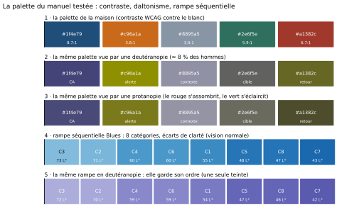

# Module M10.C03 — Couleurs, palettes, accessibilité et culture locale

**Outils : matplotlib 3.10.9, pandas 2.2.3, numpy 2.3.5 (exécutés dans ce chapitre) ; seaborn 0.13.2
(annoncé, C07) ; Excel (exécuté, C07) ; Power BI (cité, non exécuté, C07).
Durée indicative : 4 h. Niveau : N3. Prérequis : M10.C01 (l'ordre perceptuel : la couleur est le canal
le moins précis) et M10.C02 (le catalogue des 16 graphiques).**

> **L'idée du chapitre.** C01 a classé la couleur en dernier dans la hiérarchie de précision ; ce
> chapitre en fait un **outil**, pas une décoration. Trois contraintes mesurables d'abord : le
> **contraste** (un texte lisible sur fond blanc demande un rapport de 4,5 pour 1 — notre gris de la
> maison est à 3,05), le **daltonisme** (environ 8 % des hommes ; le vert et le rouge de notre palette
> passent de 73,4 à 35,7 unités d'écart en deutéranopie, soit la moitié) et la **redondance** (couleur
> **et** forme **et** libellé — jamais la couleur seule). Puis les contraintes de terrain : la couleur
> qui signifie deux choses dans le même rapport, le format des montants en FCFA, la culture locale des
> couleurs et la lisibilité à l'écran comme au vidéoprojecteur. La sortie du chapitre est concrète :
> une **charte de graphique d'une page**, appliquée aux cinq graphiques du projet.

> **Matériel de l'atelier — Python 3.13 · matplotlib 3.10.9 · pandas 2.2.3 · numpy 2.3.5.** Toutes
> les mesures de ce chapitre sont calculées par `tools/couleurs_M10.py` sur les couleurs réelles du
> manuel et sur le socle M09 (les **50 008** ventes de la quincaillerie) ; la planche
> `figures/M10_C03_palette_testee.svg` est écrite par le même script (deux exécutions = même fichier).
> Les simulations de daltonisme emploient la méthode linéaire de Viénot, Brettel et Mollon (1999),
> couramment utilisée pour la vérification d'accessibilité.

---

## 1. Objectifs du chapitre

À la fin de ce chapitre, vous savez :

1. **Distinguer les trois familles de palettes** — catégorielle, séquentielle, divergente — et les
   apparier à la nature de la variable (sans ordre, ordonnée, ordonnée autour d'un centre).
2. **Mesurer un contraste** : calculer le rapport de contraste d'une couleur contre le blanc, savoir
   que le seuil d'un texte est de 4,5 pour 1 (3 pour 1 pour un élément graphique), et citer les deux
   couleurs de la palette de la maison qui échouent.
3. **Simuler le daltonisme** sur une palette (protanopie, deutéranopie, tritanopie), mesurer l'écart
   résiduel entre deux couleurs avec la distance Lab, et dire quelles paires deviennent risquées —
   chez nous, la paire vert et rouge, dont l'écart tombe de 73,4 à 35,7.
4. **Employer la redondance** comme règle d'or : couleur **et** forme **et** libellé pour distinguer
   les séries ; la couleur ne porte jamais seule une information.
5. **Écrire les nombres d'un graphique en FCFA** : séparateur de milliers, devise, décimales qu'on ne
   publie pas (98,53 % de nos montants portent des centimes, et les arrondir déplace le total de
   12 481,98 FCFA, soit 0,0002 % — le choix est donc libre, mais il se déclare).
6. **Rédiger une charte de graphique d'une page** — palette, contraste, redondance, formats, ton —
   et l'appliquer aux cinq graphiques du projet.

## 2. Pourquoi cette notion est importante

La couleur est le canal le plus employé et le plus mal employé. Trois raisons à cela : elle est
gratuite dans les logiciels (une liste déroulante), elle est immédiatement visible (donc rassurante
pour l'auteur) et elle **ne se vérifie pas à l'œil** — celui qui choisit les couleurs est rarement
celui qui les subit. Un rapport lu sur l'écran du concepteur, en pleine lumière, dans une pièce
calme, peut être illisible projeté dans une salle éclairée, imprimé en noir et blanc ou lu par un
daltonien.

Les chiffres du chapitre donnent la mesure du problème. Notre palette de la maison est pourtant
soignée : le bleu principal atteint un rapport de contraste de 8,66 contre le blanc et le vert 5,91.
Mais l'orange de la maison est à 3,78 et le gris à 3,05 : **ni l'un ni l'autre ne porte un texte**,
même s'ils restent acceptables comme éléments graphiques (seuil de 3 pour 1). Un jaune vif, que
beaucoup de rapports emploient pour « faire ressortir » une série, tombe à 1,43 — quasiment invisible
sur un fond blanc et totalement effacé par un vidéoprojecteur.

Le daltonisme, ensuite. Sa fréquence est d'environ 8 % chez les hommes ; dans un comité de douze
personnes, la probabilité qu'au moins un participant voie la palette autrement est supérieure à une
chance sur deux. Or notre paire la plus « parlante » — le vert pour « cible atteinte », le rouge pour
« retour » — est exactement la paire qui s'effondre : 35,7 unités d'écart après simulation, la moitié
de l'écart d'origine, les deux couleurs virant vers le même olive. Le graphique n'est pas faux : il
devient muet pour une partie de l'audience. C'est le même motif que le camembert surchargé de C02 —
l'information existe, elle n'arrive pas.

> **Dans les faits.** Le rapport de la quincaillerie fourni avec le module emploie **trois** couleurs
> (bleu, orange, gris) sur cinq graphiques — et l'orange y joue **3 rôles distincts** en 7 emplois :
> la moyenne de référence sur un cadre, la série du dessus d'un double axe sur un autre, les retours
> sur un troisième. Un lecteur qui suit le rapport d'un bout à l'autre ne peut pas mémoriser ce que
> l'orange signifie : la couleur n'y porte aucun contrat. C'est l'un des défauts que la refonte devra
> corriger — et il ne se voit pas dans les totaux.

## 3. Explication simple — le code de la route des couleurs

Une palette de graphique n'est pas une garde-robe, c'est un **code de la route**. Quatre panneaux, et
chacun dit une seule chose, toujours la même.

1. **Le panneau « catégories »** (palette catégorielle) : des couleurs qui ne se hiérarchisent pas,
   pour des groupes sans ordre — magasins, canaux, régions. Règle : au-delà de cinq ou six groupes,
   on arrête la couleur et on passe aux libellés.
2. **Le panneau « échelle »** (palette séquentielle) : une seule teinte, du clair au foncé, pour une
   variable ordonnée — montant, intensité, densité. C'est la palette de la carte de chaleur, et c'est
   aussi la plus robuste au daltonisme (une seule teinte, donc un ordre qui survit aux simulations).
3. **Le panneau « écart »** (palette divergente) : deux teintes opposées autour d'un centre neutre,
   pour un écart à une référence — au-dessus et en dessous de la moyenne, marge positive et négative.
   Règle absolue : le centre est **donnée**, pas esthétique (le zéro, la moyenne, la cible).
4. **Le panneau « personne »** (redondance) : à chaque fois qu'une couleur distingue deux séries, un
   second signe doit le faire aussi — trait plein contre pointillé, cercle contre carré, étiquette
   en clair. C'est le panneau qui sauve le rapport quand la couleur échoue.

Le code tient en une phrase : **la couleur ne transporte jamais seule une information** ; elle
double un signe qui, lui, est lisible par tous.

## 4. Vocabulaire essentiel

| Terme | Définition |
|---|---|
| **palette catégorielle** | un jeu de couleurs de teintes distinctes pour des groupes **sans ordre** (canaux, magasins, catégories). |
| **palette séquentielle** | une progression d'une seule teinte, du clair au foncé, pour une variable **ordonnée** (montant, densité, intensité). |
| **palette divergente** | deux teintes opposées séparées par un centre neutre, pour un **écart à une référence** (marge, variation, écart à la cible). |
| **rapport de contraste** | le rapport de luminance entre une couleur et son fond (norme WCAG) : 4,5 pour 1 pour un texte, 3 pour 1 pour un élément graphique. |
| **distance Lab** | l'écart perceptuel entre deux couleurs, en unités ΔE\* : sous 10, deux couleurs sont difficiles à distinguer sur un graphique. |
| **daltonisme** — *color vision deficiency* | une vision des couleurs altérée, qui touche une majorité des personnes concernées sur l'axe vert-rouge (protanopie, deutéranopie) et une minorité sur l'axe bleu-jaune (tritanopie). |
| **redondance** | le fait de coder une même distinction par plusieurs signes (couleur **et** forme **et** libellé), pour que l'information survive à la perte d'un canal. |
| **charte de graphique** — *chart style* | les règles d'une maison (palette, contrastes, formats, titres, sources) appliquées à **tous** ses graphiques : le document d'une page qui rend deux rapports reconnaissables comme venant de la même organisation. |

## 5. Cours approfondi

### 5.1 Les trois familles de palettes et leur règle d'appariement

Le choix d'une palette se déduit de la **nature de la variable**, pas du goût de l'auteur :

| Nature de la variable | Palette | Exemple sur le fil rouge | Palette de l'atelier |
|---|---|---|---|
| groupes **sans ordre** (2 à 6) | catégorielle | les 5 magasins, les 3 villes, les canaux de paiement | bleu, orange, gris, vert, rouge |
| grandeur **ordonnée** | séquentielle | CA par catégorie d'une carte de chaleur, densité de ventes | rampe `Blues` du catalogue |
| **écart à une référence** | divergente | écart au panier moyen, variation trimestrielle | rampe `RdBu` centrée sur zéro |
| **une seule série** | aucune couleur | courbe du CA, histogramme des montants | bleu unique + gris de contexte |

> **Définition.** La **palette de la maison** (ou palette de référence) est le jeu de couleurs figé
> par la charte, avec un rôle par couleur. Sa raison d'être n'est pas esthétique : c'est de rendre un
> lecteur capable de dire, sans lire la légende, ce que chaque couleur signifie — parce qu'elle
> signifie la même chose dans tous les graphiques de l'organisation.

Trois erreurs reviennent sans cesse. La première consiste à **colorer une série unique** : un
histogramme bleu, dont les barres ont toutes la même couleur, n'ajoute aucune information en changeant
de teinte d'une barre à l'autre — c'est de la décoration qui suggère une catégorie inexistante. La
deuxième consiste à employer une palette **séquentielle sur une variable sans ordre** : colorer cinq
magasins par une rampe de bleus suggère que le magasin 1 est « plus » que le magasin 5 ; le lecteur y
verra une hiérarchie qui n'existe pas. La troisième consiste à employer une palette **divergente sans
centre métier** : une échelle de rouge et de bleu centrée sur la moyenne arithmétique d'une série
asymétrique place le neutre au mauvais endroit et colore de rouge des valeurs parfaitement normales.

> **Définition.** Une palette est **appariée** quand sa famille (catégorielle, séquentielle,
> divergente) correspond à la structure de la variable affichée. Le test est unique : « si je
> remplace les couleurs par du gris, l'information centrale reste-t-elle lisible ? » Si oui, la
> couleur est un appui ; si non, elle porte trop.

### 5.2 Contraste : ce qui se lit et ce qui ne se lit pas

Le contraste se mesure : c'est le rapport entre la luminance relative de deux couleurs (la formule de
la norme WCAG, implémentée dans le script du chapitre). Résultats mesurés sur notre palette, contre un
fond blanc :

| Couleur | Code | Contraste contre blanc | Contraste contre noir | Verdict |
|---|---|---|---|---|
| Bleu de la maison | `#1f4e79` | **8,66** | 2,42 | texte et graphique : parfait |
| Rouge de la maison | `#a1382c` | **6,74** | 3,12 | texte et graphique |
| Vert de la maison | `#2e6f5e` | **5,91** | 3,55 | texte et graphique |
| Orange de la maison | `#c96a1a` | 3,78 | 5,56 | graphique seulement (texte blanc déconseillé) |
| Gris de la maison | `#8895a5` | 3,05 | 6,89 | graphique seulement, jamais pour un texte |
| Jaune vif (à éviter) | `#ffd400` | **1,43** | — | invisible sur fond blanc |

Trois conséquences pratiques. D'abord, **l'ordre de la palette est aussi un ordre de lisibilité** : le
bleu et le rouge supportent un texte, l'orange et le gris non. Ensuite, **le fond compte autant que la
couleur** : l'orange à 3,78 contre le blanc passe à 5,56 contre le noir — un rapport imprimé en
négatif change la lisibilité de tous les textes. Enfin, **le seuil n'est pas le même pour un texte et
pour une marque graphique** : une barre orange reste parfaitement visible (élément graphique, seuil de
3 pour 1), mais une étiquette écrite en orange sur blanc fatigue le lecteur.

> **Conseil professionnel.** Le test du vidéoprojecteur est le plus impitoyable, et le plus simple à
> préparer : projetez votre graphique, reculez de trois mètres, et demandez à quelqu'un de lire
> l'étiquette la plus claire. Si elle n'est pas lisible, ce n'est pas la faute du projecteur : c'est
> que le graphique compte sur une nuance faible pour porter une information. La solution est toujours
> la même — assombrir la couleur ou écrire le chiffre.

### 5.3 Dal tonisme : simuler pour vérifier

On ne demande pas à l'auteur d'un graphique d'imaginer ce que voit un daltonien : on **simule**. Le
script du chapitre applique trois matrices de simulation (protanopie, deutéranopie, tritanopie) à
chaque couleur de la palette, puis mesure la distance Lab entre toutes les paires, avant et après.

| Vision | Écart minimal entre deux couleurs de la palette | La paire critique | Paires sous 10 ΔE\* |
|---|---|---|---|
| normale | **32,1** | orange et rouge | 0 |
| deutéranopie | **23,3** | gris et vert | 0 |
| protanopie | **17,7** | vert et rouge | 0 |
| tritanopie | **11,2** | bleu et vert | 0 |

Bonne nouvelle : aucune paire de la palette ne franchit le seuil de 10 ΔE\*, y compris simulée. Le
chapitre n'a donc pas à changer de palette — mais il doit retenir **deux faits chiffrés** qui
décident de l'usage :

1. **La paire la plus fragile est le vert et le rouge** (cible contre retour), qui passe de 73,4 ΔE\*
   en vision normale à **35,7** en deutéranopie : l'écart est divisé par deux et les deux couleurs se
   rapprochent d'un vert olive commun. Sur une carte de chaleur ou un graphique à deux séries où
   seul le rouge distingue un « retour », le message s'affaiblit sérieusement.
2. **La paire la plus robuste est la rampe séquentielle** : une seule teinte déclinée en clarté
   (30 L\* d'amplitude) conserve son ordre après simulation — l'écart minimal entre deux cases
   voisines reste de 0,4 ΔE\* en vision normale comme en deutéranopie, et l'ordre des cases ne change
   pas. Autrement dit : **quand une information doit être portée par la couleur, une rampe
   séquentielle est le choix sûr** ; quand il faut distinguer des groupes, la redondance (§5.4) est
   obligatoire.

> **Attention.** L'écart minimal de 0,4 ΔE\* entre deux cases voisines de la rampe n'est pas une
> bonne nouvelle : il signifie que deux catégories voisines (C5 et C8, séparées de 0,05 point) restent
> indiscernables à l'œil, daltonien ou non. La robustesse de la rampe au daltonisme ne crée pas de
> précision : elle ne fait que garantir que l'**ordre général** survit. Les deux chapitres se
> répondent : C01 mesure ce que l'œil peut lire, C03 mesure ce que la couleur ajoute — ou n'ajoute
> pas.

### 5.4 La redondance : couleur **et** forme **et** libellé

La redondance est la seule parade qui ne dépend ni de la vision, ni du support, ni de la qualité de
l'impression. Elle s'applique par ordre de coût croissant :

1. **Le libellé en clair** (le moins cher) : écrire le nom de la série à côté de sa dernière valeur,
   au lieu de la laisser dans une légende détachée. Le lecteur n'a plus à faire l'aller-retour
   œil-légende-œil.
2. **La forme du trait ou du marqueur** : trait plein contre pointillé, cercle contre carré. Cinq
   styles de traits et quatre formes de marqueurs permettent de distinguer jusqu'à vingt séries sans
   aucune couleur — bien au-delà du besoin réel.
3. **La position** : les petits multiples (C02) remplacent la couleur par la facette : chaque série
   dans son cadre, avec un titre. C'est la redondance la plus robuste, et la plus coûteuse en place.
4. **L'annotation directe** : la flèche et le chiffre clé, qui désignent le point important sans
   passer par la couleur.

> **Définition.** La **lisibilité en niveaux de gris** est la propriété d'un graphique qui reste
> entièrement compréhensible une fois la couleur retirée : chaque série garde un signe distinctif
> (libellé, forme, position). C'est la propriété qui décide si un rapport survit à une impression
> monochrome — et c'est le test le plus rapide à faire passer avant publication.

Le principe qui les rassemble : **la couleur est un canal d'appoint, jamais un canal porteur**. Dans
la charte du chapitre, cela se traduit par une phrase à recopier : « toute série distinguée par une
couleur l'est aussi par un libellé ou une forme ».

### 5.5 La couleur qui signifie deux choses

Passons aux défauts réels, ceux du rapport à refondre. Sur cinq graphiques, le rapport emploie trois
couleurs — et l'orange y joue **3 rôles distincts** en 7 emplois : la moyenne de référence sur un
cadre, la série du dessus d'un double axe sur un autre, les retours sur un troisième. Aucun de ces
emplois n'est fautif en soi ; c'est leur **cumul** qui détruit le contrat de lecture. Le lecteur qui
apprend « orange = retours » au troisième cadre sera trompé au quatrième, où l'orange désigne une
moyenne.

Deux règles de la charte en découlent :

1. **Un rôle par couleur, pour tout le document** (mieux : pour toute la série de rapports). Si
   l'orange signifie « retour », aucune autre série ne l'emploie — et l'alerte de seuil, elle, se
   signale par le rouge, qui ne sert à rien d'autre.
2. **Au-delà de trois couleurs, une légende n'est plus lue** : les rapports qui emploient six teintes
   pour six séries produisent des graphiques que le lecteur lit en noir et blanc, c'est-à-dire en
   positions et en libellés. Avoir six couleurs revient à en avoir zéro.

> **Dans les faits.** Le test est facile à faire dans sa propre organisation : ouvrez les trois
> derniers rapports publiés et demandez à un collègue ce que signifie « le rouge » dans l'ensemble.
> S'il répond « ça dépend du graphique », la charte manque. C'est le défaut le plus répandu et le
> moins coûteux à corriger : une page, une fois.

### 5.6 FCFA et formats numériques : ce qu'on écrit, ce qu'on n'écrit pas

> **Définition.** On appelle **précision affichée** le nombre de chiffres significatifs décidés à
> l'affichage, par opposition à la précision du calcul. Les deux n'ont pas à coïncider : un total
> calculé au centime se publie au franc ou au millier selon le destinataire — l'important est que le
> choix soit écrit dans la charte et appliqué partout, pour que deux rapports ne publient pas deux
> chiffres différents du même indicateur.

Un graphique de données financières doit trancher quatre questions de format, et les trancher
**une fois pour toutes** :

**Les milliers.** Le socle écrit ses montants avec un espace insécable comme séparateur de milliers
(le format international) : `7 876 320 164 FCFA` se lit d'un coup d'œil, `7876320164` non. La règle
de la charte : séparateur d'espace, jamais de virgule (une virgule de milliers est un point décimal
pour la moitié du monde, et nos CSV contiennent déjà le point décimal).

**La devise.** Le franc CFA ne se dévalue pas sur la période du socle et ne se convertit pas : on
écrit `FCFA` (ou `XOF` dans les fichiers techniques) et on ne met **jamais** de symbole « F ». Pour les
grands montants, le passage au million ou au milliard s'écrit dans l'axe ou dans l'unité — « CA net
(millions FCFA) » —, pas dans chaque étiquette.

**Les décimales.** Question politique, pas technique. Le socle porte des centimes : **98,53 %** des
lignes ont un montant qui n'est pas un franc entier (49 275 lignes sur 50 008). Arrondir tout au franc
déplace le total de **12 481,98 FCFA**, soit **0,0002 %** : c'est négligeable pour un rapport de
direction, mais c'est un écart qu'un auditeur peut réclamer. La règle du module : on affiche les
montants **arrondis** dans les graphiques et les tableaux de synthèse (zéro décimale), on **conserve**
les centimes dans les fichiers de calcul et dans les rapports financiers, et la charte **dit** lequel
des deux est employé.

**Le zéro et les pourcentages.** Un pourcentage publié sans son effectif est un piège (M09) : la
charte impose, pour tout taux affiché seul, la mention de la base (« 0,4 % de retours, sur
50 008 ventes »). Et la décimale des pourcentages se limite à une : « 40,2 % », jamais
« 40,2137 % » — la précision affichée doit correspondre à la précision de la mesure.

### 5.7 Culture locale, écran et vidéoprojecteur

> **Attention.** Le seuil de 10 ΔE\* servant ici à juger deux couleurs n'est pas une norme : c'est
> la valeur que le module retient comme limite pratique de distinction sur un graphique. Deux couleurs
> séparées de moins de 10 ΔE\* restent visibles comme **deux** zones, mais le lecteur ne peut plus
> dire laquelle est laquelle sans se référer à la légende — c'est précisément ce que la redondance
> évite.

Trois contraintes de terrain, souvent oubliées dans les chartes :

1. **Le sens des couleurs dépend du contexte.** Le rouge signale une alerte dans un tableau de bord
   financier ; il signale une fête, une réussite ou un prix dans d'autres contextes. Le vert, qui
   porte « cible atteinte » dans ce manuel, n'a cette valeur que parce que la charte le **déclare**.
   La règle : les couleurs d'état (rouge, vert, orange) se définissent dans la charte, avec leur
   signification écrite — et elles ne servent à rien d'autre (pas de série « verte » décorative).
2. **L'écran n'est pas la salle.** Un graphique préparé sur un écran de bureau est vu, en réunion,
   sur un vidéoprojecteur qui éclaircit les teintes claires et écrase les contrastes. Les remèdes
   sont mesurables : lignes plus épaisses (2 points au lieu de 1), étiquettes plus grandes (au moins
   10 points), et jamais d'information portée par une nuance faible.
3. **L'impression noir et blanc.** Tout rapport peut finir imprimé en noir et blanc, et beaucoup de
   lecteurs impriment par défaut. Le test de la charte est donc explicite : **imprimez le graphique
   en niveaux de gris** ; si deux séries deviennent identiques, la redondance manque. C'est le test
   qui justifie à lui seul le §5.4.

> **À retenir.** Ces trois contraintes ne sont pas des préférences esthétiques : ce sont des pertes
> d'information, mesurables et prévisibles. La charte est le document qui les traite **avant** la
> production, plutôt que de les découvrir en réunion.

## 6. Exemple concret — la palette du manuel passée au banc d'essai

La planche du chapitre montre la palette de la maison dans trois situations : telle qu'elle est
conçue, telle qu'elle est vue par une deutéranopie, telle qu'elle est vue par une protanopie — puis la
rampe séquentielle du catalogue, dans les deux mêmes conditions.



Ce que la planche établit, bande par bande :

- **Bande 1 — la palette de la maison.** Cinq couleurs, chacune avec son rôle et son contraste mesuré
  contre le blanc : le bleu à 8,66 et le rouge à 6,74 portent un texte ; l'orange à 3,78 et le gris à
  3,05 ne le portent pas.
- **Bandes 2 et 3 — les simulations.** Le vert « cible » (`#2e6f5e`) et le rouge « retour »
  (`#a1382c`) se rapprochent visiblement d'un olive commun : c'est la paire à risque, celle que
  §5.3 chiffre à 35,7 unités d'écart contre 73,4 en vision normale. Le bleu et le jaune, en revanche,
  restent nettement distincts dans les deux simulations.
- **Bandes 4 et 5 — la rampe séquentielle.** Les huit cases gardent leur **ordre** : les clartés vont
  de 73 à 43 L\* en vision normale, et de 72 à 42 L\* en deutéranopie — l'ordre est identique, seule
  la teinte glisse légèrement. C'est la démonstration que la carte de chaleur est la famille la plus
  sûre du catalogue pour un public large.

Le verdict pour la charte tient en trois lignes : **la palette est bonne** (aucune paire sous
10 ΔE\*, même simulée) ; **l'usage doit imposer la redondance** dès que le vert et le rouge portent
deux séries voisines ; **la rampe séquentielle reste l'outil par défaut** quand la couleur doit porter
une intensité.

## 7. Démonstration pas à pas — mesurer sa propre palette en 5 étapes

**Étape 1 — le contraste.** On calcule la luminance relative de chaque couleur, puis le rapport.

```python
import numpy as np, matplotlib.pyplot as plt
def lin(c):
    return np.where(c <= 0.04045, c / 12.92, ((c + 0.055) / 1.055) ** 2.4)

def luminance(rgb):
    r, g, b = lin(np.asarray(rgb, dtype=float))
    return float(0.2126 * r + 0.7152 * g + 0.0722 * b)

def contraste(a, b):
    la, lb = luminance(a), luminance(b)
    return (max(la, lb) + 0.05) / (min(la, lb) + 0.05)

BLANC = np.array([1.0, 1.0, 1.0])
for nom, hx in (("bleu", "#1f4e79"), ("orange", "#c96a1a"), ("gris", "#8895a5")):
    rgb = np.array([int(hx[i:i+2], 16) / 255 for i in (1, 3, 5)])
    print(f"{nom:7s} contre blanc : {contraste(rgb, BLANC):.2f}:1")
```

```text
bleu    contre blanc : 8.66:1
orange  contre blanc : 3.78:1
gris    contre blanc : 3.05:1
```

**Étape 2 — la distance Lab.** Deux couleurs « différentes » peuvent être perceptuellement proches :
il faut la distance, pas la différence de code.

```python
def lab(rgb):
    r, g, b = lin(np.asarray(rgb, dtype=float))
    x = r * 0.4124 + g * 0.3576 + b * 0.1805
    y = r * 0.2126 + g * 0.7152 + b * 0.0722
    z = r * 0.0193 + g * 0.1192 + b * 0.9505
    f = lambda t: t ** (1/3) if t > 0.008856 else 7.787 * t + 16/116
    fx, fy, fz = f(x / 0.95047), f(y), f(z / 1.08883)
    return np.array([116 * fy - 16, 500 * (fx - fy), 200 * (fy - fz)])

vert = np.array([0x2e, 0x6f, 0x5e]) / 255
rouge = np.array([0xa1, 0x38, 0x2c]) / 255
print("vert vs rouge :", round(float(np.linalg.norm(lab(vert) - lab(rouge))), 1), "dE")
```

```text
vert vs rouge : 73.4 dE
```

**Étape 3 — la simulation du daltonisme.** La méthode linéaire transforme la couleur dans l'espace
LMS (cônes), annule un axe, puis revient en sRGB.

```python
RGB_VERS_LMS = np.array([[17.8824, 43.5161, 4.11935],
                         [3.45565, 27.1554, 3.86714],
                         [0.0299566, 0.184309, 1.46709]])
LMS_VERS_RGB = np.linalg.inv(RGB_VERS_LMS)
DEUTERANOPIE = np.array([[1.0, 0.0, 0.0], [0.494207, 0.0, 1.24827], [0.0, 0.0, 1.0]])

def gamma(c):
    c = np.clip(c, 0, 1)
    return np.where(c <= 0.0031308, c * 12.92, 1.055 * c ** (1/2.4) - 0.055)

def simuler(rgb):
    return gamma(LMS_VERS_RGB @ (DEUTERANOPIE @ (RGB_VERS_LMS @ lin(rgb))))

print("vert vs rouge, deutéranopie :",
      round(float(np.linalg.norm(lab(simuler(vert)) - lab(simuler(rouge)))), 1), "dE")
```

```text
vert vs rouge, deutéranopie : 35.7 dE
```

**Étape 4 — la rampe séquentielle.** On vérifie que l'ordre survit : les clartés doivent rester
monotones, en vision normale **et** simulée.

```python
rampe = plt.get_cmap("Blues"); norme = plt.Normalize(0, 20)
parts = [8.85, 9.26, 11.90, 12.02, 12.97, 14.66, 14.71, 15.63]
couloir = [np.array(rampe(norme(x))[:3]) for x in parts]
print("clartes normales :", [round(float(lab(c)[0])) for c in couloir])
print("clartes simulées :", [round(float(lab(simuler(c))[0])) for c in couloir])
```

```text
clartes normales : [73, 71, 60, 60, 55, 48, 47, 43]
clartes simulées : [72, 70, 59, 59, 54, 47, 46, 42]
```

**Étape 5 — les formats.** On mesure ce que coûte l'arrondi des montants, avant de trancher.

```python
import pandas as pd
v = pd.read_csv("03_exercices/dossier_M09/quincaillerie/vente.csv")
m = v["montant_ttc"]
avec = int((np.round(m * 100) % 100 != 0).sum())
print("lignes avec centimes :", avec, "sur", len(m))
print("delta de l'arrondi au franc :", round(float(np.abs(np.round(m) - m).sum()), 2), "FCFA")
```

```text
lignes avec centimes : 49275 sur 50008
delta de l'arrondi au franc : 12481.98 FCFA
```

**Ce que la démonstration établit.** Mesurer sa palette prend dix minutes et évite deux catégories de
désastres : un texte illisible (contraste 3,05 pour le gris) et une information perdue pour une partie
du public (la paire vert-rouge de 73,4 à 35,7). Et la mesure des formats rappelle qu'un choix
d'affichage n'est jamais neutre : arrondir 98,53 % des lignes déplace le total de 12 481,98 FCFA —
négligeable, mais à déclarer.

## 8. Erreurs fréquentes

1. **Colorer une série unique.** Un histogramme multicolore suggère des catégories qui n'existent pas ;
   la couleur doit correspondre à une variable, pas à une envie.
2. **Employer une rampe pour des groupes.** Des magasins colorés en dégradé de bleu paraissent
   ordonnés et hiérarchisés ; ils ne le sont pas.
3. **Centrer une palette divergente sur la moyenne.** Sur une série asymétrique (comme les montants,
   dont 77,0 % sont sous 250 000 FCFA), la moyenne n'est pas un centre perceptuel : le rouge couvre
   alors la moitié du graphique sans raison métier. Le centre se choisit métier : zéro, cible, seuil.
4. **Compter sur la légende.** Au-delà de trois couleurs, la légende n'est plus lue ; les libellés
   directs résolvent le problème et suppriment la légende.
5. **La couleur qui signifie deux choses.** Trois rôles pour l'orange dans un même rapport : le
   lecteur ne peut pas construire de contrat de lecture.
6. **Oublier le test noir et blanc.** Toute série distinguée par la seule couleur disparaît à
   l'impression en niveaux de gris — c'est-à-dire dans une bonne partie des lectures réelles.
7. **Publier des décimales décoratives.** Un pourcentage à quatre décimales suggère une précision que
   la mesure n'a pas ; une étiquette en centimes sur un graphique de direction charge le dessin sans
   informer.

## 9. Bonnes pratiques professionnelles

1. **Écrire la charte une fois** (une page : palette, rôles, seuils de contraste, redondance, formats,
   source) et l'appliquer à tous les graphiques de l'organisation. C'est l'objet du mini-projet du
   chapitre.
2. **Apparier la palette à la variable** : catégorielle pour des groupes, séquentielle pour une
   intensité, divergente pour un écart — et rien pour une série unique.
3. **Mesurer, pas juger** : contraste et distance Lab se calculent ; le script du chapitre se réutilise
   tel quel sur n'importe quelle palette.
4. **Imposer la redondance** dès deux séries : libellé en clair, forme de trait, marqueur — dans cet
   ordre de coût.
5. **Réserver les couleurs d'état** (rouge, vert, orange) à l'état, et les déclarer dans la charte —
   jamais une série décorative en vert.
6. **Tester les trois supports** : écran, impression en niveaux de gris, vidéoprojecteur. Trois tests,
   dix minutes, et deux corrections évitées.
7. **Écrire les nombres comme on les lit** : espace pour les milliers, `FCFA` pour la devise, zéro ou
   une décimale, et la base de tout pourcentage.

## 10. Exercice guidé — « l'orange qui voulait tout dire » (15 min, /10)

**Contexte.** Le rapport de la quincaillerie emploie trois couleurs sur cinq graphiques, et l'orange y
joue trois rôles distincts (moyenne de référence, série d'un double axe, retours). La direction
souhaite une charte avant la prochaine publication.

**Consigne.** Dans les 15 minutes :

1. Listez les trois rôles de l'orange et proposez une **règle de résolution** qui tienne sur une
   ligne. (2 pts)
2. Donnez le **contraste** de l'orange et du gris contre le blanc (valeurs mesurées au §5.2) et dites
   ce que chaque couleur peut porter dans la charte. (2 pts)
3. Sur la paire vert et rouge (cible et retour), donnez l'écart Lab en vision normale et en
   deutéranopie, et écrivez la **mesure de redondance** que la charte doit imposer. (2 pts)
4. Écrivez la **règle de format** des montants (milliers, devise, décimales) en citant le chiffre du
   socle qui la justifie. (2 pts)
5. Rédigez les **quatre lignes** de la charte à afficher au-dessus du poste de travail : palette,
   redondance, formats, test de sortie. (2 pts)

## 11. Exercices autonomes

**E1 — la palette de votre organisation au banc d'essai (30 min).** Relevez les couleurs employées
dans les trois derniers rapports publiés autour de vous (codes hexadécimaux si possible, sinon
approximation). Calculez leur contraste contre le blanc ; listez les **rôles** que chaque couleur joue
et repérez les couleurs à plusieurs rôles. Puis répondez à deux questions : combien de couleurs
distinctes pour combien de rôles ? Et si l'on simulait une deutéranopie, quelles paires resteraient
distinguables ? Rendez un tableau et une recommandation en trois lignes.

**E2 — la redondance en pratique (25 min).** Prenez un graphique à trois séries que vous avez produit
(couleur seule). Refaites-le **sans couleur** : libellés en clair, trois styles de traits, une
annotation sur le chiffre clé de chaque série. Imprimez les deux versions en niveaux de gris et
comparez : laquelle se lit sans effort ? Notez le temps que la version redondante vous a coûté et ce
qu'elle vous a fait découvrir sur votre propre graphique (souvent : une série inutile).

## 12. Correction détaillée

**Exercice guidé.**

1. **Les trois rôles** : moyenne de référence, série du dessus d'un double axe, retours. **Règle de
   résolution** : « une couleur, un rôle, pour tout le document — la moyenne de référence passe au
   gris pointillé, la série secondaire à une teinte dédiée, et l'orange reste réservé aux retours. »
2. **Contrastes** : orange 3,78 et gris 3,05 contre le blanc. Ni l'un ni l'autre ne porte un texte
   (seuil 4,5) ; les deux restent acceptables comme marques graphiques (seuil 3), le gris étant à la
   limite — la charte le réserve au contexte (repères, grille, moyenne).
3. **Vert et rouge** : 73,4 ΔE\* en vision normale, **35,7** en deutéranopie (l'écart est divisé par
   deux, les deux couleurs tendent vers un olive commun). **Mesure de redondance imposée** : la série
   « retour » porte un marqueur distinct (par exemple un carré) et un libellé en clair, en plus de sa
   couleur.
4. **Règle de format** : milliers séparés par un espace insécable, devise `FCFA` écrite en clair,
   montants affichés arrondis au franc dans les graphiques et tableaux de synthèse. Justification :
   98,53 % des 50 008 montants portent des centimes, et l'arrondi déplace le total de 12 481,98 FCFA
   (0,0002 %) — écart négligeable pour une direction, mais qui doit être **déclaré** dans la charte
   pour rester vérifiable.
5. **Les quatre lignes de la charte** (réponses possibles, toutes acceptables si elles sont
   opérationnelles) : « Palette : bleu = série principale, orange = retours, gris = contexte, vert =
   cible, rouge = alerte — un rôle par couleur. » — « Redondance : toute série distinguée par une
   couleur porte aussi un libellé ou une forme. » — « Formats : milliers à l'espace, `FCFA`, montants
   arrondis, pourcentages à une décimale avec leur base. » — « Sortie : toute figure est testée en
   niveaux de gris et projetée avant publication. »

**E1 (la palette de votre organisation).** Grille de correction : les contrastes sont calculés (et
non estimés) ; le tableau des rôles fait apparaître au moins une couleur à plusieurs rôles ; la
recommandation tient en trois lignes et propose un arbitrage **faisable** (« réserver le rouge à
l'alerte » plutôt que « refaire tous les rapports »). Le repère attendu, à titre de comparaison : la
palette du manuel compte 5 couleurs pour 5 rôles, 0 paire sous 10 ΔE\*, et la paire la plus fragile à
35,7 ΔE\* simulée.

**E2 (la redondance en pratique).** Trois attendus : le graphique **sans couleur** reste entièrement
lisible (c'est le seul verdict qui compte) ; le temps passé est cohérent (15 à 25 minutes pour trois
séries — la redondance coûte moins qu'une réunion de correction) ; la découverte est écrite (presque
toujours : une série trop faible pour justifier sa place, ou un chiffre clé qui n'était pas annoté).

## 13. Mini-projet M10.P3 — « la charte de graphique, une page » (1 h)

**Énoncé.** Vous êtes l'analyste de la quincaillerie ; la direction a demandé que « tous les
graphiques se ressemblent ». Vous produisez la **charte de graphique** — une page, pas un livre — qui
rendra les rapports reconnaissables et lisibles sur les trois supports (écran, papier noir et blanc,
vidéoprojecteur).

1. **Palette et rôles** : la liste des couleurs employées (5 maximum), avec pour chacune son code, son
   rôle unique, son contraste contre le blanc et son verdict (texte / graphique uniquement).
2. **Règle de redondance** : la formulation exacte à appliquer (libellé, forme, marqueur) et le
   résultat du test en niveaux de gris sur **trois** des graphiques du dossier de refonte.
3. **Formats** : montants (milliers, devise, décimales, unité d'axe), pourcentages (décimales, base
   obligatoire), dates (format et granularité), et la mention de source.
4. **Règles de sortie** : résolution d'export, épaisseur de trait, taille minimale des étiquettes,
   marge intérieure, et les trois tests avant publication (niveaux de gris, projection, lecture à
   trois mètres).
5. **Application** : appliquez la charte aux **cinq** graphiques du dossier de refonte (`rapport_apres/`)
   et notez, pour chacun, ce que la charte a changé.

**Barème indicatif** : palette et rôles mesurés (5 points), redondance testée en noir et blanc
(4 points), formats complets et justifiés (4 points), règles de sortie (2 points), application aux cinq
graphiques avec le détail des changements (3 points), sur 18.

> **Pourquoi ce mini-projet.** La charte est l'artefact qui rend le module **durable** : elle sera
> réutilisée en M14 (tableau de bord), en M17 (automatisation) et dans la mission finale M21. C'est
> aussi le seul livrable du module qui s'applique à des graphiques que vous n'avez pas faits — donc la
> seule preuve que les règles tiennent sans vous.

## 14. Boîte à outils du chapitre

> **Boîte à outils.** Ce chapitre utilise **6 gestes**, tous exécutés dans la planche du §6 :
> `matplotlib.colormaps` (et `Normalize`) pour choisir une rampe, `Rectangle` pour les bandes de
> couleur, la conversion sRGB vers CIE L\*a\*b\*, le calcul du rapport de contraste WCAG, la
> simulation de daltonisme (matrices LMS) et la mesure d'un écart de clarté (ΔL\*).

| Besoin | Commande | Ce qu'elle donne | Ce qu'elle ne donne pas |
|---|---|---|---|
| choisir une rampe | `plt.get_cmap("Blues")` + `plt.Normalize(0, max)` | une couleur par valeur | la garantie qu'elle est lisible : il faut mesurer |
| mesurer un contraste | formule WCAG (luminance relative) | un rapport, comparable au seuil 4,5 | la lisibilité réelle sur un projecteur (test séparé) |
| mesurer un écart de couleur | distance Lab (ΔE\*) | la proximité perceptuelle de deux couleurs | la vision du lecteur : on simule |
| simuler le daltonisme | matrices LMS de Viénot et al. (1999) | la couleur telle qu'elle est perçue | une vérité individuelle : c'est une simulation moyenne |
| distinguer deux séries | style de trait, marqueur, libellé | une distinction robuste à tout support | rien : c'est la solution par défaut |
| formater un montant | `f"{x:,.0f}".replace(",", " ")` + `" FCFA"` | une étiquette lisible | la règle de décimales : elle est métier |

## 15. Résumé du chapitre

C03 a transformé la couleur d'ornement en **contrainte mesurée**. Contraste d'abord : notre palette de
la maison s'étage de 8,66 (bleu) à 3,05 (gris) contre le blanc, l'orange à 3,78 et le gris à 3,05
n'ayant pas le droit de porter un texte (seuil 4,5 pour 1), un jaune vif tombant à 1,43 — invisible.
Daltonisme ensuite : la palette ne perd aucune paire sous le seuil de 10 ΔE\*, mais le vert et le rouge
passent de 73,4 à **35,7** unités d'écart en deutéranopie, ce qui impose la redondance libellé plus
forme ; la rampe séquentielle, elle, conserve son ordre (clartés 73 à 43 L\*, puis 72 à 42 simulées),
ce qui en fait l'outil sûr quand la couleur doit porter une intensité. Usages enfin : l'orange du
rapport à refondre joue **3 rôles** en 7 emplois — un défaut de contrat de lecture ; les formats des
montants se tranchent une fois (98,53 % des lignes portent des centimes, l'arrondi déplace le total de
12 481,98 FCFA, soit 0,0002 %) ; et les trois tests de sortie — niveaux de gris, projection, lecture à
trois mètres — valident la figure avant publication. Le livrable est une **charte d'une page**.

## 16. À retenir

> **À retenir.** La couleur est un canal d'appoint, jamais un canal porteur : elle double un libellé ou
> une forme, elle ne les remplace pas. Une palette s'apparie à la nature de la variable, se mesure
> (contraste, distance Lab, simulation) et se fige dans une charte — sinon elle signifie une chose
> différente dans chaque graphique du même rapport.

1. **Trois familles, trois usages** : catégorielle (groupes sans ordre), séquentielle (intensité),
   divergente (écart à un centre **métier**).
2. **Contraste mesuré** : 4,5 pour 1 pour un texte, 3 pour 1 pour une marque graphique ; notre bleu est
   à 8,66, notre gris à 3,05, un jaune vif à 1,43.
3. **Daltonisme** : le vert et le rouge passent de 73,4 à **35,7** ΔE\* en deutéranopie ; aucune paire
   ne descend sous 10 ΔE\*, mais la redondance reste obligatoire.
4. **La rampe séquentielle est la plus robuste** : une seule teinte, un ordre qui survit (73 à 43 L\*,
   puis 72 à 42 simulées) — mais elle ne crée pas de précision (0,4 ΔE\* entre deux cases voisines).
5. **Une couleur, un rôle** : trois rôles pour l'orange dans un rapport, c'est trois fois zéro.
6. **Redondance** : libellé en clair, forme de trait, marqueur, annotation — dans cet ordre de coût.
7. **Formats** : milliers à l'espace, devise `FCFA`, montants arrondis dans les figures (98,53 % des
   lignes portent des centimes ; arrondir déplace le total de 12 481,98 FCFA, 0,0002 %), pourcentages
   à une décimale **avec leur base**.
8. **Trois tests avant publication** : niveaux de gris, projection, lecture à trois mètres.

## 17. Évaluation formative (auto-correction, 8 min)

1. **Pourquoi l'orange et le gris de la maison ne peuvent-ils pas porter un texte, alors qu'ils sont
   parfaitement lisibles comme barres ?**
   → Parce que les seuils diffèrent : 4,5 pour 1 pour un texte, 3 pour 1 pour un élément graphique.
   L'orange est à 3,78 et le gris à 3,05 : acceptables comme marques, insuffisants pour une étiquette.
   (2 pts)
2. **Le vert et le rouge de la charte servent « cible » et « retour ». Que dit la simulation en
   deutéranopie, et quelle règle en tirez-vous ?**
   → L'écart tombe de 73,4 à 35,7 ΔE\* (les deux couleurs tirent vers un olive commun) : la paire
   reste distinguable en moyenne, mais l'affaiblissement impose la **redondance** — marqueur distinct
   et libellé en clair pour la série « retour ». (2 pts)
3. **Pourquoi une rampe séquentielle est-elle le choix sûr quand la couleur doit porter une intensité
   (carte de chaleur), alors qu'elle ne rend pas deux catégories voisines lisibles ?**
   → Parce que la robustesse au daltonisme garantit l'**ordre** (clartés 73 à 43 L\*, puis 72 à 42
   simulées), pas la précision : deux cases séparées de 0,05 point restent à 0,4 ΔE\* — l'ordre général
   survit, la comparaison fine non. (2 pts)
4. **Trois rôles pour l'orange dans un rapport de cinq graphiques : quel est le problème, et quelle
   est la correction ?**
   → Le lecteur ne peut pas construire de contrat (« orange = retours »), donc il se trompe au cadre
   suivant ; correction : un rôle par couleur pour tout le document, l'orange réservé aux retours, la
   moyenne de référence passant au gris pointillé. (2 pts)
5. **Faut-il afficher les centimes des montants FCFA dans un graphique de direction ? Justifiez par
   une mesure.**
   → Non : 98,53 % des 50 008 lignes du socle portent des centimes, et arrondir tout au franc déplace
   le total de 12 481,98 FCFA, soit 0,0002 % — négligeable pour décider, mais à **déclarer** dans la
   charte pour qu'un auditeur puisse retrouver le total. (2 pts)
6. **Quel est le test le plus rapide pour vérifier qu'un graphique ne repose pas sur la couleur seule ?**
   → L'impression en niveaux de gris : si deux séries deviennent identiques, la redondance manque
   (libellé, forme de trait, marqueur). Dix secondes, et cela couvre aussi la lecture par une personne
   daltonienne sur un support imprimé. (2 pts)
