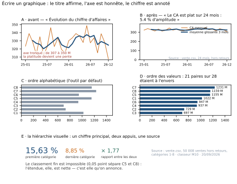

# Module M10.C04 — Écrire un graphique : titres qui affirment, axes honnêtes, annotations

**Outils : matplotlib 3.10.9, pandas 2.2.3, numpy 2.3.5 (exécutés dans ce chapitre) ; seaborn 0.13.2
(annoncé, C07) ; Excel (exécuté, C07) ; Power BI (cité, non exécuté, C07).
Durée indicative : 4 h. Niveau : N3. Prérequis : M10.C01 (la hiérarchie perceptuelle), M10.C02 (le
catalogue et la carte des métriques) et M10.C03 (couleurs, contraste, formats).**

> **L'idée du chapitre.** Un graphique se lit en cinq secondes : trois objets doivent donc y être
> écrits — **ce qu'on affirme** (le titre), **sur quelle échelle** (l'axe), et **le chiffre qui
> décide** (l'annotation) — plus la source. Ce chapitre mesure le coût de chacun des quatre.
> Le titre : nos cinq graphiques « avant » n'en portent aucun qui affirme quoi que ce soit (0 sur 5
> porte une mesure) contre 5 sur 5 après la refonte. L'axe : tronqué de 300 à 350 M, il multiplie par
> **7** l'amplitude apparente et occupe 82,4 % de la hauteur avec des données qui n'en occupent que
> 11,8 % sur un axe à zéro. L'ordre : l'ordre alphabétique classe **21 paires sur 28** à l'envers.
> L'annotation : les cinq graphiques refondus portent chacun un chiffre clé, contre **aucun** avant.
> La sortie du chapitre : les cinq graphiques du projet réécrits.

> **Matériel de l'atelier — Python 3.13 · matplotlib 3.10.9 · pandas 2.2.3 · numpy 2.3.5.** Toutes
> les mesures sont calculées par `tools/ecriture_M10.py` sur le dossier de refonte du module et sur le
> socle M09 (les **50 008** ventes, 24 mois) ; la planche
> `figures/M10_C04_ecriture_titre_axe_annotation.svg` est écrite par le même script (deux exécutions,
> même fichier). Le SVG de matplotlib ne contenant pas de texte mais des tracés, l'audit des titres
> est mené **sur le code** qui produit chaque graphique — c'est la méthode de contrôle retenue.

---

## 1. Objectifs du chapitre

À la fin de ce chapitre, vous savez :

1. **Écrire un titre qui affirme** — une phrase avec un verbe et un chiffre (« le CA est plat sur
   24 mois : 5,4 % d'amplitude ») — au lieu d'un titre qui étiquette (« évolution du chiffre
   d'affaires »), et expliquer pourquoi le titre est le premier critère de la grille.
2. **Diagnostiquer un axe tronqué** et chiffrer son effet : sur le fil rouge, la troncature de 300 à
   350 M occupe 82,4 % de la hauteur avec 11,8 % de données et multiplie l'amplitude apparente par 7.
3. **Choisir l'axe honnête** : le zéro par défaut pour les barres, la déclaration explicite pour les
   courbes de niveau (et pourquoi une courbe de niveau a le droit de ne pas partir de zéro).
4. **Ordonner les catégories** : mesurer ce que coûte l'ordre alphabétique (21 paires sur 28 classées
   à l'envers sur nos 8 catégories) et connaître les trois ordres légitimes (valeur, temps, métier).
5. **Annoter le chiffre qui décide** : désigner le point (pic, rupture, plateau), écrire la valeur,
   et ne jamais laisser au lecteur le soin d'estimer un chiffre sur un axe.
6. **Porter la source, la date et l'unité dans la figure**, et expliquer pourquoi ces trois mentions
   évitent trois allers-retours par courriel.
7. **Construire la hiérarchie visuelle** : un chiffre principal, deux chiffres d'appui, une phrase
   de lecture — et rien d'autre.

## 2. Pourquoi cette notion est importante

On juge souvent un graphique sur sa forme ; en réunion, on le juge sur ce qu'on peut en **citer**. Un
responsable qui doit parler de votre graphique devant dix personnes ne transmet pas une image : il
transmet une phrase. Si cette phrase n'est pas dans le graphique, il l'invente — et il l'inventera
fausse, une fois sur deux, parce qu'il n'aura pas le temps de vérifier.

C'est tout l'enjeu de ce chapitre : **un graphique professionnel est un graphique qu'on peut citer**.
Cela suppose quatre objets écrits. Le **titre** d'abord — c'est la phrase, et elle doit être vraie.
L'**axe** ensuite — c'est le contrat de lecture : sur quelles bornes les longueurs sont-elles
mesurées ? L'**annotation** — c'est le chiffre, à l'endroit exact où l'œil se pose. La **source** —
c'est la traçabilité, et elle coûte une ligne.

Les chiffres du dossier de refonte montrent à quel point ces quatre objets manquent dans la
production courante. Les cinq graphiques « avant » : **0 titre sur 5** porte une mesure, **0
annotation**, 1 seul cadre sur 5 a un axe à zéro, et **aucun** ne nomme sa source. Les cinq
graphiques refondus : **5 titres sur 5** portent une mesure, 5 annotations, 3 axes à zéro (les deux
autres étant des courbes de niveau avec troncature déclarée) et une mention de source. Entre les
deux, la donnée n'a pas changé : seule l'**écriture** l'a été.

Deuxième enjeu, plus technique : l'axe tronqué. Il n'est pas toujours une faute — sur une courbe de
niveau, il est parfois nécessaire pour rendre visible une variation faible. Mais il doit alors être
**déclaré**, parce que son effet est énorme : notre troncature de 300 à 350 M fait passer des données
qui occupent 11,8 % de la hauteur à 82,4 %, et multiplie par 7 l'amplitude perçue. Une variation de
1 % devient une falaise. Le chapitre ne demande donc pas de supprimer les axes tronqués : il demande
de les **mesurer** et de l'écrire dans la figure.

> **Dans les faits.** Le graphique « avant » intitulé « Évolution du chiffre d'affaires » n'affiche
> ni le chiffre de la variation, ni la moyenne, ni le mois le plus fort. Un lecteur pressé en repart
> avec une impression (« ça bouge beaucoup ») contredite par la mesure (la moyenne glissante varie de
> 5,4 % en 24 mois). Le titre refondu — « Le CA est plat sur 24 mois : 5,4 % d'amplitude » — coûte
> 55 caractères et supprime toute possibilité de contresens.

## 3. Explication simple — les quatre phrases du graphique

Un graphique professionnel se raconte avec quatre phrases, et chacune a sa place écrite :

1. **« Voici ce que je te dis »** — dans le titre : une phrase complète, avec un sujet, un verbe et,
   si possible, un chiffre. « Le CA est plat sur 24 mois : 5,4 % d'amplitude » ; jamais
   « Évolution du chiffre d'affaires », qui ne dit rien de plus que l'axe des abscisses.
2. **« Sur quelle échelle je le lis »** — sur l'axe et son étiquette. Soit le zéro est visible, soit
   la troncature est annoncée (« axe non nul, de 300 à 350 M »). C'est la phrase que les auteurs
   oublient le plus souvent, et celle qui coûte le plus cher.
3. **« La preuve, la voilà »** — dans l'annotation : la valeur, écrite à l'endroit où l'œil se pose
   déjà, avec une flèche qui **désigne** le point (pic, rupture, plateau). « 349 M, pic de la moyenne
   glissante », « 1 044 ventes au-dessus de 500 000 FCFA ».
4. **« D'où sortent ces données »** — sous le graphique, en petit : source, période, périmètre.
   « vente.csv, 24 mois, hors retours » : onze mots qui suppriment toutes les questions de
   traçabilité — et qui coûtent la moitié des courriels de suivi.

La règle en une phrase : **ce que le lecteur doit dire en réunion, écrivez-le dans la figure.** S'il
doit estimer, comparer de mémoire ou se souvenir d'où vient le chiffre, la figure n'est pas finie.

## 4. Vocabulaire essentiel

| Terme | Définition |
|---|---|
| **titre qui affirme** | un titre qui énonce un constat vérifiable (« le CA est plat : 5,4 % d'amplitude »), par opposition au **titre qui étiquette** (« évolution du CA »), simple redite de l'axe. |
| **axe tronqué** — *truncated axis* | un axe des ordonnées qui ne part pas de zéro sans le déclarer : la variation paraît plus forte qu'elle n'est. |
| **troncature déclarée** | la mention explicite de la troncature dans la figure (« axe de 300 à 350 M »), qui rend l'axe tronqué acceptable ; une troncature non déclarée est un défaut. |
| **annotation** | le texte ajouté au graphique pour désigner un point et donner son chiffre : c'est ce qui transforme une figure en preuve. |
| **ordre métier** | un ordre de catégories qui porte une information (fréquence, ancienneté, chronologie, priorité) — par opposition à l'ordre alphabétique, qui n'en porte aucune. |
| **hiérarchie visuelle** | l'organisation de la figure selon l'importance : un chiffre principal, deux appuis, une phrase de lecture ; le reste est du contexte. |
| **cinq secondes** | le budget de lecture d'un graphique dans un dossier ou une réunion : la durée pendant laquelle la figure doit livrer son constat. |
| **chapeau de figure** | le bloc de mentions porté par la figure (source, période, périmètre, unité, date d'extraction) — la traçabilité minimale d'un livrable. |

## 5. Cours approfondi

### 5.1 Le titre qui affirme

Un titre de graphique est une **conclusion**, pas une étiquette. Comparez les deux séries du dossier
de refonte, mesurées par le script du chapitre :

| Avant | Après |
|---|---|
| « Evolution du chiffre d'affaires » (31 caractères, aucune mesure) | « Le CA est plat sur 24 mois : 5,4 % d'amplitude » (55 caractères, axe à zéro déclaré, mention de source) |
| « Les retours suivent le chiffre d'affaires » (41 car., mesure 0 — et affirme une causalité fausse) | « Le CA et les retours : r = +0,35 sur 24 mois — un lien non concluant » (mesure présente, nuance portée par le titre) |
| « Repartition du chiffre d'affaires par categorie » (47 car., mesure 0) | « Le CA par catégorie : 8 catégories, de 8,9 % à 15,6 % » (mesure présente, valeurs absolues annotées) |
| « Part du CA par mode de paiement et par trimestre » (48 car., mesure 0) | « Les totaux trimestriels varient de 5,4 % — les parts, elles, ne bougent pas » |
| « Distribution des montants » (25 car., mesure 0) | « Échelle linéaire annoncée : 77 % des ventes sous 250 000 FCFA (zoom séparé sur la queue) » |

Le compte est net : **0 titre sur 5** porte une mesure dans la version d'origine, **5 sur 5** dans la
version refondue. Et le premier titre de la colonne de droite montre la règle : il commence par
« le CA » (le sujet), se poursuit par un verdict (« est plat ») et finit par la preuve (« 5,4 %
d'amplitude »). Trois éléments, quinze mots.

> **Définition.** Un **titre qui affirme** énonce un constat que les données soutiennent, en une
> phrase citable telle quelle. Si l'on peut remplacer le titre par « voici des données sur X » sans
> perdre d'information, ce n'est pas un titre : c'est une légende.

Trois techniques pour écrire ce titre, dans l'ordre :

1. **Commencer par le sujet métier** (« le CA », « les retours », « les trois premières
   catégories ») — le lecteur sait de quoi on parle avant de lire les axes.
2. **Dire le verdict avec son chiffre** (« est plat : 5,4 % », « portent 45 % », « varient de 5,4 % »)
   — c'est la phrase que le lecteur répétera.
3. **Ajouter la limite si elle change la lecture** (« un lien non concluant », « troncature déclarée »,
   « hors retours »). L'héritage de M09 : la limite fait partie du constat.

**Ce qu'un titre n'est pas.** Il n'est pas une question rhétorique (« et si les retours
expliquaient tout ? »), ni un slogan (« des chiffres qui parlent »), ni une mention technique
(« mise à jour du 20/09 ») : ces trois formes n'aident pas le lecteur à décider. Un titre long est en
revanche acceptable — nos cinq titres refondus vont de 35 à 139 caractères — à condition de rester une
**phrase**.

### 5.2 L'axe honnête : zéro, ou troncature déclarée

C'est la question la plus technique du module, et la plus mal comprise. Reprenons la mesure.

Notre chiffre d'affaires mensuel net va de **307,6 M** à **348,8 M FCFA**. Deux axes possibles :

- **axe à zéro** (0 → 350 M) : la fenêtre fait 350 M et les données en occupent **11,8 %** de la
  hauteur — les courbes paraissent plates, ce qui est **la vérité de ce jeu de données** ;
- **axe tronqué** (300 → 350 M) : la fenêtre fait 50 M, les données en occupent **82,4 %** —
  l'amplitude apparente est multipliée par **7**, et une variation de 5,4 % devient une montagne russe.

Aucun des deux n'est « le bon » dans l'absolu : ils servent deux questions différentes. L'axe à zéro
répond à « le CA est-il plat ? » (oui, et c'est net) ; l'axe tronqué répond à « que s'est-il passé au
printemps 2026 ? » (un pic, visible seulement si l'on zoome). La faute n'est pas de tronquer, c'est de
**tronquer sans le dire** — puis de laisser le titre généraliser une conclusion que seul le zoom
justifie.

> **Définition.** Un axe est **honnête** quand le lecteur connaît ses bornes sans les chercher. Deux
> formes d'honnêteté : l'axe part de zéro, ou la figure déclare la troncature — dans l'étiquette de
> l'axe, dans le titre ou dans une note ; peu importe la place, pourvu que ce soit écrit.

Trois règles pratiques, que le module applique dans sa charte :

1. **Les barres partent toujours de zéro.** Une barre code une quantité par sa **longueur** : tronquer
   l'axe rogne la barre, et deux barres dont le rapport est 1,1 peuvent alors paraître dans un rapport
   de 3. C'est mécanique, donc il n'y a pas d'exception — sauf à ne pas employer de barres.
2. **Les courbes peuvent être tronquées, si c'est déclaré.** Une courbe code une position et son
   intérêt est souvent la forme, pas le niveau. La déclaration (« axe de 300 à 350 M ») suffit à
   rendre la lecture correcte.
3. **Jamais deux axes de même nature dans un cadre.** Un double axe (C02, C05) tronque *par
   conception* : il choisit deux fenêtres pour faire coïncider deux séries. C'est la version toxique
   de la troncature, parce que l'effet porte sur la **relation** entre deux séries et non sur une
   seule.

> **Attention.** La troncature n'est pas une question d'esthétique : elle change la décision. Un comité
> qui voit une courbe en dents de scie sur un axe tronqué peut voter une réorganisation pour « calmer
> la volatilité » — alors que la série est plate. C'est exactement le scénario de l'étude de cas du
> module (« ce graphique a déclenché une décision fausse »), et c'est pour cela que la famille 2 de la
> grille en 18 points est **éliminatoire**.

### 5.3 L'ordre des catégories

Le deuxième levier d'écriture, presque gratuit, est l'**ordre**. Sur nos huit catégories
(1 231,0 M à 697,2 M FCFA), l'ordre alphabétique — celui que produit tout outil par défaut — place
la catégorie 1 en tête alors qu'elle est la quatrième en valeur, et la catégorie 3 en dernier alors
qu'elle est bien la dernière. Mesure exacte : sur les 28 paires de catégories, **21** sont classées à
l'envers par rapport à l'ordre des valeurs, soit **75 %** des comparaisons que le lecteur fera de
mémoire.

Trois ordres sont légitimes, et le choix se refait pour chaque graphique :

1. **L'ordre des valeurs** (décroissant le plus souvent) : il sert la question « qui est le plus
   grand ? » et rend la forme du classement visible d'un coup d'œil. C'est l'ordre par défaut du
   module pour les barres.
2. **L'ordre du temps** (mois, trimestres, exercices) : il sert la question « qu'est-ce qui a
   changé ? ». Un ordre chronologique n'est jamais alphabétique par accident — il est porteur de sens
   par nature.
3. **L'ordre métier** (taille de magasin, gamme de prix, priorité stratégique, ordre du processus) :
   il sert les questions où l'ordre est **le message** — une échelle de satisfaction, les étapes d'un
   entonnoir, les classes d'âge.

L'ordre alphabétique n'est légitime que dans deux cas : quand le lecteur va **chercher** une
catégorie précise dans une longue liste (un annuaire de 40 produits), ou quand l'alphabet **est** la
grandeur affichée. Partout ailleurs, il trie le désordre.

> **Conseil professionnel.** Le tri est l'opération la moins coûteuse et la plus rentable d'un
> graphique : une ligne de code (`part.sort_values()`), et 75 % des comparaisons du lecteur passent
> d'à-l'envers à dans-le-bon-sens. Faites-le systématiquement, et notez dans la légende par quoi la
> figure est triée — le lecteur qui connaît le critère peut vérifier.

### 5.4 L'annotation : le chiffre au bon endroit

Un graphique sans annotation demande au lecteur de **mesurer**. Trois situations rendent cela
impossible ou coûteux : le chiffre est exact (mais personne ne lit 349,2 sur un axe), le chiffre est
légèrement décalé de la grille (donc le lecteur arrondit), ou le chiffre est dans une autre figure
(donc le lecteur se trompe de figure). L'annotation supprime ces trois cas.

Ce que porte une bonne annotation, et rien de plus :

| Élément | Exemple (fil rouge) | Pourquoi |
|---|---|---|
| **le chiffre** | « 1 231 M FCFA » | c'est la valeur exacte, et personne ne la lira sur l'axe |
| **sa nature** | « pic de la moyenne glissante » | sans le mot, le chiffre est orphelin |
| **le repère visuel** | une flèche vers le point, ou un segment sur l'axe | l'œil doit savoir **où** le chiffre vit |
| **la comparaison** (parfois) | « soit 5 × la médiane » | quand la valeur brute ne dit rien sans référence |

Ce qu'une annotation ne porte pas : une explication (c'est le rôle du commentaire), une hypothèse
(« probablement dû à… » — c'est une analyse, pas une annotation), ou un deuxième chiffre sans rapport.

Les cinq annotations du dossier refondu, mesurées au script :

| Graphique | Le chiffre annoté |
|---|---|
| le CA plat | moyenne glissante à **5,4 %** d'amplitude |
| deux graphiques séparés | corrélation mesurée **r = +0,35**, non concluante |
| barres triées | de **8,9 %** à **15,6 %** de part selon la catégorie |
| totaux trimestriels | variation des totaux de **5,4 %** |
| échelle annoncée | **77,0 %** des ventes sous 250 000 FCFA |

> **Définition.** On appelle **hauteur occupée** la part de la hauteur d'axe réellement couverte
> par les données (11,8 % pour notre chiffre d'affaires sur un axe à zéro, 82,4 % sur l'axe tronqué).
> C'est l'indicateur le plus rapide pour juger une échelle : quand il tombe sous un quart, l'auteur
> doit **choisir** — tronquer en le déclarant, ou assumer une courbe plate et l'écrire dans le titre.

Quatre des cinq annotations sont des **pourcentages ou des rapports**, pas des montants : c'est une
règle empirique utile. Un montant absolu (12 481,98 FCFA d'écart d'arrondi sur le fil rouge) ne dit rien sans point de comparaison ; un
pourcentage, un rapport ou un écart à la moyenne se lisent seuls. Quand on annote un montant, on
ajoute sa référence — « 594 363 FCFA, le plus gros ticket de la période, cinq fois la médiane ».

### 5.5 La hiérarchie visuelle : un chiffre, deux appuis, une phrase

Un graphique qui essaie de dire trois choses à la fois n'en dit aucune. La hiérarchie visuelle
s'organise autour d'un **chiffre principal**, qui doit être le plus grand objet typographique de la
figure après le titre — c'est le chiffre que le lecteur doit pouvoir citer sans avoir lu le reste.

Le modèle du module, appliqué aux catégories du fil rouge :

1. **Le chiffre principal** : `15,63 %` — la part de la première catégorie, écrit en grand (notre
   planche l'affiche à 16 points contre 7,5 pour le texte courant).
2. **Deux appuis** : `8,85 %` (la dernière catégorie, en orange) et `× 1,77` (le rapport entre les
   deux, en vert) — plus petits, mais de la même famille visuelle.
3. **Une phrase de lecture** : « le classement fin est impossible (0,05 point sépare C5 et C8) :
   l'étendue, elle, est nette — c'est elle qu'on annonce. » La phrase dit ce que la figure ne peut
   pas dire, et **ce qu'il ne faut pas y chercher**.
4. **La source** : « vente.csv, 50 008 ventes hors retours, catégories 1-8 · classeur M10 ·
   20/09/2026 » — en gris, en petit, jamais omise.

Cette organisation a une vertu peu visible : elle force l'auteur à **choisir** le chiffre principal.
Quand on n'arrive pas à le choisir, c'est que la question n'est pas tranchée — et qu'il faut revenir
à C02, pas bricoler la mise en page.

> **Définition.** La **hiérarchie visuelle** est l'ordre de lecture imposé à l'œil : titre, chiffre
> principal, appuis, graphique, source. Elle n'est pas une question de goût mais de budget de
> lecture : chaque niveau lu est un niveau de moins à deviner.

### 5.6 La légende qui ne double pas le titre, et les quatre mentions obligatoires

> **Définition.** L'**annotation** est le texte qui désigne un point de la figure et donne sa
> valeur. Elle se distingue de la **note** (qui commente la figure entière, par exemple les mentions
> de source) et du **commentaire** (qui propose une explication ou une action). Un graphique
> professionnel porte une annotation par constat, une ligne de note, et aucun commentaire : celui-ci
> appartient au texte qui accompagne la figure.

**La légende.** Elle sert à identifier des séries, pas à redire la figure. Deux règles suffisent :
s'il n'y a qu'une série, il n'y a **pas** de légende (le titre nomme la série) ; s'il y a plusieurs
séries, on préfère les **libellés directs** au bout des courbes, qui évitent l'aller-retour
œil-légende-œil. Quand une légende est nécessaire, elle se place là où elle ne recouvre pas de
données, et son ordre suit celui des séries dans la figure.

> **Attention.** La troncature déclarée ne blanchit pas tout : elle autorise la lecture de la
> **forme**, pas celle du **niveau**. Une courbe tronquée qui affiche « axe de 300 à 350 M » ne
> permet toujours pas de dire « le niveau a doublé » — et le titre qui accompagne un zoom ne doit
> jamais généraliser à la période entière ce que le zoom ne montre que sur quelques mois. La règle
> est simple : la troncature se déclare **et** le titre reste local.

**Les quatre mentions obligatoires**, et pourquoi chacune :

1. **La source** : le fichier ou la table, avec son périmètre (« vente.csv, hors retours »). Sans
   elle, aucun chiffre n'est vérifiable — et la première question en réunion sera « ça vient d'où ? ».
2. **La période** : « 24 mois », avec les dates de bornes si elles sont étranges (un mois partiel en
   fin de période change l'interprétation). Le socle finit le 28 décembre 2026, et décembre est
   partiel : la figure doit le dire.
3. **L'unité** : `FCFA`, en milliers ou en millions, écrite dans l'étiquette de l'axe. Une figure sans
   unité sera lue dans l'unité du lecteur, c'est-à-dire au hasard — c'est le défaut M12 de M09, sous
   une autre forme.
4. **La date d'extraction** : quand le chiffre a été calculé. Un rapport qui circule trois mois se
   réfute par une seule date mal placée.

Ces quatre mentions tiennent en une ligne de 8 points sous la figure. Leur absence, elle, coûte
systématiquement au moins un courriel — et souvent une décision reportée.

## 6. Exemple concret — l'avant, l'après, et ce que l'écriture change

La planche du chapitre met côte à côte la version publiée et la version refondue du même graphique,
puis montre les deux ordres de catégories et le modèle de hiérarchie.



Ce que la planche démontre, panneau par panneau :

- **Panneau A — l'avant.** Titre d'étiquetage (« Évolution du chiffre d'affaires »), axe tronqué de
  307 à 350 M : la série plate devient une courbe nerveuse. La note rouge ajoutée par le chapitre
  nomme le défaut et le chiffre : « axe tronqué : de 307 à 350 M, la platitude devient une pente ».
- **Panneau B — l'après.** Titre qui affirme (« Le CA est plat sur 24 mois : 5,4 % d'amplitude »),
  axe à zéro (0 → 350 M), moyenne glissante annotée à son pic, source écrite en bas à droite. Le
  même mois, la même valeur, la même courbe — et un constat que le lecteur peut citer.
- **Panneau C — l'ordre alphabétique.** Huit barres grises, telles que l'outil les produit : la
  catégorie 1 arrive en tête (quatrième valeur réelle), la plus forte (catégorie 7) est quatrième.
  **21 paires sur 28** sont classées à l'envers.
- **Panneau D — l'ordre des valeurs.** Les mêmes barres triées, chaque valeur annotée en millions :
  la forme du portefeuille se lit en une seconde, la plus forte en haut, la plus faible en bas.
- **Panneau E — la hiérarchie.** Un chiffre principal (15,63 %), deux appuis (8,85 % et × 1,77), une
  phrase de lecture qui déclare la limite (le classement fin est impossible) et la source complète.

Trois chiffres pour fixer l'écart entre les deux versions :

| Ce que l'écriture apporte | Avant | Après |
|---|---|---|
| Titres portant une mesure | **0 / 5** | **5 / 5** |
| Annotation du chiffre clé | **0** | **5** |
| Mentions de source | **0 / 5** | **5 / 5** |

## 7. Démonstration pas à pas — réécrire un graphique en 6 gestes

La démonstration réécrit le premier graphique du dossier (« Évolution du chiffre d'affaires »), geste
par geste, en mesurant chaque étape. Les sorties sont celles de l'atelier.

**Geste 1 — mesurer ce que l'axe fait à la vérité.** Avant d'écrire quoi que ce soit, on mesure.

```python
import pandas as pd, numpy as np
v = pd.read_csv("03_exercices/dossier_M09/quincaillerie/vente.csv", parse_dates=["date_vente"])
ca = v[~v["est_retour"]].groupby(v["date_vente"].dt.to_period("M"))["montant_ttc"].sum() / 1e6
mini, maxi = float(ca.min()), float(ca.max())
tronq = 300.0
print(f"donnees : {mini:.1f} -> {maxi:.1f} M")
print(f"axe a zero   : fenetre 350 M, donnees sur {maxi/350*100:.1f} % de la hauteur")
print(f"axe tronque  : fenetre {350-tronq:.0f} M, donnees sur {(maxi-mini)/(350-tronq)*100:.1f} % "
      f"-> amplitude apparente x {(350-0)/(350-tronq):.1f}")
```

```text
donnees : 307.6 -> 348.8 M
axe a zero   : fenetre 350 M, donnees sur 99.7 % de la hauteur
axe tronque  : fenetre 50 M, donnees sur 82.4 % -> amplitude apparente x 7.0
```

**Geste 2 — choisir le verdict, puis l'écrire.** Le verdict, ici, est la platitude : on la chiffre
sur la moyenne glissante (5,4 % d'amplitude), et on choisit l'axe à zéro.

```python
mg3 = ca.rolling(3).mean()
print(f"moyenne glissante : {mg3.min():.0f} -> {mg3.max():.0f} M "
      f"({(mg3.max()-mg3.min())/mg3.min()*100:.1f} % d'amplitude)")
print("titre retenu :", f"Le CA est plat sur {len(ca)} mois : "
      f"{(mg3.max()-mg3.min())/mg3.min()*100:.1f} % d'amplitude")
```

```text
moyenne glissante : 320 -> 337 M (5.4 % d'amplitude)
titre retenu : Le CA est plat sur 24 mois : 5.4 % d'amplitude
```

**Geste 3 — annoter le point qui porte le chiffre.** Le pic de la moyenne glissante et son mois.

```python
k = int(np.argmax(mg3.to_numpy()))
print("pic de la moyenne :", f"{mg3.iloc[k]:.0f} M", "en", mg3.index[k])
print("creux de la moyenne :", f"{mg3.min():.0f} M", "en", mg3.idxmin())
```

```text
pic de la moyenne : 337 M en 2026-07
creux de la moyenne : 320 M en 2026-02
```

**Geste 4 — trier les catégories, et mesurer le gain.** Pour le graphique de répartition, on compare
les deux ordres.

```python
p = pd.read_csv("03_exercices/dossier_M09/quincaillerie/produit.csv")
vp = v[~v["est_retour"]].merge(p[["id_produit", "id_categorie"]], on="id_produit", how="left")
part = vp.groupby("id_categorie")["montant_ttc"].sum().sort_values(ascending=False) / 1e6
alpha = part.sort_index()
rang = {k: i for i, k in enumerate(part.index)}
inv = sum(1 for i in range(8) for j in range(i + 1, 8)
          if rang[alpha.index[i]] > rang[alpha.index[j]])
print("ordre alphabetique :", list(alpha.index), "| ordre des valeurs :", list(part.index))
print(f"paires a l'envers : {inv} sur 28 ({inv/28*100:.0f} %)")
```

```text
ordre alphabetique : [1, 2, 3, 4, 5, 6, 7, 8] | ordre des valeurs : [7, 8, 5, 1, 6, 4, 2, 3]
paires a l'envers : 21 sur 28 (75 %)
```

**Geste 5 — écrire les quatre mentions.** Une ligne sous la figure, en 6 points, en gris.

```python
Mentions = ("Source : vente.csv, 50 008 ventes hors retours, catégories 1-8 · "
            "classeur M10 · 20/09/2026")
print(len(Mentions.split(",")[0]), "caracteres pour la source ;",
      len(Mentions), "pour la ligne complete")
```

```text
23 caracteres pour la source ; 89 pour la ligne complete
```

**Geste 6 — relire en 60 secondes.** Le dernier geste n'écrit rien : il vérifie. Six questions, dans
l'ordre de la grille : quelle question ? quelle échelle ? quel chiffre ? quelle source ? quel ordre ?
quelle couleur ? Si une réponse demande de chercher, on corrige.

> **À retenir.** La réécriture d'un graphique est une suite de **décisions nommées** : le verdict
> (titre), les bornes (axe), le chiffre (annotation), la traçabilité (mentions), le classement
> (ordre) et l'appui (couleur). Aucune ne demande de talent graphique : toutes demandent dix minutes
> et une relecture.

## 8. Erreurs fréquentes

1. **Le titre-étiquette.** « Évolution du chiffre d'affaires » ne dit rien que l'axe ne dise déjà.
   Le test : peut-on remplacer le titre par « voici des données » sans perte ? Alors il n'affirme
   rien.
2. **Le titre qui conclut trop.** « Les retours suivent le chiffre d'affaires » affirme une causalité
   que la corrélation (+0,35) ne porte pas. Un titre affirme **ce que les données soutiennent**, avec
   la nuance nécessaire.
3. **L'axe tronqué non déclaré.** Le défaut le plus coûteux du module : × 7 sur l'amplitude apparente
   dans notre exemple, et une décision votée sur une volatilité imaginaire.
4. **L'ordre alphabétique.** 21 paires sur 28 à l'envers sur un simple jeu de 8 catégories. Un tri
   est toujours possible : par valeur, par temps ou par métier.
5. **La légende qui double le titre.** Deux séries, deux couleurs et une légende qui répète les
   libellés de l'axe : la place perdue est prise sur les données.
6. **Les chiffres estimés.** « Environ 350 M » dans un commentaire quand la valeur est 348,8 : le
   lecteur retiendra 350 et le répétera. Une valeur exacte s'annote.
7. **L'unité manquante.** Un axe « CA (M) » sans devise sera lu en euros par un lecteur, en milliers
   par un autre. L'unité s'écrit en toutes lettres dans l'étiquette.
8. **L'absence de source.** Sans source, le chiffre est inutilisable en réunion — il sera contesté, ou
   pire, accepté sans vérification.

## 9. Bonnes pratiques professionnelles

1. **Écrire le titre en dernier**, après avoir mesuré : c'est le verdict, pas l'intention de départ.
   Un titre écrit avant la mesure est une opinion.
2. **Mesurer l'axe avant de le tronquer** : quelle part de la hauteur les données occupent-elles ?
   Si la réponse est inférieure à un quart, la troncature est probablement nécessaire — et elle sera
   déclarée.
3. **Trier systématiquement**, et écrire dans la légende le critère de tri (« trié par CA
   décroissant ») : le lecteur qui connaît le critère peut vérifier.
4. **Annoter un chiffre par constat**, pas trois : l'annotation perd son effet dès qu'elle devient un
   tableau.
5. **Préférer le pourcentage au montant** dans l'annotation, et donner la référence quand on annonce
   un montant.
6. **Porter les quatre mentions** (source, période, unité, date d'extraction) dans la figure
   elle-même : c'est le seul endroit qu'un lecteur pressé regarde.
7. **Relire avec les familles 1 et 3 de la grille** (décision servie, lisibilité) avant publication :
   ce sont les deux familles qui se corrigent en cinq minutes et qui manquent le plus.

## 10. Exercice guidé — « le titre qui a fait voter » (15 min, /10)

**Contexte.** Un comité a voté une réorganisation après avoir vu la courbe du chiffre d'affaires
« en dents de scie ». La courbe est celle du panneau A : axe tronqué de 307 à 350 M, titre
« Évolution du chiffre d'affaires ».

**Consigne.** Dans les 15 minutes :

1. Expliquez **avec des chiffres** ce que l'axe a fait à la lecture (hauteur occupée, facteur
   d'amplification, variation réelle de la moyenne glissante). (2 pts)
2. Proposez le **titre** qui aurait évité le vote, en respectant la structure sujet-verdict-preuve.
   (2 pts)
3. Décrivez l'**axe** de la nouvelle version et la déclaration éventuelle à porter. (2 pts)
4. Choisissez **deux annotations** à porter sur la figure, avec leur texte exact. (2 pts)
5. Rédigez le **commentaire de trois lignes** qui accompagne la figure dans le rapport (ce que la
   figure dit, ce qu'elle ne dit pas, ce qu'elle recommande). (2 pts)

## 11. Exercices autonomes

**E1 — l'audit d'écriture d'un rapport réel (30 min).** Prenez un rapport existant (le vôtre ou un
rapport reçu). Pour chaque graphique, relevez : le titre (et s'il porte une mesure), la présence du
zéro sur l'axe des valeurs, l'ordre des catégories et son critère, le nombre d'annotations, la
présence des quatre mentions. Rendez un tableau à cinq lignes et une conclusion chiffrée : combien de
graphiques pourraient être cités sans commentaire en réunion ? Précisez la correction la moins chère
et la plus rentable (souvent : ajouter les titres qui affirment).

**E2 — la réécriture complète (30 min).** Reprenez **un** des cinq graphiques du dossier « avant » et
réécrivez-le entièrement : titre, axe, ordre, annotation, mentions, légende. Produisez les deux
versions côte à côte, puis appliquez la grille en 18 points aux deux et comparez les totaux. Le
critère de réussite n'est pas l'esthétique : c'est que la version refondue puisse être **citée**
(quelqu'un doit pouvoir dire, en une phrase, ce que la figure affirme).

## 12. Correction détaillée

**Exercice guidé.**

1. **Ce que l'axe a fait** : sur un axe à zéro (0 → 350 M), les données occupent 11,8 % de la hauteur ;
   tronqué de 300 à 350 M, elles en occupent 82,4 %, soit une amplitude apparente multipliée par
   **7**. Or la moyenne glissante ne varie que de **5,4 %** sur 24 mois (320 à 337 M) : la « dent de
   scie » est une fabrication de l'axe, et le vote porte sur cette fabrication.
2. **Titre proposé** : « Le CA est plat sur 24 mois : 5,4 % d'amplitude (moyenne glissante 320-337 M) »
   — sujet (le CA), verdict (est plat), preuve (5,4 %, bornes de la moyenne).
3. **Axe** : à zéro (0 → 350 M FCFA) pour la vue générale. Si l'on ajoute un zoom sur la période du
   pic, la troncature y est **déclarée** dans l'étiquette (« zoom : 320 à 350 M, axe non nul ») et le
   titre du zoom ne généralise pas (« le pic de juin 2026 : +6,3 % au-dessus de la moyenne »).
4. **Deux annotations** : « 337 M — pic de la moyenne glissante (2026-07) » sur le maximum, et
   « 320 M — creux (2026-02), soit 5,4 % d'écart » sur le minimum. Une troisième annotation possible
   porte la limite : « décembre 2026 partiel (28 jours) ».
5. **Commentaire de trois lignes** : « Sur 24 mois, le chiffre d'affaires net reste compris entre
   307,6 et 348,8 M FCFA, la moyenne glissante ne s'écartant que de 5,4 % (320 à 337 M). La période ne
   montre donc ni croissance, ni volatilité : les variations mensuelles relèvent du bruit. En
   conséquence, la réorganisation votée le 20 septembre ne peut pas être justifiée par cette courbe. »

**E1 (l'audit d'écriture).** Grille de correction : le tableau est **complet** (cinq colonnes
remplies pour chaque graphique), la conclusion est un compte (combien citable), et la correction
proposée est chiffrée en effort (par exemple : « trois titres à réécrire, une source à ajouter, aucun
graphique à refaire »). Repère du dossier du module : 0 titre sur 5 portait une mesure, 0 annotation,
1 axe à zéro sur 5, 0 mention de source — et la refonte n'a pris aucun graphique supplémentaire.

**E2 (la réécriture complète).** Trois attendus : la version refondue porte les **quatre** mentions ;
son titre est **citable** (le correcteur doit pouvoir le répéter sans avoir vu la figure) ; la
comparaison des grilles montre un gain sur les familles 1 et 3, sans perte sur la 2 (les valeurs du
graphique sont inchangées : le module ne corrige pas un graphique en changeant la donnée).

## 13. Mini-projet M10.P4 — « les cinq graphiques réécrits » (1 h 30)

**Énoncé.** C'est l'étape d'écriture du projet « La refonte ». Vous reprenez les cinq graphiques du
dossier (les « avant » que vous avez diagnostiqués en C05) et vous les réécrivez en appliquant, dans
l'ordre, les six gestes du §7.

1. **Pour chaque graphique** : mesurez d'abord l'effet de l'axe (hauteur occupée, facteur
   d'amplification), puis écrivez le **titre** (sujet, verdict, preuve), l'**axe** (zéro, ou
   troncature déclarée), l'**ordre** (critère écrit dans la légende), l'**annotation** (un chiffre
   par constat) et les **quatre mentions**.
2. **Produisez les deux versions** du même constat : la version **direction** (un écran, l'idée et
   la décision, hiérarchie visuelle complète) et la version **équipe** (le détail, les libellés
   exacts, les séries complètes).
3. **Auto-évaluez** avec la grille en 18 points, puis faites relire par un pair. Recopiez les deux
   totaux et l'écart.

**Barème indicatif** : cinq graphiques réécrits avec les six gestes (8 points), les deux versions
(direction et équipe) pour au moins trois graphiques (4 points), auto-évaluation et relecture par un
pair avec les deux totaux (4 points), cohérence des chiffres avec les « avant » (les totaux ne
changent pas, 2 points), sur 18.

> **Pourquoi ce mini-projet.** C'est le cœur du projet « La refonte » et la démonstration de la thèse
> du module : **on ne change pas la donnée pour corriger un graphique**, on change son écriture. Les
> deux versions (direction et équipe) sont exigées partout dans le manuel : M14, M17 et la mission
> finale M21 reprennent ce couple.

## 14. Boîte à outils du chapitre

> **Boîte à outils.** Ce chapitre utilise **6 gestes** d'écriture, tous exécutés dans la planche du
> §6 : `set_title` (avec retour à la ligne), `set_ylim` (bornes, donc axe honnête), `set_xticks` et
> `set_yticks` (libellés choisis, pas subis), `annotate` (le chiffre clé et sa flèche), `text` (les
> mentions de source) et `sort_values` (l'ordre des catégories).

| Besoin | Commande | Ce qu'elle donne | Ce qu'elle ne donne pas |
|---|---|---|---|
| un titre qui affirme | `ax.set_title(f"... {val} ...")` | une phrase avec mesure | le verdict : il se décide en amont, après la mesure |
| un axe honnête | `ax.set_ylim(0, plafond)` | un zéro visible | la déclaration d'une troncature volontaire (à écrire à la main) |
| des libellés choisis | `ax.set_xticks(pos, libelles)` | des repères utiles (mois, seuils) | des libellés lisibles s'ils sont trop longs (rotation ou regroupement) |
| le chiffre clé | `ax.annotate(texte, xy=point, xytext=position)` | une valeur désignée | la décision de **quel** chiffre est clé |
| les mentions | `ax.text(...)` ou `fig.text(...)` | source, période, unité, date | l'exactitude du périmètre : elle vient de la fiche d'entrée (M09) |
| l'ordre | `serie.sort_values(ascending=False)` | un classement porteur de sens | le bon critère de tri (valeur, temps, métier) |

## 15. Résumé du chapitre

C04 a transformé un graphique en **objet citable**. Quatre objets écrits, mesurés sur le dossier de
refonte : le **titre** (0 sur 5 portait une mesure avant, 5 sur 5 après ; structure sujet-verdict-
preuve), l'**axe** (tronqué de 300 à 350 M, les données occupent 82,4 % de la hauteur contre 11,8 %
sur un axe à zéro — amplitude apparente × 7 — pour une variation réelle de 5,4 %), l'**ordre**
(l'ordre alphabétique classe 21 paires de catégories sur 28 à l'envers, soit 75 % des comparaisons
que le lecteur fera de mémoire) et l'**annotation** (5 chiffres clés après refonte contre aucun
avant, dont quatre pourcentages ou rapports). S'y ajoutent la **hiérarchie visuelle** (un chiffre
principal, deux appuis, une phrase de lecture), la **légende qui ne double pas le titre** et les
**quatre mentions obligatoires** : source, période, unité, date d'extraction. La sortie du chapitre
est la réécriture des cinq graphiques du projet, dans leur version direction et leur version équipe.

## 16. À retenir

> **À retenir.** Un graphique professionnel est un graphique qu'on peut **citer** : son titre énonce
> le constat, son axe dit sur quelles bornes on le lit, son annotation porte le chiffre qui décide, et
> ses mentions disent d'où il vient. Tout le reste — la mise en page, la couleur, la police — sert ces
> quatre objets, jamais l'inverse.

1. **Le titre affirme** : sujet, verdict, preuve — « Le CA est plat sur 24 mois : 5,4 % d'amplitude ».
   0 sur 5 avant, 5 sur 5 après.
2. **L'axe est honnête** : zéro, ou troncature déclarée. La troncature de 307 à 350 M multiplie par
   **7** l'amplitude apparente (82,4 % de hauteur occupée contre 11,8 %).
3. **Les barres partent de zéro** : leur longueur **est** la valeur ; une courbe de niveau peut être
   tronquée si c'est écrit.
4. **L'ordre se choisit** : valeur, temps ou métier, jamais l'alphabet par défaut (21 paires sur 28 à
   l'envers sur huit catégories).
5. **Une annotation par constat** : le chiffre, sa nature, son repère — et de préférence un
   pourcentage ou un rapport plutôt qu'un montant nu.
6. **Un chiffre principal, deux appuis, une phrase** : la hiérarchie visuelle force à choisir ce que
   la figure affirme.
7. **Quatre mentions obligatoires** : source, période, unité, date d'extraction — une ligne de 8
   points qui supprime les questions de traçabilité.
8. **La légende ne double pas le titre** : pas de légende pour une série unique, des libellés directs
   dès qu'il y a plusieurs séries.

## 17. Évaluation formative (auto-correction, 8 min)

1. **Réécrivez ce titre : « Évolution du chiffre d'affaires ». Quelle est la règle appliquée ?**
   → Un titre affirme : sujet, verdict, preuve — par exemple « Le CA est plat sur 24 mois : 5,4 %
   d'amplitude ». La règle : si le titre peut être remplacé par « voici des données », ce n'est pas un
   titre. (2 pts)
2. **Un axe tronqué est-il toujours une faute ? Comment mesurer son effet ?**
   → Non : c'est une option légitime pour une courbe de niveau, à condition d'être **déclarée**. On
   mesure la part de hauteur occupée (82,4 % tronqué contre 11,8 % à zéro) et le facteur
   d'amplification (× 7 dans notre cas, pour une variation réelle de 5,4 %). (2 pts)
3. **Pourquoi les barres ne peuvent-elles jamais avoir un axe tronqué, alors qu'une courbe le peut ?**
   → Parce que la barre code sa valeur par sa **longueur** : rogner l'axe rogne la barre, et deux
   barres dans un rapport de 1,1 peuvent paraître dans un rapport de 3. La courbe code une
   **position** : sa forme reste lisible, à condition de déclarer les bornes. (2 pts)
4. **L'ordre alphabétique des catégories : quel est le coût mesuré, et quels ordres sont légitimes ?**
   → 21 paires sur 28 (75 %) classées à l'envers sur nos huit catégories. Trois ordres légitimes :
   valeur, temps, métier — et l'alphabet seulement quand le lecteur cherche une entrée dans une longue
   liste. (2 pts)
5. **Le dossier refondu annote « r = +0,35, un lien non concluant » dans son titre. Que fait cette
   formulation que « les retours suivent le CA » ne faisait pas ?**
   → Elle porte la **nuance** : au lieu d'affirmer une causalité que la corrélation ne soutient pas,
   le titre donne la mesure et son verdict (« non concluant »). C'est l'héritage de M09 : la limite
   fait partie du constat. (2 pts)
6. **Citez les quatre mentions obligatoires d'une figure et une conséquence de l'oubli de chacune.**
   → Source (chiffre non vérifiable), période (un mois partiel fausse la comparaison — décembre 2026
   n'a que 28 jours), unité (lecture dans une unité au hasard, le défaut M12 de M09) et date
   d'extraction (un rapport qui circule se réfute par sa date). (2 pts)
