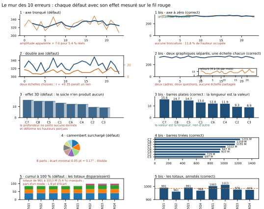

# Module M10.C05 — Les 10 erreurs qui tuent la crédibilité

**Outils : matplotlib 3.10.9, pandas 2.2.3, numpy 2.3.5 (exécutés dans ce chapitre) ; Excel
(exécuté, C07) ; Power BI (cité, non exécuté, C07).
Durée indicative : 4 h. Niveau : N3. Prérequis : M10.C01 (la hiérarchie perceptuelle), M10.C02 (le
catalogue), M10.C03 (couleurs et redondance) et M10.C04 (titres, axes, annotations).**

> **L'idée du chapitre.** Les quatre chapitres précédents ont appris à **choisir** et à **écrire** un
> graphique. Celui-ci apprend à **relire** : voici les dix défauts qui font perdre la crédibilité à
> une figure — chacun avec son **effet mesuré** sur le fil rouge, parce qu'un défaut non chiffré est
> une opinion. Un axe tronqué multiplie l'amplitude apparente par 7 pour une variation réelle de
> 5,4 % ; un double axe affiche une coïncidence de +0,35 entre deux séries sans lien ; un camembert à
> huit parts demande de distinguer 0,17° ; un cumul à 100 % masque des totaux qui varient de 5,4 % ;
> une échelle logarithmique non déclarée donne 93,5 % de la largeur à la masse des petits montants
> alors qu'ils n'en occupent que 42,1 % en linéaire. Et surtout : **la règle du module** — une erreur
> n'est pas un péché, c'est une **décision**. Elle devient légitime dès qu'elle est **déclarée**.

> **Matériel de l'atelier — Python 3.13 · matplotlib 3.10.9 · pandas 2.2.3 · numpy 2.3.5.** Tous les
> effets de ce chapitre sont mesurés par `tools/erreurs_M10.py` sur le socle M09 (les **50 008**
> ventes, 24 mois, 8 catégories, 5 modes de paiement) et sur le dossier de refonte du module ; la
> planche `figures/M10_C05_mur_des_10_erreurs.svg` montre chaque défaut **et** sa version corrigée
> (deux exécutions, même fichier).

---

## 1. Objectifs du chapitre

À la fin de ce chapitre, vous savez :

1. **Nommer les 10 erreurs** — axe tronqué, double axe, 3D, camembert surchargé, cumul de
   pourcentages, couleur à tout faire, surcharge, zéro manquant ou ajouté, ordre alphabétique, échelle
   logarithmique surprise — et donner **l'effet mesuré** de chacune sur le fil rouge.
2. **Distinguer l'erreur du choix** : un axe tronqué déclaré, une échelle logarithmique annoncée ou un
   camembert à deux parts ne sont pas des fautes ; c'est l'**écart entre ce que la figure laisse
   croire et ce que les données disent** qui fait le défaut.
3. **Chiffrer un défaut** avant d'en parler : hauteur occupée, facteur d'amplification, corrélation
   affichée, écart minimal entre deux parts, largeur de barre en linéaire contre logarithmique.
4. **Relire un graphique en 60 secondes** avec une check-list de six questions, dans l'ordre de la
   grille en 18 points — et non dans l'ordre de la beauté.
5. **Diagnostiquer les cinq défauts du rapport de la quincaillerie** avec leurs mesures, ce qui est la
   première étape notée du projet « La refonte ».

## 2. Pourquoi cette notion est importante

Un graphique faux se repère : il ne correspond pas aux données. Un graphique **trompeur** est bien plus
dangereux, parce qu'il est exact — et qu'il déclenche donc des décisions que personne ne remettra en
cause. Le dossier du module en donne l'exemple de bout en bout : cinq graphiques, **aucun chiffre
faux**, et une direction qui vote une réorganisation parce qu'une courbe plate a été présentée sur un
axe qui la rendait nerveuse.

Le chapitre est donc une liste de défauts, mais son message n'est pas moral : c'est une question de
**contrat**. Un graphique laisse toujours croire quelque chose de plus que ce qu'il montre — la
pente, la hiérarchie, la coïncidence, la masse. Le défaut apparaît quand cette croyance supplémentaire
est **fausse** et **non déclarée**. D'où la formulation que le module retient pour tout le reste du
manuel : *une erreur n'est pas un péché, c'est une décision ; elle est légitime si elle est déclarée.*

Cela change la façon de travailler. Un analyste qui tronque volontairement un axe pour montrer un pic
locale **n'a rien à se reprocher** : il écrit « axe de 320 à 350 M » dans le titre du zoom, et le
lecteur sait exactement ce qu'il voit. Le même analyste qui laisse l'axe tronqué en silence produit une
figure que six personnes citeront de travers. La différence entre les deux n'est pas de talent : c'est
une ligne de texte.

> **Dans les faits.** Les dix défauts ne sont pas rares : ils sont la **production par défaut** des
> outils. La 3D est un bouton, l'ordre alphabétique est un tri par défaut, l'échelle logarithmique
> s'active en un clic, le camembert accepte huit parts sans avertir. Retenir la liste, c'est donc
> savoir la reconnaître **avant** de publier — et connaître la ligne de texte qui transforme un défaut
> en décision.

## 3. Explication simple — la visite médicale du graphique

Un graphique publié devrait passer une visite médicale en six gestes, du plus grave au plus bénin :

1. **L'échelle** — la figure coupe-t-elle l'axe, ou le zéro manque-t-il ? Le doute est immédiat : une
   barre qui ne part pas de zéro, une courbe qui commence à mi-hauteur. C'est le geste qui vient en
   premier parce que c'est celui qui change le **verdict**.
2. **Le nombre d'axes** — y a-t-il deux échelles dans un même cadre ? Si oui, quelle relation la
   figure suggère-t-elle entre les deux séries ?
3. **La troisième dimension** — y a-t-il de la profondeur ? Si oui, pour quelle donnée ? En général,
   pour aucune : la profondeur ne porte pas de variable.
4. **Les parts** — combien de parts dans le camembert ? Combien de pourcentages empilés à 100 %, et
   quel total chacun masque-t-il ?
5. **Les couleurs** — chaque couleur signifie-t-elle une seule chose, et reste-t-elle lisible en noir
   et blanc ?
6. **L'ordre et la densité** — les catégories sont-elles triées ? Combien de séries, de nuances et de
   niveaux de données le cadre contient-il ?

Les six gestes tiennent en une minute, et la règle est simple : **ce que la visite suspecte, elle le
mesure**. Une intuition (« ça a l'air tronqué ») ne vaut rien en réunion ; la phrase qui vaut est
« l'axe occupé à 82 % de la hauteur pour une variation de 5,4 % ». C'est cette phrase qui arrête un
vote.

## 4. Vocabulaire essentiel

| Terme | Définition |
|---|---|
| **graphique trompeur** | une figure aux chiffres exacts qui laisse pourtant croire autre chose que ce que les données disent. Ce n'est pas un mensonge : c'est un défaut non déclaré. |
| **déclaration** | la mention, dans la figure, de la convention employée (axe tronqué, échelle logarithmique, données incomplètes). C'est la déclaration qui transforme une erreur en décision. |
| **double axe** | deux échelles verticales dans un même cadre. Utile à de rares cas (deux unités de même nature), toxique dès qu'il fait coïncider deux séries sans lien. |
| **effet 3D** | l'ajout d'une profondeur qui ne porte aucune donnée : elle déforme les hauteurs perçues et fausse la comparaison. |
| **cumul de pourcentages** | l'empilement de parts à 100 % : correct pour lire une composition, trompeur dès qu'il masque les **totaux**, qui peuvent varier fortement. |
| **zéro ajouté** | l'ajout d'une plage vide en bas d'un axe (0 → 350 M quand les données occupent 307 à 349) : elle écrase la variation réelle et fait paraître une différence significative comme négligeable. |
| **échelle logarithmique** | une échelle où les graduations suivent les puissances (10, 100, 1 000). Elle rend visibles les petites valeurs **et** écrase les grandes : à déclarer impérativement. |
| **surcharge** | l'accumulation de séries, de couleurs, de valeurs et de cadres dans une même figure : le graphique contient tout et ne communique rien. |
| **lecture en 60 secondes** | la relecture systématique d'un graphique avec les six questions du §5.7, faite **avant** publication, par son auteur puis par un pair. |

## 5. Cours approfondi

### 5.1 Les 10 erreurs, leur effet mesuré, et leur déclaration

Voici le tableau de référence du chapitre. La colonne « déclaration » dit la ligne de texte qui rend
l'usage légitime — c'est la colonne qu'on oublie, et c'est celle qui distingue un professionnel d'un
producteur de figures.

| # | L'erreur | L'effet, mesuré sur le fil rouge | Déclaration qui rend l'usage légitime |
|---|---|---|---|
| 1 | **Axe tronqué** | axe 300-350 M : 82,4 % de hauteur occupée pour 11,8 % en vue complète → amplitude apparente **× 7,0** pour une variation réelle de 5,4 % | « axe de 320 à 350 M (non nul) » dans le titre ; et **jamais** de troncature pour des barres |
| 2 | **Double axe** | corrélation **affichée** +0,35 entre CA et retours, deux séries sans lien métier (4 à 16 retours par mois) | « deux échelles : la coïncidence visuelle ne prouve aucun lien » — ou, mieux : deux graphiques séparés |
| 3 | **Effet 3D** | la profondeur ajoute un axe qui ne porte **aucune donnée** (le socle n'en produit aucun) | aucune : c'est le seul des dix défauts sans usage professionnel |
| 4 | **Camembert surchargé** | 8 parts ; écart minimal entre deux voisines **0,05 pt = 0,17°** ; lisible jusqu'à **3** parts | « camembert à 3 parts ; les 5 autres regroupées » |
| 5 | **Cumul de pourcentages** | 8 trimestres empilés à 100 % : les totaux varient de **5,4 %** (960 721 755 à 1 012 518 068) alors que la part d'un mode ne bouge que de **1,9 pt** | annoncer le total de chaque barre en étiquette |
| 6 | **Couleur à tout faire** | 3 couleurs pour 5 graphiques ; l'orange porte **3 rôles** en 7 emplois | « une couleur, un rôle » : la charte (C03) |
| 7 | **Surcharge** | le graphique des montants superpose 3 séries et 40 classes, soit **120 éléments** dans un cadre (limite du module : **5 séries**) | découper en petits multiples (une facette par série) |
| 8 | **Zéro manquant / ajouté** | ajouter 0 à un axe qui commence à 88,2 % de sa longueur dilue la figure : la plage vide occupe 0,3 % de l'axe… mais prive la lecture du **rapport** entre deux barres | « axe à zéro : les barres se comparent par leur longueur » |
| 9 | **Ordre alphabétique** | 8 catégories : **21 paires sur 28** (75 %) classées à l'envers par rapport aux valeurs | « trié par CA décroissant » dans la légende |
| 10 | **Échelle logarithmique surprise** | 77,0 % des ventes sont sous 250 000 FCFA : en linéaire, cette masse occupe **42,1 %** de la largeur ; en log, **93,5 %**. La queue (2,1 % des ventes) passe de **15,9 %** de largeur à **1,3 %** | « échelle logarithmique : les hauteurs ne s'additionnent pas » |

Trois lectures de ce tableau.

**Première lecture : les défauts 1, 2 et 9 changent une décision.** Ils ne dégradent pas l'esthétique,
ils modifient le verdict : la platitude devient une crise (× 7), deux séries indépendantes deviennent
liées (+0,35), le quatrième devient le premier (21 paires sur 28 à l'envers). Ce sont les trois défauts
éliminatoires du module.

**Deuxième lecture : les défauts 4, 5, 7 et 10 changent ce qu'on peut lire.** Ils ne mentent pas, ils
rendent illisible : une part de 0,17°, un total masqué à 5,4 %, 120 éléments dans un cadre, une queue
réduite de 15,9 % à 1,3 % de largeur. Ce sont des pertes d'information — mesurables, donc
corrigeables.

**Troisième lecture : les défauts 3 et 6 changent le message.** La 3D et la couleur à tout faire
n'ajoutent aucune information : elles en **suggèrent** une fausse (une profondeur, une catégorie). Ce
sont les deux défauts qu'aucune déclaration ne sauve : la seule correction est de les retirer.

### 5.2 L'axe tronqué et le zéro : la question du rapport

C'est le défaut le mieux documenté et le plus fréquent, parce qu'il vient d'une bonne intention :
rendre visible une petite variation. Deux situations se ressemblent et n'ont pas le même traitement.

**Le rapport des barres.** Une barre code une quantité par sa **longueur** : le rapport entre deux
barres est ce que l'œil lit. Une barre de 1 231 M et une de 697 M dans un rapport de 1,77 deviennent,
sur un axe tronqué à 690, un rapport apparent de plusieurs unités. La règle du module est donc
absolue : **les barres partent de zéro**. Si la variation à montrer est trop faible pour être visible
sur une échelle de zéro, alors ce n'est pas un graphique en barres qu'il faut — c'est une courbe, un
écart à la moyenne, ou un tableau.

**Le niveau des courbes.** Une courbe code une **position** : sa forme reste lisible sur un axe
tronqué, à condition que le lecteur connaisse les bornes. La déclaration (« axe de 320 à 350 M ») est
donc la bonne réponse — mais elle implique une seconde obligation : **le titre du zoom ne généralise
pas**. Un zoom sur quatre mois ne justifie pas un titre qui parle de la période entière.

**Le zéro ajouté**, symétriquement, est un défaut plus discret : ajouter une plage vide en bas d'un axe
peut « enterrer » une variation réelle. Sur le fil rouge, l'axe à zéro occupe 350 M pour des données
qui en occupent 307 à 349 : 11,8 % de hauteur. C'est **la vérité** de ce jeu (la série est plate) —
mais c'est un choix qui **doit s'accompagner du chiffre**, sinon le lecteur conclut « rien ne bouge »
alors que la moyenne glissante varie de 5,4 %.

> **À retenir.** Un défaut se **mesure** avant de se corriger : « ce graphique est trompeur » est un
> avis, « 82,4 % de hauteur occupée pour 5,4 % de variation réelle » est un constat. Le chiffre est ce
> qui transforme une discussion de goût en décision d'atelier.

> **Conseil professionnel.** Le test de l'axe, en trois secondes : « le rapport entre les deux
> éléments les plus extrêmes, le lecteur le voit-il ? » Si la réponse dépend de la longueur coupée
> — et non de la donnée — l'axe manque son contrat. Ce test vaut pour les barres ; pour une courbe,
> remplacez-le par : « les bornes de l'axe sont-elles écrites quelque part ? ».

### 5.3 Le double axe : la machine à fabriquer des liens

Le double axe mérite sa réputation : c'est le seul défaut qui **crée** une information. En choisissant
les deux fenêtres verticales, l'auteur décide si les deux courbes se superposent, se croisent ou
divergent. Sur le fil rouge, le chiffre d'affaires net (307,6 à 348,8 M) et le nombre de retours (4 à
16 par mois) affichent une corrélation de **+0,35** — un lien faible, sans mécanisme métier, et
pourtant spectaculaire dès que la seconde échelle est calée pour faire suivre les deux courbes.

Trois questions départagent l'usage légitime de l'abus :

1. **Les deux séries partagent-elles une unité ou une nature ?** Deux températures (air et sol), deux
   monnaies sur une même période, une valeur et sa cible : légitime. Un montant et un **comptage** :
   non.
2. **La relation est-elle le message ?** Si oui, on ne la montre pas par superposition mais par un
   **nuage de points** (la corrélation se lit sur les points, pas sur le calendrier) — C02.
3. **Le lecteur peut-il connaître les deux bornes ?** Si les deux axes n'ont pas la même longueur ni
   la même unité, la superposition est un artifice visuel.

Dans les rares cas où le double axe se justifie, la déclaration est obligatoire : les deux unités sur
les axes, la corrélation écrite **dans la figure**, et la mention « la coïncidence visuelle ne prouve
aucun lien ». La règle du module reste : **quand deux séries doivent être comparées, elles méritent
deux cadres** — c'est d'ailleurs ce que fait le dossier refondu (panneau « 2 bis »).

> **À retenir.** Aucun des dix défauts ne se voit à l'œil nu : le double axe cache une corrélation
> affichée de +0,35, le cumul à 100 % cache une variation de 5,4 %, le log déplace 51,4 points de
> largeur (42,1 % → 93,5 %). La visite des six gestes sert exactement à cela : **chiffrer** ce que
> l'œil soupçonne.

### 5.4 Camembert, cumul, treemap : les défauts de la composition

Les graphiques de composition concentrent quatre défauts sur dix. C'est logique : ils sont les plus
séduisants et les moins précis (angle et surface, C01).

- **Le camembert surchargé** : la question à se poser n'est pas « combien de parts puis-je dessiner »
  mais « **combien de parts le lecteur peut-il comparer** ». Réponse mesurée : jusqu'à **3**. Au-delà,
  la donnée existe, l'information n'arrive pas (0,05 pt = 0,17° pour nos deux catégories les plus
  proches). La correction n'est pas de « regrouper les petites parts » au hasard, mais de revenir à la
  question : s'il s'agit d'un classement, des barres triées ; s'il s'agit d'un tout, trois familles.
- **Le cumul de pourcentages** : une barre empilée à 100 % normalise chaque période, donc **efface les
  totaux**. Sur nos huit trimestres, la part du mode 4 ne bouge que de **1,9 point** — le lecteur
  conclut « rien ne change » — alors que les totaux trimestriels varient de **5,4 %**, soit un rapport
  de 2,88 entre les deux amplitudes. La déclaration est simple et suffisante : **écrire le total de
  chaque barre** en étiquette, ou à défaut dans une ligne de tableau sous la figure.
- **Le treemap** : il hérite des défauts du camembert (surface) sans en avoir la familiarité. À
  réserver à la question « où est la masse ? » sur un grand nombre d'entrées (C02).
- **L'entonnoir** : à surveiller quand les étapes ne se suivent pas dans le temps (un entonnoir de
  conversion n'est pas une suite de totaux) — le graphique suggère alors une chronologie inexistante.

> **Attention.** Regrouper les petites parts d'un camembert en « autres » est une correction
> fréquente... et souvent fausse : une catégorie « autres » de 25 % regroupe des entités qui n'ont
> rien en commun, et le lecteur ne peut plus rien vérifier. La bonne correction est de changer de
> **question** (montrer l'étendue, pas le classement) : c'est le principe posé en C01 et repris par le
> projet.

### 5.5 Surcharge, couleur et ordre : les défauts d'écriture

Ces trois défauts ne touchent pas la structure du graphique : ils touchent sa **densité de lecture**.

**La surcharge** se mesure : nombre de séries, nombre de niveaux, nombre de couleurs, nombre
d'éléments. Notre graphique des montants superpose trois séries (montant TTC, remise, prix unitaire)
sur 40 classes, soit 120 éléments dans un cadre — cinq fois la limite du module (5 séries). Le remède
n'est pas de réduire les données (elles sont légitimes) mais de **découper** : trois petits multiples,
un par série, échelle commune. La règle : *une idée par cadre*.

**La couleur à tout faire** a été mesurée en C03 : trois couleurs pour cinq graphiques, et l'orange
portant trois rôles. Coût : le lecteur ne peut pas construire de contrat de lecture, donc il se trompe
au cadre suivant. Ce défaut est **invisible** en réunion (personne ne dit « je ne sais plus ce que
signifie l'orange ») et coûteux.

**L'ordre alphabétique** est le défaut le plus facile à corriger et le plus fréquent : mesure 21 paires
sur 28 classées à l'envers sur huit catégories (C04). Un tri est toujours possible — par valeur, par
temps ou par métier.

> **Attention.** Un défaut corrigé peut en créer un autre : passer d'un camembert surchargé à des
> barres triées change la question (du tout vers le classement), et passer d'un cumul à 100 % à des
> totaux empilés en valeur absolue rend les comparaisons de structure difficiles. La correction se
> choisit donc **avec** la question du commanditaire (C01), pas seulement contre le défaut.

### 5.6 L'échelle logarithmique : la plus utile et la plus dangereuse

L'échelle logarithmique n'est pas une erreur : c'est **le** remède aux distributions étalées comme la
nôtre, où la médiane vaut **119 482** FCFA, le maximum **594 363** (un rapport de **5** pour 1), et où
77,0 % des ventes se situent sous 250 000 FCFA. En linéaire, cette masse occupe **42,1 %** de la
largeur de l'axe et la queue (2,1 % des ventes) **15,9 %** ; en logarithmique, la masse occupe
**93,5 %** et la queue **1,3 %**. Autrement dit : l'échelle change complètement ce qu'on voit — c'est
un outil, pas un réglage.

Ce qui en fait un défaut, c'est le **silence**. Trois conséquences à connaître :

1. **Les hauteurs ne s'additionnent plus.** Sur une échelle log, chaque décade occupe la même
   hauteur : un écart de 500 000 FCFA près du million paraît aussi grand qu'un écart de 50 000 FCFA
   près de la centaine de milliers — un graphique en aires empilées en log n'a donc aucun sens.
2. **Les petites valeurs paraissent énormes.** Un pic à 5 ventes (sur une journée creuse) occupe
   visuellement la moitié du cadre : le lecteur voit un événement là où il n'y a que du bruit.
3. **Le zéro n'existe pas.** Un histogramme en log doit tronquer les valeurs nulles — et le dire.

D'où la règle du module : **une échelle logarithmique s'annonce dans le titre ou dans l'étiquette de
l'axe**, avec la phrase qui protège le lecteur : « échelle logarithmique : les hauteurs ne
s'additionnent pas ». C'est exactement ce que fait le graphique refondu du dossier — dont le titre
commence par « Échelle linéaire annoncée : 77 % des ventes sous 250 000 FCFA (zoom séparé sur la
queue) ».

> **Définition.** L'**échelle logarithmique** place les graduations sur les puissances d'un facteur
> (× 10 en général) : chaque décade occupe la même hauteur. Elle sert à montrer simultanément une
> masse de petites valeurs et une queue de grandes valeurs ; elle interdit en revanche d'additionner
> les hauteurs et rend le zéro impossible. Toute figure en log doit le dire.

### 5.7 Relire un graphique en 60 secondes

La check-list du module, à passer dans cet ordre — du plus grave au plus cosmétique :

1. **La question** : quelle question cette figure sert-elle seule ? (Si aucune : arrêt immédiat.)
2. **L'échelle** : zéro présent, ou troncature déclarée ? Les barres partent-elles de zéro ?
3. **Les liens** : y a-t-il un double axe, une échelle log, un cumul à 100 % ? Chacun est-il déclaré ?
4. **Le chiffre clé** : est-il annoté, et est-ce le bon ?
5. **La densité** : combien de séries, de couleurs, de niveaux ? Une idée par cadre ?
6. **L'ordre et la source** : catégories triées (critère écrit) ? Source, période, unité, date ?

Le test de la relecture n'est pas « est-ce joli », mais : **« qu'est-ce que quelqu'un pourrait dire de
faux devant cette figure ? »** Si vous trouvez la phrase fausse possible, corrigez la figure ou
écrivez la déclaration — dans cet ordre d'effort. Et pour les cinq défauts du dossier (l'axe tronqué,
le double axe causal, le camembert à huit parts, le cumul à 100 %, l'échelle log non déclarée), la
relecture est notée : c'est la première étape du projet « La refonte ».

> **Définition.** La **relecture en 60 secondes** est un rituel, pas un talent : six questions, un
> minuteur, et la règle que tout défaut trouvé s'écrit soit dans la figure (déclaration), soit dans la
> liste des corrections (refonte). Un graphique qui n'a pas passé la relecture n'est pas prêt à être
> publié — même s'il est beau.

## 6. Exemple concret — le mur des 10 erreurs, mesuré sur le fil rouge

La planche du chapitre montre, pour les défauts qui le permettent, la version fautive **et** la
version corrigée du même graphique : c'est la meilleure façon de comprendre que le défaut ne change
jamais la donnée, seulement la lecture.



Ce que la planche démontre, panneau par panneau :

- **1 et 1 bis — l'axe.** À gauche, l'axe de 300 à 350 M : la série plate devient nerveuse (82,4 % de
  hauteur occupée, amplitude apparente × 7,0). À droite, le même mois dans le même ordre sur un axe à
  zéro : la platitude est **visible**, et la déclaration « aucune troncature : 11,8 % de hauteur
  occupée » dit pourquoi.
- **2 et 2 bis — le double axe.** À gauche, deux échelles côte à côte : les deux courbes semblent
  solidaires (r = +0,35). À droite, deux cadres, une échelle chacun : le lecteur voit que les retours
  oscillent entre 4 et 16 par mois pendant que le CA reste dans une bande étroite — ce que le double
  axe lui cachait.
- **3 et 3 bis — la 3D.** À gauche, la profondeur déforme des hauteurs qui sont justement l'objet de
  la comparaison ; à droite, les barres plates portent leurs valeurs. Le socle ne produit **aucun**
  graphique en 3D : c'est une règle, pas une mesure.
- **4 et 4 bis — le camembert.** À gauche, huit parts où deux voisines sont séparées de 0,17° ; à
  droite, les barres triées avec les valeurs en millions sur chaque barre.
- **5 et 5 bis — le cumul.** À gauche, huit trimestres empilés à 100 % (la part d'un mode bouge de
  1,9 point) ; à droite, les totaux trimestriels annotés, de 961 M à 1 013 M : la variation de 5,4 %
  que le cumul masquait.

> **Définition.** Le **diagnostic mesuré** est la première étape notée du projet « La refonte » : il
> nomme les défauts d'un rapport, **mesure** leur effet sur les données, et écrit la décision fausse
> que chacun peut déclencher. Un diagnostic sans mesure est une opinion — et une opinion ne se
> corrige pas.

> **Définition.** On appelle **faux citable** la phrase fausse qu'un lecteur pourrait prononcer devant
> une figure exacte (« la volatilité explose », « les retours suivent le CA »). C'est l'objet de la
> relecture : rendre cette phrase impossible.

## 7. Démonstration pas à pas — mesurer un défaut en 5 gestes

**Geste 1 — l'axe.** On mesure la hauteur occupée et le facteur d'amplification.

```python
import pandas as pd, numpy as np
v = pd.read_csv("03_exercices/dossier_M09/quincaillerie/vente.csv", parse_dates=["date_vente"])
ca = v[~v["est_retour"]].groupby(v["date_vente"].dt.to_period("M"))["montant_ttc"].sum() / 1e6
print(f"donnees {ca.min():.1f} -> {ca.max():.1f} M")
print(f"hauteur occupee : {100*(ca.max()-ca.min())/350:.1f} % (axe a zero) "
      f"contre {100*(ca.max()-ca.min())/50:.1f} % (axe 300-350) "
      f"-> x {350/50:.1f}")
mg3 = ca.rolling(3).mean()
print(f"variation reelle de la moyenne glissante : {(mg3.max()-mg3.min())/mg3.min()*100:.1f} %")
```

```text
donnees 307.6 -> 348.8 M
hauteur occupee : 11.8 % (axe a zero) contre 82.4 % (axe 300-350) -> x 7.0
variation reelle de la moyenne glissante : 5.4 %
```

**Geste 2 — le double axe.** On vérifie si les deux séries sont réellement liées.

```python
ret = v.groupby(v["date_vente"])["est_retour"].sum()
ret = ret.groupby(ret.index.to_period("M")).sum().reindex(ca.index).fillna(0)
print("correlation CA / retours :", round(float(ca.corr(ret)), 2),
      "| retours de", int(ret.min()), "a", int(ret.max()), "par mois")
```

```text
correlation CA / retours : 0.35 | retours de 4 a 16 par mois
```

**Geste 3 — le camembert.** On mesure l'écart minimal entre deux parts voisines.

```python
p = pd.read_csv("03_exercices/dossier_M09/quincaillerie/produit.csv")
vp = v[~v["est_retour"]].merge(p[["id_produit", "id_categorie"]], on="id_produit", how="left")
part = (vp.groupby("id_categorie")["montant_ttc"].sum() / vp["montant_ttc"].sum() * 100).sort_values()
e = np.diff(part.to_numpy())
print(f"{len(part)} parts ; ecart minimal {e.min():.2f} pt = {e.min()*3.6:.2f} deg")
```

```text
8 parts ; ecart minimal 0.05 pt = 0.17 deg
```

**Geste 4 — le cumul de pourcentages.** On compare les totaux que le cumul masque et la variation des
parts qu'il affiche.

```python
net = v[~v["est_retour"]]
trim = net.groupby(net["date_vente"].dt.to_period("Q"))["montant_ttc"].sum()
modes = (net.assign(trim=net["date_vente"].dt.to_period("Q"))
         .pivot_table(index="trim", columns="id_mode", values="montant_ttc", aggfunc="sum"))
parts = modes.div(modes.sum(axis=1), axis=0) * 100
amp_part = float((parts.max(axis=0) - parts.min(axis=0)).max())
print(f"totaux de {trim.min():,} a {trim.max():,} -> {100*(trim.max()-trim.min())/trim.min():.1f} %"
      .replace(",", " "))
print(f"amplitude d'un mode : {amp_part:.1f} pt (mode {int((parts.max(axis=0)-parts.min(axis=0)).idxmax())})")
```

```text
totaux de 960 721 755 a 1 012 518 068 -> 5.4 %
amplitude d'un mode : 1.9 pt (mode 4)
```

**Geste 5 — l'échelle logarithmique.** On mesure ce que le log change aux largeurs occupées.

```python
m = v["montant_ttc"]
masse, queue = 250000.0, 500000.0
print(f"{100*(m < masse).mean():.1f} % des ventes sous 250 000 FCFA : largeur "
      f"{masse/m.max()*100:.1f} % en lineaire contre "
      f"{np.log10(masse)/np.log10(m.max())*100:.1f} % en log")
print(f"queue (>{int(queue)} FCFA, {100*(m > queue).mean():.1f} % des ventes) : "
      f"{100*(m.max()-queue)/m.max():.1f} % en lineaire contre "
      f"{100*(np.log10(m.max())-np.log10(queue))/np.log10(m.max()):.1f} % en log")
```

```text
77.0 % des ventes sous 250 000 FCFA : largeur 42.1 % en lineaire contre 93.5 % en log
queue (>500000 FCFA, 2.1 % des ventes) : 15.9 % en lineaire contre 1.3 % en log
```

**Ce que la démonstration établit.** Cinq défauts, cinq mesures, aucune appréciation. C'est la
discipline que ce chapitre installe : **avant de dire « ce graphique est trompeur », dire de combien.**
Un défaut chiffré se corrige ; un défaut ressenti se discute pendant une heure.

## 8. Erreurs fréquentes

1. **Confondre l'erreur et le choix.** Un axe tronqué déclaré, une échelle log annoncée, un camembert
   à deux parts : trois choix légitimes. Le défaut, c'est l'écart non déclaré entre ce que la figure
   laisse croire et ce qu'elle montre.
2. **Croire qu'un défaut se voit.** Le double axe ne se voit pas : il se **mesure** (corrélation
   affichée). Le cumul à 100 % ne se voit pas : il masque une variation de 5,4 % que personne ne
   soupçonne.
3. **Corriger en changeant la donnée.** Regrouper des catégories pour sauver un camembert, lisser une
   série pour sauver une courbe : le module refuse ces corrections. On change la **question** ou la
   **figure**, jamais la donnée.
4. **Le zéro systématique.** Tout axe ne doit pas partir de zéro : une courbe de prix ou de
   température se lit très bien tronquée, si c'est écrit. Le dogme inverse produit des figures
   illisibles.
5. **Le log par défaut.** Sur une distribution étalée, le log aide — mais un histogramme en log où
   l'on additionne mentalement les hauteurs produit un contresens total.
6. **La 3D décorative.** Aucun usage professionnel : elle déforme les comparaisons qui sont
   justement l'objet du graphique.
7. **Relire en cherchant le beau.** La relecture cherche le **faux citable** : « qu'est-ce que
   quelqu'un pourrait dire de faux devant cette figure ? ». La beauté n'a jamais fait échouer un
   comité ; une phrase fausse, si.

## 9. Bonnes pratiques professionnelles

1. **Faire la visite des six gestes avant publication** (§3), et **chiffrer** ce qui est suspect.
2. **Écrire la déclaration dès qu'on s'écarte d'une convention** : axe non nul, échelle log, données
   incomplètes, périmètre restreint. Une ligne dans la figure, pas une note de bas de page.
3. **Ne jamais tronquer un axe de barres**, et ne jamais généraliser un titre de zoom.
4. **Deux séries à comparer = deux cadres**, pas deux échelles. Le double axe reste réservé aux
   unités de même nature.
5. **Écrire le total quand on normalise** : toute barre empilée à 100 % porte son total en étiquette.
6. **Une idée par cadre**, cinq séries au maximum ; au-delà, des petits multiples à échelle commune.
7. **Relire en binôme** : l'auteur connaît sa figure trop bien pour voir ce qu'elle laisse croire. La
   relecture par un pair est un point de la grille (famille 4), pas une politesse.

## 10. Exercice guidé — « l'audit des cinq défauts » (15 min, /10)

**Contexte.** Vous recevez le rapport commercial de la quincaillerie : cinq graphiques, des chiffres
justes, et une direction qui a déjà tiré des conclusions. C'est la première étape notée du projet
« La refonte ».

**Consigne.** Dans les 15 minutes, pour les trois défauts les plus critiques du dossier :

1. Nommez le défaut de chaque graphique concerné, avec le **numéro** de la liste du §5.1. (2 pts)
2. Donnez **l'effet mesuré** de chacun (les chiffres du chapitre : × 7,0 ; +0,35 ; 0,17° ; 5,4 % ;
   93,5 % contre 42,1 %). (3 pts)
3. Pour chacun, écrivez la **décision fausse** qu'il peut déclencher, en une phrase. (2 pts)
4. Écrivez la **déclaration** qui rendrait l'usage légitime — ou expliquez pourquoi aucune
   déclaration ne suffit. (2 pts)
5. Classez les trois défauts du plus grave au moins grave, avec votre critère (par exemple : change une
   décision / rend illisible / suggère une fausse information). (1 pt)

## 11. Exercices autonomes

**E1 — le musée des horreurs personnelles (30 min).** Rassemblez trois graphiques que vous avez produits
(ou reçus) et qui vous ont laissé un doute. Pour chacun, appliquez la visite des six gestes et
**mesurez** ce que vous suspectez : hauteur occupée, corrélation affichée, écart minimal entre parts,
totaux masqués par un cumul, largeurs en linéaire contre log. Rendez un tableau : graphique, défaut,
mesure, déclaration possible, correction. Un défaut non chiffré sera refusé.

**E2 — la déclaration rédigée (25 min).** Prenez un graphique que vous **voulez** garder tronqué ou
logarithmique (c'est légitime). Écrivez la déclaration complète : titre du zoom ou de la vue, étiquette
d'axe, phrase de protection du lecteur (« les hauteurs ne s'additionnent pas »), et la limite de
validité (« ce zoom ne dit rien de la période entière »). Puis faites relire : la personne doit pouvoir
dire, sans vous, ce que la figure montre **et** ce qu'elle ne montre pas.

## 12. Correction détaillée

**Exercice guidé.**

1. **Les défauts** : axe tronqué (n° 1) sur l'« Évolution du chiffre d'affaires » ; double axe (n° 2)
   sur « Les retours suivent le chiffre d'affaires » ; camembert surchargé (n° 4) sur la répartition
   par catégorie — et, dans les deux graphiques restants, cumul de pourcentages (n° 5) et échelle
   logarithmique surprise (n° 10).
2. **Effets mesurés** : axe — 82,4 % de hauteur occupée contre 11,8 %, amplitude apparente **× 7,0**
   pour une variation réelle de 5,4 % ; double axe — corrélation affichée **+0,35** entre des séries
   qui n'ont pas de lien métier (4 à 16 retours par mois) ; camembert — huit parts et **0,17°** entre
   les deux plus proches ; cumul — totaux variant de **5,4 %** (960 721 755 à 1 012 518 068) masqués
   par des parts qui ne bougent que de 1,9 point ; log — la masse (77,0 % des ventes) passe de **42,1 %
   à 93,5 %** de largeur, la queue de 15,9 % à 1,3 %.
3. **Décisions fausses** (une par défaut) : « la volatilité augmente, réorganisons » ; « les retours
   suivent le CA, agissons sur le CA pour réduire les retours » ; « voici notre classement de
   catégories » sur des parts indiscernables ; « la structure des paiements ne bouge pas » ; « les
   montants sont homogènes » (le log gomme la queue, où se trouvent les 1 044 ventes de plus de
   500 000 FCFA).
4. **Déclarations** : axe — « axe de 320 à 350 M (non nul) », en gardant un titre local ; double axe —
   aucune : deux cadres ; camembert — « trois parts ; les cinq autres regroupées », aucune si la
   question est un classement (changer de figure) ; cumul — « total de chaque barre en étiquette » ;
   log — « échelle logarithmique : les hauteurs ne s'additionnent pas ».
5. **Classement attendu** (critère : ce que le défaut change) : 1) double axe (il **crée** un lien
   inexistant et dicte une action) ; 2) axe tronqué (il change le verdict de volatilité) ; 3) camembert
   surchargé et cumul (ils rendent illisibles) ; 5) log non déclarée (elle change la lecture d'une
   distribution). Tout classement argumenté est accepté.

**E1 (le musée des horreurs personnelles).** Grille de correction : trois graphiques analysés, chaque
défaut **chiffré** (une mesure, pas un adjectif), une déclaration **rédigée** par défaut (et non
« il faudrait déclarer »), et une correction qui ne change pas les données. Le repère du dossier du
module : 5 graphiques, 5 défauts, 0 chiffre faux — c'est cet écart entre justesse et honnêteté que
l'exercice fait toucher.

**E2 (la déclaration rédigée).** Trois attendus : la déclaration est **dans la figure** (titre,
étiquette ou note) ; la phrase de protection est écrite en clair (« les hauteurs ne s'additionnent
pas » pour un log) ; la limite de validité est explicite (le zoom ne parle que de sa fenêtre). Un
correcteur doit pouvoir dire, sans l'auteur, ce que la figure montre et ce qu'elle ne montre pas.

## 13. Mini-projet M10.P5 — « le diagnostic mesuré des cinq défauts » (1 h 30)

**Énoncé.** C'est la première étape notée du projet « La refonte ». Vous produisez le **dossier de
diagnostic** du rapport de la quincaillerie : cinq graphiques, cinq défauts nommés, cinq effets
mesurés, cinq décisions fausses possibles, cinq déclarations ou corrections.

1. **Nommez** chaque défaut en utilisant la liste du §5.1 (numéro et nom), et justifiez le diagnostic
   par la lecture du code du rapport (`rapport_avant/code_avant.py`), pas par votre seule impression :
   citez la ligne qui décide l'axe, l'échelle ou l'ordre.
2. **Mesurez** chaque effet avec les gestes du §7, et comparez vos valeurs à celles du socle
   (`ATTENDU.json`, clés `d1_*` à `d5_*`). Toute différence de mesure est un point à expliquer
   (périmètre, arrondi, définition).
3. **Rédigez** les cinq décisions fausses possibles, en une phrase chacune, comme si vous écriviez au
   comité qui les a prises.
4. **Écrivez** la déclaration ou la correction pour chacune (une ligne par graphique).
5. **Classez** les cinq défauts avec un critère explicite, et concluez en une phrase sur le
   **contrôle** : quel test automatique aurait attrapé chaque défaut ? (exemple : « un contrôle qui
   compare la fenêtre de l'axe à l'étendue des données »).

**Barème indicatif** : cinq diagnostics nommés et justifiés par le code (6 points), cinq effets
mesurés conformes au socle (5 points), cinq décisions fausses rédigées (3 points), cinq déclarations
ou corrections (2 points), classement et conclusion sur les contrôles (2 points), sur 18.

> **Pourquoi ce mini-projet.** Le diagnostic est le livrable qui ouvre le projet « La refonte » : sans
> lui, la refonte se discute (« je préfère ce graphique ») ; avec lui, elle se vérifie (les cinq
> défauts sont mesurés, donc les cinq corrections le sont aussi).

## 14. Boîte à outils du chapitre

> **Boîte à outils.** Ce chapitre utilise **6 gestes de vérification**, tous exécutés dans la planche
> du §6 : `set_ylim` (poser la fenêtre et la comparer à l'étendue), `twinx` (reproduire le double axe
> pour le mesurer), `pile`/`bar(bottom=)` (reproduire un cumul pour vérifier les totaux),
> `set_yscale("log")` (comparer les largeurs occupées en linéaire et en log), `diff` sur des parts
> (écart minimal) et `corr` (corrélation affichée).

| Besoin | Commande | Ce qu'elle donne | Ce qu'elle ne donne pas |
|---|---|---|---|
| mesurer une troncature | étendue des données ÷ fenêtre de l'axe | la part de hauteur occupée | l'intention de l'auteur : la déclaration est à écrire |
| mesurer un double axe | `serie1.corr(serie2)` | la corrélation affichée | la causalité : elle n'existe pas dans le graphique |
| mesurer un camembert | `np.diff(parts.triées)` puis × 3,6 | l'écart minimal en degrés | ce que le lecteur peut comparer (à confronter à C01) |
| mesurer un cumul | totaux par période + amplitudes des parts | ce que la normalisation masque | la correction : elle consiste à écrire le total |
| mesurer une échelle log | largeurs occupées en linéaire et en log | ce que le log donne et retire | la légitimité du choix : elle dépend de la question |
| relire vite | les 6 questions du §5.7 | un verdict en une minute | la correction : elle se décide après |

## 15. Résumé du chapitre

C05 a transformé la peur des « mauvais graphiques » en **protocole de relecture**. Les dix défauts,
avec leurs effets mesurés sur le fil rouge : axe tronqué (82,4 % de hauteur occupée contre 11,8 %,
amplitude apparente **× 7,0** pour 5,4 % réels), double axe (corrélation affichée **+0,35** entre
séries sans lien, 4 à 16 retours par mois), 3D (aucun usage professionnel : la profondeur ne porte
aucune donnée), camembert surchargé (**0,17°** entre deux part voisines, lisible jusqu'à **3** parts),
cumul de pourcentages (totaux variant de **5,4 %** masqués par des parts qui bougent de 1,9 point),
couleur à tout faire (l'orange, **3 rôles** en 7 emplois), surcharge (**120** éléments dans un cadre,
limite de 5 séries), zéro manquant ou ajouté (11,8 % de hauteur occupée : la vérité de ce jeu, à
accompagner du chiffre), ordre alphabétique (**21 paires sur 28** à l'envers) et échelle logarithmique
surprise (la masse passe de **42,1 %** à **93,5 %** de largeur, la queue de 15,9 % à 1,3 %). Et la
règle qui donne son sens à la liste : **une erreur n'est pas un péché, c'est une décision — elle est
légitime si elle est déclarée**.

## 16. À retenir

> **À retenir.** Un graphique trompeur n'a pas de chiffre faux : il a une **convention cachée**. Le
> travail de relecture consiste donc à rendre chaque convention visible — et, quand elle ne peut pas
> l'être (3D, couleur à tout faire), à retirer le défaut. Six questions, une minute, et une phrase
> écrite dans la figure : c'est tout ce que ce chapitre demande.

1. **Les trois défauts qui changent une décision** : axe tronqué (× 7,0), double axe (+0,35), ordre
   alphabétique (21 paires sur 28 à l'envers).
2. **Les quatre qui rendent illisible** : camembert surchargé (0,17°), cumul à 100 % (5,4 % masqués),
   surcharge (120 éléments pour une limite de 5 séries), log surprise (93,5 % contre 42,1 %).
3. **Les deux qu'aucune déclaration ne sauve** : l'effet 3D et la couleur à tout faire (3 rôles pour
   une couleur).
4. **Les barres partent de zéro** ; une courbe peut être tronquée si le titre du zoom reste **local**.
5. **Deux séries à comparer = deux cadres** : le double axe ne se justifie que pour des unités de même
   nature, et jamais pour suggérer un lien.
6. **Toute normalisation déclare son total** : une barre empilée à 100 % sans étiquette de total cache
   l'information la plus utile.
7. **L'échelle logarithmique s'annonce** : « les hauteurs ne s'additionnent pas » — et le zéro
   n'existe plus.
8. **Relire, c'est chercher le faux citable** : « qu'est-ce que quelqu'un pourrait dire de faux devant
   cette figure ? ».

## 17. Évaluation formative (auto-correction, 8 min)

1. **Pourquoi un axe tronqué est-il parfois légitime, et jamais pour des barres ?**
   → Parce qu'une courbe code une **position** (sa forme reste lisible si les bornes sont déclarées),
   alors qu'une barre code une **longueur** : tronquer l'axe rogne la barre et fausse le rapport entre
   deux valeurs (légitime : zoom annoncé, titre local ; jamais : barres). (2 pts)
2. **Le rapport titre « les retours suivent le chiffre d'affaires ». Quelle mesure le contredit ?**
   → La corrélation **affichée** de **+0,35** sur 24 mois, pour deux séries sans mécanisme métier
   (4 à 16 retours par mois) : c'est un double axe qui fabrique la coïncidence. (2 pts)
3. **Une barre empilée à 100 % masque quoi, exactement ? Combien, sur le fil rouge ?**
   → Elle masque les **totaux** : les huit trimestres vont de 960 721 755 à 1 012 518 068 FCFA, soit
   **5,4 %** de variation — pendant que la part du mode de paiement le plus variable ne bouge que de
   **1,9 point** (rapport 2,88 entre les deux amplitudes). (2 pts)
4. **Que change l'échelle logarithmique sur l'histogramme des montants, en largeurs occupées ?**
   → La masse des petits montants (77,0 % des ventes sous 250 000 FCFA) passe de **42,1 %** à **93,5 %**
   de la largeur, et la queue (2,1 % des ventes) de 15,9 % à **1,3 %** : le log rend visible la masse,
   invisible la queue — et il interdit d'additionner les hauteurs. (2 pts)
5. **Citez deux défauts qu'aucune déclaration ne rend acceptables, et pourquoi.**
   → L'effet 3D (la profondeur ne porte aucune donnée et déforme les hauteurs) et la couleur à tout
   faire (une couleur à trois rôles n'a pas de signification stable). Les deux suggèrent une
   information qui n'existe pas : aucune phrase ne répare une suggestion. (2 pts)
6. **Écrivez les six questions de la relecture en 60 secondes, dans l'ordre.**
   → Question servie ; échelle (zéro ou troncature déclarée) ; liens (double axe, log, cumul à 100 % —
   tous déclarés ?) ; chiffre clé annoté ; densité (séries, couleurs, une idée par cadre) ; ordre et
   source. (2 pts)
