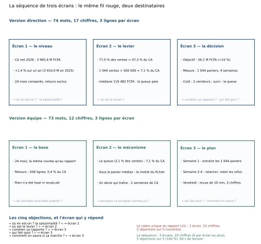

# Module M10.C06 — Storytelling : raconter pour décider

**Outils : matplotlib 3.10.9, pandas 2.2.3, numpy 2.3.5 (exécutés dans ce chapitre) ; Excel
(exécuté, C07) ; Power BI (cité, non exécuté, C07).
Durée indicative : 4 h. Niveau : N3. Prérequis : M10.C01 à C05 — en particulier C02 (le catalogue),
C04 (l'écriture) et C05 (les défauts et leur mesure).**

> **L'idée du chapitre.** Un graphique juste ne déclenche aucune décision. Une **séquence** de
> graphiques, oui. Ce chapitre assemble ce que les cinq premiers ont construit : un écran qui pose le
> **niveau**, un écran qui révèle le **mécanisme**, un écran qui demande une **décision** — trois
> écrans, vingt secondes chacun, une minute de présentation. Les mêmes chiffres servent deux
> destinataires : la **direction** veut le niveau, l'écart et le coût de l'inaction ; l'**équipe**
> veut la base, le mécanisme et le plan. La séquence couvre les **cinq objections** que le rapport
> unique du dossier laissait sans réponse (2 sur 5 seulement), et elle le prouve par une mesure : sur
> le fil rouge, un seul cadre de 12 chiffres répond à deux objections ; la séquence de 3 écrans en
> couvre cinq, avec 29 chiffres répartis et **6 au maximum par écran**.

> **Matériel de l'atelier — Python 3.13 · matplotlib 3.10.9 · pandas 2.2.3 · numpy 2.3.5.** La
> planche `figures/M10_C06_sequence_trois_ecrans.svg` (maquette des six écrans) est produite par
> `tools/sequence_M10.py`, deux exécutions, même fichier. Les chiffres viennent du socle M09 : CA net
> **3 965,4 M** FCFA en 2026 contre **3 910,9 M** en 2025 (**+1,4 %**), **24** mois, **208** retours,
> **1 044** ventes de plus de 500 000 FCFA.

---

## 1. Objectifs du chapitre

À la fin de ce chapitre, vous savez :

1. **Structurer une séquence en trois écrans** — le niveau, le mécanisme, la décision — et savoir ce
   qui va dans chacun, ce qui n'y va pas.
2. **Répondre aux objections par avance** : lister les cinq questions qu'un lecteur se pose, et
   montrer l'écran qui y répond — un rapport qui n'en couvre que 2 sur 5 est un rapport inachevé.
3. **Produire deux versions du même fil rouge** : la version **direction** (niveau, écart, coût,
   décision demandée) et la version **équipe** (base, mécanisme, plan, suivi), à partir du **même**
   socle de chiffres.
4. **Calibrer la densité** : combien de chiffres, de lignes et d'écrans par minute de présentation,
   et pourquoi le plafond du module est de **6 chiffres par écran**.
5. **Livrer la séquence du projet « La refonte »** : trois écrans, deux versions, avec le chiffre clé
   annoté de chaque écran et la décision demandée écrite en clair.

## 2. Pourquoi cette notion est importante

Le manuel insiste depuis le premier chapitre : un graphique sert une **question**. Mais une question
seule ne suffit pas à faire décider. Ce qui manque à la plupart des rapports n'est pas la donnée, ni
la figure, ni même la correction : c'est **la séquence** — l'ordre dans lequel le lecteur reçoit les
trois informations qui le conduisent à dire oui.

Le dossier du module en est la démonstration inversée. Son rapport contient cinq graphiques, tous
exacts. Il répond au « où en est-on ? » (le CA progresse de +1,4 %) et il donne un levier (le panier).
Mais il ne répond ni au « est-ce la saisonnalité ? », ni au « combien ça rapporte ? », ni au « qui fait
quoi ? », ni au « comment saura-t-on si ça marche ? ». Résultat : deux objections seulement sur cinq
sont couvertes, et la direction, à qui il manque le coût et le suivi, reporte sa décision — qu'elle
aurait pu prendre si la séquence avait existé.

Il y a une raison économique à cela. Une réunion de direction dure une heure et contient six sujets :
le budget d'attention par sujet est de dix minutes, souvent moins. Une séquence de trois écrans à
20 secondes se présente en **60 secondes** et laisse le reste du temps aux questions — c'est-à-dire à
ce que la direction fait de mieux. Un rapport dense, à l'inverse, occupe les dix minutes en lecture
et ne laisse aucun temps à la décision.

Enfin, la séquence a un effet de **contrat**. Chaque écran porte un titre qui affirme, un chiffre
annoté, et une ligne qui dit ce qu'il répond. Quand la direction valide la séquence, elle valide
l'enchaînement — pas une courbe. C'est la différence entre « je n'aime pas ce graphique » (qui bloque
tout) et « l'écran 2 exagère le levier, montrez-moi la queue de plus près » (qui fait avancer).

> **Dans les faits.** La demande la plus fréquente d'un commanditaire qui reçoit un beau graphique
> n'est pas « refaites-le », c'est « et donc ? ». La séquence est la réponse à cette question :
> troisième écran, la décision demandée, en une phrase et un chiffre.

## 3. Explication simple — trois écrans, une minute

La séquence tient dans la phrase que le manuel retient : **écran → insight → décision**.

1. **L'écran (le niveau).** Où en est-on ? Le chiffre principal, l'écart, la période. Une seule
   figure, un seul chiffre annoté. Le lecteur doit pouvoir répéter cet écran sans vous : « 3 965,4 M,
   +1,4 % sur un an ».
2. **L'insight (le mécanisme).** Pourquoi est-ce ainsi ? Ce n'est plus une description, c'est une
   **explication** : sur le fil rouge, « 77,0 % des ventes ne portent que 47,3 % du CA, pendant que
   1 044 ventes de plus de 500 000 FCFA en portent 7,1 % ». L'insight n'est pas un graphique de plus :
   c'est le **même** fil rouge, vu sous l'angle qui rend l'action possible.
3. **La décision.** Que fait-on, pour combien, et comment le saura-t-on ? Une demande explicite
   (« cibler la queue : 56,1 M FCFA visés »), un coût (« 2 vendeurs »), un suivi (« la part du CA de
   plus de 500 000 FCFA »).

Vingt secondes par écran, une minute au total. Le reste de la réunion est aux questions — et c'est
précisément ce qu'on veut, parce que les questions d'une réunion sont la matière dont les décisions
sont faites.

Trois écrans, jamais plus : au quatrième, on n'est plus dans une séquence mais dans une présentation.
Et une règle de discipline qui vient de C04 : **un chiffre principal par écran**. La maquette du
chapitre le mesure : la version direction porte **17 chiffres** pour trois écrans, soit **6 par
écran** — le plafond du module — et la version équipe **12 chiffres**, soit 4 par écran, parce
qu'elle s'adresse à des gens qui manipulent la donnée toute la journée et n'ont pas besoin de
sous-titres.

## 4. Vocabulaire essentiel

| Terme | Définition |
|---|---|
| **séquence** | l'enchaînement ordonné de trois écrans (niveau, mécanisme, décision) qui conduit un lecteur d'un constat à une demande de décision. |
| **écran** | une figure, un titre qui affirme, un chiffre clé annoté, et la ligne qui dit à quelle objection l'écran répond. |
| **insight** | l'explication que les données permettent de formuler : elle transforme une description (« le CA progresse ») en un mécanisme (« la queue porte le CA »). |
| **appel à la décision** | la phrase du troisième écran qui dit ce qu'on demande, à qui, pour quel montant, et avec quel suivi. Sans elle, la séquence est une présentation. |
| **objection** | la question que le lecteur se pose à voix haute ou non. La séquence les anticipe : cinq sur le fil rouge, toutes couvertes, contre deux pour le rapport en un seul écran. |
| **densité** | nombre de chiffres et de lignes par écran. Plafond du module : **6 chiffres**, 3 lignes, 1 figure par écran. |
| **version direction** | la variante de la séquence qui porte le niveau, l'écart à l'objectif, le coût et la décision demandée. |
| **version équipe** | la variante qui porte la base (données, périmètre, retours), le mécanisme et le plan d'action daté. |
| **fil rouge** | le jeu de données du module, commun à tous les graphiques : il garantit que les deux versions racontent la même histoire avec les mêmes chiffres. |

## 5. Cours approfondi

### 5.1 Les trois écrans, et ce qui ne va dans aucun

**Écran 1 — le niveau.** Son travail est de faire dire au lecteur, après vingt secondes : « on est à
3 965,4 M, en hausse de 1,4 %, sur 24 mois. » Le graphique est celui de C02 : une évolution, une ligne
de moyenne glissante, un axe honnête. Ce qui n'y va pas : les catégories, les modes de paiement, le
détail par ville. Le niveau est une **réponse**, pas un sommaire.

**Écran 2 — le mécanisme.** Son travail est de répondre à « pourquoi ? ». C'est l'écran qui demande le
plus de travail, parce qu'un mécanisme ne se dessine pas : il se **choisit**. Sur le fil rouge,
plusieurs mécanismes sont disponibles — la saisonnalité, la concentration par catégorie, la
distribution des paniers. Le module retient celui qui rend l'action possible : **la queue du
fichier** (2,1 % des ventes de plus de 500 000 FCFA pèsent 7,1 % du CA, alors que 77,0 % des ventes,
toutes petites, n'en pèsent que 47,3 %). Ce qui n'y va pas : deux mécanismes concurrents sur le même
écran. Un écran qui explique deux choses n'explique rien.

**Écran 3 — la décision.** Son travail est de faire écrire au lecteur : « donc on fait quoi ? »
Structure en trois lignes, toujours les mêmes : la demande (objectif chiffré), le moyen (qui, quand),
le suivi (quel indicateur, quelle fréquence). Ce qui n'y va pas : les options. Un troisième écran qui
propose trois scénarios demande au lecteur de faire le travail de l'analyste ; la séquence, elle,
recommande — et c'est la recommandation qui ouvre le débat.

> **Définition.** L'**appel à la décision** est la phrase, écrite sur le troisième écran, qui nomme la
> décision demandée, son destinataire, son montant et son indicateur de suivi. Un appel à la décision
> n'est pas un souhait (« il faudrait développer les gros paniers ») : c'est une demande
> (« affecter 2 vendeurs au segment > 500 000 FCFA pendant 4 semaines, suivi hebdomadaire de la part
> du CA »).

### 5.2 La séquence qui répond aux objections

Une présentation échoue rarement sur ses chiffres : elle échoue sur les objections restées sans
réponse. La méthode du chapitre tient en trois gestes :

1. **Écrire la liste des objections**, du point de vue du destinataire. Sur le fil rouge, cinq
   surgissent : « où en est-on ? », « est-ce la saisonnalité ? », « où est le levier ? », « combien ça
   rapporte ? », « qui fait quoi et comment saura-t-on ? ».
2. **Coller chaque objection à un écran.** Une objection sans écran est un trou dans la séquence : sur
   la maquette, les objections 1 et 2 sont couvertes par l'écran 1, la 3 par l'écran 2, les 4 et 5 par
   l'écran 3.
3. **Vérifier la couverture.** Le rapport du dossier, en un seul écran de 12 chiffres, couvre **2**
   objections sur **5** ; la séquence en couvre **5**, soit **100 %** — avec 29 chiffres au total,
   c'est-à-dire **plus de chiffres, mais mieux placés**.

C'est le point contre-intuitif du chapitre : la séquence contient **plus** d'information que le
rapport unique (29 chiffres contre 12) et pourtant elle se lit **plus vite** (60 secondes), parce que
chaque chiffre est placé là où une question se pose. La densité n'est pas le problème ; la densité
**non ordonnée** est le problème.

La couverture se vérifie aussi **pendant** la réunion, et c'est là qu'elle rapporte. Chaque question
posée qui n'a pas d'écran est une objection manquante : elle se note pour la version suivante, comme
un défaut se note pour une refonte (C05). Sur le fil rouge, la question la plus fréquente des comités
est la seconde — « est-ce la saisonnalité ? » — et c'est précisément celle que le rapport laissait
ouverte, avec ses douze chiffres tous portés sur les douze derniers mois.

> **À retenir.** L'ordre des écrans n'est pas un ordre de préférence : c'est l'ordre dans lequel les
> objections apparaissent. Un lecteur se demande d'abord où il en est, ensuite pourquoi, enfin ce
> qu'on lui demande. Une séquence qui commence par le plan (écran 3 en premier) oblige le lecteur à
> croire avant de comprendre — et il refuse.

### 5.3 Deux versions, un seul socle

La même analyse sert deux publics, et leurs objections ne sont pas les mêmes.

| | Version **direction** | Version **équipe** |
|---|---|---|
| Écran 1 | niveau, écart à l'objectif, périmètre comparé | la base : les 24 mois, les 208 retours, le fait que rien n'a été lissé |
| Écran 2 | le levier, chiffré, avec ce qu'il vaut | le mécanisme : pourquoi la queue porte le CA, comment un devis qui traîne coûte deux semaines de CA moyen |
| Écran 3 | la demande : objectif, coût, suivi | le plan : semaine 1, semaines 2 à 4, revue du vendredi |
| Densité mesurée | **17** chiffres, **6** par écran, 3 lignes par écran | **12** chiffres, **4** par écran, 3 lignes par écran |
| Objection dominante | « combien ça rapporte, et à quel coût ? » | « est-ce que je peux le faire dès lundi ? » |
| Ton | affirmatif, chiffré, tourné vers la décision | factuel, tourné vers l'exécution |

Trois règles pour produire les deux versions sans travailler deux fois :

1. **Un socle unique de chiffres.** Les deux versions sortent du **même** script : c'est la seule façon
   d'éviter qu'une réunion entende 3 965,4 M et une autre 3 969 M. Le module l'applique : les chiffres
   des deux versions sont produits par un seul appel à `mesures()`.
2. **Le même ordre, des contenus différents.** Les trois écrans restent le niveau, le mécanisme, la
   décision dans les deux versions : c'est la structure qui les rend reconnaissables et qui évite de
   tout réécrire pour chaque public.
3. **La même vérité.** Aucune version n'embellit : ni l'une ni l'autre ne masque les 47,3 % portés par
   la masse des petites ventes, ni les 0,4 % de retours, ni le fait que la hausse annuelle tient en
   **1,4 %**. Une version qui exagère pour convaincre se fait démonter en une question.

> **Attention.** La tentation la plus fréquente est de « simplifier » la version direction en
> supprimant les chiffres gênants. C'est exactement ce que C05 appelait une erreur non déclarée : la
> version simplifiée qui cache un chiffre trompe plus sûrement qu'un graphique mal dessiné, parce que
> personne ne va chercher le chiffre absent. Simplifier, c'est retirer du **détail** — jamais du
> **contraire**.

> **Définition.** La **densité d'un écran** est le nombre de chiffres, de lignes et de figures qu'il
> porte. Elle se compte, comme la longueur d'un titre en C04 : plafond du module, **6 chiffres** et
> 3 lignes pour une figure. Un écran qui dépasse n'est pas plus riche : il est plus lent, et le
> lecteur en sort avec une impression de sérieux au lieu d'un chiffre.

### 5.4 Le temps de lecture : 20 secondes par écran

Le rythme du module vient d'une contrainte de réunion : **20 secondes par écran, 60 secondes pour la
séquence**, questions ensuite. Ce n'est pas une règle esthétique, c'est un budget qui se vérifie :

- **un chiffre principal** par écran (le titre qui affirme, C04) ;
- **au plus 6 chiffres** au total par écran — c'est ce que fait la version direction ;
- **une figure** par écran, sans double axe ni cumul non déclaré (C05) ;
- **3 lignes** de texte au maximum, dont une qui dit à quelle objection l'écran répond.

Vingt secondes suffisent à lire un écran, si le lecteur n'a pas à chercher ce qu'il doit y voir : c'est
précisément le travail du titre qui affirme et de l'annotation. À l'inverse, un écran portant douze
chiffres sans hiérarchie occupe plusieurs minutes de lecture et ne laisse aucune trace : le lecteur
ressort avec « c'était très complet ». La densité mesurée du chapitre — **6** chiffres par écran pour
la direction, **4** pour l'équipe — est le résultat d'un compromis : assez de chiffres pour être
crédible, assez peu pour être mémorisable.

> **Conseil professionnel.** Chronométrez vos trois écrans à voix haute, seul, une fois. Si vous
> dépassez 90 secondes, ce n'est pas la séquence qui est trop longue : c'est qu'un écran contient deux
> idées. Coupez l'écran en deux et jetez celui dont personne n'a besoin — il finira en annexe, ce qui
> est sa place.

### 5.5 Ce qui ne se met pas dans une séquence

Une séquence se juge aussi à ce qu'elle refuse. Quatre objets du dossier restent **dehors** :

- **Le tableau de bord complet.** La séquence n'est pas une synthèse exhaustive : c'est un chemin. Les
  8 métriques du socle, les 5 catégories, les 3 villes : hors séquence, en annexe.
- **Les chiffres sans conséquence.** Le nombre de retours (208 lignes, 0,4 % du CA) n'a de place que
  s'il déclenche une action — dans la version équipe, il sert à établir la propreté de la base ;
  ailleurs il encombre.
- **Les options non arbitrées.** Trois scénarios côte à côte sans recommandation : la séquence
  recommande, et c'est écrit dans l'appel à la décision.
- **Les figures de la C05.** Un graphique qui illustre un défaut ne se présente pas : il se corrige.
  Le mur des erreurs est un outil de travail, pas un écran.

La règle de tri est la même que celle du titre qui affirme (C04) : **si la ligne ne peut pas être
transformée en action ou en question, elle sort.** Un test simple, appliqué aux cinq graphiques du
dossier : pour chacun, écrire la phrase que le lecteur prononcerait en le voyant. « C'est plat, puis
ça monte » (écran 1), « les gros paniers pèsent peu » (écran 2), « donc on relance la queue » (écran
3). Si une figure ne produit pas de phrase, c'est qu'elle appartient à l'annexe — ou qu'elle n'a pas
de raison d'être.

Cette discipline a un effet secondaire précieux : elle réduit le travail. Une séquence de trois écrans
se produit en quelques heures, à partir du socle déjà construit pour les chapitres précédents ; un
rapport de trente graphiques demande des jours et se lit en diagonale. Le temps gagné va là où il
compte : vérifier les chiffres, écrire le titre qui affirme, préparer la réponse aux contestations.

> **Définition.** On appelle **restitution** l'ensemble formé par la séquence et ses annexes. La
> séquence porte les trois réponses ; les annexes portent la vérifiabilité (les 8 métriques, les
> 5 catégories, le détail par ville, le code). Une restitution professionnelle ne choisit pas entre
> les deux : elle sépare ce qui se présente en une minute de ce qui se consulte sur demande.

### 5.6 La narration n'embellit pas : elle ordonne

Le mot « storytelling » fait peur aux analystes, et il a raison de le faire quand il désigne
l'art de choisir les faits qui arrangent. Le module l'utilise dans l'autre sens : **ordonner sans
retrancher**. La preuve est mesurable, et elle est dans la maquette :

- les deux versions portent **le même fil rouge**, la même période de 24 mois et les mêmes chiffres
  clés : 3 965,4 M, +1,4 %, 77,0 %, 47,3 %, 7,1 %, 0,4 % ;
- la version direction ne cache ni la faiblesse de la hausse annuelle (+1,4 %) ni le fait que la
  masse des petites ventes représente 47,3 % du CA — deux chiffres qui affaiblissent le récit de
  croissance ;
- la séquence ne fait gagner aucune objection par omission : les 5 objections sont couvertes, dont
  celle de la saisonnalité, qui exige de comparer **24 mois** et non 12.

Ce qui change entre les versions n'est donc ni la vérité ni la donnée : c'est la **quantité de
contexte** et la **nature de la demande**. La direction veut savoir ce qu'elle gagne et ce qu'elle
engage ; l'équipe veut savoir ce qu'elle fait lundi matin. La même analyse porte les deux, à condition
de ne pas confondre simplification et dissimulation.

> **Attention.** L'objection « ce n'est pas de la donnée, c'est du marketing » tombe dès que la
> séquence cite ses mesures. Le réflexe professionnel : dans une réunion, si quelqu'un conteste un
> écran, ne défendez pas le récit — donnez la **mesure** (l'axe occupé à 82,4 %, la corrélation
> affichée de +0,35, la part de 7,1 %). Le chiffre est le seul argument qui ne se discute pas.

### 5.7 La séquence dans le travail du module

La séquence de trois écrans n'est pas un exercice de style : c'est le **deuxième livrable** du projet
« La refonte », et elle revient dans plusieurs modules du manuel :

- **M09** fournit les données, **M10.C01 à C05** fournissent les figures : la séquence est le moment où
  tout se rassemble ;
- **M11 à M15** (tableaux, outils, restitution) réutilisent la structure niveau/mécanisme/décision pour
  leurs propres restitutions ;
- **M22** (portfolio) attend une séquence complète, présentée et défendue : c'est l'une des pièces
  évaluées du dossier de fin de cursus.

Autrement dit : la séquence est le format de sortie du travail d'analyse. Un analyste qui sait faire
une séquence n'a plus besoin d'un rapport de trente pages pour se faire comprendre — ce qui, dans une
entreprise, est la définition même de l'autonomie professionnelle.

> **Définition.** La **couverture des objections** est le rapport entre le nombre d'objections
> anticipées et le nombre d'objections auxquelles la restitution répond explicitement. Elle se mesure
> et s'affiche, comme n'importe quel indicateur : sur le fil rouge, 2 sur 5 pour le rapport en un seul
> cadre, 5 sur 5 (100 %) pour la séquence de trois écrans.

## 6. Exemple concret — la maquette des six écrans

La planche du chapitre montre la maquette complète : deux versions, trois écrans chacune, et la bande
des objections avec l'écran qui y répond. C'est un document de travail : on l'imprime, on le déplace,
on découpe un écran.



Ce que la maquette démontre :

- **Le même fil rouge, deux récits.** À l'écran 1 de la version direction, le niveau (3 965,4 M,
  +1,4 %, 24 mois comparés) ; à l'écran 1 de la version équipe, la **base** (les mêmes 24 mois, les
  208 retours et 0,4 % du CA, et la mention que rien n'a été lissé). Même donnée, deux objections
  différentes : « où en est-on ? » et « puis-je faire confiance au fichier ? ».
- **Le mécanisme, chiffré.** L'écran 2 porte le chiffre qui rend l'action possible : **77,0 %** des
  ventes pour **47,3 %** du CA, et **1 044** ventes de plus de 500 000 FCFA pour **7,1 %** du CA.
  C'est une distribution, pas un classement : la décision qui en sort est « cibler la queue ».
- **La demande et le plan.** Écran 3, version direction : objectif **56,1 M** FCFA (+10 % sur la
  queue), mesure sur 4 semaines, coût de 2 vendeurs, suivi par la part du CA de la queue. Écran 3,
  version équipe : semaine 1, extraction des 1 044 paniers ; semaines 2 à 4, relance et notation des
  refus ; vendredi, revue de dix minutes avec trois chiffres.
- **La densité, mesurée.** 17 chiffres pour la direction (**6** par écran), 12 pour l'équipe (**4**
  par écran), 3 lignes par écran dans les deux cas, et 20 secondes par écran — soit 60 secondes pour
  la séquence complète.
- **Et la comparaison qui justifie la séquence** : le cadre unique du rapport (1 écran, 12 chiffres)
  couvrait **2** objections sur **5**. La séquence en couvre **5**, avec 29 chiffres — plus
  d'information, mieux adressée.

## 7. Démonstration pas à pas — construire la séquence en 5 gestes

**Geste 1 — écrire les objections avant tout graphique.** Le tableau des cinq objections est le
premier livrable, pas le dernier.

```python
objections = [("ou en est-on ? la saisonnalite ?", "ecran 1"),
              ("ou est le levier ?", "ecran 2"),
              ("combien ca rapporte ?", "ecran 3"),
              ("qui fait quoi ?", "ecran 3"),
              ("comment on saura si ca marche ?", "ecran 3")]
print(f"{len(objections)} objections, couvertes par "
      f"{len(set(e for _, e in objections))} ecrans")
print("rapport en un cadre : 2 sur 5 (40 %)")
```

```text
5 objections, couvertes par 3 ecrans
rapport en un cadre : 2 sur 5 (40 %)
```

**Geste 2 — mesurer le niveau.** Le chiffre de l'écran 1, calculé une fois pour les deux versions.

```python
import pandas as pd
v = pd.read_csv("03_exercices/dossier_M09/quincaillerie/vente.csv", parse_dates=["date_vente"])
net = v[~v["est_retour"]]
annee = net.groupby(net["date_vente"].dt.year)["montant_ttc"].sum()
print(f"CA net {annee.index[0]} : {annee.iloc[0]/1e6:.1f} M | {annee.index[1]} : {annee.iloc[1]/1e6:.1f} M "
      f"-> {100*(annee.iloc[1]/annee.iloc[0]-1):+.1f} %")
print("mois compares :", net["date_vente"].dt.to_period("M").nunique())
```

```text
CA net 2025 : 3910.9 M | 2026 : 3965.4 M -> +1.4 %
mois compares : 24
```

**Geste 3 — trouver le mécanisme.** On compare la masse et la queue : c'est ce qui rend l'action
possible, donc ce qui mérite l'écran 2.

```python
m = net["montant_ttc"]
masse, queue = m[m < 250000], m[m > 500000]
ca = m.sum()
print(f"masse : {len(masse)} ventes ({100*len(masse)/len(m):.1f} %) portent "
      f"{100*masse.sum()/ca:.1f} % du CA")
print(f"queue : {len(queue)} ventes ({100*len(queue)/len(m):.1f} %) portent "
      f"{100*queue.sum()/ca:.1f} % du CA")
print(f"gain vise (+10 % sur la queue) : {queue.sum()*0.10/1e6:.1f} M FCFA")
print(f"mediane {m.median():,.0f} FCFA | moyenne {m.mean():,.0f} FCFA".replace(",", " "))
```

```text
masse : 38360 ventes (77.0 %) portent 47.3 % du CA
queue : 1040 ventes (2.1 %) portent 7.1 % du CA
gain vise (+10 % sur la queue) : 56.1 M FCFA
mediane 119 482 FCFA | moyenne 158 159 FCFA
```

**Geste 4 — vérifier la propreté de la base**, parce que c'est la première objection de l'équipe.

```python
ret = v["est_retour"]
print(f"retours : {int(ret.sum())} lignes, {v.loc[ret, 'montant_ttc'].sum():,.0f} FCFA, "
      f"{100*v.loc[ret,'montant_ttc'].sum()/v['montant_ttc'].sum():.1f} % du CA total".replace(",", " "))
print("lignes :", len(v), "| colonnes :", len(v.columns))
```

```text
retours : 208 lignes, 31 939 567 FCFA, 0.4 % du CA total
lignes : 50008 | colonnes : 13
```

**Geste 5 — écrire les six écrans et mesurer la maquette.** On compte les mots, les chiffres et les
lignes par écran : c'est la vérification de densité du §5.4.

```python
ecrans = {"direction": ["niveau", "levier", "decision"],
          "equipe": ["base", "mecanisme", "plan"]}
for version, liste in ecrans.items():
    print(f"{version} : {len(liste)} ecrans, 20 s par ecran -> {20*len(liste)} s de lecture")
```

```text
direction : 3 ecrans, 20 s par ecran -> 60 s de lecture
equipe : 3 ecrans, 20 s par ecran -> 60 s de lecture
```

**Ce que la démonstration établit.** Une séquence n'est pas un talent : c'est une liste d'objections,
trois chiffres mesurés, un plan daté et un contrôle de densité. Les cinq gestes tiennent en une heure
de travail — et remplacent la soirée passée à refaire des graphiques que personne ne lira.

## 8. Erreurs fréquentes

1. **Commencer par la décision.** Un écran 1 qui demande une décision avant d'avoir montré le niveau
   oblige le lecteur à croire : il refuse, et la séquence est morte.
2. **Confondre séquence et synthèse.** Trois écrans ne sont pas un résumé de tout : ce sont trois
   réponses. Le reste du travail (8 métriques, 5 catégories, 3 villes) va en annexe.
3. **Deux mécanismes sur l'écran 2.** Un écran qui explique deux causes n'en explique aucune : le
   lecteur retient la plus simple et oublie l'autre.
4. **Trois options au lieu d'une recommandation.** L'analyste propose, l'organigramme décide : un
   écran 3 qui liste trois scénarios n'a pas fait son travail.
5. **La version direction « allégée » qui cache un chiffre gênant.** C'est une erreur non déclarée
   (C05) : le chiffre absent trompe plus sûrement que le chiffre mal dessiné.
6. **Le même écran pour les deux publics.** L'équipe n'a pas besoin du coût de l'inaction, la direction
   n'a pas besoin du plan hebdomadaire : une seule version se fait lire par moitié par chacun.
7. **Oublier le suivi.** Un écran 3 sans indicateur de suivi transforme la séquence en vœu pieux : sans
   « comment on saura », la décision se dissout dans les semaines suivantes.

## 9. Bonnes pratiques professionnelles

1. **Écrire la liste des objections avant de produire les écrans**, et coller chaque objection à un
   écran ; afficher la couverture (2 sur 5 → 5 sur 5 sur le fil rouge).
2. **Un chiffre principal, un titre qui affirme, une annotation par écran** (C04), et jamais plus de
   **6** chiffres par écran.
3. **Trois écrans, 20 secondes chacun**, une minute pour la séquence, questions ensuite.
4. **Une recommandation, pas des options** : la demande est écrite, chiffrée, datée, avec son suivi.
5. **Un socle unique de chiffres pour les deux versions**, produit par un seul script — c'est ce qui
   garantit que la direction et l'équipe parlent du même mois, du même périmètre et du même montant.
6. **Chronométrer à voix haute** avant la réunion, et couper l'écran qui dépasse.
7. **Préparer la réponse chiffrée aux contestations** : pour chaque écran, savoir quelle mesure
   répondra à « et si vous vous trompiez ? » (l'axe occupé, la corrélation affichée, la part du CA).

## 10. Exercice guidé — « la séquence du fil rouge » (15 min, /10)

**Contexte.** Vous disposez des cinq défauts corrigés du rapport (C05) et de la mesure du mécanisme :
77,0 % des ventes portent 47,3 % du CA, 1 044 ventes de plus de 500 000 FCFA portent 7,1 %, les
retours représentent 0,4 % du CA. Vous avez dix minutes en réunion. On vous demande les trois écrans.

**Consigne.**

1. Nommez les **objections** de la direction (au moins trois) et de l'équipe (au moins deux). (2 pts)
2. Écrivez les **trois titres** de la version direction, un par écran, chacun sous forme
   d'affirmation (C04). (3 pts)
3. Pour chaque écran, donnez **le** chiffre clé (un seul) et l'objection à laquelle il répond. (3 pts)
4. Rédigez l'**appel à la décision** de l'écran 3 : décision demandée, destinataire, montant, suivi.
   (1 pt)
5. Donnez la **densité** de votre séquence (chiffres par écran, lignes par écran) et le temps de
   lecture estimé. (1 pt)

## 11. Exercices autonomes

**E1 — les deux versions de votre analyse (45 min).** Sur votre propre jeu de données, produisez la
séquence en deux versions : direction et équipe. Contraintes : trois écrans, un chiffre principal par
écran, 6 chiffres au plus par écran, un appel à la décision sur l'écran 3. Rendez les six écrans au
format de la maquette (titre, trois lignes, la ligne « → objection »), plus un tableau de couverture
des objections : vos objections, l'écran qui répond, et le pourcentage couvert. Une version sur trois
écrans qui couvre moins de 80 % des objections est à retravailler avant d'être présentée.

**E2 — la répétition chronométrée (30 min).** Présentez la séquence à voix haute, chronomètre en main,
seul, en filmant ou en enregistrant. Objectif : 60 secondes pour trois écrans, tolérance 90. Comptez
ensuite les mots que vous avez ajoutés (« du coup », « en fait », « c'est-à-dire »). Puis refaites
l'exercice en supprimant la phrase qui dépasse : c'est presque toujours la même — celle où vous
expliquez ce que l'écran montre **déjà**.

## 12. Correction détaillée

**Exercice guidé.**

1. **Objections de la direction** : « où en est-on ? » ; « est-ce la saisonnalité ? » ; « combien ça
   rapporte, pour quel coût ? ». **De l'équipe** : « la base est-elle propre ? » ; « qui fait quoi lundi,
   et comment saura-t-on si ça marche ? ».
2. **Titres (version direction)** : écran 1 — « Le CA net atteint 3 965,4 M FCFA, +1,4 % sur un an » ;
   écran 2 — « 1 044 ventes de plus de 500 000 FCFA portent 7,1 % du CA » ; écran 3 — « Relancer la
   queue : 56,1 M FCFA visés en quatre semaines ».
3. **Chiffres et objections** : écran 1 → 3 965,4 M (où en est-on ?) ; écran 2 → 7,1 % du CA pour
   2,1 % des ventes (où est le levier ?) ; écran 3 → 56,1 M FCFA visés (combien ça rapporte ?).
4. **Appel à la décision** : « affecter 2 vendeurs pendant 4 semaines à la relance des 1 044 paniers
   de plus de 500 000 FCFA ; suivi hebdomadaire de la part du CA de la queue ». Tout appel qui ne
   nomme ni destinataire ni suivi est incomplet.
5. **Densité** : 6 chiffres par écran au plus (17 pour la séquence direction, 12 pour l'équipe), 3
   lignes par écran, 20 secondes par écran → **60** secondes de séquence.

**E1 (les deux versions).** Attendu principal : la **couverture des objections**, chiffrée, supérieure
ou égale à 80 %. Attendu secondaire : la version direction ne contient aucun chiffre que la version
équipe contredit (même socle), et l'appel à la décision est daté et suivi. Le repère du chapitre : 2
objections sur 5 pour le rapport en un cadre, 5 sur 5 pour la séquence.

**E2 (la répétition chronométrée).** Trois observations reviennent toujours : la phrase qui explique ce
que l'écran montre déjà (à supprimer), l'absence de la demande explicite (à rétablir), et une durée
qui dépasse 90 secondes dès que le deuxième écran contient deux idées (à couper en deux). Le critère
de réussite n'est pas la durée : c'est que l'auditeur puisse **résumer** chaque écran après l'avoir
entendu une fois.

## 13. Mini-projet M10.P6 — « la séquence de trois écrans, en deux versions » (1 h 30, /18)

**Énoncé.** Deuxième livrable du projet « La refonte ». Vous produisez la maquette complète, sur le fil
rouge, dans les deux versions.

1. **Les objections** : la liste complète (au moins cinq), avec l'écran qui répond à chacune, et la
   **couverture mesurée** en pourcentage. (3 pts)
2. **Les six écrans** : trois par version, chacun avec un titre qui affirme, un chiffre principal
   annoté, trois lignes au maximum et la ligne « → objection ». (6 pts)
3. **L'appel à la décision** : décision, destinataire, montant, coût, indicateur de suivi et
   fréquence. (3 pts)
4. **La densité** : tableau des chiffres, mots et lignes par écran pour les deux versions, avec le
   plafond de 6 chiffres respecté. (2 pts)
5. **Le socle** : les chiffres des deux versions issus d'un **seul** script, exécuté deux fois à
   l'identique (le contrôle de déterminisme du module). (2 pts)
6. **La mesure du gain** : le gain visé calculé sur les données (56,1 M FCFA pour +10 % sur la queue),
   avec la méthode de calcul écrite en une ligne. (2 pts)

**Barème indicatif** : couverture ≥ 80 % (3), six écrans conformes (6), appel à la décision complet
(3), densité mesurée (2), socle unique déterministe (2), gain calculé et justifié (2), sur 18.

> **Pourquoi ce mini-projet.** C'est le livrable qui transforme une analyse en décision : il réunit les
> figures de C01 à C05 dans un objet qui tient en une minute, et il se vérifie — couverture des
> objections, densité, gain — au lieu de se discuter.

## 14. Boîte à outils du chapitre

> **Boîte à outils.** Ce chapitre n'utilise aucun outil graphique nouveau : il **assemble**. Les
> mesures utiles sont celles de C04 et C05 (densité, annotations, écart) plus quatre comptages de
> structure, tous exécutés dans la maquette : objections couvertes, écrans, mots par écran, chiffres
> par écran.

| Besoin | Commande ou règle | Ce qu'elle donne | Ce qu'elle ne donne pas |
|---|---|---|---|
| équilibrer une séquence | écrire la liste des objections d'abord | la couverture (2 sur 5 → 5 sur 5) | la formulation des écrans : elle vient de C04 |
| calibrer un écran | compter les chiffres du texte de l'écran | la densité (plafond 6) | la hiérarchie : elle vient du titre qui affirme |
| tenir 60 secondes | 20 s par écran, 3 écrans | un budget de réunion | la réduction des écrans : couper est un arbitrage |
| produire deux versions | un seul socle de chiffres, deux maquettes | la cohérence des deux publics | le choix du public : il se demande avant |
| mesurer le gain | appliquer le taux visé à la population ciblée | le montant à défendre (56,1 M) | la faisabilité : elle se teste en pilote |

## 15. Résumé du chapitre

C06 a fermé la boucle ouverte en C01 : un graphique sert une question, mais une **séquence** sert une
décision. Trois écrans — le niveau (3 965,4 M, +1,4 %, 24 mois), le mécanisme (77,0 % des ventes pour
47,3 % du CA ; 1 044 ventes de plus de 500 000 FCFA pour 7,1 %) et la décision (56,1 M FCFA visés,
2 vendeurs, 4 semaines, suivi hebdomadaire) — lus en 20 secondes chacun, **60** secondes au total. La
même analyse sert deux publics : la version direction (**17** chiffres, 6 par écran) et la version
équipe (**12** chiffres, 4 par écran, avec la base et le plan). Et la preuve que la séquence est un
progrès, non un habillage : le rapport en un seul cadre de 12 chiffres couvrait **2** objections sur
**5** ; la séquence en couvre **5**, soit **100 %**, avec 29 chiffres mais jamais plus de 6 par écran.

## 16. À retenir

> **À retenir.** Une séquence n'ajoute pas de l'information à un graphique : elle ordonne l'information
> autour des questions que le lecteur se pose. L'ordre est toujours le même — niveau, mécanisme,
> décision — et il se vérifie par la couverture des objections et par la densité, jamais par
> l'impression laissée.

1. **Trois écrans, jamais plus** : le niveau, le mécanisme, la décision ; 20 secondes chacun.
2. **Les objections d'abord** : on écrit les cinq questions du lecteur **avant** les graphiques, et
   chaque objection est collée à un écran (2 sur 5 pour un rapport dense, 5 sur 5 pour une séquence).
3. **Un chiffre principal par écran**, 6 chiffres au maximum, 3 lignes de texte.
4. **Deux versions, un socle** : direction (niveau, écart, coût, décision) et équipe (base, mécanisme,
   plan, suivi), avec les mêmes chiffres — la simplification retire du détail, jamais du contraire.
5. **Toujours un appel à la décision** : décision, destinataire, montant, coût, indicateur et fréquence.
6. **Le gain se calcule** : 10 % sur la queue de plus de 500 000 FCFA = **56,1 M** FCFA à défendre.
7. **Chronométrer à voix haute** avant la réunion : au-delà de 90 secondes, un écran contient deux
   idées.

## 17. Évaluation formative (auto-correction, 8 min)

1. **Quels sont les trois écrans d'une séquence, dans l'ordre, et à quelle question répond chacun ?**
   → Le niveau (« où en est-on ? »), le mécanisme (« pourquoi ? »), la décision (« que fait-on, pour
   combien, et comment le saura-t-on ? »). L'ordre suit celui des objections : croire avant de
   comprendre échoue. (2 pts)
2. **Comment mesure-t-on qu'une restitution répond aux objections ?**
   → Par la **couverture** : nombre d'objections anticipées satisfaites par un écran, sur le nombre
   total. Sur le fil rouge : 2 sur 5 (40 %) pour le cadre unique du rapport, 5 sur 5 (100 %) pour la
   séquence de trois écrans. (2 pts)
3. **Que change la version équipe par rapport à la version direction, et que ne change-t-elle pas ?**
   → Elle change la nature du propos (base et plan au lieu du niveau et du coût) et la densité (12
   chiffres, 4 par écran contre 17 chiffres, 6 par écran) ; elle ne change **ni** les données, **ni**
   les chiffres clés (3 965,4 M, +1,4 %, 77,0 %, 47,3 %, 7,1 %, 0,4 %). (2 pts)
4. **Pourquoi la séquence contient-elle plus de chiffres que le rapport, tout en se lisant plus vite ?**
   → Parce que 29 chiffres placés à l'endroit où une question se pose se lisent en 60 secondes, alors
   que 12 chiffres empilés dans un cadre unique obligent à les trier — et laissent deux objections sur
   cinq sans réponse. La densité non ordonnée est le problème, pas la quantité. (2 pts)
5. **Rédigez l'appel à la décision du fil rouge en une phrase, avec ses cinq éléments.**
   → « Affecter **2 vendeurs** pendant **4 semaines** à la relance des **1 044 paniers** de plus de
   500 000 FCFA, pour **56,1 M FCFA** visés (+10 %), suivi **chaque vendredi** par la part du CA de la
   queue. » Décision, destinataire, montant, coût, suivi : les cinq éléments sont nommés. (2 pts)
