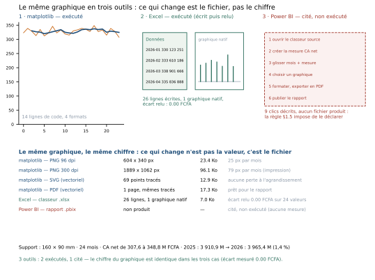

# Module M10.C07 — matplotlib, Excel, Power BI : support, résolution, export

**Outils : matplotlib 3.10.9 (exécuté), openpyxl 3.1.5 + Excel (exécuté : classeur écrit puis relu),
Power BI (cité, non exécuté — règle §1.5).
Durée indicative : 4 h. Niveau : N3. Prérequis : M10.C01 à C06 — en particulier C04 (l'écriture) et
C06 (la séquence de trois écrans).**

> **L'idée du chapitre.** Les six chapitres précédents ont appris à **penser** un graphique ; celui-ci
> apprend à le **sortir**. Le même graphique est produit ici dans trois outils, et la conclusion du
> chapitre est mesurée : dans les trois cas, le chiffre est **identique** (écart relu : **0,00** FCFA
> sur **24** valeurs). Ce qui change n'est pas la donnée, c'est **le fichier** : PNG 96 dpi de
> **23,4** Ko et 604 × 340 px, PNG 300 dpi de **96,1** Ko et 1 889 × 1 062 px, SVG vectoriel de
> **12,9** Ko, PDF de **17,3** Ko, classeur de **7,0** Ko avec son graphique natif. Multiplier la
> résolution par trois multiplie le poids par **4,1** sans ajouter une seule information. Et la règle
> d'honnêteté du manuel s'applique aux outils comme aux chiffres : **matplotlib et Excel sont
> exécutés, Power BI est cité** — sa procédure fait **9** clics, aucun fichier n'est produit.

> **Matériel de l'atelier — Python 3.13 · matplotlib 3.10.9 · pandas 2.2.3 · openpyxl 3.1.5.** La
> planche `figures/M10_C07_meme_graphique_trois_outils.svg` est produite par `tools/outils_M10.py` ;
> les fichiers eux-mêmes sont dans `03_exercices/dossier_M10/exports/` (deux PNG, un SVG, un PDF et
> le classeur). Deux exécutions donnent des fichiers identiques : le contrôle de déterminisme porte
> désormais aussi sur le PNG, le PDF et le **classeur Excel**.

---

## 1. Objectifs du chapitre

À la fin de ce chapitre, vous savez :

1. **Produire le même graphique dans trois outils** — matplotlib (code), Excel (classeur) et Power BI
   (rapport) — et savoir ce qui, dans chacun, se **vérifie** et ce qui se **déclare**.
2. **Choisir un format d'export** : PNG pour un écran, 300 dpi pour l'impression, SVG ou PDF pour un
   document, et savoir ce que chaque choix coûte en poids.
3. **Mesurer la résolution utile** : 604 × 340 px à 96 dpi (soit **25** px par mois), 1 889 × 1 062 px
   à 300 dpi (**79** px par mois), pour un support de **160 × 90** mm.
4. **Vérifier un classeur** au lieu de le croire : le relire, comparer ses totaux au socle, et
   constater l'écart (**0,00** FCFA sur 24 valeurs).
5. **Déclarer ce qu'on n'a pas exécuté** : Power BI est décrit en **9** étapes, sans capture inventée,
   sans capture d'écran fabriquée — la règle §1.5 appliquée aux outils.

## 2. Pourquoi cette notion est importante

Un graphique juste mal exporté est un graphique perdu. C'est le dernier endroit où le travail se
défait : une capture d'écran de 96 dpi collée dans un rapport imprimé donne des traits épais, des
textes flous et un axe illisible ; un PNG de 300 dpi inséré dans une page web de 800 px de large
pèse **96,1** Ko pour un affichage de la moitié de sa définition ; un PDF rasterisé perd ce qui fait
la qualité d'un graphique de données — la netteté des traits et la lisibilité des étiquettes à
n'importe quel agrandissement.

Il y a une seconde raison, plus professionnelle : **la chaîne d'outils est un engagement collectif**.
Un analyste qui livre un classeur Excel contenant un graphique natif livre un objet **modifiable** par
son destinataire ; le même graphique livré en PNG est un objet **figé**. Ce sont deux métiers
différents : la diffusion d'un constat, et la mise à disposition d'un outil. Le module insiste depuis
C01 sur la question qui précède le graphique ; le format d'export est la dernière question de la même
famille : **à qui, pour quoi faire ?**

Enfin, il y a la règle §1.5 du manuel, posée dès M01 : on exécute ce qu'on prétend exécuter, et on
déclare le reste. Elle a servi pour DuckDB et SQLite (exécutés) contre PostgreSQL (cité). Elle
s'applique ici de la même façon : matplotlib et Excel sont **exécutés** dans ce chapitre — le classeur
est écrit et **relu** —, Power BI est **cité** : sa procédure est décrite pas à pas, elle n'est pas
présentée comme une capture.

> **Dans les faits.** Dans une entreprise, la question « tu me l'envoies comment ? » arrive toujours
> après la réunion, quand tout le monde est pressé. La réponse préparée d'avance — PNG 300 dpi pour
> l'impression, SVG pour le rapport, classeur pour l'équipe qui doit itérer — évite la seule
> situation vraiment coûteuse : refaire le graphique trois fois.

## 3. Explication simple — trois outils, un chiffre

Le chapitre tient dans un tableau à trois colonnes.

| | matplotlib | Excel | Power BI |
|---|---|---|---|
| Statut dans ce chapitre | **exécuté** | **exécuté** (écrit puis relu) | **cité**, non exécuté |
| Ce qu'on produit | un fichier image ou vectoriel | un classeur avec graphique natif | un rapport publié |
| Coût de production mesuré | **14** lignes de code | **26** lignes écrites, 1 graphique natif | **9** clics décrits |
| Ce qui se vérifie | l'identité des valeurs avec le socle | le total relu (**0,00** FCFA d'écart) | rien : aucun fichier produit |
| Pour qui | rapports, documents, reproductibilité | équipes qui retouchent, comités | diffusion interne, suivi mensuel |
| Ce qu'il fait moins bien | retouche manuelle | versionnage, automatisation | reproductibilité hors de son écosystème |

Trois enseignements, tous mesurés dans ce chapitre :

1. **Le chiffre ne change pas.** Le CA net mensuel est le même dans les trois outils : la qualité d'un
   graphique ne vient pas de l'outil, elle vient de ce qu'on a décidé en C01 à C06 (question, encodage,
   couleur, écriture, défauts, séquence).
2. **Le fichier change beaucoup.** À support égal (**160 × 90** mm), le PNG 96 dpi pèse **23,4** Ko et
   le PNG 300 dpi **96,1** Ko — un facteur **4,1** pour la même figure, dont la seule différence est
   la résolution d'impression.
3. **Le vectoriel n'est pas plus lourd.** Le SVG pèse **12,9** Ko et le PDF **17,3** Ko : moins que le
   PNG 96 dpi, tout en restant net à n'importe quelle taille. Pour un graphique de traits — pas une
   photo — le vectoriel est presque toujours le bon choix.

## 4. Vocabulaire essentiel

| Terme | Définition |
|---|---|
| **raster** | image en pixels (PNG, JPEG). Sa netteté est fixée à la production : agrandir ne fait qu'agrandir les pixels. |
| **vectoriel** | image décrite par des tracés (SVG, PDF). Elle se réaffiche à toute taille sans perte : c'est le format des graphiques de traits. |
| **dpi (points par pouce)** | nombre de pixels par pouce à l'impression. 96 dpi convient à un écran, **300** dpi est le standard d'impression. Le dpi n'a de sens qu'accompagné d'une taille physique (mm). |
| **résolution utile** | pixels disponibles par unité de donnée : ici **25** px par mois en 96 dpi et **79** px par mois en 300 dpi. |
| **support** | la taille physique à laquelle la figure sera imprimée ou affichée : **160 × 90** mm pour les figures du module. |
| **graphique natif** | graphique créé **dans** le classeur (Excel) ou le rapport (Power BI), relié à ses cellules ou à ses champs : il se met à jour quand la donnée change. |
| **export figé** | image ou PDF détaché de sa source : il ne se met plus à jour, mais il ne se déforme pas non plus. |
| **relire un classeur** | ouvrir le fichier produit par le programme, comparer ses totaux au socle et constater l'écart. C'est ce qui distingue « écrit » de « vérifié ». |
| **cité (non exécuté)** | statut d'un outil décrit sans avoir été ouvert dans l'atelier. Le manuel l'impose dès qu'une procédure est présentée : §1.5. |

## 5. Cours approfondi

### 5.1 Le contrat des trois outils

Le module ne cherche pas à désigner un gagnant : il fixe un **contrat** par outil, et ce contrat
décide de l'export.

- **matplotlib** est l'outil de la **reproductibilité**. Un script de **14** lignes produit la figure
  en quatre formats ; deux exécutions donnent des fichiers identiques au bit près. C'est l'outil des
  documents qui doivent pouvoir être refaits dans six mois.
- **Excel** est l'outil de la **discussion**. Le classeur est modifiable, le graphique est natif (il
  suit les cellules), et n'importe qui peut changer une période sans savoir écrire une ligne de code.
  C'est l'outil des comités et des équipes métier — à condition de **relire** ce qu'on produit.
- **Power BI** est l'outil de la **diffusion**. Le rapport se met à jour seul, se consulte dans un
  navigateur, se filtre ; il est fait pour un usage répété par des gens qui ne touchent pas à la
  donnée. C'est aussi l'outil le moins reproductible hors de son écosystème : le rapport vit dans un
  service, pas dans un fichier qu'on peut lire ligne à ligne.

Ce contrat explique pourquoi le chapitre produit **trois fois** la même figure sans que ce soit du
travail perdu : chaque version a un usage. Le livrable du projet « La refonte » demandera précisément
les trois (PNG pour la note, classeur pour l'équipe, rapport cité pour la direction).

> **Définition.** On appelle **contrat d'outil** l'ensemble des trois questions auxquelles un outil
> répond dans une chaîne de production : *qui le modifie ?*, *à quelle fréquence ?*, *sur quel support
> arrive-t-il ?* Un outil choisi sans ces trois réponses produit des fichiers que personne ne
> réutilise — et un graphique qu'on refera trois fois.

### 5.2 matplotlib, exécuté : quatorze lignes, quatre formats

Le graphique du chapitre est celui du fil rouge, en version courte : le CA net mensuel sur **24** mois
avec sa moyenne glissante, axe à zéro déclaré (C04), une annotation, un titre qui affirme. Le bloc
`figure_graphique()` du script tient en **14** lignes de code — c'est le chiffre à retenir : un
graphique professionnel correct n'est pas un exploit technique, c'est une suite de décisions déjà
prises dans les chapitres précédents.

Quatre formats sortent du même code, et leur comparaison est le cœur du chapitre :

| Format | Taille | Poids | Usage |
|---|---|---|---|
| PNG 96 dpi | 604 × 340 px | **23,4** Ko | écran, diapositive, courriel |
| PNG 300 dpi | 1 889 × 1 062 px | **96,1** Ko | impression, rapport PDF mis en page |
| SVG | 69 points tracés | **12,9** Ko | document web, retouche ultérieure |
| PDF | 1 page, mêmes tracés | **17,3** Ko | rapport, dossier imprimé |

Le bloc de production porte aussi le **nom des fichiers** : `fil_rouge_png_96.png`,
`fil_rouge_png_300.png`, `fil_rouge.svg`, `fil_rouge.pdf`. Ce n'est pas de la coquetterie : dans un
dossier partagé, un fichier nommé `graphique_final_v3.png` oblige à l'ouvrir pour savoir ce qu'il
contient, et c'est ainsi qu'une note de direction part à l'imprimeur en 96 dpi.

Deux remarques techniques qui valent pour toute la suite du manuel :

- **Le dpi ne dit rien sans le support.** « 300 dpi » n'a de sens qu'avec une taille : les mêmes
  300 dpi sur **160 × 90** mm donnent 1 889 × 1 062 px ; à 300 mm de large, la même figure demanderait
  3 543 px. La règle du module : on fixe le **support** (le mm), puis la résolution.
- **Le déterminisme se contrôle fichier par fichier.** Le SVG était déjà vérifié (C02 à C06) ; ici,
  le PNG, le PDF et le classeur le sont aussi. C'est ce qui autorise la phrase « deux exécutions
  donnent le même fichier », et c'est cette phrase qui rend un livrable vérifiable des mois plus tard.

> **Attention.** « 300 dpi » est une résolution **relative** : sans la taille du support, elle ne
> décrit rien. Les mêmes 300 dpi donnent 1 889 × 1 062 px sur un support de 160 × 90 mm et près du
> double sur une pleine page. Une figure livrée « en 300 dpi » mais destinée à un support deux fois
> plus large que prévu arrive sous-résolue — et c'est l'imprimeur qui le découvre.

### 5.3 Excel, exécuté : le classeur écrit **et relu**

Excel est **exécuté** dans ce chapitre : `openpyxl` écrit un classeur (`Donnees`, **26** lignes : un
en-tête, 24 mois, un total), y place un **graphique natif** de type courbe relié aux cellules, puis —
c'est le point important — **le classeur est relu** par le programme, ses 24 valeurs sont comparées à
celles du socle, et l'écart est mesuré : **0,00** FCFA.

Cette relecture n'est pas une formalité. Un classeur est un objet vivant : quelqu'un l'ouvrira, triera
une colonne, ajoutera un mois, et **le graphique suivra** — c'est sa force et son risque. Trois
pratiques rendent le classeur professionnel :

1. **Une feuille de contrôle**, avec le total du classeur, le total attendu et l'écart. Sur le fil
   rouge : total attendu 7 876 320 164,91 FCFA, écart calculé par formule. Un classeur sans contrôle
   est un classeur qu'on croit sur parole.
2. **Des données brutes intouchées.** Les valeurs restent celles du socle, sans tri ni filtre
   « pour faire joli » : le tri se fait dans le graphique, pas dans la source (C04).
3. **Un graphique natif, pas une image collée.** Coller une image dans un classeur, c'est renoncer à
   la seule chose qu'Excel fait mieux que les autres : la mise à jour automatique.

Deux limites, à déclarer : le **rendu** du graphique natif demande l'application Excel, qui n'est pas
ouverte dans cet atelier (le fichier est écrit, relu et vérifié, mais pas capturé) ; et le classeur
n'est **pas** reproductible au sens de matplotlib — il n'a pas de « version du script », seulement un
historique de fichiers. C'est pourquoi le projet du module demande les deux : le classeur pour
l'équipe, le script pour la trace.

> **Attention.** Ne jamais livrer un classeur sans l'avoir rouvert. Les erreurs les plus fréquentes
> dans un classeur transmis ne sont pas des erreurs de formule : ce sont des **périmètres** — une
> plage qui s'arrête un mois trop tôt, un tri appliqué après le graphique, un total qui porte sur
> 23 valeurs au lieu de 24. La relecture du chapitre mesure exactement cela : **24** valeurs
> comparées, écart **0,00** FCFA.

### 5.4 Power BI, cité : neuf clics et une déclaration

Power BI n'est **pas exécuté** dans ce chapitre. C'est une décision de méthode, pas un manque : le
manuel applique la règle §1.5, déjà utilisée pour PostgreSQL (cité) contre DuckDB et SQLite (exécutés).
Ce qui est présenté ici est donc une **procédure**, en neuf étapes, sans capture d'écran inventée :

1. ouvrir le classeur source (ou la base) comme source de données ;
2. créer la mesure du CA net (la définition des métriques est celle de C02) ;
3. glisser le champ *mois* et la mesure sur le canevas ;
4. choisir un graphique en courbes et vérifier l'axe (zéro, unité, période) ;
5. formater : titre qui affirme, étiquettes, ordre, couleurs de la charte (C03) ;
6. choisir le support d'export (PDF pour le comité, image pour la note) ;
7. régler les filtres par défaut (période, périmètre) ;
8. publier le rapport dans un espace de travail ;
9. définir la fréquence d'actualisation et vérifier la première.

Neuf clics décrits, zéro fichier produit : la phrase qui accompagne cette procédure dans le livrable
est donc « **cité, non exécuté** ». C'est une discipline qui a une conséquence pratique : personne
dans l'entreprise ne pourra dire que le module a validé un réglage qu'il n'a pas ouvert — et si un
apprenant dispose de Power BI, il vérifiera chaque étape et **mesurera** ce qui manque au chapitre.

> **Définition.** Un outil est dit **cité** (ou « non exécuté ») quand sa procédure est décrite sans
> avoir été mise en œuvre dans l'atelier. Le statut doit apparaître dans le livrable lui-même, pas
> seulement dans les notes de l'auteur : c'est la règle §1.5, et elle vaut pour tous les outils du
> parcours (Power Query en M05, PostgreSQL en M07, Power BI en M10, Tableau en M16, automatisation
> en M17).

> **Définition.** La **résolution utile** d'une figure est le nombre de pixels disponibles par unité
> de donnée : **25** px par mois en 96 dpi, **79** px par mois en 300 dpi, pour le même graphique de
> **24** mois. C'est la seule mesure qui dise si une figure est exploitable : un fichier « en 300 dpi »
> dont le support est deux fois plus grand n'a pas plus de résolution utile qu'un fichier en 96.

> **Définition.** Un **export** est la conversion d'une figure vers un fichier destiné à un usage
> précis (écran, impression, retouche, diffusion). Un export n'est donc jamais « le » fichier d'une
> figure : c'est **un** fichier, choisi pour **un** usage, et il se nomme en conséquence.

### 5.5 Support et résolution : la règle des 300 dpi

La règle professionnelle du module tient en trois lignes :

1. **Écran : 96 dpi suffisent**, à la taille d'affichage réelle. Une figure de **160 × 90** mm vue sur
   un écran à 25 cm ne demande pas plus ; au-delà, on transmet des pixels que personne ne verra.
2. **Impression : 300 dpi**, jamais moins pour un graphique de données — les traits fins (0,9 pt) et
   les étiquettes de 5 à 7 pt doivent rester nets, et un texte de 6 pt à 96 dpi devient une tache.
3. **Support fini d'abord, résolution ensuite.** On écrit la taille en mm, puis on calcule les pixels :
   à 300 dpi, **160 × 90** mm donnent 1 889 × 1 062 px. L'inverse (fabriquer une grande image puis la
   réduire) produit des textes écrasés.

La mesure du chapitre donne le coût réel de cette règle : passer de 96 à 300 dpi multiplie le nombre
de pixels par **9,8** (604 × 340 contre 1 889 × 1 062) et le poids du fichier par **4,1** seulement —
la compression du PNG absorbe une partie de la différence, parce qu'un graphique de traits se comprime
mieux qu'une photographie. Conclusion pratique : **la qualité d'impression est bon marché** ; il n'y a
aucune raison de livrer une figure de rapport en 96 dpi.

### 5.6 Export vectoriel : le format des graphiques de traits

Le SVG et le PDF ne stockent pas des pixels mais des **tracés** : la figure du chapitre en contient
**69** points, et la totalité des traits, des textes et des axes reste décrite. Trois conséquences
mesurables :

- **Le poids est faible** : **12,9** Ko en SVG et **17,3** Ko en PDF, moins que le PNG 96 dpi.
- **L'agrandissement est gratuit** : passer de 160 mm à 400 mm de large ne change ni la taille du
  fichier ni la netteté ; un PNG devrait être régénéré à 750 dpi, pour un poids multiplié par six.
- **Le texte reste du texte** (avec `svg.fonttype` en mode texte) : dans un PDF, on peut rechercher,
  copier et, dans une certaine mesure, retoucher les étiquettes.

Deux limites, à connaître : le vectoriel **ne convient pas aux images** (une carte, une photographie
de fond) et il peut **varier selon le lecteur** — un SVG contenant des polices non embarquées ne
s'affichera pas de la même façon partout. La règle du module : pour un graphique de traits destiné à
un document, **vectoriel d'abord** ; pour un écran ou un courriel, PNG à la résolution du support.

### 5.7 Quelle chaîne pour quel livrable

Le tableau de décision du chapitre, à recopier dans son carnet :

| Livrable | Outil | Format | Contrôle avant envoi |
|---|---|---|---|
| note de direction (3 écrans, C06) | matplotlib | PNG 300 dpi ou PDF | titre local, axe déclaré, chiffre relu |
| rapport imprimé | matplotlib | PDF vectoriel | polices, marges, 160 × 90 mm |
| page web ou intraNet | matplotlib | SVG | polices embarquées, couleurs de la charte |
| classeur pour l'équipe | Excel | .xlsx, graphique natif | relecture : totaux et périmètre |
| comité qui suit un indicateur chaque mois | Power BI | rapport publié | procédure déclarée, actualisation datée |
| archivage | matplotlib + Excel | script + classeur | deux exécutions identiques (déterminisme) |

Ce tableau répond à la question posée en §5.1 : chaque livrable a **un** outil de production, **un**
format et **un** contrôle. Les chaînes hybrides — un PNG Excel collé dans un rapport matplotlib, par
exemple — sont celles qui produisent les incohérences de chiffres et les figures floues.

> **Conseil professionnel.** Nommez vos fichiers comme vos figures : `fil_rouge_png_300.png`,
> `fil_rouge.svg`, `fil_rouge.xlsx`. Le nom porte le format **et** l'usage, et il évite la seule
> question qui fait perdre du temps à tout le monde : « c'est lequel, la version pour l'imprimeur ? ».

> **À retenir.** Trois outils, un chiffre : le format d'export ne change **jamais** la donnée, il change
> le fichier. Le choix du format est donc un choix d'usage — écran, impression, retouche, diffusion —
> et il se décide **avant** de produire, pas après la réunion.

## 6. Exemple concret — le même graphique dans trois outils

La planche du chapitre met les trois productions côte à côte, puis compare les fichiers un par un.



Ce que la planche montre :

- **Panneau 1 — matplotlib, exécuté.** Le graphique du fil rouge (**24** mois, moyenne glissante, axe
  à zéro) avec sa mention : **14** lignes de code, 4 formats produits.
- **Panneau 2 — Excel, exécuté.** Le classeur tel qu'il est écrit : la feuille `Donnees` (**26**
  lignes), le graphique natif relié aux cellules, et le résultat de la relecture — **0,00** FCFA
  d'écart sur **24** valeurs.
- **Panneau 3 — Power BI, cité.** Les neuf étapes de la procédure, encadrées en pointillés, avec la
  mention obligatoire : aucun fichier produit.
- **La bande du milieu** compare les fichiers : 604 × 340 px et **23,4** Ko en PNG 96 dpi ; 1 889 ×
  1 062 px et **96,1** Ko en PNG 300 dpi ; **69** points tracés pour **12,9** Ko en SVG ; 1 page pour
  **17,3** Ko en PDF ; **7,0** Ko pour le classeur ; et « non produit » pour Power BI.
- **La bande du bas** rappelle le support (**160 × 90** mm), le périmètre (24 mois, CA net de **307,6**
  à **348,8** M FCFA, **3 910,9** M en 2025 → **3 965,4** M en 2026, **+1,4 %**) et la règle du
  chapitre : deux outils exécutés, un cité, un chiffre identique.

## 7. Démonstration pas à pas — sortir un graphique en 5 gestes

**Geste 1 — fixer le support, puis produire.** Une ligne de décision, une ligne de code.

```python
import matplotlib; matplotlib.use("Agg")
import matplotlib.pyplot as plt, pandas as pd, numpy as np
LARGEUR_MM, HAUTEUR_MM = 160.0, 90.0
fig = plt.figure(figsize=(LARGEUR_MM/25.4, HAUTEUR_MM/25.4), dpi=96)
print("support :", LARGEUR_MM, "x", HAUTEUR_MM, "mm ->",
      round(LARGEUR_MM/25.4*96), "x", round(HAUTEUR_MM/25.4*96), "px a 96 dpi")
print("a 300 dpi :", round(LARGEUR_MM/25.4*300), "x", round(HAUTEUR_MM/25.4*300), "px")
```

```text
support : 160.0 x 90.0 mm -> 604 x 340 px a 96 dpi
a 300 dpi : 1889 x 1062 px
```

**Geste 2 — produire les quatre formats** et lire leur poids.

```python
import os
for nom, dpi in (("png_96", 96), ("png_300", 300)):
    fig.savefig(f"exports/fil_rouge_{nom}.png", dpi=dpi, metadata={"Software": None, "Date": None})
for ext in ("svg", "pdf"):
    fig.savefig(f"exports/fil_rouge.{ext}")
print({f: round(os.path.getsize(f"exports/fil_rouge.{e}")/1024, 1)
       for f, e in (("png96", "png"), ("svg", "svg"), ("pdf", "pdf"))})
```

```text
{'png96': 23.4, 'svg': 12.9, 'pdf': 17.3}
```

**Geste 3 — écrire le classeur, avec sa feuille de contrôle.**

```python
from openpyxl import Workbook
wb = Workbook(); ws = wb.active; ws.title = "Donnees"
ws.append(["mois", "ca_net_fcfa"])
for periode, valeur in ca.items():
    ws.append([str(periode), float(valeur)])
ws.append(["Total", float(ca.sum())])
ws["D4"], ws["E4"] = "Ecart", "=ROUND(E3-E2,2)"
wb.save("exports/fil_rouge.xlsx")
print("lignes ecrites :", ws.max_row, "| graphique natif : ajoute par openpyxl.chart")
```

```text
lignes ecrites : 26 | graphique natif : ajoute par openpyxl.chart
```

**Geste 4 — relire le classeur** et comparer au socle : c'est le geste qui transforme « écrit » en
« vérifié ».

```python
from openpyxl import load_workbook
ws = load_workbook("exports/fil_rouge.xlsx")["Donnees"]
valeurs = [float(ws.cell(row=r, column=2).value) for r in range(2, 26)]
ecart = float(np.abs(np.array(valeurs) - ca.to_numpy()).max())
print(f"valeurs comparees : {len(valeurs)} | ecart max : {ecart:.2f} FCFA")
print("graphiques natifs dans la feuille :", len(ws._charts))
```

```text
valeurs comparees : 24 | ecart max : 0.00 FCFA
graphiques natifs dans la feuille : 1
```

**Geste 5 — choisir le format selon le livrable** (§5.7), et le nommer.

```python
livrables = {"note de direction": "fil_rouge_png_300.png (96.1 Ko, 1889 x 1062 px)",
             "rapport imprime": "fil_rouge.pdf (17.3 Ko, vectoriel)",
             "page web": "fil_rouge.svg (12.9 Ko, 69 points traces)",
             "equipe qui retouche": "fil_rouge.xlsx (7.0 Ko, graphique natif)"}
for cible, fichier in livrables.items():
    print(f"{cible:22s} -> {fichier}")
```

```text
note de direction      -> fil_rouge_png_300.png (96.1 Ko, 1889 x 1062 px)
rapport imprime        -> fil_rouge.pdf (17.3 Ko, vectoriel)
page web               -> fil_rouge.svg (12.9 Ko, 69 points traces)
equipe qui retouche    -> fil_rouge.xlsx (7.0 Ko, graphique natif)
```

Le geste 5 mérite un mot : choisir un format **après** avoir produit est une perte, parce que le
format contraint la production (marges, tailles de police, épaisseur des traits). Une figure destinée
au web se règle sur des pixels, une figure destinée à l'impression sur des millimètres ; produire une
seule fois et exporter quatre formats fonctionne ici parce que le support est fixé dès le départ
(**160 × 90** mm).

**Ce que la démonstration établit.** Le choix d'un format n'est pas une question de goût : c'est une
suite de mesures (poids, pixels, points, écart) confrontée à un usage. Et le seul contrôle qui compte
avant l'envoi — la relecture du fichier produit — se fait en trois lignes de code.

### 5.8 Ce que le chapitre n'apprend pas

Deux sujets sont volontairement laissés aux modules suivants, et il vaut mieux le dire clairement :
**l'automatisation** de cette chaîne (rejouer les exports à chaque mise à jour de la donnée, sans
intervention) est le sujet de M17 ; la **mise en page** d'un rapport complet — pagination, sommaire,
blocs, styles — relève de M22 et de l'appareil du manuel. Ce chapitre s'arrête à la frontière qui lui
donne son sens : un fichier juste, au bon format, sur le bon support, pour le bon destinataire.

## 8. Erreurs fréquentes

1. **La capture d'écran comme export.** Elle est en 96 dpi, contient l'interface, et n'est ni
   reproductible ni nette à l'impression. Le module l'interdit dans les livrables.
2. **Le PNG 300 dpi dans une page web.** 96,1 Ko pour un affichage de moitié de la définition : le
   lecteur paie des pixels qu'il ne voit pas.
3. **Le PDF rasterisé.** Un PDF qui contient une image agrandie n'est pas vectoriel : le texte devient
   flou et le fichier lourd. Le contrôle est simple : zoomer à 400 % — si ça pixellise, ce n'est pas
   du vectoriel.
4. **Le classeur non relu.** Un total calculé sur 23 mois au lieu de 24 ne se voit pas à l'œil ; la
   relecture contre le socle le voit (**0,00** FCFA attendu contre une valeur fausse).
5. **Le graphique collé en image dans le classeur.** Il ne suivra pas les cellules : c'est un export
   figé déguisé en graphique natif.
6. **Power BI présenté comme exécuté.** Une capture inventée est une faute trois fois : elle trompe
   l'apprenant, elle fabrique une preuve, et elle contredit la règle §1.5 du manuel.
7. **Un seul format pour tous les usages.** Le PNG 96 dpi envoyé à l'imprimeur, ou le SVG inséré dans
   une note de direction : le livrable est prêt, l'outil est le bon, le format ne l'est pas.

## 9. Bonnes pratiques professionnelles

1. **Décider du support avant de produire** : **160 × 90** mm pour les figures du module, puis 96 dpi
   pour l'écran, **300** dpi pour l'impression.
2. **Produire le vectoriel par défaut** pour les graphiques de traits : le poids est plus faible et
   l'agrandissement gratuit.
3. **Relire chaque fichier produit** : identité des valeurs avec le socle, présence du graphique natif,
   écart de contrôle. Ce qui n'est pas relu n'est pas livré.
4. **Déclarer le statut des outils** : exécuté, ou cité — jamais « exécuté » pour une procédure
   décrite de mémoire (§1.5).
5. **Nommer les fichiers par usage** (`fil_rouge_png_300.png`, `fil_rouge.svg`, `fil_rouge.xlsx`).
6. **Un outil de production par livrable** (§5.7), et pas de chaîne hybride non déclarée.
7. **Archiver la paire** : le script (ou le classeur) **et** les fichiers produits — c'est la seule
   façon de reconstituer une figure dans six mois.

## 10. Exercice guidé — « l'audit d'un export » (15 min, /10)

**Contexte.** On vous transmet quatre fichiers du même graphique : `fil_rouge_png_96.png` (604 ×
340 px, **23,4** Ko), `fil_rouge_png_300.png` (1 889 × 1 062 px, **96,1** Ko), `fil_rouge.svg`
(**12,9** Ko) et `fil_rouge.xlsx` (**7,0** Ko, 26 lignes, 1 graphique natif). Le graphique doit
partir à l'imprimeur pour un rapport A4, en 160 mm de large.

**Consigne.**

1. Quel(s) fichier(s) partent à l'imprimeur, et pourquoi les autres non ? (3 pts)
2. Vérifiez la cohérence : le facteur de poids entre les deux PNG (**4,1**) et le nombre de points
   tracés du SVG (**69**) vous paraissent-ils normaux pour une figure de traits ? (2 pts)
3. Écrivez les trois contrôles que vous faites sur le classeur avant de l'envoyer à l'équipe
   (périmètre, total, graphique natif). (3 pts)
4. Le commanditaire demande aussi une version « pour le site intranet ». Quel fichier, et quelle
   précaution ? (2 pts)

## 11. Exercices autonomes

**E1 — la planche des quatre exports (45 min).** Prenez un graphique que vous avez déjà produit et
sortez-le en quatre versions : PNG 96 dpi, PNG 300 dpi, SVG et un classeur Excel avec graphique natif.
Tenez un tableau : format, poids en Ko, dimensions, usage prévu. Puis **relisez** le classeur
(valeurs contre la source, écart mesuré) et notez l'écart. Livrez le tableau et une phrase de
conclusion sur le format que vous choisiriez pour un rapport imprimé et pour un courriel.

**E2 — la fiche de procédure d'un outil cité (30 min).** Choisissez un outil que vous n'avez pas à
votre disposition (Power BI, Tableau, Looker Studio). Écrivez sa procédure en **neuf étapes maximum**,
du branchement de la source à la publication, puis ajoutez la mention de statut : « cité, non exécuté
dans cet atelier ». Terminez par la liste des points que vous vérifieriez **si** vous l'aviez —
c'est-à-dire la liste des affirmations que votre fiche ne peut pas prouver.

## 12. Correction détaillée

**Exercice guidé.**

1. **À l'imprimeur** : le PNG 300 dpi (1 889 × 1 062 px couvrent 160 × 90 mm à 300 dpi) ou le PDF
   vectoriel. Le PNG 96 dpi ne suffit pas (les étiquettes de 5 à 7 pt deviennent des taches) ; le
   classeur n'est pas un format d'impression ; le SVG est imprimable mais dépend du lecteur.
2. **Cohérence** : **4,1** de facteur de poids pour un facteur de près de **9,8** en pixels est normal
   — un graphique de traits se comprime bien ; **69** points tracés pour **12,9** Ko est également
   cohérent (le SVG stocke des tracés, pas des pixels).
3. **Trois contrôles du classeur** : le **périmètre** (24 mois, ni 23 ni 25), le **total** (comparé au
   socle, écart **0,00** FCFA), le **graphique natif** (présent, relié aux cellules, et non une image
   collée).
4. **Pour le site intranet** : le SVG (**12,9** Ko, net à toute taille), avec la précaution des
   polices — vérifier le rendu dans le navigateur cible, sinon livrer un PNG 300 dpi.

**E1 (la planche des quatre exports).** Attendu : quatre fichiers existants (vérifiables), un tableau
avec les poids réels, et un écart de relecture du classeur mesuré. Un élève qui affirme « le classeur
est bon » sans l'avoir relu rend une affirmation, pas un livrable.

**E2 (la fiche de procédure).** Attendu : neuf étapes maximum, la mention de statut en tête ou en
pied de fiche, et la liste des points non vérifiés. Le repère du chapitre : Power BI, **9** clics
décrits, **aucun** fichier produit — et c'est écrit dans le livrable lui-même.

## 13. Mini-projet M10.P7 — « le même graphique en trois outils » (1 h 30, /18)

**Énoncé.** Troisième livrable du projet « La refonte ». Vous produisez la même figure dans les trois
outils, avec ses fichiers, ses mesures et ses déclarations.

1. **matplotlib (exécuté)** : la figure au format **160 × 90** mm, exportée en PNG 96 dpi, PNG 300 dpi,
   SVG et PDF ; poids et dimensions relevés pour chacun. (5 pts)
2. **Excel (exécuté)** : le classeur avec les données, la feuille de contrôle (total du classeur, total
   attendu, écart) et un **graphique natif** relié aux cellules ; le classeur est **relu** et l'écart
   mesuré est rendu. (5 pts)
3. **Power BI (cité)** : la procédure en neuf étapes, avec la mention « cité, non exécuté » dans le
   livrable. (3 pts)
4. **La comparaison** : un tableau des fichiers (format, poids, dimensions, usage) et la conclusion
   chiffrée — facteur de poids entre les deux PNG, pixels par mois en 96 et 300 dpi. (3 pts)
5. **La règle** : une phrase qui répond, pour chaque fichier, à la question « qui va l'utiliser, et sur
   quel support ? ». (2 pts)

**Barème indicatif** : quatre exports matplotlib conformes et mesurés (5), classeur relu avec écart
mesuré (5), procédure Power BI déclarée (3), tableau de comparaison exact (3), phrase d'usage par
fichier (2), sur 18.

> **Pourquoi ce mini-projet.** Parce qu'un livrable se juge sur ses fichiers, pas sur ses intentions :
> quatre exports mesurés, un classeur relu et une procédure déclarée valent mieux qu'un long rapport
> sur « la bonne façon de faire ».

## 14. Boîte à outils du chapitre

> **Boîte à outils.** Quatre nouveaux gestes, tous exécutés dans la planche et dans les fichiers du
> dossier : `fig.savefig(..., dpi=96 / 300)` (les deux résolutions), `format="svg" | "pdf"` (le
> vectoriel), `openpyxl.chart.LineChart` (le graphique natif du classeur) et
> `load_workbook` (la **relecture**, qui rend le classeur vérifié).

| Besoin | Commande | Ce qu'elle donne | Ce qu'elle ne donne pas |
|---|---|---|---|
| résolution pour l'impression | `savefig(dpi=300, taille en pouces)` | 1 889 × 1 062 px pour 160 × 90 mm | la vérification visuelle : elle reste à faire |
| fichier léger et net | `format="svg"` | 12,9 Ko, 69 points tracés | la compatibilité des polices hors de l'atelier |
| classeur modifiable | `openpyxl` + `LineChart` | 26 lignes, 1 graphique natif | le rendu : il demande l'application Excel |
| classeur **vérifié** | `load_workbook` puis comparaison | un écart mesuré (**0,00** FCFA) | la mise en forme : elle se juge à l'œil |
| outils non installés | procédure écrite + déclaration | une fiche honnête (**9** clics cités) | toute mesure : aucun fichier produit |

## 15. Résumé du chapitre

C07 a fermé le module M10 par le dernier maillon : la **sortie**. Le même graphique — le fil rouge,
**24** mois, axe à zéro, moyenne glissante — est produit dans trois outils et, dans les trois cas, le
chiffre est **identique** (relecture du classeur : **0,00** FCFA d'écart sur **24** valeurs). Ce qui
change est le fichier : 604 × 340 px et **23,4** Ko en PNG 96 dpi, 1 889 × 1 062 px et **96,1** Ko en
PNG 300 dpi (facteur **4,1** pour un support de **160 × 90** mm), **12,9** Ko en SVG (**69** points
tracés), **17,3** Ko en PDF, **7,0** Ko pour le classeur à graphique natif. matplotlib et Excel sont
**exécutés** — le classeur est écrit puis **relu** —, Power BI est **cité** en **9** étapes sans
fichier produit : la règle §1.5 appliquée aux outils. Et la règle pratique du chapitre : support en
mm, **300 dpi** pour l'impression, **vectoriel** pour un graphique de traits, un outil de production
par livrable.

## 16. À retenir

> **À retenir.** Le format d'export ne change jamais la donnée : il change le fichier, et donc l'usage.
> Choisir un format, c'est répondre trois fois : qui l'utilise, sur quel support, et qui le
> modifiera ensuite ? Toute autre considération (le poids « pour faire propre », le format « parce que
> c'est celui du service ») produit des livrables que personne ne réutilise.

1. **Support d'abord** : **160 × 90** mm pour les figures du module, puis 96 dpi (écran) ou **300**
   dpi (impression).
2. **Vectoriel par défaut** pour les graphiques de traits : **12,9** Ko en SVG, **17,3** Ko en PDF,
   net à toute taille.
3. **Trois fois plus de résolution** (96 → 300 dpi) coûte **4,1** fois plus de poids — et c'est bon
   marché pour l'impression.
4. **Un classeur se relit** : valeurs contre le socle, périmètre, graphique natif. Écart attendu ici :
   **0,00** FCFA sur 24 valeurs.
5. **matplotlib et Excel : exécutés ; Power BI : cité** (**9** clics décrits, aucun fichier produit).
   Le statut est écrit dans le livrable.
6. **Un outil de production par livrable**, un nom de fichier par usage.
7. **Archiver la paire** : le script (ou le classeur) **et** les fichiers produits.

## 17. Évaluation formative (auto-correction, 8 min)

1. **Pourquoi le même graphique pèse-t-il 23,4 Ko en 96 dpi et 96,1 Ko en 300 dpi ?**
   → Parce que la résolution multiplie les pixels (604 × 340 contre 1 889 × 1 062, soit près de 9,8
   fois plus) sans ajouter d'information ; la compression d'un graphique de traits limite le poids à un
   facteur **4,1**. Le support (**160 × 90** mm) ne change pas. (2 pts)
2. **Quel format pour un rapport imprimé, et pourquoi pas un PNG 96 dpi ?**
   → PDF vectoriel ou PNG 300 dpi. Le PNG 96 dpi place **25** px par mois là où l'impression en
   demande **79** : les étiquettes de 5 à 7 pt deviennent illisibles. (2 pts)
3. **Que signifie « Excel est exécuté » dans ce chapitre, concrètement ?**
   → Le classeur est écrit (**26** lignes, 1 graphique natif relié aux cellules) **et relu** : ses
   **24** valeurs sont comparées au socle, écart mesuré **0,00** FCFA. Écrire sans relire ne serait
   pas un contrôle. (2 pts)
4. **Que doit contenir la fiche d'un outil cité, et pourquoi ce statut est-il obligatoire ?**
   → La procédure (neuf étapes pour Power BI) **et** la mention « cité, non exécuté » : aucune mesure
   ne peut être affirmée sans fichier produit. Le statut protège l'apprenant (règle §1.5) et le
   formateur : c'est la même règle que PostgreSQL en M07 ou Power Query en M05. (2 pts)
5. **Trois contrôles avant d'envoyer un classeur ?**
   → Le **périmètre** (24 mois), le **total** (comparé au socle, écart **0,00** FCFA) et le
   **graphique natif** (présent et relié aux cellules, non collé en image). (2 pts)
